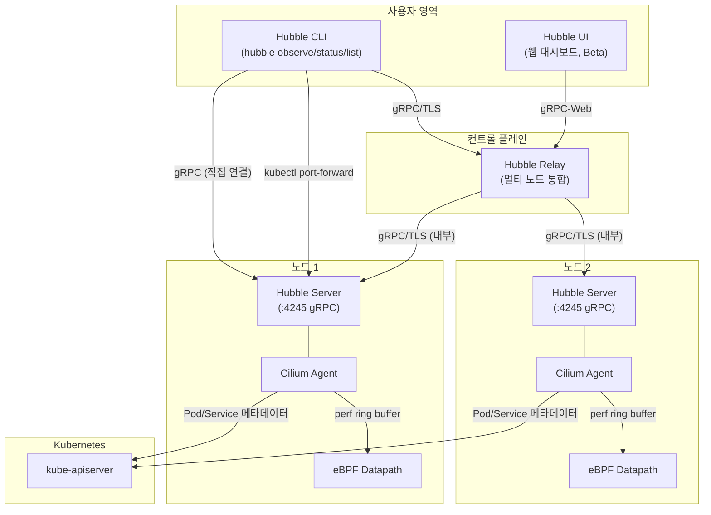
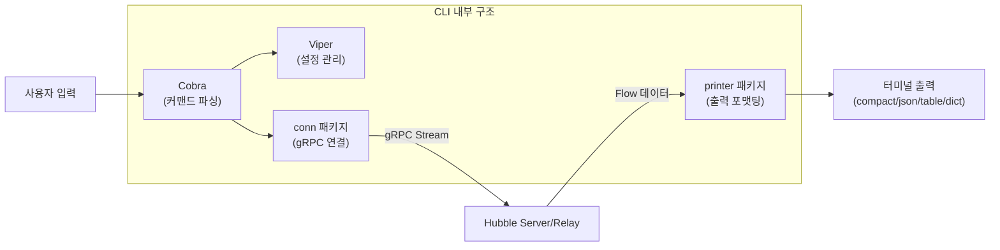
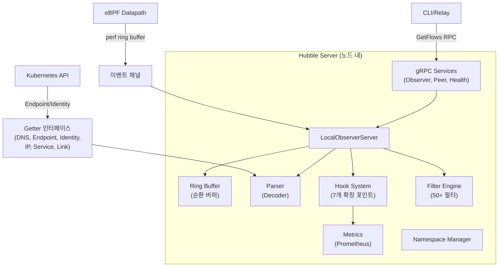
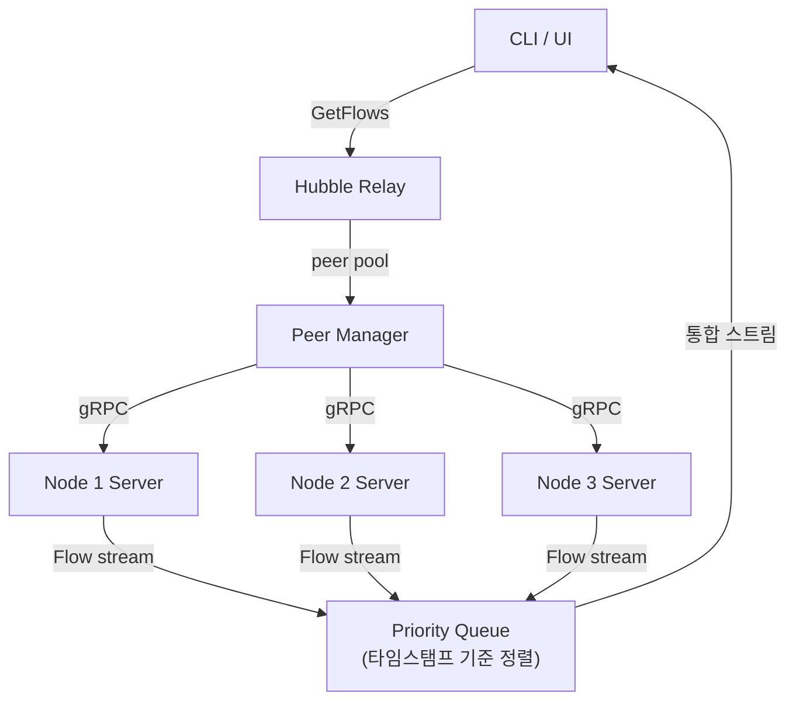
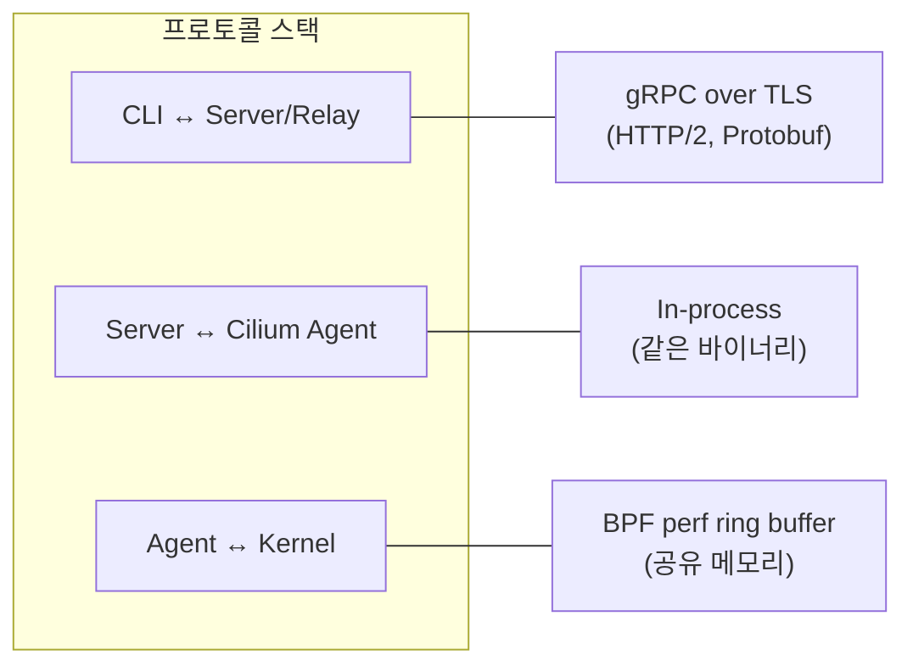
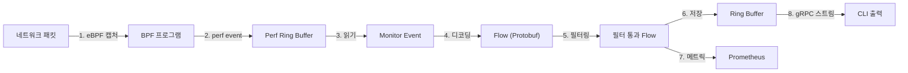

# 02. 시스템 아키텍처 (Architecture & Design)

## 전체 시스템 아키텍처

Hubble은 크게 **4개 계층**으로 구성됩니다: CLI 클라이언트, Relay, Server, Cilium 데이터플레인.



### 왜 이 구조인가?

1. **Server가 각 노드에 내장**: eBPF perf ring buffer는 노드 로컬이므로, 데이터 원천에 가장 가까운 곳에서 파싱/필터링하여 네트워크 오버헤드를 최소화
2. **Relay로 통합**: 클라이언트가 각 노드에 직접 연결할 필요 없이, 단일 진입점에서 클러스터 전체 이벤트를 시간순으로 병합
3. **CLI가 독립 바이너리**: Server 의존성 없이 빌드/배포 가능, 다양한 OS에서 사용 가능

---

## 컴포넌트 상세

### Hubble CLI (이 저장소)



**설계 결정:**
- **Cobra + Viper 조합**: 플래그, 환경변수, 설정파일을 통합 관리. `HUBBLE_` 접두어로 환경변수 자동 매핑
- **gRPC 스트리밍**: `observe --follow` 시 서버 푸시 방식으로 실시간 플로우 수신. HTTP polling 대비 지연 최소화
- **출력 포맷 분리**: Printer 패키지가 데이터 변환과 표시를 담당하여, 새로운 출력 형식 추가가 용이

### Hubble Server



**설계 결정:**
- **Ring Buffer**: 메모리 효율적인 순환 버퍼로 최근 N개 플로우만 유지. 메모리 사용량 예측 가능하고 GC 압력 최소화
- **Hook System**: 메트릭, 필터 등을 플러그인 방식으로 확장. 각 Hook은 `(stop bool, error)` 반환하여 체인 중단 가능
- **Getter 인터페이스**: 파서가 쿠버네티스 메타데이터를 직접 조회하지 않고 인터페이스를 통해 접근. 테스트 용이성과 관심사 분리

### Hubble Relay



**설계 결정:**
- **Priority Queue로 병합**: 각 노드에서 독립적으로 도착하는 플로우를 타임스탬프 기준으로 정렬하여 시간순 통합 스트림 제공
- **NodeStatusEvent 전파**: 노드 연결 상태(CONNECTED, UNAVAILABLE, GONE, ERROR)를 클라이언트에 실시간 전달

---

## 통신 프로토콜



| 구간 | 프로토콜 | 인증 | 이유 |
|------|---------|------|------|
| CLI → Server | gRPC/TLS | TLS 인증서 or Basic Auth | 보안 통신, 양방향 스트리밍 필요 |
| CLI → Server (개발) | gRPC (평문) | 없음 | kubectl port-forward 시 로컬 통신 |
| Server ↔ Agent | In-process | 해당 없음 | Server가 Cilium Agent 프로세스 내에 내장 |
| Agent ↔ Kernel | perf ring buffer | 해당 없음 | 최소 오버헤드의 커널-유저 공간 데이터 전달 |
| Relay → Servers | gRPC/TLS (내부) | mTLS | 클러스터 내부 노드 간 보안 통신 |

---

## 데이터 흐름 개요



1. **eBPF 캡처**: 커널의 네트워크 경로에 삽입된 BPF 프로그램이 패킷 이벤트를 생성
2. **perf event**: BPF 프로그램이 perf ring buffer에 이벤트 기록 (최소 오버헤드)
3. **Monitor 읽기**: Cilium Agent가 perf ring buffer에서 raw 바이트를 읽음
4. **디코딩**: Parser가 raw 바이트를 Flow protobuf 메시지로 변환 (L3/L4/L7 파싱 + K8s 메타데이터 enrichment)
5. **필터링**: whitelist/blacklist 필터 적용
6. **저장**: 순환 버퍼에 저장 (고정 크기, FIFO)
7. **메트릭**: Hook을 통해 Prometheus 카운터/히스토그램 업데이트
8. **전달**: gRPC 스트리밍으로 클라이언트에 전달

---

## 배포 토폴로지

### 단일 노드 모드

```
┌─────────────────────────────┐
│  hubble observe --server    │
│  localhost:4245              │
└──────────┬──────────────────┘
           │ kubectl port-forward
           ↓
┌─────────────────────────────┐
│  Cilium Agent + Hubble      │
│  (단일 노드)                │
└─────────────────────────────┘
```

- 디버깅/개발 시 사용
- `kubectl port-forward`로 로컬 포트를 Hubble에 연결

### 멀티 노드 모드 (Relay)

```
┌──────────────────────┐
│  hubble observe       │
│  --server relay:4245  │
└──────────┬───────────┘
           ↓
┌──────────────────────┐
│  Hubble Relay        │
│  (Deployment)        │
└──┬───────┬───────┬───┘
   ↓       ↓       ↓
┌──────┐┌──────┐┌──────┐
│Node 1││Node 2││Node 3│
│Hubble││Hubble││Hubble│
└──────┘└──────┘└──────┘
```

- 프로덕션 환경 표준 구성
- Relay가 클러스터 전체 이벤트를 통합

---

## 직접 실행해보기 (PoC)

| PoC | 실행 | 학습 내용 |
|-----|------|----------|
| [poc-grpc-streaming](poc-grpc-streaming/) | `cd poc-grpc-streaming && go run main.go` | Server Streaming 패턴 (GetFlows RPC) |
| [poc-relay-merge](poc-relay-merge/) | `cd poc-relay-merge && go run main.go` | Priority Queue로 멀티 노드 Flow 병합 |
| [poc-tls-auth](poc-tls-auth/) | `cd poc-tls-auth && go run main.go` | mTLS/TLS 인증, 인증서 체인, TLS 1.3 강제 |
| [poc-peer-discovery](poc-peer-discovery/) | `cd poc-peer-discovery && go run main.go` | Peer 디스커버리, 연결 상태, 지수 백오프 |
| [poc-grpc-interceptor](poc-grpc-interceptor/) | `cd poc-grpc-interceptor && go run main.go` | gRPC Interceptor 체이닝 (메트릭, 인증, 버전) |
