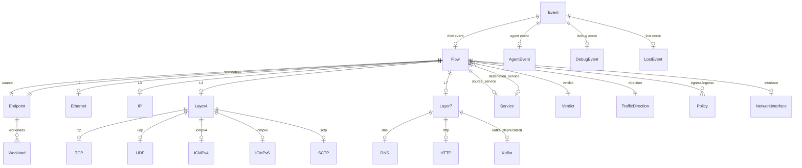
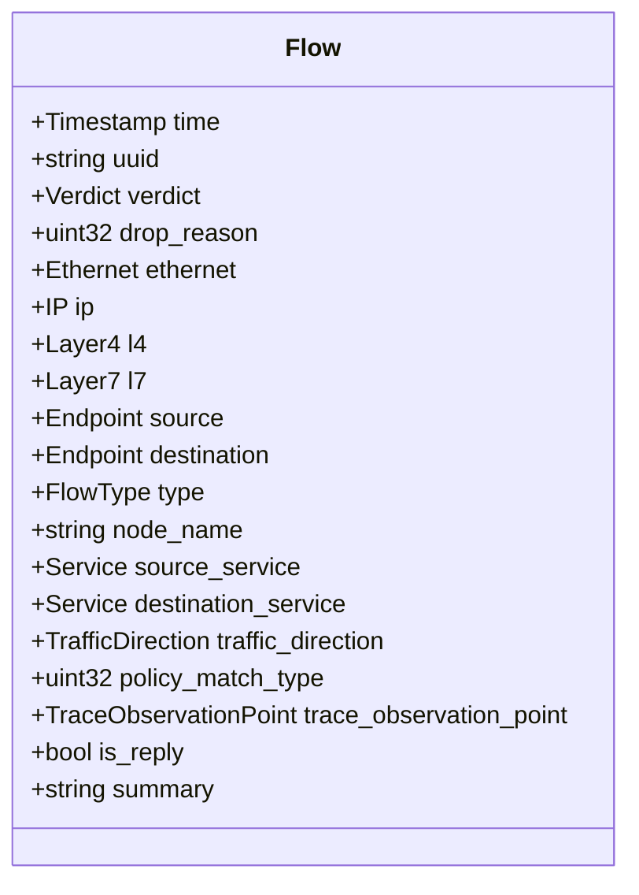
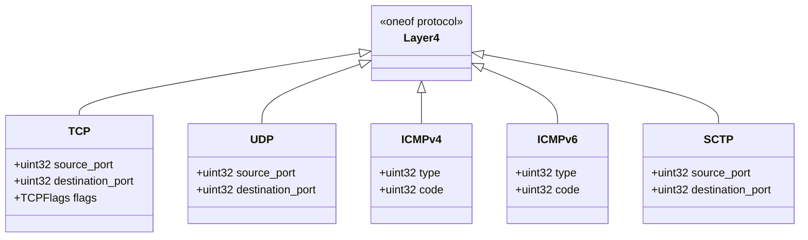
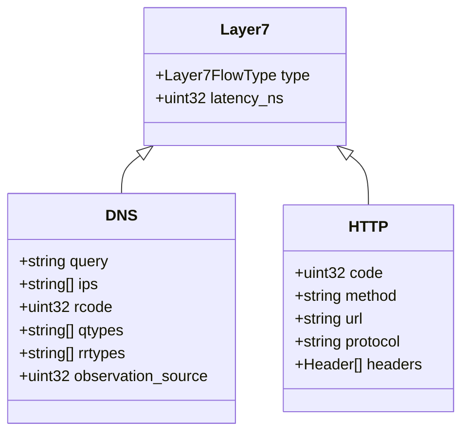
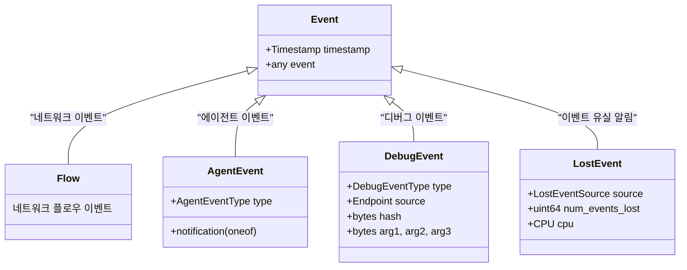
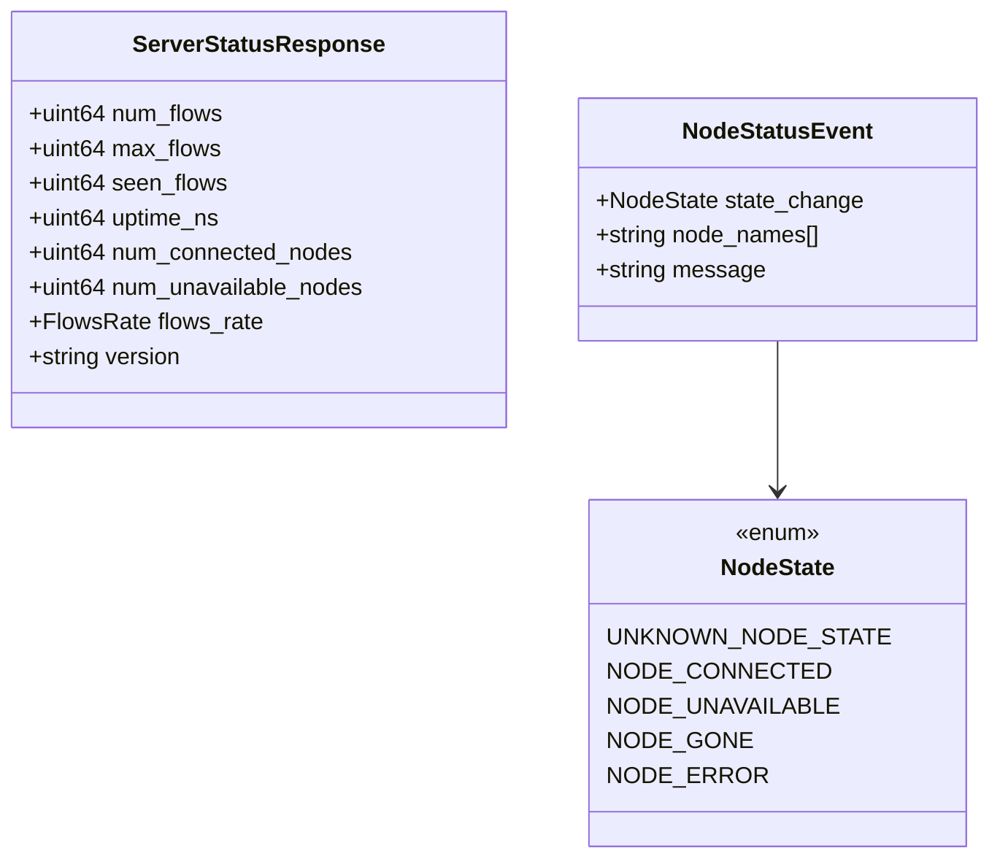
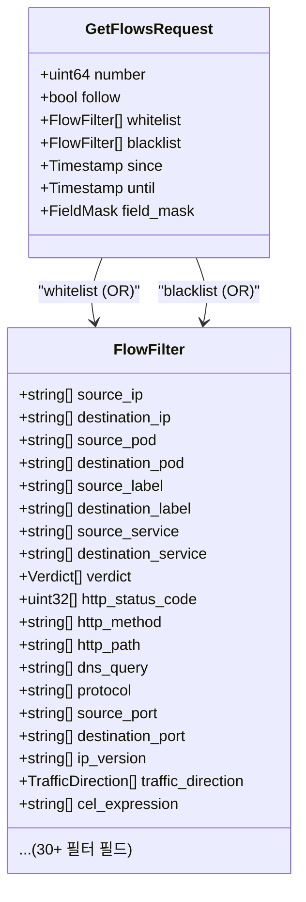

# 03. 데이터 모델 (Data Model & ERD)

## 핵심 데이터 엔티티 관계도

Hubble의 데이터 모델은 Protocol Buffers로 정의되며, 네트워크 플로우를 계층적으로 표현합니다.

---

## Flow (핵심 메시지)

Flow는 Hubble의 **가장 중요한 데이터 구조**입니다. 네트워크 패킷의 전체 컨텍스트를 담고 있습니다.

### 왜 Flow가 이렇게 설계되었나?

- **계층적 프로토콜 분리**: L2/L3/L4/L7을 별도 필드로 분리하여 각 계층을 독립적으로 필터링 가능
- **양방향 엔드포인트**: source/destination을 대칭으로 구성하여 동일한 필터 로직을 양쪽에 적용
- **K8s 메타데이터 내장**: IP 주소 대신 Pod 이름, 네임스페이스, 레이블을 포함하여 쿠버네티스 환경에서 즉시 활용 가능
- **Policy 정보 포함**: 어떤 정책이 이 플로우를 허용/차단했는지를 플로우 레벨에서 확인 가능

---

## Endpoint (엔드포인트)

네트워크 통신의 한쪽 끝점을 나타냅니다.

| 필드 | 타입 | 설명 |
|------|------|------|
| `ID` | uint32 | Cilium 엔드포인트 ID |
| `identity` | uint32 | 보안 아이덴티티 (정책 기반) |
| `namespace` | string | K8s 네임스페이스 |
| `labels` | string[] | K8s 레이블 목록 |
| `pod_name` | string | Pod 이름 |
| `workloads` | Workload[] | 워크로드 정보 (Deployment, StatefulSet 등) |

### 왜 IP가 아닌 Identity 기반인가?

Cilium은 IP 대신 **Security Identity**를 사용합니다:
- Pod IP는 동적으로 변하지만, Identity는 같은 레이블 셋을 가진 Pod 그룹에 할당
- 이를 통해 정책이 IP가 아닌 워크로드 기반으로 작동
- Hubble Flow에 Identity를 포함하여 "누가 누구와 통신했는가"를 워크로드 레벨로 파악

---

## 프로토콜 계층별 데이터

### L2 - Ethernet

| 필드 | 타입 | 설명 |
|------|------|------|
| `source` | string | 출발지 MAC 주소 |
| `destination` | string | 도착지 MAC 주소 |

### L3 - IP

| 필드 | 타입 | 설명 |
|------|------|------|
| `source` | string | 출발지 IP |
| `destination` | string | 도착지 IP |
| `ipVersion` | IPVersion | IPv4 / IPv6 |
| `encrypted` | bool | IPSec/WireGuard 암호화 여부 |

### L4 - Transport (oneof)

### L7 - Application (oneof)

---

## Verdict (판정)

모든 Flow에는 Verdict가 부여됩니다:

| Verdict | 설명 | 시나리오 |
|---------|------|---------|
| `FORWARDED` | 정상 전달됨 | 정책이 허용한 트래픽 |
| `DROPPED` | 차단됨 | NetworkPolicy에 의해 차단 |
| `AUDIT` | 감사 기록 | 정책 감사 모드에서 기록만 |
| `REDIRECTED` | 리다이렉트됨 | L7 프록시로 전달 |
| `ERROR` | 오류 | 처리 중 오류 발생 |
| `TRACED` | 추적됨 | 디버그 추적 이벤트 |
| `TRANSLATED` | 변환됨 | NAT 등 주소 변환 이벤트 |

---

## Event (이벤트 래퍼)

Hubble은 Flow 외에도 여러 종류의 이벤트를 처리합니다.

### AgentEvent 종류

| 타입 | 설명 |
|------|------|
| `AGENT_STARTED` | Cilium 에이전트 시작 |
| `POLICY_UPDATED` | 네트워크 정책 변경 |
| `ENDPOINT_REGENERATE_SUCCESS/FAILURE` | 엔드포인트 재생성 |
| `ENDPOINT_CREATED/DELETED` | 엔드포인트 생성/삭제 |
| `IPCACHE_UPSERTED/DELETED` | IP-Identity 매핑 변경 |
| `SERVICE_UPSERTED/DELETED` | 서비스 변경 |

---

## 서버 상태 모델

---

## 필터 모델

Hubble의 필터 시스템은 Flow의 거의 모든 필드를 기준으로 필터링할 수 있습니다.

### 필터 로직

- **Whitelist**: 여러 FlowFilter가 **OR** 조건으로 결합 (하나라도 매치하면 통과)
- **Blacklist**: 여러 FlowFilter가 **OR** 조건으로 결합 (하나라도 매치하면 제외)
- **FlowFilter 내부**: 필드 간 **AND** 조건 (모든 필드가 매치해야 함)
- **필드 내 값**: 같은 필드의 여러 값은 **OR** 조건 (하나라도 매치하면 OK)

예시: `--source-pod frontend --verdict DROPPED` → source가 frontend **AND** verdict가 DROPPED인 플로우

---

## 직접 실행해보기 (PoC)

| PoC | 실행 | 학습 내용 |
|-----|------|----------|
| [poc-flow-structure](poc-flow-structure/) | `cd poc-flow-structure && go run main.go` | Flow 계층 구조, oneof 패턴, K8s enrichment |
| [poc-filter-chain](poc-filter-chain/) | `cd poc-filter-chain && go run main.go` | Whitelist/Blacklist AND/OR 필터 로직 |
| [poc-packet-parser](poc-packet-parser/) | `cd poc-packet-parser && go run main.go` | 바이너리 패킷 파싱 (raw bytes → L2/L3/L4) |
| [poc-fieldmask](poc-fieldmask/) | `cd poc-fieldmask && go run main.go` | Field Mask 트리, 선택적 필드 복사 최적화 |
