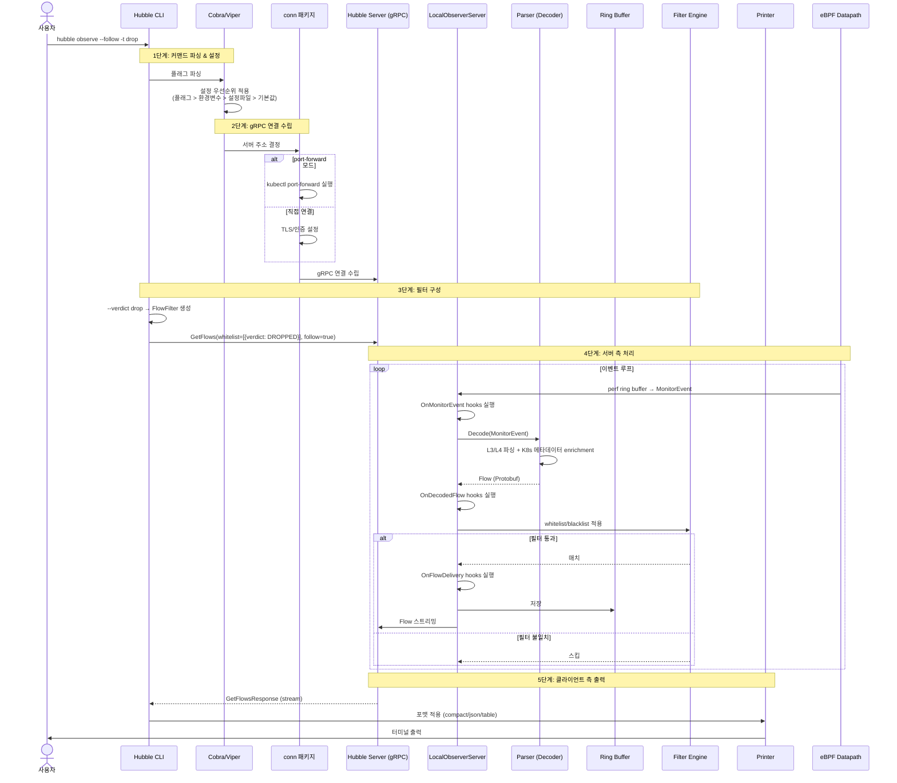
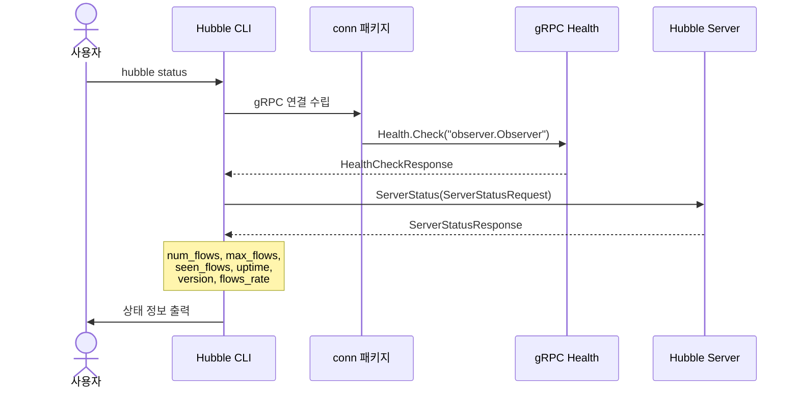
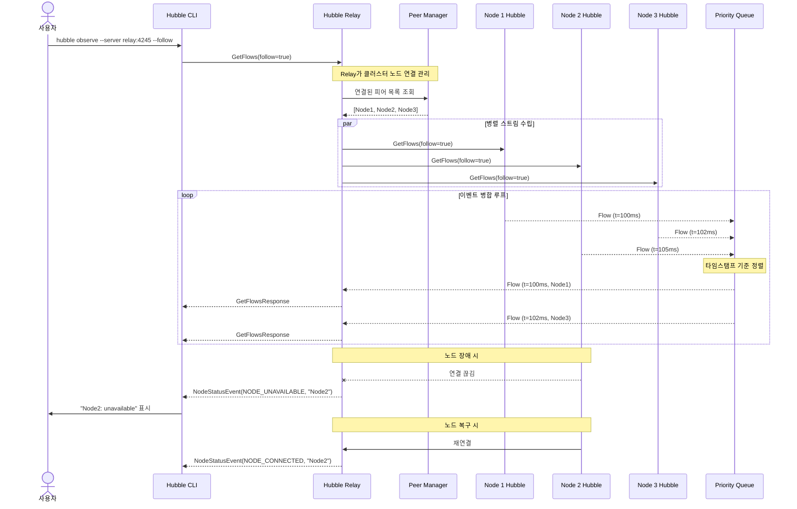
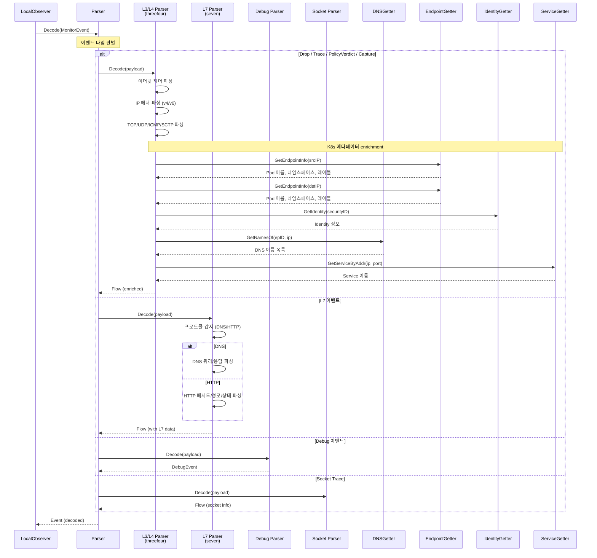
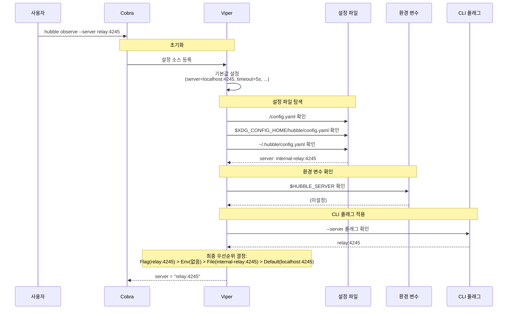
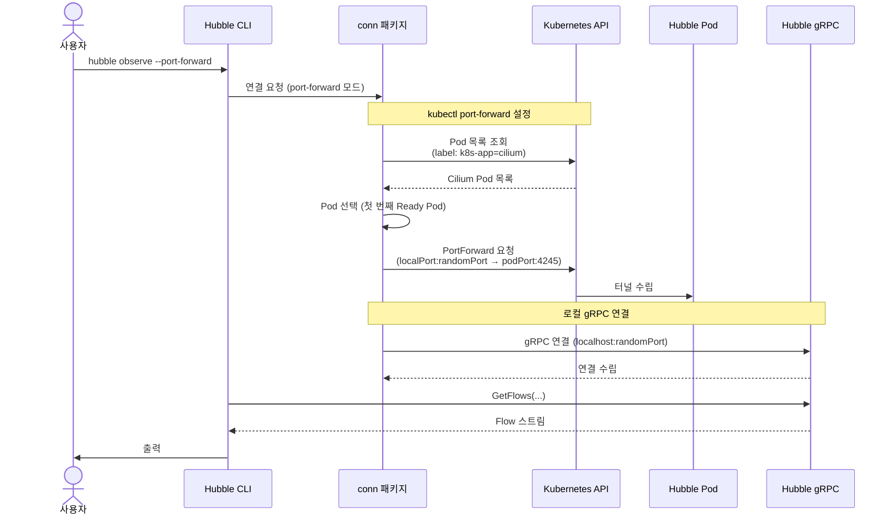

# 04. 시퀀스 다이어그램 (Sequence Diagrams)

## 1. `hubble observe` 커맨드 전체 흐름

가장 핵심적인 기능인 Flow 관찰의 전체 시퀀스입니다.

---

## 2. `hubble status` 커맨드 흐름

서버 상태 확인은 단순한 unary RPC입니다.

---

## 3. 멀티 노드 Relay 흐름

Relay를 통한 클러스터 전체 플로우 관찰 시퀀스입니다.

### 왜 Priority Queue인가?

각 노드의 Flow 이벤트는 네트워크 지연 등으로 순서가 뒤바뀔 수 있습니다.
Priority Queue(min-heap)를 사용하여 타임스탬프 기준으로 정렬함으로써:
- 클라이언트는 항상 시간순으로 정렬된 통합 스트림을 받음
- 약간의 버퍼링 지연이 있지만, 데이터 일관성 보장

---

## 4. Parser 디코딩 흐름

BPF raw 이벤트를 Flow protobuf로 변환하는 과정입니다.

---

## 5. 설정 로드 시퀀스

Hubble CLI의 설정 우선순위가 적용되는 과정입니다.

---

## 6. Port-Forward 연결 시퀀스

`--port-forward` 옵션 사용 시의 연결 과정입니다.

### 왜 Port-Forward인가?

- 클러스터 외부에서 Hubble Server에 직접 접근하려면 Ingress/LoadBalancer 설정이 필요
- Port-Forward는 추가 인프라 없이 `kubectl` 인증만으로 접근 가능
- 개발/디버깅 시 가장 빠르게 사용할 수 있는 방법

---

## 직접 실행해보기 (PoC)

| PoC | 실행 | 학습 내용 |
|-----|------|----------|
| [poc-observer-pipeline](poc-observer-pipeline/) | `cd poc-observer-pipeline && go run main.go` | 5단계 이벤트 파이프라인 (Hook → Decode → Filter → Deliver) |
| [poc-grpc-streaming](poc-grpc-streaming/) | `cd poc-grpc-streaming && go run main.go` | Server Streaming 패턴 (observe 커맨드 흐름) |
| [poc-config-priority](poc-config-priority/) | `cd poc-config-priority && go run main.go` | 설정 로드 우선순위 시퀀스 |
| [poc-graceful-shutdown](poc-graceful-shutdown/) | `cd poc-graceful-shutdown && go run main.go` | 시그널 처리, context 취소 전파, errgroup |
