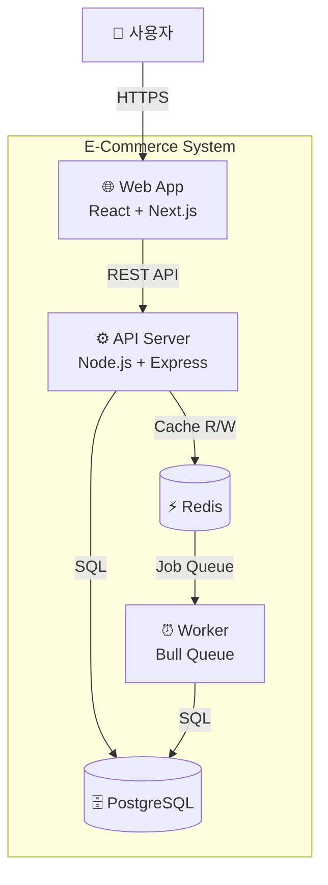

# C4 Level 2: Container Diagram

## Container vs Component 구분

| Container | 설명 | 예시 |
|-----------|------|------|
| Web Application | 사용자에게 UI를 제공 | React SPA, Next.js |
| API Application | 비즈니스 로직 처리 | Express, Spring Boot |
| Database | 데이터 영속화 | PostgreSQL, MongoDB |
| Message Broker | 비동기 통신 | RabbitMQ, Redis Queue |
