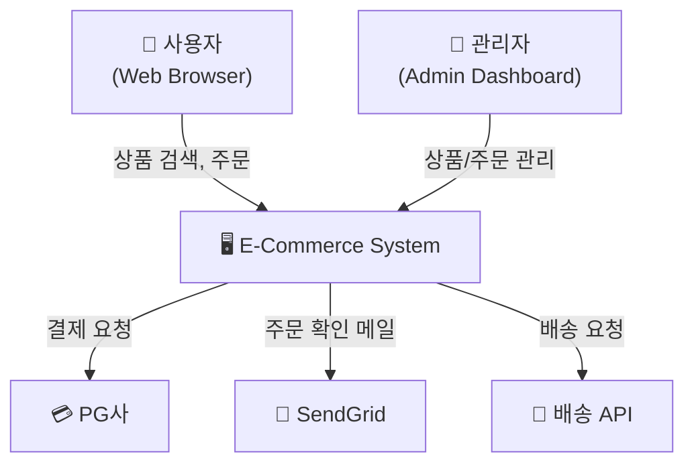

# C4 Level 1: System Context

아래 Mermaid 코드를 GitHub, VSCode, 또는 mermaid.live에 붙여넣으면 다이어그램이 렌더링됩니다.

## 작성 가이드

1. **우리 시스템**을 중앙에 배치
2. **사용자(Actor)**를 상단에 배치
3. **외부 시스템**을 하단 또는 좌우에 배치
4. 화살표에 **통신 목적**을 명시 (프로토콜이 아닌 비즈니스 의미)
