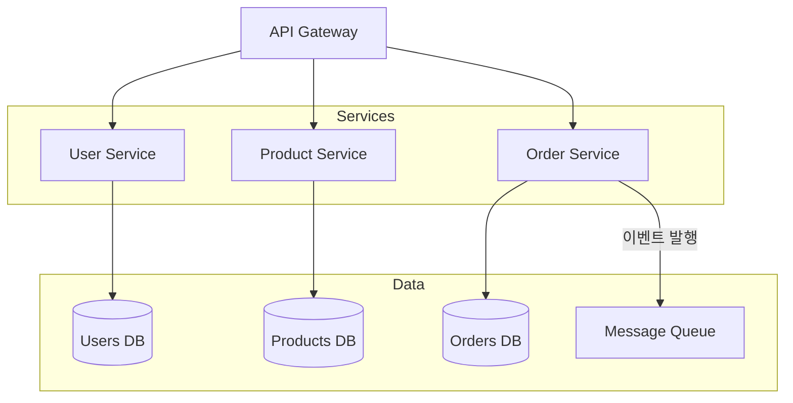

# 마이크로서비스 아키텍처 예시

## 마이크로서비스 아키텍처 핵심 원칙

1. **Database per Service**: 각 서비스는 자체 DB를 소유
2. **API Gateway**: 단일 진입점으로 라우팅 및 인증 처리
3. **Event-Driven**: 서비스 간 결합도를 낮추기 위해 메시지 큐 사용
4. **독립 배포**: 각 서비스는 자체 CI/CD 파이프라인 보유
