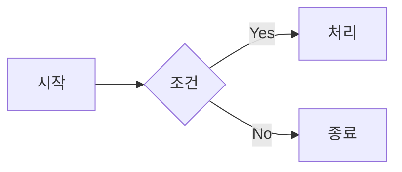
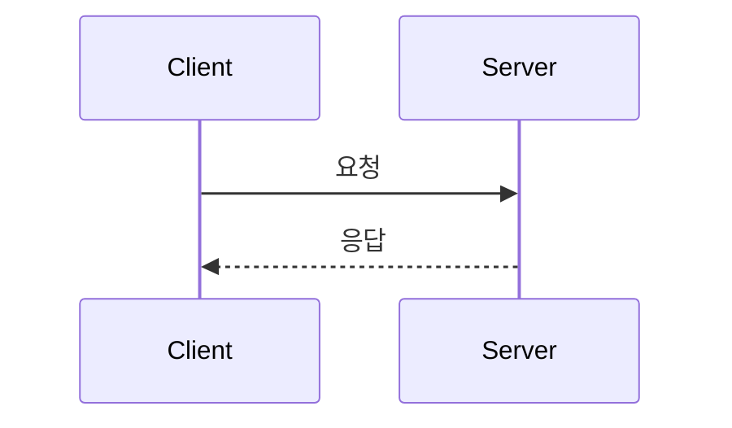
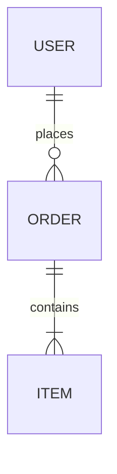

# 08. Mermaid.js — 코드로 그리는 다이어그램

## 개념

Mermaid.js는 **텍스트 기반 문법**으로 다이어그램을 작성하면
자동으로 **시각적 다이어그램을 렌더링**해주는 JavaScript 라이브러리입니다.

## 왜 필요한가?

- 별도의 드로잉 도구 없이 **마크다운 안에서** 다이어그램 작성
- 코드처럼 **버전 관리(Git)** 가능
- GitHub, GitLab, Notion, VSCode에서 **네이티브 렌더링** 지원
- 이미지 파일을 관리할 필요 없음

## Mermaid 지원 다이어그램 종류

| 다이어그램 | 키워드 | 용도 |
|-----------|--------|------|
| 플로우차트 | `graph` / `flowchart` | 프로세스 흐름, 의사결정 |
| 시퀀스 다이어그램 | `sequenceDiagram` | 객체 간 메시지 흐름 |
| 클래스 다이어그램 | `classDiagram` | OOP 클래스 구조 |
| ERD | `erDiagram` | 데이터베이스 관계 |
| 상태 다이어그램 | `stateDiagram-v2` | 상태 전이 |
| 간트 차트 | `gantt` | 프로젝트 일정 |
| 파이 차트 | `pie` | 비율 시각화 |
| Git 그래프 | `gitGraph` | 브랜치/머지 흐름 |

## POC 프로젝트

모든 다이어그램 유형을 한 페이지에서 실습할 수 있는 인터랙티브 페이지를 제공합니다.

### 실행 방법

```bash
cd 08-mermaid

# 브라우저에서 열기
open index.html

# 또는 온라인: https://mermaid.live 에서 코드 붙여넣기
```

### 파일 구조

```
08-mermaid/
├── README.md          ← 지금 보고 있는 파일
├── index.html         ← 모든 다이어그램 유형 데모
└── cheatsheet.md      ← Mermaid 문법 치트시트 (GitHub에서 직접 렌더링)
```

## 빠른 문법 가이드

### 플로우차트


### 시퀀스 다이어그램


### ERD


## 학습 포인트

1. **텍스트 = 다이어그램**: 드로잉 도구 없이 텍스트만으로 다이어그램 생성
2. **버전 관리**: 텍스트 기반이므로 Git diff로 변경 이력 추적 가능
3. **라이브 편집**: mermaid.live에서 실시간 미리보기하며 작성
4. **GitHub 네이티브**: README.md에 바로 작성하면 GitHub이 렌더링
