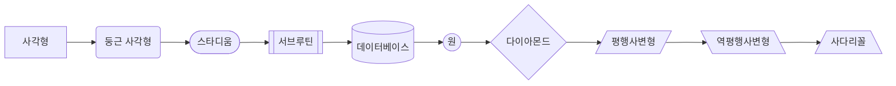
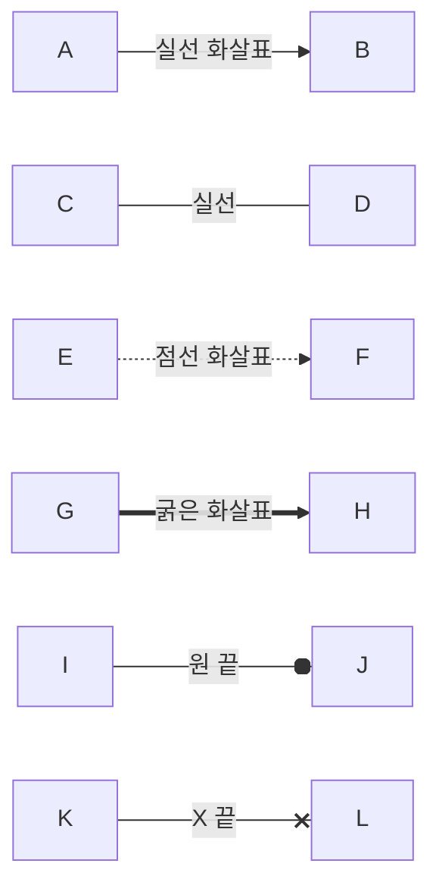
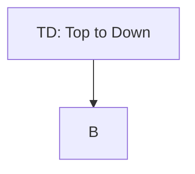
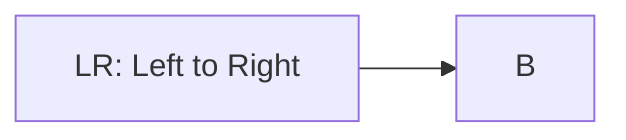
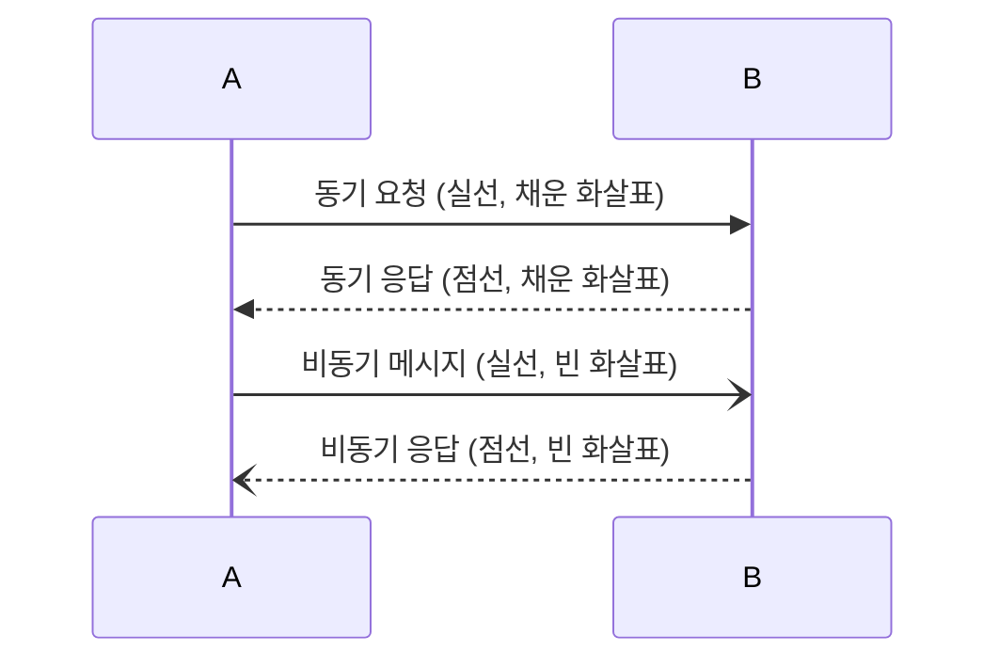
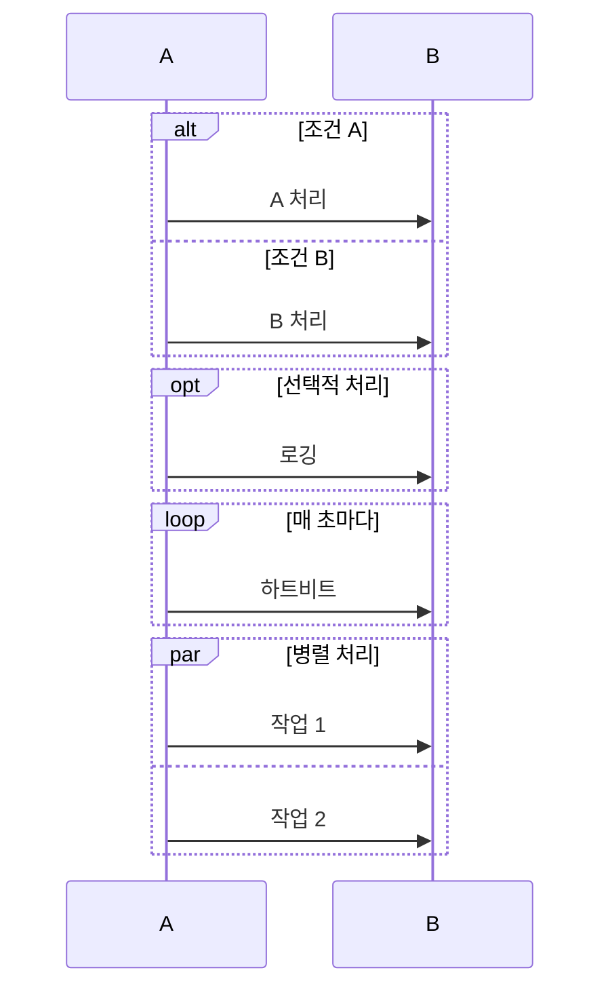
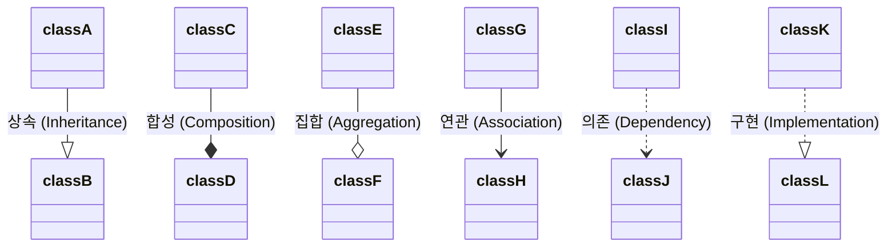
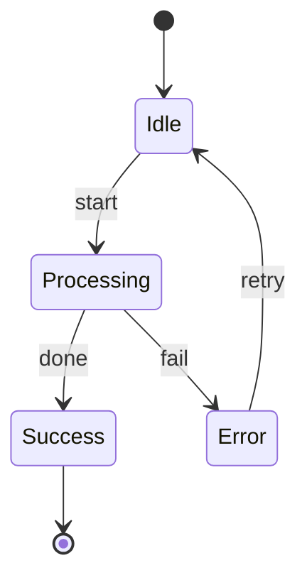
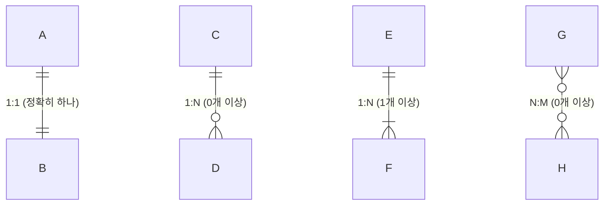
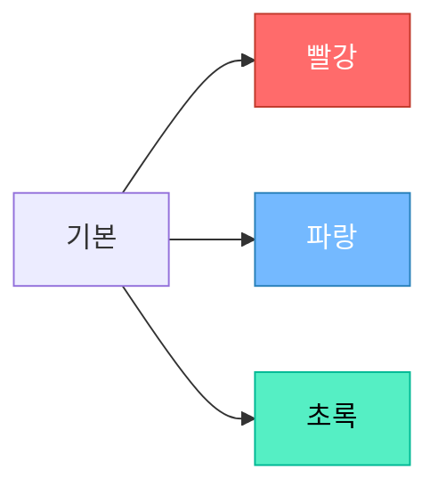

# Mermaid.js 치트시트

GitHub에서 이 파일을 열면 다이어그램이 자동 렌더링됩니다.

## 1. 플로우차트 노드 모양

## 2. 플로우차트 화살표 종류

## 3. 플로우차트 방향

## 4. 시퀀스 다이어그램 메시지 종류

## 5. 시퀀스 다이어그램 제어 구조

## 6. 클래스 다이어그램 관계

## 7. 상태 다이어그램

## 8. ERD 관계 기호

## 9. 스타일링

