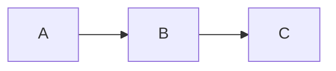
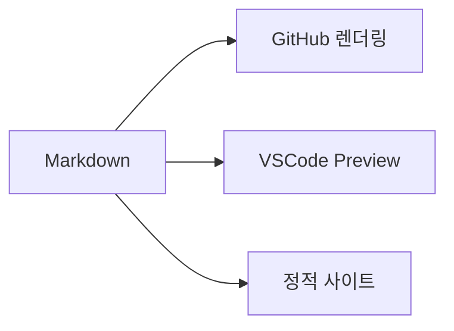

# Markdown 문법 치트시트

GitHub Flavored Markdown(GFM) 기준입니다.
이 파일을 GitHub이나 VSCode에서 열면 렌더링된 결과를 확인할 수 있습니다.

---

## 1. 텍스트 서식

| 문법 | 결과 |
|------|------|
| `**볼드**` | **볼드** |
| `*이탤릭*` | *이탤릭* |
| `~~취소선~~` | ~~취소선~~ |
| `` `인라인 코드` `` | `인라인 코드` |
| `**_볼드 이탤릭_**` | **_볼드 이탤릭_** |

---

## 2. 헤딩 (Heading)

```
# H1 — 프로젝트 제목 (파일당 1개만)
## H2 — 주요 섹션
### H3 — 하위 섹션
#### H4 — 세부 항목
```

---

## 3. 목록

### 순서 없는 목록
- 항목 1
  - 하위 항목 1-1
  - 하위 항목 1-2
- 항목 2
- 항목 3

### 순서 있는 목록
1. 첫 번째
2. 두 번째
3. 세 번째

### 체크리스트 (GitHub 전용)
- [x] 기획 완료
- [x] 개발 완료
- [ ] 테스트 진행 중
- [ ] 배포 대기

---

## 4. 코드

### 인라인 코드
`npm install express` 명령으로 설치합니다.

### 코드 블록 (언어 지정)
```javascript
function hello(name) {
  return `Hello, ${name}!`;
}
```

```python
def hello(name: str) -> str:
    return f"Hello, {name}!"
```

```bash
# 서버 실행
npm start
```

### diff (변경 사항 강조)
```diff
- const OLD_VALUE = 100;
+ const NEW_VALUE = 200;
```

---

## 5. 링크

### 일반 링크
[GitHub](https://github.com)

### 자동 링크
https://github.com

### 참조 링크 (문서 하단에 URL 모음)
[Kubernetes 공식 문서][k8s-docs]

[k8s-docs]: https://kubernetes.io/docs/

### 문서 내부 링크 (앵커)
[테이블 섹션으로 이동](#6-테이블)

---

## 6. 테이블

| 왼쪽 정렬 | 가운데 정렬 | 오른쪽 정렬 |
|:-----------|:-----------:|------------:|
| 텍스트 | 텍스트 | 텍스트 |
| 왼쪽 | 가운데 | 오른쪽 |

---

## 7. 인용문 (Blockquote)

> "주석은 코드로 의도를 표현하지 못했을 때 하는 최후의 수단이다."
> — 로버트 C. 마틴

> **Note**: 이것은 중요한 노트입니다.

---

## 8. 수평선

세 가지 방법:
```
---
***
___
```

---

## 9. 이미지

```markdown


```

### 크기 조절 (HTML)
```html

```

---

## 10. 접기 (Details/Summary)

<details>
<summary>클릭하여 설치 방법 보기</summary>

### macOS
```bash
brew install kubectl
```

### Linux
```bash
curl -LO "https://dl.k8s.io/release/$(curl -L -s https://dl.k8s.io/release/stable.txt)/bin/linux/amd64/kubectl"
```

</details>

---

## 11. 이모지

`:rocket:` → :rocket:
`:white_check_mark:` → :white_check_mark:
`:warning:` → :warning:
`:memo:` → :memo:

---

## 12. 뱃지 (Badge)

```markdown


```


---

## 13. GitHub 전용 확장

### 알림 블록 (Alerts)
```markdown
> [!NOTE]
> 참고 사항입니다.

> [!WARNING]
> 주의가 필요합니다.

> [!IMPORTANT]
> 중요한 정보입니다.
```

> [!NOTE]
> 참고 사항입니다.

> [!WARNING]
> 주의가 필요합니다.

### 이슈/PR 자동 링크
```
#123      → 이슈 링크
@username → 사용자 멘션
```

### Mermaid 다이어그램
````markdown

````


