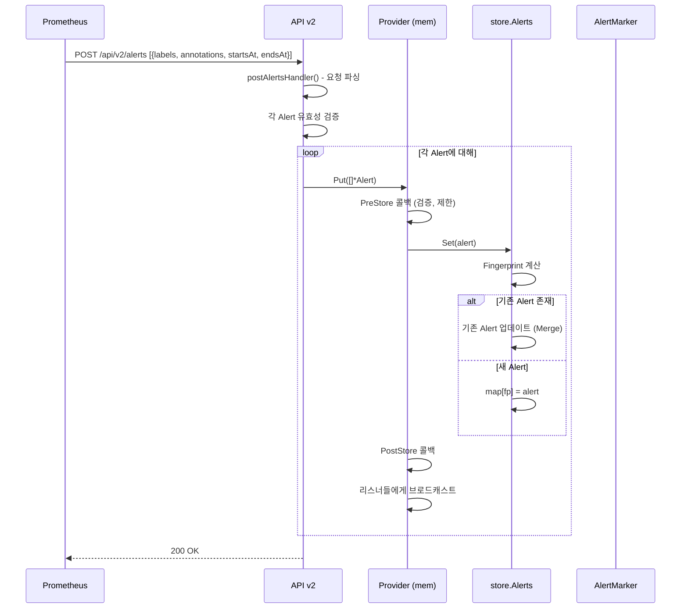
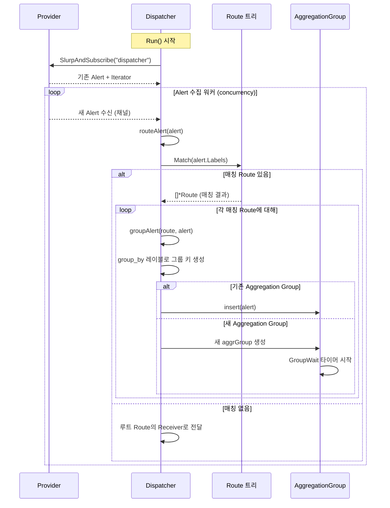
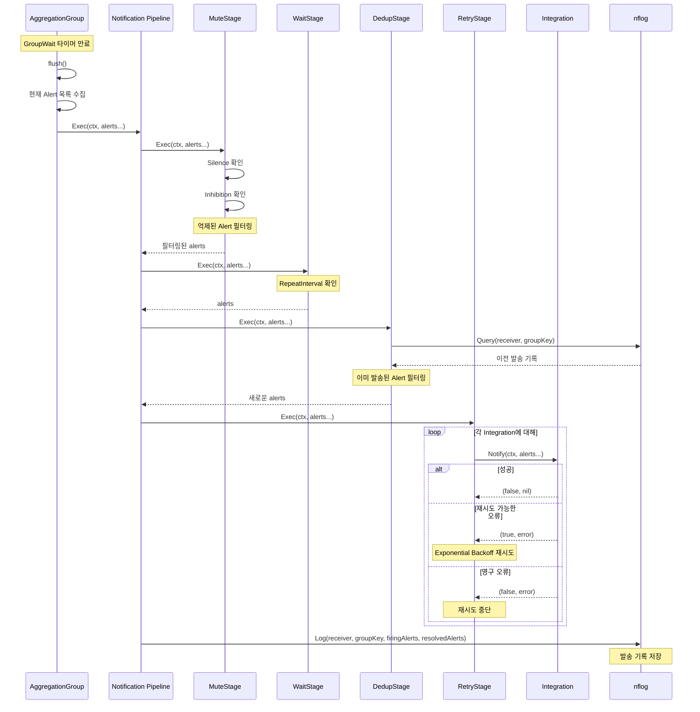
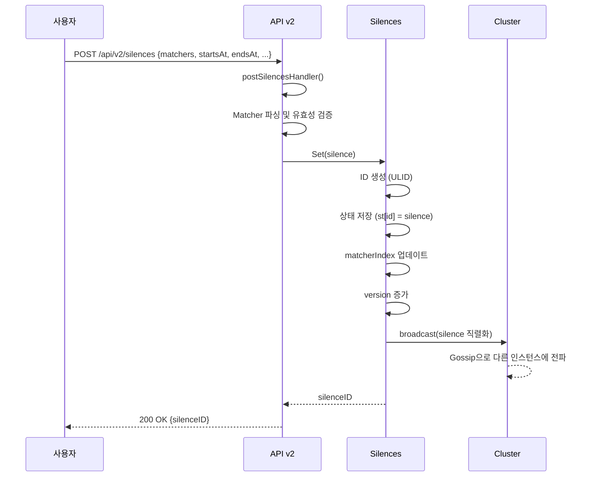
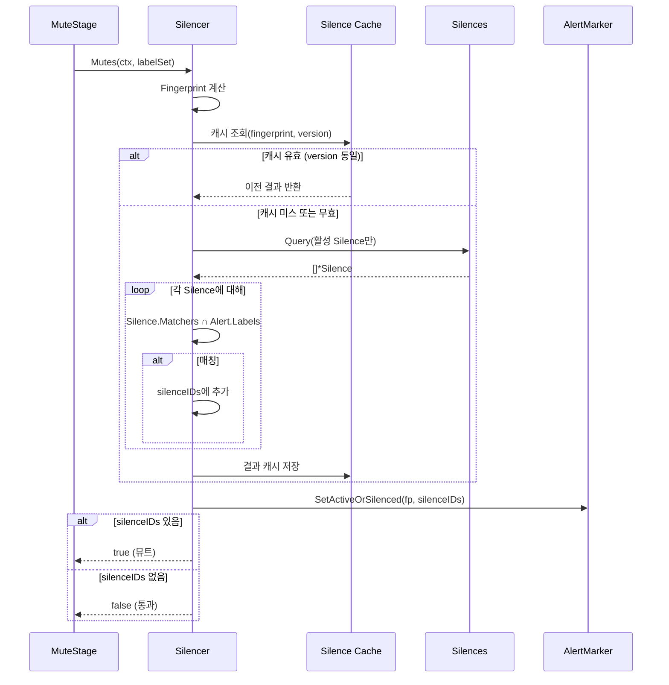
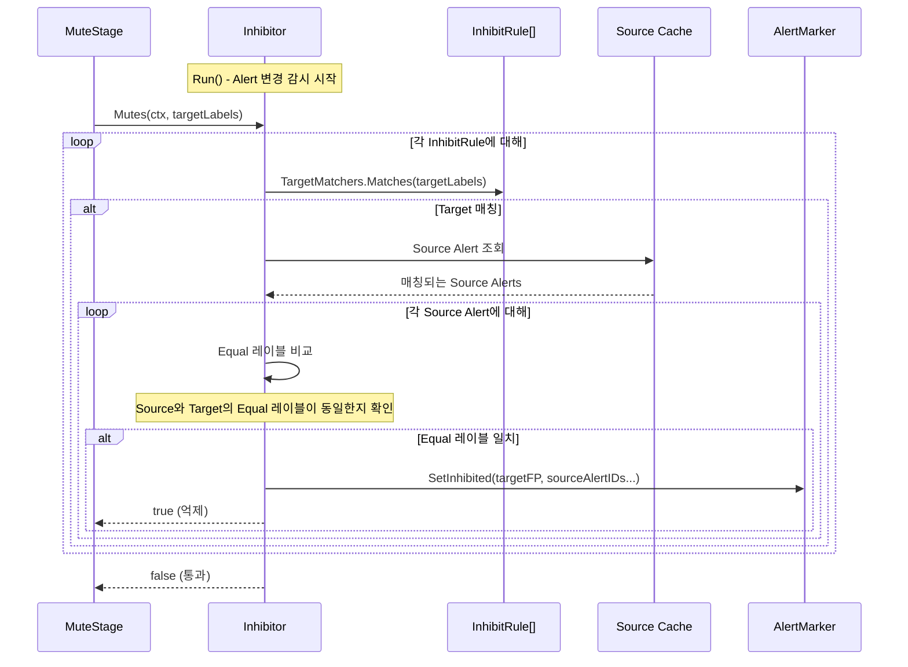
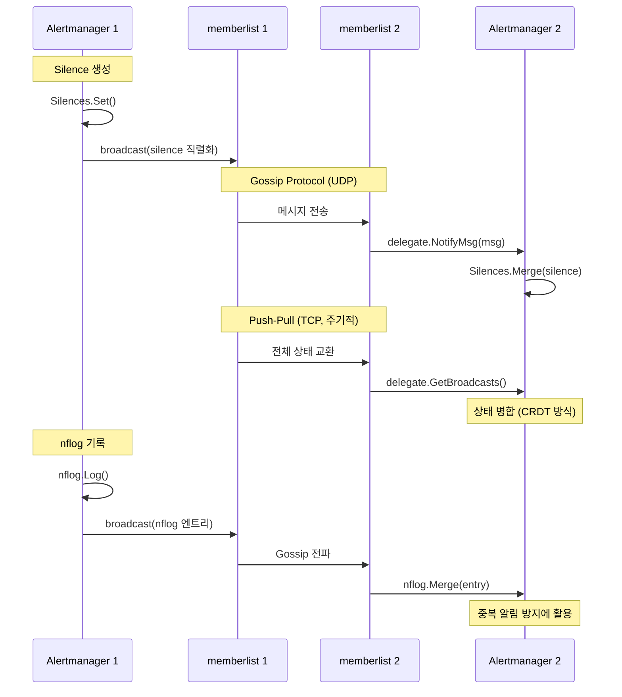
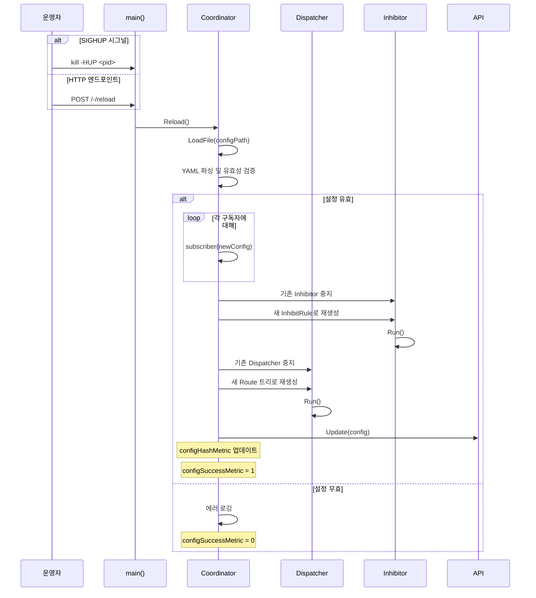

# Alertmanager 시퀀스 다이어그램

## 1. 개요

Alertmanager의 주요 유즈케이스별 요청 흐름을 시퀀스 다이어그램으로 정리한다.

## 2. Alert 수신 및 처리 흐름

### 2.1 Alert 수신 (API → Provider)



### 2.2 Dispatcher의 Alert 수집 및 라우팅



### 2.3 Aggregation Group Flush 및 알림 전송



## 3. Silence 생성 흐름



## 4. Silence 매칭 흐름



## 5. Inhibition 흐름



## 6. 클러스터 상태 동기화 흐름



## 7. 설정 리로드 흐름



## 8. amtool CLI 흐름

### 8.1 Alert 조회

```
amtool alert query alertname="HighLatency"
    │
    ▼
GET /api/v2/alerts?filter=alertname%3D"HighLatency"
    │
    ▼
API.getAlertsHandler()
    ├→ Matcher 파싱
    ├→ Provider.GetPending() - 모든 Alert 조회
    ├→ alertFilter() - Matcher로 필터링
    ├→ Marker.Status() - 각 Alert 상태 확인
    └→ JSON 응답 반환
```

### 8.2 Silence 생성

```
amtool silence add alertname=Test_Alert
    │
    ▼
POST /api/v2/silences {matchers: [{name: "alertname", value: "Test_Alert", isEqual: true, isRegex: false}]}
    │
    ▼
API.postSilencesHandler()
    ├→ Silence 객체 생성
    ├→ Silences.Set(silence)
    └→ {silenceID} 반환
```

### 8.3 라우팅 테스트

```
amtool config routes test --config.file=config.yml severity=critical team=infra
    │
    ▼
Config 파일 로드
    │
    ▼
Route 트리 구축
    │
    ▼
Match(labels) - DFS 매칭
    │
    ▼
매칭된 Receiver 출력: "infra-pager"
```

## 9. Alert 생명주기 시퀀스

```
시간 ─────────────────────────────────────────────────→

[T0] Prometheus POST Alert (startsAt=T0)
      │
      ▼
[T0] Provider 저장
      │
      ▼
[T0] Dispatcher 수신 → Route 매칭 → AggregationGroup 생성
      │
      │  ◄── GroupWait (기본 30s) ──►
      │
[T0+30s] flush() → Notification Pipeline
      │  ├── MuteStage: Silence/Inhibition 확인
      │  ├── DedupStage: nflog 확인 (첫 알림이므로 통과)
      │  └── RetryStage: Integration 호출 (Slack, Email 등)
      │
      │  ◄── GroupInterval (기본 5m) ──►
      │
[T0+5m30s] 새 Alert 추가 시 flush()
      │  └── 그룹에 추가된 새 Alert만 전송
      │
      │  ◄── RepeatInterval (기본 4h) ──►
      │
[T0+4h] 변경 없어도 반복 전송
      │
      │
[Tn] Prometheus POST Alert (endsAt=Tn, resolved)
      │
      ▼
[Tn] Provider 업데이트
      │
      ▼
[Tn] Dispatcher flush() → resolved 알림 전송
      │
      │  ◄── GC Interval ──►
      │
[Tn+X] Provider GC → Alert 삭제, Marker 정리
```

## 10. 동시성 패턴 요약

```
┌─────────────────────────────────────────────┐
│              goroutine 구조                  │
│                                             │
│  [main]                                     │
│    ├── HTTP 서버                             │
│    ├── 시그널 핸들러                          │
│    │                                        │
│  [Dispatcher]                               │
│    ├── N개 Alert 수집 워커 (concurrency)     │
│    │   └── routeAlert() → groupAlert()      │
│    ├── AggregationGroup 유지보수 루프        │
│    │   └── 만료 그룹 정리                    │
│    └── 각 AggregationGroup                  │
│        └── flush 타이머 (GroupWait/Interval) │
│                                             │
│  [Inhibitor]                                │
│    └── Alert 변경 감시 루프                  │
│        └── Source Alert 캐시 업데이트         │
│                                             │
│  [Provider GC]                              │
│    └── 주기적 GC 루프                        │
│                                             │
│  [nflog Maintenance]                        │
│    └── GC + 스냅샷 저장                      │
│                                             │
│  [Silences Maintenance]                     │
│    └── GC + 스냅샷 저장                      │
│                                             │
│  [Cluster] (선택)                           │
│    └── memberlist goroutines                │
│        ├── Gossip 수신/송신                  │
│        ├── Push-Pull 주기적 교환             │
│        └── 피어 프로빙                       │
└─────────────────────────────────────────────┘
```
