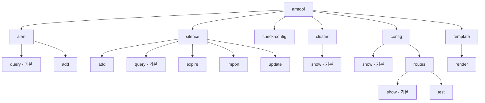

# 19. amtool CLI Deep-Dive

## 1. 개요

### amtool이란?

amtool은 Alertmanager의 공식 CLI(Command-Line Interface) 도구로, Alertmanager 인스턴스의 상태를 조회하고 수정하기 위한 커맨드라인 유틸리티이다. Prometheus 생태계에서 운영자가 알림 관리 작업을 자동화하거나 스크립트로 처리할 때 핵심적인 역할을 한다.

### 왜(Why) amtool이 필요한가?

1. **운영 자동화**: Web UI 없이 스크립트/CI 파이프라인에서 알림 관리를 자동화할 수 있다
2. **빠른 대응**: 긴급 상황에서 터미널 한 줄로 사일런스 생성, 알림 조회가 가능하다
3. **설정 검증**: 배포 전에 `check-config`로 설정 파일 문법 오류를 사전 검출한다
4. **라우팅 테스트**: 라벨 셋을 입력하면 어떤 리시버에 알림이 도달하는지 사전 검증한다
5. **대량 작업**: silence import로 수백 개의 사일런스를 한 번에 일괄 생성한다
6. **API 추상화**: OpenAPI v2 API를 직접 호출하지 않고 직관적인 명령어로 사용 가능하다

### 소스코드 위치

```
alertmanager/
├── cmd/amtool/main.go          # 진입점 (cli.Execute() 호출)
├── cli/
│   ├── root.go                  # Execute() 함수, 플래그 정의, 서브커맨드 등록
│   ├── config/config.go         # 설정 파일 리졸버 (YAML 파싱)
│   ├── format/
│   │   ├── format.go            # Formatter 인터페이스 정의
│   │   ├── format_simple.go     # SimpleFormatter 구현
│   │   ├── format_extended.go   # ExtendedFormatter 구현
│   │   ├── format_json.go       # JSONFormatter 구현
│   │   └── sort.go              # 정렬 유틸리티
│   ├── alert.go                 # alert 서브커맨드 등록
│   ├── alert_query.go           # alert query 구현
│   ├── alert_add.go             # alert add 구현
│   ├── silence.go               # silence 서브커맨드 등록
│   ├── silence_add.go           # silence add 구현
│   ├── silence_query.go         # silence query 구현
│   ├── silence_expire.go        # silence expire 구현
│   ├── silence_import.go        # silence import 구현 (병렬 워커)
│   ├── silence_update.go        # silence update 구현
│   ├── check_config.go          # check-config 구현
│   ├── cluster.go               # cluster show 구현
│   ├── config.go                # config show 구현
│   ├── routing.go               # config routes show 구현
│   ├── test_routing.go          # config routes test 구현
│   ├── template.go              # template 서브커맨드 등록
│   ├── template_render.go       # template render 구현
│   └── utils.go                 # 유틸리티 (TypeMatchers, execWithTimeout 등)
```

## 2. 아키텍처

### 전체 구조

```
┌──────────────────────────────────────────────────────────┐
│                    amtool CLI                            │
│                                                          │
│  ┌─────────────┐   ┌──────────────┐  ┌───────────────┐  │
│  │  kingpin/v2  │   │   Config     │  │  Format Layer │  │
│  │ (CLI Parser) │   │  Resolver    │  │  (output)     │  │
│  └──────┬──────┘   └──────┬───────┘  └───────┬───────┘  │
│         │                 │                   │          │
│  ┌──────▼──────────────────▼───────────────────▼───────┐  │
│  │              Execute() - root.go                    │  │
│  │  ┌─────────┬──────────┬────────────┬──────────────┐ │  │
│  │  │ alert   │ silence  │check-config│  cluster     │ │  │
│  │  │ ├query  │ ├add     │            │  └show       │ │  │
│  │  │ └add    │ ├query   │            │              │ │  │
│  │  │         │ ├expire  │  config    │  template    │ │  │
│  │  │         │ ├import  │  ├show     │  └render     │ │  │
│  │  │         │ └update  │  └routes   │              │ │  │
│  │  └─────────┴──────────┴────────────┴──────────────┘ │  │
│  └─────────────────────────┬───────────────────────────┘  │
│                            │                              │
│  ┌─────────────────────────▼───────────────────────────┐  │
│  │         OpenAPI v2 Client (go-swagger 생성)         │  │
│  │  alertmanager/api/v2/client/AlertmanagerAPI         │  │
│  └─────────────────────────┬───────────────────────────┘  │
└────────────────────────────┼──────────────────────────────┘
                             │ HTTP (REST API)
                             ▼
                   ┌───────────────────┐
                   │   Alertmanager    │
                   │   Server          │
                   │  (localhost:9093) │
                   └───────────────────┘
```

### 커맨드 트리



## 3. 진입점과 초기화 흐름

### main() 함수

진입점은 `cmd/amtool/main.go`에 위치한다:

```go
// 파일: cmd/amtool/main.go
package main

import "github.com/prometheus/alertmanager/cli"

func main() {
    cli.Execute()
}
```

단 3줄의 코드로 모든 로직을 `cli` 패키지의 `Execute()` 함수에 위임한다.

### Execute() 함수의 초기화 흐름

`cli/root.go`의 `Execute()` 함수가 amtool의 실질적인 시작점이다:

```
Execute() 실행 흐름:
━━━━━━━━━━━━━━━━━━━━━━━━━━━━━━━━━━━━━━━━━━━━━━━━━━━
1. kingpin.New("amtool", helpRoot) → App 생성
2. format.InitFormatFlags(app) → 출력 포맷 플래그 등록
3. 글로벌 플래그 등록:
   --verbose, --alertmanager.url, --output, --timeout,
   --http.config.file, --version-check, --enable-feature
4. config.NewResolver() → 설정 파일 로드
   ($HOME/.config/amtool/config.yml 또는 /etc/amtool/config.yml)
5. 서브커맨드 등록:
   configureAlertCmd(app)
   configureSilenceCmd(app)
   configureCheckConfigCmd(app)
   configureClusterCmd(app)
   configureConfigCmd(app)
   configureTemplateCmd(app)
6. app.Action(initMatchersCompat) → matcher 호환성 초기화
7. resolver.Bind(app, os.Args[1:]) → 설정 파일 값을 기본값으로 적용
8. app.Parse(os.Args[1:]) → 실제 파싱 및 액션 실행
```

### 핵심 글로벌 변수 (cli/root.go)

```go
// 파일: cli/root.go
var (
    verbose         bool           // -v 플래그
    alertmanagerURL *url.URL       // --alertmanager.url
    output          string         // -o (simple|extended|json)
    timeout         time.Duration  // --timeout (기본 30s)
    httpConfigFile  string         // --http.config.file
    versionCheck    bool           // --version-check (기본 true)
    featureFlags    string         // --enable-feature

    configFiles = []string{
        os.ExpandEnv("$HOME/.config/amtool/config.yml"),
        "/etc/amtool/config.yml",
    }
    legacyFlags = map[string]string{"comment_required": "require-comment"}
)
```

## 4. 설정 파일 리졸버

### 설정 파일 로드 메커니즘

`cli/config/config.go`의 `Resolver`는 YAML 설정 파일에서 CLI 플래그의 기본값을 읽어온다:

```go
// 파일: cli/config/config.go
type Resolver struct {
    flags map[string]string
}

func NewResolver(files []string, legacyFlags map[string]string) (*Resolver, error) {
    flags := map[string]string{}
    for _, f := range files {
        if _, err := os.Stat(f); err != nil {
            continue  // 파일 없으면 건너뜀
        }
        b, err := os.ReadFile(f)
        // ... YAML 파싱 후 flags 맵에 저장
    }
    return &Resolver{flags: flags}, nil
}
```

**설계 핵심**: 첫 번째 파일(`$HOME/.config/amtool/config.yml`)이 우선순위가 높다. 이미 설정된 키는 나중 파일에서 덮어쓰지 않는다.

```
설정 파일 우선순위:
1. 명령줄 플래그 (최우선)
2. $HOME/.config/amtool/config.yml (사용자별)
3. /etc/amtool/config.yml (시스템 전역)
```

설정 파일 예시:

```yaml
# $HOME/.config/amtool/config.yml
alertmanager.url: http://alertmanager.example.com:9093
author: oncall-team
require-comment: true
output: extended
date.format: "2006-01-02 15:04:05 MST"
```

### Bind 메커니즘

```go
// 파일: cli/config/config.go
func (c *Resolver) Bind(app *kingpin.Application, args []string) error {
    pc, err := app.ParseContext(args)
    if err != nil {
        return err
    }
    c.setDefault(app)           // 앱 레벨 플래그 기본값 설정
    if pc.SelectedCommand != nil {
        c.setDefault(pc.SelectedCommand)  // 선택된 커맨드 플래그에도 적용
    }
    return nil
}

func (c *Resolver) setDefault(v getFlagger) {
    for name, value := range c.flags {
        f := v.GetFlag(name)
        if f != nil {
            f.Default(value)  // kingpin 플래그 기본값으로 설정
        }
    }
}
```

## 5. API 클라이언트 초기화

### NewAlertmanagerClient

모든 서브커맨드가 공유하는 API 클라이언트 생성 함수:

```go
// 파일: cli/root.go
const (
    defaultAmHost      = "localhost"
    defaultAmPort      = "9093"
    defaultAmApiv2path = "/api/v2"
)

func NewAlertmanagerClient(amURL *url.URL) *client.AlertmanagerAPI {
    address := defaultAmHost + ":" + defaultAmPort
    schemes := []string{"http"}

    if amURL.Host != "" {
        address = amURL.Host
    }
    if amURL.Scheme != "" {
        schemes = []string{amURL.Scheme}
    }

    cr := clientruntime.New(address, path.Join(amURL.Path, defaultAmApiv2path), schemes)

    // 인증 처리: Basic Auth와 HTTP Config File은 상호 배타적
    if amURL.User != nil && httpConfigFile != "" {
        kingpin.Fatalf("basic authentication and http.config.file are mutually exclusive")
    }

    if amURL.User != nil {
        password, _ := amURL.User.Password()
        cr.DefaultAuthentication = clientruntime.BasicAuth(amURL.User.Username(), password)
    }

    if httpConfigFile != "" {
        // HTTP 설정 파일에서 TLS, 프록시 등 고급 설정 로드
        httpConfig, _, err := promconfig.LoadHTTPConfigFile(httpConfigFile)
        // ... 커스텀 HTTP 클라이언트 생성
        cr = clientruntime.NewWithClient(address, path.Join(amURL.Path, defaultAmApiv2path), schemes, httpclient)
    }

    c := client.New(cr, strfmt.Default)

    // 버전 확인 (--version-check 활성화 시)
    if !versionCheck {
        return c
    }
    status, err := c.General.GetStatus(nil)
    if err != nil || status.Payload.VersionInfo == nil || version.Version == "" {
        return c
    }
    if semver.MajorMinor("v"+*status.Payload.VersionInfo.Version) != semver.MajorMinor("v"+version.Version) {
        fmt.Fprintf(os.Stderr, "Warning: amtool version (%s) and alertmanager version (%s) are different.\n",
            version.Version, *status.Payload.VersionInfo.Version)
    }
    return c
}
```

**핵심 설계 포인트**:
- go-swagger로 자동 생성된 OpenAPI v2 클라이언트를 사용
- URL에 Basic Auth 정보가 포함된 경우 자동 인증 설정
- `http.config.file`로 TLS, 프록시 등 고급 HTTP 설정 지원
- 버전 불일치 시 경고 메시지 출력 (호환성 확인)

## 6. 서브커맨드 상세 분석

### 6.1 alert 커맨드

#### alert query

```go
// 파일: cli/alert_query.go
type alertQueryCmd struct {
    inhibited, silenced, active, unprocessed bool
    receiver                                 string
    matcherGroups                            []string
}
```

**동작 흐름**:

```
amtool alert query alertname=foo
│
├─ 1. matcherGroups 파싱
│    └─ 첫 번째 인자가 = 없으면 → alertname=<arg>로 변환
├─ 2. 필터 상태 결정
│    └─ 아무 필터도 없으면 → active=true 기본 적용
├─ 3. GetAlerts API 호출
│    └─ alertParams: active, inhibited, silenced, unprocessed, receiver, filter
├─ 4. 결과 포맷팅
│    └─ Formatters[output].FormatAlerts(payload)
└─ 5. 표준 출력
```

**매처 자동 변환** (편의 기능):

```go
// 파일: cli/alert_query.go
if len(a.matcherGroups) > 0 {
    m := a.matcherGroups[0]
    _, err := compat.Matcher(m, "cli")
    if err != nil {
        // = 이나 =~ 가 없으면 alertname=<값>으로 자동 변환
        a.matcherGroups[0] = fmt.Sprintf("alertname=%s", strconv.Quote(m))
    }
}
```

이 설계 덕분에 `amtool alert query foo`와 `amtool alert query alertname="foo"`가 동일하게 동작한다.

#### alert add

```go
// 파일: cli/alert_add.go
type alertAddCmd struct {
    annotations  []string
    generatorURL string
    labels       []string
    start        string
    end          string
}
```

`PostableAlert` 모델을 생성하여 `PostAlerts` API를 호출한다:

```go
pa := &models.PostableAlert{
    Alert: models.Alert{
        GeneratorURL: strfmt.URI(a.generatorURL),
        Labels:       ls,
    },
    Annotations: annotations,
    StartsAt:    strfmt.DateTime(startsAt),
    EndsAt:      strfmt.DateTime(endsAt),
}
```

### 6.2 silence 커맨드

silence 서브커맨드는 5개의 하위 명령을 가진다:

```go
// 파일: cli/silence.go
func configureSilenceCmd(app *kingpin.Application) {
    silenceCmd := app.Command("silence", "...").PreAction(requireAlertManagerURL)
    configureSilenceAddCmd(silenceCmd)
    configureSilenceExpireCmd(silenceCmd)
    configureSilenceImportCmd(silenceCmd)
    configureSilenceQueryCmd(silenceCmd)
    configureSilenceUpdateCmd(silenceCmd)
}
```

#### silence add

```go
// 파일: cli/silence_add.go
type silenceAddCmd struct {
    author         string     // --author (기본: OS 사용자명)
    requireComment bool       // --require-comment (기본: true)
    duration       string     // --duration (기본: "1h")
    start          string     // --start (RFC3339)
    end            string     // --end (RFC3339, duration보다 우선)
    comment        string     // --comment
    matchers       []string   // positional args
    annotations    []string   // --annotation
}
```

**시간 계산 로직**:

```
┌──────────────────────────────────────────────┐
│         시간 결정 플로우                       │
│                                              │
│  --start 지정?                               │
│  ├─ Yes → startsAt = parse(start)            │
│  └─ No  → startsAt = time.Now().UTC()        │
│                                              │
│  --end 지정?                                 │
│  ├─ Yes → endsAt = parse(end)                │
│  └─ No  → endsAt = startsAt + duration       │
│                                              │
│  검증: startsAt < endsAt (필수)              │
│  검증: requireComment && comment=="" → 에러  │
└──────────────────────────────────────────────┘
```

생성된 사일런스 ID가 표준 출력에 출력된다:

```go
postOk, err := amclient.Silence.PostSilences(silenceParams)
fmt.Println(postOk.Payload.SilenceID)
```

#### silence query

```go
// 파일: cli/silence_query.go
type silenceQueryCmd struct {
    expired   bool           // --expired: 만료된 사일런스 표시
    quiet     bool           // -q: ID만 출력
    createdBy string         // --created-by: 작성자 필터
    ID        string         // --id: 특정 ID 조회
    matchers  []string       // positional: 매처 필터
    within    time.Duration  // --within: 시간 범위 필터
}
```

**클라이언트 사이드 필터링**이 핵심 설계 특징이다. API에서 전체 결과를 받은 뒤 로컬에서 필터링한다:

```go
// 파일: cli/silence_query.go
for _, silence := range getOk.Payload {
    // 1. 만료 상태 필터링
    if !c.expired && time.Time(*silence.EndsAt).Before(time.Now()) {
        continue  // --expired 미설정 시 만료된 것 건너뜀
    }
    if c.expired && time.Time(*silence.EndsAt).After(time.Now()) {
        continue  // --expired 설정 시 활성인 것 건너뜀
    }
    // 2. --within 시간 범위 필터링
    if !c.expired && int64(c.within) > 0 && time.Time(*silence.EndsAt).After(time.Now().UTC().Add(c.within)) {
        continue
    }
    // 3. 작성자 필터링
    if c.createdBy != "" && *silence.CreatedBy != c.createdBy {
        continue
    }
    // 4. ID 필터링
    if c.ID != "" && c.ID != *silence.ID {
        continue
    }
    displaySilences = append(displaySilences, *silence)
}
```

**왜 클라이언트 사이드 필터링인가?**
- Alertmanager API v2의 `/silences` 엔드포인트는 매처 기반 필터만 지원
- `expired`, `within`, `createdBy` 등의 필터는 API에 없으므로 클라이언트에서 처리
- 사일런스 수가 일반적으로 적으므로(수십~수백 개) 성능 영향이 미미

#### silence import (병렬 처리)

```go
// 파일: cli/silence_import.go
type silenceImportCmd struct {
    force   bool   // --force: 기존 ID 무시하고 새로 생성
    workers int    // --worker: 병렬 워커 수 (기본 8)
    file    string // input-file: JSON 파일 경로
}
```

**병렬 워커 패턴**:

```
┌─────────┐     silencec     ┌──────────┐     errc     ┌──────────┐
│  JSON   │───────chan──────▶│ Worker 1 │─────chan────▶│  Error   │
│ Decoder │                  ├──────────┤              │ Counter  │
│         │───────chan──────▶│ Worker 2 │─────chan────▶│          │
│ (main   │                  ├──────────┤              │ (gorout- │
│  gorout)│───────chan──────▶│ Worker N │─────chan────▶│  ine)    │
└─────────┘  (buffered:100)  └──────────┘ (buffered:100)└──────────┘
```

```go
// 파일: cli/silence_import.go
func addSilenceWorker(ctx context.Context, sclient silence.ClientService,
    silencec <-chan *models.PostableSilence, errc chan<- error) {
    for s := range silencec {
        sid := s.ID
        params := silence.NewPostSilencesParams().WithContext(ctx).WithSilence(s)
        postOk, err := sclient.PostSilences(params)
        var e *silence.PostSilencesNotFound
        if errors.As(err, &e) {
            // 사일런스가 아직 없으면 → ID를 비워서 새로 생성 시도
            params.Silence.ID = ""
            postOk, err = sclient.PostSilences(params)
        }
        // ...
    }
}
```

**왜 병렬 처리인가?**
- 대규모 장애 시 수백 개의 사일런스를 빠르게 복원해야 함
- 각 사일런스 생성은 독립적인 API 호출이므로 병렬화 가능
- `--force` 플래그로 기존 ID를 무시하고 새로 생성 가능 (마이그레이션 시)

#### silence expire

```go
// 파일: cli/silence_expire.go
func (c *silenceExpireCmd) expire(ctx context.Context, _ *kingpin.ParseContext) error {
    if len(c.ids) < 1 {
        return errors.New("no silence IDs specified")
    }
    amclient := NewAlertmanagerClient(alertmanagerURL)
    for _, id := range c.ids {
        params := silence.NewDeleteSilenceParams().WithContext(ctx)
        params.SilenceID = strfmt.UUID(id)
        _, err := amclient.Silence.DeleteSilence(params)
        if err != nil {
            return err
        }
    }
    return nil
}
```

여러 ID를 한 번에 만료시킬 수 있다. 파이프라인 패턴으로 자주 사용:

```bash
# 특정 조건의 사일런스를 모두 만료
amtool silence query -q alertname=foo | xargs amtool silence expire
```

#### silence update

```go
// 파일: cli/silence_update.go
type silenceUpdateCmd struct {
    quiet    bool
    duration string
    start    string
    end      string
    comment  string
    ids      []string
}
```

기존 사일런스를 조회한 뒤 변경 사항만 수정하여 재전송하는 방식:

```go
// 파일: cli/silence_update.go
// 1. 기존 사일런스 조회
response, err := amclient.Silence.GetSilence(params)
sil := response.Payload

// 2. 변경 사항 적용
if c.start != "" { sil.StartsAt = ... }
if c.end != "" { sil.EndsAt = ... }
if c.comment != "" { sil.Comment = &c.comment }

// 3. 업데이트 (기존 ID로 PostSilences → 업데이트 동작)
ps := &models.PostableSilence{
    ID:      *sil.ID,
    Silence: sil.Silence,
}
postOk, err := amclient.Silence.PostSilences(silenceParams)
```

### 6.3 check-config 커맨드

```go
// 파일: cli/check_config.go
func CheckConfig(args []string) error {
    // stdin에서도 입력 가능
    if len(args) == 0 {
        stat, err := os.Stdin.Stat()
        // ...
        args = []string{os.Stdin.Name()}
    }

    for _, arg := range args {
        fmt.Printf("Checking '%s'", arg)
        cfg, err := config.LoadFile(arg)
        if err != nil {
            fmt.Printf("  FAILED: %s\n", err)
            failed++
        } else {
            fmt.Printf("  SUCCESS\n")
        }

        // 설정 내용 요약 출력
        if cfg != nil {
            fmt.Println("Found:")
            if cfg.Global != nil { fmt.Println(" - global config") }
            if cfg.Route != nil { fmt.Println(" - route") }
            fmt.Printf(" - %d inhibit rules\n", len(cfg.InhibitRules))
            fmt.Printf(" - %d receivers\n", len(cfg.Receivers))
            fmt.Printf(" - %d templates\n", len(cfg.Templates))

            // 템플릿 파일도 검증
            if len(cfg.Templates) > 0 {
                _, err = template.FromGlobs(cfg.Templates)
                // ...
            }
        }
    }
    return nil
}
```

**왜 check-config가 유용한가?**
- **CI/CD 파이프라인**: PR 머지 전에 설정 파일 문법 오류를 자동 검출
- **파이프 입력 지원**: `cat alertmanager.yml | amtool check-config` 가능
- **템플릿 검증 포함**: 설정 파일에 참조된 템플릿 파일의 파싱 오류도 검출
- Alertmanager를 재시작하지 않고 설정 변경 사전 검증 가능

### 6.4 config routes 커맨드

#### routes show

```go
// 파일: cli/routing.go
func (c *routingShow) routingShowAction(ctx context.Context, _ *kingpin.ParseContext) error {
    cfg, err := loadAlertmanagerConfig(ctx, alertmanagerURL, c.configFile)
    route := dispatch.NewRoute(cfg.Route, nil)
    tree := treeprint.New()
    convertRouteToTree(route, tree)
    fmt.Println("Routing tree:")
    fmt.Println(tree.String())
    return nil
}
```

라우팅 트리를 ASCII 트리 형태로 시각화한다:

```
Routing tree:
└── default-route  receiver: default
    ├── {severity="critical"}  receiver: pagerduty
    └── {team="frontend"}  receiver: slack-frontend
        └── {severity="warning"}  continue: true  receiver: slack-frontend
```

#### routes test

```go
// 파일: cli/test_routing.go
func resolveAlertReceivers(mainRoute *dispatch.Route, labels *models.LabelSet) ([]string, error) {
    var (
        finalRoutes []*dispatch.Route
        receivers   []string
    )
    finalRoutes = mainRoute.Match(convertClientToCommonLabelSet(*labels))
    for _, r := range finalRoutes {
        receivers = append(receivers, r.RouteOpts.Receiver)
    }
    return receivers, nil
}
```

라벨 셋을 입력하면 어떤 리시버에 라우팅되는지 테스트한다:

```bash
amtool config routes test --config.file=alertmanager.yml \
  --verify.receivers=pagerduty \
  severity=critical service=database
```

`--verify.receivers`로 기대하는 리시버와 실제 결과를 비교하여 실패 시 exit code 1을 반환한다.

### 6.5 template render 커맨드

```go
// 파일: cli/template_render.go
type templateRenderCmd struct {
    templateFilesGlobs []string  // --template.glob (필수)
    templateType       string    // --template.type (text|html)
    templateText       string    // --template.text (필수)
    templateData       *os.File  // --template.data (JSON 파일, 선택)
}
```

사전 정의된 기본 데이터(`defaultData`)를 사용하거나 커스텀 JSON 데이터로 템플릿을 렌더링한다:

```go
// 파일: cli/template_render.go
var defaultData = template.Data{
    Receiver: "receiver",
    Status:   "alertstatus",
    Alerts: template.Alerts{
        template.Alert{
            Status: string(model.AlertFiring),
            Labels: template.KV{
                "label1": "value1",
                "label2": "value2",
                // ...
            },
            // ...
        },
    },
    // ...
}
```

## 7. 출력 포맷 시스템

### Formatter 인터페이스

```go
// 파일: cli/format/format.go
type Formatter interface {
    SetOutput(io.Writer)
    FormatSilences([]models.GettableSilence) error
    FormatAlerts([]*models.GettableAlert) error
    FormatConfig(*models.AlertmanagerStatus) error
    FormatClusterStatus(status *models.ClusterStatus) error
}

var Formatters = map[string]Formatter{}
```

### 구현체

| 포맷터 | 파일 | 등록 | 특징 |
|--------|------|------|------|
| `SimpleFormatter` | `format_simple.go` | `Formatters["simple"]` | tabwriter로 정렬된 간략 출력 |
| `ExtendedFormatter` | `format_extended.go` | `Formatters["extended"]` | 모든 필드 포함한 상세 출력 |
| `JSONFormatter` | `format_json.go` | `Formatters["json"]` | JSON 형식 출력 (파이프라인용) |

**SimpleFormatter 출력 예시**:

```
Alertname   Starts At                 Summary              State
HighMemory  2024-01-15 10:30:00 UTC   Memory usage high    active
DiskFull    2024-01-15 11:00:00 UTC   Disk 95% full        active
```

**ExtendedFormatter 출력 예시**:

```
Labels                                    Annotations              Starts At                 Ends At                   Generator URL                    State
alertname="HighMemory" instance="web-1"   summary="Memory high"    2024-01-15 10:30:00 UTC   0001-01-01 00:00:00 UTC   http://prometheus:9090/graph     active
```

## 8. 타임아웃과 에러 처리

### execWithTimeout 패턴

모든 API 호출 커맨드는 `execWithTimeout` 래퍼를 사용한다:

```go
// 파일: cli/utils.go
func execWithTimeout(fn func(context.Context, *kingpin.ParseContext) error) func(*kingpin.ParseContext) error {
    return func(x *kingpin.ParseContext) error {
        ctx, cancel := context.WithTimeout(context.Background(), timeout)
        defer cancel()
        return fn(ctx, x)
    }
}
```

이 패턴은:
1. 글로벌 `timeout` 변수(기본 30초)를 사용하여 컨텍스트 생성
2. API 호출이 타임아웃을 초과하면 자동으로 취소
3. `defer cancel()`로 리소스 누수 방지

### requireAlertManagerURL PreAction

```go
// 파일: cli/root.go
func requireAlertManagerURL(pc *kingpin.ParseContext) error {
    // 도움말 플래그가 설정되어 있으면 URL 검증 건너뜀
    for _, elem := range pc.Elements {
        f, ok := elem.Clause.(*kingpin.FlagClause)
        if !ok { continue }
        name := f.Model().Name
        if name == "help" || name == "help-long" || name == "help-man" {
            return nil
        }
    }
    if alertmanagerURL == nil {
        kingpin.Fatalf("required flag --alertmanager.url not provided")
    }
    return nil
}
```

`alert`, `silence`, `cluster` 커맨드에는 `PreAction(requireAlertManagerURL)`이 설정되어 있어 URL 없이 실행하면 즉시 에러를 발생시킨다. 단, `check-config`와 `template render`는 로컬 파일만 다루므로 URL이 필요 없다.

## 9. 유틸리티 함수

### TypeMatchers / TypeMatcher

CLI의 `labels.Matcher`를 API의 `models.Matcher`로 변환한다:

```go
// 파일: cli/utils.go
func TypeMatcher(matcher labels.Matcher) *models.Matcher {
    name := matcher.Name
    value := matcher.Value
    typeMatcher := models.Matcher{
        Name:  &name,
        Value: &value,
    }
    isEqual := (matcher.Type == labels.MatchEqual) || (matcher.Type == labels.MatchRegexp)
    isRegex := (matcher.Type == labels.MatchRegexp) || (matcher.Type == labels.MatchNotRegexp)
    typeMatcher.IsEqual = &isEqual
    typeMatcher.IsRegex = &isRegex
    return &typeMatcher
}
```

**매처 타입 매핑 테이블**:

| labels.MatchType | isEqual | isRegex | 의미 |
|------------------|---------|---------|------|
| MatchEqual       | true    | false   | `name="value"` |
| MatchNotEqual    | false   | false   | `name!="value"` |
| MatchRegexp      | true    | true    | `name=~"value"` |
| MatchNotRegexp   | false   | true    | `name!~"value"` |

### convertClientToCommonLabelSet

```go
// 파일: cli/utils.go
func convertClientToCommonLabelSet(cls models.LabelSet) model.LabelSet {
    mls := make(model.LabelSet, len(cls))
    for ln, lv := range cls {
        mls[model.LabelName(ln)] = model.LabelValue(lv)
    }
    return mls
}
```

API 모델의 `LabelSet`(string 기반)을 Prometheus 공통 모델의 `LabelSet`(타입 기반)으로 변환한다. 라우팅 테스트에서 매칭 로직을 수행할 때 사용한다.

## 10. 실제 사용 예시

### 기본 워크플로우

```bash
# 1. 현재 알림 조회
amtool alert query --alertmanager.url=http://localhost:9093

# 2. 특정 알림 조회 (alertname 기반)
amtool alert query HighMemory

# 3. 사일런스 생성 (1시간)
amtool silence add alertname=HighMemory -c "유지보수 중"

# 4. 사일런스 조회
amtool silence query

# 5. 사일런스 만료
amtool silence expire <silence-id>

# 6. 설정 파일 검증
amtool check-config alertmanager.yml

# 7. 라우팅 테스트
amtool config routes test --config.file=alertmanager.yml severity=critical

# 8. 라우팅 트리 출력
amtool config routes show --config.file=alertmanager.yml
```

### 고급 사용법

```bash
# 사일런스 일괄 내보내기/가져오기
amtool silence query -o json > silences.json
amtool silence import silences.json

# 강제 재생성 (ID 무시)
amtool silence import --force silences.json

# 특정 리시버로 라우팅되는지 검증 (CI/CD용)
amtool config routes test \
  --config.file=alertmanager.yml \
  --verify.receivers=pagerduty \
  severity=critical team=backend

# 템플릿 렌더링 테스트
amtool template render \
  --template.glob='templates/*.tmpl' \
  --template.text='{{ .Status }}: {{ .Alerts | len }} alerts'

# 파이프라인으로 특정 조건의 사일런스 일괄 만료
amtool silence query -q --created-by=admin | xargs amtool silence expire
```

## 11. 설계 원칙 요약

| 원칙 | 구현 |
|------|------|
| **단일 책임** | 각 서브커맨드가 하나의 파일에 독립적으로 구현 |
| **설정 계층화** | CLI 플래그 > 사용자 설정 > 시스템 설정 > 기본값 |
| **클라이언트 생성 API** | go-swagger 자동 생성 클라이언트로 API 호환성 보장 |
| **포맷터 패턴** | 출력 형식을 인터페이스로 추상화 (simple/extended/json) |
| **타임아웃 래퍼** | 모든 API 호출에 컨텍스트 기반 타임아웃 적용 |
| **사용자 편의** | 매처 자동 변환 (alertname 생략 시 자동 추가) |
| **병렬 처리** | 대량 import 시 워커 풀 패턴으로 처리량 극대화 |
| **검증 우선** | check-config로 배포 전 설정 검증 (Fail-fast) |

## 12. 다른 서브시스템과의 관계

```
┌──────────────────────────────────────────────────────────────┐
│                      amtool CLI                              │
│  ┌────────────┐ ┌────────────┐ ┌─────────────┐ ┌──────────┐ │
│  │ alert cmd  │ │ silence cmd│ │config routes│ │check-cfg │ │
│  └─────┬──────┘ └──────┬─────┘ └──────┬──────┘ └─────┬────┘ │
│        │               │              │               │      │
│        └───────┬───────┘              │               │      │
│                ▼                      ▼               ▼      │
│        ┌──────────────┐    ┌──────────────┐  ┌────────────┐  │
│        │ API v2 Client│    │  dispatch    │  │   config   │  │
│        │ (go-swagger) │    │  (routing)   │  │  (parser)  │  │
│        └──────┬───────┘    └──────────────┘  └────────────┘  │
└───────────────┼──────────────────────────────────────────────┘
                │
                ▼
       ┌────────────────┐
       │ Alertmanager   │
       │ API v2 Server  │ ← 15-api-v2.md에서 상세 분석
       │ /api/v2/...    │
       └────────────────┘
```

- **API v2** (15-api-v2.md): amtool이 호출하는 서버 측 API
- **Matcher System** (17-matcher-system.md): 매처 파싱/변환 로직 공유
- **Config Management** (13-config-management.md): check-config에서 사용하는 설정 파서
- **Dispatcher** (07-dispatcher.md): routes test에서 사용하는 라우팅 매칭 로직
- **Template Engine** (16-template-engine.md): template render에서 사용하는 렌더링 엔진
