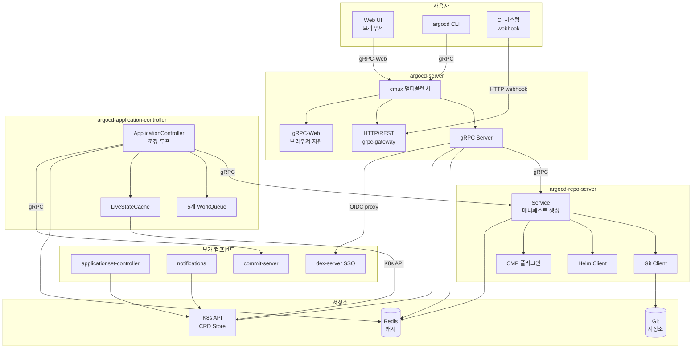
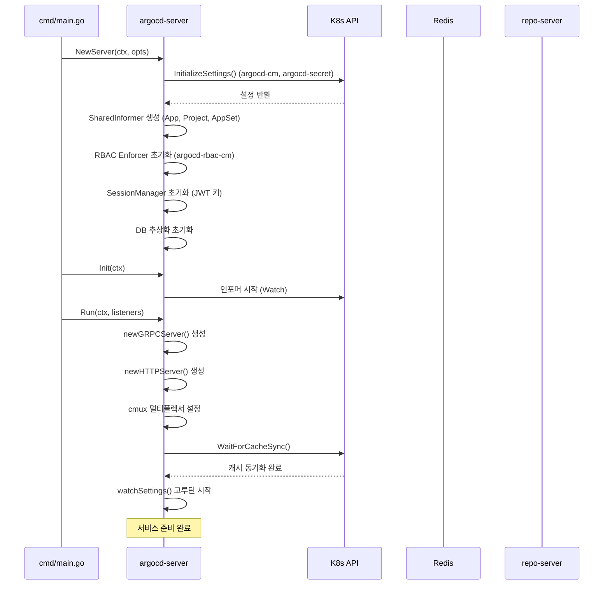
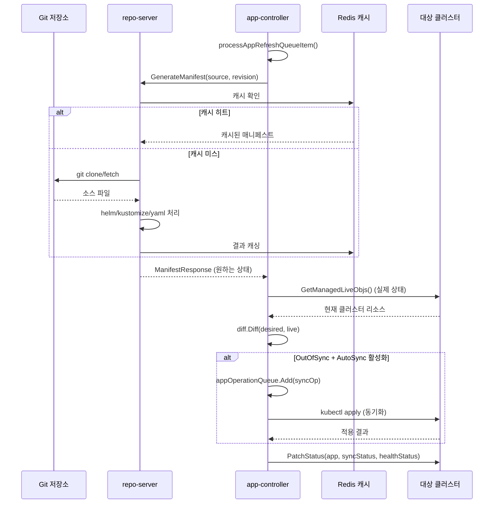

# Argo CD 아키텍처

## 목차

1. [프로젝트 개요](#1-프로젝트-개요)
2. [전체 아키텍처](#2-전체-아키텍처)
3. [컴포넌트 상세](#3-컴포넌트-상세)
4. [단일 바이너리 아키텍처](#4-단일-바이너리-아키텍처)
5. [데이터 저장 방식](#5-데이터-저장-방식)
6. [통신 패턴](#6-통신-패턴)
7. [초기화 흐름](#7-초기화-흐름)
8. [GitOps 핵심 원칙](#8-gitops-핵심-원칙)
9. [포트 및 기본 주소](#9-포트-및-기본-주소)
10. [아키텍처 설계 결정 이유](#10-아키텍처-설계-결정-이유)

---

## 1. 프로젝트 개요

### 1.1 Argo CD란

Argo CD는 **GitOps 방법론**을 Kubernetes에 적용한 선언적 지속적 배포(Continuous Delivery) 도구다. Git 저장소를 단일 진실 공급원(Single Source of Truth)으로 삼아, 클러스터의 실제 상태를 Git에 선언된 원하는 상태와 지속적으로 일치시킨다.

```
Git 저장소 (원하는 상태)
        ↓ 자동 감지 · 동기화
Kubernetes 클러스터 (실제 상태)
```

| 항목 | 내용 |
|------|------|
| 라이선스 | Apache 2.0 |
| 구현 언어 | Go |
| CNCF 단계 | Graduated (2022년 12월) |
| 저장소 | https://github.com/argoproj/argo-cd |
| 최신 메이저 버전 | v3 |
| 관리 방식 | Kubernetes CRD (Custom Resource Definition) 기반 |

### 1.2 핵심 기능

| 기능 | 설명 |
|------|------|
| 선언적 배포 | Git에 원하는 상태를 기술하면 Argo CD가 자동으로 클러스터에 적용 |
| 자동 동기화 | Git 변경 감지 → 자동 또는 수동 sync 실행 |
| 멀티 클러스터 | 단일 Argo CD 인스턴스로 여러 Kubernetes 클러스터 관리 |
| SSO 통합 | Dex를 통한 OIDC/SAML/LDAP 인증 |
| RBAC | 프로젝트·애플리케이션 단위 세밀한 권한 제어 |
| 다양한 도구 | Helm, Kustomize, Jsonnet, 일반 YAML, CMP(플러그인) 지원 |
| 감사 추적 | Git 히스토리 기반 변경 이력, K8s 이벤트 |
| 알림 | Slack, 이메일, PagerDuty 등 다양한 채널로 동기화 상태 알림 |
| ApplicationSet | 하나의 템플릿으로 여러 Application 자동 생성 |

### 1.3 해결하는 문제

기존 Push 방식 CI/CD의 문제점:

```
[기존 Push 방식]
CI Pipeline → kubectl apply → 클러스터
  - 클러스터 자격증명이 CI 시스템에 노출
  - 실제 상태와 Git 상태 불일치 탐지 불가
  - 변경 이력이 CI 로그에만 존재

[Argo CD GitOps Pull 방식]
Git 저장소 ←(감시)← Argo CD
                         ↓ (조정)
                    Kubernetes 클러스터
  - 클러스터 자격증명이 클러스터 내부에만 존재
  - 드리프트(drift) 자동 탐지 및 복구
  - Git 커밋 히스토리가 배포 감사 로그
```

---

## 2. 전체 아키텍처

### 2.1 논리 아키텍처 다이어그램

```
┌─────────────────────────────────────────────────────────────────────┐
│                     사용자 / 외부 시스템                              │
│   Web UI (브라우저)    CLI (argocd)    CI System (webhook)           │
└──────────┬─────────────────┬───────────────────┬────────────────────┘
           │ gRPC-Web        │ gRPC/REST          │ HTTP Webhook
           ▼                 ▼                   ▼
┌──────────────────────────────────────────────────────────────────────┐
│                    argocd-server (:8080)                             │
│  ┌──────────────────────────────────────────────────────────────┐   │
│  │   cmux (포트 멀티플렉서)                                       │   │
│  │   ┌──────────┐  ┌────────────────────┐  ┌────────────────┐  │   │
│  │   │ gRPC     │  │ grpc-gateway (REST) │  │ grpc-web       │  │   │
│  │   │ Server   │  │ HTTP/1.1 → gRPC    │  │ (브라우저 지원) │  │   │
│  │   └──────────┘  └────────────────────┘  └────────────────┘  │   │
│  └──────────────────────────────────────────────────────────────┘   │
│  ArgoCDServer { sessionMgr, enf(RBAC), settingsMgr, db }           │
└──────────┬──────────────────────────────────────────────────────────┘
           │ gRPC
     ┌─────┴──────────────────────────────────────────┐
     │                                                │
     ▼                                                ▼
┌────────────────────────┐              ┌─────────────────────────────┐
│ argocd-repo-server     │              │ argocd-application-         │
│       (:8081)          │              │ controller                   │
│                        │◄─────gRPC───│                              │
│ Service {              │   매니페스트  │ ApplicationController {      │
│   gitCredsStore        │   요청       │   appRefreshQueue            │
│   repoLock             │             │   appOperationQueue          │
│   cache                │             │   projectRefreshQueue        │
│   parallelismLimiter   │             │   appHydrateQueue            │
│ }                      │             │   hydrationQueue             │
│                        │             │   stateCache (LiveState)     │
│ 지원 도구:              │             │   appStateManager            │
│   Helm, Kustomize      │             │ }                            │
│   Jsonnet, YAML        │             │                              │
│   CMP Plugin           │             └──────────────┬───────────────┘
└────────────────────────┘                            │ K8s API
           │                                          ▼
           │                              ┌─────────────────────────┐
           │                              │   대상 Kubernetes        │
           │                              │   클러스터(들)           │
           │                              │   (원하는 상태 적용)     │
           │                              └─────────────────────────┘
           │
┌──────────▼──────────────────────────────────────────────────────────┐
│   Redis (:6379)                                                      │
│   - 매니페스트 캐시 (repo server)                                     │
│   - 앱 상태 캐시 (app controller)                                    │
│   - 세션 상태 (api server)                                           │
└──────────────────────────────────────────────────────────────────────┘

┌─────────────────────────────────────────────────────────────────────┐
│   Kubernetes API Server (CRD 저장소)                                 │
│   - Application CRD       (argoproj.io/v1alpha1)                    │
│   - AppProject CRD        (argoproj.io/v1alpha1)                    │
│   - ApplicationSet CRD    (argoproj.io/v1alpha1)                    │
│   - argocd-cm ConfigMap   (설정)                                     │
│   - argocd-secret Secret  (JWT 키, webhook 시크릿)                   │
│   - cluster-* Secrets     (클러스터 인증 정보)                        │
│   - repo-* Secrets        (레포지토리 자격증명)                       │
└─────────────────────────────────────────────────────────────────────┘

┌────────────────────────┐  ┌─────────────────────────────────────────┐
│ argocd-applicationset- │  │ argocd-notifications                    │
│ controller             │  │                                          │
│                        │  │ NotificationController {                 │
│ ApplicationSetReconciler│  │   ctrl (notifications-engine)           │
│ {                      │  │   appInformer                           │
│   Generators           │  │   appProjInformer                       │
│   Renderer             │  │   secretInformer                        │
│   ArgoDB               │  │   configMapInformer                     │
│ }                      │  │ }                                        │
└────────────────────────┘  └─────────────────────────────────────────┘

┌────────────────────────┐  ┌─────────────────────────────────────────┐
│ argocd-dex-server      │  │ argocd-commit-server (:8086)            │
│   (:5556)              │  │                                          │
│ SSO / OIDC 프록시       │  │ Service {                               │
│ SAML, LDAP, GitHub     │  │   repoClientFactory                     │
│ OAuth 통합              │  │   metricsServer                         │
└────────────────────────┘  │ } (Hydration: dry→wet manifest commit)  │
                             └─────────────────────────────────────────┘
```

### 2.2 Mermaid 컴포넌트 다이어그램



---

## 3. 컴포넌트 상세

### 3.1 argocd-server (API Gateway)

#### 역할과 책임

`argocd-server`는 Argo CD의 API 게이트웨이다. 모든 외부 클라이언트(Web UI, CLI, CI 시스템)의 요청을 받아 처리하며, 인증·인가·라우팅을 담당한다.

**핵심 책임:**
- gRPC, REST(grpc-gateway), gRPC-Web 동시 제공 (단일 포트 8080)
- JWT 기반 세션 관리 및 OIDC/SSO 통합
- RBAC 권한 제어 (Casbin 기반)
- Kubernetes SharedInformer를 통한 CRD 상태 감시
- 웹훅(GitHub, GitLab, Bitbucket) 수신 및 앱 리프레시 트리거

#### 주요 소스 파일

```
server/
├── server.go                       # ArgoCDServer 핵심 구조체, Run(), Init()
├── application/
│   ├── application.go              # ApplicationService gRPC 구현
│   └── websocket.go                # 로그 스트리밍 WebSocket
├── project/
│   └── project.go                  # ProjectService gRPC 구현
├── session/
│   └── session.go                  # 로그인/토큰 관리
├── cluster/
│   └── cluster.go                  # ClusterService gRPC 구현
├── repository/
│   └── repository.go               # RepositoryService gRPC 구현
├── rbacpolicy/
│   └── rbac.go                     # RBAC 정책 집행자
└── extension/
    └── extension.go                # UI 확장 기능
```

#### 핵심 구조체

```go
// server/server.go:186
type ArgoCDServer struct {
    ArgoCDServerOpts               // 설정 옵션
    ApplicationSetOpts             // ApplicationSet 설정

    ssoClientApp    *oidc.ClientApp           // OIDC 클라이언트
    settings        *settings_util.ArgoCDSettings // 전역 설정
    sessionMgr      *util_session.SessionManager  // 세션 관리자
    settingsMgr     *settings_util.SettingsManager // 설정 관리자
    enf             *rbac.Enforcer               // RBAC 집행자
    projInformer    cache.SharedIndexInformer    // AppProject 인포머
    appInformer     cache.SharedIndexInformer    // Application 인포머
    appsetInformer  cache.SharedIndexInformer    // ApplicationSet 인포머
    db              db.ArgoDB                    // DB 추상화 (K8s Secret/CM)
    stopCh          chan os.Signal                // 종료 채널
    extensionManager *extension.Manager          // UI 확장 관리자
}
```

#### cmux 포트 멀티플렉싱 동작

`server/server.go:577` `Run()` 함수에서 `cmux`를 사용해 단일 포트 8080으로 여러 프로토콜을 동시에 처리한다:

```go
// server/server.go:622-655
tcpm := cmux.New(listeners.Main)

// HTTP/1.1 트래픽 (REST API, Web UI)
httpL = tcpm.Match(cmux.HTTP1Fast("PATCH"))

// gRPC 트래픽 (Content-Type: application/grpc)
grpcL = tcpm.MatchWithWriters(
    cmux.HTTP2MatchHeaderFieldSendSettings("content-type", "application/grpc"),
)

// 각 서버를 별도 고루틴으로 실행
go func() { server.checkServeErr("grpcS", grpcS.Serve(grpcL)) }()
go func() { server.checkServeErr("httpS", httpS.Serve(httpL)) }()
go server.watchSettings()
go server.rbacPolicyLoader(ctx)
go func() { server.checkServeErr("tcpm", tcpm.Serve()) }()
```

**왜 cmux인가?** gRPC는 HTTP/2, REST는 HTTP/1.1, Web UI는 HTTP/1.1 + gRPC-Web을 사용한다. 별도 포트를 두면 로드밸런서 설정이 복잡해지므로 cmux로 단일 포트에서 프로토콜별로 분기한다.

---

### 3.2 argocd-application-controller (핵심 조정 루프)

#### 역할과 책임

`argocd-application-controller`는 Argo CD의 심장부다. 모든 Application CR을 감시하며, Git의 원하는 상태와 클러스터의 실제 상태를 끊임없이 비교·조정한다.

**핵심 책임:**
- Application 조정 루프(reconciliation loop) 실행
- Git 원하는 상태 ↔ 클러스터 실제 상태 차이(diff) 계산
- AutoSync 정책에 따른 자동 배포 실행
- 클러스터별 LiveStateCache 유지
- 멀티 컨트롤러 샤딩(sharding) 지원

#### 주요 소스 파일

```
controller/
├── appcontroller.go                # ApplicationController, 5개 워크큐
├── appstate.go                     # AppStateManager (상태 비교 로직)
├── cache/
│   └── cache.go                    # LiveStateCache (클러스터 상태 캐시)
├── hydrator/
│   └── hydrator.go                 # 매니페스트 하이드레이션 처리
├── sharding/
│   └── sharding.go                 # 클러스터 샤딩 로직
└── metrics/
    └── metrics.go                  # 컨트롤러 메트릭
```

#### 핵심 구조체

```go
// controller/appcontroller.go:106
type ApplicationController struct {
    cache                *appstatecache.Cache
    namespace            string
    kubeClientset        kubernetes.Interface
    kubectl              kube.Kubectl
    applicationClientset appclientset.Interface
    auditLogger          *argo.AuditLogger

    // 5개의 워크큐 — 각각 독립적인 처리 파이프라인
    appRefreshQueue               workqueue.TypedRateLimitingInterface[string]
    appComparisonTypeRefreshQueue workqueue.TypedRateLimitingInterface[string]
    appOperationQueue             workqueue.TypedRateLimitingInterface[string]
    projectRefreshQueue           workqueue.TypedRateLimitingInterface[string]
    appHydrateQueue               workqueue.TypedRateLimitingInterface[string]
    hydrationQueue                workqueue.TypedRateLimitingInterface[hydratortypes.HydrationQueueKey]

    appInformer          cache.SharedIndexInformer
    appLister            applisters.ApplicationLister
    projInformer         cache.SharedIndexInformer
    appStateManager      AppStateManager        // 상태 비교 엔진
    stateCache           statecache.LiveStateCache // 클러스터 라이브 상태
    statusRefreshTimeout time.Duration
    selfHealTimeout      time.Duration
    db                   db.ArgoDB
    settingsMgr          *settings_util.SettingsManager
    clusterSharding      sharding.ClusterShardingCache
    hydrator             *hydrator.Hydrator
}
```

#### 5개 워크큐와 처리 루프

```go
// controller/appcontroller.go:887
func (ctrl *ApplicationController) Run(
    ctx context.Context,
    statusProcessors int,
    operationProcessors int,
) {
    // 큐 초기화 및 인포머 시작
    go ctrl.appInformer.Run(ctx.Done())
    go ctrl.projInformer.Run(ctx.Done())
    errors.CheckError(ctrl.stateCache.Init())
    go ctrl.stateCache.Run(ctx)

    // 큐 1: 앱 상태 갱신 (statusProcessors 수만큼 병렬 처리)
    for range statusProcessors {
        go wait.Until(func() {
            for ctrl.processAppRefreshQueueItem() {}
        }, time.Second, ctx.Done())
    }

    // 큐 2: 동기화 작업 처리 (operationProcessors 수만큼 병렬)
    for range operationProcessors {
        go wait.Until(func() {
            for ctrl.processAppOperationQueueItem() {}
        }, time.Second, ctx.Done())
    }

    // 큐 3: 비교 타입 갱신
    go wait.Until(func() {
        for ctrl.processAppComparisonTypeQueueItem() {}
    }, time.Second, ctx.Done())

    // 큐 4: 하이드레이션 처리
    // ...
}
```

| 워크큐 | 이름 | 역할 |
|--------|------|------|
| `appRefreshQueue` | app_reconciliation_queue | 앱 상태 비교·갱신 |
| `appComparisonTypeRefreshQueue` | - | 비교 타입(최신/최근/없음) 처리 |
| `appOperationQueue` | app_operation_processing_queue | Sync/Rollback 작업 실행 |
| `projectRefreshQueue` | project_reconciliation_queue | 프로젝트 정책 갱신 |
| `appHydrateQueue` | app_hydration_queue | 매니페스트 하이드레이션 |

**왜 여러 큐인가?** 상태 갱신(읽기 위주)과 동기화 작업(쓰기 위주)을 분리해 두면, 많은 앱의 상태를 빠르게 확인하면서도 sync 작업이 상태 갱신을 차단하지 않는다. 독립적인 속도 제어와 병렬도 설정이 가능하다.

---

### 3.3 argocd-repo-server (매니페스트 생성)

#### 역할과 책임

`argocd-repo-server`는 Git 저장소를 클론하고 Kubernetes 매니페스트를 생성하는 서비스다. Application Controller와 API Server로부터 gRPC 요청을 받아 매니페스트를 반환한다.

**핵심 책임:**
- Git/Helm/OCI 저장소에서 소스 가져오기
- Helm, Kustomize, Jsonnet, 일반 YAML 처리
- CMP(Config Management Plugin) 플러그인과의 소켓 통신
- 매니페스트 캐싱 (Redis 활용)
- 병렬 처리를 위한 세마포어 기반 동시성 제어

#### 주요 소스 파일

```
reposerver/
├── repository/
│   └── repository.go               # Service — 핵심 매니페스트 생성 로직
├── cache/
│   └── cache.go                    # 매니페스트 캐시 (Redis)
├── apiclient/
│   └── repository.go               # gRPC 클라이언트 인터페이스
└── metrics/
    └── metrics.go                  # 레포서버 메트릭
```

#### 핵심 구조체

```go
// reposerver/repository/repository.go:82
type Service struct {
    gitCredsStore             git.CredsStore       // Git 자격증명 저장소
    rootDir                   string               // 작업 디렉토리 루트
    gitRepoPaths              utilio.TempPaths     // Git 클론 임시 경로
    chartPaths                utilio.TempPaths     // Helm 차트 임시 경로
    ociPaths                  utilio.TempPaths     // OCI 임시 경로
    repoLock                  *repositoryLock      // 레포 동시 접근 제어
    cache                     *cache.Cache         // Redis 캐시
    parallelismLimitSemaphore *semaphore.Weighted  // 병렬 처리 제한
    metricsServer             *metrics.MetricsServer
    newOCIClient              func(...) (oci.Client, error)
    newGitClient              func(...) (git.Client, error)
    newHelmClient             func(...) helm.Client
    initConstants             RepoServerInitConstants
    now                       func() time.Time
}
```

#### 매니페스트 생성 흐름

```
GenerateManifest(ctx, ManifestRequest)
    ├── 캐시 확인 (Redis)
    │   └── 캐시 히트 → 즉시 반환
    ├── 캐시 미스 → Git 클론/fetch
    │   ├── gitCredsStore에서 자격증명 조회
    │   └── repoLock으로 동시 접근 제어
    ├── 소스 타입 감지 (GetAppSourceType)
    │   ├── Helm → helm template 실행
    │   ├── Kustomize → kustomize build 실행
    │   ├── Jsonnet → jsonnet 실행
    │   ├── Directory → YAML 파일 로드
    │   └── Plugin (CMP) → 유닉스 소켓으로 플러그인 통신
    └── 결과를 Redis에 캐싱 후 반환
```

---

### 3.4 argocd-applicationset-controller

#### 역할과 책임

`argocd-applicationset-controller`는 ApplicationSet CRD를 처리하는 컨트롤러다. 하나의 ApplicationSet 템플릿으로부터 여러 Application을 자동으로 생성·관리한다.

**핵심 책임:**
- ApplicationSet CR 감시 및 조정
- 다양한 Generator를 통해 파라미터 목록 생성
- 템플릿에 파라미터 적용해 Application CR 생성/업데이트/삭제
- Progressive Syncs 지원 (단계적 롤아웃)

#### 주요 소스 파일

```
applicationset/
├── controllers/
│   ├── applicationset_controller.go  # ApplicationSetReconciler
│   └── template/
│       └── template.go               # Application 템플릿 렌더링
├── generators/
│   ├── cluster.go                    # 클러스터 Generator
│   ├── git.go                        # Git 디렉토리/파일 Generator
│   ├── list.go                       # 정적 목록 Generator
│   ├── matrix.go                     # 매트릭스 Generator
│   └── merge.go                      # 병합 Generator
└── utils/
    └── render.go                     # 템플릿 렌더러
```

#### 핵심 구조체

```go
// applicationset/controllers/applicationset_controller.go:96
type ApplicationSetReconciler struct {
    client.Client
    Scheme               *runtime.Scheme
    Recorder             record.EventRecorder
    Generators           map[string]generators.Generator  // 이름 → Generator 맵
    ArgoDB               db.ArgoDB
    KubeClientset        kubernetes.Interface
    Policy               argov1alpha1.ApplicationsSyncPolicy
    EnablePolicyOverride bool
    utils.Renderer                          // 템플릿 렌더러
    ArgoCDNamespace            string
    ApplicationSetNamespaces   []string
    EnableProgressiveSyncs     bool
    SCMRootCAPath              string
    GlobalPreservedAnnotations []string
    GlobalPreservedLabels      []string
    Metrics                    *metrics.ApplicationsetMetrics
    MaxResourcesStatusCount    int
    ClusterInformer            *settings.ClusterInformer
}
```

#### Generator 종류

| Generator | 설명 |
|-----------|------|
| List | 정적으로 정의된 값 목록 |
| Cluster | 등록된 K8s 클러스터 목록 |
| Git | Git 저장소의 디렉토리 또는 파일 내용 |
| Matrix | 두 Generator의 카르테시안 곱 |
| Merge | 여러 Generator를 병합 |
| SCMProvider | GitHub/GitLab의 저장소 목록 |
| PullRequest | PR 목록 기반 생성 |
| ClusterDecisionResource | ArgoCD용 클러스터 결정 리소스 |

---

### 3.5 argocd-notifications

#### 역할과 책임

`argocd-notifications`는 Application 상태 변경 시 외부 시스템으로 알림을 전송하는 컨트롤러다.

**핵심 책임:**
- Application/AppProject CR 변경 감시
- 트리거(trigger) 조건 평가
- 구독(subscription) 관리
- Slack, 이메일, PagerDuty, Teams 등으로 알림 전송

#### 핵심 구조체

```go
// notification_controller/controller/controller.go:57
type notificationController struct {
    ctrl              controller.NotificationController  // notifications-engine 컨트롤러
    appInformer       cache.SharedIndexInformer          // Application 감시자
    appProjInformer   cache.SharedIndexInformer          // AppProject 감시자
    secretInformer    cache.SharedIndexInformer          // 알림 시크릿 감시자
    configMapInformer cache.SharedIndexInformer          // 알림 설정 감시자
}

type NotificationController interface {
    Run(ctx context.Context, processors int)
    Init(ctx context.Context) error
}
```

---

### 3.6 argocd-dex-server (SSO)

#### 역할과 책임

`argocd-dex-server`는 SSO(Single Sign-On)를 위한 OIDC 프로바이더 프록시다. Dex 오픈소스 프로젝트를 내장하여 다양한 외부 인증 시스템과 연동한다.

**지원 인증 방식:**
- GitHub OAuth
- GitLab OAuth
- Microsoft LDAP/AD
- SAML 2.0
- OIDC 프로바이더

기본 주소: `argocd-dex-server:5556`

---

### 3.7 argocd-commit-server (하이드레이션)

#### 역할과 책임

`argocd-commit-server`는 Argo CD v3에서 도입된 신기능으로, 매니페스트 하이드레이션(hydration)을 담당한다. "Dry" 소스(Helm 차트, Kustomize 오버레이 등)를 "Wet" 매니페스트(렌더링된 YAML)로 변환하여 별도 Git 브랜치에 커밋한다.

**핵심 책임:**
- dry 소스 → wet 매니페스트 변환
- 하이드레이션 결과를 Git에 커밋
- git notes 네임스페이스(`hydrator.metadata`)에 메타데이터 저장
- 하이드레이션 이력 관리

```go
// commitserver/commit/commit.go:21
const (
    NoteNamespace = "hydrator.metadata" // git notes 네임스페이스
    ManifestYaml  = "manifest.yaml"     // 하이드레이션 결과 파일명
)

// commitserver/commit/commit.go:26
type Service struct {
    metricsServer     *metrics.Server
    repoClientFactory RepoClientFactory
}
```

기본 주소: `argocd-commit-server:8086`

---

## 4. 단일 바이너리 아키텍처

### 4.1 개요

Argo CD는 모든 컴포넌트를 **하나의 바이너리**로 배포한다. 실행 시 `os.Args[0]` 또는 `ARGOCD_BINARY_NAME` 환경변수로 어떤 컴포넌트로 동작할지 결정한다.

```
argocd (단일 바이너리)
    │
    ├── os.Args[0] == "argocd-server"              → API Server
    ├── os.Args[0] == "argocd-application-controller" → App Controller
    ├── os.Args[0] == "argocd-repo-server"         → Repo Server
    ├── os.Args[0] == "argocd-applicationset-controller" → AppSet Controller
    ├── os.Args[0] == "argocd-notifications"       → Notifications
    ├── os.Args[0] == "argocd-cmp-server"          → CMP Server
    ├── os.Args[0] == "argocd-commit-server"       → Commit Server
    ├── os.Args[0] == "argocd-dex"                 → Dex SSO
    ├── os.Args[0] == "argocd-git-ask-pass"        → Git Auth Helper
    ├── os.Args[0] == "argocd-k8s-auth"            → K8s Auth
    └── os.Args[0] == "argocd" (기본값)             → CLI
```

### 4.2 진입점 코드 (cmd/main.go)

```go
// cmd/main.go:36-77
func main() {
    var command *cobra.Command

    // 바이너리 이름으로 실행 모드 결정
    binaryName := filepath.Base(os.Args[0])
    if val := os.Getenv(binaryNameEnv); val != "" {
        binaryName = val  // 환경변수 ARGOCD_BINARY_NAME 우선
    }

    isArgocdCLI := false

    switch binaryName {
    case common.CommandCLI:                     // "argocd"
        command = cli.NewCommand()
        isArgocdCLI = true
    case common.CommandServer:                  // "argocd-server"
        command = apiserver.NewCommand()
    case common.CommandApplicationController:   // "argocd-application-controller"
        command = appcontroller.NewCommand()
    case common.CommandRepoServer:              // "argocd-repo-server"
        command = reposerver.NewCommand()
    case common.CommandCMPServer:               // "argocd-cmp-server"
        command = cmpserver.NewCommand()
        isArgocdCLI = true
    case common.CommandCommitServer:            // "argocd-commit-server"
        command = commitserver.NewCommand()
    case common.CommandDex:                     // "argocd-dex"
        command = dex.NewCommand()
    case common.CommandNotifications:           // "argocd-notifications"
        command = notification.NewCommand()
    case common.CommandGitAskPass:              // "argocd-git-ask-pass"
        command = gitaskpass.NewCommand()
        isArgocdCLI = true
    case common.CommandApplicationSetController: // "argocd-applicationset-controller"
        command = applicationset.NewCommand()
    case common.CommandK8sAuth:                 // "argocd-k8s-auth"
        command = k8sauth.NewCommand()
        isArgocdCLI = true
    default:
        // "argocd-linux-amd64" 등 플랫폼별 이름도 CLI로 처리
        command = cli.NewCommand()
        isArgocdCLI = true
    }

    err := command.Execute()
    // 에러 시 플러그인 실행 시도 후 종료
}
```

### 4.3 서브커맨드 상수 정의 (common/common.go)

```go
// common/common.go:24-35
const (
    CommandCLI                      = "argocd"
    CommandApplicationController    = "argocd-application-controller"
    CommandApplicationSetController = "argocd-applicationset-controller"
    CommandServer                   = "argocd-server"
    CommandCMPServer                = "argocd-cmp-server"
    CommandCommitServer             = "argocd-commit-server"
    CommandGitAskPass               = "argocd-git-ask-pass"
    CommandNotifications            = "argocd-notifications"
    CommandK8sAuth                  = "argocd-k8s-auth"
    CommandDex                      = "argocd-dex"
    CommandRepoServer               = "argocd-repo-server"
)
```

### 4.4 Kubernetes 배포 구조

실제 Kubernetes 배포에서는 심볼릭 링크 또는 `ARGOCD_BINARY_NAME` 환경변수를 사용한다:

```yaml
# 예시: argocd-server Pod의 컨테이너 실행 커맨드
command: [argocd-server]
# 또는
command: [/usr/local/bin/argocd]
env:
  - name: ARGOCD_BINARY_NAME
    value: argocd-server
```

**단일 바이너리를 쓰는 이유:**
- 컨테이너 이미지 하나로 모든 컴포넌트를 실행 → 이미지 레이어 공유로 저장소 절약
- 코드 공유 (공통 유틸리티, 타입 정의) 용이
- 버전 일관성 보장 — 모든 컴포넌트가 항상 같은 버전

---

## 5. 데이터 저장 방식

### 5.1 외부 DB 없음 — Kubernetes as DB

Argo CD는 **별도의 데이터베이스를 사용하지 않는다.** 모든 영속 데이터는 Kubernetes Secret과 ConfigMap에 저장된다. 이는 Argo CD 자체가 Kubernetes 네이티브임을 잘 보여준다.

```
argocd namespace
├── ConfigMap
│   ├── argocd-cm                     # 핵심 설정 (URL, OIDC, 레포, 클러스터 등)
│   ├── argocd-rbac-cm                # RBAC 정책
│   ├── argocd-ssh-known-hosts-cm     # SSH 알려진 호스트
│   ├── argocd-tls-certs-cm           # TLS 인증서
│   ├── argocd-gpg-keys-cm            # GPG 키
│   ├── argocd-cmd-params-cm          # 컨트롤러 파라미터
│   └── argocd-notifications-cm       # 알림 설정
│
└── Secret
    ├── argocd-secret                  # JWT 서명 키, webhook 시크릿, 비밀번호
    ├── argocd-notifications-secret    # 알림 서비스 토큰
    ├── [cluster-* 형식]               # 클러스터 인증 정보
    │   └── label: argocd.argoproj.io/secret-type=cluster
    └── [repo-* 형식]                  # 레포지토리 자격증명
        └── label: argocd.argoproj.io/secret-type=repository
```

### 5.2 Secret 레이블 기반 조회

Argo CD는 `argocd.argoproj.io/secret-type` 레이블로 Secret을 구분한다:

```go
// common/common.go:195-207
const (
    LabelKeySecretType = "argocd.argoproj.io/secret-type"

    LabelValueSecretTypeCluster         = "cluster"
    LabelValueSecretTypeRepository      = "repository"
    LabelValueSecretTypeRepoCreds       = "repo-creds"
    LabelValueSecretTypeRepositoryWrite = "repository-write"
    LabelValueSecretTypeRepoCredsWrite  = "repo-write-creds"
)
```

#### 클러스터 Secret 예시

```yaml
apiVersion: v1
kind: Secret
metadata:
  name: my-cluster-secret
  labels:
    argocd.argoproj.io/secret-type: cluster
type: Opaque
stringData:
  name: my-cluster
  server: https://my-cluster.example.com
  config: |
    {
      "bearerToken": "...",
      "tlsClientConfig": {
        "insecure": false,
        "caData": "..."
      }
    }
```

#### 레포지토리 Secret 예시

```yaml
apiVersion: v1
kind: Secret
metadata:
  name: my-repo-secret
  labels:
    argocd.argoproj.io/secret-type: repository
type: Opaque
stringData:
  type: git
  url: https://github.com/my-org/my-repo
  username: my-user
  password: my-token
```

### 5.3 ConfigMap 주요 키

```
argocd-cm ConfigMap 주요 키:
├── url                     # Argo CD 접속 URL
├── oidc.config             # OIDC 설정 (YAML)
├── repositories            # 레포지토리 목록 (Secret 사용 권장)
├── resource.customizations # 커스텀 헬스 체크
├── admin.enabled           # admin 계정 활성화 여부
└── application.resourceTrackingMethod  # 리소스 추적 방식

argocd-rbac-cm ConfigMap 주요 키:
├── policy.csv              # Casbin 형식 RBAC 정책
├── policy.default          # 기본 역할
└── scopes                  # OIDC 스코프
```

### 5.4 Redis — 캐시 레이어

Redis는 영속 저장소가 아닌 **캐시**로만 사용된다. Redis가 재시작되면 데이터가 사라지지만 서비스는 계속 동작한다(단, 성능이 저하될 수 있다).

| 용도 | 키 패턴 | 저장 주체 |
|------|---------|-----------|
| 매니페스트 캐시 | `mfst|...` | repo-server |
| 앱 상태 캐시 | `app|...` | app-controller |
| 세션 상태 | `sess|...` | api-server |
| 클러스터 정보 | `cluster|...` | app-controller |
| 사용자 정보 캐시 | `userinfo|...` | api-server |

기본 주소: `argocd-redis:6379`

### 5.5 CRD — Application/AppProject/ApplicationSet

```go
// pkg/apis/application/v1alpha1/types.go:68
type Application struct {
    metav1.TypeMeta   `json:",inline"`
    metav1.ObjectMeta `json:"metadata"`
    Spec              ApplicationSpec   `json:"spec"`
    Status            ApplicationStatus `json:"status,omitempty"`
    Operation         *Operation        `json:"operation,omitempty"`
}

type ApplicationSpec struct {
    Source      *ApplicationSource      // Git 소스 (단일)
    Sources     ApplicationSources      // Git 소스 (다중)
    Destination ApplicationDestination  // 배포 대상 클러스터/네임스페이스
    Project     string                  // 소속 프로젝트
    SyncPolicy  *SyncPolicy             // 자동 동기화 정책
    IgnoreDifferences IgnoreDifferences // 무시할 차이점
    SourceHydrator *SourceHydrator      // 하이드레이션 설정 (v3 신기능)
}
```

---

## 6. 통신 패턴

### 6.1 통신 흐름 전체 다이어그램

```
┌─────────────────────────────────────────────────────────────────┐
│                         통신 패턴 요약                           │
├─────────────────────────────────────────────────────────────────┤
│                                                                 │
│  [CLI/UI] ──gRPC/REST──► [argocd-server]                       │
│                                  │                              │
│                          ┌───────┴────────┐                    │
│                          │ gRPC           │ gRPC               │
│                          ▼               ▼                     │
│               [repo-server]    [app-controller]                 │
│                          │               │                      │
│                          │ gRPC          │ K8s API (REST)       │
│                          └───────────────┼────────────────┐    │
│                                          ▼                │    │
│                                  [대상 클러스터]           │    │
│                                                           │    │
│              [argocd-server] ──HTTP proxy──► [dex-server] │    │
│                                                           │    │
│                    [모든 컴포넌트] ──TCP──► [Redis]        │    │
│                                                           │    │
│              [app-controller] ──gRPC──► [commit-server]   │    │
│                                                           │    │
│              [applicationset-controller] ──K8s API──► K8s │    │
└─────────────────────────────────────────────────────────────────┘
```

### 6.2 API Server ↔ 클라이언트

Argo CD API Server는 단일 포트(기본 8080)로 세 가지 프로토콜을 제공한다:

```
클라이언트 종류별 통신 방식:

argocd CLI
  └── gRPC (HTTP/2, protobuf)
      Content-Type: application/grpc

Web UI (브라우저)
  └── gRPC-Web (HTTP/1.1로 gRPC 래핑)
      grpcweb.WrapServer(grpcS) 통해 처리

REST 클라이언트 (curl, CI 도구)
  └── HTTP/REST
      grpc-gateway가 REST ↔ gRPC 변환
      예: GET /api/v1/applications → ApplicationService.List()

CI Webhook (GitHub, GitLab)
  └── HTTP POST /api/webhook
      app-refresh 트리거
```

### 6.3 API Server ↔ Repo Server

```go
// 내부 서비스 기본 주소 (common/common.go:41)
const DefaultRepoServerAddr = "argocd-repo-server:8081"
```

- 프로토콜: gRPC
- 인터페이스: `RepoServerServiceClient` (protobuf 정의)
- 주요 메서드: `GenerateManifest`, `GenerateManifestWithFiles`, `GetRepoObjects`

### 6.4 Application Controller ↔ Repo Server

```go
// controller/appcontroller.go:152-157
func NewApplicationController(
    ...
    repoClientset apiclient.Clientset,   // repo-server gRPC 클라이언트
    commitClientset commitclient.Clientset, // commit-server gRPC 클라이언트
    ...
)
```

Application Controller는 상태 비교(diff) 시 repo-server에 매니페스트를 요청한다. 이 호출은 앱 갱신 루프(`processAppRefreshQueueItem`)에서 발생한다.

### 6.5 Application Controller ↔ 대상 클러스터

```go
// controller/appcontroller.go에서 stateCache를 통해 클러스터 접근
// stateCache는 gitops-engine의 LiveStateCache를 활용
// 클러스터 인증 정보는 argocd-secret에서 조회
```

- 프로토콜: Kubernetes API (REST/HTTP)
- 인증: cluster Secret에 저장된 bearer token 또는 TLS 클라이언트 인증서
- 동시 연결: 클러스터별로 별도 클라이언트, 샤딩으로 분산

### 6.6 grpc-gateway를 통한 REST 변환

```
REST 요청                           gRPC 메서드
GET  /api/v1/applications        → ApplicationService.List
GET  /api/v1/applications/{name} → ApplicationService.Get
POST /api/v1/applications        → ApplicationService.Create
POST /api/v1/applications/{name}/sync → ApplicationService.Sync
GET  /api/v1/clusters            → ClusterService.List
POST /api/v1/session             → SessionService.Create
```

`grpc-gateway`가 HTTP 요청을 받아 동일한 gRPC 서버로 전달한다. 즉, gRPC 서비스를 한 번만 구현하면 REST API와 gRPC API가 자동으로 제공된다.

---

## 7. 초기화 흐름

### 7.1 argocd-server 초기화

```
NewServer(ctx, opts) — server/server.go:310
    │
    ├── settings_util.NewSettingsManager(kubeClientset, namespace)
    │   └── ConfigMap/Secret 감시자 등록
    │
    ├── settingsMgr.InitializeSettings()
    │   └── argocd-cm, argocd-secret 읽어 초기 설정 로드
    │
    ├── SharedInformer 생성
    │   ├── projFactory.Argoproj().V1alpha1().AppProjects()  → projInformer
    │   ├── appFactory.Argoproj().V1alpha1().Applications()  → appInformer
    │   └── appFactory.Argoproj().V1alpha1().ApplicationSets() → appsetInformer
    │
    ├── rbac.NewEnforcer(kubeClientset, namespace, "argocd-rbac-cm", nil)
    │   └── Casbin 정책 로드
    │
    ├── util_session.NewSessionManager(settingsMgr, projLister, ...)
    │   └── JWT 서명 키 초기화
    │
    ├── db.NewDB(namespace, settingsMgr, kubeClientset)
    │   └── K8s Secret/ConfigMap DB 추상화 초기화
    │
    ├── oidc.NewClientApp(settings, dexServerAddr, ...)
    │   └── OIDC 클라이언트 앱 초기화
    │
    └── extension.NewManager(...)
        └── UI 확장 관리자 초기화

Init(ctx) — server/server.go:564
    ├── go projInformer.Run(ctx.Done())
    ├── go appInformer.Run(ctx.Done())
    ├── go appsetInformer.Run(ctx.Done())
    ├── go clusterInformer.Run(ctx.Done())
    ├── go configMapInformer.Run(ctx.Done())
    └── go secretInformer.Run(ctx.Done())

Run(ctx, listeners) — server/server.go:577
    ├── newGRPCServer()            # gRPC 서버 생성
    ├── grpcweb.WrapServer(grpcS)  # gRPC-Web 래퍼
    ├── newHTTPServer()            # HTTP 서버 생성 (grpc-gateway)
    ├── cmux.New(listeners.Main)   # 포트 멀티플렉서 초기화
    ├── tcpm.Match(HTTP1, gRPC)    # 프로토콜별 리스너 등록
    ├── go grpcS.Serve(grpcL)      # gRPC 서버 시작
    ├── go httpS.Serve(httpL)      # HTTP 서버 시작
    ├── go watchSettings()         # 설정 변경 감시 루프
    ├── go rbacPolicyLoader(ctx)   # RBAC 정책 갱신 루프
    ├── go tcpm.Serve()            # cmux 멀티플렉서 시작
    └── cache.WaitForCacheSync()   # 인포머 캐시 동기화 대기
```

### 7.2 argocd-application-controller 초기화

```
NewApplicationController(...)  — controller/appcontroller.go:152
    │
    ├── db.NewDB(namespace, settingsMgr, kubeClientset)
    ├── 5개 WorkQueue 생성
    │   ├── appRefreshQueue               (app_reconciliation_queue)
    │   ├── appComparisonTypeRefreshQueue
    │   ├── appOperationQueue             (app_operation_processing_queue)
    │   ├── projectRefreshQueue           (project_reconciliation_queue)
    │   └── appHydrateQueue              (app_hydration_queue)
    │
    ├── statecache.NewLiveStateCache(db, appInformer, settingsMgr, ...)
    ├── NewAppStateManager(db, applicationClientset, repoClientset, ...)
    └── hydrator.NewHydrator(...)

Run(ctx, statusProcessors, operationProcessors) — controller/appcontroller.go:887
    │
    ├── RegisterClusterSecretUpdater(ctx)
    ├── metricsServer.RegisterClustersInfoSource(...)
    ├── go appInformer.Run(ctx.Done())
    ├── go projInformer.Run(ctx.Done())
    ├── stateCache.Init()                # 클러스터 캐시 초기화
    ├── cache.WaitForCacheSync(...)      # 캐시 동기화 대기
    ├── go stateCache.Run(ctx)           # 라이브 상태 감시 시작
    ├── go metricsServer.ListenAndServe()
    ├── [statusProcessors 수] × go processAppRefreshQueueItem()
    ├── [operationProcessors 수] × go processAppOperationQueueItem()
    ├── go processAppComparisonTypeQueueItem()
    └── go processAppHydrateQueueItem()
```

### 7.3 초기화 흐름 시퀀스 다이어그램



---

## 8. GitOps 핵심 원칙

### 8.1 GitOps의 4가지 원칙

```
┌──────────────────────────────────────────────────────────────┐
│                    GitOps 4원칙                               │
├──────────────────────────────────────────────────────────────┤
│                                                              │
│  1. 선언적 (Declarative)                                     │
│     "무엇을" 원하는지 기술, "어떻게" 하는지는 시스템이 결정    │
│     → ApplicationSpec.Source, ApplicationSpec.Destination    │
│                                                              │
│  2. 버전 관리 (Versioned & Immutable)                        │
│     모든 변경은 Git 커밋으로 기록, 롤백은 git revert          │
│     → Application.Status.History                             │
│                                                              │
│  3. 자동 승인 (Automatically Pulled)                         │
│     Git 변경 감지 → 자동으로 클러스터에 적용                  │
│     → SyncPolicy.Automated                                   │
│                                                              │
│  4. 지속적 조정 (Continuously Reconciled)                    │
│     원하는 상태 ≠ 실제 상태 → 자동 교정 (self-heal)          │
│     → SyncPolicy.SelfHeal                                    │
│                                                              │
└──────────────────────────────────────────────────────────────┘
```

### 8.2 조정 루프 (Reconciliation Loop) 상세

Argo CD의 핵심은 끊임없이 실행되는 조정 루프다. Kubernetes 컨트롤러 패턴을 따른다:

```
조정 루프 (processAppRefreshQueueItem):

1. 큐에서 앱 키 꺼내기
   └── appKey = "namespace/app-name"

2. Git에서 원하는 상태(desired state) 가져오기
   └── repo-server.GenerateManifest(source, revision)

3. 클러스터에서 실제 상태(live state) 가져오기
   └── stateCache.GetManagedLiveObjs(cluster, app)

4. 차이(diff) 계산
   └── gitops-engine/pkg/diff.Diff(desired, live)

5. 동기화 상태 결정
   ├── Synced     : desired == live
   ├── OutOfSync  : desired != live
   └── Unknown    : 비교 불가

6. 헬스 상태 확인
   ├── Healthy    : 모든 리소스 정상
   ├── Progressing: 배포 진행 중
   ├── Degraded   : 이상 감지
   └── Missing    : 리소스 없음

7. AutoSync 처리
   └── SyncPolicy.Automated 설정 시
       └── appOperationQueue에 Sync 작업 추가

8. Status 업데이트
   └── k8s.PatchStatus(app, newStatus)
```

### 8.3 Git → 클러스터 동기화 상세



### 8.4 AutoSync 정책 설정 예시

```yaml
apiVersion: argoproj.io/v1alpha1
kind: Application
metadata:
  name: my-app
  namespace: argocd
spec:
  project: default
  source:
    repoURL: https://github.com/my-org/my-repo
    targetRevision: HEAD
    path: k8s/overlays/production
  destination:
    server: https://kubernetes.default.svc
    namespace: production
  syncPolicy:
    automated:
      prune: true      # Git에 없는 리소스 자동 삭제
      selfHeal: true   # 클러스터에서 직접 변경 시 자동 복구
    syncOptions:
      - CreateNamespace=true
    retry:
      limit: 5
      backoff:
        duration: 5s
        factor: 2
        maxDuration: 3m
```

### 8.5 드리프트(Drift) 감지와 자동 복구

```
시나리오: 누군가 kubectl로 직접 Deployment replicas를 변경

Git 상태:   replicas: 3   (원하는 상태)
클러스터:   replicas: 1   (실제 상태) ← 직접 수정

app-controller 조정 루프:
    1. diff 감지 → OutOfSync
    2. selfHeal: true 설정 확인
    3. selfHealTimeout 대기 (기본 5분)
    4. Sync 실행: kubectl apply → replicas: 3 복구
    5. Synced 상태로 갱신

⚠ selfHeal: false 시:
    1. OutOfSync 상태 표시
    2. 알림 전송 (notifications)
    3. 자동 복구 없음 → 수동 sync 필요
```

---

## 9. 포트 및 기본 주소

### 9.1 포트 상수 (common/common.go)

```go
// common/common.go:74-82
const (
    DefaultPortAPIServer              = 8080   // argocd-server (gRPC + REST + gRPC-Web)
    DefaultPortRepoServer             = 8081   // argocd-repo-server (gRPC)
    DefaultPortArgoCDMetrics          = 8082   // app-controller 메트릭
    DefaultPortArgoCDAPIServerMetrics = 8083   // argocd-server 메트릭
    DefaultPortRepoServerMetrics      = 8084   // repo-server 메트릭
    DefaultPortCommitServer           = 8086   // argocd-commit-server (gRPC)
    DefaultPortCommitServerMetrics    = 8087   // commit-server 메트릭
)
```

### 9.2 서비스 주소 상수

```go
// common/common.go:39-47
const (
    DefaultRepoServerAddr   = "argocd-repo-server:8081"
    DefaultCommitServerAddr = "argocd-commit-server:8086"
    DefaultDexServerAddr    = "argocd-dex-server:5556"
    DefaultRedisAddr        = "argocd-redis:6379"
)
```

### 9.3 포트 맵

| 서비스 | 포트 | 프로토콜 | 용도 |
|--------|------|----------|------|
| argocd-server | 8080 | gRPC + HTTP | API Gateway (단일 포트) |
| argocd-server | 8083 | HTTP | Prometheus 메트릭 |
| argocd-repo-server | 8081 | gRPC | 매니페스트 생성 |
| argocd-repo-server | 8084 | HTTP | Prometheus 메트릭 |
| argocd-application-controller | 8082 | HTTP | Prometheus 메트릭 |
| argocd-commit-server | 8086 | gRPC | 하이드레이션 |
| argocd-commit-server | 8087 | HTTP | Prometheus 메트릭 |
| argocd-dex-server | 5556 | HTTP | OIDC/SSO |
| argocd-redis | 6379 | TCP | 캐시 |

---

## 10. 아키텍처 설계 결정 이유

### 10.1 왜 단일 바이너리인가?

```
선택: 모든 컴포넌트를 하나의 Go 바이너리로 컴파일

이유:
1. 이미지 레이어 공유
   - 컨테이너 이미지 하나 → 모든 컴포넌트에서 동일한 OS 레이어, Go 런타임 공유
   - 전체 배포 이미지 크기 감소

2. 코드 공유 용이성
   - 공통 타입(v1alpha1.Application, v1alpha1.AppProject) 하나의 패키지에 정의
   - 공통 유틸리티(git, helm, kustomize, db) 단순 import

3. 버전 일관성
   - 모든 컴포넌트가 반드시 같은 버전 → 호환성 문제 원천 차단

4. 배포 단순화
   - Kubernetes 배포 시 imagePullPolicy: IfNotPresent이면 이미지 한 번만 pull
```

### 10.2 왜 외부 DB 없이 K8s Secret/ConfigMap만 사용하는가?

```
선택: PostgreSQL/etcd 등 별도 DB 없이 K8s native 저장소 사용

이유:
1. 운영 복잡도 감소
   - 추가 인프라 컴포넌트(DB, 백업) 필요 없음
   - K8s가 이미 etcd를 통해 HA 영속성 제공

2. Kubernetes 네이티브
   - Secret/ConfigMap은 K8s RBAC로 접근 제어
   - kubectl로 직접 조회/수정 가능 (디버깅 편의)

3. GitOps 철학 일관성
   - 인프라 설정(클러스터 Secret)도 Git에서 관리 가능

단점:
   - 대규모(1만+ 앱)에서 K8s API 부하 가능성
   - Secret 크기 제한(1MB) 주의
```

### 10.3 왜 cmux로 포트 멀티플렉싱인가?

```
선택: 단일 포트(8080)에서 gRPC + REST + gRPC-Web 동시 처리

이유:
1. 로드밸런서 단순화
   - 클라이언트별로 다른 포트를 expose할 필요 없음
   - Ingress/Service 설정 한 군데로 통합

2. TLS 단일화
   - 인증서 하나로 모든 프로토콜 지원
   - 방화벽 규칙 단순화

3. 브라우저 호환성
   - gRPC는 HTTP/2 trailers를 사용 → 브라우저 불지원
   - grpc-web이 HTTP/1.1로 래핑해 브라우저에서도 gRPC 사용 가능

cmux 동작 원리:
   - 패킷 첫 몇 바이트를 검사해 프로토콜 판별
   - HTTP/2 + "content-type: application/grpc" → gRPC 리스너
   - HTTP/1.1 → HTTP 리스너
   - 그 외 → TLS 리스너
```

### 10.4 왜 gitops-engine을 별도 라이브러리로 분리했는가?

```
선택: 핵심 GitOps 로직(diff, sync, health)을 gitops-engine 라이브러리로 분리

이유:
1. 재사용성
   - Argo Rollouts 등 다른 Argo 프로젝트에서 동일 로직 재사용
   - GitOps 구현체 교체 가능

2. 테스트 용이성
   - 순수 라이브러리 → K8s 의존성 없이 단위 테스트 가능

3. 관심사 분리
   - Argo CD: Git 감시, 정책, UI, RBAC
   - gitops-engine: diff, sync, 헬스 체크, 클러스터 상태 캐시

경로: github.com/argoproj/argo-cd/gitops-engine/
사용 위치:
   - controller/appcontroller.go: clustercache, diff, health
   - controller/appstate.go: sync, resource
```

### 10.5 워크큐를 5개로 나눈 이유

```
선택: 단일 큐 대신 역할별 5개의 독립 WorkQueue

이유:
1. 독립적 속도 제어
   - 상태 갱신(refresh)은 빠르게, 동기화(sync)는 천천히 처리
   - 각 큐에 독립적인 rate limiting 적용

2. 우선순위 분리
   - 긴급 sync 작업이 일상적인 상태 갱신에 막히지 않음

3. 병렬도 독립 설정
   - statusProcessors: 상태 갱신 병렬도 (기본 20)
   - operationProcessors: sync 작업 병렬도 (기본 10)
   - 클러스터 규모에 맞게 튜닝 가능

4. 디버깅 편의
   - 큐별 메트릭으로 병목 식별 용이
   - "app_reconciliation_queue" 등 이름으로 구별
```

---

## 정리: Argo CD 아키텍처 핵심 특징

```
┌─────────────────────────────────────────────────────────────┐
│                Argo CD 아키텍처 핵심 요약                     │
├─────────────────────────────────────────────────────────────┤
│                                                             │
│  1. 마이크로서비스 + 단일 바이너리                             │
│     - 논리적으로는 5개 컴포넌트로 분리                        │
│     - 물리적으로는 하나의 바이너리 (os.Args[0]으로 분기)       │
│                                                             │
│  2. Kubernetes 네이티브                                      │
│     - CRD: Application, AppProject, ApplicationSet          │
│     - 저장소: Secret/ConfigMap (외부 DB 없음)                │
│     - 인증: K8s ServiceAccount, RBAC                        │
│                                                             │
│  3. GitOps Pull 모델                                        │
│     - CI가 클러스터에 push하지 않음                          │
│     - Argo CD가 Git에서 pull하여 적용                        │
│     - 클러스터 자격증명이 클러스터 내부에만 존재              │
│                                                             │
│  4. 단일 포트 멀티 프로토콜 (cmux)                           │
│     - gRPC + REST + gRPC-Web = 8080 포트 하나               │
│                                                             │
│  5. 독립적 조정 루프                                         │
│     - 5개의 워크큐로 역할 분리                               │
│     - Redis를 캐시로만 활용 (영속성은 K8s)                   │
│                                                             │
│  6. 확장 가능한 도구 지원                                     │
│     - Helm, Kustomize, Jsonnet, 플러그인(CMP) 지원          │
│     - ApplicationSet으로 대규모 다중 앱 관리                  │
│                                                             │
└─────────────────────────────────────────────────────────────┘
```

---

*이 문서는 Argo CD v3 소스코드(`/Users/ywlee/CNCF/argo-cd`)를 직접 분석하여 작성되었습니다.*
*주요 참조 파일: `cmd/main.go`, `server/server.go`, `controller/appcontroller.go`,*
*`reposerver/repository/repository.go`, `applicationset/controllers/applicationset_controller.go`,*
*`notification_controller/controller/controller.go`, `commitserver/commit/commit.go`,*
*`common/common.go`, `pkg/apis/application/v1alpha1/types.go`*
