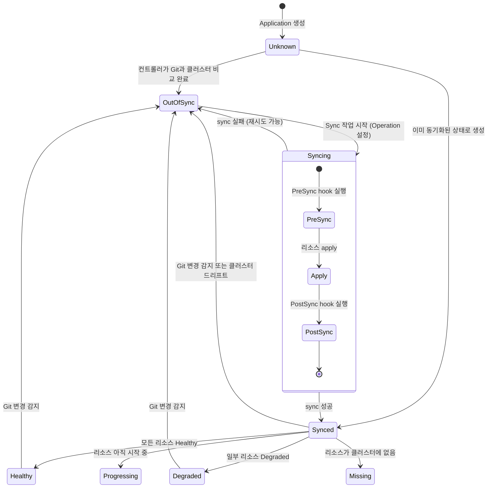
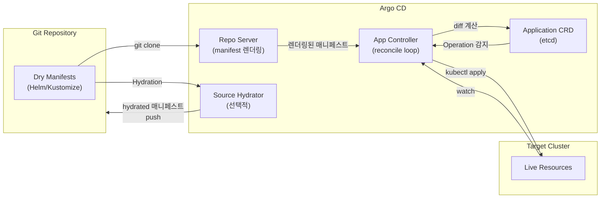

# Argo CD 데이터 모델

## 목차

1. [핵심 CRD 개요](#1-핵심-crd-개요)
2. [Application CRD](#2-application-crd)
   - 2.1 [Application 최상위 구조](#21-application-최상위-구조)
   - 2.2 [ApplicationSpec](#22-applicationspec)
   - 2.3 [ApplicationSource — 소스 정의](#23-applicationsource--소스-정의)
   - 2.4 [ApplicationSourceHelm](#24-applicationsourcehelm)
   - 2.5 [ApplicationSourceKustomize](#25-applicationsourcekustomize)
   - 2.6 [ApplicationSourceDirectory & Plugin](#26-applicationsourcedirectory--plugin)
   - 2.7 [SourceHydrator — 신규 Hydration 기능](#27-sourcehydrator--신규-hydration-기능)
   - 2.8 [SyncPolicy](#28-syncpolicy)
   - 2.9 [ApplicationStatus](#29-applicationstatus)
   - 2.10 [SyncStatus & HealthStatus](#210-syncstatus--healthstatus)
   - 2.11 [ResourceStatus & ResourceDiff](#211-resourcestatus--resourcediff)
3. [AppProject CRD](#3-appproject-crd)
   - 3.1 [AppProject 구조](#31-appproject-구조)
   - 3.2 [AppProjectSpec 상세](#32-appprojectspec-상세)
   - 3.3 [ProjectRole & JWT 기반 인증](#33-projectrole--jwt-기반-인증)
   - 3.4 [SyncWindow — 시간 기반 동기화 제어](#34-syncwindow--시간-기반-동기화-제어)
4. [ApplicationSet CRD](#4-applicationset-crd)
   - 4.1 [ApplicationSetSpec](#41-applicationsetspec)
   - 4.2 [Generator 타입](#42-generator-타입)
   - 4.3 [Progressive Rollout Strategy](#43-progressive-rollout-strategy)
5. [Cluster 타입 (K8s Secret 기반)](#5-cluster-타입-k8s-secret-기반)
6. [Repository 타입 (K8s Secret 기반)](#6-repository-타입-k8s-secret-기반)
7. [Operation / SyncOperation](#7-operation--syncoperation)
8. [Health 모델](#8-health-모델)
9. [Diff 모델](#9-diff-모델)
10. [데이터 흐름 다이어그램](#10-데이터-흐름-다이어그램)

---

## 1. 핵심 CRD 개요

Argo CD는 Kubernetes CRD(Custom Resource Definition)를 중심으로 모든 상태를 관리한다. 핵심 데이터 모델은 세 가지 CRD와, CRD가 아닌 K8s Secret 기반의 두 가지 보조 타입으로 구성된다.

| 타입 | 저장 방식 | 소스 파일 | 역할 |
|------|-----------|-----------|------|
| `Application` | CRD (`argoproj.io/v1alpha1`) | `pkg/apis/application/v1alpha1/types.go` | GitOps 동기화 대상 앱 정의 |
| `AppProject` | CRD (`argoproj.io/v1alpha1`) | `pkg/apis/application/v1alpha1/types.go` | 멀티테넌시 격리 단위 |
| `ApplicationSet` | CRD (`argoproj.io/v1alpha1`) | `pkg/apis/application/v1alpha1/applicationset_types.go` | Application 자동 생성 템플릿 |
| `Cluster` | K8s Secret | `pkg/apis/application/v1alpha1/types.go` | 대상 클러스터 연결 정보 |
| `Repository` | K8s Secret | `pkg/apis/application/v1alpha1/repository_types.go` | Git/Helm repo 인증 정보 |

### 왜 CRD인가?

Argo CD가 자체 데이터베이스 없이 K8s etcd를 유일한 저장소로 사용하는 이유는 세 가지다.

1. **Kubernetes-native Watch 메커니즘**: CRD는 K8s Watch API를 통해 변경 이벤트를 즉시 수신할 수 있다. Argo CD 컨트롤러는 `Application` 리소스의 변경을 Watch하여 reconcile loop를 구동한다.
2. **kubectl/GitOps 호환성**: 사용자가 `kubectl apply`로 `Application` YAML을 적용하면 Argo CD가 즉시 감지하고 처리한다.
3. **운영 단순성**: 별도 DB 없이 `kubectl get applications` 한 줄로 전체 상태를 조회할 수 있다.

```
argoproj.io/v1alpha1
├── Application          (shortname: app, apps)
├── ApplicationList
├── AppProject           (shortname: appproj, appprojs)
├── AppProjectList
├── ApplicationSet       (shortname: appset, appsets)
└── ApplicationSetList
```

---

## 2. Application CRD

### 2.1 Application 최상위 구조

소스: `pkg/apis/application/v1alpha1/types.go:68`

```go
// +kubebuilder:resource:path=applications,shortName=app;apps
// +kubebuilder:printcolumn:name="Sync Status",type=string,JSONPath=`.status.sync.status`
// +kubebuilder:printcolumn:name="Health Status",type=string,JSONPath=`.status.health.status`
// +kubebuilder:printcolumn:name="Revision",type=string,JSONPath=`.status.sync.revision`,priority=10
// +kubebuilder:printcolumn:name="Project",type=string,JSONPath=`.spec.project`,priority=10
type Application struct {
    metav1.TypeMeta   `json:",inline"`
    metav1.ObjectMeta `json:"metadata"`
    Spec              ApplicationSpec    `json:"spec"`
    Status            ApplicationStatus  `json:"status,omitempty"`
    Operation         *Operation         `json:"operation,omitempty"` // Application-only: not in ApplicationSet
}
```

`Operation` 필드가 핵심 설계 포인트다. `Operation`은 **대기 중인 sync 작업**을 나타낸다. 사용자가 UI나 CLI에서 Sync 버튼을 누르면, API 서버는 `Application.Operation` 필드를 채우고, Application 컨트롤러가 이를 감지해 실제 sync를 수행한다. sync 완료 후 `Operation`은 제거되고 `Status.OperationState`에 결과가 저장된다.

```
kubectl get application my-app -o jsonpath='{.status.sync.status}'
# OutOfSync, Synced, Unknown

kubectl get application my-app -o jsonpath='{.status.health.status}'
# Healthy, Progressing, Degraded, Suspended, Missing, Unknown
```

---

### 2.2 ApplicationSpec

소스: `pkg/apis/application/v1alpha1/types.go:77`

```go
type ApplicationSpec struct {
    // 단일 소스 (Source와 Sources는 상호 배타적)
    Source *ApplicationSource `json:"source,omitempty"`

    // 멀티소스 (v2.6+, Source와 상호 배타적)
    Sources ApplicationSources `json:"sources,omitempty"`

    // 배포 대상 클러스터와 네임스페이스
    Destination ApplicationDestination `json:"destination"`

    // 속한 프로젝트 (빈 문자열 = "default" 프로젝트)
    Project string `json:"project"`

    // 자동 동기화 정책
    SyncPolicy *SyncPolicy `json:"syncPolicy,omitempty"`

    // 비교에서 무시할 필드 목록
    IgnoreDifferences IgnoreDifferences `json:"ignoreDifferences,omitempty"`

    // 추가 메타 정보 (URL, 이메일 등)
    Info []Info `json:"info,omitempty"`

    // 히스토리 보관 개수 (기본값: 10)
    RevisionHistoryLimit *int64 `json:"revisionHistoryLimit,omitempty"`

    // Hydration 기능 (신규)
    SourceHydrator *SourceHydrator `json:"sourceHydrator,omitempty"`
}
```

**소스 우선순위 결정 로직** (`GetSource()` 메서드, line 241):

```go
func (spec *ApplicationSpec) GetSource() ApplicationSource {
    // 1순위: SourceHydrator가 있으면 hydrated 소스 반환
    if spec.SourceHydrator != nil {
        return spec.SourceHydrator.GetSyncSource()
    }
    // 2순위: 멀티소스이면 첫 번째 소스
    if spec.HasMultipleSources() {
        return spec.Sources[0]
    }
    // 3순위: 단일 소스
    if spec.Source != nil {
        return *spec.Source
    }
    return ApplicationSource{}
}
```

**ApplicationDestination**: 배포 대상을 지정하는 구조체다.

```go
type ApplicationDestination struct {
    // K8s API 서버 URL (Server와 Name 중 하나만 필수)
    Server string `json:"server,omitempty"`
    // 대상 네임스페이스
    Namespace string `json:"namespace,omitempty"`
    // 클러스터 심볼릭 이름 (Server와 상호 배타적)
    Name string `json:"name,omitempty"`
}
```

**IgnoreDifferences**: 비교를 건너뛸 리소스 필드를 지정한다.

```go
type ResourceIgnoreDifferences struct {
    Group             string   // API 그룹 (빈 문자열 = 모든 그룹)
    Kind              string   // 리소스 종류 (필수)
    Name              string   // 리소스 이름 (빈 문자열 = 모든 이름)
    Namespace         string   // 네임스페이스
    JSONPointers      []string // RFC6901 JSON 포인터 경로 목록
    JQPathExpressions []string // JQ 경로 표현식 목록
    ManagedFieldsManagers []string // 신뢰하는 필드 매니저 목록
}
```

실제 사용 예:
```yaml
ignoreDifferences:
  - group: apps
    kind: Deployment
    jsonPointers:
      - /spec/replicas          # HPA가 관리하는 replicas 무시
  - kind: ConfigMap
    managedFieldsManagers:
      - kube-controller-manager # controller가 추가하는 필드 무시
```

---

### 2.3 ApplicationSource — 소스 정의

소스: `pkg/apis/application/v1alpha1/types.go:196`

```go
type ApplicationSource struct {
    // Git repo URL 또는 Helm repo URL
    RepoURL string `json:"repoURL"`

    // Git repo의 디렉토리 경로 (Git 소스에서만 유효)
    Path string `json:"path,omitempty"`

    // 동기화할 revision. Git: commit/tag/branch, Helm: semver
    // 생략 시 Git은 HEAD, Helm은 최신 버전
    TargetRevision string `json:"targetRevision,omitempty"`

    // Helm 전용 옵션
    Helm *ApplicationSourceHelm `json:"helm,omitempty"`

    // Kustomize 전용 옵션
    Kustomize *ApplicationSourceKustomize `json:"kustomize,omitempty"`

    // 일반 디렉토리 전용 옵션
    Directory *ApplicationSourceDirectory `json:"directory,omitempty"`

    // Config Management Plugin 옵션
    Plugin *ApplicationSourcePlugin `json:"plugin,omitempty"`

    // Helm chart 이름 (Helm repo 소스에서만 필수)
    Chart string `json:"chart,omitempty"`

    // 멀티소스에서 다른 소스를 참조하기 위한 레퍼런스 이름
    Ref string `json:"ref,omitempty"`

    // UI 표시용 소스 이름
    Name string `json:"name,omitempty"`
}
```

**소스 타입 판별 로직**:

```go
// Helm 소스 여부: Chart 필드 존재 여부로 판별
func (source *ApplicationSource) IsHelm() bool {
    return source.Chart != ""
}

// OCI Helm 여부: Chart + OCI prefix URL 조합
func (source *ApplicationSource) IsHelmOci() bool {
    if source.Chart == "" {
        return false
    }
    return helm.IsHelmOciRepo(source.RepoURL)
}

// Ref 소스 여부: 다른 소스를 참조하는 용도
func (source *ApplicationSource) IsRef() bool {
    return source.Ref != ""
}
```

**소스 타입 상수**:

```go
type ApplicationSourceType string

const (
    ApplicationSourceTypeHelm      ApplicationSourceType = "Helm"
    ApplicationSourceTypeKustomize ApplicationSourceType = "Kustomize"
    ApplicationSourceTypeDirectory ApplicationSourceType = "Directory"
    ApplicationSourceTypePlugin    ApplicationSourceType = "Plugin"
)
```

---

### 2.4 ApplicationSourceHelm

소스: `pkg/apis/application/v1alpha1/types.go:534`

```go
type ApplicationSourceHelm struct {
    // values.yaml 파일 경로 목록
    ValueFiles []string `json:"valueFiles,omitempty"`

    // --set 파라미터 목록
    Parameters []HelmParameter `json:"parameters,omitempty"`

    // Helm 릴리즈 이름 (기본값: 앱 이름)
    ReleaseName string `json:"releaseName,omitempty"`

    // 인라인 values YAML (ValuesObject보다 우선순위 낮음)
    Values string `json:"values,omitempty"`

    // --set-file 파일 파라미터 목록
    FileParameters []HelmFileParameter `json:"fileParameters,omitempty"`

    // Helm 버전 ("3")
    Version string `json:"version,omitempty"`

    // --pass-credentials 플래그
    PassCredentials bool `json:"passCredentials,omitempty"`

    // 없는 values 파일 무시 (--values 인자 생략)
    IgnoreMissingValueFiles bool `json:"ignoreMissingValueFiles,omitempty"`

    // --skip-crds: CRD 설치 단계 건너뜀
    SkipCrds bool `json:"skipCrds,omitempty"`

    // map 타입의 인라인 values (Values보다 우선순위 높음)
    ValuesObject *runtime.RawExtension `json:"valuesObject,omitempty"`

    // --namespace: Helm 템플릿 네임스페이스 오버라이드
    Namespace string `json:"namespace,omitempty"`

    // 타겟 클러스터 K8s 버전 명시
    KubeVersion string `json:"kubeVersion,omitempty"`

    // 타겟 클러스터 API 버전 목록
    APIVersions []string `json:"apiVersions,omitempty"`

    // --skip-tests: 테스트 매니페스트 설치 건너뜀
    SkipTests bool `json:"skipTests,omitempty"`

    // --skip-schema-validation: JSON 스키마 검증 건너뜀
    SkipSchemaValidation bool `json:"skipSchemaValidation,omitempty"`
}
```

**HelmParameter와 HelmFileParameter**:

```go
type HelmParameter struct {
    Name        string // --set key
    Value       string // --set value
    ForceString bool   // boolean/number를 string으로 강제 해석
}

type HelmFileParameter struct {
    Name string // --set-file key
    Path string // 파일 경로
}
```

**IsZero 판별 로직**: Helm 옵션이 모두 기본값이면 true를 반환하여 소스 타입 판별에 활용한다.

```go
func (ash *ApplicationSourceHelm) IsZero() bool {
    return ash == nil ||
        (ash.Version == "") &&
        (ash.ReleaseName == "") &&
        len(ash.ValueFiles) == 0 &&
        len(ash.Parameters) == 0 &&
        // ... 모든 필드가 기본값
}
```

---

### 2.5 ApplicationSourceKustomize

소스: `pkg/apis/application/v1alpha1/types.go:687`

```go
type ApplicationSourceKustomize struct {
    // kustomization.yaml의 namePrefix 오버라이드
    NamePrefix string `json:"namePrefix,omitempty"`

    // kustomization.yaml의 nameSuffix 오버라이드
    NameSuffix string `json:"nameSuffix,omitempty"`

    // 이미지 오버라이드 목록 (예: "nginx=myrepo/nginx:v1.2")
    Images KustomizeImages `json:"images,omitempty"`

    // 모든 리소스에 추가할 공통 레이블
    CommonLabels map[string]string `json:"commonLabels,omitempty"`

    // Kustomize 버전
    Version string `json:"version,omitempty"`

    // 모든 리소스에 추가할 공통 어노테이션
    CommonAnnotations map[string]string `json:"commonAnnotations,omitempty"`

    // commonLabels를 resource selector에도 강제 적용
    ForceCommonLabels bool `json:"forceCommonLabels,omitempty"`

    // commonAnnotations를 resource selector에도 강제 적용
    ForceCommonAnnotations bool `json:"forceCommonAnnotations,omitempty"`

    // 모든 리소스의 namespace 설정
    Namespace string `json:"namespace,omitempty"`

    // 어노테이션 값에 환경변수 치환 적용
    CommonAnnotationsEnvsubst bool `json:"commonAnnotationsEnvsubst,omitempty"`

    // Deployment/StatefulSet replica 수 오버라이드
    Replicas KustomizeReplicas `json:"replicas,omitempty"`

    // kustomize 패치 목록
    Patches KustomizePatches `json:"patches,omitempty"`

    // kustomize 컴포넌트 목록
    Components []string `json:"components,omitempty"`

    // 없는 컴포넌트 무시
    IgnoreMissingComponents bool `json:"ignoreMissingComponents,omitempty"`

    // selector에 commonLabel 적용 제외
    LabelWithoutSelector bool `json:"labelWithoutSelector,omitempty"`

    // 타겟 클러스터 K8s 버전
    KubeVersion string `json:"kubeVersion,omitempty"`

    // 타겟 클러스터 API 버전 목록
    APIVersions []string `json:"apiVersions,omitempty"`

    // 리소스 템플릿에도 레이블 적용
    LabelIncludeTemplates bool `json:"labelIncludeTemplates,omitempty"`
}
```

**KustomizeImage 타입**: 이미지 오버라이드를 위한 문자열 타입이다.

```go
type KustomizeImage string
// 형식: [old_image_name=]<image_name>:<image_tag>
// 예시:
//   "nginx:v1.2"               → nginx의 태그를 v1.2로 변경
//   "oldnginx=nginx:v1.2"     → oldnginx를 nginx:v1.2로 교체
//   "nginx@sha256:abc123"     → digest로 고정
```

**동시성 제한 설계**: Kustomize는 `kustomization.yaml`을 직접 수정해야 하므로, 파라미터가 있을 때는 병렬 처리가 불가능하다.

```go
func (k *ApplicationSourceKustomize) AllowsConcurrentProcessing() bool {
    return len(k.Images) == 0 &&
        len(k.CommonLabels) == 0 &&
        len(k.CommonAnnotations) == 0 &&
        k.NamePrefix == "" &&
        k.Namespace == "" &&
        k.NameSuffix == "" &&
        len(k.Patches) == 0 &&
        len(k.Components) == 0
}
```

---

### 2.6 ApplicationSourceDirectory & Plugin

**ApplicationSourceDirectory**: 일반 YAML/Jsonnet 디렉토리 소스다.

소스: `pkg/apis/application/v1alpha1/types.go:898`

```go
type ApplicationSourceDirectory struct {
    // 하위 디렉토리까지 재귀 탐색
    Recurse bool `json:"recurse,omitempty"`

    // Jsonnet 전용 옵션
    Jsonnet ApplicationSourceJsonnet `json:"jsonnet,omitempty"`

    // 제외할 glob 패턴 (예: "*.txt")
    Exclude string `json:"exclude,omitempty"`

    // 포함할 glob 패턴 (예: "*.yaml")
    Include string `json:"include,omitempty"`
}

type ApplicationSourceJsonnet struct {
    ExtVars []JsonnetVar // External Variables
    TLAs    []JsonnetVar // Top-level Arguments
    Libs    []string     // 라이브러리 검색 경로
}
```

**ApplicationSourcePlugin**: Config Management Plugin(CMP)을 사용하는 경우다.

소스: `pkg/apis/application/v1alpha1/types.go:1103`

```go
type ApplicationSourcePlugin struct {
    // 플러그인 이름 (argocd-cm의 plugin 항목과 매핑)
    Name string `json:"name,omitempty"`

    // 플러그인에 전달할 환경변수
    Env `json:"env,omitempty"`

    // 플러그인에 전달할 타입화된 파라미터
    Parameters ApplicationSourcePluginParameters `json:"parameters,omitempty"`
}
```

`ApplicationSourcePluginParameter`는 string, map, array의 세 가지 타입을 지원한다. 플러그인은 환경변수로 파라미터를 수신한다:

```
ARGOCD_APP_PARAMETERS=<JSON 배열>
PARAM_<PARAM_NAME>=<value>       # string 타입
PARAM_<PARAM_NAME>_<KEY>=<value> # map 타입
PARAM_<PARAM_NAME>_0=<value>     # array 타입 (인덱스)
```

---

### 2.7 SourceHydrator — 신규 Hydration 기능

소스: `pkg/apis/application/v1alpha1/types.go:408`

SourceHydrator는 Argo CD v3에서 도입된 기능으로, **Dry Source**(템플릿)에서 **Hydrated Source**(렌더링된 매니페스트)를 생성하여 별도 브랜치에 커밋한 뒤, 해당 브랜치에서 sync하는 워크플로우를 지원한다.

```go
type SourceHydrator struct {
    // Dry Source: 렌더링되지 않은 원본 소스 (Helm chart, Kustomize 등)
    DrySource DrySource `json:"drySource"`

    // Sync Source: hydrated 매니페스트를 sync할 위치
    SyncSource SyncSource `json:"syncSource"`

    // 선택적 스테이징 위치 (PR 기반 워크플로우용)
    HydrateTo *HydrateTo `json:"hydrateTo,omitempty"`
}

type DrySource struct {
    RepoURL        string                      // Git repo URL
    TargetRevision string                      // hydrate할 revision
    Path           string                      // 디렉토리 경로
    Helm           *ApplicationSourceHelm      // Helm 옵션
    Kustomize      *ApplicationSourceKustomize // Kustomize 옵션
    Directory      *ApplicationSourceDirectory // Directory 옵션
    Plugin         *ApplicationSourcePlugin    // Plugin 옵션
}

type SyncSource struct {
    // hydrated 매니페스트를 sync할 브랜치
    TargetBranch string `json:"targetBranch"`
    // hydrated 매니페스트의 디렉토리 경로
    Path string `json:"path"`
}

type HydrateTo struct {
    // PR 생성 전 스테이징 브랜치
    TargetBranch string `json:"targetBranch"`
}
```

**Hydration 상태 추적** (`SourceHydratorStatus`):

```go
type SourceHydratorStatus struct {
    // 마지막으로 성공한 hydration 정보
    LastSuccessfulOperation *SuccessfulHydrateOperation

    // 현재 진행 중인 hydration 상태
    CurrentOperation *HydrateOperation
}

type HydrateOperationPhase string
const (
    HydrateOperationPhaseHydrating HydrateOperationPhase = "Hydrating"
    HydrateOperationPhaseFailed    HydrateOperationPhase = "Failed"
    HydrateOperationPhaseHydrated  HydrateOperationPhase = "Hydrated"
)
```

**Hydration 워크플로우**:

```
[DrySource] → Argo CD Hydrator → [SyncSource branch]
                                       ↓
                              (선택적) [HydrateTo branch]
                                       ↓
                               PR merge → [SyncSource branch]
                                       ↓
                              Argo CD sync → 클러스터
```

---

### 2.8 SyncPolicy

소스: `pkg/apis/application/v1alpha1/types.go:1469`

```go
type SyncPolicy struct {
    // 자동 sync 설정
    Automated *SyncPolicyAutomated `json:"automated,omitempty"`

    // sync-options 문자열 목록 (예: "Validate=false", "CreateNamespace=true")
    SyncOptions SyncOptions `json:"syncOptions,omitempty"`

    // 실패한 sync 재시도 전략
    Retry *RetryStrategy `json:"retry,omitempty"`

    // CreateNamespace=true일 때 네임스페이스 메타데이터 관리
    ManagedNamespaceMetadata *ManagedNamespaceMetadata `json:"managedNamespaceMetadata,omitempty"`
}

type SyncPolicyAutomated struct {
    // Git에 없어진 리소스를 클러스터에서도 삭제 (기본값: false)
    Prune bool `json:"prune,omitempty"`

    // 클러스터에서 수동 변경된 리소스를 Git 상태로 되돌림 (기본값: false)
    SelfHeal bool `json:"selfHeal,omitempty"`

    // 리소스가 0개인 상태도 허용 (기본값: false)
    AllowEmpty bool `json:"allowEmpty,omitempty"`

    // 자동 sync 활성화 여부 (nil = true)
    Enabled *bool `json:"enabled,omitempty"`
}
```

**SyncOptions**: 문자열 슬라이스로 구성된 sync 옵션이다.

```go
type SyncOptions []string

// 주요 옵션 예시:
// "Validate=false"           → kubectl apply의 --validate=false
// "CreateNamespace=true"     → 네임스페이스 자동 생성
// "PrunePropagationPolicy=foreground" → 삭제 전파 정책
// "PruneLast=true"           → 삭제를 마지막 단계로 미룸
// "ApplyOutOfSyncOnly=true"  → OutOfSync 리소스만 apply
// "RespectIgnoreDifferences=true" → sync 시에도 ignoreDifferences 적용
// "ServerSideApply=true"     → kubectl server-side apply 사용
```

**RetryStrategy**: 실패한 sync에 대한 지수 백오프 재시도다.

```go
type RetryStrategy struct {
    // 최대 재시도 횟수 (0 = 재시도 없음)
    Limit int64 `json:"limit,omitempty"`

    // 지수 백오프 설정
    Backoff *Backoff `json:"backoff,omitempty"`

    // 재시도 시 최신 revision 사용 (기본값: false = 최초 revision 재시도)
    Refresh bool `json:"refresh,omitempty"`
}

type Backoff struct {
    // 기본 대기 시간 (초 단위 또는 "2m", "1h" 등)
    Duration string `json:"duration,omitempty"`

    // 재시도마다 배수로 증가하는 계수
    Factor *int64 `json:"factor,omitempty"`

    // 최대 대기 시간 상한
    MaxDuration string `json:"maxDuration,omitempty"`
}
```

**재시도 대기 시간 계산 공식** (`RetryStrategy.NextRetryAt()` 메서드, line 1519):

```
timeToWait = duration * factor^retryCount
timeToWait = min(maxDuration, timeToWait)
```

예: `duration=5s, factor=2, maxDuration=3m`이면
- 1회: 5s, 2회: 10s, 3회: 20s, 4회: 40s, 5회: 80s, 6회: 160s, 7회+: 180s(상한)

---

### 2.9 ApplicationStatus

소스: `pkg/apis/application/v1alpha1/types.go:1180`

```go
type ApplicationStatus struct {
    // 관리되는 K8s 리소스 목록 (Sync/Health 상태 포함)
    Resources []ResourceStatus `json:"resources,omitempty"`

    // 현재 Sync 상태 (Synced/OutOfSync/Unknown)
    Sync SyncStatus `json:"sync,omitempty"`

    // 현재 Health 상태 (Healthy/Progressing/Degraded/Suspended/Missing/Unknown)
    Health AppHealthStatus `json:"health,omitempty"`

    // Sync 히스토리 (가장 오래된 것부터 최신 순서)
    History RevisionHistories `json:"history,omitempty"`

    // 이상 조건 목록 (오류, 경고, 정보)
    Conditions []ApplicationCondition `json:"conditions,omitempty"`

    // 마지막 reconcile 시각
    ReconciledAt *metav1.Time `json:"reconciledAt,omitempty"`

    // 현재 진행 중인 작업 상태
    OperationState *OperationState `json:"operationState,omitempty"`

    // 소스 타입 (단일 소스용)
    SourceType ApplicationSourceType `json:"sourceType,omitempty"`

    // 소스 타입 목록 (멀티 소스용)
    SourceTypes []ApplicationSourceType `json:"sourceTypes,omitempty"`

    // 앱의 외부 URL과 이미지 요약
    Summary ApplicationSummary `json:"summary,omitempty"`

    // Health 정보 위치 ("" = inline, "appTree" = AppTree에서 별도 관리)
    ResourceHealthSource ResourceHealthLocation `json:"resourceHealthSource,omitempty"`

    // Application 컨트롤러의 네임스페이스
    ControllerNamespace string `json:"controllerNamespace,omitempty"`

    // Source Hydration 상태
    SourceHydrator SourceHydratorStatus `json:"sourceHydrator,omitempty"`
}
```

**RevisionHistory**: sync 이력 항목이다.

```go
type RevisionHistory struct {
    Revision        string               // 동기화한 Git commit/Helm 버전
    DeployedAt      metav1.Time          // 완료 시각
    ID              int64                // 자동 증가 ID
    Source          ApplicationSource   // 사용한 소스 정보
    DeployStartedAt *metav1.Time         // 시작 시각
    Sources         ApplicationSources  // 멀티소스용
    Revisions       []string            // 멀티소스용 revision 목록
    InitiatedBy     OperationInitiator  // 시작한 사용자/시스템
}
```

**ApplicationCondition**: 앱의 이상 상태를 나타내는 조건이다.

```go
const (
    ApplicationConditionDeletionError           = "DeletionError"
    ApplicationConditionInvalidSpecError        = "InvalidSpecError"
    ApplicationConditionComparisonError         = "ComparisonError"
    ApplicationConditionSyncError               = "SyncError"
    ApplicationConditionUnknownError            = "UnknownError"
    ApplicationConditionSharedResourceWarning   = "SharedResourceWarning"
    ApplicationConditionRepeatedResourceWarning = "RepeatedResourceWarning"
    ApplicationConditionExcludedResourceWarning = "ExcludedResourceWarning"
    ApplicationConditionOrphanedResourceWarning = "OrphanedResourceWarning"
)
```

---

### 2.10 SyncStatus & HealthStatus

소스: `pkg/apis/application/v1alpha1/types.go:1804`

**SyncStatusCode**: 세 가지 상태만 존재한다.

```go
type SyncStatusCode string

const (
    // 클러스터 상태 파악 불가 (repo server 오류 등)
    SyncStatusCodeUnknown   SyncStatusCode = "Unknown"

    // Git(desired) == 클러스터(live) 상태 일치
    SyncStatusCodeSynced    SyncStatusCode = "Synced"

    // Git(desired) != 클러스터(live) 드리프트 발생
    SyncStatusCodeOutOfSync SyncStatusCode = "OutOfSync"
)
```

**SyncStatus**: 비교 결과를 상세히 기록한다.

```go
type SyncStatus struct {
    Status     SyncStatusCode // Synced/OutOfSync/Unknown
    ComparedTo ComparedTo     // 비교에 사용된 소스와 대상 정보
    Revision   string         // 단일 소스용 revision
    Revisions  []string       // 멀티소스용 revision 목록
}

type ComparedTo struct {
    Source            ApplicationSource      // 단일 소스 비교 기준
    Destination       ApplicationDestination // 대상 클러스터/네임스페이스
    Sources           ApplicationSources     // 멀티소스 비교 기준
    IgnoreDifferences IgnoreDifferences      // 무시된 필드 설정
}
```

**AppHealthStatus와 HealthStatus**: Application 수준과 개별 리소스 수준의 Health 상태다.

```go
// Application 전체 Health
type AppHealthStatus struct {
    Status             health.HealthStatusCode // 건강 코드
    Message            string                  // (Deprecated)
    LastTransitionTime *metav1.Time            // 상태 변경 시각
}

// 개별 리소스 Health
type HealthStatus struct {
    Status             health.HealthStatusCode // 건강 코드
    Message            string                  // 사람이 읽을 수 있는 설명
    LastTransitionTime *metav1.Time            // (Deprecated)
}
```

---

### 2.11 ResourceStatus & ResourceDiff

소스: `pkg/apis/application/v1alpha1/types.go:2148`

**ResourceStatus**: 관리되는 각 K8s 리소스의 동기화 상태를 나타낸다.

```go
type ResourceStatus struct {
    Group     string         // API 그룹 (예: "apps")
    Version   string         // API 버전 (예: "v1")
    Kind      string         // 리소스 종류 (예: "Deployment")
    Namespace string         // 네임스페이스
    Name      string         // 리소스 이름
    Status    SyncStatusCode // Synced/OutOfSync
    Health    *HealthStatus  // Healthy/Degraded/...
    Hook      bool           // lifecycle hook 여부
    RequiresPruning bool     // 삭제 필요 여부
    SyncWave  int64          // sync wave 번호 (낮을수록 먼저)
    RequiresDeletionConfirmation bool // 삭제 확인 필요 여부
}
```

**ResourceDiff**: 원하는 상태(Git)와 실제 상태(클러스터) 사이의 차이를 담는다.

소스: `pkg/apis/application/v1alpha1/types.go:2180`

```go
type ResourceDiff struct {
    Group      string // API 그룹
    Kind       string // 리소스 종류
    Namespace  string // 네임스페이스
    Name       string // 리소스 이름

    // Git에서 원하는 상태 (JSON 직렬화)
    TargetState string `json:"targetState,omitempty"`

    // 클러스터의 실제 상태 (JSON 직렬화)
    LiveState string `json:"liveState,omitempty"`

    // (Deprecated) JSON 패치 형식의 차이
    Diff string `json:"diff,omitempty"`

    // hook 리소스 여부
    Hook bool `json:"hook,omitempty"`

    // 정규화된 실제 상태 (타임스탬프 등 무시 필드 제거 후)
    NormalizedLiveState string `json:"normalizedLiveState,omitempty"`

    // 예측된 최종 상태 (정규화 live + target 적용 결과)
    PredictedLiveState string `json:"predictedLiveState,omitempty"`

    ResourceVersion string // K8s 리소스 버전
    Modified        bool   // 변경 여부
}
```

**ResourceNode**: 앱 리소스 트리의 노드를 나타낸다.

```go
type ResourceNode struct {
    ResourceRef              // 리소스 고유 식별자 (Group/Kind/Namespace/Name/UID)
    ParentRefs  []ResourceRef // 부모 리소스 참조 목록
    Info        []InfoItem    // 추가 메타데이터
    NetworkingInfo *ResourceNetworkingInfo // 네트워킹 정보
    ResourceVersion string   // K8s 리소스 버전
    Images      []string      // 컨테이너 이미지 목록
    Health      *HealthStatus // 헬스 상태
    CreatedAt   *metav1.Time  // 생성 시각
}

// 노드의 고유 전체 이름: "group/kind/namespace/name"
func (n *ResourceNode) FullName() string {
    return fmt.Sprintf("%s/%s/%s/%s", n.Group, n.Kind, n.Namespace, n.Name)
}
```

---

## 3. AppProject CRD

### 3.1 AppProject 구조

소스: `pkg/apis/application/v1alpha1/app_project_types.go:46`

AppProject는 Argo CD의 **멀티테넌시 격리 단위**다. 여러 팀이 하나의 Argo CD 인스턴스를 공유할 때, 각 팀이 배포할 수 있는 repo, 클러스터, 네임스페이스, 리소스 타입을 제한한다.

```go
// +kubebuilder:resource:path=appprojects,shortName=appproj;appprojs
type AppProject struct {
    metav1.TypeMeta   `json:",inline"`
    metav1.ObjectMeta `json:"metadata"`
    Spec              AppProjectSpec   `json:"spec"`
    Status            AppProjectStatus `json:"status,omitempty"`
}

type AppProjectStatus struct {
    // JWT 토큰 목록 (role 이름 → 토큰 목록 매핑)
    JWTTokensByRole map[string]JWTTokens `json:"jwtTokensByRole,omitempty"`
}
```

---

### 3.2 AppProjectSpec 상세

소스: `pkg/apis/application/v1alpha1/types.go:2734`

```go
type AppProjectSpec struct {
    // 허용된 소스 repo URL 목록 (glob 패턴 지원)
    // 예: ["https://github.com/myorg/*", "!https://github.com/myorg/secret-repo"]
    SourceRepos []string `json:"sourceRepos,omitempty"`

    // 허용된 배포 대상 목록
    Destinations []ApplicationDestination `json:"destinations,omitempty"`

    // 프로젝트 설명 (최대 255자)
    Description string `json:"description,omitempty"`

    // RBAC 역할 정의
    Roles []ProjectRole `json:"roles,omitempty"`

    // 허용할 클러스터 수준 리소스 목록 (whitelist)
    // 기본값: 모두 거부. 명시적으로 허용해야 배포 가능
    ClusterResourceWhitelist []ClusterResourceRestrictionItem `json:"clusterResourceWhitelist,omitempty"`

    // 거부할 네임스페이스 수준 리소스 목록 (blacklist)
    NamespaceResourceBlacklist []metav1.GroupKind `json:"namespaceResourceBlacklist,omitempty"`

    // 허용할 네임스페이스 수준 리소스 목록 (whitelist)
    // nil이면 모두 허용, []이면 모두 거부
    NamespaceResourceWhitelist []metav1.GroupKind `json:"namespaceResourceWhitelist,omitempty"`

    // 거부할 클러스터 수준 리소스 목록 (blacklist)
    ClusterResourceBlacklist []ClusterResourceRestrictionItem `json:"clusterResourceBlacklist,omitempty"`

    // 고아 리소스 모니터링 설정
    OrphanedResources *OrphanedResourcesMonitorSettings `json:"orphanedResources,omitempty"`

    // 시간 기반 sync 제어 창
    SyncWindows SyncWindows `json:"syncWindows,omitempty"`

    // GPG 서명 키 목록 (이 키로 서명된 commit만 sync 허용)
    SignatureKeys []SignatureKey `json:"signatureKeys,omitempty"`

    // Application CRD가 생성될 수 있는 소스 네임스페이스 목록
    SourceNamespaces []string `json:"sourceNamespaces,omitempty"`

    // 프로젝트 스코프 클러스터만 대상으로 허용
    PermitOnlyProjectScopedClusters bool `json:"permitOnlyProjectScopedClusters,omitempty"`

    // 서비스 어카운트 임퍼소네이션 설정 (목적지별 SA 지정)
    DestinationServiceAccounts []ApplicationDestinationServiceAccount `json:"destinationServiceAccounts,omitempty"`
}
```

**리소스 허용 판별 로직** (`IsGroupKindNamePermitted()` 메서드):

```
네임스페이스 리소스 판별:
  허용 = (whitelist가 nil || whitelist에 포함됨) && blacklist에 없음

클러스터 리소스 판별:
  허용 = (whitelist에 포함됨) && blacklist에 없음
  (클러스터 리소스는 whitelist에 명시해야만 허용)
```

**소스 Repo 검증** (`IsSourcePermitted()` 메서드):

glob 패턴으로 소스 URL을 매칭한다. 부정 패턴(`!` prefix)으로 특정 URL을 명시적 거부할 수 있다.

```go
func (proj AppProject) IsSourcePermitted(src ApplicationSource) bool {
    srcNormalized := git.NormalizeGitURL(src.RepoURL)
    anySourceMatched := false
    for _, repoURL := range proj.Spec.SourceRepos {
        if isDenyPattern(repoURL) {
            // "!url" 패턴 → 매칭 시 즉시 거부
            normalized = "!" + git.NormalizeGitURL(strings.TrimPrefix(repoURL, "!"))
        }
        matched := globMatch(normalized, srcNormalized, true, '/')
        if matched {
            anySourceMatched = true
        } else if !matched && isDenyPattern(normalized) {
            return false // 명시적 거부
        }
    }
    return anySourceMatched
}
```

---

### 3.3 ProjectRole & JWT 기반 인증

소스: `pkg/apis/application/v1alpha1/types.go:2743`

AppProject의 Role은 **JWT 토큰 기반 자동화 인증**을 위한 것이다. CI/CD 파이프라인이 Argo CD API를 호출할 때 사람 계정 대신 Role JWT를 사용한다.

```go
type ProjectRole struct {
    // 역할 이름 (알파벳, 숫자, '-', '_' 조합)
    Name string `json:"name"`

    // 역할 설명
    Description string `json:"description,omitempty"`

    // RBAC 정책 목록 (Casbin 형식)
    Policies []string `json:"policies,omitempty"`

    // (Deprecated) JWT 토큰 목록 (Status로 이동됨)
    JWTTokens []JWTToken `json:"jwtTokens,omitempty"`

    // 이 역할이 매핑되는 OIDC 그룹 목록
    Groups []string `json:"groups,omitempty"`
}

type JWTToken struct {
    IssuedAt  int64  `json:"iat"`           // 발급 시각 (Unix timestamp)
    ExpiresAt int64  `json:"exp,omitempty"` // 만료 시각 (0 = 영구)
    ID        string `json:"id,omitempty"`  // 토큰 고유 ID
}
```

**RBAC 정책 형식**:

```
p, proj:<프로젝트>:<역할>, applications, <동작>, <앱 경로>, allow|deny
```

예:
```
p, proj:my-project:ci-role, applications, sync, my-project/*, allow
p, proj:my-project:ci-role, applications, get, my-project/*, allow
```

**JWT 토큰 이중 저장 설계**: 하위 호환성을 위해 토큰이 `Spec.Roles[].JWTTokens`와 `Status.JWTTokensByRole` 두 곳에 동기화하여 저장된다. `NormalizeJWTTokens()`가 두 저장소를 동기화한다.

---

### 3.4 SyncWindow — 시간 기반 동기화 제어

소스: `pkg/apis/application/v1alpha1/types.go:2779`

```go
type SyncWindow struct {
    // "allow" = 이 시간에만 sync 허용
    // "deny"  = 이 시간에는 sync 금지
    Kind string `json:"kind,omitempty"`

    // Cron 표현식으로 시작 시각 지정
    // 예: "0 22 * * *" (매일 22:00)
    Schedule string `json:"schedule,omitempty"`

    // 창이 열려 있는 시간 (예: "1h", "30m")
    Duration string `json:"duration,omitempty"`

    // 적용할 앱 이름 목록 (glob 패턴)
    Applications []string `json:"applications,omitempty"`

    // 적용할 네임스페이스 목록 (glob 패턴)
    Namespaces []string `json:"namespaces,omitempty"`

    // 적용할 클러스터 목록 (glob 패턴)
    Clusters []string `json:"clusters,omitempty"`

    // deny 창이더라도 수동 sync는 허용
    ManualSync bool `json:"manualSync,omitempty"`

    // 시간대 (예: "Asia/Seoul")
    TimeZone string `json:"timeZone,omitempty"`
}
```

**SyncWindow 활용 사례**:

```yaml
# 매일 22시~다음날 06시에는 sync 금지 (야간 안정화 창)
syncWindows:
  - kind: deny
    schedule: "0 22 * * *"
    duration: 8h
    applications:
      - "*"
    manualSync: true  # 긴급 수동 sync는 허용

# 업무 시간(09:00~18:00)에만 sync 허용
  - kind: allow
    schedule: "0 9 * * 1-5"
    duration: 9h
    clusters:
      - production
```

---

## 4. ApplicationSet CRD

### 4.1 ApplicationSetSpec

소스: `pkg/apis/application/v1alpha1/applicationset_types.go:67`

ApplicationSet은 하나의 템플릿으로 여러 `Application`을 자동 생성하는 컨트롤러다.

```go
type ApplicationSetSpec struct {
    // Go template 사용 여부 (기본값: false = fasttemplate)
    GoTemplate bool `json:"goTemplate,omitempty"`

    // Go template 옵션 (예: ["missingkey=error"])
    GoTemplateOptions []string `json:"goTemplateOptions,omitempty"`

    // 매개변수 생성기 목록
    Generators []ApplicationSetGenerator `json:"generators"`

    // Application 템플릿
    Template ApplicationSetTemplate `json:"template"`

    // 생성된 Application의 동기화 정책
    SyncPolicy *ApplicationSetSyncPolicy `json:"syncPolicy,omitempty"`

    // Progressive rollout 전략
    Strategy *ApplicationSetStrategy `json:"strategy,omitempty"`

    // Application 삭제 시 리소스 보존할 필드
    PreservedFields *ApplicationPreservedFields `json:"preservedFields,omitempty"`

    // 생성된 Application 간 차이 무시 설정
    IgnoreApplicationDifferences ApplicationSetIgnoreDifferences `json:"ignoreApplicationDifferences,omitempty"`

    // JSON 패치 형식의 템플릿 패치
    TemplatePatch *string `json:"templatePatch,omitempty"`
}
```

**ApplicationSetSyncPolicy**: ApplicationSet이 생성한 Application을 어떻게 관리할지 제어한다.

```go
type ApplicationSetSyncPolicy struct {
    // true이면 ApplicationSet 삭제 시 생성된 Application을 삭제하지 않음
    PreserveResourcesOnDeletion bool `json:"preserveResourcesOnDeletion,omitempty"`

    // 생성된 Application의 수명주기 정책
    // "create-only":   생성만 (업데이트/삭제 없음)
    // "create-update": 생성+업데이트 (삭제 없음)
    // "create-delete": 생성+삭제 (업데이트 없음)
    // "sync":          생성+업데이트+삭제 (기본값)
    ApplicationsSync *ApplicationsSyncPolicy `json:"applicationsSync,omitempty"`
}
```

**ApplicationSetTemplate**: 생성될 Application의 형태를 정의한다.

```go
type ApplicationSetTemplate struct {
    ApplicationSetTemplateMeta `json:"metadata"`
    Spec ApplicationSpec       `json:"spec"` // Application.Spec과 동일한 타입
}

type ApplicationSetTemplateMeta struct {
    Name        string            // 생성될 앱 이름 (generator 파라미터 치환 가능)
    Namespace   string            // 생성될 앱의 네임스페이스
    Labels      map[string]string // 레이블
    Annotations map[string]string // 어노테이션
    Finalizers  []string          // finalizer 목록
}
```

---

### 4.2 Generator 타입

소스: `pkg/apis/application/v1alpha1/applicationset_types.go:197`

```go
type ApplicationSetGenerator struct {
    List                    *ListGenerator        // 정적 파라미터 목록
    Clusters                *ClusterGenerator     // 등록된 클러스터 목록
    Git                     *GitGenerator         // Git repo 내용 기반
    SCMProvider             *SCMProviderGenerator // SCM(GitHub/GitLab 등) repo 목록
    ClusterDecisionResource *DuckTypeGenerator    // 커스텀 리소스 기반
    PullRequest             *PullRequestGenerator // PR 목록 기반
    Matrix                  *MatrixGenerator      // 두 generator의 곱집합
    Merge                   *MergeGenerator       // 여러 generator 병합
    Plugin                  *PluginGenerator      // 외부 플러그인
    Selector                *metav1.LabelSelector // generator 결과 후처리 필터
}
```

**Generator별 동작 설명**:

| Generator | 동작 | 주요 파라미터 |
|-----------|------|-------------|
| `List` | 정적 파라미터 목록으로 Application 생성 | `elements: [{cluster: dev, url: ...}]` |
| `Clusters` | 등록된 Argo CD 클러스터 한 개당 Application 생성 | `selector`, `values` |
| `Git (directories)` | Git repo 내 디렉토리 한 개당 Application 생성 | `repoURL`, `directories: [{path: "/*"}]` |
| `Git (files)` | Git repo 내 JSON/YAML 파일 파싱하여 파라미터 생성 | `repoURL`, `files: [{path: "clusters/*.yaml"}]` |
| `Matrix` | 두 generator의 결과를 곱집합으로 조합 | `generators: [a, b]` |
| `Merge` | 여러 generator 결과를 키 기반으로 병합 | `generators`, `mergeKeys` |
| `PullRequest` | PR 한 개당 Application 생성 (preview 환경) | `github`, `gitlab`, `gitea` |
| `SCMProvider` | SCM 조직 내 repo 한 개당 Application 생성 | `github`, `gitlab`, `bitbucket` |
| `Plugin` | 외부 플러그인에서 파라미터 받아옴 | `configMapRef`, `input` |
| `DuckType` | 커스텀 리소스 목록으로 파라미터 생성 | `configMapRef`, `resourceName` |

**중첩 Generator 제한**: CRD의 재귀 타입 미지원으로 인해 Generator 중첩은 최대 3단계까지만 가능하다.

```
Top-level:    ApplicationSetGenerator          (Matrix, Merge 포함 모두 사용 가능)
Nested:       ApplicationSetNestedGenerator    (Matrix/Merge는 JSON raw로 저장)
Terminal:     ApplicationSetTerminalGenerator  (Matrix, Merge 사용 불가)
```

---

### 4.3 Progressive Rollout Strategy

소스: `pkg/apis/application/v1alpha1/applicationset_types.go:90`

```go
type ApplicationSetStrategy struct {
    // 현재 지원: "RollingSync"
    Type string `json:"type,omitempty"`

    // 단계적 sync 설정
    RollingSync *ApplicationSetRolloutStrategy `json:"rollingSync,omitempty"`

    // 삭제 순서: "AllAtOnce" (기본) 또는 "Reverse"
    DeletionOrder string `json:"deletionOrder,omitempty"`
}

type ApplicationSetRolloutStrategy struct {
    // 단계별 rollout 설정
    Steps []ApplicationSetRolloutStep `json:"steps,omitempty"`
}

type ApplicationSetRolloutStep struct {
    // 이 단계에 적용될 앱 필터 (레이블 기반)
    MatchExpressions []ApplicationMatchExpression `json:"matchExpressions,omitempty"`

    // 동시에 업데이트할 최대 앱 수 (숫자 또는 %)
    MaxUpdate *intstr.IntOrString `json:"maxUpdate,omitempty"`
}
```

Progressive Rollout은 대규모 환경에서 ApplicationSet 업데이트 시 모든 앱을 동시에 sync하는 대신, 레이블 기반으로 그룹화하여 단계적으로 롤아웃한다.

---

## 5. Cluster 타입 (K8s Secret 기반)

소스: `pkg/apis/application/v1alpha1/types.go:2241`

Cluster는 CRD가 아닌 **K8s Secret으로 저장**된다. 이는 클러스터 자격증명(bearer token, TLS 인증서 등)이 K8s Secret의 암호화 메커니즘(etcd encryption at rest)의 보호를 받을 수 있도록 하기 위함이다.

**Secret 식별 레이블** (`common/common.go:195`):

```go
// Secret에 붙는 레이블로 Argo CD가 클러스터 Secret을 식별
LabelKeySecretType      = "argocd.argoproj.io/secret-type"
LabelValueSecretTypeCluster = "cluster"
```

```go
type Cluster struct {
    ID   string // 내부용 식별자 (API에 노출되지 않음)

    // K8s API 서버 URL
    Server string `json:"server"`

    // 클러스터 심볼릭 이름
    Name string `json:"name"`

    // 클러스터 연결 설정
    Config ClusterConfig `json:"config"`

    // 접근 제한 네임스페이스 목록 (비어 있으면 클러스터 전체)
    Namespaces []string `json:"namespaces,omitempty"`

    // 캐시 갱신 요청 시각
    RefreshRequestedAt *metav1.Time `json:"refreshRequestedAt,omitempty"`

    // 클러스터 상태 정보 (연결 상태, K8s 버전, API 목록)
    Info ClusterInfo `json:"info,omitempty"`

    // 샤드 번호 (컨트롤러 샤딩 시 수동 지정 가능)
    Shard *int64 `json:"shard,omitempty"`

    // 네임스페이스 모드에서도 클러스터 리소스 관리 허용
    ClusterResources bool `json:"clusterResources,omitempty"`

    // 프로젝트 스코프 클러스터 지정
    Project string `json:"project,omitempty"`

    Labels      map[string]string // Secret 레이블
    Annotations map[string]string // Secret 어노테이션
}
```

**ClusterConfig**: 클러스터 인증 방법을 정의한다.

```go
type ClusterConfig struct {
    // Basic Auth
    Username string `json:"username,omitempty"`
    Password string `json:"password,omitempty"`

    // Bearer Token (ServiceAccount 토큰)
    BearerToken string `json:"bearerToken,omitempty"`

    // TLS 설정
    TLSClientConfig TLSClientConfig `json:"tlsClientConfig"`

    // AWS EKS IAM 인증
    AWSAuthConfig *AWSAuthConfig `json:"awsAuthConfig,omitempty"`

    // exec 기반 인증 (kubeconfig의 exec 방식과 동일)
    ExecProviderConfig *ExecProviderConfig `json:"execProviderConfig,omitempty"`

    // HTTP 압축 비활성화
    DisableCompression bool `json:"disableCompression,omitempty"`

    // 프록시 URL
    ProxyUrl string `json:"proxyUrl,omitempty"`
}

type TLSClientConfig struct {
    Insecure   bool   // TLS 검증 무시 (개발용)
    ServerName string // SNI 서버 이름
    CertData   []byte // PEM 클라이언트 인증서
    KeyData    []byte // PEM 클라이언트 키
    CAData     []byte // PEM CA 인증서
}

type AWSAuthConfig struct {
    ClusterName string // EKS 클러스터 이름
    RoleARN     string // assume할 IAM Role ARN (선택)
    Profile     string // AWS 프로파일 (선택)
}

type ExecProviderConfig struct {
    Command     string            // 실행할 명령어
    Args        []string          // 명령어 인수
    Env         map[string]string // 환경변수
    APIVersion  string            // ExecCredential API 버전
    InstallHint string            // 명령어 없을 때 안내 메시지
}
```

**ClusterInfo**: 클러스터 캐시 상태를 나타낸다.

```go
type ClusterInfo struct {
    ConnectionState ConnectionState // 연결 상태 (Successful/Failed/Unknown)
    ServerVersion   string          // K8s 버전 (예: "v1.28.0")
    CacheInfo       ClusterCacheInfo // 캐시 통계
    ApplicationsCount int64          // 이 클러스터의 앱 수
    APIVersions     []string         // 지원하는 API 버전 목록
}

type ClusterCacheInfo struct {
    ResourcesCount    int64        // 관찰 중인 K8s 리소스 수
    APIsCount         int64        // 관찰 중인 K8s API 수
    LastCacheSyncTime *metav1.Time // 마지막 캐시 동기화 시각
}
```

**민감 정보 제거** (`Sanitized()` 메서드): API 응답 시 TLS 인증서/키, 비밀번호 등은 제거된다.

```go
func (c *Cluster) Sanitized() *Cluster {
    return &Cluster{
        // ... 공개 정보만 복사
        Config: ClusterConfig{
            AWSAuthConfig: c.Config.AWSAuthConfig, // ARN은 공개
            TLSClientConfig: TLSClientConfig{
                Insecure:   c.Config.Insecure,
                ServerName: c.Config.ServerName,
                // CertData, KeyData, CAData 제거
            },
            ExecProviderConfig: nil, // 명령어 args/env 제거
        },
    }
}
```

---

## 6. Repository 타입 (K8s Secret 기반)

소스: `pkg/apis/application/v1alpha1/repository_types.go:63`

Repository도 클러스터와 마찬가지로 K8s Secret으로 저장된다.

**Secret 식별 레이블** (`common/common.go:200`):

```go
LabelValueSecretTypeRepository = "repository"
```

```go
type Repository struct {
    // Git/Helm repo URL
    Repo string `json:"repo"`

    // 인증 정보 (username+password 또는 sshPrivateKey 등)
    Username      string `json:"username,omitempty"`
    Password      string `json:"password,omitempty"`
    SSHPrivateKey string `json:"sshPrivateKey,omitempty"`

    // 연결 상태
    ConnectionState ConnectionState `json:"connectionState,omitempty"`

    // TLS 설정
    InsecureIgnoreHostKey bool   // (Deprecated)
    Insecure              bool   // TLS 검증 무시
    TLSClientCertData     string // PEM 클라이언트 인증서
    TLSClientCertKey      string // PEM 클라이언트 키

    // LFS 지원 (Git 전용)
    EnableLFS bool `json:"enableLfs,omitempty"`

    // 타입: "git", "helm", "oci" (기본값: "git")
    Type string `json:"type,omitempty"`

    // Helm repo 이름
    Name string `json:"name,omitempty"`

    // 크레덴셜 상속 여부 (Credential Template에서 상속)
    InheritedCreds bool `json:"inheritedCreds,omitempty"`

    // OCI Helm 지원
    EnableOCI bool `json:"enableOCI,omitempty"`

    // GitHub App 인증
    GithubAppPrivateKey       string `json:"githubAppPrivateKey,omitempty"`
    GithubAppId               int64  `json:"githubAppID,omitempty"`
    GithubAppInstallationId   int64  `json:"githubAppInstallationID,omitempty"`
    GitHubAppEnterpriseBaseURL string `json:"githubAppEnterpriseBaseUrl,omitempty"`

    // GCP 서비스 어카운트 키 (Google Cloud Source Repos)
    GCPServiceAccountKey string `json:"gcpServiceAccountKey,omitempty"`

    // 프록시 설정
    Proxy   string `json:"proxy,omitempty"`
    NoProxy string `json:"noProxy,omitempty"`

    // HTTP Basic Auth 강제
    ForceHttpBasicAuth bool `json:"forceHttpBasicAuth,omitempty"`

    // Azure Workload Identity 인증
    UseAzureWorkloadIdentity bool `json:"useAzureWorkloadIdentity,omitempty"`

    // BitBucket Data Center Bearer Token 인증
    BearerToken string `json:"bearerToken,omitempty"`

    // OCI HTTP 강제
    InsecureOCIForceHttp bool `json:"insecureOCIForceHttp,omitempty"`

    // 연결된 프로젝트 (프로젝트 스코프 repo)
    Project string `json:"project,omitempty"`
}
```

---

## 7. Operation / SyncOperation

소스: `pkg/apis/application/v1alpha1/types.go:1312`

Operation은 **대기 중인 또는 진행 중인 작업**을 나타내는 데이터 모델이다. 현재는 sync 작업만 지원한다.

```go
type Operation struct {
    // Sync 작업 파라미터
    Sync *SyncOperation `json:"sync,omitempty"`

    // 작업을 시작한 주체
    InitiatedBy OperationInitiator `json:"initiatedBy,omitempty"`

    // 작업 관련 메타 정보
    Info []*Info `json:"info,omitempty"`

    // 실패 시 재시도 전략
    Retry RetryStrategy `json:"retry,omitempty"`
}

type OperationInitiator struct {
    Username  string // 사용자 이름 (수동 sync 시)
    Automated bool   // true이면 자동 sync (Application 컨트롤러 시작)
}
```

**SyncOperation**: sync 작업의 세부 파라미터다.

```go
type SyncOperation struct {
    // 동기화할 특정 revision (생략 시 spec의 targetRevision 사용)
    Revision string `json:"revision,omitempty"`

    // Git에 없는 리소스를 클러스터에서 삭제
    Prune bool `json:"prune,omitempty"`

    // 실제로 적용하지 않고 결과만 확인 (dry run)
    DryRun bool `json:"dryRun,omitempty"`

    // Apply 전략: Apply(kubectl apply) 또는 Hook
    SyncStrategy *SyncStrategy `json:"syncStrategy,omitempty"`

    // 선택적 리소스 sync (일부 리소스만 sync할 때)
    Resources []SyncOperationResource `json:"resources,omitempty"`

    // 소스 오버라이드 (Rollback 작업 시 이전 소스로 대체)
    Source *ApplicationSource `json:"source,omitempty"`

    // 로컬 매니페스트 (개발용 오버라이드)
    Manifests []string `json:"manifests,omitempty"`

    // sync-options (per-sync 옵션)
    SyncOptions SyncOptions `json:"syncOptions,omitempty"`

    // 멀티소스용 소스 목록 오버라이드
    Sources ApplicationSources `json:"sources,omitempty"`

    // 멀티소스용 revision 목록
    Revisions []string `json:"revisions,omitempty"`

    // 자동 selfHeal 시도 횟수
    SelfHealAttemptsCount int64 `json:"autoHealAttemptsCount,omitempty"`
}
```

**SyncStrategy**: sync 전략을 결정한다.

```go
type SyncStrategy struct {
    // kubectl apply 방식 (hook 없이 단순 apply)
    Apply *SyncStrategyApply `json:"apply,omitempty"`

    // Hook 방식 (기본값, PreSync/Sync/PostSync hook 실행)
    Hook *SyncStrategyHook `json:"hook,omitempty"`
}

type SyncStrategyApply struct {
    // --force 플래그: 충돌 시 삭제 후 재생성
    Force bool `json:"force,omitempty"`
}

type SyncStrategyHook struct {
    SyncStrategyApply // Apply의 모든 옵션 상속
}
```

**SyncOperationResource**: 특정 리소스만 선택적으로 sync하는 데 사용한다.

```go
type SyncOperationResource struct {
    Group     string
    Kind      string
    Name      string
    Namespace string
    Exclude   bool // true이면 이 리소스는 제외
}

// 와일드카드 비교 지원
func (r SyncOperationResource) Compare(name string, namespace string, gvk schema.GroupVersionKind) bool {
    return (r.Group == "*" || gvk.Group == r.Group) &&
           (r.Kind == "*" || gvk.Kind == r.Kind) &&
           (r.Name == "*" || name == r.Name) &&
           (r.Namespace == "*" || r.Namespace == "" || namespace == r.Namespace)
}
```

**OperationState**: 진행 중이거나 완료된 작업의 상태를 기록한다.

소스: `pkg/apis/application/v1alpha1/types.go:1414`

```go
type OperationState struct {
    // 원본 Operation 정보
    Operation Operation `json:"operation"`

    // 작업 단계 (Running/Succeeded/Failed/Error/Terminating)
    Phase synccommon.OperationPhase `json:"phase"`

    // 오류 메시지 (실패 시)
    Message string `json:"message,omitempty"`

    // Sync 결과
    SyncResult *SyncOperationResult `json:"syncResult,omitempty"`

    // 작업 시작/완료 시각
    StartedAt  metav1.Time  `json:"startedAt"`
    FinishedAt *metav1.Time `json:"finishedAt,omitempty"`

    // 재시도 횟수
    RetryCount int64 `json:"retryCount,omitempty"`
}

type SyncOperationResult struct {
    // 각 리소스의 sync 결과
    Resources ResourceResults `json:"resources,omitempty"`

    // 실제 동기화된 revision
    Revision string `json:"revision"`

    // 사용한 소스 정보
    Source  ApplicationSource  `json:"source,omitempty"`
    Sources ApplicationSources `json:"sources,omitempty"`
    Revisions []string         `json:"revisions,omitempty"`

    // 관리되는 네임스페이스 메타데이터
    ManagedNamespaceMetadata *ManagedNamespaceMetadata `json:"managedNamespaceMetadata,omitempty"`
}
```

**ResourceResult**: 개별 리소스의 sync 결과다.

```go
type ResourceResult struct {
    Group, Version, Kind string    // 리소스 GVK
    Namespace, Name      string    // 리소스 위치

    // 최종 결과 코드
    // Synced, SyncFailed, Pruned, PruneSkipped, ...
    Status synccommon.ResultCode `json:"status,omitempty"`

    Message string // 오류 또는 상태 메시지

    // hook 타입: PreSync, Sync, PostSync, SyncFail, PostDelete
    HookType synccommon.HookType `json:"hookType,omitempty"`

    // hook 단계: Running, Succeeded, Failed, ...
    HookPhase synccommon.OperationPhase `json:"hookPhase,omitempty"`

    // sync 단계: PreSync, Sync, PostSync
    SyncPhase synccommon.SyncPhase `json:"syncPhase,omitempty"`

    // 관련 컨테이너 이미지 목록
    Images []string `json:"images,omitempty"`
}
```

---

## 8. Health 모델

소스: `gitops-engine/pkg/health/health.go:14`

Health 상태는 gitops-engine 패키지에서 정의되며, Argo CD는 이를 임포트하여 사용한다.

```go
// HealthStatusCode는 리소스 건강 상태를 나타내는 문자열 타입
type HealthStatusCode string

const (
    // 건강 상태 평가 불가 (평가 오류 또는 평가기 없음)
    HealthStatusUnknown     HealthStatusCode = "Unknown"

    // 진행 중 (아직 건강 상태에 도달할 가능성 있음)
    HealthStatusProgressing HealthStatusCode = "Progressing"

    // 완전히 건강한 상태
    HealthStatusHealthy     HealthStatusCode = "Healthy"

    // 일시 중지 또는 정지된 상태
    // 예: 일시 중단된 CronJob, 스케일 0인 Deployment
    HealthStatusSuspended   HealthStatusCode = "Suspended"

    // 오류 상태 또는 timeout으로 건강 상태 도달 실패
    HealthStatusDegraded    HealthStatusCode = "Degraded"

    // 클러스터에 리소스가 존재하지 않음
    HealthStatusMissing     HealthStatusCode = "Missing"
)
```

**건강 상태 순서** (가장 건강한 것 → 가장 나쁜 것):

```go
var healthOrder = []HealthStatusCode{
    HealthStatusHealthy,     // 1순위 (가장 좋음)
    HealthStatusSuspended,   // 2순위
    HealthStatusProgressing, // 3순위
    HealthStatusMissing,     // 4순위
    HealthStatusDegraded,    // 5순위
    HealthStatusUnknown,     // 6순위 (가장 나쁨)
}
```

**IsWorse 함수**: 새 상태가 현재 상태보다 나쁜지 비교한다.

```go
func IsWorse(current, new HealthStatusCode) bool {
    // healthOrder에서 인덱스가 클수록 더 나쁜 상태
    currentIndex := indexof(current, healthOrder)
    newIndex     := indexof(new, healthOrder)
    return newIndex > currentIndex
}
```

**HealthStatus 구조체**:

```go
type HealthStatus struct {
    Status  HealthStatusCode `json:"status,omitempty"`
    Message string           `json:"message,omitempty"` // 사람이 읽을 수 있는 설명
}
```

**내장 Health 평가기**: 주요 K8s 리소스 타입에 대해 내장된 Lua 스크립트로 Health를 판별한다. `ResourceOverride`를 통해 커스텀 Lua 스크립트로 오버라이드할 수 있다.

```go
type ResourceOverride struct {
    // Lua 기반 커스텀 Health 평가 스크립트
    HealthLua string

    // Lua stdlib(open libs) 사용 허용
    UseOpenLibs bool

    // 리소스 액션 정의 (Lua)
    Actions string

    // diff 무시 설정
    IgnoreDifferences OverrideIgnoreDiff

    // 리소스 업데이트 무시 설정
    IgnoreResourceUpdates OverrideIgnoreDiff

    // 단위 변환이 필요한 필드 목록
    KnownTypeFields []KnownTypeField
}
```

---

## 9. Diff 모델

소스: `gitops-engine/pkg/diff/diff.go:43`

Diff 엔진은 gitops-engine 패키지에 구현되어 있으며, `kubectl diff`와 동등한 로직을 사용한다.

```go
// DiffResult는 두 리소스의 비교 결과를 담는다
type DiffResult struct {
    // 두 리소스가 다른지 여부
    Modified bool

    // 정규화된 실제 상태 (YAML 형식)
    // 정규화: 타임스탬프, 기본값, ignoreDifferences 설정된 필드 제거
    NormalizedLive []byte

    // 예측된 최종 상태 (YAML 형식)
    // NormalizedLive에 Target 변경사항 적용한 결과
    PredictedLive []byte
}

// DiffResultList는 여러 리소스의 비교 결과 집합이다
type DiffResultList struct {
    Diffs    []DiffResult
    Modified bool // 하나라도 변경이 있으면 true
}
```

**Diff 수행 방법**:

```go
// 단일 리소스 비교
func Diff(config, live *unstructured.Unstructured, opts ...Option) (*DiffResult, error)
```

**Diff 정규화 과정**:

```
1. config(Git), live(클러스터) 각각 remarshal (JSON 형식 정규화)
2. Normalize 적용:
   - 기본값 필드 제거
   - 타임스탬프 등 메타 필드 제거
   - ignoreDifferences 설정에 따른 필드 제거
   - ManagedFields 처리
3. Server-Side Diff 옵션 시:
   - kubectl server-side apply dry-run으로 예측된 최종 상태 계산
```

**Normalizer 인터페이스**:

```go
type Normalizer interface {
    Normalize(un *unstructured.Unstructured) error
}
```

**API 수준의 ResourceDiff**: `types.go`에 정의된 `ResourceDiff`는 diff 결과를 API 응답으로 직렬화하기 위한 구조체다. `gitops-engine`의 `DiffResult`와 구별된다.

```
gitops-engine.DiffResult
  └── 내부 처리용 ([]byte 형식)
      └── 직렬화 →  types.ResourceDiff
                    (API 응답 및 UI 표시용 JSON string 형식)
```

---

## 10. 데이터 흐름 다이어그램

### 10.1 Application 생명주기



### 10.2 Application 데이터 흐름



### 10.3 CRD 관계도

```
AppProject
  ├── SourceRepos[]        → 허용된 Git/Helm repo URL
  ├── Destinations[]       → 허용된 클러스터+네임스페이스
  ├── Roles[]              → JWT 기반 RBAC
  ├── SyncWindows[]        → 시간 기반 sync 제어
  └── ClusterResourceWhitelist[] → 허용된 클러스터 리소스

Application
  ├── spec.project         → AppProject 참조
  ├── spec.source/sources  → ApplicationSource (Git/Helm 위치)
  ├── spec.destination     → 배포 대상 Cluster + namespace
  ├── spec.syncPolicy      → 자동 sync, retry 설정
  ├── operation            → 대기 중인 sync 작업 (임시)
  └── status
        ├── sync           → 비교 결과 (SyncStatus)
        ├── health         → 건강 상태 (AppHealthStatus)
        ├── resources[]    → 개별 리소스 상태
        ├── history[]      → sync 이력
        └── operationState → 작업 결과

ApplicationSet
  ├── spec.generators[]    → Application 파라미터 생성
  ├── spec.template        → ApplicationSpec 템플릿
  └── spec.strategy        → Progressive rollout 설정

Cluster (Secret)
  ├── server               → K8s API 서버 URL
  ├── config               → 인증 정보 (TLS/Token/AWS/Exec)
  └── project              → 프로젝트 스코프 (선택)

Repository (Secret)
  ├── repo                 → Git/Helm repo URL
  ├── username/password    → Basic Auth
  ├── sshPrivateKey        → SSH 인증
  └── project              → 프로젝트 스코프 (선택)
```

### 10.4 sync 작업 시퀀스 (데이터 관점)

```
1. [트리거] Git 변경 감지 또는 사용자가 Sync 클릭

2. [Operation 설정]
   Application.Operation = &Operation{
       Sync: &SyncOperation{
           Revision:     "abc123",
           Prune:        true,
           SyncStrategy: &SyncStrategy{Hook: &SyncStrategyHook{}},
       },
       InitiatedBy: OperationInitiator{Username: "admin"},
   }

3. [Repo Server 호출]
   - ApplicationSource → 매니페스트 렌더링
   - 결과: []byte (YAML 형식)

4. [Diff 계산]
   DiffResult{
       Modified:       true,
       NormalizedLive: <클러스터 현재 상태>,
       PredictedLive:  <적용 후 예측 상태>,
   }

5. [Apply]
   ResourceResult{
       Group: "apps", Kind: "Deployment", Name: "my-app",
       Status: ResultCode("Synced"),
       SyncPhase: SyncPhase("Sync"),
   }

6. [Operation 클리어 + Status 업데이트]
   Application.Operation = nil
   Application.Status.OperationState = &OperationState{
       Phase:     "Succeeded",
       SyncResult: &SyncOperationResult{
           Revision: "abc123",
           Resources: [...],
       },
       FinishedAt: now,
   }
   Application.Status.Sync = SyncStatus{
       Status:   "Synced",
       Revision: "abc123",
   }
   Application.Status.History = append(History, RevisionHistory{
       Revision:    "abc123",
       DeployedAt:  now,
       ID:          lastID + 1,
   })
```

### 10.5 주요 타입 관계 요약

| 타입 | 저장 위치 | 직렬화 형식 | 생명주기 |
|------|-----------|------------|---------|
| `Application` | etcd (CRD) | YAML/JSON + protobuf | 사용자가 생성/삭제 |
| `Application.Status` | etcd (CRD) | YAML/JSON + protobuf | 컨트롤러가 업데이트 |
| `Application.Operation` | etcd (CRD) | YAML/JSON + protobuf | sync 시작/종료 시 임시 존재 |
| `AppProject` | etcd (CRD) | YAML/JSON + protobuf | 사용자가 생성/삭제 |
| `ApplicationSet` | etcd (CRD) | YAML/JSON + protobuf | 사용자가 생성/삭제 |
| `Cluster` | etcd (Secret) | K8s Secret data | 사용자가 등록/삭제 |
| `Repository` | etcd (Secret) | K8s Secret data | 사용자가 등록/삭제 |
| `DiffResult` | 메모리 | Go struct ([]byte) | reconcile 중 일시적 |
| `HealthStatus` | etcd (CRD status) | YAML/JSON | 컨트롤러가 주기적 업데이트 |

---

## 참고: 핵심 파일 목록

| 파일 | 설명 |
|------|------|
| `pkg/apis/application/v1alpha1/types.go` | Application, AppProject, Cluster, Operation 등 핵심 타입 정의 |
| `pkg/apis/application/v1alpha1/app_project_types.go` | AppProject 관련 메서드 (IsSourcePermitted, IsDestinationPermitted 등) |
| `pkg/apis/application/v1alpha1/applicationset_types.go` | ApplicationSet, Generator 타입 정의 |
| `pkg/apis/application/v1alpha1/repository_types.go` | Repository 타입 정의 |
| `gitops-engine/pkg/health/health.go` | HealthStatusCode, HealthStatus 정의 |
| `gitops-engine/pkg/diff/diff.go` | DiffResult, Diff 함수 정의 |
| `common/common.go` | LabelKeySecretType 등 공통 상수 |
| `util/db/cluster.go` | Cluster Secret 읽기/쓰기 로직 |
| `util/db/repository_secrets.go` | Repository Secret 읽기/쓰기 로직 |
