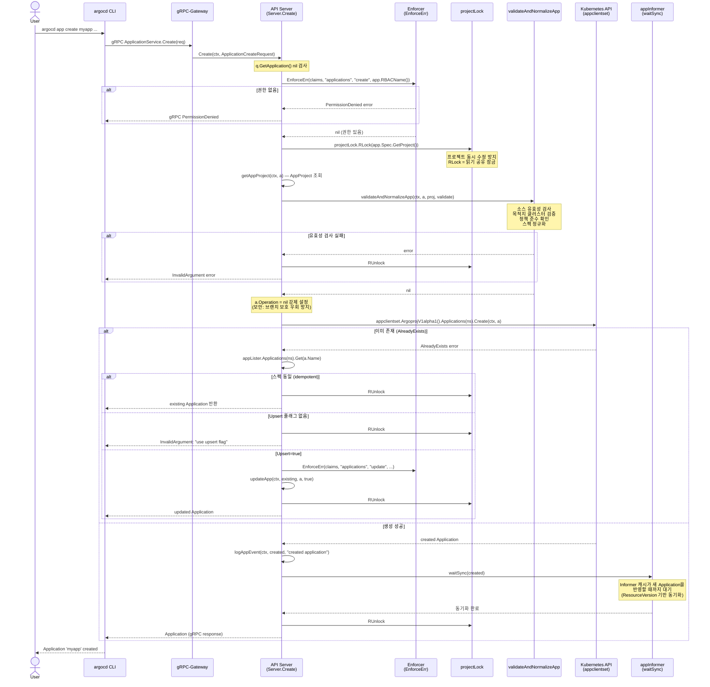
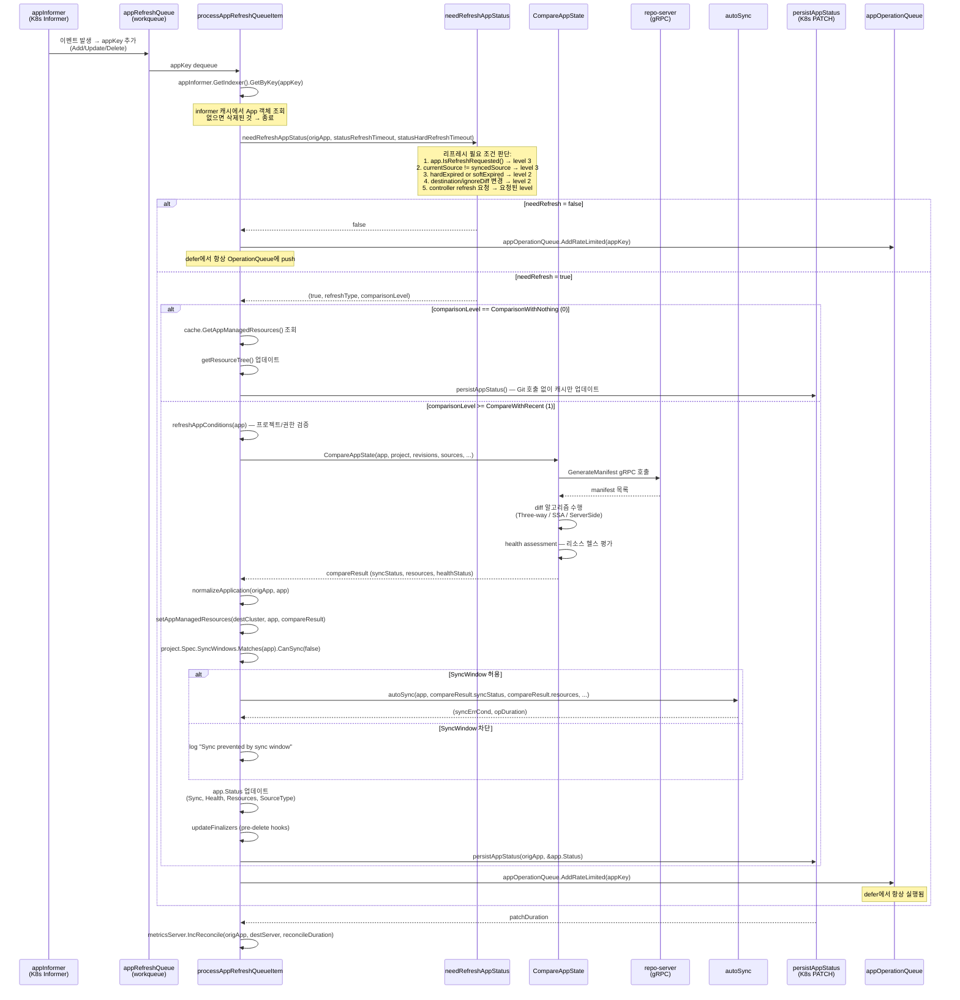
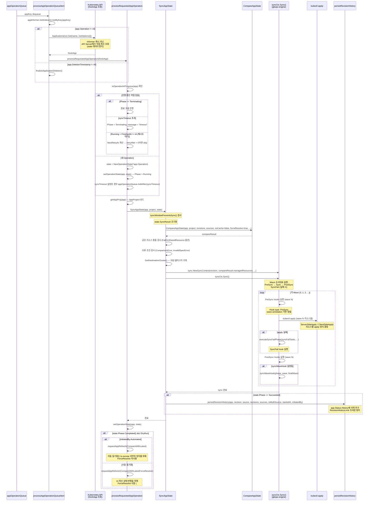
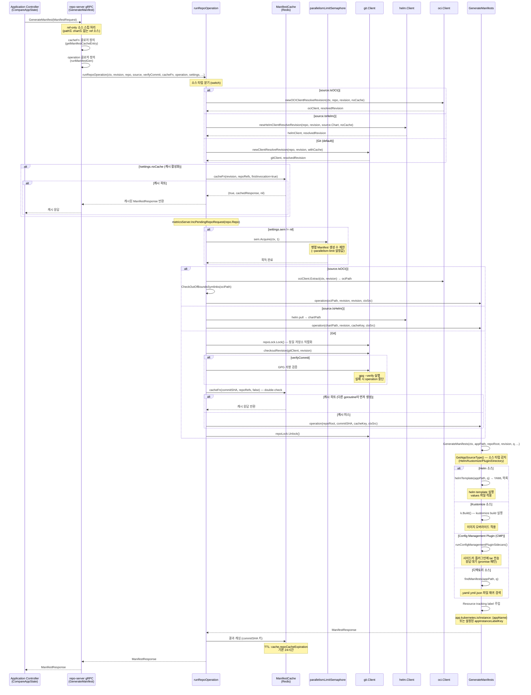
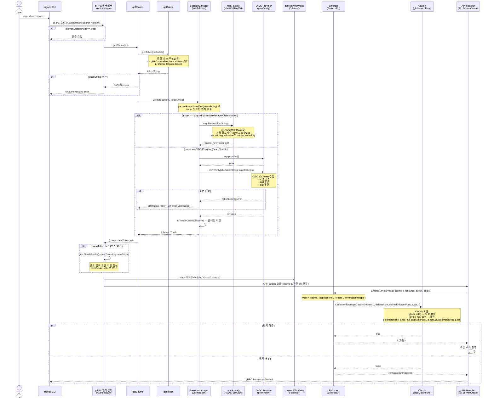
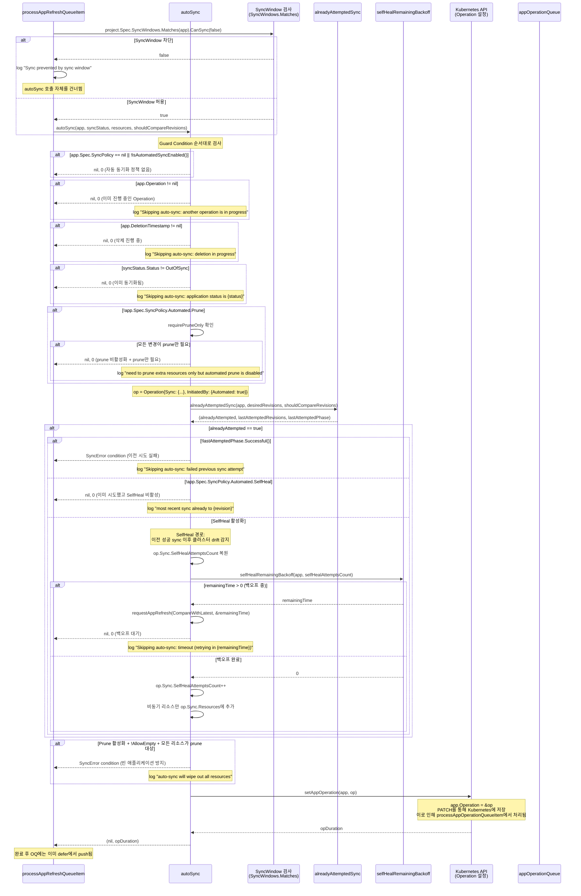
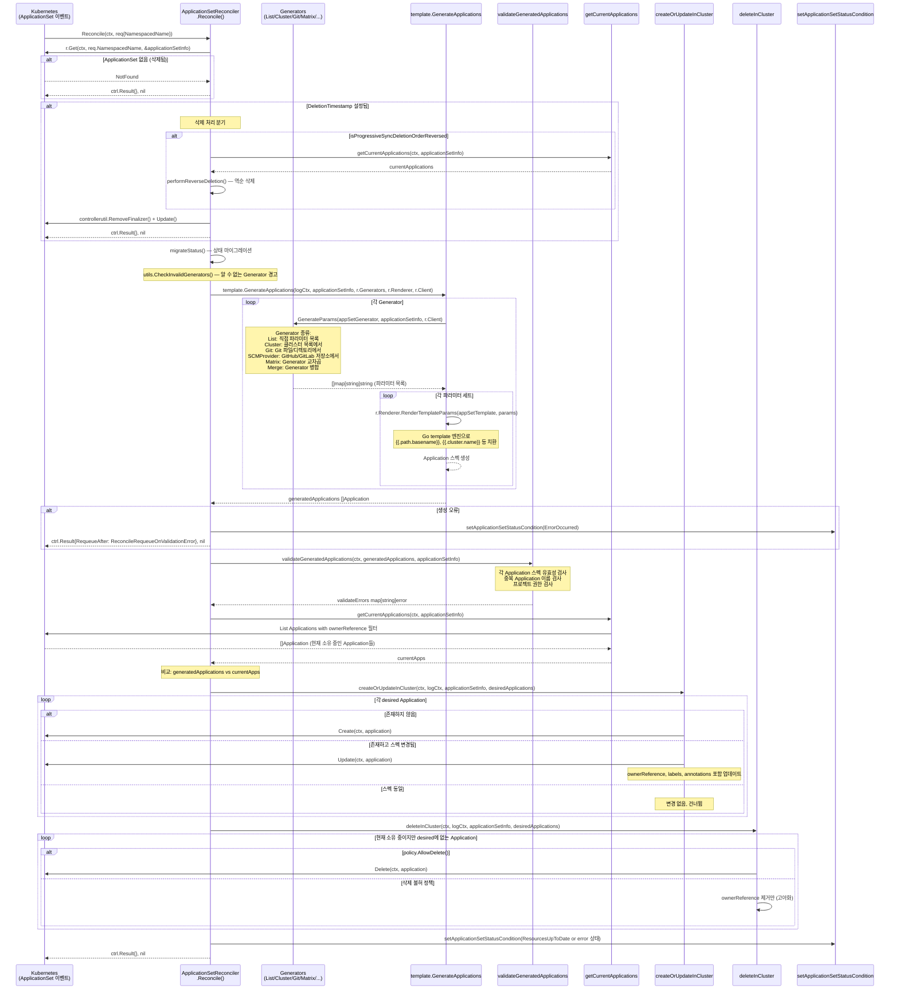
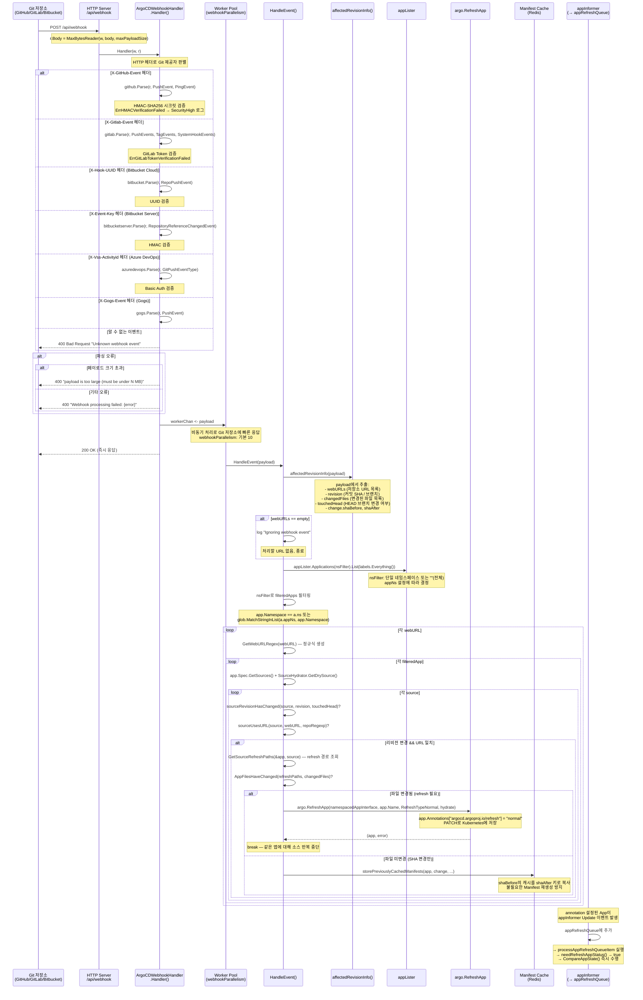

# Argo CD 시퀀스 다이어그램

Argo CD의 핵심 요청 흐름을 단계별로 분석한다. 각 흐름은 실제 소스코드를 직접 추적하여 작성되었다.

---

## 목차

1. [Application 생성 흐름](#1-application-생성-흐름)
2. [Reconciliation (조정) 흐름](#2-reconciliation-조정-흐름)
3. [Sync (동기화) 실행 흐름](#3-sync-동기화-실행-흐름)
4. [Manifest 생성 흐름](#4-manifest-생성-흐름)
5. [인증/인가 흐름](#5-인증인가-흐름)
6. [Auto-Sync 흐름](#6-auto-sync-흐름)
7. [ApplicationSet 흐름](#7-applicationset-흐름)
8. [Webhook 흐름](#8-webhook-흐름)

---

## 1. Application 생성 흐름

**소스**: `server/application/application.go` — `(s *Server) Create()`

### 개요

사용자가 `argocd app create` 명령어를 실행하면 argocd CLI는 API Server에 gRPC 요청을 보낸다. API Server는 RBAC 검사, 프로젝트 잠금, 유효성 검사, Kubernetes API 저장, Informer 동기화 대기 순서로 처리한다.



### 주요 포인트

| 단계 | 코드 위치 | 설명 |
|------|----------|------|
| RBAC 검사 | `application.go:352` | `s.enf.EnforceErr(ctx.Value("claims"), rbac.ResourceApplications, rbac.ActionCreate, a.RBACName(s.ns))` |
| 프로젝트 잠금 | `application.go:356` | `s.projectLock.RLock(a.Spec.GetProject())` — 동시 프로젝트 수정 경합 방지 |
| Operation 강제 제거 | `application.go:381-387` | 사용자가 Operation을 직접 설정하려는 시도를 차단 (브랜치 보호 우회 방지) |
| Kubernetes 저장 | `application.go:389` | `s.appclientset.ArgoprojV1alpha1().Applications(appNs).Create()` |
| Informer 동기화 | `application.go:392` | `s.waitSync(created)` — 캐시 불일치 방지 |

---

## 2. Reconciliation (조정) 흐름

**소스**: `controller/appcontroller.go` — `(ctrl *ApplicationController) processAppRefreshQueueItem()`

### 개요

Application Controller는 Informer 이벤트로 `appRefreshQueue`에 항목이 추가되면 `processAppRefreshQueueItem()`을 호출한다. 이 함수는 리프레시 필요 여부 판단 → 상태 비교 → 자동 동기화 → 상태 저장의 순서로 진행한다.

### CompareWith 레벨

```
CompareWithLatestForceResolve (3)  최신 리비전 강제 재분석 (ref 소스 포함)
CompareWithLatest              (2)  최신 리비전과 비교
CompareWithRecent              (1)  최근 캐시된 리비전과 비교
ComparisonWithNothing          (0)  Git 없이 캐시된 리소스만 업데이트
```

소스: `controller/appcontroller.go:84-94`

```go
type CompareWith int

const (
    CompareWithLatestForceResolve CompareWith = 3
    CompareWithLatest             CompareWith = 2
    CompareWithRecent             CompareWith = 1
    ComparisonWithNothing         CompareWith = 0
)
```



### needRefreshAppStatus 판단 로직 상세

```
소스: controller/appcontroller.go:2011

판단 우선순위 (위에서 아래로 첫 매치 사용):
1. app.IsRefreshRequested()         → compareWith = 3 (ForceResolve)
2. !currentSourceEqualsSyncedSource → compareWith = 3 (ForceResolve)
3. hardExpired                      → compareWith = 2 (Latest), refreshType = Hard
4. softExpired                      → compareWith = 2 (Latest), refreshType = Normal
5. destination 변경                  → reason 설정, compareWith = 2 (Latest)
6. ignoreDifferences 변경            → reason 설정, compareWith = 2 (Latest)
7. ctrl.isRefreshRequested()        → compareWith = 요청된 level

reason이 설정된 경우에만 needRefresh = true 반환
```

---

## 3. Sync (동기화) 실행 흐름

**소스**: `controller/appcontroller.go` — `processAppOperationQueueItem()`, `processRequestedAppOperation()`
**소스**: `controller/sync.go` — `(m *appStateManager) SyncAppState()`
**소스**: `gitops-engine/pkg/sync/sync_context.go` — `(sc *syncContext) Sync()`

### 개요

`appOperationQueue`에서 꺼낸 Application에 `Operation`이 설정된 경우 실제 Sync를 수행한다. API Server에서 직접 최신 상태를 조회하고 (Informer 캐시 미사용), Wave 순서대로 Hook을 실행하며, 완료 후 이력을 저장한다.



### Sync Wave 실행 순서 상세

```
소스: gitops-engine/pkg/sync/sync_context.go:450 (sc *syncContext) Sync()

Wave 0 → Wave 1 → Wave 2 → ...

각 Wave 내 실행 순서:
1. PreSync hooks (wave N)
2. 일반 리소스 apply (wave N)
3. PostSync hooks (wave N)

실패 시:
- SyncFail hooks 실행 (executeSyncFailPhase)
- 이전 wave의 실패한 태스크 전달

Hook 유형:
  argocd.argoproj.io/hook: PreSync    — sync 이전 실행 (DB 마이그레이션 등)
  argocd.argoproj.io/hook: Sync       — sync 중 실행
  argocd.argoproj.io/hook: PostSync   — sync 완료 후 실행 (smoke test 등)
  argocd.argoproj.io/hook: SyncFail   — sync 실패 시 실행 (롤백, 알림 등)
```

---

## 4. Manifest 생성 흐름

**소스**: `reposerver/repository/repository.go` — `GenerateManifest()`, `runRepoOperation()`, `GenerateManifests()`

### 개요

Application Controller가 상태 비교를 위해 Repo Server에 gRPC로 Manifest 생성을 요청한다. Repo Server는 소스 타입(Git/Helm/OCI)을 분기하고, 캐시를 확인한 뒤 세마포어를 획득하여 병렬성을 제한하고, 실제 Manifest를 생성하여 캐시에 저장한다.



### 캐시 이중 확인 (Double-Check Locking) 패턴

```
소스: reposerver/repository/repository.go:365-368, 그리고 Git checkout 이후

1차 캐시 확인: repoLock 획득 전 (revision이 이미 있으면 바로 반환)
2차 캐시 확인: repoLock 획득 후, checkout 이후 (다른 goroutine이 먼저 완료한 경우 처리)

이 패턴으로 동일 revision에 대한 중복 Git 작업을 방지한다.
```

### 소스 타입별 처리 요약

| 소스 타입 | 판별 방법 | 생성 함수 | 특이사항 |
|----------|----------|----------|---------|
| OCI | `source.IsOCI()` | `ociClient.Extract()` | symlink 검사 필수 |
| Helm | `source.IsHelm()` | `helmTemplate()` | chart 이름으로 revision 분리 |
| Kustomize | `kustomize.yaml` 존재 | `k.Build()` | 이미지 오버라이드 가능 |
| Plugin (CMP) | 플러그인 설정 | `runConfigManagementPluginSidecars()` | promise 패턴, tar 전송 |
| 디렉토리 | 기본값 | `findManifests()` | 재귀 YAML 탐색 |

---

## 5. 인증/인가 흐름

**소스**: `server/server.go` — `(server *ArgoCDServer) Authenticate()`
**소스**: `util/session/sessionmanager.go` — `(mgr *SessionManager) VerifyToken()`
**소스**: `util/rbac/rbac.go` — `(e *Enforcer) EnforceErr()`

### 개요

모든 gRPC 요청은 `Authenticate()` 인터셉터를 통과한다. 토큰을 추출하고 검증한 뒤 Claims를 컨텍스트에 주입한다. 이후 각 API 핸들러에서 `EnforceErr()`로 RBAC 정책을 검사한다.



### 토큰 검증 분기 상세

```
소스: util/session/sessionmanager.go:550

func (mgr *SessionManager) VerifyToken(ctx, tokenString) (jwt.Claims, string, error) {
    parser := jwt.NewParser(jwt.WithoutClaimsValidation())
    _, _, err := parser.ParseUnverified(tokenString, &claims)
    // issuer만 추출 (서명 검증 없음)

    issuer := claims["iss"].(string)
    switch issuer {
    case SessionManagerClaimsIssuer:  // "argocd"
        return mgr.Parse(tokenString)  // HMAC-SHA256 검증
    default:
        prov, _ := mgr.provider()
        idToken, err := prov.Verify(ctx, tokenString, argoSettings)  // OIDC 검증
        ...
    }
}
```

### Casbin RBAC 모델

```
[request_definition]
r = sub, res, act, obj

[policy_definition]
p = sub, res, act, obj

[role_definition]
g = _, _        # 역할 상속

[policy_effect]
e = some(where (p.eft == allow)) && !some(where (p.eft == deny))

[matchers]
m = g(r.sub, p.sub) && globMatch(r.res, p.res) && globMatch(r.act, p.act) && globMatch(r.obj, p.obj)
```

기본 정책 예시:
```
p, role:admin, applications, *, */*
p, role:readonly, applications, get, */*
g, admin, role:admin
```

---

## 6. Auto-Sync 흐름

**소스**: `controller/appcontroller.go` — `(ctrl *ApplicationController) autoSync()`

### 개요

`processAppRefreshQueueItem()` 내에서 상태 비교(CompareAppState) 결과가 OutOfSync이면 `autoSync()`를 호출한다. 여러 Guard Condition을 통과해야 실제 동기화 Operation이 생성되며, Self-Heal 경로는 별도의 백오프 로직을 사용한다.



### Guard Condition 요약표

| 조건 | 건너뜀 이유 | 코드 위치 |
|------|----------|----------|
| `SyncPolicy == nil` 또는 AutoSync 비활성 | 자동 동기화 정책 없음 | `appcontroller.go:2184` |
| `app.Operation != nil` | 이미 Operation 진행 중 | `appcontroller.go:2188` |
| `app.DeletionTimestamp != nil` | 삭제 진행 중 | `appcontroller.go:2192` |
| `syncStatus != OutOfSync` | 이미 동기화됨 | `appcontroller.go:2199` |
| Prune 비활성 + prune만 필요 | prune 정책 미충족 | `appcontroller.go:2204` |
| `alreadyAttempted` + 실패 | 이전 실패 재시도 방지 | `appcontroller.go:2247` |
| `alreadyAttempted` + SelfHeal 비활성 | 반복 동기화 방지 | `appcontroller.go:2253` |
| SelfHeal 백오프 중 | 지수 백오프 | `appcontroller.go:2264` |
| AllowEmpty=false + 모두 prune | 전체 삭제 방지 | `appcontroller.go:2283` |

---

## 7. ApplicationSet 흐름

**소스**: `applicationset/controllers/applicationset_controller.go` — `(r *ApplicationSetReconciler) Reconcile()`

### 개요

ApplicationSet Controller는 controller-runtime 프레임워크 위에서 동작한다. ApplicationSet 리소스가 변경될 때마다 Reconcile이 호출되어 Generator들이 파라미터를 생성하고, Template을 통해 Application 스펙을 만들며, 현재 상태와 비교하여 Create/Update/Delete를 수행한다.



### Generator 종류별 파라미터 생성

```
소스: applicationset/generators/ 디렉토리

List Generator:
  입력: spec.generators.list.elements
  출력: 각 element가 파라미터 세트

Cluster Generator:
  입력: Kubernetes Secret (argocd 클러스터 등록 정보)
  출력: {name, server, metadata.*} 파라미터

Git Generator:
  입력: Git 저장소의 디렉토리 구조 또는 JSON/YAML 파일
  출력: {path, path.basename, ...} 또는 파일 내용 파라미터

SCMProvider Generator:
  입력: GitHub/GitLab/Bitbucket 조직
  출력: {organization, repository, branch, url, ...}

Matrix Generator:
  입력: 두 Generator의 조합
  출력: 교차곱 (N * M 파라미터 세트)

Merge Generator:
  입력: 여러 Generator + 병합 키
  출력: 키 기반 병합 파라미터 세트
```

---

## 8. Webhook 흐름

**소스**: `util/webhook/webhook.go` — `Handler()`, `HandleEvent()`

### 개요

GitHub/GitLab/Bitbucket 등의 Git 저장소가 Push 이벤트를 보내면 Argo CD는 `/api/webhook` 엔드포인트에서 이를 수신한다. 시크릿 검증 후 영향받는 Application을 식별하여 RefreshApp annotation을 설정함으로써 즉각적인 Reconciliation을 트리거한다.



### Webhook 처리 전체 타임라인

```
T+0ms:   Git Push → GitHub가 webhook POST 전송
T+50ms:  Argo CD Handler() 수신 → 시크릿 검증 → 200 OK 즉시 응답
T+50ms:  workerChan에 payload 전달 (비동기)
T+60ms:  HandleEvent() 시작 → affectedRevisionInfo() 파싱
T+80ms:  영향받는 Application 식별 → RefreshApp() PATCH 호출
T+100ms: Kubernetes Informer가 annotation 변경 감지
T+100ms: appRefreshQueue에 Application 추가
T+200ms: processAppRefreshQueueItem() 실행 시작
T+500ms: CompareAppState() → Repo Server gRPC → manifest 생성
T+1000ms: 상태 비교 완료 → persistAppStatus()
```

### Webhook 보안 검증 방식

| Git 제공자 | 헤더 | 검증 방식 |
|-----------|------|---------|
| GitHub | `X-GitHub-Event` | HMAC-SHA256 (secret token) |
| GitLab | `X-Gitlab-Event` | Secret Token 비교 |
| Bitbucket Cloud | `X-Hook-UUID` | UUID 비교 |
| Bitbucket Server | `X-Event-Key` | HMAC-SHA256 |
| Azure DevOps | `X-Vss-Activityid` | Basic Auth |
| Gogs | `X-Gogs-Event` | HMAC-SHA256 |

---

## 흐름 간 연결 관계

```
                          ┌─────────────────────────────────────────────────────┐
                          │                 정상 운영 사이클                      │
                          │                                                       │
  사용자/CLI              │  Webhook                                              │
      │                   │     │                                                  │
      ▼                   │     ▼                                                  │
  [1. App 생성]           │  [8. Webhook]──────RefreshApp──────┐                  │
      │                   │                                     │                  │
      │ appclientset       │                                     ▼                  │
      │ .Create()          │                           appInformer Update           │
      │                   │                                     │                  │
      ▼                   │                                     ▼                  │
  K8s에 저장              │         ┌──────────────────[2. Reconciliation]──────── ┤
                          │         │                           │                  │
  informer 감지            │         │               needRefreshAppStatus()         │
      │                   │         │                           │                  │
      ▼                   │         │                           ▼                  │
  appRefreshQueue         │         │               CompareAppState()              │
      │                   │         │                           │                  │
      ▼                   │         │               [4. Manifest 생성]             │
  [2. Reconciliation] ◄───┘         │               (repo-server gRPC)            │
      │                             │                           │                  │
      ├──OutOfSync──────────────────┤               autoSync() 판단               │
      │                             │                           │                  │
      ▼                             │                           ▼                  │
  autoSync()              │         │               [6. Auto-Sync]                 │
      │                   │         │                           │                  │
      ▼                   │         │               setAppOperation()              │
  appOperationQueue       │         │                           │                  │
      │                   │         │                           ▼                  │
      ▼                   │         └──────────────────[3. Sync 실행]──────────── ┤
  [3. Sync 실행]          │                                     │                  │
      │                   │                           SyncAppState()               │
      │                   │                           syncCtx.Sync()              │
      │                   │                           Wave 순서 실행              │
      │                   │                                     │                  │
      ▼                   │                           성공 시 requestAppRefresh   │
  완료 → requestAppRefresh│                                     │                  │
      │                   └─────────────────────────────────────┘                  │
      └─────────────────────────────────────────────────────────────────────────┘

[5. 인증/인가]: 모든 API 요청에 횡단적으로 적용 (gRPC 인터셉터)
[7. ApplicationSet]: 독립적인 컨트롤러, 복수의 Application을 자동 관리
```

---

## 핵심 데이터 구조 참조

### Application 상태 (SyncStatus)

```go
// vendor/github.com/argoproj/argo-cd/v2/pkg/apis/application/v1alpha1/types.go

type SyncStatus struct {
    Status     SyncStatusCode `json:"status"`      // Synced / OutOfSync / Unknown
    ComparedTo ComparedTo     `json:"comparedTo"`
    Revision   string         `json:"revision,omitempty"`
    Revisions  []string       `json:"revisions,omitempty"`
}

// SyncStatusCode 값
const (
    SyncStatusCodeUnknown  SyncStatusCode = "Unknown"
    SyncStatusCodeSynced   SyncStatusCode = "Synced"
    SyncStatusCodeOutOfSync SyncStatusCode = "OutOfSync"
)
```

### Operation (동기화 요청)

```go
type Operation struct {
    Sync        *SyncOperation     `json:"sync,omitempty"`
    InitiatedBy OperationInitiator `json:"initiatedBy,omitempty"`
    Retry       RetryStrategy      `json:"retry,omitempty"`
}

type SyncOperation struct {
    Revision             string              `json:"revision,omitempty"`
    Prune                bool                `json:"prune,omitempty"`
    SyncOptions          SyncOptions         `json:"syncOptions,omitempty"`
    SelfHealAttemptsCount int64              `json:"selfHealAttemptsCount,omitempty"`
    Resources            []SyncOperationResource `json:"resources,omitempty"`
}
```

### CompareWith 레벨과 동작

```
레벨 0 (ComparisonWithNothing): Git 호출 없음, 캐시된 리소스로 트리 업데이트만
레벨 1 (CompareWithRecent):     기존 revision 사용, repo 호출은 하되 ls-remote 생략
레벨 2 (CompareWithLatest):     최신 revision 조회 (ls-remote), manifest 재생성
레벨 3 (CompareWithLatestForceResolve): 레벨 2 + ref 소스의 revision도 강제 재분석

Webhook, 수동 refresh → 레벨 3
spec.source 변경 → 레벨 3
주기적 갱신 (softExpired) → 레벨 2
하드 만료 (hardExpired) → 레벨 2 + RefreshTypeHard
캐시 tree 업데이트만 → 레벨 0
```
