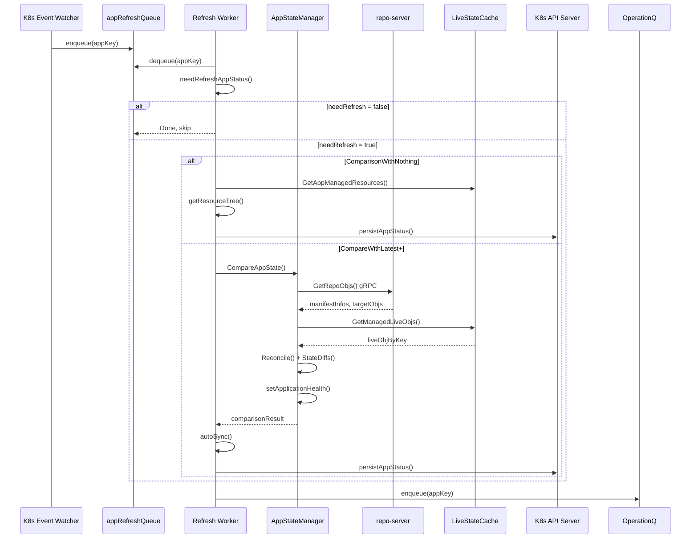
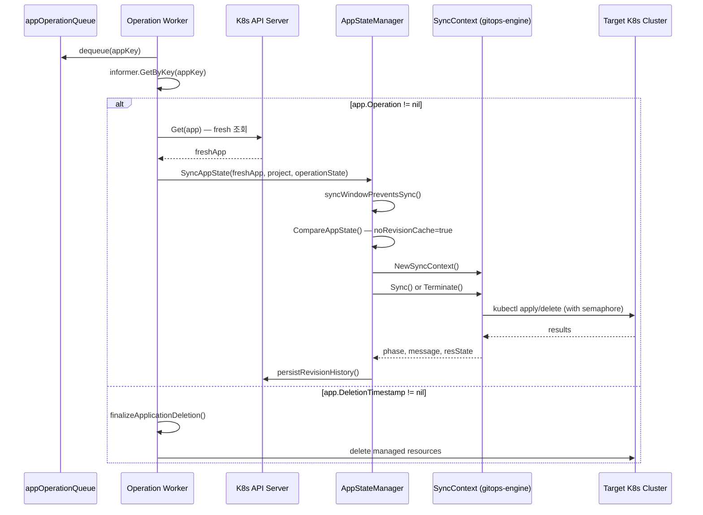

# 08. Application Controller Deep-Dive

Argo CD의 핵심 엔진인 Application Controller에 대한 심화 분석 문서다.
Application Controller는 GitOps 조정 루프(reconciliation loop)를 구동하며, Git 상태와 클러스터 실제 상태를 지속적으로 비교하고 동기화하는 역할을 담당한다.

소스 파일 위치:
- `controller/appcontroller.go` (2,697줄) — 컨트롤러 본체
- `controller/state.go` (1,238줄) — 상태 비교 엔진
- `controller/sync.go` (606줄) — 동기화 실행
- `controller/health.go` (104줄) — 헬스 평가

---

## 1. 전체 아키텍처 개요

```
┌─────────────────────────────────────────────────────────────────────┐
│                    ApplicationController                            │
│                                                                     │
│  ┌──────────────────────────────────────────────────────────────┐  │
│  │                      워크큐 레이어                            │  │
│  │  appRefreshQueue          appOperationQueue                  │  │
│  │  appComparisonTypeRefreshQueue  projectRefreshQueue          │  │
│  │  appHydrateQueue          hydrationQueue                     │  │
│  └──────────────┬──────────────────────┬─────────────────────────┘  │
│                 │                      │                             │
│  ┌──────────────▼──────┐  ┌────────────▼──────────┐               │
│  │  Refresh Processor  │  │  Operation Processor  │               │
│  │  (statusProcessors  │  │  (operationProcessors │               │
│  │   개수만큼 고루틴)    │  │   개수만큼 고루틴)     │               │
│  └──────────────┬──────┘  └────────────┬──────────┘               │
│                 │                      │                             │
│  ┌──────────────▼──────────────────────▼──────────────────────────┐ │
│  │                   AppStateManager                              │ │
│  │   CompareAppState()    SyncAppState()                         │ │
│  └──────────────┬──────────────────────┬──────────────────────────┘ │
│                 │                      │                             │
│  ┌──────────────▼──────┐  ┌────────────▼──────────┐               │
│  │  LiveStateCache     │  │  repo-server gRPC     │               │
│  │  (클러스터 상태 캐시)  │  │  (manifest 생성)      │               │
│  └─────────────────────┘  └───────────────────────┘               │
└─────────────────────────────────────────────────────────────────────┘
```

Application Controller는 두 개의 독립적인 처리 파이프라인을 가진다:

1. **Refresh Pipeline** (`appRefreshQueue`): Git 상태와 클러스터 상태를 비교(compare)하여 Application의 `status`를 업데이트한다.
2. **Operation Pipeline** (`appOperationQueue`): `app.Operation` 필드에 설정된 동기화 작업을 실행하고, 삭제 파이널라이저를 처리한다.

이 두 파이프라인은 독립적으로 스케일링되며, Refresh가 완료된 후 항상 Operation 큐에도 enqueue하는 방식으로 협력한다.

---

## 2. ApplicationController 구조체

소스: `controller/appcontroller.go` L.106-149

```go
type ApplicationController struct {
    cache                *appstatecache.Cache
    namespace            string
    kubeClientset        kubernetes.Interface
    kubectl              kube.Kubectl
    applicationClientset appclientset.Interface
    auditLogger          *argo.AuditLogger

    // 워크큐 — 6개 큐
    appRefreshQueue                workqueue.TypedRateLimitingInterface[string]
    appComparisonTypeRefreshQueue  workqueue.TypedRateLimitingInterface[string]
    appOperationQueue              workqueue.TypedRateLimitingInterface[string]
    projectRefreshQueue            workqueue.TypedRateLimitingInterface[string]
    appHydrateQueue                workqueue.TypedRateLimitingInterface[string]
    hydrationQueue                 workqueue.TypedRateLimitingInterface[hydratortypes.HydrationQueueKey]

    // 인포머와 리스터
    appInformer   cache.SharedIndexInformer
    appLister     applisters.ApplicationLister
    projInformer  cache.SharedIndexInformer

    // 상태 관리
    appStateManager  AppStateManager
    stateCache       statecache.LiveStateCache

    // 타임아웃 설정
    statusRefreshTimeout      time.Duration  // soft refresh 주기 (기본 3분)
    statusHardRefreshTimeout  time.Duration  // hard refresh 주기
    statusRefreshJitter       time.Duration  // 지터 — 동시 폭풍 방지
    selfHealTimeout           time.Duration  // self-heal 재시도 대기
    selfHealBackoff           *wait.Backoff  // exponential backoff 설정
    syncTimeout               time.Duration  // 동기화 타임아웃

    // 내부 상태
    db                    db.ArgoDB
    settingsMgr           *settings_util.SettingsManager
    refreshRequestedApps  map[string]CompareWith  // 갱신 요청 맵
    refreshRequestedAppsMutex  *sync.Mutex

    // 리소스 제어
    metricsServer      *metrics.MetricsServer
    metricsClusterLabels []string
    kubectlSemaphore   *semaphore.Weighted      // kubectl 병렬 실행 제한
    clusterSharding    sharding.ClusterShardingCache  // 샤딩

    // 기타
    projByNameCache             sync.Map
    applicationNamespaces       []string
    ignoreNormalizerOpts        normalizers.IgnoreNormalizerOpts
    dynamicClusterDistributionEnabled bool
    deploymentInformer          informerv1.DeploymentInformer
    hydrator                    *hydrator.Hydrator
}
```

### 주요 필드 설명

| 필드 | 역할 |
|------|------|
| `appRefreshQueue` | Application 조정(reconcile) 요청 큐. `namespace/name` 형식의 키 저장 |
| `appComparisonTypeRefreshQueue` | CompareWith 레벨이 명시된 갱신 요청 큐. `namespace/name/compareType` 형식 |
| `appOperationQueue` | Operation 실행 요청 큐. Refresh 완료 후 항상 여기에도 enqueue |
| `projectRefreshQueue` | AppProject 변경 시 해당 프로젝트의 App 전체 재조정 큐 |
| `appHydrateQueue` | Hydrator(manifest 사전 생성) 처리 큐 |
| `hydrationQueue` | 실제 hydration 작업 처리 큐 (HydrationQueueKey 타입) |
| `appInformer` | Application CRD의 SharedIndexInformer — 이벤트 구독 및 로컬 캐시 |
| `appLister` | informer 캐시에서 Application 목록 조회 |
| `projInformer` | AppProject CRD의 SharedIndexInformer |
| `appStateManager` | CompareAppState, SyncAppState 인터페이스 구현체 |
| `stateCache` | LiveStateCache — 클러스터 리소스 상태를 메모리에 캐싱 |
| `statusRefreshTimeout` | soft refresh 간격. 이 시간이 지나면 자동으로 재조정 |
| `statusHardRefreshTimeout` | hard refresh 간격. repo-server에 새 manifest 강제 요청 |
| `selfHealTimeout` | self-heal 재시도 전 대기 시간 |
| `selfHealBackoff` | nil이면 고정 timeout, 설정 시 지수 backoff |
| `refreshRequestedApps` | 외부에서 요청된 refresh와 그 CompareWith 레벨 저장 |
| `kubectlSemaphore` | kubectl 병렬 실행 수 제한 (kubectlParallelismLimit) |
| `clusterSharding` | 멀티 컨트롤러 환경에서 클러스터 분배 |

---

## 3. CompareWith 레벨 (비교 깊이)

소스: `controller/appcontroller.go` L.84-101

```go
type CompareWith int

const (
    // Git을 조회하지 않고 리소스 트리만 재구축
    ComparisonWithNothing CompareWith = 0

    // 가장 최근 비교에 사용된 revision으로 비교 (캐시 활용)
    CompareWithRecent CompareWith = 1

    // Git에서 최신 revision을 가져와 비교
    CompareWithLatest CompareWith = 2

    // revision 캐시 없이 Git에서 최신 revision 강제 조회
    CompareWithLatestForceResolve CompareWith = 3
)

func (a CompareWith) Max(b CompareWith) CompareWith {
    return CompareWith(math.Max(float64(a), float64(b)))
}
```

**단조 증가 보장**: `Max()` 함수를 통해 CompareWith 레벨은 항상 최댓값으로만 올라간다. 이미 높은 레벨의 refresh가 요청된 상태에서 낮은 레벨 요청이 들어와도 레벨이 내려가지 않는다.

```
ComparisonWithNothing(0) < CompareWithRecent(1) < CompareWithLatest(2) < CompareWithLatestForceResolve(3)
          리소스 트리        마지막 revision 재사용      Git HEAD 조회           revision 캐시 무효화
```

---

## 4. Run() 시작 흐름

소스: `controller/appcontroller.go` L.886-967

```go
func (ctrl *ApplicationController) Run(ctx context.Context, statusProcessors int, operationProcessors int) {
    // 1. 종료 시 워크큐 정리
    defer runtime.HandleCrash()
    defer ctrl.appRefreshQueue.ShutDown()
    defer ctrl.appComparisonTypeRefreshQueue.ShutDown()
    defer ctrl.appOperationQueue.ShutDown()
    defer ctrl.projectRefreshQueue.ShutDown()
    defer ctrl.appHydrateQueue.ShutDown()
    defer ctrl.hydrationQueue.ShutDown()

    // 2. 클러스터 시크릿 업데이터 등록 (클러스터 추가/수정/삭제 감지)
    ctrl.RegisterClusterSecretUpdater(ctx)
    ctrl.metricsServer.RegisterClustersInfoSource(ctx, ctrl.stateCache, ctrl.db, ctrl.metricsClusterLabels)

    // 3. Dynamic cluster distribution이 활성화된 경우 Deployment 인포머 시작
    if ctrl.dynamicClusterDistributionEnabled {
        go ctrl.deploymentInformer.Informer().Run(ctx.Done())
    }

    // 4. 클러스터 샤딩 초기화
    clusters, err := ctrl.db.ListClusters(ctx)
    if err == nil {
        appItems, err := ctrl.getAppList(metav1.ListOptions{})
        if err == nil {
            ctrl.clusterSharding.Init(clusters, appItems)
        }
    }

    // 5. 인포머 시작
    go ctrl.appInformer.Run(ctx.Done())
    go ctrl.projInformer.Run(ctx.Done())

    // 6. LiveStateCache 초기화
    errors.CheckError(ctrl.stateCache.Init())

    // 7. 캐시 동기화 대기
    if !cache.WaitForCacheSync(ctx.Done(), ctrl.appInformer.HasSynced, ctrl.projInformer.HasSynced) {
        log.Error("Timed out waiting for caches to sync")
        return
    }

    // 8. LiveStateCache 실행 (클러스터별 watch 시작)
    go func() { errors.CheckError(ctrl.stateCache.Run(ctx)) }()

    // 9. 메트릭 서버 시작
    go func() { errors.CheckError(ctrl.metricsServer.ListenAndServe()) }()

    // 10. statusProcessors 개수만큼 Refresh 워커 고루틴
    for range statusProcessors {
        go wait.Until(func() {
            for ctrl.processAppRefreshQueueItem() {
            }
        }, time.Second, ctx.Done())
    }

    // 11. operationProcessors 개수만큼 Operation 워커 고루틴
    for range operationProcessors {
        go wait.Until(func() {
            for ctrl.processAppOperationQueueItem() {
            }
        }, time.Second, ctx.Done())
    }

    // 12. ComparisonType 큐 처리기 (단일)
    go wait.Until(func() {
        for ctrl.processAppComparisonTypeQueueItem() {
        }
    }, time.Second, ctx.Done())

    // 13. Project 큐 처리기 (단일)
    go wait.Until(func() {
        for ctrl.processProjectQueueItem() {
        }
    }, time.Second, ctx.Done())

    // 14. Hydrator 고루틴 (설정된 경우만)
    if ctrl.hydrator != nil {
        go wait.Until(func() {
            for ctrl.processAppHydrateQueueItem() {
            }
        }, time.Second, ctx.Done())
        go wait.Until(func() {
            for ctrl.processHydrationQueueItem() {
            }
        }, time.Second, ctx.Done())
    }

    <-ctx.Done()
}
```

### 시작 흐름 시퀀스

```
main()
  │
  ├─ NewApplicationController()
  │    ├─ newApplicationInformerAndLister()
  │    ├─ NewAppProjectInformer()
  │    └─ NewLiveStateCache()
  │
  └─ Run(ctx, statusProcessors=20, operationProcessors=10)
       │
       ├─ RegisterClusterSecretUpdater(ctx)  ← 클러스터 시크릿 Watch
       ├─ clusterSharding.Init(clusters, apps)  ← 이 인스턴스가 담당할 클러스터 결정
       ├─ go appInformer.Run()  ← Application 이벤트 구독 시작
       ├─ go projInformer.Run()  ← AppProject 이벤트 구독 시작
       ├─ stateCache.Init()  ← 클러스터 API 서버 연결, informer 등록
       ├─ WaitForCacheSync()  ← 캐시 동기화 완료 대기 (블로킹)
       ├─ go stateCache.Run()  ← 클러스터별 리소스 watch 루프 시작
       ├─ go metricsServer.ListenAndServe()  ← Prometheus metrics 노출
       ├─ for 20: go processAppRefreshQueueItem()  ← Refresh 워커들
       ├─ for 10: go processAppOperationQueueItem()  ← Operation 워커들
       ├─ go processAppComparisonTypeQueueItem()
       ├─ go processProjectQueueItem()
       └─ <-ctx.Done()  ← 종료 신호 대기
```

**왜 `WaitForCacheSync` 이후에 워커를 시작하는가?**
캐시가 동기화되기 전에 워커를 시작하면, informer에서 조회한 Application 목록이 불완전할 수 있다. 초기 동기화 전에 조정 루프가 실행되면 존재하는 App이 없다고 판단하여 리소스를 잘못 삭제하는 등 위험한 동작을 할 수 있다.

---

## 5. processAppRefreshQueueItem() — 조정 루프 핵심

소스: `controller/appcontroller.go` L.1688-1930

Refresh Pipeline의 핵심이다. 모든 Application 상태 업데이트가 이 함수를 통해 이루어진다.

### 전체 흐름

```
processAppRefreshQueueItem()
  │
  ├─ [1] 큐에서 appKey 꺼내기
  │       defer: ctrl.appOperationQueue.AddRateLimited(appKey)  ← 항상 Operation 큐에도 enqueue
  │       defer: ctrl.appRefreshQueue.Done(appKey)
  │
  ├─ [2] informer 캐시에서 App 조회
  │
  ├─ [3] needRefreshAppStatus() — 갱신 필요 여부 + CompareWith 레벨 판단
  │       갱신 불필요 → 즉시 반환
  │
  ├─ [4] ComparisonWithNothing 분기
  │       └─ destination cluster가 유효하면 리소스 트리만 재구축 후 persistAppStatus() 반환
  │
  ├─ [5] refreshAppConditions() — 프로젝트 권한 검증
  │       에러 있으면 status=Unknown으로 설정 후 반환
  │
  ├─ [6] GetDestinationCluster() — 대상 클러스터 조회
  │
  ├─ [7] CompareAppState() — Git vs Live 비교 (핵심 연산)
  │       ErrCompareStateRepo → 임시 에러면 조용히 반환
  │
  ├─ [8] normalizeApplication() — spec 정규화 및 필요 시 API 서버에 패치
  │
  ├─ [9] setAppManagedResources() — 비교 결과를 캐시에 저장, 리소스 트리 구축
  │
  ├─ [10] syncWindows 체크 → autoSync() — 자동 동기화 판단 및 시작
  │
  ├─ [11] finalizers 업데이트 (pre-delete, post-delete hooks 변경 감지)
  │
  └─ [12] persistAppStatus() — app.Status를 API 서버에 패치
```

### defer로 Operation 큐 enqueue하는 이유

```go
defer func() {
    // Refresh 성공/실패 무관하게 항상 Operation 큐에 넣음
    ctrl.appOperationQueue.AddRateLimited(appKey)
    ctrl.appRefreshQueue.Done(appKey)
}()
```

Refresh가 완료된 직후 Operation 처리기가 실행되어야 `app.Operation`이 있을 경우 즉시 실행할 수 있다. defer를 사용하는 이유는 Refresh 도중 panic이 발생해도 Operation 큐 enqueue가 보장되어야 하기 때문이다.

### ComparisonWithNothing 빠른 경로

```go
if comparisonLevel == ComparisonWithNothing {
    if destCluster, err = argo.GetDestinationCluster(...); err == nil {
        managedResources := make([]*appv1.ResourceDiff, 0)
        if err := ctrl.cache.GetAppManagedResources(app.InstanceName(ctrl.namespace), &managedResources); err == nil {
            var tree *appv1.ApplicationTree
            if tree, err = ctrl.getResourceTree(destCluster, app, managedResources); err == nil {
                app.Status.Summary = tree.GetSummary(app)
                ctrl.cache.SetAppResourcesTree(app.InstanceName(ctrl.namespace), tree)
            }
            patchDuration = ctrl.persistAppStatus(origApp, &app.Status)
            return processNext
        }
    }
    // 실패 시 일반 조정 루프로 폴백
}
```

`ComparisonWithNothing`은 Git 호출 없이 캐시된 managed resources에서 리소스 트리만 재구축한다. UI에서 리소스 목록만 갱신할 때 사용하며, repo-server 부하를 줄이는 최적화다.

---

## 6. needRefreshAppStatus() — 갱신 필요 여부 판단

소스: `controller/appcontroller.go` L.2011-2062

```go
func (ctrl *ApplicationController) needRefreshAppStatus(
    app *appv1.Application,
    statusRefreshTimeout, statusHardRefreshTimeout time.Duration,
) (bool, appv1.RefreshType, CompareWith) {

    compareWith := CompareWithLatest
    refreshType := appv1.RefreshTypeNormal

    // 만료 여부 사전 계산
    softExpired := app.Status.ReconciledAt == nil ||
        app.Status.ReconciledAt.Add(statusRefreshTimeout).Before(time.Now().UTC())
    hardExpired := (app.Status.ReconciledAt == nil ||
        app.Status.ReconciledAt.Add(statusHardRefreshTimeout).Before(time.Now().UTC())) &&
        statusHardRefreshTimeout.Seconds() != 0

    // 트리거 우선순위 체크
    if requestedType, ok := app.IsRefreshRequested(); ok {
        // [1순위] 사용자 refresh annotation → ForceResolve
        compareWith = CompareWithLatestForceResolve
        refreshType = requestedType
        reason = "..."
    } else {
        if !currentSourceEqualsSyncedSource(app) {
            // [2순위] spec.source 변경 → ForceResolve
            compareWith = CompareWithLatestForceResolve
        } else if hardExpired || softExpired {
            // [3순위] 만료
            if hardExpired {
                refreshType = appv1.RefreshTypeHard
            }
        } else if !reflect.DeepEqual(app.Spec.Destination, app.Status.Sync.ComparedTo.Destination) {
            // [4순위] destination 변경
        } else if app.HasChangedManagedNamespaceMetadata() {
            // [5순위] managedNamespaceMetadata 변경
        } else if !app.Spec.IgnoreDifferences.Equals(app.Status.Sync.ComparedTo.IgnoreDifferences) {
            // [6순위] ignoreDifferences 변경
        } else if requested, level := ctrl.isRefreshRequested(app.QualifiedName()); requested {
            // [7순위] 컨트롤러 내부 refresh 요청
            compareWith = level
        }
    }

    if reason != "" {
        return true, refreshType, compareWith
    }
    return false, refreshType, compareWith
}
```

### 트리거 우선순위 테이블

| 순위 | 트리거 | CompareWith | RefreshType | 설명 |
|------|--------|-------------|-------------|------|
| 1 | `argocd.argoproj.io/refresh` annotation | ForceResolve(3) | Normal/Hard | 사용자 명시 요청 |
| 2 | spec.source != status.sync.comparedTo.source | ForceResolve(3) | Normal | Git 소스 변경 |
| 3a | hard 만료 | Latest(2) | Hard | hardRefreshTimeout 초과 |
| 3b | soft 만료 | Latest(2) | Normal | refreshTimeout 초과 |
| 4 | destination 변경 | Latest(2) | Normal | 배포 대상 변경 |
| 5 | managedNamespaceMetadata 변경 | Latest(2) | Normal | 네임스페이스 메타데이터 변경 |
| 6 | ignoreDifferences 변경 | Latest(2) | Normal | 차이 무시 설정 변경 |
| 7 | 컨트롤러 내부 요청 | (level별) | Normal | 내부 이벤트 (Webhook 등) |

**ForceResolve vs Latest의 차이**: `CompareWithLatestForceResolve`는 revision 해석 캐시를 무효화한다. Git 태그나 브랜치(`HEAD`, `main`)가 가리키는 실제 commit SHA를 다시 조회한다. `CompareWithLatest`는 이미 해석된 revision을 재사용할 수 있다.

---

## 7. CompareAppState() — Git vs Live 비교 엔진

소스: `controller/state.go` L.551-1042

10단계로 구성된 핵심 알고리즘이다.

```
┌─────────────────────────────────────────────────────────────────────┐
│                    CompareAppState() 10단계                         │
│                                                                     │
│  Phase 1: syncStatus 초기화                                         │
│    └─ ComparedTo{Destination, Source/Sources, IgnoreDifferences}    │
│                                                                     │
│  Phase 2: 설정 로드                                                  │
│    └─ appLabelKey, resourceOverrides, resFilter, trackingMethod     │
│                                                                     │
│  Phase 3: targetObjs 생성 (Git → Manifests)                         │
│    └─ GetRepoObjs() → repo-server gRPC                              │
│       OR localManifests (sync --local 모드)                          │
│    → repoErrorGracePeriod 처리                                       │
│                                                                     │
│  Phase 4: 정규화 (dedup, filter)                                     │
│    └─ normalizeClusterScopeTracking()                               │
│    └─ DeduplicateTargetObjects()                                     │
│    └─ IsExcludedResource() → 제외 리소스 필터링                       │
│                                                                     │
│  Phase 5: liveObjs 로드                                              │
│    └─ liveStateCache.GetManagedLiveObjs()                           │
│    └─ project.IsLiveResourcePermitted() → 권한 필터링                │
│    └─ managedNamespaceMetadata 처리                                  │
│                                                                     │
│  Phase 6: delete hooks 분리                                          │
│    └─ isPreDeleteHook(), isPostDeleteHook() → targetObjsForSync 구성 │
│                                                                     │
│  Phase 7: Reconcile (페어링)                                         │
│    └─ sync.Reconcile(target, live, namespace, infoProvider)         │
│       → reconciliation.Target[], reconciliation.Live[]              │
│                                                                     │
│  Phase 8: Diff 계산                                                  │
│    └─ argodiff.StateDiffs(live, target, diffConfig)                 │
│       Three-way merge diff / Server-Side Apply / Structured Merge   │
│                                                                     │
│  Phase 9: 리소스별 syncStatus 계산                                    │
│    └─ Modified || target==nil || live==nil → OutOfSync              │
│    └─ hook/skip/extraAnnotation → 상태에서 제외                       │
│                                                                     │
│  Phase 10: Health 평가                                               │
│    └─ setApplicationHealth(managedResources, ...)                   │
│    └─ verifyGnuPGSignature() (GPG 서명 검증)                         │
└─────────────────────────────────────────────────────────────────────┘
```

### Phase 3: GetRepoObjs와 repoErrorGracePeriod

```go
targetObjs, manifestInfos, revisionsMayHaveChanges, err = m.GetRepoObjs(
    context.Background(), app, sources, appLabelKey, revisions,
    noCache, noRevisionCache, verifySignature, project, true)

if err != nil {
    if firstSeen, ok := m.repoErrorCache.Load(app.Name); ok {
        if time.Since(firstSeen.(time.Time)) <= m.repoErrorGracePeriod && !noRevisionCache {
            // 유예 기간 내 첫 에러 → 무시하고 short-circuit
            return nil, ErrCompareStateRepo
        }
    } else if !noRevisionCache {
        // 처음 발견된 에러 → 캐시에 기록하고 무시
        m.repoErrorCache.Store(app.Name, time.Now())
        return nil, ErrCompareStateRepo
    }
    failedToLoadObjs = true
}
```

`repoErrorGracePeriod` 설계 이유:
- repo-server가 일시적으로 불안정할 때 App 상태를 Unknown으로 즉시 전환하면 불필요한 알람이 발생한다.
- 유예 기간 동안은 이전 상태를 유지하고, 지속적으로 에러가 발생할 때만 Unknown으로 전환한다.
- `ErrCompareStateRepo`를 반환하면 호출자(`processAppRefreshQueueItem`)가 조용히 반환한다 (경고 로그만 출력).

### Phase 7-8: Reconcile과 Diff

```go
// Phase 7: target과 live를 인덱스 i로 1:1 매핑
reconciliation := sync.Reconcile(targetObjsForSync, liveObjByKey, app.Spec.Destination.Namespace, infoProvider)

// Phase 8: Diff 설정 구성
diffConfigBuilder := argodiff.NewDiffConfigBuilder().
    WithDiffSettings(app.Spec.IgnoreDifferences, resourceOverrides, compareOptions.IgnoreAggregatedRoles, m.ignoreNormalizerOpts).
    WithTracking(appLabelKey, string(trackingMethod))

// useDiffCache 조건에 따라 캐시 활용 여부 결정
if useDiffCache {
    diffConfigBuilder.WithCache(m.cache, app.InstanceName(m.namespace))
} else {
    diffConfigBuilder.WithNoCache()
}

// Server-Side Diff 활성화 여부
serverSideDiff := m.serverSideDiff ||
    resourceutil.HasAnnotationOption(app, common.AnnotationCompareOptions, "ServerSideDiff=true")
```

**Diff 방식 비교**:

| 방식 | 조건 | 특징 |
|------|------|------|
| Three-way merge diff | 기본 | last-applied annotation 기반, kubectl apply와 동일한 방식 |
| Structured Merge Diff | `ServerSideApply=true` | SSA의 field ownership 기반 |
| Server-Side Diff | `ServerSideDiff=true` | API 서버에 dry-run 적용 요청으로 실제 변경 예측 |

### Phase 9: 리소스별 syncStatus 판단 로직

```go
switch {
case resState.Hook || ignore.Ignore(obj) || hookutil.Skip(targetObj) || !isSelfReferencedObj:
    // hook, ignore annotation, skip annotation, 다른 App이 관리하는 리소스 → 상태 제외
case !isManagedNs && (diffResult.Modified || targetObj == nil || liveObj == nil):
    // target과 live가 다르거나 한쪽만 존재 → OutOfSync
    resState.Status = v1alpha1.SyncStatusCodeOutOfSync
    if !needsPruning || !resourceutil.HasAnnotationOption(obj, common.AnnotationCompareOptions, "IgnoreExtraneous") {
        syncCode = v1alpha1.SyncStatusCodeOutOfSync
    }
default:
    resState.Status = v1alpha1.SyncStatusCodeSynced
}
```

### Phase 10: Health 평가

소스: `controller/health.go` L.20-104

```go
func setApplicationHealth(resources []managedResource, ...) (health.HealthStatusCode, error) {
    appHealthStatus := health.HealthStatusHealthy  // 초기값은 Healthy

    for i, res := range resources {
        // hook, ignore annotation 리소스는 건너뜀
        if res.Target != nil && hookutil.Skip(res.Target) { continue }
        if res.Live != nil && (hookutil.IsHook(res.Live) || ignore.Ignore(res.Live)) { continue }

        var healthStatus *health.HealthStatus
        if res.Live == nil {
            healthStatus = &health.HealthStatus{Status: health.HealthStatusMissing}
        } else {
            healthStatus, err = health.GetResourceHealth(res.Live, healthOverrides)
        }

        // 더 나쁜 상태로만 업데이트 (Healthy > Progressing > Degraded > Missing > Unknown)
        if health.IsWorse(appHealthStatus, healthStatus.Status) {
            appHealthStatus = healthStatus.Status
        }
    }

    // 리소스는 있지만 live 리소스가 하나도 없으면 Missing
    if containsResources && !containsLiveResources && health.IsWorse(appHealthStatus, health.HealthStatusMissing) {
        appHealthStatus = health.HealthStatusMissing
    }
    return appHealthStatus, savedErr
}
```

**Health 상태 우선순위** (나쁜 순서):
```
Unknown > Missing > Degraded > Progressing > Suspended > Healthy
```

---

## 8. processAppOperationQueueItem() — 동기화 실행

소스: `controller/appcontroller.go` L.1000-1072

```go
func (ctrl *ApplicationController) processAppOperationQueueItem() (processNext bool) {
    appKey, shutdown := ctrl.appOperationQueue.Get()
    // ...
    defer ctrl.appOperationQueue.Done(appKey)

    // [1] informer 캐시에서 1차 조회
    obj, exists, err := ctrl.appInformer.GetIndexer().GetByKey(appKey)
    origApp, ok := obj.(*appv1.Application)
    app := origApp.DeepCopy()

    if app.Operation != nil {
        // [2] Operation이 있으면 API 서버에서 fresh 조회 (informer stale read 방지)
        freshApp, err := ctrl.applicationClientset.ArgoprojV1alpha1().
            Applications(app.ObjectMeta.Namespace).Get(context.Background(), app.Name, metav1.GetOptions{})
        if err != nil {
            return processNext
        }
        app = freshApp
    }

    if app.Operation != nil {
        // [3] 동기화 작업 실행
        ctrl.processRequestedAppOperation(app)
    } else if app.DeletionTimestamp != nil {
        // [4] 삭제 파이널라이저 처리
        if err = ctrl.finalizeApplicationDeletion(app, ...); err != nil {
            ctrl.setAppCondition(app, appv1.ApplicationCondition{
                Type:    appv1.ApplicationConditionDeletionError,
                Message: err.Error(),
            })
        }
    }
    return processNext
}
```

**왜 Operation이 있을 때 API 서버에서 fresh 조회하는가?**

Argo CD에서 Application은 두 곳에서 동시에 수정될 수 있다:
- **API 서버 (argocd-server)**: 사용자가 UI/CLI로 sync 요청 → `app.Operation` 설정
- **Application Controller**: 상태 업데이트 → `app.status` 패치

informer 캐시는 실시간이 아니라 약간의 지연이 있다. `app.Operation`이 존재하는데 informer에서 조회한 버전이 오래된 것이라면, 이미 완료된 이전 Operation을 다시 실행하거나 진행 중인 Operation을 덮어쓸 위험이 있다.

API 서버에서 직접 조회(`Get with metav1.GetOptions{}`)하면 항상 최신 상태를 보장한다.

---

## 9. autoSync() — 자동 동기화 판단

소스: `controller/appcontroller.go` L.2174-2321

```go
func (ctrl *ApplicationController) autoSync(
    app *appv1.Application,
    syncStatus *appv1.SyncStatus,
    resources []appv1.ResourceStatus,
    shouldCompareRevisions bool,
) (*appv1.ApplicationCondition, time.Duration) {
    // ...
}
```

### 7가지 가드 조건

```
autoSync() 호출
    │
    ├─ [Guard 1] SyncPolicy.Automated == nil → 즉시 반환 nil
    │
    ├─ [Guard 2] app.Operation != nil → "another operation in progress"
    │
    ├─ [Guard 3] app.DeletionTimestamp != nil → "deletion in progress"
    │
    ├─ [Guard 4] syncStatus.Status != OutOfSync → "status is Synced/Unknown"
    │
    ├─ [Guard 5] !Automated.Prune && 모든 리소스가 prune-only 변경
    │             → "need to prune but automated prune is disabled"
    │
    ├─ [Guard 6] alreadyAttempted && !lastPhase.Successful()
    │             → "failed previous sync attempt"
    │
    ├─ [Guard 7] alreadyAttempted && !Automated.SelfHeal
    │             → "most recent sync already to [revision]"
    │
    └─ [Guard 8] Prune && !AllowEmpty && 모든 리소스가 prune 대상
                  → "will wipe out all resources"
```

### Self-Heal 경로

```go
if alreadyAttempted {
    if !lastAttemptedPhase.Successful() {
        // 이전 sync가 실패 → 재시도 안 함
        return &ApplicationCondition{Type: SyncError, Message: "..."}, 0
    }
    if !app.Spec.SyncPolicy.Automated.SelfHeal {
        // SelfHeal 비활성 → 같은 revision이면 재시도 안 함
        return nil, 0
    }

    // SelfHeal 활성: backoff 계산
    op.Sync.SelfHealAttemptsCount = app.Status.OperationState.Operation.Sync.SelfHealAttemptsCount

    if remainingTime := ctrl.selfHealRemainingBackoff(app, int(op.Sync.SelfHealAttemptsCount)); remainingTime > 0 {
        // backoff 대기 중 → refresh 예약 후 반환
        ctrl.requestAppRefresh(app.QualifiedName(), CompareWithLatest.Pointer(), &remainingTime)
        return nil, 0
    }

    // backoff 완료 → OutOfSync 리소스만 선택적 sync
    op.Sync.SelfHealAttemptsCount++
    for _, resource := range resources {
        if resource.Status != SyncStatusCodeSynced {
            op.Sync.Resources = append(op.Sync.Resources, SyncOperationResource{
                Kind:  resource.Kind,
                Group: resource.Group,
                Name:  resource.Name,
            })
        }
    }
}
```

### selfHealRemainingBackoff()

소스: `controller/appcontroller.go` L.2363-2394

```go
func (ctrl *ApplicationController) selfHealRemainingBackoff(app *appv1.Application, selfHealAttemptsCount int) time.Duration {
    // ...
    if ctrl.selfHealBackoff == nil {
        // 고정 timeout 방식
        retryAfter = ctrl.selfHealTimeout - *timeSinceOperation
    } else {
        // 지수 backoff 방식
        backOff := *ctrl.selfHealBackoff
        backOff.Steps = selfHealAttemptsCount
        var delay time.Duration
        steps := backOff.Steps
        for range steps {
            delay = backOff.Step()  // 각 단계마다 지수적으로 증가
        }
        retryAfter = delay - *timeSinceOperation
    }
    return retryAfter
}
```

**SelfHeal 설계 철학**:
- 클러스터에서 수동으로 리소스를 변경하면 App이 OutOfSync가 된다.
- SelfHeal은 이를 자동으로 되돌린다.
- 하지만 무한 루프를 방지하기 위해 `SelfHealAttemptsCount`를 추적하고 backoff를 적용한다.
- 전체 App이 아닌 OutOfSync 리소스만 선택적으로 sync하여 불필요한 리소스 재적용을 방지한다.

### Operation 생성 및 낙관적 동시성

```go
appIf := ctrl.applicationClientset.ArgoprojV1alpha1().Applications(app.Namespace)
updatedApp, err := argo.SetAppOperation(appIf, app.Name, &op)

if err != nil {
    if stderrors.Is(err, argo.ErrAnotherOperationInProgress) {
        // informer stale로 인해 이미 Operation이 시작된 경우
        // 안전하게 무시 (이미 실행 중이므로)
        return nil, 0
    }
    // 실제 에러
    return &ApplicationCondition{Type: SyncError, Message: err.Error()}, setOpTime
}

// 업데이트된 App을 informer 캐시에 즉시 반영
ctrl.writeBackToInformer(updatedApp)
```

---

## 10. SyncAppState() — 동기화 실행 엔진

소스: `controller/sync.go` L.120-432

```go
func (m *appStateManager) SyncAppState(app *v1alpha1.Application, project *v1alpha1.AppProject, state *v1alpha1.OperationState) {
    // 1. Sync Window 체크
    if isBlocked, err := syncWindowPreventsSync(app, project); isBlocked {
        if state.Phase == common.OperationRunning {
            state.Message = "Sync operation blocked by sync window"
        }
        return
    }

    // 2. 현재 상태 비교 (noRevisionCache=true — 항상 최신 revision 사용)
    compareResult, err := m.CompareAppState(app, project, revisions, sources,
        false, true, syncOp.Manifests, isMultiSourceSync)

    // 3. SharedResource 체크 (FailOnSharedResource 옵션)
    if syncOp.SyncOptions.HasOption("FailOnSharedResource=true") && hasSharedResource {
        state.Phase = common.OperationFailed
        return
    }

    // 4. 에러 조건이 있으면 sync 중단
    if errConditions := app.Status.GetConditions(...); len(errConditions) > 0 {
        state.Phase = common.OperationError
        return
    }

    // 5. PrunePropagationPolicy 결정
    prunePropagationPolicy := metav1.DeletePropagationForeground  // 기본값
    switch {
    case syncOp.SyncOptions.HasOption("PrunePropagationPolicy=background"):
        prunePropagationPolicy = metav1.DeletePropagationBackground
    case syncOp.SyncOptions.HasOption("PrunePropagationPolicy=foreground"):
        prunePropagationPolicy = metav1.DeletePropagationForeground
    case syncOp.SyncOptions.HasOption("PrunePropagationPolicy=orphan"):
        prunePropagationPolicy = metav1.DeletePropagationOrphan
    }

    // 6. RespectIgnoreDifferences → target 정규화
    if syncOp.SyncOptions.HasOption("RespectIgnoreDifferences=true") {
        patchedTargets, err := normalizeTargetResources(compareResult)
        reconciliationResult.Target = patchedTargets
    }

    // 7. SyncContext 생성 (gitops-engine)
    syncCtx, cleanup, err := sync.NewSyncContext(
        compareResult.syncStatus.Revision,
        reconciliationResult,
        restConfig, rawConfig,
        m.kubectl,
        app.Spec.Destination.Namespace,
        openAPISchema,
        opts...,
    )

    // 8. 동기화 또는 종료
    if state.Phase == common.OperationTerminating {
        syncCtx.Terminate()
    } else {
        syncCtx.Sync()  // gitops-engine의 sync 실행
    }

    // 9. 결과 수집
    state.Phase, state.Message, resState = syncCtx.GetState()
}
```

### syncWindowPreventsSync()

소스: `controller/sync.go` L.559-574

```go
func syncWindowPreventsSync(app *v1alpha1.Application, proj *v1alpha1.AppProject) (bool, error) {
    window := proj.Spec.SyncWindows.Matches(app)
    isManual := false
    if app.Status.OperationState != nil {
        isManual = !app.Status.OperationState.Operation.InitiatedBy.Automated
    }
    canSync, err := window.CanSync(isManual)
    if err != nil {
        return true, err  // 에러 시 sync 차단
    }
    return !canSync, nil
}
```

### SyncOptions 목록

| 옵션 | 효과 |
|------|------|
| `PrunePropagationPolicy=foreground` | 자식 리소스 삭제 후 부모 삭제 (기본값) |
| `PrunePropagationPolicy=background` | 부모 삭제 후 가비지 컬렉터가 자식 삭제 |
| `PrunePropagationPolicy=orphan` | 부모만 삭제, 자식 고아로 남김 |
| `ServerSideApply=true` | kubectl apply --server-side 사용 |
| `RespectIgnoreDifferences=true` | ignore 설정 필드를 live 값으로 채워서 적용 |
| `CreateNamespace=true` | 네임스페이스 자동 생성 |
| `FailOnSharedResource=true` | 다른 App이 관리하는 리소스가 있으면 실패 |
| `ApplyOutOfSyncOnly=true` | OutOfSync 리소스만 적용 |
| `PruneLast=true` | 모든 apply 후 prune 실행 |
| `Replace=true` | apply 대신 replace (recreate) |
| `Validate=false` | kubectl validation 비활성화 |
| `SkipDryRunOnMissingResource=true` | 존재하지 않는 리소스 타입 dry-run 스킵 |

---

## 11. 성능 최적화

### 11.1 useDiffCache — diff 캐시 활용

소스: `controller/state.go` L.1050-1097

```go
func useDiffCache(
    noCache bool,
    manifestInfos []*apiclient.ManifestResponse,
    sources []v1alpha1.ApplicationSource,
    app *v1alpha1.Application,
    manifestRevisions []string,
    statusRefreshTimeout time.Duration,
    serverSideDiff bool,
    log *log.Entry,
) bool {
    if noCache {
        return false  // hard refresh → 캐시 비활성
    }
    if _, ok := app.IsRefreshRequested(); ok {
        return false  // 사용자 refresh 요청 → 캐시 비활성
    }
    // serverSideDiff는 상태 만료에도 캐시 활용 (API 서버 부하 감소)
    if app.Status.Expired(statusRefreshTimeout) && !serverSideDiff {
        return false  // 상태 만료 → 캐시 비활성
    }
    if len(manifestInfos) != len(sources) {
        return false
    }
    revisionChanged := !reflect.DeepEqual(app.Status.GetRevisions(), manifestRevisions)
    if revisionChanged {
        return false  // revision 변경 → 캐시 비활성
    }
    if !specEqualsCompareTo(app.Spec, sources, app.Status.Sync.ComparedTo) {
        return false  // spec 변경 → 캐시 비활성
    }
    return true  // 캐시 활용 가능
}
```

diff 캐시가 활성화되면 이전 diff 결과를 재사용하여 API 서버와 대규모 JSON 비교 비용을 절약한다. Revision과 spec이 동일하다면 diff 결과도 동일하다는 보장에 기반한다.

### 11.2 UpdateRevisionForPaths — manifest-generate-paths 최적화

소스: `controller/state.go` L.239-300

```go
// manifest-generate-paths annotation이 있고 auto-sync가 활성화된 경우
if updateRevisions && repo.Depth == 0 && syncedRevision != "" &&
    !source.IsRef() && keyManifestGenerateAnnotationExists &&
    keyManifestGenerateAnnotationVal != "" &&
    (syncedRevision != revision || app.Spec.HasMultipleSources()) {

    updateRevisionResult, err := repoClient.UpdateRevisionForPaths(ctx, &apiclient.UpdateRevisionForPathsRequest{
        Repo:            repo,
        Revision:        revision,
        SyncedRevision:  syncedRevision,
        NoRevisionCache: noRevisionCache,
        Paths:           path.GetSourceRefreshPaths(app, source),
        // ...
    })

    if !updateRevisionResult.Changes {
        // 관련 경로에 변경 없음 → manifest 생성 스킵
        revisionsMayHaveChanges = false
    }
}
```

`argocd.argoproj.io/manifest-generate-paths` annotation에 지정된 경로에 변경이 없으면 manifest 생성을 완전히 건너뛴다. 모노레포에서 하나의 변경이 전체 App을 재조정하는 비효율을 방지하는 핵심 최적화다.

**동작 흐름**:
```
새 commit 감지 (revision 변경)
  │
  ├─ manifest-generate-paths 없음 → manifest 재생성 (기존 동작)
  │
  └─ manifest-generate-paths 있음
       │
       ├─ UpdateRevisionForPaths() 호출
       │   └─ repo-server: git diff [syncedRevision]..[revision] -- [paths]
       │
       ├─ Changes=true → manifest 재생성 → 정상 비교
       └─ Changes=false → manifest 재생성 스킵 → revisionsMayHaveChanges=false
                          → autoSync에서 alreadyAttemptedSync 판단에 영향
```

### 11.3 writeBackToInformer — stale read 방지

소스: `controller/appcontroller.go` L.1667-1676

```go
func (ctrl *ApplicationController) writeBackToInformer(app *appv1.Application) {
    err := ctrl.appInformer.GetStore().Update(app)
    if err != nil {
        logCtx.WithError(err).Error("failed to update informer store")
    }
}
```

API 서버에 패치한 직후 informer 로컬 캐시도 즉시 업데이트한다. informer의 List-Watch 메커니즘은 비동기로 동작하므로, 패치 직후에 다시 informer에서 조회하면 이전 버전이 반환될 수 있다. `writeBackToInformer`는 이 시간 간격을 제거한다.

### 11.4 타이밍 계측

```go
ts := stats.NewTimingStats()
defer func() {
    for k, v := range ts.Timings() {
        logCtx = logCtx.WithField(k, v.Milliseconds())
    }
    logCtx.WithFields(log.Fields{
        "time_ms":  reconcileDuration.Milliseconds(),
        "patch_ms": patchDuration.Milliseconds(),
        "setop_ms": setOpDuration.Milliseconds(),
    }).Info("Reconciliation completed")
}()

// 각 단계 후 체크포인트 기록
ts.AddCheckpoint("git_ms")           // Git 조회 소요 시간
ts.AddCheckpoint("diff_ms")          // diff 계산 소요 시간
ts.AddCheckpoint("health_ms")        // health 평가 소요 시간
ts.AddCheckpoint("persist_app_status_ms")  // API 서버 패치 소요 시간
```

각 조정 사이클의 각 단계 소요 시간이 로그에 기록된다. 이를 통해 병목 구간을 정확히 파악할 수 있다.

---

## 12. 데이터 흐름 시퀀스 다이어그램

### 12.1 Refresh (상태 비교) 흐름



### 12.2 Operation (동기화 실행) 흐름



---

## 13. 클러스터 샤딩

소스: `controller/appcontroller.go` L.287-330

멀티 컨트롤러 환경에서 각 컨트롤러 인스턴스가 담당할 클러스터를 분배한다.

```go
// 컨트롤러 시작 시 샤딩 초기화
clusters, err := ctrl.db.ListClusters(ctx)
appItems, err := ctrl.getAppList(metav1.ListOptions{})
ctrl.clusterSharding.Init(clusters, appItems)

// 각 App 조정 전 담당 여부 확인
func (ctrl *ApplicationController) canProcessApp(obj any) bool {
    // ...
    return ctrl.clusterSharding.IsManagedCluster(destCluster)
}
```

**샤딩 전략**:

```
┌──────────────────────────────────────────────────────┐
│  ArgoCD Controller 인스턴스 (replicas=3)              │
│                                                      │
│  Instance 0: Shard 0                                 │
│    cluster-a, cluster-d (hash % 3 == 0)              │
│                                                      │
│  Instance 1: Shard 1                                 │
│    cluster-b, cluster-e (hash % 3 == 1)              │
│                                                      │
│  Instance 2: Shard 2                                 │
│    cluster-c, cluster-f (hash % 3 == 2)              │
└──────────────────────────────────────────────────────┘
```

Dynamic cluster distribution이 활성화된 경우, Deployment 인포머를 통해 컨트롤러 인스턴스 수 변경을 감지하고 샤드 번호를 동적으로 재배분한다.

---

## 14. 왜(Why) 이런 설계인가

### 14.1 왜 Refresh와 Operation을 분리된 워크큐로 처리하는가?

```
단순한 설계 (하나의 큐):
  refresh → compare → sync → 완료

분리된 설계 (두 개의 큐):
  appRefreshQueue → processAppRefreshQueueItem()
                    └─ defer: appOperationQueue.AddRateLimited()
  appOperationQueue → processAppOperationQueueItem()
```

이유:
1. **독립적인 스케일링**: 상태 비교(Refresh)는 CPU/메모리 집약적이고, 동기화(Operation)는 네트워크 I/O 집약적이다. `statusProcessors`와 `operationProcessors`를 독립적으로 조정할 수 있다.
2. **레이트 제한 분리**: Refresh는 빈번하게 발생하지만 대부분 "변경 없음"으로 끝난다. Operation은 드물게 발생하지만 클러스터에 실제 변경을 가한다. 두 큐의 레이트 제한을 독립적으로 설정할 수 있다.
3. **문제 격리**: Refresh가 느리거나 실패해도 이미 시작된 Operation을 방해하지 않는다.

### 14.2 왜 CompareWith가 단조 증가(monotonically increasing)인가?

```go
func (a CompareWith) Max(b CompareWith) CompareWith {
    return CompareWith(math.Max(float64(a), float64(b)))
}
```

여러 이벤트가 동시에 Refresh를 요청할 때, 가장 높은 레벨만 처리되어야 한다. 낮은 레벨의 요청이 나중에 도착했다고 해서 이미 설정된 높은 레벨을 덮어쓰면 안 된다. 예를 들어 사용자가 Hard Refresh(ForceResolve)를 요청한 상태에서 타임아웃(Latest)이 발생하면, ForceResolve가 유지되어야 한다.

### 14.3 왜 Operation 처리 시 API 서버에서 fresh 조회하는가?

```go
// Operation이 있을 때만 fresh 조회
if app.Operation != nil {
    freshApp, err := ctrl.applicationClientset.ArgoprojV1alpha1().
        Applications(app.ObjectMeta.Namespace).Get(context.Background(), app.Name, metav1.GetOptions{})
    app = freshApp
}
```

informer는 List-Watch 메커니즘으로 동작하며 캐시 업데이트에 수 초의 지연이 있을 수 있다. Refresh 처리 중에 다른 주체(argocd-server, 사용자)가 `app.Operation`을 설정했다면, informer 캐시에는 아직 이전 버전이 남아 있을 수 있다.

Operation 처리는 실제 클러스터에 변경을 가하는 중요한 작업이므로, stale 데이터로 잘못된 Operation을 실행하는 위험을 제거하기 위해 API 서버에서 직접 조회한다.

### 14.4 왜 autoSync에 7가지 가드 조건이 필요한가?

자동 동기화는 강력하지만 잘못 동작하면 프로덕션 클러스터에 심각한 영향을 줄 수 있다:

| 가드 | 방지하는 문제 |
|------|--------------|
| Operation 진행 중 | 이중 동기화로 인한 경쟁 상태 |
| 삭제 진행 중 | 삭제 프로세스와의 충돌 |
| Not OutOfSync | 이미 Synced된 App 재동기화 낭비 |
| prune 비활성 + prune-only 변경 | 실수로 의도치 않은 리소스 남김 |
| 이전 sync 실패 | 실패를 무한 반복하는 루프 |
| AllowEmpty=false + 전체 prune | 실수로 모든 리소스 삭제 |
| SelfHeal 비활성 + 같은 revision | 수동 변경을 자동으로 되돌리는 것 방지 |

### 14.5 왜 refreshAppConditions()가 CompareAppState() 전에 실행되는가?

```go
project, hasErrors := ctrl.refreshAppConditions(app)
if hasErrors {
    app.Status.Sync.Status = appv1.SyncStatusCodeUnknown
    app.Status.Health.Status = health.HealthStatusUnknown
    patchDuration = ctrl.persistAppStatus(origApp, &app.Status)
    return processNext
}

// 이후 CompareAppState() 호출
compareResult, err := ctrl.appStateManager.CompareAppState(...)
```

`refreshAppConditions()`는 AppProject의 권한 검증을 수행한다:
- App이 접근할 수 있는 destination 클러스터인가?
- 사용할 수 있는 리소스 종류인가?

이를 먼저 수행하는 이유는 권한이 없는 App이 repo-server를 호출하거나 클러스터를 조회하는 비용을 줄이기 위해서다. 또한 권한 에러가 있을 때 명확한 에러 조건을 App에 기록할 수 있다.

---

## 15. 메트릭과 모니터링

Application Controller는 Prometheus 메트릭을 노출한다:

| 메트릭 | 설명 |
|--------|------|
| `argocd_app_reconcile_count` | 조정 횟수 (앱, 대상 서버, 결과별) |
| `argocd_app_reconcile_duration_seconds` | 조정 소요 시간 히스토그램 |
| `argocd_app_k8s_request_total` | kubectl 호출 횟수 |
| `argocd_cluster_events_total` | 클러스터 이벤트 수신 횟수 |
| `argocd_kubectl_exec_total` | kubectl 실행 횟수 |
| `argocd_kubectl_exec_pending` | 현재 대기 중인 kubectl 실행 수 |

### 로그 필드 구조

모든 조정 사이클 완료 시 다음 필드가 포함된 로그가 출력된다:

```
level=info msg="Reconciliation completed"
  app=my-app  namespace=argocd
  comparison-level=2  dest-server=https://kubernetes.default.svc
  time_ms=1234      # 전체 조정 시간
  patch_ms=45       # API 서버 패치 시간
  setop_ms=0        # autoSync Operation 설정 시간
  git_ms=800        # Git 조회 시간
  diff_ms=200       # diff 계산 시간
  health_ms=50      # health 평가 시간
  persist_app_status_ms=45  # 상태 저장 시간
```

---

## 16. 전체 조정 루프 요약

```
┌─────────────────────────────────────────────────────────────────────┐
│                    GitOps 조정 루프 (Reconciliation Loop)            │
│                                                                     │
│  트리거:                                                             │
│  • App spec 변경 (informer 이벤트)                                   │
│  • 클러스터 리소스 변경 (LiveStateCache 이벤트)                       │
│  • Webhook (Git 변경)                                               │
│  • 타임아웃 (statusRefreshTimeout)                                   │
│  • 사용자 refresh 요청 (annotation)                                  │
│                                                                     │
│  ┌─────────────────────────────────────────────────────────────┐   │
│  │ 1. needRefreshAppStatus() → 갱신 필요 여부 + CompareWith 레벨  │   │
│  └──────────────────────────┬──────────────────────────────────┘   │
│                             │                                       │
│  ┌──────────────────────────▼──────────────────────────────────┐   │
│  │ 2. refreshAppConditions() → 프로젝트 권한 검증               │   │
│  └──────────────────────────┬──────────────────────────────────┘   │
│                             │                                       │
│  ┌──────────────────────────▼──────────────────────────────────┐   │
│  │ 3. CompareAppState() → Git vs Live 10단계 비교               │   │
│  │    Phase 1: syncStatus 초기화                                │   │
│  │    Phase 2: 설정 로드                                        │   │
│  │    Phase 3: GetRepoObjs() → targetObjs                      │   │
│  │    Phase 4: 정규화 (dedup, filter)                           │   │
│  │    Phase 5: GetManagedLiveObjs() → liveObjs                 │   │
│  │    Phase 6: delete hooks 분리                                │   │
│  │    Phase 7: Reconcile() → 페어링                             │   │
│  │    Phase 8: StateDiffs() → diff 계산                        │   │
│  │    Phase 9: 리소스별 syncStatus 계산                         │   │
│  │    Phase 10: setApplicationHealth()                         │   │
│  └──────────────────────────┬──────────────────────────────────┘   │
│                             │                                       │
│  ┌──────────────────────────▼──────────────────────────────────┐   │
│  │ 4. normalizeApplication() → spec 정규화                      │   │
│  └──────────────────────────┬──────────────────────────────────┘   │
│                             │                                       │
│  ┌──────────────────────────▼──────────────────────────────────┐   │
│  │ 5. setAppManagedResources() → 리소스 트리 캐시 저장           │   │
│  └──────────────────────────┬──────────────────────────────────┘   │
│                             │                                       │
│  ┌──────────────────────────▼──────────────────────────────────┐   │
│  │ 6. autoSync() → 7가지 가드 후 자동 sync 시작                 │   │
│  │    SelfHeal: backoff 계산 → OutOfSync 리소스만 선택적 sync   │   │
│  └──────────────────────────┬──────────────────────────────────┘   │
│                             │                                       │
│  ┌──────────────────────────▼──────────────────────────────────┐   │
│  │ 7. persistAppStatus() → app.Status를 API 서버에 패치         │   │
│  └─────────────────────────────────────────────────────────────┘   │
│                                                                     │
│  (별도 Operation 워커)                                               │
│  ┌─────────────────────────────────────────────────────────────┐   │
│  │ 8. SyncAppState() → 실제 클러스터 동기화 실행                │   │
│  │    syncWindowPreventsSync() → CompareAppState() →           │   │
│  │    NewSyncContext() → Sync() → persistRevisionHistory()     │   │
│  └─────────────────────────────────────────────────────────────┘   │
└─────────────────────────────────────────────────────────────────────┘
```

Application Controller는 Kubernetes Controller 패턴의 교과서적인 구현체다. 선언적 상태(Git)와 실제 상태(클러스터)를 지속적으로 비교하고, 차이가 있으면 이를 조정하는 단순한 원칙을 다양한 엣지 케이스와 최적화로 강화하여 구현한다.
