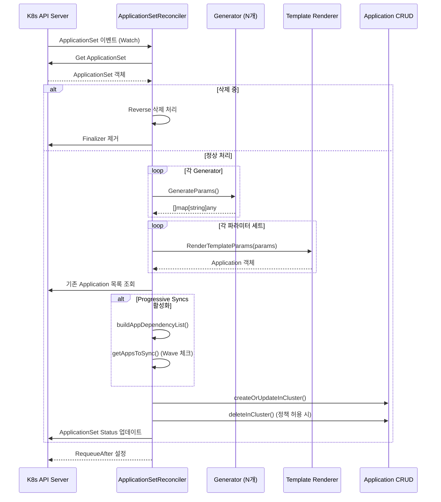
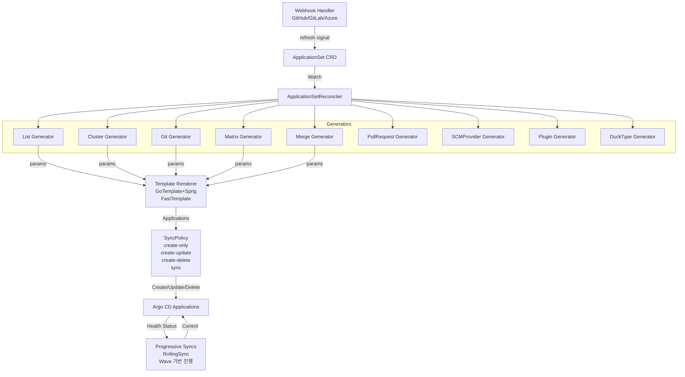

# 11. ApplicationSet Deep-Dive

## 목차

1. [ApplicationSet 개요](#1-applicationset-개요)
2. [ApplicationSetReconciler 구조체](#2-applicationsetreconciler-구조체)
3. [Generator 인터페이스](#3-generator-인터페이스)
4. [9가지 Generator 구현체](#4-9가지-generator-구현체)
5. [Template 렌더링](#5-template-렌더링)
6. [Progressive Syncs (Strategy)](#6-progressive-syncs-strategy)
7. [SyncPolicy](#7-syncpolicy)
8. [Reconciliation 흐름](#8-reconciliation-흐름)
9. [Webhook 지원](#9-webhook-지원)
10. [왜(Why) 이런 설계인가](#10-왜why-이런-설계인가)

---

## 1. ApplicationSet 개요

ApplicationSet은 Argo CD의 확장 기능으로, **단일 ApplicationSet 리소스로 여러 Argo CD Application을 자동 생성·관리**하는 컨트롤러다. 멀티클러스터/멀티환경 배포 자동화가 핵심 목적이다.

### 핵심 문제와 해결

```
[기존 방식의 한계]
팀이 100개 클러스터에 동일한 앱을 배포하려면
→ 100개 Application YAML을 수작업 생성·관리
→ 클러스터 추가/삭제 시 수동 반영 필요
→ 중복 코드, 휴먼 에러 발생

[ApplicationSet의 해결]
하나의 ApplicationSet YAML + Generator
→ 클러스터/환경에 맞는 Application 자동 생성
→ 새 클러스터 등록 시 Application 자동 추가
→ 클러스터 삭제 시 Application 자동 제거 (policy 설정 시)
```

### 전체 아키텍처

```
+---------------------------------------------------+
|  Kubernetes API Server                             |
|                                                    |
|  ApplicationSet CRD                               |
|  ┌────────────────────────────────────────────┐  |
|  │ spec:                                       │  |
|  │   generators:                               │  |
|  │     - cluster: {}      ←── Generator        │  |
|  │   template:            ←── Application 템플릿│  |
|  │   syncPolicy: ...      ←── 동기화 정책      │  |
|  │   strategy: ...        ←── Progressive Sync │  |
|  └────────────────────────────────────────────┘  |
+---------------------------------------------------+
              ↕ Watch / Reconcile
+---------------------------------------------------+
|  ApplicationSet Controller                         |
|                                                    |
|  ApplicationSetReconciler                         |
|  ┌──────────┐  ┌──────────┐  ┌────────────────┐  |
|  │Generators│  │ Renderer │  │ SyncPolicy     │  |
|  │  (9종)   │  │(Go/Fast) │  │ (create/sync)  │  |
|  └──────────┘  └──────────┘  └────────────────┘  |
|       ↓             ↓                ↓            |
|  GenerateParams → RenderTemplate → CRUD Apps      |
+---------------------------------------------------+
              ↓ Create/Update/Delete
+---------------------------------------------------+
|  Generated Argo CD Applications                    |
|  app-cluster-us-east-1                            |
|  app-cluster-eu-west-1                            |
|  app-cluster-ap-southeast-1                       |
+---------------------------------------------------+
```

### controller-runtime 기반 설계

ApplicationSet 컨트롤러는 `sigs.k8s.io/controller-runtime`을 사용한다. 이는 Kubernetes Operator 개발의 표준 패턴으로, Reconcile 루프 기반 제어를 제공한다.

```go
// applicationset/controllers/applicationset_controller.go
import (
    ctrl "sigs.k8s.io/controller-runtime"
    "sigs.k8s.io/controller-runtime/pkg/client"
    "sigs.k8s.io/controller-runtime/pkg/controller"
    "sigs.k8s.io/controller-runtime/pkg/controller/controllerutil"
)
```

---

## 2. ApplicationSetReconciler 구조체

### 구조체 정의

`applicationset/controllers/applicationset_controller.go`에 정의된 핵심 컨트롤러 구조체다.

```go
// ApplicationSetReconciler reconciles a ApplicationSet object
type ApplicationSetReconciler struct {
    client.Client                        // controller-runtime 클라이언트 (K8s API 접근)
    Scheme               *runtime.Scheme // 타입 스키마 등록
    Recorder             record.EventRecorder // K8s 이벤트 기록
    Generators           map[string]generators.Generator // 9종 Generator 맵
    ArgoDB               db.ArgoDB            // ArgoCD DB (클러스터/레포 정보)
    KubeClientset        kubernetes.Interface  // 직접 K8s API 접근
    Policy               argov1alpha1.ApplicationsSyncPolicy // 기본 SyncPolicy
    EnablePolicyOverride bool                 // ApplicationSet별 정책 override 허용
    utils.Renderer                            // Go/Fast 템플릿 렌더러 (임베드)
    ArgoCDNamespace            string         // ArgoCD 설치 네임스페이스
    ApplicationSetNamespaces   []string       // ApplicationSet 허용 네임스페이스
    EnableProgressiveSyncs     bool           // Progressive Sync 기능 활성화
    SCMRootCAPath              string         // SCM TLS CA 인증서 경로
    GlobalPreservedAnnotations []string       // 전역 보존 어노테이션
    GlobalPreservedLabels      []string       // 전역 보존 레이블
    Metrics                    *metrics.ApplicationsetMetrics // Prometheus 메트릭
    MaxResourcesStatusCount    int            // 상태 리소스 최대 개수
    ClusterInformer            *settings.ClusterInformer // 클러스터 캐시
}
```

### 각 필드의 역할

| 필드 | 타입 | 역할 |
|------|------|------|
| `client.Client` | `sigs.k8s.io/controller-runtime/pkg/client.Client` | K8s 리소스 CRUD (캐시 기반) |
| `Generators` | `map[string]generators.Generator` | List/Cluster/Git 등 9종 Generator 맵 |
| `Renderer` | `utils.Renderer` | Go template + sprig / fasttemplate 렌더링 |
| `Policy` | `ApplicationsSyncPolicy` | 컨트롤러 기본 정책 (create-only~sync) |
| `EnablePolicyOverride` | `bool` | ApplicationSet 개별 정책 허용 여부 |
| `EnableProgressiveSyncs` | `bool` | RollingSync 전략 활성화 여부 |
| `Metrics` | `*metrics.ApplicationsetMetrics` | `argocd_appset_reconcile` 히스토그램 기록 |

### Generators 맵 초기화

컨트롤러 시작 시 모든 Generator를 맵에 등록한다. 키는 Generator 이름 문자열이다.

```go
// cmd/argocd-applicationset-controller/main.go 에서 초기화
generators := map[string]generators.Generator{
    "List":                    generators.NewListGenerator(),
    "Clusters":                generators.NewClusterGenerator(client, namespace),
    "Git":                     generators.NewGitGenerator(repos, namespace),
    "Matrix":                  generators.NewMatrixGenerator(supportedGenerators),
    "Merge":                   generators.NewMergeGenerator(supportedGenerators),
    "SCMProvider":             generators.NewSCMProviderGenerator(client, scmConfig),
    "PullRequest":             generators.NewPullRequestGenerator(client, scmConfig),
    "Plugin":                  generators.NewPluginGenerator(client, namespace),
    "ClusterDecisionResource": generators.NewDuckTypeGenerator(ctx, dynClient, clientset, namespace, clusterInformer),
}
```

### 메트릭

```go
// applicationset/metrics/metrics.go
type ApplicationsetMetrics struct {
    reconcileHistogram *prometheus.HistogramVec
}

// Prometheus 메트릭:
// argocd_appset_reconcile       - reconcile 소요 시간 히스토그램
// argocd_appset_info            - ApplicationSet 정보 (namespace, name, status)
// argocd_appset_owned_applications - ApplicationSet이 소유한 Application 수
```

---

## 3. Generator 인터페이스

### 인터페이스 정의

`applicationset/generators/interface.go`에 정의된 모든 Generator의 공통 계약이다.

```go
// Generator defines the interface implemented by all ApplicationSet generators.
type Generator interface {
    // GenerateParams interprets the ApplicationSet and generates all relevant parameters for the application template.
    // The expected / desired list of parameters is returned, it then will be render and reconciled
    // against the current state of the Applications in the cluster.
    GenerateParams(appSetGenerator *argoprojiov1alpha1.ApplicationSetGenerator,
                   applicationSetInfo *argoprojiov1alpha1.ApplicationSet,
                   client client.Client) ([]map[string]any, error)

    // GetRequeueAfter is the generator can controller the next reconciled loop
    // In case there is more then one generator the time will be the minimum of the times.
    // In case NoRequeueAfter is empty, it will be ignored
    GetRequeueAfter(appSetGenerator *argoprojiov1alpha1.ApplicationSetGenerator) time.Duration

    // GetTemplate returns the inline template from the spec if there is any, or an empty object otherwise
    GetTemplate(appSetGenerator *argoprojiov1alpha1.ApplicationSetGenerator) *argoprojiov1alpha1.ApplicationSetTemplate
}

var (
    ErrEmptyAppSetGenerator = errors.New("ApplicationSet is empty")
    NoRequeueAfter          time.Duration // 0값: requeue 안 함
)

const (
    DefaultRequeueAfter = 3 * time.Minute
)
```

### 인터페이스 메서드 역할

```
Generator.GenerateParams()
    ↓
  []map[string]any  ←── 파라미터 세트 목록
  예: [
    {"cluster": "us-east-1", "env": "prod"},
    {"cluster": "eu-west-1", "env": "prod"},
  ]
    ↓
Template 렌더링 → Application 생성
```

| 메서드 | 반환값 | 용도 |
|--------|--------|------|
| `GenerateParams()` | `[]map[string]any` | 파라미터 세트 생성 (각 세트 = Application 1개) |
| `GetRequeueAfter()` | `time.Duration` | 다음 reconcile까지 대기 시간 (0 = 재큐 없음) |
| `GetTemplate()` | `*ApplicationSetTemplate` | Generator 레벨 인라인 템플릿 |

### Requeue 정책

```
여러 Generator가 있을 때 최솟값을 사용:

Generator A: GetRequeueAfter() → 5분
Generator B: GetRequeueAfter() → 30분
Generator C: GetRequeueAfter() → 0 (NoRequeueAfter, 이벤트 기반)

→ 최솟값 = 5분으로 RequeueAfter 설정

환경변수 ARGOCD_APPLICATIONSET_CONTROLLER_REQUEUE_AFTER 로
DefaultRequeueAfter(3분) 조정 가능. 최솟값 1초, 최댓값 8760시간.
```

---

## 4. 9가지 Generator 구현체

### Generator 비교표

| Generator | 파일 | RequeueAfter | 동작 방식 |
|-----------|------|-------------|-----------|
| List | `generators/list.go` | NoRequeueAfter | 정적 요소 목록에서 파라미터 생성 |
| Cluster | `generators/cluster.go` | NoRequeueAfter | 등록된 클러스터 Secret에서 파라미터 생성 |
| Git | `generators/git.go` | 3분(기본) | Git 디렉토리/파일에서 파라미터 생성 |
| Matrix | `generators/matrix.go` | 자식 최솟값 | 두 Generator의 카르테시안 곱 |
| Merge | `generators/merge.go` | 자식 최솟값 | 여러 Generator의 파라미터 병합 |
| PullRequest | `generators/pull_request.go` | 30분(기본) | PR 목록에서 파라미터 생성 |
| SCMProvider | `generators/scm_provider.go` | 30분(기본) | SCM 조직 리포지토리 목록 |
| Plugin | `generators/plugin.go` | 30분(기본) | 외부 HTTP 서비스 호출 |
| DuckType | `generators/duck_type.go` | 3분(기본) | 임의 K8s 리소스에서 파라미터 추출 |

---

### 4-1. List Generator

**파일**: `applicationset/generators/list.go`

정적으로 정의된 요소 목록에서 파라미터를 생성한다. 가장 단순한 Generator로, 외부 시스템 의존성이 없다.

```go
type ListGenerator struct{}

func (g *ListGenerator) GenerateParams(appSetGenerator *argoprojiov1alpha1.ApplicationSetGenerator,
    appSet *argoprojiov1alpha1.ApplicationSet, _ client.Client) ([]map[string]any, error) {

    res := make([]map[string]any, len(appSetGenerator.List.Elements))

    for i, tmpItem := range appSetGenerator.List.Elements {
        params := map[string]any{}
        var element map[string]any
        err := json.Unmarshal(tmpItem.Raw, &element) // JSON -> map
        // GoTemplate 모드: 구조 그대로 사용
        // FastTemplate 모드: 키=값(string) 형태로 평탄화
        if appSet.Spec.GoTemplate {
            res[i] = element
        } else {
            for key, value := range element {
                if key == "values" { // values.key 형태로 분리
                    ...
                }
            }
        }
    }

    // ElementsYaml: YAML 문자열로도 요소 정의 가능
    if appSetGenerator.List.ElementsYaml != "" {
        var yamlElements []map[string]any
        yaml.Unmarshal([]byte(appSetGenerator.List.ElementsYaml), &yamlElements)
        res = append(res, yamlElements...)
    }

    return res, nil
}
```

**사용 예시**:
```yaml
spec:
  generators:
    - list:
        elements:
          - cluster: us-east-1
            url: https://k8s-us-east-1.example.com
          - cluster: eu-west-1
            url: https://k8s-eu-west-1.example.com
  template:
    spec:
      destination:
        server: '{{url}}'
        namespace: myapp
```

**특징**:
- `GetRequeueAfter()` → `NoRequeueAfter` (0): 정적 데이터이므로 주기적 재큐 불필요
- `ElementsYaml` 필드로 동적 렌더링된 YAML도 지원

---

### 4-2. Cluster Generator

**파일**: `applicationset/generators/cluster.go`

Argo CD에 등록된 클러스터당 하나의 Application을 생성한다. 클러스터는 K8s Secret으로 저장되며 label selector로 필터링한다.

```go
// ClusterGenerator generates Applications for some or all clusters registered with ArgoCD.
type ClusterGenerator struct {
    client.Client
    namespace string // Argo CD 네임스페이스
}

func (g *ClusterGenerator) GenerateParams(...) ([]map[string]any, error) {
    // label이 있으면 로컬 클러스터 제외
    ignoreLocalClusters := len(selector.MatchExpressions) > 0 || len(selector.MatchLabels) > 0

    // argocd.argoproj.io/secret-type=cluster 레이블이 있는 Secret 조회
    clusterSecrets, err := g.getSecretsByClusterName(logCtx, appSetGenerator)

    for _, cluster := range clusterSecrets {
        params := g.getClusterParameters(cluster, appSet)
        // 추가 values 병합
        appendTemplatedValues(appSetGenerator.Clusters.Values, params, ...)
        paramHolder.append(params)
    }

    // 로컬 클러스터 처리 (Secret 없는 in-cluster)
    if !ignoreLocalClusters && !utils.SecretsContainInClusterCredentials(secretsList) {
        params["name"] = argoappsetv1alpha1.KubernetesInClusterName  // "in-cluster"
        params["server"] = argoappsetv1alpha1.KubernetesInternalAPIServerAddr
        paramHolder.append(params)
    }

    return paramHolder.consolidate(), nil
}
```

**클러스터 파라미터**:
```go
func (g *ClusterGenerator) getClusterParameters(cluster corev1.Secret, appSet *ApplicationSet) map[string]any {
    params["name"]           = string(cluster.Data["name"])
    params["nameNormalized"] = utils.SanitizeName(string(cluster.Data["name"]))
    params["server"]         = string(cluster.Data["server"])
    params["project"]        = string(cluster.Data["project"])

    // GoTemplate 모드: 중첩 구조 유지
    // FastTemplate 모드: metadata.labels.key, metadata.annotations.key 형태
    if appSet.Spec.GoTemplate {
        meta["annotations"] = cluster.Annotations
        meta["labels"]      = cluster.Labels
        params["metadata"]  = meta
    } else {
        params["metadata.annotations."+key] = value
        params["metadata.labels."+key]      = value
    }
}
```

**Secret Label Selector 기반 필터링**:
```go
// common.LabelKeySecretType = "argocd.argoproj.io/secret-type"
// common.LabelValueSecretTypeCluster = "cluster"
selector := metav1.AddLabelToSelector(
    &appSetGenerator.Clusters.Selector,
    common.LabelKeySecretType,
    common.LabelValueSecretTypeCluster,
)
```

**FlatList 모드**: `flatList: true` 설정 시 모든 클러스터를 하나의 `clusters` 배열로 묶어 단일 파라미터 세트로 반환한다.

**GetRequeueAfter()**: `NoRequeueAfter` (0)을 반환한다. 클러스터 Secret 변경은 `clusterSecretEventHandler`가 감지해 즉시 재큐하므로 주기적 폴링이 불필요하다.

---

### 4-3. Git Generator

**파일**: `applicationset/generators/git.go`

Git 리포지토리의 구조나 파일 내용에서 파라미터를 생성한다. **디렉토리 기반**과 **파일 기반** 두 가지 모드를 지원한다.

```go
type GitGenerator struct {
    repos     services.Repos // Git repo 서비스 (repo-server 통신)
    namespace string
}

func (g *GitGenerator) GenerateParams(...) ([]map[string]any, error) {
    noRevisionCache := appSet.RefreshRequired() // 강제 새로고침 여부

    // GPG 서명 검증 여부 결정
    verifyCommit := len(appProject.Spec.SignatureKeys) > 0 && gpg.IsGPGEnabled()

    switch {
    case len(appSetGenerator.Git.Directories) != 0: // 디렉토리 기반
        res, err = g.generateParamsForGitDirectories(...)
    case len(appSetGenerator.Git.Files) != 0:       // 파일 기반
        res, err = g.generateParamsForGitFiles(...)
    }
}
```

#### 디렉토리 기반 Git Generator

```go
func (g *GitGenerator) generateParamsForGitDirectories(...) ([]map[string]any, error) {
    // repo-server에서 디렉토리 목록 조회
    allPaths, err := g.repos.GetDirectories(ctx, repoURL, revision, project, ...)

    // include/exclude 패턴으로 필터링
    requestedApps := g.filterApps(appSetGenerator.Git.Directories, allPaths)

    // 각 디렉토리 경로로 파라미터 생성
    res, err := g.generateParamsFromApps(requestedApps, ...)
}

// 생성되는 파라미터:
// path             = "apps/myapp"
// path.basename    = "myapp"
// path.basenameNormalized = "myapp" (DNS 안전)
// path.segments[0] = "apps"
// path.segments[1] = "myapp"
// pathParamPrefix 설정 시: "{prefix}.path" 형태
```

**사용 예시** (디렉토리 기반):
```yaml
generators:
  - git:
      repoURL: https://github.com/org/repo
      revision: HEAD
      directories:
        - path: apps/*         # include 패턴
        - path: apps/legacy    # exclude
          exclude: true
```

#### 파일 기반 Git Generator

```go
func (g *GitGenerator) generateParamsForGitFiles(...) ([]map[string]any, error) {
    // include/exclude 패턴 분리
    for _, req := range appSetGenerator.Git.Files {
        if req.Exclude {
            excludePatterns = append(excludePatterns, req.Path)
        } else {
            includePatterns = append(includePatterns, req.Path)
        }
    }

    // include 파일 조회 후 exclude 파일 제거
    for _, includePattern := range includePatterns {
        retrievedFiles, _ := g.repos.GetFiles(ctx, repoURL, revision, ...)
        maps.Copy(fileContentMap, retrievedFiles)
    }
    for _, excludePattern := range excludePatterns {
        matchingFiles, _ := g.repos.GetFiles(ctx, repoURL, revision, ...)
        for absPath := range matchingFiles {
            delete(fileContentMap, absPath)
        }
    }

    // 파일을 정렬하여 결정적 순서 보장
    sort.Strings(filePaths)

    for _, filePath := range filePaths {
        paramsFromFileArray, _ := g.generateParamsFromGitFile(filePath, fileContentMap[filePath], ...)
        allParams = append(allParams, paramsFromFileArray...)
    }
}
```

**파일 내용 파싱**:
```go
func (g *GitGenerator) generateParamsFromGitFile(filePath string, fileContent []byte, ...) {
    // 단일 객체로 파싱 시도
    singleObj := map[string]any{}
    err := yaml.Unmarshal(fileContent, &singleObj)
    if err != nil {
        // 실패 시 배열로 시도 → 파일 하나에서 여러 파라미터 세트 생성 가능
        yaml.Unmarshal(fileContent, &objectsFound)
    }

    // FastTemplate 모드: flatten.Flatten으로 depth.key 형태로 평탄화
    // GoTemplate 모드: 구조 그대로 유지
}
```

**RequeueAfter**: `RequeueAfterSeconds` 설정 없으면 `DefaultRequeueAfter`(3분)을 반환. Git 폴링 주기 제어에 사용된다.

---

### 4-4. Matrix Generator

**파일**: `applicationset/generators/matrix.go`

두 Generator의 **카르테시안 곱(Cartesian Product)**을 생성한다. 정확히 2개의 자식 Generator가 필요하다.

```go
var (
    ErrMoreThanTwoGenerators      = errors.New("found more than two generators, Matrix support only two")
    ErrLessThanTwoGenerators      = errors.New("found less than two generators, Matrix support only two")
    ErrMoreThenOneInnerGenerators = errors.New("found more than one generator in matrix.Generators")
)

type MatrixGenerator struct {
    supportedGenerators map[string]Generator
}

func (m *MatrixGenerator) GenerateParams(...) ([]map[string]any, error) {
    if len(appSetGenerator.Matrix.Generators) != 2 {
        return nil, ErrLessThanTwoGenerators // or ErrMoreThanTwoGenerators
    }

    // Generator 0의 파라미터 세트 생성
    g0, err := m.getParams(appSetGenerator.Matrix.Generators[0], appSet, nil, client)

    for _, a := range g0 {
        // a를 컨텍스트로 Generator 1 실행 (a의 파라미터를 G1에 주입 가능)
        g1, err := m.getParams(appSetGenerator.Matrix.Generators[1], appSet, a, client)

        for _, b := range g1 {
            if appSet.Spec.GoTemplate {
                // mergo.Merge: 두 파라미터 맵 병합 (a가 우선)
                tmp := map[string]any{}
                mergo.Merge(&tmp, b, mergo.WithOverride)
                mergo.Merge(&tmp, a, mergo.WithOverride)
                res = append(res, tmp)
            } else {
                // CombineStringMaps: string 맵 결합
                val, _ := utils.CombineStringMaps(a, b)
                res = append(res, val)
            }
        }
    }
}
```

**카르테시안 곱 시각화**:
```
Generator 0 (Cluster): [us-east-1, eu-west-1]
Generator 1 (List):    [dev, staging, prod]

Matrix 결과:
  {cluster: us-east-1, env: dev}
  {cluster: us-east-1, env: staging}
  {cluster: us-east-1, env: prod}
  {cluster: eu-west-1, env: dev}
  {cluster: eu-west-1, env: staging}
  {cluster: eu-west-1, env: prod}
                    → 2 × 3 = 6개 Application 생성
```

**중첩 Matrix**: CRD의 재귀 타입 미지원 제한으로 중첩 시 `NestedMatrixGenerator` 타입을 사용한다.

```go
// 중첩을 위한 별도 타입
type NestedMatrixGenerator struct {
    Generators ApplicationSetTerminalGenerators // 말단(Terminal) Generator만 허용
}

// JSON으로 직렬화된 채 저장 후 런타임에 역직렬화
matrix, err := argoprojiov1alpha1.ToNestedMatrixGenerator(r.Matrix)
```

**GetRequeueAfter()**: 모든 자식 Generator의 RequeueAfter 중 최솟값을 반환한다.

---

### 4-5. Merge Generator

**파일**: `applicationset/generators/merge.go`

여러 Generator의 파라미터를 **mergeKey 기준으로 병합**한다. 기본 Generator가 제공하는 파라미터를 후속 Generator가 오버라이드하는 방식이다.

```go
var (
    ErrLessThanTwoGeneratorsInMerge = errors.New("found less than two generators, Merge requires two or more")
    ErrNoMergeKeys                  = errors.New("no merge keys were specified, Merge requires at least one")
    ErrNonUniqueParamSets           = errors.New("the parameters from a generator were not unique by the given mergeKeys, ...")
)

type MergeGenerator struct {
    supportedGenerators map[string]Generator
}

func (m *MergeGenerator) GenerateParams(...) ([]map[string]any, error) {
    // 모든 자식 Generator 파라미터 생성
    paramSetsFromGenerators, _ := m.getParamSetsForAllGenerators(
        appSetGenerator.Merge.Generators, appSet, client)

    // 첫 번째 Generator를 기준으로 mergeKey 인덱스 구성
    baseParamSetsByMergeKey, _ := getParamSetsByMergeKey(
        appSetGenerator.Merge.MergeKeys, paramSetsFromGenerators[0])

    // 나머지 Generator 파라미터로 기본값 오버라이드
    for _, paramSets := range paramSetsFromGenerators[1:] {
        paramSetsByMergeKey, _ := getParamSetsByMergeKey(
            appSetGenerator.Merge.MergeKeys, paramSets)

        for mergeKeyValue, baseParamSet := range baseParamSetsByMergeKey {
            if overrideParamSet, exists := paramSetsByMergeKey[mergeKeyValue]; exists {
                if appSet.Spec.GoTemplate {
                    mergo.Merge(&baseParamSet, overrideParamSet, mergo.WithOverride)
                } else {
                    maps.Copy(baseParamSet, overrideParamSet) // 단순 오버라이드
                }
                baseParamSetsByMergeKey[mergeKeyValue] = baseParamSet
            }
        }
    }
}
```

**mergeKey 동작 방식**:
```
mergeKeys: ["cluster"]

Generator 0 (기준):
  {cluster: us-east-1, replicas: 3, memory: 4Gi}
  {cluster: eu-west-1, replicas: 3, memory: 4Gi}

Generator 1 (오버라이드, eu-west-1만):
  {cluster: eu-west-1, replicas: 5, memory: 8Gi}

병합 결과:
  {cluster: us-east-1, replicas: 3, memory: 4Gi}  ← 변경 없음
  {cluster: eu-west-1, replicas: 5, memory: 8Gi}  ← G1로 오버라이드
```

**mergeKey 인덱스 구성**:
```go
// mergeKey로 유니크 키 구성 (JSON 직렬화)
func getParamSetsByMergeKey(mergeKeys []string, paramSets []map[string]any) (map[string]map[string]any, error) {
    paramSetsByMergeKey := make(map[string]map[string]any)
    for _, paramSet := range paramSets {
        paramSetKey := make(map[string]any)
        for mergeKey := range deDuplicatedMergeKeys {
            paramSetKey[mergeKey] = paramSet[mergeKey]
        }
        paramSetKeyJSON, _ := json.Marshal(paramSetKey)
        // 중복 mergeKey → ErrNonUniqueParamSets 에러
        paramSetsByMergeKey[string(paramSetKeyJSON)] = paramSet
    }
}
```

---

### 4-6. PullRequest Generator

**파일**: `applicationset/generators/pull_request.go`

GitHub/GitLab/Bitbucket 등 SCM의 **열린 PR(Pull Request)마다 Application을 생성**한다. PR 환경을 자동으로 배포하는 Preview Environment 구현에 사용된다.

```go
const DefaultPullRequestRequeueAfter = 30 * time.Minute

type PullRequestGenerator struct {
    client                    client.Client
    selectServiceProviderFunc func(...) (pullrequest.PullRequestService, error)
    SCMConfig
}

func (g *PullRequestGenerator) GenerateParams(...) ([]map[string]any, error) {
    // SCM 제공자 선택 (GitHub/GitLab/Gitea/Bitbucket/AzureDevOps)
    svc, err := g.selectServiceProviderFunc(ctx, appSetGenerator.PullRequest, applicationSetInfo)

    // 필터 조건에 맞는 PR 목록 조회
    pulls, err := pullrequest.ListPullRequests(ctx, svc, appSetGenerator.PullRequest.Filters)

    slug.MaxLength = 50   // DNS 레이블 기준 최대 50자
    slug.CustomSub = map[string]string{"_": "-"} // 언더스코어 → 대시

    for _, pull := range pulls {
        paramMap := map[string]any{
            "number":             strconv.FormatInt(pull.Number, 10),
            "title":              pull.Title,
            "branch":             pull.Branch,
            "branch_slug":        slug.Make(pull.Branch),   // DNS 안전 브랜치명
            "target_branch":      pull.TargetBranch,
            "target_branch_slug": slug.Make(pull.TargetBranch),
            "head_sha":           pull.HeadSHA,
            "head_short_sha":     pull.HeadSHA[:8],         // 8자 단축 SHA
            "head_short_sha_7":   pull.HeadSHA[:7],         // 7자 단축 SHA
            "author":             pull.Author,
        }

        // GoTemplate 모드에서만 labels 지원
        if applicationSetInfo.Spec.GoTemplate {
            paramMap["labels"] = pull.Labels
        }
    }
}
```

**지원 SCM 제공자**:

| 제공자 | 인증 방식 |
|--------|-----------|
| GitHub | Token / GitHub App |
| GitLab | Token |
| Gitea | Token |
| Bitbucket Server | Bearer Token / Basic Auth |
| Bitbucket Cloud | Bearer Token / Basic Auth |
| Azure DevOps | Token |

**Preview Environment 패턴**:
```yaml
generators:
  - pullRequest:
      github:
        owner: my-org
        repo: my-app
        tokenRef:
          secretName: github-token
          key: token
        labels:
          - preview        # "preview" 레이블 붙은 PR만
      requeueAfterSeconds: 1800
template:
  metadata:
    name: 'my-app-pr-{{number}}'
  spec:
    source:
      targetRevision: '{{head_sha}}'
    destination:
      namespace: 'pr-{{number}}'
```

---

### 4-7. SCMProvider Generator

**파일**: `applicationset/generators/scm_provider.go`

SCM 조직(GitHub org, GitLab group 등)의 **모든 리포지토리**에 대해 파라미터를 생성한다. 모노레포나 조직 전체 배포 자동화에 사용된다.

```go
const DefaultSCMProviderRequeueAfter = 30 * time.Minute

type SCMProviderGenerator struct {
    client client.Client
    SCMConfig
}

type SCMConfig struct {
    scmRootCAPath          string
    allowedSCMProviders    []string   // 허용된 SCM 제공자 목록 (보안)
    enableSCMProviders     bool       // 전역 SCM 활성화 여부
    enableGitHubAPIMetrics bool
    GitHubApps             github_app_auth.Credentials
    tokenRefStrictMode     bool
}

var ErrSCMProvidersDisabled = errors.New("scm providers are disabled")
```

**보안 제어**: SCM Provider가 비활성화(`enableSCMProviders: false`)되면 ErrSCMProvidersDisabled를 반환하여 외부 SCM 접근을 차단한다. 허용된 SCM 제공자 목록(`allowedSCMProviders`)으로 접근 범위를 제한한다.

---

### 4-8. Plugin Generator

**파일**: `applicationset/generators/plugin.go`

**외부 HTTP 서비스를 호출**하여 파라미터를 생성한다. 내장 Generator로 구현하기 어려운 복잡한 로직을 외부 서비스에 위임할 수 있다.

```go
const DefaultPluginRequeueAfter = 30 * time.Minute

type PluginGenerator struct {
    client    client.Client
    namespace string
}

func (g *PluginGenerator) GenerateParams(...) ([]map[string]any, error) {
    // ConfigMap에서 플러그인 설정 조회
    pluginClient, err := g.getPluginFromGenerator(ctx, applicationSetInfo.Name, providerConfig)

    // 외부 HTTP 서비스 호출 (파라미터 목록 요청)
    list, err := pluginClient.List(ctx, providerConfig.Input.Parameters)

    // 응답을 파라미터 맵으로 변환
    res, err := g.generateParams(appSetGenerator, applicationSetInfo, list.Output.Parameters, ...)
}

func (g *PluginGenerator) getPluginFromGenerator(ctx context.Context, appSetName string,
    generatorConfig *argoprojiov1alpha1.PluginGenerator) (*plugin.Service, error) {

    // ConfigMap에서 baseUrl, token 읽기
    cm, _ := g.getConfigMap(ctx, generatorConfig.ConfigMapRef.Name)
    token, _ := g.getToken(ctx, cm["token"])

    // requestTimeout 옵션
    requestTimeout, _ := strconv.Atoi(cm["requestTimeout"])

    pluginClient, _ := plugin.NewPluginService(appSetName, cm["baseUrl"], token, requestTimeout)
    return pluginClient, nil
}
```

**플러그인 파라미터 처리**:
```go
func (g *PluginGenerator) generateParams(...) ([]map[string]any, error) {
    for _, objectFound := range objectsFound {
        if useGoTemplate {
            maps.Copy(params, objectFound) // 구조 그대로
        } else {
            flat, _ := flatten.Flatten(objectFound, "", flatten.DotStyle) // 평탄화
        }

        // generator.input.parameters 를 파라미터에 포함
        params["generator"] = map[string]any{
            "input": map[string]argoprojiov1alpha1.PluginParameters{
                "parameters": pluginParams,
            },
        }
    }
}
```

**설정 예시**:
```yaml
generators:
  - plugin:
      configMapRef:
        name: my-plugin-config   # baseUrl, token 포함 ConfigMap
      input:
        parameters:
          environment: production
          region: us-east-1
      requeueAfterSeconds: 3600
```

---

### 4-9. DuckType Generator (ClusterDecisionResource)

**파일**: `applicationset/generators/duck_type.go`

**임의의 Kubernetes 리소스**에서 클러스터 배포 결정 정보를 추출한다. `ClusterDecisionResource`라는 이름으로 CRD에 정의되며, Open Cluster Management(OCM)의 `PlacementDecision` 같은 리소스와 연동할 때 사용한다.

```go
// DuckTypeGenerator generates Applications for some or all clusters registered with ArgoCD.
type DuckTypeGenerator struct {
    ctx             context.Context
    dynClient       dynamic.Interface     // 임의 K8s 리소스 접근
    clientset       kubernetes.Interface
    namespace       string
    clusterInformer *settings.ClusterInformer
}

func (g *DuckTypeGenerator) GenerateParams(...) ([]map[string]any, error) {
    // Argo CD 등록 클러스터 목록 조회
    clustersFromArgoCD, _ := utils.ListClusters(g.clusterInformer)

    // ConfigMap에서 GVK(Group/Version/Kind) 정보 읽기
    cm, _ := g.clientset.CoreV1().ConfigMaps(g.namespace).Get(g.ctx,
        appSetGenerator.ClusterDecisionResource.ConfigMapRef, ...)

    group   := cm.Data["apiVersion"][0:versionIdx]   // "cluster.open-cluster-management.io"
    version := cm.Data["apiVersion"][versionIdx+1:]   // "v1alpha1"
    kind    := cm.Data["kind"]                         // "PlacementDecision"

    // Dynamic client로 임의 리소스 조회
    duckGVR := schema.GroupVersionResource{Group: group, Version: version, Resource: kind}
    duckResources, _ := g.dynClient.Resource(duckGVR).Namespace(g.namespace).List(g.ctx, listOptions)

    // status.clusters 에서 클러스터 결정 목록 추출
    statusListKey := cm.Data["statusListKey"]   // "clusters"
    matchKey      := cm.Data["matchKey"]        // "clusterName"

    clusterDecisions := buildClusterDecisions(duckResources, statusListKey)

    for _, clusterDecision := range clusterDecisions {
        // matchKey로 Argo CD 등록 클러스터와 매칭
        cluster := findCluster(clustersFromArgoCD, clusterDecision, matchKey, statusListKey)
        params := map[string]any{
            "name":   cluster.Name,
            "server": cluster.Server,
        }
    }
}
```

**사용 사례**: OCM의 `PlacementDecision` 리소스가 어떤 클러스터에 배포할지 결정하면, DuckType Generator가 이를 읽어 Argo CD Application을 생성한다.

```
PlacementDecision (OCM)
  status:
    decisions:
      - clusterName: cluster-us-east-1
      - clusterName: cluster-eu-west-1
          ↓
DuckType Generator 읽기
          ↓
Argo CD Application 생성 (cluster-us-east-1, cluster-eu-west-1)
```

---

## 5. Template 렌더링

### 렌더러 인터페이스

```go
// applicationset/utils/utils.go
type Renderer interface {
    RenderTemplateParams(
        tmpl *argoappsv1.Application,
        syncPolicy *argoappsv1.ApplicationSetSyncPolicy,
        params map[string]any,
        useGoTemplate bool,
        goTemplateOptions []string,
    ) (*argoappsv1.Application, error)

    Replace(
        tmpl string,
        replaceMap map[string]any,
        useGoTemplate bool,
        goTemplateOptions []string,
    ) (string, error)
}
```

### Go Template (GoTemplate: true)

`text/template` 패키지 + [Sprig](http://masterminds.github.io/sprig/) 함수 라이브러리를 사용한다.

```go
// sprig 함수 맵 초기화 (보안상 일부 함수 제거)
var sprigFuncMap = sprig.GenericFuncMap()

func init() {
    delete(sprigFuncMap, "env")         // 환경변수 접근 차단
    delete(sprigFuncMap, "expandenv")   // 환경변수 확장 차단
    delete(sprigFuncMap, "getHostByName") // DNS 조회 차단

    // Argo CD 커스텀 함수 추가
    sprigFuncMap["normalize"] = SanitizeName   // DNS 안전 이름 변환
    sprigFuncMap["slugify"]   = SlugifyName    // slug 변환
    sprigFuncMap["toYaml"]    = toYAML         // YAML 직렬화
    sprigFuncMap["fromYaml"]  = fromYAML       // YAML 역직렬화

    // 성능 최적화: 한 번 초기화 후 Clone()으로 재사용
    baseTemplate = template.New("base").Funcs(sprigFuncMap)
}
```

**GoTemplate 예시**:
```yaml
spec:
  goTemplate: true
  template:
    metadata:
      name: '{{.cluster}}-{{.env}}'
    spec:
      destination:
        server: '{{.server}}'
        namespace: '{{.path.basename}}'
      source:
        # sprig 함수 사용
        targetRevision: '{{.branch | slugify}}'
        helm:
          parameters:
            - name: replicas
              value: '{{if eq .env "prod"}}3{{else}}1{{end}}'
```

### FastTemplate (GoTemplate: false, 기본값)

[fasttemplate](https://github.com/valyala/fasttemplate) 라이브러리로 `{{key}}` 형태의 단순 치환을 수행한다.

```go
// FastTemplate 예시 (레거시, 향후 deprecated 예정)
// {{cluster}}, {{env}} 형태로 단순 치환
// 복잡한 로직 불가 (조건문, 반복문 없음)
```

**FastTemplate vs GoTemplate 비교**:

| 항목 | FastTemplate | GoTemplate |
|------|-------------|------------|
| 구문 | `{{key}}` | `{{.key}}` |
| 조건문 | 불가 | `{{if}}...{{end}}` |
| 반복문 | 불가 | `{{range}}...{{end}}` |
| 함수 | 없음 | sprig 함수 전체 |
| 중첩 접근 | 평탄화 필요 | `.metadata.labels.env` |
| PR labels | 미지원 | 지원 |
| 성능 | 빠름 | 상대적으로 느림 |

### TemplatePatch

생성된 Application에 JSON/YAML 패치를 적용하는 기능이다.

```go
// applicationset/controllers/template/template.go
if applicationSetInfo.Spec.TemplatePatch != nil {
    patchedApplication, err := renderTemplatePatch(renderer, app, applicationSetInfo, p)
    app = patchedApplication
}

func renderTemplatePatch(r utils.Renderer, app *argov1alpha1.Application,
    applicationSetInfo argov1alpha1.ApplicationSet, params map[string]any) (*argov1alpha1.Application, error) {

    // TemplatePatch도 템플릿 렌더링 적용
    replacedTemplate, err := r.Replace(*applicationSetInfo.Spec.TemplatePatch, params,
        applicationSetInfo.Spec.GoTemplate, applicationSetInfo.Spec.GoTemplateOptions)

    return applyTemplatePatch(app, replacedTemplate)
}
```

**TemplatePatch 예시**:
```yaml
spec:
  templatePatch: |
    spec:
      source:
        helm:
          values: |
            {{- if eq .env "prod"}}
            replicaCount: 3
            resources:
              limits:
                memory: 2Gi
            {{- else}}
            replicaCount: 1
            {{- end}}
```

### GenerateApplications 전체 흐름

```go
// applicationset/controllers/template/template.go
func GenerateApplications(logCtx *log.Entry, applicationSetInfo argov1alpha1.ApplicationSet,
    g map[string]generators.Generator, renderer utils.Renderer, client client.Client) (
    []argov1alpha1.Application, argov1alpha1.ApplicationSetReasonType, error) {

    for _, requestedGenerator := range applicationSetInfo.Spec.Generators {
        // Generator Transform: GenerateParams() + GetTemplate() 실행
        t, err := generators.Transform(requestedGenerator, g, applicationSetInfo.Spec.Template,
            &applicationSetInfo, map[string]any{}, client)

        for _, a := range t {
            tmplApplication := GetTempApplication(a.Template) // Template 구조체 → Application

            for _, p := range a.Params {
                // 각 파라미터 세트로 Template 렌더링
                app, err := renderer.RenderTemplateParams(tmplApplication,
                    applicationSetInfo.Spec.SyncPolicy, p,
                    applicationSetInfo.Spec.GoTemplate, applicationSetInfo.Spec.GoTemplateOptions)

                // TemplatePatch 적용
                if applicationSetInfo.Spec.TemplatePatch != nil {
                    app = patchedApplication
                }

                // 네임스페이스 강제 설정 (보안 경계 유지)
                app.Namespace = applicationSetInfo.Namespace
                res = append(res, *app)
            }
        }
    }
}
```

---

## 6. Progressive Syncs (Strategy)

### 개요

대규모 멀티클러스터 환경에서 모든 Application을 동시에 업데이트하면 장애 파급이 크다. Progressive Syncs는 단계별로 Application을 업데이트하여 안전성을 높인다.

```go
// pkg/apis/application/v1alpha1/applicationset_types.go
type ApplicationSetStrategy struct {
    Type        string                         // "RollingSync" 또는 ""(AllAtOnce)
    RollingSync *ApplicationSetRolloutStrategy
    DeletionOrder string                       // "AllAtOnce" 또는 "Reverse"
}

type ApplicationSetRolloutStrategy struct {
    Steps []ApplicationSetRolloutStep
}

type ApplicationSetRolloutStep struct {
    MatchExpressions []ApplicationMatchExpression // 이 단계에 포함할 Application 선택
    MaxUpdate        *intstr.IntOrString          // 동시 업데이트 최대 수
}

type ApplicationMatchExpression struct {
    Key      string   // Application 레이블 키
    Operator string   // "In" 또는 "NotIn"
    Values   []string // 매칭할 값 목록
}
```

### RollingSync 전략

```go
// 전략이 RollingSync인지 확인
func isRollingSyncStrategy(appset *argov1alpha1.ApplicationSet) bool {
    return appset.Spec.Strategy != nil &&
           appset.Spec.Strategy.Type == "RollingSync" &&
           appset.Spec.Strategy.RollingSync != nil
}

// Steps 슬라이스가 비어 있지 않아야 활성화
func progressiveSyncsRollingSyncStrategyEnabled(appset *argov1alpha1.ApplicationSet) bool {
    return isRollingSyncStrategy(appset) && len(appset.Spec.Strategy.RollingSync.Steps) > 0
}
```

### buildAppDependencyList

각 Application을 RollingSync Step에 매핑한다.

```go
func (r *ApplicationSetReconciler) buildAppDependencyList(logCtx *log.Entry,
    applicationSet argov1alpha1.ApplicationSet,
    applications []argov1alpha1.Application) ([][]string, map[string]int) {

    steps := applicationSet.Spec.Strategy.RollingSync.Steps
    appDependencyList := make([][]string, len(steps)) // step별 App 이름 슬라이스
    appStepMap := map[string]int{}                    // App이름 → step 인덱스

    for _, app := range applications {
        for i, step := range steps {
            selected := true

            for _, matchExpression := range step.MatchExpressions {
                if val, ok := app.Labels[matchExpression.Key]; ok {
                    valueMatched := labelMatchedExpression(logCtx, val, matchExpression)
                    if !valueMatched {
                        selected = false
                        break
                    }
                } else if matchExpression.Operator == "In" {
                    selected = false // "In"인데 레이블 없으면 미선택
                    break
                }
            }

            if selected {
                appDependencyList[i] = append(appDependencyList[i], app.Name)
                appStepMap[app.Name] = i
            }
        }
    }
    return appDependencyList, appStepMap
}
```

### getAppsToSync (Wave 기반 진행)

```go
func (r *ApplicationSetReconciler) getAppsToSync(applicationSet argov1alpha1.ApplicationSet,
    appDependencyList [][]string, currentApplications []argov1alpha1.Application) map[string]bool {

    for stepIndex := range appDependencyList {
        // 현재 Wave의 모든 App에 sync 허용 설정
        for _, appName := range appDependencyList[stepIndex] {
            appSyncMap[appName] = true
        }

        syncNextWave := true
        for _, appName := range appDependencyList[stepIndex] {
            // 아직 클러스터에 없으면 이 Wave 미완료
            if _, ok := currentAppsMap[appName]; !ok {
                syncNextWave = false
                break
            }

            // Application 상태 확인
            appStatus := applicationSet.Status.ApplicationStatus[idx]
            if appStatus.Status != argov1alpha1.ProgressiveSyncHealthy {
                syncNextWave = false // Healthy 아니면 다음 Wave 진행 안 함
                break
            }
        }

        if !syncNextWave {
            break // 현재 Wave가 완료되지 않으면 중단
        }
    }
    return appSyncMap
}
```

### Progressive Syncs 시각화

```
ApplicationSet
  strategy:
    type: RollingSync
    rollingSync:
      steps:
        - matchExpressions:
            - key: env
              operator: In
              values: [canary]
          maxUpdate: 1          ← Wave 1: canary 환경 먼저
        - matchExpressions:
            - key: env
              operator: In
              values: [staging]
          maxUpdate: 25%        ← Wave 2: staging 25%씩
        - matchExpressions:
            - key: env
              operator: In
              values: [prod]
          maxUpdate: 10%        ← Wave 3: prod 10%씩

Wave 1: canary-us-east-1 → Healthy 확인
    ↓
Wave 2: staging-us-east-1, staging-eu-west-1 (25%)
        → 모두 Healthy 확인
    ↓
Wave 3: prod-us-east-1 (10%)
        → Healthy 확인
    ↓
        ... (순차 진행)
```

### Reverse Deletion Order

Progressive Sync가 활성화된 상태에서 ApplicationSet 삭제 시 Step 역순으로 Application을 삭제한다.

```go
func isProgressiveSyncDeletionOrderReversed(appset *argov1alpha1.ApplicationSet) bool {
    return progressiveSyncsRollingSyncStrategyEnabled(appset) &&
           strings.EqualFold(appset.Spec.Strategy.DeletionOrder, ReverseDeletionOrder)
}

// performReverseDeletion: 역순 단계별 삭제
func (r *ApplicationSetReconciler) performReverseDeletion(ctx context.Context,
    logCtx *log.Entry, appset argov1alpha1.ApplicationSet,
    currentApps []argov1alpha1.Application) (time.Duration, error) {

    requeueTime := 10 * time.Second
    stepLength := len(appset.Spec.Strategy.RollingSync.Steps)

    // step을 역순으로 재계산
    for appName, appStep := range appStepMap {
        reverseDeleteAppSteps = append(reverseDeleteAppSteps,
            deleteInOrder{appName, stepLength - appStep - 1})
    }

    // 역순으로 정렬 후 하나씩 삭제 + 10초 후 재큐
    for _, step := range reverseDeleteAppSteps {
        r.Delete(ctx, &retrievedApp)
        return requeueTime, nil // 다음 실행에서 다음 App 삭제
    }
}
```

---

## 7. SyncPolicy

### ApplicationsSyncPolicy (CRD 타입)

```go
// pkg/apis/application/v1alpha1/applicationset_types.go

// "create-only"   → 생성만 허용, 업데이트/삭제 불가
// "create-update" → 생성+업데이트 허용, 삭제 불가
// "create-delete" → 생성+삭제 허용, 업데이트 불가
// "sync"          → 생성+업데이트+삭제 모두 허용 (기본값)
type ApplicationsSyncPolicy string

const (
    ApplicationsSyncPolicyCreateOnly   ApplicationsSyncPolicy = "create-only"
    ApplicationsSyncPolicyCreateUpdate ApplicationsSyncPolicy = "create-update"
    ApplicationsSyncPolicyCreateDelete ApplicationsSyncPolicy = "create-delete"
    ApplicationsSyncPolicySync         ApplicationsSyncPolicy = "sync"
)

func (s ApplicationsSyncPolicy) AllowUpdate() bool {
    return s == ApplicationsSyncPolicyCreateUpdate || s == ApplicationsSyncPolicySync
}

func (s ApplicationsSyncPolicy) AllowDelete() bool {
    return s == ApplicationsSyncPolicySync || s == ApplicationsSyncPolicyCreateDelete
}
// AllowCreate는 모든 정책에서 항상 true
```

### ApplicationSetSyncPolicy (ApplicationSet spec)

```go
type ApplicationSetSyncPolicy struct {
    // PreserveResourcesOnDeletion: true이면 ApplicationSet 삭제 시 생성된 Application 유지
    PreserveResourcesOnDeletion bool `json:"preserveResourcesOnDeletion,omitempty"`

    // ApplicationsSync: ApplicationSet 개별 정책 (EnablePolicyOverride 활성화 시 동작)
    // +kubebuilder:validation:Enum=create-only;create-update;create-delete;sync
    ApplicationsSync *ApplicationsSyncPolicy `json:"applicationsSync,omitempty"`
}
```

### 정책 결정 로직

```go
// applicationset/utils/policy.go
var Policies = map[string]argov1alpha1.ApplicationsSyncPolicy{
    "create-only":   argov1alpha1.ApplicationsSyncPolicyCreateOnly,
    "create-update": argov1alpha1.ApplicationsSyncPolicyCreateUpdate,
    "create-delete": argov1alpha1.ApplicationsSyncPolicyCreateDelete,
    "sync":          argov1alpha1.ApplicationsSyncPolicySync,
    "":              argov1alpha1.ApplicationsSyncPolicySync, // 기본값
}

func DefaultPolicy(appSetSyncPolicy *argov1alpha1.ApplicationSetSyncPolicy,
    controllerPolicy argov1alpha1.ApplicationsSyncPolicy,
    enablePolicyOverride bool) argov1alpha1.ApplicationsSyncPolicy {

    // ApplicationSet 개별 정책은 EnablePolicyOverride=true 일 때만 적용
    if appSetSyncPolicy == nil || appSetSyncPolicy.ApplicationsSync == nil || !enablePolicyOverride {
        return controllerPolicy // 컨트롤러 전역 정책 사용
    }
    return *appSetSyncPolicy.ApplicationsSync
}
```

### 정책별 동작 매트릭스

```
정책            │ 생성 │ 업데이트 │ 삭제
─────────────────┼──────┼──────────┼──────
create-only     │  O   │    X     │  X
create-update   │  O   │    O     │  X
create-delete   │  O   │    X     │  O
sync (기본)     │  O   │    O     │  O
```

### Reconciler에서 정책 적용

```go
// applicationset/controllers/applicationset_controller.go

// 삭제 허용 여부 (DeletionTimestamp 처리 시)
deleteAllowed := utils.DefaultPolicy(applicationSetInfo.Spec.SyncPolicy,
    r.Policy, r.EnablePolicyOverride).AllowDelete()

// 업데이트 허용 시 createOrUpdateInCluster, 아니면 createInCluster
if utils.DefaultPolicy(applicationSetInfo.Spec.SyncPolicy, r.Policy, r.EnablePolicyOverride).AllowUpdate() {
    err = r.createOrUpdateInCluster(ctx, logCtx, applicationSetInfo, validApps)
} else {
    err = r.createInCluster(ctx, logCtx, applicationSetInfo, validApps)
}

// 삭제 허용 시 deleteInCluster
if utils.DefaultPolicy(applicationSetInfo.Spec.SyncPolicy, r.Policy, r.EnablePolicyOverride).AllowDelete() {
    err = r.deleteInCluster(ctx, logCtx, applicationSetInfo, generatedApplications)
}
```

### OwnerReference 관리

ApplicationSet이 생성한 Application에는 ApplicationSet을 소유자로 설정한다. ApplicationSet 삭제 시 K8s garbage collection이 Application을 자동 삭제하는 것을 방지하기 위해 `PreserveResourcesOnDeletion`이 true이면 `ownerReferences`를 제거한다.

```go
// ApplicationSet 삭제 시 ownerReferences 제거
func (r *ApplicationSetReconciler) removeOwnerReferencesOnDeleteAppSet(ctx context.Context,
    applicationSet argov1alpha1.ApplicationSet) error {

    applications, _ := r.getCurrentApplications(ctx, applicationSet)

    for _, app := range applications {
        app.SetOwnerReferences([]metav1.OwnerReference{}) // ownerRef 제거
        r.Update(ctx, &app)
    }
}
```

---

## 8. Reconciliation 흐름

### 전체 Reconcile 흐름

```
ApplicationSet CRD 변경/생성/삭제 이벤트
    │
    ▼
Reconcile(ctx, req)
    │
    ├─ 1. ApplicationSet 조회
    │       r.Get(ctx, req.NamespacedName, &applicationSetInfo)
    │
    ├─ 2. DeletionTimestamp 확인 (삭제 중?)
    │       └─ YES → SyncPolicy.AllowDelete() 확인
    │               → Reverse 삭제 처리 (performReverseDeletion)
    │               → Finalizer 제거 후 종료
    │
    ├─ 3. migrateStatus (상태 서브리소스 마이그레이션)
    │
    ├─ 4. Progressive Sync Finalizer 추가 (Reverse 삭제 설정 시)
    │
    ├─ 5. GenerateApplications()
    │       template.GenerateApplications(logCtx, applicationSetInfo,
    │                                     r.Generators, r.Renderer, r.Client)
    │       │
    │       ├─ 각 Generator.GenerateParams() 호출
    │       ├─ Template 렌더링 (RenderTemplateParams)
    │       └─ TemplatePatch 적용 (있으면)
    │
    ├─ 6. validateGeneratedApplications()
    │       (생성된 Application 유효성 검증)
    │
    ├─ 7. getCurrentApplications()
    │       (현재 클러스터의 기존 Application 목록 조회)
    │
    ├─ 8. Progressive Syncs 처리
    │       if r.EnableProgressiveSyncs && isRollingSyncStrategy
    │           performProgressiveSyncs() → appSyncMap 생성
    │
    ├─ 9. 유효하지 않은 App 필터링 (validateErrors 기준)
    │
    ├─ 10. SyncPolicy에 따라 Application CRUD
    │        AllowUpdate() → createOrUpdateInCluster()
    │           else       → createInCluster()
    │        AllowDelete() → deleteInCluster()
    │
    ├─ 11. updateResourcesStatus()
    │        (생성/수정/삭제 후 상태 업데이트)
    │
    ├─ 12. Refresh 어노테이션 처리
    │        (common.AnnotationApplicationSetRefresh 제거)
    │
    └─ 13. RequeueAfter 계산 후 반환
              getMinRequeueAfter() → 모든 Generator 최솟값
```

### Mermaid 시퀀스 다이어그램



### createOrUpdateInCluster 상세

```go
func (r *ApplicationSetReconciler) createOrUpdateInCluster(ctx context.Context, logCtx *log.Entry,
    applicationSet argov1alpha1.ApplicationSet, desiredApplications []argov1alpha1.Application) error {

    for _, generatedApp := range desiredApplications {
        found := &argov1alpha1.Application{
            ObjectMeta: metav1.ObjectMeta{Name: generatedApp.Name, Namespace: generatedApp.Namespace},
        }

        // CreateOrUpdate: 없으면 생성, 있으면 업데이트
        action, err := utils.CreateOrUpdate(ctx, appLog, r.Client,
            applicationSet.Spec.IgnoreApplicationDifferences,
            normalizers.IgnoreNormalizerOpts{},
            found,
            func() error {
                found.Spec = generatedApp.Spec

                // 보존 어노테이션 처리
                // (notifications, refresh, hydrate 어노테이션은 항상 보존)
                preservedAnnotations = append(preservedAnnotations, defaultPreservedAnnotations...)

                // Finalizer 보존 (pre-delete, post-delete hooks)
                for _, finalizer := range defaultPreservedFinalizers {
                    // 기존 finalizer 중 일치하는 것 유지
                }

                // OwnerReference 설정 (ApplicationSet이 소유자)
                return controllerutil.SetControllerReference(&applicationSet, found, r.Scheme)
            },
        )
    }
}
```

---

## 9. Webhook 지원

### WebhookHandler 구조

`applicationset/webhook/webhook.go`에 구현된 Git/PR 이벤트 기반 즉시 reconciliation 트리거 시스템이다.

```go
const payloadQueueSize = 50000 // 큐 최대 크기

type WebhookHandler struct {
    sync.WaitGroup
    github      *github.Webhook
    gitlab      *gitlab.Webhook
    azuredevops *azuredevops.Webhook
    client      client.Client
    generators  map[string]generators.Generator
    queue       chan any // 비동기 처리를 위한 채널
}
```

### 초기화 및 워커 풀

```go
func NewWebhookHandler(webhookParallelism int, argocdSettingsMgr *argosettings.SettingsManager,
    client client.Client, generators map[string]generators.Generator) (*WebhookHandler, error) {

    // argocd-secret에서 웹훅 시크릿 로드
    argocdSettings, _ := argocdSettingsMgr.GetSettings()
    githubHandler, _   := github.New(github.Options.Secret(argocdSettings.GetWebhookGitHubSecret()))
    gitlabHandler, _   := gitlab.New(gitlab.Options.Secret(argocdSettings.GetWebhookGitLabSecret()))

    webhookHandler := &WebhookHandler{
        github:      githubHandler,
        gitlab:      gitlabHandler,
        azuredevops: azuredevopsHandler,
        client:      client,
        generators:  generators,
        queue:       make(chan any, payloadQueueSize),
    }

    // 병렬 워커 풀 시작 (webhookParallelism 수만큼)
    webhookHandler.startWorkerPool(webhookParallelism)
    return webhookHandler, nil
}

func (h *WebhookHandler) startWorkerPool(webhookParallelism int) {
    for range webhookParallelism {
        h.Go(func() {
            for {
                payload, ok := <-h.queue
                if !ok { return }
                guard.RecoverAndLog(func() { h.HandleEvent(payload) }, ...)
            }
        })
    }
}
```

### HTTP 요청 처리

```go
func (h *WebhookHandler) Handler(w http.ResponseWriter, r *http.Request) {
    var payload any

    switch {
    case r.Header.Get("X-GitHub-Event") != "":
        // GitHub: Push, PullRequest, Ping 이벤트
        payload, err = h.github.Parse(r, github.PushEvent, github.PullRequestEvent, github.PingEvent)
    case r.Header.Get("X-Gitlab-Event") != "":
        // GitLab: Push, Tag, MergeRequest, SystemHook 이벤트
        payload, err = h.gitlab.Parse(r, gitlab.PushEvents, gitlab.TagEvents,
                                       gitlab.MergeRequestEvents, gitlab.SystemHookEvents)
    case r.Header.Get("X-Vss-Activityid") != "":
        // Azure DevOps: GitPush, PullRequest 이벤트
        payload, err = h.azuredevops.Parse(r,
            azuredevops.GitPushEventType,
            azuredevops.GitPullRequestCreatedEventType,
            azuredevops.GitPullRequestUpdatedEventType,
            azuredevops.GitPullRequestMergedEventType,
        )
    }

    // 큐가 가득 찼으면 503 반환
    select {
    case h.queue <- payload:
    default:
        http.Error(w, "Queue is full, discarding webhook payload", http.StatusServiceUnavailable)
    }
}
```

### HandleEvent: ApplicationSet 새로고침 결정

```go
func (h *WebhookHandler) HandleEvent(payload any) {
    gitGenInfo := getGitGeneratorInfo(payload)
    prGenInfo  := getPRGeneratorInfo(payload)

    if gitGenInfo == nil && prGenInfo == nil {
        return // 관련 없는 이벤트
    }

    // 모든 ApplicationSet 조회
    appSetList := &v1alpha1.ApplicationSetList{}
    h.client.List(context.Background(), appSetList, &client.ListOptions{})

    for _, appSet := range appSetList.Items {
        shouldRefresh := false
        for _, gen := range appSet.Spec.Generators {
            // 각 Generator 타입별 refresh 필요성 확인
            shouldRefresh = shouldRefreshGitGenerator(gen.Git, gitGenInfo) ||
                            shouldRefreshPRGenerator(gen.PullRequest, prGenInfo) ||
                            shouldRefreshPluginGenerator(gen.Plugin) ||
                            h.shouldRefreshMatrixGenerator(gen.Matrix, &appSet, ...) ||
                            h.shouldRefreshMergeGenerator(gen.Merge, &appSet, ...)
            if shouldRefresh { break }
        }

        if shouldRefresh {
            // 어노테이션으로 refresh 신호 전달
            refreshApplicationSet(h.client, &appSet)
        }
    }
}
```

**Webhook 흐름 다이어그램**:

```
Git Push 이벤트 (GitHub)
    │
    ▼
WebhookHandler.Handler()
    │ X-GitHub-Event: push
    │
    ▼
github.Parse() → PushEvent 파싱
    │
    ▼
h.queue <- payload (비동기 채널)
    │
    ▼ (워커 풀에서 처리)
HandleEvent(payload)
    │
    ├─ getGitGeneratorInfo() → {Revision, TouchedHead, RepoRegexp}
    │
    ├─ 모든 ApplicationSet 조회
    │
    └─ 각 AppSet의 Generator에서 repo URL 매칭 확인
           │
           └─ 매칭 → refreshApplicationSet() 호출
                      (annotations["argocd.argoproj.io/application-set-refresh"] 설정)
                          │
                          ▼
                      Reconcile 즉시 트리거
```

---

## 10. 왜(Why) 이런 설계인가

### 10-1. Generator 패턴: 새로운 소스 추가 용이성

```
[문제] 새로운 파라미터 소스(예: AWS EKS 클러스터 목록)를 추가하려면?

[기존 방식] 컨트롤러 코드 직접 수정 → 모노리식 복잡성 증가

[Generator 패턴]
  type Generator interface {
      GenerateParams(...) ([]map[string]any, error)
      ...
  }

  type EKSGenerator struct { ... }
  func (g *EKSGenerator) GenerateParams(...) { /* AWS SDK 호출 */ }

  → 기존 코드 수정 없이 새 Generator 구현 + 맵에 등록
  → 개방/폐쇄 원칙(OCP) 적용: 확장에 열려 있고 수정에 닫혀 있음
```

### 10-2. Matrix/Merge Generator: 복잡한 조합 처리

```
[문제] 10개 클러스터 × 5개 환경 × 3개 앱 = 150개 Application 조합

[Matrix Generator]
  - 카르테시안 곱으로 모든 조합 자동 생성
  - 중첩 허용으로 3차원 조합도 표현 가능

[Merge Generator]
  - 클러스터 공통 설정(기본값) + 클러스터별 오버라이드
  - 추상화: 공통 설정을 한 곳에, 차이점만 별도 관리
  - "Convention over Configuration" 원칙 구현
```

### 10-3. Progressive Syncs: 대규모 롤아웃 안전성

```
[문제] 500개 클러스터에 새 버전 동시 배포
  → 버그 있으면 500개 클러스터 동시 장애

[RollingSync 전략]
  1. Canary 클러스터 1개에 먼저 배포
  2. Healthy 확인 후 Staging 25%씩 배포
  3. Staging 전체 Healthy 확인 후 Prod 10%씩 배포

  → 장애 파급 범위를 최소화
  → 각 Wave에서 ProgressiveSyncHealthy 상태 확인 후 진행
  → 문제 발생 시 자동으로 다음 Wave 진행 멈춤
```

### 10-4. GoTemplate + Sprig: 유연한 템플릿 엔진

```
[문제] 단순 변수 치환(FastTemplate)으로는 표현력 부족
  - 조건부 설정 (prod vs dev)
  - 반복문 (여러 helm 파라미터)
  - 함수 적용 (이름 정규화, 슬러그화)

[GoTemplate + Sprig 채택]
  - text/template의 강력한 제어 흐름
  - Sprig의 100+ 유틸리티 함수
  - 보안상 민감 함수(env, expandenv) 제거
  - normalize, slugify, toYaml 커스텀 함수 추가
```

### 10-5. Webhook → 즉시 Reconciliation

```
[문제] Git 커밋 후 3분(DefaultRequeueAfter) 기다려야 반영

[Webhook 설계]
  Git Push → WebhookHandler → 큐 → HandleEvent
  → refreshApplicationSet() → Reconcile 즉시 트리거

  - payloadQueueSize=50000으로 이벤트 버퍼링
  - 워커 풀로 병렬 처리 (webhookParallelism)
  - 메인 HTTP 요청은 즉시 반환 (비동기 처리)
```

### 10-6. NoRequeueAfter 패턴 (이벤트 드리븐)

```
[Cluster Generator] GetRequeueAfter() → NoRequeueAfter(0)
  이유: clusterSecretEventHandler가 Secret 변경 감지 시
       즉시 해당 ApplicationSet을 재큐
  → 불필요한 폴링 제거, 이벤트 드리븐 방식으로 반응성 향상

[List Generator] GetRequeueAfter() → NoRequeueAfter(0)
  이유: 정적 데이터 (CRD spec 변경 시 자동 reconcile)

[Git/PR/Plugin Generator] 주기적 폴링 필요
  이유: 외부 시스템(Git, SCM, HTTP)의 변경을 K8s 이벤트로 수신 불가
  → RequeueAfterSeconds로 폴링 주기 조정 가능
```

### 10-7. SyncPolicy 계층 구조

```
[설계 의도] 중앙화된 정책 + 개별 오버라이드 허용

컨트롤러 전역 Policy
    ↓ (EnablePolicyOverride=false → 개별 설정 무시)
    ↓ (EnablePolicyOverride=true → 개별 설정 존중)
ApplicationSet 개별 SyncPolicy
    ↓
실제 동작 정책

이점:
  - 보안 중시 환경: 전역 "create-only"로 일괄 제한
  - 유연한 환경: ApplicationSet별 정책 자율 설정
  - 운영자 vs 개발자 권한 분리
```

### 종합 아키텍처 다이어그램 (Mermaid)



---

## 참고 파일 목록

| 파일 | 내용 |
|------|------|
| `applicationset/controllers/applicationset_controller.go` | ApplicationSetReconciler, Reconcile 루프 전체 |
| `applicationset/generators/interface.go` | Generator 인터페이스 정의 |
| `applicationset/generators/list.go` | List Generator |
| `applicationset/generators/cluster.go` | Cluster Generator |
| `applicationset/generators/git.go` | Git Generator (디렉토리/파일 기반) |
| `applicationset/generators/matrix.go` | Matrix Generator (카르테시안 곱) |
| `applicationset/generators/merge.go` | Merge Generator (mergeKey 기반 병합) |
| `applicationset/generators/pull_request.go` | PullRequest Generator |
| `applicationset/generators/scm_provider.go` | SCMProvider Generator |
| `applicationset/generators/plugin.go` | Plugin Generator |
| `applicationset/generators/duck_type.go` | DuckType Generator |
| `applicationset/controllers/template/template.go` | GenerateApplications, TemplatePatch |
| `applicationset/utils/utils.go` | Renderer 인터페이스, GoTemplate+Sprig 렌더러 |
| `applicationset/utils/policy.go` | SyncPolicy 정책 맵, DefaultPolicy 함수 |
| `applicationset/webhook/webhook.go` | WebhookHandler, 이벤트 기반 재큐 |
| `applicationset/metrics/metrics.go` | Prometheus 메트릭 정의 |
| `pkg/apis/application/v1alpha1/applicationset_types.go` | ApplicationSet CRD 타입 정의 |
