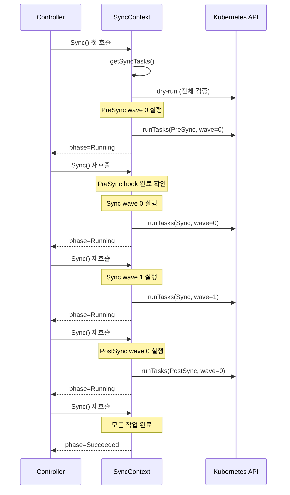

# Argo CD Sync Waves 및 Hooks Deep-Dive

## 목차

1. [개요](#1-개요)
2. [Sync Waves](#2-sync-waves)
3. [Sync Phases](#3-sync-phases)
4. [Resource Hooks](#4-resource-hooks)
5. [SyncContext 상태 머신 — Sync() 메서드](#5-synccontext-상태-머신--sync-메서드)
6. [getSyncTasks() 알고리즘](#6-getsynctasks-알고리즘)
7. [Sync 전략 — applyObject()](#7-sync-전략--applyobject)
8. [Sync Options](#8-sync-options)
9. [Prune 동작](#9-prune-동작)
10. [Terminate() 비동기 종료](#10-terminate-비동기-종료)
11. [왜(Why) 이런 설계인가](#11-왜why-이런-설계인가)

---

## 1. 개요

Argo CD의 Sync 메커니즘은 단순히 `kubectl apply`를 실행하는 것을 넘어, GitOps 워크플로에서 복잡한 배포 순서 제어를 가능하게 하는 정교한 상태 머신이다. 핵심 구현체는 gitops-engine 라이브러리에 있으며, Argo CD는 이를 의존성으로 사용한다.

**핵심 파일 위치:**

```
gitops-engine/pkg/sync/
├── sync_context.go      # SyncContext 인터페이스, syncContext 구조체, Sync() 메인 루프
├── sync_task.go         # syncTask 구조체 — 단일 리소스 작업 표현
├── sync_tasks.go        # syncTasks 타입 — 정렬, 필터, wave/phase 추출
├── sync_phase.go        # syncPhases() — 리소스의 phase 결정
├── syncwaves/waves.go   # Wave() — sync-wave annotation 읽기
├── hook/hook.go         # IsHook(), Types(), Skip()
├── hook/delete_policy.go # DeletePolicies() — hook 삭제 정책
└── common/types.go      # 상수 정의 — annotation 키, phase, hook 타입
```

전체 아키텍처에서 Sync 엔진의 위치:

```
┌─────────────────────────────────────────────────────────┐
│                   Argo CD Application Controller          │
│  ┌───────────────────────────────────────────────────┐  │
│  │  appv1.Application.Operation.Sync                  │  │
│  │  SyncOperation{Revision, Prune, SyncOptions, ...}  │  │
│  └────────────────────┬──────────────────────────────┘  │
│                        │ NewSyncContext()                  │
│  ┌─────────────────────▼──────────────────────────────┐  │
│  │  gitops-engine/pkg/sync.SyncContext (인터페이스)    │  │
│  │  ┌──────────────────────────────────────────────┐  │  │
│  │  │  syncContext (구현체)                          │  │  │
│  │  │  - resources map[ResourceKey]reconciledResource│  │  │
│  │  │  - hooks []*unstructured.Unstructured          │  │  │
│  │  │  - syncRes map[string]ResourceSyncResult       │  │  │
│  │  │  - phase, wave 추적                            │  │  │
│  │  └──────────────────────────────────────────────┘  │  │
│  └─────────────────────────────────────────────────────┘  │
└─────────────────────────────────────────────────────────┘
```

---

## 2. Sync Waves

### 2.1 개념

Sync Wave는 같은 Sync Phase 내에서 리소스 배포 순서를 제어하는 메커니즘이다. annotation 하나로 복잡한 배포 순서를 선언적으로 표현할 수 있다.

**annotation:**
```yaml
metadata:
  annotations:
    argocd.argoproj.io/sync-wave: "5"
```

wave 값은 정수이며, 음수도 허용된다. 기본값은 0이다.

### 2.2 Wave 읽기 — `syncwaves/waves.go`

```go
// gitops-engine/pkg/sync/syncwaves/waves.go:12
func Wave(obj *unstructured.Unstructured) int {
    text, ok := obj.GetAnnotations()[common.AnnotationSyncWave]
    if ok {
        val, err := strconv.Atoi(text)
        if err == nil {
            return val
        }
    }
    return helmhook.Weight(obj)  // Helm hook의 weight도 wave로 처리
}
```

annotation이 없으면 Helm hook의 `weight` annotation으로 폴백한다. 이는 Helm 차트와의 호환성을 위한 설계다.

### 2.3 Wave 실행 순서

```
Wave -1 리소스들 → (모두 Healthy/Succeeded) → Wave 0 리소스들 → (모두 Healthy/Succeeded) → Wave 1 리소스들
```

**멀티스텝 조건 (`sync_tasks.go:274`):**

```go
func (s syncTasks) multiStep() bool {
    return s.wave() != s.lastWave() || s.phase() != s.lastPhase()
}
```

wave가 여러 개이거나 phase가 여러 개인 경우, 각 wave/phase 완료 후 다음 wave로 넘어가기 위해 Sync()가 반복 호출된다. 단일 wave인 경우 모든 리소스를 한 번에 apply하고 즉시 Succeeded 상태가 된다.

### 2.4 Wave 정렬 — `sync_tasks.go:85`

```go
func (s syncTasks) Less(i, j int) bool {
    tA := s[i]
    tB := s[j]

    // 1순위: phase
    d := syncPhaseOrder[tA.phase] - syncPhaseOrder[tB.phase]
    if d != 0 {
        return d < 0
    }

    // 2순위: wave
    d = tA.wave() - tB.wave()
    if d != 0 {
        return d < 0
    }

    // 3순위: kind (Namespace, Secret, ConfigMap, ... 순)
    d = kindOrder[a.GetKind()] - kindOrder[b.GetKind()]
    if d != 0 {
        return d < 0
    }

    // 4순위: name (알파벳 순)
    return a.GetName() < b.GetName()
}
```

**Phase 순서:**

```go
// sync_tasks.go:15
var syncPhaseOrder = map[common.SyncPhase]int{
    common.SyncPhasePreSync:  -1,
    common.SyncPhaseSync:     0,
    common.SyncPhasePostSync: 1,
    common.SyncPhaseSyncFail: 2,
}
```

### 2.5 Kind 정렬 순서

wave 내에서 같은 wave를 가진 리소스는 kind 기반으로 정렬된다:

```go
// sync_tasks.go:27
kinds := []string{
    "Namespace",            // 가장 먼저
    "NetworkPolicy",
    "ResourceQuota",
    "LimitRange",
    "PodSecurityPolicy",
    "PodDisruptionBudget",
    "ServiceAccount",
    "Secret",
    "SecretList",
    "ConfigMap",
    "StorageClass",
    "PersistentVolume",
    "PersistentVolumeClaim",
    "CustomResourceDefinition",
    "ClusterRole",
    ...
    "Deployment",
    ...
    "Ingress",
    "APIService",           // 가장 나중
}
```

이 순서는 Helm의 kind_sorter.go에서 차용한 것으로, Kubernetes 리소스 간의 암묵적 의존 관계를 반영한다.

### 2.6 의존성 자동 조정 — `adjustDeps()`

sort 후에 추가적인 의존성 조정이 수행된다:

```go
// sync_tasks.go:112
func (s syncTasks) Sort() {
    sort.Sort(s)
    // Namespace가 그 namespace에 속한 리소스보다 먼저 생성
    s.adjustDeps(
        func(obj *unstructured.Unstructured) (string, bool) {
            return obj.GetName(), obj.GetKind() == kube.NamespaceKind
        },
        func(obj *unstructured.Unstructured) (string, bool) {
            return obj.GetNamespace(), obj.GetNamespace() != ""
        },
    )
    // CRD가 CR보다 먼저 생성
    s.adjustDeps( /* CRD → CR 의존성 */ )
}
```

---

## 3. Sync Phases

### 3.1 Phase 정의

```go
// common/types.go:67
const (
    SyncPhasePreSync  = "PreSync"   // Sync 전 실행
    SyncPhaseSync     = "Sync"      // 메인 리소스 배포
    SyncPhasePostSync = "PostSync"  // Sync 후 실행
    SyncPhaseSyncFail = "SyncFail"  // 실패 시 실행
)
```

### 3.2 Phase별 용도

| Phase | 실행 조건 | 주요 용도 |
|-------|----------|----------|
| **PreSync** | Sync 전 항상 실행 | DB 마이그레이션, 설정 변경, 전처리 |
| **Sync** | 메인 배포 단계 | 일반 Kubernetes 리소스 (Deployment, Service 등) |
| **PostSync** | Sync 성공 후 실행 | 통합 테스트, 알림 발송, 캐시 워밍 |
| **SyncFail** | Sync 실패 시에만 실행 | 실패 알림, 롤백 트리거, 정리 작업 |

### 3.3 Phase 결정 — `sync_phase.go`

```go
// sync_phase.go:10
func syncPhases(obj *unstructured.Unstructured) []common.SyncPhase {
    if hook.Skip(obj) {
        return nil  // Skip → 아예 제외
    } else if hook.IsHook(obj) {
        // hook annotation에 명시된 phase들을 모두 반환
        // 예: "PreSync,PostSync" → [PreSync, PostSync] (두 phase 모두 실행)
        phasesMap := make(map[common.SyncPhase]bool)
        for _, hookType := range hook.Types(obj) {
            switch hookType {
            case common.HookTypePreSync, common.HookTypeSync, common.HookTypePostSync, common.HookTypeSyncFail:
                phasesMap[common.SyncPhase(hookType)] = true
            }
        }
        ...
    }
    return []common.SyncPhase{common.SyncPhaseSync}  // 일반 리소스 → Sync phase만
}
```

일반 리소스(hook annotation 없음)는 항상 `SyncPhaseSync`에만 배치된다.

### 3.4 SyncFail Phase 특수 처리

SyncFail hooks는 일반 작업 목록에서 분리되어 별도로 관리된다:

```go
// sync_context.go:569
syncFailTasks, tasks := tasks.Split(func(t *syncTask) bool {
    return t.phase == common.SyncPhaseSyncFail
})
```

이후 동기화가 실패할 때만 `executeSyncFailPhase()`를 통해 실행된다.

### 3.5 Phase 전환 시퀀스



---

## 4. Resource Hooks

### 4.1 Hook 식별

```go
// hook/hook.go:26
func IsHook(obj *unstructured.Unstructured) bool {
    _, ok := obj.GetAnnotations()[common.AnnotationKeyHook]
    if ok {
        return !Skip(obj)  // Skip hook은 hook으로 처리하지 않음
    }
    return helmhook.IsHook(obj)  // Helm hook도 인식
}
```

**annotation:**
```yaml
metadata:
  annotations:
    argocd.argoproj.io/hook: PreSync
```

### 4.2 Hook 타입

```go
// common/types.go:113
const (
    HookTypePreSync  HookType = "PreSync"
    HookTypeSync     HookType = "Sync"
    HookTypePostSync HookType = "PostSync"
    HookTypeSkip     HookType = "Skip"     // 동기화에서 완전히 제외
    HookTypeSyncFail HookType = "SyncFail"
)
```

**Skip 동작:**

```go
// hook/hook.go:34
func Skip(obj *unstructured.Unstructured) bool {
    for _, hookType := range Types(obj) {
        if hookType == common.HookTypeSkip {
            return len(Types(obj)) == 1  // Skip만 있을 때만 실제로 skip
        }
    }
    return false
}
```

`Skip`과 다른 hook 타입이 함께 있으면 Skip이 무시된다.

### 4.3 여러 Hook 타입 동시 지정

하나의 리소스에 여러 phase를 지정하면, 각 phase에서 별도의 syncTask가 생성된다:

```yaml
metadata:
  annotations:
    argocd.argoproj.io/hook: "PreSync,PostSync"
```

이 경우 PreSync에서 한 번, PostSync에서 한 번 총 두 번 실행된다.

### 4.4 Hook Delete Policy

```go
// common/types.go:132
const (
    HookDeletePolicyHookSucceeded      HookDeletePolicy = "HookSucceeded"
    HookDeletePolicyHookFailed         HookDeletePolicy = "HookFailed"
    HookDeletePolicyBeforeHookCreation HookDeletePolicy = "BeforeHookCreation"
)
```

```yaml
metadata:
  annotations:
    argocd.argoproj.io/hook-delete-policy: HookSucceeded
```

**기본값:** annotation이 없으면 `BeforeHookCreation`이 기본값이다.

```go
// hook/delete_policy.go:22
if len(policies) == 0 {
    policies = append(policies, common.HookDeletePolicyBeforeHookCreation)
}
```

**정책별 동작:**

| 정책 | 삭제 시점 | 용도 |
|------|----------|------|
| `BeforeHookCreation` | 다음 sync 시 hook 생성 전 | 기본값, 이전 hook 정리 후 재생성 |
| `HookSucceeded` | hook 성공 후 즉시 | 완료된 hook 자동 정리 |
| `HookFailed` | hook 실패 후 즉시 | 실패 hook 정리 (로그는 보존하지 않음) |

### 4.5 Hook Finalizer

hook이 실행 중에 컨트롤러가 재시작되어도 hook이 중간에 삭제되지 않도록 finalizer가 추가된다:

```go
// hook/hook.go:13
const (
    HookFinalizer = "argocd.argoproj.io/hook-finalizer"
)
```

```go
// sync_context.go:937
if !hook.HasHookFinalizer(targetObj) {
    targetObj.SetFinalizers(append(targetObj.GetFinalizers(), hook.HookFinalizer))
}
```

hook이 완료되면 finalizer가 제거된다:

```go
// sync_context.go:550
hooksCompleted := tasks.Filter(func(task *syncTask) bool {
    return task.isHook() && task.completed()
})
for _, task := range hooksCompleted {
    if err := sc.removeHookFinalizer(task); err != nil { ... }
}
```

### 4.6 Hook 실행 예시

```yaml
# DB 마이그레이션 (PreSync)
apiVersion: batch/v1
kind: Job
metadata:
  name: db-migrate
  annotations:
    argocd.argoproj.io/hook: PreSync
    argocd.argoproj.io/hook-delete-policy: HookSucceeded
    argocd.argoproj.io/sync-wave: "0"
spec:
  template:
    spec:
      containers:
      - name: migrate
        image: myapp:latest
        command: ["./migrate", "up"]
      restartPolicy: Never

---
# 통합 테스트 (PostSync)
apiVersion: batch/v1
kind: Job
metadata:
  name: integration-test
  annotations:
    argocd.argoproj.io/hook: PostSync
    argocd.argoproj.io/hook-delete-policy: HookSucceeded
spec:
  template:
    spec:
      containers:
      - name: test
        image: myapp-test:latest
        command: ["./run-tests"]
      restartPolicy: Never

---
# 실패 알림 (SyncFail)
apiVersion: batch/v1
kind: Job
metadata:
  name: notify-failure
  annotations:
    argocd.argoproj.io/hook: SyncFail
    argocd.argoproj.io/hook-delete-policy: HookFailed
spec:
  template:
    spec:
      containers:
      - name: notify
        image: slack-notifier:latest
      restartPolicy: Never
```

---

## 5. SyncContext 상태 머신 — Sync() 메서드

`Sync()` 메서드는 컨트롤러에 의해 반복적으로 호출되는 상태 머신이다. 한 번의 호출에서 하나의 wave/phase를 진행한다.

**파일:** `gitops-engine/pkg/sync/sync_context.go:450`

### 5.1 전체 흐름도

```
Sync() 호출
│
├─ Step 1: getSyncTasks()
│   └─ 실패 시 → OperationFailed 반환
│
├─ Step 2: 첫 호출 여부 확인 (started() = syncRes가 비어있는지)
│   └─ 첫 호출이면:
│       ├─ CreateNamespace task 처리 (있으면 먼저 실행)
│       └─ 전체 dry-run 실행
│           └─ 실패 시 → OperationFailed 반환
│
├─ Step 3: running task 상태 업데이트
│   ├─ hook: getOperationPhase() — Job/Pod 완료 상태 확인
│   └─ resource: GetResourceHealth() — healthy 상태 확인
│
├─ Step 4: running task 완료 대기
│   └─ multiStep이고 running task 있으면 → OperationRunning 반환
│
├─ Step 5: pruned resource 삭제 완료 대기
│   └─ DeletionTimestamp != nil인 prune task 있으면 → OperationRunning 반환
│
├─ Step 6: 완료된 hook finalizer 제거
│
├─ Step 7: 삭제 대기 hook 수집
│   ├─ hooksPendingDeletionSuccessful (HookSucceeded 정책)
│   └─ hooksPendingDeletionFailed (HookFailed 정책)
│
├─ Step 8: SyncFail tasks 분리
│   └─ syncFailTasks, tasks = tasks.Split(phase == SyncFail)
│
├─ Step 9: 실패 task 확인 → executeSyncFailPhase()
│   └─ completed && !successful task 있으면 → SyncFail hooks 실행
│
├─ Step 10: pending tasks만 필터링
│   └─ tasks = tasks.Filter(pending())
│
├─ Step 11: applyOutOfSyncOnly 필터
│   └─ 변경된 리소스만 남김
│
├─ Step 12: 남은 task 없으면 → OperationSucceeded
│
├─ Step 13: 현재 phase + wave 결정
│   ├─ phase = tasks.phase()   (정렬된 tasks[0].phase)
│   ├─ wave  = tasks.wave()    (정렬된 tasks[0].wave())
│   └─ finalWave 확인
│
├─ Step 14: 현재 phase+wave task만 필터링
│   └─ tasks, remainingTasks = tasks.Split(phase==phase && wave==wave)
│
├─ Step 15: runTasks() — 실제 apply
│   ├─ prune tasks (병렬 실행)
│   ├─ BeforeHookCreation 삭제
│   └─ create/apply tasks (kind별 그룹 후 병렬 실행)
│
└─ Step 16: syncWaveHook 콜백 호출
    └─ 각 wave 완료 후 외부 콜백 알림
```

### 5.2 코드로 보는 핵심 흐름

**Step 1~2: 초기화 및 dry-run**

```go
// sync_context.go:450
func (sc *syncContext) Sync() {
    tasks, ok := sc.getSyncTasks()
    if !ok {
        sc.setOperationPhase(common.OperationFailed, "...")
        return
    }

    if sc.started() {
        // 이미 시작됨 — dry-run 건너뜀
    } else {
        // 첫 호출: dry-run으로 전체 검증
        if sc.runTasks(dryRunTasks, true) == failed {
            sc.setOperationPhase(common.OperationFailed, "one or more objects failed to apply (dry run)")
            return
        }
    }
```

**Step 3~4: 진행 중인 작업 상태 확인**

```go
    // running hook/resource 상태 업데이트
    for _, task := range tasks.Filter(func(t *syncTask) bool {
        return t.running() && t.liveObj != nil
    }) {
        if task.isHook() {
            operationState, message, err := sc.getOperationPhase(task.liveObj)
            ...
        } else {
            healthStatus, err := health.GetResourceHealth(task.liveObj, sc.healthOverride)
            ...
        }
    }

    // multiStep이고 running task 있으면 대기
    multiStep := tasks.multiStep()
    runningTasks := tasks.Filter(func(t *syncTask) bool {
        return (multiStep || t.isHook()) && t.running()
    })
    if runningTasks.Len() > 0 {
        sc.setRunningPhase(runningTasks, false)
        return  // 다음 reconcile까지 대기
    }
```

**Step 13~15: wave/phase 선택 및 실행**

```go
    phase := tasks.phase()
    wave := tasks.wave()
    finalWave := phase == tasks.lastPhase() && wave == tasks.lastWave()

    tasks, remainingTasks := tasks.Split(func(t *syncTask) bool {
        return t.phase == phase && t.wave() == wave
    })

    runState := sc.runTasks(tasks, false)  // 실제 apply

    // wave 완료 콜백
    if sc.syncWaveHook != nil && runState != failed {
        err := sc.syncWaveHook(phase, wave, finalWave)
        ...
    }
```

### 5.3 started() 판단 기준

```go
// sync_context.go:884
func (sc *syncContext) started() bool {
    return len(sc.syncRes) > 0
}
```

`syncRes` 맵에 하나라도 결과가 있으면 "이미 시작됨"으로 판단한다. 이 맵은 `WithInitialState()`를 통해 이전 sync 결과를 복원할 수 있어, 컨트롤러 재시작 후에도 이어서 진행 가능하다.

---

## 6. getSyncTasks() 알고리즘

`getSyncTasks()`는 Sync()가 호출될 때마다 실행되어 현재 처리해야 할 모든 task를 생성한다.

**파일:** `gitops-engine/pkg/sync/sync_context.go:893`

### 6.1 Resource Tasks 생성

```go
// sync_context.go:894
resourceTasks := syncTasks{}
for k, resource := range sc.resources {
    if !sc.containsResource(resource) {
        continue  // 필터링된 리소스 건너뜀
    }

    obj := obj(resource.Target, resource.Live)

    // hook은 resourceTasks에서 제외 (별도 처리)
    if hook.IsHook(obj) {
        continue
    }

    // 일반 리소스는 항상 SyncPhase 하나만 반환
    for _, phase := range syncPhases(obj) {
        resourceTasks = append(resourceTasks, &syncTask{
            phase:     phase,
            targetObj: resource.Target,
            liveObj:   resource.Live,
        })
    }
}
```

### 6.2 Hook Tasks 생성 및 이름 결정

```go
// sync_context.go:918
hookTasks := syncTasks{}
if !sc.skipHooks {
    for _, obj := range sc.hooks {
        for _, phase := range syncPhases(obj) {
            targetObj := obj.DeepCopy()

            // generateName 기반 hook이면 결정적 이름 생성
            if targetObj.GetName() == "" {
                var syncRevision string
                if len(sc.revision) >= 8 {
                    syncRevision = sc.revision[0:7]  // Git revision 앞 7자
                } else {
                    syncRevision = sc.revision
                }
                // 형식: {generateName}{revision[0:7]}-{phase}-{unix_timestamp}
                postfix := strings.ToLower(fmt.Sprintf("%s-%s-%d",
                    syncRevision, phase, sc.startedAt.UTC().Unix()))
                generateName := obj.GetGenerateName()
                targetObj.SetName(fmt.Sprintf("%s%s", generateName, postfix))
            }

            // HookFinalizer 추가 (GC 방지)
            if !hook.HasHookFinalizer(targetObj) {
                targetObj.SetFinalizers(
                    append(targetObj.GetFinalizers(), hook.HookFinalizer))
            }

            hookTasks = append(hookTasks, &syncTask{phase: phase, targetObj: targetObj})
        }
    }
}
```

**이름 결정 예시:**

```
generateName: "db-migrate-"
revision: "abc1234def5678"  → syncRevision = "abc1234"
phase: "presync"
timestamp: 1741000000

결과 이름: "db-migrate-abc1234-presync-1741000000"
```

이 이름은 동일 sync 작업 내에서 항상 동일하다 (revision과 startedAt이 고정). 따라서 컨트롤러가 재시작되어도 이미 생성된 hook을 재인식할 수 있다.

### 6.3 Permission Check

```go
// sync_context.go:982
serverResCache := make(map[schema.GroupVersionKind]*metav1.APIResource)

for _, task := range tasks {
    // Discovery API로 리소스 존재 여부 확인
    serverRes, err = kubeutil.ServerResourceForGroupVersionKind(
        sc.disco, task.groupVersionKind(), "get")

    if err != nil {
        if apierrors.IsNotFound(err) && shouldSkipDryRunOnMissingResource() {
            // CRD 미등록 리소스: dry-run 스킵 (CRD가 이번 sync에서 생성될 예정)
            task.skipDryRun = true
        } else {
            sc.setResourceResult(task, common.ResultCodeSyncFailed, "", err.Error())
            successful = false
        }
    } else {
        // 권한 검증
        if err := sc.permissionValidator(task.obj(), serverRes); err != nil {
            sc.setResourceResult(task, common.ResultCodeSyncFailed, "", err.Error())
            successful = false
        }
    }
}
```

**CRD와 CR을 같은 sync에서 배포할 때 특수 처리:**

CRD가 이번 sync에서 처음 배포된다면, CR의 dry-run 시점에 CRD가 아직 API 서버에 등록되지 않았을 수 있다. 이 경우:
1. `hasCRDOfGroupKind()` — 이번 sync target에 해당 CRD가 있는지 확인
2. 있으면 `task.skipDryRun = true` — dry-run 건너뜀
3. CRD가 실제로 배포되고 `ensureCRDReady()`로 ready 상태 대기 후 CR 배포

### 6.4 Prune Wave Reversal

prune 작업은 생성의 역순으로 실행해야 한다. wave 0에서 생성된 리소스를 먼저 삭제하면, wave 1에서 생성된 리소스가 의존하는 것을 삭제하는 문제가 발생한다.

```go
// sync_context.go:1031
// prune task들의 wave를 역순으로 재배치
pruneTasks := make(map[int][]*syncTask)
for _, task := range tasks {
    if task.isPrune() {
        pruneTasks[task.wave()] = append(pruneTasks[task.wave()], task)
    }
}

var uniquePruneWaves []int
for k := range pruneTasks {
    uniquePruneWaves = append(uniquePruneWaves, k)
}
sort.Ints(uniquePruneWaves)  // [0, 1, 2, 3]

// 대칭 교환 (symmetric swap)
n := len(uniquePruneWaves)
for i := 0; i < n/2; i++ {
    startWave := uniquePruneWaves[i]         // 0
    endWave := uniquePruneWaves[n-1-i]       // 3

    for _, task := range pruneTasks[startWave] {
        task.waveOverride = &endWave  // wave 0 prune → wave 3으로 재배치
    }
    for _, task := range pruneTasks[endWave] {
        task.waveOverride = &startWave  // wave 3 prune → wave 0으로 재배치
    }
}
```

**예시:**

```
생성 순서: wave 0 → wave 1 → wave 2 → wave 3
삭제 순서: wave 3 → wave 2 → wave 1 → wave 0

원래 wave:  [0, 1, 2, 3]
교환 후:    [3, 2, 1, 0]  ← uniquePruneWaves의 인덱스 i=0: 0↔3, i=1: 1↔2
```

이 알고리즘은 "높은 wave에서 생성된 것을 먼저 삭제"라는 직관적 규칙을 구현한다.

### 6.5 PruneLast 처리

```go
// sync_context.go:1061
syncPhaseLastWave := 0
for _, task := range tasks {
    if task.phase == common.SyncPhaseSync {
        if task.wave() > syncPhaseLastWave {
            syncPhaseLastWave = task.wave()
        }
    }
}
syncPhaseLastWave = syncPhaseLastWave + 1

for _, task := range tasks {
    if task.isPrune() &&
        (sc.pruneLast || resourceutil.HasAnnotationOption(
            task.liveObj, common.AnnotationSyncOptions, common.SyncOptionPruneLast)) {
        task.waveOverride = &syncPhaseLastWave
    }
}
```

`PruneLast=true`인 prune task는 Sync phase의 마지막 wave + 1로 이동한다. 이는 모든 새 리소스가 배포된 후 마지막에 정리가 실행되도록 보장한다.

---

## 7. Sync 전략 — applyObject()

**파일:** `gitops-engine/pkg/sync/sync_context.go:1323`

### 7.1 전략 선택 로직

```go
func (sc *syncContext) applyObject(t *syncTask, dryRun, validate bool) (common.ResultCode, string) {
    shouldReplace := sc.replace ||
        resourceutil.HasAnnotationOption(t.targetObj, common.AnnotationSyncOptions, common.SyncOptionReplace)
    force := sc.force ||
        resourceutil.HasAnnotationOption(t.targetObj, common.AnnotationSyncOptions, common.SyncOptionForce)
    serverSideApply := sc.shouldUseServerSideApply(t.targetObj, dryRun)
    ...
}
```

### 7.2 전략별 동작

| 전략 | 조건 | kubectl 명령 | 주의사항 |
|------|------|-------------|---------|
| **Apply (기본)** | 기본값 | `kubectl apply` | 가장 안전, 3-way merge |
| **Replace** | `Replace=true` | `kubectl replace` | 리소스 재생성, immutable 필드 변경 가능 |
| **Force** | `Force=true` | `kubectl delete + create` | 기존 리소스 완전 삭제 후 재생성 |
| **ServerSideApply** | `ServerSideApply=true` | `kubectl apply --server-side` | 서버 측 merge, field ownership |

**Replace 특수 케이스 — CRD와 Namespace:**

```go
// sync_context.go:1357
if shouldReplace {
    if t.liveObj != nil {
        // CRD나 Namespace는 replace 대신 update 사용
        // CRD replace → CRD 삭제 → 모든 CR 삭제
        // Namespace replace → Namespace 삭제 → Namespace 내 모든 리소스 삭제
        if kubeutil.IsCRD(t.targetObj) || t.targetObj.GetKind() == kubeutil.NamespaceKind {
            update := t.targetObj.DeepCopy()
            update.SetResourceVersion(t.liveObj.GetResourceVersion())
            _, err = sc.resourceOps.UpdateResource(...)
        } else {
            message, err = sc.resourceOps.ReplaceResource(...)
        }
    }
}
```

### 7.3 ServerSideApply 활성화 조건

```go
// sync_context.go:1215
func (sc *syncContext) shouldUseServerSideApply(targetObj *unstructured.Unstructured, dryRun bool) bool {
    // dry-run에서는 SSA 비활성화 (namespace auto-creation 이슈)
    if sc.dryRun || dryRun {
        return false
    }

    // 리소스별 비활성화 annotation
    if resourceutil.HasAnnotationOption(targetObj, common.AnnotationSyncOptions,
        common.SyncOptionDisableServerSideApply) {
        return false
    }

    return sc.serverSideApply ||
        resourceutil.HasAnnotationOption(targetObj, common.AnnotationSyncOptions,
            common.SyncOptionServerSideApply)
}
```

### 7.4 CRD 배포 후 readiness 대기

```go
// sync_context.go:1379
if kubeutil.IsCRD(t.targetObj) && !dryRun {
    crdName := t.targetObj.GetName()
    if err = sc.ensureCRDReady(crdName); err != nil {
        sc.log.Error(err, fmt.Sprintf("failed to ensure that CRD %s is ready", crdName))
    }
}
```

```go
// sync_context.go:1195
// 3초 타임아웃, 100ms 폴링으로 CRD Established 조건 대기
func (sc *syncContext) ensureCRDReady(name string) error {
    err := wait.PollUntilContextTimeout(context.Background(),
        time.Duration(100)*time.Millisecond, crdReadinessTimeout, true,
        func(_ context.Context) (bool, error) {
            crd, err := sc.extensionsclientset.ApiextensionsV1().
                CustomResourceDefinitions().Get(...)
            for _, condition := range crd.Status.Conditions {
                if condition.Type == apiextensionsv1.Established {
                    return condition.Status == apiextensionsv1.ConditionTrue, nil
                }
            }
            return false, nil
        })
    ...
}
```

---

## 8. Sync Options

Sync Options는 Application 수준 또는 리소스 수준에서 동기화 동작을 제어한다.

**annotation:**
```yaml
metadata:
  annotations:
    argocd.argoproj.io/sync-options: "Validate=false,PruneLast=true"
```

**Application spec:**
```yaml
spec:
  syncPolicy:
    syncOptions:
    - Validate=false
    - PruneLast=true
```

### 8.1 Sync Option 목록

**파일:** `gitops-engine/pkg/sync/common/types.go`

| Option | 상수 | 설명 |
|--------|------|------|
| `Validate=false` | `SyncOptionsDisableValidation` | dry-run(kubectl apply --dry-run) 스킵 |
| `PruneLast=true` | `SyncOptionPruneLast` | 마지막 wave에서 prune 실행 |
| `Replace=true` | `SyncOptionReplace` | kubectl replace 사용 |
| `Replace=false` | `SyncOptionDisableReplace` | replace 비활성화 (앱 수준 설정 override) |
| `Force=true` | `SyncOptionForce` | delete + create |
| `ServerSideApply=true` | `SyncOptionServerSideApply` | server-side apply |
| `ServerSideApply=false` | `SyncOptionDisableServerSideApply` | SSA 비활성화 (앱 수준 설정 override) |
| `CreateNamespace=true` | (앱 수준만) | 네임스페이스 자동 생성 |
| `ApplyOutOfSyncOnly=true` | `SyncOptionApplyOutOfSyncOnly` | 변경된 리소스만 apply |
| `ApplyOutOfSyncOnly=false` | `SyncOptionDisableApplyOutOfSyncOnly` | 전체 apply |
| `SkipDryRunOnMissingResource=true` | `SyncOptionSkipDryRunOnMissingResource` | 미등록 리소스 dry-run 스킵 |
| `Prune=false` | `SyncOptionDisablePrune` | 해당 리소스 prune 비활성화 |
| `Prune=confirm` | `SyncOptionPruneRequireConfirm` | prune 전 확인 필요 |
| `Delete=false` | `SyncOptionDisableDeletion` | 삭제 비활성화 |
| `Delete=confirm` | `SyncOptionDeleteRequireConfirm` | 삭제 전 확인 필요 |
| `ClientSideApplyMigration=true` | `SyncOptionClientSideApplyMigration` | CSA→SSA 마이그레이션 |

### 8.2 Annotation CSV 파싱

Sync Options는 쉼표로 구분된 문자열로 annotation에 저장된다:

```go
// resource/annotations.go:16
func GetAnnotationCSVs(obj AnnotationGetter, key string) []string {
    valuesToBool := make(map[string]bool)
    for _, item := range strings.Split(obj.GetAnnotations()[key], ",") {
        val := strings.TrimSpace(item)
        if val != "" {
            valuesToBool[val] = true  // 중복 제거
        }
    }
    ...
}
```

### 8.3 ApplyOutOfSyncOnly 동작

```go
// sync_context.go:700
func (sc *syncContext) filterOutOfSyncTasks(tasks syncTasks) syncTasks {
    return tasks.Filter(func(t *syncTask) bool {
        if t.isHook() {
            return true  // hook은 항상 실행
        }

        // 변경되지 않은 리소스는 skip
        if modified, ok := sc.modificationResult[t.resourceKey()];
           !modified && ok && t.targetObj != nil && t.liveObj != nil {
            return false
        }
        return true
    })
}
```

hook은 `ApplyOutOfSyncOnly` 필터에서 제외된다. 즉, hook은 변경 여부와 관계없이 항상 실행된다.

---

## 9. Prune 동작

### 9.1 Prune 기본 동작

`targetObj == nil`인 task는 prune task다. live 클러스터에는 존재하지만 Git에서 삭제된 리소스를 정리한다.

```go
// sync_task.go:45
func (t *syncTask) isPrune() bool {
    return t.targetObj == nil
}
```

```go
// sync_context.go:1388
func (sc *syncContext) pruneObject(liveObj *unstructured.Unstructured, prune, dryRun bool) (common.ResultCode, string) {
    if !prune {
        return common.ResultCodePruneSkipped, "ignored (requires pruning)"
    } else if resourceutil.HasAnnotationOption(liveObj, common.AnnotationSyncOptions,
        common.SyncOptionDisablePrune) {
        return common.ResultCodePruneSkipped, "ignored (no prune)"
    }
    if dryRun {
        return common.ResultCodePruned, "pruned (dry run)"
    }
    // 이미 삭제 진행 중이면 스킵
    deletionTimestamp := liveObj.GetDeletionTimestamp()
    if deletionTimestamp == nil || deletionTimestamp.IsZero() {
        err := sc.kubectl.DeleteResource(context.TODO(), sc.config,
            liveObj.GroupVersionKind(), liveObj.GetName(), liveObj.GetNamespace(),
            sc.getDeleteOptions())
        ...
    }
    return common.ResultCodePruned, "pruned"
}
```

### 9.2 PrunePropagationPolicy

```go
// sync_context.go:1409
func (sc *syncContext) getDeleteOptions() metav1.DeleteOptions {
    propagationPolicy := metav1.DeletePropagationForeground  // 기본값
    if sc.prunePropagationPolicy != nil {
        propagationPolicy = *sc.prunePropagationPolicy
    }
    return metav1.DeleteOptions{PropagationPolicy: &propagationPolicy}
}
```

| 정책 | 동작 |
|------|------|
| **Foreground** (기본) | 자식 리소스가 모두 삭제된 후 부모 삭제, ownerReference 기반 |
| **Background** | 부모 즉시 삭제, 자식은 GC가 나중에 처리 |
| **Orphan** | 부모만 삭제, 자식은 ownerReference 제거 후 독립 리소스로 유지 |

**Application spec 설정:**
```yaml
spec:
  syncPolicy:
    syncOptions:
    - PrunePropagationPolicy=background
```

### 9.3 삭제 완료 확인

prune이 실행되면 Kubernetes가 실제로 리소스를 삭제할 때까지 대기한다:

```go
// sync_context.go:538
prunedTasksPendingDelete := tasks.Filter(func(t *syncTask) bool {
    if t.pruned() && t.liveObj != nil {
        return t.liveObj.GetDeletionTimestamp() != nil  // 삭제 진행 중
    }
    return false
})
if prunedTasksPendingDelete.Len() > 0 {
    sc.setRunningPhase(prunedTasksPendingDelete, true)
    return  // 다음 reconcile에서 다시 확인
}
```

Foreground 삭제 정책에서는 `DeletionTimestamp`가 설정되고 자식 리소스가 모두 삭제된 후에야 부모의 `DeletionTimestamp`가 제거된다.

### 9.4 runTasks()에서 Prune 처리 순서

```go
// sync_context.go:1519
func (sc *syncContext) runTasks(tasks syncTasks, dryRun bool) runState {
    pruneTasks, createTasks := tasks.Split(func(task *syncTask) bool {
        return task.isPrune()
    })

    // 1. prune 먼저 실행 (병렬)
    for _, task := range pruneTasks {
        result, message := sc.pruneObject(t.liveObj, sc.prune, dryRun)
        ...
    }

    // 2. BeforeHookCreation 삭제
    hooksPendingDeletion := createTasks.Filter(func(t *syncTask) bool {
        return t.deleteBeforeCreation()
    })
    ...

    // 3. create/apply 실행 (kind별 그룹 후 병렬)
    var tasksGroup syncTasks
    for _, task := range createTasks {
        if len(tasksGroup) > 0 && tasksGroup[0].targetObj.GetKind() != task.kind() {
            state = sc.processCreateTasks(state, tasksGroup, dryRun)
            tasksGroup = syncTasks{task}
        } else {
            tasksGroup = append(tasksGroup, task)
        }
    }
    ...
}
```

같은 kind 리소스는 병렬로, 다른 kind 리소스는 순차적으로 처리된다.

---

## 10. Terminate() 비동기 종료

**파일:** `gitops-engine/pkg/sync/sync_context.go:664`

```go
func (sc *syncContext) Terminate() {
    sc.log.V(1).Info("terminating")
    tasks, _ := sc.getSyncTasks()

    // 1. 완료된 hook finalizer 제거
    hooksCompleted := tasks.Filter(func(task *syncTask) bool {
        return task.isHook() && task.completed()
    })
    for _, task := range hooksCompleted {
        if err := sc.removeHookFinalizer(task); err != nil { ... }
    }

    // 2. 실행 중인 hook 강제 종료
    terminateSuccessful := sc.terminateHooksPreemptively(
        tasks.Filter(func(task *syncTask) bool { return task.isHook() }),
    )

    // 3. 종료 상태 설정
    if terminateSuccessful {
        sc.setOperationPhase(common.OperationFailed, "Operation terminated")
    } else {
        sc.setOperationPhase(common.OperationError, "Operation termination had errors")
    }
}
```

### 10.1 terminateHooksPreemptively()

```go
// sync_context.go:730
func (sc *syncContext) terminateHooksPreemptively(tasks syncTasks) bool {
    for _, task := range tasks {
        if !task.isHook() || !task.running() {
            continue
        }

        // live object 최신 상태 확인
        if task.liveObj == nil {
            liveObj, err := sc.getResource(task)
            ...
            task.liveObj = liveObj
        }

        // hook의 최신 상태 확인 (이미 완료됐을 수도 있음)
        phase, msg, statusErr := sc.getOperationPhase(task.liveObj)

        // finalizer 제거 (이것이 실제 종료 트리거)
        if err := sc.removeHookFinalizer(task); err != nil { ... }

        // running 중이거나 상태 불명이면 삭제
        if statusErr != nil || phase.Running() || task.deleteOnPhaseFailed() {
            err := sc.deleteResource(task)
            ...
        }

        if phase.Completed() {
            sc.setResourceResult(task, task.syncStatus, phase, msg)
        } else {
            sc.setResourceResult(task, task.syncStatus, common.OperationFailed, "Terminated")
        }
    }
    return terminateSuccessful
}
```

Terminate()는 "비동기"다 — hook Pod/Job을 삭제 요청만 하고 삭제 완료를 기다리지 않는다. Kubernetes GC가 finalizer 제거 후 실제 삭제를 처리한다.

### 10.2 종료 흐름

```
Terminate() 호출
│
├─ 완료된 hook: finalizer 제거
├─ 실행 중인 hook: finalizer 제거 → (필요 시) 리소스 삭제 요청
│   └─ 삭제 완료 대기 없음 (비동기)
│
└─ OperationPhase = Failed (또는 Error)
    └─ 다음 reconcile에서는 더 이상 Sync()를 호출하지 않음
```

---

## 11. 왜(Why) 이런 설계인가

### 11.1 왜 Sync()를 반복 호출하는 구조인가?

Argo CD의 Application Controller는 Kubernetes controller-manager 패턴을 따른다. 컨트롤러는 항상 재시작될 수 있고, 네트워크 오류가 발생할 수 있다. "반복 호출" 구조는 이러한 환경에서 내결함성(fault tolerance)을 제공한다.

**재개 가능한 설계:**

```go
// WithInitialState로 이전 sync 상태 복원
func WithInitialState(phase OperationPhase, message string,
    results []ResourceSyncResult, startedAt metav1.Time) SyncOpt {
    return func(ctx *syncContext) {
        ctx.phase = phase
        ctx.syncRes = map[string]ResourceSyncResult{}
        for i := range results {
            ctx.syncRes[resourceResultKey(results[i].ResourceKey, results[i].SyncPhase)] = results[i]
        }
    }
}
```

컨트롤러가 재시작되면:
1. Application의 `status.operationState` 에서 이전 결과를 읽어 `syncRes` 맵 복원
2. `started()` = true → dry-run 건너뜀
3. 이미 완료된 task는 syncRes에서 completed로 확인
4. 나머지 pending task부터 재개

### 11.2 왜 Prune Wave를 역순으로 실행하는가?

파이낸셜 데이터베이스 예시:
```
Wave 0: ConfigMap (설정)
Wave 1: Deployment (앱 서버) — ConfigMap에 의존
Wave 2: HPA (오토스케일러) — Deployment에 의존
Wave 3: Ingress (트래픽) — Deployment에 의존
```

이 구조에서 ConfigMap을 삭제하면 Deployment가 충돌한다. 따라서:
- 삭제 순서: Ingress(3) → HPA(2) → Deployment(1) → ConfigMap(0)
- Prune wave reversal이 이를 자동으로 보장

대칭 교환 알고리즘은 `O(n/2)` 교환으로 이를 구현한다.

### 11.3 왜 첫 호출에서 dry-run을 실행하는가?

```go
// sync_context.go:463
// Perform a `kubectl apply --dry-run` against all the manifests.
// This will detect most (but not all) validation issues with the user's manifests
// (e.g. will detect syntax issues, but will not detect if they are mutating immutable fields).
// If anything fails, we will refuse to perform the sync.
```

**부분 적용 방지(Partial Apply Prevention):**

- wave 0 성공 → wave 1 실패 시나리오에서 클러스터가 불완전한 상태
- dry-run을 먼저 전체 실행하면 모든 manifest의 기본 유효성 검사 통과 여부를 사전 확인
- 단, immutable 필드 변경 같은 일부 오류는 dry-run으로 감지 불가

### 11.4 왜 hook에 finalizer를 추가하는가?

Kubernetes Job/Pod가 완료된 후 GC에 의해 삭제되기 전에, Argo CD가 완료 상태를 인식해야 한다:

```
시나리오 (finalizer 없음):
1. PreSync Job 생성
2. Job 완료 (succeeded)
3. Kubernetes GC가 Job 삭제
4. Argo CD reconcile: Job이 없음 → 상태 확인 불가

시나리오 (finalizer 있음):
1. PreSync Job 생성 (finalizer: argocd.argoproj.io/hook-finalizer)
2. Job 완료 (succeeded)
3. Kubernetes GC: finalizer가 있으므로 삭제 불가 (DeletionTimestamp 설정)
4. Argo CD: DeletionTimestamp 확인 → 완료 상태 인식
5. Argo CD: removeHookFinalizer() 실행
6. Kubernetes GC: finalizer 없어진 후 실제 삭제
```

### 11.5 왜 generateName hook은 결정적 이름을 사용하는가?

```
이름 = generateName + revision[0:7] + phase + timestamp(startedAt)
```

`startedAt`은 sync 작업 시작 시간으로 고정된다. 따라서:
- 동일 sync 작업 내에서는 항상 동일한 이름 생성
- 컨트롤러 재시작 후에도 동일한 이름으로 기존 hook Job 재인식 가능
- 이름 충돌 방지: revision과 timestamp 조합으로 유일성 보장

### 11.6 왜 kind별로 병렬 처리를 하는가?

```go
// sync_context.go:1622
var tasksGroup syncTasks
for _, task := range createTasks {
    if len(tasksGroup) > 0 && tasksGroup[0].targetObj.GetKind() != task.kind() {
        state = sc.processCreateTasks(state, tasksGroup, dryRun)  // 이전 kind 완료 후
        tasksGroup = syncTasks{task}
    } else {
        tasksGroup = append(tasksGroup, task)  // 같은 kind끼리 묶음
    }
}
```

같은 kind의 리소스는 병렬 apply가 안전하다(서로 독립적). 다른 kind 간에는 순서 의존성이 있을 수 있으므로(예: ServiceAccount 완료 후 Deployment) 순차 처리한다.

### 11.7 왜 syncRes 맵은 결과 코드를 보존하는가?

```go
// sync_context.go:1695
if ok {
    // 기존 값 업데이트 (상태, 메시지만 업데이트, Order는 보존)
    existing.Status = res.Status
    existing.HookPhase = res.HookPhase
    existing.Message = res.Message
    sc.syncRes[task.resultKey()] = existing
} else {
    // 새 결과 추가 (Order = 삽입 순서)
    res.Order = len(sc.syncRes) + 1
    sc.syncRes[task.resultKey()] = res
}
```

`Order` 필드는 UI에서 리소스 처리 순서를 시각화하는 데 사용된다. 첫 삽입 시 결정되고 이후 변경되지 않으므로, 상태가 변경되어도 원래 처리 순서가 유지된다.

---

## 참고: 핵심 데이터 흐름 요약

```
Application CRD
  │
  ├─ spec.source (Git repo + revision)
  └─ spec.destination (cluster + namespace)
            │
            ▼
  ReconciliationResult
  ├─ Target: []*unstructured.Unstructured  (Git에서 가져온 manifest)
  └─ Live:   []*unstructured.Unstructured  (클러스터 실제 상태)
            │
            ▼
  NewSyncContext()
  ├─ resources: map[ResourceKey]reconciledResource
  └─ hooks:     []*unstructured.Unstructured
            │
            ▼ (반복 호출)
  Sync()
  ├─ getSyncTasks()
  │   ├─ resourceTasks (일반 리소스 → SyncPhase)
  │   ├─ hookTasks (hook 리소스 → phase별 task)
  │   ├─ permission check
  │   ├─ prune wave reversal
  │   └─ pruneLast 처리
  │
  ├─ dry-run (첫 호출)
  ├─ 상태 업데이트 (running tasks)
  ├─ 대기 (wave 내 완료 전)
  ├─ phase+wave 선택
  └─ runTasks()
      ├─ prune (병렬)
      ├─ BeforeHookCreation 삭제
      └─ create/apply (kind별 순차, 같은 kind 병렬)
            │
            ▼
  syncRes map (영속화)
  → Application.status.operationState.syncResult
```
