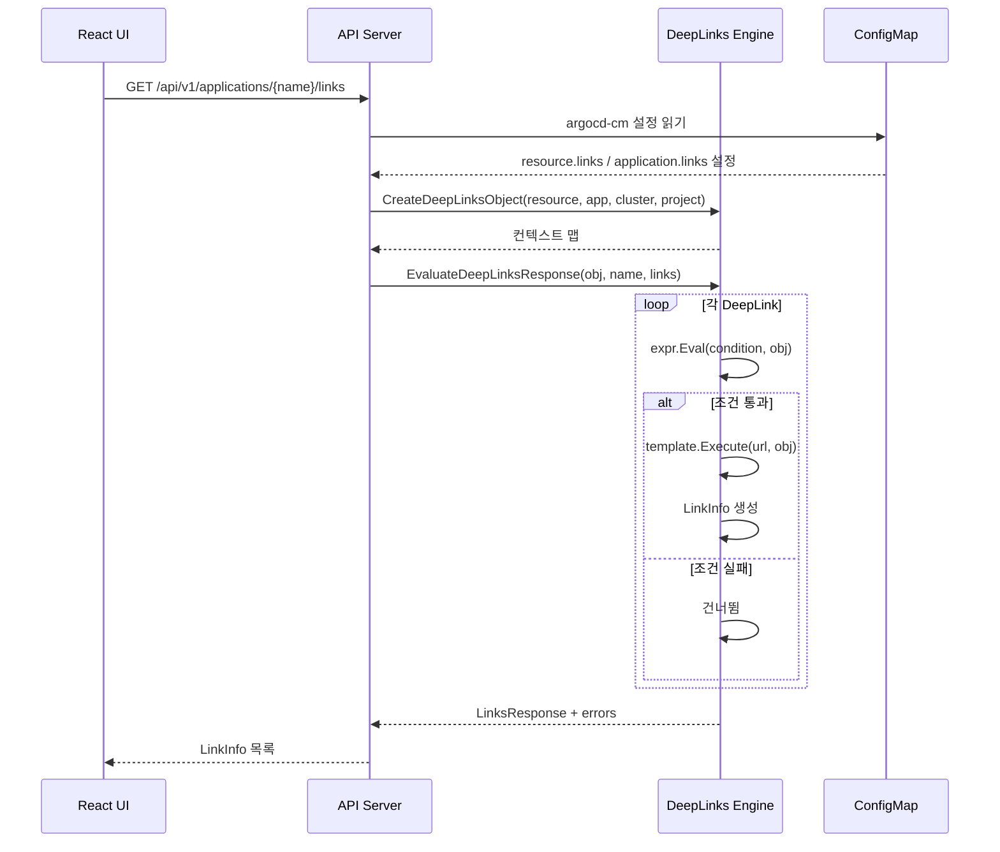
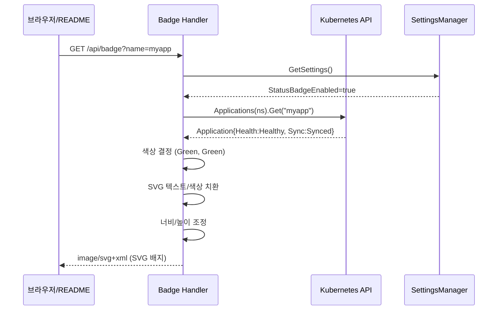

# Deep Links 및 Badge Server Deep-Dive

> Argo CD의 UI 보조 서브시스템: 외부 시스템 링크 자동 생성(Deep Links)과 CI/CD 상태 배지(Badge Server)

---

## 1. 개요

Argo CD는 GitOps 워크플로의 가시성을 높이기 위해 두 가지 UI 보조 서브시스템을 제공한다.

**Deep Links**: Application, Resource, Cluster, Project 컨텍스트 정보를 활용하여 외부 시스템(Grafana, Datadog, Splunk 등)으로의 동적 링크를 자동 생성한다. 운영자가 Argo CD UI에서 한 클릭으로 관련 모니터링/로깅 대시보드에 접근할 수 있게 한다.

**Badge Server**: Application의 Health/Sync 상태를 SVG 이미지로 표현하여, README.md나 위키 등 외부 문서에 실시간 상태 배지를 삽입할 수 있게 한다. Shields.io 스타일의 배지를 자체 생성한다.

```
┌─────────────────────────────────────────────────────────────┐
│                     Argo CD Server                           │
│                                                              │
│  ┌──────────────────────┐    ┌──────────────────────────┐    │
│  │    Deep Links         │    │     Badge Server         │    │
│  │                       │    │                          │    │
│  │  ConfigMap 설정 읽기  │    │  GET /api/badge          │    │
│  │         ↓             │    │         ↓                │    │
│  │  조건식 평가 (expr)   │    │  App 상태 조회           │    │
│  │         ↓             │    │         ↓                │    │
│  │  URL 템플릿 렌더링    │    │  SVG 템플릿 조작         │    │
│  │  (Go template+Sprig) │    │  (정규식 치환)           │    │
│  │         ↓             │    │         ↓                │    │
│  │  UI에 링크 목록 반환  │    │  SVG 이미지 응답         │    │
│  └──────────────────────┘    └──────────────────────────┘    │
│                                                              │
│  UI (React SPA)                External Documents            │
│  - 앱 상세 → Deep Link 표시     - README.md 배지 임베드      │
│  - 리소스 상세 → 관련 링크      - Wiki 상태 표시              │
└─────────────────────────────────────────────────────────────┘
```

---

## 2. Deep Links 서브시스템

### 2.1 설계 목적

Deep Links는 **컨텍스트 인식 링크 생성** 문제를 해결한다. Argo CD가 관리하는 Application/Resource/Cluster/Project의 메타데이터를 활용하여, 해당 리소스와 관련된 외부 시스템의 정확한 URL을 동적으로 구성한다.

왜 Deep Links가 필요한가:
- **운영 효율성**: Application 장애 시 관련 모니터링 대시보드에 한 클릭으로 이동
- **컨텍스트 전달**: 앱 이름, 네임스페이스, 클러스터 정보를 URL 파라미터로 자동 삽입
- **조건부 표시**: 특정 조건(특정 프로젝트, 특정 라벨 등)에서만 링크 노출

### 2.2 소스 구조

```
server/deeplinks/
├── deeplinks.go          # 핵심 로직 (137줄)
└── deeplinks_test.go     # 테스트 (313줄)
```

소스 경로: `server/deeplinks/deeplinks.go`

### 2.3 핵심 데이터 구조

#### DeepLink 설정 (argocd-cm ConfigMap)

Deep Links는 `argocd-cm` ConfigMap의 설정에서 정의된다. `util/settings/` 패키지에서 `DeepLink` 구조체를 정의한다:

```
DeepLink 구조체
├── Title       string    # 링크 제목 (UI에 표시)
├── URL         string    # Go 템플릿 기반 URL 패턴
├── Condition   *string   # expr 언어 기반 조건식 (선택)
├── Description *string   # 링크 설명 (선택)
└── IconClass   *string   # UI 아이콘 CSS 클래스 (선택)
```

4가지 유형의 Deep Links가 존재한다:

| 키 | 컨텍스트 | ConfigMap 키 | 활용 예시 |
|-----|---------|------------|---------|
| `resource` | 개별 K8s 리소스 | `resource.links` | Pod → Kibana 로그 |
| `application`/`app` | Argo CD Application | `application.links` | App → Grafana 대시보드 |
| `cluster` | 대상 클러스터 | `cluster.links` | Cluster → 클라우드 콘솔 |
| `project` | AppProject | `project.links` | Project → 내부 위키 |

#### ClusterLinksData (보안 필터링)

클러스터 정보를 Deep Links에 노출할 때, 민감 정보(인증서, 토큰 등)를 제거하고 안전한 필드만 전달하기 위해 `ClusterLinksData` 구조체를 사용한다:

```
ClusterLinksData
├── Server       string              # API 서버 URL
├── Name         string              # 클러스터 이름
├── Namespaces   []string            # 접근 가능 네임스페이스
├── Shard        *int64              # 샤드 번호
├── Project      string              # 소속 프로젝트
├── Labels       map[string]string   # 라벨
└── Annotations  map[string]string   # 어노테이션
```

원본 `v1alpha1.Cluster` 구조체에는 `Config` 필드(TLS 인증서, Bearer Token 등)가 포함되어 있으나, `SanitizeCluster()` 함수가 이를 제거한 `ClusterLinksData`로 변환한다. 이것은 **보안 설계 원칙**의 좋은 예시다.

### 2.4 핵심 흐름 분석

#### 2.4.1 Deep Links 객체 생성: `CreateDeepLinksObject()`

```go
// server/deeplinks/deeplinks.go:65
func CreateDeepLinksObject(
    resourceObj *unstructured.Unstructured,
    app *unstructured.Unstructured,
    cluster *unstructured.Unstructured,
    project *unstructured.Unstructured,
) map[string]any
```

이 함수는 4개의 Kubernetes Unstructured 객체를 받아 Deep Links 평가에 사용할 컨텍스트 맵을 구성한다:

```
입력: resourceObj, app, cluster, project (Unstructured)
      ↓
컨텍스트 맵 구성:
{
    "resource":    resourceObj.Object,     // 개별 리소스 데이터
    "application": app.Object,             // 앱 데이터
    "app":         app.Object,             // 앱 데이터 (축약 별칭)
    "cluster":     cluster.Object,         // 클러스터 데이터
    "project":     project.Object,         // 프로젝트 데이터
    "managedByURL": "https://..."          // managed-by URL (있을 경우)
}
```

`app` 별칭(`AppDeepLinkShortKey = "app"`)은 사용자 편의를 위한 설계다. `application.metadata.name` 대신 `app.metadata.name`으로 짧게 쓸 수 있다.

**managedByURL 처리**: Application에 `argocd.argoproj.io/managed-by-url` 어노테이션이 있으면, 해당 URL을 `managedByURL` 키로 컨텍스트에 추가한다. 이는 멀티 Argo CD 인스턴스 환경에서 원본 인스턴스로의 링크를 제공하기 위한 것이다.

#### 2.4.2 Deep Links 평가: `EvaluateDeepLinksResponse()`

```go
// server/deeplinks/deeplinks.go:94
func EvaluateDeepLinksResponse(
    obj map[string]any,
    name string,
    links []settings.DeepLink,
) (*application.LinksResponse, []string)
```

이 함수가 실제 Deep Links 렌더링의 핵심이다. 처리 흐름:

```
각 DeepLink 설정에 대해:
│
├─ 1단계: 조건 평가 (선택적)
│   ├── link.Condition이 nil → 무조건 표시
│   ├── expr.Eval(condition, obj) 실행
│   │   ├── 결과가 bool true → 계속
│   │   ├── 결과가 bool false → 건너뜀
│   │   ├── 결과가 bool이 아닌 → 에러 로깅, 건너뜀
│   │   └── 평가 실패 → 에러 로깅, 건너뜀
│   └── 에러는 누적하되, 다른 링크 처리는 계속
│
├─ 2단계: URL 템플릿 렌더링
│   ├── template.New("deep-link").Funcs(sprigFuncMap).Parse(link.URL)
│   ├── t.Execute(&finalURL, obj) — 컨텍스트 데이터 주입
│   └── 실패 시 에러 로깅, 건너뜀
│
└─ 3단계: LinkInfo 생성
    └── {Title, URL, Description, IconClass} 구조체 반환
```

#### 2.4.3 보안: Sprig 함수 필터링

```go
// server/deeplinks/deeplinks.go:18
var sprigFuncMap = sprig.GenericFuncMap()

func init() {
    delete(sprigFuncMap, "env")
    delete(sprigFuncMap, "expandenv")
    delete(sprigFuncMap, "getHostByName")
}
```

**왜 이 함수들을 제거하는가?**
- `env`: 서버 환경변수 노출 → API 키, 비밀번호 유출 위험
- `expandenv`: 환경변수 참조 확장 → 동일 위험
- `getHostByName`: DNS 조회 → 서버 내부 네트워크 탐색 가능

이는 **서버 사이드 템플릿 인젝션(SSTI)** 방어의 일환이다. 사용자가 제공한 템플릿이 서버에서 실행되므로, 위험한 함수 접근을 차단해야 한다.

#### 2.4.4 조건식 엔진: expr

조건식 평가에 [expr](https://github.com/expr-lang/expr) 라이브러리를 사용한다. expr는 Go 네이티브 표현식 평가 엔진으로, 안전한 샌드박스 실행을 제공한다.

조건식 예시:
```
application.metadata.name == "my-app"
application.metadata.labels["team"] == "backend"
resource.metadata.namespace matches "prod-.*"
cluster.name in ["prod-east", "prod-west"]
```

### 2.5 설정 예시

```yaml
# argocd-cm ConfigMap
data:
  resource.links: |
    - url: https://grafana.example.com/d/pod?var-namespace={{.resource.metadata.namespace}}&var-pod={{.resource.metadata.name}}
      title: "Grafana Pod Dashboard"
      description: "Pod 메트릭 대시보드"
      icon.class: "fa fa-chart-line"
      condition: "resource.kind == \"Pod\""

  application.links: |
    - url: https://datadog.example.com/apm?env={{.application.spec.destination.namespace}}
      title: "Datadog APM"
      condition: "application.metadata.labels.monitoring == \"datadog\""

  cluster.links: |
    - url: https://console.cloud.google.com/kubernetes/clusters?project={{index .cluster.labels "gcp-project"}}
      title: "GCP Console"
      condition: "cluster.labels[\"provider\"] == \"gke\""
```

---

## 3. Badge Server 서브시스템

### 3.1 설계 목적

Badge Server는 Argo CD Application의 **Health/Sync 상태를 SVG 이미지로 제공**한다. 이 이미지는 GitHub README, Confluence 페이지, 내부 위키 등에 삽입하여 실시간 배포 상태를 외부에서 확인할 수 있게 한다.

왜 자체 Badge Server를 구현했는가:
- **보안**: Shields.io 등 외부 서비스에 API 토큰을 제공하지 않아도 됨
- **실시간성**: API 서버에서 직접 생성하므로 캐시 지연 없음
- **커스터마이징**: Argo CD 고유 상태(Health Status + Sync Status) 표현
- **프로젝트 집계**: 개별 앱뿐 아니라 프로젝트 단위 집계 배지 지원

### 3.2 소스 구조

```
server/badge/
├── badge.go          # HTTP 핸들러 + SVG 생성 (273줄)
├── badge_test.go     # 테스트
└── color.go          # 상태별 색상 매핑 (39줄)
```

### 3.3 아키텍처

```
┌─────────────────────────────────────────────────────────────┐
│                    Badge Server Handler                       │
│                                                              │
│  GET /api/badge?name=myapp&revision=true&showAppName=true    │
│                         │                                    │
│          ┌──────────────┤                                    │
│          ▼              ▼                                    │
│  ┌─────────────┐  ┌─────────────┐                           │
│  │ Settings    │  │ Kubernetes  │                           │
│  │ Manager     │  │ API Server  │                           │
│  │             │  │             │                           │
│  │ Badge       │  │ Get App    │                           │
│  │ Enabled?    │  │ Status     │                           │
│  └──────┬──────┘  └──────┬──────┘                           │
│         │                │                                   │
│         ▼                ▼                                   │
│  ┌──────────────────────────┐                               │
│  │    SVG 생성 파이프라인    │                               │
│  │                          │                               │
│  │  1. 기본 SVG 템플릿 로드  │                               │
│  │  2. 상태 색상 결정        │                               │
│  │  3. 텍스트 치환           │                               │
│  │  4. 리비전 표시 (선택)    │                               │
│  │  5. 앱 이름 표시 (선택)   │                               │
│  │  6. 너비 조정             │                               │
│  └──────────┬───────────────┘                               │
│             ▼                                                │
│  Content-Type: image/svg+xml                                 │
│  Cache-Control: private, no-store                            │
│  Access-Control-Allow-Origin: *                              │
└─────────────────────────────────────────────────────────────┘
```

### 3.4 색상 매핑 시스템

`color.go`에서 Health/Sync 상태별 색상을 `image/color.RGBA`로 정의한다:

#### Health Status 색상

| 상태 | 색상 | RGB | 의미 |
|------|------|-----|------|
| Healthy | Green | (11, 97, 42) | 정상 동작 중 |
| Progressing | Blue | (16, 61, 102) | 배포 진행 중 |
| Degraded | Red | (167, 46, 38) | 장애 발생 |
| Suspended | Grey | (41, 52, 61) | 일시 중단 |
| Missing | Purple | (115, 31, 77) | 리소스 누락 |
| Unknown | Purple | (115, 31, 77) | 상태 불명 |

#### Sync Status 색상

| 상태 | 색상 | RGB | 의미 |
|------|------|-----|------|
| Synced | Green | (11, 97, 42) | Git과 동기화됨 |
| OutOfSync | Orange | (189, 115, 0) | Git과 불일치 |
| Unknown | Purple | (115, 31, 77) | 동기화 상태 불명 |

### 3.5 SVG 생성 파이프라인 상세

Badge Server의 핵심은 **정규식 기반 SVG 조작**이다. 사전 정의된 SVG 템플릿(`util/assets/BadgeSVG`)의 특정 요소를 정규식으로 찾아 치환한다.

#### 정규식 패턴 (19개)

```
카테고리별 패턴 구성:
│
├── 너비 조절 (3개)
│   ├── svgWidthPattern         — SVG 전체 너비
│   ├── rightRectWidthPattern   — 우측 영역 너비
│   └── revisionRectWidthPattern — 리비전 영역 너비
│
├── 색상 지정 (3개)
│   ├── leftRectColorPattern    — Health 색상 (좌측)
│   ├── rightRectColorPattern   — Sync 색상 (우측)
│   └── revisionRectColorPattern — 리비전 색상
│
├── 텍스트 삽입 (4개)
│   ├── leftTextPattern         — Health 텍스트
│   ├── rightTextPattern        — Sync 텍스트
│   ├── revisionTextPattern     — 리비전 해시
│   └── titleTextPattern        — 앱 이름
│
├── Y좌표 조절 (6개: Rect 3개 + Text 3개)
│   └── 앱 이름 표시 시 요소 위치 조정
│
├── X좌표 조절 (1개)
│   └── revisionTextXCoodPattern — 리비전 텍스트 가로 위치
│
├── 높이 조절 (1개)
│   └── svgHeightPattern — SVG 전체 높이
│
└── 기타 (1개)
    └── displayNonePattern — 리비전 영역 표시 토글
```

#### 너비 상수

```go
const (
    svgWidthWithRevision      = 192   // 리비전(7자) 포함 시
    svgWidthWithFullRevision  = 400   // 전체 리비전 해시 포함 시
    svgWidthWithoutRevision   = 131   // 리비전 미포함 (기본)
    svgHeightWithAppName      = 40    // 앱 이름 표시 시 높이
    badgeRowHeight            = 20    // 상태 행 높이
    leftRectWidth             = 77    // Health 영역 고정 너비
    widthPerChar              = 6     // 앱 이름 글자당 너비
    textPositionWidthPerChar  = 62    // 텍스트 위치 계산용
)
```

### 3.6 HTTP 핸들러 처리 흐름

`ServeHTTP()` 함수의 처리 단계:

```
1. 설정 확인
   ├── settingsMgr.GetSettings()
   └── sets.StatusBadgeEnabled 확인 → false면 Unknown 상태

2. 네임스페이스 검증
   ├── ?namespace= 파라미터 확인
   ├── IsValidNamespaceName() 검증
   └── IsNamespaceEnabled() 허용 네임스페이스 확인

3. Application/Project 조회
   ├── ?name= → 개별 앱 조회
   │   ├── appClientset.Applications(ns).Get()
   │   ├── Health, Sync 상태 추출
   │   └── SyncResult에서 Revision 추출
   │
   └── ?project= → 프로젝트 단위 집계
       ├── Applications(ns).List() → FilterByProjects()
       ├── 하나라도 OutOfSync → 전체 OutOfSync
       ├── 하나라도 Unhealthy → 전체 Degraded
       └── 모두 정상 → Healthy + Synced

4. 옵션 처리
   ├── ?revision=true → 리비전 해시 표시
   ├── ?keepFullRevision=true → 전체 해시 표시 (기본 7자)
   ├── ?width=N → 커스텀 너비
   └── ?showAppName=true → 앱 이름 행 추가

5. SVG 생성
   ├── 색상 적용 (leftRect, rightRect, revisionRect)
   ├── 텍스트 삽입 (Health, Sync, Revision, AppName)
   ├── 너비/높이 조정
   └── 좌표 재계산

6. HTTP 응답
   ├── Content-Type: image/svg+xml
   ├── Cache-Control: private, no-store
   ├── Access-Control-Allow-Origin: * (CORS)
   └── 200 OK + SVG 바디
```

### 3.7 프로젝트 집계 로직

프로젝트 배지는 **비관적 집계(Pessimistic Aggregation)** 전략을 사용한다:

```
프로젝트 내 앱 N개:
│
├── Health 판단:
│   ├── 하나라도 Healthy가 아닌 앱 존재 → Degraded (전체)
│   ├── 모두 Healthy + 앱 1개 이상 → Healthy (전체)
│   └── 앱 0개 → Unknown
│
└── Sync 판단:
    ├── 하나라도 Synced가 아닌 앱 존재 → OutOfSync (전체)
    ├── 모두 Synced + 앱 1개 이상 → Synced (전체)
    └── 앱 0개 → Unknown
```

이 "하나라도 문제가 있으면 전체가 문제" 방식은 운영자가 프로젝트 단위로 빠르게 이상을 감지하기 위한 설계다.

### 3.8 리비전 표시 로직

```go
// Multi-Source 앱 지원
if len(app.Status.OperationState.SyncResult.Revisions) > 0 {
    revision = app.Status.OperationState.SyncResult.Revisions[0]
} else {
    revision = app.Status.OperationState.SyncResult.Revision
}
```

Multi-Source Application의 경우 `Revisions` (복수형) 필드를 먼저 확인한다. 여러 소스가 있을 때 첫 번째 소스의 리비전만 표시하는 것은 배지 공간의 제약 때문이다.

리비전 해시 처리:
- 기본: 7자 축약 (`abc1234`) → 너비 192px
- `keepFullRevision=true`: 전체 해시 → 너비 400px

### 3.9 보안 설계

1. **활성화 제어**: `StatusBadgeEnabled` 설정으로 배지 기능 자체를 비활성화할 수 있음
2. **네임스페이스 제한**: `enabledNamespaces`로 접근 가능한 네임스페이스를 제한
3. **입력 검증**: `IsValidAppName()`, `IsValidNamespaceName()`, `NameIsDNSLabel()` 등 입력값 검증
4. **캐시 방지**: `Cache-Control: private, no-store`로 배지가 캐시되어 오래된 상태를 보여주는 것을 방지
5. **인증 없음**: 배지 엔드포인트는 인증 없이 접근 가능 → 상태 정보만 노출되므로 의도적 설계

### 3.10 사용 예시

```markdown
<!-- README.md에서 -->
[](https://argocd.example.com/applications/my-app)

<!-- 프로젝트 단위 -->
[](https://argocd.example.com/applications?proj=production)

<!-- 앱 이름 포함 -->

```

---

## 4. 두 서브시스템의 공통 설계 패턴

### 4.1 Unstructured 사용 이유

Deep Links와 Badge 모두 `unstructured.Unstructured`를 사용하여 리소스 데이터를 처리한다. 이는:

1. **유연성**: 모든 K8s 리소스를 동일한 방식으로 처리
2. **확장성**: 사용자 정의 필드에도 접근 가능
3. **타입 독립성**: 구조체 변경에 영향받지 않음

Deep Links에서는 이를 활용하여 Application의 `metadata.labels`, `spec.destination` 등 임의 필드에 대한 조건식/템플릿 평가가 가능하다.

### 4.2 Settings Manager 의존

두 서브시스템 모두 `settings.SettingsManager`에 의존한다:
- Deep Links: `argocd-cm`의 `*.links` 키에서 링크 설정 읽기
- Badge: `StatusBadgeEnabled` 설정으로 기능 활성화 여부 확인

이는 Argo CD의 **ConfigMap 기반 설정 관리** 패턴을 따르는 것으로, 서버 재시작 없이 설정 변경이 가능하다.

### 4.3 에러 처리 전략

Deep Links: **부분 실패 허용(Partial Failure Tolerance)**
- 한 링크 평가 실패 시 에러를 누적하되, 나머지 링크 처리는 계속
- 사용자에게는 성공한 링크만 표시, 에러는 로그로 기록

Badge: **Graceful Degradation**
- App 조회 실패 → "Not Found" 배지 표시
- 설정 비활성화 → Unknown 상태 배지 표시
- 절대 에러 응답을 반환하지 않고, 항상 유효한 SVG를 반환

---

## 5. Deep Links 평가 엔진 구현 상세

### 5.1 expr vs Go 표현식

Argo CD는 조건식 평가에 **CEL(Common Expression Language)** 대신 **expr** 라이브러리를 선택했다. 이유:

| 항목 | expr | CEL |
|------|------|-----|
| 의존성 크기 | 작음 | 큼 (Google 의존성) |
| 학습 곡선 | 낮음 (Go와 유사) | 중간 |
| 성능 | 빠름 | 빠름 |
| 타입 안전성 | 동적 | 정적 |

expr는 `map[string]any` 타입의 컨텍스트에서 경로 기반 접근(`application.metadata.name`)과 비교 연산(`==`, `matches`, `in`)을 지원한다.

### 5.2 Sprig 템플릿 함수

Go의 표준 `text/template`에 [Sprig](https://github.com/Masterminds/sprig) 함수를 추가하여, URL 구성 시 풍부한 문자열 조작이 가능하다:

자주 사용되는 Sprig 함수:
- `replace`: 문자열 치환 (`{{ .cluster.name | replace "-" "_" }}`)
- `first`/`last`: 리스트 첫/마지막 요소
- `default`: 기본값 지정
- `trimPrefix`/`trimSuffix`: 접두사/접미사 제거
- `urlquery`: URL 인코딩
- `base64Encode`: Base64 인코딩

### 5.3 에러 유형별 처리

```
에러 유형                          │ 처리 방식
───────────────────────────────────┤──────────────────
조건식 평가 실패 (구문 오류)        │ 에러 로깅 + 해당 링크 건너뜀
조건식 결과가 bool이 아닌 값       │ 에러 로깅 + 해당 링크 건너뜀
URL 템플릿 파싱 실패               │ 에러 로깅 + 해당 링크 건너뜀
URL 템플릿 실행 실패               │ 에러 로깅 + 해당 링크 건너뜀
조건식 결과가 false                │ 정상 흐름 — 해당 링크 제외
```

에러 메시지는 리소스 이름과 함께 기록되어, 어떤 앱/리소스에서 문제가 발생했는지 추적 가능하다.

---

## 6. Badge SVG 레이아웃 구조

```
기본 배지 (리비전 없음, 앱이름 없음):
┌───────────────────────────────────────────────────┐
│  width: 131px, height: 20px                       │
│  ┌──────────────────┬─────────────────────────┐   │
│  │  leftRect (77px) │  rightRect (54px)       │   │
│  │  Health 색상     │  Sync 색상              │   │
│  │  "Healthy"       │  "Synced"               │   │
│  └──────────────────┴─────────────────────────┘   │
└───────────────────────────────────────────────────┘

리비전 포함 배지:
┌────────────────────────────────────────────────────────────┐
│  width: 192px, height: 20px                                │
│  ┌──────────┬──────────────┬──────────────────────────┐   │
│  │ leftRect │  rightRect   │  revisionRect            │   │
│  │ Health   │  Sync        │  "(abc1234)"             │   │
│  └──────────┴──────────────┴──────────────────────────┘   │
└────────────────────────────────────────────────────────────┘

앱 이름 포함 배지:
┌────────────────────────────────────────────────────────────┐
│  width: max(앱이름*6, 131)px, height: 40px                 │
│  ┌────────────────────────────────────────────────────┐   │
│  │  titleRect (전체 너비)                              │   │
│  │  "my-application"                                   │   │
│  ├──────────┬──────────────────────────────────────────┤   │
│  │ leftRect │  rightRect                               │   │
│  │ Health   │  Sync                                    │   │
│  └──────────┴──────────────────────────────────────────┘   │
└────────────────────────────────────────────────────────────┘
```

### 6.1 replaceFirstGroupSubMatch 함수

```go
// 정규식의 첫 번째 캡처 그룹만 교체하는 유틸리티
func replaceFirstGroupSubMatch(re *regexp.Regexp, str string, repl string) string
```

이 함수는 Go 표준 정규식의 한계를 극복하기 위한 것이다. Go의 `regexp.ReplaceAllString`은 매치 전체를 교체하지만, 이 함수는 **첫 번째 캡처 그룹만** 교체한다. SVG에서 특정 속성 값만 변경할 때 유용하다.

예시:
```
패턴: id="leftText" [^>]*>([^<]*)
원본: id="leftText" x="100" y="15">Unknown
결과: id="leftText" x="100" y="15">Healthy
                                    ^^^^^^^ 이 부분만 교체
```

---

## 7. 운영 가이드

### 7.1 Deep Links 트러블슈팅

```yaml
# 문제: 링크가 표시되지 않음
# 진단 순서:
# 1. ConfigMap 설정 확인
kubectl get cm argocd-cm -n argocd -o yaml | grep -A 20 "links"

# 2. 조건식 검증 (expr playground에서)
# application.metadata.name == "my-app"

# 3. 서버 로그에서 에러 확인
kubectl logs -l app.kubernetes.io/component=server -n argocd | grep "deep-link"
```

### 7.2 Badge 설정

```yaml
# argocd-cm ConfigMap
data:
  statusbadge.enabled: "true"  # 배지 기능 활성화
```

---

## 8. Mermaid 시퀀스 다이어그램

### 8.1 Deep Links 평가 흐름



### 8.2 Badge 생성 흐름



---

## 9. 설계 결정의 "왜"

### Q1: 왜 SVG를 정규식으로 조작하는가? DOM 파서를 쓰면 되지 않나?

A: 성능과 간결성 때문이다. Badge는 모든 HTTP 요청에 대해 동적으로 생성되며, 캐시하지 않는다. SVG 파서를 사용하면 파싱-수정-직렬화 오버헤드가 발생한다. 정규식 치환은 단순 문자열 연산이므로 매우 빠르다. 또한 SVG 템플릿이 고정되어 있으므로 정규식이 안정적으로 동작한다.

### Q2: 왜 Badge는 인증 없이 접근 가능한가?

A: README 배지는 공개 문서에 삽입되므로, 인증을 요구하면 이미지가 표시되지 않는다. 노출되는 정보는 앱 이름과 상태뿐이므로 보안 위험이 낮다. 다만 `StatusBadgeEnabled` 설정으로 기능 자체를 비활성화할 수 있다.

### Q3: 왜 Deep Links에서 Sprig 함수의 일부를 삭제하는가?

A: Deep Links 설정은 클러스터 관리자가 ConfigMap에 작성한다. 하지만 설정이 잘못되거나 악의적으로 조작될 경우, 서버 환경변수(`env`), DNS 조회(`getHostByName`) 등을 통해 민감 정보가 노출될 수 있다. 이는 서버 사이드 템플릿 인젝션(SSTI) 공격 벡터를 차단하기 위한 방어적 설계이다.

### Q4: 왜 Deep Links는 4가지 스코프(resource, app, cluster, project)를 지원하는가?

A: 각 스코프는 Argo CD UI의 서로 다른 뷰에 대응한다:
- resource: 리소스 상세 뷰 → Pod별 로그, 메트릭 대시보드
- application: 앱 상세 뷰 → CI/CD 파이프라인, APM
- cluster: 클러스터 목록/상세 → 클라우드 콘솔, 인프라 모니터링
- project: 프로젝트 상세 → 팀 위키, 지라 보드

각 뷰에서 접근 가능한 데이터가 다르므로, 스코프별로 다른 컨텍스트를 제공해야 적절한 링크를 구성할 수 있다.

---

## 10. 성능 고려사항

### Deep Links
- **Sprig 함수 맵 싱글톤**: `sprigFuncMap`은 패키지 레벨 변수로 한 번만 생성
- **조건식 미설정 시 빠른 경로**: `link.Condition == nil`이면 expr 평가 건너뜀
- **부분 실패 허용**: 한 링크 실패가 전체 응답을 차단하지 않음

### Badge
- **캐시 없음**: `Cache-Control: private, no-store` — 항상 최신 상태 반영
- **CORS 허용**: `Access-Control-Allow-Origin: *` — 크로스 도메인 삽입 가능
- **정규식 사전 컴파일**: 모든 정규식이 패키지 레벨 `var`로 한 번만 컴파일

---

## 11. 관련 소스 파일 요약

| 파일 | 줄수 | 역할 |
|------|------|------|
| `server/deeplinks/deeplinks.go` | 137 | Deep Links 핵심 로직 |
| `server/deeplinks/deeplinks_test.go` | 313 | Deep Links 테스트 |
| `server/badge/badge.go` | 273 | Badge HTTP 핸들러 |
| `server/badge/color.go` | 39 | 상태별 색상 매핑 |
| `server/badge/badge_test.go` | - | Badge 테스트 |
| `util/settings/settings.go` | - | DeepLink 설정 구조체 |
| `util/assets/` | - | BadgeSVG 템플릿 |

---

## 12. 정리

Deep Links와 Badge Server는 Argo CD의 **관측 가능성(Observability) 확장** 서브시스템이다. 둘 다 핵심 GitOps 로직에는 관여하지 않지만, 운영 효율성과 가시성을 크게 향상시킨다.

Deep Links는 **조건부 동적 URL 생성** 패턴을 보여주며, expr + Sprig 조합은 보안과 유연성을 동시에 달성한다. Badge Server는 **SVG 동적 생성** 패턴을 보여주며, 정규식 기반 접근은 성능과 간결성의 좋은 균형점이다.

두 서브시스템 모두 Argo CD의 설정 기반 확장 철학을 따르며, ConfigMap 변경만으로 기능을 커스터마이징할 수 있다.
