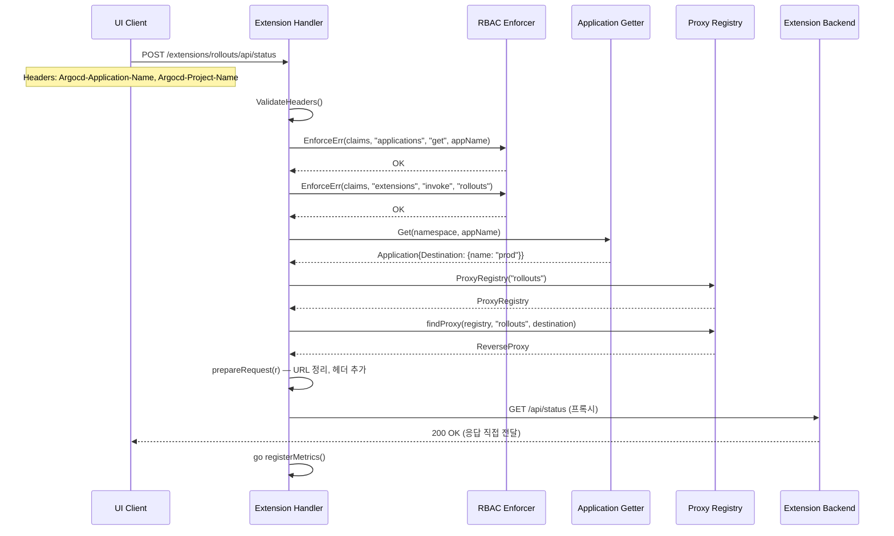
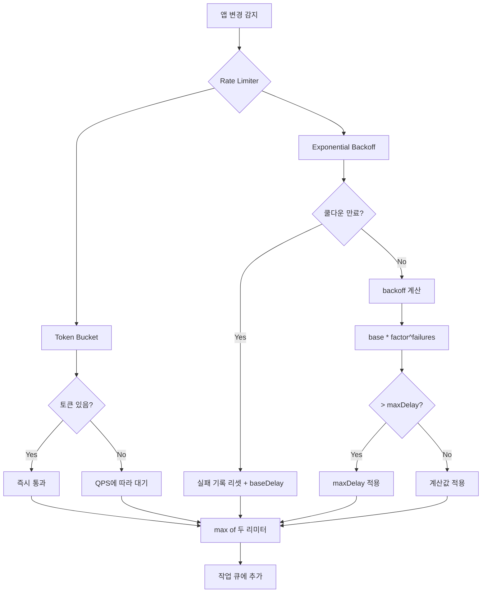

# Server Extensions 및 Rate Limiter Deep-Dive

> Argo CD API 서버의 확장성과 안정성: 서드파티 UI 확장 프록시(Extensions)와 요청 속도 제한(Rate Limiter)

---

## 1. 개요

Argo CD는 API 서버의 확장성과 안정성을 위해 두 가지 서브시스템을 제공한다.

**Server Extensions**: 서드파티 백엔드 서비스를 Argo CD UI에 통합할 수 있는 프록시 메커니즘이다. 확장 개발자는 별도의 백엔드 서비스를 배포하고, Argo CD가 해당 서비스로 요청을 프록시한다. RBAC, 인증, 클러스터 라우팅을 Argo CD가 처리하므로, 확장 서비스는 비즈니스 로직에만 집중할 수 있다.

**Rate Limiter**: Application Controller의 작업 큐(work queue)에 대한 속도 제한을 제공한다. 토큰 버킷(Token Bucket)과 지수 백오프(Exponential Backoff with Auto Reset)를 조합하여, 대규모 클러스터에서의 과부하를 방지한다.

```
┌─────────────────────────────────────────────────────────────┐
│                    Argo CD API Server                         │
│                                                              │
│  ┌────────────────────────────┐  ┌────────────────────────┐  │
│  │    Server Extensions       │  │      Rate Limiter       │  │
│  │                            │  │                         │  │
│  │  /extensions/{name}/*      │  │  Application Controller │  │
│  │         │                  │  │  Work Queue 속도 제한    │  │
│  │    ┌────┴────┐             │  │                         │  │
│  │    │ RBAC    │             │  │  ┌──────────┐           │  │
│  │    │ 인증    │             │  │  │Token     │           │  │
│  │    │ 프록시  │             │  │  │Bucket    │           │  │
│  │    └────┬────┘             │  │  │+ Exp     │           │  │
│  │         │                  │  │  │Backoff   │           │  │
│  │  ┌──────▼──────┐          │  │  └──────────┘           │  │
│  │  │ Backend     │          │  │                         │  │
│  │  │ Service(s)  │          │  │  BucketQPS + BucketSize │  │
│  │  └─────────────┘          │  │  BaseDelay + MaxDelay   │  │
│  └────────────────────────────┘  └────────────────────────┘  │
└─────────────────────────────────────────────────────────────┘
```

---

## 2. Server Extensions 서브시스템

### 2.1 설계 목적

Server Extensions는 **Argo CD의 확장 생태계**를 가능하게 하는 인프라다. 대표적인 사용 사례:

1. **Rollout Dashboard**: Argo Rollouts의 카나리/블루그린 진행 상태를 Argo CD UI에 표시
2. **비용 분석**: Kubecost 등 비용 도구의 앱별 비용을 Argo CD UI에 통합
3. **보안 스캔**: 취약점 스캐너 결과를 앱 상세 페이지에 표시
4. **커스텀 대시보드**: 조직 고유의 운영 데이터를 Argo CD UI에 통합

왜 Extensions가 필요한가:
- **인증 통합**: 확장 서비스가 별도 인증 시스템을 구축할 필요 없음
- **RBAC 통합**: Argo CD의 기존 RBAC 정책을 확장에 그대로 적용
- **멀티 클러스터 라우팅**: 앱의 대상 클러스터에 따라 올바른 백엔드로 요청 전달
- **보안**: Authorization/Cookie 헤더를 제거하고, 안전한 프록시 수행

### 2.2 소스 구조

```
server/extension/
├── extension.go          # 핵심 로직 (858줄)
├── extension_test.go     # 테스트
└── mocks/                # 테스트용 mock
```

소스 경로: `server/extension/extension.go`

### 2.3 핵심 데이터 구조

#### Manager

Extensions 서브시스템의 중앙 관리자:

```
Manager
├── log          *log.Entry              # 로깅
├── namespace    string                  # Argo CD 네임스페이스
├── settings     SettingsGetter          # argocd-cm 설정 읽기
├── application  ApplicationGetter       # 앱 리소스 조회
├── project      ProjectGetter           # 프로젝트 정보 조회
├── cluster      argo.ClusterGetter      # 클러스터 정보 조회
├── rbac         RbacEnforcer            # RBAC 권한 검증
├── registry     ExtensionRegistry       # 프록시 레지스트리
├── metricsReg   ExtensionMetricsRegistry# 메트릭 수집
└── userGetter   UserGetter              # 사용자 정보 조회
```

#### ExtensionRegistry (이중 맵 구조)

```
ExtensionRegistry: map[string]ProxyRegistry
│
├── "rollouts" → ProxyRegistry: map[ProxyKey]*httputil.ReverseProxy
│   ├── {ext:"rollouts", cluster:"", server:""} → proxy1 (단일 백엔드)
│   └── ... (멀티 백엔드 시 클러스터별 프록시)
│
├── "costanalyzer" → ProxyRegistry
│   ├── {ext:"costanalyzer", cluster:"prod-east", server:""} → proxy2
│   ├── {ext:"costanalyzer", cluster:"prod-west", server:""} → proxy3
│   └── {ext:"costanalyzer", cluster:"prod-east", server:"https://..."} → proxy4
│
└── "security-scanner" → ProxyRegistry
    └── ...
```

왜 이중 맵인가:
- **1차 키(ExtensionRegistry)**: 확장 이름 → 빠른 확장 조회
- **2차 키(ProxyRegistry)**: 클러스터 정보 → 멀티 클러스터 환경에서 올바른 백엔드 선택

#### ProxyKey

```go
type ProxyKey struct {
    extensionName string   // 확장 이름
    clusterName   string   // 클러스터 이름 (선택)
    clusterServer string   // 클러스터 서버 URL (선택)
}
```

단일 백엔드 확장: `ProxyKey{"rollouts", "", ""}` — 클러스터 무관
멀티 백엔드 확장: `ProxyKey{"cost", "prod-east", "https://api.east.example.com"}` — 클러스터별 구분

#### ExtensionConfig (argocd-cm에서 읽는 설정)

```
ExtensionConfigs
└── Extensions []ExtensionConfig
    ├── Name    string        # 확장 이름 (URL 경로에 사용)
    └── Backend BackendConfig
        ├── ProxyConfig       # 프록시 연결 설정
        │   ├── ConnectionTimeout     (기본 2초)
        │   ├── KeepAlive             (기본 15초)
        │   ├── IdleConnectionTimeout (기본 60초)
        │   └── MaxIdleConnections    (기본 30)
        └── Services []ServiceConfig
            ├── URL       string          # 백엔드 서비스 URL
            ├── Cluster   *ClusterConfig  # 클러스터 매핑 (선택)
            │   ├── Server string
            │   └── Name   string
            └── Headers []Header          # 커스텀 헤더
                ├── Name  string
                └── Value string          # $secret.key 참조 가능
```

### 2.4 확장 등록 흐름

```
서버 시작 → RegisterExtensions()
│
├─ 1단계: 설정 로드
│   └── settings.Get() → ArgoCDSettings
│
├─ 2단계: 설정 파싱 및 검증
│   └── parseAndValidateConfig(settings)
│       ├── YAML 파싱
│       ├── Secret 참조 해석 (ReplaceMapSecrets)
│       └── validateConfigs()
│           ├── 이름 검증: ^[A-Za-z0-9-_]+$
│           ├── 중복 이름 검사
│           ├── 최소 1개 서비스 필수
│           ├── URL 필수
│           ├── 다중 서비스 시 cluster 필수
│           └── 헤더 name/value 필수
│
├─ 3단계: 프록시 생성
│   └── 각 확장 × 각 서비스 조합마다:
│       ├── NewProxy(url, headers, config) → httputil.ReverseProxy
│       └── appendProxy(registry, extName, service, proxy, singleBackend)
│           ├── 단일 백엔드: key = {extName, "", ""}
│           └── 멀티 백엔드: key = {extName, cluster.Name, cluster.Server}
│               (최대 3개 키 조합으로 등록)
│
└─ 4단계: 레지스트리 업데이트
    └── m.registry = extReg
```

### 2.5 요청 처리 흐름: CallExtension()

```
클라이언트 요청: POST /extensions/rollouts/api/rollout/status
│
├─ 1단계: URL 파싱
│   ├── segments = ["extensions", "rollouts", "api", "rollout", "status"]
│   └── extName = "rollouts"
│
├─ 2단계: 헤더 검증 (ValidateHeaders)
│   ├── Argocd-Application-Name: "argocd:my-app" → {ns:"argocd", name:"my-app"}
│   ├── Argocd-Project-Name: "default"
│   └── 입력값 검증 (IsValidAppName, IsValidProjectName 등)
│
├─ 3단계: 권한 확인 (authorize)
│   ├── RBAC: applications/get → 앱 읽기 권한 확인
│   ├── RBAC: extensions/invoke → 확장 호출 권한 확인
│   ├── Application 조회 → 프로젝트 일치 확인
│   ├── Project 조회 → 대상 클러스터 접근 허용 확인
│   └── IsDestinationPermitted() → 클러스터 화이트리스트 확인
│
├─ 4단계: 프록시 조회
│   ├── m.ProxyRegistry("rollouts") → ProxyRegistry 획득
│   └── findProxy(registry, "rollouts", app.Spec.Destination)
│       ├── 시도 1: key{extName, "", ""} (단일 백엔드)
│       └── 시도 2: key{extName, dest.Name, dest.Server} (멀티 백엔드)
│
├─ 5단계: 요청 준비 (prepareRequest)
│   ├── URL 경로에서 /extensions/rollouts 접두사 제거
│   │   → /api/rollout/status
│   ├── 헤더 추가:
│   │   ├── Argocd-Namespace: "argocd"
│   │   ├── Argocd-Target-Cluster-Name: "prod"
│   │   ├── Argocd-Target-Cluster-URL: "https://..."
│   │   ├── Argocd-User-Id: "admin"
│   │   ├── Argocd-Username: "admin"
│   │   └── Argocd-User-Groups: "admin,devops"
│   └── 민감 헤더 제거 (Authorization, Cookie)
│
├─ 6단계: 프록시 실행
│   └── httpsnoop.CaptureMetrics(proxy, w, r)
│       ├── proxy.ServeHTTP(w, r) — 실제 프록시
│       └── metrics 캡처 (status code, duration)
│
└─ 7단계: 메트릭 기록 (비동기)
    └── go registerMetrics(extName, metrics, metricsReg)
        ├── IncExtensionRequestCounter(extName, statusCode)
        └── ObserveExtensionRequestDuration(extName, duration)
```

### 2.6 프록시 구현 상세

#### NewProxy()

```go
func NewProxy(targetURL string, headers []Header, config ProxyConfig) (*httputil.ReverseProxy, error)
```

표준 라이브러리의 `httputil.ReverseProxy`를 사용하되, `Director` 함수를 커스터마이징한다:

```
Director 함수가 하는 일:
├── req.Host = targetURL.Host         # Host 헤더 교체
├── req.URL.Scheme = targetURL.Scheme # 스킴 교체
├── req.URL.Host = targetURL.Host     # 호스트 교체
├── req.Header.Set("Host", ...)       # Host 헤더 명시
├── req.Header.Del("Authorization")   # 인증 헤더 제거 ← 보안
├── req.Header.Del("Cookie")          # 쿠키 제거 ← 보안
└── 커스텀 헤더 추가 (서비스 설정에서)
```

Authorization/Cookie 제거 이유: Argo CD의 JWT 토큰이나 세션 쿠키가 외부 백엔드 서비스에 전달되면 보안 위험이 발생한다. 대신 Argo CD가 인증을 수행한 후, 사용자 정보를 별도 헤더(`Argocd-Username` 등)로 전달한다.

#### Transport 설정

```go
func newTransport(config ProxyConfig) *http.Transport {
    return &http.Transport{
        DialContext: (&net.Dialer{
            Timeout:   config.ConnectionTimeout,   // 기본 2초
            KeepAlive: config.KeepAlive,            // 기본 15초
        }).DialContext,
        MaxIdleConns:          config.MaxIdleConnections,    // 기본 30
        IdleConnTimeout:       config.IdleConnectionTimeout, // 기본 60초
        TLSHandshakeTimeout:   10 * time.Second,             // 고정
        ExpectContinueTimeout: 1 * time.Second,              // 고정
    }
}
```

### 2.7 멀티 백엔드 라우팅

멀티 클러스터 환경에서는 확장 하나에 여러 백엔드 서비스가 필요하다:

```
예시: 비용 분석 확장이 3개 클러스터에 각각 배포됨

설정:
extensions:
  - name: costanalyzer
    backend:
      services:
        - url: http://cost-east:8080
          cluster:
            name: prod-east
        - url: http://cost-west:8080
          cluster:
            name: prod-west
        - url: http://cost-central:8080
          cluster:
            server: https://api.central.example.com

요청 라우팅:
├── App destination = {name: "prod-east"} → http://cost-east:8080
├── App destination = {name: "prod-west"} → http://cost-west:8080
└── App destination = {server: "https://api.central.example.com"} → http://cost-central:8080
```

`appendProxy()` 함수는 멀티 백엔드 시 최대 3개의 키 조합을 등록한다:
1. `{extName, clusterName, ""}` — 이름으로만 조회
2. `{extName, "", clusterServer}` — 서버 URL로만 조회
3. `{extName, clusterName, clusterServer}` — 둘 다로 조회

### 2.8 RBAC 통합

Extensions는 Argo CD RBAC에 `extensions` 리소스 타입과 `invoke` 액션을 추가한다:

```
RBAC 정책 예시:
p, role:extension-user, extensions, invoke, rollouts, allow
p, role:extension-user, extensions, invoke, costanalyzer, allow
p, role:readonly, extensions, invoke, *, deny
```

확장 호출 시 2단계 권한 검증:
1. **앱 읽기 권한**: `applications/get` — 요청한 앱에 대한 읽기 권한
2. **확장 호출 권한**: `extensions/invoke` — 해당 확장에 대한 호출 권한

### 2.9 Secret 참조

서비스 헤더 값에서 Secret 참조를 지원한다:

```yaml
headers:
  - name: Authorization
    value: '$backend.api.key'   # $ 접두사 → argocd-secret에서 조회
```

`ReplaceMapSecrets()` 함수가 `$` 접두사 값을 `argocd-secret`의 해당 키 값으로 치환한다. 이를 통해 API 키 등 민감 정보를 ConfigMap에 평문으로 저장하지 않고도 백엔드 인증이 가능하다.

### 2.10 메트릭 수집

Extensions는 두 가지 Prometheus 메트릭을 수집한다:

```
argocd_proxy_extension_request_total{extension="rollouts", status="200"}
argocd_proxy_extension_request_duration_seconds{extension="rollouts"}
```

`httpsnoop.CaptureMetrics()`를 사용하여 `responseWriter` 래핑 이슈(Go의 optional interface 문제)를 해결한다. 메트릭 등록은 `go registerMetrics()`로 비동기 수행하여 응답 지연을 방지한다.

### 2.11 설정 예시

```yaml
# argocd-cm ConfigMap
data:
  # 방법 1: extension.config 키 (메인 설정)
  extension.config: |
    extensions:
      - name: rollouts
        backend:
          services:
            - url: http://argo-rollouts-dashboard:3100
      - name: costanalyzer
        backend:
          connectionTimeout: 5s
          keepAlive: 30s
          services:
            - url: http://kubecost-east:9090
              cluster:
                name: prod-east
            - url: http://kubecost-west:9090
              cluster:
                name: prod-west

  # 방법 2: extension.config.{name} 키 (개별 설정)
  extension.config.rollouts: |
    services:
      - url: http://argo-rollouts-dashboard:3100
```

---

## 3. Rate Limiter 서브시스템

### 3.1 설계 목적

Rate Limiter는 Application Controller의 **작업 큐(work queue) 과부하 방지**를 위해 설계되었다. 대규모 Argo CD 배포에서 수천 개의 Application이 동시에 변경되면, 작업 큐가 폭주하여 컨트롤러가 불안정해질 수 있다.

두 가지 레벨의 속도 제한:
1. **전역 속도 제한(Global)**: 토큰 버킷 — 초당 최대 처리량 제한
2. **항목별 속도 제한(Per-Item)**: 지수 백오프 + 자동 리셋 — 반복 실패 항목의 재시도 간격 증가

### 3.2 소스 구조

```
pkg/ratelimiter/
└── ratelimiter.go     # 전체 125줄
```

소스 경로: `pkg/ratelimiter/ratelimiter.go`

### 3.3 핵심 데이터 구조

#### AppControllerRateLimiterConfig

```go
type AppControllerRateLimiterConfig struct {
    BucketSize      int64          // 토큰 버킷 크기 (기본 500)
    BucketQPS       float64        // 초당 토큰 충전율 (기본 MaxFloat64 = 무제한)
    FailureCoolDown time.Duration  // 실패 쿨다운 (기본 0 = 비활성)
    BaseDelay       time.Duration  // 백오프 초기 딜레이 (기본 1ms)
    MaxDelay        time.Duration  // 백오프 최대 딜레이 (기본 1s)
    BackoffFactor   float64        // 백오프 승수 (기본 1.5)
}
```

#### 기본 설정 분석

```go
func GetDefaultAppRateLimiterConfig() *AppControllerRateLimiterConfig {
    return &AppControllerRateLimiterConfig{
        BucketSize:      500,
        BucketQPS:       math.MaxFloat64,  // 전역 제한 비활성 (무제한)
        FailureCoolDown: 0,                 // 항목별 제한 비활성
        BaseDelay:       time.Millisecond,
        MaxDelay:        time.Second,
        BackoffFactor:   1.5,
    }
}
```

**왜 기본값이 "사실상 비활성"인가?**

`BucketQPS = MaxFloat64`는 토큰 버킷에 무한한 속도로 토큰이 충전됨을 의미하고, `FailureCoolDown = 0`은 쿨다운이 즉시 만료됨을 의미한다. 이는:
1. 기존 동작 호환성 유지 — 업그레이드 시 동작 변경 방지
2. 필요한 환경에서만 명시적으로 활성화하도록 유도
3. 환경변수(`WORKQUEUE_BUCKET_QPS`, `WORKQUEUE_FAILURE_COOLDOWN`)로 런타임 설정

### 3.4 NewCustomAppControllerRateLimiter

```go
func NewCustomAppControllerRateLimiter[T comparable](
    cfg *AppControllerRateLimiterConfig,
) workqueue.TypedRateLimiter[T] {
    return workqueue.NewTypedMaxOfRateLimiter[T](
        NewItemExponentialRateLimiterWithAutoReset[T](...),
        &workqueue.TypedBucketRateLimiter[T]{...},
    )
}
```

`MaxOfRateLimiter`는 **두 리미터 중 더 느린 쪽을 채택**한다:

```
요청 도착
    │
    ├── 리미터 1: ItemExponentialRateLimiterWithAutoReset
    │   └── 이 항목의 대기 시간 = f(실패 횟수, 쿨다운)
    │
    ├── 리미터 2: BucketRateLimiter
    │   └── 전역 대기 시간 = f(토큰 잔량, QPS)
    │
    └── 최종 대기 시간 = max(리미터1, 리미터2)
```

### 3.5 ItemExponentialRateLimiterWithAutoReset 상세

이것은 Argo CD만의 커스텀 Rate Limiter로, Kubernetes의 기본 `ItemExponentialFailureRateLimiter`에 **자동 리셋(Auto Reset)** 기능을 추가한 것이다.

```
구조체:
ItemExponentialRateLimiterWithAutoReset[T comparable]
├── failuresLock  sync.Mutex         # 동시성 보호
├── failures      map[any]failureData # 항목별 실패 추적
├── baseDelay     time.Duration       # 초기 딜레이
├── maxDelay      time.Duration       # 최대 딜레이
├── coolDown      time.Duration       # 쿨다운 (이 시간 경과 시 리셋)
└── backoffFactor float64             # 승수 (기본 1.5)

failureData:
├── failures    int        # 실패 횟수
└── lastFailure time.Time  # 마지막 실패 시각
```

#### When() 메서드 — 대기 시간 계산

```go
func (r *ItemExponentialRateLimiterWithAutoReset[T]) When(item T) time.Duration
```

```
When(item) 호출:
│
├── 1. 락 획득
├── 2. 항목 존재 여부 확인
│   └── 미존재 → failureData{failures:0, lastFailure:now} 초기화
│
├── 3. 쿨다운 검사
│   └── time.Since(lastFailure) >= coolDown?
│       ├── Yes → 실패 기록 삭제, baseDelay 반환 (리셋)
│       └── No → 계속
│
├── 4. 실패 횟수 증가 + 시각 갱신
│   └── failures{failures: exp.failures+1, lastFailure: now}
│
├── 5. 백오프 계산
│   └── backoff = baseDelay * (backoffFactor ^ failures)
│       ├── 오버플로 → maxDelay 반환
│       └── > maxDelay → maxDelay 반환
│
└── 6. calculated 반환
```

#### 백오프 진행 예시

```
BackoffFactor=1.5, BaseDelay=1ms, MaxDelay=1s 일 때:

실패 0회: 1ms * 1.5^0 = 1.0ms
실패 1회: 1ms * 1.5^1 = 1.5ms
실패 2회: 1ms * 1.5^2 = 2.25ms
실패 3회: 1ms * 1.5^3 = 3.375ms
실패 5회: 1ms * 1.5^5 = 7.59ms
실패 10회: 1ms * 1.5^10 = 57.7ms
실패 20회: 1ms * 1.5^20 = 3.33s → cap to 1s
실패 30회: → 1s (maxDelay)
```

#### 자동 리셋의 의미

표준 Kubernetes `ItemExponentialFailureRateLimiter`는 `Forget(item)`을 명시적으로 호출해야 실패 기록이 초기화된다. Argo CD의 버전은 `coolDown` 시간이 경과하면 자동으로 초기화된다.

```
자동 리셋 시나리오:

t=0:  앱 A 동기화 실패 → failures=1, delay=1.5ms
t=1:  앱 A 동기화 실패 → failures=2, delay=2.25ms
t=2:  앱 A 동기화 실패 → failures=3, delay=3.38ms
  ... 쿨다운 30초 경과 ...
t=32: 앱 A 동기화 시도 → 쿨다운 만료 → failures 리셋 → delay=1ms
```

이것이 "왜" 필요한가: Git 레포지토리 일시 장애나 네트워크 문제 등 일시적 실패 후, 문제가 해결되면 자동으로 정상 속도로 복귀해야 한다. 명시적 `Forget()` 호출에 의존하면, 호출 누락 시 영구적으로 느린 재시도 간격이 유지될 수 있다.

### 3.6 TypedRateLimiter 인터페이스 구현

```go
// Kubernetes client-go workqueue.TypedRateLimiter 인터페이스
type TypedRateLimiter[T comparable] interface {
    When(item T) time.Duration  // 항목의 대기 시간 반환
    Forget(item T)              // 항목의 실패 기록 삭제
    NumRequeues(item T) int     // 항목의 재시도 횟수 반환
}
```

Argo CD의 `ItemExponentialRateLimiterWithAutoReset`은 이 인터페이스를 완전히 구현한다:

- `When()`: 대기 시간 계산 + 쿨다운 리셋
- `Forget()`: 명시적 실패 기록 삭제
- `NumRequeues()`: 현재 실패 횟수 반환

### 3.7 제네릭 타입 파라미터

```go
type ItemExponentialRateLimiterWithAutoReset[T comparable] struct { ... }
```

Go 1.18+ 제네릭을 사용하여 타입 안전성을 확보한다. Argo CD에서는 `T`가 일반적으로 `string`(Application 키, 예: `"namespace/app-name"`)이다.

### 3.8 동시성 설계

```go
func (r *ItemExponentialRateLimiterWithAutoReset[T]) When(item T) time.Duration {
    r.failuresLock.Lock()
    defer r.failuresLock.Unlock()
    // ... 맵 접근 ...
}
```

`sync.Mutex`로 `failures` 맵을 보호한다. Application Controller는 여러 goroutine에서 동시에 작업을 큐에 추가하므로, 맵 동시 접근 보호가 필수다.

왜 `sync.RWMutex`가 아닌 `sync.Mutex`인가:
- `When()` 메서드가 **읽기와 쓰기를 동시에** 수행 (실패 기록 조회 + 갱신)
- 읽기만 하는 경우가 거의 없으므로 RWMutex의 이점이 없음
- Mutex가 더 단순하고 오버헤드가 낮음

### 3.9 환경변수 기반 설정

Rate Limiter는 환경변수로 런타임 설정된다:

| 환경변수 | 설정 필드 | 기본값 | 설명 |
|---------|----------|--------|------|
| `WORKQUEUE_BUCKET_SIZE` | BucketSize | 500 | 토큰 버킷 크기 |
| `WORKQUEUE_BUCKET_QPS` | BucketQPS | MaxFloat64 | 초당 토큰 충전율 |
| `WORKQUEUE_FAILURE_COOLDOWN` | FailureCoolDown | 0 | 실패 쿨다운 |
| `WORKQUEUE_BASE_DELAY` | BaseDelay | 1ms | 백오프 초기 딜레이 |
| `WORKQUEUE_MAX_DELAY` | MaxDelay | 1s | 백오프 최대 딜레이 |
| `WORKQUEUE_BACKOFF_FACTOR` | BackoffFactor | 1.5 | 백오프 승수 |

### 3.10 실전 튜닝 가이드

#### 시나리오 1: 대규모 클러스터 (5000+ 앱)

```yaml
env:
  - name: WORKQUEUE_BUCKET_QPS
    value: "50"            # 초당 50개 처리 제한
  - name: WORKQUEUE_BUCKET_SIZE
    value: "100"           # 버스트 허용 100개
  - name: WORKQUEUE_FAILURE_COOLDOWN
    value: "30s"           # 30초 후 실패 기록 리셋
```

#### 시나리오 2: 빈번한 Git 장애

```yaml
env:
  - name: WORKQUEUE_BASE_DELAY
    value: "100ms"         # 초기 대기 100ms
  - name: WORKQUEUE_MAX_DELAY
    value: "30s"           # 최대 30초 대기
  - name: WORKQUEUE_BACKOFF_FACTOR
    value: "2.0"           # 2배씩 증가
  - name: WORKQUEUE_FAILURE_COOLDOWN
    value: "60s"           # 1분 후 리셋
```

---

## 4. Extensions와 Rate Limiter의 관계

두 서브시스템은 직접적인 의존 관계는 없지만, Argo CD API 서버의 **안정성과 확장성**이라는 공통 주제를 다룬다:

```
┌───────────────────────────────────────────┐
│            Argo CD API Server             │
│                                           │
│  확장성 (Extension)    안정성 (Rate Limiter)│
│  ├── 기능 확장          ├── 과부하 방지      │
│  ├── 서드파티 통합      ├── 공정한 자원 배분  │
│  └── 프록시 + RBAC     └── 자동 복구        │
└───────────────────────────────────────────┘
```

Extensions가 API 서버의 **기능적 확장**을 담당한다면, Rate Limiter는 Controller의 **비기능적 안정성**을 담당한다. 둘 다 Argo CD를 대규모 프로덕션 환경에서 운영하기 위한 필수 인프라다.

---

## 5. 설계 결정의 "왜"

### Q1: 왜 Extensions는 프록시 방식인가? API 통합(SDK)이 아닌가?

A: 프록시 방식의 장점:
- **언어 독립성**: 확장 백엔드를 Go뿐 아니라 모든 언어로 작성 가능
- **배포 독립성**: 확장 서비스를 독립적으로 배포/업그레이드
- **장애 격리**: 확장 서비스 장애가 Argo CD 핵심 기능에 영향 없음
- **보안 격리**: 확장 코드가 Argo CD 프로세스 내에서 실행되지 않음

### Q2: 왜 Rate Limiter에서 1.5를 BackoffFactor 기본값으로 선택했나?

A: 2.0(표준 이진 지수 백오프)보다 완만한 증가를 제공한다:
- 2.0: 1ms → 2ms → 4ms → 8ms → 16ms (10회: 1024ms)
- 1.5: 1ms → 1.5ms → 2.25ms → 3.4ms → 5.1ms (10회: 57.7ms)

대부분의 실패는 일시적이므로, 너무 빠르게 백오프가 증가하면 복구 후에도 불필요하게 오래 대기한다. 1.5는 "점진적 감속"을 제공한다.

### Q3: 왜 Extensions는 Authorization/Cookie 헤더를 제거하는가?

A: Argo CD의 JWT 토큰이 확장 백엔드에 전달되면:
1. 백엔드가 해당 토큰으로 Argo CD API를 호출할 수 있음 (권한 상승)
2. 토큰 유출 시 공격 범위가 확대됨
3. 확장 백엔드가 토큰을 로깅/저장할 수 있음

대신 Argo CD가 인증을 수행하고, 사용자 정보를 별도의 비밀이 아닌 헤더(`Argocd-Username`, `Argocd-User-Groups`)로 전달한다.

### Q4: 왜 Rate Limiter는 MaxOfRateLimiter를 사용하는가?

A: `MaxOfRateLimiter`는 여러 리미터 중 **가장 느린 것을 선택**한다. 이는 "가장 보수적인 제한 적용" 원칙이다:
- 전역 QPS 제한에 걸리면: 항목별 백오프가 짧더라도 전역 제한 적용
- 항목별 백오프가 길면: 전역에 여유가 있더라도 항목별 제한 적용

이는 어느 한 레벨의 제한이라도 위반하면 안 된다는 "AND" 논리다.

---

## 6. Mermaid 다이어그램

### 6.1 Extension 요청 처리 시퀀스



### 6.2 Rate Limiter 동작 흐름



---

## 7. 관련 소스 파일 요약

| 파일 | 줄수 | 역할 |
|------|------|------|
| `server/extension/extension.go` | 858 | Extensions 핵심 로직 |
| `server/extension/extension_test.go` | - | Extensions 테스트 |
| `pkg/ratelimiter/ratelimiter.go` | 125 | Rate Limiter 구현 |
| `util/rbac/rbac.go` | - | RBAC 인터페이스 |
| `util/settings/settings.go` | - | ExtensionConfig 설정 |
| `controller/appcontroller.go` | - | Rate Limiter 사용처 |

---

## 8. 정리

Server Extensions는 Argo CD의 **개방형 확장 플랫폼**을 구현하는 서브시스템이다. 리버스 프록시 패턴, RBAC 통합, 멀티 클러스터 라우팅, 보안 헤더 처리 등 프로덕션 수준의 확장 인프라를 제공한다. 특히 이중 맵 기반 프록시 레지스트리(`ExtensionRegistry → ProxyRegistry`)는 확장 이름과 클러스터 조합에 대한 O(1) 조회를 가능하게 하는 효율적인 설계다.

Rate Limiter는 Application Controller의 **작업 큐 안정성**을 보장하는 서브시스템이다. 토큰 버킷(전역)과 지수 백오프+자동 리셋(항목별)의 조합은 대규모 배포에서의 과부하를 방지하면서도, 일시적 장애 후 자동 복구를 가능하게 한다. Go 제네릭과 Kubernetes client-go의 `TypedRateLimiter` 인터페이스를 활용한 타입 안전한 구현이 특징이다.
