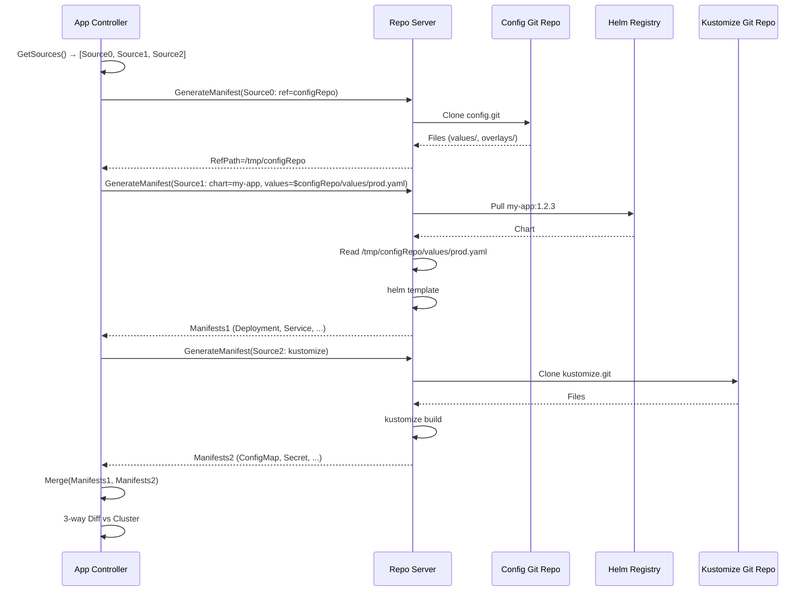
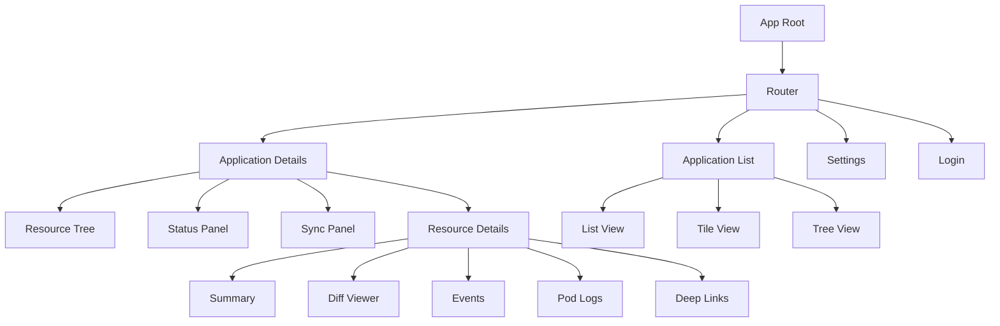

# Multi-Source Applications 및 UI Deep-Dive

> Argo CD의 유연한 애플리케이션 구성: 다중 소스 관리(Multi-Source)와 React 기반 웹 대시보드(UI)

---

## 1. 개요

Argo CD의 애플리케이션 구성과 사용자 인터페이스를 다루는 두 가지 서브시스템을 분석한다.

**Multi-Source Applications**: 하나의 Argo CD Application에 여러 Git/Helm 소스를 조합하여, 복잡한 배포 구성을 단일 앱으로 관리할 수 있게 한다. Kubernetes 매니페스트와 Helm 차트를 혼합하거나, 여러 Git 리포지토리의 설정을 조합하는 실무 시나리오를 지원한다.

**UI (React SPA)**: Argo CD의 웹 기반 대시보드로, Application 상태 시각화, 리소스 트리, 로그 스트리밍, Sync/Rollback 등 운영 기능을 제공한다. React + TypeScript 기반의 싱글 페이지 애플리케이션(SPA)으로 구현되어 있다.

```
┌─────────────────────────────────────────────────────────────┐
│                 Multi-Source Application                      │
│                                                              │
│  ApplicationSpec                                             │
│  ├── Source (단일 소스 — 하위 호환)                            │
│  └── Sources[] (다중 소스)                                    │
│       ├── Source 0: Git repo (values.yaml)   ← Ref 소스      │
│       ├── Source 1: Helm chart               ← 실제 배포      │
│       └── Source 2: Git repo (kustomize)     ← 추가 매니페스트│
│                                                              │
│  ┌──────────────────────────────────────────────────────┐    │
│  │                    Argo CD UI                         │    │
│  │                                                       │    │
│  │  React SPA + TypeScript                               │    │
│  │  ├── Application List    — 전체 앱 목록                │    │
│  │  ├── Application Details — 리소스 트리, 상태            │    │
│  │  ├── Resource View      — Pod 로그, 이벤트             │    │
│  │  ├── Settings           — 클러스터, 레포, 프로젝트 관리  │    │
│  │  └── Login              — SSO/OIDC/로컬 인증           │    │
│  └──────────────────────────────────────────────────────┘    │
└─────────────────────────────────────────────────────────────┘
```

---

## 2. Multi-Source Applications 서브시스템

### 2.1 설계 배경

기존 Argo CD Application은 단일 `Source` 필드만 지원했다. 하지만 실무에서는 다음과 같은 요구가 빈번하다:

1. **Values 분리**: Helm 차트와 values.yaml이 서로 다른 Git 리포지토리에 있는 경우
2. **설정 조합**: 기본 인프라 매니페스트(Git)와 앱 설정(Helm)을 하나의 배포 단위로 관리
3. **환경별 오버라이드**: 공용 차트 + 환경별 values 리포지토리 조합
4. **복합 앱**: 프론트엔드(Git) + 백엔드(Helm) + 인프라(Kustomize)를 단일 앱으로

Multi-Source는 이러한 요구를 `Sources[]` 필드로 해결한다.

### 2.2 데이터 모델

소스 경로: `pkg/apis/application/v1alpha1/types.go`

#### ApplicationSource 구조체

```
ApplicationSource
├── RepoURL         string                       # Git/Helm 리포지토리 URL
├── Path            string                       # Git 내 디렉토리 경로
├── TargetRevision  string                       # 브랜치/태그/커밋/차트 버전
├── Helm            *ApplicationSourceHelm       # Helm 옵션
├── Kustomize       *ApplicationSourceKustomize  # Kustomize 옵션
├── Directory       *ApplicationSourceDirectory  # 디렉토리 옵션
├── Plugin          *ApplicationSourcePlugin     # CMP 플러그인 옵션
├── Chart           string                       # Helm 차트 이름
├── Ref             string                       # 참조 이름 (다른 소스 참조 시)
└── Name            string                       # 소스 이름 (UI 표시용)
```

#### ApplicationSources 타입

```go
// pkg/apis/application/v1alpha1/types.go:222
type ApplicationSources []ApplicationSource
```

`ApplicationSources`는 `[]ApplicationSource`의 별칭으로, 비교(`Equals`)와 빈 값 확인(`IsZero`) 메서드를 제공한다.

#### Ref 필드 — 소스 간 참조

Multi-Source의 핵심 기능 중 하나는 `Ref` 필드를 통한 소스 간 참조다:

```yaml
# 예시: Helm 차트의 values를 별도 Git 리포지토리에서 가져오기
apiVersion: argoproj.io/v1alpha1
kind: Application
spec:
  sources:
    # 소스 0: Values 리포지토리 (Ref 소스)
    - repoURL: https://github.com/myorg/config.git
      targetRevision: main
      ref: configRepo              # ← 이 소스를 "configRepo"로 참조

    # 소스 1: Helm 차트 (실제 배포)
    - repoURL: https://charts.example.com
      chart: my-app
      targetRevision: 1.2.3
      helm:
        valueFiles:
          - $configRepo/values/production.yaml   # ← Ref로 참조
```

`ref` 필드가 설정된 소스는 **직접 배포에 사용되지 않고**, 다른 소스가 파일을 참조하기 위한 "데이터 소스" 역할만 한다.

### 2.3 핵심 메서드

#### HasMultipleSources()

```go
// Application이 다중 소스를 사용하는지 확인
func (spec *ApplicationSpec) HasMultipleSources() bool {
    return len(spec.Sources) > 0
}
```

이 메서드는 단일 소스(`Source`)와 다중 소스(`Sources[]`)를 구분하는 분기점이다. Argo CD 코드 전반에서 이 함수를 호출하여 처리 경로를 분기한다.

#### GetSource() — 하위 호환성

```go
func (spec *ApplicationSpec) GetSource() ApplicationSource {
    if spec.SourceHydrator != nil {
        return spec.SourceHydrator.GetSyncSource()
    }
    if spec.HasMultipleSources() {
        return spec.Sources[0]     // 다중 소스 시 첫 번째 반환
    }
    if spec.Source != nil {
        return *spec.Source         // 단일 소스
    }
    return ApplicationSource{}     // 빈 값
}
```

다중 소스 앱에서 `GetSource()`는 **첫 번째 소스를 반환**한다. 이는 기존 코드와의 하위 호환성을 위한 것이다. 단일 소스만 기대하는 레거시 코드가 Multi-Source 앱에서도 동작할 수 있게 한다.

#### GetSources() — 전체 소스 목록

```go
func (spec *ApplicationSpec) GetSources() ApplicationSources {
    if spec.SourceHydrator != nil {
        return ApplicationSources{spec.SourceHydrator.GetSyncSource()}
    }
    if spec.HasMultipleSources() {
        return spec.Sources
    }
    if spec.Source != nil {
        return ApplicationSources{*spec.Source}
    }
    return ApplicationSources{}
}
```

단일 소스 앱도 `ApplicationSources` 슬라이스로 래핑하여 반환한다. 이를 통해 호출자는 단일/다중 소스를 구분하지 않고 동일한 반복문으로 처리할 수 있다.

#### GetSourcePtrByIndex() — 인덱스 기반 소스 접근

```go
func (spec *ApplicationSpec) GetSourcePtrByIndex(index int) *ApplicationSource {
    if spec.HasMultipleSources() {
        if index >= 0 && index < len(spec.Sources) {
            return &spec.Sources[index]
        }
    }
    return spec.Source
}
```

인덱스로 특정 소스에 접근한다. 범위를 벗어나면 단일 소스를 반환하여 안전한 접근을 보장한다.

### 2.4 Multi-Source Sync 흐름

```
Multi-Source Application Sync 흐름:
│
├── 1. 소스 목록 순회
│   └── GetSources() → [Source0, Source1, Source2]
│
├── 2. 각 소스별 매니페스트 생성 (Repo Server)
│   ├── Source0 (ref: configRepo)
│   │   └── Git clone → 파일만 제공 (배포 매니페스트 생성 안 함)
│   ├── Source1 (Helm chart + $configRepo 참조)
│   │   └── Helm template + values from Source0 → 매니페스트
│   └── Source2 (Kustomize)
│       └── Kustomize build → 매니페스트
│
├── 3. 매니페스트 병합
│   └── Source1 + Source2 매니페스트를 하나의 세트로 합침
│
├── 4. 3-way Diff
│   └── 병합된 매니페스트 vs 라이브 클러스터 상태
│
├── 5. Sync 실행
│   └── 통합 매니페스트를 클러스터에 적용
│
└── 6. 리비전 기록
    └── SyncResult.Revisions = ["commit1", "v1.2.3", "commit2"]
        (각 소스의 리비전을 별도 추적)
```

### 2.5 리비전 추적

단일 소스: `SyncResult.Revision` (문자열 1개)
다중 소스: `SyncResult.Revisions` (문자열 슬라이스)

```
SyncResult
├── Revision   string     # 단일 소스용 (하위 호환)
└── Revisions  []string   # 다중 소스용 (각 소스의 리비전)
```

Badge Server에서도 이를 인식한다:
```go
if len(app.Status.OperationState.SyncResult.Revisions) > 0 {
    revision = app.Status.OperationState.SyncResult.Revisions[0]
} else {
    revision = app.Status.OperationState.SyncResult.Revision
}
```

### 2.6 ApplicationSources.Equals() — 깊은 비교

```go
func (a ApplicationSources) Equals(other ApplicationSources) bool {
    if len(a) != len(other) {
        return false
    }
    for i := range a {
        if !a[i].Equals(&other[i]) {
            return false
        }
    }
    return true
}
```

소스 목록의 깊은 비교는 **순서 의존적(order-dependent)**이다. 즉 같은 소스 집합이라도 순서가 다르면 다른 것으로 판단한다. 이는 의도적인 설계로, 소스 순서가 매니페스트 생성 순서에 영향을 미치기 때문이다 (예: Ref 소스는 참조하는 소스보다 앞에 와야 한다).

### 2.7 Source Hydrator 통합

```go
func (spec *ApplicationSpec) GetSource() ApplicationSource {
    if spec.SourceHydrator != nil {
        return spec.SourceHydrator.GetSyncSource()
    }
    // ...
}
```

Source Hydrator는 Argo CD의 Commit Server 기능과 연동되어, 렌더링된 매니페스트를 별도 Git 브랜치에 커밋하는 "hydration" 워크플로를 지원한다. Hydrator가 설정되면 `GetSource()`/`GetSources()`는 Hydrator의 Sync 소스를 반환한다.

### 2.8 CLI에서 Multi-Source

```bash
# 다중 소스 앱 생성
argocd app create my-app \
  --source repoURL=https://github.com/myorg/config.git,targetRevision=main,ref=configRepo \
  --source repoURL=https://charts.example.com,chart=my-app,targetRevision=1.2.3,helm.valueFiles=$configRepo/values.yaml
```

### 2.9 제약사항

1. **소스 순서 의존**: Ref 소스는 이를 참조하는 소스보다 앞에 위치해야 함
2. **AppOfApps 제한**: Multi-Source 앱은 App of Apps 패턴에서 자식 앱으로만 사용 가능
3. **Source 필드와 혼용 불가**: `source`와 `sources`를 동시에 설정하면 `sources`가 우선

---

## 3. UI (React SPA) 서브시스템

### 3.1 기술 스택

```
ui/
├── src/
│   ├── app/                # 메인 애플리케이션
│   │   ├── app.tsx          # 루트 컴포넌트
│   │   ├── index.tsx        # 엔트리포인트
│   │   ├── applications/    # Application 관련 컴포넌트
│   │   │   └── components/  # 46개 컴포넌트 디렉토리
│   │   ├── settings/        # 설정 관련 컴포넌트
│   │   ├── login/           # 로그인 화면
│   │   ├── shared/          # 공용 컴포넌트/서비스
│   │   ├── sidebar/         # 사이드바 네비게이션
│   │   ├── user-info/       # 사용자 정보
│   │   └── ui-banner/       # UI 배너
│   └── assets/              # 정적 리소스
├── package.json
└── tsconfig.json
```

기술 스택:
- **프레임워크**: React (TypeScript)
- **빌드**: Webpack
- **상태 관리**: React Context + Local State
- **API 통신**: gRPC-Web → Argo CD API Server
- **스타일링**: SCSS + CSS Modules
- **라우팅**: React Router

### 3.2 아키텍처

```
┌─────────────────────────────────────────────────────────────┐
│                    Argo CD UI Architecture                    │
│                                                              │
│  ┌──────────────────────────────────────────────────────┐   │
│  │                  React Application                    │   │
│  │                                                       │   │
│  │  ┌─────────────┐  ┌─────────────┐  ┌────────────┐   │   │
│  │  │ Application │  │  Settings   │  │   Login    │   │   │
│  │  │  Views      │  │  Views     │  │   View     │   │   │
│  │  │             │  │            │  │            │   │   │
│  │  │ - List      │  │ - Clusters │  │ - SSO      │   │   │
│  │  │ - Details   │  │ - Repos    │  │ - Local    │   │   │
│  │  │ - Resource  │  │ - Projects │  │ - OIDC     │   │   │
│  │  │ - Diff      │  │ - General  │  │            │   │   │
│  │  └──────┬──────┘  └──────┬─────┘  └──────┬─────┘   │   │
│  │         │                │                │          │   │
│  │  ┌──────▼────────────────▼────────────────▼──────┐   │   │
│  │  │              Shared Services                   │   │   │
│  │  │  ├── API Client (gRPC-Web)                    │   │   │
│  │  │  ├── Navigation Service                        │   │   │
│  │  │  ├── Notification Service                      │   │   │
│  │  │  └── View Preferences                         │   │   │
│  │  └──────────────────────┬────────────────────────┘   │   │
│  └─────────────────────────┤                            │   │
│                            │                            │   │
│  ┌─────────────────────────▼────────────────────────┐   │   │
│  │              Argo CD API Server                    │   │   │
│  │  gRPC + REST (cmux 멀티플렉싱)                    │   │   │
│  └──────────────────────────────────────────────────┘   │   │
└─────────────────────────────────────────────────────────────┘
```

### 3.3 주요 뷰 분석

#### Application List View

Application 목록을 표시하는 메인 화면. 지원하는 뷰 모드:

| 모드 | 설명 |
|------|------|
| List | 테이블 형태의 앱 목록 |
| Tiles | 타일 형태의 앱 카드 |
| Tree | 프로젝트별 트리 구조 |

필터 기능:
- 프로젝트, 클러스터, 네임스페이스 필터
- Health/Sync 상태 필터
- 라벨 기반 필터
- 텍스트 검색

#### Application Details View

개별 Application의 상세 정보를 표시하는 핵심 화면:

```
Application Details Layout
│
├── 상단 바: 앱 이름, Sync/Health 상태, 액션 버튼
│   ├── Sync: 동기화 실행
│   ├── Refresh: Hard/Soft Refresh
│   ├── Rollback: 이전 버전으로 복원
│   └── Delete: 앱 삭제
│
├── 리소스 트리 (메인 영역)
│   ├── 토폴로지 뷰: 리소스 간 관계를 그래프로 표시
│   ├── 리스트 뷰: 리소스를 테이블로 표시
│   └── 네트워크 뷰: 네트워크 리소스 관계
│
├── 소스 정보
│   ├── 단일 소스: 레포 URL, 경로, 리비전
│   └── 다중 소스: 각 소스별 정보 (Sources 탭)
│
└── 하단 패널: 리소스 상세
    ├── Summary: 리소스 기본 정보
    ├── YAML/JSON: 라이브 매니페스트
    ├── Diff: Desired vs Live 비교
    ├── Events: Kubernetes 이벤트
    └── Logs: Pod 컨테이너 로그 (스트리밍)
```

#### Resource View

개별 Kubernetes 리소스의 상세 뷰:

```
Resource View Tabs
├── Summary  — 리소스 메타데이터, 상태, 컨디션
├── Diff     — Git 정의 vs 라이브 클러스터 (3-way diff)
├── Events   — kubectl describe와 동일한 이벤트
├── Logs     — Pod 선택 시 컨테이너 로그 스트리밍
├── Actions  — 커스텀 액션 (Restart, Scale 등)
└── Links    — Deep Links (외부 시스템 링크)
```

### 3.4 API 통신

UI는 Argo CD API Server와 gRPC-Web으로 통신한다:

```
UI (Browser)
    │
    │ gRPC-Web (HTTP/1.1 + Protobuf)
    │
    ▼
Argo CD API Server
    │
    │ gRPC (HTTP/2)
    │
    ├── Application Service  — 앱 CRUD, Sync, Rollback
    ├── Repository Service   — 레포 관리
    ├── Cluster Service      — 클러스터 관리
    ├── Project Service      — 프로젝트 관리
    ├── Account Service      — 사용자 관리
    ├── Session Service      — 로그인/로그아웃
    └── Settings Service     — 설정 조회
```

gRPC-Web을 사용하는 이유:
- 브라우저는 HTTP/2 기반 gRPC를 직접 지원하지 않음
- gRPC-Web은 HTTP/1.1 위에서 Protobuf 직렬화를 사용
- grpc-gateway가 REST 폴백도 제공

### 3.5 실시간 업데이트

UI는 Application 상태 변경을 실시간으로 반영하기 위해 **Server-Sent Events(SSE)** 또는 **WebSocket**을 사용한다:

```
실시간 업데이트 흐름:
│
├── UI → API Server: Watch 요청 (SSE/WebSocket)
│
├── API Server → Kubernetes: Watch (informer)
│   └── Application 리소스 변경 감지
│
├── Kubernetes → API Server: Watch Event
│   └── Application 상태 변경 이벤트
│
└── API Server → UI: 이벤트 스트리밍
    └── UI 상태 갱신 (React state update)
```

### 3.6 빌드 시스템

```
Webpack Configuration
├── Entry: src/app/index.tsx
├── Output: dist/ (static files)
├── Loaders:
│   ├── ts-loader (TypeScript)
│   ├── sass-loader (SCSS)
│   ├── css-loader (CSS Modules)
│   └── file-loader (이미지, 폰트)
├── Plugins:
│   ├── HtmlWebpackPlugin
│   └── DefinePlugin (환경변수)
└── DevServer: Hot Module Replacement
```

### 3.7 서빙 방식

프로덕션에서 UI 정적 파일은 API 서버가 직접 서빙한다:

```go
// server/server.go
mux.Handle("/", http.FileServer(http.FS(ui.StaticFS)))
```

개발 시에는 Webpack DevServer를 사용하여 Hot Module Replacement(HMR)를 지원한다.

### 3.8 컴포넌트 구조 (46개 디렉토리)

`ui/src/app/applications/components/` 아래에 46개의 컴포넌트 디렉토리가 존재한다. 주요 컴포넌트:

```
applications/components/
├── application-create-panel/       # 앱 생성 폼
├── application-details/            # 앱 상세 뷰
├── application-list/               # 앱 목록 뷰
├── application-parameters/         # 소스 파라미터 편집
├── application-pod-view/           # Pod 뷰 (노드별)
├── application-resource-diff/      # Diff 뷰어
├── application-resource-events/    # 이벤트 뷰어
├── application-resource-list/      # 리소스 리스트
├── application-resource-tree/      # 리소스 트리 (토폴로지)
├── application-status-panel/       # 상태 패널
├── application-summary/            # 앱 요약
├── application-sync-options/       # Sync 옵션 설정
├── application-sync-panel/         # Sync 실행 패널
├── pod-logs-viewer/                # Pod 로그 뷰어
├── resource-details/               # 리소스 상세
└── ... (31개 더)
```

### 3.9 Multi-Source와 UI의 연동

Multi-Source 앱은 UI에서 특별한 처리가 필요하다:

```
Multi-Source UI 표시:
│
├── Application Details
│   ├── Sources 탭: 각 소스별 정보 표시
│   │   ├── Source 0: repoURL, path, targetRevision, ref
│   │   ├── Source 1: chart, targetRevision, helm values
│   │   └── Source 2: repoURL, path, kustomize
│   │
│   └── 각 소스의 Name 필드를 UI에서 식별자로 사용
│
├── Sync Panel
│   └── 각 소스의 리비전을 개별적으로 표시
│
└── Diff View
    └── 모든 소스의 매니페스트를 통합하여 Diff 표시
```

`ApplicationSource.Name` 필드는 Multi-Source에서 UI 표시용 식별자로 사용된다:
```go
// Name is used to refer to a source and is displayed in the UI.
// It is used in multi-source Applications.
Name string `json:"name,omitempty" protobuf:"bytes,14,opt,name=name"`
```

---

## 4. Multi-Source 내부 구현 상세

### 4.1 Repo Server에서의 처리

Multi-Source 앱의 매니페스트 생성 시, Repo Server는 각 소스를 개별적으로 처리한다:

```
Repo Server: GenerateManifests()
│
├── Source 0 (ref: configRepo)
│   ├── Git clone https://github.com/myorg/config.git
│   ├── ref 소스이므로 매니페스트 생성하지 않음
│   └── 파일 시스템 경로를 다른 소스에 제공
│
├── Source 1 (Helm chart)
│   ├── Helm repo에서 차트 다운로드
│   ├── values 파일 해석:
│   │   └── $configRepo/values/prod.yaml
│   │       → Source 0의 파일 시스템에서 읽기
│   ├── helm template 실행
│   └── 매니페스트 생성
│
└── Source 2 (Kustomize)
    ├── Git clone
    ├── kustomize build 실행
    └── 매니페스트 생성

결과: Source 1 + Source 2 매니페스트 병합
```

### 4.2 $ 접두사 참조 해석

values 파일 경로에서 `$` 접두사는 Ref 소스를 가리킨다:

```
$configRepo/values/production.yaml
│           │
│           └── Ref 소스의 Git 리포지토리 내 경로
│
└── Ref 이름 (Source의 ref 필드와 매칭)
```

이 해석은 Repo Server에서 수행되며, Ref 소스를 먼저 clone한 후 파일 시스템 경로로 치환한다.

### 4.3 Application Controller에서의 처리

Application Controller는 Multi-Source 앱을 다음과 같이 처리한다:

```
Controller Reconciliation Loop:
│
├── GetSources() → [Source0, Source1, Source2]
│
├── 각 소스에 대해:
│   ├── Repo Server에 매니페스트 생성 요청
│   └── 결과 수집
│
├── 매니페스트 병합
│   └── 모든 소스의 매니페스트를 하나의 리소스 세트로 합침
│
├── 3-way Diff (병합된 매니페스트 vs 클러스터)
│
├── Health 평가 (병합된 리소스 세트)
│
└── Sync 실행 시:
    └── 각 소스의 리비전을 Revisions[] 필드에 기록
```

### 4.4 Source vs Sources 우선순위

```go
func (spec *ApplicationSpec) HasMultipleSources() bool {
    return len(spec.Sources) > 0
}
```

`Sources`가 비어있지 않으면 항상 `Sources`가 우선한다. `Source` 필드는 하위 호환성을 위해 유지되지만, 새로운 앱에서는 `Sources`를 사용하는 것이 권장된다.

---

## 5. UI 기능 심화

### 5.1 리소스 트리 시각화

Argo CD UI의 가장 핵심적인 시각화 기능은 **리소스 트리(Resource Tree)**다:

```
Application
└── ReplicaSet
    ├── Pod (Healthy)
    │   ├── Container: nginx
    │   └── Container: sidecar
    ├── Pod (Progressing)
    └── Pod (Healthy)

리소스 간 관계:
├── ownerReferences 기반 부모-자식 관계
├── Application → Deployment → ReplicaSet → Pod
└── Service → Endpoints → Pod
```

UI는 Kubernetes `ownerReferences`를 활용하여 리소스 간 트리 구조를 자동으로 구성한다. Application Controller가 제공하는 리소스 트리 정보를 gRPC로 수신하여 렌더링한다.

### 5.2 Diff 뷰어

```
Diff View 구성:
│
├── Desired State (Git에서 선언한 매니페스트)
│
├── Live State (클러스터에서 조회한 실제 상태)
│
└── 3-way Diff 결과
    ├── 추가된 필드 (녹색)
    ├── 삭제된 필드 (적색)
    ├── 변경된 필드 (황색)
    └── 무시된 필드 (회색) — ignoreDifferences 설정
```

### 5.3 Pod 로그 스트리밍

```
Log Streaming 구현:
│
├── UI → API Server: ApplicationService.PodLogs() (gRPC stream)
│
├── API Server → Kubernetes: Core API /api/v1/pods/.../log?follow=true
│
└── 실시간 로그 표시
    ├── 자동 스크롤
    ├── 컨테이너 선택
    ├── 이전 컨테이너 로그 (previous=true)
    ├── 타임스탬프 표시
    └── 다운로드
```

### 5.4 UI 배너 시스템

```yaml
# argocd-cm ConfigMap
data:
  ui.bannercontent: "유지보수 예정: 2026-03-15 02:00-06:00 KST"
  ui.bannerurl: "https://status.example.com"
  ui.bannerpermanent: "true"
  ui.bannerposition: "top"  # top | bottom
```

UI 배너는 운영 공지, 유지보수 알림 등을 사용자에게 표시하기 위한 기능이다.

### 5.5 UI 확장 (Extensions와 연동)

Server Extensions(20장 참조)를 통해 UI에 커스텀 탭을 추가할 수 있다:

```
Extension UI 통합:
│
├── Argo CD UI: 앱 상세 뷰
│   ├── Summary 탭
│   ├── Resources 탭
│   ├── Events 탭
│   └── [Extension] 탭 ← 확장에서 제공
│       └── iframe 또는 직접 렌더링
│           └── /extensions/{name}/ 프록시를 통해 백엔드 호출
```

---

## 6. 설계 결정의 "왜"

### Q1: 왜 Source와 Sources 필드를 모두 유지하는가?

A: **하위 호환성(Backward Compatibility)**이 가장 큰 이유다. Argo CD v2.5까지는 `Source` 필드만 존재했다. 기존 Application 리소스를 수정하지 않고도 Multi-Source 기능을 추가하기 위해 `Sources` 필드를 새로 도입했다. `Source` 필드를 제거하면 수만 개의 기존 Application이 깨질 수 있다.

### Q2: 왜 Multi-Source에서 소스 순서가 중요한가?

A: Ref 소스는 참조하기 전에 먼저 clone되어야 한다. `$configRepo/values.yaml`을 사용하려면, `ref: configRepo`가 설정된 소스가 먼저 처리되어야 한다. Argo CD는 소스 배열의 순서대로 처리하므로, Ref 소스를 앞에 배치해야 한다.

### Q3: 왜 UI를 API 서버에 내장했는가?

A: 운영 단순성을 위한 결정이다:
- 별도의 웹 서버/CDN 설정 불필요
- 인증/인가가 API 서버에 이미 구현됨
- 단일 엔드포인트로 API와 UI 모두 제공
- Kubernetes 배포 시 하나의 Service로 충분

### Q4: 왜 gRPC-Web을 사용하는가?

A: Argo CD의 내부 통신은 gRPC를 사용한다. UI도 동일한 Protobuf 메시지를 사용하면:
- 별도의 REST API 정의/유지 불필요
- 타입 안전성 확보 (Protobuf → TypeScript 코드 생성)
- 서버와 동일한 데이터 모델 공유
- Streaming 지원 (로그, 이벤트 등)

---

## 7. Mermaid 다이어그램

### 7.1 Multi-Source 매니페스트 생성



### 7.2 UI 컴포넌트 계층



---

## 8. 관련 소스 파일 요약

| 파일 | 역할 |
|------|------|
| `pkg/apis/application/v1alpha1/types.go` | ApplicationSource, ApplicationSources, HasMultipleSources(), GetSource(), GetSources() |
| `pkg/apis/application/v1alpha1/types_test.go` | Multi-Source 관련 테스트 |
| `ui/src/app/app.tsx` | UI 루트 컴포넌트 |
| `ui/src/app/index.tsx` | UI 엔트리포인트 |
| `ui/src/app/applications/components/` | 46개 Application 관련 UI 컴포넌트 |
| `ui/src/app/shared/` | 공용 서비스, 유틸리티 |
| `ui/src/app/settings/` | 설정 UI 컴포넌트 |
| `ui/src/app/login/` | 로그인 UI |
| `server/server.go` | UI 정적 파일 서빙 |

---

## 9. 정리

Multi-Source Applications는 Argo CD의 **유연한 배포 구성**을 가능하게 하는 핵심 확장이다. `Source`에서 `Sources[]`로의 진화는 하위 호환성을 유지하면서도 복잡한 실무 시나리오(Values 분리, 환경별 오버라이드, 복합 앱)를 지원한다. `Ref` 필드를 통한 소스 간 참조는 Git 리포지토리 분리 패턴의 깔끔한 해결책이다.

Argo CD UI는 **React + TypeScript + gRPC-Web** 기반의 풍부한 웹 대시보드다. 46개 이상의 컴포넌트로 구성되며, 리소스 트리 시각화, 3-way Diff, Pod 로그 스트리밍 등 운영에 필수적인 기능을 제공한다. API 서버 내장 방식은 운영 단순성을 우선시한 실용적 설계 결정이다.

두 서브시스템은 함께 동작하여, Multi-Source 앱의 여러 소스 정보를 UI에서 직관적으로 표시하고 관리할 수 있게 한다.
