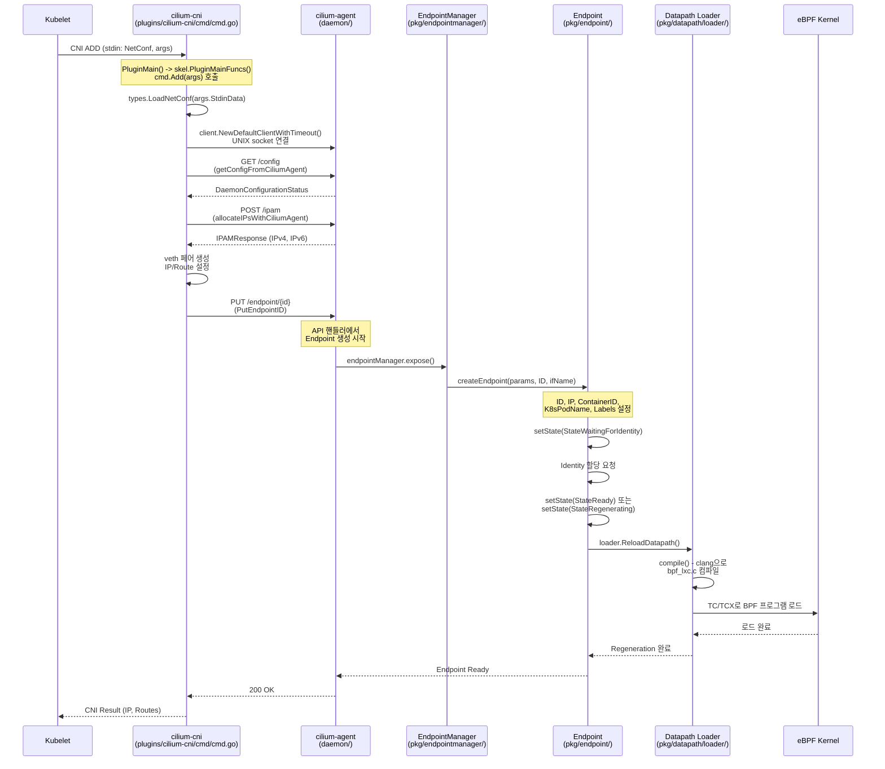
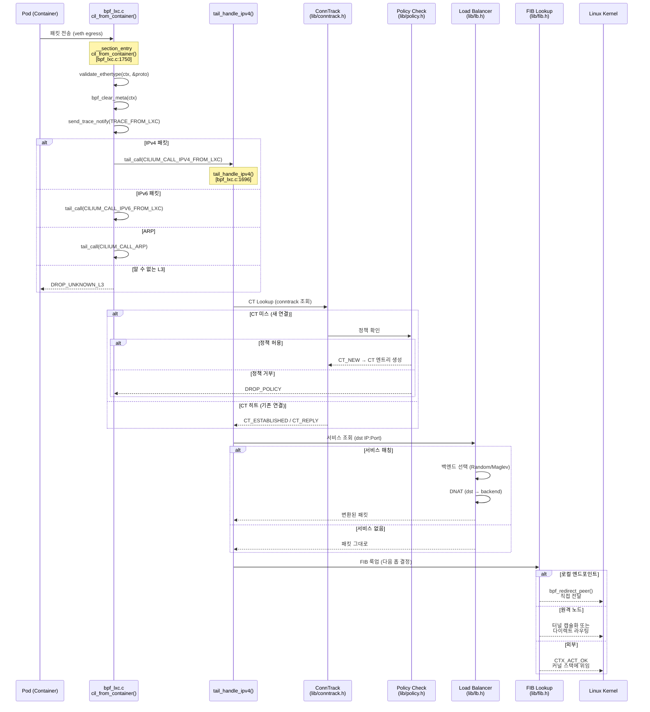
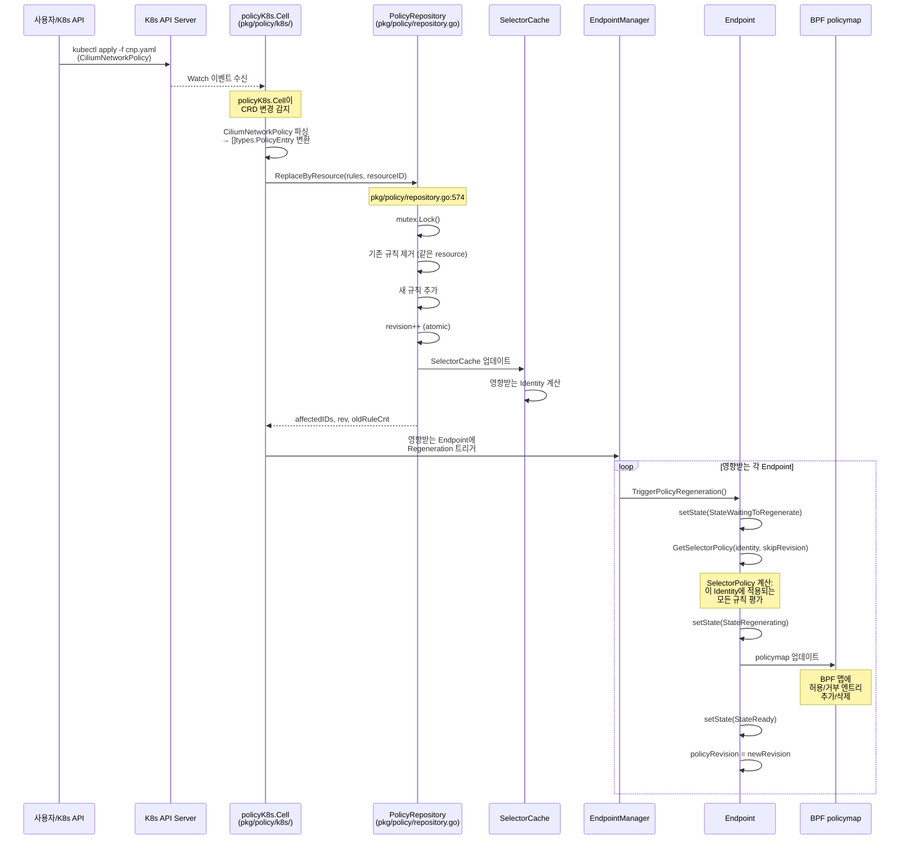
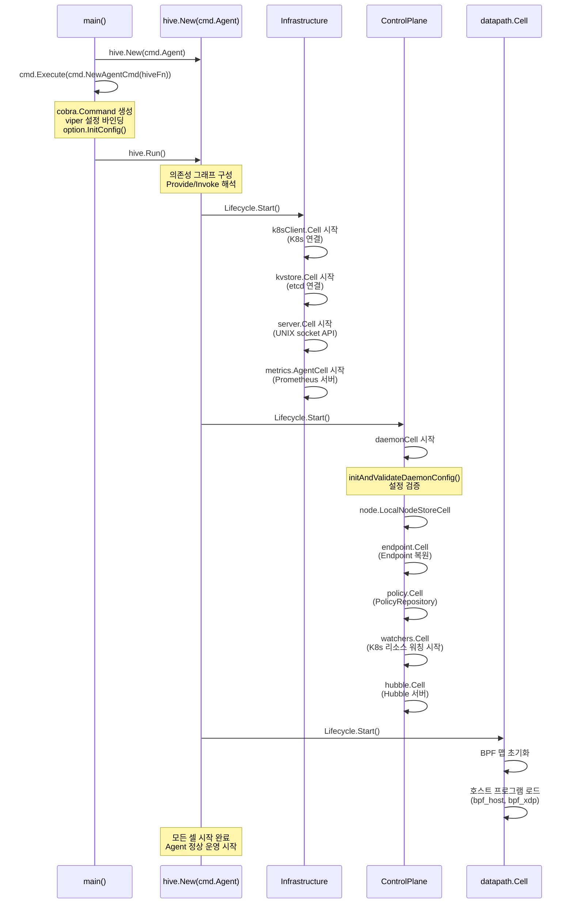

# 03. Cilium 시퀀스 다이어그램

## 개요

Cilium의 주요 유즈케이스 3가지의 요청 흐름을 시퀀스 다이어그램으로 분석한다:
1. **Pod 생성**: CNI Plugin -> Agent API -> Endpoint 생성 -> BPF 프로그램 로드
2. **패킷 처리**: bpf_lxc.c의 egress 처리 흐름
3. **정책 업데이트**: K8s CiliumNetworkPolicy -> PolicyRepository -> BPF policymap

## 1. Pod 생성 흐름

### 전체 흐름



### CNI ADD 상세 코드 흐름

CNI 플러그인의 `Add()` 함수(`plugins/cilium-cni/cmd/cmd.go:523`)에서 시작한다:

```
cmd.Add(args *skel.CmdArgs)
├── types.LoadNetConf(args.StdinData)          # CNI 설정 파싱
├── client.NewDefaultClientWithTimeout()       # Agent UNIX 소켓 연결
├── getConfigFromCiliumAgent(c)                # GET /config → IPAM 모드 확인
├── allocateIPsWithCiliumAgent(c, cniArgs)     # POST /ipam → IP 할당
│   └── c.IPAMAllocate("", podName, pool, true)
├── veth 페어 생성 + IP 설정                    # 네트워크 인터페이스 구성
└── Agent에 Endpoint 등록                       # PUT /endpoint/{id}
```

### Endpoint 생성 내부 흐름

```
createEndpoint() [pkg/endpoint/endpoint.go:626]
├── Endpoint 구조체 초기화
│   ├── ID: uint16 (노드 내 고유)
│   ├── loader, orchestrator, policyRepo 등 주입
│   ├── DNSHistory, DNSZombies 초기화
│   └── state: "" (초기)
├── Labels 설정 (K8s Pod labels)
├── Identity 할당
│   ├── StateWaitingForIdentity
│   └── Identity 캐시에서 조회 또는 KVStore 할당
├── BPF 프로그램 Regeneration
│   ├── StateRegenerating
│   ├── 헤더 파일 생성 (ep_config.h)
│   ├── BPF 컴파일 (clang)
│   └── TC/TCX 로드
└── StateReady
```

## 2. 패킷 처리 흐름 (Egress)

### bpf_lxc.c: 컨테이너에서 나가는 패킷



### cil_from_container() 코드 분석

```c
// bpf/bpf_lxc.c:1750
__section_entry
int cil_from_container(struct __ctx_buff *ctx)
{
    __be16 proto = 0;
    __u32 sec_label = SECLABEL;     // 컴파일 시 주입된 엔드포인트 Identity
    __s8 ext_err = 0;
    int ret;

    bpf_clear_meta(ctx);
    check_and_store_ip_trace_id(ctx);

    // veth RX 큐 매핑 리셋 (GH-18311 워커라운드)
    ctx->queue_mapping = 0;

    send_trace_notify(ctx, TRACE_FROM_LXC, sec_label, ...);

    switch (proto) {
    case bpf_htons(ETH_P_IP):
        edt_set_aggregate(ctx, LXC_ID);
        ret = tail_call_internal(ctx, CILIUM_CALL_IPV4_FROM_LXC, &ext_err);
        break;
    case bpf_htons(ETH_P_ARP):
        if (CONFIG(enable_arp_responder))
            ret = tail_call_internal(ctx, CILIUM_CALL_ARP, &ext_err);
        break;
    }
    // 에러 시 drop notify 전송
    if (IS_ERR(ret))
        return send_drop_notify_ext(ctx, sec_label, ...);
}
```

### 왜 Tail Call을 사용하는가?

eBPF 프로그램은 단일 프로그램당 **최대 100만 명령어** 제한이 있다.
Cilium의 패킷 처리 로직은 이 제한을 초과할 수 있으므로 tail call로
프로그램을 분할한다.

```
// bpf/lib/tailcall.h
#define CILIUM_CALL_IPV4_FROM_LXC           7
#define CILIUM_CALL_IPV4_FROM_LXC_CONT      26
#define CILIUM_CALL_ARP                      ...
```

각 tail call 대상은 독립된 BPF 프로그램으로 컴파일되어,
`bpf_tail_call()`로 체이닝된다. 이를 통해:
- 명령어 제한 우회
- 조건부 기능 활성화 (컴파일 시 ifdef로 포함/제외)
- 코드 재사용 (같은 tail call 대상을 여러 진입점에서 공유)

## 3. 정책 업데이트 흐름

### K8s CiliumNetworkPolicy -> BPF policymap



### PolicyRepository.ReplaceByResource() 상세

```
ReplaceByResource(rules, resource) [pkg/policy/repository.go:574]
├── mutex.Lock()
├── 기존 규칙 조회: rulesByResource[resource]
├── 기존 규칙 삭제
│   ├── rules 맵에서 제거
│   ├── rulesByNamespace에서 제거
│   └── rulesByResource에서 제거
├── 새 규칙 추가
│   ├── rules 맵에 추가
│   ├── rulesByNamespace에 추가
│   └── rulesByResource에 추가
├── revision.Add(1)
├── selectorCache 업데이트
│   └── 변경된 규칙의 셀렉터에 의해
│       영향받는 Identity Set 반환
├── mutex.Unlock()
└── return (affectedIDs, rev, oldRuleCnt)
```

### SelectorCache의 역할

SelectorCache는 정책 셀렉터(라벨 기반)를 미리 평가하여 캐싱한다.
정책이 변경되면 어떤 Identity가 영향받는지 O(1)에 가깝게 판별할 수 있다.

```
정책 규칙: "app=web" → "app=db" 허용
    ↓
SelectorCache:
    셀렉터 "app=web" → {Identity 1234, 1235, ...}
    셀렉터 "app=db"  → {Identity 5678, 5679, ...}
    ↓
BPF policymap (Identity 1234용):
    allow: Identity 5678, TCP/3306
    allow: Identity 5679, TCP/3306
```

## 4. Agent 시작 흐름



## 5. Endpoint Regeneration 흐름

정책 변경, 라벨 변경, 설정 변경 시 Endpoint의 BPF 프로그램을 재생성한다.

```
Regeneration 트리거
├── 정책 변경 (PolicyRepository revision 증가)
├── Endpoint 라벨 변경
├── 에이전트 설정 변경
└── 에이전트 재시작 후 복원

Regeneration 과정:
1. StateWaitingToRegenerate
   └── regeneration 큐에 추가

2. StateRegenerating
   ├── SelectorPolicy 계산
   │   └── Repository.GetSelectorPolicy(identity, skipRevision)
   ├── BPF 헤더 파일 생성
   │   └── ep_config.h (엔드포인트별 설정)
   ├── BPF 컴파일 (clang)
   │   └── bpf_lxc.c → bpf_lxc.o
   ├── BPF 프로그램 로드
   │   └── TC/TCX attach
   └── BPF 맵 업데이트
       ├── policymap (정책)
       ├── lxcmap (엔드포인트 정보)
       └── ctmap 등 (필요 시)

3. StateReady
   └── policyRevision 업데이트
```

## 핵심 파일 참조

| 흐름 | 주요 파일 | 함수/구조체 |
|------|----------|------------|
| CNI ADD | `plugins/cilium-cni/cmd/cmd.go:523` | `Cmd.Add()` |
| CNI Agent 연결 | `plugins/cilium-cni/cmd/cmd.go:560` | `client.NewDefaultClientWithTimeout()` |
| IP 할당 | `plugins/cilium-cni/cmd/cmd.go:172` | `allocateIPsWithCiliumAgent()` |
| Endpoint 생성 | `pkg/endpoint/endpoint.go:626` | `createEndpoint()` |
| BPF Egress | `bpf/bpf_lxc.c:1750` | `cil_from_container()` |
| IPv4 처리 | `bpf/bpf_lxc.c:1696` | `tail_handle_ipv4()` |
| Tail Call 정의 | `bpf/lib/tailcall.h:51` | `CILIUM_CALL_IPV4_FROM_LXC` |
| 정책 저장소 | `pkg/policy/repository.go:574` | `Repository.ReplaceByResource()` |
| SelectorPolicy | `pkg/policy/repository.go:545` | `Repository.GetSelectorPolicy()` |
| K8s 정책 워처 | `pkg/policy/k8s/` | `policyK8s.Cell` |
