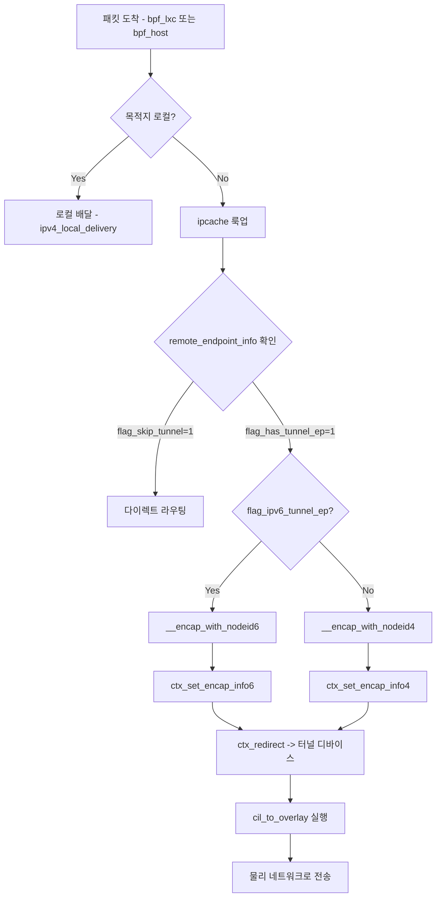
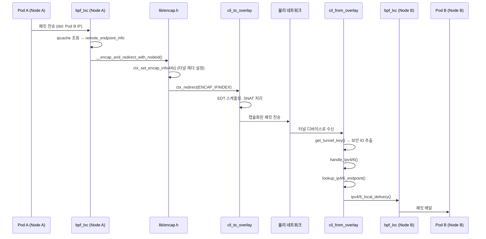

# 08. Cilium 네트워킹 서브시스템 심화

## 목차

1. [개요](#1-개요)
2. [라우팅 모드](#2-라우팅-모드)
3. [VXLAN/Geneve 터널링 상세](#3-vxlangeneve-터널링-상세)
4. [다이렉트 라우팅 상세](#4-다이렉트-라우팅-상세)
5. [BPF 캡슐화/디캡슐화](#5-bpf-캡슐화디캡슐화)
6. [노드 주소 지정과 ID 관리](#6-노드-주소-지정과-id-관리)
7. [디바이스 관리 (StateDB)](#7-디바이스-관리-statedb)
8. [MTU 처리](#8-mtu-처리)
9. [IPsec 통합](#9-ipsec-통합)
10. [오버레이 BPF 프로그램 (bpf_overlay.c)](#10-오버레이-bpf-프로그램-bpf_overlayc)
11. [왜 이 아키텍처인가?](#11-왜-이-아키텍처인가)
12. [참고 파일 목록](#12-참고-파일-목록)

---

## 1. 개요

Cilium의 네트워킹 서브시스템은 Kubernetes 클러스터 내 Pod 간 통신의 근간이다. 전통적인 CNI가 iptables와 bridge 조합으로 네트워킹을 구현하는 것과 달리, Cilium은 eBPF 프로그램을 네트워크 디바이스에 직접 부착하여 커널 네트워크 스택을 우회하는 데이터 경로를 구축한다.

### 핵심 설계 목표

| 목표 | 구현 방식 |
|------|----------|
| 고성능 패킷 포워딩 | eBPF 프로그램에서 직접 캡슐화/디캡슐화 |
| 유연한 라우팅 모드 | 터널(VXLAN/Geneve), 다이렉트 라우팅, 하이브리드 모드 |
| 노드 간 투명한 통신 | ipcache 기반 원격 엔드포인트 룩업 |
| 확장 가능한 노드 관리 | 16비트 노드 ID 체계 (최대 65,535개 노드) |
| 암호화 통합 | IPsec/WireGuard와 라우팅 모드의 투명한 결합 |
| 동적 디바이스 관리 | StateDB 기반 실시간 디바이스/라우트 추적 |

### 네트워킹 서브시스템 전체 아키텍처

```
+-----------------------------------------------------------------------+
|                          Cilium Agent (Go)                            |
|                                                                       |
|  +------------------+  +------------------+  +---------------------+  |
|  | linuxNodeHandler |  | tunnel.Config    |  | MTUManager          |  |
|  |  - nodeUpdate()  |  |  - protocol      |  |  - Calculate()      |  |
|  |  - nodeDelete()  |  |  - port          |  |  - DeviceMTU        |  |
|  |  - nodeIDs       |  |  - deviceName    |  |  - RouteMTU         |  |
|  +--------+---------+  +--------+---------+  +----------+----------+  |
|           |                      |                       |            |
|  +--------v---------+  +--------v---------+  +---------v----------+  |
|  | Node ID Pool     |  | Device Controller|  | StateDB Tables     |  |
|  |  1..65535         |  | (selection logic)|  |  - devices         |  |
|  |  nodeIDsByIPs     |  |                  |  |  - routes          |  |
|  |  nodeIPsByIDs     |  |                  |  |  - mtu             |  |
|  +--------+---------+  +------------------+  +--------------------+  |
|           |                                                           |
+-----------+-----------------------------------------------------------+
            |
            v  BPF Map Update
+-----------------------------------------------------------------------+
|                        eBPF Datapath (C/BPF)                          |
|                                                                       |
|  +------------------+  +------------------+  +---------------------+  |
|  | cilium_ipcache_v2|  | cilium_node_map  |  | bpf_overlay.c       |  |
|  | (LPM Trie)       |  | (node ID->IP)    |  |  - cil_from_overlay |  |
|  |  IP -> {          |  |                  |  |  - cil_to_overlay   |  |
|  |   sec_identity,   |  |                  |  |  - handle_ipv4()    |  |
|  |   tunnel_ep,      |  |                  |  |  - handle_ipv6()    |  |
|  |   flags           |  |                  |  |                     |  |
|  |  }                |  |                  |  |                     |  |
|  +------------------+  +------------------+  +---------------------+  |
|                                                                       |
|  +------------------+                                                 |
|  | lib/encap.h      |                                                 |
|  |  __encap_with_   |                                                 |
|  |   nodeid4/6()    |                                                 |
|  +------------------+                                                 |
+-----------------------------------------------------------------------+
```

---

## 2. 라우팅 모드

Cilium은 세 가지 라우팅 모드를 지원한다. 이 선택은 `LocalNodeConfiguration` 구조체의 플래그 조합으로 결정된다.

### 2.1 모드 비교

| 항목 | 터널 모드 | 다이렉트 라우팅 모드 | 하이브리드 모드 |
|------|----------|-------------------|---------------|
| 설정 플래그 | `EnableEncapsulation=true` | `EnableAutoDirectRouting=true` | 양쪽 모두 `true` |
| 네트워크 요구사항 | L3 연결만 필요 | L2 인접성 필요 | 가능하면 L2, 아니면 터널 |
| 오버헤드 | 50~70바이트 | 없음 | 경로별 다름 |
| MTU 영향 | 감소 | 없음 | 경로별 다름 |
| 클라우드 호환성 | 모든 환경 | 제한적 (BGP/라우팅 필요) | 유연 |
| 사용 사례 | 범용, 멀티클라우드 | 베어메탈, 고성능 | 혼합 환경 |

### 2.2 라우팅 결정 흐름

`nodeUpdate()` 함수(`pkg/datapath/linux/node.go` 488~580행)에서 라우팅 모드에 따른 분기를 처리한다:

```
nodeUpdate() 호출
      |
      v
  노드 ID 할당 (allocateIDForNode)
      |
      v
  IPsec 활성화 여부 확인
      |
      +-- EnableIPSec == true --> enableIPsec()
      |
      v
  로컬 노드인가? (newNode.IsLocal())
      |
      +-- Yes --> updateOrRemoveNodeRoutes() (로컬 라우트)
      |           enableSubnetIPsec() (서브넷 암호화 시)
      |
      +-- No  --> 라우팅 모드 분기
                    |
                    +-- EnableAutoDirectRouting && !enableEncapsulation(newNode)
                    |     --> updateDirectRoutes() (다이렉트 라우트 설치)
                    |
                    +-- enableEncapsulation(newNode)
                    |     --> updateOrRemoveNodeRoutes() (터널 라우트 설치)
                    |
                    +-- 그 외 (firstAddition)
                          --> 기존 라우트 정리 (deleteNodeRoute)
```

### 2.3 LocalNodeConfiguration 핵심 필드

`pkg/datapath/types/node.go` 159~197행에 정의된 `LocalNodeConfiguration`의 라우팅 관련 필드:

```go
// pkg/datapath/types/node.go

type LocalNodeConfiguration struct {
    // ...
    EnableEncapsulation        bool   // 캡슐화 활성화
    TunnelProtocol             tunnel.BPFEncapProtocol  // 0=비활성, 1=VXLAN, 2=Geneve
    TunnelPort                 uint16 // UDP 포트
    EnableAutoDirectRouting    bool   // L2 인접 시 다이렉트 라우팅 사용
    DirectRoutingSkipUnreachable bool // L2 비인접 노드 건너뛰기
    EnableLocalNodeRoute       bool   // 로컬 노드 라우트 설치
    DeviceMTU                  int    // 워크로드 디바이스 MTU
    RouteMTU                   int    // 네트워크 라우트 MTU
    RoutePostEncryptMTU        int    // 암호화 후 MTU
    // ...
}
```

**왜 `enableEncapsulation`이 함수 포인터인가?**

`linuxNodeHandler` 구조체(52~80행)를 보면 `enableEncapsulation`이 `func(node *nodeTypes.Node) bool` 타입의 함수 포인터로 선언되어 있다. 이는 하이브리드 모드에서 노드별로 캡슐화 여부를 동적으로 결정하기 위함이다. 같은 클러스터 내에서도 어떤 노드와는 다이렉트 라우팅을, 다른 노드와는 터널을 사용할 수 있다.

---

## 3. VXLAN/Geneve 터널링 상세

### 3.1 터널 설정 구조체

`pkg/datapath/tunnel/tunnel.go` 61~72행의 `Config` 구조체가 터널 설정의 핵심이다:

```go
// pkg/datapath/tunnel/tunnel.go

type Config struct {
    underlay       UnderlayProtocol  // IPv4 또는 IPv6 (언더레이)
    protocol       EncapProtocol     // "vxlan" 또는 "geneve"
    port           uint16            // UDP 포트
    srcPortLow     uint16            // 소스 포트 범위 하한
    srcPortHigh    uint16            // 소스 포트 범위 상한
    deviceName     string            // 터널 디바이스명
    shouldAdaptMTU bool              // MTU 자동 조정 여부
}
```

### 3.2 캡슐화 프로토콜 상수

```go
// pkg/datapath/tunnel/tunnel.go

const (
    VXLAN    EncapProtocol = "vxlan"   // VXLAN 캡슐화
    Geneve   EncapProtocol = "geneve"  // Geneve 캡슐화
    Disabled EncapProtocol = ""        // 비활성

    // BPF 데이터패스용 정수 ID
    TUNNEL_PROTOCOL_NONE   BPFEncapProtocol = 0
    TUNNEL_PROTOCOL_VXLAN  BPFEncapProtocol = 1
    TUNNEL_PROTOCOL_GENEVE BPFEncapProtocol = 2
)
```

### 3.3 VXLAN vs Geneve 비교

| 항목 | VXLAN | Geneve |
|------|-------|--------|
| RFC | RFC 7348 | RFC 8926 |
| 기본 포트 | 8472 (`TunnelPortVXLAN`) | 6081 (`TunnelPortGeneve`) |
| 디바이스명 | `cilium_vxlan` | `cilium_geneve` |
| 헤더 크기 | 8바이트 고정 | 8바이트 + 가변 옵션 |
| TLV 옵션 | 미지원 | 지원 (DSR 등에 활용) |
| DSR 캡슐화 | 불가 | `DSR_ENCAP_GENEVE` 모드 지원 |
| 성능 | 약간 우수 (고정 헤더) | 유연하지만 약간의 오버헤드 |

**왜 Cilium은 기본 VXLAN 포트로 8472를 쓰는가?**

IANA가 할당한 VXLAN 공식 포트는 4789이지만, Cilium(그리고 Linux 커널의 Flannel 호환 모드)은 8472를 기본값으로 사용한다. 이는 Linux 커널의 VXLAN 구현이 역사적으로 8472를 사용해 왔고, 기존 인프라와의 호환성을 위해 이 관행을 따른 것이다. `pkg/defaults/defaults.go` 472~475행에서 확인할 수 있다:

```go
// pkg/defaults/defaults.go
const (
    TunnelPortVXLAN  uint16 = 8472
    TunnelPortGeneve uint16 = 6081
)
```

디바이스명은 `pkg/defaults/node.go` 32~36행에 정의된다:

```go
// pkg/defaults/node.go
const (
    GeneveDevice = "cilium_geneve"
    VxlanDevice  = "cilium_vxlan"
)
```

### 3.4 터널 설정 초기화 흐름

`newConfig()` 함수(`tunnel.go` 96행~)에서 터널 설정이 결정되는 흐름:

```
사용자 설정 (Helm values / CLI flags)
      |
      v
  TunnelProtocol 검증 ("vxlan" 또는 "geneve")
      |
      v
  UnderlayProtocol 결정
      |
      +-- "auto" --> IPv4 활성 시 IPv4, 아니면 IPv6
      +-- "ipv4" --> IPv4 검증
      +-- "ipv6" --> IPv6 검증
      |
      v
  Enabler 목록 순회
      |
      +-- 하나라도 enable=true --> 터널 활성화
      |     +-- needsMTUAdaptation 합산
      |     +-- validator 실행 (프로토콜 호환성 검증)
      |
      +-- 모두 enable=false --> configDisabled 반환
      |
      v
  프로토콜별 디바이스명/포트 설정
      +-- VXLAN: "cilium_vxlan", 포트 8472
      +-- Geneve: "cilium_geneve", 포트 6081
```

**왜 Enabler 패턴을 쓰는가?**

터널링은 기본 캡슐화뿐 아니라 Egress Gateway, ClusterMesh 등 여러 기능이 요청할 수 있다. `enabler` 그룹 의존성 주입(`group:"request-enable-tunneling"`)을 통해 어떤 기능이든 터널을 활성화할 수 있으며, 터널 설정 코드는 이를 모르는 채 동작한다. 이 설계는 기능 간 결합도를 낮추고 확장성을 보장한다.

### 3.5 터널 패킷 구조

```
VXLAN 캡슐화 패킷 구조:

+----------------------------------------------------------+
| Outer Ethernet Header (14B)                               |
|  Dst MAC | Src MAC | EtherType (0x0800)                   |
+----------------------------------------------------------+
| Outer IP Header (20B/40B)                                 |
|  Src IP: 노드 A IP  | Dst IP: 노드 B IP                  |
|  Protocol: UDP (17)                                       |
+----------------------------------------------------------+
| Outer UDP Header (8B)                                     |
|  Src Port: 해시 기반  | Dst Port: 8472                    |
+----------------------------------------------------------+
| VXLAN Header (8B)                                         |
|  Flags | VNI (Security Identity 인코딩)                    |
+----------------------------------------------------------+
| Inner Ethernet Header (14B)                               |
|  Dst MAC | Src MAC | EtherType                            |
+----------------------------------------------------------+
| Inner IP Header                                           |
|  Src IP: Pod A IP  | Dst IP: Pod B IP                     |
+----------------------------------------------------------+
| Inner Payload                                             |
+----------------------------------------------------------+

총 오버헤드: 50B (IPv4) / 70B (IPv6)
```

```
Geneve 캡슐화 패킷 구조:

+----------------------------------------------------------+
| Outer Ethernet Header (14B)                               |
+----------------------------------------------------------+
| Outer IP Header (20B/40B)                                 |
+----------------------------------------------------------+
| Outer UDP Header (8B)                                     |
|  Src Port: 해시 기반  | Dst Port: 6081                    |
+----------------------------------------------------------+
| Geneve Header (8B + 가변 옵션)                             |
|  Ver | Opt Len | Protocol | VNI                           |
|  [TLV Options: DSR 정보 등]                                |
+----------------------------------------------------------+
| Inner Ethernet Header (14B)                               |
+----------------------------------------------------------+
| Inner IP/Payload                                          |
+----------------------------------------------------------+

DSR 사용 시 추가 오버헤드: +12B (DsrTunnelOverhead)
```

---

## 4. 다이렉트 라우팅 상세

### 4.1 다이렉트 라우트 생성

`createDirectRouteSpec()` 함수(`pkg/datapath/linux/node.go` 154~222행)가 다이렉트 라우트를 생성한다:

```go
// pkg/datapath/linux/node.go

func createDirectRouteSpec(log *slog.Logger, CIDR *cidr.CIDR, nodeIP net.IP,
    skipUnreachable bool) (routeSpec *netlink.Route, addRoute bool, err error) {

    // 1. 기본 라우트 스펙 생성
    routeSpec = &netlink.Route{
        Dst:      CIDR.IPNet,       // 대상 Pod CIDR
        Gw:       nodeIP,            // 게이트웨이 = 원격 노드 IP
        Protocol: linux_defaults.RTProto,  // Cilium 전용 프로토콜 마커
    }

    // 2. 노드 IP로의 라우트 조회
    routes, err = netlink.RouteGet(nodeIP)

    // 3. 게이트웨이 경유 여부 확인
    if routes[0].Gw != nil && !routes[0].Gw.IsUnspecified() {
        if skipUnreachable {
            addRoute = false  // L2 비인접 → 건너뛰기
        } else {
            err = "must be directly reachable"  // L2 비인접 → 에러
        }
    }

    // 4. 루프백 특수 처리 (linkIndex == 1)
    if linkIndex == 1 {
        // local 테이블(255)에서 실제 인터페이스 조회
    }

    routeSpec.LinkIndex = linkIndex
}
```

### 4.2 다이렉트 라우팅 흐름

```
                      다이렉트 라우팅 모드 패킷 흐름

Node A (10.0.1.0/24)                    Node B (10.0.2.0/24)
+--------------------+                  +--------------------+
| Pod A              |                  |              Pod B |
| 10.0.1.15          |                  |          10.0.2.22 |
|   |                |                  |                |   |
|   v                |                  |                v   |
| lxc/netkit         |                  |         lxc/netkit |
|   |                |                  |                |   |
|   v                |                  |                v   |
| BPF (bpf_lxc)      |                  |      BPF (bpf_lxc) |
|   |                |                  |                ^   |
|   | ipcache lookup |                  |                |   |
|   | -> 10.0.2.0/24 |                  |                |   |
|   |    node B      |                  |                |   |
|   v                |                  |                |   |
| Linux Routing      |                  |  Linux Routing |   |
| 10.0.2.0/24        |  L2/L3 Network   | (reverse path) |   |
| via 192.168.1.2    +----------------->+                |   |
| dev eth0           |  IP 패킷 직접전송  |                |   |
+--------------------+                  +--------------------+

라우팅 테이블 (Node A):
  10.0.2.0/24 via 192.168.1.2 dev eth0 proto 16
```

### 4.3 updateDirectRoutes() 동작

`updateDirectRoutes()` 함수(`node.go` 236행~)는 노드 변경 이벤트를 받아 라우트를 갱신한다:

```
updateDirectRoutes(oldCIDRs, newCIDRs, oldIP, newIP, ...)
      |
      v
  directRouteEnabled == false?
      +-- Yes --> 최초 추가 시 기존 라우트 정리
      |
      +-- No  --> CIDR 변경분 계산
                    |
                    +-- 삭제된 CIDR --> uninstallDirectRoute()
                    +-- 추가된 CIDR --> installDirectRoute()
                    +-- IP 변경 시 --> 전체 CIDR 재설치
```

**왜 `skipUnreachable` 옵션이 있는가?**

베어메탈 환경에서는 모든 노드가 L2 인접해 있을 수 있지만, 클라우드 환경에서는 서로 다른 서브넷에 노드가 배치될 수 있다. `DirectRoutingSkipUnreachable`을 `true`로 설정하면, L2 인접하지 않은 노드에 대해 에러 대신 라우트를 건너뛰어 하이브리드 모드와 결합하여 사용할 수 있다.

---

## 5. BPF 캡슐화/디캡슐화

### 5.1 캡슐화 함수: __encap_with_nodeid4()

`bpf/lib/encap.h` 13~40행에 정의된 IPv4 캡슐화 핵심 함수:

```c
// bpf/lib/encap.h

static __always_inline int
__encap_with_nodeid4(struct __ctx_buff *ctx, __u32 src_ip, __be16 src_port,
                     __be32 tunnel_endpoint,
                     __u32 seclabel, __u32 dstid, __u32 vni,
                     enum trace_reason ct_reason, __u32 monitor,
                     int *ifindex, __be16 proto)
{
    // 로컬 호스트에서 발생한 패킷을 원격 노드로 표시
    if (seclabel == HOST_ID)
        seclabel = LOCAL_NODE_ID;

    cilium_dbg(ctx, DBG_ENCAP, tunnel_endpoint, seclabel);

    // SKB 모드에서는 ENCAP_IFINDEX (터널 디바이스 인덱스)
    *ifindex = ENCAP_IFINDEX;

    // 추적 알림 전송
    send_trace_notify(ctx, TRACE_TO_OVERLAY, seclabel, dstid,
                      TRACE_EP_ID_UNKNOWN, *ifindex, ct_reason, monitor, proto);

    // 실제 캡슐화 수행
    return ctx_set_encap_info4(ctx, src_ip, src_port, tunnel_endpoint,
                                seclabel, vni, NULL, 0);
}
```

### 5.2 IPv6 캡슐화: __encap_with_nodeid6()

`bpf/lib/encap.h` 42~64행:

```c
// bpf/lib/encap.h

static __always_inline int
__encap_with_nodeid6(struct __ctx_buff *ctx,
                     const union v6addr *tunnel_endpoint,
                     __u32 seclabel, __u32 dstid,
                     enum trace_reason ct_reason,
                     __u32 monitor, int *ifindex, __be16 proto)
{
    if (seclabel == HOST_ID)
        seclabel = LOCAL_NODE_ID;

    *ifindex = ENCAP_IFINDEX;

    send_trace_notify(ctx, TRACE_TO_OVERLAY, seclabel, dstid,
                      TRACE_EP_ID_UNKNOWN, *ifindex, ct_reason, monitor, proto);

    return ctx_set_encap_info6(ctx, tunnel_endpoint, seclabel, NULL, 0);
}
```

### 5.3 캡슐화 + 리다이렉트 통합 함수

`__encap_and_redirect_with_nodeid()` (`encap.h` 66~88행)는 IPv4/IPv6 분기 후 리다이렉트까지 수행한다:

```c
// bpf/lib/encap.h

static __always_inline int
__encap_and_redirect_with_nodeid(struct __ctx_buff *ctx,
                                 const struct remote_endpoint_info *info,
                                 __u32 seclabel, __u32 dstid, __u32 vni,
                                 const struct trace_ctx *trace, __be16 proto)
{
    int ifindex;
    int ret = 0;

    // remote_endpoint_info의 플래그로 IPv4/IPv6 분기
    if (info->flag_ipv6_tunnel_ep)
        ret = __encap_with_nodeid6(ctx, &info->tunnel_endpoint.ip6, ...);
    else
        ret = __encap_with_nodeid4(ctx, 0, 0,
                                    info->tunnel_endpoint.ip4, ...);

    if (ret != CTX_ACT_REDIRECT)
        return ret;

    // 터널 디바이스로 리다이렉트
    return ctx_redirect(ctx, ifindex, 0);
}
```

### 5.4 캡슐화 처리 흐름도



**왜 `HOST_ID`를 `LOCAL_NODE_ID`로 변환하는가?**

캡슐화 시 `seclabel == HOST_ID`를 `LOCAL_NODE_ID`로 변환하는 이유는 보안 정책의 일관성 때문이다. 로컬 호스트에서 생성된 패킷이 터널을 통해 원격 노드에 도달하면, 수신 측에서는 이를 "원격 노드"로부터 온 패킷으로 인식해야 한다. 만약 `HOST_ID`가 그대로 전달되면 수신 측이 이를 자기 호스트에서 온 패킷으로 오인하여 보안 정책이 우회될 수 있다.

---

## 6. 노드 주소 지정과 ID 관리

### 6.1 노드 ID 할당 체계

`pkg/datapath/linux/node_ids.go` 25~28행에서 노드 ID 범위를 정의한다:

```go
// pkg/datapath/linux/node_ids.go

const (
    minNodeID = 1
    maxNodeID = idpool.ID(^uint16(0))  // 65535
)
```

로컬 노드는 항상 ID 0을 가진다. 원격 노드는 1~65535 사이의 ID를 할당받는다.

### 6.2 노드 ID 관리 자료구조

`linuxNodeHandler`(52~80행)에서 노드 ID를 양방향 맵으로 관리한다:

```go
type linuxNodeHandler struct {
    // ...
    nodeIDs      *idpool.IDPool        // ID 풀 (1~65535)
    nodeIDsByIPs map[string]uint16     // IP -> 노드 ID (정방향)
    nodeIPsByIDs map[uint16]sets.Set[string]  // 노드 ID -> IP 집합 (역방향)
    // ...
}
```

### 6.3 ID 할당 알고리즘

`allocateIDForNode()` (`node_ids.go` 93~159행):

```
allocateIDForNode(oldNode, newNode)
      |
      v
  기존 ID 확인: getNodeIDForNode(newNode)
      |
      +-- nodeID != 0 --> 기존 ID 재사용
      |
      +-- nodeID == 0 --> 새 ID 할당
            |
            v
        nodeIDs.AllocateID()
            |
            +-- NoID --> 에러 반환 ("No more IDs available")
            |
            +-- 성공 --> nodeID 확정
      |
      v
  모든 노드 IP에 대해:
      |
      +-- 이미 같은 ID로 매핑됨? --> SPI 변경 없으면 스킵
      |
      +-- 다른 ID로 매핑됨? --> 비일관 상태 감지
      |     --> 모든 IP 언맵 → 재귀 호출 (재할당)
      |
      +-- 새 매핑 --> mapNodeID(ip, nodeID, encryptionKey)
```

### 6.4 노드 ID 조회 함수

```go
// pkg/datapath/linux/node_ids.go

// IP -> 노드 ID 조회 (로컬 노드는 항상 0 반환)
func (n *linuxNodeHandler) getNodeIDForIP(nodeIP net.IP) (uint16, bool) {
    // 로컬 노드 IP 확인
    if ln.GetNodeIP(false).Equal(nodeIP) || ln.GetNodeIP(true).Equal(nodeIP) {
        return 0, true  // 로컬 노드 = ID 0
    }
    // 맵에서 조회
    if nodeID, exists := n.nodeIDsByIPs[nodeIP.String()]; exists {
        return nodeID, true
    }
    return 0, false
}

// 노드 ID -> IP 조회
func (n *linuxNodeHandler) GetNodeIP(nodeID uint16) string {
    if nodeID == 0 {
        return node.GetCiliumEndpointNodeIP(ln)  // 로컬 노드
    }
    for ip := range n.nodeIPsByIDs[nodeID] {
        return ip  // 매핑된 IP 중 하나 반환
    }
    return ""
}
```

**왜 양방향 맵을 유지하는가?**

- `nodeIDsByIPs`: ipcache 항목을 BPF 맵에 기록할 때 노드 IP에서 노드 ID를 빠르게 조회해야 한다.
- `nodeIPsByIDs`: 노드 삭제 시 해당 노드 ID에 연결된 모든 IP를 정리해야 한다.
- 하나의 노드가 여러 IP를 가질 수 있으므로(듀얼 스택, 다중 인터페이스) `nodeIPsByIDs`는 `sets.Set[string]`을 사용한다.

### 6.5 노드 ID와 BPF 맵의 관계

```
                          노드 ID 매핑 관계

  Go 영역 (Agent)                       BPF 영역 (Kernel)
  +-----------------------+              +---------------------------+
  | nodeIDsByIPs          |   mapNodeID  | cilium_node_map_v2        |
  |   "10.0.0.1" -> 42   | -----------> |   nodeID=42 -> {          |
  |   "fd00::1"  -> 42   |              |     IP: 10.0.0.1,         |
  |                       |              |     SPI: 1                |
  | nodeIPsByIDs          |              |   }                       |
  |   42 -> {"10.0.0.1",  |              +---------------------------+
  |          "fd00::1"}   |
  +-----------------------+              +---------------------------+
                                         | cilium_ipcache_v2         |
                                         |   10.0.1.0/24 -> {        |
                                         |     sec_identity: 12345,  |
                                         |     tunnel_ep: 10.0.0.1,  |
                                         |     flag_has_tunnel_ep: 1  |
                                         |   }                       |
                                         +---------------------------+
```

---

## 7. 디바이스 관리 (StateDB)

### 7.1 Device 구조체

`pkg/datapath/tables/device.go` 84~105행에 정의된 `Device` 구조체:

```go
// pkg/datapath/tables/device.go

type Device struct {
    Index        int             // 양의 정수, 0은 사용하지 않음
    MTU          int             // 최대 전송 단위
    Name         string          // 예: "en0", "eth0", "eth0.100"
    HardwareAddr HardwareAddr    // IEEE MAC-48/EUI-48/EUI-64
    Flags        net.Flags       // FlagUp, FlagLoopback, FlagMulticast 등
    Addrs        []DeviceAddress // 디바이스에 할당된 주소 목록
    RawFlags     uint32          // 원시 인터페이스 플래그
    Type         string          // 디바이스 유형 (예: "veth")
    MasterIndex  int             // 마스터 디바이스 인덱스 (bridge, bond 등)
    OperStatus   string          // 운영 상태 (예: "up", "lower-layer-down")
    Selected          bool       // 외부 대면 디바이스로 선택되었는지
    NotSelectedReason string     // 선택되지 않은 이유
}
```

### 7.2 StateDB 인덱스

디바이스 테이블은 세 가지 인덱스로 접근할 수 있다:

| 인덱스 | 필드 | 용도 |
|--------|------|------|
| `DeviceIDIndex` | `Index` (고유) | 인터페이스 번호로 조회 |
| `DeviceNameIndex` | `Name` | 이름으로 조회 (예: `eth0`) |
| `DeviceSelectedIndex` | `Selected` | 선택된 디바이스만 필터링 |

```go
// pkg/datapath/tables/device.go

func NewDeviceTable(db *statedb.DB) (statedb.RWTable[*Device], error) {
    return statedb.NewTable(
        db,
        "devices",          // 테이블명
        DeviceIDIndex,      // 기본 키: 인터페이스 인덱스
        DeviceNameIndex,    // 보조 인덱스: 이름
        DeviceSelectedIndex, // 보조 인덱스: 선택 여부
    )
}
```

### 7.3 Route 구조체

`pkg/datapath/tables/route.go` 103~114행:

```go
// pkg/datapath/tables/route.go

type Route struct {
    Table     RouteTable    // 라우팅 테이블 번호
    LinkIndex int           // 연결된 디바이스 인덱스

    Type     RouteType      // 라우트 유형 (unicast, local 등)
    Scope    RouteScope      // 범위 (global, link, host 등)
    Dst      netip.Prefix   // 목적지 프리픽스
    Src      netip.Addr     // 소스 주소
    Gw       netip.Addr     // 게이트웨이 주소
    Priority int            // 우선순위 (메트릭)
    MTU      int            // 경로별 MTU
}
```

### 7.4 StateDB 기반 디바이스 관리 아키텍처

```
                     StateDB 기반 디바이스 관리

+------------------------------------------------------------------+
|                        StateDB (In-Memory)                        |
|                                                                    |
|  +----------------+  +----------------+  +--------------------+    |
|  | "devices" 테이블 |  | "routes" 테이블 |  | "mtu" 테이블        |    |
|  | [*Device]      |  | [*Route]       |  | [RouteMTU]         |    |
|  |                |  |                |  |                    |    |
|  | Index: ID      |  | Index: RouteID |  | Index: CIDR        |    |
|  | Index: Name    |  | Index: LinkIdx |  |                    |    |
|  | Index: Selected|  |                |  |                    |    |
|  +-------+--------+  +-------+--------+  +--------+-----------+    |
|          |                    |                     |               |
+----------+--------------------+---------------------+---------------+
           |                    |                     |
    +------v------+      +-----v------+        +-----v------+
    | devices     |      | route      |        | MTU        |
    | controller  |      | reconciler |        | Manager    |
    | (netlink    |      | (netlink   |        | (Calculate)|
    |  watcher)   |      |  watcher)  |        |            |
    +------+------+      +-----+------+        +-----+------+
           |                    |                     |
           v                    v                     v
    +----------------------------------------------+
    |            Linux Kernel (Netlink)             |
    |  - 인터페이스 이벤트 (RTM_NEWLINK, etc.)       |
    |  - 라우트 이벤트 (RTM_NEWROUTE, etc.)          |
    +----------------------------------------------+
```

**왜 StateDB를 사용하는가?**

1. **원자적 트랜잭션**: 여러 디바이스나 라우트를 동시에 업데이트할 때 일관성을 보장한다.
2. **변경 감지**: `watch` 메커니즘으로 디바이스/라우트 변경을 실시간으로 감지하여 반응할 수 있다.
3. **인덱싱**: 여러 필드로 빠르게 조회할 수 있어 성능이 우수하다.
4. **선언적 관리**: 원하는 상태를 테이블에 기록하면 reconciler가 실제 상태와 동기화한다.

### 7.5 디바이스 선택 로직

`Selected` 필드가 `true`인 디바이스는 Cilium이 로드밸런싱, 호스트 방화벽, 라우팅 등에 사용하는 "외부 대면 네이티브 디바이스"이다. 선택 로직은 `pkg/datapath/linux/devices_controller.go`에 구현되어 있으며, 다음 기준으로 필터링한다:

- 물리적/가상 네트워크 디바이스 (veth, bridge 등은 제외)
- `up` 상태인 디바이스
- 글로벌 유니캐스트 주소를 가진 디바이스
- 사용자 지정 디바이스 목록과의 매칭

---

## 8. MTU 처리

### 8.1 MTU 계산 공식

`pkg/mtu/mtu.go`에서 정의된 오버헤드 상수들:

| 상수 | 값 | 설명 |
|------|----|------|
| `MaxMTU` | 65520 | Linux 커널 라우트 MTU 상한 |
| `EthernetMTU` | 1500 | 표준 이더넷 MTU |
| `TunnelOverheadIPv4` | 50 | VXLAN/Geneve IPv4 오버헤드 |
| `TunnelOverheadIPv6` | 70 | VXLAN/Geneve IPv6 오버헤드 |
| `EncryptionIPsecOverhead` | 77 | IPsec 암호화 오버헤드 |
| `WireguardOverhead` | 80 | WireGuard 암호화 오버헤드 |
| `DsrTunnelOverhead` | 12 | Geneve DSR 옵션 오버헤드 |
| `IPIPv4Overhead` | 20 | IPIP IPv4 헤더 오버헤드 |
| `IPIPv6Overhead` | 48 | IP6IP6 헤더 오버헤드 |

### 8.2 MTU 계산 로직

`Configuration.Calculate()` 메서드(`mtu.go` 105~111행)가 세 가지 MTU 값을 계산한다:

```go
// pkg/mtu/mtu.go

func (c Configuration) Calculate(baseMTU int) RouteMTU {
    return RouteMTU{
        DeviceMTU:           c.getDeviceMTU(baseMTU),      // 워크로드 디바이스용
        RouteMTU:            c.getRouteMTU(baseMTU),        // 네트워크 라우트용
        RoutePostEncryptMTU: c.getDeviceMTU(baseMTU),       // 암호화 후 라우트용
    }
}
```

### 8.3 라우트 MTU 계산 분기

`getRouteMTU()` 함수(`mtu.go` 119~156행)의 분기 로직:

```
getRouteMTU(baseMTU)
      |
      v
  WireGuard 활성화?
      |
      +-- Yes + 터널 --> baseMTU - (WireguardOverhead + TunnelOverhead)
      |                  = baseMTU - (80 + 50) = baseMTU - 130
      |
      +-- Yes + 다이렉트 --> baseMTU - WireguardOverhead
      |                      = baseMTU - 80
      |
      +-- No --> 캡슐화/암호화 확인
                    |
                    +-- 둘 다 비활성 --> baseMTU (감소 없음)
                    |
                    +-- IPsec만 --> baseMTU - EncryptionOverhead
                    |               = baseMTU - 77 (+ 키 크기 차이)
                    |
                    +-- 터널만 --> baseMTU - TunnelOverhead
                    |             = baseMTU - 50 (IPv4)
                    |
                    +-- 터널 + IPsec --> baseMTU - (TunnelOverhead + EncryptionOverhead)
                                        = baseMTU - (50 + 77) = baseMTU - 127
```

### 8.4 MTU 계산 예시

```
일반적인 시나리오에서의 MTU 계산 (baseMTU = 1500):

+---------------------------+----------+----------+--------------------+
| 시나리오                   | DeviceMTU| RouteMTU | PostEncryptMTU     |
+---------------------------+----------+----------+--------------------+
| 다이렉트 라우팅 (암호화 없음)|    1500  |    1500  |       1500         |
| VXLAN (IPv4)              |    1500  |    1450  |       1500         |
| VXLAN (IPv6)              |    1500  |    1430  |       1500         |
| Geneve (IPv4)             |    1500  |    1450  |       1500         |
| IPsec만 (다이렉트)         |    1500  |    1423  |       1500         |
| VXLAN + IPsec             |    1500  |    1373  |       1500         |
| WireGuard (다이렉트)       |    1500  |    1420  |       1500         |
| WireGuard + VXLAN         |    1500  |    1370  |       1500         |
+---------------------------+----------+----------+--------------------+
```

### 8.5 MTU Manager와 StateDB

`MTUManager`(`pkg/mtu/manager.go`)는 StateDB의 `devices` 테이블을 관찰하여 MTU를 동적으로 갱신한다:

```
MTUManager.Updater() 루프:
      |
      v
  SelectedDevices() 조회 (StateDB)
      |
      v
  consideredDevices() 필터링
      |
      +-- 제외 대상: cilium_vxlan, cilium_geneve, ipip4, ipip6
      +-- 제외 유형: "dummy"
      +-- ENI 모드: 프라이머리 ENI만 사용
      |
      v
  baseMTU = min(모든 디바이스 MTU)
      |
      v
  routeMTU = config.Calculate(baseMTU)
      |
      v
  StateDB "mtu" 테이블에 기록
      +-- DefaultPrefixV4 (0.0.0.0/0) -> routeMTU
      +-- DefaultPrefixV6 (::/0) -> routeMTU
      |
      v
  devsChanged 채널 대기 (디바이스 변경 시 재계산)
```

```go
// pkg/mtu/table.go

type RouteMTU struct {
    Prefix              netip.Prefix   // 대상 프리픽스
    DeviceMTU           int            // 워크로드 디바이스 MTU
    RouteMTU            int            // 네트워크 라우트 MTU
    RoutePostEncryptMTU int            // 암호화 후 MTU
}
```

**왜 터널 디바이스를 MTU 감지에서 제외하는가?**

`cilium_vxlan`, `cilium_geneve` 등의 MTU는 Cilium 자체가 설정한다. 이 디바이스들의 MTU를 감지 기준으로 사용하면 "Cilium이 설정한 MTU를 Cilium이 다시 읽어서 재계산"하는 피드백 루프가 발생한다. 따라서 외부 물리 디바이스의 MTU만 기준으로 사용한다.

---

## 9. IPsec 통합

### 9.1 IPsec 활성화 흐름

`enableIPsec()` 함수(`pkg/datapath/linux/ipsec.go` 134~170행):

```go
// pkg/datapath/linux/ipsec.go

func (n *linuxNodeHandler) enableIPsec(oldNode, newNode *nodeTypes.Node, nodeID uint16) error {
    var errs error

    // 로컬 노드: 호스트 규칙 교체
    if newNode.IsLocal() {
        errs = n.replaceHostRules()
    }

    // 노드 재부팅 감지: BootID 변경 시 업데이트 필요 표시
    if oldNode != nil && oldNode.BootID != newNode.BootID {
        n.ipsecUpdateNeeded[newNode.Identity()] = true
    }

    // endpoint routes 모드에서는 XFRM 출력 마크를 0으로 설정
    zeroMark := option.Config.EnableEndpointRoutes

    // IPv4/IPv6 IPsec 활성화
    if n.nodeConfig.EnableIPv4 && (newNode.IPv4AllocCIDR != nil || n.subnetEncryption()) {
        n.enableIPsecIPv4(oldNode, newNode, nodeID, zeroMark, updateExisting)
    }
    if n.nodeConfig.EnableIPv6 && (newNode.IPv6AllocCIDR != nil || n.subnetEncryption()) {
        n.enableIPsecIPv6(oldNode, newNode, nodeID, zeroMark, updateExisting)
    }
}
```

### 9.2 서브넷 IPsec

`enableSubnetIPsec()` 함수(`ipsec.go` 109~132행)는 로컬 노드의 Pod 서브넷에 대한 IPsec 라우팅을 설정한다:

```go
// pkg/datapath/linux/ipsec.go

func (n *linuxNodeHandler) enableSubnetIPsec(v4CIDR, v6CIDR []*net.IPNet) error {
    errs := n.replaceHostRules()

    for _, cidr := range v4CIDR {
        // 엔드포인트 라우트 비활성 시 IN 방향 라우트 설치
        if !option.Config.EnableEndpointRoutes {
            n.replaceNodeIPSecInRoute(cidr)
        }
        // OUT 방향 라우트 항상 설치
        n.replaceNodeIPSecOutRoute(cidr)
    }

    for _, cidr := range v6CIDR {
        n.replaceNodeIPSecInRoute(cidr)
        n.replaceNodeIPSecOutRoute(cidr)
    }
}
```

### 9.3 IPsec XFRM 정책/상태 구조

```
                     IPsec XFRM 정책/상태 구조

  Node A (10.0.0.1)                              Node B (10.0.0.2)
  +------------------------------------------+   +---------------------------+
  | XFRM Policy (OUT)                        |   | XFRM Policy (IN)          |
  |   src: 0.0.0.0/0 -> dst: PodCIDR-B       |   |   src: 0.0.0.0/0          |
  |   tmpl: tunnel(10.0.0.1 -> 10.0.0.2)     |   |   dst: 0.0.0.0/0          |
  |   reqid: 1                                |   |   tmpl: tunnel(...)       |
  +------------------------------------------+   +---------------------------+
  | XFRM State (OUT)                         |   | XFRM State (IN)           |
  |   src: 10.0.0.1  dst: 10.0.0.2           |   |   src: 10.0.0.1           |
  |   proto: ESP  SPI: <allocated>            |   |   dst: 10.0.0.2           |
  |   mode: tunnel  reqid: 1                 |   |   proto: ESP              |
  |   algo: aes-gcm-128                      |   |   SPI: <allocated>        |
  |   output-mark: 0 (endpoint routes)       |   |   mode: tunnel            |
  +------------------------------------------+   +---------------------------+
  | XFRM Policy (FWD)                        |
  |   src: 0.0.0.0/0 -> dst: 0.0.0.0/0       |
  |   tmpl: tunnel(any -> localIP)            |
  +------------------------------------------+
```

### 9.4 암호화 인터페이스 선택

```go
// pkg/datapath/linux/ipsec.go

func (n *linuxNodeHandler) getDefaultEncryptionInterface() string {
    if option.Config.TunnelingEnabled() {
        return n.datapathConfig.TunnelDevice  // 터널 모드: cilium_vxlan/geneve
    }
    devices := n.nodeConfig.Devices
    if len(devices) > 0 {
        return devices[0].Name  // 다이렉트 모드: 첫 번째 선택 디바이스
    }
    return ""
}
```

**왜 터널 모드에서는 터널 디바이스를 암호화 인터페이스로 쓰는가?**

터널 모드에서 IPsec을 사용하면, 캡슐화된 패킷 자체가 암호화된다. 즉, 외부 VXLAN/Geneve 패킷이 ESP로 한 번 더 감싸진다. 이 방식의 장점은 내부 Pod IP가 완전히 은닉되고, 터널 헤더까지 보호된다는 것이다. 단, MTU 오버헤드가 누적된다는 점이 트레이드오프이다.

### 9.5 IPsec + nodeUpdate() 통합

`nodeUpdate()` 함수에서 IPsec은 라우팅 모드 결정 이전에 먼저 실행된다:

```go
// pkg/datapath/linux/node.go (nodeUpdate 함수 내부)

// 1. 노드 ID 할당 (IPsec SPI와 연관)
nodeID, err := n.allocateIDForNode(oldNode, newNode)

// 2. IPsec 활성화 (라우팅 모드와 무관하게)
if n.nodeConfig.EnableIPSec {
    errs = errors.Join(errs, n.enableIPsec(oldNode, newNode, nodeID))
}

// 3. 이후 라우팅 모드에 따른 라우트 설정
// ...
```

이 순서가 중요한 이유는 IPsec SPI(Security Parameter Index) 할당이 노드 ID에 의존하고, 라우트 설치 전에 XFRM 정책/상태가 준비되어야 하기 때문이다.

---

## 10. 오버레이 BPF 프로그램 (bpf_overlay.c)

### 10.1 프로그램 구조

`bpf/bpf_overlay.c`에는 터널 디바이스에 부착되는 두 개의 BPF 프로그램이 있다:

| 프로그램 | 부착 지점 | 역할 |
|---------|----------|------|
| `cil_from_overlay` | ingress (터널 디바이스 수신) | 터널로 들어온 패킷 처리 |
| `cil_to_overlay` | egress (터널 디바이스 송신) | 터널로 나가는 패킷 처리 |

### 10.2 cil_from_overlay 흐름

`cil_from_overlay()` 함수(`bpf_overlay.c` 489행~):

```
cil_from_overlay(ctx)
      |
      v
  bpf_clear_meta()  -- 메타데이터 초기화
      |
      v
  validate_ethertype()  -- 이더넷 타입 검증
      |
      +-- WireGuard 활성 시: 암호화 마크 확인
      |     (비암호화 트래픽은 DROP_UNENCRYPTED_TRAFFIC)
      |
      v
  proto 분기:
      |
      +-- ETH_P_IPV6 또는 ETH_P_IP
      |     |
      |     v
      |   get_tunnel_key()  -- 터널 키 추출
      |     |
      |     v
      |   get_id_from_tunnel_id()  -- 보안 ID 추출
      |     |
      |     +-- HOST_ID → DROP_INVALID_IDENTITY
      |     |   (원격 노드가 HOST_ID를 전송하면 스푸핑)
      |     |
      |     v
      |   ctx_store_meta(CB_SRC_LABEL, src_sec_identity)
      |
      +-- ETH_P_ARP (VTEP 활성 시)
      |     --> tail_handle_arp()
      |
      v
  send_trace_notify(TRACE_FROM_OVERLAY, ...)
      |
      v
  tail_call 분기:
      +-- ETH_P_IPV6 → CILIUM_CALL_IPV6_FROM_OVERLAY → handle_ipv6()
      +-- ETH_P_IP  → CILIUM_CALL_IPV4_FROM_OVERLAY → handle_ipv4()
```

### 10.3 handle_ipv4() 상세

`handle_ipv4()` 함수(`bpf_overlay.c` 252~405행)의 핵심 로직:

```
handle_ipv4(ctx, identity, ext_err)
      |
      v
  revalidate_data_pull()  -- 패킷 데이터 유효성
      |
      v
  IPv4 프래그먼트 확인 (비활성 시 DROP)
      |
      v
  멀티캐스트 확인 (ENABLE_MULTICAST)
      |
      v
  NodePort 처리 (ENABLE_NODEPORT)
      |
      +-- nodeport_lb4() → 로드밸런싱 수행
      |
      v
  VTEP 확인 (ENABLE_VTEP)
      |
      v
  inter-cluster RevSNAT (ClusterMesh)
      |
      v
  원격 노드 ID 보강
      |
      +-- identity_is_remote_node(*identity) → ipcache 조회로 정확한 ID 획득
      |
      v
  Egress Gateway 처리
      |
      v
  DSR Geneve 처리
      |
      +-- ENABLE_DSR && DSR_ENCAP_GENEVE → 호스트 스택으로 전달
      |
      v
  로컬 엔드포인트 배달
      |
      +-- lookup_ip4_endpoint()
      |     |
      |     +-- 로컬 Pod → ipv4_local_delivery()
      |     +-- 호스트 → ipv4_host_delivery()
      |
      +-- 엔드포인트 없음 → ipv4_host_delivery() (호스트로 전달)
```

### 10.4 handle_ipv6() 상세

`handle_ipv6()` 함수(`bpf_overlay.c` 51~162행)는 handle_ipv4()와 유사한 구조이지만 IPv6 전용 처리가 추가된다:

```
handle_ipv6(ctx, identity, ext_err)
      |
      v
  IPv6 프래그먼트 확인
      |
      v
  NodePort 처리 (nodeport_lb6)
      |
      v
  원격 노드 ID 보강 (lookup_ip6_remote_endpoint)
      |
      v
  Egress Gateway v6 처리
      |
      v
  DSR Geneve v6 처리
      |
      v
  로컬 엔드포인트 배달
      +-- lookup_ip6_endpoint()
      +-- ipv6_local_delivery() 또는 ipv6_host_delivery()
```

### 10.5 cil_to_overlay 흐름

`cil_to_overlay()` 함수(`bpf_overlay.c` 599행~)는 터널을 통해 나가는 패킷을 처리한다:

```
cil_to_overlay(ctx)
      |
      v
  bpf_clear_meta()
      |
      v
  validate_ethertype()
      |
      v
  대역폭 관리 (ENABLE_BANDWIDTH_MANAGER)
      +-- edt_sched_departure()  -- EDT 기반 페이싱
      |
      v
  ClusterMesh: cluster_id 마크 추출
      |
      v
  터널 키 조회 (ctx_get_tunnel_key)
      +-- tunnel_id → 보안 ID 추출
      |
      v
  set_identity_mark(MARK_MAGIC_OVERLAY)
      |
      v
  NodePort SNAT 처리 (handle_nat_fwd)
      |
      v
  패킷 전송
```

### 10.6 ipcache 맵 구조

`bpf/lib/eps.h` 96~140행에 정의된 핵심 BPF 맵 구조:

```c
// bpf/lib/eps.h

// 원격 엔드포인트 정보 (ipcache 값)
struct remote_endpoint_info {
    __u32  sec_identity;           // 보안 정책 ID
    union {
        struct {
            __u32 ip4;             // IPv4 터널 엔드포인트
            __u32 pad1, pad2, pad3;
        };
        union v6addr ip6;          // IPv6 터널 엔드포인트
    } tunnel_endpoint;
    __u16  pad;
    __u8   key;                    // 암호화 키 인덱스
    __u8   flag_skip_tunnel:1,     // 다이렉트 라우팅 플래그
           flag_has_tunnel_ep:1,   // 터널 엔드포인트 존재 플래그
           flag_ipv6_tunnel_ep:1,  // IPv6 터널 엔드포인트 플래그
           flag_remote_cluster:1,  // 원격 클러스터 플래그
           pad2:4;
};

// ipcache BPF 맵 (LPM Trie)
struct {
    __uint(type, BPF_MAP_TYPE_LPM_TRIE);
    __type(key, struct ipcache_key);
    __type(value, struct remote_endpoint_info);
    __uint(pinning, LIBBPF_PIN_BY_NAME);
    __uint(max_entries, IPCACHE_MAP_SIZE);
    __uint(map_flags, BPF_F_NO_PREALLOC | BPF_F_RDONLY_PROG_COND);
} cilium_ipcache_v2 __section_maps_btf;
```

**왜 `BPF_MAP_TYPE_LPM_TRIE`를 사용하는가?**

ipcache는 IP 주소에서 보안 ID와 터널 엔드포인트를 조회하는 맵이다. 단순 해시 맵과 달리 LPM(Longest Prefix Match) Trie를 사용하면:

1. `/32`(또는 `/128`) 단위의 개별 Pod IP 매핑
2. `/24` 단위의 CIDR 블록 매핑
3. `0.0.0.0/0`의 기본 매핑

을 하나의 맵에서 계층적으로 처리할 수 있다. 패킷의 목적지 IP를 조회하면 가장 구체적인(longest prefix) 매핑이 자동으로 반환된다. 이는 CIDR 기반 정책과 노드 단위 터널 라우팅을 효율적으로 통합한다.

### 10.7 BPF 프로그램 전체 흐름도



---

## 11. 왜 이 아키텍처인가?

### 11.1 왜 eBPF에서 직접 캡슐화하는가?

전통적인 VXLAN 구현은 Linux 커널의 vxlan 드라이버에 의존한다. Cilium이 eBPF에서 직접 캡슐화를 수행하는 이유:

| 관점 | 커널 vxlan 드라이버 | Cilium eBPF 캡슐화 |
|------|-------------------|-------------------|
| 라우팅 결정 | FDB + ARP 테이블 기반 | ipcache BPF 맵 기반 |
| 보안 ID 전달 | 불가 (별도 메커니즘 필요) | VNI 필드에 인코딩 |
| 정책 연동 | 별도 iptables 규칙 필요 | 같은 BPF 프로그램에서 통합 |
| 성능 | 커널 네트워크 스택 전체 통과 | XDP/TC 레벨에서 처리 |
| 유연성 | 고정된 동작 | 노드별/패킷별 동적 결정 |

### 11.2 왜 노드 ID를 16비트로 제한하는가?

노드 ID를 16비트(`uint16`)로 제한하는 것은 의도적 설계이다:

1. **BPF 맵 효율성**: 16비트 ID는 BPF 맵의 키/값 크기를 최소화한다.
2. **VXLAN VNI 호환**: VXLAN의 VNI 필드(24비트)에 보안 ID를 인코딩해야 하므로, 노드 ID를 별도로 관리하여 VNI 공간을 보안 ID에 할당한다.
3. **실용적 규모**: 65,535개 노드는 대부분의 Kubernetes 클러스터에 충분하다.

### 11.3 왜 StateDB를 도입했는가?

Cilium 이전 버전에서는 디바이스와 라우트 정보를 구조체 필드와 글로벌 변수로 관리했다. StateDB 도입의 동기:

1. **경쟁 조건 제거**: 여러 goroutine이 동시에 디바이스 정보를 읽고 쓸 때 MVCC 기반으로 안전하게 처리한다.
2. **변경 구독**: `Watch()` API로 디바이스/라우트 변경을 실시간 감지하여 MTU 재계산, BPF 맵 갱신 등을 트리거한다.
3. **디버깅 용이성**: `cilium-dbg statedb dump` 명령으로 현재 상태를 테이블 형식으로 확인할 수 있다.
4. **선언적 조정**: 원하는 상태를 테이블에 기록하면 reconciler가 Linux 커널 상태와 자동으로 동기화한다.

### 11.4 왜 ipcache가 LPM Trie인가?

해시 맵 대신 LPM Trie를 사용하는 근본적 이유:

```
예시: 클러스터 내 네트워크 구성

10.0.1.15/32  →  identity=12345, tunnel_ep=192.168.1.1  (개별 Pod)
10.0.1.0/24   →  identity=99999, tunnel_ep=192.168.1.1  (노드 A의 PodCIDR)
10.0.0.0/16   →  identity=2      (클러스터 전체)
0.0.0.0/0     →  identity=1      (world)

패킷 dst=10.0.1.15 → /32 매칭 → identity=12345 (가장 구체적)
패킷 dst=10.0.1.99 → /24 매칭 → identity=99999 (Pod 항목 없으면 CIDR)
패킷 dst=10.0.5.1  → /16 매칭 → identity=2     (다른 노드의 Pod)
패킷 dst=8.8.8.8   → /0 매칭  → identity=1     (외부 트래픽)
```

이 계층적 매칭은 클러스터 규모가 커져도 BPF 맵 항목 수를 적절하게 유지하면서 정확한 정책 적용을 보장한다.

### 11.5 왜 터널과 다이렉트 라우팅을 노드별로 전환하는가?

하이브리드 모드(`enableEncapsulation`이 함수 포인터인 이유)의 실제 사용 사례:

1. **클라우드 VPC 내부 + 외부**: 같은 VPC 내 노드는 다이렉트 라우팅, 다른 VPC/리전 노드는 터널
2. **베어메탈 + 클라우드 혼합**: L2 인접 노드는 다이렉트, 원격 노드는 터널
3. **점진적 마이그레이션**: 기존 터널 모드에서 다이렉트 라우팅으로 노드 단위 전환

### 11.6 왜 MTU를 세 가지로 관리하는가?

`DeviceMTU`, `RouteMTU`, `RoutePostEncryptMTU` 세 값이 필요한 이유:

```
패킷 경로에 따른 MTU 적용 지점:

Pod (DeviceMTU: 1500)
  |
  v
[워크로드 디바이스: lxc/netkit]  ← DeviceMTU 적용
  |
  v
[BPF 프로그램: 정책 + 캡슐화 결정]
  |
  +-- 캡슐화 경로:
  |     [터널 디바이스]  ← RouteMTU 적용 (오버헤드 차감)
  |     [IPsec 암호화]  ← RoutePostEncryptMTU 참조
  |     [물리 디바이스]
  |
  +-- 다이렉트 경로:
        [물리 디바이스]  ← RouteMTU 적용
```

- `DeviceMTU`: Pod 내부에서 볼 수 있는 MTU. 가능하면 최대값을 유지하여 Pod 애플리케이션의 성능을 보장한다.
- `RouteMTU`: 실제 네트워크에서 허용되는 MTU. 캡슐화/암호화 오버헤드를 차감한다.
- `RoutePostEncryptMTU`: 암호화 후 라우트에 설정할 MTU. 암호화 자체의 오버헤드를 반영한다.

---

## 12. 참고 파일 목록

### Go 소스 (Agent)

| 파일 경로 | 핵심 내용 |
|----------|----------|
| `pkg/datapath/linux/node.go` | `linuxNodeHandler` 구조체, `nodeUpdate()`, `createDirectRouteSpec()` |
| `pkg/datapath/linux/node_ids.go` | 노드 ID 할당/해제, `allocateIDForNode()` |
| `pkg/datapath/linux/ipsec.go` | `enableIPsec()`, `enableSubnetIPsec()`, XFRM 정책/상태 관리 |
| `pkg/datapath/tunnel/tunnel.go` | `Config` 구조체, `EncapProtocol` 상수, `newConfig()` |
| `pkg/datapath/types/node.go` | `LocalNodeConfiguration` (라우팅/터널/MTU 설정) |
| `pkg/datapath/tables/device.go` | `Device` 구조체, StateDB 디바이스 테이블 |
| `pkg/datapath/tables/route.go` | `Route` 구조체, StateDB 라우트 테이블 |
| `pkg/mtu/mtu.go` | `Configuration`, `Calculate()`, MTU 오버헤드 상수 |
| `pkg/mtu/manager.go` | `MTUManager`, StateDB 기반 동적 MTU 갱신 |
| `pkg/mtu/table.go` | `RouteMTU` 구조체, MTU StateDB 테이블 |
| `pkg/defaults/defaults.go` | `TunnelPortVXLAN=8472`, `TunnelPortGeneve=6081` |
| `pkg/defaults/node.go` | `VxlanDevice="cilium_vxlan"`, `GeneveDevice="cilium_geneve"` |

### BPF 소스 (Datapath)

| 파일 경로 | 핵심 내용 |
|----------|----------|
| `bpf/bpf_overlay.c` | `cil_from_overlay`, `cil_to_overlay`, `handle_ipv4()`, `handle_ipv6()` |
| `bpf/lib/encap.h` | `__encap_with_nodeid4()`, `__encap_with_nodeid6()`, `__encap_and_redirect_with_nodeid()` |
| `bpf/lib/eps.h` | `remote_endpoint_info`, `ipcache_key`, `cilium_ipcache_v2` 맵, `cilium_lxc` 맵 |

---

## 부록: 핵심 용어 정리

| 용어 | 설명 |
|------|------|
| ipcache | IP 주소에서 보안 ID와 터널 엔드포인트를 매핑하는 BPF LPM Trie 맵 |
| Security Identity | Cilium이 엔드포인트에 할당하는 숫자 ID, 네트워크 정책의 기본 단위 |
| Node ID | 노드에 할당되는 16비트 고유 ID (0=로컬, 1~65535=원격) |
| VNI | Virtual Network Identifier, VXLAN/Geneve 헤더의 24비트 필드 |
| XFRM | Linux 커널의 IPsec 프레임워크 (Transform) |
| SPI | Security Parameter Index, IPsec SA를 식별하는 값 |
| LPM Trie | Longest Prefix Match Trie, 가장 구체적인 프리픽스를 매칭하는 자료구조 |
| StateDB | Cilium의 인메모리 MVCC 데이터베이스 (cilium/statedb 라이브러리) |
| EDT | Earliest Departure Time, 대역폭 관리용 패킷 스케줄링 기법 |
| DSR | Direct Server Return, 응답 패킷이 로드밸런서를 우회하는 기법 |
