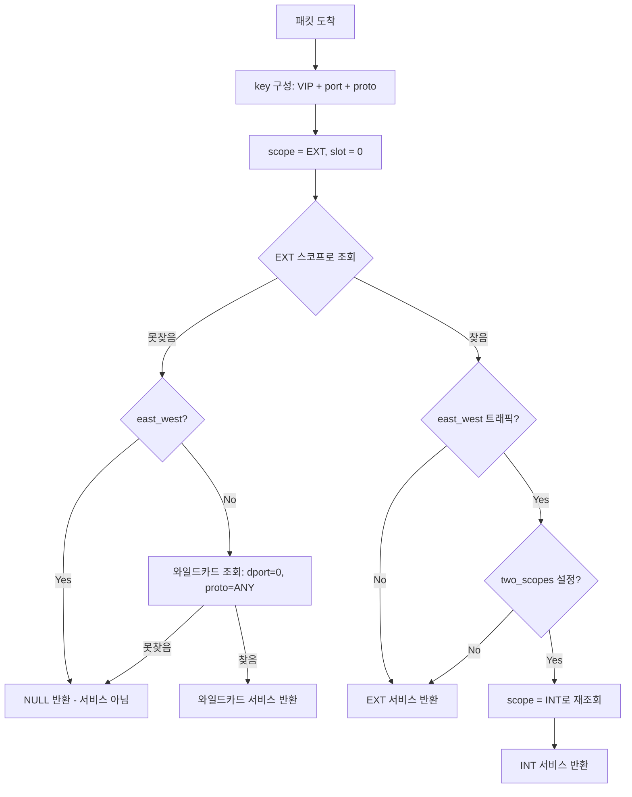
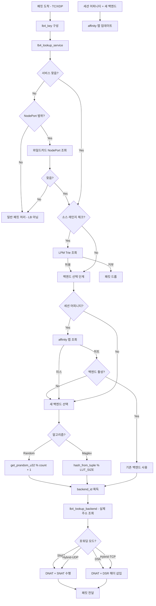

# 09. Cilium 로드 밸런싱 서브시스템 Deep-Dive

## 1. 개요

Cilium의 로드 밸런싱은 Kubernetes의 kube-proxy를 완전히 대체하는 BPF 기반 고성능 로드 밸런서다.
전통적인 iptables/IPVS 기반 구현과 달리, Cilium은 커널의 네트워크 스택 초입에서
BPF 프로그램을 통해 패킷을 직접 처리하여 불필요한 커널 계층 순회를 제거한다.

### 왜 BPF 기반 로드 밸런싱인가?

kube-proxy의 iptables 모드는 서비스 수가 늘어날수록 O(n) 규칙 순회로 성능이 선형적으로
저하된다. IPVS 모드도 conntrack 의존성과 커널 모듈 로딩 등의 운영 복잡성이 존재한다.

Cilium은 이 문제를 근본적으로 해결한다:

| 비교 항목 | iptables | IPVS | Cilium BPF |
|-----------|----------|------|------------|
| 서비스 조회 | O(n) 규칙 순회 | O(1) 해시 테이블 | O(1) BPF 맵 |
| 패킷 처리 위치 | netfilter 훅 | netfilter 훅 | TC/XDP (커널 초입) |
| 규칙 업데이트 | 전체 교체 | 증분 업데이트 | 맵 엔트리 업데이트 |
| DSR 지원 | 불가 | 가능 | 네이티브 지원 |
| 세션 어피니티 | conntrack 기반 | conntrack 기반 | 전용 BPF 맵 |
| 소스 레인지 | iptables 규칙 | ipset | LPM Trie 맵 |

### 핵심 설계 원칙

1. **데이터 경로의 최소화**: XDP(eXpress Data Path) 또는 TC(Traffic Control) 훅에서 패킷을
   처리하여 커널 네트워크 스택 순회를 최소화
2. **O(1) 조회**: BPF 해시 맵을 사용하여 서비스/백엔드 조회를 상수 시간에 수행
3. **유연한 백엔드 선택**: Random, Maglev 일관된 해싱 등 서비스별 알고리즘 선택 가능
4. **커널 우회 포워딩**: DSR(Direct Server Return)으로 응답 패킷이 로드 밸런서를 거치지 않음

### 아키텍처 개요

```
                     Kubernetes API
                          |
                    [Cilium Agent]
                    (Go userspace)
                          |
            +-------------+-------------+
            |             |             |
    Service Table   Backend Table   Maglev LUT
    (StateDB)       (StateDB)     (계산 후 BPF)
            |             |             |
            v             v             v
    +--------------------------------------------------+
    |              BPF Maps (커널 공간)                   |
    |  cilium_lb4_services_v2  cilium_lb4_backends_v3   |
    |  cilium_lb4_affinity     cilium_lb4_reverse_nat   |
    |  cilium_lb4_source_range cilium_lb4_maglev        |
    +--------------------------------------------------+
            |
            v
    +--------------------------------------------------+
    |           BPF 프로그램 (TC/XDP)                     |
    |  lb4_lookup_service() -> lb4_select_backend_id()  |
    |  -> DNAT/DSR/SNAT 처리                             |
    +--------------------------------------------------+
```

---

## 2. 데이터 구조 (서비스, 프론트엔드, 백엔드)

Cilium의 로드 밸런싱 데이터 모델은 세 개의 핵심 구조체로 구성된다.
이 구조체들은 Go userspace에서 정의되며, BPF 맵에 직렬화되어 커널 공간에서 사용된다.

### 2.1 Service 구조체

파일: `pkg/loadbalancer/service.go` (라인 30-100)

```go
type Service struct {
    Name                   ServiceName          // 정규화된 서비스 이름
    Source                 source.Source         // 데이터 소스 (k8s, kvstore 등)
    Labels                 labels.Labels         // 서비스 레이블
    Annotations            map[string]string     // 서비스 어노테이션
    Selector               map[string]string     // 파드 셀렉터
    NatPolicy              SVCNatPolicy          // NAT46/64 정책
    ExtTrafficPolicy       SVCTrafficPolicy      // 외부(North-South) 트래픽 정책
    IntTrafficPolicy       SVCTrafficPolicy      // 내부(East-West) 트래픽 정책
    ForwardingMode         SVCForwardingMode     // DSR/SNAT 포워딩 모드
    SessionAffinity        bool                  // 세션 어피니티 활성화 여부
    SessionAffinityTimeout time.Duration         // 세션 어피니티 타임아웃
    LoadBalancerClass      *string               // LB 클래스 (외부 LB 연동용)
    ProxyRedirect          *ProxyRedirect        // 로컬 프록시 리다이렉트
    HealthCheckNodePort    uint16                // 헬스체크 NodePort
    LoopbackHostPort       bool                  // HostPort 루프백 노출
    SourceRanges           []netip.Prefix        // 소스 레인지 제한
    PortNames              map[string]uint16     // 포트 이름 -> 포트 번호 매핑
    TrafficDistribution    TrafficDistribution   // 토폴로지 인식 라우팅
}
```

**왜 ExtTrafficPolicy와 IntTrafficPolicy를 분리하는가?**

Kubernetes 1.21부터 `internalTrafficPolicy`가 도입되었다. 외부에서 유입되는 트래픽
(NodePort, LoadBalancer)과 클러스터 내부 트래픽(ClusterIP)에 대해 각각 다른 백엔드 선택
정책을 적용할 수 있어야 한다. 예를 들어:

- `externalTrafficPolicy: Local`: 외부 트래픽은 로컬 백엔드만 선택 (지연 최소화, 소스 IP 보존)
- `internalTrafficPolicy: Local`: 내부 트래픽도 로컬 백엔드만 선택 (네트워크 홉 최소화)

이 두 정책이 독립적이므로 BPF 데이터패스에서도 두 개의 스코프(EXT/INT)를 지원해야 한다.

### 2.2 Frontend 구조체

파일: `pkg/loadbalancer/frontend.go` (라인 25-81)

```go
type FrontendParams struct {
    Address     L3n4Addr     // 프론트엔드 주소와 포트
    Type        SVCType      // ClusterIP, NodePort, LoadBalancer 등
    ServiceName ServiceName  // 연관 서비스 이름
    PortName    FEPortName   // 백엔드 포트 이름 필터
    ServicePort uint16       // ClusterIP 포트
}

type Frontend struct {
    FrontendParams
    Status              reconciler.Status  // 조정(reconciliation) 상태
    Backends            BackendsSeq2       // 연관 백엔드 이터레이터
    HealthCheckBackends BackendsSeq2       // 헬스체크 대상 백엔드
    ID                  ServiceID          // BPF 맵 키로 사용되는 식별자
    RedirectTo          *ServiceName       // 로컬 리다이렉트 대상
    Service             *Service           // 연관 서비스 포인터
}
```

**SVCType 열거값** (파일: `pkg/loadbalancer/loadbalancer.go`, 라인 43-53):

| SVCType | 설명 |
|---------|------|
| `ClusterIP` | 클러스터 내부 가상 IP |
| `NodePort` | 모든 노드의 특정 포트에서 수신 |
| `LoadBalancer` | 외부 로드 밸런서 IP |
| `ExternalIPs` | 외부 IP 주소 |
| `HostPort` | 파드가 실행 중인 호스트의 포트 |
| `LocalRedirect` | 로컬 리다이렉트 정책 |

**왜 Frontend과 Service를 분리하는가?**

하나의 Service는 여러 Frontend을 가질 수 있다. 예를 들어, `type: LoadBalancer` 서비스는:
- ClusterIP 프론트엔드 (내부 접근용)
- NodePort 프론트엔드 (각 노드에서)
- LoadBalancer IP 프론트엔드 (외부 LB에서)

각 프론트엔드가 동일한 백엔드 풀을 공유하지만, 트래픽 정책이 다를 수 있으므로
Frontend과 Service를 분리하여 유연성을 확보한다.

### 2.3 BackendParams 구조체

파일: `pkg/loadbalancer/backend.go` (라인 24-62)

```go
type BackendParams struct {
    Address    L3n4Addr       // 백엔드 IP와 포트
    PortNames  []string       // 포트 이름 (프론트엔드 매칭용)
    Weight     uint16         // 가중치 (Maglev에서 사용)
    NodeName   string         // 백엔드가 실행 중인 노드
    Zone       *BackendZone   // 토폴로지 존 정보
    ClusterID  uint32         // 클러스터 ID (멀티클러스터)
    Source     source.Source  // 데이터 소스
    State      BackendState   // 백엔드 상태
    Unhealthy  bool           // 헬스체크 실패 여부
    UnhealthyUpdatedAt *time.Time // 마지막 건강 상태 업데이트 시각
}
```

**BackendState 상태 머신** (파일: `pkg/loadbalancer/loadbalancer.go`, 라인 400-426):

```
                  +-----------+
                  |  Active   |  <-- 기본 상태, LB 트래픽 수신
                  +-----+-----+
                        |
          +-------------+-------------+
          |             |             |
    +-----v-----+ +----v------+ +----v-------+
    |Terminating| |Quarantined| |Maintenance |
    |           | |           | |            |
    +-----------+ +-----------+ +------------+
     그레이스풀     LB 제외,      LB 제외,
     종료 중        헬스체크 대상  헬스체크도 제외
```

| 상태 | 설명 | LB 트래픽 | 헬스체크 |
|------|------|-----------|----------|
| `Active` | 정상 동작 | O | O |
| `Terminating` | 종료 중 (활성 백엔드 없을 때 폴백 가능) | 폴백만 | X |
| `Quarantined` | 격리됨 (헬스체크 실패) | X | O |
| `Maintenance` | 유지보수 모드 | X | X |

**왜 BackendParams의 크기를 제한하는가?**

파일에서 `maxBackendParamsSize = 110`으로 크기를 제한하고 컴파일 타임에 검사한다
(라인 64-75). 이는 StateDB에 수만 개의 백엔드가 저장될 수 있기 때문이다.
메모리 사용량을 최소화하기 위해 자주 사용되지 않는 필드는 포인터로 간접 참조하도록
설계되어 있다 (예: `Zone *BackendZone`, `UnhealthyUpdatedAt *time.Time`).

---

## 3. BPF 맵 구조

Cilium의 로드 밸런싱은 7가지 핵심 BPF 맵을 사용한다.
이 맵들은 Go userspace에서 채워지고, BPF 프로그램에서 조회된다.

파일: `bpf/lib/lb.h` (라인 182-334)

### 3.1 맵 목록과 용도

```
+-----------------------------------+-------------------+-----------------------------------+
| BPF 맵 이름                        | 맵 타입            | 용도                               |
+===================================+===================+===================================+
| cilium_lb4_services_v2            | HASH              | 서비스 프론트엔드 + 백엔드 슬롯 조회  |
| cilium_lb4_backends_v3            | HASH              | 백엔드 ID → 실제 주소/포트 조회       |
| cilium_lb4_affinity               | LRU_HASH          | 세션 어피니티 (클라이언트→백엔드 매핑) |
| cilium_lb4_reverse_nat            | HASH              | Reverse NAT (응답 패킷 복원)          |
| cilium_lb4_source_range           | LPM_TRIE          | 소스 IP 레인지 접근 제어              |
| cilium_lb4_maglev                 | HASH_OF_MAPS      | Maglev 룩업 테이블 (서비스별)         |
| cilium_lb_affinity_match          | HASH              | 어피니티 매치 검증                     |
+-----------------------------------+-------------------+-----------------------------------+
```

IPv6도 동일한 구조로 `lb6_*` 접두사를 가진 별도 맵이 존재한다.

### 3.2 서비스 맵 키/값 구조

**lb4_key** (파일: `bpf/lib/lb.h`, 라인 66-73):

```c
struct lb4_key {
    __be32 address;       // 서비스 가상 IPv4 주소
    __be16 dport;         // L4 포트 (0이면 모든 포트)
    __u16 backend_slot;   // 백엔드 슬롯 번호 (0 = 프론트엔드 마스터)
    __u8 proto;           // L4 프로토콜 (TCP/UDP/SCTP/ANY)
    __u8 scope;           // LB_LOOKUP_SCOPE_EXT(0) / LB_LOOKUP_SCOPE_INT(1)
    __u8 pad[2];
};
```

**lb4_service** (파일: `bpf/lib/lb.h`, 라인 75-106):

```c
struct lb4_service {
    union {
        __u32 backend_id;          // 비마스터 엔트리: 백엔드 ID
        __u32 affinity_timeout;    // 마스터 엔트리: 상위 8비트 = 알고리즘, 하위 24비트 = 타임아웃
        __u32 l7_lb_proxy_port;    // L7 LB 프록시 포트
    };
    __u16 count;           // 백엔드 슬롯 수 (마스터 엔트리만)
    __u16 rev_nat_index;   // Reverse NAT ID
    __u8 flags;            // 서비스 플래그 (flags)
    __u8 flags2;           // 서비스 플래그 2 (flags2)
    __u16 qcount;          // 격리된 백엔드 수 (마스터 엔트리만)
};
```

**왜 union으로 설계하는가?**

`backend_id`와 `affinity_timeout`은 동일한 메모리 위치를 공유한다. 이는 BPF 맵의
메모리 효율성을 위한 것이다:
- `backend_slot = 0` (마스터 엔트리): `affinity_timeout` 사용 (알고리즘 + 타임아웃)
- `backend_slot > 0` (슬롯 엔트리): `backend_id` 사용 (실제 백엔드 참조)

알고리즘은 상위 8비트에 인코딩된다 (라인 383-384):

```c
#define LB_ALGORITHM_SHIFT    24
#define AFFINITY_TIMEOUT_MASK ((1 << LB_ALGORITHM_SHIFT) - 1)
```

- 상위 8비트: 1 = Random, 2 = Maglev
- 하위 24비트: 세션 어피니티 타임아웃 (초)

### 3.3 백엔드 맵 구조

**lb4_backend** (파일: `bpf/lib/lb.h`, 라인 108-119):

```c
struct lb4_backend {
    __be32 address;      // 백엔드 IPv4 주소
    __be16 port;         // L4 포트
    __u8 proto;          // L4 프로토콜 (현재 미사용, 0)
    __u8 flags;          // 백엔드 상태 플래그
    __u16 cluster_id;    // 클러스터 ID (멀티클러스터 구분)
    __u8 zone;           // 토폴로지 존
    __u8 pad;
};
```

백엔드 상태 플래그 (라인 365-371):

```c
enum {
    BE_STATE_ACTIVE      = 0,   // 활성 (LB 트래픽 수신)
    BE_STATE_TERMINATING,       // 종료 중
    BE_STATE_QUARANTINED,       // 격리 (헬스체크 실패)
    BE_STATE_MAINTENANCE,       // 유지보수 모드
};
```

### 3.4 서비스 맵의 슬롯 구조

하나의 서비스가 BPF 맵에 저장되는 방식은 마스터-슬롯 패턴이다:

```
cilium_lb4_services_v2:

키: {addr=10.96.0.1, port=443, slot=0, proto=TCP, scope=EXT}
값: {count=3, rev_nat_index=1, flags=..., qcount=0}       ← 마스터 엔트리

키: {addr=10.96.0.1, port=443, slot=1, proto=TCP, scope=EXT}
값: {backend_id=101}                                       ← 슬롯 1

키: {addr=10.96.0.1, port=443, slot=2, proto=TCP, scope=EXT}
값: {backend_id=102}                                       ← 슬롯 2

키: {addr=10.96.0.1, port=443, slot=3, proto=TCP, scope=EXT}
값: {backend_id=103}                                       ← 슬롯 3
```

**왜 슬롯 기반인가?**

BPF에서는 동적 배열이 불가능하다. 따라서 백엔드 목록을 별도의 맵 엔트리로 분리하고,
마스터 엔트리의 `count` 필드로 슬롯 수를 관리한다. Random 알고리즘은 이 슬롯을 직접
인덱싱하여 O(1)에 백엔드를 선택한다.

---

## 4. 서비스 조회 알고리즘

패킷이 도착하면 BPF 프로그램은 먼저 해당 패킷의 목적지가 서비스 VIP인지 확인한다.

### 4.1 lb4_lookup_service() 흐름

파일: `bpf/lib/lb.h` (라인 1701-1737)

```c
static __always_inline const struct lb4_service *
lb4_lookup_service(struct lb4_key *key, const bool east_west)
{
    const struct lb4_service *svc;
    __u16 dport;
    __u8 proto;

    key->backend_slot = 0;

    // 1단계: 외부 스코프로 조회
    key->scope = LB_LOOKUP_SCOPE_EXT;
    svc = __lb4_lookup_service(key);

    if (!svc) {
        if (east_west)
            return NULL;

        // 2단계: 와일드카드 폴백 (dport=0, proto=ANY)
        lb4_key_to_wildcard(key, &proto, &dport);
        svc = __lb4_lookup_service(key);
        if (svc)
            return svc;

        lb4_wildcard_to_key(key, proto, dport);
        return NULL;
    }

    // 3단계: East-West 트래픽이고 two-scope인 경우 내부 스코프로 재조회
    if (!east_west || !lb4_svc_is_two_scopes(svc))
        return svc;

    key->scope = LB_LOOKUP_SCOPE_INT;
    return __lb4_lookup_service(key);
}
```

### 4.2 조회 흐름 다이어그램



### 4.3 Two-Scope 메커니즘

**왜 two-scope가 필요한가?**

`externalTrafficPolicy: Local`과 `internalTrafficPolicy: Cluster`를 동시에 설정하면,
외부 트래픽은 로컬 백엔드만, 내부 트래픽은 모든 백엔드를 사용해야 한다.
이를 위해 동일 서비스에 대해 두 세트의 백엔드 슬롯을 유지한다:

```
서비스: my-svc (extTrafficPolicy=Local, intTrafficPolicy=Cluster)

EXT 스코프 (scope=0):
  slot 0: {count=1, flags=EXT_LOCAL_SCOPE}  ← 로컬 백엔드만
  slot 1: {backend_id=101}                   ← 로컬 백엔드

INT 스코프 (scope=1):
  slot 0: {count=3, flags=INT_LOCAL_SCOPE}   ← 모든 백엔드
  slot 1: {backend_id=101}
  slot 2: {backend_id=102}
  slot 3: {backend_id=103}
```

서비스 플래그 `SVC_FLAG_TWO_SCOPES` (flags2, 비트 5)가 설정되면 BPF 프로그램이
East-West 트래픽에 대해 자동으로 INT 스코프를 사용한다.

### 4.4 와일드카드 조회

와일드카드 서비스는 `dport=0`, `proto=IPPROTO_ANY`로 등록된 특수 엔트리다 (라인 373-381):

```c
#define IPPROTO_ANY           0
#define LB_SVC_WILDCARD_PROTO IPPROTO_ANY
#define LB_SVC_WILDCARD_DPORT 0
```

이 메커니즘의 목적은 알려진 서비스 IP에 대해 등록되지 않은 포트로의 접근을
감지하여 드롭하는 것이다. 와일드카드 엔트리에는 백엔드가 없으므로 매칭되면
패킷이 드롭된다.

---

## 5. 백엔드 선택 알고리즘 (Random vs Maglev)

서비스 조회 후 마스터 엔트리를 찾으면, 다음 단계는 구체적인 백엔드를 선택하는 것이다.
Cilium은 두 가지 알고리즘을 지원한다.

파일: `pkg/loadbalancer/config.go` (라인 107-112)

```go
const (
    LBAlgorithmRandom = "random"   // 랜덤 선택 (기본값)
    LBAlgorithmMaglev = "maglev"   // Maglev 일관된 해싱
)
```

### 5.1 서비스별 알고리즘 선택 (Per-Service)

Cilium은 서비스별로 다른 알고리즘을 사용할 수 있다. 이 정보는 마스터 엔트리의
`affinity_timeout` 필드 상위 8비트에 인코딩된다:

파일: `bpf/lib/lb.h` (라인 1849-1853)

```c
static __always_inline __u32 lb4_algorithm(const struct lb4_service *svc)
{
    return svc->affinity_timeout >> LB_ALGORITHM_SHIFT ? : LB_SELECTION;
}
```

`LB_ALGORITHM_SHIFT = 24`이므로 상위 8비트를 추출한다. 값이 0이면 글로벌 기본값
(`LB_SELECTION`)을 사용한다.

### 5.2 Random 알고리즘

파일: `bpf/lib/lb.h` (라인 1804-1816)

```c
static __always_inline __u32
lb4_select_backend_id_random(struct __ctx_buff *ctx,
                             struct lb4_key *key,
                             const struct ipv4_ct_tuple *tuple __maybe_unused,
                             const struct lb4_service *svc)
{
    /* Backend slot 0 is always reserved for the service frontend. */
    __u16 slot = (get_prandom_u32() % svc->count) + 1;
    const struct lb4_service *be = lb4_lookup_backend_slot(ctx, key, slot);
    return be ? be->backend_id : 0;
}
```

동작 원리:
1. `get_prandom_u32()`: BPF 커널 헬퍼로 의사 난수 생성
2. `% svc->count`: 백엔드 수로 모듈러 연산하여 1~count 범위의 슬롯 번호 생성
3. `+ 1`: 슬롯 0은 마스터 엔트리이므로 1부터 시작
4. `lb4_lookup_backend_slot()`: 해당 슬롯의 `backend_id`를 조회

**시간 복잡도**: O(1) - 단일 난수 생성 + 단일 맵 조회

**장점**: 구현이 간단하고 빠르며, BPF 프로그램의 명령어 수가 적다.
**단점**: 백엔드 추가/제거 시 기존 연결이 다른 백엔드로 재분배될 수 있다.

### 5.3 Maglev 알고리즘

파일: `bpf/lib/lb.h` (라인 1819-1846)

```c
static __always_inline __u32
lb4_select_backend_id_maglev(struct __ctx_buff *ctx __maybe_unused,
                             struct lb4_key *key __maybe_unused,
                             const struct ipv4_ct_tuple *tuple,
                             const struct lb4_service *svc)
{
    __be16 sport = lb4_svc_is_affinity(svc) ? 0 : tuple->dport;
    __be16 dport = tuple->sport;
    __u32 zero = 0, index = svc->rev_nat_index;
    __u32 *backend_ids;
    void *maglev_lut;

    maglev_lut = map_lookup_elem(&cilium_lb4_maglev, &index);
    if (unlikely(!maglev_lut))
        return 0;

    backend_ids = map_lookup_elem(maglev_lut, &zero);
    if (unlikely(!backend_ids))
        return 0;

    index = __hash_from_tuple_v4(tuple, sport, dport) % LB_MAGLEV_LUT_SIZE;
    return map_array_get_32(backend_ids, index, (LB_MAGLEV_LUT_SIZE - 1) << 2);
}
```

동작 원리:
1. `rev_nat_index`로 해당 서비스의 Maglev 룩업 테이블을 찾음
2. 4-튜플(src IP, dst IP, src port, dst port)을 해시하여 LUT 인덱스 계산
3. LUT에서 `backend_id`를 직접 읽어 반환

**왜 세션 어피니티가 설정되면 sport를 0으로 하는가?**

`lb4_svc_is_affinity(svc) ? 0 : tuple->dport` - 세션 어피니티가 활성화된 경우
소스 포트를 무시하여 같은 클라이언트 IP에서 오는 모든 연결이 동일한 해시를
생성하도록 한다. 이렇게 하면 Maglev 테이블에서 항상 같은 백엔드가 선택된다.

### 5.4 알고리즘 비교

| 항목 | Random | Maglev |
|------|--------|--------|
| 연결 일관성 | 없음 (매 패킷 재선택) | 있음 (동일 해시 → 동일 백엔드) |
| 백엔드 변경 시 영향 | 모든 연결이 재분배 가능 | ~1/N 연결만 재분배 |
| 메모리 사용 | 슬롯 엔트리만 | 슬롯 + LUT (서비스당 ~64KB) |
| BPF 명령어 수 | 적음 | 중간 (해시 계산 포함) |
| 적합한 사용 사례 | 짧은 연결 (HTTP) | 긴 연결 (gRPC, WebSocket) |

---

## 6. Maglev 일관된 해싱 상세

Maglev는 Google이 2016년 논문에서 발표한 일관된 해싱(consistent hashing) 알고리즘이다.
전통적인 링 기반 일관된 해싱과 달리, 고정 크기 룩업 테이블을 사용하여 O(1) 조회를 보장한다.

### 6.1 구성

파일: `pkg/maglev/maglev.go` (라인 37-48)

```go
const (
    DefaultTableSize = 16381                // M: 소수(prime), LUT 크기
    DefaultHashSeed  = "JLfvgnHc2kaSUFaI"   // 12바이트 시드 (base64)
)

var maglevSupportedTableSizes = []uint{
    251, 509, 1021, 2039, 4093, 8191, 16381, 32749, 65521, 131071,
}
```

**왜 소수 크기인가?**

Maglev 알고리즘에서 각 백엔드는 `offset + i * skip` (mod M) 수열로 선호 슬롯을
생성한다. M이 소수여야 `skip`과 M이 서로소가 되어 모든 슬롯을 빠짐없이 순회할 수
있다. 합성수를 사용하면 특정 슬롯에 접근하지 못하는 순열이 발생할 수 있다.

**왜 16381이 기본값인가?**

Maglev 논문은 "M을 100 * N 이상으로 선택하면 백엔드 간 해시 공간 차이가 1% 이내"라고
권장한다. 16381은 최대 ~163개 백엔드에 대해 1% 이내의 균등 분배를 보장하며,
일반적인 Kubernetes 서비스의 백엔드 수에 충분하다.

### 6.2 Offset/Skip 순열 계산

파일: `pkg/maglev/maglev.go` (라인 203-208)

```go
func getOffsetAndSkip(addr []byte, m uint64, seed uint32) (uint64, uint64) {
    h1, h2 := murmur3.Hash128(addr, seed)
    offset := h1 % m
    skip := (h2 % (m - 1)) + 1
    return offset, skip
}
```

각 백엔드에 대해:
- **offset**: 순열의 시작점 (h1 mod M)
- **skip**: 순열의 간격 (h2 mod (M-1) + 1, 항상 1 이상)

MurmurHash3-128을 사용하여 두 개의 독립적인 64비트 해시를 생성한다.
이것으로 각 백엔드는 고유한 선호 순서(permutation)를 갖게 된다.

### 6.3 룩업 테이블 생성 알고리즘

파일: `pkg/maglev/maglev.go` (라인 292-338)

```go
func (ml *Maglev) computeLookupTable() []loadbalancer.BackendID {
    backends := ml.backendInfosBuffer
    m := uint64(ml.TableSize)

    // 1. 가중치 준비
    l := len(backends)
    weightSum := uint64(0)
    weightCntr := make([]float64, l)
    for i, info := range backends {
        weightSum += uint64(info.Weight)
        weightCntr[i] = float64(info.Weight) / float64(l)
    }
    weightsUsed := weightSum/uint64(l) > 1

    // 2. 순열(permutation) 계산
    perm := ml.getPermutation(backends, runtime.NumCPU())

    // 3. 라운드 로빈으로 테이블 채우기
    next := make([]int, len(backends))
    entry := make([]loadbalancer.BackendID, m)
    for j := range m {
        entry[j] = 0xffff_ffff  // sentinel
    }

    for n := range m {
        i := int(n) % l
        for {
            info := backends[i]
            if weightsUsed {
                if ((n + 1) * uint64(info.Weight)) < uint64(weightCntr[i]) {
                    i = (i + 1) % l
                    continue
                }
                weightCntr[i] += float64(weightSum)
            }
            c := perm[i*int(m)+next[i]]
            for entry[c] != sentinel {
                next[i] += 1
                c = perm[i*int(m)+next[i]]
            }
            entry[c] = info.ID
            next[i] += 1
            break
        }
    }
    return entry
}
```

### 6.4 Maglev 테이블 생성 과정 시각화

백엔드 3개 (A, B, C), 테이블 크기 M=7인 예시:

```
Step 1: 각 백엔드의 선호 순열 계산
  A: offset=3, skip=1 → [3, 4, 5, 6, 0, 1, 2]
  B: offset=0, skip=2 → [0, 2, 4, 6, 1, 3, 5]
  C: offset=5, skip=4 → [5, 2, 6, 3, 0, 4, 1]

Step 2: 라운드 로빈으로 테이블 채우기
  라운드 0: A 차례 → A의 선호[0]=3 → entry[3]=A
  라운드 1: B 차례 → B의 선호[0]=0 → entry[0]=B
  라운드 2: C 차례 → C의 선호[0]=5 → entry[5]=C
  라운드 3: A 차례 → A의 선호[1]=4 → entry[4]=A
  라운드 4: B 차례 → B의 선호[1]=2 → entry[2]=B
  라운드 5: C 차례 → C의 선호[1]=2 → 이미 사용! → 선호[2]=6 → entry[6]=C
  라운드 6: A 차례 → A의 선호[2]=5 → 이미 사용! → 선호[3]=6 → 이미 사용!
                     → 선호[4]=0 → 이미 사용! → 선호[5]=1 → entry[1]=A

  최종 테이블: [B, A, B, A, A, C, C]
```

### 6.5 가중치 지원

Envoy의 가중치 구현에서 영감을 받아 (라인 263), 백엔드 가중치에 따라
라운드 로빈에서 해당 백엔드의 차례가 더 자주 오도록 조정한다.

```
가중치 2인 백엔드 A는 가중치 1인 백엔드 B보다 2배 더 많은 슬롯을 차지
```

### 6.6 병렬 계산

파일: `pkg/maglev/maglev.go` (라인 150-201)

순열 계산은 CPU 코어 수만큼 워커 풀을 사용하여 병렬로 수행한다.
백엔드 수가 많을수록 순열 계산의 비용이 크기 때문이다:

```go
func (ml *Maglev) getPermutation(backends []BackendInfo, numCPU int) []uint64 {
    batchSize := bCount / numCPU
    for g := 0; g < bCount; g += batchSize {
        from, to := g, g+batchSize
        ml.wp.Submit("", func(_ context.Context) error {
            for i := from; i < to; i++ {
                offset, skip := getOffsetAndSkip(...)
                for j := 1; j < m; j++ {
                    ml.permutations[start+j] = (ml.permutations[start+(j-1)] + skip) % uint64(m)
                }
            }
            return nil
        })
    }
    ml.wp.Drain()
    return ml.permutations[:bCount*int(m)]
}
```

### 6.7 BPF 맵에서의 Maglev LUT 저장

파일: `bpf/lib/lb.h` (라인 308-324)

```c
struct {
    __uint(type, BPF_MAP_TYPE_HASH_OF_MAPS);
    __type(key, __u16);               // rev_nat_index (서비스별 고유)
    __type(value, __u32);             // inner map fd
    __uint(max_entries, CILIUM_LB_MAGLEV_MAP_MAX_ENTRIES);
    __array(values, struct {
        __uint(type, BPF_MAP_TYPE_ARRAY);
        __uint(key_size, sizeof(__u32));
        __uint(value_size, sizeof(__u32) * LB_MAGLEV_LUT_SIZE);
        __uint(max_entries, 1);
    });
} cilium_lb4_maglev __section_maps_btf;
```

`HASH_OF_MAPS` 구조:
- 외부 맵: `rev_nat_index` → 내부 맵 fd (서비스별)
- 내부 맵: 단일 엔트리에 전체 LUT 저장 (`__u32` 배열, `LB_MAGLEV_LUT_SIZE` 크기)

**왜 HASH_OF_MAPS인가?**

각 서비스의 LUT 크기가 수만 엔트리에 달할 수 있다. 이를 단일 맵에 넣으면
value 크기 제한에 걸린다. 대신 서비스별로 독립 inner 맵을 할당하여:
1. 서비스마다 독립적으로 LUT을 교체할 수 있다 (atomic update)
2. 내부 배열 맵의 단일 엔트리에 전체 LUT를 저장하여 단일 맵 조회로 LUT 전체를 참조

---

## 7. 세션 어피니티 (Session Affinity)

세션 어피니티는 동일 클라이언트의 요청을 항상 같은 백엔드로 라우팅하는 기능이다.
Kubernetes의 `service.spec.sessionAffinity: ClientIP`에 해당한다.

### 7.1 어피니티 BPF 맵 구조

파일: `bpf/lib/lb.h` (라인 125-163)

**lb4_affinity_key**:
```c
union lb4_affinity_client_id {
    __u32 client_ip;           // 클라이언트 IPv4
    __net_cookie client_cookie; // 소켓 쿠키 (소켓 LB용)
} __packed;

struct lb4_affinity_key {
    union lb4_affinity_client_id client_id;
    __u16 rev_nat_id;          // 서비스 식별자
    __u8 netns_cookie:1,       // 네임스페이스 쿠키 사용 여부
         reserved:7;
    __u8 pad1;
    __u32 pad2;
} __packed;
```

**lb_affinity_val**:
```c
struct lb_affinity_val {
    __u64 last_used;     // 마지막 사용 시각 (ktime_get_ns)
    __u32 backend_id;    // 매핑된 백엔드 ID
    __u32 pad;
} __packed;
```

**lb_affinity_match**:
```c
struct lb_affinity_match {
    __u32 backend_id;
    __u16 rev_nat_id;
    __u16 pad;
} __packed;
```

### 7.2 어피니티 처리 흐름

```
+------------------+
| 패킷 도착         |
+--------+---------+
         |
    +----v----+
    | 서비스   |
    | 조회     |
    +----+----+
         |
    +----v----+     Yes    +--------------+     Yes    +----------------+
    | 어피니티 +----------->| affinity 맵  +----------->| 백엔드 아직    |
    | 설정?   |            | 조회          |            | 활성?          |
    +----+----+            +--------------+            +-------+--------+
         |No                     |No                           |Yes
         v                       v                             v
    +----------+          +-----------+               +--------------+
    | 일반 백엔드|          | 새 백엔드   |               | 기존 백엔드   |
    | 선택      |          | 선택 + 매핑  |               | 사용          |
    +----------+          | 저장        |               +--------------+
                          +-----------+
```

### 7.3 어피니티 검증: affinity_match 맵

**왜 별도의 affinity_match 맵이 필요한가?**

어피니티 맵에 저장된 백엔드가 이미 삭제되었을 수 있다. `affinity_match` 맵은
`(backend_id, rev_nat_id)` 쌍의 유효성을 빠르게 검증하는 역할을 한다.

```c
struct {
    __uint(type, BPF_MAP_TYPE_HASH);
    __type(key, struct lb_affinity_match);
    __type(value, __u8);
    __uint(max_entries, CILIUM_LB_AFFINITY_MAP_MAX_ENTRIES);
} cilium_lb_affinity_match __section_maps_btf;
```

파일: `bpf/lib/lb.h` (라인 326-333)

이 맵은 Go userspace에서 백엔드를 서비스에 추가/제거할 때 함께 업데이트된다.

### 7.4 타임아웃 인코딩

어피니티 타임아웃은 마스터 엔트리의 `affinity_timeout` 필드 하위 24비트에 저장된다:

```
affinity_timeout 필드 (32비트):
+--------+------------------------+
| 알고리즘 |    타임아웃 (초)         |
| (8비트) |    (24비트)             |
+--------+------------------------+
```

최대 타임아웃: 2^24 - 1 = 16,777,215초 (~194일)

### 7.5 LRU 자동 만료

어피니티 맵은 `BPF_MAP_TYPE_LRU_HASH`를 사용한다. 맵이 가득 차면 가장 오래된
(LRU) 엔트리가 자동으로 제거된다. 이는 명시적인 타임아웃 스캔 없이도
메모리를 효율적으로 관리한다.

`last_used` 필드로 userspace에서 주기적으로 만료된 엔트리를 정리할 수도 있다.

---

## 8. 포워딩 모드 (SNAT vs DSR vs Hybrid)

Cilium은 세 가지 패킷 포워딩 모드를 지원한다.

파일: `pkg/loadbalancer/config.go` (라인 114-131)

```go
const (
    LBModeSNAT   = "snat"    // 소스 NAT
    LBModeDSR    = "dsr"     // Direct Server Return
    LBModeHybrid = "hybrid"  // TCP=DSR, UDP=SNAT
)
```

### 8.1 SNAT (Source NAT)

```
Client (1.1.1.1:5000)
    |
    | dst=10.96.0.1:80
    v
+--Node A (로드밸런서)--+
|  DNAT: dst → 10.0.1.2:8080  |
|  SNAT: src → Node A IP      |
+---------------------------+
    |
    | src=NodeA, dst=10.0.1.2:8080
    v
+--Node B (백엔드)--+
|  응답: dst=NodeA  |
+------------------+
    |
    | src=10.0.1.2, dst=NodeA
    v
+--Node A (로드밸런서)--+
|  RevNAT: src → 10.96.0.1:80 |
|  RevSNAT: dst → 1.1.1.1     |
+---------------------------+
    |
    | src=10.96.0.1:80, dst=1.1.1.1:5000
    v
Client
```

**특징**:
- 모든 응답이 로드밸런서 노드를 경유
- 소스 IP가 변환됨 (원본 클라이언트 IP 손실)
- 모든 네트워크 환경에서 동작

### 8.2 DSR (Direct Server Return)

```
Client (1.1.1.1:5000)
    |
    | dst=10.96.0.1:80
    v
+--Node A (로드밸런서)--+
|  DNAT: dst → 10.0.1.2:8080           |
|  원본 서비스 정보를 IP 옵션/터널에 인코딩  |
+--------------------------------------+
    |
    | dst=10.0.1.2:8080 + DSR 정보
    v
+--Node B (백엔드)--+
|  DSR 정보에서 원본 VIP 추출  |
|  src=10.96.0.1:80로 직접 응답 |
+---------------------------+
    |
    | src=10.96.0.1:80, dst=1.1.1.1:5000
    v
Client  (Node A를 거치지 않음!)
```

**특징**:
- 응답이 로드밸런서를 경유하지 않음 (대역폭 절약)
- 소스 IP 보존
- 추가 헤더 오버헤드 존재

### 8.3 DSR 디스패치 방식

파일: `pkg/loadbalancer/config.go` (라인 123-130)

```go
const (
    DSRDispatchOption = "opt"     // IP 옵션/확장 헤더
    DSRDispatchIPIP   = "ipip"   // IP-in-IP 터널
    DSRDispatchGeneve = "geneve"  // Geneve 터널
)
```

#### DSR Option 방식

파일: `bpf/lib/nodeport.h` (라인 76-105)

**IPv4** (`dsr_opt_v4`):
```c
struct dsr_opt_v4 {
    __u8 type;     // DSR_IPV4_OPT_TYPE = IPOPT_COPY | 0x1a (0x9a)
    __u8 len;      // 8 (type + len + addr + port)
    __u16 port;    // 원본 서비스 포트
    __u32 addr;    // 원본 서비스 IPv4 주소
};

#define DSR_IPV4_OPT_TYPE (IPOPT_COPY | 0x1a)
```

`IPOPT_COPY`(0x80)를 설정하여 IP 분할(fragmentation) 시에도 옵션이
모든 분할 패킷에 복사되도록 한다. 옵션 번호 0x1a(26)는 IANA에서
미할당(unassigned) 상태이므로 충돌 위험이 없다.

**IPv6** (`dsr_opt_v6`):
```c
struct dsr_opt_v6 {
    struct ipv6_opt_hdr hdr;  // IPv6 Destination Option 헤더
    __u8 opt_type;            // DSR_IPV6_OPT_TYPE = 0x1B
    __u8 opt_len;
    union v6addr addr;        // 원본 서비스 IPv6 주소
    __be16 port;              // 원본 서비스 포트
    __u16 pad;
};

#define DSR_IPV6_OPT_TYPE 0x1B
```

IPv6에서는 Destination Option 확장 헤더를 사용한다. 옵션 타입 0x1B의 상위 2비트가
`00`이므로, 이 옵션을 이해하지 못하는 중간 노드는 무시하고 넘어간다.

#### DSR IPIP 방식

IP-in-IP 캡슐화로 원본 패킷을 감싸서 백엔드로 전달한다. 추가 IP 헤더(20바이트)
오버헤드가 발생하지만, 중간 네트워크 장비와의 호환성이 가장 높다.

#### DSR Geneve 방식

Geneve 터널을 사용하여 DSR 정보를 TLV(Type-Length-Value)로 인코딩한다.
기존 Geneve 기반 오버레이 네트워크(VXLAN/Geneve)를 사용하는 환경에서 유용하다.

### 8.4 Hybrid 모드

```go
LBModeHybrid = "hybrid"  // TCP=DSR, UDP=SNAT
```

**왜 Hybrid가 필요한가?**

- TCP: 커넥션 지향이므로 DSR이 효과적 (연결 설정 후 대량 응답 데이터가
  로드밸런서를 우회)
- UDP: 비연결형이며 패킷 크기 제약 (MTU)이 있는 경우 DSR의 추가 헤더가
  문제가 될 수 있음. 또한 UDP DNS 같은 짧은 요청/응답에서는 DSR의 이점이 적음

### 8.5 서비스별 포워딩 모드 제어

파일: `bpf/lib/lb.h` (라인 362, 1612-1614)

```c
SVC_FLAG_FWD_MODE_DSR = (1 << 7),  // flags2 비트 7

static __always_inline bool nodeport_uses_dsr4(const struct lb4_service *svc)
{
    return nodeport_uses_dsr(svc->flags2 & SVC_FLAG_FWD_MODE_DSR);
}
```

파일: `bpf/lib/nodeport.h` (라인 107-118)

```c
static __always_inline bool nodeport_uses_dsr(bool flip __maybe_unused)
{
#ifdef ENABLE_DSR
# ifdef ENABLE_DSR_BYUSER
    return flip;       // 서비스별 DSR 설정
# else
    return true;       // 전역 DSR 모드
# endif
#else
    return false;
#endif
}
```

`ENABLE_DSR_BYUSER`가 정의되면 `SVC_FLAG_FWD_MODE_DSR` 플래그에 따라
서비스별로 DSR 사용 여부를 결정한다. 이를 통해 서비스 어노테이션으로
개별 서비스의 포워딩 모드를 제어할 수 있다.

---

## 9. NodePort 처리

NodePort 서비스는 클러스터의 모든 노드에서 특정 포트로 외부 트래픽을 수신한다.

### 9.1 NodePort 범위

파일: `pkg/loadbalancer/config.go` (라인 100-104, 400-427)

```go
const (
    NodePortMinDefault = 30000
    NodePortMaxDefault = 32767
)
```

NodePort 범위는 `--node-port-range` 옵션으로 변경 가능하다.

### 9.2 와일드카드 NodePort 조회

파일: `bpf/lib/lb.h` (라인 1739-1759)

```c
static __always_inline const struct lb4_service *
lb4_lookup_wildcard_nodeport_service(struct lb4_key *key)
{
    const struct remote_endpoint_info *info;
    __u16 service_port;

    service_port = bpf_ntohs(key->dport);
    if (service_port < CONFIG(nodeport_port_min) ||
        service_port > CONFIG(nodeport_port_max))
        return NULL;

    info = lookup_ip4_remote_endpoint(key->address, 0);
    if (info && identity_is_remote_node(info->sec_identity) &&
        !info->flag_remote_cluster) {
        key->address = 0;
        return lb4_lookup_service(key, true);
    }

    return NULL;
}
```

처리 과정:
1. 포트가 NodePort 범위(30000-32767) 내인지 확인
2. 패킷의 목적지 IP가 원격 노드 IP인지 확인
3. 목적지 주소를 0으로 설정하여 와일드카드 조회 수행

**왜 address를 0으로 설정하는가?**

NodePort는 모든 노드에서 동일 포트로 수신하므로, 특정 IP에 바인딩되지 않는다.
BPF 맵에 `address=0`으로 등록하여 어떤 노드 IP로 들어오든 동일 서비스를 찾을 수 있다.

### 9.3 NodePort의 서비스 플래그

```c
SVC_FLAG_NODEPORT = (1 << 1)  // flags 비트 1
```

NodePort 서비스는 이 플래그가 설정된 상태로 BPF 맵에 등록된다. 이를 통해:
- DSR 활성화 여부 판단
- externalTrafficPolicy 적용 여부 결정
- 소스 레인지 검사 필요 여부 판단

---

## 10. 소스 레인지 제한

소스 레인지(Source Range)는 서비스에 접근할 수 있는 클라이언트 IP를 제한한다.
Kubernetes의 `spec.loadBalancerSourceRanges`에 해당한다.

### 10.1 BPF 맵 구조

파일: `bpf/lib/lb.h` (라인 165-180, 290-297)

```c
struct lb4_src_range_key {
    struct bpf_lpm_trie_key lpm_key;  // LPM 프리픽스 길이
    __u16 rev_nat_id;                  // 서비스 식별자
    __u16 pad;
    __u32 addr;                        // 클라이언트 IPv4 주소
};

struct {
    __uint(type, BPF_MAP_TYPE_LPM_TRIE);
    __type(key, struct lb4_src_range_key);
    __type(value, __u8);
    __uint(max_entries, LB4_SRC_RANGE_MAP_SIZE);
    __uint(map_flags, BPF_F_NO_PREALLOC);
} cilium_lb4_source_range __section_maps_btf;
```

### 10.2 LPM Trie를 사용하는 이유

**왜 LPM(Longest Prefix Match) Trie인가?**

소스 레인지는 CIDR 형식(예: `10.0.0.0/8`, `192.168.1.0/24`)으로 지정된다.
LPM Trie는 이진 트리 구조로 CIDR 매칭을 O(prefix_length)에 수행한다.
일반 해시 맵은 정확한 IP 매칭만 가능하지만, LPM Trie는 네트워크 프리픽스
매칭이 네이티브하게 지원된다.

```
LPM Trie 구조 예시:

                   root
                  /    \
                0        1
               / \      / \
             00    01  10    11
            (match)        (match)
            10.0.0.0/8    192.168.0.0/16
```

### 10.3 소스 레인지 검사 흐름

```
+--패킷 도착--+
      |
+-----v-------+
| 서비스 조회   |
+-----+-------+
      |
+-----v-----------+     No
| SVC_FLAG_SOURCE_ +---------> 일반 처리
| RANGE 설정?      |
+-----+-----------+
      |Yes
+-----v------------------+
| lb4_src_range_key 구성:  |
|   rev_nat_id = svc ID   |
|   addr = 클라이언트 IP    |
+-----+------------------+
      |
+-----v---------+     Yes
| LPM Trie 조회  +---------> 허용
|   매칭?        |
+-----+---------+
      |No
+-----v---------+
| SOURCE_RANGE_ |     Yes
| DENY 플래그?   +---------> 허용 (Deny 모드에서 미매칭 = 허용)
+-----+---------+
      |No
+-----v---------+
| 패킷 드롭      |
+---------------+
```

### 10.4 SVC_FLAG_SOURCE_RANGE_DENY

파일: `bpf/lib/lb.h` (라인 361)

```c
SVC_FLAG_SOURCE_RANGE_DENY = (1 << 6)  // flags2 비트 6
```

이 플래그가 설정되면 소스 레인지 검사가 반전(deny list)된다:
- 기본 (Allow): LPM 매칭 = 허용, 미매칭 = 거부
- DENY 모드: LPM 매칭 = 거부, 미매칭 = 허용

### 10.5 모든 서비스 타입에 적용

파일: `pkg/loadbalancer/config.go` (라인 41-42)

```go
LBSourceRangeAllTypes = "bpf-lb-source-range-all-types"
```

기본적으로 소스 레인지는 LoadBalancer 타입에만 적용된다. 이 옵션을 활성화하면
LoadBalancer에서 파생된 모든 서비스 타입(NodePort, ExternalIP 등)에도 적용된다.

---

## 11. 서비스 해석 흐름 (전체)

패킷이 Cilium 노드에 도착하여 로드 밸런싱되는 전체 흐름을 통합 다이어그램으로
정리한다.

### 11.1 전체 흐름 다이어그램



### 11.2 단계별 설명

| 단계 | 함수/맵 | 설명 |
|------|---------|------|
| 1 | `lb4_key` 구성 | 패킷의 dst IP, dst port, proto로 키 생성 |
| 2 | `lb4_lookup_service()` | `cilium_lb4_services_v2`에서 마스터 엔트리 조회 |
| 3 | 소스 레인지 검사 | `SVC_FLAG_SOURCE_RANGE` 시 `cilium_lb4_source_range` LPM 조회 |
| 4 | 어피니티 검사 | `SVC_FLAG_AFFINITY` 시 `cilium_lb4_affinity` 조회 |
| 5 | 백엔드 선택 | Random: 슬롯 조회 / Maglev: LUT 조회 |
| 6 | 백엔드 주소 조회 | `cilium_lb4_backends_v3`에서 실제 IP:port 조회 |
| 7 | 패킷 변환 | DNAT (+ SNAT or DSR) 수행 |
| 8 | Reverse NAT 등록 | `cilium_lb4_reverse_nat`에 매핑 저장 (응답 복원용) |

### 11.3 Conntrack 연계

첫 패킷에서 백엔드를 선택한 후, conntrack 엔트리가 생성된다. 이후 동일 연결의
패킷은 conntrack에서 직접 백엔드를 찾으므로 서비스 조회 단계를 건너뛴다.

```
첫 패킷:  서비스 조회 → 백엔드 선택 → conntrack 생성 → DNAT
이후 패킷: conntrack 조회 → DNAT (서비스 조회 건너뜀)
```

이 최적화로 인해 Random 알고리즘에서도 연결 내에서는 백엔드가 변경되지 않는다.
Maglev의 일관성 이점은 conntrack 엔트리가 없는 첫 패킷(새 연결)에서 발휘된다.

---

## 12. 왜 이 아키텍처인가?

### 12.1 왜 BPF 맵에 모든 것을 저장하는가?

**커널-유저스페이스 경계를 넘지 않기 위해서다.**

전통적인 프록시 방식(Envoy, HAProxy)은 유저스페이스에서 패킷을 수신하고,
목적지를 결정한 후 다시 커널로 보낸다. 이 과정에서 두 번의 컨텍스트 스위치가
발생한다.

Cilium은 서비스/백엔드 정보를 미리 BPF 맵에 채워두고, BPF 프로그램이 커널
공간에서 직접 조회한다. 결과적으로:

- 컨텍스트 스위치 0회
- 메모리 복사 0회
- 시스템 콜 0회

### 12.2 왜 Master-Slot 패턴인가?

BPF 맵의 값(value) 크기는 고정이다. 백엔드 목록은 서비스마다 다른 크기를 가지므로,
가변 크기 배열을 값에 넣을 수 없다. Master-Slot 패턴은 이 제약을 우회한다:

```
대안 1: 값에 가변 배열 → BPF 불가능
대안 2: 최대 크기 고정 배열 → 메모리 낭비 (백엔드 1개인 서비스도 최대 크기 사용)
대안 3: Master-Slot (Cilium 선택) → 유연하고 효율적
```

### 12.3 왜 Maglev인가? (vs Ring Hash)

| 비교 | Ring Hash | Maglev |
|------|-----------|--------|
| 조회 | O(log n) 이진 탐색 | O(1) 배열 인덱싱 |
| 메모리 | 가변 (가상 노드 수에 비례) | 고정 (M 크기 배열) |
| 분배 균등성 | 가상 노드 수에 의존 | 수학적으로 보장 |
| 백엔드 변경 시 | ~1/N 재분배 | ~1/N 재분배 |
| BPF 호환성 | 이진 탐색 루프 필요 | 단일 배열 접근 |

BPF 환경에서는 루프의 반복 횟수가 컴파일 타임에 결정되어야 하며, 복잡한 자료구조
접근이 제한된다. Maglev의 O(1) 배열 인덱싱은 BPF 프로그램에 이상적이다.

### 12.4 왜 LRU_HASH를 어피니티에 사용하는가?

세션 어피니티 엔트리는 수명이 불확실하다. 클라이언트가 다시 접속할지, 언제
접속할지 예측할 수 없다. `LRU_HASH`는:

1. 맵이 가득 차면 자동으로 가장 오래된 엔트리 제거
2. 명시적 타임아웃 스캔 불필요 (BPF 프로그램에서 GC 루프 실행 불가)
3. 메모리 사용량이 맵 크기로 상한 보장

### 12.5 왜 서비스별 알고리즘을 지원하는가?

워크로드 특성에 따라 최적의 알고리즘이 다르다:

- **HTTP API 서버** (짧은 연결, 무상태): Random이면 충분
- **gRPC 스트리밍** (긴 연결, 상태 있음): Maglev로 연결 일관성 보장
- **Redis/Memcached** (캐시 효율): Maglev로 동일 키가 동일 인스턴스로 라우팅

글로벌 설정만 제공하면 모든 서비스에 대해 불필요한 Maglev LUT을 생성하거나,
연결 일관성이 필요한 서비스에 Random이 적용되는 문제가 생긴다.

### 12.6 왜 DSR을 기본값으로 하지 않는가?

DSR이 성능적으로 우수하지만, 기본값으로 선택하지 않는 이유가 있다:

1. **네트워크 호환성**: IP 옵션이나 캡슐화를 지원하지 않는 중간 장비가 존재
2. **MTU 문제**: DSR 헤더 추가로 MTU 초과 가능 (특히 Geneve/IPIP)
3. **방화벽 규칙**: 일부 방화벽이 비표준 IP 옵션을 드롭
4. **디버깅 복잡성**: 응답이 다른 경로로 가므로 패킷 추적이 어려움

따라서 SNAT을 기본값으로 하되, 성능이 중요한 환경에서 명시적으로 DSR을 활성화하도록
설계했다.

---

## 13. 참고 파일 목록

### Go Userspace

| 파일 경로 | 내용 |
|-----------|------|
| `pkg/loadbalancer/service.go` | Service 구조체 정의 |
| `pkg/loadbalancer/frontend.go` | Frontend, FrontendParams 구조체 |
| `pkg/loadbalancer/backend.go` | BackendParams, Backend 구조체 |
| `pkg/loadbalancer/config.go` | LB 설정, 포워딩 모드, 알고리즘 상수 |
| `pkg/loadbalancer/loadbalancer.go` | SVCType, BackendState, ServiceFlags |
| `pkg/maglev/maglev.go` | Maglev 일관된 해싱 구현 |

### BPF Datapath

| 파일 경로 | 내용 |
|-----------|------|
| `bpf/lib/lb.h` | LB BPF 맵 정의, 서비스 조회, 백엔드 선택 |
| `bpf/lib/nodeport.h` | DSR 구조체, NodePort 처리, 포워딩 모드 |
| `bpf/include/linux/ip.h` | IPOPT_COPY 등 IP 옵션 상수 |

### 주요 BPF 함수

| 함수 | 파일:라인 | 용도 |
|------|-----------|------|
| `__lb4_lookup_service()` | `lb.h:1672` | 서비스 맵 직접 조회 |
| `lb4_lookup_service()` | `lb.h:1702` | 스코프/와일드카드 포함 조회 |
| `lb4_select_backend_id_random()` | `lb.h:1806` | Random 백엔드 선택 |
| `lb4_select_backend_id_maglev()` | `lb.h:1821` | Maglev 백엔드 선택 |
| `lb4_algorithm()` | `lb.h:1850` | 서비스별 알고리즘 결정 |
| `lb4_select_backend_id()` | `lb.h:1856` | 알고리즘 디스패치 |
| `lb4_lookup_backend()` | `lb.h:1768` | 백엔드 ID → 주소 조회 |
| `lb4_lookup_wildcard_nodeport_service()` | `lb.h:1740` | 와일드카드 NodePort 조회 |
| `nodeport_uses_dsr4()` | `nodeport.h:1612` | DSR 사용 여부 확인 |
| `nodeport_uses_dsr()` | `nodeport.h:107` | DSR 활성화 여부 |

### 주요 BPF 맵

| 맵 이름 | 타입 | 키 | 값 |
|---------|------|-----|-----|
| `cilium_lb4_services_v2` | HASH | `lb4_key` | `lb4_service` |
| `cilium_lb4_backends_v3` | HASH | `__u32` (backend_id) | `lb4_backend` |
| `cilium_lb4_affinity` | LRU_HASH | `lb4_affinity_key` | `lb_affinity_val` |
| `cilium_lb4_reverse_nat` | HASH | `__u16` (rev_nat_id) | `lb4_reverse_nat` |
| `cilium_lb4_source_range` | LPM_TRIE | `lb4_src_range_key` | `__u8` |
| `cilium_lb4_maglev` | HASH_OF_MAPS | `__u16` (rev_nat_id) | inner array |
| `cilium_lb_affinity_match` | HASH | `lb_affinity_match` | `__u8` |

### 서비스 플래그 (flags)

| 플래그 | 비트 | 용도 |
|--------|------|------|
| `SVC_FLAG_EXTERNAL_IP` | 0 | External IP 서비스 |
| `SVC_FLAG_NODEPORT` | 1 | NodePort 서비스 |
| `SVC_FLAG_EXT_LOCAL_SCOPE` | 2 | externalTrafficPolicy=Local |
| `SVC_FLAG_HOSTPORT` | 3 | hostPort 포워딩 |
| `SVC_FLAG_AFFINITY` | 4 | 세션 어피니티 활성화 |
| `SVC_FLAG_LOADBALANCER` | 5 | LoadBalancer 서비스 |
| `SVC_FLAG_ROUTABLE` | 6 | 라우팅 가능 (ClusterIP가 아닌) |
| `SVC_FLAG_SOURCE_RANGE` | 7 | 소스 레인지 검사 활성화 |

### 서비스 플래그 2 (flags2)

| 플래그 | 비트 | 용도 |
|--------|------|------|
| `SVC_FLAG_LOCALREDIRECT` | 0 | 로컬 리다이렉트 |
| `SVC_FLAG_NAT_46X64` | 1 | NAT-46/64 엔트리 |
| `SVC_FLAG_L7_LOADBALANCER` | 2 | L7 LB TPROXY 리다이렉트 |
| `SVC_FLAG_LOOPBACK` / `SVC_FLAG_L7_DELEGATE` | 3 | HostPort 루프백 / L7 프록시 위임 |
| `SVC_FLAG_INT_LOCAL_SCOPE` | 4 | internalTrafficPolicy=Local |
| `SVC_FLAG_TWO_SCOPES` | 5 | 외부/내부 백엔드 분리 |
| `SVC_FLAG_QUARANTINED` / `SVC_FLAG_SOURCE_RANGE_DENY` | 6 | 격리됨 (슬롯) / 소스 레인지 거부 (마스터) |
| `SVC_FLAG_FWD_MODE_DSR` | 7 | DSR 포워딩 모드 |

### 설정 옵션 요약

| 옵션 | 기본값 | 설명 |
|------|--------|------|
| `--bpf-lb-algorithm` | `random` | 백엔드 선택 알고리즘 |
| `--bpf-lb-mode` | `snat` | 포워딩 모드 |
| `--bpf-lb-dsr-dispatch` | `opt` | DSR 디스패치 방식 |
| `--bpf-lb-maglev-table-size` | `16381` | Maglev LUT 크기 |
| `--bpf-lb-maglev-hash-seed` | `JLfvgnHc2kaSUFaI` | Maglev 해시 시드 |
| `--bpf-lb-map-max` | `65536` | LB BPF 맵 최대 엔트리 |
| `--node-port-range` | `30000,32767` | NodePort 포트 범위 |
| `--bpf-lb-source-range-all-types` | `false` | 모든 서비스에 소스 레인지 적용 |
| `--bpf-lb-mode-annotation` | `false` | 서비스별 포워딩 모드 어노테이션 |
| `--bpf-lb-algorithm-annotation` | `false` | 서비스별 알고리즘 어노테이션 |
| `--enable-service-topology` | `false` | 토폴로지 인식 라우팅 |
