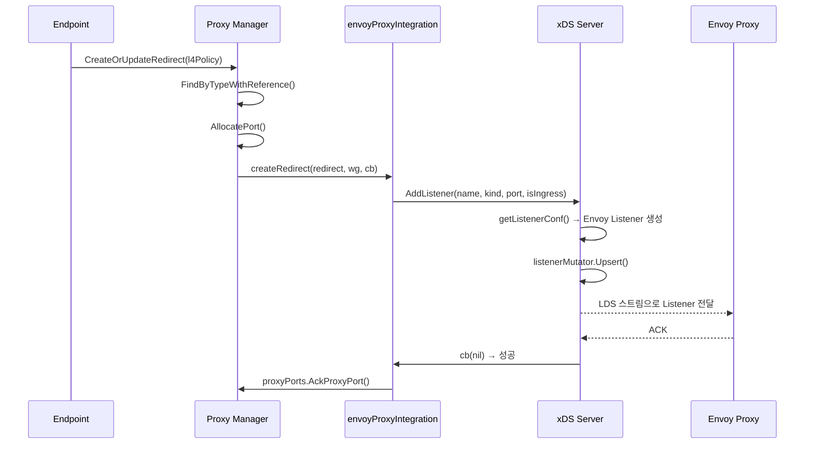

# 11. 서비스 메시 (Service Mesh)

## 1. 개요

Cilium의 서비스 메시는 기존 사이드카(sidecar) 방식과 근본적으로 다른 접근법을 취한다.
전통적인 서비스 메시(Istio, Linkerd)는 각 Pod에 Envoy 사이드카를 주입하여 L7 트래픽을
처리하지만, Cilium은 **노드당 하나의 Envoy 프록시**를 공유하고 **eBPF 데이터패스**와
긴밀하게 통합한다.

### 핵심 특징

| 특징 | 전통적 사이드카 | Cilium 서비스 메시 |
|------|---------------|-------------------|
| Envoy 배치 | Pod당 1개 | 노드당 1개 (또는 외부 DaemonSet) |
| 트래픽 리다이렉트 | iptables DNAT | eBPF `sk_assign` / mark 기반 |
| L7 정책 | Envoy 자체 처리 | Cilium Network Filter + xDS |
| 설정 관리 | Istio Pilot (xDS) | Cilium Agent 내장 xDS 서버 |
| Gateway API | 별도 컨트롤러 | Cilium Operator 내장 |
| CRD | 없음 | CiliumEnvoyConfig (CEC/CCEC) |

### 왜 사이드카가 아닌가?

1. **리소스 효율성** -- Pod당 사이드카는 메모리/CPU 오버헤드가 크다. 노드당 공유 Envoy는 리소스를 절약한다
2. **지연 시간 최소화** -- eBPF가 커널 수준에서 직접 패킷을 Envoy로 전달하므로 iptables 체인 탐색이 불필요하다
3. **투명한 통합** -- 애플리케이션 Pod에 사이드카 주입 없이 L7 정책 적용이 가능하다
4. **단일 컨트롤 플레인** -- Cilium Agent가 L3/L4 정책과 L7 정책을 모두 관리한다


## 2. 아키텍처 전체 다이어그램

```
┌─────────────────────────────────────────────────────────────────────┐
│                        Kubernetes Cluster                           │
│                                                                     │
│  ┌──────────────────────────────────────────────────────────────┐   │
│  │                    Cilium Operator                            │   │
│  │  ┌──────────────┐  ┌─────────────────┐  ┌────────────────┐  │   │
│  │  │ Gateway API  │  │  Ingress        │  │  GAMMA         │  │   │
│  │  │ Reconciler   │  │  Reconciler     │  │  Reconciler    │  │   │
│  │  └──────┬───────┘  └───────┬─────────┘  └───────┬────────┘  │   │
│  │         │                  │                     │           │   │
│  │         ▼                  ▼                     ▼           │   │
│  │  ┌──────────────────────────────────────────────────────┐   │   │
│  │  │              Model (Ingestion Layer)                  │   │   │
│  │  │  Input → model.HTTPListener / TLSPassthroughListener │   │   │
│  │  └──────────────────────┬───────────────────────────────┘   │   │
│  │                         │                                    │   │
│  │                         ▼                                    │   │
│  │  ┌──────────────────────────────────────────────────────┐   │   │
│  │  │           Translator (CECTranslator)                  │   │   │
│  │  │  Model → CiliumEnvoyConfig + Service (LB)            │   │   │
│  │  └──────────────────────┬───────────────────────────────┘   │   │
│  └─────────────────────────┼────────────────────────────────────┘   │
│                            │ K8s API (CEC/CCEC CRD)                 │
│                            ▼                                        │
│  ┌──────────────────────────────────────────────────────────────┐   │
│  │                  Cilium Agent (per Node)                      │   │
│  │                                                               │   │
│  │  ┌────────────────────────────────────────────────────────┐  │   │
│  │  │              pkg/envoy (envoy-proxy Cell)              │  │   │
│  │  │                                                        │  │   │
│  │  │  ┌──────────┐  ┌──────────┐  ┌───────────────────┐   │  │   │
│  │  │  │ xDS      │  │ AccessLog│  │ Secret Syncer     │   │  │   │
│  │  │  │ Server   │  │ Server   │  │                   │   │  │   │
│  │  │  │ (gRPC)   │  │ (UDS)    │  │                   │   │  │   │
│  │  │  └────┬─────┘  └──────────┘  └───────────────────┘   │  │   │
│  │  │       │ Unix Domain Socket                             │  │   │
│  │  │       ▼                                                │  │   │
│  │  │  ┌──────────────────────────┐                          │  │   │
│  │  │  │ Embedded Envoy Proxy     │ (cilium-envoy-starter)   │  │   │
│  │  │  │ ┌─────────────────────┐  │                          │  │   │
│  │  │  │ │ cilium.l7policy     │  │  (Cilium HTTP Filter)    │  │   │
│  │  │  │ │ cilium.network      │  │  (Cilium Network Filter) │  │   │
│  │  │  │ └─────────────────────┘  │                          │  │   │
│  │  │  └──────────────────────────┘                          │  │   │
│  │  └────────────────────────────────────────────────────────┘  │   │
│  │                                                               │   │
│  │  ┌────────────────────────────────────────────────────────┐  │   │
│  │  │              pkg/proxy (Proxy Manager)                 │  │   │
│  │  │  ┌───────────────────┐  ┌────────────────────────┐    │  │   │
│  │  │  │ envoyProxyInteg.  │  │ ProxyPorts             │    │  │   │
│  │  │  │ (redirect 관리)   │  │ (포트 할당/해제)        │    │  │   │
│  │  │  └───────────────────┘  └────────────────────────┘    │  │   │
│  │  └────────────────────────────────────────────────────────┘  │   │
│  │                                                               │   │
│  │  ┌────────────────────────────────────────────────────────┐  │   │
│  │  │              eBPF Datapath                              │  │   │
│  │  │  bpf/lib/proxy.h                                       │  │   │
│  │  │  ┌─────────────────────────────────────────────────┐   │  │   │
│  │  │  │ tc ingress → TPROXY (sk_assign) → Envoy         │   │  │   │
│  │  │  │ tc egress  → MARK_MAGIC_TO_PROXY → stack → Envoy│   │  │   │
│  │  │  └─────────────────────────────────────────────────┘   │  │   │
│  │  └────────────────────────────────────────────────────────┘  │   │
│  └───────────────────────────────────────────────────────────────┘   │
└─────────────────────────────────────────────────────────────────────┘
```


## 3. Envoy 프록시 관리

### 3.1 임베디드 Envoy vs 외부 Envoy

Cilium은 두 가지 Envoy 배포 모드를 지원한다.

| 모드 | 설정 | 특징 |
|------|------|------|
| **임베디드** | `ExternalEnvoyProxy=false` (기본) | Cilium Agent가 직접 Envoy 프로세스 시작/관리 |
| **외부** | `ExternalEnvoyProxy=true` | 별도 DaemonSet으로 Envoy 실행, Agent는 xDS 서버만 제공 |

### 3.2 On-Demand 시작 패턴

임베디드 모드에서 Envoy는 **실제 필요할 때만** 시작된다. 이것은 `onDemandXdsStarter`
구조체가 담당한다.

```
파일: pkg/envoy/xds_server_ondemand.go
```

```go
type onDemandXdsStarter struct {
    XDSServer            // 내장 xdsServer를 감싸는 래퍼
    logger               *slog.Logger
    runDir               string
    envoyLogPath         string
    envoyDefaultLogLevel string
    envoyBaseID          uint64
    // ... 기타 설정 필드
    envoyOnce sync.Once  // 한 번만 시작하도록 보장
}
```

`onDemandXdsStarter`는 `XDSServer` 인터페이스를 구현하며, `AddListener`,
`UpsertEnvoyResources`, `UpdateEnvoyResources` 호출 시 `sync.Once`를 통해
임베디드 Envoy를 **최초 1회만** 시작한다.

```go
func (o *onDemandXdsStarter) AddListener(...) error {
    if err := o.startEmbeddedEnvoy(nil); err != nil { ... }
    return o.XDSServer.AddListener(...)
}
```

**왜 On-Demand인가?**
- L7 프록시가 필요하지 않은 노드(순수 L3/L4 정책만 사용하는 경우)에서는 Envoy 프로세스를 아예 시작하지 않는다
- 리소스 절약과 보안 공격 표면(attack surface) 최소화가 목적이다

### 3.3 Envoy 프로세스 수명 주기

```
파일: pkg/envoy/embedded_envoy.go
```

```
┌──────────────┐     ┌────────────────────┐     ┌──────────────────┐
│ writeBootstrap│────▶│ cilium-envoy-starter│────▶│ cilium-envoy     │
│ ConfigFile   │     │ (exec.Command)      │     │ (Envoy binary)   │
└──────────────┘     └────────────────────┘     └──────────────────┘
        │                     │                          │
        │ bootstrap.pb        │ --base-id, -l, -c        │
        │ (protobuf)          │                          │
        ▼                     ▼                          ▼
  RunDir/envoy/         프로세스 감시 루프           크래시 시 자동 재시작
  bootstrap.pb          (stopCh / crashCh)
```

`EmbeddedEnvoy` 구조체가 Envoy 프로세스를 관리한다:

```go
// pkg/envoy/embedded_envoy.go
type EmbeddedEnvoy struct {
    stopCh chan struct{}           // 중지 신호
    errCh  chan error              // 에러 전달
    admin  *EnvoyAdminClient      // Admin API 클라이언트
}
```

핵심 동작:
1. **부트스트랩 설정 생성** -- `writeBootstrapConfigFile()`이 protobuf 형식의 Bootstrap Config를 생성하여 `RunDir/envoy/bootstrap.pb`에 저장
2. **프로세스 시작** -- `cilium-envoy-starter`를 통해 Envoy 바이너리 실행
3. **크래시 복구** -- 무한 루프에서 프로세스 종료를 감지하고 자동 재시작 (100ms 대기 후)
4. **정상 종료** -- `stopCh` 신호 수신 시 Envoy Admin API의 `quit` 명령으로 graceful shutdown

### 3.4 부트스트랩 클러스터 구성

부트스트랩에 정적으로 정의되는 클러스터들:

| 클러스터 이름 | 타입 | 용도 |
|--------------|------|------|
| `egress-cluster` | ORIGINAL_DST | 이그레스 트래픽을 원래 목적지로 전달 |
| `egress-cluster-tls` | ORIGINAL_DST | TLS 이그레스 (cilium.tls_wrapper) |
| `ingress-cluster` | ORIGINAL_DST | 인그레스 트래픽을 원래 목적지로 전달 |
| `ingress-cluster-tls` | ORIGINAL_DST | TLS 인그레스 (cilium.tls_wrapper) |
| `xds-grpc-cilium` | STATIC | xDS gRPC 서버 연결 (Unix Socket) |
| `/envoy-admin` | STATIC | Envoy Admin API (Unix Socket) |

```go
// pkg/envoy/xds_server.go
const (
    CiliumXDSClusterName = "xds-grpc-cilium"
    egressClusterName     = "egress-cluster"
    ingressClusterName    = "ingress-cluster"
    // ...
)
```

### 3.5 Hive Cell 구성

Envoy 서브시스템은 Hive Cell로 구성되며, 초기화 순서가 엄격하게 관리된다:

```go
// pkg/envoy/cell.go
var Cell = cell.Module(
    "envoy-proxy",
    "Envoy proxy and control-plane",

    cell.Provide(newEnvoyXDSServer),         // xDS 서버
    cell.Provide(newEnvoyAdminClient),        // Admin 클라이언트
    cell.Provide(envoypolicy.NewEnvoyL7RulesTranslator),
    cell.ProvidePrivate(newEnvoyAccessLogServer), // AccessLog 서버
    cell.ProvidePrivate(newLocalEndpointStore),
    cell.ProvidePrivate(newArtifactCopier),
    cell.Invoke(registerEnvoyVersionCheck),   // 버전 확인
    cell.Invoke(registerSecretSyncer),        // Secret 동기화
)
```

초기화 순서 보장:
- AccessLog 서버가 xDS 서버보다 먼저 준비되어야 한다 (의존성 주입)
- ArtifactCopier가 xDS 서버보다 먼저 완료되어야 한다


## 4. xDS 서버 구현

### 4.1 xDS 프로토콜 개요

xDS(x Discovery Service)는 Envoy의 동적 설정 프로토콜이다. Cilium Agent에 내장된
xDS 서버는 **gRPC 스트리밍** 방식으로 Envoy에 설정을 전달한다.

```
파일: pkg/envoy/grpc.go, pkg/envoy/xds/server.go
```

### 4.2 지원하는 리소스 타입

```go
// pkg/envoy/resources.go
const (
    ListenerTypeURL           = "type.googleapis.com/envoy.config.listener.v3.Listener"
    RouteTypeURL              = "type.googleapis.com/envoy.config.route.v3.RouteConfiguration"
    ClusterTypeURL            = "type.googleapis.com/envoy.config.cluster.v3.Cluster"
    EndpointTypeURL           = "type.googleapis.com/envoy.config.endpoint.v3.ClusterLoadAssignment"
    SecretTypeURL             = "type.googleapis.com/envoy.extensions.transport_sockets.tls.v3.Secret"
    NetworkPolicyTypeURL      = "type.googleapis.com/cilium.NetworkPolicy"
    NetworkPolicyHostsTypeURL = "type.googleapis.com/cilium.NetworkPolicyHosts"
)
```

**표준 xDS 리소스**: LDS, RDS, CDS, EDS, SDS
**Cilium 전용 리소스**: NPDS (Network Policy Discovery Service), NPHDS (Network Policy Hosts Discovery Service)

### 4.3 xDS 서버 아키텍처

```
┌───────────────────────────────────────────────────────┐
│                  xdsServer                             │
│                                                       │
│  ┌─────────────┐  ┌─────────────┐  ┌──────────────┐ │
│  │ listenerMutator│ routeMutator │ clusterMutator  │ │
│  │ (LDS Cache)   │ (RDS Cache)  │ (CDS Cache)     │ │
│  └───────┬───────┘ └──────┬──────┘ └──────┬────────┘ │
│          │                │               │           │
│  ┌───────┴────────────────┴───────────────┴────────┐ │
│  │              xds.Cache (per type)               │ │
│  │  resources: map[cacheKey]cacheValue             │ │
│  │  version: uint64                                │ │
│  └─────────────────────┬───────────────────────────┘ │
│                        │                              │
│  ┌─────────────────────▼───────────────────────────┐ │
│  │         ResourceWatcher (per type)              │ │
│  │  WatchResources() → 버전 변경 시 알림           │ │
│  └─────────────────────┬───────────────────────────┘ │
│                        │                              │
│  ┌─────────────────────▼───────────────────────────┐ │
│  │         xds.Server (gRPC Handler)               │ │
│  │  HandleRequestStream()                          │ │
│  │  processRequestStream()                         │ │
│  │  → reflect.Select로 다중 타입 동시 처리          │ │
│  └─────────────────────────────────────────────────┘ │
└───────────────────────────────────────────────────────┘
```

### 4.4 Cache와 AckingResourceMutator

각 리소스 타입마다 독립적인 `Cache`와 `AckingResourceMutatorWrapper`가 존재한다:

```go
// pkg/envoy/xds_server.go - initializeXdsConfigs()
func (s *xdsServer) initializeXdsConfigs() {
    ldsCache := xds.NewCache(s.logger)
    ldsMutator := xds.NewAckingResourceMutatorWrapper(s.logger, ldsCache, s.config.metrics)
    ldsConfig := &xds.ResourceTypeConfiguration{
        Source:      ldsCache,
        AckObserver: ldsMutator,
    }
    // ... RDS, CDS, EDS, SDS, NPDS, NPHDS 동일 패턴
}
```

`Cache`(`pkg/envoy/xds/cache.go`)는 키-값 저장소로, 리소스를 원자적으로 업데이트하고
버전 번호를 증가시키며 옵저버에 통지한다:

```go
// pkg/envoy/xds/cache.go
type Cache struct {
    *BaseObservableResourceSource
    resources map[cacheKey]cacheValue
    version   uint64
}
```

### 4.5 스트림 처리 흐름

```
파일: pkg/envoy/xds/server.go
```

```
  Envoy                    xds.Server
    │                         │
    │  DiscoveryRequest       │
    │ (typeURL, versionInfo,  │
    │  responseNonce)         │
    ├────────────────────────▶│
    │                         │ 1. typeURL로 ResourceWatcher 조회
    │                         │ 2. lastVersion과 nonce로 ACK/NACK 판단
    │                         │ 3. ACK → ackObserver.HandleResourceVersionAck()
    │                         │ 4. WatchResources() → 새 버전 대기
    │                         │
    │  DiscoveryResponse      │
    │ (versionInfo, resources,│
    │  nonce, typeURL)        │
    │◀────────────────────────┤
    │                         │
```

`processRequestStream()`은 `reflect.Select`를 사용하여 여러 리소스 타입의 응답 채널과
요청 채널을 동시에 모니터링한다. 이는 하나의 gRPC 스트림에서 여러 리소스 타입을 처리하기
위한 구조이다.

**Listener 의존성 관리**: Listener 스트림은 Cluster가 먼저 ACK될 때까지 대기한다:
```go
// pkg/envoy/grpc.go
func (s *xdsGRPCServer) StreamListeners(stream ...) error {
    // afterTypeURL = ClusterTypeURL: Cluster ACK 후 Listener 전달
    return (*xds.Server)(s).HandleRequestStream(stream.Context(), stream, ListenerTypeURL, ClusterTypeURL)
}
```

### 4.6 gRPC 서비스 등록

```go
// pkg/envoy/grpc.go
func (s *xdsServer) startXDSGRPCServer(ctx context.Context, config map[string]*xds.ResourceTypeConfiguration) error {
    listener, err := s.newSocketListener()
    grpcServer := grpc.NewServer()
    xdsServer := xds.NewServer(s.logger, config, s.restorerPromise, s.config.metrics)
    dsServer := (*xdsGRPCServer)(xdsServer)

    // 표준 xDS 서비스
    envoy_service_secret.RegisterSecretDiscoveryServiceServer(grpcServer, dsServer)
    envoy_service_endpoint.RegisterEndpointDiscoveryServiceServer(grpcServer, dsServer)
    envoy_service_cluster.RegisterClusterDiscoveryServiceServer(grpcServer, dsServer)
    envoy_service_route.RegisterRouteDiscoveryServiceServer(grpcServer, dsServer)
    envoy_service_listener.RegisterListenerDiscoveryServiceServer(grpcServer, dsServer)

    // Cilium 전용 xDS 서비스
    cilium.RegisterNetworkPolicyDiscoveryServiceServer(grpcServer, dsServer)
    cilium.RegisterNetworkPolicyHostsDiscoveryServiceServer(grpcServer, dsServer)
    // ...
}
```

### 4.7 엔드포인트 복원 대기

Agent 재시작 시, xDS 서버는 엔드포인트 정책이 복원될 때까지 리소스 서빙을 지연한다:

```go
// pkg/envoy/grpc.go
if s.restorerPromise != nil {
    restorer, err := s.restorerPromise.Await(ctx)
    if err == nil && restorer != nil {
        err = restorer.WaitForInitialPolicy(ctx)
    }
    // 타임아웃되면 경고만 출력하고 서빙 시작
    xdsServer.RestoreCompleted()
}
```

**왜 대기하는가?** -- 정책 복원 전에 Envoy에 리소스를 전달하면, 일시적으로 정책이 없는 상태에서 트래픽이 처리될 수 있다.


## 5. CiliumEnvoyConfig CRD

### 5.1 CRD 정의

CiliumEnvoyConfig(CEC)와 CiliumClusterwideEnvoyConfig(CCEC)는 사용자가
Envoy 설정을 직접 지정할 수 있는 CRD이다.

```
파일: pkg/k8s/apis/cilium.io/v2/cec_types.go
파일: pkg/k8s/apis/cilium.io/v2/ccec_types.go
```

```go
// CiliumEnvoyConfig (네임스페이스 스코프, shortName: cec)
type CiliumEnvoyConfig struct {
    metav1.TypeMeta   `json:",inline"`
    metav1.ObjectMeta `json:"metadata"`
    Spec CiliumEnvoyConfigSpec `json:"spec,omitempty"`
}

// CiliumClusterwideEnvoyConfig (클러스터 스코프, shortName: ccec)
type CiliumClusterwideEnvoyConfig struct {
    metav1.TypeMeta   `json:",inline"`
    metav1.ObjectMeta `json:"metadata"`
    Spec CiliumEnvoyConfigSpec `json:"spec,omitempty"`
}
```

| CRD | 스코프 | ShortName | 용도 |
|-----|--------|-----------|------|
| CiliumEnvoyConfig | Namespaced | cec | 네임스페이스 내 서비스의 L7 설정 |
| CiliumClusterwideEnvoyConfig | Cluster | ccec | 클러스터 전체 적용 L7 설정 |

### 5.2 CiliumEnvoyConfigSpec 구조

```go
// pkg/k8s/apis/cilium.io/v2/cec_types.go
type CiliumEnvoyConfigSpec struct {
    // 트래픽을 Envoy 리스너로 리다이렉트할 K8s 서비스
    Services []*ServiceListener `json:"services,omitempty"`

    // EDS로 백엔드를 동기화할 K8s 서비스 (트래픽 리다이렉트 없음)
    BackendServices []*Service `json:"backendServices,omitempty"`

    // Envoy xDS 리소스 목록 (Listener, Route, Cluster, Endpoint, Secret)
    Resources []XDSResource `json:"resources,omitempty"`

    // 이 설정을 적용할 노드 선택자
    NodeSelector *slim_metav1.LabelSelector `json:"nodeSelector,omitempty"`
}
```

```go
// ServiceListener는 서비스 트래픽을 Envoy로 리다이렉트하는 설정
type ServiceListener struct {
    Name      string   `json:"name"`
    Namespace string   `json:"namespace,omitempty"`
    Ports     []uint16 `json:"ports,omitempty"`    // 리다이렉트할 프론트엔드 포트
    Listener  string   `json:"listener,omitempty"` // 대상 Envoy 리스너 이름
}
```

### 5.3 XDSResource의 JSON 직렬화

`XDSResource`는 protobuf `Any` 타입을 JSON으로 직렬/역직렬화한다:

```go
type XDSResource struct {
    *anypb.Any `json:"-"`
}

func (u *XDSResource) UnmarshalJSON(b []byte) (err error) {
    u.Any = &anypb.Any{}
    err = protojson.Unmarshal(b, u.Any)
    // 유효하지 않은 JSON은 경고만 출력하고 무시
    return nil
}
```

**왜 이렇게 설계했는가?**
- Kubernetes CRD 검증 대신 Envoy가 직접 xDS 리소스를 검증하도록 위임한다
- 이를 통해 Cilium이 지원하지 않는 새로운 Envoy 필터도 CEC를 통해 즉시 사용할 수 있다

### 5.4 Services vs BackendServices

CEC Spec의 두 서비스 필드는 뚜렷하게 다른 역할을 한다:

```
Services (ServiceListener):
  ┌──────────┐     ┌──────────────┐     ┌───────────────┐
  │ K8s SVC  │────▶│ Envoy Listener│────▶│ Backend Pods  │
  │ frontend │ 리다이렉트 │ (L7 처리)   │     │               │
  └──────────┘     └──────────────┘     └───────────────┘

BackendServices (Service):
  ┌──────────┐     ┌──────────────┐     ┌───────────────┐
  │ K8s SVC  │     │ Envoy Listener│────▶│ Backend Pods  │
  │ frontend │     │ (다른 리스너) │ EDS │ (EDS로 동기화)│
  └──────────┘     └──────────────┘     └───────────────┘
  (리다이렉트 없음)
```

- `Services`: 해당 서비스의 프론트엔드 트래픽을 Envoy 리스너로 **리다이렉트**
- `BackendServices`: 백엔드 Pod 정보를 EDS로 **동기화만** 함 (별도 리스너가 참조)


## 6. Gateway API 구현

### 6.1 아키텍처 개요

Cilium의 Gateway API 구현은 Operator 내에 위치하며, Kubernetes Gateway API 리소스를
CiliumEnvoyConfig + LoadBalancer Service로 변환한다.

```
파일: operator/pkg/gateway-api/gateway.go
파일: operator/pkg/gateway-api/gateway_reconcile.go
```

```
┌─────────────────────────────────────────────────────┐
│                Cilium Operator                       │
│                                                     │
│  Gateway/HTTPRoute/GRPCRoute/TLSRoute (Watch)       │
│          │                                          │
│          ▼                                          │
│  ┌──────────────────┐                               │
│  │ gatewayReconciler │  (controller-runtime)        │
│  │  .Reconcile()     │                               │
│  └────────┬─────────┘                               │
│           │                                          │
│           ▼                                          │
│  ┌──────────────────────────────┐                   │
│  │ ingestion.GatewayAPI()       │ (Input → Model)   │
│  │  → []HTTPListener            │                   │
│  │  → []TLSPassthroughListener  │                   │
│  └────────────┬─────────────────┘                   │
│               │                                      │
│               ▼                                      │
│  ┌──────────────────────────────┐                   │
│  │ Translator.Translate()       │ (Model → CEC+Svc) │
│  │  → CiliumEnvoyConfig        │                   │
│  │  → corev1.Service (LB)      │                   │
│  └────────────┬─────────────────┘                   │
│               │                                      │
│               ▼                                      │
│  K8s API: Create/Update CEC + Service               │
└─────────────────────────────────────────────────────┘
```

### 6.2 Reconciler 구조

```go
// operator/pkg/gateway-api/gateway.go
type gatewayReconciler struct {
    client.Client
    Scheme     *runtime.Scheme
    translator translation.Translator
    logger     *slog.Logger
    installedCRDs []schema.GroupVersionKind
}
```

**감시하는 리소스 목록**:
- `gatewayv1.Gateway` -- 게이트웨이 자체
- `gatewayv1.GatewayClass` -- 게이트웨이 클래스 (controllerName 일치 여부)
- `gatewayv1.HTTPRoute` -- HTTP 라우팅 규칙
- `gatewayv1.GRPCRoute` -- gRPC 라우팅 규칙
- `gatewayv1alpha2.TLSRoute` -- TLS 패스스루 라우팅 (optional CRD)
- `corev1.Secret` -- TLS 인증서
- `corev1.Service` -- 백엔드 서비스
- `gatewayv1.BackendTLSPolicy` -- 백엔드 TLS 설정
- `gatewayv1beta1.ReferenceGrant` -- 크로스 네임스페이스 참조 허용
- `ciliumv2.CiliumEnvoyConfig` -- 생성된 CEC (Owns)
- `corev1.Service` -- 생성된 LB 서비스 (Owns)
- `mcsapiv1alpha1.ServiceImport` -- 멀티클러스터 ServiceImport (optional)

### 6.3 Ingestion Layer

```
파일: operator/pkg/model/ingestion/gateway.go
```

Ingestion은 Gateway API 리소스를 중간 모델(Model)로 변환하는 단계이다:

```go
// Input은 GatewayAPI 변환에 필요한 모든 리소스를 담는다
type Input struct {
    GatewayClass       gatewayv1.GatewayClass
    GatewayClassConfig *v2alpha1.CiliumGatewayClassConfig
    Gateway            gatewayv1.Gateway
    HTTPRoutes         []gatewayv1.HTTPRoute
    TLSRoutes          []gatewayv1alpha2.TLSRoute
    GRPCRoutes         []gatewayv1.GRPCRoute
    ReferenceGrants    []gatewayv1beta1.ReferenceGrant
    Services           []corev1.Service
    ServiceImports     []mcsapiv1alpha1.ServiceImport
    BackendTLSPolicyMap helpers.BackendTLSPolicyServiceMap
}

func GatewayAPI(log *slog.Logger, input Input) (
    []model.HTTPListener,
    []model.TLSPassthroughListener,
) {
    // Gateway Listener → model.HTTPListener / TLSPassthroughListener
    // HTTPRoute/GRPCRoute → model.HTTPRoute
    // Backend refs → model.Backend
}
```

### 6.4 중간 모델 (Model)

```
파일: operator/pkg/model/model.go
```

```go
type Model struct {
    HTTP           []HTTPListener           `json:"http,omitempty"`
    TLSPassthrough []TLSPassthroughListener `json:"tls_passthrough,omitempty"`
}

type HTTPListener struct {
    Name     string              `json:"name,omitempty"`
    Sources  []FullyQualifiedResource `json:"sources,omitempty"`
    Address  string              `json:"address,omitempty"`
    Port     uint32              `json:"port,omitempty"`
    Hostname string              `json:"hostname,omitempty"`
    TLS      []TLSSecret         `json:"tls,omitempty"`
    Routes   []HTTPRoute         `json:"routes,omitempty"`
    Service  *Service            `json:"service,omitempty"`
    Infrastructure *Infrastructure `json:"infrastructure,omitempty"`
    ForceHTTPtoHTTPSRedirect bool `json:"force_http_to_https_redirect,omitempty"`
    Gamma    bool                `json:"gamma,omitempty"`
}
```

**왜 중간 모델인가?**
- Gateway API, Ingress, GAMMA 등 다양한 입력 소스를 동일한 표현으로 정규화한다
- 번역(Translation) 계층을 입력 소스에 독립적으로 유지할 수 있다
- 테스트가 용이하다 -- 모델만 만들면 CEC 생성을 검증할 수 있다

### 6.5 Translation Layer

```
파일: operator/pkg/model/translation/cec_translator.go
파일: operator/pkg/model/translation/types.go
```

```go
// Translator는 Model을 CiliumEnvoyConfig + Service로 변환한다
type Translator interface {
    Translate(model *model.Model) (*ciliumv2.CiliumEnvoyConfig, *corev1.Service, error)
}

// CECTranslator는 CiliumEnvoyConfig만 생성하는 인터페이스
type CECTranslator interface {
    Translate(namespace string, name string, model *model.Model) (*ciliumv2.CiliumEnvoyConfig, error)
}
```

`cecTranslator.Translate()`의 동작:

```
Model
  │
  ├─ desiredBackendServices() → BackendServices[]
  ├─ desiredServicesWithPorts() → ServiceListener[]
  └─ desiredResources() → XDSResource[]
      │
      ├─ Envoy Listener (secure/insecure)
      ├─ RouteConfiguration (VirtualHost + Routes)
      ├─ Cluster (per backend service)
      └─ Secret (TLS certificates)
```

### 6.6 GAMMA 지원

GAMMA(Gateway API Mesh Management and Administration)는 Gateway API를
서비스 메시 유스케이스로 확장한 사양이다.

```
파일: operator/pkg/gateway-api/gamma.go
파일: operator/pkg/gateway-api/gamma_reconcile.go
```

GAMMA에서는 HTTPRoute가 Gateway가 아닌 **Service를 parentRef로 참조**하여,
east-west(서비스 간) 트래픽에 L7 라우팅을 적용한다.


## 7. L7 정책과 프록시 리다이렉트

### 7.1 L7 정책 적용 흐름



### 7.2 Proxy Manager

```
파일: pkg/proxy/proxy.go
```

```go
type Proxy struct {
    enabled    bool
    mutex      lock.RWMutex
    redirects  map[string]RedirectImplementation
    envoyIntegration *envoyProxyIntegration
    dnsIntegration   *dnsProxyIntegration
    proxyPorts       *proxyports.ProxyPorts
    // ...
}
```

`createRedirectImpl()`은 L7 파서 타입에 따라 적절한 프록시 구현을 선택한다:

```go
// pkg/proxy/proxy.go
func (p *Proxy) createRedirectImpl(redir Redirect, l4 policy.ProxyPolicy, ...) (RedirectImplementation, error) {
    switch l4.GetL7Parser() {
    case policy.ParserTypeDNS:
        return p.dnsIntegration.createRedirect(redir)
    default:
        return p.envoyIntegration.createRedirect(redir, wg, cb)
    }
}
```

### 7.3 RedirectImplementation 인터페이스

```
파일: pkg/proxy/redirect.go
```

```go
type RedirectImplementation interface {
    GetRedirect() *Redirect
    UpdateRules(rules policy.L7DataMap) (revert.RevertFunc, error)
    Close()
}

type Redirect struct {
    logger       *slog.Logger
    name         string
    proxyPort    *proxyports.ProxyPort
    dstPortProto restore.PortProto
    endpointID   uint16
}
```

구현체들:

| 구현체 | 파일 | 용도 |
|--------|------|------|
| `envoyRedirect` | `pkg/proxy/envoyproxy.go` | Envoy를 통한 L7 프록시 리다이렉트 |
| `CRDRedirect` | `pkg/proxy/crd.go` | CEC/CCEC로 관리되는 외부 리스너용 (no-op) |
| DNS redirect | `pkg/proxy/dns.go` | DNS 프록시 리다이렉트 |

### 7.4 envoyProxyIntegration

```
파일: pkg/proxy/envoyproxy.go
```

```go
type envoyProxyIntegration struct {
    adminClient     *envoy.EnvoyAdminClient
    xdsServer       envoy.XDSServer
    iptablesManager datapath.IptablesManager
    proxyUseOriginalSourceAddress bool
}

func (p *envoyProxyIntegration) createRedirect(r Redirect, wg *completion.WaitGroup, cb func(err error)) (RedirectImplementation, error) {
    if r.proxyPort.ProxyType == types.ProxyTypeCRD {
        // CRD 리스너는 이미 존재하므로 no-op
        return &CRDRedirect{Redirect: r}, nil
    }

    // Envoy Listener 생성
    redirect := &envoyRedirect{
        Redirect:     r,
        listenerName: net.JoinHostPort(r.name, fmt.Sprintf("%d", l.ProxyPort)),
        xdsServer:    p.xdsServer,
    }
    err := p.xdsServer.AddListener(redirect.listenerName, ...)
    return redirect, err
}
```

**`envoyRedirect.UpdateRules()`가 no-op인 이유:**
Envoy의 정책 데이터는 xDS 캐시(NPDS)를 통해 동기화되므로, redirect 수준에서 규칙을
직접 업데이트할 필요가 없다. `UpdateNetworkPolicy()`가 NPDS 캐시에 정책을 넣으면
Envoy의 Cilium Network Filter가 이를 수신한다.

### 7.5 Envoy 필터 체인 구성

L7 정책을 적용하는 리스너의 필터 체인:

```
HTTP Filter Chain:
  ┌─────────────────┐   ┌──────────────────┐   ┌───────────────────┐
  │ cilium.network  │──▶│ HTTP Connection  │──▶│ envoy.router      │
  │ (Network Filter)│   │ Manager          │   │                   │
  │                 │   │  ├─ cilium.l7policy│   │                   │
  │ L4 정책 적용    │   │  └─ envoy.router  │   │ 업스트림 라우팅   │
  └─────────────────┘   └──────────────────┘   └───────────────────┘

TCP Filter Chain:
  ┌─────────────────┐   ┌─────────────────┐   ┌───────────────────┐
  │ [L7 parser]     │──▶│ cilium.network  │──▶│ tcp_proxy         │
  │ (예: mysql_proxy)│   │ (Network Filter)│   │                   │
  └─────────────────┘   └─────────────────┘   └───────────────────┘
```

```go
// pkg/envoy/xds_server.go - getHttpFilterChainProto()
chain := &envoy_config_listener.FilterChain{
    Filters: []*envoy_config_listener.Filter{
        {
            Name: "cilium.network",          // Cilium Network Filter
            ConfigType: &envoy_config_listener.Filter_TypedConfig{
                TypedConfig: toAny(&cilium.NetworkFilter{}),
            },
        },
        {
            Name: "envoy.filters.network.http_connection_manager",
            ConfigType: &envoy_config_listener.Filter_TypedConfig{
                TypedConfig: toAny(hcmConfig),
                // hcmConfig.HttpFilters:
                //   - cilium.l7policy (Cilium HTTP Filter)
                //   - envoy.filters.http.router
            },
        },
    },
}
```

### 7.6 Network Policy를 Envoy에 전달

```go
// pkg/envoy/xds_server.go
func (s *xdsServer) UpdateNetworkPolicy(ep endpoint.EndpointUpdater, policy *policy.EndpointPolicy, wg *completion.WaitGroup) (error, func() error) {
    // endpoint 정책을 cilium.NetworkPolicy protobuf로 변환
    // NPDS 캐시에 Upsert → Envoy에 스트리밍 전달
}
```


## 8. Ingress 컨트롤러

### 8.1 구조

```
파일: operator/pkg/ingress/ingress.go
파일: operator/pkg/ingress/ingress_reconcile.go
```

Cilium의 Ingress 컨트롤러는 Kubernetes Ingress 리소스를 CiliumEnvoyConfig로 변환한다.
Gateway API와 동일한 중간 모델(Model) + 번역(Translation) 파이프라인을 공유한다.

```go
// operator/pkg/ingress/ingress.go
type ingressReconciler struct {
    logger  *slog.Logger
    client  client.Client

    cecTranslator       translation.CECTranslator       // 공유 LB 모드용
    dedicatedTranslator translation.Translator           // 전용 LB 모드용

    defaultLoadbalancerMode string  // "shared" 또는 "dedicated"
    // ...
}
```

### 8.2 두 가지 로드밸런서 모드

| 모드 | 설명 | CEC 관리 |
|------|------|----------|
| **Shared** | 모든 Ingress가 하나의 CiliumEnvoyConfig와 하나의 LB Service를 공유 | CECTranslator |
| **Dedicated** | 각 Ingress마다 전용 CiliumEnvoyConfig와 LB Service를 생성 | Translator |

### 8.3 Reconcile 흐름

```go
// operator/pkg/ingress/ingress_reconcile.go
func (r *ingressReconciler) Reconcile(ctx context.Context, req ctrl.Request) (ctrl.Result, error) {
    // 1. Ingress 조회
    ingress := &networkingv1.Ingress{}
    r.client.Get(ctx, req.NamespacedName, ingress)

    // 2. Cilium 관리 Ingress인지 확인
    if !isCiliumManagedIngress(ctx, r.client, r.logger, *ingress) {
        r.tryCleanupSharedResources(ctx)
        return controllerruntime.Success()
    }

    // 3. LB 모드에 따라 분기
    if r.isEffectiveLoadbalancerModeDedicated(ingress) {
        r.createOrUpdateDedicatedResources(ctx, ingress, scopedLog)
    } else {
        r.createOrUpdateSharedResources(ctx)
    }
}
```

### 8.4 Ingress Ingestion

```
파일: operator/pkg/model/ingestion/ingress.go
```

```go
func Ingress(log *slog.Logger, ing networkingv1.Ingress, ...) []model.HTTPListener {
    // Ingress.Spec.Rules → model.HTTPRoute
    // Ingress.Spec.TLS → model.TLSSecret
    // Ingress.Spec.DefaultBackend → 기본 백엔드
    // 결과: []model.HTTPListener
}
```

Gateway API와 Ingress 모두 최종적으로 동일한 `model.HTTPListener`를 생성하므로,
하위의 CEC 번역 로직을 완전히 공유한다.


## 9. 프록시 포트 관리

### 9.1 ProxyPorts 구조

```
파일: pkg/proxy/proxyports/proxyports.go
```

```go
type ProxyPort struct {
    ProxyType    types.ProxyType `json:"type"`
    Ingress      bool            `json:"ingress"`
    ProxyPort    uint16          `json:"port"`
    isStatic     bool            // DNS 프록시 등 정적 포트
    nRedirects   int             // 이 포트를 사용하는 리다이렉트 수
    configured   bool            // 프록시 설정 중
    acknowledged bool            // 프록시 포트 ACK됨
    rulesPort    uint16          // 데이터패스 규칙에 설정된 포트
    releaseCancel func()         // 지연 해제 취소
}
```

### 9.2 포트 할당 라이프사이클

```
AllocatePort()          포트 번호 할당
    │
    ▼
AckProxyPort()          Envoy ACK 후 데이터패스 규칙 설치
    │                   (InstallProxyRules)
    ▼
ReleaseProxyPort()      리다이렉트 제거 시 포트 해제
    │                   (5분 지연 후 재사용 허용)
    ▼
portReuseDelay (5분)    포트 재사용 지연
```

**왜 5분 지연인가?**
- 해제 직후 동일 포트를 재사용하면, 기존 커넥션이 새 리스너에 잘못 연결될 수 있다
- 연결이 자연스럽게 종료될 시간을 확보하기 위한 안전장치이다

### 9.3 포트 상태 영속화

```go
const proxyPortsFile = "proxy_ports_state.json"
```

프록시 포트 상태는 `/run/cilium/state/proxy_ports_state.json`에 주기적으로 저장되며,
Agent 재시작 시 복원된다. 이를 통해 재시작 후에도 동일한 포트를 사용하여 트래픽 중단을
최소화한다.

### 9.4 포트 할당 재시도

```go
// pkg/proxy/proxy.go - createNewRedirect()
for nRetry := range redirectCreationAttempts {  // 최대 5회
    err = p.proxyPorts.AllocatePort(pp, nRetry > 0)
    if err != nil { break }

    impl, err = p.createRedirectImpl(redirect, l4, wg, proxyCallback)
    if err == nil { break }
}
```

포트 할당이 실패하면 (예: 포트 충돌) 최대 5회까지 다른 포트로 재시도한다.


## 10. BPF-Envoy 연동

### 10.1 트래픽 리다이렉트 메커니즘

Cilium은 eBPF를 사용하여 패킷을 Envoy 프록시로 리다이렉트한다. 두 가지 주요 방식이 있다:

```
파일: bpf/lib/proxy.h
```

#### TPROXY 모드 (기본, 권장)

```
                        tc ingress
                            │
                            ▼
                    ┌───────────────┐
                    │ BPF 프로그램   │
                    │ (bpf_lxc.c)  │
                    └───────┬───────┘
                            │ L7 정책 매칭
                            ▼
                    ┌───────────────────┐
                    │ assign_socket()   │
                    │ sk_assign(ctx,sk) │
                    └───────┬───────────┘
                            │ 커널이 직접 Envoy 소켓으로 전달
                            ▼
                    ┌───────────────┐
                    │ Envoy Proxy   │
                    │ (TPROXY port) │
                    └───────┬───────┘
                            │ L7 처리 후
                            ▼
                    원래 목적지로 전달
```

TPROXY 모드에서 `assign_socket_tcp()`의 핵심:

```c
// bpf/lib/proxy.h
static __always_inline int
assign_socket_tcp(struct __ctx_buff *ctx,
                  struct bpf_sock_tuple *tuple, __u32 len, bool established)
{
    struct bpf_sock *sk;
    sk = skc_lookup_tcp(ctx, tuple, len, BPF_F_CURRENT_NETNS, 0);
    if (!sk) goto out;

    // 기존 연결이면 해당 소켓으로 직접 전달
    if (established && sk->state == BPF_TCP_TIME_WAIT) goto release;
    if (established && sk->state == BPF_TCP_LISTEN)    goto release;

    // sk_assign로 패킷을 소켓에 할당
    result = sk_assign(ctx, sk, 0);
    // ...
}
```

#### Mark 모드 (호스트에서 이그레스 시)

```c
// bpf/lib/proxy.h
static __always_inline int
__ctx_redirect_to_proxy(struct __ctx_buff *ctx, void *tuple,
                        __be16 proxy_port, bool from_host, bool ipv4)
{
    if (!from_host)
        ctx->mark |= MARK_MAGIC_TO_PROXY;
    else
        ctx->mark = MARK_MAGIC_TO_PROXY | proxy_port << 16;
    // TPROXY 모드에서는 추가로 sk_assign 수행
}
```

### 10.2 리다이렉트 소켓 조회 순서 (CTX_REDIRECT_FN 매크로)

```c
// bpf/lib/proxy.h - CTX_REDIRECT_FN 매크로 내부
// 1단계: 기존 연결된 소켓 조회 (established connection)
result = assign_socket(ctx, tuple, len, nexthdr, true);
if (result == CTX_ACT_OK) goto out;

// 2단계: tproxy_addr(loopback)에서 리스닝 소켓 조회
tuple->dport = proxy_port;
memcpy(&tuple->daddr, tproxy_addr, ...);
result = assign_socket(ctx, tuple, len, nexthdr, false);
if (result == CTX_ACT_OK) goto out;

// 3단계: 모든 인터페이스에 바인딩된 소켓 조회 (0.0.0.0)
memset(&tuple->daddr, 0, ...);
result = assign_socket(ctx, tuple, len, nexthdr, false);
```

**왜 3단계 조회인가?**
- 1단계: 이미 설정된 TCP 연결의 패킷은 기존 소켓으로 바로 전달 (성능 최적화)
- 2단계: 새 연결의 SYN 패킷을 특정 IP(loopback)의 TPROXY 소켓으로 전달
- 3단계: 모든 인터페이스에 바인딩된 소켓에 대한 폴백 (예: 0.0.0.0:port)

### 10.3 패킷 흐름 (전체)

```
┌──────────────────────────────────────────────────────────────────┐
│                        Node                                      │
│                                                                  │
│  Pod A                                                Pod B      │
│  ┌─────┐                                            ┌─────┐     │
│  │ App │                                            │ App │     │
│  └──┬──┘                                            └──▲──┘     │
│     │                                                  │        │
│  ┌──▼──────────────┐                          ┌───────┴──────┐ │
│  │ tc egress (lxc) │                          │ tc ingress    │ │
│  │                 │                          │ (lxc)         │ │
│  │ L7 정책 매칭    │                          │               │ │
│  │ proxy_port 결정 │                          │               │ │
│  └──┬──────────────┘                          └───────▲──────┘ │
│     │                                                  │        │
│     │ MARK_MAGIC_TO_PROXY                              │        │
│     │ + sk_assign (TPROXY)                             │        │
│     │                                                  │        │
│  ┌──▼──────────────────────────────────────────────────┴──────┐ │
│  │                    Envoy Proxy                              │ │
│  │                                                             │ │
│  │  ┌─────────────────┐  ┌──────────────┐  ┌───────────────┐ │ │
│  │  │ cilium.network  │  │ cilium.l7    │  │ envoy.router  │ │ │
│  │  │ (Network Filter)│→ │ (HTTP Filter)│→ │               │ │ │
│  │  │ 정책 적용       │  │ L7 규칙 검사 │  │ 업스트림 전달 │ │ │
│  │  └─────────────────┘  └──────────────┘  └───────────────┘ │ │
│  └────────────────────────────────────────────────────────────┘ │
│                                                                  │
└──────────────────────────────────────────────────────────────────┘
```

### 10.4 tc_index를 통한 프록시 출처 확인

Envoy에서 나온 패킷은 다시 BPF 프로그램을 거치므로, 루프를 방지하기 위해 `tc_index`로
출처를 식별한다:

```c
// bpf/lib/proxy.h
static __always_inline bool tc_index_from_ingress_proxy(struct __ctx_buff *ctx) {
    volatile __u32 tc_index = ctx->tc_index;
    return tc_index & TC_INDEX_F_FROM_INGRESS_PROXY;
}

static __always_inline bool tc_index_from_egress_proxy(struct __ctx_buff *ctx) {
    volatile __u32 tc_index = ctx->tc_index;
    return tc_index & TC_INDEX_F_FROM_EGRESS_PROXY;
}
```

### 10.5 호스트 이그레스 리다이렉트

호스트에서 이그레스 방향의 프록시 리다이렉트는 `sk_assign`을 사용할 수 없다
(tc ingress 경로에서만 유효하기 때문). 대신 cilium_host 인터페이스로 패킷을
리다이렉트한다:

```c
// bpf/lib/proxy.h
static __always_inline int
ctx_redirect_to_proxy_host_egress(struct __ctx_buff *ctx, __be16 proxy_port) {
    union macaddr mac = CONFIG(cilium_host_mac);
    ctx->mark = MARK_MAGIC_TO_PROXY | proxy_port << 16;
    if (eth_store_daddr(ctx, (__u8 *)&mac, 0) < 0)
        return DROP_WRITE_ERROR;
    return ctx_redirect(ctx, CONFIG(cilium_host_ifindex), BPF_F_INGRESS);
}
```


## 11. 왜 이 아키텍처인가?

### 11.1 사이드카 없는 서비스 메시의 이점

```
┌──────────────────────────────────┐
│    전통적 사이드카 아키텍처      │
│                                  │
│  Pod                             │
│  ┌─────────────────────────┐    │
│  │ ┌──────┐  ┌───────────┐ │    │
│  │ │ App  │──│ Sidecar   │ │    │   x Pod당 ~50MB 메모리
│  │ │      │  │ (Envoy)   │ │    │   x 2번의 TCP 핸드셰이크
│  │ └──────┘  └───────────┘ │    │   x 복잡한 iptables 규칙
│  └─────────────────────────┘    │
└──────────────────────────────────┘

┌──────────────────────────────────┐
│    Cilium 아키텍처               │
│                                  │
│  Pod                  Node       │
│  ┌──────┐    eBPF   ┌────────┐  │
│  │ App  │──────────▶│ Shared │  │   o 노드당 ~100MB (공유)
│  │      │  sk_assign│ Envoy  │  │   o 커널 수준 직접 전달
│  └──────┘           └────────┘  │   o 사이드카 주입 불필요
│                                  │
└──────────────────────────────────┘
```

### 11.2 xDS 서버 내장의 이유

Cilium이 자체 xDS 서버를 구현하는 이유:

1. **Cilium 전용 리소스 타입** -- NPDS/NPHDS는 표준 xDS에 없는 Cilium 전용 프로토콜이다. 이를 통해 Network Policy를 Envoy에 직접 전달한다
2. **ACK 기반 정책 동기화** -- 정책 업데이트가 Envoy에 실제 적용되었는지를 ACK으로 확인하고, 이를 기반으로 데이터패스 규칙을 활성화한다
3. **엔드포인트 복원 대기** -- Agent 재시작 시, 엔드포인트 정책이 복원될 때까지 xDS 리소스 서빙을 지연하여 일시적인 정책 gap을 방지한다
4. **Unix Domain Socket 통신** -- 네트워크 오버헤드 없이 같은 노드의 Agent와 Envoy 간 효율적 통신

### 11.3 CiliumEnvoyConfig CRD의 설계 철학

```
사용자 → CEC CRD → Cilium Agent xDS Server → Envoy
         (Kubernetes 네이티브)    (gRPC 스트리밍)     (동적 설정)
```

CEC는 Envoy의 xDS 리소스를 **그대로** Kubernetes CRD에 담는 투명한 래퍼이다:

- **최소 추상화**: Envoy의 전체 설정을 그대로 노출하여 유연성을 극대화한다
- **JSON protobuf 호환**: `protojson`을 사용하여 Kubernetes JSON과 Envoy protobuf 간 변환한다
- **느슨한 검증**: CRD 수준에서는 검증하지 않고 Envoy가 직접 검증한다. 이로써 Envoy의 새 기능을 Cilium 업데이트 없이 사용할 수 있다

### 11.4 Gateway API 3계층 파이프라인의 이유

```
   Ingestion → Model → Translation
   (입력 정규화)  (중간 표현)  (출력 생성)
```

이 3계층 구조의 장점:

1. **입력 다양성 처리** -- Gateway API, Ingress, GAMMA 등 서로 다른 입력 형식을 동일한 Model로 변환
2. **번역 로직 재사용** -- Model → CEC 변환은 입력 소스에 무관하게 동일
3. **테스트 용이성** -- 각 계층을 독립적으로 단위 테스트할 수 있다
4. **확장성** -- 새로운 입력 소스(예: 새 CRD)를 추가할 때 Ingestion만 구현하면 된다

### 11.5 On-Demand Envoy의 이유

L7 프록시가 필요하지 않은 노드가 대다수인 클러스터에서는 불필요한 Envoy 프로세스가 낭비다:

```
1000 노드 클러스터, L7 정책 없음:
  - 항상 시작: 1000 x ~100MB = ~100GB 메모리 낭비
  - On-Demand: 0 x ~100MB = 0GB
```

`sync.Once`를 사용한 On-Demand 패턴은 스레드 안전하면서도 최초 사용 시에만 한 번 초기화를 수행한다.

### 11.6 eBPF TPROXY의 이유

```
전통적 iptables TPROXY:
  패킷 → netfilter → conntrack → TPROXY rule → NAT → socket
  (5+ 테이블, 수십 개 규칙 탐색)

Cilium eBPF TPROXY:
  패킷 → tc BPF → sk_assign(proxy_socket) → socket
  (O(1) 직접 소켓 할당)
```

`sk_assign` BPF 헬퍼는 커널이 패킷을 직접 대상 소켓에 할당하므로:
- iptables 규칙 탐색 오버헤드가 없다
- conntrack 엔트리를 별도로 생성하지 않는다
- 기존 연결은 `skc_lookup_tcp`로 찾아서 원래 소켓으로 전달한다

### 11.7 UpsertEnvoyResources 순서 보장

CEC 리소스를 Envoy에 전달할 때, 순서가 중요하다:

```go
// pkg/envoy/xds_server.go - UpsertEnvoyResources()
// 1. Secrets (TLS 인증서)
// 2. Endpoints (백엔드 주소)
// 3. Clusters (+ Cluster ACK 대기, Listener와 함께일 때)
// 4. Routes
// 5. Listeners (ACK 대기)
```

**왜 Cluster를 먼저 ACK 받는가?**
Listener가 참조하는 Cluster가 아직 존재하지 않으면 Envoy가 Listener 설정을 NACK한다.
따라서 Cluster ACK를 먼저 받은 후에 Listener를 전달한다.


## 12. AccessLog 서버

### 12.1 구조

```
파일: pkg/envoy/accesslog_server.go
```

```go
type AccessLogServer struct {
    logger             *slog.Logger
    accessLogger       accesslog.ProxyAccessLogger
    socketPath         string
    socketListener     *net.UnixListener
    proxyGID           uint
    localEndpointStore *LocalEndpointStore
    bufferSize         uint
}
```

AccessLog 서버는 Unix Domain Socket을 통해 Envoy의 액세스 로그를 수신한다.
각 Envoy 리스너는 별도의 연결을 열며, 여러 워커 스레드가 하나의 연결을 공유한다.

### 12.2 동작 흐름

```
Envoy Worker Thread 1 ─┐
Envoy Worker Thread 2 ─┤── Unix Socket ──▶ AccessLogServer
Envoy Worker Thread N ─┘                   │
                                           ▼
                                    handleConn()
                                           │
                                    protobuf 역직렬화
                                           │
                                    ProxyAccessLogger
                                    (Hubble 등으로 전달)
```


## 13. 참고 파일 목록

### 핵심 파일

| 파일 | 설명 |
|------|------|
| `pkg/envoy/cell.go` | Envoy 프록시 Hive Cell 정의, 의존성 주입 |
| `pkg/envoy/embedded_envoy.go` | 임베디드 Envoy 프로세스 관리, 부트스트랩 생성 |
| `pkg/envoy/xds_server.go` | xDS 서버 구현, XDSServer 인터페이스, 리스너/클러스터/라우트 관리 |
| `pkg/envoy/xds_server_ondemand.go` | On-Demand Envoy 시작 래퍼 |
| `pkg/envoy/grpc.go` | gRPC xDS 서비스 등록 및 스트림 핸들러 |
| `pkg/envoy/resources.go` | xDS 리소스 타입 URL 상수, NPHDS 캐시 |
| `pkg/envoy/accesslog_server.go` | Envoy 액세스 로그 수신 서버 (Unix Domain Socket) |
| `pkg/envoy/secretsync.go` | K8s Secret을 Envoy SDS 리소스로 동기화 |

### xDS 프로토콜 구현

| 파일 | 설명 |
|------|------|
| `pkg/envoy/xds/server.go` | xDS 스트림 처리, ACK/NACK 관리 |
| `pkg/envoy/xds/cache.go` | 리소스 캐시 (버전 관리, 원자적 업데이트) |
| `pkg/envoy/xds/watcher.go` | 리소스 버전 감시, 변경 시 알림 |
| `pkg/envoy/xds/ack.go` | ACK 관찰자 래퍼, 완료 통지 |
| `pkg/envoy/xds/set.go` | 리소스 소스 인터페이스 정의 |

### 프록시 관리

| 파일 | 설명 |
|------|------|
| `pkg/proxy/proxy.go` | Proxy 매니저, 리다이렉트 생성/삭제 |
| `pkg/proxy/envoyproxy.go` | Envoy 프록시 통합, envoyRedirect 구현 |
| `pkg/proxy/crd.go` | CRD 리다이렉트 (CEC/CCEC 리스너용 no-op) |
| `pkg/proxy/redirect.go` | RedirectImplementation 인터페이스, Redirect 구조체 |
| `pkg/proxy/proxyports/proxyports.go` | 프록시 포트 할당/해제, 상태 영속화 |

### CRD 정의

| 파일 | 설명 |
|------|------|
| `pkg/k8s/apis/cilium.io/v2/cec_types.go` | CiliumEnvoyConfig CRD, XDSResource JSON 처리 |
| `pkg/k8s/apis/cilium.io/v2/ccec_types.go` | CiliumClusterwideEnvoyConfig CRD |

### Gateway API / Ingress

| 파일 | 설명 |
|------|------|
| `operator/pkg/gateway-api/gateway.go` | Gateway Reconciler, 이벤트 감시 설정 |
| `operator/pkg/gateway-api/gateway_reconcile.go` | Gateway Reconcile 로직 |
| `operator/pkg/gateway-api/gamma.go` | GAMMA (Gateway API Mesh Management and Administration) |
| `operator/pkg/ingress/ingress.go` | Ingress Reconciler 구조 |
| `operator/pkg/ingress/ingress_reconcile.go` | Ingress Reconcile 로직 |
| `operator/pkg/model/model.go` | 중간 모델 (HTTPListener, TLSPassthroughListener) |
| `operator/pkg/model/ingestion/gateway.go` | Gateway API → Model 변환 |
| `operator/pkg/model/ingestion/ingress.go` | Ingress → Model 변환 |
| `operator/pkg/model/translation/cec_translator.go` | Model → CiliumEnvoyConfig 변환 |
| `operator/pkg/model/translation/types.go` | Translator/CECTranslator 인터페이스 |

### BPF 데이터패스

| 파일 | 설명 |
|------|------|
| `bpf/lib/proxy.h` | TPROXY sk_assign, mark 기반 리다이렉트, tc_index 출처 확인 |
