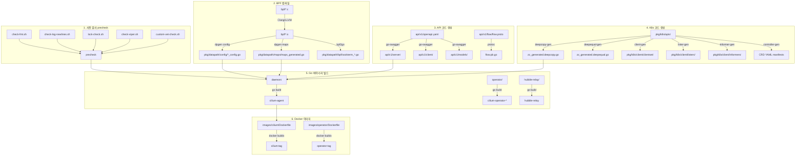

# 18. 빌드 시스템과 코드 생성

## 1. 개요

Cilium의 빌드 시스템은 일반적인 Go 프로젝트와 근본적으로 다르다. 단순히 `go build`만으로 끝나지 않고, **BPF C 프로그램 컴파일**, **OpenAPI 기반 REST API 코드 생성**, **Kubernetes CRD 클라이언트/리스터/인포머 생성**, **eBPF 오브젝트에서 Go 구조체 추출** 등 다양한 단계가 겹쳐진 복합 빌드 파이프라인이다.

왜 이렇게 복잡한가? Cilium은 **두 가지 세계**에 걸쳐 있기 때문이다.

```
+----------------------------------------------------------+
|                     사용자 공간 (Go)                       |
|  - cilium-agent, cilium-operator, hubble-relay            |
|  - REST API 서버/클라이언트 (go-swagger 생성)              |
|  - K8s CRD 클라이언트/인포머 (code-generator 생성)         |
+----------------------------------------------------------+
|                     커널 공간 (C/BPF)                      |
|  - bpf_lxc.c, bpf_host.c, bpf_xdp.c 등                  |
|  - Clang/LLVM으로 .o 오브젝트 컴파일                      |
|  - dpgen으로 BPF 오브젝트 -> Go 구조체 변환                |
+----------------------------------------------------------+
```

이 두 세계를 연결하는 것이 Cilium 빌드 시스템의 핵심 과제이다. 본 문서에서는 이 빌드 파이프라인의 모든 단계를 소스코드 수준에서 분석한다.

---

## 2. 전체 빌드 파이프라인 다이어그램



### 전체 빌드 흐름 요약

| 단계 | 명령어 | 입력 | 출력 | 도구 |
|------|--------|------|------|------|
| 사전 검사 | `make precheck` | Go 소스 | 검증 결과 | 셸 스크립트 |
| BPF 컴파일 | `make -C bpf` | bpf/*.c | bpf/*.o | Clang/LLVM |
| BPF 코드 생성 | `make generate-bpf` | bpf/*.o | Go 구조체 | dpgen, bpf2go |
| API 생성 | `make generate-api` | openapi.yaml | client/server/models | go-swagger |
| Proto 생성 | `make generate-hubble-api` | *.proto | *.pb.go | protoc |
| K8s 생성 | `make generate-k8s-api` | CRD 타입 | clientset/listers/informers | code-generator |
| CRD 매니페스트 | `make manifests` | CRD 타입 | YAML | controller-gen |
| Go 빌드 | `make build` | Go 소스 | 바이너리 | go build |
| Docker | `make docker-cilium-image` | 바이너리 | 컨테이너 이미지 | docker buildx |

---

## 3. Makefile 구조

Cilium의 빌드 시스템은 **계층적 Makefile 구조**로 설계되어 있다. 각 서브 디렉토리가 자체 `Makefile`을 가지며, 최상위 `Makefile`이 이를 오케스트레이션한다.

### 3.1 파일 구성

```
Makefile              # 최상위 빌드 오케스트레이터
Makefile.defs         # 공통 변수, 플래그, 도구 정의
Makefile.quiet        # 출력 제어 (verbose/quiet 모드)
Makefile.docker       # Docker 이미지 빌드 템플릿
Makefile.kind         # Kind 클러스터 관리
daemon/Makefile       # cilium-agent 빌드
operator/Makefile     # cilium-operator 빌드 (5가지 변형)
bpf/Makefile          # BPF 프로그램 컴파일
bpf/Makefile.bpf      # BPF 컴파일러 플래그, 공통 규칙
api/v1/Makefile       # protobuf 코드 생성
api/v1/Makefile.protoc # protoc 실행 규칙
```

### 3.2 Makefile.defs: 빌드의 심장

`Makefile.defs`는 프로젝트 전체에서 사용되는 모든 변수와 빌드 플래그를 정의한다. 모든 서브디렉토리의 `Makefile`이 이 파일을 `include`한다.

**파일 경로**: `/Makefile.defs`

핵심 변수 정의:

```makefile
# 쉘 설정 -- errexit, pipefail로 안전한 빌드 보장
SHELL := /usr/bin/env bash
.SHELLFLAGS := -eu -o pipefail -c

# Go 빌드 환경
export GO ?= go
NATIVE_ARCH = $(shell GOARCH= $(GO) env GOARCH)
export GOARCH ?= $(NATIVE_ARCH)

# CGO 기본 비활성화 -- 정적 바이너리 생성
CGO_ENABLED ?= 0

# 버전 정보 -- VERSION 파일 + git 해시
VERSION = $(shell cat $(dir $(lastword $(MAKEFILE_LIST)))/VERSION)
GIT_VERSION = $(shell git show -s --format='format:%h %aI')
FULL_BUILD_VERSION = $(VERSION) $(GIT_VERSION)

# Go 빌드 최종 조합
GO_BUILD_FLAGS += -mod=vendor
GO_BUILD_LDFLAGS += -X "github.com/cilium/cilium/pkg/version.ciliumVersion=$(FULL_BUILD_VERSION)"
GO_BUILD = $(GO_BUILD_ENV) $(GO) build $(GO_BUILD_FLAGS)
```

**왜 CGO_ENABLED=0인가?** Cilium 바이너리는 scratch 기반 컨테이너에서 실행된다. CGO를 비활성화하면 libc 의존성 없이 완전한 정적 바이너리를 생성할 수 있다. 단, `-race` 플래그나 `boringcrypto` 사용 시에는 CGO가 자동으로 활성화된다:

```makefile
ifneq ($(RACE),)
    GO_BUILD_FLAGS += -race
    CGO_ENABLED = 1       # Race detector는 CGO 필요
endif

ifneq ($(findstring boringcrypto,$(GOEXPERIMENT)),)
    CGO_ENABLED = 1       # FIPS 준수 암호화는 CGO 필요
    GO_BUILD_LDFLAGS += -linkmode external -extldflags "-static --enable-static-nss"
endif
```

### 3.3 Makefile.quiet: 빌드 출력 제어

**파일 경로**: `/Makefile.quiet`

이 파일은 빌드 출력의 **가독성**을 위해 존재한다. `V=0`이면 간결한 출력, `V=1`이면 전체 명령어를 보여준다.

```makefile
ifeq ($(V),0)
    QUIET=@
    ECHO_CC=echo "  CC     $(RELATIVE_DIR)/$@"
    ECHO_CHECK=echo "  CHECK  $(RELATIVE_DIR)"
    ECHO_GO=echo "  GO     $(RELATIVE_DIR)/$@"
    ECHO_GEN=echo "  GEN    $(RELATIVE_DIR)/"
    SUBMAKEOPTS="-s"
else
    ECHO_CC=:    # no-op
    ECHO_GO=:
    SUBMAKEOPTS=
endif
```

**왜 이런 패턴인가?** Linux 커널 빌드 시스템(kbuild)에서 영감을 받은 패턴이다. BPF 프로그램이 리눅스 커널과 깊이 연결되어 있으므로, 커널 개발자에게 친숙한 빌드 출력 형식을 제공한다.

### 3.4 최상위 Makefile: 서브디렉토리 오케스트레이션

**파일 경로**: `/Makefile`

최상위 `Makefile`의 기본 타겟은 `all: precheck build postcheck`이다.

```makefile
# 빌드 대상 서브디렉토리 정의
SUBDIRS_CILIUM_CONTAINER := cilium-dbg daemon cilium-health bugtool \
    hubble tools/mount tools/sysctlfix plugins/cilium-cni

SUBDIR_OPERATOR_CONTAINER := operator
SUBDIR_RELAY_CONTAINER := hubble-relay
SUBDIR_CLUSTERMESH_APISERVER_CONTAINER := clustermesh-apiserver

# 전체 서브디렉토리 목록 -- 중복 제거 로직 포함
SUBDIRS := $(SUBDIRS_CILIUM_CONTAINER) $(SUBDIR_OPERATOR_CONTAINER) \
    plugins tools $(SUBDIR_RELAY_CONTAINER) bpf \
    $(SUBDIR_CLUSTERMESH_APISERVER_CONTAINER) cilium-cli

# 부모 디렉토리가 목록에 있으면 자식 디렉토리 제거 (중복 빌드 방지)
SUBDIRS := $(filter-out $(foreach dir,$(SUBDIRS),$(dir)/%),$(SUBDIRS))
```

**왜 중복 제거가 필요한가?** `tools/mount`와 `tools/sysctlfix`는 `tools/`의 하위 디렉토리이다. `tools/`에 대해 `make all`을 실행하면 하위 디렉토리까지 빌드하므로, 개별적으로 다시 빌드하면 시간 낭비가 된다.

---

## 4. Go 바이너리 빌드

### 4.1 빌드 타겟과 바이너리

Cilium은 여러 바이너리를 생성한다. 각 바이너리는 별도의 서브디렉토리에서 빌드된다.

| 바이너리 | 디렉토리 | 설명 |
|---------|---------|------|
| `cilium-agent` | `daemon/` | 핵심 데이터플레인 에이전트 |
| `cilium-dbg` | `cilium-dbg/` | CLI 디버그 도구 |
| `cilium-operator-generic` | `operator/` | 클라우드 비종속 오퍼레이터 |
| `cilium-operator-aws` | `operator/` | AWS 전용 오퍼레이터 |
| `cilium-operator-azure` | `operator/` | Azure 전용 오퍼레이터 |
| `cilium-operator-alibabacloud` | `operator/` | Alibaba Cloud 전용 오퍼레이터 |
| `hubble-relay` | `hubble-relay/` | Hubble 관찰 릴레이 |
| `clustermesh-apiserver` | `clustermesh-apiserver/` | 멀티클러스터 API 서버 |
| `cilium-health` | `cilium-health/` | 헬스 체크 데몬 |

### 4.2 서브디렉토리 Makefile 패턴

각 서브디렉토리의 `Makefile`은 동일한 패턴을 따른다. `daemon/Makefile` 예시:

```makefile
include ${ROOT_DIR}/../Makefile.defs   # 공통 변수 로드

TARGET := cilium-agent

$(TARGET):
    @$(ECHO_GO)
    $(QUIET)$(GO_BUILD) -o $(TARGET)   # GO_BUILD는 Makefile.defs에서 정의
```

`$(GO_BUILD)`가 최종적으로 확장되면:

```bash
CGO_ENABLED=0 GOARCH=amd64 go build \
    -mod=vendor \
    -ldflags '-s -w -X "github.com/cilium/cilium/pkg/version.ciliumVersion=1.20.0-dev abc1234 2026-03-04"' \
    -tags=osusergo \
    -o cilium-agent
```

### 4.3 오퍼레이터 빌드 태그

**파일 경로**: `/operator/Makefile`

오퍼레이터는 빌드 태그로 클라우드 프로바이더를 선택적으로 포함한다:

```makefile
TARGETS := cilium-operator cilium-operator-generic cilium-operator-aws \
    cilium-operator-azure cilium-operator-alibabacloud

# 빌드 태그로 IPAM 프로바이더 선택
cilium-operator: GO_TAGS_FLAGS+=ipam_provider_aws,ipam_provider_azure,ipam_provider_operator,ipam_provider_alibabacloud
cilium-operator-generic: GO_TAGS_FLAGS+=ipam_provider_operator
cilium-operator-aws: GO_TAGS_FLAGS+=ipam_provider_aws
cilium-operator-azure: GO_TAGS_FLAGS+=ipam_provider_azure
cilium-operator-alibabacloud: GO_TAGS_FLAGS+=ipam_provider_alibabacloud
```

**왜 빌드 태그로 분리하는가?** AWS SDK, Azure SDK 등 클라우드 프로바이더 SDK는 각각 상당한 크기의 의존성을 가진다. 특정 클라우드에서만 사용할 오퍼레이터에 불필요한 SDK를 포함시키면 바이너리 크기가 증가하고 공격 표면이 넓어진다. 빌드 태그로 컴파일 시점에 필요한 코드만 포함한다.

### 4.4 크로스 컴파일

**파일 경로**: `/Makefile.defs` (208~218행)

```makefile
# CGO 크로스 컴파일 지원
CROSS_ARCH =
ifneq ($(GOARCH),$(NATIVE_ARCH))
    CROSS_ARCH = $(GOARCH)
endif

ifeq ($(CROSS_ARCH),arm64)
    GO_BUILD_ENV += CC=aarch64-linux-gnu-gcc
else ifeq ($(CROSS_ARCH),amd64)
    GO_BUILD_ENV += CC=x86_64-linux-gnu-gcc
endif
```

CGO를 사용하는 빌드(race detector, boringcrypto)에서 크로스 컴파일 시, 적절한 크로스 컴파일러를 자동으로 선택한다.

### 4.5 디버그 빌드

```makefile
# 최적화 없는 디버그 빌드
debug: export NOOPT=1     # 컴파일러 최적화 비활성화
debug: export NOSTRIP=1   # 심볼 제거 비활성화
debug: all

# NOOPT=1이면 -gcflags="all=-N -l" 추가
ifeq ($(NOOPT),1)
    GO_BUILD_FLAGS += -gcflags="all=-N -l"
endif

# NOSTRIP이 비어있으면 심볼 제거
ifeq ($(NOSTRIP),)
    GO_BUILD_LDFLAGS += -s -w
endif
```

| 모드 | NOOPT | NOSTRIP | 용도 |
|------|-------|---------|------|
| release | 0 | 0 | 프로덕션 배포 (최소 바이너리) |
| debug | 1 | 1 | Delve 디버거 연동 |
| unstripped | 0 | 1 | 최적화된 코드 + 디버그 심볼 |

---

## 5. BPF 프로그램 컴파일

### 5.1 BPF 빌드 파이프라인 개요

BPF 프로그램은 C로 작성되어 Clang/LLVM으로 컴파일된다. 이것은 Cilium 빌드 시스템에서 가장 특수한 부분이다.

```
bpf/*.c  ---------->  Clang/LLVM (--target=bpf)  ---------->  bpf/*.o (BPF ELF)
   |                                                                |
   |                                                                +---> dpgen config -> Go 구조체
   |                                                                +---> dpgen maps -> Go MapSpec
   +-- bpf/include/*.h (공유 헤더)                                   +---> bpf2go -> Go 스켈레톤
```

### 5.2 Makefile.bpf: 컴파일러 설정

**파일 경로**: `/bpf/Makefile.bpf`

```makefile
FLAGS := -I$(ROOT_DIR)/bpf -I$(ROOT_DIR)/bpf/include -O2 -g

CLANG_FLAGS := ${FLAGS} --target=bpf -std=gnu99 -nostdinc
CLANG_FLAGS += -ftrap-function=__undefined_trap
CLANG_FLAGS += -Wall -Wextra -Werror -Wshadow
CLANG_FLAGS += -Wno-address-of-packed-member
CLANG_FLAGS += -Wimplicit-int-conversion -Wenum-conversion
CLANG_FLAGS += -Wimplicit-fallthrough
CLANG_FLAGS += -mcpu=v3   # BPF ISA v3 (5.x 커널 이상)
```

핵심 플래그 분석:

| 플래그 | 의미 | 이유 |
|--------|------|------|
| `--target=bpf` | BPF 바이트코드 생성 | x86/arm 대신 BPF 가상 머신 대상 |
| `-std=gnu99` | GNU C99 표준 | 커널 BPF 헬퍼와 호환 |
| `-nostdinc` | 표준 C 라이브러리 헤더 제외 | BPF에서는 libc 사용 불가 |
| `-O2` | 최적화 레벨 2 | BPF 검증기의 명령어 제한(100만) 충족 |
| `-mcpu=v3` | BPF ISA 버전 3 | 32비트 부분 레지스터, 점프 오프셋 확장 등 |
| `-ftrap-function=__undefined_trap` | 정의되지 않은 함수 호출 트랩 | 컴파일 타임에 누락 함수 감지 |

### 5.3 BPF 소스 파일과 빌드 규칙

**파일 경로**: `/bpf/Makefile`

```makefile
BPF_SIMPLE = bpf_alignchecker.o
BPF = bpf_lxc.o bpf_overlay.o bpf_sock.o bpf_host.o \
      bpf_wireguard.o bpf_xdp.o $(BPF_SIMPLE)
```

| BPF 프로그램 | 부착점 | 역할 |
|-------------|--------|------|
| `bpf_lxc.o` | tc (Pod veth) | Pod 네트워크 정책, 라우팅 |
| `bpf_host.o` | tc (호스트 인터페이스) | 호스트 방화벽, NodePort |
| `bpf_overlay.o` | tc (VXLAN/Geneve) | 터널 트래픽 처리 |
| `bpf_xdp.o` | XDP | NodePort 가속, DSR |
| `bpf_sock.o` | cgroup/sockaddr | 소켓 레벨 로드밸런싱 |
| `bpf_wireguard.o` | tc (WireGuard) | 암호화된 트래픽 처리 |
| `bpf_alignchecker.o` | - | Go/C 구조체 정렬 검증용 |

### 5.4 컴파일 옵션 순열 (Permutation) 테스트

BPF 프로그램은 `#define`으로 기능을 활성화/비활성화한다. 빌드 시스템은 **모든 유효한 옵션 조합**을 컴파일 테스트하여 어떤 조합에서도 컴파일이 성공하는지 검증한다.

```makefile
# 최대 옵션 조합 -- 복잡도 테스트
MAX_BASE_OPTIONS = -DSKIP_DEBUG=1 -DENABLE_IPV4=1 -DENABLE_IPV6=1 \
    -DENABLE_ROUTING=1 -DPOLICY_VERDICT_NOTIFY=1 \
    -DENABLE_IDENTITY_MARK=1 -DMONITOR_AGGREGATION=3 \
    -DENABLE_HOST_FIREWALL=1 -DENABLE_SRV6=1 -DENABLE_L7_LB=1
MAX_BASE_OPTIONS += -DENABLE_MASQUERADE_IPV4=1 -DENABLE_NODEPORT=1 \
    -DENABLE_DSR=1 -DENABLE_IPV4_FRAGMENTS=1
MAX_BASE_OPTIONS += -DENABLE_BANDWIDTH_MANAGER=1 -DENABLE_EGRESS_GATEWAY=1

# 개별 옵션 조합 (콜론으로 구분)
LXC_OPTIONS = \
    -DSKIP_DEBUG: \
    -DENABLE_IPV4: \
    -DENABLE_IPV4:-DENABLE_SOCKET_LB_FULL: \
    -DENABLE_IPV6: \
    ...
```

순열 테스트 메커니즘:

```makefile
# BUILD_PERMUTATIONS=1이면 모든 조합을 개별 컴파일
define PERMUTATION_template =
$(1)::
    @$$(ECHO_CC) " [$(subst :,=1$(space),$(2))]"
    $$(QUIET) $${CLANG} $(subst :,=1$(space),$(2)) $${CLANG_FLAGS} \
        -c $(patsubst %.o,%.c,$(1)) -o $(1)
endef

# 모든 LXC 옵션 조합에 대해 컴파일 규칙 생성
$(foreach OPTS,$(LXC_OPTIONS),$(eval $(call PERMUTATION_template,bpf_lxc.o,$(OPTS))))
```

**왜 순열 테스트가 필요한가?** BPF 프로그램은 런타임에 에이전트가 기능 플래그에 따라 다른 `#define` 조합으로 컴파일한다. 배포 전에 모든 유효한 조합이 컴파일 가능한지 검증하지 않으면, 특정 설정 조합에서만 발생하는 컴파일 오류를 놓칠 수 있다.

### 5.5 BPF 소스 파일 추적

```makefile
# Git이 있으면 git ls-files로, 없으면 find로 BPF 소스 파일 수집
BPF_SRCFILES_IGNORE = bpf/.gitignore bpf/tests/% bpf/complexity-tests/%
ifneq ($(wildcard $(dir $(lastword $(MAKEFILE_LIST)))/.git/HEAD),)
    BPF_SRCFILES := $(shell git ls-files $(ROOT_DIR)/bpf/ | LC_ALL=C sort | tr "\n" ' ')
else
    BPF_SRCFILES := $(shell find $(ROOT_DIR)/bpf/ -type f | LC_ALL=C sort | tr "\n" ' ')
endif
```

이 파일 목록은 `make install-bpf`에서 BPF 소스를 `/var/lib/cilium/bpf/`로 복사할 때 사용된다. cilium-agent는 런타임에 이 소스 파일을 읽어 필요한 옵션으로 재컴파일한다.

---

## 6. API 코드 생성 (go-swagger)

### 6.1 OpenAPI 스펙 기반 코드 생성

Cilium은 **OpenAPI 2.0 (Swagger)** 스펙에서 REST API의 서버/클라이언트/모델 코드를 자동 생성한다. 이것은 단순한 편의가 아니라, API 계약을 단일 소스 오브 트루스(Single Source of Truth)로 유지하기 위한 아키텍처 결정이다.

**OpenAPI 스펙 파일들**:

| 스펙 파일 | API | 기본 스킴 |
|----------|-----|----------|
| `api/v1/openapi.yaml` | cilium-agent API | unix (소켓) |
| `api/v1/health/openapi.yaml` | cilium-health API | unix |
| `api/v1/operator/openapi.yaml` | cilium-operator API | http |
| `api/v1/kvstoremesh/openapi.yaml` | kvstoremesh API | http |

### 6.2 go-swagger 실행 방식

**파일 경로**: `/Makefile.defs` (70~73행)

```makefile
# Swagger는 컨테이너에서 실행 -- 로컬 설치 불필요
SWAGGER_VERSION = 0.33.1
SWAGGER := $(CONTAINER_ENGINE) run -u $(shell id -u):$(shell id -g) \
    --rm -v $(ROOT_DIR):$(ROOT_DIR) -w $(ROOT_DIR) \
    --entrypoint swagger \
    quay.io/goswagger/swagger:$(SWAGGER_VERSION)@$(SWAGGER_IMAGE_SHA)
```

**왜 컨테이너에서 실행하는가?** go-swagger의 버전이 생성 코드의 형태를 결정한다. 개발자 로컬에 설치된 버전이 다르면 불필요한 코드 차이가 발생한다. 컨테이너를 사용하면 모든 개발자가 동일한 버전으로 코드를 생성한다.

### 6.3 코드 생성 명령

**파일 경로**: `/Makefile` (275~289행)

```makefile
generate-api: api/v1/openapi.yaml
    # 서버 코드 생성
    $(SWAGGER) generate server -s server -a restapi \
        -t api/v1 \
        -f api/v1/openapi.yaml \
        --default-scheme=unix \
        -C api/v1/cilium-server.yml \
        -r hack/spdx-copyright-header.txt

    # 클라이언트 코드 생성
    $(SWAGGER) generate client -a restapi \
        -t api/v1 \
        -f api/v1/openapi.yaml \
        -C api/v1/cilium-client.yml \
        -r hack/spdx-copyright-header.txt

    # import 정렬
    $(GO) tool golang.org/x/tools/cmd/goimports -w \
        ./api/v1/client ./api/v1/models ./api/v1/server
```

핵심 플래그:

| 플래그 | 의미 |
|--------|------|
| `--default-scheme=unix` | Unix 도메인 소켓 통신이 기본 (agent API 전용) |
| `-s server` | 생성될 서버 코드의 패키지명 |
| `-a restapi` | 생성될 API 패키지명 |
| `-t api/v1` | 생성 코드의 출력 디렉토리 |
| `-C api/v1/cilium-server.yml` | 서버 생성 설정 파일 |
| `-r hack/spdx-copyright-header.txt` | 라이선스 헤더 |

### 6.4 생성 결과물 구조

```
api/v1/
+-- openapi.yaml              # 원본 스펙 (사람이 편집)
+-- cilium-server.yml         # 서버 생성 설정
+-- cilium-client.yml         # 클라이언트 생성 설정
+-- server.gotmpl             # 커스텀 서버 템플릿
+-- client/                   # 생성된 클라이언트 코드
|   +-- cilium_api_client.go
|   +-- daemon/
|   +-- endpoint/
|   +-- ipam/
|   +-- policy/
|   +-- prefilter/
|   +-- service/
|   +-- bgp/
+-- models/                   # 생성된 데이터 모델
|   +-- endpoint.go
|   +-- identity.go
|   +-- policy.go
|   +-- ...  (수십 개)
+-- server/                   # 생성된 서버 코드
    +-- configure_cilium_api.go
    +-- embedded_spec.go
    +-- server.go
    +-- restapi/
```

### 6.5 커스텀 생성 설정

**파일 경로**: `/api/v1/cilium-server.yml`

서버 생성 설정은 go-swagger의 레이아웃 시스템을 사용하여 코드 생성 구조를 커스터마이징한다:

```yaml
layout:
  application:
    - name: configure
      source: asset:serverConfigureapi
      target: "{{ joinFilePath .Target .ServerPackage }}"
      file_name: "configure_{{ .Name }}.go"
      skip_exists: true        # 이미 존재하면 덮어쓰지 않음
    - name: server
      source: "api/v1/server.gotmpl"   # 커스텀 템플릿 사용
      target: "{{ joinFilePath .Target .ServerPackage }}"
      file_name: "server.go"
```

**왜 커스텀 템플릿인가?** Cilium의 API 서버는 Unix 도메인 소켓을 기본 통신 채널로 사용한다. 표준 go-swagger 템플릿은 TCP 서버를 가정하므로, Unix 소켓 지원을 위한 커스텀 서버 템플릿(`server.gotmpl`)이 필요하다.

### 6.6 Hubble API (protobuf)

Hubble 관찰 API는 gRPC/protobuf 기반이다. REST가 아닌 스트리밍이 필요하기 때문이다.

**파일 경로**: `/api/v1/Makefile.protoc`

```makefile
HUBBLE_PROTO_SOURCES := \
    ./flow/flow.proto \
    ./peer/peer.proto \
    ./observer/observer.proto \
    ./relay/relay.proto

HUBBLE_PROTOC_PLUGINS := --plugin=$(GOPATH)/bin/protoc-gen-doc
HUBBLE_PROTOC_PLUGINS += --plugin=$(GOPATH)/bin/protoc-gen-go-grpc
HUBBLE_PROTOC_PLUGINS += --plugin=$(GOPATH)/bin/protoc-gen-go-json
HUBBLE_PROTOC_PLUGINS += --plugin=$(GOPATH)/bin/protoc-gen-go
```

protoc 실행:

```makefile
$(PROTOC) $(HUBBLE_PROTOC_PLUGINS) -I $(HUBBLE_PROTO_PATH) \
    --doc_out=./ --doc_opt=markdown,README.md,source_relative \
    --go_out=paths=source_relative:. \
    --go-grpc_out=require_unimplemented_servers=false,paths=source_relative:. \
    --go-json_out=orig_name=true,paths=source_relative:. \
    $${proto};
```

생성되는 파일:

| proto 파일 | 생성 결과 |
|-----------|----------|
| `flow/flow.proto` | `flow.pb.go`, `flow.pb.json.go` |
| `observer/observer.proto` | `observer.pb.go`, `observer_grpc.pb.go`, `observer.pb.json.go` |
| `peer/peer.proto` | `peer.pb.go`, `peer_grpc.pb.go`, `peer.pb.json.go` |
| `relay/relay.proto` | `relay.pb.go`, `relay_grpc.pb.go`, `relay.pb.json.go` |

**왜 JSON 시리얼라이저도 생성하는가?** `protoc-gen-go-json`은 protobuf 메시지의 JSON 마샬링/언마샬링을 생성한다. Hubble CLI가 `-o json` 출력을 지원하고, Hubble UI가 JSON으로 flow 데이터를 소비하기 때문이다.

---

## 7. K8s CRD 코드 생성

### 7.1 생성 파이프라인 개요

Kubernetes CRD를 정의하면 여러 보일러플레이트 코드를 자동 생성해야 한다. Cilium은 `k8s.io/code-generator`를 사용하되, **deepequal-gen**이라는 Cilium 전용 생성기를 추가로 사용한다.

```
+----------------------------+     +------------------------------------+
|  pkg/k8s/apis/cilium.io/   |     |  contrib/scripts/k8s-code-gen.sh   |
|  v2/                       |     |                                    |
|  +-- types.go              | --> |  1. kube::codegen::gen_client       |
|  +-- doc.go                |     |  2. kube::codegen::gen_helpers      |
|  +-- cec_types.go          |     |  3. kube::codegen::deepequal_helpers|
|  +-- ...                   |     +------------------------------------+
+----------------------------+              |
                                            v
+----------------------------+     +------------------------------------+
|  생성 결과물               |     |  pkg/k8s/client/                    |
|  +-- zz_generated.         |     |  +-- clientset/versioned/          |
|  |   deepcopy.go           |     |  +-- informers/externalversions/   |
|  +-- zz_generated.         |     |  +-- listers/cilium.io/            |
|      deepequal.go          |     +------------------------------------+
+----------------------------+
```

### 7.2 마커 주석 (Marker Comments)

코드 생성은 Go 소스 파일에 포함된 **마커 주석**에 의해 구동된다.

**파일 경로**: `/pkg/k8s/apis/cilium.io/v2/doc.go`

```go
// +k8s:deepcopy-gen=package,register    // 패키지 전체에 DeepCopy 생성
// +k8s:openapi-gen=true                 // OpenAPI 스키마 생성
// +deepequal-gen=package                // 패키지 전체에 DeepEqual 생성

// Package v2 is the v2 version of the API.
// +groupName=cilium.io
package v2
```

개별 타입에 대한 마커:

```go
// +k8s:deepcopy-gen:interfaces=k8s.io/apimachinery/pkg/runtime.Object
type CiliumNetworkPolicy struct { ... }

// +deepequal-gen=false    // 이 필드는 DeepEqual 비교에서 제외
type SomeType struct {
    // +deepequal-gen=false
    Status SomeStatus
}
```

### 7.3 k8s-code-gen.sh 스크립트 분석

**파일 경로**: `/contrib/scripts/k8s-code-gen.sh`

이 스크립트는 세 가지 주요 생성 작업을 수행한다.

**1단계: 클라이언트셋 생성 (gen_client)**

```bash
# Cilium CRD 클라이언트셋 생성
kube::codegen::gen_client \
    "./pkg/k8s/apis" \
    --with-watch \
    --output-dir "${TMPDIR}/github.com/cilium/cilium/pkg/k8s/client" \
    --output-pkg "github.com/cilium/cilium/pkg/k8s/client" \
    --plural-exceptions ${PLURAL_EXCEPTIONS} \
    --boilerplate "${SCRIPT_ROOT}/hack/custom-boilerplate.go.txt"

# Slim K8s 타입 클라이언트셋 생성
kube::codegen::gen_client \
    "./pkg/k8s/slim/k8s/api" \
    --with-watch \
    --output-dir "${TMPDIR}/github.com/cilium/cilium/pkg/k8s/slim/k8s/client" \
    --output-pkg "github.com/cilium/cilium/pkg/k8s/slim/k8s/client" \
    ...
```

두 번 호출되는 이유:
- `pkg/k8s/slim/k8s/api`: Cilium이 "슬림화"한 upstream K8s 타입들 (불필요한 필드를 제거한 버전)
- `pkg/k8s/apis`: Cilium CRD 타입들 (CiliumNetworkPolicy, CiliumEndpoint 등)

**2단계: 헬퍼 생성 (gen_helpers)**

```bash
# deepcopy-gen 실행
kube::codegen::gen_helpers \
    --boilerplate "${SCRIPT_ROOT}/hack/custom-boilerplate.go.txt" \
    "$PWD/api"

kube::codegen::gen_helpers \
    --boilerplate "${SCRIPT_ROOT}/hack/custom-boilerplate.go.txt" \
    "$PWD/pkg"
```

**3단계: DeepEqual 생성 (Cilium 전용)**

```bash
kube::codegen::deepequal_helpers \
    --boilerplate "${SCRIPT_ROOT}/hack/custom-boilerplate.go.txt" \
    --output-base "${TMPDIR}" \
    "$PWD"
```

이 함수는 스크립트 내에 직접 정의되어 있다. `+deepequal-gen=` 마커가 있는 파일을 찾아 `github.com/cilium/deepequal-gen` 도구를 실행한다:

```bash
function kube::codegen::deepequal_helpers() {
    # +deepequal-gen= 마커가 있는 패키지 탐색
    while read -r dir; do
        pkg="$(cd "${dir}" && GO111MODULE=on go list -find .)"
        input_pkgs+=("${pkg}")
    done < <(
        kube::codegen::internal::grep -l --null \
            -e '^\s*//\s*+deepequal-gen=' \
            -r "${in_dir}" --include '*.go'
        | while read -r -d $'\0' F; do dirname "${F}"; done
        | LC_ALL=C sort -u
    )

    # deepequal-gen 실행
    go tool github.com/cilium/deepequal-gen \
        --output-file zz_generated.deepequal.go \
        --go-header-file "${boilerplate}" \
        "${input_pkgs[@]}"
}
```

### 7.4 생성 결과물 구조

```
pkg/k8s/client/
+-- clientset/
|   +-- versioned/
|       +-- scheme/               # 스킴 등록
|       +-- typed/
|           +-- cilium.io/
|               +-- v2/           # CiliumNetworkPolicy, CiliumEndpoint 등
|               +-- v2alpha1/     # CiliumEndpointSlice 등
+-- informers/
|   +-- externalversions/
|       +-- cilium.io/
|       |   +-- v2/              # 각 CRD의 Informer
|       |   +-- v2alpha1/
|       +-- internalinterfaces/
+-- listers/
|   +-- cilium.io/
|       +-- v2/                  # 각 CRD의 Lister
|       +-- v2alpha1/
+-- applyconfiguration/
    +-- cilium.io/
        +-- v2/                  # Server-Side Apply 설정
```

### 7.5 왜 DeepEqual을 별도 생성하는가?

표준 Kubernetes `code-generator`는 `DeepCopy`만 생성한다. Cilium은 `DeepEqual`도 필요한데, 이유가 있다:

1. **리소스 업데이트 감지**: CiliumNetworkPolicy 같은 CRD가 변경되었는지 확인할 때, `reflect.DeepEqual`은 느리고 예측 불가능하다.
2. **선택적 필드 비교**: `+deepequal-gen=false` 마커로 상태(status) 필드를 비교에서 제외할 수 있다. 스펙만 비교하고 상태는 무시하는 패턴이 Cilium에서 자주 사용된다.
3. **타입 안전성**: 생성된 `DeepEqual`은 타입별 비교 로직을 가지므로, `interface{}` 기반 리플렉션보다 안전하다.

생성 예시:

```go
// zz_generated.deepequal.go (자동 생성)
// Code generated by deepequal-gen. DO NOT EDIT.

func (in *AddressPair) DeepEqual(other *AddressPair) bool {
    if other == nil {
        return false
    }
    if in.IPV4 != other.IPV4 {
        return false
    }
    if in.IPV6 != other.IPV6 {
        return false
    }
    return true
}
```

---

## 8. DeepCopy/DeepEqual 생성 상세

### 8.1 DeepCopy 생성

**생성 도구**: `k8s.io/code-generator` 내장 `deepcopy-gen`

**출력 파일**: `zz_generated.deepcopy.go`

```go
// zz_generated.deepcopy.go (자동 생성)
// Code generated by deepcopy-gen. DO NOT EDIT.

func (in *BGPAdvertisement) DeepCopyInto(out *BGPAdvertisement) {
    *out = *in
    if in.Service != nil {
        in, out := &in.Service, &out.Service
        *out = new(BGPServiceOptions)
        (*in).DeepCopyInto(*out)
    }
    if in.Selector != nil {
        in, out := &in.Selector, &out.Selector
        *out = new(v1.LabelSelector)
        (*in).DeepCopyInto(*out)
    }
}
```

**왜 DeepCopy가 필요한가?** Kubernetes의 informer/lister는 캐시된 오브젝트를 반환한다. 캐시된 오브젝트를 직접 수정하면 데이터 레이스가 발생한다. `DeepCopy`로 복사본을 만들어 수정해야 한다.

### 8.2 생성 파일이 존재하는 패키지 목록

`zz_generated.deepequal.go`와 `zz_generated.deepcopy.go`가 생성되는 주요 패키지:

```
pkg/k8s/apis/cilium.io/v2/
pkg/k8s/apis/cilium.io/v2alpha1/
pkg/k8s/types/
pkg/k8s/
pkg/k8s/slim/k8s/apis/util/intstr/
pkg/k8s/slim/k8s/apis/labels/
pkg/k8s/slim/k8s/apis/meta/v1/
pkg/k8s/slim/k8s/api/core/v1/
pkg/k8s/slim/k8s/api/networking/v1/
pkg/k8s/slim/k8s/api/discovery/v1/
```

### 8.3 Protobuf 생성 (K8s Slim 타입)

Cilium의 "slim" Kubernetes 타입은 protobuf 시리얼라이제이션도 지원한다:

```makefile
define K8S_PROTO_PACKAGES
github.com/cilium/cilium/pkg/k8s/slim/k8s/api/core/v1
github.com/cilium/cilium/pkg/k8s/slim/k8s/api/discovery/v1
github.com/cilium/cilium/pkg/k8s/slim/k8s/api/networking/v1
github.com/cilium/cilium/pkg/k8s/slim/k8s/apis/meta/v1
github.com/cilium/cilium/pkg/k8s/slim/k8s/apis/meta/v1beta1
github.com/cilium/cilium/pkg/k8s/slim/k8s/apis/util/intstr
endef
```

**왜 Slim 타입인가?** Kubernetes의 표준 타입(`k8s.io/api/core/v1.Pod` 등)은 Cilium이 사용하지 않는 많은 필드를 포함한다. Slim 타입은 필요한 필드만 포함하여 메모리 사용량과 시리얼라이제이션 비용을 줄인다. 대규모 클러스터(10,000+ 노드)에서 이 차이가 유의미하다.

### 8.4 CRD 매니페스트 생성

**파일 경로**: `/contrib/scripts/k8s-manifests-gen.sh`

```bash
# controller-gen으로 CRD YAML 생성
CRD_OPTIONS="crd:crdVersions=v1"
CRD_PATHS="pkg/k8s/apis/cilium.io/v2;pkg/k8s/apis/cilium.io/v2alpha1"

go tool sigs.k8s.io/controller-tools/cmd/controller-gen \
    ${CRD_OPTIONS} paths="${CRD_PATHS}" output:crd:artifacts:config="${TMPDIR}"

# CRD 유효성 검사
go run tools/crdcheck "${TMPDIR}"
```

생성되는 CRD 매니페스트:

| API 버전 | CRD 리소스 |
|----------|-----------|
| v2 | CiliumNetworkPolicy, CiliumClusterwideNetworkPolicy, CiliumEndpoint, CiliumIdentity, CiliumNode, CiliumLocalRedirectPolicy, CiliumEgressGatewayPolicy, CiliumEnvoyConfig, CiliumClusterwideEnvoyConfig, CiliumNodeConfig, CiliumBGP*(6종), CiliumCIDRGroup, CiliumLoadBalancerIPPool |
| v2alpha1 | CiliumEndpointSlice, CiliumL2AnnouncementPolicy, CiliumPodIPPool, CiliumGatewayClassConfig |

### 8.5 코드 생성 검증 (CI)

**파일 경로**: `/contrib/scripts/check-k8s-code-gen.sh`

CI에서는 코드 생성 결과가 커밋된 코드와 일치하는지 검증한다:

```bash
#!/usr/bin/env bash

# 모든 생성 파일 삭제
find . -not -regex ".*/vendor/.*" -name "zz_generated.deepcopy.go" -exec rm {} \;
find . -not -regex ".*/vendor/.*" -name "zz_generated.deepequal.go" -exec rm {} \;
find . -not -regex ".*/vendor/.*" -name "generated.pb.go" -exec rm {} \;
find . -not -regex ".*/vendor/.*" -name "generated.proto" -exec rm {} \;
rm -rf ./pkg/k8s/client/{clientset,informers,listers}
rm -rf ./pkg/k8s/slim/k8s/client

# 재생성
make generate-k8s-api manifests

# diff 확인 -- 차이가 있으면 실패
diff="$(git diff)"
if [ -n "$diff" ]; then
    echo "Please run 'make generate-k8s-api && make manifests' and submit your changes"
    exit 1
fi
```

---

## 9. dpgen 도구

### 9.1 개요

`dpgen`은 Cilium 자체 개발 도구로, **eBPF 오브젝트(.o) 파일에서 Go 코드를 자동 생성**한다. BPF 프로그램의 설정 구조체와 맵 정의를 Go에서 타입 안전하게 사용할 수 있게 한다.

**파일 경로**: `/tools/dpgen/main.go`

```go
func main() {
    var rootCmd = &cobra.Command{
        Use:   "dpgen",
        Short: "dpgen generates Go code from eBPF datapath objects",
    }

    rootCmd.AddCommand(configCmd())  // config 서브커맨드
    rootCmd.AddCommand(mapsCmd())    // maps 서브커맨드
    ...
}
```

dpgen에는 두 가지 모드가 있다:

| 모드 | 명령 | 입력 | 출력 |
|------|------|------|------|
| `config` | `dpgen config --path bpf_lxc.o --name BPFLXC` | BPF ELF 오브젝트 | Go 설정 구조체 |
| `maps` | `dpgen maps bpf_*.o` | BPF ELF 오브젝트들 | Go MapSpec 코드 |

### 9.2 config 모드: BPF 설정 구조체 생성

**파일 경로**: `/pkg/datapath/config/gen.go`

```go
// Node configuration은 모든 오브젝트에 공통이므로 bpf_lxc에서 추출
//go:generate go run github.com/cilium/cilium/tools/dpgen config \
//    --path ../../../bpf/bpf_lxc.o --kind node --name Node --out node_config.go

// 각 BPF 오브젝트별 설정 구조체
//go:generate go run github.com/cilium/cilium/tools/dpgen config \
//    --path ../../../bpf/bpf_lxc.o --embed Node --kind object --name BPFLXC --out lxc_config.go
//go:generate go run github.com/cilium/cilium/tools/dpgen config \
//    --path ../../../bpf/bpf_xdp.o --embed Node --kind object --name BPFXDP --out xdp_config.go
//go:generate go run github.com/cilium/cilium/tools/dpgen config \
//    --path ../../../bpf/bpf_host.o --embed Node --kind object --name BPFHost --out host_config.go
//go:generate go run github.com/cilium/cilium/tools/dpgen config \
//    --path ../../../bpf/bpf_overlay.o --embed Node --kind object --name BPFOverlay --out overlay_config.go
//go:generate go run github.com/cilium/cilium/tools/dpgen config \
//    --path ../../../bpf/bpf_wireguard.o --embed Node --kind object --name BPFWireguard --out wireguard_config.go
//go:generate go run github.com/cilium/cilium/tools/dpgen config \
//    --path ../../../bpf/bpf_sock.o --embed Node --kind object --name BPFSock --out sock_config.go
```

생성 결과 예시 (`node_config.go`):

```go
// Code generated by dpgen. DO NOT EDIT.

package config

// Node는 Cilium 데이터패스 오브젝트의 설정 구조체이다.
type Node struct {
    CiliumHostIfIndex          uint32   `config:"cilium_host_ifindex"`
    CiliumHostMAC              [8]byte  `config:"cilium_host_mac"`
    CiliumNetIfIndex           uint32   `config:"cilium_net_ifindex"`
    ClusterID                  uint32   `config:"cluster_id"`
    ClusterIDBits              uint32   `config:"cluster_id_bits"`
    DebugLB                    bool     `config:"debug_lb"`
    DirectRoutingDevIfIndex    uint32   `config:"direct_routing_dev_ifindex"`
    EnableConntrackAccounting  bool     `config:"enable_conntrack_accounting"`
    EnableJiffies              bool     `config:"enable_jiffies"`
    NodeportPortMax            uint16   `config:"nodeport_port_max"`
    NodeportPortMin            uint16   `config:"nodeport_port_min"`
    RouterIPv6                 [16]byte `config:"router_ipv6"`
    ...
}
```

`BPFLXC` 구조체는 `Node`를 임베드한다:

```go
// Code generated by dpgen. DO NOT EDIT.

package config

type BPFLXC struct {
    AllowICMPFragNeeded             bool     `config:"allow_icmp_frag_needed"`
    DeviceMTU                       uint16   `config:"device_mtu"`
    EnableARPResponder              bool     `config:"enable_arp_responder"`
    EnableNetkit                    bool     `config:"enable_netkit"`
    EndpointID                      uint16   `config:"endpoint_id"`
    EndpointIPv4                    [4]byte  `config:"endpoint_ipv4"`
    EndpointIPv6                    [16]byte `config:"endpoint_ipv6"`
    ...
}
```

**왜 BPF 오브젝트에서 구조체를 추출하는가?** BPF 프로그램의 설정은 C 구조체로 정의된다. 이 구조체를 Go에서 수동으로 재정의하면 필드 순서, 크기, 패딩 불일치가 발생할 수 있다. dpgen은 컴파일된 ELF의 BTF(BPF Type Format) 정보를 읽어 정확한 Go 구조체를 생성한다. 이것이 **C와 Go 사이의 타입 안전한 다리**이다.

### 9.3 maps 모드: BPF 맵 스펙 생성

**파일 경로**: `/pkg/datapath/maps/gen.go`

```go
//go:generate go run github.com/cilium/cilium/tools/dpgen maps ../../../bpf/bpf_*.o
```

이 명령은 모든 BPF 오브젝트의 맵 정의를 수집하여 Go `MapSpec` 코드를 생성한다.

**파일 경로**: `/tools/dpgen/util.go`

dpgen의 maps 모드는 다음 로직을 수행한다:

1. 글롭 패턴으로 모든 `.o` 파일 수집
2. 각 ELF에서 `ebpf.MapSpec` 추출
3. 동일한 이름의 맵이 여러 오브젝트에 있으면 호환성 검증
4. BTF 타입 정보 포함하여 Go 코드 생성

```go
// mapSpecCompatible는 두 MapSpec의 Type, KeySize, ValueSize,
// MaxEntries가 일치하는지 확인한다.
func mapSpecCompatible(a, b *ebpf.MapSpec) error {
    if a.Type != b.Type {
        return fmt.Errorf("map %s: type mismatch: %s != %s", a.Name, a.Type, b.Type)
    }
    if a.KeySize != b.KeySize {
        return fmt.Errorf("map %s: key size mismatch: %d != %d", a.Name, a.KeySize, b.KeySize)
    }
    ...
}
```

생성 템플릿 (`maps_generated.go.tpl`):

```go
// Code generated by dpgen. DO NOT EDIT.

package {{ .Package }}

//go:embed {{ .BTFFile }}
var _mapKVTypes []byte

func LoadMapSpecs() (map[string]*ebpf.MapSpec, error) {
    types, err := btf.LoadSpecFromReader(bytes.NewReader(_mapKVTypes))
    if err != nil {
        return nil, err
    }
    out := make(map[string]*ebpf.MapSpec)
    for _, f := range _outer {
        spec := f(types)
        out[spec.Name] = spec
    }
    return out, nil
}

// 각 맵별 스펙 생성 함수
{{- range .AllMaps }}
func new{{ camelCase .Name }}Spec(btf *btf.Spec) *ebpf.MapSpec {
    return &ebpf.MapSpec{
        Name:       "{{ .Name }}",
        Type:       ebpf.{{ .Type.String }},
        KeySize:    {{ .KeySize }},
        Key:        anyTypeByName(btf, "{{ .Key.TypeName }}"),
        ValueSize:  {{ .ValueSize }},
        Value:      anyTypeByName(btf, "{{ .Value.TypeName }}"),
        MaxEntries: {{ .MaxEntries }},
        Flags:      {{ bpfFlagsToString .Flags }},
        Pinning:    ebpf.{{ .Pinning.String }},
    }
}
{{ end }}
```

### 9.4 bpf2go: Go 스켈레톤 생성

**파일 경로**: `/pkg/datapath/bpf/gen.go`

```go
// Package bpf provides Go skeletons containing BPF programs.
package bpf

//go:generate go tool github.com/cilium/ebpf/cmd/bpf2go SockTerm ../../../bpf/bpf_sock_term.c
//go:generate go tool github.com/cilium/ebpf/cmd/bpf2go Probes ../../../bpf/bpf_probes.c
```

`bpf2go`는 `cilium/ebpf` 라이브러리의 도구로, BPF C 소스를 컴파일하고 Go 바인딩을 생성한다. dpgen과의 차이:

| 도구 | 입력 | 출력 | 용도 |
|------|------|------|------|
| dpgen | 컴파일된 .o 파일 | 설정 구조체, MapSpec | 런타임 설정 주입 |
| bpf2go | C 소스 파일 | 완전한 Go 스켈레톤 | 프로그램 로딩/관리 |

### 9.5 generate 타겟의 실행 순서

**파일 경로**: `/bpf/Makefile` (176~179행)

```makefile
generate: $(BPF)
    $(GO) generate ../pkg/datapath/config
    $(GO) generate ../pkg/datapath/maps
    BPF2GO_CC="$(CLANG)" BPF2GO_CFLAGS="$(MAX_OVERLAY_OPTIONS) $(CLANG_FLAGS)" \
        $(GO) generate ../pkg/datapath/bpf
```

의존성 순서가 중요하다:

```
$(BPF)  (bpf_lxc.o, bpf_host.o 등을 먼저 컴파일)
    |
    v
go generate ../pkg/datapath/config  (dpgen config: .o에서 Go 구조체 추출)
    |
    v
go generate ../pkg/datapath/maps    (dpgen maps: .o에서 MapSpec 추출)
    |
    v
go generate ../pkg/datapath/bpf     (bpf2go: C 소스 -> Go 스켈레톤)
```

.o 파일이 먼저 존재해야 dpgen이 BTF를 읽을 수 있으므로, `$(BPF)` 의존성이 선행한다.

---

## 10. Docker 이미지 빌드

### 10.1 이미지 종류

**파일 경로**: `/Makefile.docker`

| Make 타겟 | Dockerfile | 이미지 이름 | 용도 |
|-----------|-----------|------------|------|
| `docker-cilium-image` | `images/cilium/Dockerfile` | `cilium` | 프로덕션 에이전트 |
| `dev-docker-image` | `images/cilium/Dockerfile` | `cilium-dev` | 개발용 에이전트 |
| `dev-docker-image-debug` | `images/cilium/Dockerfile` | `cilium-dev` (debug) | 디버거 포함 |
| `docker-operator-*-image` | `images/operator/Dockerfile` | `operator-*` | 오퍼레이터 변형 |
| `docker-hubble-relay-image` | `images/hubble-relay/Dockerfile` | `hubble-relay` | Hubble 릴레이 |
| `docker-clustermesh-apiserver-image` | `images/clustermesh-apiserver/Dockerfile` | `clustermesh-apiserver` | 멀티클러스터 |

### 10.2 Docker 빌드 템플릿

Makefile.docker는 **Make 함수 템플릿**으로 모든 Docker 이미지 빌드 규칙을 생성한다:

```makefile
# 매개변수: (1)타겟명, (2)Dockerfile경로, (3)이미지명stem, (4)태그, (5)스테이지
define DOCKER_IMAGE_TEMPLATE
.PHONY: $(1)
$(1): GIT_VERSION $(2) $(2).dockerignore GIT_VERSION builder-info
    $(CONTAINER_ENGINE) buildx build -f $(2) \
        $(DOCKER_BUILD_FLAGS) $(DOCKER_FLAGS) \
        --build-arg MODIFIERS="NOSTRIP=$${NOSTRIP} NOOPT=${NOOPT} ..." \
        --build-arg CILIUM_SHA=$(firstword $(GIT_VERSION)) \
        --build-arg OPERATOR_VARIANT=$(IMAGE_NAME) \
        --target $(5) \
        -t $(IMAGE_REPOSITORY)/$(IMAGE_NAME):$(4) .
endef

# 실제 규칙 생성
$(eval $(call DOCKER_IMAGE_TEMPLATE,docker-cilium-image,\
    images/cilium/Dockerfile,cilium,$(DOCKER_IMAGE_TAG),release))
$(eval $(call DOCKER_IMAGE_TEMPLATE,dev-docker-image,\
    images/cilium/Dockerfile,cilium-dev,$(DOCKER_IMAGE_TAG),release))
```

### 10.3 cilium-agent Dockerfile 분석

**파일 경로**: `/images/cilium/Dockerfile`

Cilium 에이전트의 Dockerfile은 **멀티 스테이지 빌드**를 사용한다:

```
+-----------------------+
|  cilium-envoy         |  Envoy 프록시 바이너리 추출
+-----------------------+
          |
+-----------------------+
|  builder              |  Go 바이너리 컴파일 + 디버그 심볼 추출
|  (cilium-builder)     |
+-----------------------+
          |
+-----------------------+
|  release              |  최종 런타임 이미지
|  (cilium-runtime)     |
+-----------------------+
          |
+-----------------------+
|  debug                |  디버거(Delve) 포함 개발 이미지
+-----------------------+
```

빌더 스테이지의 핵심:

```dockerfile
FROM --platform=${BUILDPLATFORM} ${CILIUM_BUILDER_IMAGE} AS builder

RUN --mount=type=bind,readwrite,target=/go/src/github.com/cilium/cilium \
    --mount=type=cache,target=/root/.cache \
    --mount=type=cache,target=/go/pkg \
    make GOARCH=${TARGETARCH} \
         DESTDIR=/tmp/install/${TARGETOS}/${TARGETARCH} \
         PKG_BUILD=1 $(echo $MODIFIERS | tr -d '"') NOSTRIP=1 \
    build-container install-container-binary
```

핵심 설계 결정:

| 기법 | 이유 |
|------|------|
| `--mount=type=bind,readwrite` | 소스를 COPY 대신 bind mount로 빌드 컨텍스트 최소화 |
| `--mount=type=cache,target=/root/.cache` | Go 빌드 캐시 영속화로 재빌드 속도 향상 |
| `--mount=type=cache,target=/go/pkg` | Go 모듈 캐시 영속화 |
| `NOSTRIP=1` 후 수동 strip | 디버그 심볼을 별도 추출 후 조건부 strip |
| `--platform=${BUILDPLATFORM}` | 빌더는 호스트 아키텍처에서 실행 (크로스 컴파일) |

### 10.4 디버그 심볼 추출

```dockerfile
# 디버그 심볼을 별도 파일로 추출하고, NOSTRIP이 아니면 바이너리 strip
RUN set -xe && \
    export D=/tmp/debug/${TARGETOS}/${TARGETARCH} && \
    cd /tmp/install/${TARGETOS}/${TARGETARCH} && \
    find . -type f -executable -exec sh -c \
        'OBJCOPY_CMD=objcopy; \
         if [ "${TARGETARCH}" = "amd64" ]; then
             OBJCOPY_CMD=x86_64-linux-gnu-objcopy;
         elif [ "${TARGETARCH}" = "arm64" ]; then
             OBJCOPY_CMD=aarch64-linux-gnu-objcopy;
         fi; \
         ${OBJCOPY_CMD} --only-keep-debug ${0} ${0}.debug && \
         if ! echo "$MODIFIERS" | grep "NOSTRIP=1" ; then \
             ${OBJCOPY_CMD} --strip-all ${0}; \
         fi && \
         mv -v ${0}.debug ${D}/${0}.debug' {} \;
```

**왜 이렇게 복잡한가?** 프로덕션 이미지는 바이너리를 strip하여 크기를 줄여야 한다. 하지만 장애 분석을 위해 디버그 심볼도 필요하다. 심볼을 별도 파일로 추출하면 프로덕션 이미지는 작게 유지하면서, 필요할 때 디버그 이미지에서 심볼을 사용할 수 있다.

### 10.5 멀티 아키텍처 빌드

```makefile
ifdef ARCH
    DOCKER_PLATFORMS := linux/arm64,linux/amd64
    # 빌더 인스턴스 생성
    BUILDER_SETUP := $(shell docker buildx create \
        --platform $(DOCKER_PLATFORMS) $(DOCKER_BUILDKIT_DRIVER) --use)

    ifneq ($(ARCH),multi)
        DOCKER_PLATFORMS := linux/$(ARCH)   # 단일 아키텍처 오버라이드
    endif
    DOCKER_FLAGS += --push --platform $(DOCKER_PLATFORMS)
endif
```

### 10.6 빌더 이미지 시스템

**파일 경로**: `/contrib/scripts/builder.sh`

`make generate-k8s-api`와 `make generate-bpf` 같은 코드 생성 작업은 **cilium-builder 컨테이너** 내에서 실행된다:

```bash
# builder.sh -- cilium-builder 컨테이너에서 명령 실행
CILIUM_BUILDER_IMAGE=$(cat images/cilium/Dockerfile \
    | grep '^ARG CILIUM_BUILDER_IMAGE=' | cut -d '=' -f 2)

docker run --rm \
    $USER_OPTION \
    $MOUNT_GOCACHE_DIR \
    $MOUNT_GOMODCACHE_DIR \
    $MOUNT_CCACHE_DIR \
    -v "$PWD":/go/src/github.com/cilium/cilium \
    -w /go/src/github.com/cilium/cilium \
    "$CILIUM_BUILDER_IMAGE" \
    "$@"
```

**왜 빌더 컨테이너를 사용하는가?** 코드 생성 도구들(protoc, code-generator, clang 등)의 정확한 버전을 보장하기 위해서이다. Dockerfile에 고정된 빌더 이미지 SHA로 모든 개발자와 CI가 동일한 도구 체인을 사용한다:

```dockerfile
ARG CILIUM_BUILDER_IMAGE=quay.io/cilium/cilium-builder:\
    89b8f6876d3ea63f7df7b0eca7f563ed60a88bf0@sha256:8746605b07...
```

---

## 11. CI/CD 파이프라인

### 11.1 GitHub Actions 워크플로우 구조

Cilium의 CI는 수십 개의 GitHub Actions 워크플로우로 구성된다. 핵심 워크플로우:

| 워크플로우 | 트리거 | 역할 |
|-----------|--------|------|
| `build-images-ci.yaml` | PR, push to main | CI용 Docker 이미지 빌드 |
| `build-images-releases.yaml` | 릴리스 태그 | 릴리스 이미지 빌드/푸시 |
| `build-images-base.yaml` | 베이스 이미지 변경 | 빌더/런타임 베이스 이미지 빌드 |
| `build-go-caches.yaml` | 스케줄/수동 | Go 빌드 캐시 프리워밍 |

### 11.2 CI 이미지 빌드 매트릭스

**파일 경로**: `/.github/workflows/build-images-ci.yaml`

```yaml
strategy:
  matrix:
    include:
      - name: cilium
        dockerfile: ./images/cilium/Dockerfile
        platforms: linux/amd64,linux/arm64

      - name: operator-aws
        dockerfile: ./images/operator/Dockerfile
        platforms: linux/amd64,linux/arm64

      - name: operator-generic
        dockerfile: ./images/operator/Dockerfile
        platforms: linux/amd64,linux/arm64

      - name: hubble-relay
        dockerfile: ./images/hubble-relay/Dockerfile
        platforms: linux/amd64,linux/arm64
```

### 11.3 사전 검사 (precheck)

**파일 경로**: `/Makefile` (486~521행)

`make precheck`은 빌드 전에 코드 품질을 검증한다:

```makefile
precheck:
    # K8s 코드 생성 결과 검증
    contrib/scripts/check-k8s-code-gen.sh
    # Go 포매팅 검사
    contrib/scripts/check-fmt.sh
    # 로그 메시지 줄바꿈 검사
    contrib/scripts/check-log-newlines.sh
    # 테스트 태그 검사
    contrib/scripts/check-test-tags.sh
    # 뮤텍스 사용 패턴 검사
    contrib/scripts/lock-check.sh
    # Viper 사용 패턴 검사
    contrib/scripts/check-viper.sh
    # 커스텀 vet 검사
    contrib/scripts/custom-vet-check.sh
    # time.Now() 사용 검사
    contrib/scripts/check-time.sh
    # 데이터패스 설정 검사
    contrib/scripts/check-datapathconfig.sh
    # slog 로거 검사
    $(GO) run ./tools/slogloggercheck .
    # FIPS only 검사
    contrib/scripts/check-fipsonly.sh
    # Fuzz 테스트 검사
    $(MAKE) check-fuzz
```

### 11.4 테스트 파이프라인

```makefile
# 일반 유닛 테스트
GO_TEST = CGO_ENABLED=0 $(GO) test $(GO_TEST_FLAGS)

# 권한 필요 테스트 (BPF 맵 접근 등)
tests-privileged:
    PRIVILEGED_TESTS=true PATH=$(PATH):$(ROOT_DIR)/bpf \
    $(GO_TEST) $(TEST_LDFLAGS) $(TESTPKGS) $(GOTEST_BASE)

# 비병렬 실행 필수 테스트
UNPARALLELTESTPKGS ?= ./pkg/datapath/linux/... \
    ./pkg/datapath/loader/... \
    ./pkg/datapath/neighbor/test/...
```

**왜 권한 테스트를 분리하는가?** BPF 맵 생성, 네트워크 네임스페이스 조작 등은 `CAP_SYS_ADMIN` 권한이 필요하다. 일반 테스트와 분리하여 CI에서 선택적으로 실행할 수 있게 한다.

### 11.5 BPF 유닛 테스트

```makefile
run_bpf_tests:
    DOCKER_ARGS="--privileged -v /sys:/sys" RUN_AS_ROOT=1 \
    contrib/scripts/builder.sh \
        make -C bpf/tests/ run \
            "BPF_TEST=$(BPF_TEST)" \
            "BPF_TEST_DUMP_CTX=$(BPF_TEST_DUMP_CTX)"
```

BPF 테스트는 실제 커널 BPF 서브시스템이 필요하므로, `--privileged`와 `/sys` 마운트가 필수적이다.

---

## 12. 왜 이 아키텍처인가?

### 12.1 복잡성의 근본 원인

```
+------------------+        +------------------+        +------------------+
|    OpenAPI       |        |    Protobuf      |        |    BPF BTF       |
|    (REST API)    |        |    (gRPC API)    |        |    (커널 인터페이스) |
+------------------+        +------------------+        +------------------+
         |                          |                          |
    go-swagger                   protoc                     dpgen
         |                          |                          |
    +----------+             +----------+              +----------+
    | Go 코드  |             | Go 코드  |              | Go 코드  |
    +----------+             +----------+              +----------+
              \                    |                    /
               +-------------------------------------------+
               |          Cilium 바이너리 (Go)              |
               +-------------------------------------------+
```

Cilium의 빌드 복잡성은 **세 가지 인터페이스 정의 언어**(OpenAPI, Protobuf, BPF BTF)에서 Go 코드를 생성해야 하는 데서 비롯된다. 이 세 가지를 수동으로 동기화하는 것은 불가능에 가깝다.

### 12.2 핵심 설계 결정과 이유

| 결정 | 이유 |
|------|------|
| **Makefile 기반** | BPF 빌드는 `go build`로 할 수 없다. C 컴파일, 순열 테스트 등 Make의 패턴 규칙이 필수적이다 |
| **컨테이너 기반 코드 생성** | go-swagger, protoc, code-generator의 버전을 정밀하게 제어 |
| **vendor 모드** | `go mod vendor`로 의존성을 저장소에 포함. 오프라인 빌드 가능, 빌드 재현성 보장 |
| **CGO_ENABLED=0 기본값** | scratch 기반 컨테이너에서 실행 가능한 정적 바이너리 |
| **dpgen 자체 개발** | 기존 bpf2go로는 BPF 설정 구조체와 맵 스펙의 정밀한 추출이 불가능 |
| **deepequal-gen 자체 개발** | 표준 K8s code-generator에 없는 기능. 선택적 필드 제외가 Cilium CRD 동기화에 필수 |
| **멀티 스테이지 Docker 빌드** | 빌드 도구를 런타임 이미지에 포함시키지 않아 공격 표면 최소화 |
| **디버그 심볼 분리** | 프로덕션 이미지 크기 최소화 + 장애 분석 능력 유지 |

### 12.3 go-swagger vs gRPC 선택 기준

- **agent API (REST/go-swagger)**: `cilium-dbg` CLI에서 사람이 직접 호출한다. curl로 디버깅할 수 있는 REST가 운영 환경에서 더 실용적이다. Unix 소켓 스킴을 네이티브 지원한다.
- **Hubble API (gRPC/protobuf)**: 대량의 스트리밍 관측 데이터를 전송한다. protobuf의 효율적 직렬화와 양방향 스트리밍이 필수적이다.

### 12.4 빌드 시스템의 확장성

Cilium 빌드 시스템은 새 구성요소 추가가 비교적 간단하다:

1. **새 바이너리**: 서브디렉토리에 표준 패턴의 `Makefile`을 추가하고, 최상위 `SUBDIRS`에 등록
2. **새 BPF 프로그램**: `bpf/Makefile`의 `BPF` 목록에 추가하고, 필요한 옵션 순열 정의
3. **새 CRD**: `pkg/k8s/apis/cilium.io/`에 타입 정의 후 `make generate-k8s-api && make manifests`
4. **새 REST API**: `openapi.yaml`에 엔드포인트 추가 후 `make generate-api`
5. **새 Docker 이미지**: `Makefile.docker`에서 `DOCKER_IMAGE_TEMPLATE` 호출 추가

---

## 13. 참고 파일 목록

### 빌드 시스템 핵심 파일

| 파일 | 역할 |
|------|------|
| `/Makefile` | 최상위 빌드 오케스트레이터 |
| `/Makefile.defs` | 공통 변수, 플래그, 도구 정의 |
| `/Makefile.quiet` | 빌드 출력 제어 (verbose/quiet) |
| `/Makefile.docker` | Docker 이미지 빌드 템플릿 |
| `/Makefile.kind` | Kind 클러스터 관리 |
| `/VERSION` | 프로젝트 버전 (현재 `1.20.0-dev`) |
| `/go.mod` | Go 모듈 정의 (Go 1.25.0) |

### BPF 빌드

| 파일 | 역할 |
|------|------|
| `/bpf/Makefile` | BPF 프로그램 빌드, 순열 테스트 |
| `/bpf/Makefile.bpf` | Clang/LLVM 플래그, 공통 빌드 규칙 |
| `/bpf/bpf_lxc.c` | Pod TC 프로그램 (가장 복잡) |
| `/bpf/bpf_host.c` | 호스트 인터페이스 프로그램 |
| `/bpf/bpf_xdp.c` | XDP 가속 프로그램 |

### 코드 생성

| 파일 | 역할 |
|------|------|
| `/api/v1/openapi.yaml` | cilium-agent REST API 스펙 |
| `/api/v1/cilium-server.yml` | go-swagger 서버 생성 설정 |
| `/api/v1/cilium-client.yml` | go-swagger 클라이언트 생성 설정 |
| `/api/v1/Makefile.protoc` | protobuf 코드 생성 규칙 |
| `/contrib/scripts/k8s-code-gen.sh` | K8s 클라이언트/리스터/인포머 생성 |
| `/contrib/scripts/k8s-manifests-gen.sh` | CRD YAML 매니페스트 생성 |
| `/contrib/scripts/check-k8s-code-gen.sh` | 코드 생성 결과 검증 |
| `/tools/dpgen/main.go` | dpgen 진입점 (config/maps 서브커맨드) |
| `/tools/dpgen/util.go` | dpgen 유틸리티 (glob, MapSpec 호환성 검증) |
| `/tools/dpgen/maps_generated.go.tpl` | dpgen maps 출력 템플릿 |
| `/pkg/datapath/config/gen.go` | dpgen config go:generate 지시자 |
| `/pkg/datapath/maps/gen.go` | dpgen maps go:generate 지시자 |
| `/pkg/datapath/bpf/gen.go` | bpf2go go:generate 지시자 |

### K8s CRD 타입

| 파일 | 역할 |
|------|------|
| `/pkg/k8s/apis/cilium.io/v2/doc.go` | 마커 주석 (deepcopy, deepequal, groupName) |
| `/pkg/k8s/apis/cilium.io/v2/types.go` | CiliumNetworkPolicy 등 핵심 CRD 타입 |
| `/pkg/k8s/apis/cilium.io/v2/zz_generated.deepcopy.go` | 자동 생성된 DeepCopy |
| `/pkg/k8s/apis/cilium.io/v2/zz_generated.deepequal.go` | 자동 생성된 DeepEqual |
| `/hack/custom-boilerplate.go.txt` | 생성 코드 헤더 (라이선스) |

### Docker 이미지

| 파일 | 역할 |
|------|------|
| `/images/cilium/Dockerfile` | cilium-agent 컨테이너 (멀티 스테이지) |
| `/images/operator/Dockerfile` | cilium-operator 컨테이너 |
| `/images/hubble-relay/Dockerfile` | hubble-relay 컨테이너 |
| `/images/clustermesh-apiserver/Dockerfile` | clustermesh API 서버 컨테이너 |
| `/contrib/scripts/builder.sh` | cilium-builder 컨테이너 실행 래퍼 |

### 생성 결과물 디렉토리

| 디렉토리 | 내용 |
|---------|------|
| `/api/v1/client/` | go-swagger 생성 REST 클라이언트 |
| `/api/v1/server/` | go-swagger 생성 REST 서버 |
| `/api/v1/models/` | go-swagger 생성 데이터 모델 |
| `/pkg/k8s/client/clientset/` | K8s 클라이언트셋 |
| `/pkg/k8s/client/informers/` | K8s 인포머 |
| `/pkg/k8s/client/listers/` | K8s 리스터 |
| `/pkg/datapath/config/node_config.go` | dpgen 생성 Node 설정 구조체 |
| `/pkg/datapath/config/lxc_config.go` | dpgen 생성 BPFLXC 설정 구조체 |
