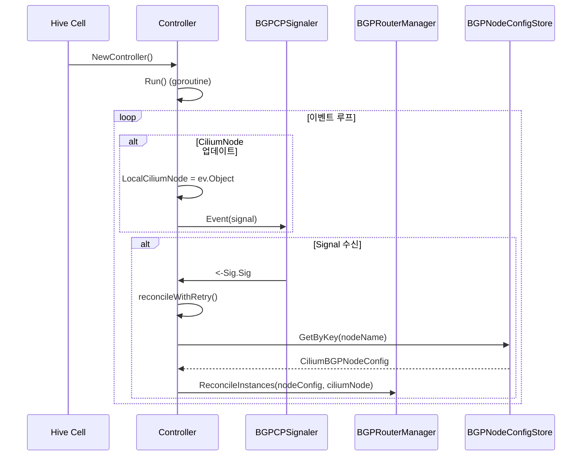

# 19. BGP 제어플레인 (BGP Control Plane)

## 개요

Cilium BGP 제어플레인은 Kubernetes 클러스터에서 BGP(Border Gateway Protocol) 스피커를 실행하여 외부 네트워크와 경로를 교환하는 서브시스템이다. 이를 통해 Pod CIDR, Service VIP, LoadBalancer IP 등을 외부 라우터에 BGP를 통해 광고(advertise)할 수 있다.

### 왜(Why) BGP 제어플레인이 필요한가?

1. **베어메탈 환경에서의 로드밸런서**: 클라우드 환경과 달리 베어메탈 Kubernetes에서는 LoadBalancer 타입 서비스의 External IP를 외부에 알려줄 메커니즘이 필요하다. BGP를 통해 이 IP를 외부 라우터에 광고한다.
2. **ECMP 기반 부하 분산**: BGP를 사용하면 동일 서비스에 대해 여러 노드가 같은 경로를 광고하여 ECMP(Equal-Cost Multi-Path) 라우팅으로 트래픽을 분산할 수 있다.
3. **MetalLB 대체**: 기존 MetalLB의 BGP 기능을 Cilium 내부에 통합하여 별도 컴포넌트 없이 BGP 피어링이 가능하다.
4. **Pod CIDR 광고**: 각 노드의 Pod CIDR을 외부 네트워크에 광고하여 Pod IP로 직접 라우팅 가능한 환경을 구축한다.

---

## 아키텍처

### 전체 구조

```
┌─────────────────────────────────────────────────────────────────────┐
│                    Kubernetes API Server                            │
│  ┌──────────────────┐ ┌──────────────────┐ ┌──────────────────────┐ │
│  │CiliumBGPCluster  │ │CiliumBGPPeer     │ │CiliumBGP            │ │
│  │Config (v2)       │ │Config (v2)       │ │Advertisement (v2)   │ │
│  └────────┬─────────┘ └────────┬─────────┘ └──────────┬──────────┘ │
└───────────┼─────────────────────┼──────────────────────┼────────────┘
            │                     │                      │
            ▼                     ▼                      ▼
┌─────────────────────────────────────────────────────────────────────┐
│  Operator: BGPResourceManager                                       │
│  ┌─────────────────────────────────────────────────────────────┐    │
│  │ ClusterConfig → NodeConfig 변환 (노드 셀렉터 기반)           │    │
│  │ reconcileBGPClusterConfig() → upsertNodeConfigs()           │    │
│  └─────────────────────────────────────────────────────────────┘    │
│                            │                                        │
│                            ▼                                        │
│              CiliumBGPNodeConfig (v2) (노드별 생성)                  │
└─────────────────────────────────────────────────────────────────────┘
            │
            ▼
┌─────────────────────────────────────────────────────────────────────┐
│  Agent: BGP Control Plane                                           │
│                                                                     │
│  ┌──────────────────┐     ┌─────────────────────────────────────┐  │
│  │   Controller     │────▶│    BGPRouterManager                  │  │
│  │ (agent/          │     │  (manager/manager.go)                │  │
│  │  controller.go)  │     │                                      │  │
│  │                  │     │  ┌────────────────────────────────┐  │  │
│  │  - Run()         │     │  │ ConfigReconcilers (우선순위순)  │  │  │
│  │  - Reconcile()   │     │  │  10: DefaultGateway            │  │  │
│  │                  │     │  │  20: Interface                  │  │  │
│  └──────────────────┘     │  │  30: PodCIDR                   │  │  │
│          │                │  │  40: Service                   │  │  │
│          │                │  │  50: PodIPPool                 │  │  │
│     BGPCPSignaler         │  │  60: Neighbor                  │  │  │
│     (이벤트 신호)          │  └────────────────────────────────┘  │  │
│                           │                                      │  │
│                           │  ┌────────────────────────────────┐  │  │
│                           │  │ BGPInstance (인스턴스별)          │  │  │
│                           │  │  - Router (GoBGP)              │  │  │
│                           │  │  - Config                      │  │  │
│                           │  │  - Metadata                    │  │  │
│                           │  └────────────────────────────────┘  │  │
│                           └─────────────────────────────────────┘  │
│                                        │                           │
│                                        ▼                           │
│                           ┌─────────────────────────────────────┐  │
│                           │  GoBGP Server (gobgp/server.go)     │  │
│                           │  - BGP 세션 관리                     │  │
│                           │  - 경로 교환                         │  │
│                           │  - 피어 관리                         │  │
│                           └─────────────────────────────────────┘  │
└─────────────────────────────────────────────────────────────────────┘
            │
            ▼
     외부 BGP 라우터 (ToR 스위치 등)
```

### Hive 셀 구조

BGP 제어플레인은 Hive Cell로 구성된다. `pkg/bgp/cell.go`에서 전체 모듈을 정의한다:

```
Cell = cell.Module("bgp-control-plane", "BGP Control Plane")
├── agent.NewController          (BGP 컨트롤러)
├── signaler.NewBGPCPSignaler    (이벤트 시그널러)
├── manager.NewBGPRouterManager  (라우터 매니저)
├── gobgp.NewRouterProvider      (GoBGP 라우터 제공자)
├── ConfigReconcilers            (설정 리컨실러들)
│   ├── NewNeighborReconciler
│   ├── NewDefaultGatewayReconciler
│   ├── NewPodCIDRReconciler
│   ├── NewPodIPPoolReconciler
│   ├── NewServiceReconciler
│   └── NewInterfaceReconciler
├── StateReconcilers             (상태 리컨실러들)
├── ResourceStores               (K8s 리소스 스토어)
│   ├── BGPCPResourceStore[Secret]
│   ├── BGPCPResourceStore[CiliumLoadBalancerIPPool]
│   ├── BGPCPResourceStore[CiliumBGPNodeConfig]
│   ├── BGPCPResourceStore[CiliumBGPPeerConfig]
│   └── BGPCPResourceStore[CiliumBGPAdvertisement]
└── REST API Handlers
    ├── api.NewGetPeerHandler
    ├── api.NewGetRoutesHandler
    └── api.NewGetRoutePoliciesHandler
```

소스 참조: `pkg/bgp/cell.go`

---

## 핵심 데이터 구조

### 1. CRD 리소스 계층

Cilium BGP는 v2 API를 사용하며, 세 가지 핵심 CRD로 구성된다:

| CRD | 스코프 | 역할 |
|-----|--------|------|
| `CiliumBGPClusterConfig` | 클러스터 | 클러스터 레벨 BGP 설정, 노드 셀렉터로 노드 선택 |
| `CiliumBGPPeerConfig` | 클러스터 | 피어별 설정 (타이머, 인증, 주소 패밀리) |
| `CiliumBGPAdvertisement` | 클러스터 | 무엇을 광고할지 정의 (PodCIDR, Service, LBPool) |
| `CiliumBGPNodeConfig` | 클러스터 | 노드별 BGP 설정 (Operator가 자동 생성) |

### 2. BGPRouterManager

```
파일: pkg/bgp/manager/manager.go

type BGPRouterManager struct {
    BGPInstances      LocalInstanceMap           // 인스턴스 이름 → BGPInstance 매핑
    ConfigReconcilers []reconciler.ConfigReconciler // 설정 리컨실러 목록
    routerProvider    types.RouterProvider        // GoBGP 라우터 제공자
    state             State                       // 상태 관리
    DB                *statedb.DB                 // StateDB
    ReconcileErrorTable statedb.RWTable[*tables.BGPReconcileError]
}
```

BGPRouterManager는 `ReconcileInstances()`를 통해 `CiliumBGPNodeConfig`에 정의된 인스턴스를 관리한다. 내부적으로 `reconcileDiff`를 사용하여 생성/삭제/업데이트가 필요한 인스턴스를 계산한다.

### 3. Router 인터페이스

```
파일: pkg/bgp/types/bgp.go

type Router interface {
    Stop(ctx context.Context, r StopRequest)
    AddNeighbor(ctx context.Context, n *Neighbor) error
    UpdateNeighbor(ctx context.Context, n *Neighbor) error
    RemoveNeighbor(ctx context.Context, n *Neighbor) error
    AdvertisePath(ctx context.Context, p PathRequest) (PathResponse, error)
    WithdrawPath(ctx context.Context, p PathRequest) error
    AddRoutePolicy(ctx context.Context, p RoutePolicyRequest) error
    RemoveRoutePolicy(ctx context.Context, p RoutePolicyRequest) error
    GetPeerState(ctx context.Context, r *GetPeerStateRequest) (*GetPeerStateResponse, error)
    GetRoutes(ctx context.Context, r *GetRoutesRequest) (*GetRoutesResponse, error)
    GetRoutePolicies(ctx context.Context) (*GetRoutePoliciesResponse, error)
    GetBGP(ctx context.Context) (GetBGPResponse, error)
}
```

이 인터페이스는 벤더 독립적이며, 현재 GoBGP 구현체(`pkg/bgp/gobgp/server.go`)만 제공된다.

### 4. BGPGlobal 및 Neighbor 구조체

```
파일: pkg/bgp/types/bgp.go

type BGPGlobal struct {
    ASN                   uint32              // 로컬 AS 번호
    RouterID              string              // BGP 라우터 ID (IPv4 형식)
    ListenPort            int32               // BGP 리슨 포트 (-1이면 비리스닝 모드)
    RouteSelectionOptions *RouteSelectionOptions
}

type Neighbor struct {
    Name            string
    Address         netip.Addr           // 피어 주소
    ASN             uint32               // 피어 AS 번호
    AuthPassword    string               // TCP MD5 인증
    EbgpMultihop    *NeighborEbgpMultihop
    Timers          *NeighborTimers      // Keepalive/Hold 타이머
    Transport       *NeighborTransport   // 로컬 주소/포트
    GracefulRestart *NeighborGracefulRestart
    AfiSafis        []*Family            // 주소 패밀리
}
```

### 5. ConfigReconciler 인터페이스

```
파일: pkg/bgp/manager/reconciler/reconcilers.go

type ConfigReconciler interface {
    Name() string
    Priority() int
    Init(i *instance.BGPInstance) error
    Cleanup(i *instance.BGPInstance)
    Reconcile(ctx context.Context, params ReconcileParams) error
}
```

리컨실러는 우선순위(Priority) 순서대로 실행되며, `ErrAbortReconcile`을 반환하면 나머지 리컨실러 실행이 중단된다.

---

## 핵심 동작 흐름

### 1. 컨트롤러 시작 및 이벤트 루프



소스 참조: `pkg/bgp/agent/controller.go` - `Run()` 메서드

### 2. 인스턴스 리컨실레이션

BGPRouterManager의 `ReconcileInstances()`는 다음 단계를 수행한다:

1. **reconcileDiff 계산**: 현재 실행 중인 인스턴스와 원하는 인스턴스(CiliumBGPNodeConfig)를 비교
2. **withdraw**: 더 이상 필요 없는 인스턴스 제거
3. **register**: 새로 필요한 인스턴스 생성 + 초기 리컨실레이션
4. **reconcile**: 기존 인스턴스의 설정 업데이트

```
파일: pkg/bgp/manager/manager.go - ReconcileInstances()

func (m *BGPRouterManager) ReconcileInstances(...) error {
    rd := newReconcileDiff(ciliumNode)
    err := rd.diff(m.BGPInstances, nodeObj)

    // 순서: withdraw → register → reconcile
    m.withdraw(ctx, rd)
    m.register(ctx, rd)     // registerBGPInstance() 호출
    m.reconcile(ctx, rd)    // reconcileBGPConfig() 호출
}
```

### 3. BGP 인스턴스 등록

`registerBGPInstance()`는 새 BGP 인스턴스를 생성한다:

1. 로컬 ASN, 포트, 라우터 ID를 설정에서 추출
2. `routerProvider.NewRouter()`로 GoBGP 서버 인스턴스 생성
3. 각 ConfigReconciler의 `Init()` 호출
4. `reconcileBGPConfig()`로 초기 설정 적용

라우터 ID 결정 로직(`getRouterID()`):
- 설정에 명시적으로 지정된 경우 → 해당 값 사용
- `BGPRouterIDAllocationModeDefault` → CiliumNode의 내부 IP 사용, 없으면 MAC 주소에서 계산
- `BGPRouterIDAllocationModeIPPool` → IP Pool에서 할당

### 4. GoBGP 서버 초기화

```
파일: pkg/bgp/gobgp/server.go - NewGoBGPServer()

1. server.NewBgpServer() → go s.Serve()
2. s.StartBgp() → ASN, RouterID, ListenPort 설정
3. AddPolicy(allowLocalPolicy) → 로컬 경로 허용 정책
4. SetPolicyAssignment() → 글로벌 import 정책 (외부 경로 거부)
5. WatchEvent(peer) → 피어 상태 변경 모니터링
6. WatchEvent(table) → 라우팅 테이블 변경 모니터링
```

GoBGP 서버는 기본적으로 외부에서 들어오는 모든 경로를 거부하고(`REJECT`), 로컬에서 생성된 경로만 허용한다(`allowLocalPolicy`). 이는 Cilium이 BGP를 경로 수신이 아닌 경로 광고 목적으로만 사용하기 때문이다.

### 5. ConfigReconciler 실행 순서

```
우선순위 10: DefaultGatewayReconciler  - 디바이스 테이블 변경 감지 + 기본 게이트웨이 경로
우선순위 20: InterfaceReconciler       - 인터페이스 IP 주소 광고
우선순위 30: PodCIDRReconciler         - Pod CIDR 경로 광고
우선순위 40: ServiceReconciler         - Service VIP/LB IP 경로 광고
우선순위 50: PodIPPoolReconciler       - Multi-pool IPAM Pod IP 풀 광고
우선순위 60: NeighborReconciler        - BGP 피어(이웃) 설정
```

각 리컨실러는 독립적으로 원하는 상태(desired)와 현재 상태(current)를 비교하여 경로를 추가/삭제한다.

---

## 라우트 정책 (Route Policy)

### RoutePolicy 구조

```
파일: pkg/bgp/types/bgp.go

type RoutePolicy struct {
    Name       string
    Type       RoutePolicyType          // Export 또는 Import
    Statements []*RoutePolicyStatement  // 매칭 조건 + 액션 목록
}

type RoutePolicyStatement struct {
    Conditions RoutePolicyConditions    // 매칭 조건
    Actions    RoutePolicyActions       // 수행할 액션
}

type RoutePolicyConditions struct {
    MatchNeighbors *RoutePolicyNeighborMatch  // 이웃 기반 매칭
    MatchPrefixes  *RoutePolicyPrefixMatch    // 프리픽스 기반 매칭
    MatchFamilies  []Family                   // 주소 패밀리 매칭
}

type RoutePolicyActions struct {
    RouteAction         RoutePolicyAction     // Accept/Reject/None
    AddCommunities      []string              // BGP 커뮤니티 추가
    AddLargeCommunities []string              // BGP 대규모 커뮤니티
    SetLocalPreference  *int64                // Local Preference 설정
    NextHop             *RoutePolicyActionNextHop
}
```

라우트 정책은 피어별로 어떤 경로를 어떤 속성으로 광고할지를 세밀하게 제어한다. GoBGP의 글로벌 정책으로 변환되어 적용된다.

---

## 상태 관리 및 모니터링

### State Reconciler

BGPRouterManager는 상태 변경을 비동기적으로 감지하고 처리한다:

```
파일: pkg/bgp/manager/manager.go

type State struct {
    reconcilers       []reconciler.StateReconciler
    notifications     map[string]types.StateNotificationCh
    pendingInstances  sets.Set[string]
    reconcileSignal   chan struct{}
    instanceDeletionSignal chan string
}
```

1. GoBGP 서버에서 피어/테이블 변경 이벤트 → StateNotificationCh로 전달
2. `trackInstanceStateChange()`가 이벤트 수신 → pendingInstances에 추가
3. `bgp-state-observer` 잡이 reconcileSignal 수신 → `reconcileState()` 호출
4. StateReconciler들이 CRD 상태 업데이트

### REST API

BGP 상태는 REST API를 통해 조회 가능:

| 엔드포인트 | 설명 |
|------------|------|
| `GET /bgp/peers` | BGP 피어 상태 (세션 상태, Uptime 등) |
| `GET /bgp/routes` | RIB 라우팅 테이블 (loc-rib, adj-rib-in/out) |
| `GET /bgp/route-policies` | 적용된 라우트 정책 |

---

## Operator 측 BGP 관리

### BGPResourceManager

Operator에서는 `BGPResourceManager`(`operator/pkg/bgp/manager.go`)가 클러스터 레벨 BGP 설정을 노드별 설정으로 변환한다:

```
CiliumBGPClusterConfig (클러스터 범위)
    │
    │ nodeSelector 매칭
    │
    ▼
CiliumBGPNodeConfig (노드별 자동 생성)
    │
    │ ownerReference로 연결
    │
    ▼
Agent의 BGP Controller가 감지 → 리컨실레이션
```

`reconcileBGPClusterConfig()` (`operator/pkg/bgp/cluster.go`):
1. `upsertNodeConfigs()`: 노드 셀렉터에 매칭되는 노드마다 CiliumBGPNodeConfig 생성/업데이트
2. `deleteNodeConfigs()`: 더 이상 매칭되지 않는 노드의 NodeConfig 삭제
3. 상태 조건 업데이트 (NoMatchingNode, MissingPeerConfigs, ConflictingClusterConfigs)

---

## 설정 예시

### CiliumBGPClusterConfig

```yaml
apiVersion: cilium.io/v2
kind: CiliumBGPClusterConfig
metadata:
  name: bgp-config
spec:
  nodeSelector:
    matchLabels:
      bgp: "true"
  bgpInstances:
    - name: "instance-65001"
      localASN: 65001
      peers:
        - name: "peer-tor"
          peerConfigRef:
            name: "tor-peer-config"
```

### CiliumBGPPeerConfig

```yaml
apiVersion: cilium.io/v2
kind: CiliumBGPPeerConfig
metadata:
  name: tor-peer-config
spec:
  timers:
    connectRetryTimeSeconds: 120
    holdTimeSeconds: 90
    keepAliveTimeSeconds: 30
  gracefulRestart:
    enabled: true
    restartTimeSeconds: 120
  families:
    - afi: ipv4
      safi: unicast
    - afi: ipv6
      safi: unicast
```

### CiliumBGPAdvertisement

```yaml
apiVersion: cilium.io/v2
kind: CiliumBGPAdvertisement
metadata:
  name: bgp-advertisements
spec:
  advertisements:
    - advertisementType: PodCIDR
    - advertisementType: Service
      service:
        addresses:
          - ClusterIP
          - ExternalIP
          - LoadBalancerIP
      selector:
        matchLabels:
          advertise: "bgp"
```

---

## Graceful Restart

Cilium BGP는 Graceful Restart를 지원하여 BGP 데몬이 재시작될 때 경로 손실을 최소화한다:

1. **Stop 시 동작**: `BGPRouterManager.Stop()`에서 `destroyRouterOnStop`이 false이면 GoBGP 서버를 완전히 종료하지 않음
2. **이유**: GoBGP의 `Stop()`은 Cease 알림을 피어에 전송하여 Graceful Restart 진행을 중단시키기 때문
3. **인스턴스 삭제 시**: `withdraw()`에서는 `FullDestroy: true`로 완전 종료 (인스턴스가 제거되므로 GR이 불필요)

소스 참조: `pkg/bgp/gobgp/server.go` - `Stop()` 메서드

---

## 메트릭

| 메트릭 | 설명 |
|--------|------|
| `bgp_control_plane_reconcile_errors_total` | 인스턴스별 리컨실레이션 에러 수 |
| `bgp_control_plane_reconcile_run_duration_seconds` | 리컨실레이션 실행 시간 |

소스 참조: `pkg/bgp/types/bgp.go` (메트릭 상수 정의), `pkg/bgp/manager/manager.go` (메트릭 수집)

---

## 요약

| 항목 | 설명 |
|------|------|
| 진입점 | `pkg/bgp/cell.go` → Cell 모듈 정의 |
| 컨트롤러 | `pkg/bgp/agent/controller.go` → 이벤트 루프 + 리컨실레이션 |
| 라우터 매니저 | `pkg/bgp/manager/manager.go` → 인스턴스 생명주기 관리 |
| GoBGP 래퍼 | `pkg/bgp/gobgp/server.go` → BGP 프로토콜 구현 |
| 리컨실러 | `pkg/bgp/manager/reconciler/` → 6개 설정 리컨실러 |
| 타입 정의 | `pkg/bgp/types/bgp.go` → Router 인터페이스, Neighbor, Path 등 |
| Operator | `operator/pkg/bgp/cluster.go` → ClusterConfig → NodeConfig 변환 |
| CRD | CiliumBGPClusterConfig, CiliumBGPPeerConfig, CiliumBGPAdvertisement |
