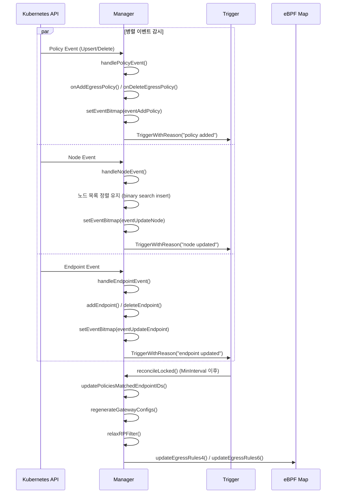

# 20. Egress Gateway

## 개요

Cilium Egress Gateway는 클러스터에서 외부로 나가는(egress) 트래픽을 특정 게이트웨이 노드를 통해 라우팅하고, 지정된 IP 주소로 SNAT(Source Network Address Translation)하는 기능을 제공한다. 이를 통해 외부 서비스나 방화벽에서 Kubernetes Pod의 출발지 IP를 예측 가능하고 고정적으로 관리할 수 있다.

### 왜(Why) Egress Gateway가 필요한가?

1. **고정 출발지 IP 보장**: Pod의 IP는 동적으로 할당되므로 외부 방화벽 규칙에서 사용하기 어렵다. Egress Gateway는 특정 IP로 SNAT하여 일관된 출발지 IP를 보장한다.
2. **규제 준수**: 금융/의료 등 규제 산업에서 외부 통신의 출발지 IP를 고정해야 하는 요구사항을 충족한다.
3. **트래픽 감사**: 모든 egress 트래픽이 지정된 게이트웨이를 통과하므로 중앙 집중식 감사/로깅이 가능하다.
4. **다중 게이트웨이**: 여러 게이트웨이 노드를 구성하여 고가용성과 부하 분산을 달성할 수 있다.

---

## 아키텍처

### 전체 구조

```
┌──────────────────────────────────────────────────────────────────┐
│                    Kubernetes API Server                         │
│  ┌───────────────────────────────────────────────────────────┐   │
│  │        CiliumEgressGatewayPolicy (CEGP)                   │   │
│  │  - endpointSelectors (어떤 Pod가 대상인가)                  │   │
│  │  - destinationCIDRs  (어떤 목적지로 갈 때 적용되는가)        │   │
│  │  - excludedCIDRs     (제외할 CIDR)                         │   │
│  │  - egressGateway     (어떤 노드가 게이트웨이인가)            │   │
│  └───────────────────────────────────────────────────────────┘   │
└──────────────────────────────────────────────────────────────────┘
                              │
                              ▼
┌──────────────────────────────────────────────────────────────────┐
│                  Egress Gateway Manager                          │
│                  (pkg/egressgateway/manager.go)                  │
│                                                                  │
│  ┌────────────────┐ ┌────────────────┐ ┌────────────────────┐   │
│  │ Policy Store   │ │ Node Store     │ │ Endpoint Store      │   │
│  │ policyConfigs  │ │ nodes[]        │ │ epDataStore         │   │
│  │ (policyID →    │ │ (이름순 정렬)    │ │ (endpointID →     │   │
│  │  PolicyConfig) │ │                │ │  endpointMetadata)  │   │
│  └────────────────┘ └────────────────┘ └────────────────────┘   │
│           │                │                     │               │
│           ▼                ▼                     ▼               │
│  ┌──────────────────────────────────────────────────────────┐   │
│  │                reconcileLocked()                          │   │
│  │  1. updatePoliciesMatchedEndpointIDs()                    │   │
│  │  2. regenerateGatewayConfigs()                            │   │
│  │  3. relaxRPFilter()                                       │   │
│  │  4. updateEgressRules4() / updateEgressRules6()           │   │
│  └──────────────────────────────────────────────────────────┘   │
│                              │                                   │
│                              ▼                                   │
│  ┌──────────────────────────────────────────────────────────┐   │
│  │  eBPF Policy Map                                          │   │
│  │  ┌────────────────────────────────────────────────┐      │   │
│  │  │ Key: (srcIP, dstCIDR) → Val: (egressIP, gwIP)  │      │   │
│  │  └────────────────────────────────────────────────┘      │   │
│  └──────────────────────────────────────────────────────────┘   │
└──────────────────────────────────────────────────────────────────┘
```

### 트래픽 흐름

```
                     eBPF (datapath)
    Pod ──────────────────────────────────────────► 외부 서비스
     │                                                ▲
     │ 1. BPF 정책맵 조회                                │
     │    Key: (PodIP, DstCIDR)                        │
     │    Val: (EgressIP, GatewayIP)                   │
     │                                                 │
     │ 2. 로컬 게이트웨이인 경우:                          │
     │    → SNAT (PodIP → EgressIP)                    │
     │    → 지정된 인터페이스로 전송                       │
     │                                                 │
     │ 3. 원격 게이트웨이인 경우:                          │
     │    → 터널 캡슐화                                  │
     │    → 게이트웨이 노드로 전송                        │
     ▼                                                 │
  Gateway Node ─────────────────────────────────────────┘
     │ 4. SNAT (PodIP → EgressIP)
     │ 5. 지정된 인터페이스로 전송
     ▼
  외부 네트워크
```

---

## 핵심 데이터 구조

### 1. Manager

```
파일: pkg/egressgateway/manager.go

type Manager struct {
    nodes             []nodeTypes.Node          // 노드 목록 (이름순 정렬)
    nodesAddresses2Labels map[string]map[string]string  // 노드 IP → 레이블
    policyConfigs     map[policyID]*PolicyConfig // 정책 설정 맵
    epDataStore       map[endpointID]*endpointMetadata // 엔드포인트 메타데이터
    identityAllocator identityCache.IdentityAllocator
    policyMap4        *egressmap.PolicyMap4     // IPv4 eBPF 정책 맵
    policyMap6        *egressmap.PolicyMap6     // IPv6 eBPF 정책 맵
    reconciliationTrigger *trigger.Trigger      // 리컨실레이션 트리거
    eventsBitmap      eventType                 // 이벤트 비트맵
    allCachesSynced   bool                      // K8s 동기화 완료 여부
}
```

Manager는 세 가지 리소스 스트림(Policy, Node, Endpoint)을 감시하고, 변경이 감지되면 리컨실레이션을 트리거한다.

### 2. PolicyConfig

```
파일: pkg/egressgateway/policy.go

type PolicyConfig struct {
    id                types.NamespacedName         // 정책 이름
    endpointSelectors []*policyTypes.LabelSelector // Pod 셀렉터
    nodeSelectors     []*policyTypes.LabelSelector // 노드 셀렉터 (Pod가 실행 중인 노드)
    dstCIDRs          []netip.Prefix               // 대상 CIDR
    excludedCIDRs     []netip.Prefix               // 제외 CIDR
    policyGwConfigs   []policyGatewayConfig        // 게이트웨이 설정 (CRD에서)
    gatewayConfigs    []gatewayConfig              // 런타임 게이트웨이 설정
    matchedEndpoints  map[endpointID]*endpointMetadata // 매칭된 엔드포인트
    v6Needed          bool                         // IPv6 정책 필요 여부
}
```

### 3. gatewayConfig

```
파일: pkg/egressgateway/policy.go

type gatewayConfig struct {
    ifaceName                   string     // SNAT 인터페이스 이름
    egressIfindex               uint32     // 인터페이스 인덱스
    egressIP4                   netip.Addr // IPv4 SNAT IP
    egressIP6                   netip.Addr // IPv6 SNAT IP
    gatewayIP                   netip.Addr // 게이트웨이 노드 내부 IP
    localNodeConfiguredAsGateway bool      // 로컬 노드가 게이트웨이인지 여부
}
```

### 4. endpointMetadata

```
파일: pkg/egressgateway/endpoint.go

type endpointMetadata struct {
    labels map[string]string  // 엔드포인트 레이블
    id     endpointID         // UID 기반 ID
    ips    []netip.Addr       // 엔드포인트 IP 목록
    nodeIP string             // 호스트 노드 IP
}
```

### 5. 이벤트 비트맵

```
파일: pkg/egressgateway/manager.go

const (
    eventNone           = eventType(1 << iota)
    eventK8sSyncDone                          // K8s 초기 동기화 완료
    eventAddPolicy                            // 정책 추가
    eventDeletePolicy                         // 정책 삭제
    eventUpdateEndpoint                       // 엔드포인트 업데이트
    eventDeleteEndpoint                       // 엔드포인트 삭제
    eventUpdateNode                           // 노드 업데이트
    eventDeleteNode                           // 노드 삭제
)
```

이벤트 비트맵은 여러 이벤트를 하나의 리컨실레이션 사이클에서 배치 처리하기 위해 사용된다.

---

## 핵심 동작 흐름

### 1. 이벤트 처리 루프



소스 참조: `pkg/egressgateway/manager.go` - `processEvents()`

### 2. 정책 파싱 (ParseCEGP)

`ParseCEGP()` (`pkg/egressgateway/policy.go`)는 CiliumEgressGatewayPolicy CRD를 내부 PolicyConfig로 변환한다:

1. **엔드포인트 셀렉터 파싱**: `spec.selectors[].podSelector` + `spec.selectors[].namespaceSelector`를 조합하여 대상 Pod를 선택
2. **노드 셀렉터 파싱**: `spec.selectors[].nodeSelector`로 특정 노드의 Pod만 선택
3. **CIDR 파싱**: `spec.destinationCIDRs`와 `spec.excludedCIDRs`를 `netip.Prefix`로 변환
4. **게이트웨이 설정 파싱**: `spec.egressGateways[]`에서 `nodeSelector`, `interface`, `egressIP` 추출

### 3. 게이트웨이 설정 생성 (regenerateGatewayConfig)

`regenerateGatewayConfig()` (`pkg/egressgateway/policy.go`)는 런타임에 게이트웨이 설정을 결정한다:

```
각 policyGwConfig에 대해:
  1. 모든 노드를 순회하며 nodeSelector 매칭
  2. 매칭되는 첫 번째 노드를 게이트웨이로 선택
  3. 해당 노드의 내부 IP를 gatewayIP로 설정
  4. 로컬 노드인 경우: deriveFromPolicyGatewayConfig() 호출
     → 인터페이스/egressIP 결정
```

`deriveFromPolicyGatewayConfig()`의 egress IP 결정 로직:

| 설정 | 동작 |
|------|------|
| `interface` 지정 | 해당 인터페이스의 첫 번째 IPv4/IPv6 주소 사용 |
| `egressIP` 지정 | 해당 IP가 할당된 인터페이스 자동 탐지 |
| 둘 다 미지정 | IPv4 기본 경로의 인터페이스 및 첫 번째 IP 사용 |

### 4. BPF 맵 업데이트

`updateEgressRules4()` (`pkg/egressgateway/manager.go`)는 eBPF 정책 맵을 현재 상태와 동기화한다:

```
1. 현재 BPF 맵의 모든 엔트리를 "stale"로 표시
2. 각 정책의 (endpoint, CIDR) 조합을 순회:
   a. forEachEndpointAndCIDR() 콜백
   b. BPF 맵 키 생성: (endpointIP, dstCIDR)
   c. stale 목록에서 제거 (아직 필요한 엔트리)
   d. 값이 변경된 경우에만 Update 호출
3. stale 목록에 남은 엔트리 삭제 (더 이상 불필요)
```

이 "mark-and-sweep" 패턴은 효율적인 증분 업데이트를 보장한다.

### 5. 다중 게이트웨이 지원

여러 게이트웨이가 설정된 경우, 엔드포인트는 해시 기반으로 게이트웨이에 분배된다:

```
파일: pkg/egressgateway/policy.go - forEachEndpointAndCIDR()

1. 게이트웨이를 IP 기준 정렬 (일관된 할당 보장)
2. 엔드포인트 UID의 FNV-32a 해시 계산
3. hash % len(gatewayConfigs) → 게이트웨이 인덱스
```

이 방식은 모든 노드에서 동일한 할당 결과를 보장하며, 게이트웨이 추가/제거 시에도 최소한의 재할당이 발생한다.

---

## eBPF 데이터 경로

### 정책 맵 구조

```
IPv4 Policy Map:
  Key:   (SourceIP [4B], DestCIDR [4B], PrefixLen [4B])
  Value: (EgressIP [4B], GatewayIP [4B])

IPv6 Policy Map:
  Key:   (SourceIP [16B], DestCIDR [16B], PrefixLen [4B])
  Value: (EgressIP [16B], GatewayIP [16B], EgressIfindex [4B])
```

### 특수 IP 값

| 값 | 의미 |
|-----|------|
| `0.0.0.0` (GatewayIP) | 게이트웨이를 찾지 못함 (GatewayNotFoundIPv4) |
| `0.0.0.1` (GatewayIP) | 제외된 CIDR (ExcludedCIDRIPv4) |
| `0.0.0.0` (EgressIP) | Egress IP를 찾지 못함 (EgressIPNotFoundIPv4) |

---

## 시스템 요구사항 및 제약

### 전제 조건

```
파일: pkg/egressgateway/manager.go - NewEgressGatewayManager()

1. EnableEgressGateway == true
2. IdentityAllocationMode == CRD (CRD 기반 identity 할당 필수)
3. EnableCiliumEndpointSlice == false (CES와 호환 불가)
4. EnableIPv4Masquerade == true (IPv4 마스커레이드 필수)
5. EnableBPFMasquerade == true (BPF 마스커레이드 필수)
6. TunnelConfig.UnderlayProtocol == IPv4 (IPv4 언더레이 필수)
```

### rp_filter 완화

게이트웨이 노드에서는 역방향 경로 필터링(Reverse Path Filter)을 완화해야 한다:

```
파일: pkg/egressgateway/manager.go - relaxRPFilter()

게이트웨이로 설정된 인터페이스에 대해:
  /proc/sys/net/ipv4/conf/<interface>/rp_filter = 2 (loose mode)
```

이유: 게이트웨이 노드에서 터널을 통해 수신한 패킷의 출발지 IP(Pod IP)는 로컬 서브넷에 속하지 않으므로, strict mode(rp_filter=1)에서는 패킷이 드롭된다. Loose mode(rp_filter=2)로 설정하면 어떤 인터페이스를 통해서든 도달 가능한 경로가 있으면 통과시킨다.

---

## 설정 예시

### CiliumEgressGatewayPolicy

```yaml
apiVersion: cilium.io/v2
kind: CiliumEgressGatewayPolicy
metadata:
  name: egw-policy-production
spec:
  # 대상 Pod 선택
  selectors:
    - podSelector:
        matchLabels:
          app: backend
      namespaceSelector:
        matchLabels:
          env: production
  # 이 목적지로 향하는 트래픽에 적용
  destinationCIDRs:
    - "0.0.0.0/0"
  # 클러스터 내부 CIDR 제외
  excludedCIDRs:
    - "10.0.0.0/8"
    - "172.16.0.0/12"
    - "192.168.0.0/16"
  # 게이트웨이 노드 설정
  egressGateway:
    nodeSelector:
      matchLabels:
        egress-gateway: "true"
    interface: eth0
```

### 다중 게이트웨이 설정

```yaml
apiVersion: cilium.io/v2
kind: CiliumEgressGatewayPolicy
metadata:
  name: egw-multi-gateway
spec:
  selectors:
    - podSelector:
        matchLabels:
          app: api-server
  destinationCIDRs:
    - "203.0.113.0/24"
  egressGateways:
    - nodeSelector:
        matchLabels:
          egress-zone: "zone-a"
      egressIP: "198.51.100.10"
    - nodeSelector:
        matchLabels:
          egress-zone: "zone-b"
      egressIP: "198.51.100.20"
```

---

## Hive Cell 구조

```
파일: pkg/egressgateway/manager.go

Cell = cell.Module("egressgateway", ...)
├── cell.Config(defaultConfig)           # 리컨실레이션 트리거 간격
├── cell.Provide(NewEgressGatewayManager) # Manager 생성
├── cell.Provide(newPolicyResource)       # CiliumEgressGatewayPolicy 리소스
└── tunnel.NewEnabler(true)               # 터널 활성화
```

EgressGatewayReconciliationTriggerInterval (기본값: 1초)은 리컨실레이션 트리거의 최소 간격을 설정한다. 이 간격 내에 여러 이벤트가 발생하면 하나의 리컨실레이션으로 배치 처리된다.

---

## 엔드포인트 매칭

엔드포인트 매칭은 두 단계로 수행된다:

### 1단계: 레이블 매칭

```
파일: pkg/egressgateway/policy.go - matchesEndpointLabels()

각 endpointSelector에 대해:
  endpoint.labels가 selector와 매칭되면 true 반환
```

### 2단계: 노드 레이블 매칭

```
파일: pkg/egressgateway/policy.go - matchesNodeLabels()

nodeSelector가 정의된 경우:
  endpoint의 nodeIP에 해당하는 노드의 레이블이 매칭되는지 확인
nodeSelector가 없으면:
  모든 노드의 endpoint가 매칭
```

이 이중 매칭을 통해 "특정 노드에서 실행되는 특정 Pod"만 선택적으로 egress gateway를 적용할 수 있다.

---

## 노드 관리 상세

### 정렬된 노드 목록

Manager는 노드를 **이름순으로 정렬된 슬라이스**에 보관한다. 이는 게이트웨이 선택 시 모든 에이전트에서 동일한 결과를 보장하기 위한 핵심 설계이다.

```
파일: pkg/egressgateway/manager.go - handleNodeEvent()

노드 추가/업데이트:
  1. slices.BinarySearchFunc(manager.nodes, node, cmp.Compare(a.Name, b.Name))
  2. 이미 존재하면 → 해당 인덱스의 노드를 교체
  3. 없으면 → slices.Insert()로 정렬 위치에 삽입

노드 삭제:
  1. Binary search로 인덱스 탐색
  2. slices.Delete()로 제거
  3. nodesAddresses2Labels에서 IPv4/IPv6 주소 키 삭제
```

**왜(Why) Binary Search를 사용하는가?**

클러스터의 노드 수가 증가하더라도 O(log n) 복잡도로 노드를 찾을 수 있다. 또한 정렬 상태를 유지함으로써 `regenerateGatewayConfig()`에서 노드를 순회할 때 모든 에이전트가 동일한 순서로 탐색하여 동일한 게이트웨이를 선택하게 된다. 이것이 없으면 map 순회의 비결정성으로 인해 에이전트마다 다른 게이트웨이를 선택할 수 있다.

### 노드 주소-레이블 매핑

```
파일: pkg/egressgateway/manager.go

nodesAddresses2Labels map[string]map[string]string

업데이트 시:
  nodesAddresses2Labels[node.GetNodeIP(false).String()] = node.Labels  // IPv4
  nodesAddresses2Labels[node.GetNodeIP(true).String()] = node.Labels   // IPv6
```

이 매핑은 엔드포인트의 `nodeIP` 필드를 통해 해당 엔드포인트가 실행 중인 노드의 레이블을 조회하는 데 사용된다. `matchesNodeLabels()` 호출 시 이 매핑을 통해 "특정 노드에서 실행되는 Pod만 선택"하는 기능을 구현한다.

---

## Identity 기반 엔드포인트 처리

### 엔드포인트 추가 흐름

엔드포인트가 추가될 때 단순히 CiliumEndpoint 오브젝트의 레이블을 사용하지 않는다. 대신 **Identity Allocator**를 통해 정확한 identity 레이블을 조회한다:

```
파일: pkg/egressgateway/manager.go - addEndpoint()

1. endpoint.Identity가 nil이면 → 건너뛰기 (identity 메타데이터 없음)
2. manager.getIdentityLabels(endpoint.Identity.ID) 호출
   → identityAllocator에서 identity 레이블 조회
   → 실패 시 에러 반환 (재시도 대상)
3. getEndpointMetadata(endpoint, identityLabels) 호출
   → IP 주소 파싱 (IPv4 + IPv6)
   → 레이블의 K8sStringMap() 변환
   → nodeIP 추출
4. epDataStore에 저장
```

**왜(Why) Identity 레이블을 별도로 조회하는가?**

CiliumEndpoint 오브젝트에는 identity ID만 포함되고, 실제 레이블은 identity allocator가 관리한다. 이를 통해 레이블 변경 시 모든 엔드포인트의 CRD를 업데이트하지 않고도 중앙에서 identity 레이블을 관리할 수 있다.

### 재시도 로직

```
파일: pkg/egressgateway/manager.go - processEvents()

endpointsRateLimit := workqueue.NewTypedItemExponentialFailureRateLimiter(
    time.Millisecond*20,    // 최소 재시도 간격: 20ms
    time.Minute*20,          // 최대 재시도 간격: ~20분
)
```

Identity allocator와의 동기화가 아직 완료되지 않은 상태에서 엔드포인트 이벤트를 받으면 identity 레이블 조회에 실패할 수 있다. 이 경우 **지수 백오프(exponential backoff)** 전략으로 재시도하여 최대 16번 시도(20ms * 2^16 = ~20분)까지 기다린다.

---

## IPv6 지원

### Dual-Stack 처리

Egress Gateway는 IPv4와 IPv6를 별도의 BPF 맵과 별도의 업데이트 함수로 관리한다:

```
파일: pkg/egressgateway/manager.go

IPv4: policyMap4 (*egressmap.PolicyMap4) → updateEgressRules4()
IPv6: policyMap6 (*egressmap.PolicyMap6) → updateEgressRules6()
```

IPv6 맵의 값에는 `egressIfindex` 필드가 추가로 포함된다:

```
IPv4 Value: (EgressIP [4B], GatewayIP [4B])
IPv6 Value: (EgressIP [16B], GatewayIP [16B], EgressIfindex [4B])
```

### v6Needed 플래그

```
파일: pkg/egressgateway/policy.go - ParseCEGP()

for _, cidrString := range destinationCIDRs {
    cidr, err := netip.ParsePrefix(string(cidrString))
    ...
    if cidr.Addr().Is6() {
        v6Needed = true
    }
}
```

정책의 `destinationCIDRs`에 IPv6 CIDR이 하나라도 포함되면 `v6Needed=true`로 설정된다. 이 플래그는 `deriveFromPolicyGatewayConfig()`에서 IPv6 egress IP를 추가로 조회할지 결정하는 데 사용된다.

### IPv6 Masquerade 요구사항

```
파일: pkg/egressgateway/manager.go - NewEgressGatewayManager()

if !dcfg.EnableIPv6Masquerade {
    p.Logger.Info("egress gateway ipv6 policies require EnableIPv6Masquerade=true")
}
```

IPv6 정책을 사용하려면 `EnableIPv6Masquerade`가 활성화되어야 한다. 단, IPv4와 달리 이것은 hard error가 아닌 경고 로그로만 처리된다.

---

## 리컨실레이션 조건부 실행

`reconcileLocked()`는 모든 이벤트에 대해 동일한 처리를 하지 않는다. 이벤트 비트맵에 따라 필요한 단계만 선택적으로 실행한다:

```
파일: pkg/egressgateway/manager.go - reconcileLocked()

1단계: updatePoliciesMatchedEndpointIDs()
  조건: eventUpdateEndpoint, eventDeleteEndpoint, eventUpdateNode,
        eventDeleteNode, eventK8sSyncDone 중 하나 이상
  이유: 엔드포인트/노드 변경 시에만 매칭 재계산이 필요

2단계: regenerateGatewayConfigs() + relaxRPFilter()
  조건: eventK8sSyncDone, eventAddPolicy, eventDeletePolicy,
        eventUpdateNode, eventDeleteNode 중 하나 이상
  이유: 정책이나 노드 변경 시에만 게이트웨이 재결정이 필요

3단계: updateEgressRules4() + updateEgressRules6()
  조건: 항상 실행
  이유: BPF 맵은 항상 현재 상태와 동기화해야 함

마지막: eventsBitmap = 0 (비트맵 초기화)
```

**왜(Why) 조건부 실행인가?**

엔드포인트만 추가/삭제된 경우 게이트웨이 설정을 다시 생성할 필요가 없다. 반대로 정책이나 노드가 변경된 경우에는 게이트웨이 설정까지 다시 생성해야 한다. 이러한 조건부 실행으로 불필요한 계산을 줄이고 리컨실레이션 성능을 최적화한다.

---

## ParseCEGP 네임스페이스 셀렉터 처리

네임스페이스 셀렉터는 특별한 레이블 접두사 처리가 필요하다:

```
파일: pkg/egressgateway/policy.go - ParseCEGP()

1. NamespaceSelector.MatchLabels의 각 키에
   k8sConst.PodNamespaceMetaLabels 접두사 추가
2. MatchExpressions의 각 키에도 동일한 접두사 추가
3. 빈 NamespaceSelector → "모든 네임스페이스" 의미
   → PodNamespaceLabel OpExists 조건으로 변환
```

이 처리를 통해 네임스페이스 레이블이 Pod의 identity 레이블 체계와 호환되도록 변환한다. Cilium은 Pod의 identity에 네임스페이스 메타데이터를 특수 접두사로 포함시키기 때문이다.

---

## 요약

| 항목 | 설명 |
|------|------|
| 진입점 | `pkg/egressgateway/manager.go` → Cell + Manager |
| 정책 파싱 | `pkg/egressgateway/policy.go` → ParseCEGP() |
| 엔드포인트 메타데이터 | `pkg/egressgateway/endpoint.go` → getEndpointMetadata() |
| 리소스 정의 | `pkg/egressgateway/resource.go` → CiliumEgressGatewayPolicy 리소스 |
| 이벤트 처리 | `processEvents()` → 3채널(Policy, Node, Endpoint) 감시 |
| 리컨실레이션 | `reconcileLocked()` → 정책 매칭 + 게이트웨이 결정 + BPF 맵 업데이트 |
| BPF 맵 | `policyMap4`/`policyMap6` → (srcIP, dstCIDR) → (egressIP, gatewayIP) |
| 다중 게이트웨이 | FNV-32a 해시 기반 일관된 엔드포인트-게이트웨이 할당 |
| 전제 조건 | BPF masquerade, CRD identity, IPv4 underlay, tunneling |
