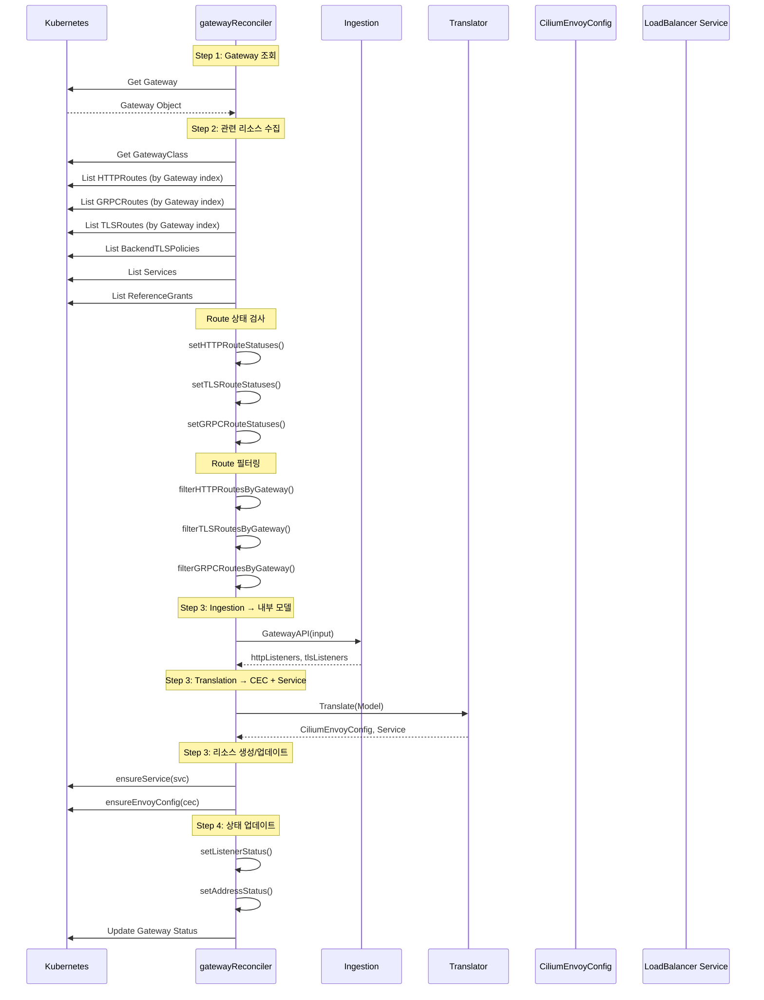

# 21. Gateway API / Ingress

## 개요

Cilium의 Gateway API 구현은 Kubernetes Gateway API 표준을 지원하는 인그레스 컨트롤러로, 외부 트래픽을 클러스터 내부 서비스로 라우팅한다. Cilium은 Envoy 프록시를 데이터플레인으로 사용하여 HTTP/HTTPS/gRPC/TLS 트래픽을 처리하며, Gateway API 리소스를 CiliumEnvoyConfig(CEC)와 LoadBalancer Service로 변환한다.

### 왜(Why) Cilium Gateway API가 필요한가?

1. **표준 준수**: Gateway API는 Kubernetes Ingress의 후속 표준으로, 더 표현력 있고 확장 가능한 라우팅 규칙을 제공한다.
2. **통합 데이터플레인**: Cilium의 Envoy 프록시와 eBPF를 결합하여 추가 인그레스 컨트롤러 없이 고성능 트래픽 처리가 가능하다.
3. **역할 분리**: GatewayClass(인프라 관리자) → Gateway(클러스터 운영자) → Route(앱 개발자)의 역할 기반 모델을 지원한다.
4. **다중 프로토콜**: HTTP, HTTPS, gRPC, TLS passthrough를 단일 구현으로 지원한다.
5. **GAMMA 지원**: Gateway API for Mesh Management and Administration으로 서비스 메시 트래픽 관리도 지원한다.

---

## 아키텍처

### 전체 구조

```
┌─────────────────────────────────────────────────────────────────┐
│                    Kubernetes API Server                         │
│                                                                 │
│  GatewayClass ──────► Gateway ──────► HTTPRoute                 │
│  (io.cilium/         (리스너 정의)     (라우팅 규칙)              │
│   gateway-controller)                                           │
│                                       GRPCRoute                 │
│                                       TLSRoute                  │
│                                                                 │
│  CiliumGatewayClassConfig             BackendTLSPolicy          │
│  (파라미터 확장)                        (백엔드 TLS)              │
│                                                                 │
│  ReferenceGrant                       Secret                    │
│  (크로스 네임스페이스)                   (TLS 인증서)              │
└─────────────────────────────────────────────────────────────────┘
                              │
                              ▼
┌─────────────────────────────────────────────────────────────────┐
│              Cilium Operator: Gateway API Controller             │
│              (operator/pkg/gateway-api/)                         │
│                                                                 │
│  ┌────────────────────────────────────────────────────────────┐ │
│  │  Cell (cell.go)                                            │ │
│  │  ├── newGatewayAPIPreconditions() → CRD 검사               │ │
│  │  ├── initGatewayAPIController() → 리컨실러 등록             │ │
│  │  └── registerSecretSync() → TLS Secret 동기화              │ │
│  └────────────────────────────────────────────────────────────┘ │
│                              │                                  │
│  ┌────────────────────────────────────────────────────────────┐ │
│  │  Reconcilers                                               │ │
│  │  ├── gatewayClassReconciler (gatewayclass.go)              │ │
│  │  ├── gatewayReconciler (gateway.go)                        │ │
│  │  ├── gammaReconciler (gamma.go)                            │ │
│  │  └── gatewayClassConfigReconciler                          │ │
│  └────────────────────────────────────────────────────────────┘ │
│                              │                                  │
│  ┌────────────────────────────────────────────────────────────┐ │
│  │  Translation Pipeline                                      │ │
│  │  1. Ingestion: Gateway API → internal Model                │ │
│  │  2. Translation: Model → CiliumEnvoyConfig + Service       │ │
│  └────────────────────────────────────────────────────────────┘ │
│                              │                                  │
│                              ▼                                  │
│  ┌────────────────────────────────────────────────────────────┐ │
│  │  출력 리소스                                                │ │
│  │  ├── CiliumEnvoyConfig (CEC) → Envoy 프록시 설정           │ │
│  │  └── Service (LoadBalancer) → 외부 트래픽 수신              │ │
│  └────────────────────────────────────────────────────────────┘ │
└─────────────────────────────────────────────────────────────────┘
                              │
                              ▼
┌─────────────────────────────────────────────────────────────────┐
│                    Cilium Agent                                  │
│                                                                 │
│  CiliumEnvoyConfig → Envoy 프록시 설정 적용                      │
│  Service → eBPF LB 맵 업데이트                                   │
│                                                                 │
│  ┌──────────────┐   ┌──────────────┐   ┌──────────────┐        │
│  │   Envoy      │   │  eBPF LB     │   │  eBPF        │        │
│  │   Proxy      │◄──┤  Maps        │◄──┤  Datapath    │        │
│  │   (L7)       │   │  (L4)        │   │              │        │
│  └──────────────┘   └──────────────┘   └──────────────┘        │
└─────────────────────────────────────────────────────────────────┘
```

### 리소스 관계 다이어그램

```
GatewayClass ←─── CiliumGatewayClassConfig (optional)
     │
     │ spec.gatewayClassName
     ▼
Gateway ←─── Secret (TLS 인증서)
     │
     │ spec.parentRefs
     ▼
┌──────────┐
│HTTPRoute │──► Service (Backend)
│GRPCRoute │──► ServiceImport (Multi-cluster)
│TLSRoute  │
└──────────┘
     │
     │ ReferenceGrant (크로스 네임스페이스 참조 허용)
     ▼
Service (Backend) ←─── BackendTLSPolicy (Backend TLS 설정)
```

---

## 핵심 컴포넌트

### 1. Cell 초기화

```
파일: operator/pkg/gateway-api/cell.go

Cell = cell.Module("gateway-api", "Manages the Gateway API controllers")
├── cell.Config(gatewayApiConfig{...})
├── cell.ProvidePrivate(newGatewayAPIPreconditions)  → CRD 검사 + 사전 조건
├── cell.Invoke(initGatewayAPIController)             → 컨트롤러 초기화
└── cell.Provide(registerSecretSync)                  → Secret 동기화
```

사전 조건 검사(`newGatewayAPIPreconditions()`):
1. `EnableGatewayAPI` 설정 확인
2. `kube-proxy-replacement` 활성화 확인
3. ExternalTrafficPolicy 유효성 검사
4. 필수 CRD 존재 확인 (GatewayClass, Gateway, HTTPRoute, GRPCRoute, ReferenceGrant)
5. 선택적 CRD 탐지 (TLSRoute, ServiceImport) - 지수 백오프 재시도

### 2. Controller Name

```
파일: operator/pkg/gateway-api/controller.go

const controllerName = "io.cilium/gateway-controller"
```

이 컨트롤러 이름은 GatewayClass의 `spec.controllerName`과 매칭되어야 한다. Cilium은 이 이름으로 자신이 관리해야 할 GatewayClass를 식별한다.

### 3. gatewayClassReconciler

```
파일: operator/pkg/gateway-api/gatewayclass.go

type gatewayClassReconciler struct {
    client.Client
    Scheme *runtime.Scheme
    logger *slog.Logger
}
```

GatewayClass 리컨실러는:
- `spec.controllerName == "io.cilium/gateway-controller"`인 GatewayClass만 처리
- `CiliumGatewayClassConfig` 변경 감시 (파라미터 참조)
- GatewayClass 상태(Accepted 조건) 업데이트

### 4. gatewayReconciler

```
파일: operator/pkg/gateway-api/gateway.go

type gatewayReconciler struct {
    client.Client
    Scheme     *runtime.Scheme
    translator translation.Translator
    logger        *slog.Logger
    installedCRDs []schema.GroupVersionKind
}
```

Gateway 리컨실러는 가장 핵심적인 컴포넌트로, 다양한 리소스 변경을 감시한다:

| 감시 대상 | 이유 |
|-----------|------|
| Gateway | 직접 관리 대상 |
| GatewayClass | Gateway의 GatewayClass 변경 |
| Service | 백엔드 서비스 상태 변경 |
| HTTPRoute | 라우팅 규칙 변경 |
| GRPCRoute | gRPC 라우팅 변경 |
| TLSRoute | TLS 라우팅 변경 (선택적) |
| Secret | TLS 인증서 변경 |
| Namespace | 허용 네임스페이스 변경 |
| ReferenceGrant | 크로스 네임스페이스 참조 권한 변경 |
| BackendTLSPolicy | 백엔드 TLS 정책 변경 |
| ConfigMap | BackendTLSPolicy CA 인증서 변경 |
| CiliumEnvoyConfig | 소유한 CEC 리소스 |
| Service (owned) | 소유한 LB Service |

### 5. 인덱서 시스템

Gateway API 컨트롤러는 효율적인 리소스 조회를 위해 다양한 인덱스를 사용한다:

```
파일: operator/pkg/gateway-api/indexers/

BackendServiceHTTPRouteIndex       → HTTPRoute가 참조하는 Service로 조회
GatewayHTTPRouteIndex              → Gateway에 연결된 HTTPRoute 조회
ImplementationGatewayIndex         → 구현체(cilium)별 Gateway 조회
BackendServiceTLSRouteIndex        → TLSRoute가 참조하는 Service로 조회
GatewayTLSRouteIndex               → Gateway에 연결된 TLSRoute 조회
BackendServiceGRPCRouteIndex       → GRPCRoute가 참조하는 Service로 조회
GatewayGRPCRouteIndex              → Gateway에 연결된 GRPCRoute 조회
BackendTLSPolicyConfigMapIndex     → BackendTLSPolicy가 참조하는 ConfigMap
```

---

## Gateway 리컨실레이션 흐름

### Reconcile() 메서드

```
파일: operator/pkg/gateway-api/gateway_reconcile.go

func (r *gatewayReconciler) Reconcile(ctx, req) (ctrl.Result, error)
```



소스 참조: `operator/pkg/gateway-api/gateway_reconcile.go`

### Translation Pipeline 상세

```
Gateway API Resources
        │
        ▼
┌─────────────────────┐
│  Ingestion Layer     │
│  (ingestion/)        │
│                      │
│  GatewayAPI() 함수:  │
│  - Gateway 리스너    │
│  - Route 매칭       │
│  - 백엔드 해석      │
│  - TLS 설정 수집    │
│                      │
│  출력: Model         │
│  - HTTP Listeners    │
│  - TLS Listeners     │
└─────────┬───────────┘
          │
          ▼
┌─────────────────────┐
│  Translation Layer   │
│  (translation/)      │
│                      │
│  Translator.         │
│  Translate(Model):   │
│                      │
│  - CEC 리소스 생성   │
│    (Envoy 설정)      │
│  - LB Service 생성   │
│    (외부 트래픽 수신) │
└─────────┬───────────┘
          │
          ▼
CiliumEnvoyConfig + Service
```

---

## 설정 옵션

### gatewayApiConfig

```
파일: operator/pkg/gateway-api/cell.go

type gatewayApiConfig struct {
    EnableGatewayAPISecretsSync            bool    // TLS Secret 동기화 (기본: true)
    EnableGatewayAPIProxyProtocol          bool    // Proxy Protocol 활성화
    EnableGatewayAPIAppProtocol            bool    // Backend Protocol 선택 (GEP-1911)
    EnableGatewayAPIAlpn                   bool    // ALPN (HTTP2/HTTP1.1) 노출
    GatewayAPIServiceExternalTrafficPolicy string  // LB ExternalTrafficPolicy (기본: Cluster)
    GatewayAPISecretsNamespace             string  // Secret 동기화 네임스페이스 (기본: cilium-secrets)
    GatewayAPIXffNumTrustedHops            uint32  // X-Forwarded-For 신뢰 홉 수
    GatewayAPIHostnetworkEnabled           bool    // 호스트 네트워크 리스너
    GatewayAPIHostnetworkNodelabelselector string  // 호스트 네트워크 노드 셀렉터
}
```

### Translation Config

```
파일: initGatewayAPIController() 내부

translation.Config{
    SecretsNamespace    → TLS Secret 네임스페이스
    ServiceConfig       → ExternalTrafficPolicy
    HostNetworkConfig   → 호스트 네트워크 설정
    IPConfig            → IPv4/IPv6 활성화
    ListenerConfig      → ProxyProtocol, ALPN, StreamIdleTimeout
    ClusterConfig       → IdleTimeout, AppProtocol
    RouteConfig         → HostName 서픽스 매칭
    OriginalIPDetection → XFF 신뢰 홉 수
}
```

---

## 리소스 예시

### GatewayClass

```yaml
apiVersion: gateway.networking.k8s.io/v1
kind: GatewayClass
metadata:
  name: cilium
spec:
  controllerName: io.cilium/gateway-controller
```

### Gateway

```yaml
apiVersion: gateway.networking.k8s.io/v1
kind: Gateway
metadata:
  name: my-gateway
  namespace: default
spec:
  gatewayClassName: cilium
  listeners:
    - name: http
      protocol: HTTP
      port: 80
      allowedRoutes:
        namespaces:
          from: All
    - name: https
      protocol: HTTPS
      port: 443
      tls:
        mode: Terminate
        certificateRefs:
          - kind: Secret
            name: my-tls-cert
      allowedRoutes:
        namespaces:
          from: Same
```

### HTTPRoute

```yaml
apiVersion: gateway.networking.k8s.io/v1
kind: HTTPRoute
metadata:
  name: my-route
  namespace: default
spec:
  parentRefs:
    - name: my-gateway
  hostnames:
    - "app.example.com"
  rules:
    - matches:
        - path:
            type: PathPrefix
            value: /api
      backendRefs:
        - name: api-service
          port: 8080
    - matches:
        - path:
            type: PathPrefix
            value: /
      backendRefs:
        - name: frontend-service
          port: 80
```

---

## GAMMA (Gateway API for Mesh)

### gammaReconciler

Cilium은 GAMMA 이니셔티브를 통해 Gateway API를 동-서 (east-west) 서비스 메시 트래픽에도 적용한다.

```
파일: operator/pkg/gateway-api/gamma.go
파일: operator/pkg/gateway-api/gamma_reconcile.go
```

GAMMA는 HTTPRoute의 `parentRefs`가 Service를 가리키는 경우를 처리한다 (Gateway 대신). 이를 통해 서비스 간 트래픽에 대한 L7 라우팅 규칙을 정의할 수 있다.

---

## Secret 동기화

### 문제

Gateway API에서 TLS Secret은 Gateway의 네임스페이스에 있지만, Cilium의 Envoy 프록시는 별도의 네임스페이스(`cilium-secrets`)에서 Secret을 읽는다.

### 해결

`secretsync` 모듈이 Gateway가 참조하는 TLS Secret을 `cilium-secrets` 네임스페이스로 동기화한다:

```
파일: operator/pkg/gateway-api/secretsync.go

Gateway (namespace: default)
  └── Secret: my-tls-cert
          │
          │ SecretSync
          ▼
Secret: cilium-secrets/default-my-tls-cert
  └── CiliumEnvoyConfig에서 참조
```

---

## 이벤트 큐잉 패턴

Gateway 리컨실러는 관련 리소스 변경 시 자동으로 해당 Gateway를 재리컨실한다:

### HTTPRoute 변경 → Gateway 리컨실

```
파일: operator/pkg/gateway-api/gateway.go - enqueueRequestForOwningHTTPRoute()

1. HTTPRoute의 parentRefs에서 Gateway 이름 추출
2. 해당 Gateway가 Cilium 컨트롤러 소유인지 확인
3. 소유한 경우 reconcile.Request 생성
```

### Service 변경 → Gateway 리컨실

```
파일: operator/pkg/gateway-api/gateway.go - enqueueRequestForBackendService()

1. Service 변경 감지
2. 해당 Service를 참조하는 HTTPRoute/TLSRoute/GRPCRoute 조회 (인덱서 활용)
3. 각 Route의 parentRefs에서 Cilium Gateway 찾기
4. reconcile.Request 생성
```

### Predicate 필터링

```
파일: operator/pkg/gateway-api/controller.go - onlyStatusChanged()

상태만 변경된 경우를 감지하여 불필요한 리컨실레이션 방지:
- GatewayClass, Gateway, HTTPRoute, GRPCRoute의 Status 변경만 필터링
- LastTransitionTime 필드는 비교에서 제외
```

---

## 출력 리소스

### CiliumEnvoyConfig (CEC)

Gateway 리컨실레이션의 주요 출력물로, Envoy 프록시의 설정을 정의한다:
- 리스너 (포트, TLS 설정)
- 라우트 (호스트명 매칭, 경로 매칭)
- 클러스터 (백엔드 서비스)
- 필터 체인

### LoadBalancer Service

외부 트래픽을 수신하기 위한 Kubernetes Service:
- Gateway의 리스너 포트를 서비스 포트로 매핑
- 선택적으로 ExternalTrafficPolicy 설정
- LB-IPAM을 통한 외부 IP 할당

---

## CRD 호환성 관리

```
파일: operator/pkg/gateway-api/cell.go

필수 CRD (requiredGVKs):
- GatewayClass (v1)
- Gateway (v1)
- HTTPRoute (v1)
- GRPCRoute (v1)
- ReferenceGrant (v1beta1)

선택 CRD (optionalGVKs):
- TLSRoute (v1alpha2)
- ServiceImport (v1alpha1)
```

선택 CRD가 설치되지 않은 경우 해당 기능은 비활성화되지만 에러를 발생시키지 않는다. 필수 CRD가 없으면 Gateway API 컨트롤러 전체가 비활성화된다.

---

## 요약

| 항목 | 설명 |
|------|------|
| Cell 진입점 | `operator/pkg/gateway-api/cell.go` → Cell + 사전 조건 검사 |
| 컨트롤러 이름 | `io.cilium/gateway-controller` |
| GatewayClass 리컨실러 | `operator/pkg/gateway-api/gatewayclass.go` |
| Gateway 리컨실러 | `operator/pkg/gateway-api/gateway.go` + `gateway_reconcile.go` |
| GAMMA 리컨실러 | `operator/pkg/gateway-api/gamma.go` + `gamma_reconcile.go` |
| 인덱서 | `operator/pkg/gateway-api/indexers/` → 효율적 리소스 조회 |
| 라우트 검사 | `operator/pkg/gateway-api/routechecks/` → Route 유효성 검사 |
| 정책 검사 | `operator/pkg/gateway-api/policychecks/` → 정책 유효성 검사 |
| 번역 파이프라인 | Ingestion(GatewayAPI → Model) → Translation(Model → CEC + Service) |
| Secret 동기화 | `secretsync.go` → Gateway Secret을 cilium-secrets로 복제 |
| 출력 리소스 | CiliumEnvoyConfig (Envoy 설정) + Service (LoadBalancer) |
| 감시 리소스 | Gateway, GatewayClass, HTTPRoute, GRPCRoute, TLSRoute, Service, Secret, Namespace, ReferenceGrant, BackendTLSPolicy, ConfigMap |
