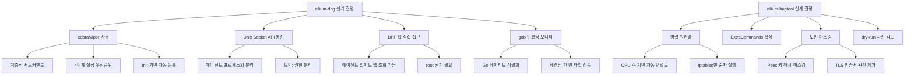

# 26. CLI 도구 심층 분석: cilium-dbg + cilium-bugtool

> Cilium 소스 기준: `cilium-dbg/`, `bugtool/`
> 작성일: 2026-03-08

---

## 목차
1. [개요](#1-개요)
2. [Part A: cilium-dbg — 에이전트 디버깅 CLI](#2-part-a-cilium-dbg--에이전트-디버깅-cli)
3. [cobra/viper 기반 명령어 아키텍처](#3-cobraviper-기반-명령어-아키텍처)
4. [초기화 흐름과 에이전트 클라이언트](#4-초기화-흐름과-에이전트-클라이언트)
5. [BPF 맵 서브커맨드 구조](#5-bpf-맵-서브커맨드-구조)
6. [모니터링과 이벤트 스트리밍](#6-모니터링과-이벤트-스트리밍)
7. [status 명령어: 에이전트 상태 진단](#7-status-명령어-에이전트-상태-진단)
8. [StateDB 원격 덤프](#8-statedb-원격-덤프)
9. [troubleshoot 서브시스템](#9-troubleshoot-서브시스템)
10. [Part B: cilium-bugtool — 버그 리포트 수집기](#10-part-b-cilium-bugtool--버그-리포트-수집기)
11. [수집 명령어 구성과 실행 엔진](#11-수집-명령어-구성과-실행-엔진)
12. [병렬 실행과 워커풀](#12-병렬-실행과-워커풀)
13. [아카이브 생성과 보안 마스킹](#13-아카이브-생성과-보안-마스킹)
14. [설계 결정과 교훈](#14-설계-결정과-교훈)

---

## 1. 개요

Cilium은 eBPF 기반 네트워킹을 제공하는 만큼, 데이터패스 디버깅과 장애 진단을 위한 **전문 CLI 도구**가 필수적이다. 이 문서에서는 두 가지 핵심 CLI 도구를 분석한다:

- **cilium-dbg**: 로컬 Cilium 에이전트와 통신하여 BPF 맵 조회, 엔드포인트 관리, 정책 검사, 이벤트 모니터링 등을 수행하는 디버깅 CLI
- **cilium-bugtool**: 시스템/에이전트 정보를 병렬로 수집하여 버그 리포트용 아카이브를 생성하는 도구

### 왜 이 두 도구를 함께 분석하는가?

```
┌─────────────────────────────────────────────────────────────────┐
│               Cilium 운영 CLI 도구 관계도                        │
│                                                                  │
│  운영자/개발자                                                    │
│       │                                                          │
│       ├─── cilium-dbg ───→ Cilium Agent (Unix Socket)            │
│       │    ├── status         → 에이전트 상태 조회                │
│       │    ├── bpf ct list    → BPF CT 맵 덤프                   │
│       │    ├── monitor        → BPF 이벤트 스트리밍               │
│       │    ├── endpoint list  → 엔드포인트 목록                   │
│       │    ├── policy get     → 네트워크 정책 조회                │
│       │    ├── statedb        → StateDB JSON 덤프                │
│       │    └── troubleshoot   → kvstore/clustermesh 진단          │
│       │                                                          │
│       └─── cilium-bugtool ─→ 시스템 전체 정보 수집               │
│            ├── cilium-dbg 명령어들 실행                           │
│            ├── 시스템 명령어 (ip, ss, iptables 등) 실행           │
│            ├── BPF 맵 덤프 (bpftool)                             │
│            ├── Envoy 설정/메트릭 수집                            │
│            ├── pprof 프로파일링 수집                              │
│            └── tar/gz 아카이브 생성                               │
│                                                                  │
│  cilium-bugtool은 내부적으로 cilium-dbg 명령어를 호출한다         │
└─────────────────────────────────────────────────────────────────┘
```

### 소스 경로

```
cilium-dbg/
├── main.go                          # 진입점 (3줄)
└── cmd/
    ├── root.go                      # RootCmd, viper 설정, 에이전트 클라이언트
    ├── helpers.go                   # Fatalf, TablePrinter, 정책 파서
    ├── status.go                    # status 서브커맨드
    ├── monitor.go                   # BPF 이벤트 모니터
    ├── statedb.go                   # StateDB 원격 테이블 접근
    ├── endpoint.go                  # 엔드포인트 관리
    ├── bpf_ct_list.go              # BPF CT 맵 조회
    ├── bpf_policy_*.go             # BPF 정책 맵 CRUD
    ├── troubleshoot/               # troubleshoot 서브시스템
    │   ├── troubleshoot.go         # 기본 프레임워크
    │   ├── troubleshoot_kvstore.go # kvstore 진단
    │   └── troubleshoot_clustermesh.go
    └── ... (151개 파일)

bugtool/
├── main.go                          # 진입점
└── cmd/
    ├── root.go                      # BugtoolRootCmd, runTool()
    ├── configuration.go             # 명령어 구성, BPF 맵 경로
    ├── helper.go                    # tar/gz 아카이브, 암호화 키 마스킹
    ├── mask.go                      # JSON 필드 마스킹
    └── ethtool_linux.go             # 플랫폼별 네트워크 도구
```

---

## 2. Part A: cilium-dbg -- 에이전트 디버깅 CLI

### cilium-dbg란?

cilium-dbg는 **로컬 Cilium 에이전트의 Unix 소켓 API**를 통해 에이전트 상태를 조회하고, BPF 맵을 직접 읽으며, 실시간 이벤트를 모니터링하는 CLI 도구이다.

```
소스: cilium-dbg/main.go

package main

import "github.com/cilium/cilium/cilium-dbg/cmd"

func main() {
    cmd.Execute()
}
```

진입점은 단 3줄이다. 모든 로직은 `cmd` 패키지에 위치한다.

### 왜 별도 바이너리인가?

cilium-dbg가 cilium-agent와 분리된 이유:

| 관점 | 설명 |
|------|------|
| **보안** | 에이전트 프로세스와 CLI 프로세스의 권한 분리 |
| **배포** | 에이전트 컨테이너에 디버깅 도구를 포함하되, 독립 실행 가능 |
| **안정성** | CLI 크래시가 에이전트에 영향을 주지 않음 |
| **테스트** | CLI 로직을 독립적으로 테스트 가능 |

단, 진입점에서 `components.IsCiliumAgent()` 체크가 있어, 에이전트 프로세스 내에서 실행될 때는 서브커맨드 등록을 건너뛴다:

```go
// 소스: cilium-dbg/cmd/root.go:52-54
func init() {
    if components.IsCiliumAgent() {
        return
    }
    // ... 서브커맨드 등록
}
```

---

## 3. cobra/viper 기반 명령어 아키텍처

### 명령어 트리 구조

cilium-dbg는 **151개의 Go 소스 파일**로 구성된 대규모 CLI이다. cobra의 계층적 커맨드 구조를 사용한다.

```
cilium-dbg (RootCmd)
├── status              # 에이전트 상태
├── monitor             # BPF 이벤트 스트리밍
├── endpoint            # 엔드포인트 관리
│   └── list
├── bpf                 # BPF 맵 조회/관리
│   ├── ct              # Connection Tracking
│   │   ├── list
│   │   └── flush
│   ├── nat             # NAT
│   │   ├── list
│   │   └── flush
│   ├── policy          # 정책 맵
│   │   ├── get
│   │   ├── add
│   │   ├── delete
│   │   └── list
│   ├── lb              # Load Balancer
│   │   ├── list
│   │   └── maglev
│   ├── ipcache         # IP → Identity 캐시
│   │   ├── list
│   │   ├── get
│   │   ├── update
│   │   ├── delete
│   │   └── match
│   ├── endpoint        # 엔드포인트 맵
│   ├── metrics         # BPF 메트릭
│   ├── auth            # 인증 맵
│   ├── bandwidth       # 대역폭 맵
│   ├── config          # 런타임 설정
│   ├── egress          # Egress GW
│   ├── frag            # IP 단편화
│   ├── ipmasq          # IP Masquerade
│   ├── nodeid          # 노드 ID
│   ├── sha             # SHA 맵
│   ├── mountfs         # BPF FS 마운트
│   ├── multicast       # 멀티캐스트
│   └── recorder        # 패킷 레코더
├── bgp                 # BGP 피어/라우트
│   ├── peers
│   ├── routes
│   └── route-policies
├── identity            # 보안 Identity
│   ├── list
│   └── get
├── ip                  # IP 관리
│   ├── list
│   └── get
├── kvstore             # KV 스토어 (etcd)
│   ├── get
│   ├── set
│   └── delete
├── node                # 노드 관리
│   └── list
├── policy              # 네트워크 정책
│   ├── get
│   ├── selectors
│   └── wait
├── service             # 서비스 목록
│   └── list
├── statedb             # StateDB 덤프
├── troubleshoot        # 진단
│   ├── kvstore
│   └── clustermesh
├── fqdn                # DNS 프록시 캐시
├── lrp                 # Local Redirect Policy
├── map                 # 일반 BPF 맵
│   ├── list
│   ├── get
│   └── events
├── encrypt             # 암호화 상태
├── preflight           # 사전 검증
├── completion          # 셸 자동완성
└── version             # 버전 정보
```

### 왜 이 계층 구조인가?

| 설계 결정 | 이유 |
|-----------|------|
| `bpf` 하위에 모든 맵 명령어를 그룹화 | BPF 맵은 Cilium의 핵심 데이터 구조. 한 곳에서 접근 |
| 각 서브커맨드가 독립 파일 | 151개 파일이지만 각각 100~200줄로 관리 가능한 크기 |
| `init()`에서 `RootCmd.AddCommand()` | Go의 패키지 초기화 순서를 활용한 자동 등록 |

### init() 기반 자동 등록 패턴

```go
// 소스: cilium-dbg/cmd/status.go:46-58
func init() {
    RootCmd.AddCommand(statusCmd)
    statusCmd.Flags().BoolVar(&statusDetails.AllAddresses, "all-addresses", false, ...)
    statusCmd.Flags().BoolVar(&statusDetails.AllControllers, "all-controllers", false, ...)
    statusCmd.Flags().BoolVar(&verbose, "verbose", false,
        "Equivalent to --all-addresses --all-controllers --all-nodes ...")
    statusCmd.Flags().DurationVar(&timeout, "timeout", 30*time.Second, ...)
    command.AddOutputOption(statusCmd)
}
```

모든 서브커맨드 파일은 동일한 패턴을 따른다:
1. `init()`에서 부모 커맨드에 자신을 등록
2. 플래그를 정의
3. `command.AddOutputOption()`으로 `-o json/yaml` 출력 지원 추가

---

## 4. 초기화 흐름과 에이전트 클라이언트

### RootCmd 초기화 시퀀스

```
┌──────────────────────────────────────────────────────────────┐
│               cilium-dbg 초기화 시퀀스                        │
│                                                               │
│  main()                                                       │
│    │                                                          │
│    ▼                                                          │
│  cmd.Execute()                                                │
│    │                                                          │
│    ▼                                                          │
│  RootCmd.Execute() ──→ cobra.OnInitialize(initConfig)         │
│    │                                                          │
│    ▼                                                          │
│  initConfig()                                                 │
│    │                                                          │
│    ├── 1. viper 설정 파일 로드                                │
│    │   ├── cfgFile 지정 시: 해당 파일                         │
│    │   └── 기본: $HOME/.cilium.yaml                           │
│    │                                                          │
│    ├── 2. 환경변수 바인딩                                     │
│    │   └── CILIUM_ 접두사 자동 매핑                           │
│    │                                                          │
│    ├── 3. 로깅 설정                                           │
│    │   └── SetupLogging(logDriver, logOpts, ...)              │
│    │                                                          │
│    └── 4. 에이전트 클라이언트 생성                            │
│        └── clientPkg.NewClient(host)                          │
│            └── Unix Socket: /var/run/cilium/cilium.sock       │
│                                                               │
└──────────────────────────────────────────────────────────────┘
```

### 소스코드 분석: initConfig

```go
// 소스: cilium-dbg/cmd/root.go:73-108
func initConfig() {
    if cfgFile != "" {
        vp.SetConfigFile(cfgFile)
    }

    vp.SetEnvPrefix("cilium")        // CILIUM_* 환경변수 매핑
    vp.SetConfigName(".cilium")       // $HOME/.cilium.yaml
    vp.AddConfigPath("$HOME")
    vp.AutomaticEnv()                 // 환경변수 자동 읽기

    if err := vp.ReadInConfig(); err == nil {
        fmt.Println("Using config file:", vp.ConfigFileUsed())
    }

    // 로깅 설정
    logDriver := vp.GetStringSlice(option.LogDriver)
    logOpts, err := command.GetStringMapStringE(vp, option.LogOpt)
    // ...
    logging.SetupLogging(logDriver, logOpts, "cilium-dbg", vp.GetBool(option.DebugArg))

    // 에이전트 클라이언트 생성
    if cl, err := clientPkg.NewClient(vp.GetString("host")); err != nil {
        Fatalf("Error while creating client: %s\n", err)
    } else {
        client = cl
    }
}
```

### 왜 viper를 사용하는가?

```
┌─────────────────────────────────────────────────┐
│           설정 우선순위 (높은 것이 우선)           │
│                                                  │
│  1. 명령줄 플래그      cilium-dbg --host=...     │
│  2. 환경변수           CILIUM_HOST=...           │
│  3. 설정 파일          $HOME/.cilium.yaml        │
│  4. 기본값             /var/run/cilium/...        │
└─────────────────────────────────────────────────┘
```

viper는 이 4단계 우선순위를 자동으로 처리한다. 특히 Kubernetes Pod 내에서 실행될 때 환경변수로 설정을 주입하는 것이 일반적이므로, `AutomaticEnv()`가 중요하다.

---

## 5. BPF 맵 서브커맨드 구조

### BPF CT (Connection Tracking) 맵 조회

BPF CT 맵 조회는 cilium-dbg에서 가장 자주 사용되는 기능 중 하나이다. 연결 추적 테이블을 직접 읽어 현재 활성 연결을 확인한다.

```go
// 소스: cilium-dbg/cmd/bpf_ct_list.go:25-50
var bpfCtListCmd = &cobra.Command{
    Use:     "list [cluster <identifier>]",
    Aliases: []string{"ls"},
    Short:   "List connection tracking entries",
    Run: func(cmd *cobra.Command, args []string) {
        t, id, err := parseArgs(args)
        if err != nil {
            cmd.PrintErrf("Invalid argument: %s", err.Error())
            return
        }
        common.RequireRootPrivilege("cilium bpf ct list")
        dumpCt(getMaps(t, id), t)
    },
}
```

### BPF 맵 접근 패턴

```
┌────────────────────────────────────────────────────────────┐
│              BPF 맵 조회 패턴                                │
│                                                             │
│  cilium-dbg bpf ct list                                    │
│       │                                                     │
│       ▼                                                     │
│  RequireRootPrivilege() ──→ BPF 맵은 root 권한 필요         │
│       │                                                     │
│       ▼                                                     │
│  getMaps(type, id)                                          │
│       │                                                     │
│       ├── type == "global"                                  │
│       │   └── ctmap.Maps(ipv4, ipv6)                       │
│       │       ├── cilium_ct4_global                         │
│       │       └── cilium_ct6_global                         │
│       │                                                     │
│       └── type == "cluster"                                 │
│           └── ctmap.GetClusterCTMaps(id, ipv4, ipv6)       │
│                                                             │
│       ▼                                                     │
│  dumpCt(maps, args)                                         │
│       │                                                     │
│       ├── OutputOption()이 설정된 경우 (JSON/YAML)          │
│       │   └── DumpWithCallback() → entries 수집             │
│       │       └── PrintOutput(entries)                      │
│       │                                                     │
│       └── 일반 출력                                         │
│           └── DumpEntriesWithTimeDiff(clockSource)          │
│               └── 시간 차이 포함 텍스트 출력                 │
└────────────────────────────────────────────────────────────┘
```

### IP 활성화 상태 확인의 이중 경로

```go
// 소스: cilium-dbg/cmd/helpers.go:365-390
func getIpEnableStatuses() (bool, bool) {
    params := daemon.NewGetHealthzParamsWithTimeout(5 * time.Second)
    brief := true
    params.SetBrief(&brief)

    // 경로 1: 에이전트가 실행 중이면 API로 조회
    if _, err := client.Daemon.GetHealthz(params); err == nil {
        if resp, err := client.ConfigGet(); err == nil {
            if resp.Status != nil {
                ipv4 := resp.Status.Addressing.IPV4 != nil && resp.Status.Addressing.IPV4.Enabled
                ipv6 := resp.Status.Addressing.IPV6 != nil && resp.Status.Addressing.IPV6.Enabled
                return ipv4, ipv6
            }
        }
    } else {
        // 경로 2: 에이전트가 중지된 경우 파일시스템에서 읽기
        agentConfigFile := filepath.Join(defaults.RuntimePath, defaults.StateDir,
            "agent-runtime-config.json")
        if byteValue, err := os.ReadFile(agentConfigFile); err == nil {
            if err = json.Unmarshal(byteValue, &option.Config); err == nil {
                return option.Config.EnableIPv4, option.Config.EnableIPv6
            }
        }
    }
    return defaults.EnableIPv4, defaults.EnableIPv6
}
```

**왜 이중 경로인가?** BPF 맵은 에이전트가 중지된 후에도 커널에 남아 있다. 따라서 에이전트가 없어도 BPF 맵을 직접 읽을 수 있어야 하는데, 이때 IPv4/IPv6 활성화 상태를 파일시스템에서 읽는 폴백이 필요하다.

### 정책 맵 CRUD

```go
// 소스: cilium-dbg/cmd/helpers.go:304-328
func updatePolicyKey(pa *PolicyUpdateArgs, add bool) {
    policyMap, err := policymap.OpenPolicyMap(log, pa.path)
    if err != nil {
        Fatalf("Cannot open policymap %q : %s", pa.path, err)
    }

    for _, proto := range pa.protocols {
        u8p := u8proto.U8proto(proto)
        entry := fmt.Sprintf("%d %d/%s", pa.label, pa.port, u8p.String())
        mapKey := policymap.NewKeyFromPolicyKey(
            policyTypes.KeyForDirection(pa.trafficDirection).
                WithIdentity(pa.label).
                WithPortProto(proto, pa.port))
        if add {
            mapEntry := policymap.NewEntryFromPolicyEntry(mapKey,
                policyTypes.MapStateEntry{Cookie: pa.cookie}.WithDeny(pa.isDeny))
            if err := policyMap.Update(&mapKey, &mapEntry); err != nil {
                Fatalf("Cannot add policy key '%s': %s\n", entry, err)
            }
        } else {
            if err := policyMap.DeleteKey(mapKey); err != nil {
                Fatalf("Cannot delete policy key '%s': %s\n", entry, err)
            }
        }
    }
}
```

BPF 정책 맵의 키는 `(direction, identity, port, protocol)` 튜플이다. CLI에서 직접 맵 엔트리를 추가/삭제할 수 있어 디버깅 시 유용하다.

---

## 6. 모니터링과 이벤트 스트리밍

### monitor 명령어 아키텍처

`cilium-dbg monitor`는 BPF 프로그램이 생성하는 이벤트를 실시간으로 스트리밍한다.

```
┌──────────────────────────────────────────────────────────────┐
│               monitor 이벤트 스트리밍 구조                     │
│                                                               │
│  BPF 프로그램 (TC/XDP)                                       │
│       │                                                       │
│       ▼ perf event                                            │
│  cilium-agent (monitor agent)                                 │
│       │                                                       │
│       ▼ Unix socket (/var/run/cilium/monitor1_2.sock)         │
│  cilium-dbg monitor                                           │
│       │                                                       │
│       ├── gob.Decoder로 payload 디코딩                        │
│       ├── MonitorFormatter로 포맷팅                           │
│       │   ├── --hex: 원시 HEX 출력                            │
│       │   ├── --json: JSON 출력                               │
│       │   ├── -v: DEBUG 수준                                  │
│       │   └── -vv: VERBOSE 수준                               │
│       └── stdout으로 출력                                     │
│                                                               │
│  이벤트 유형:                                                  │
│  - Drop: 패킷 드롭 알림                                       │
│  - Trace: 캡처된 패킷 트레이스                                 │
│  - PolicyVerdict: 정책 판정 알림                               │
│  - Debug: 디버깅 정보                                          │
└──────────────────────────────────────────────────────────────┘
```

### 연결 관리와 재연결

```go
// 소스: cilium-dbg/cmd/monitor.go:236-269
func runMonitor(ctx context.Context) {
    validateEndpointsFilters()
    setVerbosity()

    // 에이전트 모니터 정보 출력
    if resp, err := client.Daemon.GetHealthz(nil); err == nil {
        if nm := resp.Payload.NodeMonitor; nm != nil {
            fmt.Fprintf(os.Stderr, "Listening for events on %d CPUs with %dx%d ...\n",
                nm.Cpus, nm.Npages, nm.Pagesize)
        }
    }

    // EOF 시 재연결, 그 외 에러 시 종료
    for ; ; time.Sleep(connTimeout) {
        conn, version, err := openMonitorSock(vp.GetString("monitor-socket"))
        if err != nil {
            log.Error("Cannot open monitor socket", logfields.Error, err)
            return
        }

        if err := consumeMonitorEvents(ctx, conn, version); err != nil {
            if errors.Is(err, io.EOF) || errors.Is(err, io.ErrUnexpectedEOF) {
                log.Warn("connection closed", logfields.Error, err)
                continue  // 12초 후 재연결
            }
            logging.Fatal(log, "decoding error", logfields.Error, err)
        }
        return
    }
}
```

### 왜 gob 인코딩을 사용하는가?

| 선택지 | 장단점 |
|--------|--------|
| **gob (채택)** | Go 네이티브, 타입 정보 자동 전송, 세션당 한 번만 전송 |
| protobuf | 외부 의존성, 스키마 관리 필요, 하지만 언어 중립 |
| JSON | 느림, 큰 페이로드에 부적합 |

gob은 Go-to-Go 통신에서 가장 효율적이다. Version 1.2 API에서는 각 리스너가 자체 gob 세션을 유지하여 타입 정보가 한 번만 전송된다:

```go
// 소스: cilium-dbg/cmd/monitor.go:160-179
func getMonitorParser(conn net.Conn, version listener.Version) (parser eventParserFunc, err error) {
    switch version {
    case listener.Version1_2:
        var (
            pl  payload.Payload
            dec = gob.NewDecoder(conn)
        )
        return func() (*payload.Payload, error) {
            if err := pl.DecodeBinary(dec); err != nil {
                return nil, err
            }
            return &pl, nil
        }, nil
    default:
        return nil, fmt.Errorf("unsupported version %s", version)
    }
}
```

### 필터링 시스템

```go
// 소스: cilium-dbg/cmd/monitor.go:62-76
func init() {
    RootCmd.AddCommand(monitorCmd)
    monitorCmd.Flags().BoolVar(&printer.Hex, "hex", false, "Do not dissect, print HEX")
    monitorCmd.Flags().VarP(&printer.EventTypes, "type", "t",
        fmt.Sprintf("Filter by event types %v", monitor.GetAllTypes()))
    monitorCmd.Flags().Var(&printer.FromSource, "from", "Filter by source endpoint id")
    monitorCmd.Flags().Var(&printer.ToDst, "to", "Filter by destination endpoint id")
    monitorCmd.Flags().Var(&printer.Related, "related-to",
        "Filter by either source or destination endpoint id")
}
```

필터는 **클라이언트 사이드**에서 적용된다. 모든 이벤트를 수신한 후 `MonitorFormatter`가 조건에 맞는 것만 출력한다. 서버 사이드 필터링은 없는데, 이는 BPF perf ring buffer가 모든 CPU에서 이벤트를 생성하기 때문에 서버 사이드 필터링의 이점이 제한적이기 때문이다.

---

## 7. status 명령어: 에이전트 상태 진단

### status 명령어 구조

```go
// 소스: cilium-dbg/cmd/status.go:27-33
var statusCmd = &cobra.Command{
    Use:   "status",
    Short: "Display status of daemon",
    Run: func(cmd *cobra.Command, args []string) {
        statusDaemon()
    },
}
```

### 상태 진단 흐름

```
┌──────────────────────────────────────────────────────────────┐
│               status 명령어 흐름                              │
│                                                               │
│  statusDaemon()                                               │
│       │                                                       │
│       ▼                                                       │
│  client.Daemon.GetHealthz(params)                             │
│       │                                                       │
│       ├── 에이전트 연결 실패                                  │
│       │   └── "cilium: daemon unreachable" 출력               │
│       │       exit(1)                                         │
│       │                                                       │
│       ├── --brief 모드                                        │
│       │   └── FormatStatusResponseBrief()                     │
│       │       └── 한 줄 요약                                  │
│       │                                                       │
│       ├── -o json/yaml 모드                                   │
│       │   └── PrintOutput(resp.Payload)                       │
│       │                                                       │
│       └── 일반 모드                                           │
│           ├── FormatStatusResponse(w, sr, details)            │
│           │   ├── 주소 정보                                   │
│           │   ├── 컨트롤러 상태                               │
│           │   ├── 노드 정보                                   │
│           │   ├── 리다이렉트 정보                             │
│           │   └── 클러스터 정보                               │
│           │                                                   │
│           ├── isUnhealthy() 체크                              │
│           │   └── state != Ok && state != Disabled → exit(1)  │
│           │                                                   │
│           └── Health 모듈 상태                                │
│               ├── RemoteTable로 StateDB 쿼리                 │
│               ├── GetAndFormatHealthStatus()                  │
│               └── GetAndFormatModulesHealth()                 │
└──────────────────────────────────────────────────────────────┘
```

### --verbose의 의미

```go
// 소스: cilium-dbg/cmd/status.go:70-76
if verbose {
    statusDetails = pkg.StatusAllDetails
    allHealth = true
}
if allHealth {
    healthLines = 0   // 0 = 제한 없음, 모든 health 항목 출력
}
```

`--verbose`는 개별 `--all-*` 플래그를 모두 활성화하는 단축키이다. 이는 디버깅 시 "모든 것을 보여달라"는 일반적인 요구를 한 번에 충족한다.

---

## 8. StateDB 원격 덤프

### StateDB란?

StateDB는 Cilium 에이전트의 **인메모리 상태 데이터베이스**로, 모든 런타임 상태를 구조화된 테이블로 관리한다. cilium-dbg는 이를 원격으로 조회할 수 있다.

```go
// 소스: cilium-dbg/cmd/statedb.go:18-34
var StatedbCmd = &cobra.Command{
    Use:   "statedb",
    Short: "Dump StateDB contents as JSON",
    Run: func(cmd *cobra.Command, args []string) {
        transport, err := clientPkg.NewTransport("")
        if err != nil {
            Fatalf("NewTransport: %s", err)
        }
        client := http.Client{Transport: transport}
        resp, err := client.Get(statedbURL.JoinPath("dump").String())
        if err != nil {
            Fatalf("Get(dump): %s", err)
        }
        io.Copy(os.Stdout, resp.Body)
        resp.Body.Close()
    },
}
```

### 원격 테이블 접근 패턴

```go
// 소스: cilium-dbg/cmd/statedb.go:43-51
func newRemoteTable[Obj any](tableName string) *statedb.RemoteTable[Obj] {
    table := statedb.NewRemoteTable[Obj](statedbURL, tableName)
    transport, err := clientPkg.NewTransport("")
    if err != nil {
        Fatalf("NewTransport: %s", err)
    }
    table.SetTransport(transport)
    return table
}
```

```
┌──────────────────────────────────────────────────────────┐
│            StateDB 원격 접근 구조                          │
│                                                           │
│  cilium-dbg statedb                                       │
│       │                                                   │
│       ▼ HTTP GET (Unix socket 경유)                       │
│  http://localhost/statedb/dump                            │
│       │                                                   │
│       ▼                                                   │
│  cilium-agent의 StateDB HTTP 핸들러                       │
│  (daemon/cmd/cells.go에서 /statedb에 마운트)              │
│       │                                                   │
│       ▼                                                   │
│  StateDB 전체 테이블 JSON 스트리밍                        │
│                                                           │
│  개별 테이블 접근 (status 명령어에서 사용):               │
│  statedb.RemoteTable[types.Status]                        │
│       │                                                   │
│       ▼ HTTP SSE 스트리밍                                 │
│  LowerBound() → iter → Collect()                          │
│       └── 특정 인덱스 범위의 레코드 스트리밍               │
└──────────────────────────────────────────────────────────┘
```

**왜 StateDB를 HTTP로 노출하는가?** StateDB는 에이전트 프로세스 내의 인메모리 DB이다. CLI에서 접근하려면 IPC가 필요한데, 이미 에이전트가 Unix socket HTTP API를 제공하므로 같은 소켓을 통해 StateDB도 노출하는 것이 자연스럽다.

---

## 9. troubleshoot 서브시스템

### troubleshoot 명령어의 목적

troubleshoot는 **컨트롤 플레인 연결성**을 진단한다. kvstore(etcd)와 clustermesh 연결을 검증한다.

```go
// 소스: cilium-dbg/cmd/troubleshoot/troubleshoot.go:26-29
var Cmd = &cobra.Command{
    Use:   "troubleshoot",
    Short: "Run troubleshooting utilities to check control-plane connectivity",
}
```

### Kubernetes 서비스 해석 다이얼러

troubleshoot의 핵심은 **Cilium 에이전트와 동일한 방식으로 서비스 이름을 해석**하는 것이다:

```go
// 소스: cilium-dbg/cmd/troubleshoot/troubleshoot.go:70-74
type troubleshootDialer struct {
    cs    kubernetes.Interface
    cache map[types.NamespacedName]string
    dial  func(ctx context.Context, addr string) (conn net.Conn, e error)
}
```

```
┌──────────────────────────────────────────────────────────────┐
│          troubleshoot 서비스 해석 흐름                         │
│                                                               │
│  etcd 주소: "cilium-etcd.kube-system.svc:2379"               │
│       │                                                       │
│       ▼                                                       │
│  resolve(ctx, host)                                           │
│       │                                                       │
│       ├── 캐시 확인 (cache map)                               │
│       │   └── 있으면 캐시된 IP 반환                           │
│       │                                                       │
│       ├── ServiceURLToNamespacedName(host)                    │
│       │   └── "cilium-etcd.kube-system.svc"                  │
│       │       → {Namespace: "kube-system", Name: "cilium-etcd"} │
│       │                                                       │
│       ├── cs.CoreV1().Services(ns).Get(name)                 │
│       │   └── Kubernetes API로 서비스 ClusterIP 조회          │
│       │                                                       │
│       └── 결과 캐시 및 반환                                   │
│                                                               │
│  왜 이 방식인가?                                              │
│  Cilium 에이전트는 호스트 DNS가 아닌 Kubernetes API로         │
│  서비스를 해석한다 (CoreDNS 순환 의존 방지).                  │
│  troubleshoot도 동일한 경로를 사용해야 정확한 진단 가능       │
└──────────────────────────────────────────────────────────────┘
```

### 왜 CoreDNS를 사용하지 않는가?

Cilium 에이전트는 CoreDNS보다 먼저 시작하거나, CoreDNS가 Cilium에 의존하는 경우가 있다. 이 **닭과 달걀 문제**를 피하기 위해 Kubernetes API를 직접 사용하여 서비스 이름을 ClusterIP로 해석한다. troubleshoot 명령어도 이 동작을 재현하여, "에이전트와 동일한 경로로 연결 가능한가?"를 정확히 진단한다.

---

## 10. Part B: cilium-bugtool -- 버그 리포트 수집기

### cilium-bugtool이란?

cilium-bugtool은 **시스템과 에이전트의 디버깅 정보를 자동으로 수집**하여 tar/gz 아카이브로 패키징하는 도구이다. GitHub 이슈에 첨부할 정보를 한 번에 모은다.

```go
// 소스: bugtool/cmd/root.go:35-52
var BugtoolRootCmd = &cobra.Command{
    Use:   "cilium-bugtool [OPTIONS]",
    Short: "Collects agent & system information useful for bug reporting",
    Example: `  # Collect information and create archive file
    $ cilium-bugtool
    [...]

    # Collect in a Kubernetes pod
    $ kubectl -n kube-system exec cilium-kg8lv -- cilium-bugtool
    $ kubectl cp kube-system/cilium-kg8lv:/tmp/cilium-bugtool-*.tar /tmp/`,
    Run: func(cmd *cobra.Command, args []string) {
        runTool()
    },
}
```

### 주요 플래그

| 플래그 | 기본값 | 설명 |
|--------|--------|------|
| `--archive` | true | 아카이브 생성 (false면 디렉토리 유지) |
| `--archiveType` | tar | 출력 형식: tar / gz |
| `--dry-run` | false | 실행할 명령어 목록만 생성 |
| `--get-pprof` | false | pprof 프로파일링만 수집 |
| `--envoy-dump` | true | Envoy 설정 덤프 |
| `--envoy-metrics` | true | Envoy Prometheus 메트릭 |
| `--hubble-metrics` | true | Hubble 메트릭 수집 |
| `--exec-timeout` | 30s | 명령어 실행 타임아웃 |
| `--parallel-workers` | 0 (= CPU 수) | 병렬 실행 워커 수 |
| `--exclude-object-files` | false | 엔드포인트별 .o 파일 제외 |
| `--config` | .cilium-bugtool.config | 사용자 정의 명령어 설정 |
| `--tmp` / `-t` | /tmp | 임시 디렉토리 경로 |

---

## 11. 수집 명령어 구성과 실행 엔진

### runTool() 메인 흐름

```
┌──────────────────────────────────────────────────────────────┐
│               runTool() 실행 흐름                             │
│                                                               │
│  runTool()                                                    │
│       │                                                       │
│       ├── 1. 아카이브 타입 검증 (tar/gz만 허용)              │
│       │                                                       │
│       ├── 2. 임시 디렉토리 생성                              │
│       │   └── /tmp/cilium-bugtool-20260308-153000-...-/      │
│       │       ├── cmd/    ← 명령어 출력 저장                 │
│       │       └── conf/   ← 설정 파일 복사                  │
│       │                                                       │
│       ├── 3. root 권한 경고                                   │
│       │   └── "BPF commands might fail when not root"         │
│       │                                                       │
│       ├── 4. 명령어 목록 구성                                │
│       │   ├── defaultCommands(confDir, cmdDir)               │
│       │   └── ExtraCommands (확장 포인트)                    │
│       │                                                       │
│       ├── 5. dry-run 모드이면 설정 파일만 저장하고 종료      │
│       │                                                       │
│       ├── 6. 사용자 설정 파일이 있으면 그것을 사용           │
│       │                                                       │
│       ├── 7. pprof 모드                                      │
│       │   └── pprofTraces() → CPU/heap/trace 수집            │
│       │                                                       │
│       ├── 8. 일반 모드                                       │
│       │   ├── Envoy 설정/메트릭 덤프                         │
│       │   ├── Hubble 메트릭 수집                             │
│       │   └── runAll(commands, cmdDir) → 병렬 실행           │
│       │                                                       │
│       └── 9. 아카이브 생성                                   │
│           ├── tar → createArchive()                           │
│           └── gz  → createGzip()                              │
└──────────────────────────────────────────────────────────────┘
```

### defaultCommands: 수집 명령어 카테고리

```go
// 소스: bugtool/cmd/configuration.go:143-172
func defaultCommands(confDir string, cmdDir string) []string {
    var commands []string
    commands = append(commands, miscSystemCommands()...)   // 시스템 명령어
    commands = append(commands, bpfMapDumpCommands(...)...) // BPF 맵 덤프
    commands = append(commands, bpfCgroupCommands()...)    // cgroup BPF 트리
    commands = append(commands, catCommands()...)          // 시스템 파일 읽기
    commands = append(commands, routeCommands()...)        // 라우팅 테이블
    commands = append(commands, ethtoolCommands()...)      // 네트워크 인터페이스
    commands = append(commands, copyConfigCommands(...)...)// 커널 설정 복사
    commands = append(commands, ciliumDbgCommands(...)...) // cilium-dbg 명령어
    commands = append(commands, ciliumHealthCommands()...) // cilium-health
    commands = append(commands, copyStateDirCommand(...)...)// 상태 디렉토리 복사
    commands = append(commands, tcInterfaceCommands()...)  // tc 필터/체인
    return commands
}
```

### 시스템 명령어 상세

```go
// 소스: bugtool/cmd/configuration.go:174-223
func miscSystemCommands() []string {
    return []string{
        "cat /proc/net/xfrm_stat",     // IPsec 통계
        "ps auxfw",                     // 프로세스 트리
        "hostname",                     // 호스트 이름
        "ip a",                         // IP 주소
        "ip -4 r", "ip -6 r",         // 라우팅
        "ip -d -s -s l",              // 링크 상세 통계
        "ip -4 n", "ip -6 n",         // ARP/NDP 테이블
        "ss -t -p -a -i -s -n -e",    // TCP 소켓
        "ss -u -p -a -i -s -n -e",    // UDP 소켓
        "uname -a",                     // 커널 정보
        "top -b -n 1",                 // 프로세스 리소스
        "uptime",                       // 시스템 가동 시간
        "dmesg --time-format=iso",     // 커널 로그
        "sysctl -a",                    // 시스템 설정
        "bpftool map show",            // BPF 맵 목록
        "bpftool prog show",           // BPF 프로그램 목록
        "bpftool net show",            // BPF 네트워크 훅
        "iptables-save -c",            // iptables 규칙
        "ip -s xfrm policy",          // IPsec 정책
        "ip -s xfrm state",           // IPsec SA
        "lsmod",                        // 로드된 커널 모듈
        "tc qdisc show",               // tc qdisc
        "find /sys/fs/bpf -ls",        // BPF FS 내용
    }
}
```

### cilium-dbg 명령어 수집

```go
// 소스: bugtool/cmd/configuration.go:383-450
func ciliumDbgCommands(cmdDir string) []string {
    ciliumDbgCommands := []string{
        fmt.Sprintf("cilium-dbg debuginfo --output=markdown,json -f --output-directory=%s", cmdDir),
        "cilium-dbg metrics list",
        "cilium-dbg bpf metrics list",
        "cilium-dbg fqdn cache list",
        "cilium-dbg config -a",
        "cilium-dbg encrypt status",
        "cilium-dbg endpoint list",
        "cilium-dbg endpoint list -o json",
        "cilium-dbg bpf auth list",
        "cilium-dbg bpf lb list",
        "cilium-dbg bpf lb list --revnat",
        "cilium-dbg bpf ipcache list",
        "cilium-dbg bpf policy get --all --numeric",
        "cilium-dbg map list --verbose",
        "cilium-dbg service list",
        "cilium-dbg status --verbose",
        "cilium-dbg identity list",
        "cilium-dbg policy get",
        "cilium-dbg statedb",
        "cilium-dbg bgp peers",
        "cilium-dbg troubleshoot kvstore",
        "cilium-dbg troubleshoot clustermesh",
        // ... 총 40+ 명령어
    }
    return ciliumDbgCommands
}
```

### BPF 맵 덤프 명령어

```go
// 소스: bugtool/cmd/configuration.go:75-141
var bpfMapsPath = []string{
    "tc/globals/cilium_auth_map",
    "tc/globals/cilium_lxc",
    "tc/globals/cilium_ipcache",
    "tc/globals/cilium_events",
    "tc/globals/cilium_lb4_services_v2",
    "tc/globals/cilium_lb4_backends_v3",
    "tc/globals/cilium_ct4_global",
    "tc/globals/cilium_snat_v4_external",
    "tc/globals/cilium_l2_responder_v4",
    // ... 총 50+ BPF 맵 경로
}

func bpfMapDumpCommands(mapPathsPatterns []string) []string {
    bpffsMountpoint := bpffsMountpoint()
    if bpffsMountpoint == "" {
        return nil
    }
    commands := make([]string, 0, len(mapPathsPatterns))
    for _, pattern := range mapPathsPatterns {
        if matches, err := filepath.Glob(filepath.Join(bpffsMountpoint, pattern)); err == nil {
            for _, match := range matches {
                commands = append(commands, "bpftool map dump pinned "+match)
            }
        }
    }
    return commands
}
```

**왜 glob 패턴을 사용하는가?** 일부 BPF 맵 이름에는 와일드카드가 포함된다 (예: `cilium_calls_wireguard*`). 이는 BPF 맵 이름에 동적 접미사가 붙는 경우가 있기 때문이다.

### ExtraCommands 확장 포인트

```go
// 소스: bugtool/cmd/root.go:64-76
type ExtraCommandsFunc func(confDir string, cmdDir string) []string
var ExtraCommands []ExtraCommandsFunc
```

```
┌──────────────────────────────────────────────────────┐
│          ExtraCommands 확장 패턴                       │
│                                                       │
│  기본 명령어 + 환경별 확장 명령어                     │
│                                                       │
│  defaultCommands()                                    │
│       │                                               │
│       ▼                                               │
│  for _, f := range ExtraCommands {                    │
│      commands = append(commands, f(confDir, cmdDir)...)│
│  }                                                    │
│                                                       │
│  Kubernetes 환경:                                     │
│    ExtraCommands에 kubectl 관련 명령어 추가            │
│                                                       │
│  Standalone 환경:                                     │
│    ExtraCommands에 systemd 관련 명령어 추가            │
│                                                       │
│  이 패턴으로 코어 코드 변경 없이 환경별 수집 확장     │
└──────────────────────────────────────────────────────┘
```

---

## 12. 병렬 실행과 워커풀

### runAll: 병렬 명령어 실행 엔진

```go
// 소스: bugtool/cmd/root.go:328-373
func runAll(commands []string, cmdDir string) {
    if len(commands) == 0 {
        return
    }

    if parallelWorkers <= 0 {
        parallelWorkers = runtime.NumCPU()
    }

    wp := workerpool.New(parallelWorkers)
    for _, cmd := range commands {
        if strings.Contains(cmd, "tables") {
            // iptables 명령어는 xtables 잠금을 사용하므로
            // 순차 실행해야 한다
            writeCmdToFile(cmdDir, cmd, enableMarkdown, nil)
            continue
        }

        err := wp.Submit(cmd, func(_ context.Context) error {
            if strings.Contains(cmd, "xfrm state") {
                // IPsec 키를 해시로 마스킹
                writeCmdToFile(cmdDir, cmd, enableMarkdown, hashEncryptionKeys)
            } else {
                writeCmdToFile(cmdDir, cmd, enableMarkdown, nil)
            }
            return nil
        })
    }

    _, err := wp.Drain()  // 모든 작업 완료 대기
    wp.Close()
}
```

### 왜 iptables만 순차 실행하는가?

```
┌──────────────────────────────────────────────────────────┐
│           iptables 순차 실행 이유                          │
│                                                           │
│  iptables는 커널의 xtables 잠금(lock)을 사용한다.        │
│                                                           │
│  병렬 실행 시:                                            │
│  Worker 1: iptables-save -c  ──→ xtables lock 획득       │
│  Worker 2: ip6tables-save -c ──→ "Another app is         │
│                                   currently holding       │
│                                   the xtables lock..."    │
│                                                           │
│  해결: strings.Contains(cmd, "tables") 로 감지하여       │
│  iptables 계열 명령어만 메인 고루틴에서 순차 실행         │
│                                                           │
│  나머지 명령어 (ip, ss, bpftool 등)는 병렬 실행 가능     │
└──────────────────────────────────────────────────────────┘
```

### writeCmdToFile: 명령어 출력 저장

```go
// 소스: bugtool/cmd/root.go:406-462
func writeCmdToFile(cmdDir, prompt string, enableMarkdown bool, postProcess func([]byte) []byte) {
    // 파일명 생성: '/'를 ' '로, ' '을 '-'로 변환
    name := strings.ReplaceAll(prompt, "/", " ")
    name = strings.ReplaceAll(name, " ", "-")
    suffix := ".md"
    if strings.HasSuffix(name, "html") {
        suffix = ".html"
        enableMarkdown = false
    }
    f, err := os.Create(filepath.Join(cmdDir, name+suffix))

    // 명령어 존재 확인
    cmd := strings.Split(prompt, " ")[0]
    if _, err := exec.LookPath(cmd); err != nil {
        os.Remove(f.Name())
        return  // 명령어가 없으면 건너뜀
    }

    // 후처리 없이 직접 파일에 쓰기 (효율적)
    if !enableMarkdown && postProcess == nil {
        cmd := exec.Command("bash", "-c", prompt)
        cmd.Stdout = f
        cmd.Stderr = f
        err = cmd.Run()
    } else {
        output, err = execCommand(prompt)
        if postProcess != nil {
            output = postProcess(output)
        }
        // Markdown 포맷팅
        if enableMarkdown && len(output) > 0 {
            fmt.Fprintf(f, "# %s\n\n```\n%s\n```\n", prompt, output)
        }
    }
}
```

### 명령어 실행 타임아웃

```go
// 소스: bugtool/cmd/root.go:395-403
func execCommand(prompt string) ([]byte, error) {
    ctx, cancel := context.WithTimeout(context.Background(), execTimeout)
    defer cancel()
    output, err := exec.CommandContext(ctx, "bash", "-c", prompt).CombinedOutput()
    if errors.Is(ctx.Err(), context.DeadlineExceeded) {
        return nil, fmt.Errorf("exec timeout")
    }
    return output, err
}
```

기본 타임아웃은 30초이다. BPF 맵이 매우 클 경우 덤프에 시간이 걸릴 수 있으므로 `--exec-timeout`으로 조절 가능하다.

---

## 13. 아카이브 생성과 보안 마스킹

### tar 아카이브 생성

```go
// 소스: bugtool/cmd/helper.go:94-122
func createArchive(dbgDir string, sendArchiveToStdout bool) (string, error) {
    file := os.Stdout
    archivePath := "STDOUT"

    if !sendArchiveToStdout {
        archivePath = fmt.Sprintf("%s.tar", dbgDir)
        file, err = os.Create(archivePath)
        defer file.Close()
    }

    writer := tar.NewWriter(file)
    defer writer.Close()

    var baseDir string
    if info, err := os.Stat(dbgDir); err == nil && info.IsDir() {
        baseDir = filepath.Base(dbgDir)
    }

    walker := newWalker(baseDir, dbgDir, writer, os.Stderr)
    return archivePath, filepath.Walk(dbgDir, walker.walkPath)
}
```

```
┌──────────────────────────────────────────────────────────┐
│            아카이브 생성 파이프라인                         │
│                                                           │
│  수집된 파일들                                            │
│  /tmp/cilium-bugtool-20260308-.../                       │
│  ├── cmd/                                                 │
│  │   ├── cilium-dbg-status---verbose.md                  │
│  │   ├── ip-a.md                                          │
│  │   ├── bpftool-map-dump-pinned-...-cilium_ct4.md      │
│  │   └── ...                                             │
│  └── conf/                                                │
│      └── kernel-config-6.1.0                             │
│                                                           │
│       │                                                   │
│       ▼ filepath.Walk()                                   │
│  walker.walkPath()                                        │
│       │                                                   │
│       ├── 디렉토리 건너뜀                                 │
│       ├── 파일 정보 읽기 (최신 stat)                      │
│       ├── tar.FileInfoHeader() 생성                      │
│       └── io.Copy(tarWriter, file)                        │
│                                                           │
│       ▼                                                   │
│  --archiveType=tar → .tar 파일                            │
│  --archiveType=gz  → .tar.gz 파일                         │
│  -t -              → stdout으로 스트리밍                   │
│                      (kubectl cp 파이프라인용)             │
└──────────────────────────────────────────────────────────┘
```

### stdout 출력 지원

`-t -` 옵션으로 아카이브를 stdout에 출력할 수 있다. 이는 Kubernetes Pod에서 `kubectl exec`으로 bugtool을 실행하고 파이프라인으로 아카이브를 가져올 때 유용하다:

```bash
kubectl -n kube-system exec cilium-pod -- cilium-bugtool -t - | tar xf - -C /tmp/
```

### IPsec 키 마스킹

```go
// 소스: bugtool/cmd/helper.go:164-204
var isEncryptionKey = regexp.MustCompile(
    "(auth|enc|aead|comp)(.*[[:blank:]](0[xX][[:xdigit:]]+))?")

func hashEncryptionKeys(output []byte) []byte {
    var b bytes.Buffer
    lines := bytes.Split(output, []byte("\n"))
    for i, line := range lines {
        matched := isEncryptionKey.FindSubmatchIndex(line)
        if matched != nil && matched[6] > 0 {
            // 키를 SHA-256 해시로 교체
            key := line[matched[6]:matched[7]]
            h := sha256.New()
            h.Write(key)
            sum := h.Sum(nil)
            hashedKey := make([]byte, hex.EncodedLen(len(sum)))
            hex.Encode(hashedKey, sum)
            fmt.Fprintf(&b, "%s[hash:%s]%s",
                line[:matched[6]], hashedKey, line[matched[7]:])
        } else if matched != nil && matched[6] < 0 {
            b.WriteString("[redacted]")
        } else {
            b.Write(line)
        }
    }
    return b.Bytes()
}
```

### Envoy 시크릿 마스킹

```go
// 소스: bugtool/cmd/root.go:154-164
var envoySecretMask = jsonFieldMaskPostProcess([]string{
    "api_key",
    "trusted_ca",
    "certificate_chain",
    "private_key",
})
```

```
┌──────────────────────────────────────────────────────────┐
│            보안 마스킹 전략                                │
│                                                           │
│  1. IPsec 키 (ip -s xfrm state 출력)                     │
│     원본: auth-trunc hmac(sha256) 0xABCD1234...          │
│     마스킹: auth-trunc hmac(sha256) [hash:e3b0c44...]    │
│     → SHA-256 해시로 교체 (동일 키인지 비교 가능)         │
│                                                           │
│  2. Envoy TLS 인증서/키                                   │
│     원본: {"private_key": "MIIEvgIBADANBg..."}           │
│     마스킹: {"private_key": "***"}                        │
│     → 완전 제거                                           │
│                                                           │
│  3. 키 없는 암호 알고리즘 라인                            │
│     원본: auth hmac(sha256)                               │
│     마스킹: [redacted]                                    │
│                                                           │
│  왜 해시인가?                                             │
│  해시를 사용하면 원본 키를 복원할 수 없지만,             │
│  두 노드의 키가 동일한지 비교할 수 있다.                 │
│  이는 IPsec 키 불일치 문제 디버깅에 필수적이다.          │
└──────────────────────────────────────────────────────────┘
```

### dry-run 모드

```go
// 소스: bugtool/cmd/root.go:205-209
if dryRunMode {
    dryRun(configPath, commands)
    fmt.Fprintf(os.Stderr, "Configuration file at %s\n", configPath)
    return
}
```

dry-run은 실행할 명령어 목록을 JSON 설정 파일로 저장한다. 사용자가 이 파일을 편집한 후 `--config`으로 지정하면 수정된 명령어만 실행된다:

```json
{
    "commands": [
        "ps auxfw",
        "ip a",
        "cilium-dbg status --verbose",
        "bpftool map dump pinned /sys/fs/bpf/tc/globals/cilium_ct4_global"
    ]
}
```

이는 **민감한 환경**에서 수집할 정보를 사전 검토할 수 있게 해준다.

---

## 14. 설계 결정과 교훈

### 아키텍처 결정 요약



### 핵심 설계 교훈

| 교훈 | 구현 |
|------|------|
| **CLI 도구와 데몬 분리** | cilium-dbg는 별도 바이너리. 에이전트 크래시와 무관 |
| **파일 단위 서브커맨드** | 151개 파일이지만 각각 100~200줄로 유지보수 용이 |
| **이중 경로 폴백** | 에이전트 API 우선, 불가 시 파일시스템 직접 읽기 |
| **보안 기본 내장** | bugtool은 수집 시점에 키/인증서를 자동 마스킹 |
| **병렬성과 안전성 균형** | 대부분 병렬이지만 잠금이 필요한 명령어는 순차 |
| **사전 검토 지원** | dry-run으로 민감 환경에서 수집 범위 제어 |
| **확장 포인트** | ExtraCommandsFunc로 환경별 추가 수집 지원 |
| **stdout 파이프라인** | `-t -` 옵션으로 kubectl cp 없이 직접 파이프 |

### BPF 맵 경로 관리의 중앙화

bugtool의 `bpfMapsPath` 배열은 50개 이상의 BPF 맵 경로를 중앙에서 관리한다. 새로운 BPF 맵이 추가되면 이 배열에도 추가해야 한다. 이는 **"디버깅 도구도 기능과 함께 업데이트해야 한다"**는 교훈을 보여준다.

```
┌──────────────────────────────────────────────────────────┐
│         BPF 맵 경로 중앙 관리의 장단점                     │
│                                                           │
│  장점:                                                    │
│  - 한 곳에서 모든 맵 경로를 확인 가능                     │
│  - glob 패턴으로 동적 맵 이름 지원                        │
│  - 존재하지 않는 맵은 자동으로 건너뜀                     │
│                                                           │
│  단점:                                                    │
│  - 새 맵 추가 시 수동 업데이트 필요                       │
│  - 누락 시 디버깅 정보 수집 불완전                        │
│                                                           │
│  대안: BPF FS를 재귀적으로 스캔                           │
│  → 하지만 "find /sys/fs/bpf -ls"로 이미 수집하고 있어    │
│     개별 맵 덤프와 전체 목록을 모두 수집하는 전략          │
└──────────────────────────────────────────────────────────┘
```

### 출력 포맷 전략

cilium-dbg의 모든 조회 명령어는 `command.AddOutputOption()`을 통해 `-o json`, `-o yaml` 출력을 지원한다:

| 출력 모드 | 용도 |
|-----------|------|
| **기본 (텍스트)** | 사람이 읽기 쉬운 tabwriter 포맷 |
| **JSON** | 프로그래밍 가능한 출력, 스크립트 통합 |
| **YAML** | 사람이 읽기 쉬운 구조화 출력 |

이는 "모든 출력은 사람과 기계 모두에게 유용해야 한다"는 CLI 설계 원칙을 따른다.

```
┌──────────────────────────────────────────────────────────┐
│         cilium-dbg 출력 파이프라인                         │
│                                                           │
│  cilium-dbg endpoint list                                │
│       │                                                   │
│       ├── -o json                                        │
│       │   └── command.PrintOutput(endpoints)             │
│       │       └── json.MarshalIndent()                   │
│       │                                                   │
│       ├── -o yaml                                        │
│       │   └── command.PrintOutput(endpoints)             │
│       │       └── yaml.Marshal()                         │
│       │                                                   │
│       └── 기본                                           │
│           └── tabwriter.NewWriter()                      │
│               └── 정렬된 테이블 출력                     │
└──────────────────────────────────────────────────────────┘
```

---

## 요약

Cilium의 CLI 도구들은 eBPF 기반 네트워킹의 복잡성을 운영자에게 투명하게 보여주는 역할을 한다:

1. **cilium-dbg**는 에이전트 API와 BPF 맵에 대한 통합 접근 인터페이스를 제공하며, 151개 파일/서브커맨드로 세분화된 디버깅 기능을 갖추고 있다

2. **cilium-bugtool**은 시스템과 에이전트의 모든 디버깅 정보를 병렬로 수집하되, iptables 잠금 같은 제약을 인식하고 보안 마스킹을 기본 적용한다

3. 두 도구는 상호 보완적이다: bugtool은 내부적으로 cilium-dbg 명령어를 호출하여 에이전트 상태를 수집한다

이러한 도구의 존재가 Cilium의 프로덕션 신뢰성에 기여하는 핵심 요소이다.
