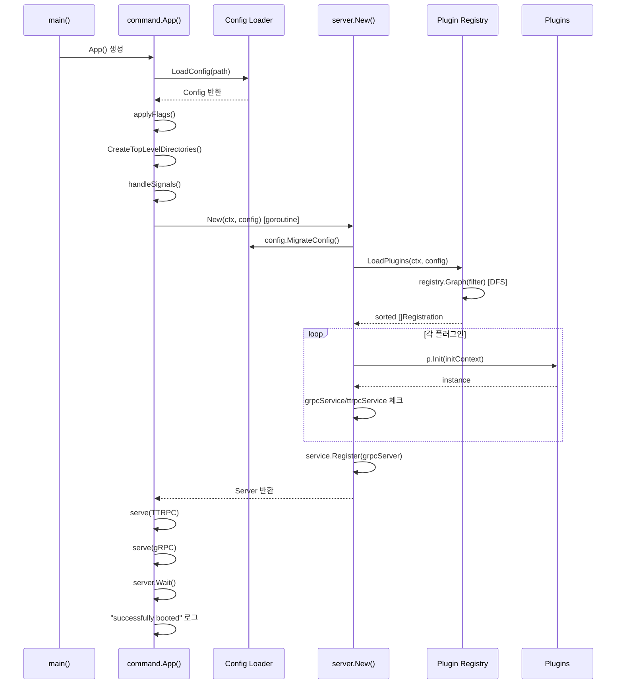

# containerd 아키텍처

## 1. 개요

containerd는 **산업 표준 컨테이너 런타임**으로서, 상위 시스템(Docker, Kubernetes, BuildKit 등)에 임베디드되어
컨테이너 라이프사이클 전체를 관리하는 **고성능 데몬**이다.

핵심 설계 철학:
- **단순성**: 컨테이너 런타임에 필요한 최소한의 기능만 제공
- **견고성**: 프로덕션 환경에서의 안정성과 복구 능력
- **이식성**: Linux, Windows, FreeBSD 지원
- **임베디드 사용**: 직접 사용이 아닌 상위 플랫폼의 백엔드로 설계

```
소스 참조: containerd/README.md (Line 12)
"containerd is an industry-standard container runtime with an emphasis on
 simplicity, robustness, and portability"
```

---

## 2. 전체 아키텍처

### 2.1 클라이언트-서버 모델

containerd는 **gRPC 기반 클라이언트-서버 아키텍처**를 채택한다.
데몬(서버)이 Unix 소켓이나 TCP를 통해 gRPC API를 노출하고, 클라이언트가 이를 호출하는 구조이다.

```
+------------------------------------------------------------------+
|                          클라이언트 계층                           |
|  +----------+  +-----------+  +-------------+  +---------------+ |
|  | ctr CLI  |  | Docker    |  | Kubernetes  |  | Go Client Lib | |
|  | (cmd/ctr)|  | Engine    |  | kubelet CRI |  | (client/)     | |
|  +----+-----+  +-----+-----+  +------+------+  +-------+------+ |
|       |              |               |                  |        |
+-------+--------------+---------------+------------------+--------+
        |              |               |                  |
        v              v               v                  v
+------------------------------------------------------------------+
|                    gRPC / TTRPC API 계층                          |
|  +-----------+ +----------+ +----------+ +---------+ +---------+ |
|  |Containers | |  Images  | | Snapshots| |  Tasks  | | Content | |
|  |  Service  | | Service  | | Service  | | Service | | Service | |
|  +-----------+ +----------+ +----------+ +---------+ +---------+ |
+------------------------------------------------------------------+
        |              |               |          |          |
        v              v               v          v          v
+------------------------------------------------------------------+
|                     핵심 서브시스템 계층                           |
|  +----------+ +----------+ +----------+ +--------+ +-----------+ |
|  |Container | | Image    | |Snapshot- | |Runtime | |  Content  | |
|  |  Store   | |  Store   | |  ter     | |(Shim)  | |   Store   | |
|  +----------+ +----------+ +----------+ +--------+ +-----------+ |
|  +----------+ +----------+ +----------+ +--------+ +-----------+ |
|  | Metadata | |  Event   | |  Lease   | |  GC    | | Transfer  | |
|  |   (DB)   | | Exchange | | Manager  | |Sched.  | |  Service  | |
|  +----------+ +----------+ +----------+ +--------+ +-----------+ |
+------------------------------------------------------------------+
        |              |               |          |
        v              v               v          v
+------------------------------------------------------------------+
|                     저수준 인프라 계층                             |
|  +----------+ +----------+ +----------+ +--------+               |
|  |  BoltDB  | | overlay  | |  runc    | | OCI    |               |
|  |          | | btrfs    | |          | | Dist.  |               |
|  |          | | zfs      | |          | | Spec   |               |
|  +----------+ +----------+ +----------+ +--------+               |
+------------------------------------------------------------------+
```

### 2.2 4개의 리스너

containerd 데몬은 **4개의 네트워크 리스너**를 동시에 운영한다.

```
소스 참조: cmd/containerd/command/main.go (Line 267~295)
```

| 리스너 | 프로토콜 | 용도 | 기본 주소 |
|--------|---------|------|----------|
| **gRPC** | gRPC over Unix Socket | 메인 API (컨테이너, 이미지, 스냅샷 등) | `/run/containerd/containerd.sock` |
| **TTRPC** | TTRPC over Unix Socket | 경량 Shim 통신 (TTRPC는 gRPC보다 메모리 효율적) | `{grpc}.ttrpc` |
| **Metrics** | HTTP | Prometheus 메트릭 노출 | 설정에 따름 (TCP) |
| **Debug** | HTTP | pprof 디버그 엔드포인트 | 설정에 따름 |

```
cmd/containerd/command/main.go에서의 리스너 설정 순서:

1. Debug 리스너 (선택적)
   → server.ServeDebug(l)     // /debug/pprof/ 등

2. Metrics 리스너 (선택적)
   → server.ServeMetrics(l)   // /v1/metrics

3. TTRPC 리스너 (필수)
   → server.ServeTTRPC(tl)    // Shim 통신

4. TCP gRPC 리스너 (선택적)
   → server.ServeTCP(l)       // 원격 gRPC (TLS 지원)

5. Unix gRPC 리스너 (필수)
   → server.ServeGRPC(l)      // 메인 API
```

### 2.3 Server 구조체

```
소스 참조: cmd/containerd/server/server.go (Line 402~411)
```

```go
// Server is the containerd main daemon
type Server struct {
    prometheusServerMetrics *grpc_prometheus.ServerMetrics
    grpcServer              *grpc.Server       // 메인 gRPC 서버
    ttrpcServer             *ttrpc.Server      // TTRPC 서버 (Shim 통신)
    tcpServer               *grpc.Server       // TCP gRPC 서버 (원격)
    config                  *srvconfig.Config   // 설정
    plugins                 []*plugin.Plugin    // 로드된 플러그인 목록
    ready                   sync.WaitGroup      // 준비 완료 대기
}
```

Server는 3개의 gRPC/TTRPC 서버를 내장하며, 초기화된 플러그인 목록을 관리한다.
`ready` WaitGroup은 모든 플러그인이 준비 완료될 때까지 대기하는 데 사용된다.

---

## 3. 플러그인 시스템

containerd의 핵심 설계 원칙은 **"모든 것이 플러그인"**이다.
Content Store, Snapshotter, Runtime, GC, Event 등 모든 서브시스템이 플러그인으로 구현된다.

### 3.1 플러그인 타입

```
소스 참조: plugins/types.go (Line 25~84)
```

| 타입 | URI | 역할 |
|------|-----|------|
| `InternalPlugin` | `io.containerd.internal.v1` | 내부 플러그인 (opt, restart) |
| `RuntimePlugin` | `io.containerd.runtime.v1` | 런타임 v1 (deprecated) |
| `RuntimePluginV2` | `io.containerd.runtime.v2` | 런타임 v2 (Shim 관리) |
| `ServicePlugin` | `io.containerd.service.v1` | 내부 서비스 |
| `GRPCPlugin` | `io.containerd.grpc.v1` | gRPC 서비스 |
| `TTRPCPlugin` | `io.containerd.ttrpc.v1` | TTRPC Shim 서비스 |
| `SnapshotPlugin` | `io.containerd.snapshotter.v1` | 스냅샷 관리 (overlay, btrfs 등) |
| `DiffPlugin` | `io.containerd.differ.v1` | 레이어 Diff 계산 |
| `MetadataPlugin` | `io.containerd.metadata.v1` | 메타데이터 저장소 (BoltDB) |
| `ContentPlugin` | `io.containerd.content.v1` | 콘텐츠 저장소 |
| `GCPlugin` | `io.containerd.gc.v1` | 가비지 컬렉션 |
| `EventPlugin` | `io.containerd.event.v1` | 이벤트 처리 |
| `LeasePlugin` | `io.containerd.lease.v1` | 리스 관리 |
| `StreamingPlugin` | `io.containerd.streaming.v1` | 스트림 관리 |
| `TransferPlugin` | `io.containerd.transfer.v1` | 전송 서비스 |
| `SandboxStorePlugin` | `io.containerd.sandbox.store.v1` | 샌드박스 저장소 |
| `SandboxControllerPlugin` | `io.containerd.sandbox.controller.v1` | 샌드박스 컨트롤러 |
| `CRIServicePlugin` | `io.containerd.cri.v1` | CRI 서비스 |
| `ShimPlugin` | `io.containerd.shim.v1` | Shim 서비스 |
| `NRIApiPlugin` | `io.containerd.nri.v1` | NRI(Node Resource Interface) |
| `ImageVerifierPlugin` | `io.containerd.image-verifier.v1` | 이미지 검증 |
| `WarningPlugin` | `io.containerd.warning.v1` | 경고 서비스 |

### 3.2 플러그인 등록 (Registration)

각 플러그인은 `plugin.Registration` 구조체를 통해 자신을 등록한다.

```go
// github.com/containerd/plugin 패키지
type Registration struct {
    Type       Type                      // 플러그인 타입 URI
    ID         string                    // 고유 ID
    Requires   []Type                    // 의존하는 플러그인 타입 목록
    InitFn     func(*InitContext) (interface{}, error)  // 초기화 함수
    Config     interface{}               // 플러그인별 설정 구조체
    ConfigMigration func(context.Context, int, map[string]interface{}) error
}
```

### 3.3 DFS 의존성 해석

플러그인 로딩은 `registry.Graph()` 함수를 통해 **DFS(깊이 우선 탐색) 기반 토폴로지 정렬**로 수행된다.

```
소스 참조: cmd/containerd/server/server.go (Line 156~157)
  loaded, err := LoadPlugins(ctx, config)

소스 참조: cmd/containerd/server/server.go (Line 567)
  return registry.Graph(filter(config.DisabledPlugins)), nil
```

```
플러그인 의존성 그래프 예시:

    ContentPlugin ──────────────────┐
                                    v
    SnapshotPlugin ──────────> MetadataPlugin ──────> GCPlugin
                                    │
    EventPlugin ───────────────────>│
                                    v
    RuntimePluginV2 ──────────> ServicePlugin
                                    │
                                    v
                              GRPCPlugin (서비스 노출)
```

DFS 해석 과정:
1. 모든 등록된 `Registration`을 수집
2. `Requires` 필드를 기반으로 의존성 그래프 구성
3. DFS 토폴로지 정렬으로 초기화 순서 결정
4. 비활성화(`DisabledPlugins`)된 플러그인 제외
5. 정렬된 순서대로 `Registration` 목록 반환

### 3.4 Builtin 플러그인 등록

containerd는 Go의 `import _` (blank import) 패턴을 사용하여 컴파일 타임에 내장 플러그인을 등록한다.

```
소스 참조: cmd/containerd/builtins/builtins.go (Line 20~52)
```

```go
package builtins

import (
    _ "github.com/containerd/containerd/v2/core/runtime/v2"           // RuntimeV2
    _ "github.com/containerd/containerd/v2/plugins/content/local/plugin" // Content Store
    _ "github.com/containerd/containerd/v2/plugins/events"             // Event Exchange
    _ "github.com/containerd/containerd/v2/plugins/gc"                 // GC Scheduler
    _ "github.com/containerd/containerd/v2/plugins/metadata"           // Metadata (BoltDB)
    _ "github.com/containerd/containerd/v2/plugins/sandbox"            // Sandbox Controller
    _ "github.com/containerd/containerd/v2/plugins/services/containers" // Containers Service
    _ "github.com/containerd/containerd/v2/plugins/services/content"   // Content Service
    _ "github.com/containerd/containerd/v2/plugins/services/tasks"     // Tasks Service
    _ "github.com/containerd/containerd/v2/plugins/transfer"           // Transfer Service
    // ... 30여 개 플러그인
)
```

각 패키지의 `init()` 함수에서 `registry.Register()`를 호출하여 플러그인을 등록한다.
`main.go`에서 `_ "github.com/containerd/containerd/v2/cmd/containerd/builtins"`를 import하면
모든 내장 플러그인이 자동으로 등록된다.

---

## 4. Shim v2 아키텍처

### 4.1 Shim의 역할

Shim은 containerd와 실제 컨테이너 프로세스(runc 등) 사이의 **중간 관리자**이다.
containerd 데몬이 재시작되어도 컨테이너가 계속 실행될 수 있도록 **프로세스를 격리**한다.

```
+------------------+        +-------------------+        +----------+
|                  | TTRPC  |                   | exec   |          |
|   containerd     |------->| containerd-shim-  |------->|   runc   |
|   데몬           |<-------|   runc-v2         |<-------|          |
|                  |        |                   |        +----------+
+------------------+        +-------------------+             |
                                     |                        v
                                     |                 +----------+
                                     +---------------->| container|
                                       stdin/stdout    | process  |
                                       감시            +----------+
```

### 4.2 Shim v2 통신 프로토콜

| 통신 경로 | 프로토콜 | 용도 |
|-----------|---------|------|
| containerd → Shim | **TTRPC** | Task 생성/시작/종료/삭제, 프로세스 관리 |
| Shim → runc | **exec** | 컨테이너 프로세스 생성 (fork/exec) |
| Shim → containerd | **TTRPC** | 이벤트 전달 (Exit, OOM 등) |
| 클라이언트 → containerd | **gRPC** | Task API 호출 |

TTRPC를 사용하는 이유:
- gRPC 대비 **메모리 사용량 50% 이상 절감** (HTTP/2 프레이밍 불필요)
- 각 컨테이너마다 Shim 프로세스가 생성되므로 메모리 효율이 중요
- Protobuf 직렬화는 그대로 유지하여 타입 안전성 보장

### 4.3 Shim 수명 주기

```
1. Task.Create 요청
   containerd가 shim 바이너리를 실행:
   containerd-shim-runc-v2 -namespace <ns> -id <id> -address <ttrpc.sock>

2. Shim 초기화
   - TTRPC 서버 시작
   - containerd에 주소 보고 (BootstrapParams)

3. 컨테이너 생성/시작
   containerd → Shim (TTRPC): Create → Start
   Shim → runc: runc create → runc start

4. 컨테이너 실행 중
   - Shim이 컨테이너 프로세스 감시
   - I/O(stdin/stdout/stderr) 릴레이
   - OOM 이벤트 감지 및 전달

5. 컨테이너 종료
   - 프로세스 exit → Shim이 exit 상태 수집
   - TaskExit 이벤트를 containerd에 전달

6. Shim 정리
   containerd → Shim (TTRPC): Delete
   Shim이 리소스 정리 후 자체 종료
```

---

## 5. 초기화 흐름

### 5.1 전체 시작 시퀀스

containerd 데몬의 시작부터 서비스 준비까지의 흐름이다.

```
소스 참조: cmd/containerd/main.go (Line 28~34)
소스 참조: cmd/containerd/command/main.go (Line 128~313)
소스 참조: cmd/containerd/server/server.go (Line 131~377)
```

```
main()
  │
  ├─ command.App()
  │    │
  │    ├─ 1. config 로드
  │    │    └─ srvconfig.LoadConfig(ctx, configPath, config)
  │    │         ├─ TOML 파일 파싱
  │    │         ├─ imports 재귀 로드
  │    │         └─ config merge
  │    │
  │    ├─ 2. 플래그 적용
  │    │    └─ applyFlags(cliContext, config)
  │    │         ├─ root, state, address 오버라이드
  │    │         └─ log level 설정
  │    │
  │    ├─ 3. TTRPC 주소 기본값
  │    │    └─ config.TTRPC.Address = config.GRPC.Address + ".ttrpc"
  │    │
  │    ├─ 4. 최상위 디렉토리 생성
  │    │    └─ server.CreateTopLevelDirectories(config)
  │    │         ├─ config.Root (0700)   → 영구 데이터
  │    │         └─ config.State (0711)  → 임시 데이터
  │    │
  │    ├─ 5. 시그널 핸들러 시작
  │    │    └─ handleSignals(ctx, signals, serverC, cancel)
  │    │
  │    ├─ 6. 임시 마운트 정리
  │    │    └─ mount.CleanupTempMounts(0)
  │    │
  │    └─ 7. 서버 초기화 (별도 고루틴)
  │         └─ server.New(ctx, config)
  │              │
  │              ├─ config 마이그레이션 (v1→v2→v3)
  │              ├─ timeout 설정
  │              ├─ LoadPlugins(ctx, config)
  │              │    ├─ ProxyPlugin 등록
  │              │    └─ registry.Graph(filter) → DFS 정렬
  │              │
  │              ├─ gRPC 서버 생성 (인터셉터 포함)
  │              │    ├─ streamNamespaceInterceptor
  │              │    ├─ unaryNamespaceInterceptor
  │              │    └─ prometheusServerMetrics
  │              │
  │              ├─ TTRPC 서버 생성
  │              │
  │              ├─ 플러그인 순차 초기화
  │              │    for _, p := range loaded:
  │              │      ├─ InitContext 생성 (rootDir, stateDir, grpcAddr, ttrpcAddr)
  │              │      ├─ config.Decode() → 플러그인별 설정
  │              │      ├─ p.Init(initContext) → 플러그인 초기화
  │              │      ├─ 결과에서 grpcService/ttrpcService 인터페이스 확인
  │              │      └─ 서비스 목록에 추가
  │              │
  │              └─ 서비스 등록
  │                   ├─ grpcService.Register(grpcServer)
  │                   ├─ ttrpcService.RegisterTTRPC(ttrpcServer)
  │                   └─ tcpService.RegisterTCP(tcpServer)
  │
  ├─ 8. 리스너 시작
  │    ├─ Debug 리스너 (선택)
  │    ├─ Metrics 리스너 (선택)
  │    ├─ TTRPC 리스너
  │    ├─ TCP gRPC 리스너 (선택)
  │    └─ Unix gRPC 리스너
  │
  └─ 9. Ready 대기 및 알림
       ├─ server.Wait() → 모든 플러그인 Ready
       ├─ notifyReady(ctx) → systemd notify
       └─ "containerd successfully booted" 로그
```

### 5.2 서비스 인터페이스

플러그인 초기화 후, 각 플러그인이 구현하는 인터페이스에 따라 적절한 서버에 등록된다.

```
소스 참조: cmd/containerd/server/server.go (Line 231~243)
```

```go
// gRPC 서비스: 메인 API 노출
type grpcService interface {
    Register(*grpc.Server) error
}

// TCP 서비스: 원격 API 노출
type tcpService interface {
    RegisterTCP(*grpc.Server) error
}

// TTRPC 서비스: Shim 통신용
type ttrpcService interface {
    RegisterTTRPC(*ttrpc.Server) error
}
```

### 5.3 초기화 흐름 다이어그램



---

## 6. 네임스페이스 격리

containerd는 **단일 데몬**에서 여러 클라이언트의 리소스를 격리하기 위해 **네임스페이스** 개념을 사용한다.

### 6.1 네임스페이스 용도

| 클라이언트 | 기본 네임스페이스 | 용도 |
|-----------|-----------------|------|
| Docker | `moby` | Docker 컨테이너/이미지 |
| Kubernetes | `k8s.io` | Pod, 컨테이너 |
| ctr CLI | `default` | 디버깅, 테스트 |
| BuildKit | `buildkit` | 이미지 빌드 |

### 6.2 네임스페이스 인터셉터

gRPC 요청마다 **Unary/Stream 인터셉터**가 네임스페이스를 컨텍스트에 주입한다.

```
소스 참조: cmd/containerd/server/server.go (Line 175~182)
```

```go
serverOpts := []grpc.ServerOption{
    grpc.ChainStreamInterceptor(
        streamNamespaceInterceptor,     // 스트림 요청 네임스페이스 주입
        prometheusServerMetrics.StreamServerInterceptor(),
    ),
    grpc.ChainUnaryInterceptor(
        unaryNamespaceInterceptor,      // 단항 요청 네임스페이스 주입
        prometheusServerMetrics.UnaryServerInterceptor(),
    ),
}
```

### 6.3 BoltDB 네임스페이스 격리

메타데이터는 BoltDB에 네임스페이스별 버킷으로 격리 저장된다.

```
BoltDB 버킷 구조:

v1/                          ← 스키마 버전
├── default/                 ← 네임스페이스 "default"
│   ├── containers/
│   │   └── {container-id}/
│   ├── images/
│   │   └── {image-name}/
│   ├── snapshots/
│   │   └── {snapshotter}/
│   └── content/
│       └── {digest}/
├── moby/                    ← 네임스페이스 "moby" (Docker)
│   ├── containers/
│   ├── images/
│   └── ...
└── k8s.io/                  ← 네임스페이스 "k8s.io" (Kubernetes)
    ├── containers/
    ├── images/
    └── ...
```

---

## 7. gRPC 서비스 목록

containerd가 노출하는 주요 gRPC 서비스이다.

```
소스 참조: api/services/ 디렉토리
```

| 서비스 | Proto 경로 | 주요 RPC |
|--------|-----------|----------|
| **Containers** | `api/services/containers/` | Get, List, Create, Update, Delete |
| **Content** | `api/services/content/` | Info, Update, List, Delete, Read, Write |
| **Diff** | `api/services/diff/` | Apply, Diff |
| **Events** | `api/services/events/` | Publish, Forward, Subscribe |
| **Images** | `api/services/images/` | Get, List, Create, Update, Delete |
| **Introspection** | `api/services/introspection/` | Plugins, Server |
| **Leases** | `api/services/leases/` | Create, Delete, List, AddResource, DeleteResource |
| **Mounts** | `api/services/mounts/` | Mount, Unmount |
| **Namespaces** | `api/services/namespaces/` | Get, List, Create, Update, Delete |
| **Sandbox** | `api/services/sandbox/` | Create, Start, Stop, Wait, Status, Shutdown |
| **Snapshots** | `api/services/snapshots/` | Prepare, View, Mounts, Commit, Remove, Stat, Walk |
| **Streaming** | `api/services/streaming/` | Stream |
| **Tasks** | `api/services/tasks/` | Create, Start, Delete, Kill, Exec, Pause, Resume |
| **Transfer** | `api/services/transfer/` | Transfer |
| **Version** | `api/services/version/` | Version |

---

## 8. 핵심 설계 원칙

### 8.1 Content Addressable Storage

containerd의 Content Store는 **digest(SHA-256 해시) 기반의 주소 지정 가능한 저장소**이다.
모든 콘텐츠(이미지 매니페스트, 설정, 레이어)가 해시값으로 식별되어 **무결성 보장**과 **중복 제거**가 자동으로 이루어진다.

### 8.2 Immutable Layers + CoW

이미지 레이어는 Committed 스냅샷으로 저장되어 **불변(immutable)**이며,
컨테이너 실행 시 Snapshotter가 **Copy-on-Write** 레이어를 Prepare하여 쓰기 가능한 층을 제공한다.

### 8.3 Lease 기반 GC 보호

진행 중인 작업(이미지 Pull, 컨테이너 생성 등)의 리소스가 GC에 의해 삭제되지 않도록
**Lease**로 리소스를 보호한다. Lease에는 만료 시간을 설정할 수 있으며,
만료된 Lease의 리소스는 다음 GC 사이클에서 정리된다.

### 8.4 플러그인 확장성

모든 핵심 기능이 플러그인으로 구현되어 있으므로,
커스텀 Snapshotter, Runtime, Content Store 등을 **외부 플러그인으로 교체**할 수 있다.
ProxyPlugin을 통해 별도 프로세스로 동작하는 원격 플러그인도 지원한다.

---

## 9. 요약

```
+------------------------------------------------------------------+
|                     containerd 아키텍처 요약                      |
+------------------------------------------------------------------+
|                                                                    |
|  [진입점]     main() → command.App() → server.New()               |
|                                                                    |
|  [설정]       TOML config v3, import 체인, 플래그 오버라이드       |
|                                                                    |
|  [플러그인]   30+ 타입, DFS 의존성 해석, blank import 등록         |
|                                                                    |
|  [서버]       gRPC(메인) + TTRPC(Shim) + TCP(원격) + HTTP(메트릭)  |
|                                                                    |
|  [런타임]     Shim v2 → runc, TTRPC 통신, 프로세스 격리            |
|                                                                    |
|  [저장소]     Content(digest) + Snapshot(CoW) + Metadata(BoltDB)   |
|                                                                    |
|  [격리]       네임스페이스(moby, k8s.io, default 등)               |
|                                                                    |
|  [보호]       Lease 기반 GC 보호, Tricolor Mark-and-Sweep          |
|                                                                    |
+------------------------------------------------------------------+
```
