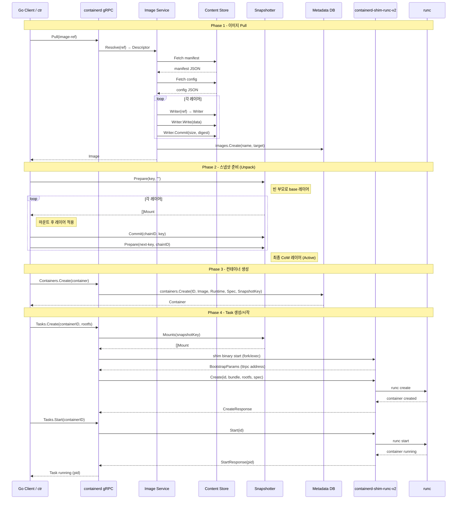
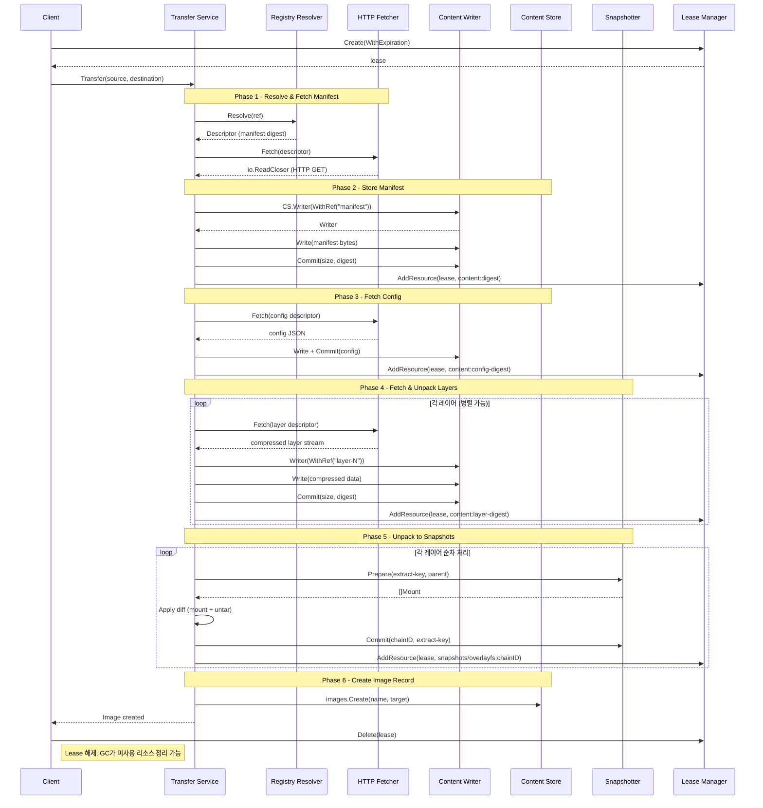
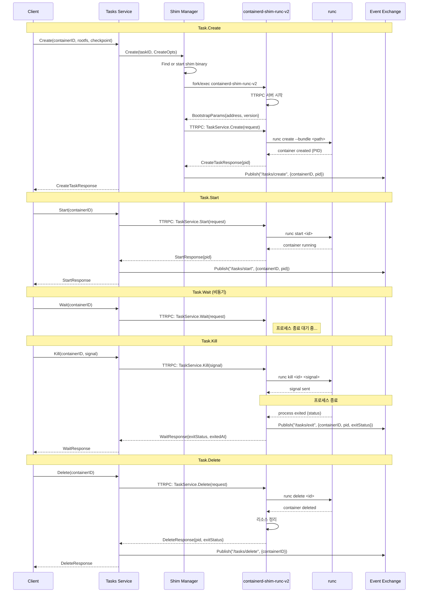
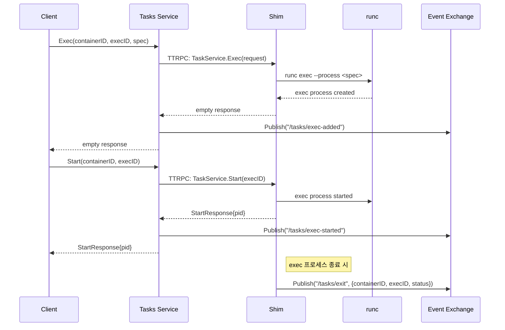
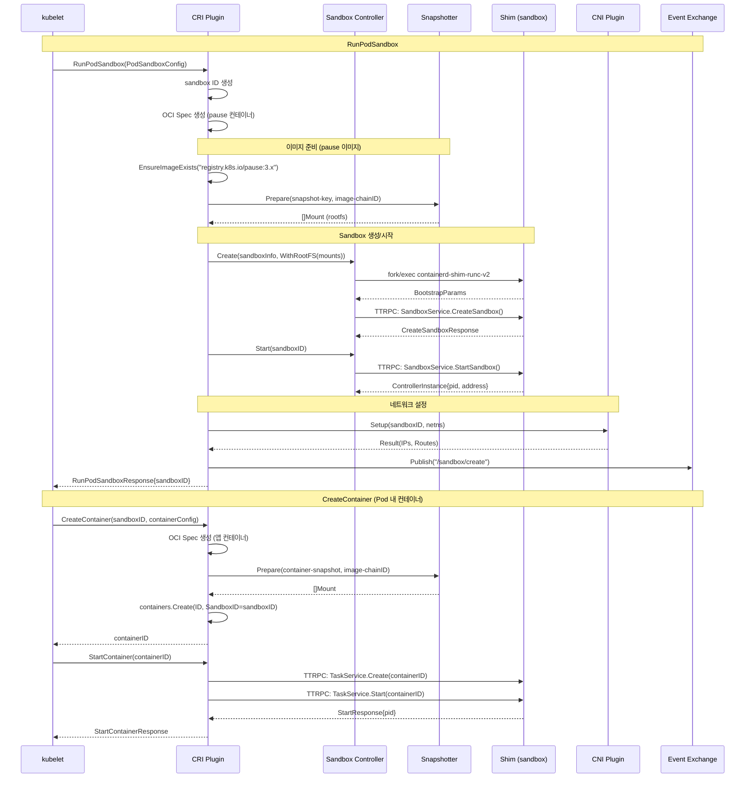
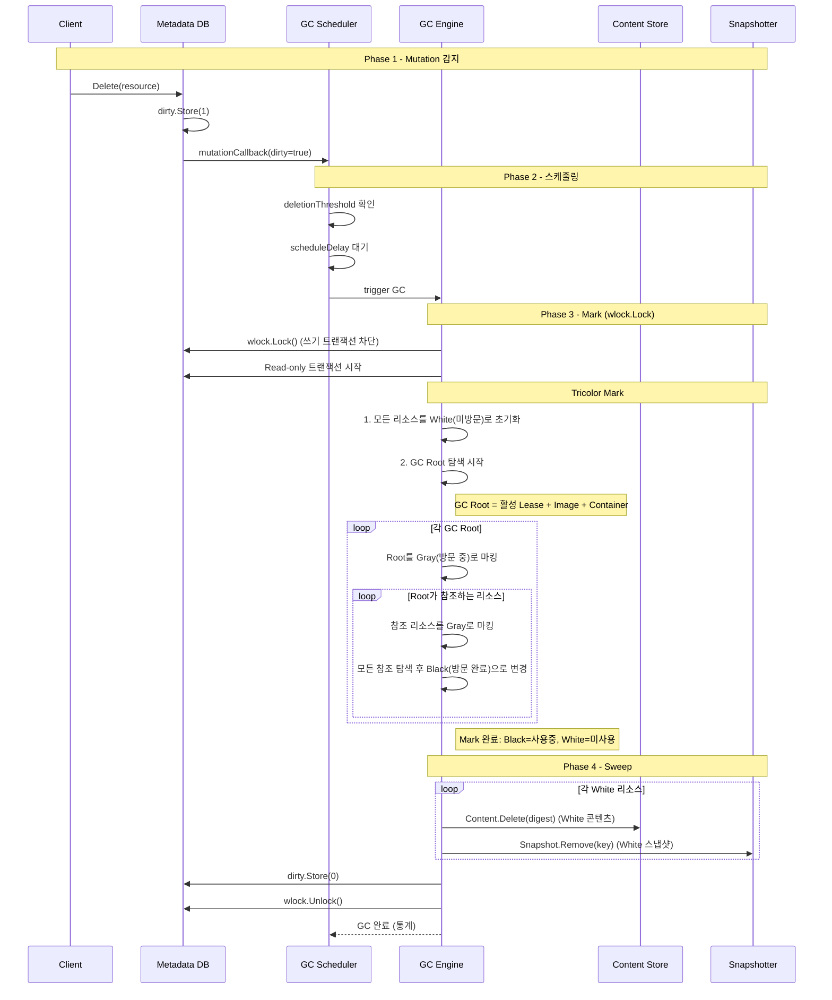
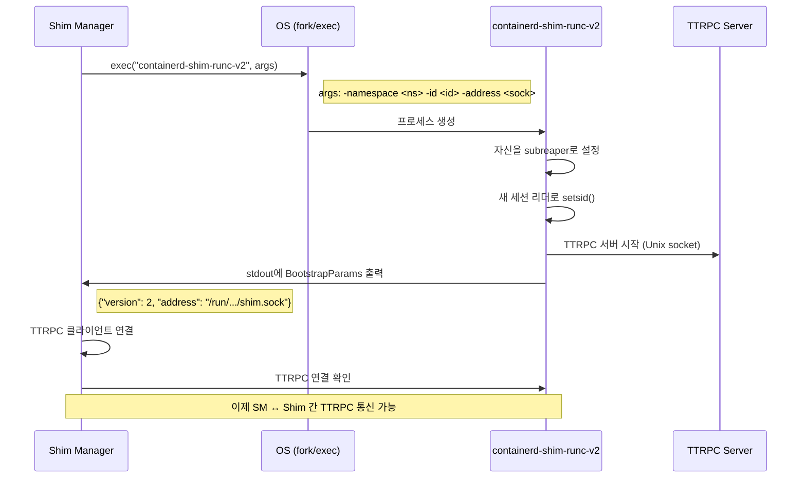
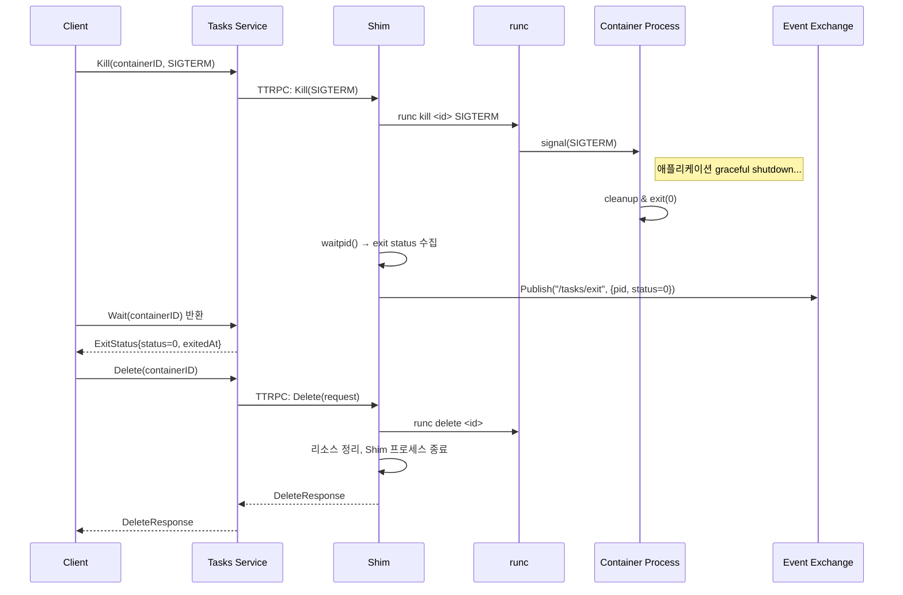
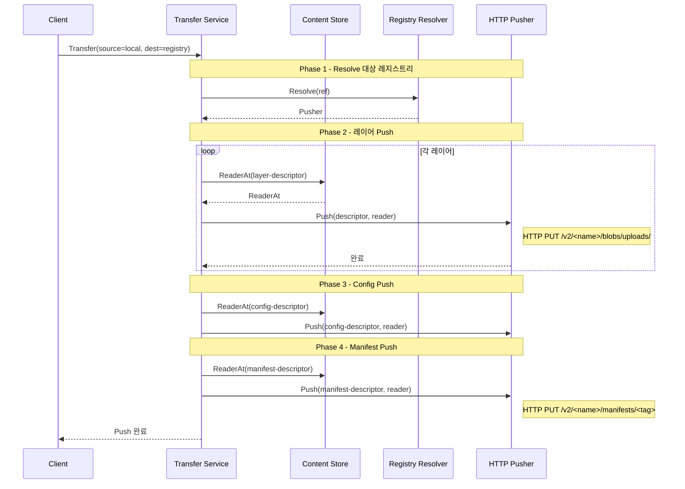

# containerd 시퀀스 다이어그램

## 1. 개요

이 문서는 containerd의 **주요 유즈케이스 흐름**을 Mermaid 시퀀스 다이어그램과 ASCII 다이어그램으로 설명한다.
각 흐름은 실제 소스코드에서 추적한 **호출 경로**를 기반으로 작성되었다.

### 다이어그램 목록

| 번호 | 흐름 | 핵심 컴포넌트 |
|------|------|-------------|
| 1 | 컨테이너 생성 (전체 흐름) | Client → gRPC → Snapshotter → Shim → runc |
| 2 | 이미지 Pull | Client → Transfer → Resolver → Fetcher → Content → Snapshot |
| 3 | Task 실행 (Start) | Client → gRPC → Shim(TTRPC) → runc |
| 4 | CRI RunPodSandbox | kubelet → CRI Plugin → Sandbox → Shim → CNI |
| 5 | GC (Garbage Collection) | Mutation → Scheduler → Tricolor Mark → Sweep |

---

## 2. 컨테이너 생성 흐름

### 2.1 전체 과정 개요

컨테이너 생성은 크게 4단계로 구성된다:
1. **이미지 Pull** → Content Store에 blob 저장
2. **스냅샷 준비** → Snapshotter로 CoW rootfs 생성
3. **컨테이너 메타데이터 생성** → BoltDB에 저장
4. **Task 생성/시작** → Shim → runc → 컨테이너 프로세스

### 2.2 시퀀스 다이어그램



### 2.3 ASCII 흐름도

```
Client                containerd (gRPC)        Snapshotter          Shim              runc
  │                        │                      │                  │                  │
  │──Pull(ref)────────────>│                      │                  │                  │
  │                        │──Resolve(ref)───────>│                  │                  │
  │                        │<─Descriptor──────────│                  │                  │
  │                        │──Fetch layers──────> Content Store      │                  │
  │                        │<─layers stored───────│                  │                  │
  │<─Image─────────────────│                      │                  │                  │
  │                        │                      │                  │                  │
  │──Unpack────────────────│─Prepare(key,"")─────>│                  │                  │
  │                        │<─[]Mount─────────────│                  │                  │
  │                        │──apply layer─────────│                  │                  │
  │                        │──Commit(chainID,key)>│                  │                  │
  │                        │  (반복: 각 레이어)    │                  │                  │
  │                        │                      │                  │                  │
  │──Container.Create──────│                      │                  │                  │
  │                        │──BoltDB write───────>│                  │                  │
  │<─Container─────────────│                      │                  │                  │
  │                        │                      │                  │                  │
  │──Task.Create───────────│                      │                  │                  │
  │                        │──Mounts(key)────────>│                  │                  │
  │                        │<─[]Mount─────────────│                  │                  │
  │                        │──fork/exec──────────────────────────────│                  │
  │                        │<─BootstrapParams────────────────────────│                  │
  │                        │──TTRPC:Create(spec)─────────────────────│                  │
  │                        │                                         │──runc create────>│
  │                        │                                         │<─created─────────│
  │                        │<─CreateResponse─────────────────────────│                  │
  │                        │                                         │                  │
  │──Task.Start────────────│                                         │                  │
  │                        │──TTRPC:Start────────────────────────────│                  │
  │                        │                                         │──runc start─────>│
  │                        │                                         │<─running─────────│
  │                        │<─StartResponse(pid)─────────────────────│                  │
  │<─Task running──────────│                                         │                  │
```

---

## 3. 이미지 Pull 흐름

### 3.1 Transfer 기반 Pull (v2)

containerd v2에서는 Transfer 서비스를 통해 이미지를 Pull한다.



### 3.2 레이어 Unpack 상세

```
이미지: nginx:latest (3개 레이어)

Content Store (digest 기반)           Snapshotter (overlay)
+---------------------------+        +---------------------------+
| sha256:aaa (manifest)     |        |                           |
| sha256:bbb (config)       |        | "" (빈 부모)              |
| sha256:ccc (layer 1)      |───────>│  │                        |
| sha256:ddd (layer 2)      |───────>│  ├─ layer-1 [Committed]   |
| sha256:eee (layer 3)      |───────>│  │   ├─ layer-2 [Committed]|
+---------------------------+        │  │   │   └─ layer-3 [Committed]
                                     │  │   │       │             |
                                     │  │   │       └─ container  |
                                     │  │   │          [Active]   |
                                     +--+---+---------------------+

ChainID 계산:
  chainID_1 = sha256(diffID_1)
  chainID_2 = sha256(chainID_1 + " " + diffID_2)
  chainID_3 = sha256(chainID_2 + " " + diffID_3)
```

---

## 4. Task 실행 흐름

### 4.1 Task Create → Start → Wait → Kill → Delete



### 4.2 Exec (추가 프로세스 실행)



---

## 5. CRI RunPodSandbox 흐름

### 5.1 Kubernetes CRI 연동

kubelet은 containerd의 CRI 플러그인을 통해 Pod을 관리한다.
RunPodSandbox는 Pod의 격리 환경(네트워크 네임스페이스, pause 컨테이너)을 생성한다.



### 5.2 CRI 호출 흐름 ASCII

```
kubelet                CRI Plugin           Sandbox Controller      CNI
  │                       │                       │                  │
  │──RunPodSandbox───────>│                       │                  │
  │                       │──EnsureImage──────────│                  │
  │                       │──Prepare(rootfs)──────│                  │
  │                       │                       │                  │
  │                       │──SB.Create────────────│                  │
  │                       │──SB.Start─────────────│                  │
  │                       │                       │──shim start────>│
  │                       │                       │<─address─────────│
  │                       │                       │                  │
  │                       │──CNI.Setup────────────│──────────────────│
  │                       │<─IPs, Routes──────────│──────────────────│
  │<─sandboxID────────────│                       │                  │
  │                       │                       │                  │
  │──CreateContainer─────>│                       │                  │
  │                       │──Prepare(snapshot)────│                  │
  │                       │──containers.Create────│                  │
  │<─containerID──────────│                       │                  │
  │                       │                       │                  │
  │──StartContainer──────>│                       │                  │
  │                       │──Task.Create──────────│──TTRPC──────────>│
  │                       │──Task.Start───────────│──TTRPC──────────>│
  │<─StartResponse────────│                       │                  │
```

---

## 6. GC (Garbage Collection) 흐름

### 6.1 GC 트리거와 실행

containerd의 GC는 **Tricolor Mark-and-Sweep 알고리즘**을 사용한다.
Mutation(삭제 등)이 발생하면 GC Scheduler가 적절한 시점에 GC를 트리거한다.

```
소스 참조: plugins/gc/scheduler.go (Line 35~90) - GC config
소스 참조: core/metadata/db.go (Line 78~115) - DB의 dirty 플래그와 wlock
```



### 6.2 Tricolor Mark 상세

```
Tricolor Mark-and-Sweep 알고리즘:

초기 상태 (모든 리소스 White):
  ┌─────────────────────────────────────────┐
  │ White (미방문)                           │
  │                                         │
  │  [image:nginx]  [content:sha256:aaa]    │
  │  [content:sha256:bbb]                   │
  │  [snap:layer-1]  [snap:layer-2]         │
  │  [content:sha256:orphan]  ← 미참조      │
  │  [snap:old-container]     ← 미참조      │
  └─────────────────────────────────────────┘

Mark 시작 (GC Root = Image:nginx):
  ┌──────────────────┐  ┌──────────────────┐  ┌──────────────────┐
  │ White (삭제 대상) │  │ Gray (탐색 중)    │  │ Black (보존)     │
  │                  │  │                  │  │                  │
  │ [content:orphan] │  │ [image:nginx]    │  │                  │
  │ [snap:old-ctr]   │  │                  │  │                  │
  └──────────────────┘  └──────────────────┘  └──────────────────┘

Mark 진행 (nginx의 참조 추적):
  ┌──────────────────┐  ┌──────────────────┐  ┌──────────────────┐
  │ White (삭제 대상) │  │ Gray (탐색 중)    │  │ Black (보존)     │
  │                  │  │                  │  │                  │
  │ [content:orphan] │  │ [content:aaa]    │  │ [image:nginx]    │
  │ [snap:old-ctr]   │  │ [content:bbb]    │  │                  │
  │                  │  │ [snap:layer-1]   │  │                  │
  │                  │  │ [snap:layer-2]   │  │                  │
  └──────────────────┘  └──────────────────┘  └──────────────────┘

Mark 완료:
  ┌──────────────────┐  ┌──────────────────┐  ┌──────────────────┐
  │ White (삭제 대상) │  │ Gray (없음)      │  │ Black (보존)     │
  │                  │  │                  │  │                  │
  │ [content:orphan] │  │                  │  │ [image:nginx]    │
  │ [snap:old-ctr]   │  │                  │  │ [content:aaa]    │
  │                  │  │                  │  │ [content:bbb]    │
  │                  │  │                  │  │ [snap:layer-1]   │
  │                  │  │                  │  │ [snap:layer-2]   │
  └──────────────────┘  └──────────────────┘  └──────────────────┘

Sweep: White 리소스 삭제
  → content:orphan 삭제
  → snap:old-ctr 삭제
```

### 6.3 GC Root 정의

| Root 타입 | 보호 대상 | 설명 |
|-----------|----------|------|
| **Image** | manifest → config → layers | 이미지가 존재하면 관련 콘텐츠/스냅샷 보호 |
| **Container** | snapshotKey → 스냅샷 체인 | 컨테이너가 존재하면 rootfs 스냅샷 보호 |
| **Lease** | lease.resources[] | 명시적으로 보호된 리소스 |
| **Active Ingestion** | ingest ref | 진행 중인 쓰기 작업의 콘텐츠 보호 |

### 6.4 GC Scheduler 설정

```
소스 참조: plugins/gc/scheduler.go (Line 35~90)
```

| 설정 | 기본값 | 설명 |
|------|--------|------|
| `pause_threshold` | 0.02 (2%) | GC 일시정지가 전체 시간의 최대 N% |
| `deletion_threshold` | 0 | N번 삭제 후 GC 스케줄링 |
| `mutation_threshold` | 100 | N번 변경 후 다음 GC 시 실행 |
| `schedule_delay` | "0ms" | 트리거 후 GC 실행까지 지연 |
| `startup_delay` | "100ms" | 서버 시작 후 첫 GC까지 지연 |

---

## 7. Shim 시작 흐름 상세

### 7.1 Shim Binary 실행



### 7.2 Shim 프로세스 트리

```
containerd (PID 1000)
  │
  ├─ containerd-shim-runc-v2 (PID 2000) ← sandbox/container A
  │   └─ runc init → container PID 1 (PID 2001)
  │       ├─ app process (PID 2002)
  │       └─ sidecar (PID 2003)
  │
  └─ containerd-shim-runc-v2 (PID 3000) ← sandbox/container B
      └─ runc init → container PID 1 (PID 3001)

특징:
- 각 Shim은 독립 프로세스 (containerd 재시작 시 영향 없음)
- Shim이 subreaper로 설정되어 컨테이너 프로세스의 부모 역할
- containerd → Shim 통신은 TTRPC (경량)
```

---

## 8. 컨테이너 종료 흐름

### 8.1 Graceful Shutdown



### 8.2 Force Kill (Timeout 후)

```
시간 흐름:

t=0   SIGTERM 전송
      │
      │  (graceful shutdown 대기)
      │
t=10  타임아웃 → SIGKILL 전송
      │
t=10+ 프로세스 강제 종료
      │
      └─ exit status 수집 → /tasks/exit 이벤트
```

---

## 9. 이미지 Push 흐름



---

## 10. 전체 흐름 요약

```
┌─────────────────────────────────────────────────────────────────┐
│                    containerd 주요 흐름 요약                     │
├─────────────────────────────────────────────────────────────────┤
│                                                                 │
│  [이미지 Pull]                                                  │
│  Registry → Resolver → Fetcher → Content.Writer → Commit        │
│  → Snapshotter.Prepare → Apply Layer → Commit (각 레이어)       │
│  → images.Create                                                │
│                                                                 │
│  [컨테이너 생성]                                                │
│  Image → Snapshotter.Prepare(rootfs) → containers.Create(meta) │
│                                                                 │
│  [Task 실행]                                                    │
│  Task.Create → Shim(fork/exec) → TTRPC:Create → runc create    │
│  Task.Start → TTRPC:Start → runc start → 컨테이너 실행         │
│                                                                 │
│  [Task 종료]                                                    │
│  Task.Kill → TTRPC:Kill → runc kill → process exit              │
│  → /tasks/exit 이벤트 → Task.Delete → runc delete              │
│                                                                 │
│  [CRI Pod]                                                      │
│  RunPodSandbox → Sandbox.Create → Shim → CNI Setup             │
│  CreateContainer → Prepare(rootfs) → containers.Create          │
│  StartContainer → Task.Create → Task.Start                      │
│                                                                 │
│  [GC]                                                           │
│  Mutation → Scheduler → wlock.Lock → Tricolor Mark → Sweep     │
│  → Content.Delete + Snapshot.Remove → wlock.Unlock              │
│                                                                 │
└─────────────────────────────────────────────────────────────────┘
```
