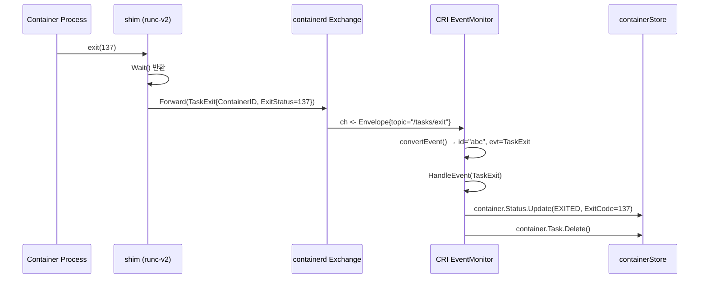
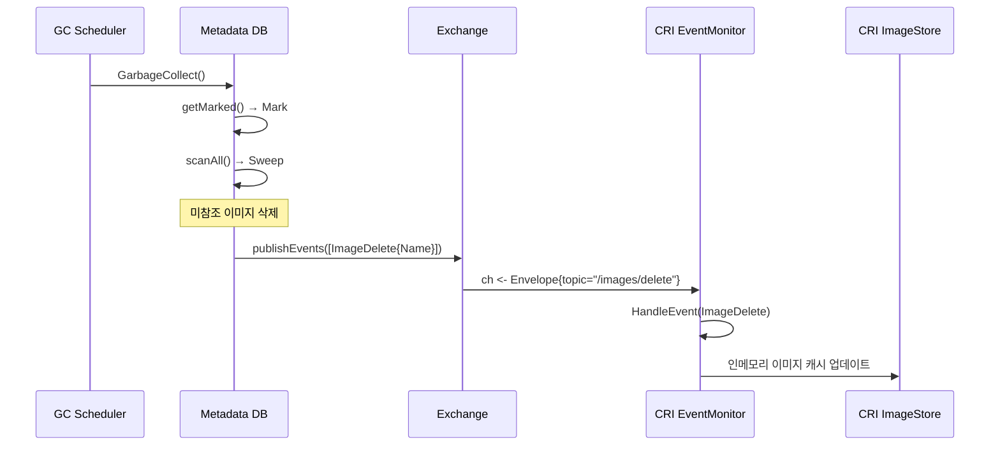

# 15. 이벤트 시스템 (Events System)

## 목차

1. [개요](#1-개요)
2. [이벤트 시스템 아키텍처](#2-이벤트-시스템-아키텍처)
3. [Envelope 구조](#3-envelope-구조)
4. [핵심 인터페이스](#4-핵심-인터페이스)
5. [Exchange 구현](#5-exchange-구현)
6. [토픽 구조와 이벤트 타입](#6-토픽-구조와-이벤트-타입)
7. [Subscribe 필터링](#7-subscribe-필터링)
8. [Forward: 외부 이벤트 수신](#8-forward-외부-이벤트-수신)
9. [CRI EventMonitor](#9-cri-eventmonitor)
10. [백오프 재시도 메커니즘](#10-백오프-재시도-메커니즘)
11. [이벤트 흐름 시퀀스](#11-이벤트-흐름-시퀀스)
12. [비동기 이벤트 처리 패턴](#12-비동기-이벤트-처리-패턴)
13. [메타데이터 DB와 이벤트](#13-메타데이터-db와-이벤트)
14. [왜 이렇게 설계했는가](#14-왜-이렇게-설계했는가)

---

## 1. 개요

containerd의 이벤트 시스템은 컨테이너 런타임에서 발생하는 모든 중요 상태 변경을 비동기적으로 전파하는 메커니즘이다. 컨테이너 생성/삭제, 이미지 풀/삭제, 태스크 시작/종료, OOM 등의 이벤트를 발행(Publish)하고, 관심 있는 컴포넌트가 구독(Subscribe)할 수 있다.

**핵심 소스 파일:**

| 파일 | 역할 |
|------|------|
| `core/events/events.go` | Envelope, Publisher, Subscriber, Forwarder 인터페이스 |
| `core/events/exchange/exchange.go` | Exchange 구현 (Broadcaster) |
| `internal/cri/server/events/events.go` | CRI EventMonitor, backOff |

---

## 2. 이벤트 시스템 아키텍처

```
+---------------------------------------------------------------+
|                      이벤트 발행자 (Publishers)                  |
|                                                                |
|  containerd 내부 서비스          shim 프로세스                   |
|  ├── Image Service              ├── TaskCreate                 |
|  ├── Container Service          ├── TaskStart                  |
|  ├── Content Service            ├── TaskExit                   |
|  ├── Snapshot Service           ├── TaskOOM                    |
|  └── Metadata/GC               └── TaskDelete                 |
|       |                              |                          |
|       v                              v                          |
|  Publish(ctx, topic, event)    Forward(ctx, envelope)          |
|       |                              |                          |
+-------+------------------------------+--------------------------+
        |                              |
        v                              v
+---------------------------------------------------------------+
|                     Exchange (Broadcaster)                      |
|                                                                |
|  +----------------------------------------------------------+ |
|  |              go-events Broadcaster                        | |
|  |                                                           | |
|  |  Publisher ──Write──> Broadcaster ──Write──> Sink(s)      | |
|  |                                                           | |
|  +----------------------------------------------------------+ |
|                              |                                 |
+---------------------------------------------------------------+
                               |
            +------------------+------------------+
            |                  |                  |
            v                  v                  v
  +------------------+ +------------------+ +------------------+
  |   Subscriber A   | |   Subscriber B   | |   Subscriber C   |
  |   (CRI Plugin)   | |   (gRPC Client)  | |   (Monitoring)   |
  |                   | |                   | |                   |
  | filters:          | | filters:          | | filters:          |
  | topic=="/tasks/*" | | namespace=="test" | | (all events)     |
  +------------------+ +------------------+ +------------------+
```

---

## 3. Envelope 구조

모든 이벤트는 `Envelope`로 감싸져서 전달된다.

```go
// 소스: core/events/events.go (27-32행)
type Envelope struct {
    Timestamp time.Time     // 이벤트 발생 시각 (UTC)
    Namespace string        // 이벤트 소속 네임스페이스
    Topic     string        // 이벤트 토픽 (예: /tasks/exit)
    Event     typeurl.Any   // 실제 이벤트 데이터 (protobuf)
}
```

### Envelope 필드 접근 (필터링용)

```go
// 소스: core/events/events.go (36-62행)
func (e *Envelope) Field(fieldpath []string) (string, bool) {
    switch fieldpath[0] {
    case "namespace":
        return e.Namespace, len(e.Namespace) > 0
    case "topic":
        return e.Topic, len(e.Topic) > 0
    case "event":
        decoded, err := typeurl.UnmarshalAny(e.Event)
        adaptor, ok := decoded.(interface {
            Field([]string) (string, bool)
        })
        return adaptor.Field(fieldpath[1:])
    }
    return "", false
}
```

`Field()` 메서드는 containerd의 범용 필터 시스템과 연동된다. 구독자가 `topic=="/tasks/exit"` 같은 필터를 지정하면, 이 메서드로 각 Envelope를 평가한다.

### Envelope 시각화

```
+------------------------------------------+
|              Envelope                     |
|                                           |
|  Timestamp: 2024-01-15T10:30:00Z          |
|  Namespace: "k8s.io"                      |
|  Topic:     "/tasks/exit"                 |
|  Event:     protobuf encoded              |
|    ├── TypeUrl: "containerd.events.TaskExit"
|    └── Value:                             |
|        ├── ContainerID: "abc123"          |
|        ├── ID: "abc123"                   |
|        ├── Pid: 12345                     |
|        ├── ExitStatus: 0                  |
|        └── ExitedAt: <timestamp>          |
+------------------------------------------+
```

---

## 4. 핵심 인터페이스

### Publisher

```go
// 소스: core/events/events.go (68-70행)
type Publisher interface {
    Publish(ctx context.Context, topic string, event Event) error
}
```

이벤트를 발행한다. context에서 네임스페이스를 추출하고, 토픽과 이벤트 데이터를 Envelope로 포장하여 Exchange에 전달한다.

### Forwarder

```go
// 소스: core/events/events.go (73-75행)
type Forwarder interface {
    Forward(ctx context.Context, envelope *Envelope) error
}
```

이미 완성된 Envelope를 직접 Exchange에 전달한다. 주로 shim 프로세스에서 containerd로 이벤트를 전달할 때 사용된다.

### Subscriber

```go
// 소스: core/events/events.go (78-80행)
type Subscriber interface {
    Subscribe(ctx context.Context, filters ...string) (ch <-chan *Envelope, errs <-chan error)
}
```

이벤트를 구독한다. 필터를 지정하면 해당 필터에 맞는 이벤트만 수신한다. 두 개의 채널을 반환한다:
- `ch`: 이벤트 수신 채널
- `errs`: 에러 수신 채널 (스트림 종료 시 닫힘)

### 인터페이스 관계

```
Publish / Forward
      |
      v
  Exchange ──implements──> Publisher
           ──implements──> Forwarder
           ──implements──> Subscriber
      |
      v
Subscribe → ch <-chan *Envelope
```

Exchange가 세 인터페이스를 모두 구현한다:

```go
// 소스: core/events/exchange/exchange.go (47-49행)
var _ events.Publisher = &Exchange{}
var _ events.Forwarder = &Exchange{}
var _ events.Subscriber = &Exchange{}
```

---

## 5. Exchange 구현

### 구조체

```go
// 소스: core/events/exchange/exchange.go (36-38행)
type Exchange struct {
    broadcaster *goevents.Broadcaster
}

func NewExchange() *Exchange {
    return &Exchange{
        broadcaster: goevents.NewBroadcaster(),
    }
}
```

Exchange는 `docker/go-events` 라이브러리의 Broadcaster를 래핑한다. Broadcaster는 하나의 이벤트를 여러 Sink(구독자)에게 전달하는 팬아웃 패턴을 구현한다.

### Publish 흐름

```go
// 소스: core/events/exchange/exchange.go (80-119행)
func (e *Exchange) Publish(ctx context.Context, topic string, event events.Event) error {
    // 1. context에서 네임스페이스 추출
    namespace, err = namespaces.NamespaceRequired(ctx)

    // 2. 토픽 유효성 검증
    validateTopic(topic)  // '/'로 시작, 각 컴포넌트 식별자 유효

    // 3. 이벤트 protobuf 직렬화
    encoded, err := typeurl.MarshalAny(event)

    // 4. Envelope 구성
    envelope.Timestamp = time.Now().UTC()
    envelope.Namespace = namespace
    envelope.Topic = topic
    envelope.Event = encoded

    // 5. Broadcaster에 전달
    return e.broadcaster.Write(&envelope)
}
```

### Forward 흐름

```go
// 소스: core/events/exchange/exchange.go (55-75행)
func (e *Exchange) Forward(ctx context.Context, envelope *events.Envelope) error {
    // 1. Envelope 유효성 검증
    validateEnvelope(envelope)
    //  - Namespace: 식별자 유효
    //  - Topic: '/'로 시작
    //  - Timestamp: 비어있지 않음

    // 2. Broadcaster에 직접 전달
    return e.broadcaster.Write(envelope)
}
```

Publish vs Forward:
- **Publish**: context에서 네임스페이스와 타임스탬프를 설정 (내부 서비스용)
- **Forward**: 이미 완성된 Envelope를 전달 (외부 shim용)

### Subscribe 흐름

```go
// 소스: core/events/exchange/exchange.go (128-199행)
func (e *Exchange) Subscribe(ctx context.Context, fs ...string) (
    ch <-chan *events.Envelope, errs <-chan error) {

    var (
        evch    = make(chan *events.Envelope)     // 이벤트 채널
        errq    = make(chan error, 1)             // 에러 채널 (버퍼 1)
        channel = goevents.NewChannel(0)         // 비동기 채널 싱크
        queue   = goevents.NewQueue(channel)     // 큐 싱크
        dst     goevents.Sink = queue
    )

    // 필터가 있으면 Filter Sink 래핑
    if len(fs) > 0 {
        filter, _ := filters.ParseAll(fs...)
        dst = goevents.NewFilter(queue, goevents.MatcherFunc(
            func(gev goevents.Event) bool {
                return filter.Match(adapt(gev))
            },
        ))
    }

    // Broadcaster에 Sink 등록
    e.broadcaster.Add(dst)

    // 이벤트 전달 goroutine
    go func() {
        defer closeAll()
        for {
            select {
            case ev := <-channel.C:
                env := ev.(*events.Envelope)
                select {
                case evch <- env:
                case <-ctx.Done():
                    break loop
                }
            case <-ctx.Done():
                break loop
            }
        }
        errq <- err
    }()

    return evch, errq
}
```

### 구독 파이프라인

```
Broadcaster
    |
    v
Filter Sink (선택적)
    |  필터 조건 불만족 → 이벤트 드롭
    v
Queue Sink
    |  FIFO 큐에 이벤트 저장
    v
Channel Sink
    |  Go 채널로 변환
    v
channel.C (internal)
    |
    v
evch (사용자에게 반환)
```

---

## 6. 토픽 구조와 이벤트 타입

### 토픽 형식

```
/{category}/{action}
```

토픽 유효성 검증:

```go
// 소스: core/events/exchange/exchange.go (201-222행)
func validateTopic(topic string) error {
    // 빈 문자열 → 에러
    // '/'로 시작하지 않으면 → 에러
    // 최소 하나의 컴포넌트 필요
    // 각 컴포넌트: identifiers.Validate()
}
```

### containerd 이벤트 토픽 목록

| 토픽 | protobuf 타입 | 설명 |
|------|-------------|------|
| `/containers/create` | ContainerCreate | 컨테이너 생성 |
| `/containers/update` | ContainerUpdate | 컨테이너 업데이트 |
| `/containers/delete` | ContainerDelete | 컨테이너 삭제 |
| `/images/create` | ImageCreate | 이미지 생성 |
| `/images/update` | ImageUpdate | 이미지 업데이트 |
| `/images/delete` | ImageDelete | 이미지 삭제 |
| `/tasks/create` | TaskCreate | 태스크 생성 |
| `/tasks/start` | TaskStart | 태스크 시작 |
| `/tasks/exit` | TaskExit | 태스크 종료 |
| `/tasks/delete` | TaskDelete | 태스크 삭제 |
| `/tasks/oom` | TaskOOM | OOM 발생 |
| `/tasks/paused` | TaskPaused | 태스크 일시 정지 |
| `/tasks/resumed` | TaskResumed | 태스크 재개 |
| `/tasks/checkpointed` | TaskCheckpointed | 체크포인트 |
| `/snapshot/prepare` | SnapshotPrepare | 스냅샷 준비 |
| `/snapshot/commit` | SnapshotCommit | 스냅샷 커밋 |
| `/snapshot/remove` | SnapshotRemove | 스냅샷 제거 |
| `/sandbox/exit` | SandboxExit | 샌드박스 종료 |

### 이벤트 데이터 구조 예시

```
TaskExit {
    ContainerID: "abc123"     // 컨테이너 ID
    ID:          "abc123"     // 프로세스 ID
    Pid:         12345        // 시스템 PID
    ExitStatus:  137          // 종료 코드
    ExitedAt:    <timestamp>  // 종료 시각
}

TaskOOM {
    ContainerID: "abc123"     // OOM 발생 컨테이너
}

ImageCreate {
    Name: "docker.io/library/nginx:latest"
    Labels: {"...": "..."}
}
```

---

## 7. Subscribe 필터링

구독자는 containerd의 범용 필터 문법을 사용하여 관심 있는 이벤트만 수신할 수 있다.

### 필터 문법

```
field==value       # 정확히 일치
field!=value       # 일치하지 않음
field~=regex       # 정규식 일치
```

### 필터 예시

```go
// CRI 플러그인에서 사용하는 필터
// 소스: internal/cri/server/service.go (283행)
c.eventMonitor.Subscribe(c.client, []string{
    `topic=="/tasks/oom"`,
    `topic~="/images/"`,
})
```

이 필터는 OR 조건이다. 다음 이벤트를 수신한다:
- 토픽이 정확히 `/tasks/oom`인 이벤트
- 토픽에 `/images/`가 포함된 이벤트 (create, update, delete)

### 필터 적용 위치

```
이벤트 → Broadcaster.Write()
                |
                v
            Filter Sink
                |
       filter.Match(adapt(env)) ?
          |              |
         true          false
          |              |
          v            (drop)
       Queue Sink
          |
          v
       Channel.C
```

필터링은 구독자별로 독립적으로 적용된다. 각 구독자가 자신만의 Filter Sink를 가진다.

---

## 8. Forward: 외부 이벤트 수신

### shim에서 containerd로의 이벤트 전달

```
Container Process          shim 프로세스            containerd
     |                         |                       |
     +-- 프로세스 종료           |                       |
                               |                       |
                    Wait() 반환 → TaskExit 감지         |
                               |                       |
                    Envelope 구성:                      |
                    ├── Namespace: "k8s.io"             |
                    ├── Topic: "/tasks/exit"            |
                    ├── Timestamp: now()                |
                    └── Event: TaskExit{...}            |
                               |                       |
                    ttrpc 호출 → Forward(ctx, envelope) |
                               |                       |
                               |         Exchange.Forward()
                               |              |
                               |         Broadcaster.Write()
                               |              |
                               |         구독자들에게 전달
```

Forward와 Publish의 차이:
- **Publish**: containerd 프로세스 내부에서 호출. context에서 네임스페이스 추출
- **Forward**: shim 프로세스가 ttrpc를 통해 호출. Envelope가 이미 완성되어 있음

---

## 9. CRI EventMonitor

CRI 플러그인은 containerd 이벤트를 구독하여 Pod/Container 상태를 동기화한다.

### EventMonitor 구조체

```go
// 소스: internal/cri/server/events/events.go (46-53행)
type EventMonitor struct {
    ch           <-chan *events.Envelope  // 이벤트 수신 채널
    errCh        <-chan error             // 에러 채널
    ctx          context.Context          // 취소 컨텍스트
    cancel       context.CancelFunc
    backOff      *backOff                 // 백오프 재시도 큐
    eventHandler EventHandler             // 이벤트 처리 핸들러
}
```

### EventHandler 인터페이스

```go
// 소스: internal/cri/server/events/events.go (41-43행)
type EventHandler interface {
    HandleEvent(any interface{}) error
}
```

CRI의 `criEventHandler`가 이 인터페이스를 구현하여 각 이벤트 타입별 처리를 수행한다.

### 이벤트 변환

```go
// 소스: internal/cri/server/events/events.go (93-117행)
func convertEvent(e typeurl.Any) (string, interface{}, error) {
    evt, err := typeurl.UnmarshalAny(e)

    switch e := evt.(type) {
    case *eventtypes.TaskOOM:
        id = e.ContainerID
    case *eventtypes.SandboxExit:
        id = e.SandboxID
    case *eventtypes.ImageCreate:
        id = e.Name
    case *eventtypes.ImageUpdate:
        id = e.Name
    case *eventtypes.ImageDelete:
        id = e.Name
    case *eventtypes.TaskExit:
        id = e.ContainerID
    default:
        return "", nil, errors.New("unsupported event")
    }
    return id, evt, nil
}
```

### Start() 이벤트 루프

```go
// 소스: internal/cri/server/events/events.go (129-189행)
func (em *EventMonitor) Start() <-chan error {
    errCh := make(chan error)
    backOffCheckCh := em.backOff.start()

    go func() {
        defer close(errCh)
        for {
            select {
            // 새 이벤트 수신
            case e := <-em.ch:
                // k8s.io 네임스페이스만 처리
                if e.Namespace != constants.K8sContainerdNamespace {
                    break
                }
                id, evt, err := convertEvent(e.Event)
                if err != nil {
                    break
                }
                // 백오프 중이면 큐에 넣기
                if em.backOff.isInBackOff(id) {
                    em.backOff.enBackOff(id, evt)
                    break
                }
                // 핸들러 호출
                if err := em.eventHandler.HandleEvent(evt); err != nil {
                    em.backOff.enBackOff(id, evt)
                }

            // 에러 수신
            case err := <-em.errCh:
                if err != nil {
                    errCh <- err
                }
                return

            // 백오프 체크
            case <-backOffCheckCh:
                ids := em.backOff.getExpiredIDs()
                for _, id := range ids {
                    queue := em.backOff.deBackOff(id)
                    for i, evt := range queue.events {
                        if err := em.eventHandler.HandleEvent(evt); err != nil {
                            em.backOff.reBackOff(id, queue.events[i:], queue.duration)
                            break
                        }
                    }
                }

            // 컨텍스트 취소
            case <-em.ctx.Done():
                return
            }
        }
    }()

    return errCh
}
```

---

## 10. 백오프 재시도 메커니즘

### backOff 구조체

```go
// 소스: internal/cri/server/events/events.go (55-67행)
type backOff struct {
    queuePoolMu sync.Mutex           // 큐 풀 뮤텍스
    queuePool   map[string]*backOffQueue  // ID별 백오프 큐
    tickerMu    sync.Mutex           // 티커 뮤텍스
    ticker      *time.Ticker         // 만료 체크 티커
    minDuration time.Duration        // 1초
    maxDuration time.Duration        // 5분
    checkDuration time.Duration      // 1초 (체크 주기)
    clock       clock.Clock
}
```

### backOffQueue 구조체

```go
// 소스: internal/cri/server/events/events.go (69-74행)
type backOffQueue struct {
    events     []interface{}   // 대기 중인 이벤트들
    expireTime time.Time       // 다음 시도 시각
    duration   time.Duration   // 현재 백오프 간격
    clock      clock.Clock
}
```

### 백오프 흐름

```
이벤트 처리 실패
    |
    v
enBackOff(id, evt)
    ├── 첫 실패: newBackOffQueue(duration=1초)
    └── 이미 백오프 중: queue.events에 추가
    |
    v
[대기] ... (1초 뒤 체크)
    |
    v
getExpiredIDs() → [id]
    |
    v
deBackOff(id) → queue
    |
    v
queue.events 순서대로 HandleEvent()
    |
    +-- 성공 → 다음 이벤트 처리
    |
    +-- 실패 → reBackOff(id, 남은 events, duration*2)
                └── 최대 5분까지 기하급수적 증가
```

### 시간별 백오프 예시

```
시간 →

T=0   HandleEvent(TaskExit) 실패
      └── enBackOff("abc", TaskExit) → duration=1s

T=1   checkExpired → "abc" 만료
      └── deBackOff("abc")
      └── HandleEvent(TaskExit) 실패
      └── reBackOff("abc", events, duration=2s)

T=3   checkExpired → "abc" 만료
      └── deBackOff("abc")
      └── HandleEvent(TaskExit) 성공!

T=3.5 새 이벤트 HandleEvent(ImageCreate) for "abc"
      └── isInBackOff("abc")? → No (이미 deBackOff됨)
      └── 즉시 처리
```

### 순서 보장

```
같은 ID에 대한 이벤트 순서가 보장되는가?

Yes! 다음과 같이:

T=0  TaskCreate for "abc" → 실패 → enBackOff
T=1  TaskStart for "abc"  → isInBackOff → enBackOff
T=2  TaskExit for "abc"   → isInBackOff → enBackOff

큐 내용: [TaskCreate, TaskStart, TaskExit]

만료 시 순서대로 처리:
  HandleEvent(TaskCreate) → 성공
  HandleEvent(TaskStart)  → 성공
  HandleEvent(TaskExit)   → 성공
```

이 설계 덕분에 동일 컨테이너/이미지에 대한 이벤트는 항상 올바른 순서로 처리된다.

---

## 11. 이벤트 흐름 시퀀스

### 컨테이너 종료 이벤트 흐름



### 이미지 삭제 이벤트 흐름 (GC 발생)



---

## 12. 비동기 이벤트 처리 패턴

### go-events Sink 파이프라인

```
go-events 라이브러리 구성 요소:

Broadcaster
    └── 여러 Sink에 이벤트를 팬아웃
        └── Sink 인터페이스: Write(event) error / Close() error

Filter
    └── 조건을 만족하는 이벤트만 통과
        └── MatcherFunc: (event) → bool

Queue
    └── FIFO 큐에 이벤트 버퍼링
        └── 비차단 Write, 백그라운드 전달

Channel
    └── Go 채널로 변환
        └── channel.C <-chan interface{}
```

### 구독자별 파이프라인

```
Broadcaster
    |
    +---[Subscriber A]---Filter---Queue---Channel---evch
    |
    +---[Subscriber B]---Queue---Channel---evch  (필터 없음)
    |
    +---[Subscriber C]---Filter---Queue---Channel---evch
```

### 비차단 설계

```
Publisher가 느린 Subscriber에 의해 차단되는가?

No! 다음과 같이 보호된다:

1. Broadcaster.Write()는 각 Sink에 순차 전달하지만...
2. Queue Sink가 버퍼링하므로 즉시 반환
3. Channel Sink가 Go 채널로 변환
4. 느린 구독자는 자신의 Queue가 커지지만 다른 구독자에 영향 없음

단, Queue가 무한히 커질 수 있어 메모리 주의 필요
```

---

## 13. 메타데이터 DB와 이벤트

### DB에서 이벤트 발행

메타데이터 DB는 GC 중 삭제된 리소스에 대한 이벤트를 발행한다.

```go
// 소스: core/metadata/db.go (336-356행)
func (m *DB) publishEvents(events []namespacedEvent) {
    ctx := context.Background()
    if publisher := m.dbopts.publisher; publisher != nil {
        for _, ne := range events {
            ctx := namespaces.WithNamespace(ctx, ne.namespace)
            var topic string
            switch ne.event.(type) {
            case *eventstypes.ImageDelete:
                topic = "/images/delete"
            case *eventstypes.SnapshotRemove:
                topic = "/snapshot/remove"
            }
            publisher.Publish(ctx, topic, ne.event)
        }
    }
}
```

### 트랜잭션과 이벤트의 분리

```
GarbageCollect()
    |
    +-- wlock.Lock()
    |
    +-- getMarked()              ← View 트랜잭션
    |
    +-- db.Update(sweep)         ← Update 트랜잭션
    |   └── rm(node)
    |       └── events = append(events, ...)   ← 이벤트 수집만
    |
    +-- 트랜잭션 커밋 완료 ★
    |
    +-- go publishEvents(events)  ← 커밋 후 비동기 발행
    |
    +-- dirty.Store(0)
    |
    +-- 백엔드 정리 (병렬)
    |
    └-- wlock.Unlock()
```

이벤트는 **반드시 트랜잭션 커밋 후에** 발행된다. 이는 다음을 보장한다:
1. 구독자가 이벤트를 받았을 때 해당 변경이 이미 DB에 반영되어 있음
2. 트랜잭션 롤백 시 이벤트가 잘못 발행되지 않음

---

## 14. 왜 이렇게 설계했는가

### Q1: 왜 go-events 라이브러리를 사용하는가?

go-events는 Docker 프로젝트에서 분리된 경량 이벤트 라이브러리로:

1. **Sink 파이프라인**: Filter → Queue → Channel을 조합하여 유연한 파이프라인 구성
2. **비차단 전달**: Queue 기반 버퍼링으로 느린 구독자가 Publisher를 차단하지 않음
3. **검증된 코드**: Docker에서 오래 사용되어 안정성 검증됨

직접 구현 대비 장점:
- 복잡한 동시성 처리가 이미 구현됨
- 필터링, 큐잉, 팬아웃 등 다양한 Sink를 조합 가능

### Q2: 왜 Publish와 Forward가 분리되어 있는가?

```
containerd 내부 서비스:
  Publish(ctx, "/images/create", ImageCreate{...})
  - context에서 namespace 추출
  - 현재 시간으로 Timestamp 설정
  - Event를 protobuf로 직렬화

shim 프로세스:
  Forward(ctx, &Envelope{
      Namespace: "k8s.io",
      Topic: "/tasks/exit",
      Timestamp: exitTime,      ← shim이 직접 설정
      Event: encoded,
  })
  - Envelope가 이미 완성됨
  - Timestamp는 실제 이벤트 발생 시점
```

분리 이유:
1. **Timestamp 정확성**: shim에서 프로세스 종료 시점을 정확히 기록
2. **Namespace 전달**: shim은 자신이 관리하는 네임스페이스를 알고 있음
3. **보안**: Forward는 Envelope의 유효성을 검증하여 잘못된 이벤트 차단

### Q3: 왜 CRI EventMonitor에 백오프가 필요한가?

이벤트 처리 실패의 일반적 원인:
1. **shim 연결 끊김**: 프로세스가 종료되었지만 ttrpc 정리가 아직 안 됨
2. **일시적 리소스 부족**: 파일 디스크립터 부족 등
3. **상태 불일치**: 이전 이벤트가 아직 처리 중

백오프 없이 즉시 재시도하면:
- CPU 낭비 (busy loop)
- 같은 오류 반복
- 관련 없는 이벤트도 차단됨 (같은 ID의 이벤트가 큐에 쌓임)

기하급수적 백오프는:
- 일시적 오류에 빠르게 복구 (1초)
- 지속적 오류에 과부하 방지 (최대 5분)
- 같은 ID의 이벤트 순서 보장

### Q4: 왜 k8s.io 네임스페이스만 처리하는가?

```go
if e.Namespace != constants.K8sContainerdNamespace {
    log.L.Debugf("Ignoring events in namespace - %q", e.Namespace)
    break
}
```

containerd는 여러 네임스페이스를 동시에 사용할 수 있다:
- `k8s.io`: Kubernetes CRI가 사용
- `default`: containerd CLI(ctr)가 사용
- `moby`: Docker가 사용

CRI EventMonitor는 Kubernetes 관련 이벤트만 처리해야 하므로, `k8s.io` 네임스페이스 이벤트만 필터링한다. 다른 네임스페이스의 이벤트를 처리하면 존재하지 않는 컨테이너를 조회하려다 에러가 발생한다.

---

## 요약

containerd의 이벤트 시스템은 발행-구독(Pub-Sub) 패턴의 핵심 인프라다:

```
설계 핵심:
  1. Exchange (중앙 허브): Publisher/Forwarder/Subscriber 통합
  2. go-events Broadcaster: 비차단 팬아웃 전달
  3. 필터링: containerd 범용 필터 문법으로 구독 시 필터 적용
  4. Forward: shim → containerd 이벤트 전달 (Timestamp 보존)
  5. CRI EventMonitor: 백오프 기반 안정적 이벤트 처리
  6. 트랜잭션 후 발행: DB 커밋 후에만 이벤트 발행

소스 경로 요약:
  core/events/events.go                    # Envelope, 인터페이스 정의
  core/events/exchange/exchange.go         # Exchange 구현
  internal/cri/server/events/events.go     # CRI EventMonitor
  core/metadata/db.go                      # DB에서 GC 이벤트 발행
```
