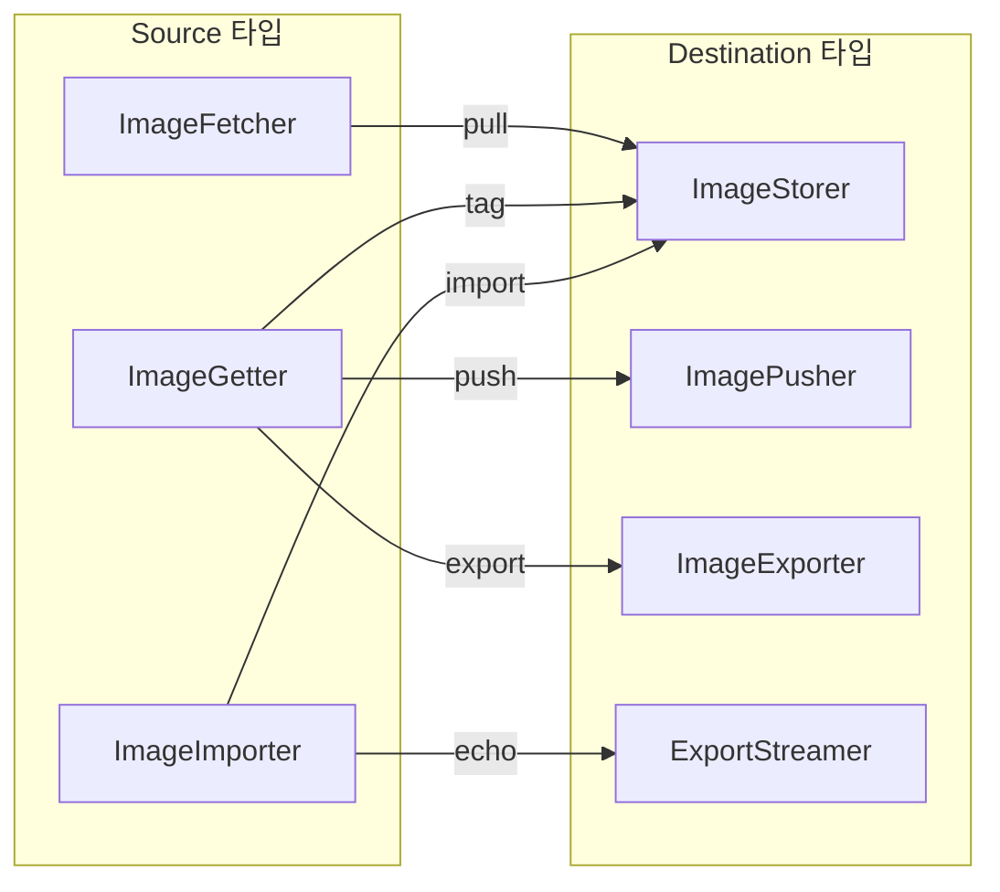

# 17. Transfer Service Deep-Dive

## 목차
1. [개요](#1-개요)
2. [아키텍처](#2-아키텍처)
3. [인터페이스 설계](#3-인터페이스-설계)
4. [localTransferService 구현](#4-localtransferservice-구현)
5. [이미지 Pull 흐름](#5-이미지-pull-흐름)
6. [이미지 Push 흐름](#6-이미지-push-흐름)
7. [Import/Export/Tag 연산](#7-importexporttag-연산)
8. [Progress Tracking 시스템](#8-progress-tracking-시스템)
9. [gRPC 서비스 계층](#9-grpc-서비스-계층)
10. [동시성 제어](#10-동시성-제어)
11. [Lease 보호](#11-lease-보호)
12. [설계 결정과 Why](#12-설계-결정과-why)
13. [운영 고려사항](#13-운영-고려사항)

---

## 1. 개요

Transfer Service는 containerd v2.0에서 안정화된 서브시스템으로, 이미지의 Pull/Push/Import/Export/Tag 등 모든 컨텐츠 전송 연산을 하나의 통합된 인터페이스로 추상화한다. v1.x에서는 이미지 Pull과 Push가 클라이언트 라이브러리에 직접 구현되어 있었으나, v2.0에서는 서버 측 Transfer Service로 이동하여 gRPC를 통해 접근 가능하다.

### Transfer Service가 해결하는 문제

| 문제 | v1.x (기존) | v2.0 Transfer Service |
|------|------------|----------------------|
| Pull/Push 로직 위치 | 클라이언트 라이브러리 | 서버 측 서비스 |
| 동시성 제어 | 클라이언트별 개별 관리 | 서버 중앙집중 세마포어 |
| 진행률 보고 | 클라이언트별 구현 | 통합 Progress 시스템 |
| 확장성 | 새 전송 타입마다 클라이언트 수정 | Source/Destination 타입 추가만으로 확장 |
| 이미지 검증 | 분산된 검증 | ImageVerifier 파이프라인 |
| Lease 관리 | 수동 관리 | 자동 Lease 생성/삭제 |

### 핵심 소스 파일

| 파일 | 역할 |
|------|------|
| `core/transfer/transfer.go` | 인터페이스 정의 (Transferrer, Fetcher, Pusher 등) |
| `core/transfer/local/transfer.go` | localTransferService 구현, type-switch 라우팅 |
| `core/transfer/local/pull.go` | 이미지 Pull 구현 |
| `core/transfer/local/push.go` | 이미지 Push 구현 |
| `core/transfer/local/import.go` | 이미지 Import 구현 |
| `core/transfer/local/export.go` | 이미지 Export 구현 |
| `core/transfer/local/tag.go` | 이미지 Tag 구현 |
| `core/transfer/local/progress.go` | ProgressTracker 구현 |
| `plugins/services/transfer/service.go` | gRPC 서비스 플러그인 |
| `api/services/transfer/v1/transfer.proto` | gRPC API 정의 |

---

## 2. 아키텍처

### 전체 계층 구조

```
 ┌──────────────────────────────────────────────────────────┐
 │                    gRPC Client                           │
 │              (ctr, nerdctl, CRI)                         │
 └───────────────────┬──────────────────────────────────────┘
                     │  TransferRequest(source, destination)
                     ▼
 ┌──────────────────────────────────────────────────────────┐
 │              gRPC Transfer Service                       │
 │        plugins/services/transfer/service.go              │
 │                                                          │
 │  ┌─────────────┐  ┌──────────────┐  ┌───────────────┐   │
 │  │ convertAny  │→ │ Transferrer  │→ │ StreamManager │   │
 │  │ (typeurl)   │  │ (chain)      │  │ (progress)    │   │
 │  └─────────────┘  └──────┬───────┘  └───────────────┘   │
 └───────────────────────────┼──────────────────────────────┘
                             ▼
 ┌──────────────────────────────────────────────────────────┐
 │            localTransferService                          │
 │        core/transfer/local/transfer.go                   │
 │                                                          │
 │  Transfer(src, dst) → type-switch 라우팅                  │
 │                                                          │
 │  ┌──────────────────────────────────────────────────┐    │
 │  │  Source × Destination → Operation                │    │
 │  │                                                  │    │
 │  │  ImageFetcher × ImageStorer    → pull()          │    │
 │  │  ImageGetter  × ImagePusher    → push()          │    │
 │  │  ImageGetter  × ImageExporter  → exportStream()  │    │
 │  │  ImageGetter  × ImageStorer    → tag()           │    │
 │  │  ImageImporter × ImageStorer   → importStream()  │    │
 │  │  ImageImporter × ExportStreamer → echo()         │    │
 │  └──────────────────────────────────────────────────┘    │
 │                                                          │
 │  ┌──────────┐  ┌──────────┐  ┌──────────┐               │
 │  │limiterD  │  │limiterU  │  │limiterP  │               │
 │  │(download)│  │(upload)  │  │(unpack)  │               │
 │  └──────────┘  └──────────┘  └──────────┘               │
 └────────────────────────┬─────────────────────────────────┘
                          │
          ┌───────────────┼───────────────┐
          ▼               ▼               ▼
 ┌──────────────┐ ┌──────────────┐ ┌──────────────┐
 │Content Store │ │ Image Store  │ │  Registry    │
 │  (blobs)     │ │ (metadata)   │ │  (remote)    │
 └──────────────┘ └──────────────┘ └──────────────┘
```

### Source/Destination 타입 매트릭스



---

## 3. 인터페이스 설계

Transfer Service의 핵심은 인터페이스 기반 설계이다. 모든 전송 연산은 Source와 Destination이라는 두 개의 `interface{}` 파라미터로 추상화된다.

### 3.1 Transferrer 인터페이스

> 소스: `core/transfer/transfer.go` 31~33행

```go
type Transferrer interface {
    Transfer(ctx context.Context, source interface{}, destination interface{}, opts ...Opt) error
}
```

`source`와 `destination`이 `interface{}`인 이유: 다양한 전송 타입 조합을 하나의 메서드로 처리하기 위함이다. 구체적인 타입은 런타임에 type-switch로 판별한다.

### 3.2 이미지 해석(Resolve) 관련 인터페이스

> 소스: `core/transfer/transfer.go` 35~72행

```go
// 이미지 참조를 OCI Descriptor로 해석
type ImageResolver interface {
    Resolve(ctx context.Context) (name string, desc ocispec.Descriptor, err error)
}

// Resolver에 옵션을 설정할 수 있는 확장
type ImageResolverOptionSetter interface {
    ImageResolver
    SetResolverOptions(opts ...ImageResolverOption)
}

// 동시 다운로드 설정
type ImageResolverOptions struct {
    DownloadLimiter *semaphore.Weighted
    Performances    ImageResolverPerformanceSettings
}

type ImageResolverPerformanceSettings struct {
    MaxConcurrentDownloads     int
    ConcurrentLayerFetchBuffer int
}
```

`ImageResolver`는 "docker.io/library/nginx:latest" 같은 이미지 참조를 OCI Descriptor(digest, mediaType, size)로 변환한다. `ImageResolverOptionSetter`는 추가 옵션 설정을 위한 확장 인터페이스로, 선택적으로 구현할 수 있다.

### 3.3 Fetch/Push 인터페이스

> 소스: `core/transfer/transfer.go` 74~90행

```go
// 원격 레지스트리에서 이미지를 가져오는 Source
type ImageFetcher interface {
    ImageResolver
    Fetcher(ctx context.Context, ref string) (Fetcher, error)
}

// 원격 레지스트리로 이미지를 보내는 Destination
type ImagePusher interface {
    Pusher(context.Context, ocispec.Descriptor) (Pusher, error)
}

// 개별 blob 다운로드
type Fetcher interface {
    Fetch(context.Context, ocispec.Descriptor) (io.ReadCloser, error)
}

// 개별 blob 업로드
type Pusher interface {
    Push(context.Context, ocispec.Descriptor) (content.Writer, error)
}
```

**계층 구조에 주목하자:**

```
ImageFetcher (이미지 단위)
  └── ImageResolver.Resolve() → (name, descriptor)
  └── Fetcher() → Fetcher (blob 단위)
       └── Fetch(desc) → io.ReadCloser

ImagePusher (이미지 단위)
  └── Pusher() → Pusher (blob 단위)
       └── Push(desc) → content.Writer
```

`ImageFetcher`는 `ImageResolver`를 임베딩한다. 즉, Pull 연산의 Source는 이미지 해석(Resolve)과 blob 다운로드(Fetch) 두 가지 역할을 모두 수행한다.

### 3.4 저장/조회 인터페이스

> 소스: `core/transfer/transfer.go` 93~130행

```go
// 이미지 필터링 (자식 객체 필터)
type ImageFilterer interface {
    ImageFilter(images.HandlerFunc, content.Store) images.HandlerFunc
}

// 이미지 메타데이터 저장 (Pull의 Destination)
type ImageStorer interface {
    Store(context.Context, ocispec.Descriptor, images.Store) ([]images.Image, error)
}

// 이미지 메타데이터 조회 (Push/Export의 Source)
type ImageGetter interface {
    Get(context.Context, images.Store) (images.Image, error)
}

// 이름/prefix 기반 조회 (Export의 Source로 사용)
type ImageLookup interface {
    Lookup(context.Context, images.Store) ([]images.Image, error)
}

// tar 아카이브로 내보내기
type ImageExporter interface {
    Export(context.Context, content.Store, []images.Image) error
}

// tar 아카이브에서 가져오기
type ImageImporter interface {
    Import(context.Context, content.Store) (ocispec.Descriptor, error)
}
```

### 3.5 스트리밍 및 Unpack 인터페이스

> 소스: `core/transfer/transfer.go` 127~151행

```go
// Import용 raw tar 스트림
type ImageImportStreamer interface {
    ImportStream(context.Context) (io.Reader, string, error)
}

// Export용 write 스트림
type ImageExportStreamer interface {
    ExportStream(context.Context) (io.WriteCloser, string, error)
}

// 이미지 unpack 설정
type ImageUnpacker interface {
    UnpackPlatforms() []UnpackConfiguration
}

type UnpackConfiguration struct {
    Platform    ocispec.Platform
    Snapshotter string
}
```

### 3.6 Progress 구조체

> 소스: `core/transfer/transfer.go` 153~178행

```go
type ProgressFunc func(Progress)

type Config struct {
    Progress ProgressFunc
}

type Progress struct {
    Event    string               // "waiting", "downloading", "complete", "extracting", "extracted", "saved"
    Name     string               // blob reference key
    Parents  []string             // 부모 descriptor 참조
    Progress int64                // 현재 전송된 바이트
    Total    int64                // 전체 크기
    Desc     *ocispec.Descriptor  // OCI descriptor (v2.0부터)
}
```

---

## 4. localTransferService 구현

### 4.1 구조체 정의

> 소스: `core/transfer/local/transfer.go` 38~48행

```go
type localTransferService struct {
    content  content.Store
    images   images.Store
    limiterU *semaphore.Weighted  // 업로드 동시성 제한
    limiterD *semaphore.Weighted  // 다운로드 동시성 제한
    limiterP *semaphore.Weighted  // Unpack 동시성 제한
    config   TransferConfig
}
```

세 개의 세마포어가 각각 다른 리소스 차원(네트워크 다운로드, 네트워크 업로드, 디스크 I/O)의 동시성을 제어한다.

### 4.2 생성자

> 소스: `core/transfer/local/transfer.go` 50~66행

```go
func NewTransferService(cs content.Store, is images.Store, tc TransferConfig) transfer.Transferrer {
    ts := &localTransferService{
        content: cs,
        images:  is,
        config:  tc,
    }
    if tc.MaxConcurrentUploadedLayers > 0 {
        ts.limiterU = semaphore.NewWeighted(int64(tc.MaxConcurrentUploadedLayers))
    }
    if tc.MaxConcurrentDownloads > 0 {
        ts.limiterD = semaphore.NewWeighted(int64(tc.MaxConcurrentDownloads))
    }
    if tc.MaxConcurrentUnpacks > 1 {
        ts.limiterP = semaphore.NewWeighted(int64(tc.MaxConcurrentUnpacks))
    }
    return ts
}
```

세마포어는 설정값이 0 이하면 생성하지 않는다(무제한). Unpack의 경우 `> 1`로 체크하는 이유는, 1이면 직렬 실행이므로 세마포어가 불필요하기 때문이다.

### 4.3 Transfer() type-switch 라우팅

> 소스: `core/transfer/local/transfer.go` 68~100행

```go
func (ts *localTransferService) Transfer(ctx context.Context, src interface{}, dest interface{}, opts ...transfer.Opt) error {
    topts := &transfer.Config{}
    for _, opt := range opts {
        opt(topts)
    }

    switch s := src.(type) {
    case transfer.ImageFetcher:
        switch d := dest.(type) {
        case transfer.ImageStorer:
            return ts.pull(ctx, s, d, topts)
        }
    case transfer.ImageGetter:
        switch d := dest.(type) {
        case transfer.ImagePusher:
            return ts.push(ctx, s, d, topts)
        case transfer.ImageExporter:
            return ts.exportStream(ctx, s, d, topts)
        case transfer.ImageStorer:
            return ts.tag(ctx, s, d, topts)
        }
    case transfer.ImageImporter:
        switch d := dest.(type) {
        case transfer.ImageExportStreamer:
            return ts.echo(ctx, s, d, topts)
        case transfer.ImageStorer:
            return ts.importStream(ctx, s, d, topts)
        }
    }
    return fmt.Errorf("unable to transfer from %s to %s: %w", name(src), name(dest), errdefs.ErrNotImplemented)
}
```

**이중 type-switch 패턴:** 먼저 Source 타입으로 분기한 후, 중첩된 switch에서 Destination 타입으로 다시 분기한다. 지원되지 않는 조합이면 `ErrNotImplemented`를 반환한다.

### 4.4 TransferConfig

> 소스: `core/transfer/local/transfer.go` 170~210행

```go
type TransferConfig struct {
    Leases                     leases.Manager
    MaxConcurrentDownloads     int
    ConcurrentLayerFetchBuffer int    // 512바이트 이상이면 병렬 레이어 fetch 활성화
    MaxConcurrentUploadedLayers int
    MaxConcurrentUnpacks       int
    DuplicationSuppressor      unpack.KeyedLocker
    BaseHandlers               []images.Handler
    UnpackPlatforms            []unpack.Platform
    Verifiers                  map[string]imageverifier.ImageVerifier
    RegistryConfigPath         string
}
```

| 설정 | 기본값 | 설명 |
|------|--------|------|
| MaxConcurrentDownloads | 0 (무제한) | 전체 레이어 다운로드 동시성 |
| ConcurrentLayerFetchBuffer | 0 (비활성) | 512 이상이면 병렬 레이어 fetch 활성 |
| MaxConcurrentUploadedLayers | 0 (무제한) | 전체 레이어 업로드 동시성 |
| MaxConcurrentUnpacks | 1 (직렬) | Unpack 동시성 |
| DuplicationSuppressor | nil | 동일 digest 중복 요청 방지 |
| Verifiers | nil | 이미지 Pull 전 검증기 맵 |

---

## 5. 이미지 Pull 흐름

Pull은 Transfer Service의 가장 복잡한 연산이다. 원격 레지스트리에서 이미지를 다운로드하여 로컬 Content Store에 저장하고, 선택적으로 Unpack까지 수행한다.

### 5.1 전체 흐름도

```
  pull(ctx, ImageFetcher, ImageStorer, Config)
    │
    ├── 1. withLease(ctx)        ← 자동 Lease 생성
    │
    ├── 2. SetResolverOptions()  ← 동시성 설정 전달
    │
    ├── 3. Resolve()             ← 이미지 참조 → Descriptor
    │       └── schema1 체크 (거부)
    │
    ├── 4. ImageVerifier 검증    ← Pull 차단 가능
    │
    ├── 5. Fetcher() 획득        ← blob 다운로드용 클라이언트
    │
    ├── 6. Handler 파이프라인 구성
    │   ├── baseHandlers (설정 기반)
    │   ├── progressHandler (진행률 추적)
    │   ├── fetchHandler (실제 다운로드)
    │   ├── checkNeedsFix (mediatype 버그 감지)
    │   ├── childrenHandler (자식 descriptor 탐색)
    │   └── appendDistSrcLabelHandler (라벨 추가)
    │
    ├── 7. Unpacker 설정 (선택적)
    │   ├── UnpackPlatforms 매칭
    │   ├── DuplicationSuppressor 설정
    │   └── handler = unpacker.Unpack(handler)
    │
    ├── 8. images.Dispatch()     ← 핸들러 체인으로 모든 blob 처리
    │
    ├── 9. unpacker.Wait()       ← Unpack 완료 대기
    │
    ├── 10. ConvertManifest()    ← mediatype 버그 수정 (필요시)
    │
    └── 11. Store()              ← 이미지 메타데이터 저장
```

### 5.2 Resolve 단계

> 소스: `core/transfer/local/pull.go` 39~66행

```go
func (ts *localTransferService) pull(ctx context.Context, ir transfer.ImageFetcher, is transfer.ImageStorer, tops *transfer.Config) error {
    ctx, done, err := ts.withLease(ctx)
    if err != nil {
        return err
    }
    defer done(ctx)

    // Resolver에 동시성 옵션 전달
    if ir, ok := ir.(transfer.ImageResolverOptionSetter); ok {
        ir.SetResolverOptions(
            transfer.WithConcurrentLayerFetchBuffer(ts.config.ConcurrentLayerFetchBuffer),
            transfer.WithMaxConcurrentDownloads(ts.config.MaxConcurrentDownloads),
            transfer.WithDownloadLimiter(ts.limiterD),
        )
    }

    name, desc, err := ir.Resolve(ctx)
    if err != nil {
        return fmt.Errorf("failed to resolve image: %w", err)
    }
    if desc.MediaType == images.MediaTypeDockerSchema1Manifest {
        return fmt.Errorf("schema 1 image manifests are no longer supported: %w", errdefs.ErrInvalidArgument)
    }
    // ...
}
```

Docker Schema 1 매니페스트는 명시적으로 거부된다. containerd v2.0은 OCI 표준만 지원하며, 레거시 포맷과의 호환을 끊은 것이다.

### 5.3 ImageVerifier 검증

> 소스: `core/transfer/local/pull.go` 70~93행

```go
for vfName, vf := range ts.config.Verifiers {
    logger := log.G(ctx).WithFields(log.Fields{
        "name":     name,
        "digest":   desc.Digest.String(),
        "verifier": vfName,
    })
    logger.Debug("Verifying image pull")

    jdg, err := vf.VerifyImage(ctx, name, desc)
    if err != nil {
        return fmt.Errorf("blocking pull of %v with digest %v: image verifier %v returned error: %w",
            name, desc.Digest.String(), vfName, err)
    }
    if !jdg.OK {
        return fmt.Errorf("image verifier %s blocked pull of %v with digest %v for reason: %v",
            vfName, name, desc.Digest.String(), jdg.Reason)
    }
}
```

ImageVerifier는 서명 검증, 정책 기반 접근 제어 등에 사용된다. 모든 Verifier를 순회하며, 하나라도 실패하면 Pull이 차단된다.

### 5.4 Handler 파이프라인 구성

> 소스: `core/transfer/local/pull.go` 133~188행

Pull의 핵심은 `images.Handler` 파이프라인이다. 각 blob(manifest, config, layer)에 대해 순차적으로 핸들러 체인이 실행된다.

```
images.Dispatch(handler, desc)
    │
    ▼
┌─────────────────────────────────────────────────┐
│  Handler 파이프라인 (images.Handlers로 체인)      │
│                                                  │
│  1. baseHandlers          [설정 기반 핸들러들]     │
│  2. progressHandler       [Add(desc) 호출]        │
│  3. fetchHandler          [실제 blob 다운로드]     │
│  4. checkNeedsFix         [mediatype 버그 감지]   │
│  5. childrenHandler       [자식 descriptor 반환]   │
│  6. appendDistSrcLabel    [라벨 추가]              │
│                                                  │
│  각 핸들러: (ctx, desc) → ([]Descriptor, error)   │
│  반환된 자식 Descriptor들에 대해 재귀 호출          │
└─────────────────────────────────────────────────┘
```

```go
handler = images.Handlers(append(baseHandlers,
    fetchHandler(store, fetcher, progressTracker),
    checkNeedsFix,
    childrenHandler,
    appendDistSrcLabelHandler,
)...)
```

### 5.5 fetchHandler

> 소스: `core/transfer/local/pull.go` 281~299행

```go
func fetchHandler(ingester content.Ingester, fetcher remotes.Fetcher, pt *ProgressTracker) images.HandlerFunc {
    return func(ctx context.Context, desc ocispec.Descriptor) ([]ocispec.Descriptor, error) {
        ctx = log.WithLogger(ctx, log.G(ctx).WithFields(log.Fields{
            "digest":    desc.Digest,
            "mediatype": desc.MediaType,
            "size":      desc.Size,
        }))

        if desc.MediaType == images.MediaTypeDockerSchema1Manifest {
            return nil, fmt.Errorf("%v not supported", desc.MediaType)
        }
        err := remotes.Fetch(ctx, ingester, fetcher, desc)
        if errdefs.IsAlreadyExists(err) {
            pt.MarkExists(desc)
            return nil, nil
        }
        return nil, err
    }
}
```

`remotes.Fetch`는 원격 레지스트리에서 blob을 다운로드하여 Content Store에 직접 쓴다. 이미 존재하는 blob(`IsAlreadyExists`)은 건너뛰고 ProgressTracker에 "already exists"로 표시한다.

### 5.6 Unpack 연동

> 소스: `core/transfer/local/pull.go` 192~233행

```go
if iu, ok := is.(transfer.ImageUnpacker); ok {
    unpacks := iu.UnpackPlatforms()
    if len(unpacks) > 0 {
        uopts := []unpack.UnpackerOpt{}
        for _, u := range unpacks {
            matched, mu := getSupportedPlatform(ctx, u, ts.config.UnpackPlatforms)
            if matched {
                uopts = append(uopts, unpack.WithUnpackPlatform(mu))
            }
        }
        // ...
        unpacker, err = unpack.NewUnpacker(ctx, ts.content, uopts...)
        handler = unpacker.Unpack(handler)  // Handler를 Wrap
    }
}
```

`ImageStorer`가 `ImageUnpacker`도 구현하면, 다운로드 즉시 Unpack이 시작된다. `unpacker.Unpack(handler)`는 기존 핸들러를 감싸서, blob 다운로드와 스냅샷 추출을 파이프라인으로 연결한다.

### 5.7 images.Dispatch와 최종 저장

> 소스: `core/transfer/local/pull.go` 236~278행

```go
// Dispatch: descriptor 트리를 DFS 순회하며 핸들러 호출
if err := images.Dispatch(ctx, handler, nil, desc); err != nil {
    if unpacker != nil {
        unpacker.Wait()
    }
    return err
}

// Unpack 완료 대기
if unpacker != nil {
    if _, err = unpacker.Wait(); err != nil {
        return err
    }
}

// mediatype 버그 수정 (Docker 레거시 호환)
if hasMediaTypeBug1622 {
    if desc, err = docker.ConvertManifest(ctx, store, desc); err != nil {
        return err
    }
}

// 이미지 메타데이터 저장
imgs, err := is.Store(ctx, desc, ts.images)
```

**Dispatch 동작 원리:**
1. 루트 Descriptor(보통 index 또는 manifest)부터 시작
2. 핸들러 체인 실행 → fetchHandler가 blob 다운로드
3. childrenHandler가 자식 Descriptor 반환 (manifest → config + layers)
4. 자식 각각에 대해 재귀적으로 핸들러 체인 실행
5. 모든 blob 다운로드 완료 후 이미지 메타데이터 저장

---

## 6. 이미지 Push 흐름

### 6.1 전체 흐름도

```
  push(ctx, ImageGetter, ImagePusher, Config)
    │
    ├── 1. platform matcher 설정
    │
    ├── 2. Get() → Image         ← 로컬 이미지 메타데이터 조회
    │
    ├── 3. Pusher() 획득          ← 원격 업로드용 클라이언트
    │
    ├── 4. progressPusher 래핑 (선택적)
    │
    └── 5. remotes.PushContent()  ← 실제 업로드
            │
            ├── Content Store에서 blob 읽기
            ├── platform matcher로 필터링
            ├── limiterU로 동시성 제한
            └── 각 blob을 Pusher.Push()로 업로드
```

### 6.2 Push 구현

> 소스: `core/transfer/local/push.go` 35~112행

```go
func (ts *localTransferService) push(ctx context.Context, ig transfer.ImageGetter, p transfer.ImagePusher, tops *transfer.Config) error {
    matcher := platforms.All
    if ipg, ok := ig.(transfer.ImagePlatformsGetter); ok {
        if ps := ipg.Platforms(); len(ps) > 0 {
            matcher = platforms.Any(ps...)
        }
    }

    img, err := ig.Get(ctx, ts.images)
    if err != nil {
        return err
    }

    var pusher remotes.Pusher
    pusher, err = p.Pusher(ctx, img.Target)
    if err != nil {
        return err
    }

    // Progress tracking 래핑
    var wrapper func(images.Handler) images.Handler
    ctx, cancel := context.WithCancel(ctx)
    if tops.Progress != nil {
        progressTracker := NewProgressTracker(img.Name, "uploading")
        p := newProgressPusher(pusher, progressTracker)
        go progressTracker.HandleProgress(ctx, tops.Progress, p)
        defer progressTracker.Wait()
        wrapper = p.WrapHandler
        pusher = p
    }
    defer cancel()

    // 실제 업로드 실행
    if err := remotes.PushContent(ctx, pusher, img.Target, ts.content, ts.limiterU, matcher, wrapper); err != nil {
        return err
    }
    // ...
}
```

### 6.3 progressPusher 래핑 패턴

> 소스: `core/transfer/local/push.go` 114~173행

```go
type progressPusher struct {
    remotes.Pusher
    progress *ProgressTracker
    status   *pushStatus
}

// Push를 래핑하여 진행률 추적
func (p *progressPusher) Push(ctx context.Context, d ocispec.Descriptor) (content.Writer, error) {
    ref := remotes.MakeRefKey(ctx, d)
    p.status.add(ref, d)

    var cw content.Writer
    var err error
    if cs, ok := p.Pusher.(content.Ingester); ok {
        cw, err = content.OpenWriter(ctx, cs, content.WithRef(ref), content.WithDescriptor(d))
    } else {
        cw, err = p.Pusher.Push(ctx, d)
    }
    if err != nil {
        if errdefs.IsAlreadyExists(err) {
            p.progress.MarkExists(d)
            p.status.markComplete(ref, d)
        }
        return nil, err
    }

    return &progressWriter{
        Writer:   cw,
        ref:      ref,
        desc:     d,
        status:   p.status,
        progress: p.progress,
    }, nil
}
```

`progressPusher`는 데코레이터 패턴으로 원래 Pusher를 감싸서 Push 호출마다 상태를 추적한다. `progressWriter`는 `content.Writer`를 감싸서 매 `Write()`마다 바이트 오프셋을 업데이트한다.

### 6.4 progressWriter

> 소스: `core/transfer/local/push.go` 237~264행

```go
type progressWriter struct {
    content.Writer
    ref      string
    desc     ocispec.Descriptor
    status   *pushStatus
    progress *ProgressTracker
}

func (pw *progressWriter) Write(p []byte) (n int, err error) {
    n, err = pw.Writer.Write(p)
    if err != nil {
        return
    }
    pw.status.update(pw.ref, n)  // 바이트 단위 오프셋 업데이트
    return
}

func (pw *progressWriter) Commit(ctx context.Context, size int64, expected digest.Digest, opts ...content.Opt) error {
    err := pw.Writer.Commit(ctx, size, expected, opts...)
    if err != nil {
        if errdefs.IsAlreadyExists(err) {
            pw.progress.MarkExists(pw.desc)
        }
    }
    pw.status.markComplete(pw.ref, pw.desc)
    return err
}
```

---

## 7. Import/Export/Tag 연산

### 7.1 Import (tar → Content Store → Image)

> 소스: `core/transfer/local/import.go` 35~158행

```
  importStream(ctx, ImageImporter, ImageStorer, Config)
    │
    ├── 1. withLease(ctx)
    │
    ├── 2. Import(ctx, contentStore) → OCI Index descriptor
    │       └── tar 아카이브를 Content Store에 기록
    │
    ├── 3. Handler 구성
    │   ├── Index 파싱 → 자식 manifest 수집
    │   ├── ImageFilter (선택적)
    │   └── Unpacker.Unpack (선택적)
    │
    ├── 4. images.WalkNotEmpty() → 트리 순회
    │
    ├── 5. Unpacker.Wait() (선택적)
    │
    └── 6. Store() → 각 descriptor에 대해 이미지 메타데이터 저장
```

Import의 핵심은 `Import(ctx, content.Store)`가 tar 아카이브를 Content Store에 기록하고 OCI Index Descriptor를 반환하는 것이다. 그 후 Index를 파싱하여 각 manifest에 대해 이미지 메타데이터를 저장한다.

```go
func (ts *localTransferService) importStream(ctx context.Context, i transfer.ImageImporter, is transfer.ImageStorer, tops *transfer.Config) error {
    ctx, done, err := ts.withLease(ctx)
    if err != nil {
        return err
    }
    defer done(ctx)

    // tar → Content Store
    index, err := i.Import(ctx, ts.content)
    if err != nil {
        return err
    }

    var descriptors []ocispec.Descriptor
    descriptors = append(descriptors, index)

    // Index 파싱하여 자식 manifest 수집
    var handlerFunc images.HandlerFunc = func(ctx context.Context, desc ocispec.Descriptor) ([]ocispec.Descriptor, error) {
        if desc.Digest != index.Digest {
            return images.Children(ctx, ts.content, desc)
        }
        // Index인 경우 자식 manifest 파싱
        p, _ := content.ReadBlob(ctx, ts.content, desc)
        var idx ocispec.Index
        json.Unmarshal(p, &idx)
        for i := range idx.Manifests {
            idx.Manifests[i].Annotations = mergeMap(idx.Manifests[i].Annotations,
                map[string]string{"io.containerd.import.ref-source": "annotation"})
            descriptors = append(descriptors, idx.Manifests[i])
        }
        return idx.Manifests, nil
    }
    // ...
}
```

### 7.2 Export (Image → tar)

> 소스: `core/transfer/local/export.go` 26~64행

```go
func (ts *localTransferService) exportStream(ctx context.Context, ig transfer.ImageGetter, is transfer.ImageExporter, tops *transfer.Config) error {
    ctx, done, err := ts.withLease(ctx)
    if err != nil {
        return err
    }
    defer done(ctx)

    var imgs []images.Image
    if il, ok := ig.(transfer.ImageLookup); ok {
        imgs, err = il.Lookup(ctx, ts.images)   // prefix 기반 조회
    } else {
        img, err := ig.Get(ctx, ts.images)       // 단일 이미지 조회
        imgs = append(imgs, img)
    }

    err = is.Export(ctx, ts.content, imgs)        // tar 아카이브 생성
    // ...
}
```

Export에서 Source가 `ImageLookup`을 구현하면 prefix로 여러 이미지를 한 번에 내보낼 수 있다. 그렇지 않으면 `ImageGetter`로 단일 이미지만 조회한다.

### 7.3 Tag (이미지 이름 추가/변경)

> 소스: `core/transfer/local/tag.go` 25~39행

```go
func (ts *localTransferService) tag(ctx context.Context, ig transfer.ImageGetter, is transfer.ImageStorer, tops *transfer.Config) error {
    ctx, done, err := ts.withLease(ctx)
    if err != nil {
        return err
    }
    defer done(ctx)

    img, err := ig.Get(ctx, ts.images)
    if err != nil {
        return err
    }

    _, err = is.Store(ctx, img.Target, ts.images)
    return err
}
```

Tag 연산은 단순하다: 기존 이미지의 Target Descriptor를 가져와서 새 이름으로 Store에 저장한다. blob 복사는 발생하지 않고 메타데이터(이미지 이름)만 추가된다.

### 7.4 Echo (Import → Export, 테스트용)

> 소스: `core/transfer/local/transfer.go` 115~135행

```go
func (ts *localTransferService) echo(ctx context.Context, i transfer.ImageImporter, e transfer.ImageExportStreamer, tops *transfer.Config) error {
    iis, ok := i.(transfer.ImageImportStreamer)
    if !ok {
        return fmt.Errorf("echo requires access to raw stream: %w", errdefs.ErrNotImplemented)
    }
    r, _, err := iis.ImportStream(ctx)
    wc, _, err := e.ExportStream(ctx)
    _, err = io.Copy(wc, r)
    // ...
}
```

Echo는 raw 스트림을 그대로 전달하는 no-op 연산으로, 주로 테스트 목적으로 사용된다.

### 7.5 연산별 비교

| 연산 | Source 타입 | Destination 타입 | blob 전송 | metadata 변경 |
|------|------------|-----------------|-----------|--------------|
| pull | ImageFetcher | ImageStorer | Registry → Content | 이미지 생성 |
| push | ImageGetter | ImagePusher | Content → Registry | 없음 |
| import | ImageImporter | ImageStorer | tar → Content | 이미지 생성 |
| export | ImageGetter | ImageExporter | Content → tar | 없음 |
| tag | ImageGetter | ImageStorer | 없음 | 이미지 이름 추가 |
| echo | ImageImporter | ExportStreamer | 스트림 복사 | 없음 |

---

## 8. Progress Tracking 시스템

### 8.1 ProgressTracker 구조

> 소스: `core/transfer/local/progress.go` 34~43행

```go
type ProgressTracker struct {
    root          string                           // 루트 이미지 이름
    transferState string                           // "downloading" 또는 "uploading"
    added         chan jobUpdate                    // 새 job 알림 채널 (버퍼 1)
    extraction    chan extractionUpdate             // Unpack 진행률 채널 (버퍼 1)
    waitC         chan struct{}                     // 완료 대기 채널
    parents       map[digest.Digest][]ocispec.Descriptor  // 부모-자식 관계
    parentL       sync.Mutex
}
```

### 8.2 Job 상태 머신

> 소스: `core/transfer/local/progress.go` 46~61행

```go
type jobState uint8

const (
    jobAdded      jobState = iota  // 0: 대기 중
    jobInProgress                   // 1: 전송 중
    jobComplete                     // 2: 전송 완료
    jobExtracting                   // 3: Unpack 중
    jobExtracted                    // 4: Unpack 완료
)
```

```
            ┌──────────────────────────────────────┐
            │        Job 상태 전이 다이어그램          │
            └──────────────────────────────────────┘

                   Add(desc)
                     │
                     ▼
              ┌─────────────┐
              │  jobAdded   │  ← "waiting" 이벤트 발송
              │   (대기중)   │
              └──────┬──────┘
                     │ Active status에 offset 발견
                     ▼
              ┌─────────────┐
              │jobInProgress│  ← transferState 이벤트 발송
              │  (전송중)    │     ("downloading"/"uploading")
              └──────┬──────┘
                     │ Check()=true (blob 존재 확인)
                     ▼
              ┌─────────────┐
    ┌────────│ jobComplete  │  ← "complete" 이벤트 발송
    │        │  (전송완료)   │
    │        └──────┬──────┘
    │               │ ExtractProgress() 호출
    │               ▼
    │        ┌─────────────┐
    │        │jobExtracting │  ← "extracting" 이벤트 발송
    │        │ (Unpack중)   │
    │        └──────┬──────┘
    │               │ progress == desc.Size
    │               ▼
    │        ┌─────────────┐
    │        │ jobExtracted │  ← "extracted" 이벤트 발송
    │        │ (Unpack완료) │
    │        └─────────────┘
    │
    │  MarkExists(desc)
    │        직접 "already exists" 이벤트 발송
    └────────→ jobComplete
```

### 8.3 HandleProgress 이벤트 루프

> 소스: `core/transfer/local/progress.go` 95~256행

```go
func (j *ProgressTracker) HandleProgress(ctx context.Context, pf transfer.ProgressFunc, pt StatusTracker) {
    defer close(j.waitC)
    jobs := map[digest.Digest]*jobStatus{}
    tc := time.NewTicker(time.Millisecond * 300)  // 300ms 주기로 상태 체크
    defer tc.Stop()

    update := func() {
        active, err := pt.Active(ctx)
        for dgst, job := range jobs {
            switch job.state {
            case jobAdded, jobInProgress:
                status, ok := active.Status(job.name)
                if ok {
                    if status.Offset > job.progress {
                        pf(transfer.Progress{
                            Event:    j.transferState,
                            Name:     job.name,
                            Progress: status.Offset,
                            Total:    status.Total,
                        })
                        job.state = jobInProgress
                    }
                } else {
                    ok, _ := pt.Check(ctx, job.desc.Digest)
                    if ok {
                        pf(transfer.Progress{
                            Event:    "complete",
                            Progress: job.desc.Size,
                            Total:    job.desc.Size,
                        })
                        job.state = jobComplete
                    }
                }
            case jobExtracting:
                if job.progress == job.desc.Size {
                    pf(transfer.Progress{Event: "extracted", ...})
                    job.state = jobExtracted
                } else {
                    pf(transfer.Progress{Event: "extracting", ...})
                }
            }
        }
    }

    for {
        select {
        case update := <-j.added:        // 새 job 추가
            // ... "waiting" 이벤트 발송
        case extraction := <-j.extraction: // Unpack 진행률
            // ... extracting 상태 업데이트
        case <-tc.C:                       // 300ms 틱
            update()
        case <-ctx.Done():                 // 종료
            update()
            return
        }
    }
}
```

**왜 300ms 틱인가?** 매 Write마다 진행률을 보고하면 gRPC 스트림에 과부하가 걸린다. 300ms 간격으로 배치 처리하면 적절한 실시간성과 효율성의 균형을 맞출 수 있다.

### 8.4 StatusTracker 인터페이스

> 소스: `core/transfer/local/progress.go` 69~76행

```go
type ActiveJobs interface {
    Status(string) (content.Status, bool)
}

type StatusTracker interface {
    Active(context.Context, ...string) (ActiveJobs, error)
    Check(context.Context, digest.Digest) (bool, error)
}
```

Pull과 Push에서 서로 다른 `StatusTracker` 구현을 사용한다:

| 연산 | StatusTracker 구현 | Active() 소스 | Check() 소스 |
|------|-------------------|--------------|--------------|
| Pull | contentStatusTracker | Content Store ListStatuses | Content Store Info |
| Push | progressPusher (pushStatus) | 내부 statuses 맵 | 내부 complete 맵 |

### 8.5 contentStatusTracker (Pull용)

> 소스: `core/transfer/local/progress.go` 322~368행

```go
type contentStatusTracker struct {
    cs content.Store
}

func (c *contentStatusTracker) Active(ctx context.Context, _ ...string) (ActiveJobs, error) {
    active, err := c.cs.ListStatuses(ctx)
    // 이진 탐색을 위해 정렬
    sort.Slice(active, func(i, j int) bool {
        return active[i].Ref < active[j].Ref
    })
    return &contentActive{active: active}, nil
}

func (c *contentStatusTracker) Check(ctx context.Context, dgst digest.Digest) (bool, error) {
    _, err := c.cs.Info(ctx, dgst)
    if err == nil {
        return true, nil  // blob 존재 확인
    }
    if errdefs.IsNotFound(err) {
        err = nil
    }
    return false, err
}
```

`contentActive.Status()`는 이진 탐색(`sort.Search`)으로 ref를 조회한다. Active 상태 목록을 300ms마다 가져와서 정렬하므로, 수백 개의 동시 다운로드에서도 효율적이다.

### 8.6 부모-자식 관계 추적

```go
func (j *ProgressTracker) AddChildren(desc ocispec.Descriptor, children []ocispec.Descriptor) {
    if j == nil || len(children) == 0 {
        return
    }
    j.parentL.Lock()
    defer j.parentL.Unlock()
    for _, child := range children {
        j.parents[child.Digest] = append(j.parents[child.Digest], desc)
    }
}
```

이미지의 구조는 트리이다: Index → Manifest → (Config, Layers). Progress 보고시 각 blob의 부모를 함께 전달하여, 클라이언트가 계층적 진행률을 표시할 수 있게 한다.

---

## 9. gRPC 서비스 계층

### 9.1 플러그인 등록

> 소스: `plugins/services/transfer/service.go` 46~56행

```go
func init() {
    registry.Register(&plugin.Registration{
        Type: plugins.GRPCPlugin,
        ID:   "transfer",
        Requires: []plugin.Type{
            plugins.TransferPlugin,
            plugins.StreamingPlugin,
        },
        InitFn: newService,
    })
}
```

Transfer gRPC 서비스는 `TransferPlugin`과 `StreamingPlugin`에 의존한다. `TransferPlugin`은 `localTransferService`를, `StreamingPlugin`은 진행률 스트리밍을 제공한다.

### 9.2 Protobuf API

> 소스: `api/services/transfer/v1/transfer.proto`

```protobuf
service Transfer {
  rpc Transfer(TransferRequest) returns (google.protobuf.Empty);
}

message TransferRequest {
  google.protobuf.Any source = 1;
  google.protobuf.Any destination = 2;
  TransferOptions options = 3;
}

message TransferOptions {
  string progress_stream = 1;
}
```

API가 매우 단순하다는 점에 주목하자. 하나의 RPC(`Transfer`)로 pull/push/import/export/tag 모든 연산을 처리한다. `source`와 `destination`이 `google.protobuf.Any`이므로 임의의 타입을 전달할 수 있다.

`progress_stream`은 StreamingPlugin으로 생성된 스트림의 ID다. 진행률은 이 별도 스트림을 통해 비동기적으로 전달된다.

### 9.3 gRPC Service 구현

> 소스: `plugins/services/transfer/service.go` 58~167행

```go
type service struct {
    transferrers  []transfer.Transferrer
    streamManager streaming.StreamManager
    transferapi.UnimplementedTransferServer
}

func (s *service) Transfer(ctx context.Context, req *transferapi.TransferRequest) (*emptypb.Empty, error) {
    var transferOpts []transfer.Opt

    // 1. Progress 스트림 설정
    if req.Options != nil && req.Options.ProgressStream != "" {
        stream, err := s.streamManager.Get(ctx, req.Options.ProgressStream)
        defer stream.Close()

        pf := func(p transfer.Progress) {
            progress, _ := typeurl.MarshalAny(&transferTypes.Progress{
                Event:    p.Event,
                Name:     p.Name,
                Parents:  p.Parents,
                Progress: p.Progress,
                Total:    p.Total,
                Desc:     oci.DescriptorToProto(*p.Desc),
            })
            stream.Send(progress)  // 비동기 전송
        }
        transferOpts = append(transferOpts, transfer.WithProgress(pf))
    }

    // 2. Any → 구체 타입 변환
    src, err := s.convertAny(ctx, req.Source)
    dst, err := s.convertAny(ctx, req.Destination)

    // 3. Transferrer 체인 실행
    for _, t := range s.transferrers {
        if err := t.Transfer(ctx, src, dst, transferOpts...); err == nil {
            return empty, nil
        } else if !errdefs.IsNotImplemented(err) {
            return nil, errgrpc.ToGRPC(err)
        }
    }
    return nil, status.Errorf(codes.Unimplemented, "method Transfer not implemented for %s to %s",
        req.Source.GetTypeUrl(), req.Destination.GetTypeUrl())
}
```

**Transferrer 체인 패턴:** 여러 Transferrer가 등록될 수 있으며, 순서대로 시도한다. `ErrNotImplemented`를 반환하면 다음 Transferrer로 넘어간다. 이 패턴으로 커스텀 전송 로직을 플러그인으로 추가할 수 있다.

### 9.4 convertAny 타입 변환

> 소스: `plugins/services/transfer/service.go` 146~163행

```go
func (s *service) convertAny(ctx context.Context, a typeurl.Any) (interface{}, error) {
    obj, err := tplugins.ResolveType(a)
    if err != nil {
        if errdefs.IsNotFound(err) {
            return typeurl.UnmarshalAny(a)
        }
        return nil, err
    }
    switch v := obj.(type) {
    case streamUnmarshaler:
        err = v.UnmarshalAny(ctx, s.streamManager, a)
        return obj, err
    default:
        err = typeurl.UnmarshalTo(a, obj)
        return obj, err
    }
}
```

`tplugins.ResolveType`으로 Any의 TypeURL을 구체 Go 타입으로 변환한다. `streamUnmarshaler`를 구현하는 타입은 스트리밍 채널도 함께 역직렬화한다(Import/Export의 스트림 데이터 전달에 사용).

---

## 10. 동시성 제어

### 10.1 세마포어 기반 제한

```
 ┌──────────────────────────────────────────────────┐
 │            동시성 제어 계층                         │
 │                                                   │
 │  ┌───────────────┐                                │
 │  │  limiterD     │ ← MaxConcurrentDownloads       │
 │  │  (다운로드)    │   레이어 다운로드 동시 진행 수    │
 │  └───────────────┘                                │
 │                                                   │
 │  ┌───────────────┐                                │
 │  │  limiterU     │ ← MaxConcurrentUploadedLayers  │
 │  │  (업로드)      │   레이어 업로드 동시 진행 수     │
 │  └───────────────┘                                │
 │                                                   │
 │  ┌───────────────┐                                │
 │  │  limiterP     │ ← MaxConcurrentUnpacks         │
 │  │  (Unpack)     │   스냅샷 추출 동시 진행 수       │
 │  └───────────────┘                                │
 │                                                   │
 │  ┌───────────────┐                                │
 │  │  DuplicSup    │ ← DuplicationSuppressor        │
 │  │  (중복 방지)   │   동일 digest 요청 합침         │
 │  └───────────────┘                                │
 └──────────────────────────────────────────────────┘
```

### 10.2 ConcurrentLayerFetchBuffer

`ConcurrentLayerFetchBuffer` > 512 바이트이면 레이어 다운로드가 청크 단위 병렬화된다. 큰 이미지의 경우 여러 레이어를 동시에 다운로드하면서도 메모리 사용량을 제한할 수 있다.

```go
// Resolver에 옵션 전달
if ir, ok := ir.(transfer.ImageResolverOptionSetter); ok {
    ir.SetResolverOptions(
        transfer.WithConcurrentLayerFetchBuffer(ts.config.ConcurrentLayerFetchBuffer),
        transfer.WithMaxConcurrentDownloads(ts.config.MaxConcurrentDownloads),
        transfer.WithDownloadLimiter(ts.limiterD),
    )
}
```

### 10.3 DuplicationSuppressor

동일한 digest에 대한 중복 fetch/unpack 요청을 합쳐서 한 번만 실행한다. `unpack.KeyedLocker` 인터페이스로 구현되며, digest 또는 chain ID를 키로 사용한다.

```go
if ts.config.DuplicationSuppressor != nil {
    uopts = append(uopts, unpack.WithDuplicationSuppressor(ts.config.DuplicationSuppressor))
}
```

### 10.4 pushStatus의 동시성 안전성

> 소스: `core/transfer/local/push.go` 121~227행

```go
type pushStatus struct {
    l        sync.Mutex
    statuses map[string]content.Status    // 활성 업로드 상태
    complete map[digest.Digest]struct{}   // 완료된 blob
}
```

Push의 진행률 추적은 `sync.Mutex`로 보호되는 두 개의 맵으로 관리된다. `statuses`는 현재 업로드 중인 blob의 오프셋을, `complete`는 완료된 blob을 추적한다.

---

## 11. Lease 보호

### 11.1 withLease 헬퍼

> 소스: `core/transfer/local/transfer.go` 138~168행

```go
func (ts *localTransferService) withLease(ctx context.Context, opts ...leases.Opt) (context.Context, func(context.Context) error, error) {
    nop := func(context.Context) error { return nil }

    // 이미 Lease가 있으면 재사용
    _, ok := leases.FromContext(ctx)
    if ok {
        return ctx, nop, nil
    }

    ls := ts.config.Leases
    if ls == nil {
        return ctx, nop, nil
    }

    if len(opts) == 0 {
        opts = []leases.Opt{
            leases.WithRandomID(),
            leases.WithExpiration(24 * time.Hour),  // 24시간 만료
        }
    }

    l, err := ls.Create(ctx, opts...)
    ctx = leases.WithLease(ctx, l.ID)
    return ctx, func(ctx context.Context) error {
        return ls.Delete(ctx, l)
    }, nil
}
```

**왜 Lease가 필요한가?** Pull/Import 중에 GC가 실행되면, 아직 이미지 메타데이터에 연결되지 않은 blob이 삭제될 수 있다. Lease는 "이 blob들은 아직 사용 중"이라고 GC에게 알리는 보호 장치이다.

```
 Pull 시작                                              Pull 완료
    │                                                      │
    ├── Lease 생성 (24h 만료) ─────────────────────────────┤
    │      │                                               │
    │      ├── blob A 다운로드 → Lease가 보호 ──────────┐   │
    │      ├── blob B 다운로드 → Lease가 보호 ──────┐   │   │
    │      ├── blob C 다운로드 → Lease가 보호 ──┐   │   │   │
    │      │                                   │   │   │   │
    │      │   GC 실행 → Lease 보호로 건너뜀 ──┤   │   │   │
    │      │                                   │   │   │   │
    │      ├── Store() → 이미지 메타데이터 저장  │   │   │   │
    │      │   (blob A,B,C가 이미지에 연결됨)    │   │   │   │
    │      │                                   │   │   │   │
    │      └── Lease 삭제 ─────────────────────┘───┘───┘   │
    │          (이제 GC가 blob 참조를 확인 가능)             │
    └──────────────────────────────────────────────────────┘
```

### 11.2 모든 연산의 Lease 패턴

모든 전송 연산(pull, push, import, export, tag)이 동일한 패턴을 따른다:

```go
ctx, done, err := ts.withLease(ctx)
if err != nil {
    return err
}
defer done(ctx)   // 함수 종료시 Lease 삭제
```

`defer done(ctx)` 패턴으로 연산 완료(성공/실패 모두) 후 항상 Lease가 정리된다. 24시간 만료는 프로세스 비정상 종료 시 안전장치이다.

---

## 12. 설계 결정과 Why

### 12.1 왜 interface{}를 사용하는가?

```go
Transfer(ctx context.Context, source interface{}, destination interface{}, opts ...Opt) error
```

Go 제네릭이 등장했지만, Transfer Service는 `interface{}`를 유지한다. 그 이유:

1. **gRPC Any 타입과의 1:1 매핑**: Protobuf `google.protobuf.Any`가 임의 타입을 전달하므로, Go 측도 `interface{}`로 받는 것이 자연스럽다.
2. **열린 확장성**: 새로운 Source/Destination 조합을 추가할 때 인터페이스 변경 없이 type-switch에 case만 추가하면 된다.
3. **플러그인 체인**: 여러 Transferrer가 순차적으로 시도하는 구조에서, 각 Transferrer가 지원하는 타입만 처리하고 나머지는 `ErrNotImplemented`로 넘긴다.

### 12.2 왜 이중 type-switch인가?

```go
switch s := src.(type) {
case transfer.ImageFetcher:
    switch d := dest.(type) {
    case transfer.ImageStorer:
        return ts.pull(ctx, s, d, topts)
    }
// ...
}
```

Source와 Destination의 조합이 연산을 결정한다. `N * M` 조합 중 유효한 것만 구현하고, 나머지는 `ErrNotImplemented`로 처리한다. 이 패턴은:

- 새 Source 타입 추가: 외부 case 추가
- 새 Destination 타입 추가: 내부 case 추가
- 새 연산: 새로운 Source/Destination 인터페이스 정의 + case 추가

### 12.3 왜 Handler 파이프라인인가?

Pull에서 `images.Handlers()`로 핸들러 체인을 구성하는 이유:

```
images.Handlers(
    baseHandlers...,    // 설정 기반 전처리
    fetchHandler,        // 실제 다운로드
    checkNeedsFix,       // 호환성 체크
    childrenHandler,     // 트리 탐색
    appendDistSrcLabel,  // 메타데이터 추가
)
```

1. **관심사 분리**: 다운로드, 진행률, 필터링, 라벨링이 각각 독립적인 핸들러
2. **조합 가능성**: BaseHandlers로 커스텀 전처리 추가 가능
3. **Unpack 연동**: `unpacker.Unpack(handler)`로 기존 파이프라인을 감싸기만 하면 됨
4. **images.Dispatch**: 트리 순회를 자동 처리하므로 각 핸들러는 단일 Descriptor만 신경 쓰면 됨

### 12.4 왜 Progress를 별도 스트림으로 분리하는가?

```protobuf
message TransferOptions {
  string progress_stream = 1;   // StreamingPlugin으로 생성된 스트림 ID
}
```

Transfer RPC 자체는 단방향(Unary)이다. 진행률은 별도의 Streaming 채널로 전달된다. 이 분리의 이유:

1. **Unary RPC의 단순성**: 복잡한 양방향 스트리밍 없이 단순한 요청-응답
2. **선택적 진행률**: progress_stream이 비어있으면 진행률 보고 없이 실행
3. **StreamingPlugin 재사용**: 이벤트 스트리밍 인프라를 Transfer에서도 활용
4. **비동기 특성**: 300ms 틱 기반 배치 보고로 오버헤드 최소화

### 12.5 왜 Transferrer 체인인가?

```go
for _, t := range s.transferrers {
    if err := t.Transfer(ctx, src, dst, transferOpts...); err == nil {
        return empty, nil
    } else if !errdefs.IsNotImplemented(err) {
        return nil, errgrpc.ToGRPC(err)
    }
}
```

여러 Transferrer를 순차적으로 시도하는 Chain of Responsibility 패턴이다:

- 기본 `localTransferService`는 로컬 전송만 처리
- 플러그인으로 원격 P2P 전송, 미러링 등을 추가할 수 있음
- 각 Transferrer가 지원하지 않는 타입은 `ErrNotImplemented`로 건너뜀
- 모두 실패하면 `Unimplemented` gRPC 에러 반환

---

## 13. 운영 고려사항

### 13.1 설정 튜닝

```toml
[plugins."io.containerd.transfer.v1.local"]
  max_concurrent_downloads = 3
  max_concurrent_uploaded_layers = 0
  max_concurrent_unpacks = 1
```

| 설정 | 네트워크 느림 | 네트워크 빠름 | 디스크 느림 |
|------|-------------|-------------|-----------|
| max_concurrent_downloads | 2-3 | 8-16 | 2-3 |
| max_concurrent_uploaded_layers | 2-3 | 8-16 | 2-3 |
| max_concurrent_unpacks | 1 | 2-4 | 1 |

### 13.2 이미지 검증

```toml
[plugins."io.containerd.transfer.v1.local"]
  [plugins."io.containerd.transfer.v1.local".verifiers]
    cosign = "/etc/containerd/cosign-policy.json"
```

ImageVerifier는 Pull 전에 실행되므로, 서명 검증 실패 시 네트워크 트래픽을 절약할 수 있다.

### 13.3 모니터링 포인트

| 이벤트 | 의미 | 관찰 방법 |
|--------|------|----------|
| "waiting" | blob 다운로드/업로드 대기 중 | Progress 스트림 |
| "downloading"/"uploading" | 전송 진행 중 | Progress.Progress / Progress.Total |
| "complete" | blob 전송 완료 | Progress 스트림 |
| "already exists" | blob이 이미 로컬에 존재 | Progress 스트림 |
| "extracting" | Unpack 진행 중 | Progress 스트림 |
| "extracted" | Unpack 완료 | Progress 스트림 |
| "saved" | 이미지 메타데이터 저장 완료 | Progress 스트림 |

### 13.4 장애 시나리오

| 시나리오 | Transfer Service 동작 |
|----------|---------------------|
| 레지스트리 응답 없음 | Resolve() 타임아웃으로 에러 반환 |
| 다운로드 중 네트워크 끊김 | Content Writer 에러 → Lease가 부분 다운로드 보호 |
| 디스크 공간 부족 | Content Writer Commit 실패 → Lease 삭제로 정리 |
| GC와 동시 실행 | Lease가 진행 중인 blob 보호 |
| 프로세스 비정상 종료 | 24시간 후 Lease 만료 → GC가 정리 |
| 동일 이미지 중복 Pull | DuplicationSuppressor가 요청 합침 |
| Schema 1 이미지 Pull 시도 | Resolve 직후 명시적 에러 반환 |

### 13.5 Pull 성능 최적화 체크리스트

```
1. [ ] MaxConcurrentDownloads를 네트워크 대역폭에 맞게 설정
2. [ ] ConcurrentLayerFetchBuffer > 512 로 병렬 레이어 fetch 활성화
3. [ ] DuplicationSuppressor 활성화로 중복 다운로드 방지
4. [ ] 레지스트리 미러 설정 (RegistryConfigPath)
5. [ ] Content sharing policy: "shared" (멀티 네임스페이스)
6. [ ] Unpack 동시성: 디스크 I/O 병목에 맞게 조절
7. [ ] ImageVerifier: 불필요한 Pull 차단으로 대역폭 절약
```

---

## 참고 소스 파일

| 파일 경로 | 주요 내용 |
|----------|----------|
| `core/transfer/transfer.go` | 인터페이스 정의 (179행) |
| `core/transfer/local/transfer.go` | localTransferService 구현, Transfer() 라우팅 (210행) |
| `core/transfer/local/pull.go` | 이미지 Pull 구현 (332행) |
| `core/transfer/local/push.go` | 이미지 Push 구현, progressPusher (265행) |
| `core/transfer/local/import.go` | 이미지 Import 구현 (169행) |
| `core/transfer/local/export.go` | 이미지 Export 구현 (64행) |
| `core/transfer/local/tag.go` | 이미지 Tag 구현 (39행) |
| `core/transfer/local/progress.go` | ProgressTracker 구현 (368행) |
| `plugins/services/transfer/service.go` | gRPC Transfer 서비스 (167행) |
| `api/services/transfer/v1/transfer.proto` | Protobuf API 정의 (39행) |
