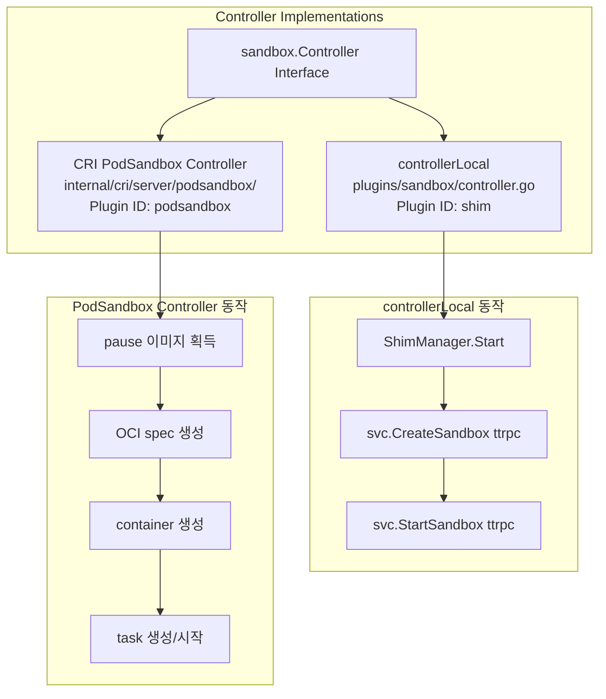

# 18. Sandbox System Deep-Dive

## 목차
1. [개요](#1-개요)
2. [아키텍처](#2-아키텍처)
3. [Sandbox 데이터 모델](#3-sandbox-데이터-모델)
4. [Controller 인터페이스](#4-controller-인터페이스)
5. [Store 인터페이스](#5-store-인터페이스)
6. [controllerLocal: Shim 기반 구현](#6-controllerlocal-shim-기반-구현)
7. [CRI와 Sandbox의 관계](#7-cri와-sandbox의-관계)
8. [CRI PodSandbox Controller](#8-cri-podsandbox-controller)
9. [CRI Sandbox Store](#9-cri-sandbox-store)
10. [gRPC 서비스 계층](#10-grpc-서비스-계층)
11. [Sandbox 생명주기](#11-sandbox-생명주기)
12. [Protobuf 직렬화](#12-protobuf-직렬화)
13. [설계 결정과 Why](#13-설계-결정과-why)
14. [운영 고려사항](#14-운영-고려사항)

---

## 1. 개요

Sandbox는 containerd v2.0에서 도입된 핵심 추상화로, Kubernetes Pod를 containerd 수준에서 일급 객체(first-class object)로 표현한다. v1.x에서는 Pod가 "특별한 컨테이너"(pause container)로만 존재했으나, v2.0에서는 Sandbox라는 독립된 개념으로 승격되어 별도의 API, 저장소, 컨트롤러를 가진다.

### Sandbox가 해결하는 문제

| 문제 | v1.x (기존) | v2.0 Sandbox |
|------|------------|-------------|
| Pod 표현 | pause 컨테이너로 간접 표현 | Sandbox 일급 객체 |
| Pod 생명주기 | Task API로 관리 | Sandbox Controller API |
| Pod 메타데이터 | 컨테이너 라벨에 임베딩 | 독립 저장소 (BoltDB sandbox 버킷) |
| Shim 관리 | 컨테이너별 shim 인스턴스 | Sandbox 단위 shim (Pod 내 컨테이너 공유) |
| 확장 가능성 | CRI 전용 | Controller 플러그인으로 다양한 샌드박스 구현 가능 |

### 핵심 소스 파일

| 파일 | 역할 |
|------|------|
| `core/sandbox/store.go` | Sandbox struct, Store 인터페이스 정의 |
| `core/sandbox/controller.go` | Controller 인터페이스, CreateOptions, StopOptions |
| `core/sandbox/helpers.go` | ToProto/FromProto 변환 |
| `core/sandbox/bridge.go` | gRPC/ttrpc 브릿지 클라이언트 |
| `plugins/sandbox/controller.go` | controllerLocal (shim 기반 구현) |
| `core/metadata/sandbox.go` | sandboxStore (BoltDB 메타데이터 저장소) |
| `plugins/services/sandbox/controller_service.go` | gRPC Controller 서비스 |
| `plugins/services/sandbox/store_local.go` | Sandbox Store 플러그인 등록 |
| `internal/cri/server/podsandbox/sandbox_run.go` | CRI PodSandbox Controller |
| `internal/cri/store/sandbox/sandbox.go` | CRI 내부 Sandbox Store (인메모리) |
| `internal/cri/store/sandbox/status.go` | CRI Sandbox 상태 머신 |
| `internal/cri/store/sandbox/metadata.go` | CRI Sandbox 메타데이터 |

---

## 2. 아키텍처

### 전체 계층 구조

```
 ┌───────────────────────────────────────────────────────────┐
 │                   Kubernetes kubelet                       │
 │                     (CRI Client)                           │
 └────────────────────────┬──────────────────────────────────┘
                          │ CRI gRPC (RunPodSandbox, StopPodSandbox, ...)
                          ▼
 ┌───────────────────────────────────────────────────────────┐
 │                    CRI Plugin                              │
 │              (criService / RunPodSandbox)                   │
 │                                                            │
 │  ┌──────────────────────────────────────────────────────┐  │
 │  │  Sandbox Store (core/sandbox/Store)                  │  │
 │  │    Create → metadata를 BoltDB에 저장                  │  │
 │  └──────────────────────────────────────────────────────┘  │
 │  ┌──────────────────────────────────────────────────────┐  │
 │  │  Sandbox Controller (core/sandbox/Controller)        │  │
 │  │    Create → Shim 시작, Stop → Shim 중지              │  │
 │  └──────────────────────────────────────────────────────┘  │
 └────────────────────────┬──────────────────────────────────┘
                          │
          ┌───────────────┼───────────────┐
          ▼               ▼               ▼
 ┌──────────────┐ ┌──────────────┐ ┌──────────────┐
 │ controllerL  │ │ PodSandbox   │ │ sandboxStore  │
 │ (shim 기반)  │ │ Controller   │ │ (BoltDB)      │
 │ plugins/     │ │ (CRI 전용)   │ │ core/         │
 │ sandbox/     │ │ internal/    │ │ metadata/     │
 │ controller   │ │ cri/server/  │ │ sandbox.go    │
 └──────┬───────┘ │ podsandbox/  │ └──────────────┘
        │         └──────┬───────┘
        │                │
        ▼                ▼
 ┌──────────────────────────────┐
 │       Shim (runc 등)         │
 │  ttrpc SandboxService API    │
 │                              │
 │  CreateSandbox / StartSandbox│
 │  StopSandbox / WaitSandbox   │
 │  ShutdownSandbox             │
 └──────────────────────────────┘
```

### 두 가지 Controller 구현

containerd는 두 가지 Sandbox Controller 구현을 제공한다:



---

## 3. Sandbox 데이터 모델

### 3.1 Sandbox 구조체

> 소스: `core/sandbox/store.go` 29~46행

```go
type Sandbox struct {
    // ID uniquely identifies the sandbox in a namespace
    ID string
    // Labels provide metadata extension for a sandbox
    Labels map[string]string
    // Runtime shim to use for this sandbox
    Runtime RuntimeOpts
    // Spec carries the runtime specification used to implement the sandbox
    Spec typeurl.Any
    // Sandboxer is the sandbox controller who manages the sandbox
    Sandboxer string
    // CreatedAt is the time at which the sandbox was created
    CreatedAt time.Time
    // UpdatedAt is the time at which the sandbox was updated
    UpdatedAt time.Time
    // Extensions stores client-specified metadata
    Extensions map[string]typeurl.Any
}
```

| 필드 | 타입 | 설명 |
|------|------|------|
| ID | string | 네임스페이스 내 고유 식별자 (UUID 또는 사용자 지정) |
| Labels | map[string]string | 임의의 메타데이터 라벨 |
| Runtime | RuntimeOpts | 런타임 이름과 옵션 (e.g., "io.containerd.runc.v2") |
| Spec | typeurl.Any | OCI 런타임 스펙 (임의 직렬화) |
| Sandboxer | string | 이 샌드박스를 관리하는 Controller 이름 |
| CreatedAt | time.Time | 생성 시각 |
| UpdatedAt | time.Time | 마지막 수정 시각 |
| Extensions | map[string]typeurl.Any | 클라이언트 확장 메타데이터 |

### 3.2 RuntimeOpts

> 소스: `core/sandbox/store.go` 49~52행

```go
type RuntimeOpts struct {
    Name    string      // e.g. "io.containerd.runc.v2"
    Options typeurl.Any // 런타임별 옵션 (protobuf)
}
```

`RuntimeOpts.Name`은 어떤 shim 바이너리를 사용할지 결정한다. containerd는 이 이름으로 `containerd-shim-runc-v2` 같은 실행 파일을 찾아 실행한다.

### 3.3 헬퍼 메서드

> 소스: `core/sandbox/store.go` 73~118행

```go
// Extension 추가
func (s *Sandbox) AddExtension(name string, obj interface{}) error {
    if s.Extensions == nil {
        s.Extensions = map[string]typeurl.Any{}
    }
    out, err := typeurl.MarshalAny(obj)
    s.Extensions[name] = out
    return nil
}

// Label 추가
func (s *Sandbox) AddLabel(name string, value string) {
    if s.Labels == nil {
        s.Labels = map[string]string{}
    }
    s.Labels[name] = value
}

// Extension 조회
func (s *Sandbox) GetExtension(name string, obj interface{}) error {
    out, ok := s.Extensions[name]
    if !ok {
        return errdefs.ErrNotFound
    }
    return typeurl.UnmarshalTo(out, obj)
}

// Label 조회
func (s *Sandbox) GetLabel(name string) (string, error) {
    out, ok := s.Labels[name]
    if !ok {
        return "", fmt.Errorf("unable to find label %q in sandbox metadata: %w", name, errdefs.ErrNotFound)
    }
    return out, nil
}
```

Extensions는 `typeurl.Any`로 직렬화된 임의의 데이터를 저장할 수 있다. CRI 플러그인은 이를 통해 `PodSandboxConfig`를 sandbox 메타데이터에 연결한다.

---

## 4. Controller 인터페이스

### 4.1 인터페이스 정의

> 소스: `core/sandbox/controller.go` 95~117행

```go
// Controller is an interface to manage sandboxes at runtime.
// When running in sandbox mode, shim expected to implement `SandboxService`.
// Shim lifetimes are now managed manually via sandbox API by the containerd's client.
type Controller interface {
    // Create is used to initialize sandbox environment. (mounts, any)
    Create(ctx context.Context, sandboxInfo Sandbox, opts ...CreateOpt) error
    // Start will start previously created sandbox.
    Start(ctx context.Context, sandboxID string) (ControllerInstance, error)
    // Platform returns target sandbox OS that will be used by Controller.
    Platform(_ctx context.Context, _sandboxID string) (imagespec.Platform, error)
    // Stop will stop sandbox instance
    Stop(ctx context.Context, sandboxID string, opts ...StopOpt) error
    // Wait blocks until sandbox process exits.
    Wait(ctx context.Context, sandboxID string) (ExitStatus, error)
    // Status will query sandbox process status.
    Status(ctx context.Context, sandboxID string, verbose bool) (ControllerStatus, error)
    // Shutdown deletes and cleans all tasks and sandbox instance.
    Shutdown(ctx context.Context, sandboxID string) error
    // Metrics queries the sandbox for metrics.
    Metrics(ctx context.Context, sandboxID string) (*types.Metric, error)
    // Update changes a part of sandbox.
    Update(ctx context.Context, sandboxID string, sandbox Sandbox, fields ...string) error
}
```

### 4.2 메서드별 역할

| 메서드 | 역할 | 반환값 |
|--------|------|--------|
| Create | Shim 프로세스 시작 + sandbox 환경 초기화 | error |
| Start | 초기화된 sandbox를 실제 실행 | ControllerInstance (PID, Address) |
| Platform | sandbox의 타겟 OS/아키텍처 조회 | imagespec.Platform |
| Stop | sandbox 중지 (graceful) | error |
| Wait | sandbox 프로세스 종료 대기 (blocking) | ExitStatus |
| Status | sandbox 상태 조회 | ControllerStatus |
| Shutdown | sandbox와 모든 리소스 완전 삭제 | error |
| Metrics | sandbox 메트릭 수집 | types.Metric |
| Update | sandbox 메타데이터/설정 변경 | error |

### 4.3 CreateOptions / StopOptions

> 소스: `core/sandbox/controller.go` 30~90행

```go
type CreateOptions struct {
    Rootfs      []mount.Mount   // 루트 파일시스템 마운트
    Options     typeurl.Any     // PodSandboxConfig 등 임의 옵션
    NetNSPath   string          // 네트워크 네임스페이스 경로
    Annotations map[string]string
}

type StopOptions struct {
    Timeout *time.Duration      // graceful 종료 대기 시간
}
```

Functional Options 패턴으로 구현:

```go
// Rootfs 마운트 설정
func WithRootFS(m []mount.Mount) CreateOpt { ... }
// 임의 옵션 (PodSandboxConfig)
func WithOptions(options any) CreateOpt { ... }
// 네트워크 네임스페이스
func WithNetNSPath(netNSPath string) CreateOpt { ... }
// 어노테이션
func WithAnnotations(annotations map[string]string) CreateOpt { ... }
// 종료 타임아웃
func WithTimeout(timeout time.Duration) StopOpt { ... }
```

### 4.4 ControllerInstance / ControllerStatus / ExitStatus

> 소스: `core/sandbox/controller.go` 119~144행

```go
type ControllerInstance struct {
    SandboxID string
    Pid       uint32          // sandbox init 프로세스 PID
    CreatedAt time.Time
    Address   string          // shim 소켓 주소
    Version   uint32          // ttrpc 프로토콜 버전
    Labels    map[string]string
    Spec      typeurl.Any
}

type ExitStatus struct {
    ExitStatus uint32
    ExitedAt   time.Time
}

type ControllerStatus struct {
    SandboxID string
    Pid       uint32
    State     string          // "SANDBOX_READY", "SANDBOX_NOTREADY" 등
    Info      map[string]string
    CreatedAt time.Time
    ExitedAt  time.Time
    Extra     typeurl.Any
    Address   string
    Version   uint32
}
```

`ControllerInstance.Address`는 shim의 ttrpc 소켓 경로이다. 이 주소를 통해 containerd → shim 간 직접 통신이 가능하다.

---

## 5. Store 인터페이스

### 5.1 인터페이스 정의

> 소스: `core/sandbox/store.go` 55~70행

```go
type Store interface {
    // Create a sandbox record in the store
    Create(ctx context.Context, sandbox Sandbox) (Sandbox, error)
    // Update the sandbox with the provided sandbox object and fields
    Update(ctx context.Context, sandbox Sandbox, fieldpaths ...string) (Sandbox, error)
    // Get sandbox metadata using the id
    Get(ctx context.Context, id string) (Sandbox, error)
    // List returns sandboxes that match one or more of the provided filters
    List(ctx context.Context, filters ...string) ([]Sandbox, error)
    // Delete a sandbox from metadata store using the id
    Delete(ctx context.Context, id string) error
}
```

Store는 순수 CRUD 인터페이스로, sandbox 메타데이터의 영속적 저장만 담당한다. 런타임 관리(프로세스 시작/중지)는 Controller의 역할이다.

### 5.2 BoltDB sandboxStore 구현

> 소스: `core/metadata/sandbox.go` 42~51행

```go
type sandboxStore struct {
    db *DB
}

var _ api.Store = (*sandboxStore)(nil)

func NewSandboxStore(db *DB) api.Store {
    return &sandboxStore{db: db}
}
```

### 5.3 Create

> 소스: `core/metadata/sandbox.go` 54~93행

```go
func (s *sandboxStore) Create(ctx context.Context, sandbox api.Sandbox) (api.Sandbox, error) {
    ns, err := namespaces.NamespaceRequired(ctx)
    if err != nil {
        return api.Sandbox{}, err
    }

    sandbox.CreatedAt = time.Now().UTC()
    sandbox.UpdatedAt = sandbox.CreatedAt

    if err := s.validate(&sandbox); err != nil {
        return api.Sandbox{}, fmt.Errorf("failed to validate sandbox: %w", err)
    }

    if err := update(ctx, s.db, func(tx *bbolt.Tx) error {
        parent, err := createSandboxBucket(tx, ns)
        if err != nil {
            return fmt.Errorf("create error: %w", err)
        }
        if err := s.write(parent, &sandbox, false); err != nil {
            return fmt.Errorf("write error: %w", err)
        }
        return nil
    }); err != nil {
        return api.Sandbox{}, err
    }

    return sandbox, nil
}
```

`createSandboxBucket(tx, ns)`는 BoltDB에서 `v1/{namespace}/sandboxes/` 버킷을 생성한다. `overwrite=false`이면 이미 존재하는 ID에 대해 `ErrAlreadyExists`를 반환한다.

### 5.4 Update (Field Mask 패턴)

> 소스: `core/metadata/sandbox.go` 96~179행

```go
func (s *sandboxStore) Update(ctx context.Context, sandbox api.Sandbox, fieldpaths ...string) (api.Sandbox, error) {
    // ...
    if err := update(ctx, s.db, func(tx *bbolt.Tx) error {
        // 기존 데이터 읽기
        updated, err := s.read(parent, []byte(sandbox.ID))

        // fieldpaths가 비어있으면 기본 필드 업데이트
        if len(fieldpaths) == 0 {
            fieldpaths = []string{"labels", "extensions", "spec", "runtime"}

            // Runtime.Name은 불변 필드
            if updated.Runtime.Name != sandbox.Runtime.Name {
                return fmt.Errorf("sandbox.Runtime.Name field is immutable: %w", errdefs.ErrInvalidArgument)
            }
        }

        // 각 필드 경로에 따라 선택적 업데이트
        for _, path := range fieldpaths {
            if strings.HasPrefix(path, "labels.") {
                key := strings.TrimPrefix(path, "labels.")
                updated.Labels[key] = sandbox.Labels[key]
                continue
            } else if strings.HasPrefix(path, "extensions.") {
                key := strings.TrimPrefix(path, "extensions.")
                updated.Extensions[key] = sandbox.Extensions[key]
                continue
            }

            switch path {
            case "labels":
                updated.Labels = sandbox.Labels
            case "extensions":
                updated.Extensions = sandbox.Extensions
            case "runtime":
                updated.Runtime = sandbox.Runtime
            case "spec":
                updated.Spec = sandbox.Spec
            default:
                return fmt.Errorf("cannot update %q field on sandbox %q: %w",
                    path, sandbox.ID, errdefs.ErrInvalidArgument)
            }
        }

        updated.UpdatedAt = time.Now().UTC()
        return s.write(parent, &updated, true)
    }); err != nil {
        return api.Sandbox{}, err
    }
    // ...
}
```

**Field Mask 패턴의 동작:**

```
fieldpaths = ["labels.app", "extensions.custom"]

→ "labels.app"      : updated.Labels["app"] = sandbox.Labels["app"]
→ "extensions.custom": updated.Extensions["custom"] = sandbox.Extensions["custom"]

fieldpaths = ["labels"]

→ "labels" : updated.Labels = sandbox.Labels  (전체 교체)
```

개별 키(`labels.key`)와 전체 필드(`labels`) 두 가지 수준의 업데이트를 지원한다. `Runtime.Name`은 불변이므로 변경 시도 시 에러를 반환한다.

### 5.5 BoltDB 직렬화 (write/read)

> 소스: `core/metadata/sandbox.go` 290~401행

```go
func (s *sandboxStore) write(parent *bbolt.Bucket, instance *api.Sandbox, overwrite bool) error {
    var bucket *bbolt.Bucket
    if overwrite {
        bucket, _ = parent.CreateBucketIfNotExists(id)
    } else {
        bucket, _ = parent.CreateBucket(id)  // 중복시 ErrAlreadyExists
    }

    boltutil.WriteTimestamps(bucket, instance.CreatedAt, instance.UpdatedAt)
    boltutil.WriteLabels(bucket, instance.Labels)
    boltutil.WriteExtensions(bucket, instance.Extensions)
    boltutil.WriteAny(bucket, bucketKeySpec, instance.Spec)
    bucket.Put(bucketKeySandboxer, []byte(instance.Sandboxer))

    runtimeBucket, _ := bucket.CreateBucketIfNotExists(bucketKeyRuntime)
    runtimeBucket.Put(bucketKeyName, []byte(instance.Runtime.Name))
    boltutil.WriteAny(runtimeBucket, bucketKeyOptions, instance.Runtime.Options)
    return nil
}
```

BoltDB 버킷 구조:

```
v1/
  {namespace}/
    sandboxes/
      {sandbox-id}/           ← 개별 sandbox 버킷
        created               ← CreatedAt 타임스탬프
        updated               ← UpdatedAt 타임스탬프
        labels/               ← Labels 맵
          key1 = value1
          key2 = value2
        extensions/           ← Extensions 맵 (Any 직렬화)
          ext1 = <protobuf>
        spec                  ← OCI Spec (Any 직렬화)
        sandboxer             ← Controller 이름
        runtime/              ← RuntimeOpts 서브버킷
          name                ← 런타임 이름
          options             ← 런타임 옵션 (Any 직렬화)
```

### 5.6 플러그인 등록

> 소스: `plugins/services/sandbox/store_local.go` 26~42행

```go
func init() {
    registry.Register(&plugin.Registration{
        Type: plugins.SandboxStorePlugin,
        ID:   "local",
        Requires: []plugin.Type{
            plugins.MetadataPlugin,
        },
        InitFn: func(ic *plugin.InitContext) (interface{}, error) {
            m, err := ic.GetSingle(plugins.MetadataPlugin)
            return metadata.NewSandboxStore(m.(*metadata.DB)), nil
        },
    })
}
```

SandboxStore 플러그인은 MetadataPlugin(BoltDB)에 의존하며, `metadata.NewSandboxStore`로 BoltDB 기반 저장소를 생성한다.

---

## 6. controllerLocal: Shim 기반 구현

### 6.1 구조체와 플러그인 등록

> 소스: `plugins/sandbox/controller.go` 45~93행

```go
func init() {
    registry.Register(&plugin.Registration{
        Type: plugins.SandboxControllerPlugin,
        ID:   "shim",
        Requires: []plugin.Type{
            plugins.ShimPlugin,
            plugins.EventPlugin,
        },
        InitFn: func(ic *plugin.InitContext) (interface{}, error) {
            shimPlugin, _ := ic.GetSingle(plugins.ShimPlugin)
            exchangePlugin, _ := ic.GetByID(plugins.EventPlugin, "exchange")

            shims := shimPlugin.(*v2.ShimManager)
            publisher := exchangePlugin.(*exchange.Exchange)

            // 기존 shim 프로세스 로드
            shims.LoadExistingShims(ic.Context, state, root)

            return &controllerLocal{
                root:      root,
                state:     state,
                shims:     shims,
                publisher: publisher,
            }, nil
        },
    })
}

type controllerLocal struct {
    root      string            // 영구 데이터 경로
    state     string            // 런타임 상태 경로
    shims     *v2.ShimManager   // shim 프로세스 관리자
    publisher events.Publisher  // 이벤트 발행자
}
```

`LoadExistingShims`는 containerd 재시작 시 이전에 실행 중이던 shim 프로세스들을 재연결한다. 이를 통해 containerd가 재시작해도 실행 중인 sandbox가 유지된다.

### 6.2 Create: Shim 시작 + sandbox 환경 초기화

> 소스: `plugins/sandbox/controller.go` 123~172행

```go
func (c *controllerLocal) Create(ctx context.Context, info sandbox.Sandbox, opts ...sandbox.CreateOpt) (retErr error) {
    var coptions sandbox.CreateOptions
    sandboxID := info.ID
    for _, opt := range opts {
        opt(&coptions)
    }

    // 1. 이미 실행 중인지 확인
    if _, err := c.shims.Get(ctx, sandboxID); err == nil {
        return fmt.Errorf("sandbox %s already running: %w", sandboxID, errdefs.ErrAlreadyExists)
    }

    // 2. Bundle 디렉토리 생성
    bundle, err := v2.NewBundle(ctx, c.root, c.state, sandboxID, info.Spec)
    defer func() {
        if retErr != nil {
            bundle.Delete()  // 실패시 정리
        }
    }()

    // 3. Shim 프로세스 시작
    shim, err := c.shims.Start(ctx, sandboxID, bundle, runtime.CreateOpts{
        Spec:           info.Spec,
        RuntimeOptions: info.Runtime.Options,
        Runtime:        info.Runtime.Name,
    })

    // 4. Shim에 ttrpc로 CreateSandbox 호출
    svc, _ := sandbox.NewClient(shim.Client())
    svc.CreateSandbox(ctx, &runtimeAPI.CreateSandboxRequest{
        SandboxID:   sandboxID,
        BundlePath:  shim.Bundle(),
        Rootfs:      mount.ToProto(coptions.Rootfs),
        Options:     typeurl.MarshalProto(coptions.Options),
        NetnsPath:   coptions.NetNSPath,
        Annotations: coptions.Annotations,
    })
    return nil
}
```

Create 흐름:

```
  controllerLocal.Create(info)
    │
    ├── 1. shims.Get(id) → 중복 체크
    │
    ├── 2. v2.NewBundle() → bundle 디렉토리 생성
    │       ├── {root}/{id}/
    │       └── {state}/{id}/
    │
    ├── 3. shims.Start() → shim 프로세스 fork/exec
    │       ├── containerd-shim-runc-v2 start
    │       └── ttrpc 소켓 연결
    │
    └── 4. svc.CreateSandbox() → ttrpc RPC
            ├── sandboxID, bundlePath
            ├── rootfs 마운트 정보
            ├── netns 경로
            └── annotations
```

### 6.3 Start: Sandbox 실행

> 소스: `plugins/sandbox/controller.go` 174~199행

```go
func (c *controllerLocal) Start(ctx context.Context, sandboxID string) (sandbox.ControllerInstance, error) {
    // 1. ShimManager에서 shim 조회
    shim, _ := c.shims.Get(ctx, sandboxID)

    // 2. ttrpc 클라이언트 획득
    svc, _ := sandbox.NewClient(shim.Client())

    // 3. StartSandbox ttrpc 호출
    resp, err := svc.StartSandbox(ctx, &runtimeAPI.StartSandboxRequest{SandboxID: sandboxID})
    if err != nil {
        c.cleanupShim(ctx, sandboxID, svc)  // 실패시 shim 정리
        return sandbox.ControllerInstance{}, err
    }

    // 4. 결과 반환
    address, version := shim.Endpoint()
    return sandbox.ControllerInstance{
        SandboxID: sandboxID,
        Pid:       resp.GetPid(),
        Address:   address,
        Version:   uint32(version),
        CreatedAt: resp.GetCreatedAt().AsTime(),
        Spec:      resp.GetSpec(),
    }, nil
}
```

### 6.4 Stop / Shutdown / Wait

> 소스: `plugins/sandbox/controller.go` 221~285행

```go
// Stop: graceful 종료
func (c *controllerLocal) Stop(ctx context.Context, sandboxID string, opts ...sandbox.StopOpt) error {
    var soptions sandbox.StopOptions
    for _, opt := range opts {
        opt(&soptions)
    }

    svc, err := c.getSandbox(ctx, sandboxID)
    if errdefs.IsNotFound(err) {
        return nil  // 이미 없으면 성공
    }

    req := &runtimeAPI.StopSandboxRequest{SandboxID: sandboxID}
    if soptions.Timeout != nil {
        req.TimeoutSecs = uint32(soptions.Timeout.Seconds())
    }

    svc.StopSandbox(ctx, req)
    return nil
}

// Shutdown: 완전 삭제
func (c *controllerLocal) Shutdown(ctx context.Context, sandboxID string) error {
    svc, _ := c.getSandbox(ctx, sandboxID)
    svc.ShutdownSandbox(ctx, &runtimeAPI.ShutdownSandboxRequest{SandboxID: sandboxID})
    c.shims.Delete(ctx, sandboxID)  // shim 프로세스와 bundle 삭제
    return nil
}

// Wait: 종료 대기 (blocking)
func (c *controllerLocal) Wait(ctx context.Context, sandboxID string) (sandbox.ExitStatus, error) {
    svc, _ := c.getSandbox(ctx, sandboxID)
    resp, _ := svc.WaitSandbox(ctx, &runtimeAPI.WaitSandboxRequest{SandboxID: sandboxID})
    return sandbox.ExitStatus{
        ExitStatus: resp.GetExitStatus(),
        ExitedAt:   resp.GetExitedAt().AsTime(),
    }, nil
}
```

### 6.5 cleanupShim 에러 처리

> 소스: `plugins/sandbox/controller.go` 104~121행

```go
func (c *controllerLocal) cleanupShim(ctx context.Context, sandboxID string, svc runtimeAPI.TTRPCSandboxService) {
    // 1. Shim에 shutdown 요청
    if _, sErr := svc.ShutdownSandbox(ctx, &runtimeAPI.ShutdownSandboxRequest{
        SandboxID: sandboxID,
    }); sErr != nil {
        log.G(ctx).WithError(sErr).Error("failed to shutdown sandbox")
    }

    // 2. 5초 타임아웃으로 shim 삭제
    ctx, cancel := context.WithTimeout(ctx, 5*time.Second)
    defer cancel()

    if dErr := c.shims.Delete(ctx, sandboxID); dErr != nil {
        log.G(ctx).WithError(dErr).Error("failed to delete shim")
    }
}
```

Create나 Start 실패 시 `cleanupShim`이 호출되어 shim 프로세스를 정리한다. 5초 타임아웃은 응답 없는 shim에 대한 안전장치이다.

### 6.6 gRPC/ttrpc 브릿지

> 소스: `core/sandbox/bridge.go` 30~82행

```go
func NewClient(client interface{}) (api.TTRPCSandboxService, error) {
    switch c := client.(type) {
    case *ttrpc.Client:
        return api.NewTTRPCSandboxClient(c), nil
    case grpc.ClientConnInterface:
        return &grpcBridge{api.NewSandboxClient(c)}, nil
    default:
        return nil, fmt.Errorf("unsupported client type %T", client)
    }
}
```

`NewClient`는 ttrpc 클라이언트(로컬 shim)와 gRPC 클라이언트(원격) 모두를 `TTRPCSandboxService` 인터페이스로 통합한다. `grpcBridge`는 gRPC 호출을 ttrpc 인터페이스에 맞게 변환하는 어댑터이다.

---

## 7. CRI와 Sandbox의 관계

### 7.1 CRI → Sandbox 매핑

```
 CRI (Kubernetes)                 containerd Sandbox
 ───────────────────────────────────────────────────
 PodSandboxConfig                 Sandbox.Extensions["sandbox-metadata"]
 PodSandboxConfig.Metadata.Name   CRI Metadata.Name
 PodSandboxConfig.Labels          Sandbox.Labels (일부)
 RuntimeHandler                   Sandbox.Runtime.Name
 PodSandboxId                     Sandbox.ID
 NetworkNamespace                 CreateOptions.NetNSPath
```

### 7.2 두 레벨의 Sandbox 저장소

containerd에는 Sandbox 관련 저장소가 두 개 존재한다:

```
 ┌─────────────────────────────────────────────────────────┐
 │  1. core/sandbox.Store (BoltDB 기반, 영속적)              │
 │     - 전체 containerd API에서 사용                        │
 │     - Sandbox 메타데이터의 원본(source of truth)           │
 │     - 네임스페이스별 격리                                  │
 │     - 소스: core/metadata/sandbox.go                     │
 └─────────────────────────────────────────────────────────┘

 ┌─────────────────────────────────────────────────────────┐
 │  2. CRI Sandbox Store (인메모리, 비영속적)                 │
 │     - CRI 플러그인 내부에서만 사용                         │
 │     - 런타임 상태(PID, Ready/NotReady)를 빠르게 조회       │
 │     - containerd 재시작 시 BoltDB에서 재구성               │
 │     - 소스: internal/cri/store/sandbox/sandbox.go        │
 └─────────────────────────────────────────────────────────┘
```

**왜 두 개인가?** BoltDB 기반 Store는 트랜잭션 비용이 있어 매 CRI 호출마다 접근하기에는 느리다. 인메모리 Store는 PID, 상태 등 자주 조회되는 런타임 정보를 O(1)으로 제공한다.

---

## 8. CRI PodSandbox Controller

### 8.1 Controller.Start() 상세 흐름

> 소스: `internal/cri/server/podsandbox/sandbox_run.go` 60~330행

CRI의 PodSandbox Controller는 `plugins.PodSandboxPlugin` 타입으로 등록되며, Kubernetes Pod의 sandbox 컨테이너를 관리한다.

```
  Controller.Start(ctx, id)
    │
    ├── 1. 내부 store에서 podSandbox 조회
    │
    ├── 2. pause 이미지 획득
    │       └── getSandboxImageName() → PinnedImages["sandbox"]
    │
    ├── 3. OCI 런타임 선택
    │       └── config.GetSandboxRuntime(config, runtimeHandler)
    │
    ├── 4. sandbox root 디렉토리 생성
    │       ├── sandboxRootDir (영구)
    │       └── volatileSandboxRootDir (휘발성)
    │
    ├── 5. OCI spec 생성
    │       └── sandboxContainerSpec(id, config, imageSpec, netNSPath, ...)
    │
    ├── 6. SELinux 처리
    │       └── privileged면 selinux label 제거
    │
    ├── 7. containerd Container 생성
    │       ├── WithSnapshotter(sandboxSnapshotter)
    │       ├── WithNewSnapshot(id, pauseImage, ...)
    │       ├── WithSpec(spec, specOpts...)
    │       ├── WithContainerLabels(sandboxLabels)
    │       ├── WithContainerExtension("sandbox-metadata", metadata)
    │       └── WithRuntime(ociRuntime.Type, options)
    │
    ├── 8. sandbox 파일 설정
    │       └── setupSandboxFiles(id, config) - resolv.conf, hostname 등
    │
    ├── 9. Task 생성 및 시작
    │       ├── container.NewTask(ctx, NullIO, taskOpts...)
    │       ├── task.Wait(ctx) → exitCh (비동기)
    │       ├── nri.InvokeWithSandbox (NRI v0.1.0 호환)
    │       └── task.Start(ctx)
    │
    ├── 10. 상태 업데이트
    │        └── Status.Update: Pid, State=Ready, CreatedAt
    │
    └── 11. 비동기 exit 모니터
             └── go waitSandboxExit(ctx, podSandbox, exitCh)
```

### 8.2 에러 시 정리 (defer 체인)

```go
defer func() {
    if retErr != nil {
        // 역순으로 정리
        task.Delete(...)         // 9단계 정리
        cleanupSandboxFiles(...)  // 8단계 정리
        container.Delete(...)     // 7단계 정리
        os.RemoveAll(volatile...) // 4단계 정리
        os.RemoveAll(root...)     // 4단계 정리
        selinux.ReleaseLabel(...) // 6단계 정리
    }
}()
```

각 리소스 생성 직후에 defer로 정리 함수를 등록한다. `cleanupErr`를 사용하여 첫 번째 정리 에러만 기록하고, 후속 정리 시도는 이전 정리가 실패했으면 건너뛴다.

### 8.3 Controller.Create()

> 소스: `internal/cri/server/podsandbox/sandbox_run.go` 332~341행

```go
func (c *Controller) Create(_ctx context.Context, info sandbox.Sandbox, opts ...sandbox.CreateOpt) error {
    metadata := sandboxstore.Metadata{}
    if err := info.GetExtension(MetadataKey, &metadata); err != nil {
        return fmt.Errorf("failed to get sandbox %q metadata: %w", info.ID, err)
    }
    podSandbox := types.NewPodSandbox(info.ID, sandboxstore.Status{State: sandboxstore.StateUnknown})
    podSandbox.Metadata = metadata
    podSandbox.Runtime = info.Runtime
    return c.store.Save(podSandbox)
}
```

CRI Controller의 Create는 가벼운 연산이다: sandbox의 Extension에서 CRI 메타데이터를 추출하여 내부 store에 저장만 한다. 실제 리소스 생성은 Start()에서 수행한다.

---

## 9. CRI Sandbox Store

### 9.1 상태 머신

> 소스: `internal/cri/store/sandbox/status.go` 27~79행

```
                    +              +
                    |              |
                    | Create(Run)  | Load
                    |              |
                    |              |    Start
                    |              |(failed and not cleaned)
      Start         |--------------|--------------+
 (failed but cleaned)|              |              |
 +------------------+              |-----------+  |
 |                  | Start(Run)   |           |  |
 |                  |              |           |  |
 | PortForward +----v----+         |           |  |
 |      +------+         |         |           |  |
 |      |      |  READY  <---------+           |  |
 |      +------>         |         |           |  |
 |             +----+----+         |           |  |
 |                  |              |           |  |
 |                  | Stop/Exit    |           |  |
 |                  |              |           |  |
 |             +----v----+         |           |  |
 |             |         <---------+      +----v--v-+
 |             | NOTREADY|                |         |
 |             |         <----------------+ UNKNOWN |
 |             +----+----+       Stop     |         |
 |                  |                     +---------+
 |                  | Remove
 |                  v
 +-------------> DELETED
```

```go
type State uint32

const (
    StateReady    State = iota  // 0: sandbox 컨테이너 실행 중
    StateNotReady               // 1: sandbox 컨테이너 중지됨
    StateUnknown                // 2: 상태 로드 실패
)
```

| 내부 상태 | CRI 상태 매핑 | 설명 |
|-----------|-------------|------|
| StateReady | SANDBOX_READY | sandbox가 정상 실행 중 |
| StateNotReady | SANDBOX_NOTREADY | sandbox가 중지되었지만 리소스 존재 |
| StateUnknown | SANDBOX_NOTREADY | 상태 로드 실패 (CRI에는 unknown이 없음) |

### 9.2 Status 구조체

> 소스: `internal/cri/store/sandbox/status.go` 97~112행

```go
type Status struct {
    Pid        uint32
    CreatedAt  time.Time
    ExitedAt   time.Time
    ExitStatus uint32
    State      State
    Overhead   *runtime.ContainerResources
    Resources  *runtime.ContainerResources
}
```

### 9.3 StatusStorage (인메모리, RWMutex 보호)

> 소스: `internal/cri/store/sandbox/status.go` 122~159행

```go
type StatusStorage interface {
    Get() Status
    Update(UpdateFunc) error
}

type statusStorage struct {
    sync.RWMutex
    status Status
}

func (s *statusStorage) Get() Status {
    s.RLock()
    defer s.RUnlock()
    return s.status
}

func (s *statusStorage) Update(u UpdateFunc) error {
    s.Lock()
    defer s.Unlock()
    newStatus, err := u(s.status)
    if err != nil {
        return err
    }
    s.status = newStatus
    return nil
}
```

**트랜잭션 보장:** `Update`는 `UpdateFunc`가 에러를 반환하면 상태를 변경하지 않는다(롤백). 이를 통해 상태 전이의 원자성을 보장한다.

### 9.4 CRI Sandbox Store (인메모리)

> 소스: `internal/cri/store/sandbox/sandbox.go` 32~49행

```go
type Sandbox struct {
    Metadata                       // 불변: ID, Name, Config, NetNSPath, ...
    Status    StatusStorage        // 가변: PID, State, CreatedAt, ...
    Sandboxer string               // Controller 이름
    NetNS     *netns.NetNS         // CNI 네트워크 네임스페이스
    *store.StopCh                  // 중지 신호 전파 채널
    Stats     *stats.ContainerStats
    Endpoint  Endpoint             // shim 주소
}

type Store struct {
    lock           sync.RWMutex
    sandboxes      map[string]Sandbox
    idIndex        *truncindex.TruncIndex  // ID prefix 검색
    labels         *label.Store            // SELinux 라벨 관리
    statsCollector store.StatsCollector
}
```

### 9.5 Metadata (CRI 전용)

> 소스: `internal/cri/store/sandbox/metadata.go` 46~65행

```go
type Metadata struct {
    ID             string
    Name           string
    Config         *runtime.PodSandboxConfig  // CRI PodSandboxConfig
    NetNSPath      string
    IP             string
    AdditionalIPs  []string
    RuntimeHandler string
    CNIResult      *cni.Result
    ProcessLabel   string                     // SELinux label
}
```

CRI Metadata는 containerd Sandbox의 Extension으로 저장된다:

```go
// 저장 시
sandbox.AddExtension("sandbox-metadata", &metadata)

// 조회 시
var metadata sandboxstore.Metadata
sandbox.GetExtension("sandbox-metadata", &metadata)
```

### 9.6 TruncIndex를 이용한 ID prefix 검색

```go
type Store struct {
    sandboxes map[string]Sandbox
    idIndex   *truncindex.TruncIndex
}

func (s *Store) Get(id string) (Sandbox, error) {
    id, err := s.idIndex.Get(id)  // prefix로 full ID 조회
    if sb, ok := s.sandboxes[id]; ok {
        return sb, nil
    }
    return Sandbox{}, errdefs.ErrNotFound
}
```

`TruncIndex`는 ID의 접두사만으로 전체 ID를 찾을 수 있게 해준다. Docker/containerd에서 `ctr t ls | grep abc`처럼 축약된 ID를 사용하는 것이 이 기능 덕분이다.

---

## 10. gRPC 서비스 계층

### 10.1 Controller Service

> 소스: `plugins/services/sandbox/controller_service.go` 42~87행

```go
func init() {
    registry.Register(&plugin.Registration{
        Type: plugins.GRPCPlugin,
        ID:   "sandbox-controllers",
        Requires: []plugin.Type{
            plugins.PodSandboxPlugin,        // CRI PodSandbox Controller
            plugins.SandboxControllerPlugin, // Shim 기반 Controller
            plugins.EventPlugin,
        },
        InitFn: func(ic *plugin.InitContext) (interface{}, error) {
            sc := make(map[string]sandbox.Controller)

            // PodSandboxPlugin 수집
            sandboxers, _ := ic.GetByType(plugins.PodSandboxPlugin)
            for name, p := range sandboxers {
                sc[name] = p.(sandbox.Controller)
            }

            // SandboxControllerPlugin 수집
            sandboxersV2, _ := ic.GetByType(plugins.SandboxControllerPlugin)
            for name, p := range sandboxersV2 {
                sc[name] = p.(sandbox.Controller)
            }

            publisher := ep.(events.Publisher)
            return &controllerService{sc: sc, publisher: publisher}, nil
        },
    })
}

type controllerService struct {
    sc        map[string]sandbox.Controller  // name → Controller 매핑
    publisher events.Publisher
    api.UnimplementedControllerServer
}
```

### 10.2 Controller 라우팅

> 소스: `plugins/services/sandbox/controller_service.go` 102~110행

```go
func (s *controllerService) getController(name string) (sandbox.Controller, error) {
    if len(name) == 0 {
        return nil, fmt.Errorf("%w: sandbox controller name can not be empty", errdefs.ErrInvalidArgument)
    }
    if ctrl, ok := s.sc[name]; ok {
        return ctrl, nil
    }
    return nil, fmt.Errorf("%w: failed to get sandbox controller by %s", errdefs.ErrNotFound, name)
}
```

gRPC 요청의 `sandboxer` 필드로 어떤 Controller를 사용할지 결정한다. 예를 들어:

- `sandboxer="podsandbox"` → CRI PodSandbox Controller
- `sandboxer="shim"` → controllerLocal (shim 기반)

### 10.3 이벤트 발행

각 Sandbox 생명주기 이벤트마다 Event를 발행한다:

```go
// Create 시
s.publisher.Publish(ctx, "sandboxes/create", &eventtypes.SandboxCreate{
    SandboxID: req.GetSandboxID(),
})

// Start 시
s.publisher.Publish(ctx, "sandboxes/start", &eventtypes.SandboxStart{
    SandboxID: req.GetSandboxID(),
})

// Wait (exit) 시
s.publisher.Publish(ctx, "sandboxes/exit", &eventtypes.SandboxExit{
    SandboxID:  req.GetSandboxID(),
    ExitStatus: exitStatus.ExitStatus,
    ExitedAt:   protobuf.ToTimestamp(exitStatus.ExitedAt),
})
```

| Topic | 이벤트 타입 | 발행 시점 |
|-------|-----------|----------|
| sandboxes/create | SandboxCreate | Controller.Create 성공 후 |
| sandboxes/start | SandboxStart | Controller.Start 성공 후 |
| sandboxes/exit | SandboxExit | Controller.Wait 반환 후 |

---

## 11. Sandbox 생명주기

### 11.1 전체 생명주기 다이어그램

```
  kubelet: RunPodSandbox(config)
    │
    ├── 1. CRI Plugin: criService.RunPodSandbox()
    │       ├── ID 생성 (UUID)
    │       ├── Lease 생성
    │       ├── 네트워크 네임스페이스 생성 (CNI)
    │       │
    │       ├── sandboxStore.Create(sandboxInfo)
    │       │   └── BoltDB에 메타데이터 저장
    │       │
    │       ├── controller.Create(sandboxInfo)
    │       │   └── CRI: 내부 store에 저장
    │       │   └── Shim: shim 프로세스 시작 + CreateSandbox ttrpc
    │       │
    │       └── controller.Start(id)
    │           └── CRI: pause 이미지, OCI spec, container, task 생성
    │           └── Shim: StartSandbox ttrpc
    │
    │                    ┌──────────────┐
    │                    │   READY      │
    │                    │ (Pod 실행중)  │
    │                    └──────┬───────┘
    │                           │
    ├── 2. 컨테이너 추가/실행 (CreateContainer, StartContainer)
    │       └── sandbox의 네임스페이스와 cgroup을 공유
    │
    ├── 3. CRI Plugin: criService.StopPodSandbox()
    │       ├── 모든 컨테이너 중지
    │       ├── controller.Stop(id, timeout)
    │       │   └── StopSandbox ttrpc
    │       └── CNI 네트워크 해제
    │
    │                    ┌──────────────┐
    │                    │  NOTREADY    │
    │                    │ (Pod 중지됨) │
    │                    └──────┬───────┘
    │                           │
    └── 4. CRI Plugin: criService.RemovePodSandbox()
            ├── 모든 컨테이너 제거
            ├── controller.Shutdown(id)
            │   └── ShutdownSandbox ttrpc + shim 삭제
            ├── sandboxStore.Delete(id)
            │   └── BoltDB에서 메타데이터 삭제
            └── 네트워크 네임스페이스 삭제

                         ┌──────────────┐
                         │   DELETED    │
                         └──────────────┘
```

### 11.2 Shim 기반 Sandbox의 통신 흐름

```
containerd                     shim (containerd-shim-runc-v2)
    │                              │
    │  ──── Start (fork/exec) ──→  │  프로세스 시작
    │                              │
    │  ←─── ttrpc 소켓 연결 ───── │
    │                              │
    │  ──── CreateSandbox ──────→  │  sandbox 환경 초기화
    │  ←─── CreateSandboxResp ──── │
    │                              │
    │  ──── StartSandbox ───────→  │  sandbox 프로세스 시작 (pause)
    │  ←─── StartSandboxResp ───── │  (pid, createdAt)
    │                              │
    │  ──── CreateTask ─────────→  │  컨테이너 task 생성 (동일 shim)
    │  ←─── CreateTaskResp ─────── │
    │                              │
    │  ──── StopSandbox ────────→  │  sandbox 중지
    │  ←─── StopSandboxResp ────── │
    │                              │
    │  ──── ShutdownSandbox ────→  │  shim 종료 준비
    │  ←─── ShutdownSandboxResp ── │
    │                              │
    │  ──── Delete (cleanup) ───→  │  프로세스 종료 + bundle 삭제
    │                              │
```

### 11.3 Pod 내 컨테이너와 Sandbox의 관계

```
 ┌─────────────────────────────────────────────┐
 │  Sandbox (Pod)                               │
 │  ID: abc123                                  │
 │  Runtime: io.containerd.runc.v2              │
 │                                              │
 │  ┌───────────────┐  ┌───────────────────┐    │
 │  │ pause 컨테이너 │  │ Shim Process      │    │
 │  │ (sandbox task)│  │ (PID 1234)        │    │
 │  │               │  │ ttrpc: /run/...   │    │
 │  └───────┬───────┘  └────────┬──────────┘    │
 │          │                   │               │
 │  ┌───────┴─────────────────┐ │               │
 │  │  공유 리소스               │ │               │
 │  │  - Network Namespace     │ │               │
 │  │  - IPC Namespace         │ │               │
 │  │  - UTS Namespace         │ │               │
 │  │  - PID Namespace (opt)   │ │               │
 │  └───────┬─────────────────┘ │               │
 │          │                   │               │
 │  ┌───────┴───────┐  ┌───────┴───────┐       │
 │  │ Container A   │  │ Container B   │       │
 │  │ (app)         │  │ (sidecar)     │       │
 │  │ Task on same  │  │ Task on same  │       │
 │  │ shim instance │  │ shim instance │       │
 │  └───────────────┘  └───────────────┘       │
 └─────────────────────────────────────────────┘
```

Pod 내 모든 컨테이너는 동일한 shim 인스턴스를 공유한다. 이 설계 덕분에:
- 네임스페이스 공유가 자연스럽다 (같은 shim이 관리)
- shim 프로세스 수가 Pod 수와 같아진다 (컨테이너 수가 아님)
- Pod 단위 리소스 관리가 가능하다

---

## 12. Protobuf 직렬화

### 12.1 ToProto / FromProto

> 소스: `core/sandbox/helpers.go` 27~69행

```go
func ToProto(sandbox *Sandbox) *types.Sandbox {
    extensions := make(map[string]*gogo_types.Any)
    for k, v := range sandbox.Extensions {
        extensions[k] = typeurl.MarshalProto(v)
    }
    return &types.Sandbox{
        SandboxID: sandbox.ID,
        Runtime: &types.Sandbox_Runtime{
            Name:    sandbox.Runtime.Name,
            Options: typeurl.MarshalProto(sandbox.Runtime.Options),
        },
        Sandboxer:  sandbox.Sandboxer,
        Labels:     sandbox.Labels,
        CreatedAt:  protobuf.ToTimestamp(sandbox.CreatedAt),
        UpdatedAt:  protobuf.ToTimestamp(sandbox.UpdatedAt),
        Extensions: extensions,
        Spec:       typeurl.MarshalProto(sandbox.Spec),
    }
}

func FromProto(sandboxpb *types.Sandbox) Sandbox {
    runtime := RuntimeOpts{
        Name:    sandboxpb.Runtime.Name,
        Options: sandboxpb.Runtime.Options,
    }
    extensions := make(map[string]typeurl.Any)
    for k, v := range sandboxpb.Extensions {
        extensions[k] = v
    }
    return Sandbox{
        ID:         sandboxpb.SandboxID,
        Labels:     sandboxpb.Labels,
        Runtime:    runtime,
        Spec:       sandboxpb.Spec,
        Sandboxer:  sandboxpb.Sandboxer,
        CreatedAt:  protobuf.FromTimestamp(sandboxpb.CreatedAt),
        UpdatedAt:  protobuf.FromTimestamp(sandboxpb.UpdatedAt),
        Extensions: extensions,
    }
}
```

`typeurl.Any`는 Go의 `interface{}`를 protobuf `Any`로 변환하는 유틸리티이다. Extensions의 각 값이 서로 다른 타입일 수 있으므로 `Any`로 직렬화한다.

### 12.2 CRI Metadata JSON 직렬화

> 소스: `internal/cri/store/sandbox/metadata.go` 32~88행

```go
const metadataVersion = "v1"

type versionedMetadata struct {
    Version  string
    Metadata metadataInternal
}

func (c *Metadata) MarshalJSON() ([]byte, error) {
    return json.Marshal(&versionedMetadata{
        Version:  metadataVersion,
        Metadata: metadataInternal(*c),
    })
}

func (c *Metadata) UnmarshalJSON(data []byte) error {
    versioned := &versionedMetadata{}
    json.Unmarshal(data, versioned)
    switch versioned.Version {
    case metadataVersion:
        *c = Metadata(versioned.Metadata)
        return nil
    }
    return fmt.Errorf("unsupported version: %q", versioned.Version)
}
```

CRI Metadata는 버전 관리된 JSON으로 직렬화된다. `metadataVersion`을 통해 향후 스키마 변경 시 하위 호환성을 유지할 수 있다.

---

## 13. 설계 결정과 Why

### 13.1 왜 Sandbox를 일급 객체로 만들었는가?

v1.x에서 Pod는 "pause 컨테이너"로만 존재했다. 이는 다음 문제를 야기했다:

1. **의미론적 불일치**: Pod는 컨테이너가 아닌데 컨테이너 API로 관리
2. **Shim 관리의 비효율**: 각 컨테이너마다 별도 shim 프로세스
3. **확장성 제한**: VM 기반 sandbox(Kata Containers)를 컨테이너 API에 끼워맞춰야 함
4. **생명주기 불명확**: Pod의 생성/삭제가 컨테이너 API의 부수효과로만 발생

v2.0에서 Sandbox를 일급 객체로 만들어:
- Pod 전용 API(Create/Start/Stop/Shutdown) 제공
- Shim 프로세스가 Pod 단위로 관리됨
- VM sandbox도 동일한 Controller 인터페이스로 처리 가능
- 명시적인 생명주기 관리

### 13.2 왜 Controller와 Store를 분리하는가?

```
Store     → 메타데이터 CRUD (영속적, BoltDB)
Controller → 런타임 관리 (프로세스 시작/중지/모니터링)
```

분리의 이유:

1. **관심사 분리**: 저장과 실행은 독립적인 관심사
2. **재시작 복원**: containerd 재시작 시 Store에서 메타데이터를 읽고, Controller가 기존 shim에 재연결
3. **다양한 Controller**: 동일한 Store에 여러 Controller 구현이 공존 (shim, podsandbox, 향후 VM 기반 등)
4. **테스트 용이성**: Store mock으로 Controller 테스트 가능

### 13.3 왜 Create와 Start를 분리하는가?

```
Create → Shim 프로세스 시작 + 환경 준비
Start  → 실제 sandbox 프로세스 실행
```

2단계 생성의 이유:

1. **실패 복구**: Create 성공 후 Start 실패 시, shim이 이미 실행 중이므로 상태 확인/재시도 가능
2. **NRI 지원**: Create과 Start 사이에 NRI(Node Resource Interface) 훅 실행 가능
3. **Kata Containers**: VM 생성(Create)과 워크로드 시작(Start)이 자연스럽게 분리됨
4. **리소스 예약**: Create에서 리소스를 예약하고, Start에서 실제 사용

### 13.4 왜 CRI 내부에 별도 인메모리 Store가 있는가?

```
BoltDB sandboxStore    → 트랜잭션 비용 높음, 디스크 I/O
CRI 인메모리 Store      → O(1) 조회, 메모리만 사용
```

CRI 플러그인은 매 RPC 호출마다 sandbox 상태를 확인해야 한다. `ListPodSandbox`는 모든 sandbox를 반환해야 하고, `PodSandboxStatus`는 개별 sandbox의 PID, 상태를 조회한다. 이러한 빈번한 읽기 연산에 BoltDB 트랜잭션을 사용하면 불필요한 오버헤드가 발생한다.

인메모리 Store는:
- `sync.RWMutex`로 동시성 관리 (BoltDB의 flock보다 가벼움)
- `TruncIndex`로 prefix 기반 ID 조회
- containerd 재시작 시 BoltDB에서 재구성

### 13.5 왜 gRPC/ttrpc 브릿지가 필요한가?

```go
func NewClient(client interface{}) (api.TTRPCSandboxService, error) {
    switch c := client.(type) {
    case *ttrpc.Client:      // 로컬 shim (ttrpc)
        return api.NewTTRPCSandboxClient(c), nil
    case grpc.ClientConnInterface: // 원격 (gRPC)
        return &grpcBridge{api.NewSandboxClient(c)}, nil
    }
}
```

containerd ↔ shim 통신은 ttrpc(lightweight RPC)를 사용한다. 하지만 원격 sandbox controller(예: VM orchestrator)는 gRPC를 사용할 수 있다. 브릿지 패턴으로 두 프로토콜을 단일 인터페이스(`TTRPCSandboxService`)로 통합한다.

### 13.6 왜 Multiple Controller를 지원하는가?

```go
type controllerService struct {
    sc map[string]sandbox.Controller
}
```

`Sandbox.Sandboxer` 필드가 어떤 Controller를 사용할지 결정한다:

| Sandboxer | Controller | 용도 |
|-----------|-----------|------|
| "podsandbox" | CRI PodSandbox Controller | Kubernetes CRI Pod |
| "shim" | controllerLocal | 독립 sandbox (비CRI) |
| (커스텀) | 사용자 플러그인 | VM sandbox, remote sandbox 등 |

이 구조로 동일한 containerd 인스턴스에서 다양한 sandbox 구현을 동시에 운용할 수 있다.

---

## 14. 운영 고려사항

### 14.1 Sandbox 조회

```bash
# 모든 sandbox 목록
ctr sandbox list

# 특정 sandbox 상태
ctr sandbox status <sandbox-id>
```

### 14.2 Sandbox 관련 이벤트

```bash
# sandbox 이벤트 모니터링
ctr events | grep sandboxes/

# 예상 출력:
# sandboxes/create  {"sandbox_id":"abc123"}
# sandboxes/start   {"sandbox_id":"abc123"}
# sandboxes/exit    {"sandbox_id":"abc123","exit_status":0}
```

### 14.3 장애 시나리오

| 시나리오 | Sandbox 시스템 동작 |
|----------|-------------------|
| Shim 프로세스 비정상 종료 | Wait()가 ExitStatus 반환 → CRI가 StateNotReady로 전환 |
| containerd 재시작 | LoadExistingShims로 기존 shim 재연결 + BoltDB에서 메타데이터 복원 |
| 네트워크 설정 실패 | RunPodSandbox에서 에러 반환 → defer 체인으로 모든 리소스 정리 |
| 디스크 공간 부족 | Container/Snapshot 생성 실패 → cleanupErr 로깅 후 에러 반환 |
| Shim 응답 없음 | cleanupShim에서 5초 타임아웃 후 강제 삭제 |
| Sandbox 중복 생성 | ErrAlreadyExists 반환 (ShimManager.Get으로 사전 체크) |

### 14.4 containerd 재시작과 Sandbox 복원

```
 containerd 재시작
    │
    ├── 1. MetadataPlugin (BoltDB) 초기화
    │       └── meta.db 파일 열기
    │
    ├── 2. SandboxControllerPlugin 초기화
    │       └── shims.LoadExistingShims(state, root)
    │           ├── state 디렉토리 스캔
    │           ├── 각 sandbox의 shim 소켓 확인
    │           └── ttrpc 재연결
    │
    ├── 3. CRI Plugin 초기화
    │       ├── BoltDB에서 sandbox 메타데이터 로드
    │       ├── 각 sandbox에 대해:
    │       │   ├── Controller.Status(id) → 현재 상태 확인
    │       │   ├── Shim 응답 있음 → StateReady
    │       │   ├── Shim 응답 없음 → StateNotReady 또는 StateUnknown
    │       │   └── CRI 인메모리 Store에 추가
    │       └── EventMonitor 시작
    │
    └── 4. gRPC 서버 시작
            └── CRI, Sandbox API 서비스 등록
```

### 14.5 모니터링 포인트

| 메트릭 | 의미 |
|--------|------|
| sandbox 수 (ready) | 활성 Pod 수 |
| sandbox 수 (notready) | 중지된 Pod 수 (리소스 미회수) |
| shim 프로세스 수 | sandbox 수와 일치해야 함 |
| Create→Start 지연 | sandbox 초기화 시간 |
| Wait 완료 | sandbox exit (비정상 종료 모니터링) |

---

## 참고 소스 파일

| 파일 경로 | 주요 내용 |
|----------|----------|
| `core/sandbox/store.go` | Sandbox struct, Store 인터페이스 (119행) |
| `core/sandbox/controller.go` | Controller 인터페이스, Options (145행) |
| `core/sandbox/helpers.go` | ToProto/FromProto 변환 (69행) |
| `core/sandbox/bridge.go` | gRPC/ttrpc 브릿지 (82행) |
| `plugins/sandbox/controller.go` | controllerLocal shim 구현 (355행) |
| `core/metadata/sandbox.go` | BoltDB sandboxStore CRUD (418행) |
| `plugins/services/sandbox/controller_service.go` | gRPC Controller 서비스 (280행) |
| `plugins/services/sandbox/store_local.go` | Store 플러그인 등록 (43행) |
| `internal/cri/server/podsandbox/sandbox_run.go` | CRI PodSandbox Start/Create (352행) |
| `internal/cri/store/sandbox/sandbox.go` | CRI 인메모리 Sandbox Store (184행) |
| `internal/cri/store/sandbox/status.go` | CRI Sandbox 상태 머신 (160행) |
| `internal/cri/store/sandbox/metadata.go` | CRI Sandbox Metadata (89행) |
