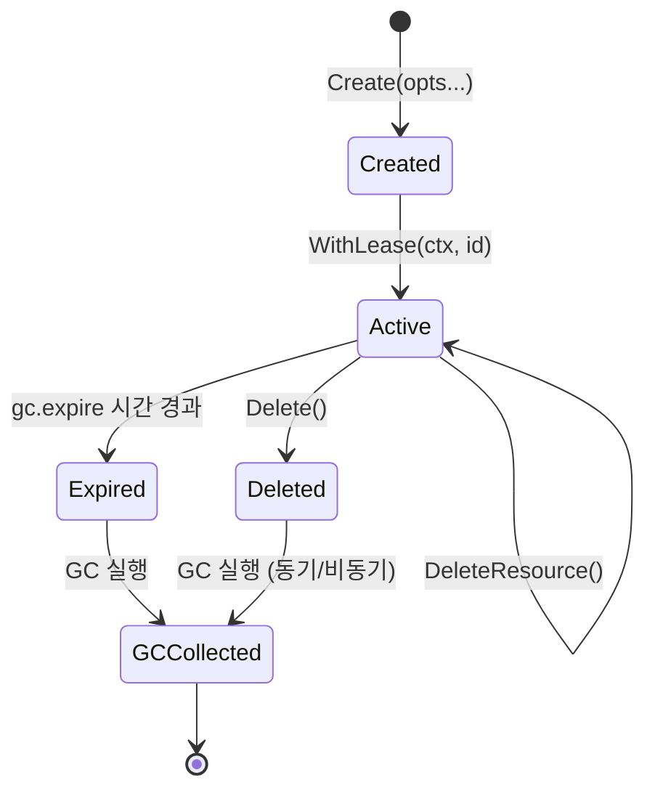

# containerd Lease(리스) 시스템

## 1. 개요

Lease(리스)는 containerd에서 리소스의 수명을 관리하는 핵심 메커니즘이다. 콘텐츠 blob, 스냅샷, 인제스트 등의 리소스가 가비지 컬렉터(GC)에 의해 조기 삭제되는 것을 방지하기 위해, 클라이언트가 "이 리소스를 아직 사용 중이다"라고 선언하는 수단이다.

### 왜 Lease가 필요한가?

containerd는 엄격한 리소스 관리를 수행한다. 어떤 이미지나 컨테이너에서도 참조되지 않는 리소스는 GC 대상이 된다. 문제는 이미지 Pull과 같은 작업이 여러 단계로 나뉘어 수행된다는 점이다:

```
이미지 Pull 과정에서 Lease가 없다면:

  시간 →
  t1: Layer 1 다운로드 완료 ─────┐
  t2: Layer 2 다운로드 중...      │
  t3: GC 실행!                   │
      └─ Layer 1은 아직 어떤     │
         이미지에도 연결 안됨     │
      └─ Layer 1 삭제됨! ←──────┘  ← 문제 발생!
  t4: Layer 2 완료, 이미지 생성 시도
      └─ Layer 1이 없어서 실패!

Lease가 있다면:
  t0: Lease 생성 (24시간 만료)
  t1: Layer 1 다운로드 → Lease에 참조 추가
  t2: Layer 2 다운로드 중...
  t3: GC 실행
      └─ Layer 1은 Lease에 의해 보호됨 → 삭제 안됨!
  t4: 이미지 생성 성공
  t5: Lease 삭제 → Layer는 이미지에 의해 참조되므로 안전
```

---

## 2. 아키텍처

### 2.1 Lease의 위치

```
┌──────────────────────────────────────────────────┐
│                containerd 데몬                     │
│                                                    │
│  ┌──────────┐    ┌──────────┐    ┌──────────────┐ │
│  │ Transfer │    │   CRI    │    │    Client    │ │
│  │ Service  │    │ Plugin   │    │    (ctr)     │ │
│  └────┬─────┘    └────┬─────┘    └──────┬───────┘ │
│       │               │                 │          │
│       └───────────────┼─────────────────┘          │
│                       │                            │
│              ┌────────▼─────────┐                  │
│              │  Lease Manager   │                  │
│              │  (core/leases)   │                  │
│              └────────┬─────────┘                  │
│                       │                            │
│              ┌────────▼─────────┐                  │
│              │  Metadata DB     │                  │
│              │  (BoltDB)        │                  │
│              │  ┌─────────────┐ │                  │
│              │  │ v1/ns/leases│ │                  │
│              │  │  ├── lease1 │ │                  │
│              │  │  │  ├─content│ │                  │
│              │  │  │  ├─snapshots│                  │
│              │  │  │  └─ingests│ │                  │
│              │  │  └── lease2 │ │                  │
│              │  └─────────────┘ │                  │
│              └────────┬─────────┘                  │
│                       │                            │
│              ┌────────▼─────────┐                  │
│              │   GC Scheduler   │                  │
│              │   (gc.go)        │                  │
│              └──────────────────┘                  │
└──────────────────────────────────────────────────┘
```

### 2.2 핵심 인터페이스

```go
// 소스코드: core/leases/lease.go

// Lease 구조체 - 리소스 보호 단위
type Lease struct {
    ID        string            // 고유 식별자
    CreatedAt time.Time         // 생성 시각
    Labels    map[string]string // 레이블 (만료, GC 관련)
}

// Resource - Lease가 참조하는 리소스
type Resource struct {
    ID   string // 리소스 식별자 (digest, snapshot key 등)
    Type string // 리소스 유형 ("content", "snapshots/<snapshotter>" 등)
}

// Manager - Lease CRUD + 리소스 관리
type Manager interface {
    Create(context.Context, ...Opt) (Lease, error)
    Delete(context.Context, Lease, ...DeleteOpt) error
    List(context.Context, ...string) ([]Lease, error)
    AddResource(context.Context, Lease, Resource) error
    DeleteResource(context.Context, Lease, Resource) error
    ListResources(context.Context, Lease) ([]Resource, error)
}
```

---

## 3. Lease 데이터 모델

### 3.1 BoltDB 저장 구조

```
소스코드: core/metadata/buckets.go 참조

BoltDB 스키마에서 Lease 위치:

└── v1                                    ← 스키마 버전
    └── <namespace>                       ← 네임스페이스
        └── leases                        ← 리스 버킷
            └── <lease-id>                ← 개별 리스
                ├── createdat : <binary>  ← 생성 시각
                ├── labels                ← 레이블
                │   ├── "containerd.io/gc.expire" : "2024-01-01T..."
                │   └── "containerd.io/gc.flat"   : "true"
                ├── content               ← 참조하는 콘텐츠
                │   ├── "sha256:aaa..." : nil
                │   └── "sha256:bbb..." : nil
                ├── snapshots             ← 참조하는 스냅샷
                │   └── <snapshotter>
                │       ├── "key1" : nil
                │       └── "key2" : nil
                └── ingests               ← 참조하는 인제스트
                    └── "ref1" : nil
```

### 3.2 Lease가 참조하는 리소스 유형

| 리소스 유형 | 설명 | 식별자 형식 |
|------------|------|-----------|
| `content` | 콘텐츠 blob | digest (sha256:...) |
| `snapshots/<snapshotter>` | 스냅샷 | snapshot key |
| `ingests` | 진행 중인 인제스트 | 참조 문자열 |
| `images` | 이미지 (만료 설정된 경우만) | 이미지 이름 |

---

## 4. Lease 옵션 패턴

### 4.1 Opt 패턴 (함수형 옵션)

```go
// 소스코드: core/leases/lease.go

type Opt func(*Lease) error

// WithLabel: 레이블 추가 (기존 레이블과 병합)
func WithLabel(label, value string) Opt {
    return func(l *Lease) error {
        if l.Labels == nil {
            l.Labels = map[string]string{label: value}
            return nil
        }
        l.Labels[label] = value
        return nil
    }
}

// WithLabels: 복수 레이블 병합
func WithLabels(labels map[string]string) Opt {
    return func(l *Lease) error {
        if l.Labels == nil {
            l.Labels = map[string]string{}
        }
        for k, v := range labels {
            l.Labels[k] = v
        }
        return nil
    }
}

// WithExpiration: 만료 시간 설정
// GC가 만료된 리스를 자동 삭제
func WithExpiration(d time.Duration) Opt {
    return func(l *Lease) error {
        if l.Labels == nil {
            l.Labels = map[string]string{}
        }
        // RFC3339 형식으로 만료 시각 기록
        l.Labels["containerd.io/gc.expire"] = time.Now().Add(d).Format(time.RFC3339)
        return nil
    }
}
```

### 4.2 ID 생성 전략

```go
// core/leases/id.go 참조

// WithRandomID: 무작위 ID 생성 (일반적 사용)
func WithRandomID() Opt { ... }

// WithID: 특정 ID 지정 (재현성 필요 시)
func WithID(id string) Opt { ... }
```

---

## 5. Context 기반 Lease 전파

### 5.1 왜 Context에 Lease를 넣는가?

containerd의 모든 API 호출은 Go `context.Context`를 통해 네임스페이스와 리스 정보를 전파한다. 이 설계의 이유:

1. **암묵적 참조 추가**: 콘텐츠 쓰기, 스냅샷 생성 시 context에서 리스 ID를 꺼내어 자동으로 참조 추가
2. **gRPC 헤더 전파**: 원격 호출 시 `containerd-lease` gRPC 헤더로 리스 정보 전달
3. **코드 간결성**: 모든 함수 시그니처에 lease ID를 명시적으로 전달할 필요 없음

```go
// 소스코드: core/leases/context.go

type leaseKey struct{}

// WithLease: context에 리스 ID 설정
func WithLease(ctx context.Context, lid string) context.Context {
    ctx = context.WithValue(ctx, leaseKey{}, lid)
    // gRPC 헤더에도 설정하여 원격 호출 시 전파
    return withGRPCLeaseHeader(ctx, lid)
}

// FromContext: context에서 리스 ID 추출
func FromContext(ctx context.Context) (string, bool) {
    lid, ok := ctx.Value(leaseKey{}).(string)
    if !ok {
        // context에 없으면 gRPC 헤더 확인
        return fromGRPCHeader(ctx)
    }
    return lid, ok
}
```

### 5.2 암묵적 리소스 참조 추가

context에 리스가 설정되면, 콘텐츠 쓰기/스냅샷 생성 시 자동으로 해당 리스에 참조가 추가된다:

```go
// 소스코드: core/metadata/leases.go

// 콘텐츠 저장 시 자동 호출
func addContentLease(ctx context.Context, tx *bolt.Tx, dgst digest.Digest) error {
    lid, ok := leases.FromContext(ctx)
    if !ok {
        return nil  // 리스가 없으면 아무것도 안함
    }
    // 리스의 content 버킷에 digest 추가
    bkt := getBucket(tx, bucketKeyVersion, []byte(namespace),
        bucketKeyObjectLeases, []byte(lid))
    bkt, err := bkt.CreateBucketIfNotExists(bucketKeyObjectContent)
    return bkt.Put([]byte(dgst.String()), nil)
}

// 스냅샷 생성 시 자동 호출
func addSnapshotLease(ctx context.Context, tx *bolt.Tx,
    snapshotter, key string) error {
    lid, ok := leases.FromContext(ctx)
    if !ok {
        return nil
    }
    // 리스의 snapshots/<snapshotter> 버킷에 key 추가
    bkt := getBucket(tx, ..., []byte(lid))
    bkt, _ = bkt.CreateBucketIfNotExists(bucketKeyObjectSnapshots)
    bkt, _ = bkt.CreateBucketIfNotExists([]byte(snapshotter))
    return bkt.Put([]byte(key), nil)
}

// 인제스트 시작 시 자동 호출
func addIngestLease(ctx context.Context, tx *bolt.Tx, ref string) (bool, error) {
    lid, ok := leases.FromContext(ctx)
    if !ok {
        return false, nil
    }
    bkt := getBucket(tx, ..., []byte(lid))
    bkt, _ = bkt.CreateBucketIfNotExists(bucketKeyObjectIngests)
    return true, bkt.Put([]byte(ref), nil)
}
```

---

## 6. Lease Manager 구현

### 6.1 BoltDB 기반 구현

```go
// 소스코드: core/metadata/leases.go

type leaseManager struct {
    db *DB
}

func NewLeaseManager(db *DB) leases.Manager {
    return &leaseManager{db: db}
}
```

### 6.2 Create 상세

```go
// 소스코드: core/metadata/leases.go

func (lm *leaseManager) Create(ctx context.Context,
    opts ...leases.Opt) (leases.Lease, error) {
    var l leases.Lease
    for _, opt := range opts {
        opt(&l)  // 옵션 적용 (ID, Labels, Expiration 등)
    }
    if l.ID == "" {
        return leases.Lease{}, errors.New("lease id must be provided")
    }

    namespace, err := namespaces.NamespaceRequired(ctx)

    update(ctx, lm.db, func(tx *bolt.Tx) error {
        // v1/<namespace>/leases 버킷에 새 리스 버킷 생성
        topbkt := createBucketIfNotExists(tx,
            bucketKeyVersion, []byte(namespace), bucketKeyObjectLeases)

        txbkt, err := topbkt.CreateBucket([]byte(l.ID))
        if err == errbolt.ErrBucketExists {
            return errdefs.ErrAlreadyExists  // 이미 존재
        }

        // 생성 시각 기록
        t := time.Now().UTC()
        txbkt.Put(bucketKeyCreatedAt, t.MarshalBinary())

        // 레이블 기록 (만료 시간 포함)
        if l.Labels != nil {
            boltutil.WriteLabels(txbkt, l.Labels)
        }
        l.CreatedAt = t
        return nil
    })
    return l, nil
}
```

### 6.3 Delete와 Dirty Flag

```go
// 소스코드: core/metadata/leases.go

func (lm *leaseManager) Delete(ctx context.Context,
    lease leases.Lease, _ ...leases.DeleteOpt) error {

    update(ctx, lm.db, func(tx *bolt.Tx) error {
        topbkt := getBucket(tx, bucketKeyVersion,
            []byte(namespace), bucketKeyObjectLeases)
        topbkt.DeleteBucket([]byte(lease.ID))

        // dirty 플래그 증가 → GC 스케줄러에 알림
        lm.db.dirty.Add(1)
        return nil
    })
}
```

왜 `dirty.Add(1)`인가? 리스 삭제는 이전에 보호되던 리소스가 GC 대상이 될 수 있음을 의미한다. `dirty` 카운터가 증가하면 GC 스케줄러가 이를 감지하여 다음 GC를 스케줄한다.

### 6.4 AddResource / DeleteResource

```go
// 소스코드: core/metadata/leases.go

func (lm *leaseManager) AddResource(ctx context.Context,
    lease leases.Lease, r leases.Resource) error {

    update(ctx, lm.db, func(tx *bolt.Tx) error {
        topbkt := getBucket(tx, ..., []byte(lease.ID))
        // 리소스 유형 파싱
        keys, ref, err := parseLeaseResource(r)
        // 중첩 버킷 생성 (예: content/ 또는 snapshots/<snapshotter>/)
        bkt := topbkt
        for _, key := range keys {
            bkt, _ = bkt.CreateBucketIfNotExists([]byte(key))
        }
        return bkt.Put([]byte(ref), nil)
    })
}
```

### 6.5 리소스 유형 파싱

```go
// 소스코드: core/metadata/leases.go

func parseLeaseResource(r leases.Resource) ([]string, string, error) {
    keys := strings.Split(r.Type, "/")

    switch k := keys[0]; k {
    case "content", "ingests", "images":
        // 단일 키: ["content"] + digest
        if k == "content" {
            dgst, _ := digest.Parse(r.ID)
            ref = dgst.String()
        }
    case "snapshots":
        // 이중 키: ["snapshots", "<snapshotter>"] + key
        // 예: "snapshots/overlayfs" + "snapshot-key-1"
    }
    return keys, ref, nil
}
```

---

## 7. Lease 플러그인

### 7.1 Local Lease Manager

```go
// 소스코드: plugins/leases/local.go

func init() {
    registry.Register(&plugin.Registration{
        Type: plugins.LeasePlugin,
        ID:   "manager",
        Requires: []plugin.Type{
            plugins.MetadataPlugin,  // BoltDB 의존
            plugins.GCPlugin,        // GC 스케줄러 의존
        },
        InitFn: func(ic *plugin.InitContext) (interface{}, error) {
            m := ic.GetSingle(plugins.MetadataPlugin)
            g := ic.GetSingle(plugins.GCPlugin)
            return &local{
                Manager: metadata.NewLeaseManager(m.(*metadata.DB)),
                gc:      g.(gcScheduler),
            }, nil
        },
    })
}
```

### 7.2 동기식 삭제

```go
// 소스코드: plugins/leases/local.go

type local struct {
    leases.Manager
    gc gcScheduler
}

func (l *local) Delete(ctx context.Context,
    lease leases.Lease, opts ...leases.DeleteOpt) error {
    var do leases.DeleteOptions
    for _, opt := range opts {
        opt(ctx, &do)
    }

    // 리스 메타데이터 삭제
    if err := l.Manager.Delete(ctx, lease); err != nil {
        return err
    }

    // 동기식 삭제 요청 시 GC 즉시 실행
    if do.Synchronous {
        if _, err := l.gc.ScheduleAndWait(ctx); err != nil {
            return err
        }
    }
    return nil
}
```

---

## 8. Lease와 GC의 상호작용

### 8.1 GC에서 Lease 처리 흐름

```
GC 실행 시 Lease 처리:

  ┌──────────────────────────────────────────┐
  │ GC 시작                                    │
  │                                            │
  │ 1. Root 객체 수집                           │
  │    ├── Images (만료 안된 것)                │
  │    ├── Containers                          │
  │    └── Leases (만료 안된 것) ←─── 핵심!     │
  │                                            │
  │ 2. Lease에서 참조하는 리소스 마킹            │
  │    ├── lease.content → blob 보존            │
  │    ├── lease.snapshots → snapshot 보존      │
  │    └── lease.ingests → ingest 보존          │
  │                                            │
  │ 3. 참조 그래프 탐색                         │
  │    ├── 일반 리스: 참조 리소스의 레이블 참조도 │
  │    │   따라감 (트리 전체 보존)               │
  │    └── Flat 리스: 직접 참조만 보존           │
  │        (gc.flat 레이블)                     │
  │                                            │
  │ 4. 마킹되지 않은 리소스 삭제                 │
  │                                            │
  │ 5. 만료된 Lease 삭제                        │
  │    (gc.expire 레이블 확인)                  │
  └──────────────────────────────────────────┘
```

### 8.2 GC 레이블 상세

```go
// 소스코드: core/metadata/gc.go

// GC 관련 레이블 키
var (
    // Root 객체로 표시 (영구 보존)
    labelGCRoot = []byte("containerd.io/gc.root")

    // 참조 레이블 (부모 → 자식)
    labelGCRef        = []byte("containerd.io/gc.ref.")
    labelGCSnapRef    = []byte("containerd.io/gc.ref.snapshot.")
    labelGCContentRef = []byte("containerd.io/gc.ref.content")

    // 역참조 레이블 (자식 → 부모)
    labelGCContainerBackRef = []byte("containerd.io/gc.bref.container")
    labelGCContentBackRef   = []byte("containerd.io/gc.bref.content")
    labelGCImageBackRef     = []byte("containerd.io/gc.bref.image")

    // 만료 레이블 (RFC3339 타임스탬프)
    labelGCExpire = []byte("containerd.io/gc.expire")

    // Flat 레이블 (리스의 직접 참조만 보존)
    labelGCFlat = []byte("containerd.io/gc.flat")
)
```

### 8.3 Flat Lease vs Normal Lease

```
Normal Lease (기본):
  Lease ─── ref ──→ Content A ─── label ref ──→ Content B
                                                    │
                                                    └── label ref ──→ Content C
  결과: A, B, C 모두 보존

Flat Lease (gc.flat = true):
  Lease ─── ref ──→ Content A ─── label ref ──→ Content B
                                                    │
                                                    └── label ref ──→ Content C
  결과: A만 보존, B와 C는 다른 참조 없으면 삭제

사용 사례:
- Normal: 이미지 Pull 시 (매니페스트 → 레이어 전체 보존)
- Flat: 특정 blob만 임시 보존 (트리 전체 불필요)
```

---

## 9. Client 레벨 Lease 사용

### 9.1 간편한 Lease 사용 (WithLease)

```go
// Go 클라이언트에서 가장 간단한 Lease 사용법
ctx, done, err := client.WithLease(ctx)
if err != nil {
    return err
}
defer done(ctx)

// 이 ctx로 수행하는 모든 작업은 자동으로 Lease에 보호됨
// done() 호출 시 Lease 삭제 (프로세스 종료 시에도 24시간 후 만료)
```

### 9.2 직접 Lease 관리

```go
// Lease Manager 직접 사용 (장기 실행 작업용)
manager := client.LeasesService()

// 만료 없는 영구 리스 생성
l, err := manager.Create(ctx, leases.WithRandomID())

// 특정 만료 시간의 리스 생성
l, err := manager.Create(ctx,
    leases.WithRandomID(),
    leases.WithExpiration(1 * time.Hour),
)

// Context에 리스 설정
ctx = leases.WithLease(ctx, l.ID)

// 작업 수행...

// 리스 삭제 (동기식 GC 포함)
manager.Delete(ctx, l, leases.SynchronousDelete)
```

### 9.3 gRPC를 통한 Lease 전파

```
gRPC 헤더를 통한 Lease 전파:

  Client                              Server
    │                                    │
    ├── gRPC Request ──────────────────>│
    │   Header: "containerd-lease: abc"  │
    │                                    │
    │                                    ├── FromContext(ctx)
    │                                    │   → "abc"
    │                                    │
    │                                    ├── addContentLease(ctx, tx, dgst)
    │                                    │   → lease "abc"에 콘텐츠 참조 추가
    │                                    │
    │<── Response ───────────────────────│
```

---

## 10. Transfer Service에서의 Lease 활용

### 10.1 Pull 시 자동 Lease 관리

```go
// 소스코드: core/transfer/local/transfer.go

func (ts *localTransferService) withLease(ctx context.Context,
    opts ...leases.Opt) (context.Context, func(context.Context) error, error) {

    nop := func(context.Context) error { return nil }

    // 이미 context에 리스가 있으면 재사용
    _, ok := leases.FromContext(ctx)
    if ok {
        return ctx, nop, nil
    }

    // Lease Manager가 없으면 무시 (리스 없이 진행)
    ls := ts.config.Leases
    if ls == nil {
        return ctx, nop, nil
    }

    // 기본 설정: 24시간 만료의 랜덤 ID
    if len(opts) == 0 {
        opts = []leases.Opt{
            leases.WithRandomID(),
            leases.WithExpiration(24 * time.Hour),
        }
    }

    l, err := ls.Create(ctx, opts...)
    ctx = leases.WithLease(ctx, l.ID)

    // 정리 함수 반환
    return ctx, func(ctx context.Context) error {
        return ls.Delete(ctx, l)
    }, nil
}
```

왜 24시간 만료인가?

```
시나리오: 프로세스 비정상 종료

  정상 종료:
    Pull 시작 → Lease 생성 → Pull 완료 → Lease 삭제 ✓

  비정상 종료 (프로세스 크래시):
    Pull 시작 → Lease 생성 → 크래시! → done() 호출 안됨
    → 24시간 후 Lease 만료 → GC가 정리

  만료 없이 Lease가 영구 보존되면:
    반복적 크래시 → Lease 축적 → 디스크 공간 낭비
```

---

## 11. ListResources 상세

### 11.1 리스가 보유한 모든 리소스 조회

```go
// 소스코드: core/metadata/leases.go

func (lm *leaseManager) ListResources(ctx context.Context,
    lease leases.Lease) ([]leases.Resource, error) {

    var rs []leases.Resource
    view(ctx, lm.db, func(tx *bolt.Tx) error {
        topbkt := getBucket(tx, ..., []byte(lease.ID))

        // 콘텐츠 리소스 수집
        if cbkt := topbkt.Bucket(bucketKeyObjectContent); cbkt != nil {
            cbkt.ForEach(func(k, _ []byte) error {
                rs = append(rs, leases.Resource{
                    ID:   string(k),      // sha256:...
                    Type: "content",
                })
                return nil
            })
        }

        // 이미지 리소스 수집
        if ibkt := topbkt.Bucket(bucketKeyObjectImages); ibkt != nil {
            ibkt.ForEach(func(k, _ []byte) error {
                rs = append(rs, leases.Resource{
                    ID:   string(k),      // docker.io/...
                    Type: "images",
                })
                return nil
            })
        }

        // 인제스트 리소스 수집
        if lbkt := topbkt.Bucket(bucketKeyObjectIngests); lbkt != nil {
            lbkt.ForEach(func(k, _ []byte) error {
                rs = append(rs, leases.Resource{
                    ID:   string(k),      // 참조 문자열
                    Type: "ingests",
                })
                return nil
            })
        }

        // 스냅샷 리소스 수집 (스냅샷터별 중첩)
        if sbkt := topbkt.Bucket(bucketKeyObjectSnapshots); sbkt != nil {
            sbkt.ForEach(func(sk, sv []byte) error {
                if sv != nil { return nil }
                snbkt := sbkt.Bucket(sk)
                return snbkt.ForEach(func(k, _ []byte) error {
                    rs = append(rs, leases.Resource{
                        ID:   string(k),
                        Type: fmt.Sprintf("snapshots/%s", sk),
                    })
                    return nil
                })
            })
        }
        return nil
    })
    return rs, nil
}
```

---

## 12. 리소스 참조 해제

### 12.1 콘텐츠 참조 해제

```go
// 소스코드: core/metadata/leases.go

func removeContentLease(ctx context.Context, tx *bolt.Tx,
    dgst digest.Digest) error {
    lid, ok := leases.FromContext(ctx)
    if !ok {
        return nil
    }
    bkt := getBucket(tx, ..., []byte(lid), bucketKeyObjectContent)
    if bkt == nil {
        return nil  // 이미 없음
    }
    return bkt.Delete([]byte(dgst.String()))
}
```

### 12.2 스냅샷 참조 해제

```go
// 소스코드: core/metadata/leases.go

func removeSnapshotLease(ctx context.Context, tx *bolt.Tx,
    snapshotter, key string) error {
    lid, ok := leases.FromContext(ctx)
    if !ok {
        return nil
    }
    bkt := getBucket(tx, ..., []byte(lid),
        bucketKeyObjectSnapshots, []byte(snapshotter))
    if bkt == nil {
        return nil
    }
    return bkt.Delete([]byte(key))
}
```

---

## 13. 운영 관점 Lease 관리

### 13.1 CLI로 Lease 관리

```bash
# 리스 목록 확인
ctr leases list

# 출력 예:
# ID                     CREATED AT
# random-id-123          2024-01-01 00:00:00
# pull-lease-456         2024-01-01 01:00:00

# 특정 리스의 리소스 확인
ctr leases list --id random-id-123

# 리스 삭제
ctr leases delete random-id-123

# 만료된 리스 확인 및 정리
ctr leases list | grep expired
```

### 13.2 문제 진단

```
일반적인 Lease 관련 문제:

1. 디스크 공간 증가
   원인: 오래된 Lease가 삭제되지 않아 GC가 리소스를 정리 못함
   해결: ctr leases list → 만료된 Lease 삭제

2. Pull 실패 (데이터 불완전)
   원인: GC가 다운로드 중인 콘텐츠를 삭제
   해결: Lease가 올바르게 설정되었는지 확인
         (client.WithLease() 사용 여부)

3. Lease 축적
   원인: 클라이언트 크래시로 done() 미호출
   해결: WithExpiration 사용 (기본 24시간),
         정기적 만료 리스 정리

4. 동기식 삭제 지연
   원인: SynchronousDelete 시 GC가 오래 걸림
   해결: GC 스케줄러 파라미터 튜닝
```

---

## 14. Lease 설계 원리 요약

### 14.1 핵심 설계 결정

| 설계 결정 | 이유 |
|-----------|------|
| Context 기반 전파 | 함수 시그니처 단순화, gRPC 헤더 자동 전파 |
| 암묵적 리소스 추가 | 클라이언트가 수동으로 참조 관리할 필요 없음 |
| 만료 메커니즘 | 프로세스 크래시 시에도 리소스 정리 보장 |
| Flat 리스 옵션 | 트리 전체가 아닌 특정 객체만 보호 필요 시 |
| BoltDB 저장 | 트랜잭션 보장, 메타데이터와 함께 원자적 갱신 |
| dirty 플래그 | 리스 삭제를 GC 스케줄러에 효율적으로 알림 |

### 14.2 Lease 수명 다이어그램



---

## 참고 자료

- 소스코드: `core/leases/lease.go` - Lease 인터페이스 및 옵션
- 소스코드: `core/leases/context.go` - Context 기반 전파
- 소스코드: `core/leases/id.go` - ID 생성
- 소스코드: `core/metadata/leases.go` - BoltDB 기반 Lease Manager 구현
- 소스코드: `core/metadata/gc.go` - GC에서의 Lease 참조 처리
- 소스코드: `core/metadata/buckets.go` - BoltDB 스키마 (Lease 버킷 구조)
- 소스코드: `plugins/leases/local.go` - Lease 플러그인 등록
- 소스코드: `core/transfer/local/transfer.go` - Transfer 서비스의 Lease 활용
- 소스코드: `docs/garbage-collection.md` - GC와 Lease 관계 문서
