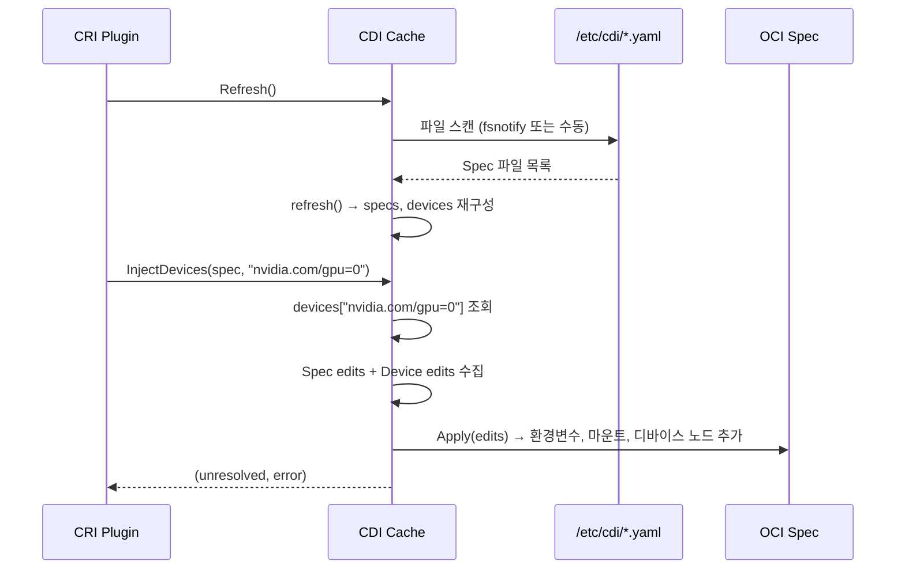

# 24. NRI (Node Resource Interface) + CDI (Container Device Interface) Deep-Dive

> containerd 소스코드 기반 분석 문서 (P2 심화)
> 분석 대상: `internal/nri/`, `plugins/nri/`, `pkg/cdi/`, `vendor/tags.cncf.io/container-device-interface/`

---

## 1. 개요

### 1.1 왜 런타임 확장이 필요한가?

Kubernetes 환경에서 컨테이너 런타임은 다양한 하드웨어와 정책 요구사항을 지원해야 한다.
GPU, FPGA, 네트워크 가속기 등의 특수 디바이스를 컨테이너에 할당하거나,
보안 정책에 따라 컨테이너 리소스를 동적으로 조정해야 하는 경우가 있다.

```
문제: 모든 요구사항을 containerd 코어에 구현할 수 없다

해결:
  NRI  → 런타임 이벤트에 훅을 걸어 컨테이너 구성을 조정하는 플러그인 인터페이스
  CDI  → GPU/NPU 등 특수 디바이스를 표준화된 방법으로 컨테이너에 주입하는 스펙
```

### 1.2 NRI와 CDI의 관계

```
+------------------------------------------------------------------+
|                     containerd                                    |
|                                                                   |
|  Pod/Container 생명주기 이벤트                                     |
|    |                                                              |
|    v                                                              |
|  +----------+      +----------+      +----------+                |
|  | NRI API  | ---> | Plugin 1 | ---> | Plugin 2 | ---> ...       |
|  +----------+      | (CPU 핀) |      | (토폴로지)|                |
|    |                +----------+      +----------+                |
|    |                                                              |
|    v                                                              |
|  +----------+                                                     |
|  | CDI      | --- GPU/NPU 디바이스 주입 ---+                      |
|  +----------+                              |                      |
|    |                                       |                      |
|    v                                       v                      |
|  OCI Spec 생성 (환경변수, 마운트, 디바이스 노드, 후크)              |
|                                                                   |
+------------------------------------------------------------------+

NRI: 컨테이너 생명주기의 "언제(When)"와 "어떻게(How)"를 제어
CDI: 디바이스의 "무엇(What)"을 표준화
```

---

## 2. NRI 아키텍처

### 2.1 소스 구조

```
internal/nri/
├── nri.go              # local 구현체 (API 인터페이스 구현)
├── config.go           # NRI 설정 (소켓, 플러그인 경로, 타임아웃)
├── domain.go           # Domain 인터페이스 (네임스페이스별 Pod/Container 관리)
├── container.go        # Container 인터페이스 (NRI 메타데이터 변환)
├── container_linux.go  # Linux 전용 컨테이너 변환
├── container_other.go  # 비-Linux 스텁
├── sandbox.go          # PodSandbox 인터페이스 (NRI 메타데이터 변환)
├── sandbox_linux.go    # Linux 전용 샌드박스 변환
└── sandbox_other.go    # 비-Linux 스텁

plugins/nri/
└── plugin.go           # containerd 플러그인 등록

internal/cri/nri/
├── nri_api.go          # CRI-NRI 연동 공통
├── nri_api_linux.go    # CRI-NRI 연동 (Linux)
└── nri_api_other.go    # CRI-NRI 연동 (비-Linux)
```

### 2.2 API 인터페이스

```go
// internal/nri/nri.go
type API interface {
    IsEnabled() bool
    Start() error
    Stop()

    // Pod 생명주기
    RunPodSandbox(context.Context, PodSandbox) error
    UpdatePodSandbox(context.Context, PodSandbox, *nri.LinuxResources, *nri.LinuxResources) error
    PostUpdatePodSandbox(context.Context, PodSandbox) error
    StopPodSandbox(context.Context, PodSandbox) error
    RemovePodSandbox(context.Context, PodSandbox) error

    // Container 생명주기
    CreateContainer(context.Context, PodSandbox, Container) (*nri.ContainerAdjustment, error)
    PostCreateContainer(context.Context, PodSandbox, Container) error
    StartContainer(context.Context, PodSandbox, Container) error
    PostStartContainer(context.Context, PodSandbox, Container) error
    UpdateContainer(context.Context, PodSandbox, Container, *nri.LinuxResources) (*nri.LinuxResources, error)
    PostUpdateContainer(context.Context, PodSandbox, Container) error
    StopContainer(context.Context, PodSandbox, Container) error
    NotifyContainerExit(context.Context, PodSandbox, Container)
    RemoveContainer(context.Context, PodSandbox, Container) error

    BlockPluginSync() *PluginSyncBlock
}
```

**왜 Pre/Post 훅 쌍으로 설계했는가?**

```
CreateContainer 호출 시:
  Pre-hook  (CreateContainer)   → 플러그인이 컨테이너 구성을 조정
                                   CPU 핀닝, 메모리 제한, 디바이스 추가 등
  실제 생성                      → containerd가 컨테이너 생성
  Post-hook (PostCreateContainer) → 생성 성공 알림, 정리 작업

이 패턴의 장점:
  1. Pre-hook에서 구성 변경 가능 (ContainerAdjustment 반환)
  2. Post-hook에서 결과 확인 및 후속 조치
  3. 실패 시 Pre-hook에서 에러를 반환하여 생성 자체를 막을 수 있음
```

### 2.3 상태 관리

```go
// internal/nri/nri.go
type State int

const (
    Created State = iota + 1
    Running
    Stopped
    Removed
)

type local struct {
    sync.Mutex
    cfg *Config
    nri *nri.Adaptation
    state map[string]State  // 컨테이너/Pod ID → 상태
}
```

**상태 전이 다이어그램:**

```
                 Created
                   |
                   v
    +---→ Running ←---+
    |         |        |
    |         v        |
    |     Stopped      |
    |         |        |
    |         v        |
    +---- Removed -----+
           (삭제)

needsStopping: Created | Running → true
needsRemoval: Created | Running | Stopped → true
```

```go
// internal/nri/nri.go:562
func (l *local) needsStopping(id string) bool {
    s := l.getState(id)
    return s == Created || s == Running
}

func (l *local) needsRemoval(id string) bool {
    s := l.getState(id)
    return s == Created || s == Running || s == Stopped
}
```

**왜 이런 상태 관리가 필요한가?**

중복 Stop/Remove 호출을 방지한다. 예를 들어, 컨테이너가 비정상 종료되면
`NotifyContainerExit`과 `StopContainer`가 모두 호출될 수 있다.
상태를 추적하여 이미 Stopped인 컨테이너에 대해 Stop을 다시 보내지 않는다.

### 2.4 Domain 패턴

```go
// internal/nri/domain.go
type Domain interface {
    GetName() string                                    // 네임스페이스 이름
    ListPodSandboxes() []PodSandbox                    // Pod 목록
    ListContainers() []Container                        // 컨테이너 목록
    GetPodSandbox(string) (PodSandbox, bool)           // Pod 조회
    GetContainer(string) (Container, bool)              // 컨테이너 조회
    UpdateContainer(context.Context, *nri.ContainerUpdate) error  // 컨테이너 업데이트
    EvictContainer(context.Context, *nri.ContainerEviction) error // 컨테이너 퇴출
}
```

**왜 Domain 패턴을 사용하는가?**

```
containerd 네임스페이스 격리:

네임스페이스 "k8s.io"  →  Domain A (CRI 플러그인)
  Pod-1, Container-1, Container-2

네임스페이스 "moby"    →  Domain B (Docker 호환)
  Container-3, Container-4

NRI API는 모든 네임스페이스의 컨테이너를 통합 관리해야 하지만,
각 네임스페이스의 Pod/Container 메타데이터 형식이 다르다.

Domain 인터페이스가 이 차이를 추상화:
  - CRI Domain은 CRI 형식의 Pod/Container를 NRI 형식으로 변환
  - 다른 Domain은 자체 형식을 NRI 형식으로 변환
```

```go
// internal/nri/domain.go
var domains = &domainTable{
    domains: make(map[string]Domain),
}

func RegisterDomain(d Domain) {
    err := domains.add(d)
    if err != nil {
        log.L.WithError(err).Fatalf("Failed to register namespace %q with NRI", d.GetName())
    }
}
```

### 2.5 플러그인 동기화

```go
// internal/nri/nri.go:488
func (l *local) syncPlugin(ctx context.Context, syncFn nri.SyncCB) error {
    l.Lock()
    defer l.Unlock()

    pods := podSandboxesToNRI(domains.listPodSandboxes())
    containers := containersToNRI(domains.listContainers())

    // 컨테이너 상태 초기화
    for _, ctr := range containers {
        switch ctr.GetState() {
        case nri.ContainerState_CONTAINER_CREATED:
            l.setState(ctr.GetId(), Created)
        case nri.ContainerState_CONTAINER_RUNNING, nri.ContainerState_CONTAINER_PAUSED:
            l.setState(ctr.GetId(), Running)
        case nri.ContainerState_CONTAINER_STOPPED:
            l.setState(ctr.GetId(), Stopped)
        default:
            l.setState(ctr.GetId(), Removed)
        }
    }

    updates, err := syncFn(ctx, pods, containers)
    // ...
}
```

**왜 플러그인 동기화가 필요한가?**

NRI 플러그인이 연결(또는 재연결)될 때, 현재 시스템 상태를 전달받아야 한다.
동기화 없이는 플러그인이 기존에 실행 중인 컨테이너를 인지하지 못한다.

### 2.6 설정

```go
// internal/nri/config.go
type Config struct {
    Disable          bool             `toml:"disable"`
    SocketPath       string           `toml:"socket_path"`
    PluginPath       string           `toml:"plugin_path"`
    PluginConfigPath string           `toml:"plugin_config_path"`
    PluginRegistrationTimeout tomlext.Duration
    PluginRequestTimeout      tomlext.Duration
    DisableConnections bool           `toml:"disable_connections"`
    DefaultValidator *validator.DefaultValidatorConfig
}
```

| 설정 | 기본값 | 설명 |
|------|--------|------|
| Disable | false | NRI 비활성화 |
| SocketPath | `/var/run/nri/nri.sock` | 플러그인 통신 소켓 |
| PluginPath | `/opt/nri/plugins` | 자동 실행 플러그인 경로 |
| PluginConfigPath | `/etc/nri/conf.d` | 플러그인별 설정 경로 |
| DisableConnections | false | 외부 플러그인 연결 차단 |

### 2.7 플러그인 등록

```go
// plugins/nri/plugin.go
func init() {
    registry.Register(&plugin.Registration{
        Type:   plugins.NRIApiPlugin,
        ID:     "nri",
        Config: nri.DefaultConfig(),
        InitFn: func(ic *plugin.InitContext) (interface{}, error) {
            return nri.New(ic.Config.(*nri.Config))
        },
    })
}
```

---

## 3. CDI 아키텍처

### 3.1 CDI 스펙 개요

CDI (Container Device Interface)는 CNCF 프로젝트로, 컨테이너 런타임에 디바이스를
주입하는 표준화된 방법을 제공한다.

```
CDI Spec 파일 예시 (/etc/cdi/nvidia.yaml):

cdiVersion: "0.6.0"
kind: "nvidia.com/gpu"
devices:
  - name: "0"
    containerEdits:
      deviceNodes:
        - path: /dev/nvidia0
          hostPath: /dev/nvidia0
      env:
        - NVIDIA_VISIBLE_DEVICES=0
      mounts:
        - hostPath: /usr/lib/nvidia
          containerPath: /usr/lib/nvidia
          options: ["ro", "nosuid", "nodev"]

사용:
  CDI 디바이스 이름: "nvidia.com/gpu=0"
  → vendor: "nvidia.com"
  → class: "gpu"
  → name: "0"
```

### 3.2 containerd의 CDI 통합

```go
// pkg/cdi/oci_opt.go
func WithCDIDevices(devices ...string) oci.SpecOpts {
    return func(ctx context.Context, _ oci.Client, c *containers.Container, s *oci.Spec) error {
        if len(devices) == 0 {
            return nil
        }

        // CDI 레지스트리 갱신 (새 Spec 파일 감지)
        if err := cdi.Refresh(); err != nil {
            log.G(ctx).Warnf("CDI registry refresh failed: %v", err)
        }

        // 디바이스를 OCI Spec에 주입
        if _, err := cdi.InjectDevices(s, devices...); err != nil {
            return fmt.Errorf("CDI device injection failed: %w", err)
        }

        return nil
    }
}
```

**왜 `Refresh` 실패를 무시하는가?**

CDI Spec 디렉토리에 잘못된 파일이 있더라도, 다른 벤더의 디바이스 주입은 정상 동작해야 한다.
예를 들어, `nvidia.yaml`이 깨져도 `intel.yaml`의 디바이스는 정상 주입되어야 한다.

### 3.3 CDI Cache

```go
// vendor/tags.cncf.io/container-device-interface/pkg/cdi/cache.go
type Cache struct {
    sync.Mutex
    specDirs  []string                 // Spec 디렉토리 목록
    specs     map[string][]*Spec       // 벤더별 Spec
    devices   map[string]*Device       // qualified name → Device
    errors    map[string][]error       // 파일별 에러
    dirErrors map[string]error         // 디렉토리별 에러

    autoRefresh bool                   // 자동 갱신 여부
    watch       *watch                 // fsnotify 감시자
}
```

**캐시 구조:**

```
specDirs: ["/etc/cdi", "/var/run/cdi"]

specs:
  "nvidia.com" → [Spec{gpu=0}, Spec{gpu=1}]
  "intel.com"  → [Spec{qat=0}]

devices:
  "nvidia.com/gpu=0" → Device{...}
  "nvidia.com/gpu=1" → Device{...}
  "intel.com/qat=0"  → Device{...}
```

### 3.4 디바이스 주입 흐름



### 3.5 디바이스 충돌 해결

```go
// cache.go:159
resolveConflict := func(name string, dev *Device, old *Device) bool {
    devSpec, oldSpec := dev.GetSpec(), old.GetSpec()
    devPrio, oldPrio := devSpec.GetPriority(), oldSpec.GetPriority()
    switch {
    case devPrio > oldPrio:
        return false  // 새 것이 우선 → 교체하지 않음 (새 것 유지)
    case devPrio == oldPrio:
        // 같은 우선순위 → 충돌 에러 기록, 둘 다 제거
        conflicts[name] = struct{}{}
    }
    return true  // 기존 것 유지
}
```

**충돌 해결 전략:**

```
시나리오: 두 Spec 파일이 같은 디바이스 이름을 정의

/etc/cdi/vendor-a.yaml:  nvidia.com/gpu=0 (priority: 10)
/var/run/cdi/vendor-b.yaml: nvidia.com/gpu=0 (priority: 5)

결과: vendor-a의 정의가 우선 (높은 priority)

/etc/cdi/vendor-a.yaml:  nvidia.com/gpu=0 (priority: 10)
/var/run/cdi/vendor-b.yaml: nvidia.com/gpu=0 (priority: 10)

결과: 충돌! 둘 다 제거, 에러 기록
```

### 3.6 파일 시스템 감시

```go
// cache.go:528
func (w *watch) watch(fsw *fsnotify.Watcher, m *sync.Mutex, refresh func() error, dirErrors map[string]error) {
    eventMask := fsnotify.Rename | fsnotify.Remove | fsnotify.Write
    if runtime.GOOS == "darwin" {
        eventMask |= fsnotify.Create  // macOS에서는 Create 이벤트도 필요
    }

    for {
        select {
        case event := <-watch.Events:
            if (event.Op & eventMask) == 0 {
                continue
            }
            // .json 또는 .yaml 파일만 관심
            if event.Op == fsnotify.Write || event.Op == fsnotify.Create {
                if ext := filepath.Ext(event.Name); ext != ".json" && ext != ".yaml" {
                    continue
                }
            }
            m.Lock()
            _ = refresh()
            m.Unlock()
        case <-watch.Errors:
            // 에러 무시
        }
    }
}
```

---

## 4. NRI와 CDI의 협력

### 4.1 컨테이너 생성 시 협력 흐름

```
1. CRI Plugin이 CreateContainer 요청 수신
2. NRI API의 CreateContainer 호출
   → NRI 플러그인이 CDI 디바이스 요청을 ContainerAdjustment에 포함
   → 예: CDIDevices: [{Name: "nvidia.com/gpu=0"}]
3. containerd가 CDI 디바이스를 OCI Spec에 주입
   → WithCDIDevices("nvidia.com/gpu=0")
4. OCI Spec 완성 → 컨테이너 생성
```

### 4.2 Container 인터페이스의 CDI 지원

```go
// internal/nri/container.go
type Container interface {
    // ...
    GetCDIDevices() []*nri.CDIDevice  // CDI 디바이스 목록
    // ...
}

func commonContainerToNRI(ctr Container) *nri.Container {
    return &nri.Container{
        // ...
        CDIDevices: ctr.GetCDIDevices(),
        // ...
    }
}
```

NRI의 Container 인터페이스에 CDI 디바이스가 포함되어 있어,
NRI 플러그인이 컨테이너의 CDI 디바이스 정보에 접근하거나 수정할 수 있다.

---

## 5. NRI 플러그인 사용 사례

### 5.1 CPU 핀닝 플러그인

```
목적: 특정 컨테이너를 특정 CPU 코어에 고정

CreateContainer 이벤트:
  플러그인이 컨테이너의 CPU 요구사항 확인
  ContainerAdjustment에 cpuset 추가
  → LinuxResources.CPU.Cpus = "0-3"
```

### 5.2 토폴로지 인식 플러그인

```
목적: NUMA 토폴로지에 맞게 메모리와 CPU를 배치

CreateContainer 이벤트:
  플러그인이 NUMA 노드별 리소스 사용량 확인
  최적의 NUMA 노드에 컨테이너 배치
  ContainerAdjustment에 cpuset + memoryNode 설정
```

### 5.3 보안 정책 플러그인

```
목적: 특정 레이블이 없는 컨테이너의 privileged 모드 차단

CreateContainer 이벤트:
  플러그인이 컨테이너 레이블/어노테이션 검사
  보안 요구사항 미충족 시 에러 반환 → 컨테이너 생성 차단
```

---

## 6. CDI 사용 사례

### 6.1 GPU 할당

```yaml
# /etc/cdi/nvidia.yaml
cdiVersion: "0.6.0"
kind: "nvidia.com/gpu"
devices:
  - name: "0"
    containerEdits:
      deviceNodes:
        - path: /dev/nvidia0
      mounts:
        - hostPath: /usr/lib/nvidia
          containerPath: /usr/lib/nvidia
      env:
        - NVIDIA_VISIBLE_DEVICES=0
```

### 6.2 FPGA 가속기

```yaml
# /etc/cdi/xilinx.yaml
cdiVersion: "0.6.0"
kind: "xilinx.com/fpga"
devices:
  - name: "alveo-u250-0"
    containerEdits:
      deviceNodes:
        - path: /dev/xclmgmt0
        - path: /dev/xocl0
      env:
        - XILINX_DEVICE=alveo-u250
```

---

## 7. OTel 트레이싱 통합

### 7.1 ttrpc 인터셉터

```go
// internal/nri/config.go:80
opts = append(opts,
    nri.WithTTRPCOptions(
        []ttrpc.ClientOpts{
            ttrpc.WithUnaryClientInterceptor(
                otelttrpc.UnaryClientInterceptor(),
            ),
        },
        []ttrpc.ServerOpt{
            ttrpc.WithUnaryServerInterceptor(
                otelttrpc.UnaryServerInterceptor(),
            ),
        },
    ),
)
```

NRI는 ttrpc (경량 gRPC) 프로토콜을 사용하며, OTel 인터셉터를 통해
플러그인 통신을 자동으로 트레이싱한다.

---

## 8. 설정과 배포

### 8.1 containerd config.toml

```toml
[plugins."io.containerd.nri.v1.nri"]
  disable = false
  socket_path = "/var/run/nri/nri.sock"
  plugin_path = "/opt/nri/plugins"
  plugin_config_path = "/etc/nri/conf.d"
  plugin_registration_timeout = "5s"
  plugin_request_timeout = "2s"
  disable_connections = false
```

### 8.2 CDI Spec 디렉토리

```
기본 CDI Spec 디렉토리:
  /etc/cdi/          # 정적 Spec (관리자 설정)
  /var/run/cdi/      # 동적 Spec (런타임 생성)

우선순위: 마지막 디렉토리가 가장 높은 우선순위
  specDirs[0] = "/etc/cdi"     → priority 0 (낮음)
  specDirs[1] = "/var/run/cdi" → priority 1 (높음)
```

---

## 9. 에러 처리

### 9.1 NRI 에러 처리 전략

```go
// internal/nri/nri.go:287
response, err := l.nri.CreateContainer(ctx, request)
l.setState(request.Container.Id, Created)
if err != nil {
    return nil, err
}

// 퇴출 실패는 무시 (TODO 주석)
_, err = l.evictContainers(ctx, response.Evict)
if err != nil {
    log.G(ctx).WithError(err).Warnf("pre-create eviction failed")
}

// 업데이트 실패도 무시
if _, err := l.applyUpdates(ctx, response.Update); err != nil {
    log.G(ctx).WithError(err).Warnf("pre-create update failed")
}
```

**왜 퇴출/업데이트 실패를 무시하는가?**

NRI 플러그인의 부수 효과(다른 컨테이너 업데이트/퇴출)가 실패해도,
요청된 컨테이너의 생성은 성공해야 한다. 이는 가용성을 우선시하는 설계 결정이다.

### 9.2 CDI 에러 처리 전략

```go
// CDI 디바이스가 해석 불가능한 경우
if unresolved != nil {
    return unresolved, fmt.Errorf("unresolvable CDI devices %s",
        strings.Join(unresolved, ", "))
}
```

해석 불가능한 CDI 디바이스가 있으면 에러를 반환하여 컨테이너 생성을 차단한다.
이는 보안 관점에서 올바른 결정이다 -- 요청된 디바이스 없이 컨테이너가 시작되면
예상치 못한 동작을 할 수 있다.

---

## 10. 정리

### 10.1 핵심 설계 원칙

| 원칙 | NRI | CDI |
|------|-----|-----|
| 확장성 | 외부 플러그인으로 기능 추가 | 벤더별 Spec 파일로 디바이스 추가 |
| 안전성 | 상태 추적으로 중복 호출 방지 | 충돌 감지/해결, 우선순위 |
| 관측 가능성 | OTel ttrpc 인터셉터 | 에러 추적, 디렉토리 감시 |
| 호환성 | Domain 패턴으로 네임스페이스 추상화 | 표준 OCI Spec 수정 |
| 격리 | 네임스페이스별 Domain | Spec 디렉토리 분리 |

### 10.2 관련 소스 파일 요약

| 파일 | 줄수 | 핵심 함수/타입 |
|------|------|---------------|
| `internal/nri/nri.go` | 577줄 | `API` 인터페이스, `local` 구현체 |
| `internal/nri/config.go` | 107줄 | `Config`, `toOptions` |
| `internal/nri/domain.go` | 183줄 | `Domain` 인터페이스, `domainTable` |
| `internal/nri/container.go` | 100줄 | `Container` 인터페이스 |
| `internal/nri/sandbox.go` | 70줄 | `PodSandbox` 인터페이스 |
| `plugins/nri/plugin.go` | 39줄 | 플러그인 등록 |
| `pkg/cdi/oci_opt.go` | 57줄 | `WithCDIDevices` |
| `vendor/.../cdi/cache.go` | 614줄 | `Cache`, `InjectDevices`, `refresh` |

### 10.3 PoC 참조

- `poc-20-oci-spec-cdi/` -- OCI Spec에 CDI 디바이스를 주입하는 흐름 시뮬레이션
- `poc-21-nri/` -- NRI 플러그인의 컨테이너 생명주기 훅 시뮬레이션

---

*본 문서는 containerd 소스코드의 `internal/nri/`, `plugins/nri/`, `pkg/cdi/`, `vendor/tags.cncf.io/container-device-interface/` 디렉토리를 직접 분석하여 작성되었다.*
