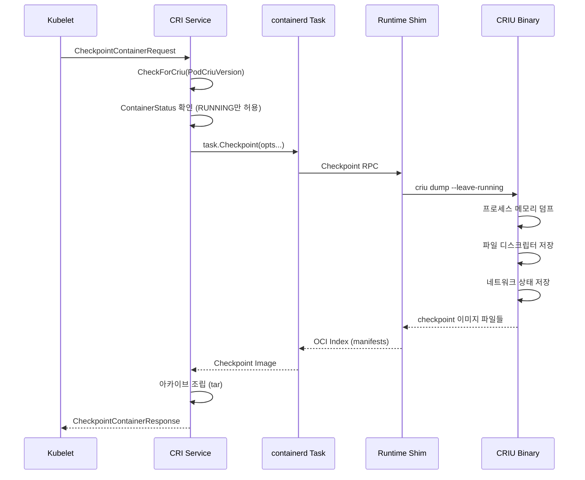
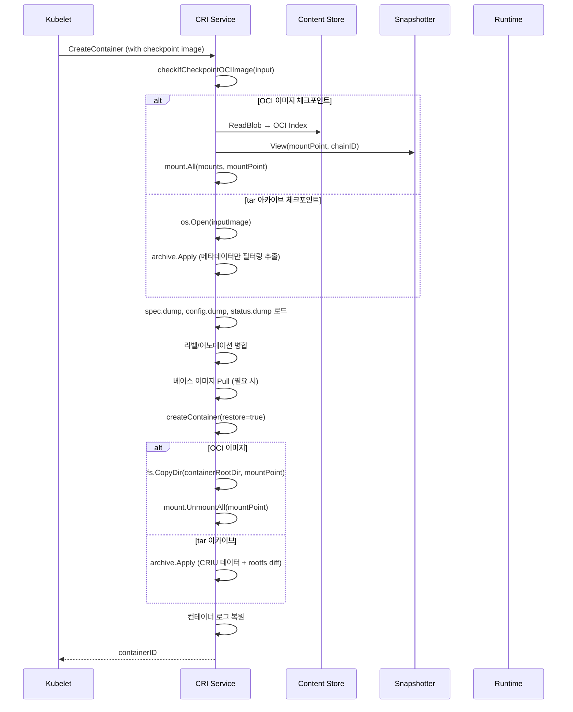
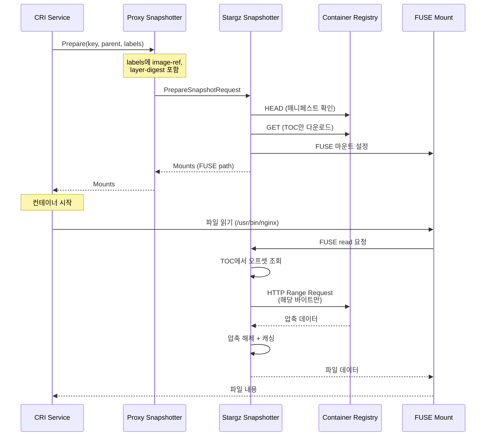

# containerd Checkpoint/Restore + Remote Snapshotter Deep-Dive

## 목차

1. [개요](#1-개요)
2. [Checkpoint/Restore 아키텍처](#2-checkpointrestore-아키텍처)
3. [CRIU 통합 구조](#3-criu-통합-구조)
4. [CheckpointContainer 흐름 상세](#4-checkpointcontainer-흐름-상세)
5. [CRImportCheckpoint 복원 흐름 상세](#5-crimportcheckpoint-복원-흐름-상세)
6. [클라이언트 Checkpoint 옵션 시스템](#6-클라이언트-checkpoint-옵션-시스템)
7. [체크포인트 아카이브 구조](#7-체크포인트-아카이브-구조)
8. [OCI 이미지 기반 체크포인트](#8-oci-이미지-기반-체크포인트)
9. [Remote Snapshotter 아키텍처](#9-remote-snapshotter-아키텍처)
10. [Proxy Snapshotter 패턴](#10-proxy-snapshotter-패턴)
11. [Snapshot 어노테이션과 Lazy Pulling](#11-snapshot-어노테이션과-lazy-pulling)
12. [Stargz Snapshotter 개념](#12-stargz-snapshotter-개념)
13. [CRI 설정과 Remote Snapshotter 통합](#13-cri-설정과-remote-snapshotter-통합)
14. [플랫폼 분기와 비-Linux 스텁](#14-플랫폼-분기와-비-linux-스텁)
15. [설계 철학과 Why 분석](#15-설계-철학과-why-분석)
16. [운영 고려사항](#16-운영-고려사항)
17. [관련 PoC 참조](#17-관련-poc-참조)

---

## 1. 개요

이 문서는 containerd의 두 가지 고급 기능을 심층 분석한다.

**Checkpoint/Restore**: 실행 중인 컨테이너의 전체 상태(메모리, CPU 레지스터, 파일 디스크립터, 네트워크 소켓 등)를 디스크에 저장하고, 나중에 해당 상태로부터 컨테이너를 복원하는 기능이다. Linux의 CRIU(Checkpoint/Restore In Userspace) 도구와 통합되어 동작한다.

**Remote Snapshotter**: 로컬 디스크에 전체 이미지를 다운로드하지 않고, 원격 저장소에서 필요한 부분만 on-demand로 가져오는 스냅샷터 확장 메커니즘이다. containerd의 gRPC 기반 Proxy Snapshotter와 Stargz Snapshotter 등이 이 범주에 속한다.

### 핵심 소스 파일

| 기능 | 파일 | 설명 |
|------|------|------|
| Checkpoint (클라이언트) | `client/container_checkpoint_opts.go` | 체크포인트 옵션 함수 (156줄) |
| Checkpoint (CRI Linux) | `internal/cri/server/container_checkpoint_linux.go` | CRIU 통합 구현 (760줄) |
| Checkpoint (CRI 비-Linux) | `internal/cri/server/container_checkpoint.go` | 비-Linux 스텁 (51줄) |
| Proxy Snapshotter | `core/snapshots/proxy/proxy.go` | gRPC 프록시 스냅샷터 (194줄) |
| Proxy Convert | `core/snapshots/proxy/convert.go` | protobuf 변환 (91줄) |
| Snapshot 어노테이션 | `pkg/snapshotters/annotations.go` | Remote Snapshotter 라벨 (97줄) |
| Snapshotter 인터페이스 | `core/snapshots/snapshotter.go` | Snapshotter 핵심 인터페이스 (406줄) |
| CRI 이미지 설정 | `internal/cri/config/config.go` | 스냅샷터/어노테이션 설정 |

```
containerd/
├── client/
│   └── container_checkpoint_opts.go   ← Checkpoint 옵션 함수들
├── internal/cri/server/
│   ├── container_checkpoint_linux.go  ← CRIU 통합 (Linux only)
│   └── container_checkpoint.go        ← 비-Linux 스텁
├── core/snapshots/
│   ├── snapshotter.go                 ← Snapshotter 인터페이스
│   └── proxy/
│       ├── proxy.go                   ← gRPC Proxy Snapshotter
│       └── convert.go                 ← protobuf 변환
├── pkg/snapshotters/
│   └── annotations.go                ← Remote Snapshotter 라벨
└── internal/cri/config/
    └── config.go                      ← CRI 이미지/스냅샷 설정
```

---

## 2. Checkpoint/Restore 아키텍처

### 전체 구조

```
+------------------------------------------------------------------+
|                       Kubernetes CRI                              |
|  CheckpointContainerRequest ──┐    ┌── CreateContainerRequest     |
+------------------------------------------------------------------+
                                │    │
                                v    v
+------------------------------------------------------------------+
|                  containerd CRI Service                           |
|  ┌──────────────────────────┐  ┌──────────────────────────┐      |
|  │  CheckpointContainer()   │  │  CRImportCheckpoint()    │      |
|  │  (체크포인트 생성)         │  │  (체크포인트 복원)         │      |
|  └────────────┬─────────────┘  └──────────┬───────────────┘      |
+------------------------------------------------------------------+
                │                            │
                v                            v
+------------------------------------------------------------------+
|                    containerd Task API                            |
|  task.Checkpoint() ────────┐    ┌──── Container 재생성             |
+------------------------------------------------------------------+
                             │    │
                             v    v
+------------------------------------------------------------------+
|              Runtime Shim (containerd-shim-runc-v2)               |
|                         │                                        |
|                         v                                        |
|                +------------------+                              |
|                │     CRIU 바이너리  │                              |
|                │  (dump / restore) │                              |
|                +------------------+                              |
+------------------------------------------------------------------+
                         │
                         v
+------------------------------------------------------------------+
|                    호스트 파일시스템                                 |
|  ┌───────────────────────────────────────────────────────┐       |
|  │ 체크포인트 아카이브 (.tar)                               │       |
|  │  ├── checkpoint/    ← CRIU 이미지 데이터               │       |
|  │  ├── rootfs-diff.tar ← RW 레이어 변경분                │       |
|  │  ├── config.dump    ← 컨테이너 메타데이터               │       |
|  │  ├── spec.dump      ← OCI 런타임 스펙                  │       |
|  │  ├── status.dump    ← CRI 상태 정보                    │       |
|  │  └── container.log  ← 컨테이너 로그                    │       |
|  └───────────────────────────────────────────────────────┘       |
+------------------------------------------------------------------+
```

### 왜 Checkpoint/Restore가 필요한가?

1. **Forensic Container Checkpointing (KEP-2008)**: Kubernetes에서 보안 분석을 위해 실행 중인 컨테이너의 상태를 캡처한다. 컨테이너를 중단하지 않고 메모리 상태를 보존할 수 있어 침해 사고 분석에 핵심이다.

2. **Live Migration**: 컨테이너를 한 노드에서 체크포인트하고 다른 노드에서 복원하여 무중단 마이그레이션을 구현한다.

3. **Fast Startup**: 초기화가 오래 걸리는 애플리케이션을 사전에 체크포인트하고, 필요 시 빠르게 복원하여 Cold Start 시간을 단축한다.

---

## 3. CRIU 통합 구조

### CRIU 버전 검증

containerd는 CRIU 바이너리의 존재와 버전을 체크포인트 요청 시 검증한다.

```
소스: internal/cri/server/container_checkpoint_linux.go:464-476

func (c *criService) CheckpointContainer(ctx context.Context, r *runtime.CheckpointContainerRequest)
    (*runtime.CheckpointContainerResponse, error) {
    start := time.Now()
    if err := utils.CheckForCriu(utils.PodCriuVersion); err != nil {
        errorMessage := fmt.Sprintf(
            "CRIU binary not found or too old (<%d). Failed to checkpoint container %q",
            utils.PodCriuVersion,
            r.GetContainerId(),
        )
        log.G(ctx).WithError(err).Error(errorMessage)
        return nil, fmt.Errorf("%s: %w", errorMessage, err)
    }
```

### 왜 CRIU 버전을 체크하는가?

CRIU는 커널 버전과 밀접하게 연동되며, 특정 기능(네임스페이스 복원, TCP 연결 체크포인트 등)은 최소 CRIU 버전을 요구한다. `utils.PodCriuVersion` 상수는 Pod 체크포인트에 필요한 최소 CRIU 버전을 정의한다. 이보다 오래된 CRIU로 체크포인트를 시도하면 예측 불가능한 실패가 발생할 수 있기 때문에 사전에 차단한다.

### CRIU 동작 흐름



---

## 4. CheckpointContainer 흐름 상세

### 4.1 사전 검증 단계

```
소스: internal/cri/server/container_checkpoint_linux.go:478-498

criContainerStatus, err := c.ContainerStatus(ctx, &runtime.ContainerStatusRequest{
    ContainerId: r.GetContainerId(),
})
...
container, err := c.containerStore.Get(r.GetContainerId())
...
state := container.Status.Get().State()
if state != runtime.ContainerState_CONTAINER_RUNNING {
    return nil, fmt.Errorf(
        "container %q is in %s state. only %s containers can be checkpointed",
        container.ID,
        criContainerStateToString(state),
        criContainerStateToString(runtime.ContainerState_CONTAINER_RUNNING),
    )
}
```

**왜 RUNNING 상태만 허용하는가?**

CRIU의 `dump` 명령은 실행 중인 프로세스의 메모리 페이지, 레지스터, 파일 디스크립터를 캡처한다. 중지된 프로세스는 이미 상태가 불완전하므로 체크포인트의 의미가 없다. 또한 Kubernetes Forensic Checkpointing KEP는 "컨테이너를 중단하지 않고 상태를 캡처"하는 것이 핵심이므로, RUNNING 상태에서만 동작하는 것이 스펙에 부합한다.

### 4.2 컨테이너 설정 JSON 생성

```
소스: internal/cri/server/container_checkpoint_linux.go:505-517

configJSON, err := json.Marshal(&crmetadata.ContainerConfig{
    ID:              container.ID,
    Name:            container.Name,
    RootfsImageName: criContainerStatus.GetStatus().GetImage().GetImage(),
    RootfsImageRef:  criContainerStatus.GetStatus().GetImageRef(),
    OCIRuntime:      i.Runtime.Name,
    RootfsImage:     criContainerStatus.GetStatus().GetImage().GetImage(),
    CheckpointedAt:  time.Now(),
    CreatedTime:     i.CreatedAt,
})
```

`crmetadata.ContainerConfig`는 `checkpoint-restore/checkpointctl` 라이브러리의 표준 메타데이터 구조체이다. 이 정보가 복원 시 베이스 이미지 풀링, 컨테이너 재생성에 사용된다.

### 4.3 Task Checkpoint 호출

```
소스: internal/cri/server/container_checkpoint_linux.go:519-526

task, err := container.Container.Task(ctx, nil)
...
img, err := task.Checkpoint(ctx, []client.CheckpointTaskOpts{
    withCheckpointOpts(i.Runtime.Name, c.getContainerRootDir(container.ID)),
}...)
```

### 4.4 Checkpoint 옵션 설정

```
소스: internal/cri/server/container_checkpoint_linux.go:656-675

func withCheckpointOpts(rt, rootDir string) client.CheckpointTaskOpts {
    return func(r *client.CheckpointTaskInfo) error {
        // Kubernetes currently supports checkpointing of container
        // as part of the Forensic Container Checkpointing KEP.
        // This implies that the container is never stopped
        leaveRunning := true

        switch rt {
        case plugins.RuntimeRuncV2:
            if r.Options == nil {
                r.Options = &options.CheckpointOptions{}
            }
            opts, _ := r.Options.(*options.CheckpointOptions)
            opts.Exit = !leaveRunning  // Exit = false → 컨테이너 계속 실행
            opts.WorkPath = rootDir
        }
        return nil
    }
}
```

**왜 `leaveRunning = true`인가?**

주석에 명시되어 있듯이, Kubernetes Forensic Container Checkpointing KEP의 핵심 요구사항은 "컨테이너를 중단하지 않는 것"이다. `opts.Exit = false`로 설정하면 CRIU가 `--leave-running` 플래그를 사용하여 체크포인트 후에도 원본 프로세스가 계속 실행된다. 이는 전통적인 CRIU dump (기본적으로 프로세스를 중지함)와의 핵심 차이점이다.

### 4.5 OCI Index에서 체크포인트 데이터 추출

```
소스: internal/cri/server/container_checkpoint_linux.go:528-534

var (
    index        v1.Index
    rawIndex     []byte
    targetDesc   = img.Target()
    contentStore = img.ContentStore()
)

defer c.client.ImageService().Delete(ctx, img.Metadata().Name)
```

체크포인트 이미지는 OCI Index 형식으로 반환된다. 이 인덱스의 매니페스트를 순회하며 CRIU 데이터, RW 레이어 diff, OCI 스펙을 각각 추출한다.

### 4.6 매니페스트 순회 및 데이터 분리

```
소스: internal/cri/server/container_checkpoint_linux.go:615-631

for _, manifest := range index.Manifests {
    switch manifest.MediaType {
    case images.MediaTypeContainerd1Checkpoint:
        if err := writeCriuCheckpointData(ctx, contentStore, manifest, cpPath); err != nil {
            return nil, fmt.Errorf("failed to copy CRIU checkpoint blob to checkpoint dir: %w", err)
        }
    case v1.MediaTypeImageLayerGzip:
        if err := writeRootFsDiffTar(ctx, contentStore, manifest, cpPath); err != nil {
            return nil, fmt.Errorf("failed to copy rw filesystem layer blob to checkpoint dir: %w", err)
        }
    case images.MediaTypeContainerd1CheckpointConfig:
        if err := writeSpecDumpFile(ctx, contentStore, manifest, cpPath); err != nil {
            return nil, fmt.Errorf("failed to copy container spec blob to checkpoint dir: %w", err)
        }
    default:
    }
}
```

**미디어 타입별 데이터 분리 전략**:

```
+----------------------------------------------+
| OCI Index                                    |
|                                              |
| ┌─ MediaType: Containerd1Checkpoint ──────┐  |
| │  CRIU 이미지 데이터 (메모리, FD, 소켓...)  │  |
| │  → checkpoint/ 디렉토리에 언팩            │  |
| └─────────────────────────────────────────┘  |
|                                              |
| ┌─ MediaType: ImageLayerGzip ─────────────┐  |
| │  RW 레이어 변경분 (rootfs diff)           │  |
| │  → rootfs-diff.tar 파일로 저장            │  |
| └─────────────────────────────────────────┘  |
|                                              |
| ┌─ MediaType: Containerd1CheckpointConfig ┐  |
| │  OCI 런타임 스펙 (spec.json)              │  |
| │  → spec.dump 파일로 저장                  │  |
| └─────────────────────────────────────────┘  |
+----------------------------------------------+
```

### 4.7 CRIU 데이터 언팩

```
소스: internal/cri/server/container_checkpoint_linux.go:677-713

func writeCriuCheckpointData(ctx context.Context, store content.Store,
    desc v1.Descriptor, cpPath string) error {
    ra, err := store.ReaderAt(ctx, desc)
    ...
    checkpointDirectory := filepath.Join(cpPath, crmetadata.CheckpointDirectory)
    if err := os.MkdirAll(checkpointDirectory, 0o700); err != nil {
        return err
    }
    tr := tar.NewReader(content.NewReader(ra))
    for {
        header, err := tr.Next()
        ...
        if strings.Contains(header.Name, "..") {
            return fmt.Errorf("found illegal string '..' in checkpoint archive")
        }
        destFile, err := os.Create(filepath.Join(checkpointDirectory, header.Name))
        ...
        _, err = io.CopyN(destFile, tr, header.Size)
        ...
    }
    return nil
}
```

**왜 `..` 경로를 검증하는가?**

경로 순회 공격(Path Traversal Attack)을 방지하기 위함이다. 악의적으로 조작된 체크포인트 아카이브가 `../../etc/passwd` 같은 경로를 포함할 수 있으며, 이를 허용하면 호스트 파일시스템의 임의 위치에 파일을 쓸 수 있다. 이는 컨테이너 보안의 기본 원칙인 "격리된 환경 밖으로의 탈출 방지"와 직결된다.

### 4.8 최종 아카이브 생성

```
소스: internal/cri/server/container_checkpoint_linux.go:633-653

// write final tarball of all content
tar := archive.Diff(ctx, "", cpPath)

outFile, err := os.OpenFile(r.Location, os.O_RDWR|os.O_CREATE, 0o600)
...
_, err = io.Copy(outFile, tar)
...
containerCheckpointTimer.WithValues(i.Runtime.Name).UpdateSince(start)
log.G(ctx).Infof("Wrote checkpoint archive to %s for %s", outFile.Name(), container.ID)
```

`archive.Diff`는 빈 디렉토리("")와 체크포인트 경로(`cpPath`) 사이의 차이, 즉 체크포인트 경로의 전체 내용을 tar 스트림으로 생성한다. 파일 권한은 `0o600`으로 소유자만 읽기/쓰기 가능하게 설정한다. CRIU 데이터에는 프로세스 메모리 덤프가 포함되어 있어 민감한 데이터(비밀키, 토큰 등)가 존재할 수 있기 때문이다.

---

## 5. CRImportCheckpoint 복원 흐름 상세

### 5.1 전체 복원 시퀀스



### 5.2 체크포인트 이미지 판별

```
소스: internal/cri/server/container_checkpoint_linux.go:64-108

func (c *criService) checkIfCheckpointOCIImage(ctx context.Context, input string) (string, error) {
    if input == "" {
        return "", nil
    }
    if _, err := os.Stat(input); err == nil {
        return "", nil   // 파일 시스템 경로이면 OCI 이미지가 아님
    }

    image, err := c.LocalResolve(input)
    ...
    images, err := c.client.ImageService().Get(ctx, input)
    ...
    rawIndex, err := content.ReadBlob(ctx, c.client.ContentStore(), images.Target)
    ...
    var index v1.Index
    if err = json.Unmarshal(rawIndex, &index); err != nil {
        return "", fmt.Errorf("failed to unmarshall blob into OCI index: %w", err)
    }

    if index.Annotations == nil {
        return "", nil
    }

    ann, ok := index.Annotations[crmetadata.CheckpointAnnotationName]
    if !ok {
        return "", nil
    }

    log.G(ctx).Infof("Found checkpoint of container %v in %v", ann, input)
    return image.ID, nil
}
```

**판별 로직**:

```
입력값 판별 흐름
─────────────────────────────────────────────
input == "" ?
  └─ yes → return "", nil (체크포인트 아님)

os.Stat(input) 성공?
  └─ yes → return "", nil (파일 경로 = tar 아카이브)

LocalResolve(input) → OCI 이미지?
  └─ yes → OCI Index 읽기
       └─ CheckpointAnnotationName 존재?
            ├─ yes → return imageID (OCI 체크포인트)
            └─ no  → return "", nil (일반 이미지)
```

**왜 두 가지 형식을 모두 지원하는가?**

1. **tar 아카이브**: 전통적 CRIU 체크포인트 형식. `ctr checkpoint` 명령이나 외부 도구로 생성한 체크포인트. 파일 시스템 경로로 직접 지정한다.
2. **OCI 이미지**: 체크포인트를 OCI 이미지로 패키징하여 컨테이너 레지스트리에 저장/배포. Kubernetes KEP-2008에서 권장하는 방식으로, 기존 이미지 배포 인프라를 활용할 수 있다.

### 5.3 tar 아카이브 복원 (2-패스 필터링)

```
소스: internal/cri/server/container_checkpoint_linux.go:189-222

// 1-패스: 메타데이터만 추출 (큰 파일 제외)
filter := archive.WithFilter(func(hdr *tar.Header) (bool, error) {
    excludePatterns := []string{
        "artifacts",
        "ctr.log",
        crmetadata.RootFsDiffTar,
        crmetadata.NetworkStatusFile,
        crmetadata.DeletedFilesFile,
        crmetadata.CheckpointDirectory,
    }
    for _, pattern := range excludePatterns {
        if strings.HasPrefix(hdr.Name, pattern) {
            return false, nil
        }
    }
    return true, nil
})

_, err = archive.Apply(ctx, mountPoint, archiveFile, []archive.ApplyOpt{filter}...)
```

```
소스: internal/cri/server/container_checkpoint_linux.go:423-448

// 2-패스: CRIU 데이터 + rootfs diff 추출 (메타데이터 제외)
filter := archive.WithFilter(func(hdr *tar.Header) (bool, error) {
    excludePatterns := []string{
        crmetadata.ConfigDumpFile,
        crmetadata.SpecDumpFile,
        crmetadata.StatusDumpFile,
    }
    for _, pattern := range excludePatterns {
        if strings.HasPrefix(hdr.Name, pattern) {
            return false, nil
        }
    }
    return true, nil
})

archiveFile.Seek(0, 0)  // 파일 포인터 리셋
_, err = archive.Apply(ctx, containerRootDir, archiveFile, []archive.ApplyOpt{filter}...)
```

**왜 2-패스 방식인가?**

```
+------------------------------------------+
|        체크포인트 아카이브 (.tar)           |
|                                          |
| ┌────────────────────────────────┐       |
| │ 1-패스 추출 대상 (메타데이터)     │       |
| │  config.dump  (수 KB)          │       |
| │  spec.dump    (수 KB)          │       |
| │  status.dump  (수 KB)          │       |
| └────────────────────────────────┘       |
|                                          |
| ┌────────────────────────────────┐       |
| │ 2-패스 추출 대상 (대용량 데이터)  │       |
| │  checkpoint/  (수백 MB~수 GB)  │       |
| │  rootfs-diff.tar (가변)        │       |
| │  container.log                 │       |
| └────────────────────────────────┘       |
+------------------------------------------+
```

1-패스에서 메타데이터만 빠르게 추출하여 컨테이너 설정을 파악하고, 베이스 이미지 풀링 등 준비 작업을 수행한다. 2-패스에서는 실제 데이터(수백 MB~수 GB)를 최종 컨테이너 루트 디렉토리에 직접 언팩한다. 이 분리는 불필요한 대용량 데이터의 중복 복사를 방지한다.

### 5.4 메타데이터 로드 및 병합

```
소스: internal/cri/server/container_checkpoint_linux.go:223-233

// spec.dump 로드
dumpSpec := new(spec.Spec)
if _, err := crmetadata.ReadJSONFile(dumpSpec, mountPoint, crmetadata.SpecDumpFile); err != nil {
    return "", fmt.Errorf("failed to read %q: %w", crmetadata.SpecDumpFile, err)
}

// config.dump 로드
config := new(crmetadata.ContainerConfig)
if _, err := crmetadata.ReadJSONFile(config, mountPoint, crmetadata.ConfigDumpFile); err != nil {
    return "", fmt.Errorf("failed to read %q: %w", crmetadata.ConfigDumpFile, err)
}

// status.dump 로드
containerStatus := new(runtime.ContainerStatus)
if _, err := crmetadata.ReadJSONFile(containerStatus, mountPoint, crmetadata.StatusDumpFile); err != nil {
    return "", fmt.Errorf("failed to read %q: %w", crmetadata.StatusDumpFile, err)
}
```

### 5.5 라벨/어노테이션 Fixup

복원 시 새로운 Pod에 배치되므로, Kubernetes 메타데이터를 업데이트해야 한다.

```
소스: internal/cri/server/container_checkpoint_linux.go:272-294

if createLabels != nil {
    fixupLabels := []string{
        // 컨테이너 이름 업데이트
        critypes.KubernetesContainerNameLabel,
        // Pod 이름 업데이트
        critypes.KubernetesPodNameLabel,
        // 네임스페이스 업데이트
        critypes.KubernetesPodNamespaceLabel,
    }

    for _, annotation := range fixupLabels {
        _, ok1 := createLabels[annotation]
        _, ok2 := originalLabels[annotation]
        if ok1 && ok2 {
            originalLabels[annotation] = createLabels[annotation]
        }
    }
}
```

**어노테이션 Fixup 목록**:

| 어노테이션 | 용도 | Fixup 이유 |
|-----------|------|-----------|
| `KubernetesContainerNameLabel` | 컨테이너 이름 | 새 Pod에서 이름이 다를 수 있음 |
| `KubernetesPodNameLabel` | Pod 이름 | 새 Pod 이름 반영 |
| `KubernetesPodNamespaceLabel` | 네임스페이스 | 다른 네임스페이스로 복원 가능 |
| `io.kubernetes.container.hash` | 컨테이너 해시 | Kubernetes가 재시작 필요 여부 판단에 사용 |
| `io.kubernetes.container.restartCount` | 재시작 횟수 | 정확한 재시작 카운트 유지 |

### 5.6 베이스 이미지 자동 풀링

```
소스: internal/cri/server/container_checkpoint_linux.go:316-332

containerdImage, err = c.client.GetImage(ctx, config.RootfsImageRef)
if err != nil {
    if !errdefs.IsNotFound(err) {
        return "", fmt.Errorf("failed to get checkpoint base image %s: %w", config.RootfsImageRef, err)
    }
    // 베이스 이미지가 없으면 자동으로 Pull
    containerdImage, err = c.client.Pull(ctx, config.RootfsImageRef)
    if err != nil {
        return "", fmt.Errorf("failed to pull checkpoint base image %s: %w", config.RootfsImageRef, err)
    }
}
```

**왜 자동 풀링이 필요한가?**

체크포인트 아카이브에는 베이스 이미지 전체가 포함되지 않고, config.dump에 `RootfsImageRef` (NAME@DIGEST)만 기록된다. 복원 대상 노드에 이 이미지가 없으면 레지스트리에서 풀링해야 한다. 이는 체크포인트 아카이브 크기를 최소화하면서도 크로스-노드 복원을 가능하게 하는 설계이다.

### 5.7 이미지 해상도 대기 (Busy Wait)

```
소스: internal/cri/server/container_checkpoint_linux.go:356-368

var image imagestore.Image
for i := 1; i < 500; i++ {
    // This is probably wrong. Not sure how to wait for an image to appear in
    // the image (or content) store.
    log.G(ctx).Debugf("Trying to resolve %s:%d", containerdImage.Name(), i)
    image, err = c.LocalResolve(containerdImage.Name())
    if err == nil {
        break
    }
    time.Sleep(time.Microsecond * time.Duration(i))
}
```

**주석이 "This is probably wrong"이라고 말하는 이유**:

이 코드는 이미지가 Content Store에서 이미지 스토어로 동기화되는 비동기 과정을 기다리기 위한 것이다. 지수 백오프(exponential backoff) 대신 선형 증가 슬립을 사용하며, 최대 500회 시도로 하드코딩되어 있다. 이벤트 기반 대기가 이상적이지만, 현재 containerd 내부 API에서 이미지 스토어 동기화 완료를 알리는 메커니즘이 제한적이기 때문에 이런 폴링 방식을 사용한다. TODO 수준의 코드이지만 실용적으로 동작한다.

---

## 6. 클라이언트 Checkpoint 옵션 시스템

### 함수형 옵션 패턴

```
소스: client/container_checkpoint_opts.go:43

type CheckpointOpts func(context.Context, *Client, *containers.Container,
    *imagespec.Index, *options.CheckpointOptions) error
```

containerd 클라이언트 레벨의 체크포인트는 함수형 옵션 패턴으로 구성된다. 각 옵션 함수는 체크포인트에 포함할 데이터의 범위를 결정한다.

### 옵션 함수 일람

```
+-----------------------------------------------------------+
|              CheckpointOpts 함수 목록                       |
+-----------------------------------------------------------+
|                                                           |
|  WithCheckpointImage     ← 컨테이너 이미지 매니페스트 포함    |
|  WithCheckpointTask      ← 실행 중인 태스크 상태 포함        |
|  WithCheckpointRuntime   ← 런타임 옵션 포함                 |
|  WithCheckpointRW        ← RW 레이어 변경분 포함             |
|  WithCheckpointTaskExit  ← 체크포인트 후 태스크 종료          |
|                                                           |
+-----------------------------------------------------------+
```

### 6.1 WithCheckpointImage

```
소스: client/container_checkpoint_opts.go:46-53

func WithCheckpointImage(ctx context.Context, client *Client, c *containers.Container,
    index *imagespec.Index, copts *options.CheckpointOptions) error {
    ir, err := client.ImageService().Get(ctx, c.Image)
    if err != nil {
        return err
    }
    index.Manifests = append(index.Manifests, ir.Target)
    return nil
}
```

컨테이너의 베이스 이미지 디스크립터를 체크포인트 인덱스에 추가한다. 이미지 자체가 아니라 **참조(디스크립터)**만 포함하므로 아카이브 크기가 증가하지 않는다.

### 6.2 WithCheckpointTask

```
소스: client/container_checkpoint_opts.go:56-94

func WithCheckpointTask(ctx context.Context, client *Client, c *containers.Container,
    index *imagespec.Index, copts *options.CheckpointOptions) error {
    opt, err := typeurl.MarshalAnyToProto(copts)
    ...
    task, err := client.TaskService().Checkpoint(ctx, &tasks.CheckpointTaskRequest{
        ContainerID: c.ID,
        Options:     opt,
    })
    ...
    for _, d := range task.Descriptors {
        platformSpec := platforms.DefaultSpec()
        index.Manifests = append(index.Manifests, imagespec.Descriptor{
            MediaType:   d.MediaType,
            Size:        d.Size,
            Digest:      digest.Digest(d.Digest),
            Platform:    &platformSpec,
            Annotations: d.Annotations,
        })
    }
    // 체크포인트 옵션도 Content Store에 저장
    data, err := proto.Marshal(opt)
    ...
    desc, err := writeContent(ctx, client.ContentStore(),
        images.MediaTypeContainerd1CheckpointOptions, c.ID+"-checkpoint-options", r)
    ...
    index.Manifests = append(index.Manifests, desc)
    return nil
}
```

Task 체크포인트는 CRIU를 호출하여 프로세스 상태를 덤프하는 핵심 옵션이다. 반환된 디스크립터들(CRIU 이미지, OCI 스펙 등)을 인덱스에 추가하고, 체크포인트 옵션 자체도 Content Store에 기록한다.

### 6.3 WithCheckpointRW

```
소스: client/container_checkpoint_opts.go:119-139

func WithCheckpointRW(ctx context.Context, client *Client, c *containers.Container,
    index *imagespec.Index, copts *options.CheckpointOptions) error {
    diffOpts := []diff.Opt{
        diff.WithReference(fmt.Sprintf("checkpoint-rw-%s", c.SnapshotKey)),
    }
    rw, err := rootfs.CreateDiff(ctx,
        c.SnapshotKey,
        client.SnapshotService(c.Snapshotter),
        client.DiffService(),
        diffOpts...,
    )
    ...
    rw.Platform = &imagespec.Platform{
        OS:           runtime.GOOS,
        Architecture: runtime.GOARCH,
    }
    index.Manifests = append(index.Manifests, rw)
    return nil
}
```

**왜 RW 레이어를 별도로 저장하는가?**

컨테이너의 파일시스템은 베이스 이미지(읽기 전용) + RW 레이어(변경분)로 구성된다. 복원 시 베이스 이미지는 레지스트리에서 풀링할 수 있지만, RW 레이어(컨테이너 실행 중 생성/수정된 파일)는 이 컨테이너만의 고유 데이터이므로 체크포인트에 반드시 포함해야 한다. `rootfs.CreateDiff`는 스냅샷의 부모(베이스)와 현재 상태의 차이를 계산하여 최소한의 데이터만 저장한다.

### 6.4 WithCheckpointTaskExit

```
소스: client/container_checkpoint_opts.go:142-145

func WithCheckpointTaskExit(ctx context.Context, client *Client, c *containers.Container,
    index *imagespec.Index, copts *options.CheckpointOptions) error {
    copts.Exit = true
    return nil
}
```

이 옵션을 사용하면 체크포인트 후 컨테이너가 종료된다. CRI의 Forensic Checkpointing과 달리, 클라이언트 API에서는 체크포인트 후 종료가 필요한 유즈케이스(라이브 마이그레이션 등)를 지원한다.

### 6.5 GetIndexByMediaType 유틸리티

```
소스: client/container_checkpoint_opts.go:148-155

func GetIndexByMediaType(index *imagespec.Index, mt string) (*imagespec.Descriptor, error) {
    for _, d := range index.Manifests {
        if d.MediaType == mt {
            return &d, nil
        }
    }
    return nil, ErrMediaTypeNotFound
}
```

OCI Index에서 특정 미디어 타입의 디스크립터를 검색하는 유틸리티 함수이다.

---

## 7. 체크포인트 아카이브 구조

### 아카이브 내부 구조

```
checkpoint-archive.tar
│
├── config.dump              ← ContainerConfig JSON
│   {
│     "id": "abc123",
│     "name": "my-container",
│     "rootfsImageName": "docker.io/library/nginx:latest",
│     "rootfsImageRef": "docker.io/library/nginx@sha256:...",
│     "ociRuntime": "io.containerd.runc.v2",
│     "checkpointedAt": "2026-03-08T12:00:00Z",
│     "createdTime": "2026-03-07T10:00:00Z"
│   }
│
├── spec.dump                ← OCI Runtime Spec JSON
│   {
│     "ociVersion": "1.0.2",
│     "process": { ... },
│     "root": { ... },
│     "mounts": [ ... ],
│     "annotations": { ... }
│   }
│
├── status.dump              ← CRI ContainerStatus JSON
│   {
│     "id": "abc123",
│     "metadata": { "name": "my-container" },
│     "state": "CONTAINER_RUNNING",
│     "image": { ... },
│     "labels": { ... },
│     "annotations": { ... }
│   }
│
├── checkpoint/              ← CRIU 이미지 데이터
│   ├── inventory.img        ← 체크포인트 인벤토리
│   ├── core-*.img           ← 프로세스 코어 덤프
│   ├── mm-*.img             ← 메모리 매핑 정보
│   ├── pages-*.img          ← 메모리 페이지 데이터 (대용량)
│   ├── fdinfo-*.img         ← 파일 디스크립터 정보
│   ├── fs-*.img             ← 파일시스템 상태
│   ├── pstree.img           ← 프로세스 트리
│   └── seccomp.img          ← seccomp 필터 상태
│
├── rootfs-diff.tar          ← RW 레이어 변경분
│
├── stats-dump               ← CRIU 통계 (타이밍 분석)
│
├── dump.log                 ← CRIU 로그 (선택)
│
├── status                   ← containerd 내부 상태
│
└── container.log            ← 컨테이너 stdout/stderr 로그
```

### 보조 파일 복사

```
소스: internal/cri/server/container_checkpoint_linux.go:554-596

// status 파일 (checkpointctl 분석용)
if err := c.os.CopyFile(
    filepath.Join(c.getContainerRootDir(container.ID), crmetadata.StatusFile),
    filepath.Join(cpPath, crmetadata.StatusFile),
    0o600,
); err != nil {
    return nil, err
}

// CRIU 통계 (타이밍 분석)
if err := c.os.CopyFile(
    filepath.Join(c.getContainerRootDir(container.ID), stats.StatsDump),
    filepath.Join(cpPath, stats.StatsDump),
    0o600,
); err != nil {
    return nil, err
}

// CRIU 로그 (선택적 — 파일 없으면 에러 무시)
if err := c.os.CopyFile(
    filepath.Join(c.getContainerRootDir(container.ID), crmetadata.DumpLogFile),
    filepath.Join(cpPath, crmetadata.DumpLogFile),
    0o600,
); err != nil {
    if !errors.Is(errors.Unwrap(err), os.ErrNotExist) {
        return nil, err
    }
}

// 컨테이너 로그 (선택적)
_, err = c.os.Stat(criContainerStatus.GetStatus().GetLogPath())
if err == nil {
    if err := c.os.CopyFile(
        criContainerStatus.GetStatus().GetLogPath(),
        filepath.Join(cpPath, "container.log"),
        0o600,
    ); err != nil {
        return nil, err
    }
}
```

**왜 dump.log를 선택적으로 처리하는가?**

CRIU는 `--log-file` 옵션이 지정된 경우에만 로그 파일을 생성한다. containerd의 CRIU 호출 설정에 따라 로그 파일이 없을 수 있으므로, `os.ErrNotExist` 에러만 무시하고 다른 에러(권한 문제 등)는 전파한다.

---

## 8. OCI 이미지 기반 체크포인트

### OCI 이미지 복원 경로

```
소스: internal/cri/server/container_checkpoint_linux.go:142-176

if restoreStorageImageID != "" {
    log.G(ctx).Debugf("Restoring from oci image %s", inputImage)
    platform, err := c.sandboxService.SandboxPlatform(ctx, sandbox.Sandboxer, sandbox.ID)
    ...
    img, err := c.client.ImageService().Get(ctx, restoreStorageImageID)
    ...
    i := client.NewImageWithPlatform(c.client, img, platforms.Only(platform))
    diffIDs, err := i.RootFS(ctx)
    ...
    chainID := identity.ChainID(diffIDs).String()
    ociRuntime, err := c.config.GetSandboxRuntime(sandboxConfig, sandbox.Metadata.RuntimeHandler)
    ...
    s := c.client.SnapshotService(c.RuntimeSnapshotter(ctx, ociRuntime))

    mounts, err := s.View(ctx, mountPoint, chainID)
    if err != nil {
        if errdefs.IsAlreadyExists(err) {
            mounts, err = s.Mounts(ctx, mountPoint)
        }
        ...
    }
    if err := mount.All(mounts, mountPoint); err != nil {
        return "", err
    }
}
```

**OCI 이미지 복원 vs tar 아카이브 복원 비교**:

| 특성 | OCI 이미지 | tar 아카이브 |
|------|-----------|-------------|
| 저장소 | 컨테이너 레지스트리 | 로컬 파일시스템 |
| 배포 | `docker push/pull` 활용 | SCP/NFS 등 파일 전송 |
| 크기 | 레이어 중복 제거 가능 | 전체 데이터 포함 |
| 접근 방식 | Snapshotter View | archive.Apply |
| 메타데이터 접근 | 마운트 후 읽기 | 필터링 언팩 |
| 복원 후 정리 | mount.UnmountAll + fs.CopyDir | archiveFile.Seek(0,0) + 2차 언팩 |

### OCI 이미지 복원 후 정리

```
소스: internal/cri/server/container_checkpoint_linux.go:416-448

if restoreStorageImageID != "" {
    if err := fs.CopyDir(containerRootDir, mountPoint); err != nil {
        return "", err
    }
    if err := mount.UnmountAll(mountPoint, 0); err != nil {
        return "", err
    }
} else {
    // tar 아카이브: 2-패스 언팩
    archiveFile.Seek(0, 0)
    _, err = archive.Apply(ctx, containerRootDir, archiveFile, []archive.ApplyOpt{filter}...)
    ...
}
```

OCI 이미지 경로에서는 스냅샷을 View로 마운트하여 메타데이터를 읽은 후, `fs.CopyDir`로 전체 내용을 컨테이너 루트 디렉토리에 복사하고 마운트를 해제한다. tar 아카이브 경로에서는 파일 포인터를 처음으로 되돌린 후 2-패스 언팩을 수행한다.

---

## 9. Remote Snapshotter 아키텍처

### 개념

Remote Snapshotter는 containerd의 Snapshotter 인터페이스를 구현하되, 실제 파일시스템 레이어를 로컬에 완전히 다운로드하지 않고 원격 저장소에서 **온디맨드(on-demand)**로 가져오는 스냅샷터이다.

```
전통적 이미지 풀링:
┌─────────────┐     ┌─────────────┐     ┌─────────────┐
│   Registry  │ ──> │ Content     │ ──> │ Snapshotter │
│             │ 전체 │ Store       │ 전체 │ (Overlay)   │
│             │ 풀링 │             │ 언팩 │             │
└─────────────┘     └─────────────┘     └─────────────┘
   시간: ████████████████████████████████████ (긴 대기)

Remote Snapshotter (Lazy Pulling):
┌─────────────┐     ┌─────────────────────┐
│   Registry  │ ──> │ Remote Snapshotter   │
│             │ 메타 │ (Stargz/OverlayBD)  │
│             │ 만   │                     │
└─────────────┘     └─────────────────────┘
                     ↑ 컨테이너 실행 시
                     │ 필요한 부분만 다운로드
                     │ (on-demand fetch)
   시간: ████ (빠른 시작)
```

### 왜 Remote Snapshotter가 필요한가?

1. **Cold Start 최적화**: 대형 이미지(수 GB)를 완전히 풀링하면 몇 분이 걸릴 수 있다. Remote Snapshotter는 메타데이터만 가져와 즉시 컨테이너를 시작하고, 실제 데이터는 접근 시 가져온다. 연구에 따르면 컨테이너 시작 시 실제로 읽는 데이터는 전체 이미지의 6.4%에 불과하다(Harter et al., FAST '16).

2. **대규모 클러스터 배포**: 수천 노드에 동시 배포 시 레지스트리 부하를 분산한다. 각 노드가 전체 이미지를 동시에 풀링하는 대신, 필요한 부분만 가져오므로 네트워크 대역폭이 절약된다.

3. **디스크 공간 절약**: 전체 이미지를 로컬에 저장하지 않으므로 노드의 디스크 사용량이 크게 줄어든다.

### Snapshotter 인터페이스

```
소스: core/snapshots/snapshotter.go:255-351

type Snapshotter interface {
    Stat(ctx context.Context, key string) (Info, error)
    Update(ctx context.Context, info Info, fieldpaths ...string) (Info, error)
    Usage(ctx context.Context, key string) (Usage, error)
    Mounts(ctx context.Context, key string) ([]mount.Mount, error)
    Prepare(ctx context.Context, key, parent string, opts ...Opt) ([]mount.Mount, error)
    View(ctx context.Context, key, parent string, opts ...Opt) ([]mount.Mount, error)
    Commit(ctx context.Context, name, key string, opts ...Opt) error
    Remove(ctx context.Context, key string) error
    Walk(ctx context.Context, fn WalkFunc, filters ...string) error
    Close() error
}
```

**스냅샷 생명주기와 종류**:

```
                    Prepare(key, parent)
                          │
                          v
                    ┌────────────┐
                    │   Active   │ ← 쓰기 가능
                    │ (key)      │
                    └─────┬──────┘
                          │
              ┌───────────┴───────────┐
              │                       │
         Commit(name, key)        Remove(key)
              │                       │
              v                       v
        ┌────────────┐          (삭제됨)
        │ Committed  │ ← 읽기 전용, 부모가 될 수 있음
        │ (name)     │
        └────────────┘


                    View(key, parent)
                          │
                          v
                    ┌────────────┐
                    │   View     │ ← 읽기 전용
                    │ (key)      │ ← Commit 불가
                    └────────────┘
```

### Cleaner 인터페이스

```
소스: core/snapshots/snapshotter.go:353-362

type Cleaner interface {
    Cleanup(ctx context.Context) error
}
```

`Cleaner`는 비동기 리소스 정리를 위한 인터페이스이다. 빠른 삭제(`Remove`)와 지연 정리(`Cleanup`)를 분리하여, 삭제 응답 시간을 최소화하면서 백그라운드에서 디스크 공간을 회수한다.

---

## 10. Proxy Snapshotter 패턴

### 프록시 스냅샷터 구조

```
소스: core/snapshots/proxy/proxy.go:31-43

func NewSnapshotter(client snapshotsapi.SnapshotsClient, snapshotterName string) snapshots.Snapshotter {
    return &proxySnapshotter{
        client:          client,
        snapshotterName: snapshotterName,
    }
}

type proxySnapshotter struct {
    client          snapshotsapi.SnapshotsClient
    snapshotterName string
}
```

Proxy Snapshotter는 containerd의 Snapshotter 인터페이스를 구현하되, 모든 호출을 gRPC를 통해 외부 스냅샷터 프로세스에 위임한다. 이것이 Remote Snapshotter의 통합 지점이다.

```
+-----------------------------------------------------------+
|                     containerd                             |
|                                                           |
|  ┌──────────────────────────────────────────────────┐     |
|  │              Proxy Snapshotter                    │     |
|  │  (core/snapshots/proxy/proxy.go)                 │     |
|  │                                                  │     |
|  │  Snapshotter 인터페이스 구현                       │     |
|  │  → 모든 메서드를 gRPC 호출로 변환                   │     |
|  │                                                  │     |
|  │  ┌─────────────────────────────────────────┐     │     |
|  │  │ snapshotsapi.SnapshotsClient (gRPC)     │     │     |
|  │  └──────────────────┬──────────────────────┘     │     |
|  └──────────────────────┼───────────────────────────┘     |
|                         │ gRPC (Unix Socket)               |
+─────────────────────────┼─────────────────────────────────+
                          │
+─────────────────────────v─────────────────────────────────+
|            외부 Snapshotter 프로세스                        |
|                                                           |
|  ┌─────────────────────────────────────────────────┐      |
|  │  Stargz Snapshotter / OverlayBD / Nydus 등      │      |
|  │                                                 │      |
|  │  gRPC 서버 (Snapshots API 구현)                  │      |
|  │  + FUSE 마운트 / Block Device 관리               │      |
|  └─────────────────────────────────────────────────┘      |
+───────────────────────────────────────────────────────────+
```

### Prepare 구현 상세

```
소스: core/snapshots/proxy/proxy.go:94-111

func (p *proxySnapshotter) Prepare(ctx context.Context, key, parent string,
    opts ...snapshots.Opt) ([]mount.Mount, error) {
    var local snapshots.Info
    for _, opt := range opts {
        if err := opt(&local); err != nil {
            return nil, err
        }
    }
    resp, err := p.client.Prepare(ctx, &snapshotsapi.PrepareSnapshotRequest{
        Snapshotter: p.snapshotterName,
        Key:         key,
        Parent:      parent,
        Labels:      local.Labels,
    })
    if err != nil {
        return nil, errgrpc.ToNative(err)
    }
    return mount.FromProto(resp.Mounts), nil
}
```

**핵심 설계 포인트**:

1. **Labels 전달**: `opts`에서 추출한 라벨이 gRPC 요청에 포함된다. Remote Snapshotter는 이 라벨을 통해 원격 저장소의 이미지 참조, 레이어 다이제스트 등을 전달받는다.

2. **errgrpc.ToNative**: gRPC 에러 코드를 containerd 네이티브 에러(`errdefs`)로 변환한다. `codes.NotFound` → `errdefs.ErrNotFound` 등으로 매핑하여, 호출자가 gRPC를 인식하지 않아도 에러를 적절히 처리할 수 있다.

3. **mount.FromProto**: gRPC protobuf의 Mount 메시지를 containerd의 내부 Mount 구조체로 변환한다. Remote Snapshotter가 반환하는 마운트는 FUSE 마운트, Block Device, 또는 OverlayFS일 수 있다.

### Walk (스트리밍 RPC)

```
소스: core/snapshots/proxy/proxy.go:157-182

func (p *proxySnapshotter) Walk(ctx context.Context, fn snapshots.WalkFunc, fs ...string) error {
    sc, err := p.client.List(ctx, &snapshotsapi.ListSnapshotsRequest{
        Snapshotter: p.snapshotterName,
        Filters:     fs,
    })
    ...
    for {
        resp, err := sc.Recv()
        if err != nil {
            if err == io.EOF {
                return nil
            }
            return errgrpc.ToNative(err)
        }
        if resp == nil {
            return nil
        }
        for _, info := range resp.Info {
            if err := fn(ctx, InfoFromProto(info)); err != nil {
                return err
            }
        }
    }
}
```

`Walk`는 gRPC 서버 스트리밍을 사용한다. 대량의 스냅샷 목록을 한 번에 메모리에 올리지 않고, 청크 단위로 스트리밍 수신하여 `WalkFunc`에 전달한다.

### Protobuf 변환

```
소스: core/snapshots/proxy/convert.go:26-48

func KindToProto(kind snapshots.Kind) snapshotsapi.Kind {
    switch kind {
    case snapshots.KindActive:
        return snapshotsapi.Kind_ACTIVE
    case snapshots.KindView:
        return snapshotsapi.Kind_VIEW
    default:
        return snapshotsapi.Kind_COMMITTED
    }
}

func KindFromProto(kind snapshotsapi.Kind) snapshots.Kind {
    switch kind {
    case snapshotsapi.Kind_ACTIVE:
        return snapshots.KindActive
    case snapshotsapi.Kind_VIEW:
        return snapshots.KindView
    default:
        return snapshots.KindCommitted
    }
}
```

**왜 default가 COMMITTED인가?**

스냅샷의 세 가지 상태(Active, View, Committed) 중 Committed가 가장 안전한 기본값이다. 알 수 없는 상태의 스냅샷을 Active로 취급하면 의도치 않은 쓰기가 발생할 수 있고, View로 취급하면 Commit이 불가능하다. Committed는 읽기 전용이면서 부모로 사용할 수 있어 가장 안전한 폴백이다.

---

## 11. Snapshot 어노테이션과 Lazy Pulling

### Remote Snapshotter 라벨

```
소스: pkg/snapshotters/annotations.go:31-45

const (
    // 이미지 참조 (예: docker.io/library/nginx:latest)
    TargetRefLabel = "containerd.io/snapshot/cri.image-ref"

    // 매니페스트 다이제스트
    TargetManifestDigestLabel = "containerd.io/snapshot/cri.manifest-digest"

    // 레이어 다이제스트
    TargetLayerDigestLabel = "containerd.io/snapshot/cri.layer-digest"

    // 이미지의 전체 레이어 다이제스트 목록 (병렬 준비용)
    TargetImageLayersLabel = "containerd.io/snapshot/cri.image-layers"
)
```

**라벨의 역할**:

```
이미지 풀링 흐름에서 라벨 전달
─────────────────────────────────────────────

OCI Manifest
├── Layer 1: sha256:aaa...
│   Annotations:
│     cri.image-ref = "nginx:latest"
│     cri.manifest-digest = "sha256:mani..."
│     cri.layer-digest = "sha256:aaa..."
│     cri.image-layers = "sha256:aaa...,sha256:bbb...,sha256:ccc..."
│
├── Layer 2: sha256:bbb...
│   Annotations:
│     cri.image-ref = "nginx:latest"
│     cri.manifest-digest = "sha256:mani..."
│     cri.layer-digest = "sha256:bbb..."
│     cri.image-layers = "sha256:bbb...,sha256:ccc..."
│
└── Layer 3: sha256:ccc...
    Annotations:
      cri.image-ref = "nginx:latest"
      cri.manifest-digest = "sha256:mani..."
      cri.layer-digest = "sha256:ccc..."
      cri.image-layers = "sha256:ccc..."
```

### AppendInfoHandlerWrapper

```
소스: pkg/snapshotters/annotations.go:51-75

func AppendInfoHandlerWrapper(ref string) func(f images.Handler) images.Handler {
    return func(f images.Handler) images.Handler {
        return images.HandlerFunc(func(ctx context.Context, desc ocispec.Descriptor)
            ([]ocispec.Descriptor, error) {
            children, err := f.Handle(ctx, desc)
            if err != nil {
                return nil, err
            }
            if images.IsManifestType(desc.MediaType) {
                for i := range children {
                    c := &children[i]
                    if images.IsLayerType(c.MediaType) {
                        if c.Annotations == nil {
                            c.Annotations = make(map[string]string)
                        }
                        c.Annotations[TargetRefLabel] = ref
                        c.Annotations[TargetLayerDigestLabel] = c.Digest.String()
                        c.Annotations[TargetImageLayersLabel] = getLayers(
                            ctx, TargetImageLayersLabel, children[i:], labels.Validate)
                        c.Annotations[TargetManifestDigestLabel] = desc.Digest.String()
                    }
                }
            }
            return children, nil
        })
    }
}
```

**왜 Handler Wrapper 패턴인가?**

containerd의 이미지 처리는 Handler 체인으로 구성된다. 각 Handler는 OCI 디스크립터를 받아 자식 디스크립터를 반환한다. `AppendInfoHandlerWrapper`는 기존 Handler를 감싸서(wrap), 이미지 매니페스트를 처리할 때 각 레이어 디스크립터에 Remote Snapshotter용 어노테이션을 추가한다. 이 데코레이터 패턴을 통해 기존 이미지 처리 로직을 수정하지 않고 기능을 확장한다.

### getLayers (크기 제한 처리)

```
소스: pkg/snapshotters/annotations.go:80-96

func getLayers(ctx context.Context, key string, descs []ocispec.Descriptor,
    validate func(k, v string) error) (layers string) {
    for _, l := range descs {
        if images.IsLayerType(l.MediaType) {
            item := l.Digest.String()
            if layers != "" {
                item = "," + item
            }
            // 라벨 크기 제한 검증
            if err := validate(key, layers+item); err != nil {
                log.G(ctx).WithError(err).WithField("label", key).
                    WithField("digest", l.Digest.String()).
                    Debug("omitting digest in the layers list")
                break
            }
            layers += item
        }
    }
    return
}
```

**왜 라벨 크기를 검증하는가?**

containerd의 라벨에는 크기 제한이 있다(`labels.Validate`). 수십 개 레이어를 가진 이미지에서 모든 다이제스트를 쉼표로 연결하면 라벨 크기 제한을 초과할 수 있다. `getLayers`는 제한에 도달하면 남은 다이제스트를 생략한다. 주석에 "Skipping some layers is allowed and only affects performance"라고 명시되어 있듯이, 일부 레이어 정보가 누락되어도 동작에는 문제가 없고 병렬 준비 최적화 성능만 약간 저하된다.

### 레이어 목록의 i: 슬라이싱

```
children[i:]  ← 현재 레이어부터 마지막 레이어까지
```

**왜 `children[i:]`인가?**

`TargetImageLayersLabel`은 "현재 레이어 이후의 모든 레이어"를 나열한다. Remote Snapshotter는 이 정보를 활용하여 다음에 필요할 레이어들을 **미리(prefetch)** 준비할 수 있다. 레이어 1을 처리할 때 "레이어 2, 3도 곧 필요하다"는 힌트를 제공하여 병렬 다운로드를 가능하게 한다.

---

## 12. Stargz Snapshotter 개념

### eStargz (Seekable tar.gz) 형식

```
전통적 tar.gz:
┌──────────────────────────────────────┐
│ gzip( tar( file1 | file2 | ... ) )   │
└──────────────────────────────────────┘
  → 시작부터 순차적으로만 읽을 수 있음
  → 특정 파일을 읽으려면 전체를 풀어야 함

eStargz:
┌─────────┬─────────┬─────────┬───────────────┐
│ gzip    │ gzip    │ gzip    │ Table of      │
│ (file1) │ (file2) │ (file3) │ Contents      │
│         │         │         │ (TOC)         │
└─────────┴─────────┴─────────┴───────────────┘
  → 각 파일이 독립적으로 gzip 압축
  → TOC로 파일 위치를 파악하여 랜덤 액세스 가능
  → HTTP Range Request로 필요한 부분만 다운로드
```

### Stargz Snapshotter 동작 원리

```
                    containerd
                        │
                        v
            ┌───────────────────────┐
            │   Proxy Snapshotter   │
            │   (gRPC client)       │
            └───────────┬───────────┘
                        │ gRPC
                        v
            ┌───────────────────────┐
            │  Stargz Snapshotter   │
            │                       │
            │  ┌─────────────────┐  │
            │  │ FUSE Filesystem  │  │
            │  │                 │  │
            │  │ open("/app.js") │  │
            │  │      │          │  │
            │  │      v          │  │
            │  │ TOC 조회        │  │
            │  │      │          │  │
            │  │      v          │  │
            │  │ HTTP Range Req  │  │
            │  │ 레지스트리에서   │  │
            │  │ 해당 바이트만    │  │
            │  │ 다운로드         │  │
            │  └─────────────────┘  │
            └───────────────────────┘
```

### Lazy Pulling 시퀀스



### 왜 containerd에 Remote Snapshotter가 외부 프로세스인가?

containerd의 핵심 설계 원칙은 "단순하고 안정적인 코어 + 확장 가능한 플러그인"이다. Remote Snapshotter를 외부 프로세스로 분리하면:

1. **코어 안정성**: FUSE 마운트나 네트워크 오류가 containerd 프로세스에 영향을 주지 않는다.
2. **독립 배포**: Stargz, Nydus, OverlayBD 등 다양한 구현을 containerd 업그레이드 없이 교체할 수 있다.
3. **리소스 격리**: 메모리 사용량, CPU, 파일 디스크립터 등이 containerd와 분리된다.
4. **장애 격리**: 외부 프로세스가 크래시해도 containerd는 계속 동작한다.

---

## 13. CRI 설정과 Remote Snapshotter 통합

### ImageConfig 설정

```
소스: internal/cri/config/config.go:284-296

type ImageConfig struct {
    Snapshotter string `toml:"snapshotter" json:"snapshotter"`

    // stargz snapshotter가 필요로 하는 어노테이션 전달을 비활성화
    DisableSnapshotAnnotations bool `toml:"disable_snapshot_annotations" json:"disableSnapshotAnnotations"`

    // 언팩 후 Content Store에서 레이어를 GC 대상으로 표시
    DiscardUnpackedLayers bool `toml:"discard_unpacked_layers" json:"discardUnpackedLayers"`
    ...
}
```

### 설정 항목 상세

| 설정 | 기본값 | 용도 |
|------|--------|------|
| `Snapshotter` | `"overlayfs"` | 사용할 스냅샷터 이름 |
| `DisableSnapshotAnnotations` | `true` (Unix) | Remote Snapshotter용 어노테이션 전달 |
| `DiscardUnpackedLayers` | `false` | 언팩 후 레이어 삭제 허용 |
| `ImagePullProgressTimeout` | `"5m"` | 풀링 타임아웃 |
| `RuntimePlatforms` | `{}` | 런타임별 스냅샷터 지정 |

### DisableSnapshotAnnotations의 역할

```
소스: internal/cri/server/images/image_pull.go:267-272

if !c.config.DisableSnapshotAnnotations {
    // Remote Snapshotter용 어노테이션 추가
    // → AppendInfoHandlerWrapper가 활성화됨
}
if c.config.DiscardUnpackedLayers {
    // 언팩 후 Content Store에서 레이어 삭제 가능
}
```

**왜 기본값이 `true` (비활성화)인가?**

대부분의 환경에서는 로컬 스냅샷터(Overlay, DevMapper)를 사용한다. 어노테이션 추가는 약간의 오버헤드를 발생시키므로, Remote Snapshotter를 사용하지 않는 환경에서는 비활성화하는 것이 합리적이다. Stargz Snapshotter를 사용하려면 이 옵션을 `false`로 설정해야 한다.

### 런타임별 스냅샷터 지정

```
소스: internal/cri/config/config.go:275-282

type ImagePlatform struct {
    Platform string `toml:"platform" json:"platform"`
    Snapshotter string `toml:"snapshotter" json:"snapshotter"`
}
```

```
설정 예시:
[plugins."io.containerd.grpc.v1.cri".image]
  snapshotter = "overlayfs"              # 기본 스냅샷터

  [plugins."io.containerd.grpc.v1.cri".image.runtime_platforms]
    [plugins."io.containerd.grpc.v1.cri".image.runtime_platforms.kata]
      platform = "linux/amd64"
      snapshotter = "devmapper"          # Kata 런타임용 스냅샷터

    [plugins."io.containerd.grpc.v1.cri".image.runtime_platforms.gpu]
      platform = "linux/amd64"
      snapshotter = "stargz"             # GPU 워크로드용 Remote Snapshotter
```

**왜 런타임별 스냅샷터를 지정하는가?**

주석에 명시되어 있듯이, "Kata containers에서 보안과 성능을 위해 devmapper를 사용하면서 기본 워크로드에는 overlay를 사용"하는 유즈케이스가 있다. VM 기반 런타임은 블록 디바이스를 직접 마운트하는 것이 효율적이므로 DevMapper가 적합하고, 일반 컨테이너에는 OverlayFS가 더 가볍다.

---

## 14. 플랫폼 분기와 비-Linux 스텁

### 빌드 태그를 통한 플랫폼 분기

```
소스: internal/cri/server/container_checkpoint_linux.go:1
//go:build linux

소스: internal/cri/server/container_checkpoint.go:1
//go:build !linux
```

### 비-Linux 스텁 구현

```
소스: internal/cri/server/container_checkpoint.go:33-50

func (c *criService) checkIfCheckpointOCIImage(ctx context.Context, input string) (string, error) {
    return "", nil
}

func (c *criService) CRImportCheckpoint(ctx context.Context, meta *containerstore.Metadata,
    sandbox *sandbox.Sandbox, sandboxConfig *runtime.PodSandboxConfig) (ctrID string, retErr error) {
    return "", errdefs.ErrNotImplemented
}

func (c *criService) CheckpointContainer(ctx context.Context,
    r *runtime.CheckpointContainerRequest) (res *runtime.CheckpointContainerResponse, err error) {
    containerCheckpointTimer.WithValues("no-runtime").UpdateSince(time.Now())
    return nil, status.Errorf(codes.Unimplemented, "method CheckpointContainer not implemented")
}
```

**왜 메트릭을 기록하는가?**

비-Linux에서도 `containerCheckpointTimer.WithValues("no-runtime").UpdateSince(time.Now())`를 호출한다. 주석에 "The next line is just needed to make the linter happy"라고 되어 있지만, 실질적으로는 이 변수가 사용되지 않으면 unused variable 에러가 발생하기 때문이다. `metrics.go`에서 선언된 전역 메트릭 변수가 모든 플랫폼에서 참조되어야 컴파일이 성공한다.

### 메트릭 정의

```
소스: internal/cri/server/metrics.go:38,63

var containerCheckpointTimer    metrics.LabeledTimer
...
containerCheckpointTimer = ns.NewLabeledTimer(
    "container_checkpoint",
    "time to checkpoint a container",
    "runtime",
)
```

체크포인트 작업의 소요 시간을 런타임별로 추적하는 Prometheus 메트릭이다.

---

## 15. 설계 철학과 Why 분석

### Checkpoint/Restore 설계 결정

| 설계 결정 | 이유 |
|-----------|------|
| CRIU를 외부 바이너리로 의존 | CRIU는 커널과 밀접하게 연동되며, containerd에 내장하면 유지보수 부담이 급증. 별도 바이너리로 분리하여 독립 업데이트 가능 |
| OCI Index로 체크포인트 표현 | 기존 Content Store/Image 인프라를 재활용. 별도 저장 형식 없이 OCI 표준으로 통합 |
| 2-패스 tar 언팩 | 메타데이터와 대용량 데이터 분리로 불필요한 복사 방지. 메타데이터는 임시 디렉토리, 데이터는 최종 위치에 직접 추출 |
| `leaveRunning = true` 기본값 | Kubernetes Forensic Checkpointing KEP 요구사항. 보안 분석에서 실행 중단은 증거 손실 |
| 파일 권한 0o600 | 체크포인트에 프로세스 메모리 덤프 포함 → 민감 데이터 노출 방지 |
| `..` 경로 검증 | 경로 순회 공격 방지. 체크포인트 아카이브는 외부에서 전달될 수 있으므로 신뢰하지 않음 |
| 어노테이션 Fixup | 크로스-Pod 복원 시 Kubernetes 메타데이터 일관성 유지 |

### Remote Snapshotter 설계 결정

| 설계 결정 | 이유 |
|-----------|------|
| gRPC Proxy 패턴 | 외부 프로세스와의 통신에 표준 프로토콜 사용. 언어 무관 구현 가능 |
| 라벨 기반 메타데이터 전달 | Snapshotter 인터페이스 변경 없이 추가 정보 전달. 기존 API 호환성 유지 |
| 어노테이션 기본 비활성화 | 대부분의 환경에서 불필요한 오버헤드 방지 |
| 런타임별 스냅샷터 | 다양한 런타임(runc, Kata, gVisor)의 요구사항을 단일 설정으로 수용 |
| `children[i:]` 슬라이싱 | 하위 레이어 prefetch 힌트 제공으로 병렬 다운로드 최적화 |
| 라벨 크기 검증 | BoltDB 라벨 크기 제한 준수. 초과 시 graceful degradation |

### Snapshotter 인터페이스 설계

| 설계 결정 | 이유 |
|-----------|------|
| Active/Committed/View 3상태 | Active는 쓰기 가능하지만 부모가 될 수 없음. Committed는 부모가 될 수 있지만 불변. View는 읽기 전용 단기 참조. 이 분리로 CoW 의미론을 명확하게 표현 |
| `key`와 `name` 분리 | Active 스냅샷은 `key`로, Committed 스냅샷은 `name`으로 참조. 같은 키 공간을 공유하여 충돌 방지 |
| Cleaner 별도 인터페이스 | Remove는 빠르게 응답하고, 실제 디스크 정리는 Cleanup에서 비동기 수행 |
| `containerd.io/snapshot/` 접두사 | 라벨 상속 필터링으로 의도하지 않은 라벨 전파 방지 |

---

## 16. 운영 고려사항

### Checkpoint 운영 체크리스트

```
┌─ 사전 요구사항 ──────────────────────────────────────┐
│                                                      │
│  1. CRIU 설치 확인                                    │
│     $ criu --version                                 │
│     → PodCriuVersion 이상이어야 함                     │
│                                                      │
│  2. 커널 설정 확인                                     │
│     $ sysctl kernel.ns_last_pid                      │
│     → PID 네임스페이스 복원에 필요                       │
│                                                      │
│  3. seccomp 지원 확인                                  │
│     → CRIU가 seccomp 필터를 저장/복원할 수 있어야 함      │
│                                                      │
│  4. 저장 공간 확인                                     │
│     → 프로세스 메모리 크기 만큼의 여유 공간 필요            │
│                                                      │
└──────────────────────────────────────────────────────┘
```

### Checkpoint 크기 추정

| 컴포넌트 | 크기 범위 | 설명 |
|----------|----------|------|
| CRIU 이미지 | 프로세스 RSS 크기 | 메모리 페이지 덤프가 대부분 |
| rootfs-diff.tar | 가변 (0~수 GB) | 컨테이너 실행 중 생성/변경된 파일 |
| 메타데이터 | 수 KB~수십 KB | config, spec, status dump |
| 컨테이너 로그 | 가변 | stdout/stderr 로그 |
| **합계** | **RSS + rootfs 변경분** | 일반적으로 수백 MB~수 GB |

### Remote Snapshotter 운영 가이드

```
┌─ Stargz Snapshotter 설정 ──────────────────────────────┐
│                                                        │
│  1. containerd config.toml                             │
│     [proxy_plugins]                                    │
│       [proxy_plugins.stargz]                           │
│         type = "snapshot"                              │
│         address = "/run/containerd-stargz-grpc/        │
│                    containerd-stargz-grpc.sock"        │
│                                                        │
│  2. CRI 설정                                           │
│     [plugins."io.containerd.grpc.v1.cri".image]        │
│       snapshotter = "stargz"                           │
│       disable_snapshot_annotations = false              │
│                                                        │
│  3. 이미지를 eStargz 형식으로 변환                        │
│     $ ctr-remote images optimize nginx:latest           │
│       nginx-stargz:latest                              │
│                                                        │
└────────────────────────────────────────────────────────┘
```

### 성능 트레이드오프

```
+------------------------------------------+
|          성능 비교 (개념적)                 |
+------------------------------------------+
|                                          |
|  첫 번째 컨테이너 시작 시간:                |
|    Overlay:  ████████████████████ (긴)    |
|    Stargz:   ████ (짧음, TOC만 가져옴)    |
|                                          |
|  실행 중 I/O 레이턴시:                     |
|    Overlay:  █ (로컬 디스크)               |
|    Stargz:   █████████ (네트워크 fetch)    |
|                                          |
|  두 번째 접근 (캐싱 후):                   |
|    Overlay:  █ (로컬 디스크)               |
|    Stargz:   ██ (로컬 캐시)               |
|                                          |
+------------------------------------------+
```

**트레이드오프 요약**:

| 항목 | Overlay (전통) | Remote Snapshotter |
|------|---------------|-------------------|
| 시작 시간 | 느림 (전체 풀링) | 빠름 (메타데이터만) |
| 런타임 I/O | 빠름 (로컬) | 느릴 수 있음 (네트워크) |
| 디스크 사용량 | 높음 | 낮음 (온디맨드) |
| 네트워크 의존성 | 풀링 시에만 | 런타임에도 필요 |
| 복잡성 | 낮음 | 높음 (FUSE, 외부 프로세스) |
| 장애 모드 | 단순 (로컬 디스크) | 복합 (네트워크, FUSE, 레지스트리) |

---

## 17. 관련 PoC 참조

본 문서에서 다루는 Checkpoint/Restore 및 Remote Snapshotter 개념은 다음 PoC에서 시뮬레이션 구현을 확인할 수 있다.

| PoC 디렉토리 | 개념 |
|-------------|------|
| `poc-04-snapshot` | Snapshotter 인터페이스, Active/Committed 생명주기 |
| `poc-06-runtime-shim` | Shim 프로세스 통신, Task 생명주기 |
| `poc-07-task-execution` | Task Checkpoint/Restore 개념적 흐름 |
| `poc-24-checkpoint-remote-snap` | Checkpoint 아카이브 + Remote Snapshotter Proxy 시뮬레이션 |

---

## 요약 테이블

### Checkpoint/Restore 핵심 구조체/함수

| 구조체/함수 | 위치 | 역할 |
|-----------|------|------|
| `CheckpointOpts` | `client/container_checkpoint_opts.go:43` | 체크포인트 옵션 함수 타입 |
| `WithCheckpointImage` | `client/container_checkpoint_opts.go:46` | 이미지 참조 포함 |
| `WithCheckpointTask` | `client/container_checkpoint_opts.go:56` | CRIU 체크포인트 실행 |
| `WithCheckpointRW` | `client/container_checkpoint_opts.go:119` | RW 레이어 diff 포함 |
| `WithCheckpointTaskExit` | `client/container_checkpoint_opts.go:142` | 체크포인트 후 종료 |
| `CheckpointContainer` | `internal/cri/server/container_checkpoint_linux.go:462` | CRI 체크포인트 진입점 |
| `CRImportCheckpoint` | `internal/cri/server/container_checkpoint_linux.go:110` | CRI 복원 진입점 |
| `checkIfCheckpointOCIImage` | `internal/cri/server/container_checkpoint_linux.go:64` | OCI 이미지 판별 |
| `writeCriuCheckpointData` | `internal/cri/server/container_checkpoint_linux.go:677` | CRIU 데이터 언팩 |
| `writeRootFsDiffTar` | `internal/cri/server/container_checkpoint_linux.go:716` | RW diff 저장 |
| `writeSpecDumpFile` | `internal/cri/server/container_checkpoint_linux.go:738` | OCI 스펙 저장 |

### Remote Snapshotter 핵심 구조체/함수

| 구조체/함수 | 위치 | 역할 |
|-----------|------|------|
| `Snapshotter` | `core/snapshots/snapshotter.go:255` | 스냅샷터 핵심 인터페이스 |
| `proxySnapshotter` | `core/snapshots/proxy/proxy.go:40` | gRPC 프록시 구현 |
| `NewSnapshotter` | `core/snapshots/proxy/proxy.go:33` | 프록시 스냅샷터 생성 |
| `AppendInfoHandlerWrapper` | `pkg/snapshotters/annotations.go:51` | Remote 어노테이션 주입 |
| `TargetRefLabel` | `pkg/snapshotters/annotations.go:34` | 이미지 참조 라벨 |
| `TargetLayerDigestLabel` | `pkg/snapshotters/annotations.go:40` | 레이어 다이제스트 라벨 |
| `TargetImageLayersLabel` | `pkg/snapshotters/annotations.go:44` | 레이어 목록 라벨 |
| `ImageConfig` | `internal/cri/config/config.go:284` | CRI 이미지/스냅샷 설정 |
| `InfoToProto` / `InfoFromProto` | `core/snapshots/proxy/convert.go:51,64` | protobuf 변환 |

---

*본 문서는 containerd 소스코드를 직접 분석하여 작성되었으며, 모든 코드 참조는 실제 소스 경로와 줄 번호를 기반으로 한다.*
