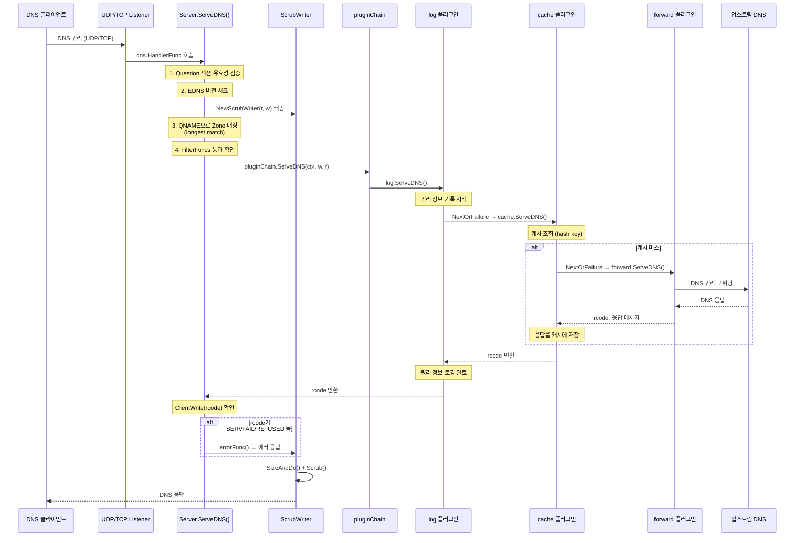
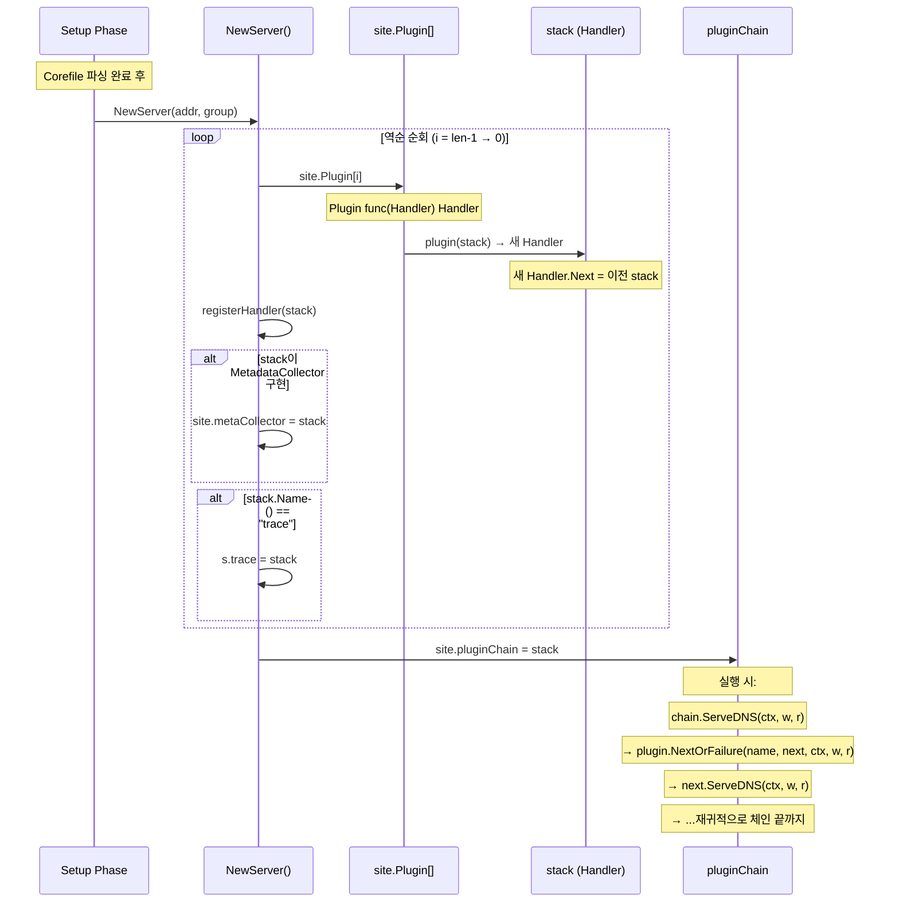
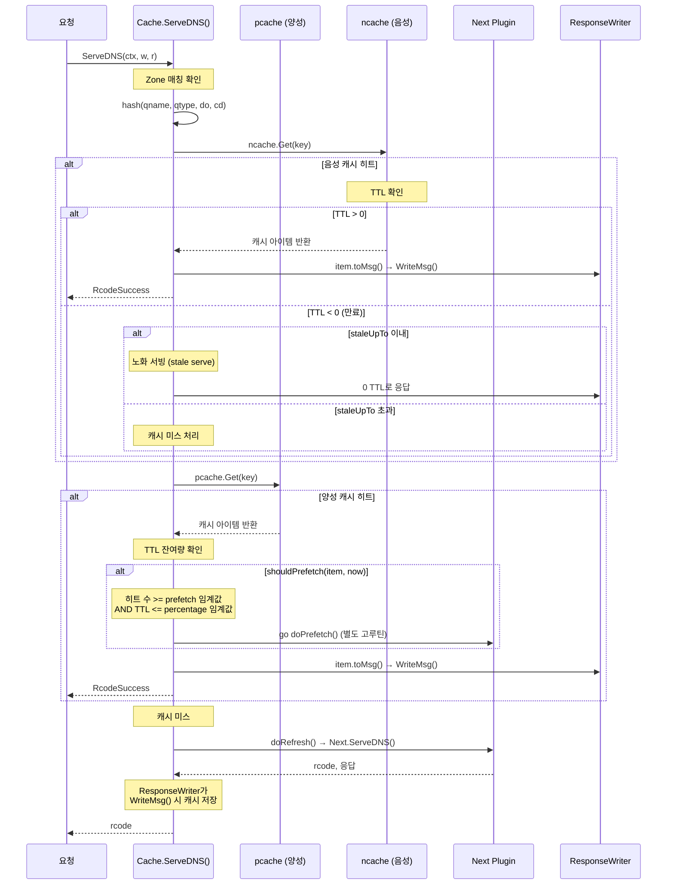
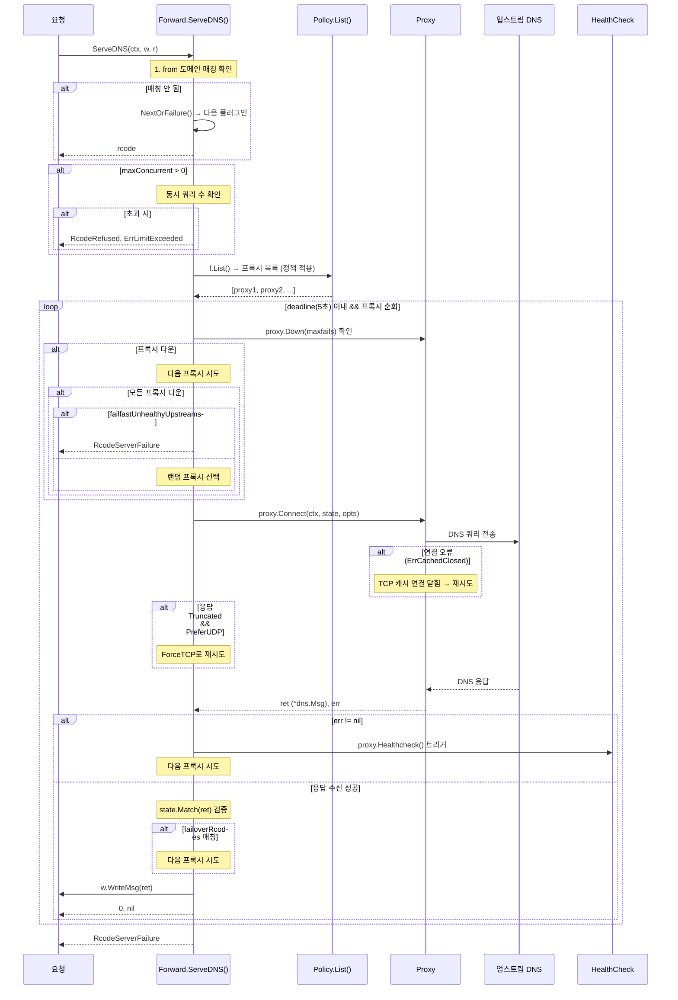
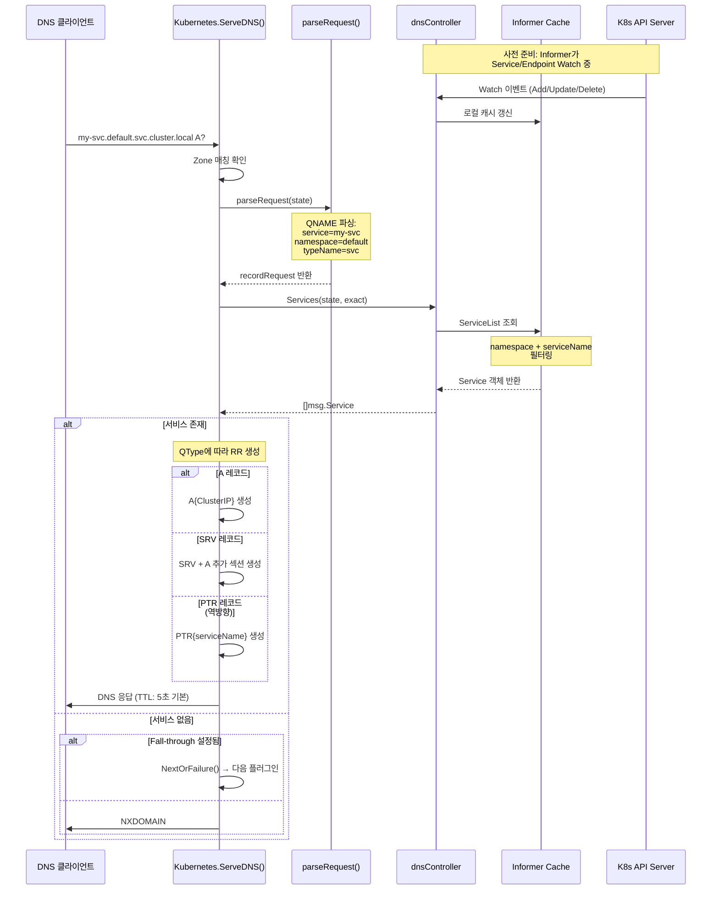
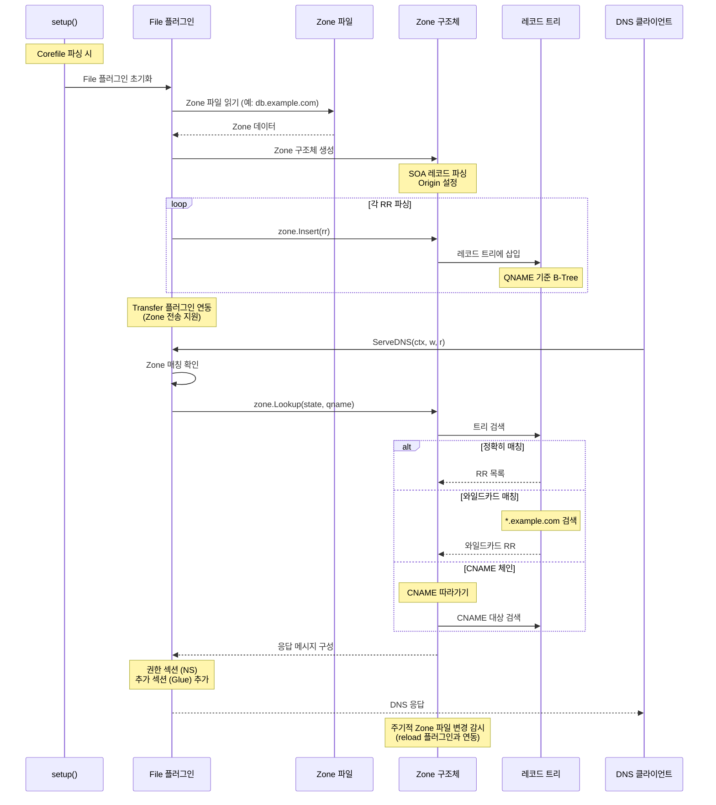
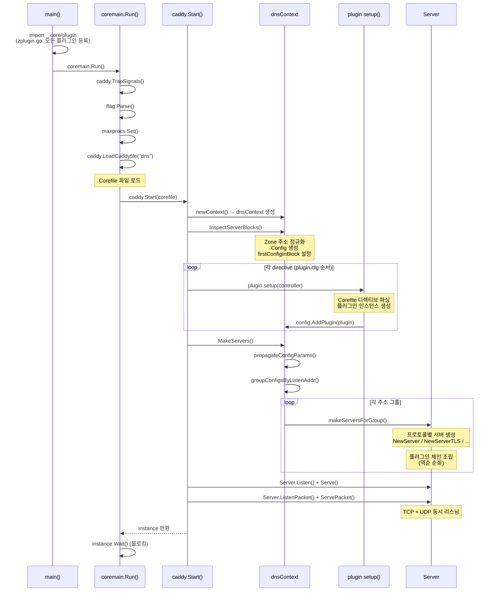

# CoreDNS 시퀀스 다이어그램

## 1. DNS 쿼리 처리 흐름

CoreDNS가 클라이언트의 DNS 쿼리를 받아 응답을 반환하는 전체 흐름이다.

## 2. 플러그인 체인 실행 상세

플러그인 체인의 조립과 실행 메커니즘을 보여준다.

## 3. Cache 히트/미스 흐름

Cache 플러그인의 캐시 조회, 저장, 프리페치 로직이다.

## 4. Forward 포워딩 흐름

Forward 플러그인이 업스트림 서버에 쿼리를 전달하는 과정이다.

## 5. Kubernetes 서비스 조회 흐름

Kubernetes 플러그인이 K8s API 서버 데이터를 기반으로 DNS 응답을 생성하는 과정이다.

## 6. Zone 파일 로드 흐름

File 플러그인이 Zone 파일을 로드하고 쿼리에 응답하는 과정이다.

## 7. 서버 초기화 흐름 (보너스)

CoreDNS 프로세스 시작부터 서버가 리스닝을 시작하기까지의 전체 초기화 과정이다.

