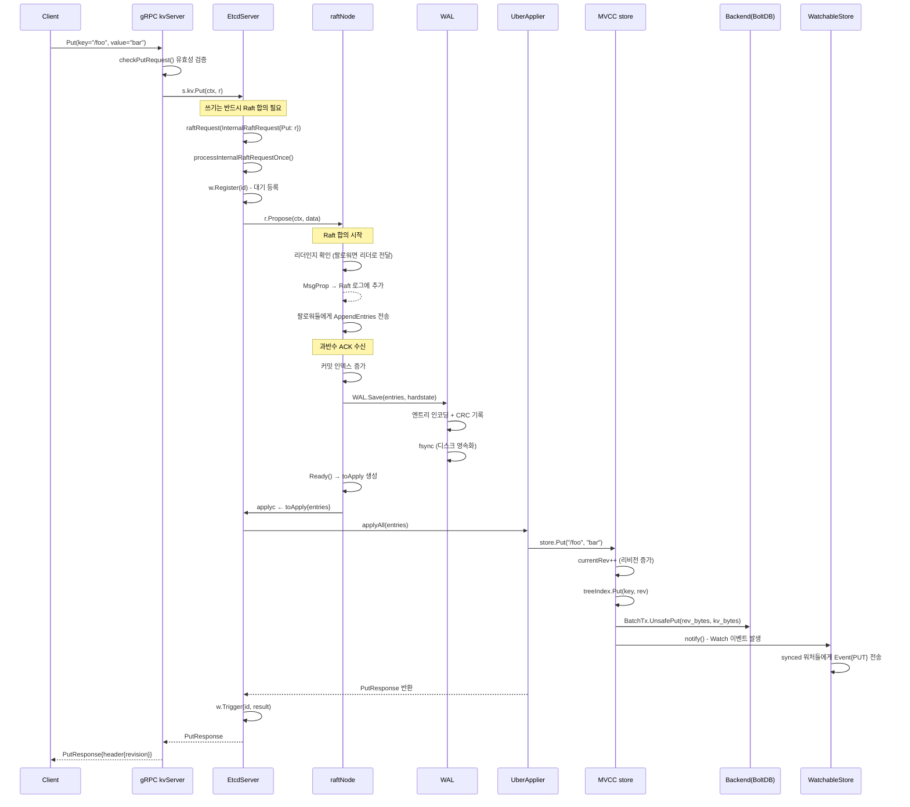
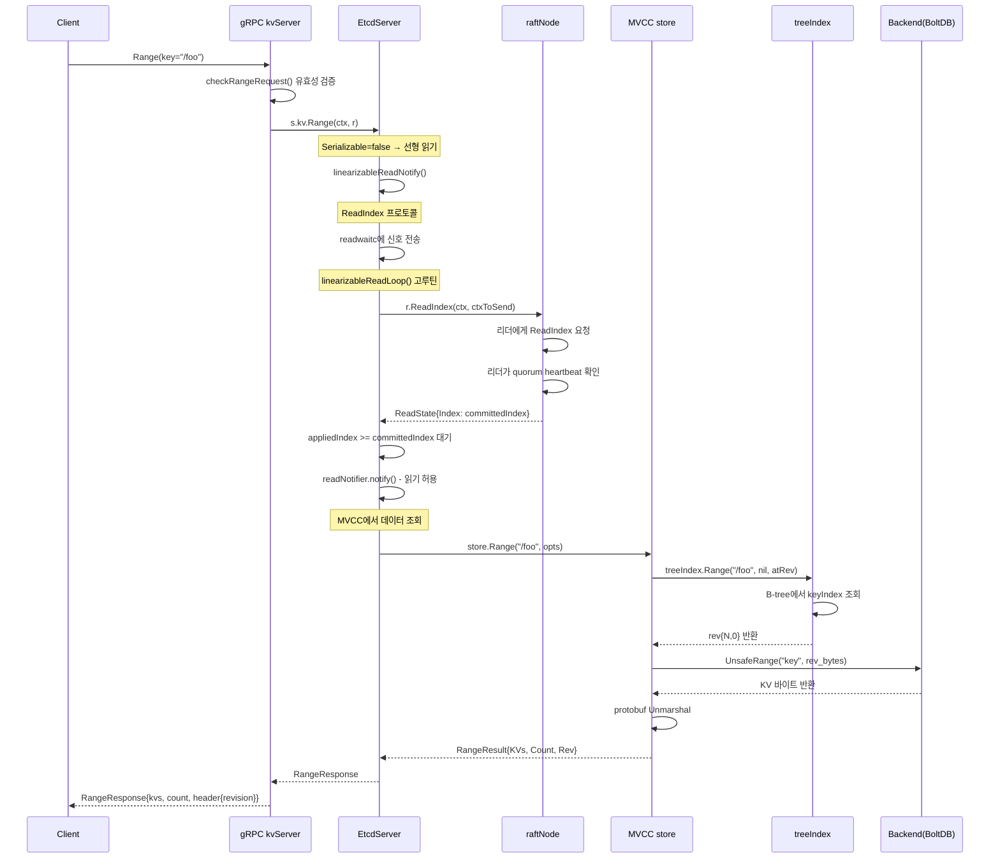
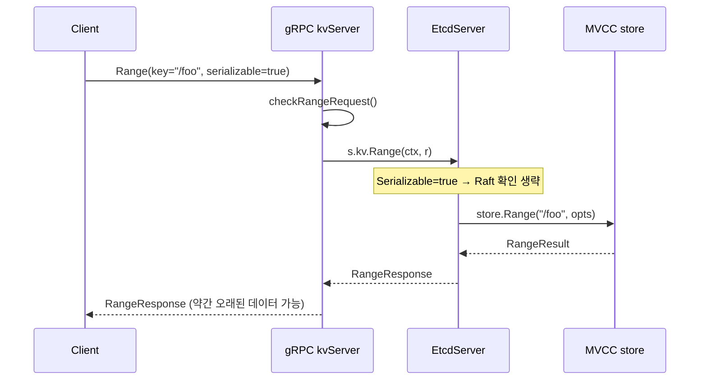
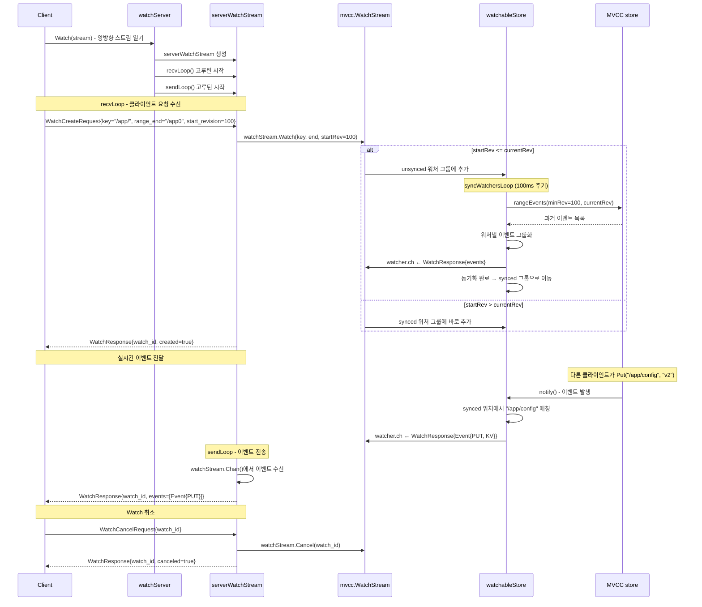
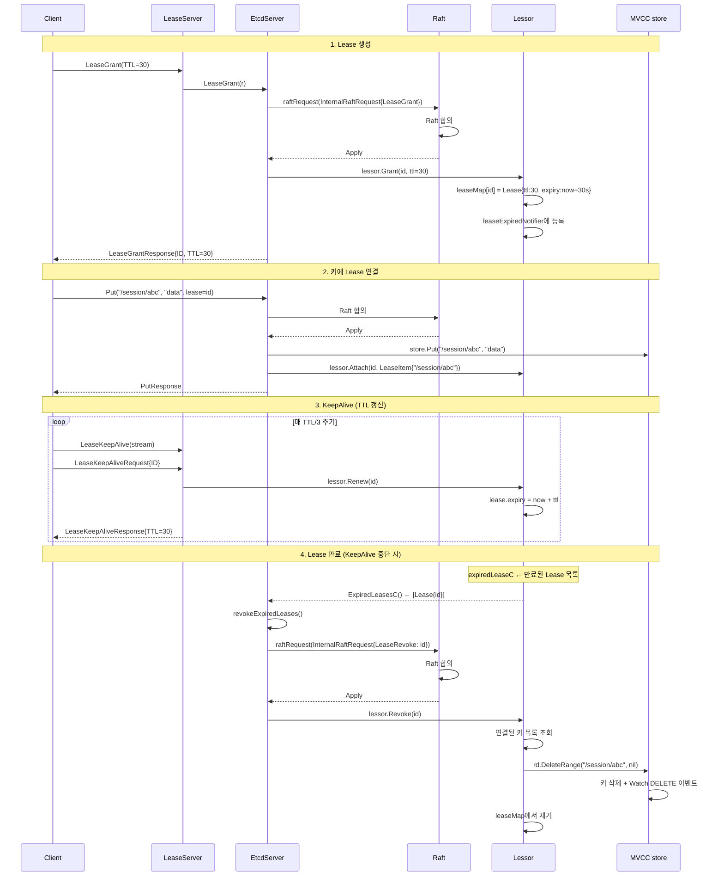
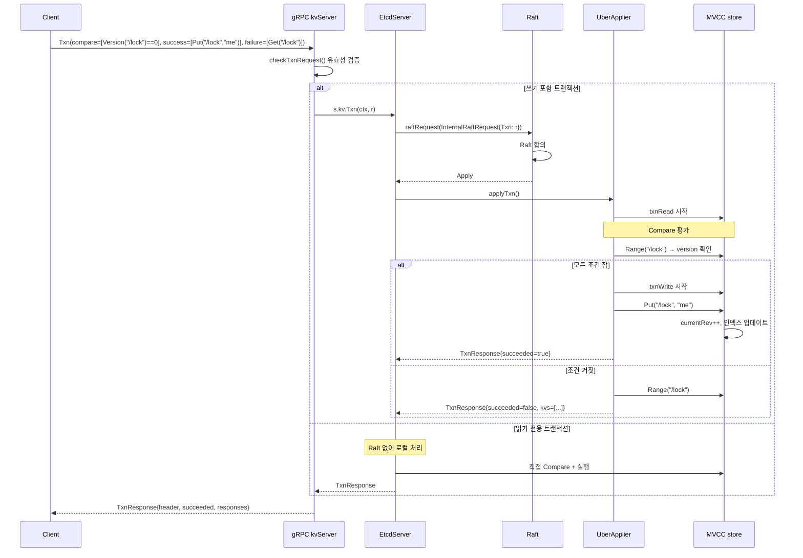
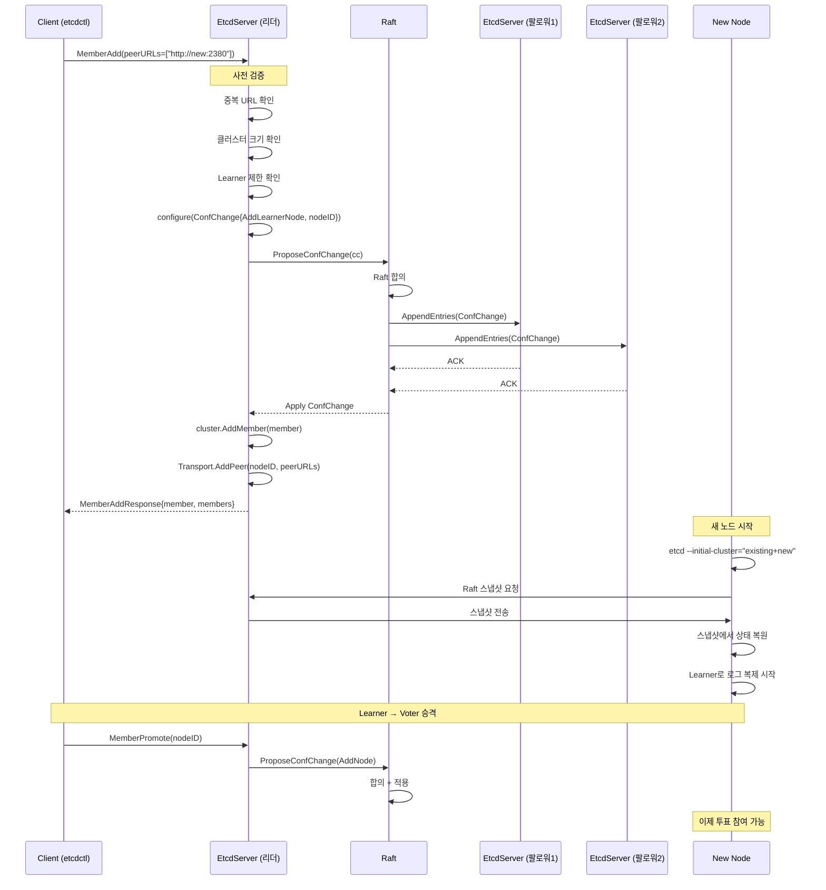
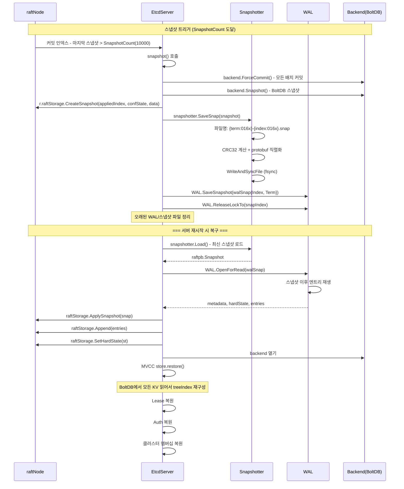
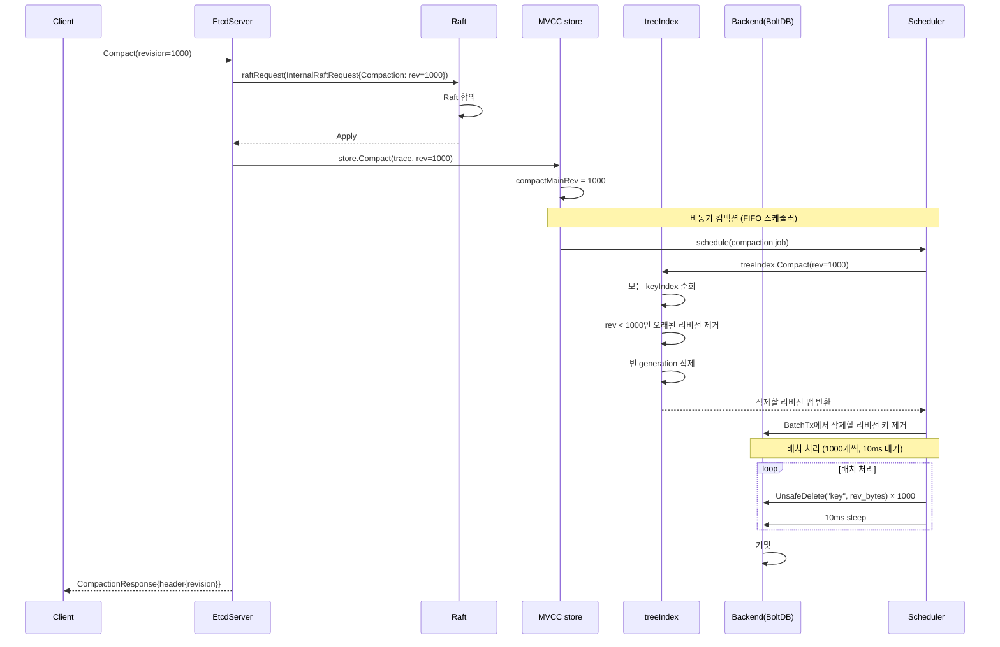
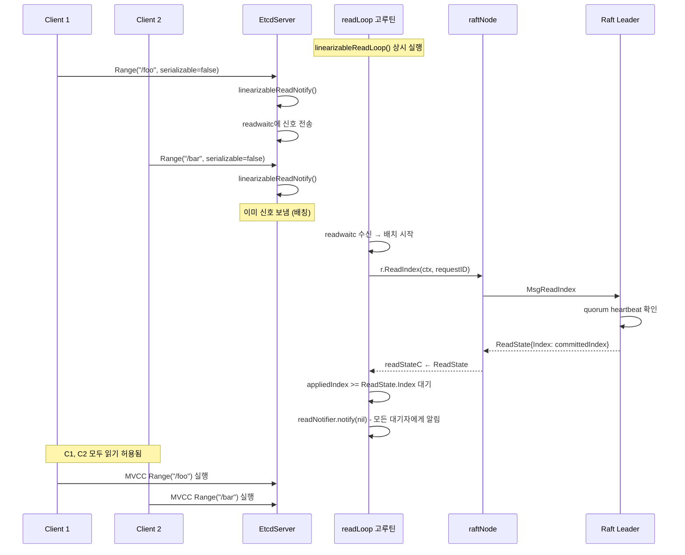

# etcd 시퀀스 다이어그램

## 1. 개요

etcd의 주요 요청 흐름을 시퀀스 다이어그램으로 설명한다. 모든 쓰기는 Raft 합의를 거치며, 읽기는 선형(Linearizable) 또는 직렬(Serializable) 모드를 선택할 수 있다.

## 2. Put 요청 흐름

클라이언트가 키-값을 저장하는 전체 흐름이다.

## 3. Range (Linearizable) 요청 흐름

선형 읽기는 최신 커밋된 데이터를 보장한다.

## 4. Range (Serializable) 요청 흐름

직렬 읽기는 Raft 확인 없이 로컬에서 바로 읽는다.

## 5. Watch 요청 흐름

Watch는 양방향 gRPC 스트림으로 키 변경 이벤트를 실시간 전달한다.

## 6. Lease 생명주기

Lease의 생성부터 만료까지 전체 흐름이다.

## 7. 트랜잭션 (Txn) 흐름

## 8. 클러스터 멤버 추가 흐름

## 9. 스냅샷 생성 및 복구 흐름

## 10. 컴팩션 흐름

## 11. 선형 읽기 (linearizableReadLoop) 상세

## 12. 흐름 요약

| 요청 | Raft 합의 | 핵심 경로 |
|------|----------|----------|
| Put | 필수 | gRPC → Propose → WAL → Apply → MVCC Put → Watch notify |
| DeleteRange | 필수 | gRPC → Propose → WAL → Apply → MVCC Delete → Watch notify |
| Range (Linear) | ReadIndex | gRPC → ReadIndex → quorum 확인 → MVCC Range |
| Range (Serial) | 불필요 | gRPC → MVCC Range (로컬) |
| Txn (쓰기) | 필수 | gRPC → Propose → Apply → Compare → Success/Failure |
| Watch | 불필요 | gRPC Stream → MVCC Watch 등록 → 이벤트 스트림 |
| LeaseGrant | 필수 | gRPC → Propose → Lessor.Grant |
| LeaseKeepAlive | 불필요 | gRPC Stream → Lessor.Renew (리더만) |
| Compact | 필수 | gRPC → Propose → MVCC Compact (비동기) |
| MemberAdd | 필수 | gRPC → ConfChange Propose → 합의 → 멤버십 변경 |
