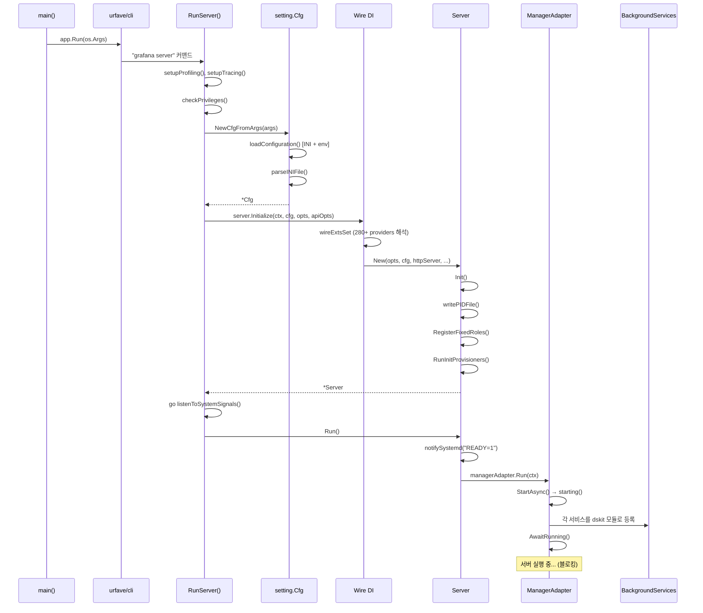
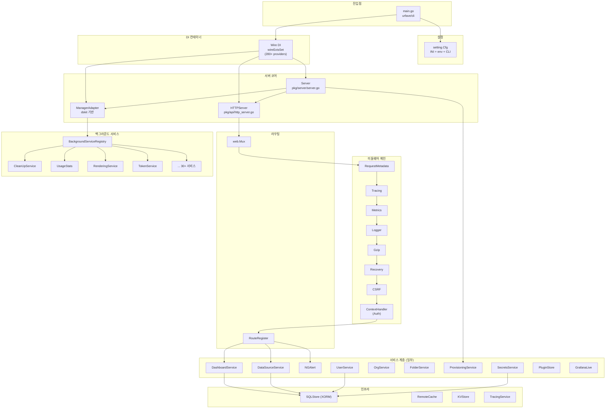

# Grafana 아키텍처 Deep Dive

## 목차

1. [프로젝트 개요](#1-프로젝트-개요)
2. [전체 아키텍처](#2-전체-아키텍처)
3. [초기화 흐름](#3-초기화-흐름)
4. [컴포넌트 관계](#4-컴포넌트-관계)
5. [Wire DI 시스템](#5-wire-di-시스템)
6. [백그라운드 서비스 관리](#6-백그라운드-서비스-관리)
7. [HTTP 서버와 미들웨어 체인](#7-http-서버와-미들웨어-체인)
8. [설정 시스템](#8-설정-시스템)
9. [시그널 처리와 Graceful Shutdown](#9-시그널-처리와-graceful-shutdown)
10. [빌드 변형과 확장 포인트](#10-빌드-변형과-확장-포인트)

---

## 1. 프로젝트 개요

### Grafana란 무엇인가

Grafana는 오픈소스 모니터링/옵저버빌리티 플랫폼으로, 메트릭, 로그, 트레이스 등 다양한 데이터 소스를
통합하여 대시보드로 시각화하는 도구이다. Prometheus, Loki, Elasticsearch, InfluxDB, PostgreSQL 등
수십 가지 데이터 소스를 플러그인 형태로 지원하며, 알림(Alerting), 탐색(Explore), 주석(Annotation) 등
풍부한 기능을 제공한다.

### 기술 스택

| 영역 | 기술 |
|------|------|
| 백엔드 | Go (HTTP 서버, API, 비즈니스 로직) |
| 프론트엔드 | TypeScript, React, Redux Toolkit, RTK Query |
| 데이터베이스 | SQLite / PostgreSQL / MySQL (XORM ORM) |
| DI(의존성 주입) | Google Wire (컴파일 타임 DI) |
| 플러그인 | gRPC 기반 백엔드 플러그인 + React 프론트엔드 플러그인 |
| 서비스 관리 | dskit (Grafana 자체 서비스 라이프사이클 라이브러리) |
| 설정 | INI 파일 (gopkg.in/ini.v1) + 환경변수 + CLI 오버라이드 |
| CLI | urfave/cli/v2 |
| 빌드 | Make, Go build tags (oss, enterprise) |

### 모노레포 구조

Grafana는 Go 백엔드와 TypeScript/React 프론트엔드가 하나의 리포지토리에 공존하는 모노레포이다.
백엔드 코드는 `pkg/` 디렉토리에, 프론트엔드 코드는 `public/`, `packages/` 디렉토리에 위치한다.

```
grafana/
├── pkg/                    # Go 백엔드 코드
│   ├── cmd/                # 진입점 (main 함수)
│   ├── api/                # HTTP API 핸들러
│   ├── server/             # 서버 부트스트랩, Wire DI
│   ├── services/           # 비즈니스 로직 서비스 (80+)
│   ├── registry/           # 서비스 레지스트리, 백그라운드 서비스
│   ├── setting/            # 설정 로딩 (INI + env)
│   ├── infra/              # 인프라 계층 (DB, cache, tracing)
│   ├── middleware/         # HTTP 미들웨어
│   ├── tsdb/               # 내장 데이터소스 플러그인
│   └── web/                # HTTP 라우터 (Mux)
├── public/                 # 프론트엔드 (React SPA)
├── packages/               # 프론트엔드 공유 패키지
├── plugins-bundled/        # 번들된 플러그인
├── conf/                   # 기본 설정 파일 (defaults.ini)
├── docs/                   # 문서
├── apps/                   # Grafana Apps (provisioning 등)
└── e2e/                    # E2E 테스트
```

---

## 2. 전체 아키텍처

### 아키텍처 다이어그램

```
┌─────────────────────────────────────────────────────────────────────────────┐
│                            Grafana 전체 아키텍처                              │
├─────────────────────────────────────────────────────────────────────────────┤
│                                                                             │
│  ┌──────────────────────────────────────────────────────┐                   │
│  │              Frontend (React SPA)                      │                  │
│  │  ┌────────────┐ ┌──────────┐ ┌──────────────────┐   │                  │
│  │  │ Dashboard   │ │ Explore  │ │ Alerting UI      │   │                  │
│  │  │ Editor      │ │ View     │ │                  │   │                  │
│  │  └─────┬──────┘ └────┬─────┘ └────────┬─────────┘   │                  │
│  │        │              │                │              │                  │
│  │  ┌─────┴──────────────┴────────────────┴─────────┐   │                  │
│  │  │          Redux Toolkit + RTK Query             │   │                  │
│  │  └────────────────────┬──────────────────────────┘   │                  │
│  └───────────────────────┼──────────────────────────────┘                   │
│                          │ HTTP/WebSocket                                    │
│  ┌───────────────────────┼──────────────────────────────────────────────┐   │
│  │                 Backend (Go)                                          │   │
│  │                       │                                               │   │
│  │  ┌────────────────────▼─────────────────────────────────────────┐    │   │
│  │  │              HTTP Server (web.Mux)                            │    │   │
│  │  │  ┌──────────┐ ┌──────────┐ ┌────────┐ ┌───────────────┐    │    │   │
│  │  │  │RequestMeta│ │ Tracing  │ │ CSRF   │ │ContextHandler │    │    │   │
│  │  │  │ Recovery │ │ Metrics  │ │ Gzip   │ │ Auth          │    │    │   │
│  │  │  └──────────┘ └──────────┘ └────────┘ └───────────────┘    │    │   │
│  │  └──────────────────────┬───────────────────────────────────────┘    │   │
│  │                         │                                            │   │
│  │  ┌──────────────────────▼───────────────────────────────────────┐   │   │
│  │  │              RouteRegister (라우팅 계층)                       │   │   │
│  │  │  /api/dashboards  /api/datasources  /api/alerting  ...       │   │   │
│  │  └──────────────────────┬───────────────────────────────────────┘   │   │
│  │                         │                                            │   │
│  │  ┌──────────────────────▼───────────────────────────────────────┐   │   │
│  │  │              Services Layer (Wire DI, 280+ providers)         │   │   │
│  │  │  ┌──────────────┐ ┌──────────────┐ ┌──────────────────┐     │   │   │
│  │  │  │ Dashboard    │ │ DataSource   │ │ NGAlert          │     │   │   │
│  │  │  │ Service      │ │ Service      │ │ (Alerting)       │     │   │   │
│  │  │  ├──────────────┤ ├──────────────┤ ├──────────────────┤     │   │   │
│  │  │  │ Folder       │ │ User         │ │ AccessControl    │     │   │   │
│  │  │  │ Service      │ │ Service      │ │ Service          │     │   │   │
│  │  │  ├──────────────┤ ├──────────────┤ ├──────────────────┤     │   │   │
│  │  │  │ Provisioning │ │ Secrets      │ │ Rendering        │     │   │   │
│  │  │  │ Service      │ │ Service      │ │ Service          │     │   │   │
│  │  │  └──────────────┘ └──────────────┘ └──────────────────┘     │   │   │
│  │  └──────────┬──────────────────┬────────────────┬───────────────┘   │   │
│  │             │                  │                │                    │   │
│  │  ┌──────────▼──────┐ ┌────────▼────────┐ ┌────▼──────────────┐    │   │
│  │  │ SQLStore (XORM) │ │ Plugin Manager  │ │ Background Svcs   │    │   │
│  │  │ SQLite/PG/MySQL │ │ gRPC → Plugins  │ │ (dskit Manager)   │    │   │
│  │  └─────────────────┘ └─────────────────┘ └───────────────────┘    │   │
│  └───────────────────────────────────────────────────────────────────┘   │
└─────────────────────────────────────────────────────────────────────────────┘
```

### 계층별 역할

| 계층 | 역할 | 핵심 파일 |
|------|------|----------|
| Frontend | React SPA, 대시보드 편집/뷰, 탐색(Explore) | `public/app/` |
| HTTP Server | 요청 수신, 미들웨어 체인, 라우팅 | `pkg/api/http_server.go` |
| RouteRegister | URL 경로 → 핸들러 매핑 | `pkg/api/routing/` |
| Services | 비즈니스 로직 (대시보드, 데이터소스, 알림 등) | `pkg/services/` |
| Infrastructure | DB, 캐시, 트레이싱, 메트릭 | `pkg/infra/` |
| Plugin System | gRPC 기반 외부 플러그인 관리 | `pkg/services/pluginsintegration/` |
| Background Services | 장기 실행 태스크 (정리, 동기화, 알림) | `pkg/registry/backgroundsvcs/` |

---

## 3. 초기화 흐름

Grafana 서버의 부팅 과정은 여러 단계를 거치며, 모든 의존성이 Wire를 통해 컴파일 타임에 결정된다.

### 3.1 진입점 (Entry Point)

**파일 경로:** `pkg/cmd/grafana/main.go`

```go
// pkg/cmd/grafana/main.go
func main() {
    app := MainApp()
    if err := app.Run(os.Args); err != nil {
        fmt.Printf("%s: %s %s\n", color.RedString("Error"), color.RedString("✗"), err)
        os.Exit(1)
    }
    os.Exit(0)
}

func MainApp() *cli.App {
    app := &cli.App{
        Name:  "grafana",
        Usage: "Grafana server and command line interface",
        Commands: []*cli.Command{
            gcli.CLICommand(version),                                                    // grafana-cli
            commands.ServerCommand(version, commit, enterpriseCommit, buildBranch, ...),  // grafana server
        },
    }
    return app
}
```

`MainApp()`은 urfave/cli/v2를 사용하여 두 개의 서브커맨드를 등록한다:
- `grafana server` - 서버 실행
- `grafana-cli` - CLI 도구 (플러그인 설치 등)

### 3.2 서버 커맨드 실행

**파일 경로:** `pkg/cmd/grafana-server/commands/cli.go`

```go
// pkg/cmd/grafana-server/commands/cli.go
func RunServer(opts standalone.BuildInfo, cli *cli.Context) error {
    // 1) 프로파일링/트레이싱 설정
    setupProfiling(...)
    setupTracing(...)

    // 2) 빌드 정보 설정, 권한 체크
    SetBuildInfo(opts)
    checkPrivileges()

    // 3) 설정 로딩 (INI + env + CLI overrides)
    cfg, err := setting.NewCfgFromArgs(setting.CommandLineArgs{
        Config:   ConfigFile,
        HomePath: HomePath,
        Args:     append(configOptions, cli.Args().Slice()...),
    })

    // 4) 메트릭 빌드 정보 등록
    metrics.SetBuildInformation(...)

    // 5) OpenFeature 피처 플래그 초기화
    featuremgmt.InitOpenFeatureWithCfg(cfg)

    // 6) Wire DI를 통한 서버 초기화
    s, err := server.Initialize(cli.Context, cfg, server.Options{...}, api.ServerOptions{})

    // 7) 시그널 핸들러 시작 (별도 고루틴)
    go listenToSystemSignals(cli.Context, s)

    // 8) 서버 실행 (블로킹)
    return s.Run()
}
```

### 3.3 초기화 흐름 시퀀스 다이어그램



### 3.4 설정 로딩 상세

**파일 경로:** `pkg/setting/setting.go`

```go
// pkg/setting/setting.go
func NewCfgFromArgs(args CommandLineArgs) (*Cfg, error) {
    cfg := NewCfg()
    if err := cfg.Load(args); err != nil {
        return nil, err
    }
    return cfg, nil
}

func (cfg *Cfg) Load(args CommandLineArgs) error {
    cfg.setHomePath(args)
    // ZONEINFO 환경변수 설정 (Windows/Alpine 대응)
    iniFile, err := cfg.loadConfiguration(args)  // INI 파일 로딩
    err = cfg.parseINIFile(iniFile)                // 파싱 및 필드 매핑
    cfg.LogConfigSources()
    return nil
}
```

설정 로딩은 `gopkg.in/ini.v1` 라이브러리를 사용하며, 다음 순서로 설정을 적용한다:

1. **기본 설정** (`conf/defaults.ini`)
2. **사용자 설정** (`conf/custom.ini` 또는 `--config` 플래그로 지정)
3. **환경변수 오버라이드** (`GF_` 접두사)
4. **CLI 인자 오버라이드** (`--cfg` 플래그)

```
우선순위: CLI args > 환경변수 > custom.ini > defaults.ini
```

### 3.5 Wire DI를 통한 서버 초기화

**파일 경로:** `pkg/server/wire.go`

```go
// pkg/server/wire.go
func Initialize(ctx context.Context, cfg *setting.Cfg, opts Options, apiOpts api.ServerOptions) (*Server, error) {
    wire.Build(wireExtsSet)
    return &Server{}, nil
}
```

`Initialize()` 함수는 Wire 코드 생성기가 처리한다. `wire.Build(wireExtsSet)` 호출은 컴파일 타임에
전체 의존성 그래프를 해석하여 올바른 순서로 모든 서비스를 생성하는 코드를 자동 생성한다.

### 3.6 Server 구조체와 Init/Run

**파일 경로:** `pkg/server/server.go`

```go
// pkg/server/server.go
type Server struct {
    context       context.Context
    log           log.Logger
    cfg           *setting.Cfg
    shutdownOnce  sync.Once
    isInitialized bool
    mtx           sync.Mutex

    pidFile     string
    version     string
    commit      string
    buildBranch string

    backgroundServiceRegistry registry.BackgroundServiceRegistry
    tracerProvider            *tracing.TracingService
    features                  featuremgmt.FeatureToggles

    HTTPServer          *api.HTTPServer
    roleRegistry        accesscontrol.RoleRegistry
    provisioningService provisioning.ProvisioningService
    promReg             prometheus.Registerer
    managerAdapter      *adapter.ManagerAdapter
}
```

`Server` 구조체는 Grafana의 핵심 라이프사이클 관리자이다. 주요 필드를 살펴보면:

| 필드 | 역할 |
|------|------|
| `HTTPServer` | HTTP API 서버 (모든 REST 엔드포인트 처리) |
| `backgroundServiceRegistry` | 백그라운드 서비스 목록 (30+ 서비스) |
| `managerAdapter` | dskit 기반 서비스 라이프사이클 관리 |
| `provisioningService` | 파일 기반 프로비저닝 (대시보드, 데이터소스 등) |
| `roleRegistry` | RBAC 고정 역할 등록 |
| `tracerProvider` | OpenTelemetry 트레이싱 |
| `features` | 피처 토글 (Feature Flags) |

```go
// Server.Init() - 초기화
func (s *Server) Init() error {
    s.mtx.Lock()
    defer s.mtx.Unlock()
    if s.isInitialized { return nil }
    s.isInitialized = true

    s.writePIDFile()                                    // PID 파일 작성
    metrics.SetEnvironmentInformation(...)               // 환경 메트릭 설정
    s.roleRegistry.RegisterFixedRoles(s.context)         // RBAC 고정 역할 등록
    return s.provisioningService.RunInitProvisioners(s.context)  // 초기 프로비저닝
}

// Server.Run() - 실행
func (s *Server) Run() error {
    s.Init()
    ctx, span := s.tracerProvider.Start(s.context, "server.Run")
    defer span.End()
    s.notifySystemd("READY=1")       // systemd 준비 완료 알림
    return s.managerAdapter.Run(ctx)  // 백그라운드 서비스 매니저 실행 (블로킹)
}
```

---

## 4. 컴포넌트 관계

### 4.1 핵심 컴포넌트 관계도



### 4.2 요청 처리 흐름

클라이언트(브라우저)에서 API 요청이 도착했을 때의 처리 흐름:

```
클라이언트 (React SPA)
    │
    ▼
HTTP Server (web.Mux)
    │
    ├── RequestMetadata 미들웨어
    ├── Tracing 미들웨어 (OpenTelemetry span 생성)
    ├── Metrics 미들웨어 (Prometheus 카운터/히스토그램)
    ├── Logger 미들웨어 (구조화된 로깅)
    ├── Gzip 미들웨어 (응답 압축, 설정 시)
    ├── Recovery 미들웨어 (panic 복구)
    ├── CSRF 미들웨어 (Cross-Site Request Forgery 방지)
    ├── Static Routes (정적 파일 서빙)
    │
    ▼
RouteRegister → URL 패턴 매칭
    │
    ├── /api/dashboards/* → DashboardService
    ├── /api/datasources/* → DataSourceService
    ├── /api/alerts/* → NGAlert
    ├── /api/org/* → OrgService
    ├── /api/users/* → UserService
    ├── /api/folders/* → FolderService
    └── ... (수십 개의 API 엔드포인트)
    │
    ▼
Service Layer (비즈니스 로직)
    │
    ▼
SQLStore (XORM) → Database
```

### 4.3 HTTPServer 의존성

`HTTPServer`는 Grafana에서 가장 많은 의존성을 가진 컴포넌트이다. `ProvideHTTPServer()` 함수는
70개 이상의 매개변수를 받는다.

**파일 경로:** `pkg/api/http_server.go`

주요 의존성 카테고리:

| 카테고리 | 서비스 예시 |
|----------|------------|
| 인증/인가 | `AccessControl`, `AuthTokenService`, `ContextHandler`, `authnService` |
| 대시보드 | `DashboardService`, `DashboardProvisioningService`, `DashboardVersionService` |
| 데이터소스 | `DataSourceCache`, `DataSourcesService`, `DataSourceProxy` |
| 알림 | `AlertNG`, `NotificationService` |
| 사용자/조직 | `UserService`, `OrgService`, `TeamService` |
| 플러그인 | `pluginStore`, `pluginClient`, `pluginInstaller`, `pluginAssets` |
| 검색 | `SearchService`, `SearchUsersService` |
| 시크릿 | `SecretsService`, `SecretsMigrator`, `secretsStore` |
| 기타 | `Live`, `RenderService`, `QuotaService`, `ShortURLService` |

---

## 5. Wire DI 시스템

### 5.1 Wire란 무엇인가

Google Wire는 Go의 컴파일 타임 의존성 주입 프레임워크이다. 런타임 리플렉션을 사용하지 않고,
코드 생성을 통해 의존성 그래프를 해석한다. Grafana는 Wire를 사용하여 280개 이상의 프로바이더를
관리한다.

### 5.2 Wire Set 구조

**파일 경로:** `pkg/server/wire.go`, `pkg/server/wireexts_oss.go`

Grafana의 Wire 설정은 계층적으로 구성된다:

```
wireExtsSet (최종 빌드에 사용)
    │
    ├── wireSet
    │   ├── wireBasicSet (핵심 서비스 280+ providers)
    │   │   ├── withOTelSet (OpenTelemetry)
    │   │   ├── pluginsintegration.WireSet (플러그인)
    │   │   └── grafanaapiserver.WireSet (K8s API Server)
    │   ├── metrics.WireSet
    │   └── sqlstore.ProvideService (DB)
    │
    └── wireExtsBasicSet (OSS 확장)
        ├── authimpl (인증)
        ├── licensing (라이선싱)
        ├── backgroundsvcs (백그라운드 서비스 레지스트리)
        └── ... (OSS 전용 바인딩)
```

### 5.3 wireBasicSet 상세

`wireBasicSet`은 Grafana의 핵심 서비스를 모두 포함하는 기본 Wire Set이다.

**파일 경로:** `pkg/server/wire.go` (225행~493행)

주요 프로바이더 그룹:

```
wireBasicSet = wire.NewSet(
    // 서버 코어
    New,                           // Server 생성
    api.ProvideHTTPServer,         // HTTP 서버
    routing.ProvideRegister,       // 라우팅
    hooks.ProvideService,          // 훅 시스템
    bus.ProvideBus,                // 이벤트 버스

    // 데이터소스 플러그인 (내장)
    cloudwatch.ProvideService,
    azuremonitor.ProvideService,
    postgres.ProvideService,
    mysql.ProvideService,
    mssql.ProvideService,
    prometheus.ProvideService,
    loki.ProvideService,
    elasticsearch.ProvideService,
    graphite.ProvideService,
    influxdb.ProvideService,
    tempo.ProvideService,
    jaeger.ProvideService,
    zipkin.ProvideService,
    pyroscope.ProvideService,
    parca.ProvideService,

    // 비즈니스 서비스
    dashboardservice.ProvideDashboardServiceImpl,
    folderimpl.ProvideService,
    ngalert.ProvideService,          // Unified Alerting
    live.ProvideService,             // Grafana Live (WebSocket)
    rendering.ProvideService,        // 이미지 렌더링

    // 인증/인가
    acimpl.ProvideAccessControl,
    authnimpl.ProvideService,
    contexthandler.ProvideService,

    // 인프라
    tracing.ProvideService,
    kvstore.ProvideService,
    localcache.ProvideService,
    remotecache.ProvideService,
    serverlock.ProvideService,

    // 시크릿 관리
    encryptionservice.ProvideEncryptionService,
    secretsManager.ProvideSecretsService,

    // 플러그인
    pluginsintegration.WireSet,

    // Kubernetes API Server
    grafanaapiserver.WireSet,
    apiregistry.WireSet,
    appregistry.WireSet,

    // ... 그 외 수십 개의 프로바이더
)
```

### 5.4 Wire 프로바이더 패턴

Grafana에서 Wire 프로바이더는 일관된 패턴을 따른다:

```go
// 패턴 1: 프로바이더 함수
func ProvideService(deps...) (*Service, error) {
    return &Service{...}, nil
}

// 패턴 2: 인터페이스 바인딩
wire.Bind(new(InterfaceType), new(*ConcreteType))

// 예시: annotations
annotationsimpl.ProvideService,
wire.Bind(new(annotations.Repository), new(*annotationsimpl.RepositoryImpl)),
```

이 패턴의 장점:
- **컴파일 타임 안전성**: 의존성 누락은 빌드 실패로 이어짐
- **인터페이스 분리**: `wire.Bind`로 인터페이스와 구현체를 분리
- **테스트 용이**: `wireTestSet`에서 Mock 구현체 주입 가능

### 5.5 빌드 태그와 Wire Set 변형

```go
// pkg/server/wire.go
//go:build wireinject
// +build wireinject

// pkg/server/wireexts_oss.go
//go:build wireinject && oss
// +build wireinject,oss
```

| Wire Set | 용도 | 빌드 태그 |
|----------|------|----------|
| `wireExtsSet` | OSS 프로덕션 빌드 | `wireinject && oss` |
| `wireExtsTestSet` | 테스트용 (Mock 서비스 포함) | `wireinject && oss` |
| `wireExtsCLISet` | CLI 전용 (서버 없이 작업 실행) | `wireinject && oss` |
| `wireExtsModuleServerSet` | 모듈 서버 (dskit 모듈 타겟팅) | `wireinject && oss` |
| `wireExtsStandaloneAPIServerSet` | K8s API 서버 독립 실행 | `wireinject && oss` |

Enterprise 빌드에서는 `wireexts_oss.go` 대신 `wireexts_enterprise.go`가 사용되며,
추가 서비스와 기능이 DI 그래프에 포함된다.

### 5.6 Initialize 함수들

**파일 경로:** `pkg/server/wire.go`

```go
// 프로덕션 서버 초기화
func Initialize(ctx, cfg, opts, apiOpts) (*Server, error)

// 테스트 환경 초기화
func InitializeForTest(ctx, t, testingT, cfg, opts, apiOpts) (*TestEnv, error)

// CLI 작업용 초기화
func InitializeForCLI(ctx, cfg) (Runner, error)

// dskit 모듈 타겟 CLI 초기화
func InitializeForCLITarget(ctx, cfg) (ModuleRunner, error)

// 모듈 서버 초기화
func InitializeModuleServer(cfg, opts, apiOpts) (*ModuleServer, error)

// K8s API 서버 팩토리 초기화
func InitializeAPIServerFactory() (standalone.APIServerFactory, error)
```

---

## 6. 백그라운드 서비스 관리

### 6.1 BackgroundServiceRegistry

**파일 경로:** `pkg/registry/backgroundsvcs/background_services.go`

모든 백그라운드 서비스는 `ProvideBackgroundServiceRegistry`를 통해 등록된다.
이 함수는 30개 이상의 서비스를 매개변수로 받아 레지스트리에 등록한다.

```go
// pkg/registry/backgroundsvcs/background_services.go
func ProvideBackgroundServiceRegistry(
    httpServer *api.HTTPServer,
    ng *ngalert.AlertNG,
    cleanup *cleanup.CleanUpService,
    live *live.GrafanaLive,
    pushGateway *pushhttp.Gateway,
    notifications *notifications.NotificationService,
    rendering *rendering.RenderingService,
    tokenService auth.UserTokenBackgroundService,
    provisioning *provisioning.ProvisioningServiceImpl,
    usageStats *uss.UsageStats,
    // ... 30+ 서비스
) *BackgroundServiceRegistry {
    return NewBackgroundServiceRegistry(
        httpServer, ng, cleanup, live, pushGateway,
        notifications, rendering, tokenService, provisioning,
        // ...
    )
}
```

### 6.2 등록된 백그라운드 서비스 전체 목록

| 번호 | 서비스 | 역할 |
|------|--------|------|
| 1 | `HTTPServer` | HTTP API 서버 (메인 서빙) |
| 2 | `NGAlert (AlertNG)` | 통합 알림 엔진 |
| 3 | `CleanUpService` | 만료된 데이터 정리 (세션, 스냅샷 등) |
| 4 | `GrafanaLive` | 실시간 스트리밍 (WebSocket) |
| 5 | `pushhttp.Gateway` | Live Push HTTP 게이트웨이 |
| 6 | `NotificationService` | 이메일/웹훅 알림 전송 |
| 7 | `RenderingService` | 대시보드/패널 이미지 렌더링 |
| 8 | `UserTokenBackgroundService` | 토큰 정리 및 갱신 |
| 9 | `ProvisioningServiceImpl` | 파일 기반 프로비저닝 |
| 10 | `GrafanaService (UpdateManager)` | Grafana 업데이트 체크 |
| 11 | `PluginsService (UpdateManager)` | 플러그인 업데이트 체크 |
| 12 | `InternalMetricsService` | 내부 메트릭 수집 |
| 13 | `UsageStats` | 사용량 통계 수집/전송 |
| 14 | `StatsCollector` | 통계 수집기 |
| 15 | `TracingService` | 분산 트레이싱 |
| 16 | `RemoteCache` | 원격 캐시 관리 |
| 17 | `SecretsService` | 시크릿 암호화/복호화 |
| 18 | `StorageService` | 통합 스토리지 |
| 19 | `EntityEventsService` | 엔티티 이벤트 처리 |
| 20 | `grpcserver.Provider` | gRPC 서버 |
| 21 | `ServiceAccountsService` | 서비스 계정 관리 |
| 22 | `pluginStore.Service` | 플러그인 스토어 |
| 23 | `SecretMigrationProvider` | 시크릿 마이그레이션 |
| 24 | `loginattemptimpl.Service` | 로그인 시도 추적 |
| 25 | `supportbundlesimpl.Service` | 지원 번들 생성 |
| 26 | `publicdashboardsmetric.Service` | 퍼블릭 대시보드 메트릭 |
| 27 | `dynamic.KeyRetriever` | 동적 키 검색 |
| 28 | `angulardetectorsprovider.Dynamic` | Angular 플러그인 감지 |
| 29 | `grafanaapiserver.Service` | Kubernetes API 서버 |
| 30 | `AnonDeviceService` | 익명 사용자 추적 |
| 31 | `SSO Settings Service` | SSO 설정 관리 |
| 32 | `pluginexternal.Service` | 외부 플러그인 관리 |
| 33 | `plugininstaller.Service` | 플러그인 설치기 |
| 34 | `ZanzanaReconciler` | Zanzana(FGA) 동기화 |
| 35 | `appregistry.Service` | 앱 레지스트리 |
| 36 | `DashboardUpdater` | 플러그인 대시보드 업데이터 |
| 37 | `DashboardServiceImpl` | 대시보드 서비스 |
| 38 | `secretsGarbageCollectionWorker` | 시크릿 GC |
| 39 | `FixedRolesLoader` | 고정 역할 로더 |
| 40 | `installSync.Syncer` | 플러그인 설치 동기화 |
| 41 | `EmbeddedZanzanaService` | 내장 Zanzana 서비스 |

### 6.3 ManagerAdapter와 dskit 통합

**파일 경로:** `pkg/registry/backgroundsvcs/adapter/manager.go`

Grafana는 dskit의 서비스 라이프사이클 관리를 활용한다. `ManagerAdapter`가 Grafana의
`BackgroundServiceRegistry`와 dskit의 모듈/서비스 시스템을 연결한다.

```go
// pkg/registry/backgroundsvcs/adapter/manager.go
type ManagerAdapter struct {
    services.NamedService                    // dskit 네임드 서비스
    reg           registry.BackgroundServiceRegistry   // Grafana 서비스 레지스트리
    manager       grafanamodules.Manager     // dskit 모듈 매니저
    dependencyMap map[string][]string        // 서비스 간 의존성 맵
}
```

### 6.4 서비스 라이프사이클

```
┌─────────┐     ┌──────────┐     ┌─────────┐     ┌──────────┐     ┌────────────┐
│   New   │ ──► │ Starting │ ──► │ Running │ ──► │ Stopping │ ──► │ Terminated │
└─────────┘     └──────────┘     └─────────┘     └──────────┘     └────────────┘
                                                                         │
                                                                    ┌────▼───┐
                                                                    │ Failed │
                                                                    └────────┘
```

`ManagerAdapter.starting()` 메서드에서 서비스 등록 과정:

```go
// pkg/registry/backgroundsvcs/adapter/manager.go
func (m *ManagerAdapter) starting(ctx context.Context) error {
    manager := grafanamodules.New(logger, []string{BackgroundServices}).
        WithDependencies(m.dependencyMap)

    for _, bgSvc := range m.reg.GetServices() {
        namedService, ok := bgSvc.(services.NamedService)
        if !ok {
            namedService = asNamedService(bgSvc)  // dskit NamedService로 래핑
        }

        // 비활성 서비스 건너뛰기
        if s, ok := bgSvc.(registry.CanBeDisabled); ok && s.IsDisabled() {
            manager.RegisterInvisibleModule(namedService.ServiceName(), nil)
            continue
        }

        // dskit 모듈로 등록
        manager.RegisterInvisibleModule(namedService.ServiceName(), func() (services.Service, error) {
            return namedService, nil
        })
    }

    manager.RegisterModule(Core, nil)
    manager.RegisterModule(BackgroundServices, nil)
    m.manager = manager
    m.manager.StartAsync(ctx)
    return m.manager.AwaitRunning(ctx)
}
```

### 6.5 serviceAdapter: BackgroundService를 dskit로 브릿지

**파일 경로:** `pkg/registry/backgroundsvcs/adapter/service.go`

Grafana의 `BackgroundService` 인터페이스는 단순하다:

```go
// pkg/registry/registry.go
type BackgroundService interface {
    Run(ctx context.Context) error
}

type CanBeDisabled interface {
    IsDisabled() bool
}
```

이를 dskit의 `NamedService`로 변환하는 어댑터:

```go
// pkg/registry/backgroundsvcs/adapter/service.go
type serviceAdapter struct {
    services.NamedService
    stopCh  chan struct{}
    name    string
    service registry.BackgroundService
}

func asNamedService(service registry.BackgroundService) *serviceAdapter {
    name := reflect.TypeOf(service).String()
    a := &serviceAdapter{
        name: name, service: service,
        stopCh: make(chan struct{}),
    }
    a.NamedService = services.NewBasicService(nil, a.running, a.stopping).WithName(name)
    return a
}
```

서비스 이름은 Go의 reflect를 사용하여 타입 이름에서 자동 추출된다. 이렇게 하면 dskit의
모듈 매니저에서 각 서비스를 고유하게 식별할 수 있다.

---

## 7. HTTP 서버와 미들웨어 체인

### 7.1 HTTPServer 구조

**파일 경로:** `pkg/api/http_server.go`

```go
// pkg/api/http_server.go
type HTTPServer struct {
    log              log.Logger
    web              *web.Mux       // HTTP 라우터 (Macaron 포크)
    context          context.Context
    httpSrv          *http.Server   // 표준 Go HTTP 서버
    middlewares      []web.Handler
    namedMiddlewares []routing.RegisterNamedMiddleware
    bus              bus.Bus

    // 70+ 의존성 필드...
    RouteRegister    routing.RouteRegister
    Cfg              *setting.Cfg
    Features         featuremgmt.FeatureToggles
    AccessControl    accesscontrol.AccessControl
    SQLStore         db.DB
    // ...
}
```

### 7.2 HTTPServer.Run()

```go
// pkg/api/http_server.go
func (hs *HTTPServer) Run(ctx context.Context) error {
    hs.context = ctx
    hs.applyRoutes()  // 미들웨어 + 라우트 등록

    host := strings.TrimSuffix(strings.TrimPrefix(hs.Cfg.HTTPAddr, "["), "]")
    hs.httpSrv = &http.Server{
        Addr:        net.JoinHostPort(host, hs.Cfg.HTTPPort),
        Handler:     hs.web,
        ReadTimeout: hs.Cfg.ReadTimeout,
    }

    switch hs.Cfg.Protocol {
    case setting.HTTP2Scheme, setting.HTTPSScheme:
        // TLS 설정 및 HTTPS 서빙
    case setting.SocketScheme:
        // Unix 소켓 서빙
    default:
        // HTTP 서빙
    }
}
```

### 7.3 미들웨어 체인

**파일 경로:** `pkg/api/http_server.go` (668행~)

```go
// pkg/api/http_server.go
func (hs *HTTPServer) addMiddlewaresAndStaticRoutes() {
    m := hs.web

    // 1. 요청 메타데이터 설정
    m.Use(requestmeta.SetupRequestMetadata())

    // 2. 분산 트레이싱 (OpenTelemetry span 생성)
    m.Use(middleware.RequestTracing(hs.tracer, middleware.ShouldTraceWithExceptions))

    // 3. Prometheus 메트릭 수집
    m.Use(middleware.RequestMetrics(hs.Features, hs.Cfg, hs.promRegister))

    // 4. 구조화된 로깅
    m.UseMiddleware(hs.LoggerMiddleware.Middleware())

    // 5. Gzip 압축 (설정 시)
    if hs.Cfg.EnableGzip {
        m.UseMiddleware(middleware.Gziper())
    }

    // 6. Panic 복구
    m.UseMiddleware(middleware.Recovery(hs.Cfg, hs.License))

    // 7. CSRF 보호
    m.UseMiddleware(hs.Csrf.Middleware())

    // 8. 정적 파일 서빙
    hs.mapStatic(m, hs.Cfg.StaticRootPath, "build", "public/build")
    hs.mapStatic(m, hs.Cfg.StaticRootPath, "", "public", "/public/views/swagger.html")

    // 9. 커스텀 응답 헤더
    if len(hs.Cfg.CustomResponseHeaders) > 0 {
        m.Use(middleware.AddCustomResponseHeaders(hs.Cfg))
    }

    // 10. 기본 응답 헤더
    m.Use(middleware.AddDefaultResponseHeaders(hs.Cfg))

    // 11. SubPath 리다이렉트
    if hs.Cfg.ServeFromSubPath && hs.Cfg.AppSubURL != "" {
        m.SetURLPrefix(hs.Cfg.AppSubURL)
        m.UseMiddleware(middleware.SubPathRedirect(hs.Cfg))
    }

    // 12. 템플릿 렌더러
    m.UseMiddleware(web.Renderer(filepath.Join(hs.Cfg.StaticRootPath, "views"), "[[", "]]"))

    // 13. 헬스체크 핸들러
    m.Use(hs.healthzHandler)
}
```

미들웨어 실행 순서 요약:

```
요청 →
  [1] RequestMetadata (요청 메타데이터)
  [2] RequestTracing (span 시작)
  [3] RequestMetrics (카운터 증가)
  [4] Logger (요청 로깅)
  [5] Gzip (압축)
  [6] Recovery (panic 복구)
  [7] CSRF (토큰 검증)
  [8] Static Routes (정적 파일)
  [9] CustomHeaders (커스텀 헤더)
  [10] DefaultHeaders (기본 헤더)
  [11] SubPath (서브경로 리다이렉트)
  [12] Renderer (템플릿)
  [13] Healthz (헬스체크)
  → RouteRegister → Handler
← 응답
```

### 7.4 라우트 등록

```go
// pkg/api/http_server.go
func (hs *HTTPServer) applyRoutes() {
    // 미들웨어 + 정적 라우트 등록
    hs.addMiddlewaresAndStaticRoutes()
    // API 라우트 등록 (RouteRegister를 통해)
    hs.RouteRegister.Register(hs.web, hs.namedMiddlewares...)
    // 404 핸들러
    hs.web.NotFound(middleware.ProvideRouteOperationName("notfound"),
        middleware.ReqSignedIn, hs.NotFoundHandler)
}
```

`RouteRegister`는 서비스들이 자신의 API 엔드포인트를 등록하는 중앙 허브이다.
각 서비스는 Wire DI를 통해 `RouteRegister`를 주입받고, 초기화 시 자신의 라우트를 등록한다.

### 7.5 프로토콜 지원

Grafana는 다양한 프로토콜을 지원한다:

| 프로토콜 | Scheme 값 | 설명 |
|----------|----------|------|
| HTTP | `http` | 기본 HTTP |
| HTTPS | `https` | TLS 암호화 |
| HTTP/2 | `h2` | HTTP/2 프로토콜 |
| Socket | `socket` | Unix 도메인 소켓 |
| Socket+H2 | `socket_h2` | Unix 소켓 + HTTP/2 |

**파일 경로:** `pkg/setting/setting.go`

```go
// pkg/setting/setting.go
const (
    HTTPScheme        Scheme = "http"
    HTTPSScheme       Scheme = "https"
    HTTP2Scheme       Scheme = "h2"
    SocketScheme      Scheme = "socket"
    SocketHTTP2Scheme Scheme = "socket_h2"
)
```

---

## 8. 설정 시스템

### 8.1 설정 로딩 파이프라인

**파일 경로:** `pkg/setting/setting.go`

```
┌─────────────────┐     ┌───────────────┐     ┌───────────────┐     ┌──────────┐
│ conf/defaults.ini│ ──► │ conf/custom.ini│ ──► │ 환경변수(GF_*) │ ──► │ CLI args │
│ (기본값)         │     │ (사용자 설정)  │     │ (오버라이드)   │     │ (최종)   │
└─────────────────┘     └───────────────┘     └───────────────┘     └──────────┘
        ▲                                                                │
        │                                                                ▼
    가장 낮은 우선순위                                              가장 높은 우선순위
```

### 8.2 CommandLineArgs 구조체

```go
// pkg/setting/setting.go (추론)
type CommandLineArgs struct {
    Config   string    // 설정 파일 경로 (--config)
    HomePath string    // Grafana 홈 디렉토리 (--homepath)
    Args     []string  // 추가 설정 오버라이드
}
```

### 8.3 Cfg 구조체 주요 필드

`setting.Cfg`는 Grafana의 전체 설정을 담는 거대한 구조체이다. 주요 카테고리별로 정리하면:

| 카테고리 | 주요 필드 |
|----------|----------|
| 서버 | `HTTPAddr`, `HTTPPort`, `Protocol`, `ReadTimeout`, `Domain` |
| 보안 | `SecretKey`, `CookieSecure`, `CookieSameSite`, `AllowEmbedding` |
| 데이터베이스 | `DatabaseType`, `DatabaseHost`, `DatabaseName`, `DatabaseUser` |
| 인증 | `AuthProxyEnabled`, `BasicAuthEnabled`, `DisableLoginForm` |
| 세션 | `SessionLifetime`, `TokenRotationIntervalMinutes` |
| 렌더링 | `RendererUrl`, `ImagesDir` |
| 로깅 | `LogMode`, `LogLevel` |
| 알림 | `AlertingEnabled`, `UnifiedAlertingSettings` |
| 경로 | `HomePath`, `DataPath`, `LogsPath`, `PluginsPath` |
| 빌드 정보 | `BuildVersion`, `BuildCommit`, `BuildBranch`, `IsEnterprise` |

### 8.4 환경변수 오버라이드 규칙

Grafana는 `GF_` 접두사를 가진 환경변수로 INI 설정을 오버라이드할 수 있다:

```
INI 섹션 [server] 의 http_port = 3000
→ 환경변수: GF_SERVER_HTTP_PORT=8080

INI 섹션 [database] 의 type = sqlite3
→ 환경변수: GF_DATABASE_TYPE=postgres

규칙: GF_{SECTION}_{KEY} (대문자, . → _)
```

---

## 9. 시그널 처리와 Graceful Shutdown

### 9.1 시그널 핸들러

**파일 경로:** `pkg/cmd/grafana-server/commands/cli.go`

```go
// pkg/cmd/grafana-server/commands/cli.go
func listenToSystemSignals(ctx context.Context, s gserver) {
    signalChan := make(chan os.Signal, 1)
    sighupChan := make(chan os.Signal, 1)

    signal.Notify(sighupChan, syscall.SIGHUP)
    signal.Notify(signalChan, os.Interrupt, syscall.SIGTERM)

    for {
        select {
        case <-sighupChan:
            // SIGHUP: 로거 리로드 (로그 로테이션 지원)
            log.Reload()

        case sig := <-signalChan:
            // SIGTERM/SIGINT: Graceful Shutdown (30초 타임아웃)
            ctx, cancel := context.WithTimeout(ctx, 30*time.Second)
            defer cancel()
            s.Shutdown(ctx, fmt.Sprintf("System signal: %s", sig))
            return
        }
    }
}
```

### 9.2 시그널별 동작

| 시그널 | 동작 | 용도 |
|--------|------|------|
| `SIGHUP` | `log.Reload()` | 로그 파일 리로드 (logrotate와 연동) |
| `SIGTERM` | `Shutdown(30s timeout)` | 정상 종료 (systemd stop) |
| `SIGINT` | `Shutdown(30s timeout)` | 정상 종료 (Ctrl+C) |

### 9.3 Graceful Shutdown 흐름

```
SIGTERM 수신
    │
    ▼
listenToSystemSignals()
    │
    ├── context.WithTimeout(30초)
    │
    ▼
Server.Shutdown(ctx, reason)
    │
    ├── shutdownOnce.Do() (중복 호출 방지)
    │
    ▼
ManagerAdapter.Shutdown(ctx, "shutdown")
    │
    ├── StopAsync() → 각 서비스에 중지 신호
    ├── AwaitTerminated(ctx)
    │
    ▼
각 BackgroundService
    │
    ├── serviceAdapter.stopping() → close(stopCh)
    ├── serviceAdapter.running() → ctx.Done()
    │
    ▼
서비스별 정리 작업
    │
    ├── HTTPServer: 진행 중인 요청 완료 대기
    ├── NGAlert: 알림 평가 중지
    ├── GrafanaLive: WebSocket 연결 종료
    ├── 기타: 각 서비스의 Run() 메서드 반환
    │
    ▼
30초 타임아웃
    │
    ├── 정상 종료: "Finished waiting for server to shut down"
    └── 타임아웃:  "Timed out while waiting for server to shut down"
```

### 9.4 systemd 통합

Grafana는 systemd와 통합되어 있다:

```go
// pkg/server/server.go
func (s *Server) notifySystemd(state string) {
    notifySocket := os.Getenv("NOTIFY_SOCKET")
    if notifySocket == "" { return }

    socketAddr := &net.UnixAddr{Name: notifySocket, Net: "unixgram"}
    conn, _ := net.DialUnix(socketAddr.Net, nil, socketAddr)
    conn.Write([]byte(state))
}
```

서버가 초기화를 완료하면 `READY=1` 메시지를 systemd에 전송한다.
이를 통해 systemd는 Grafana가 트래픽을 받을 준비가 되었음을 알 수 있다.

---

## 10. 빌드 변형과 확장 포인트

### 10.1 OSS vs Enterprise

Grafana는 빌드 태그를 통해 OSS와 Enterprise 버전을 구분한다:

```
빌드 태그 조합:
  - oss              → OSS 빌드 (기본)
  - !oss             → Enterprise 빌드

Wire 파일:
  - wireexts_oss.go      (oss 태그)
  - wireexts_enterprise.go (!oss 태그, 별도 리포)
```

OSS 빌드에서의 주요 바인딩 (`wireexts_oss.go`):

```go
// pkg/server/wireexts_oss.go
var wireExtsBasicSet = wire.NewSet(
    // 인증
    authimpl.ProvideUserAuthTokenService,

    // 라이선싱 (OSS: 기본 라이선스)
    licensing.ProvideService,
    wire.Bind(new(licensing.Licensing), new(*licensing.OSSLicensingService)),

    // 접근 제어 (OSS: 기본 RBAC)
    acimpl.ProvideService,
    wire.Bind(new(accesscontrol.Service), new(*acimpl.Service)),

    // 유효성 검증 (OSS: 기본 검증)
    validations.ProvideValidator,

    // 프로비저닝
    provisioning.ProvideService,

    // 백그라운드 서비스 레지스트리
    backgroundsvcs.ProvideBackgroundServiceRegistry,

    // DB 마이그레이션
    migrations.ProvideOSSMigrations,

    // KMS (OSS: 기본 키 관리)
    osskmsproviders.ProvideService,

    // 캐싱 (OSS: 기본 캐시)
    caching.ProvideCachingService,
    wire.Bind(new(caching.CachingService), new(*caching.OSSCachingService)),

    // ... 기타 OSS 전용 바인딩
)
```

Enterprise 빌드에서는 이 바인딩들이 Enterprise 전용 구현체로 대체된다:
- `OSSLicensingService` → `EnterpriseLicensingService`
- `OSSCachingService` → `EnterpriseCachingService`
- 추가 서비스: SAML, Vault 통합, 감사 로그 등

### 10.2 플러그인 시스템 확장

Grafana의 플러그인은 gRPC를 통해 통신하는 독립 프로세스이다:

```
Grafana Server
    │
    ├── Plugin Manager
    │   ├── Plugin Store (플러그인 메타데이터)
    │   ├── Plugin Installer (플러그인 설치/삭제)
    │   └── Plugin Context Provider (요청 컨텍스트)
    │
    ├── gRPC ←──── Backend Plugin (Go/외부 프로세스)
    │                ├── DataSource Plugin
    │                ├── Panel Plugin (백엔드)
    │                └── App Plugin (백엔드)
    │
    └── React ←──── Frontend Plugin (JavaScript)
                     ├── Panel Plugin (프론트엔드)
                     ├── DataSource Plugin (쿼리 에디터)
                     └── App Plugin (페이지)
```

### 10.3 내장 데이터소스 플러그인

Grafana에는 Wire를 통해 직접 등록되는 내장 데이터소스 플러그인이 있다.
**파일 경로:** `pkg/tsdb/` 하위 디렉토리

```go
// pkg/server/wire.go (wireBasicSet 내)
cloudwatch.ProvideService,
cloudmonitoring.ProvideService,
azuremonitor.ProvideService,
postgres.ProvideService,
mysql.ProvideService,
mssql.ProvideService,
prometheus.ProvideService,
loki.ProvideService,
elasticsearch.ProvideService,
graphite.ProvideService,
influxdb.ProvideService,
tempo.ProvideService,
jaeger.ProvideService,
zipkin.ProvideService,
pyroscope.ProvideService,
parca.ProvideService,
opentsdb.ProvideService,
testdatasource.ProvideService,
grafanads.ProvideService,
```

| 데이터소스 | 패키지 경로 | 용도 |
|-----------|------------|------|
| CloudWatch | `pkg/tsdb/cloudwatch` | AWS CloudWatch 메트릭/로그 |
| Cloud Monitoring | `pkg/tsdb/cloud-monitoring` | GCP 모니터링 |
| Azure Monitor | `pkg/tsdb/azuremonitor` | Azure 메트릭/로그 |
| PostgreSQL | `pkg/tsdb/grafana-postgresql-datasource` | PostgreSQL 쿼리 |
| MySQL | `pkg/tsdb/mysql` | MySQL 쿼리 |
| MSSQL | `pkg/tsdb/mssql` | SQL Server 쿼리 |
| Prometheus | `pkg/tsdb/prometheus` | Prometheus 쿼리 |
| Loki | `pkg/tsdb/loki` | 로그 쿼리 |
| Elasticsearch | `pkg/tsdb/elasticsearch` | 검색/분석 |
| Graphite | `pkg/tsdb/graphite` | 메트릭 |
| InfluxDB | `pkg/tsdb/influxdb` | 시계열 DB |
| Tempo | `pkg/tsdb/tempo` | 분산 트레이싱 |
| Jaeger | `pkg/tsdb/jaeger` | 분산 트레이싱 |
| Zipkin | `pkg/tsdb/zipkin` | 분산 트레이싱 |
| Pyroscope | `pkg/tsdb/grafana-pyroscope-datasource` | 연속 프로파일링 |
| Parca | `pkg/tsdb/parca` | 연속 프로파일링 |
| OpenTSDB | `pkg/tsdb/opentsdb` | 시계열 DB |
| TestData | `pkg/tsdb/grafana-testdata-datasource` | 테스트 데이터 |
| GrafanaDS | `pkg/tsdb/grafanads` | Grafana 내부 데이터 |

### 10.4 Kubernetes API Server 통합

최신 Grafana는 Kubernetes API Server를 내장하는 방향으로 발전하고 있다:

```go
// pkg/server/wire.go
grafanaapiserver.WireSet,    // K8s API Server 핵심
apiregistry.WireSet,         // API 리소스 등록
appregistry.WireSet,         // App 리소스 등록
```

이를 통해 Grafana 리소스(대시보드, 데이터소스 등)를 Kubernetes 스타일의 API로 관리할 수 있다.

---

## 핵심 요약

### Grafana 아키텍처의 5가지 핵심 원칙

1. **컴파일 타임 DI (Wire)**: 280+ 프로바이더가 컴파일 타임에 해석되어 런타임 에러를 사전에 방지한다.

2. **서비스 기반 아키텍처**: 모든 비즈니스 로직은 독립적인 서비스로 분리되며, 인터페이스를 통해
   느슨하게 결합된다. 이 패턴은 테스트와 Enterprise 확장을 용이하게 한다.

3. **dskit 서비스 라이프사이클**: 30+ 백그라운드 서비스가 dskit의 모듈/서비스 패턴으로 관리되며,
   조정된 시작/중지, 헬스 모니터링, Graceful Shutdown을 제공한다.

4. **빌드 태그 기반 확장**: `oss`/`!oss` 빌드 태그로 OSS와 Enterprise 빌드를 분리하여,
   같은 코드베이스에서 두 가지 제품을 빌드한다.

5. **플러그인 시스템**: gRPC 기반 백엔드 플러그인과 React 프론트엔드 플러그인으로
   데이터소스, 패널, 앱을 확장할 수 있다.

### 주요 파일 경로 정리

| 파일 | 역할 |
|------|------|
| `pkg/cmd/grafana/main.go` | 진입점 (main 함수, CLI 앱) |
| `pkg/cmd/grafana-server/commands/cli.go` | 서버 커맨드, RunServer(), 시그널 처리 |
| `pkg/setting/setting.go` | 설정 로딩 (INI + env + CLI) |
| `pkg/server/wire.go` | Wire DI 설정 (wireBasicSet, wireSet 등) |
| `pkg/server/wireexts_oss.go` | OSS 전용 Wire 확장 |
| `pkg/server/server.go` | Server 구조체, Init(), Run(), Shutdown() |
| `pkg/api/http_server.go` | HTTPServer 구조체, 미들웨어, 라우팅 |
| `pkg/registry/registry.go` | BackgroundService 인터페이스 |
| `pkg/registry/backgroundsvcs/background_services.go` | 백그라운드 서비스 레지스트리 |
| `pkg/registry/backgroundsvcs/adapter/manager.go` | dskit ManagerAdapter |
| `pkg/registry/backgroundsvcs/adapter/service.go` | BackgroundService → dskit 어댑터 |
