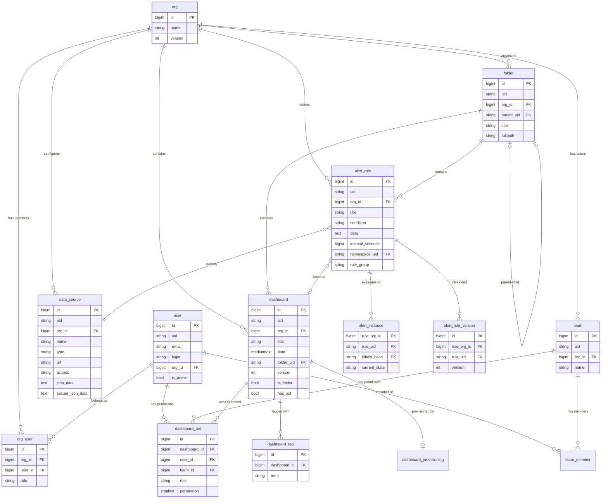

# Grafana 데이터 모델

## 목차

1. [개요](#1-개요)
2. [핵심 데이터 구조](#2-핵심-데이터-구조)
3. [데이터베이스 스키마](#3-데이터베이스-스키마)
4. [K8s-style API 모델](#4-k8s-style-api-모델)
5. [CUE 스키마](#5-cue-스키마)
6. [Protobuf: Unified Storage](#6-protobuf-unified-storage)
7. [엔티티 관계도 (ERD)](#7-엔티티-관계도-erd)
8. [데이터 흐름](#8-데이터-흐름)
9. [암호화: SecureJsonData](#9-암호화-securejsondata)
10. [정리](#10-정리)

---

## 1. 개요

Grafana의 데이터 모델은 크게 세 가지 레이어로 나뉜다.

| 레이어 | 설명 | 대표 파일 |
|--------|------|----------|
| **Go 도메인 모델** | `pkg/services/*/models.go`에 정의된 xorm 기반 구조체 | `dashboards/models.go`, `datasources/models.go` |
| **K8s-style API 모델** | `apps/*/pkg/apis/`에 정의된 Kubernetes API 호환 리소스 | `dashboard/v1beta1/`, `datasource/v0alpha1/` |
| **스키마 정의** | CUE 스키마, Protobuf, DB 마이그레이션 | `kinds/dashboard/`, `proto/resource.proto` |

이러한 세 레이어가 존재하는 이유는 Grafana가 "Kubernetes-native" 아키텍처로 전환 중이기 때문이다. 기존의 SQL 기반 모델은 레거시로 유지되면서, 새로운 K8s API 모델이 점진적으로 도입되고 있다.

```
+---------------------+
|   CUE Schema        |  <-- 스키마의 진실의 원천 (Source of Truth)
|  (kinds/dashboard/) |
+---------------------+
         |
         v  코드 생성
+---------------------+     +---------------------+
| K8s API 모델        |     | Go 도메인 모델       |
| (v1beta1 타입)      | <-->| (xorm 구조체)       |
+---------------------+     +---------------------+
         |                           |
         v                           v
+---------------------+     +---------------------+
| Unified Storage     |     | SQL 데이터베이스      |
| (Protobuf)          |     | (SQLite/MySQL/PG)   |
+---------------------+     +---------------------+
```

---

## 2. 핵심 데이터 구조

### 2.1 Dashboard

**파일 경로**: `pkg/services/dashboards/models.go`

Dashboard는 Grafana에서 가장 핵심적인 엔티티다. 패널(Panel), 변수(Variable), 주석(Annotation) 등을 포함하는 JSON 문서를 `Data` 필드에 저장한다.

```go
// pkg/services/dashboards/models.go

type Dashboard struct {
    ID         int64  `xorm:"pk autoincr 'id'"`
    UID        string `xorm:"uid"`
    Slug       string
    OrgID      int64 `xorm:"org_id"`
    GnetID     int64 `xorm:"gnet_id"`
    Version    int
    PluginID   string `xorm:"plugin_id"`
    APIVersion string `xorm:"api_version"`

    Created time.Time
    Updated time.Time
    Deleted time.Time

    UpdatedBy int64
    CreatedBy int64
    FolderID  int64  `xorm:"folder_id"`    // Deprecated: use FolderUID instead
    FolderUID string `xorm:"folder_uid"`
    IsFolder  bool
    HasACL    bool `xorm:"has_acl"`

    Title string
    Data  *simplejson.Json
}
```

#### 필드별 상세 설명

| 필드 | 타입 | 설명 |
|------|------|------|
| `ID` | int64 | 내부 자동증가 PK. 인스턴스 내에서만 유효 |
| `UID` | string | 인스턴스 간 식별용 고유 ID (8~40자) |
| `Slug` | string | URL용 제목 변환 (`slugify.Slugify(title)`) |
| `OrgID` | int64 | 소속 조직 ID. Grafana의 멀티테넌시 기본 단위 |
| `GnetID` | int64 | grafana.com에서 가져온 대시보드의 원본 ID |
| `Version` | int | 낙관적 잠금(optimistic locking)용 버전 번호 |
| `PluginID` | string | 플러그인이 제공한 대시보드인 경우 플러그인 ID |
| `APIVersion` | string | K8s API 포맷인 경우 `dashboard.grafana.app/v1beta1` |
| `FolderUID` | string | 상위 폴더의 UID. 최상위는 빈 문자열 |
| `IsFolder` | bool | 이 "대시보드"가 폴더인지 여부 (레거시 폴더 구현) |
| `HasACL` | bool | 커스텀 ACL 규칙이 적용되었는지 여부 |
| `Data` | *simplejson.Json | **대시보드의 본체** - 패널, 변수, 주석 등 전체 JSON |

#### Data 필드의 내부 구조

`Data`는 `simplejson.Json` 타입으로, 아래와 같은 구조의 JSON을 담고 있다:

```json
{
  "id": 1,
  "uid": "abc123def",
  "title": "Production Overview",
  "tags": ["production", "monitoring"],
  "timezone": "browser",
  "editable": true,
  "schemaVersion": 42,
  "version": 5,
  "time": {
    "from": "now-6h",
    "to": "now"
  },
  "panels": [
    {
      "id": 1,
      "type": "timeseries",
      "title": "CPU Usage",
      "gridPos": {"h": 9, "w": 12, "x": 0, "y": 0},
      "targets": [
        {
          "refId": "A",
          "datasource": {"type": "prometheus", "uid": "prom-uid"},
          "expr": "rate(cpu_usage_total[5m])"
        }
      ],
      "fieldConfig": {
        "defaults": {"unit": "percentunit"},
        "overrides": []
      }
    }
  ],
  "templating": {
    "list": [
      {
        "name": "cluster",
        "type": "query",
        "datasource": {"type": "prometheus", "uid": "prom-uid"},
        "query": "label_values(up, cluster)"
      }
    ]
  },
  "annotations": {
    "list": [
      {
        "name": "Annotations & Alerts",
        "datasource": {"type": "grafana", "uid": "-- Grafana --"},
        "enable": true,
        "builtIn": 1
      }
    ]
  }
}
```

#### Dashboard 생성 패턴

Dashboard 객체를 생성하는 방법은 두 가지가 있다:

```go
// 1. 일반 JSON 형식에서 생성
func NewDashboardFromJson(data *simplejson.Json) *Dashboard {
    // apiVersion이 있으면 K8s 포맷으로 파싱
    if apiVersion, err := data.Get("apiVersion").String(); err == nil && apiVersion != "" {
        return parseK8sDashboard(data)
    }
    dash := &Dashboard{}
    dash.Data = data
    dash.Title = dash.Data.Get("title").MustString()
    dash.UpdateSlug()
    // id, uid, version 추출...
    return dash
}

// 2. K8s 형식에서 파싱 (apiVersion이 설정된 경우)
func parseK8sDashboard(data *simplejson.Json) *Dashboard {
    // metadata.name → UID
    // metadata.namespace → OrgID (org-{orgID} 형식)
    // spec → Data
    // metadata.annotations.grafana.app/folder → FolderUID
}
```

**설계 선택의 이유**: Dashboard가 `Data`를 `*simplejson.Json`으로 저장하는 이유는 대시보드 JSON 스키마가 매우 유연하고, 패널 플러그인마다 다른 옵션을 가지기 때문이다. 정적 타입으로 정의하면 모든 플러그인 조합을 알아야 하므로 비현실적이다.

#### SaveDashboardCommand

대시보드 저장 시 사용되는 커맨드 구조체:

```go
type SaveDashboardCommand struct {
    Dashboard    *simplejson.Json `json:"dashboard" binding:"Required"`
    UserID       int64            `json:"userId" xorm:"user_id"`
    Overwrite    bool             `json:"overwrite"`
    Message      string           `json:"message"`
    OrgID        int64            `json:"-" xorm:"org_id"`
    RestoredFrom int              `json:"-"`
    PluginID     string           `json:"-" xorm:"plugin_id"`
    APIVersion   string           `json:"-" xorm:"api_version"`
    FolderID     int64            `json:"folderId" xorm:"folder_id"`   // Deprecated
    FolderUID    string           `json:"folderUid" xorm:"folder_uid"`
    IsFolder     bool             `json:"isFolder"`
    UpdatedAt    time.Time
}
```

`Overwrite` 플래그는 버전 충돌 시 강제 덮어쓰기 여부를 결정한다. `false`일 때 버전이 맞지 않으면 412 에러가 발생한다.

---

### 2.2 DashboardACL

**파일 경로**: `pkg/services/dashboards/models.go`

Dashboard에 대한 접근 제어 목록이다:

```go
type DashboardACL struct {
    ID          int64 `xorm:"pk autoincr 'id'"`
    OrgID       int64 `xorm:"org_id"`
    DashboardID int64 `xorm:"dashboard_id"`

    UserID     int64         `xorm:"user_id"`
    TeamID     int64         `xorm:"team_id"`
    Role       *org.RoleType // pointer to be nullable
    Permission dashboardaccess.PermissionType

    Created time.Time
    Updated time.Time
}
```

ACL은 세 가지 방식으로 권한을 부여한다:

| 부여 대상 | 필드 | 설명 |
|-----------|------|------|
| 특정 사용자 | `UserID` | 개별 사용자에게 직접 권한 부여 |
| 특정 팀 | `TeamID` | 팀 단위 권한 부여 |
| 조직 역할 | `Role` | Viewer/Editor/Admin 역할 기반 |

`Permission` 값의 의미:

| 값 | 의미 |
|----|------|
| 1 | View (조회) |
| 2 | Edit (편집) |
| 4 | Admin (관리) |

---

### 2.3 DataSource

**파일 경로**: `pkg/services/datasources/models.go`

DataSource는 Grafana가 연결하는 외부 데이터 소스를 나타낸다. Prometheus, Loki, MySQL, Elasticsearch 등 다양한 백엔드를 지원한다.

```go
type DataSource struct {
    ID      int64 `json:"id,omitempty" xorm:"pk autoincr 'id'"`
    OrgID   int64 `json:"orgId,omitempty" xorm:"org_id"`
    Version int   `json:"version,omitempty"`

    Name   string   `json:"name"`
    Type   string   `json:"type"`
    Access DsAccess `json:"access"`
    URL    string   `json:"url" xorm:"url"`

    Password      string `json:"-"`
    User          string `json:"user"`
    Database      string `json:"database"`
    BasicAuth     bool   `json:"basicAuth"`
    BasicAuthUser string `json:"basicAuthUser"`
    BasicAuthPassword string            `json:"-"`
    WithCredentials   bool              `json:"withCredentials"`
    IsDefault         bool              `json:"isDefault"`
    JsonData          *simplejson.Json  `json:"jsonData"`
    SecureJsonData    map[string][]byte `json:"secureJsonData"`
    ReadOnly          bool              `json:"readOnly"`
    UID               string            `json:"uid" xorm:"uid"`
    APIVersion string `json:"apiVersion" xorm:"api_version"`
    IsPrunable bool   `xorm:"is_prunable"`

    Created time.Time `json:"created,omitempty"`
    Updated time.Time `json:"updated,omitempty"`
}
```

#### 필드별 상세 설명

| 필드 | 타입 | 설명 |
|------|------|------|
| `Name` | string | 조직 내 고유한 데이터소스 이름 |
| `Type` | string | 플러그인 타입 ID (예: `prometheus`, `loki`, `grafana-postgresql-datasource`) |
| `Access` | DsAccess | 접근 모드: `"proxy"` (서버 프록시) 또는 `"direct"` (브라우저 직접) |
| `URL` | string | 데이터소스 서버 URL |
| `JsonData` | *simplejson.Json | 플러그인별 비밀이 아닌 설정 (예: 쿼리 타임아웃, TLS 설정 플래그) |
| `SecureJsonData` | map[string][]byte | **암호화된** 비밀 설정 (예: API 키, 비밀번호) |
| `IsPrunable` | bool | 프로비저닝 시 자동 정리 대상 여부 |

#### Access 모드

```
Proxy 모드 (권장):
  Browser  -->  Grafana Server  -->  DataSource
                (인증 처리)         (Prometheus 등)

Direct 모드 (비권장):
  Browser  ---------------------->  DataSource
           (CORS 필요, 보안 위험)
```

Proxy 모드에서 Grafana 서버가 인증 정보를 주입하므로 보안상 더 안전하다. Direct 모드는 CORS 설정이 필요하고, 비밀 정보가 브라우저에 노출될 위험이 있다.

#### 지원 데이터소스 타입 상수

```go
const (
    DS_PROMETHEUS        = "prometheus"
    DS_LOKI              = "loki"
    DS_ES                = "elasticsearch"
    DS_GRAPHITE          = "graphite"
    DS_INFLUXDB          = "influxdb"
    DS_MYSQL             = "mysql"
    DS_POSTGRES          = "grafana-postgresql-datasource"
    DS_MSSQL             = "mssql"
    DS_TEMPO             = "tempo"
    DS_JAEGER            = "jaeger"
    DS_ZIPKIN            = "zipkin"
    DS_ALERTMANAGER      = "alertmanager"
    DS_AZURE_MONITOR     = "grafana-azure-monitor-datasource"
    DS_TESTDATA          = "grafana-testdata-datasource"
    // ... 이하 생략
)
```

---

### 2.4 AlertRule

**파일 경로**: `pkg/services/ngalert/models/alert_rule.go`

Grafana Alerting(ngalert)의 핵심 모델이다. 쿼리 조건, 평가 주기, 상태 처리 정책을 정의한다.

```go
type AlertRule struct {
    ID              int64
    GUID            string           // 모든 조직과 시간에 걸쳐 고유한 식별자
    OrgID           int64
    Title           string
    Condition       string           // 조건 RefID (예: "B")
    Data            []AlertQuery     // 쿼리 + 표현식 목록
    Updated         time.Time
    UpdatedBy       *UserUID
    IntervalSeconds int64            // 평가 주기 (초)
    Version         int64
    UID             string
    NamespaceUID    string           // 소속 폴더 UID
    FolderFullpath  string
    DashboardUID    *string          // 연관 대시보드 (선택)
    PanelID         *int64           // 연관 패널 (선택)
    RuleGroup       string           // 규칙 그룹 이름
    RuleGroupIndex  int              // 그룹 내 순서
    Record          *Record          // 레코딩 규칙인 경우
    NoDataState     NoDataState      // 데이터 없을 때 상태
    ExecErrState    ExecutionErrorState // 실행 에러 시 상태
    For             time.Duration    // Pending 유지 시간
    KeepFiringFor   time.Duration    // 알림 지속 시간
    Annotations     map[string]string
    Labels          map[string]string
    IsPaused        bool
    NotificationSettings *NotificationSettings
    Metadata        AlertRuleMetadata
    MissingSeriesEvalsToResolve *int64  // 누락 시리즈 해소 평가 횟수
}
```

#### 상태 열거형

**NoDataState** - 쿼리 결과가 없을 때의 동작:

| 값 | 설명 |
|----|------|
| `"Alerting"` | 데이터 없으면 알림 발생 |
| `"NoData"` | NoData 상태로 전환 |
| `"OK"` | 정상으로 간주 |
| `"KeepLast"` | 마지막 상태 유지 |

**ExecutionErrorState** - 쿼리 실행 에러 시의 동작:

| 값 | 설명 |
|----|------|
| `"Alerting"` | 에러 시 알림 발생 |
| `"Error"` | Error 상태로 전환 |
| `"OK"` | 정상으로 간주 |
| `"KeepLast"` | 마지막 상태 유지 |

**RuleType** - 규칙 종류:

| 값 | 설명 |
|----|------|
| `"alerting"` | 알림 규칙 (조건 충족 시 알림 발생) |
| `"recording"` | 레코딩 규칙 (쿼리 결과를 메트릭으로 저장) |

#### 예약 라벨과 어노테이션

```go
const (
    DashboardUIDAnnotation = "__dashboardUid__"
    PanelIDAnnotation      = "__panelId__"
    FolderTitleLabel       = "grafana_folder"
    StateReasonAnnotation  = "grafana_state_reason"
    AutogeneratedRouteLabel     = "__grafana_autogenerated__"
    AutogeneratedRouteReceiverNameLabel = "__grafana_receiver__"
)
```

이 라벨들은 `__` 접두사(내부용) 또는 `grafana_` 접두사(사용자 전달용)로 구분된다.

---

### 2.5 AlertQuery

**파일 경로**: `pkg/services/ngalert/models/alert_query.go`

AlertRule의 `Data` 필드에 들어가는 개별 쿼리 또는 표현식이다:

```go
type AlertQuery struct {
    RefID             string            `json:"refId"`
    QueryType         string            `json:"queryType"`
    RelativeTimeRange RelativeTimeRange `json:"relativeTimeRange"`
    DatasourceUID     string            `json:"datasourceUid"`
    Model             json.RawMessage   `json:"model"`
    DatasourceType    string            `json:"-"`
    IsMTQuery         bool              `json:"-"`
}
```

| 필드 | 설명 |
|------|------|
| `RefID` | 쿼리 식별자 (예: "A", "B", "C"). 표현식에서 참조용 |
| `QueryType` | 쿼리 유형 식별자 (데이터소스별 다름) |
| `RelativeTimeRange` | 상대 시간 범위 (`From`, `To`를 초 단위로 표현) |
| `DatasourceUID` | 데이터소스 UID. 표현식이면 `"__expr__"` |
| `Model` | 쿼리 본체 JSON (PromQL, LogQL 등) |

#### RelativeTimeRange

```go
type RelativeTimeRange struct {
    From Duration `json:"from" yaml:"from"`  // 예: 600 (= 10분 전)
    To   Duration `json:"to" yaml:"to"`      // 예: 0 (= 현재)
}
```

`From`은 항상 `To`보다 커야 한다 (과거 시점이므로). 표현식 쿼리에서는 이 제약이 무시된다.

#### 표현식 (Server Side Expression)

`DatasourceUID`가 `"__expr__"`일 때 해당 쿼리는 SSE(Server Side Expression)다:

```json
{
  "refId": "B",
  "datasourceUid": "__expr__",
  "model": {
    "type": "reduce",
    "expression": "A",
    "reducer": "last",
    "settings": { "mode": "dropNN" }
  }
}
```

```json
{
  "refId": "C",
  "datasourceUid": "__expr__",
  "model": {
    "type": "threshold",
    "expression": "B",
    "conditions": [
      { "evaluator": { "type": "gt", "params": [80] } }
    ]
  }
}
```

알림 규칙의 `Condition` 필드는 이 표현식 체인의 마지막 RefID("C")를 참조한다.

---

### 2.6 AlertInstance

**파일 경로**: `pkg/services/ngalert/models/instance.go`

AlertRule 평가의 개별 인스턴스 상태를 나타낸다. 하나의 규칙에서 여러 시계열(레이블 조합)이 반환될 수 있으므로, 각각이 별도의 AlertInstance가 된다.

```go
type AlertInstance struct {
    AlertInstanceKey   `xorm:"extends"`
    Labels             InstanceLabels
    Annotations        InstanceAnnotations
    CurrentState       InstanceStateType
    CurrentReason      string
    CurrentStateSince  time.Time
    CurrentStateEnd    time.Time
    LastEvalTime       time.Time
    LastSentAt         *time.Time
    FiredAt            *time.Time
    ResolvedAt         *time.Time
    ResultFingerprint  string
    EvaluationDuration time.Duration `xorm:"evaluation_duration_ns"`
    LastError          string        `xorm:"last_error"`
    LastResult         LastResult    `xorm:"last_result"`
}

type AlertInstanceKey struct {
    RuleOrgID  int64  `xorm:"rule_org_id"`
    RuleUID    string `xorm:"rule_uid"`
    LabelsHash string
}
```

**복합 PK**: `(rule_org_id, rule_uid, labels_hash)`로 구성된다. 즉, 같은 규칙이라도 레이블 조합이 다르면 별도의 인스턴스로 관리된다.

---

### 2.7 User

**파일 경로**: `pkg/services/user/model.go`

```go
type User struct {
    ID            int64  `xorm:"pk autoincr 'id'"`
    UID           string `json:"uid" xorm:"uid"`
    Version       int
    Email         string
    Name          string
    Login         string
    Password      Password
    Salt          string
    Rands         string
    Company       string
    EmailVerified bool
    Theme         string
    HelpFlags1    HelpFlags1 `xorm:"help_flags1"`
    IsDisabled    bool
    IsAdmin          bool
    IsServiceAccount bool
    OrgID            int64 `xorm:"org_id"`
    Created    time.Time
    Updated    time.Time
    LastSeenAt time.Time
    IsProvisioned bool `xorm:"is_provisioned"`
}
```

`Password`는 별도 타입으로 정의되어 JSON 직렬화 시 노출되지 않는다. `Salt`와 `Rands`는 비밀번호 해싱에 사용된다.

---

### 2.8 Org (조직)

**파일 경로**: `pkg/services/org/model.go`

```go
type Org struct {
    ID      int64 `xorm:"pk autoincr 'id'"`
    Version int
    Name    string
    Address1 string
    Address2 string
    City     string
    ZipCode  string
    State    string
    Country  string
    Created time.Time
    Updated time.Time
}

type OrgUser struct {
    ID      int64 `xorm:"pk autoincr 'id'"`
    OrgID   int64 `xorm:"org_id"`
    UserID  int64 `xorm:"user_id"`
    Role    RoleType
    Created time.Time
    Updated time.Time
}
```

Org는 Grafana의 멀티테넌시 단위다. 한 사용자가 여러 Org에 속할 수 있으며, 각 Org에서 다른 역할(Viewer/Editor/Admin)을 가질 수 있다.

```go
const (
    RoleNone   RoleType = "None"
    RoleViewer RoleType = "Viewer"
    RoleEditor RoleType = "Editor"
    RoleAdmin  RoleType = "Admin"
)
```

---

### 2.9 Team

**파일 경로**: `pkg/services/team/model.go`

```go
type Team struct {
    ID            int64  `json:"id" xorm:"pk autoincr 'id'"`
    UID           string `json:"uid" xorm:"uid"`
    OrgID         int64  `json:"orgId" xorm:"org_id"`
    Name          string `json:"name"`
    Email         string `json:"email"`
    ExternalUID   string `json:"externalUID" xorm:"external_uid"`
    IsProvisioned bool   `json:"isProvisioned" xorm:"is_provisioned"`
    Created time.Time `json:"created"`
    Updated time.Time `json:"updated"`
}
```

Team은 Org 내에서 사용자를 그룹화하는 단위다. Dashboard ACL에서 팀 단위 권한 부여에 사용된다. `ExternalUID`는 외부 ID 프로바이더(LDAP, SAML 등)와의 동기화에 사용된다.

---

### 2.10 Folder

**파일 경로**: `pkg/services/folder/model.go`

```go
type Folder struct {
    ID          int64  `xorm:"pk autoincr 'id'"`
    OrgID       int64  `xorm:"org_id"`
    UID         string `xorm:"uid"`
    ParentUID   string `xorm:"parent_uid"`
    Title       string
    Description string
    Created time.Time
    Updated time.Time
    Version      int
    URL          string
    UpdatedBy    int64
    CreatedBy    int64
    HasACL       bool
    Fullpath     string `xorm:"fullpath"`
    FullpathUIDs string `xorm:"fullpath_uids"`
    ManagedBy    utils.ManagerKind
}
```

Folder는 Dashboard를 계층적으로 구성하는 컨테이너다. `ParentUID`로 중첩 폴더를 지원하며, `Fullpath`에는 `"Production/Services/Backend"` 같은 전체 경로가 캐시된다.

**레거시 주의**: 초기 Grafana에서 폴더는 `IsFolder=true`인 Dashboard로 구현되었다. 이후 별도 `folder` 테이블로 분리되었지만, 하위 호환성을 위해 레거시 코드가 남아 있다.

---

## 3. 데이터베이스 스키마

Grafana는 SQLite, MySQL, PostgreSQL을 지원하며, `pkg/services/sqlstore/migrations/` 디렉토리에 마이그레이션 코드가 정의되어 있다.

### 3.1 dashboard 테이블

**파일 경로**: `pkg/services/sqlstore/migrations/dashboard_mig.go`

```sql
CREATE TABLE dashboard (
    id          BIGINT PRIMARY KEY AUTO_INCREMENT,
    version     INT NOT NULL,
    slug        NVARCHAR(189) NOT NULL,
    title       NVARCHAR(189) NOT NULL,
    data        MEDIUMTEXT NOT NULL,       -- 대시보드 전체 JSON
    org_id      BIGINT NOT NULL,
    created     DATETIME NOT NULL,
    updated     DATETIME NOT NULL,
    updated_by  INT,
    created_by  INT,
    gnet_id     BIGINT,
    plugin_id   NVARCHAR(189),
    folder_id   BIGINT NOT NULL DEFAULT 0, -- Deprecated
    folder_uid  NVARCHAR(40),
    is_folder   BOOL NOT NULL DEFAULT 0,
    has_acl     BOOL NOT NULL DEFAULT 0,
    uid         NVARCHAR(40),
    is_public   BOOL NOT NULL DEFAULT 0,
    deleted     DATETIME,
    api_version VARCHAR(16)
);
```

#### 인덱스

| 인덱스 | 타입 | 컬럼 | 용도 |
|--------|------|------|------|
| `UQE_dashboard_org_id_uid` | UNIQUE | `(org_id, uid)` | UID 기반 조회의 유일성 보장 |
| `IDX_dashboard_org_id` | INDEX | `(org_id)` | 조직별 대시보드 목록 |
| `IDX_dashboard_org_id_plugin_id` | INDEX | `(org_id, plugin_id)` | 플러그인별 대시보드 조회 |
| `IDX_dashboard_gnet_id` | INDEX | `(gnet_id)` | grafana.com 대시보드 매핑 |
| `IDX_dashboard_title` | INDEX | `(title)` | 제목 검색 |
| `IDX_dashboard_is_folder` | INDEX | `(is_folder)` | 폴더 목록 조회 |
| `IDX_dashboard_deleted` | INDEX | `(deleted)` | 소프트 삭제 필터링 |

**`data` 컬럼**이 `MEDIUMTEXT`인 이유: 대시보드 JSON은 수백 개의 패널을 포함할 수 있어, MySQL의 일반 `TEXT`(64KB)로는 부족하다. `MEDIUMTEXT`는 최대 16MB까지 저장 가능하다.

### 3.2 dashboard_tag 테이블

```sql
CREATE TABLE dashboard_tag (
    id            BIGINT PRIMARY KEY AUTO_INCREMENT,
    dashboard_id  BIGINT NOT NULL,
    term          NVARCHAR(50) NOT NULL,
    dashboard_uid NVARCHAR(40),
    org_id        BIGINT DEFAULT 1
);

-- UNIQUE INDEX (dashboard_id, term)
```

태그는 대시보드 JSON의 `tags` 배열에서 추출되어 별도 테이블에 저장된다. 이렇게 분리한 이유는 태그 기반 검색을 효율적으로 수행하기 위해서다.

### 3.3 dashboard_acl 테이블

**파일 경로**: `pkg/services/sqlstore/migrations/dashboard_acl.go`

```sql
CREATE TABLE dashboard_acl (
    id            BIGINT PRIMARY KEY AUTO_INCREMENT,
    org_id        BIGINT,
    dashboard_id  BIGINT,
    user_id       BIGINT,
    team_id       BIGINT,
    permission    SMALLINT DEFAULT 4,
    role          VARCHAR(20),
    created       DATETIME NOT NULL,
    updated       DATETIME NOT NULL
);
```

#### 인덱스

| 인덱스 | 타입 | 컬럼 |
|--------|------|------|
| `UQE_dashboard_acl_dashboard_id_user_id` | UNIQUE | `(dashboard_id, user_id)` |
| `UQE_dashboard_acl_dashboard_id_team_id` | UNIQUE | `(dashboard_id, team_id)` |
| `IDX_dashboard_acl_user_id` | INDEX | `(user_id)` |
| `IDX_dashboard_acl_team_id` | INDEX | `(team_id)` |
| `IDX_dashboard_acl_org_id_role` | INDEX | `(org_id, role)` |
| `IDX_dashboard_acl_permission` | INDEX | `(permission)` |

기본 ACL 규칙으로 `(-1, -1, 1, 'Viewer')`와 `(-1, -1, 2, 'Editor')`가 삽입된다. `dashboard_id=-1`은 전역 기본 규칙을 의미한다.

### 3.4 data_source 테이블

**파일 경로**: `pkg/services/sqlstore/migrations/datasource_mig.go`

```sql
CREATE TABLE data_source (
    id                  BIGINT PRIMARY KEY AUTO_INCREMENT,
    org_id              BIGINT NOT NULL,
    version             INT NOT NULL,
    type                NVARCHAR(255) NOT NULL,
    name                NVARCHAR(190) NOT NULL,
    access              NVARCHAR(255) NOT NULL,
    url                 NVARCHAR(255) NOT NULL,
    password            NVARCHAR(255),
    user                NVARCHAR(255),
    database            NVARCHAR(255),
    basic_auth          BOOL NOT NULL,
    basic_auth_user     NVARCHAR(255),
    basic_auth_password NVARCHAR(255),
    is_default          BOOL NOT NULL,
    json_data           MEDIUMTEXT,
    secure_json_data    MEDIUMTEXT,
    created             DATETIME NOT NULL,
    updated             DATETIME NOT NULL,
    with_credentials    BOOL NOT NULL DEFAULT 0,
    read_only           BOOL,
    uid                 NVARCHAR(40) NOT NULL DEFAULT '0',
    is_prunable         BOOL DEFAULT 0,
    api_version         VARCHAR(20)
);
```

#### 인덱스

| 인덱스 | 타입 | 컬럼 |
|--------|------|------|
| `UQE_data_source_org_id_name` | UNIQUE | `(org_id, name)` |
| `UQE_data_source_org_id_uid` | UNIQUE | `(org_id, uid)` |
| `IDX_data_source_org_id` | INDEX | `(org_id)` |
| `IDX_data_source_org_id_is_default` | INDEX | `(org_id, is_default)` |

**`secure_json_data`**: 이 컬럼은 JSON 형태의 암호화된 바이트 맵을 저장한다. 각 값은 개별적으로 암호화된다.

### 3.5 alert_rule 테이블

**파일 경로**: `pkg/services/sqlstore/migrations/ualert/tables.go`

```sql
CREATE TABLE alert_rule (
    id                BIGINT PRIMARY KEY AUTO_INCREMENT,
    org_id            BIGINT NOT NULL,
    title             NVARCHAR(190) NOT NULL,
    condition         NVARCHAR(190) NOT NULL,
    data              MEDIUMTEXT NOT NULL,       -- []AlertQuery JSON 배열
    updated           DATETIME NOT NULL,
    interval_seconds  BIGINT NOT NULL DEFAULT 60,
    version           INT NOT NULL DEFAULT 0,
    uid               NVARCHAR(40) NOT NULL DEFAULT '0',
    namespace_uid     NVARCHAR(40) NOT NULL,     -- 폴더 UID
    rule_group        NVARCHAR(190) NOT NULL,
    no_data_state     NVARCHAR(15) NOT NULL DEFAULT 'NoData',
    exec_err_state    NVARCHAR(15) NOT NULL DEFAULT 'Alerting',
    "for"             BIGINT NOT NULL DEFAULT 0, -- 나노초 단위
    annotations       TEXT,
    labels            TEXT,
    dashboard_uid     NVARCHAR(40),
    panel_id          BIGINT,
    rule_group_idx    BIGINT NOT NULL DEFAULT 1,
    is_paused         BOOL NOT NULL DEFAULT 0
);
```

#### 인덱스

| 인덱스 | 타입 | 컬럼 |
|--------|------|------|
| `UQE_alert_rule_org_id_uid` | UNIQUE | `(org_id, uid)` |
| `IDX_alert_rule_org_id_namespace_uid_rule_group` | INDEX | `(org_id, namespace_uid, rule_group)` |
| `IDX_alert_rule_org_id_dashboard_uid_panel_id` | INDEX | `(org_id, dashboard_uid, panel_id)` |

### 3.6 alert_instance 테이블

```sql
CREATE TABLE alert_instance (
    rule_org_id       BIGINT NOT NULL,
    rule_uid          NVARCHAR(40) NOT NULL DEFAULT '0',
    labels            TEXT NOT NULL,
    labels_hash       NVARCHAR(190) NOT NULL,
    current_state     NVARCHAR(190) NOT NULL,
    current_state_since BIGINT NOT NULL,
    current_state_end   BIGINT NOT NULL DEFAULT 0,
    last_eval_time    BIGINT NOT NULL,
    current_reason    NVARCHAR(190),
    result_fingerprint NVARCHAR(16),

    PRIMARY KEY (rule_org_id, rule_uid, labels_hash)
);
```

**복합 PK 설계**: `labels_hash`는 레이블 조합의 FNV 해시다. 같은 규칙이 여러 시계열을 반환할 때 각각의 상태를 독립적으로 추적하기 위해 이 구조를 사용한다.

### 3.7 alert_rule_version 테이블

```sql
CREATE TABLE alert_rule_version (
    id                  BIGINT PRIMARY KEY AUTO_INCREMENT,
    rule_org_id         BIGINT,
    rule_uid            NVARCHAR(40) NOT NULL DEFAULT '0',
    rule_namespace_uid  NVARCHAR(40) NOT NULL,
    rule_group          NVARCHAR(190) NOT NULL,
    parent_version      INT NOT NULL,
    restored_from       INT NOT NULL,
    version             INT NOT NULL,
    created             DATETIME NOT NULL,
    title               NVARCHAR(190) NOT NULL,
    condition           NVARCHAR(190) NOT NULL,
    data                MEDIUMTEXT NOT NULL,
    interval_seconds    BIGINT NOT NULL,
    no_data_state       NVARCHAR(15) NOT NULL DEFAULT 'NoData',
    exec_err_state      NVARCHAR(15) NOT NULL DEFAULT 'Alerting'
);

-- UNIQUE INDEX (rule_org_id, rule_uid, version)
```

이 테이블은 알림 규칙의 변경 이력을 저장한다. 규칙이 변경될 때마다 새 버전이 추가되며, 이전 상태로 롤백할 수 있다.

---

## 4. K8s-style API 모델

Grafana는 Kubernetes API 서버와 호환되는 리소스 모델로 전환 중이다. 이를 통해 `kubectl`이나 K8s API 클라이언트로 Grafana 리소스를 관리할 수 있다.

### 4.1 Dashboard (K8s API)

**파일 경로**: `apps/dashboard/pkg/apis/dashboard/v1beta1/dashboard_object_gen.go`

```go
// apps/dashboard/pkg/apis/dashboard/v1beta1/dashboard_object_gen.go

type Dashboard struct {
    metav1.TypeMeta   `json:",inline" yaml:",inline"`
    metav1.ObjectMeta `json:"metadata" yaml:"metadata"`

    Spec   DashboardSpec   `json:"spec" yaml:"spec"`
    Status DashboardStatus `json:"status" yaml:"status"`
}
```

K8s 형식의 Dashboard 리소스 예시:

```yaml
apiVersion: dashboard.grafana.app/v1beta1
kind: Dashboard
metadata:
  name: abc123def              # Dashboard UID
  namespace: org-1             # org-{orgID} 형식
  generation: 5                # version에 매핑
  annotations:
    grafana.app/folder: "folder-uid-123"
spec:
  title: "Production Overview"
  schemaVersion: 42
  panels:
    - id: 1
      type: timeseries
      title: "CPU Usage"
      # ... 패널 설정
  templating:
    list: []
```

#### DashboardSpec

```go
// apps/dashboard/pkg/apis/dashboard/v1beta1/dashboard_spec.go

type DashboardSpec = common.Unstructured
```

`DashboardSpec`은 `common.Unstructured` 타입으로, 임의의 JSON을 담을 수 있는 비정형(unstructured) 컨테이너다. 이는 대시보드 JSON의 유연한 스키마를 그대로 수용하기 위한 설계다.

#### DashboardWithAccessInfo

```go
type DashboardWithAccessInfo struct {
    Dashboard `json:",inline"`
    Access DashboardAccess `json:"access"`
}

type DashboardAccess struct {
    Slug     string `json:"slug,omitempty"`
    Url      string `json:"url,omitempty"`
    IsPublic bool   `json:"isPublic"`
    CanSave    bool `json:"canSave"`
    CanEdit    bool `json:"canEdit"`
    CanAdmin   bool `json:"canAdmin"`
    CanStar    bool `json:"canStar"`
    CanDelete  bool `json:"canDelete"`
    AnnotationsPermissions *AnnotationPermission `json:"annotationsPermissions"`
}
```

레거시 DTO와의 호환을 위해, 대시보드 데이터와 접근 권한을 한 번의 API 호출로 반환하는 구조다.

### 4.2 DataSource (K8s API)

**파일 경로**: `pkg/apis/datasource/v0alpha1/datasource.go`

```go
type DataSource struct {
    metav1.TypeMeta   `json:",inline"`
    metav1.ObjectMeta `json:"metadata"`
    Spec   UnstructuredSpec         `json:"spec"`
    Secure common.InlineSecureValues `json:"secure,omitzero,omitempty"`
}
```

#### GenericDataSourceSpec

```go
type GenericDataSourceSpec struct {
    Title    string   `json:"title"`
    Access   DsAccess `json:"access,omitempty"`
    ReadOnly bool     `json:"readOnly,omitempty"`
    IsDefault bool   `json:"isDefault,omitempty"`
    URL      string   `json:"url,omitempty"`
    User     string   `json:"user,omitempty"`
    Database string   `json:"database,omitempty"`
    BasicAuth     bool   `json:"basicAuth,omitempty"`
    BasicAuthUser string `json:"basicAuthUser,omitempty"`
    WithCredentials bool `json:"withCredentials,omitempty"`
    JsonData common.Unstructured `json:"jsonData,omitzero"`
}
```

K8s 형식에서 `Secure` 필드는 비밀 값의 **이름만** 반환하며, 실제 값은 반환하지 않는다. 이는 K8s Secret과 유사한 보안 패턴이다.

### 4.3 네임스페이스 매핑

Grafana의 조직(Org)은 K8s 네임스페이스로 매핑된다:

```
Grafana OrgID 1  →  K8s namespace "org-1"
Grafana OrgID 5  →  K8s namespace "org-5"
```

이 매핑은 `parseK8sDashboard` 함수에서 확인할 수 있다:

```go
info, err := types.ParseNamespace(obj.GetNamespace())
if err == nil && info.OrgID > 0 {
    dash.OrgID = info.OrgID
}
```

---

## 5. CUE 스키마

**파일 경로**: `kinds/dashboard/dashboard_kind.cue`

CUE(Configure Unify Execute)는 Grafana가 스키마의 "진실의 원천(Source of Truth)"으로 사용하는 언어다. TypeScript 타입, Go 타입, OpenAPI 스펙이 이 CUE 스키마에서 자동 생성된다.

### 5.1 Dashboard 스키마

```cue
name:        "Dashboard"
maturity:    "experimental"
description: "A Grafana dashboard."

lineage: schemas: [{
    version: [0, 0]
    schema: {
        spec: {
            id?: int64 | null
            uid?: string
            title?: string
            description?: string
            tags?: [...string]
            timezone?: string | *"browser"
            editable?: bool | *true
            graphTooltip?: #DashboardCursorSync
            time?: {
                from: string | *"now-6h"
                to:   string | *"now"
            }
            timepicker?: #TimePickerConfig
            schemaVersion: uint16 | *42
            version?: uint32
            panels?: [...(#Panel | #RowPanel)]
            templating?: { list?: [...#VariableModel] }
            annotations?: #AnnotationContainer
            links?: [...#DashboardLink]
            refresh?: string
            liveNow?: bool
            preload?: bool
        }
    }
}]
```

### 5.2 Panel 정의

```cue
#Panel: {
    type: string & strings.MinRunes(1)  // 플러그인 타입 (필수, 최소 1자)
    id?: uint32
    pluginVersion?: string
    targets?: [...#Target]
    title?: string
    description?: string
    transparent?: bool | *false
    datasource?: #DataSourceRef
    gridPos?: #GridPos
    links?: [...#DashboardLink]
    repeat?: string
    repeatDirection?: *"h" | "v"
    maxPerRow?: number
    maxDataPoints?: number
    transformations?: [...#DataTransformerConfig]
    interval?: string
    timeFrom?: string
    timeShift?: string
    options?: {...}          // 플러그인별 비정형 옵션
    fieldConfig?: #FieldConfigSource
}
```

### 5.3 GridPos (패널 위치)

```cue
#GridPos: {
    h: uint32 & >0 | *9           // 높이 (기본 9행)
    w: uint32 & >0 & <=24 | *12   // 너비 (기본 12칸, 최대 24)
    x: uint32 & >=0 & <24 | *0    // X 좌표 (0~23)
    y: uint32 & >=0 | *0          // Y 좌표
    static?: bool
}
```

Grafana의 대시보드 그리드는 24 칸 너비다. 패널의 위치와 크기는 이 그리드 좌표계로 표현된다.

### 5.4 Variable 모델

```cue
#VariableModel: {
    type: #VariableType   // query, adhoc, constant, datasource, interval, textbox, custom, system, switch
    name: string
    label?: string
    hide?: #VariableHide  // 0: 보임, 1: 라벨 숨김, 2: 완전 숨김
    query?: string | {...}
    datasource?: #DataSourceRef
    current?: #VariableOption
    multi?: bool | *false
    options?: [...#VariableOption]
    refresh?: #VariableRefresh  // 0: 안 함, 1: 대시보드 로드 시, 2: 시간 범위 변경 시
    sort?: #VariableSort
    includeAll?: bool | *false
    regex?: string
}
```

### 5.5 CUE에서 타입 생성 파이프라인

```
CUE 스키마 정의
    |
    v  (cue export / grafana-app-sdk)
+-- TypeScript 타입 (프론트엔드)
+-- Go 구조체 (백엔드)
+-- OpenAPI 스펙 (API 문서)
+-- JSON Schema (검증)
```

CUE의 장점은 **제약 조건과 기본값을 타입 정의에 포함**할 수 있다는 것이다. 예를 들어 `w: uint32 & >0 & <=24 | *12`는 "0보다 크고 24 이하인 정수, 기본값 12"를 한 줄로 표현한다.

---

## 6. Protobuf: Unified Storage

**파일 경로**: `pkg/storage/unified/proto/resource.proto`

Unified Storage는 Grafana 리소스를 K8s API 서버 방식으로 저장하는 새 스토리지 백엔드다.

### 6.1 ResourceKey

```protobuf
message ResourceKey {
    string namespace = 2;   // 테넌트 (org-{orgID})
    string group = 1;       // 리소스 그룹 (dashboard.grafana.app)
    string resource = 3;    // 리소스 타입 (dashboards)
    string name = 4;        // 리소스 식별자 (UID)
}
```

이 키 구조는 K8s의 리소스 식별 체계를 그대로 따른다:

```
/apis/{group}/{version}/namespaces/{namespace}/{resource}/{name}
/apis/dashboard.grafana.app/v1beta1/namespaces/org-1/dashboards/abc123
```

### 6.2 ResourceWrapper

```protobuf
message ResourceWrapper {
    int64 resource_version = 1;  // 리소스 버전 (낙관적 잠금)
    bytes value = 2;             // 전체 K8s JSON 바이트
}
```

`value`에는 완전한 K8s 리소스 JSON이 바이트 배열로 저장된다. 이 설계 덕분에 Unified Storage는 특정 리소스 타입에 의존하지 않고 모든 Grafana 리소스를 동일한 방식으로 저장할 수 있다.

### 6.3 ErrorResult

```protobuf
message ErrorResult {
    string message = 1;       // 사람이 읽을 수 있는 에러 설명
    string reason = 2;        // 기계가 읽을 수 있는 에러 사유
    ErrorDetails details = 3; // 추가 에러 정보
    int32 code = 4;           // HTTP 상태 코드
}
```

K8s `metav1.Status`와 동일한 구조를 사용하여, K8s 에코시스템과의 호환성을 유지한다.

---

## 7. 엔티티 관계도 (ERD)

### 7.1 전체 ERD



### 7.2 ASCII ERD (간략 버전)

```
+----------+     +----------+     +-----------+
|   org    |---->| org_user |<----|   user    |
+----------+     +----------+     +-----------+
     |                                  |
     |  1:N                             | 1:N
     v                                  v
+----------+     +-----------+    +-----------+
|  folder  |---->| dashboard |<---| dash_acl  |
+----------+     +-----------+    +-----------+
     |                |                 ^
     |  1:N           | 1:N             |
     v                v                 |
+----------+    +-----------+     +-----------+
|alert_rule|--->|alert_inst |     |   team    |
+----------+    +-----------+     +-----------+
     |
     | 1:N
     v
+----------+
|rule_ver  |
+----------+

+-----------+
|data_source|  <-- alert_rule.data[].datasourceUid 으로 참조
+-----------+
```

---

## 8. 데이터 흐름

### 8.1 대시보드 저장 흐름

```
사용자 (브라우저)
    |
    v  POST /api/dashboards/db
+---------------------------+
| HTTP Handler              |
| (dashboard_api.go)        |
+---------------------------+
    |
    v  SaveDashboardCommand
+---------------------------+
| DashboardService          |
| .SaveDashboard()          |
|  - 권한 검증              |
|  - 버전 충돌 검사          |
|  - UID 생성 (없는 경우)    |
|  - 유효성 검증             |
+---------------------------+
    |
    v  Dashboard 모델
+---------------------------+
| DashboardStore            |
| .SaveDashboard()          |
|  - SQL INSERT/UPDATE      |
|  - 버전 증가              |
|  - 태그 동기화             |
+---------------------------+
    |
    v  DB 트랜잭션
+---------------------------+
| SQLite / MySQL / PG       |
| dashboard 테이블           |
+---------------------------+
```

### 8.2 대시보드 로드 흐름

```
GET /api/dashboards/uid/:uid
    |
    v
+---------------------------+
| GetDashboardQuery         |
|  UID + OrgID              |
+---------------------------+
    |
    v
+---------------------------+
| SELECT * FROM dashboard   |
| WHERE uid=? AND org_id=?  |
+---------------------------+
    |
    v
+---------------------------+
| Dashboard 모델 조립        |
|  - DB 행 → Dashboard 구조체|
|  - Data JSON 파싱          |
|  - ACL 정보 병합           |
+---------------------------+
    |
    v
+---------------------------+
| DashboardFullWithMeta     |
|  (메타데이터 + ACL 포함)   |
+---------------------------+
```

### 8.3 알림 규칙 평가 데이터 흐름

```
Scheduler (IntervalSeconds마다 실행)
    |
    v
+---------------------------+
| AlertRule 로드             |
|  - Data ([]AlertQuery)    |
+---------------------------+
    |
    v
+---------------------------+
| 쿼리 실행                  |
|  RefID "A": Prometheus 쿼리 |
|    → datasourceUid 참조    |
|    → RelativeTimeRange 적용|
+---------------------------+
    |
    v
+---------------------------+
| SSE 표현식 평가            |
|  RefID "B": reduce(A)     |
|  RefID "C": threshold(B)  |
+---------------------------+
    |
    v  Condition="C" 참조
+---------------------------+
| 상태 결정                   |
|  - Normal / Pending / Firing|
|  - For 기간 확인            |
|  - NoDataState 적용         |
+---------------------------+
    |
    v
+---------------------------+
| AlertInstance 저장          |
|  PK: (org_id, uid, hash)  |
|  current_state 업데이트     |
+---------------------------+
```

### 8.4 데이터소스 쿼리 프록시 흐름

```
브라우저 패널
    |
    v  POST /api/ds/query
+---------------------------+
| DataSource 조회            |
|  uid → data_source 테이블  |
+---------------------------+
    |
    v
+---------------------------+
| 인증 정보 주입              |
|  SecureJsonData 복호화     |
|  BasicAuth 헤더 추가       |
|  커스텀 헤더 추가           |
+---------------------------+
    |
    v
+---------------------------+
| Plugin SDK 호출            |
|  → 플러그인별 QueryData()  |
|  → 원격 서버 요청           |
+---------------------------+
    |
    v
+---------------------------+
| DataFrame 응답             |
|  (시계열/테이블 데이터)     |
+---------------------------+
```

---

## 9. 암호화: SecureJsonData

### 9.1 개요

Grafana의 데이터소스에는 API 키, 비밀번호, TLS 인증서 등 민감한 설정이 포함된다. 이런 값들은 `SecureJsonData`에 암호화되어 저장된다.

### 9.2 암호화 저장 흐름

```
사용자 입력 (평문)
    |
    v  AddDataSourceCommand.SecureJsonData (map[string]string)
+---------------------------+
| DataSource Service        |
|  .AddDataSource()         |
+---------------------------+
    |
    v  개별 값 암호화
+---------------------------+
| Secrets Service           |
|  .Encrypt(plaintext)      |
|  → AES-256-GCM 암호화     |
+---------------------------+
    |
    v  EncryptedSecureJsonData (map[string][]byte)
+---------------------------+
| DataSource Store          |
|  INSERT INTO data_source  |
|  (secure_json_data = ?)   |
+---------------------------+
```

### 9.3 복호화 흐름

**파일 경로**: `pkg/services/datasources/service/datasource.go`

```go
func (s *Service) DecryptedValues(ctx context.Context, ds *datasources.DataSource) (map[string]string, error) {
    decryptedValues := make(map[string]string)

    // 1. 새 비밀 저장소(KV Store)에서 먼저 조회
    secret, exist, err := s.SecretsStore.Get(ctx, ds.OrgID, ds.Name, kvstore.DataSourceSecretType)
    if err != nil {
        return nil, err
    }

    if exist {
        err = json.Unmarshal([]byte(secret), &decryptedValues)
        if err != nil {
            s.logger.Debug("Failed to unmarshal secret value, using legacy secrets", "err", err)
        }
    }

    // 2. KV Store에 없으면 레거시 방식으로 개별 복호화
    if !exist || err != nil {
        decryptedValues, err = s.decryptLegacySecrets(ctx, ds)
        if err != nil {
            return nil, err
        }
    }

    return decryptedValues, nil
}

func (s *Service) decryptLegacySecrets(ctx context.Context, ds *datasources.DataSource) (map[string]string, error) {
    secureJsonData := make(map[string]string)
    for k, v := range ds.SecureJsonData {
        decrypted, err := s.SecretsService.Decrypt(ctx, v)
        if err != nil {
            return nil, err
        }
        secureJsonData[k] = string(decrypted)
    }
    return secureJsonData, nil
}
```

### 9.4 이중 저장소 구조

Grafana는 두 가지 비밀 저장 방식을 동시에 지원한다:

```
+-----------------------------+
| 새 방식: KV Store            |
| (secrets/kvstore)           |
| 모든 비밀을 JSON으로 묶어    |
| 한 번에 저장                 |
+-----------------------------+
         |
         | 없으면 폴백
         v
+-----------------------------+
| 레거시 방식: SecureJsonData  |
| (data_source 테이블 컬럼)   |
| 각 값을 개별 암호화하여      |
| map[string][]byte로 저장    |
+-----------------------------+
```

이러한 이중 구조가 존재하는 이유는 **무중단 마이그레이션**을 위해서다. 기존 인스턴스의 데이터를 보존하면서 새 저장 방식으로 점진적으로 전환한다.

### 9.5 비밀 값 접근 편의 메서드

```go
// 특정 키의 복호화된 값 조회
func (s *Service) DecryptedValue(ctx context.Context, ds *datasources.DataSource, key string) (string, bool, error)

// BasicAuth 비밀번호 복호화
func (s *Service) DecryptedBasicAuthPassword(ctx context.Context, ds *datasources.DataSource) (string, error)

// 데이터소스 비밀번호 복호화
func (s *Service) DecryptedPassword(ctx context.Context, ds *datasources.DataSource) (string, error)
```

### 9.6 SecureJsonData에 저장되는 대표적 비밀 값

| 키 | 설명 | 사용 데이터소스 |
|----|------|---------------|
| `basicAuthPassword` | Basic Auth 비밀번호 | 대부분 |
| `password` | 데이터소스 비밀번호 | MySQL, PostgreSQL |
| `tlsCACert` | TLS CA 인증서 | TLS 설정 시 |
| `tlsClientCert` | TLS 클라이언트 인증서 | 상호 TLS 인증 |
| `tlsClientKey` | TLS 클라이언트 키 | 상호 TLS 인증 |
| `httpHeaderValue1` | 커스텀 HTTP 헤더 값 | API 키 전달 등 |
| `accessToken` | OAuth2 액세스 토큰 | 클라우드 서비스 |

---

## 10. 정리

### 10.1 모델 레이어 비교

| 측면 | 레거시 모델 | K8s API 모델 |
|------|------------|-------------|
| **식별** | `ID` (int64, 인스턴스 로컬) | `metadata.name` (UID) + `namespace` (org) |
| **조직** | `OrgID` 필드 | `namespace: org-{orgID}` |
| **버전** | `Version` (int) | `metadata.generation` |
| **폴더** | `FolderUID` 필드 | `metadata.annotations["grafana.app/folder"]` |
| **데이터** | `Data` (*simplejson.Json) | `spec` (Unstructured) |
| **저장소** | SQL (dashboard 테이블) | Unified Storage (Protobuf) |
| **접근** | HTTP API `/api/dashboards/` | K8s API `/apis/dashboard.grafana.app/v1beta1/` |

### 10.2 설계 원칙

1. **유연한 JSON 저장**: 대시보드와 데이터소스의 본체는 JSON으로 저장하여 플러그인별 다양한 스키마를 수용한다.

2. **멀티테넌시**: 모든 핵심 엔티티에 `OrgID`가 포함되어, 단일 인스턴스에서 여러 조직을 격리한다.

3. **UID 기반 식별**: 자동증가 ID 대신 UID를 사용하여 인스턴스 간 이식성을 확보한다.

4. **낙관적 잠금**: `Version` 필드를 통한 낙관적 동시성 제어로, 동시 편집 시 데이터 손실을 방지한다.

5. **점진적 K8s 전환**: 레거시 SQL 모델과 K8s API 모델이 공존하며, `parseK8sDashboard`와 같은 변환 함수로 양방향 호환성을 유지한다.

6. **암호화 분리**: `JsonData`(공개 설정)와 `SecureJsonData`(비밀 설정)를 명확히 분리하여, API 응답에서 비밀 정보가 노출되지 않도록 한다.

### 10.3 주요 파일 경로 참조

| 파일 | 내용 |
|------|------|
| `pkg/services/dashboards/models.go` | Dashboard, DashboardACL, SaveDashboardCommand |
| `pkg/services/datasources/models.go` | DataSource, AddDataSourceCommand |
| `pkg/services/ngalert/models/alert_rule.go` | AlertRule, NoDataState, ExecutionErrorState |
| `pkg/services/ngalert/models/alert_query.go` | AlertQuery, RelativeTimeRange |
| `pkg/services/ngalert/models/instance.go` | AlertInstance, AlertInstanceKey |
| `pkg/services/user/model.go` | User |
| `pkg/services/org/model.go` | Org, OrgUser, RoleType |
| `pkg/services/team/model.go` | Team |
| `pkg/services/folder/model.go` | Folder |
| `apps/dashboard/pkg/apis/dashboard/v1beta1/` | K8s Dashboard 리소스 |
| `pkg/apis/datasource/v0alpha1/datasource.go` | K8s DataSource 리소스 |
| `kinds/dashboard/dashboard_kind.cue` | CUE 대시보드 스키마 |
| `pkg/storage/unified/proto/resource.proto` | Unified Storage Protobuf |
| `pkg/services/sqlstore/migrations/dashboard_mig.go` | dashboard 테이블 마이그레이션 |
| `pkg/services/sqlstore/migrations/datasource_mig.go` | data_source 테이블 마이그레이션 |
| `pkg/services/sqlstore/migrations/ualert/tables.go` | alert_rule/alert_instance 마이그레이션 |
| `pkg/services/datasources/service/datasource.go` | DecryptedValues 구현 |
