# Grafana 시퀀스 다이어그램

이 문서는 Grafana의 주요 유즈케이스별 요청 흐름을 시퀀스 다이어그램으로 분석한다.
모든 코드 참조는 실제 소스코드에서 직접 확인한 경로와 함수명을 기반으로 한다.

---

## 목차

1. [서버 시작 흐름](#1-서버-시작-흐름)
2. [대시보드 로딩 흐름](#2-대시보드-로딩-흐름)
3. [대시보드 저장 흐름](#3-대시보드-저장-흐름)
4. [쿼리 실행 흐름](#4-쿼리-실행-흐름)
5. [알림 평가 흐름](#5-알림-평가-흐름)
6. [인증 흐름](#6-인증-흐름)
7. [플러그인 로딩 흐름](#7-플러그인-로딩-흐름)

---

## 1. 서버 시작 흐름

Grafana 서버는 `pkg/cmd/grafana/main.go`의 `main()` 함수에서 시작한다.
urfave/cli 기반의 CLI 앱을 구성하고, `server` 서브커맨드가 실행되면
`RunServer()` 함수가 호출되어 전체 초기화 파이프라인이 실행된다.

### 1.1 전체 시작 시퀀스

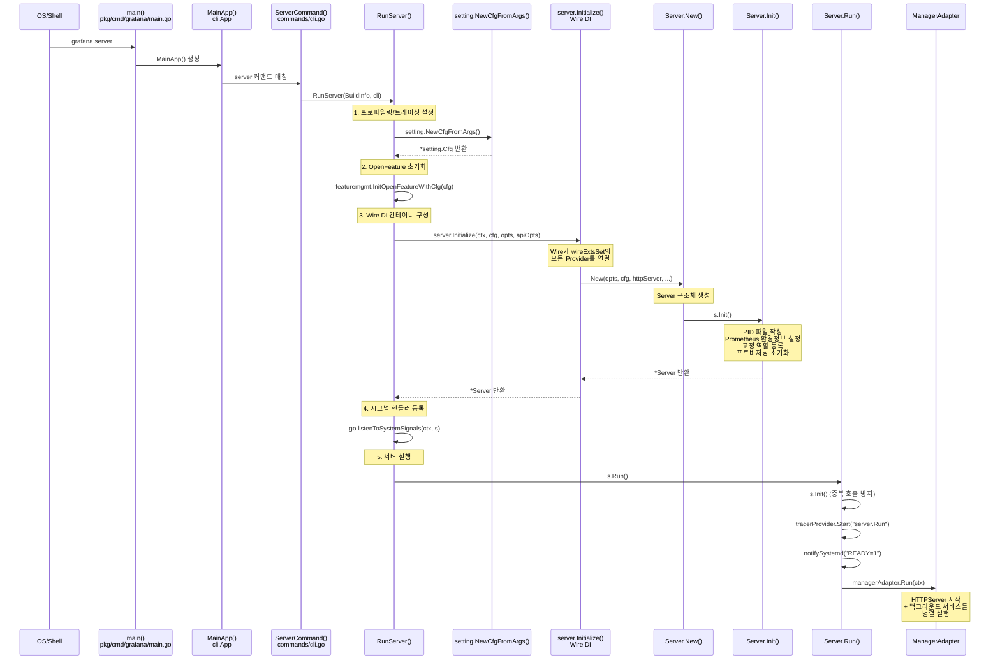
```mermaid
sequenceDiagram
    participant OS as OS/Shell
    participant Main as main()<br/>pkg/cmd/grafana/main.go
    participant App as MainApp()<br/>cli.App
    participant Cmd as ServerCommand()<br/>commands/cli.go
    participant Run as RunServer()
    participant Cfg as setting.NewCfgFromArgs()
    participant Wire as server.Initialize()<br/>Wire DI
    participant Server as Server.New()
    participant Init as Server.Init()
    participant SrvRun as Server.Run()
    participant Mgr as ManagerAdapter

    OS->>Main: grafana server
    Main->>App: MainApp() 생성
    App->>Cmd: server 커맨드 매칭
    Cmd->>Run: RunServer(BuildInfo, cli)

    Note over Run: 1. 프로파일링/트레이싱 설정
    Run->>Cfg: setting.NewCfgFromArgs()
    Cfg-->>Run: *setting.Cfg 반환

    Note over Run: 2. OpenFeature 초기화
    Run->>Run: featuremgmt.InitOpenFeatureWithCfg(cfg)

    Note over Run: 3. Wire DI 컨테이너 구성
    Run->>Wire: server.Initialize(ctx, cfg, opts, apiOpts)

    Note over Wire: Wire가 wireExtsSet의<br/>모든 Provider를 연결
    Wire->>Server: New(opts, cfg, httpServer, ...)

    Note over Server: Server 구조체 생성
    Server->>Init: s.Init()

    Note over Init: PID 파일 작성<br/>Prometheus 환경정보 설정<br/>고정 역할 등록<br/>프로비저닝 초기화
    Init-->>Wire: *Server 반환
    Wire-->>Run: *Server 반환

    Note over Run: 4. 시그널 핸들러 등록
    Run->>Run: go listenToSystemSignals(ctx, s)

    Note over Run: 5. 서버 실행
    Run->>SrvRun: s.Run()
    SrvRun->>SrvRun: s.Init() (중복 호출 방지)
    SrvRun->>SrvRun: tracerProvider.Start("server.Run")
    SrvRun->>SrvRun: notifySystemd("READY=1")
    SrvRun->>Mgr: managerAdapter.Run(ctx)

    Note over Mgr: HTTPServer 시작<br/>+ 백그라운드 서비스들<br/>병렬 실행
```

### 1.2 핵심 코드 경로

| 단계 | 파일 | 함수 |
|------|------|------|
| CLI 진입점 | `pkg/cmd/grafana/main.go` | `main()`, `MainApp()` |
| 서버 커맨드 | `pkg/cmd/grafana-server/commands/cli.go` | `ServerCommand()`, `RunServer()` |
| 설정 로드 | `pkg/setting/` | `NewCfgFromArgs()` |
| Wire DI | `pkg/server/wire.go` | `Initialize()`, `wireBasicSet`, `wireSet` |
| 서버 생성 | `pkg/server/server.go` | `New()`, `newServer()` |
| 초기화 | `pkg/server/server.go` | `Init()` |
| 실행 | `pkg/server/server.go` | `Run()` |

### 1.3 Wire DI 컨테이너 구조

`server.Initialize()` 호출 시 Wire가 `wireExtsSet`에 정의된 수백 개의 Provider를 해석하여
의존성 그래프를 구성한다. `wireBasicSet`에 포함된 주요 서비스는 다음과 같다.

```
wireBasicSet
├── api.ProvideHTTPServer          -- HTTP 서버
├── query.ProvideService           -- 쿼리 서비스
├── bus.ProvideBus                 -- 이벤트 버스
├── rendering.ProvideService       -- 렌더링
├── routing.ProvideRegister        -- 라우팅
├── pluginsintegration.WireSet     -- 플러그인 통합
├── tracing.ProvideService         -- 트레이싱
├── ngalert.ProvideService         -- 알림
├── authnimpl.ProvideService       -- 인증
├── dashboardservice.ProvideDashboardService -- 대시보드
├── datasourceservice.ProvideService        -- 데이터소스
├── featuremgmt.ProvideToggles     -- 피처 토글
└── grafanaapiserver.WireSet       -- K8s API 서버
```

### 1.4 시그널 처리

`listenToSystemSignals()` 함수는 별도 고루틴에서 OS 시그널을 수신한다.

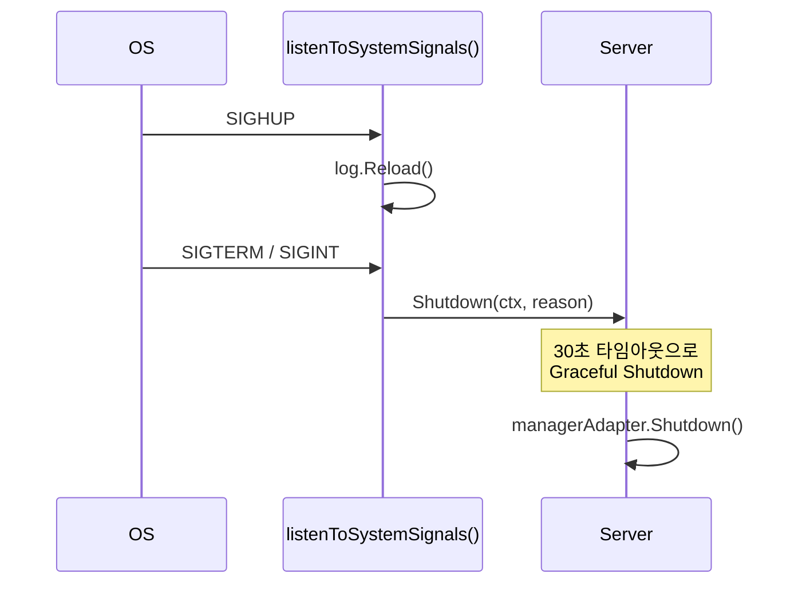
```mermaid
sequenceDiagram
    participant OS as OS
    participant Sig as listenToSystemSignals()
    participant Server as Server

    OS->>Sig: SIGHUP
    Sig->>Sig: log.Reload()

    OS->>Sig: SIGTERM / SIGINT
    Sig->>Server: Shutdown(ctx, reason)
    Note over Server: 30초 타임아웃으로<br/>Graceful Shutdown
    Server->>Server: managerAdapter.Shutdown()
```

---

## 2. 대시보드 로딩 흐름

브라우저에서 대시보드를 열면 `GET /api/dashboards/uid/:uid` API가 호출된다.
이 요청은 다수의 미들웨어 체인을 통과한 뒤 `HTTPServer.GetDashboard()` 핸들러에 도달한다.

### 2.1 미들웨어 체인

Grafana의 HTTP 미들웨어는 `pkg/api/http_server.go`의 `addMiddlewaresAndStaticRoutes()`에서 등록된다.
요청은 다음 순서로 미들웨어를 통과한다.

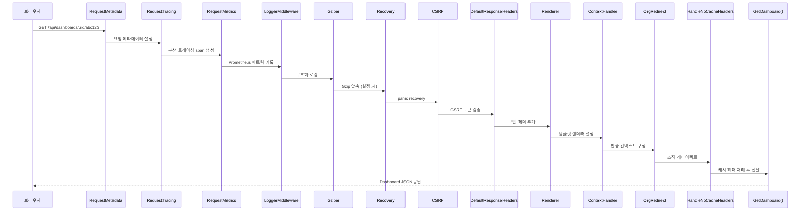
```mermaid
sequenceDiagram
    participant Browser as 브라우저
    participant MW1 as RequestMetadata
    participant MW2 as RequestTracing
    participant MW3 as RequestMetrics
    participant MW4 as LoggerMiddleware
    participant MW5 as Gziper
    participant MW6 as Recovery
    participant MW7 as CSRF
    participant MW8 as DefaultResponseHeaders
    participant MW9 as Renderer
    participant MW10 as ContextHandler
    participant MW11 as OrgRedirect
    participant MW12 as HandleNoCacheHeaders
    participant Handler as GetDashboard()

    Browser->>MW1: GET /api/dashboards/uid/abc123
    MW1->>MW2: 요청 메타데이터 설정
    MW2->>MW3: 분산 트레이싱 span 생성
    MW3->>MW4: Prometheus 메트릭 기록
    MW4->>MW5: 구조화 로깅
    MW5->>MW6: Gzip 압축 (설정 시)
    MW6->>MW7: panic recovery
    MW7->>MW8: CSRF 토큰 검증
    MW8->>MW9: 보안 헤더 추가
    MW9->>MW10: 템플릿 렌더러 설정
    MW10->>MW11: 인증 컨텍스트 구성
    MW11->>MW12: 조직 리다이렉트
    MW12->>Handler: 캐시 헤더 처리 후 전달

    Handler-->>Browser: Dashboard JSON 응답
```

### 2.2 미들웨어 등록 코드

`pkg/api/http_server.go:668` `addMiddlewaresAndStaticRoutes()`에서 등록되는 순서:

```go
m.Use(requestmeta.SetupRequestMetadata())           // 요청 메타데이터
m.Use(middleware.RequestTracing(hs.tracer, ...))     // 트레이싱
m.Use(middleware.RequestMetrics(hs.Features, ...))   // 메트릭
m.UseMiddleware(hs.LoggerMiddleware.Middleware())     // 로거
m.UseMiddleware(middleware.Gziper())                  // Gzip (설정 시)
m.UseMiddleware(middleware.Recovery(hs.Cfg, ...))     // Recovery
m.UseMiddleware(hs.Csrf.Middleware())                 // CSRF
m.Use(middleware.AddDefaultResponseHeaders(hs.Cfg))   // 보안 헤더
m.UseMiddleware(web.Renderer(...))                    // 렌더러
m.UseMiddleware(hs.ContextHandler.Middleware)          // 컨텍스트 핸들러
m.Use(middleware.OrgRedirect(hs.Cfg, ...))            // 조직 리다이렉트
m.Use(middleware.HandleNoCacheHeaders)                 // 캐시 헤더
```

### 2.3 GetDashboard 핸들러 상세 흐름

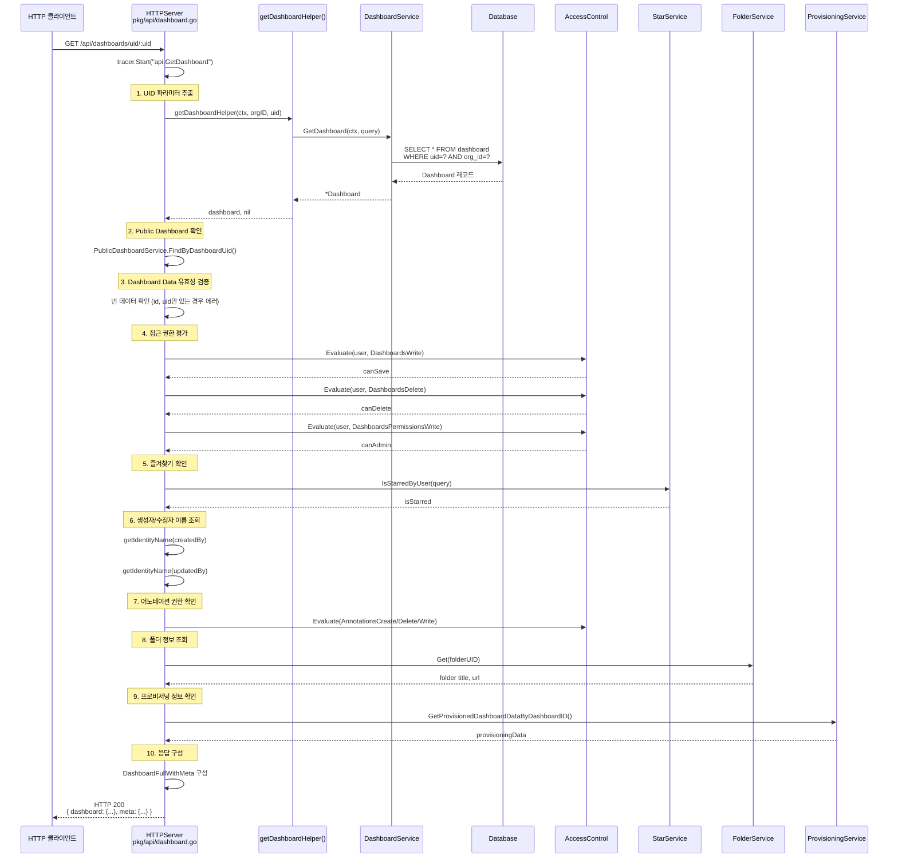
```mermaid
sequenceDiagram
    participant Client as HTTP 클라이언트
    participant HS as HTTPServer<br/>pkg/api/dashboard.go
    participant Helper as getDashboardHelper()
    participant DashSvc as DashboardService
    participant DB as Database
    participant AC as AccessControl
    participant Star as StarService
    participant Folder as FolderService
    participant Prov as ProvisioningService

    Client->>HS: GET /api/dashboards/uid/:uid
    HS->>HS: tracer.Start("api.GetDashboard")

    Note over HS: 1. UID 파라미터 추출
    HS->>Helper: getDashboardHelper(ctx, orgID, uid)
    Helper->>DashSvc: GetDashboard(ctx, query)
    DashSvc->>DB: SELECT * FROM dashboard<br/>WHERE uid=? AND org_id=?
    DB-->>DashSvc: Dashboard 레코드
    DashSvc-->>Helper: *Dashboard
    Helper-->>HS: dashboard, nil

    Note over HS: 2. Public Dashboard 확인
    HS->>HS: PublicDashboardService.FindByDashboardUid()

    Note over HS: 3. Dashboard Data 유효성 검증
    HS->>HS: 빈 데이터 확인 (id, uid만 있는 경우 에러)

    Note over HS: 4. 접근 권한 평가
    HS->>AC: Evaluate(user, DashboardsWrite)
    AC-->>HS: canSave
    HS->>AC: Evaluate(user, DashboardsDelete)
    AC-->>HS: canDelete
    HS->>AC: Evaluate(user, DashboardsPermissionsWrite)
    AC-->>HS: canAdmin

    Note over HS: 5. 즐겨찾기 확인
    HS->>Star: IsStarredByUser(query)
    Star-->>HS: isStarred

    Note over HS: 6. 생성자/수정자 이름 조회
    HS->>HS: getIdentityName(createdBy)
    HS->>HS: getIdentityName(updatedBy)

    Note over HS: 7. 어노테이션 권한 확인
    HS->>AC: Evaluate(AnnotationsCreate/Delete/Write)

    Note over HS: 8. 폴더 정보 조회
    HS->>Folder: Get(folderUID)
    Folder-->>HS: folder title, url

    Note over HS: 9. 프로비저닝 정보 확인
    HS->>Prov: GetProvisionedDashboardDataByDashboardID()
    Prov-->>HS: provisioningData

    Note over HS: 10. 응답 구성
    HS->>HS: DashboardFullWithMeta 구성

    HS-->>Client: HTTP 200<br/>{ dashboard: {...}, meta: {...} }
```

### 2.4 응답 구조

응답 JSON은 `dtos.DashboardFullWithMeta` 구조체로 구성된다:

```
{
  "dashboard": {                    // 대시보드 스펙 (패널, 변수, 어노테이션 포함)
    "id": 1,
    "uid": "abc123",
    "title": "My Dashboard",
    "panels": [...],
    "templating": { "list": [...] },
    "annotations": { "list": [...] },
    "version": 5
  },
  "meta": {                         // 메타데이터
    "isStarred": false,
    "slug": "my-dashboard",
    "canSave": true,
    "canEdit": true,
    "canAdmin": false,
    "canDelete": true,
    "created": "2024-01-01T00:00:00Z",
    "updated": "2024-01-02T00:00:00Z",
    "createdBy": "admin",
    "updatedBy": "admin",
    "version": 5,
    "folderUid": "folder-uid",
    "folderTitle": "My Folder",
    "provisioned": false,
    "publicDashboardEnabled": false
  }
}
```

---

## 3. 대시보드 저장 흐름

대시보드 저장은 `POST /api/dashboards/db` 엔드포인트를 통해 수행된다.
핸들러는 `HTTPServer.PostDashboard()`이며, 유효성 검증, 권한 확인, 버전 충돌 체크 등
다단계 파이프라인을 거친다.

### 3.1 전체 저장 시퀀스

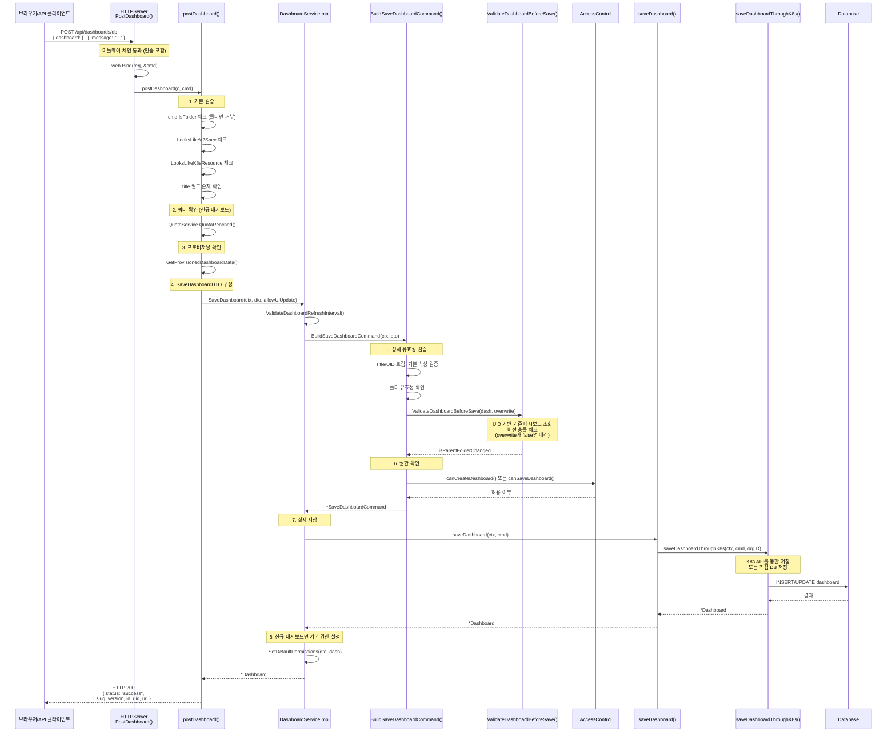
```mermaid
sequenceDiagram
    participant Client as 브라우저/API 클라이언트
    participant HS as HTTPServer<br/>PostDashboard()
    participant Post as postDashboard()
    participant DashSvc as DashboardServiceImpl
    participant Build as BuildSaveDashboardCommand()
    participant Valid as ValidateDashboardBeforeSave()
    participant AC as AccessControl
    participant Save as saveDashboard()
    participant K8s as saveDashboardThroughK8s()
    participant DB as Database

    Client->>HS: POST /api/dashboards/db<br/>{ dashboard: {...}, message: "..." }

    Note over HS: 미들웨어 체인 통과 (인증 포함)

    HS->>HS: web.Bind(req, &cmd)
    HS->>Post: postDashboard(c, cmd)

    Note over Post: 1. 기본 검증
    Post->>Post: cmd.IsFolder 체크 (폴더면 거부)
    Post->>Post: LooksLikeV2Spec 체크
    Post->>Post: LooksLikeK8sResource 체크
    Post->>Post: title 필드 존재 확인

    Note over Post: 2. 쿼터 확인 (신규 대시보드)
    Post->>Post: QuotaService.QuotaReached()

    Note over Post: 3. 프로비저닝 확인
    Post->>Post: GetProvisionedDashboardData()

    Note over Post: 4. SaveDashboardDTO 구성
    Post->>DashSvc: SaveDashboard(ctx, dto, allowUiUpdate)

    DashSvc->>DashSvc: ValidateDashboardRefreshInterval()
    DashSvc->>Build: BuildSaveDashboardCommand(ctx, dto)

    Note over Build: 5. 상세 유효성 검증
    Build->>Build: Title/UID 트림, 기본 속성 검증
    Build->>Build: 폴더 유효성 확인

    Build->>Valid: ValidateDashboardBeforeSave(dash, overwrite)
    Note over Valid: UID 기반 기존 대시보드 조회<br/>버전 충돌 체크<br/>(overwrite가 false면 에러)
    Valid-->>Build: isParentFolderChanged

    Note over Build: 6. 권한 확인
    Build->>AC: canCreateDashboard() 또는 canSaveDashboard()
    AC-->>Build: 허용 여부

    Build-->>DashSvc: *SaveDashboardCommand

    Note over DashSvc: 7. 실제 저장
    DashSvc->>Save: saveDashboard(ctx, cmd)
    Save->>K8s: saveDashboardThroughK8s(ctx, cmd, orgID)

    Note over K8s: K8s API를 통한 저장<br/>또는 직접 DB 저장
    K8s->>DB: INSERT/UPDATE dashboard
    DB-->>K8s: 결과
    K8s-->>Save: *Dashboard
    Save-->>DashSvc: *Dashboard

    Note over DashSvc: 8. 신규 대시보드면 기본 권한 설정
    DashSvc->>DashSvc: SetDefaultPermissions(dto, dash)
    DashSvc-->>Post: *Dashboard

    Post-->>Client: HTTP 200<br/>{ status: "success",<br/>  slug, version, id, uid, url }
```

### 3.2 BuildSaveDashboardCommand 상세

`pkg/services/dashboards/service/dashboard_service.go:681`에서 수행하는 검증 단계:

| 순서 | 검증 항목 | 실패 시 에러 |
|------|----------|------------|
| 1 | Title/UID 트림 및 기본 속성 검증 | `ValidateBasicDashboardProperties` 에러 |
| 2 | 폴더 안에 폴더 생성 불가 | `ErrDashboardFolderCannotHaveParent` |
| 3 | "General" 폴더명 중복 불가 | `ErrDashboardFolderNameExists` |
| 4 | 최소 새로고침 간격 검증 | `ValidateDashboardRefreshInterval` 에러 |
| 5 | 대상 폴더 존재 및 접근 확인 | `folderService.Get()` 에러 |
| 6 | 기존 대시보드와 버전 충돌 확인 | `ErrDashboardVersionMismatch` |
| 7 | 생성/수정 권한 확인 | `ErrDashboardUpdateAccessDenied` |

### 3.3 버전 충돌 처리

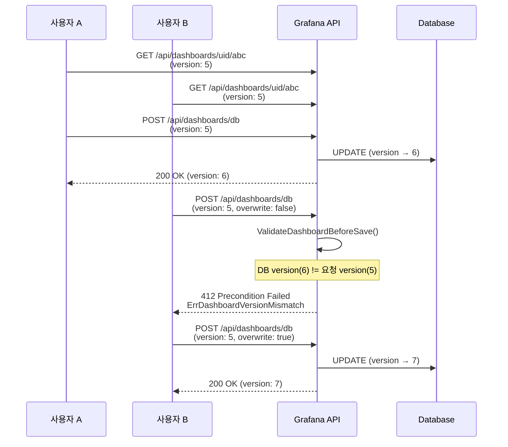
```mermaid
sequenceDiagram
    participant User1 as 사용자 A
    participant User2 as 사용자 B
    participant API as Grafana API
    participant DB as Database

    User1->>API: GET /api/dashboards/uid/abc<br/>(version: 5)
    User2->>API: GET /api/dashboards/uid/abc<br/>(version: 5)

    User1->>API: POST /api/dashboards/db<br/>(version: 5)
    API->>DB: UPDATE (version → 6)
    API-->>User1: 200 OK (version: 6)

    User2->>API: POST /api/dashboards/db<br/>(version: 5, overwrite: false)
    API->>API: ValidateDashboardBeforeSave()
    Note over API: DB version(6) != 요청 version(5)
    API-->>User2: 412 Precondition Failed<br/>ErrDashboardVersionMismatch

    User2->>API: POST /api/dashboards/db<br/>(version: 5, overwrite: true)
    API->>DB: UPDATE (version → 7)
    API-->>User2: 200 OK (version: 7)
```

---

## 4. 쿼리 실행 흐름

대시보드 패널이 데이터를 표시하려면 데이터소스에 쿼리를 실행해야 한다.
프론트엔드는 `POST /api/ds/query` 엔드포인트를 호출하고,
백엔드는 플러그인 미들웨어 스택을 통해 데이터소스 플러그인에 쿼리를 전달한다.

### 4.1 전체 쿼리 시퀀스

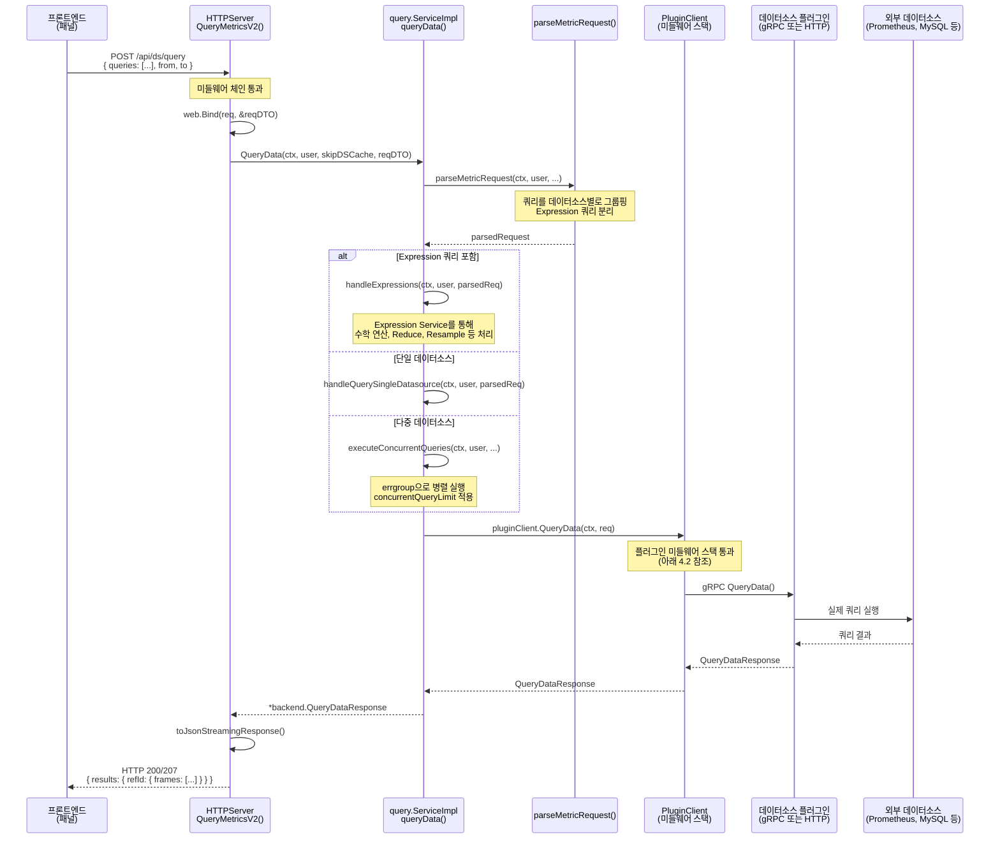
```mermaid
sequenceDiagram
    participant FE as 프론트엔드<br/>(패널)
    participant API as HTTPServer<br/>QueryMetricsV2()
    participant QS as query.ServiceImpl<br/>queryData()
    participant Parse as parseMetricRequest()
    participant PC as PluginClient<br/>(미들웨어 스택)
    participant Plugin as 데이터소스 플러그인<br/>(gRPC 또는 HTTP)
    participant DS as 외부 데이터소스<br/>(Prometheus, MySQL 등)

    FE->>API: POST /api/ds/query<br/>{ queries: [...], from, to }

    Note over API: 미들웨어 체인 통과

    API->>API: web.Bind(req, &reqDTO)
    API->>QS: QueryData(ctx, user, skipDSCache, reqDTO)

    QS->>Parse: parseMetricRequest(ctx, user, ...)
    Note over Parse: 쿼리를 데이터소스별로 그룹핑<br/>Expression 쿼리 분리
    Parse-->>QS: parsedRequest

    alt Expression 쿼리 포함
        QS->>QS: handleExpressions(ctx, user, parsedReq)
        Note over QS: Expression Service를 통해<br/>수학 연산, Reduce, Resample 등 처리
    else 단일 데이터소스
        QS->>QS: handleQuerySingleDatasource(ctx, user, parsedReq)
    else 다중 데이터소스
        QS->>QS: executeConcurrentQueries(ctx, user, ...)
        Note over QS: errgroup으로 병렬 실행<br/>concurrentQueryLimit 적용
    end

    QS->>PC: pluginClient.QueryData(ctx, req)

    Note over PC: 플러그인 미들웨어 스택 통과<br/>(아래 4.2 참조)

    PC->>Plugin: gRPC QueryData()
    Plugin->>DS: 실제 쿼리 실행
    DS-->>Plugin: 쿼리 결과
    Plugin-->>PC: QueryDataResponse
    PC-->>QS: QueryDataResponse

    QS-->>API: *backend.QueryDataResponse
    API->>API: toJsonStreamingResponse()
    API-->>FE: HTTP 200/207<br/>{ results: { refId: { frames: [...] } } }
```

### 4.2 플러그인 클라이언트 미들웨어 스택

`pkg/services/pluginsintegration/pluginsintegration.go:189`의 `CreateMiddlewares()`에서 구성된다.
요청은 위에서 아래로 미들웨어를 통과하고, 응답은 역순으로 올라온다.

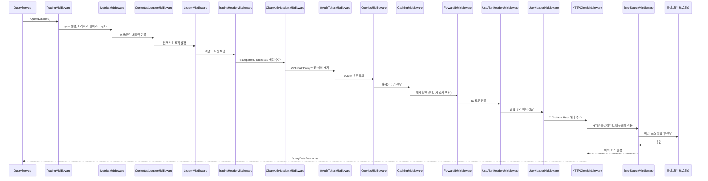
```mermaid
sequenceDiagram
    participant Caller as QueryService
    participant M1 as TracingMiddleware
    participant M2 as MetricsMiddleware
    participant M3 as ContextualLoggerMiddleware
    participant M4 as LoggerMiddleware
    participant M5 as TracingHeaderMiddleware
    participant M6 as ClearAuthHeadersMiddleware
    participant M7 as OAuthTokenMiddleware
    participant M8 as CookiesMiddleware
    participant M9 as CachingMiddleware
    participant M10 as ForwardIDMiddleware
    participant M11 as UseAlertHeadersMiddleware
    participant M12 as UserHeaderMiddleware
    participant M13 as HTTPClientMiddleware
    participant M14 as ErrorSourceMiddleware
    participant Plugin as 플러그인 프로세스

    Caller->>M1: QueryData(req)
    M1->>M2: span 생성, 트레이스 컨텍스트 전파
    M2->>M3: 요청/응답 메트릭 기록
    M3->>M4: 컨텍스트 로거 설정
    M4->>M5: 백엔드 요청 로깅
    M5->>M6: traceparent, tracestate 헤더 추가
    M6->>M7: JWT/AuthProxy 인증 헤더 제거
    M7->>M8: OAuth 토큰 주입
    M8->>M9: 허용된 쿠키 전달
    M9->>M10: 캐시 확인 (히트 시 조기 반환)
    M10->>M11: ID 토큰 전달
    M11->>M12: 알림 평가 헤더 전달
    M12->>M13: X-Grafana-User 헤더 추가
    M13->>M14: HTTP 클라이언트 미들웨어 적용
    M14->>Plugin: 에러 소스 설정 후 전달

    Plugin-->>M14: 응답
    M14-->>M13: 에러 소스 결정
    M13-->>Caller: QueryDataResponse
```

### 4.3 미들웨어별 역할 상세

| 미들웨어 | 파일 | 역할 |
|---------|------|------|
| TracingMiddleware | `tracing_middleware.go` | OpenTelemetry span 생성, 플러그인 ID/데이터소스 UID 속성 |
| MetricsMiddleware | `metrics_middleware.go` | 요청 수, 응답 시간, 에러율 Prometheus 메트릭 |
| ContextualLoggerMiddleware | `contextual_logger_middleware.go` | 요청별 컨텍스트 로거 설정 |
| LoggerMiddleware | `logger_middleware.go` | 백엔드 요청/응답 로깅 (설정 시) |
| TracingHeaderMiddleware | `tracing_header_middleware.go` | W3C Trace Context 헤더 전파 |
| ClearAuthHeadersMiddleware | `clear_auth_headers_middleware.go` | JWT/AuthProxy 내부 헤더 제거 |
| OAuthTokenMiddleware | `oauthtoken_middleware.go` | OAuth2 액세스 토큰 주입 |
| CookiesMiddleware | `cookies_middleware.go` | 로그인 쿠키 제외 후 전달 |
| CachingMiddleware | `caching_middleware.go` | 쿼리 결과 캐시 (Enterprise) |
| ForwardIDMiddleware | `forward_id_middleware.go` | ID 토큰 전달 |
| UseAlertHeadersMiddleware | `usealertingheaders_middleware.go` | 알림 평가 시 특수 헤더 |
| UserHeaderMiddleware | `user_header_middleware.go` | X-Grafana-User 헤더 |
| HTTPClientMiddleware | `httpclient_middleware.go` | HTTP 전송 계층 미들웨어 |
| ErrorSourceMiddleware | SDK `error_source_middleware.go` | 에러 소스(plugin/downstream) 구분 |

### 4.4 병렬 쿼리 실행

하나의 대시보드에 여러 데이터소스 패널이 있으면 `executeConcurrentQueries()`가
`errgroup`을 사용하여 병렬로 쿼리를 실행한다.

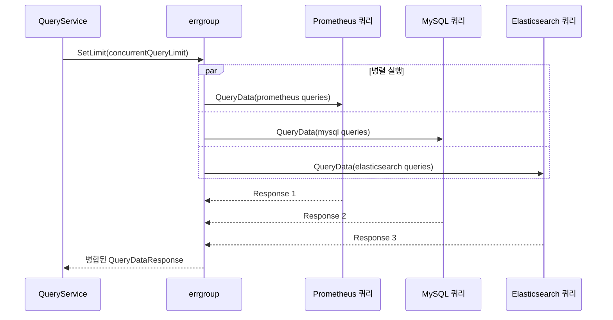
```mermaid
sequenceDiagram
    participant QS as QueryService
    participant G as errgroup
    participant DS1 as Prometheus 쿼리
    participant DS2 as MySQL 쿼리
    participant DS3 as Elasticsearch 쿼리

    QS->>G: SetLimit(concurrentQueryLimit)

    par 병렬 실행
        G->>DS1: QueryData(prometheus queries)
    and
        G->>DS2: QueryData(mysql queries)
    and
        G->>DS3: QueryData(elasticsearch queries)
    end

    DS1-->>G: Response 1
    DS2-->>G: Response 2
    DS3-->>G: Response 3

    G-->>QS: 병합된 QueryDataResponse
```

`concurrentQueryLimit`은 `[query] concurrent_query_limit` 설정으로 제어되며,
기본값은 `runtime.NumCPU()`이다.

### 4.5 쿼리 요청 헤더

쿼리 서비스는 디버깅과 라우팅을 위해 다음 헤더를 전파한다:

| 헤더 | 용도 |
|------|------|
| `X-Plugin-Id` | 라우팅/부하 분산 |
| `X-Datasource-Uid` | 라우팅/부하 분산 |
| `X-Dashboard-Uid` | 느린 쿼리 디버깅 |
| `X-Panel-Id` | 느린 쿼리 디버깅 |
| `X-Dashboard-Title` | 부하가 큰 대시보드 식별 |
| `X-Panel-Title` | 부하가 큰 패널 식별 |
| `X-Query-Group-Id` | 쿼리 청킹 시 관련 쿼리 그룹 식별 |
| `X-Grafana-From-Expr` | Expression 쿼리 식별 |

---

## 5. 알림 평가 흐름

Grafana Alerting(Unified Alerting)은 스케줄러 기반으로 동작한다.
기본 10초 간격의 틱(tick)마다 모든 알림 규칙을 확인하고,
실행 주기가 도래한 규칙의 쿼리를 실행하여 상태 전이를 판단한다.

### 5.1 스케줄러 루프

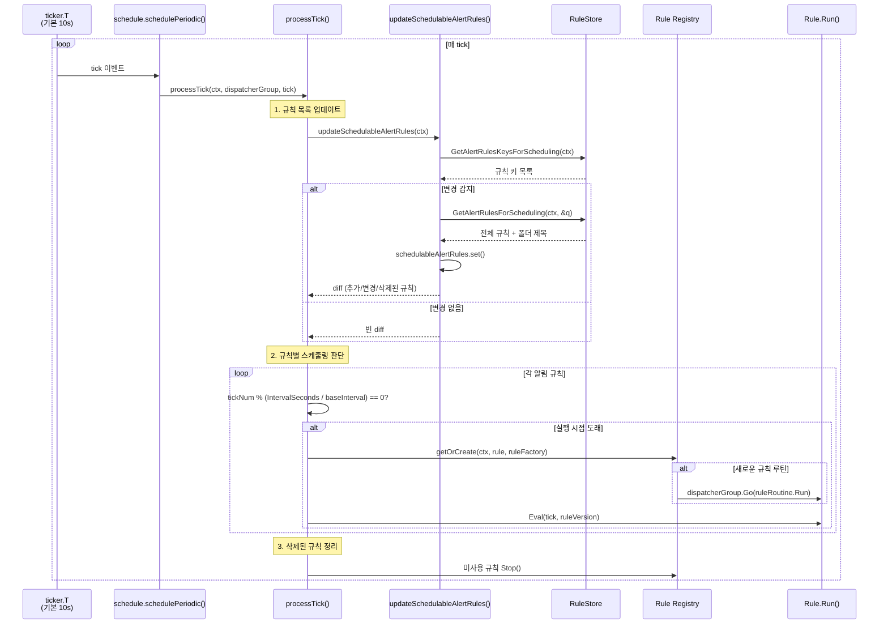
```mermaid
sequenceDiagram
    participant Ticker as ticker.T<br/>(기본 10s)
    participant Sched as schedule.schedulePeriodic()
    participant Tick as processTick()
    participant Fetch as updateSchedulableAlertRules()
    participant Store as RuleStore
    participant Registry as Rule Registry
    participant Rule as Rule.Run()

    loop 매 tick
        Ticker->>Sched: tick 이벤트

        Sched->>Tick: processTick(ctx, dispatcherGroup, tick)

        Note over Tick: 1. 규칙 목록 업데이트
        Tick->>Fetch: updateSchedulableAlertRules(ctx)
        Fetch->>Store: GetAlertRulesKeysForScheduling(ctx)
        Store-->>Fetch: 규칙 키 목록

        alt 변경 감지
            Fetch->>Store: GetAlertRulesForScheduling(ctx, &q)
            Store-->>Fetch: 전체 규칙 + 폴더 제목
            Fetch->>Fetch: schedulableAlertRules.set()
            Fetch-->>Tick: diff (추가/변경/삭제된 규칙)
        else 변경 없음
            Fetch-->>Tick: 빈 diff
        end

        Note over Tick: 2. 규칙별 스케줄링 판단
        loop 각 알림 규칙
            Tick->>Tick: tickNum % (IntervalSeconds / baseInterval) == 0?

            alt 실행 시점 도래
                Tick->>Registry: getOrCreate(ctx, rule, ruleFactory)

                alt 새로운 규칙 루틴
                    Registry->>Rule: dispatcherGroup.Go(ruleRoutine.Run)
                end

                Tick->>Rule: Eval(tick, ruleVersion)
            end
        end

        Note over Tick: 3. 삭제된 규칙 정리
        Tick->>Registry: 미사용 규칙 Stop()
    end
```

### 5.2 알림 규칙 평가 상세

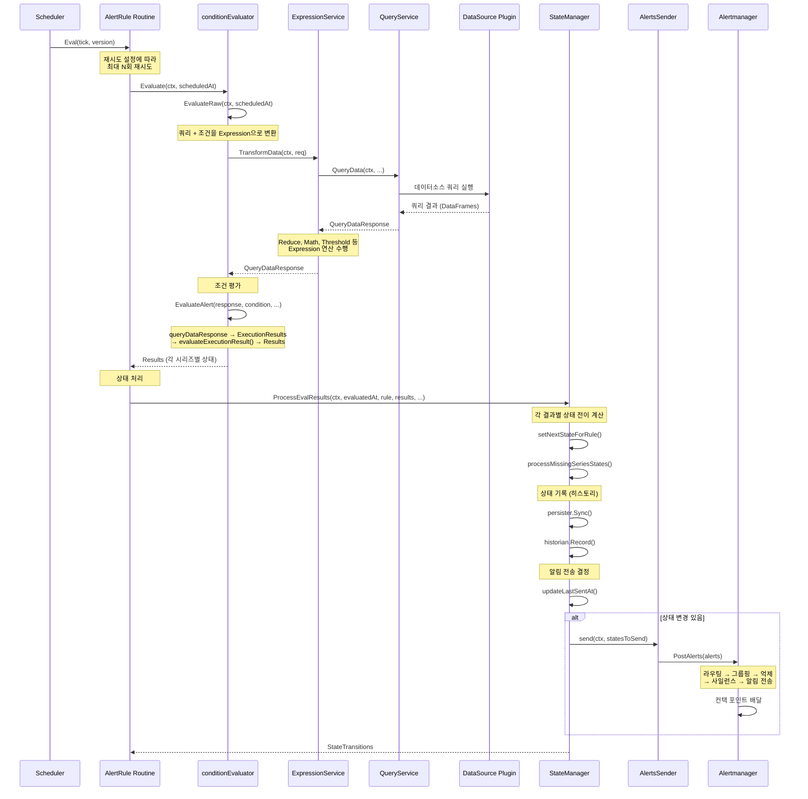
```mermaid
sequenceDiagram
    participant Sched as Scheduler
    participant Rule as AlertRule Routine
    participant Eval as conditionEvaluator
    participant Expr as ExpressionService
    participant QS as QueryService
    participant DS as DataSource Plugin
    participant SM as StateManager
    participant Sender as AlertsSender
    participant AM as Alertmanager

    Sched->>Rule: Eval(tick, version)

    Note over Rule: 재시도 설정에 따라<br/>최대 N회 재시도

    Rule->>Eval: Evaluate(ctx, scheduledAt)
    Eval->>Eval: EvaluateRaw(ctx, scheduledAt)

    Note over Eval: 쿼리 + 조건을 Expression으로 변환
    Eval->>Expr: TransformData(ctx, req)
    Expr->>QS: QueryData(ctx, ...)
    QS->>DS: 데이터소스 쿼리 실행
    DS-->>QS: 쿼리 결과 (DataFrames)
    QS-->>Expr: QueryDataResponse

    Note over Expr: Reduce, Math, Threshold 등<br/>Expression 연산 수행
    Expr-->>Eval: QueryDataResponse

    Note over Eval: 조건 평가
    Eval->>Eval: EvaluateAlert(response, condition, ...)

    Note over Eval: queryDataResponse → ExecutionResults<br/>→ evaluateExecutionResult() → Results

    Eval-->>Rule: Results (각 시리즈별 상태)

    Note over Rule: 상태 처리
    Rule->>SM: ProcessEvalResults(ctx, evaluatedAt, rule, results, ...)

    Note over SM: 각 결과별 상태 전이 계산
    SM->>SM: setNextStateForRule()
    SM->>SM: processMissingSeriesStates()

    Note over SM: 상태 기록 (히스토리)
    SM->>SM: persister.Sync()
    SM->>SM: historian.Record()

    Note over SM: 알림 전송 결정
    SM->>SM: updateLastSentAt()

    alt 상태 변경 있음
        SM->>Sender: send(ctx, statesToSend)
        Sender->>AM: PostAlerts(alerts)

        Note over AM: 라우팅 → 그룹핑 → 억제<br/>→ 사일런스 → 알림 전송
        AM->>AM: 컨택 포인트 배달
    end

    SM-->>Rule: StateTransitions
```

### 5.3 상태 전이 다이어그램

알림 규칙의 각 시리즈(레이블 셋)는 다음 상태 중 하나를 가진다:

```
                 ┌─────────┐
                 │  Normal  │
                 └────┬─────┘
                      │ 조건 충족
                      ▼
                ┌──────────┐
      ┌────────►│  Pending  │ (For 기간 대기)
      │         └─────┬─────┘
      │               │ For 기간 경과
      │               ▼
      │         ┌──────────┐
      │         │  Alerting │───────► Alertmanager
      │         └─────┬─────┘
      │               │ 조건 미충족
      │               ▼
      │         ┌──────────┐
      └─────────│  Normal   │
                └──────────┘

                ┌──────────┐
                │  NoData   │ 데이터 없음
                └──────────┘
                ┌──────────┐
                │   Error   │ 쿼리 실행 에러
                └──────────┘
```

### 5.4 핵심 코드 경로

| 컴포넌트 | 파일 | 함수 |
|---------|------|------|
| 스케줄러 루프 | `pkg/services/ngalert/schedule/schedule.go` | `schedulePeriodic()`, `processTick()` |
| 규칙 업데이트 | `pkg/services/ngalert/schedule/fetcher.go` | `updateSchedulableAlertRules()` |
| 조건 평가 | `pkg/services/ngalert/eval/eval.go` | `Evaluate()`, `EvaluateAlert()` |
| 상태 관리 | `pkg/services/ngalert/state/manager.go` | `ProcessEvalResults()` |
| 알림 전송 | `pkg/services/ngalert/schedule/` | `AlertsSender` 인터페이스 |

---

## 6. 인증 흐름

Grafana의 인증은 `authn` 서비스(`pkg/services/authn/authnimpl/service.go`)가 담당한다.
클라이언트 체인 패턴을 사용하여 여러 인증 방식을 순차적으로 시도한다.

### 6.1 로그인 (폼 기반 인증)

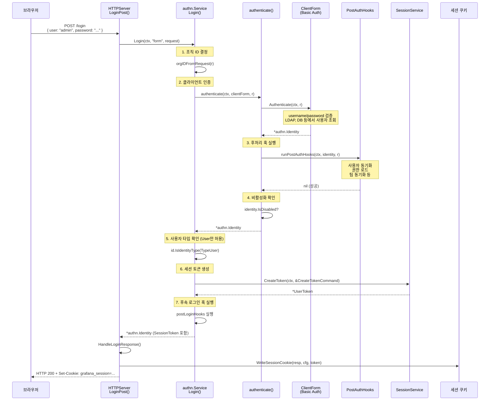
```mermaid
sequenceDiagram
    participant Browser as 브라우저
    participant API as HTTPServer<br/>LoginPost()
    participant AuthN as authn.Service<br/>Login()
    participant Auth as authenticate()
    participant Client as ClientForm<br/>(Basic Auth)
    participant Hooks as PostAuthHooks
    participant Session as SessionService
    participant Cookie as 세션 쿠키

    Browser->>API: POST /login<br/>{ user: "admin", password: "..." }

    API->>AuthN: Login(ctx, "form", request)

    Note over AuthN: 1. 조직 ID 결정
    AuthN->>AuthN: orgIDFromRequest(r)

    Note over AuthN: 2. 클라이언트 인증
    AuthN->>Auth: authenticate(ctx, clientForm, r)
    Auth->>Client: Authenticate(ctx, r)

    Note over Client: username/password 검증<br/>LDAP, DB 등에서 사용자 조회
    Client-->>Auth: *authn.Identity

    Note over Auth: 3. 후처리 훅 실행
    Auth->>Hooks: runPostAuthHooks(ctx, identity, r)
    Note over Hooks: 사용자 동기화<br/>권한 로드<br/>팀 동기화 등
    Hooks-->>Auth: nil (성공)

    Note over Auth: 4. 비활성화 확인
    Auth->>Auth: identity.IsDisabled?

    Auth-->>AuthN: *authn.Identity

    Note over AuthN: 5. 사용자 타입 확인 (User만 허용)
    AuthN->>AuthN: id.IsIdentityType(TypeUser)

    Note over AuthN: 6. 세션 토큰 생성
    AuthN->>Session: CreateToken(ctx, &CreateTokenCommand)
    Session-->>AuthN: *UserToken

    Note over AuthN: 7. 후속 로그인 훅 실행
    AuthN->>AuthN: postLoginHooks 실행

    AuthN-->>API: *authn.Identity (SessionToken 포함)

    API->>API: HandleLoginResponse()
    API->>Cookie: WriteSessionCookie(resp, cfg, token)
    API-->>Browser: HTTP 200 + Set-Cookie: grafana_session=...
```

### 6.2 요청별 인증 (세션/API 키/JWT)

대시보드 로딩 등 일반 API 요청은 `ContextHandler` 미들웨어가 `authn.Authenticate()`를 호출하여
요청의 인증 정보를 확인한다.

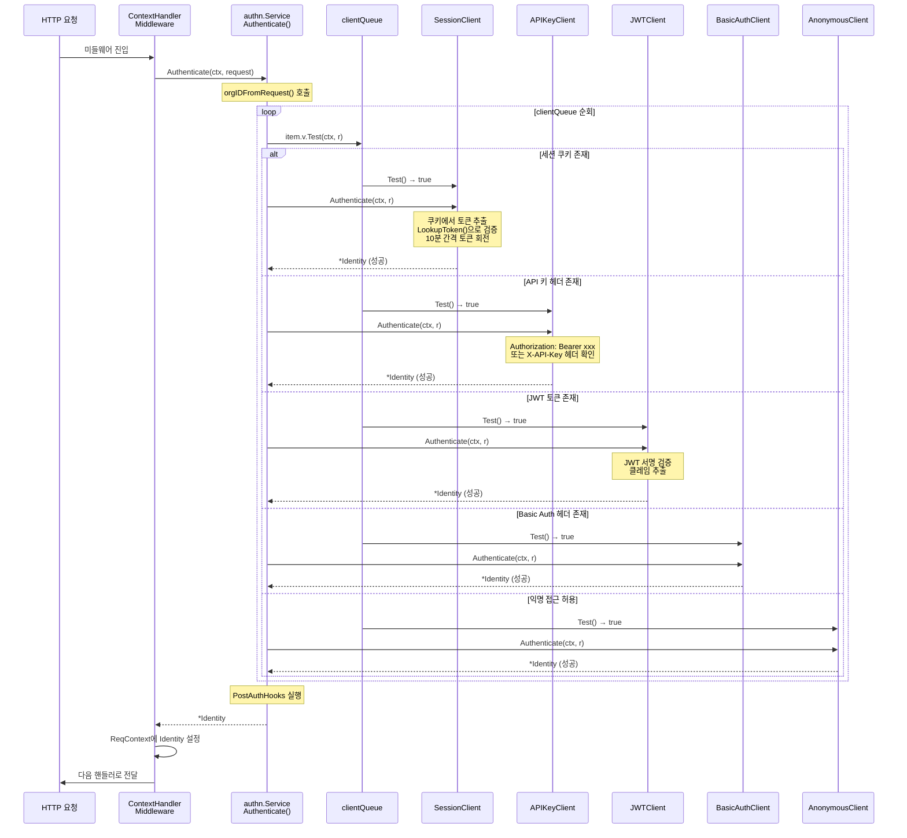
```mermaid
sequenceDiagram
    participant Req as HTTP 요청
    participant CH as ContextHandler<br/>Middleware
    participant AuthN as authn.Service<br/>Authenticate()
    participant CQ as clientQueue
    participant C1 as SessionClient
    participant C2 as APIKeyClient
    participant C3 as JWTClient
    participant C4 as BasicAuthClient
    participant C5 as AnonymousClient

    Req->>CH: 미들웨어 진입

    CH->>AuthN: Authenticate(ctx, request)

    Note over AuthN: orgIDFromRequest() 호출

    loop clientQueue 순회
        AuthN->>CQ: item.v.Test(ctx, r)

        alt 세션 쿠키 존재
            CQ->>C1: Test() → true
            AuthN->>C1: Authenticate(ctx, r)
            Note over C1: 쿠키에서 토큰 추출<br/>LookupToken()으로 검증<br/>10분 간격 토큰 회전
            C1-->>AuthN: *Identity (성공)
        else API 키 헤더 존재
            CQ->>C2: Test() → true
            AuthN->>C2: Authenticate(ctx, r)
            Note over C2: Authorization: Bearer xxx<br/>또는 X-API-Key 헤더 확인
            C2-->>AuthN: *Identity (성공)
        else JWT 토큰 존재
            CQ->>C3: Test() → true
            AuthN->>C3: Authenticate(ctx, r)
            Note over C3: JWT 서명 검증<br/>클레임 추출
            C3-->>AuthN: *Identity (성공)
        else Basic Auth 헤더 존재
            CQ->>C4: Test() → true
            AuthN->>C4: Authenticate(ctx, r)
            C4-->>AuthN: *Identity (성공)
        else 익명 접근 허용
            CQ->>C5: Test() → true
            AuthN->>C5: Authenticate(ctx, r)
            C5-->>AuthN: *Identity (성공)
        end
    end

    Note over AuthN: PostAuthHooks 실행

    AuthN-->>CH: *Identity

    CH->>CH: ReqContext에 Identity 설정
    CH->>Req: 다음 핸들러로 전달
```

### 6.3 OAuth 로그인 흐름

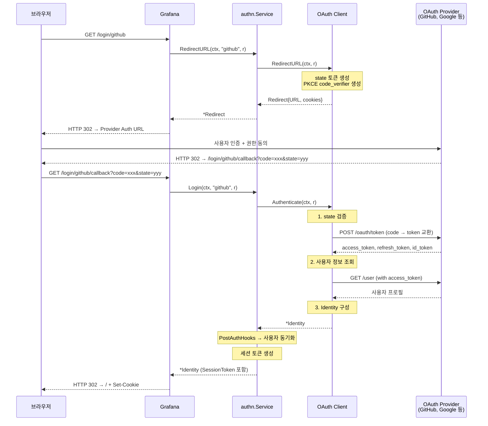
```mermaid
sequenceDiagram
    participant Browser as 브라우저
    participant API as Grafana
    participant AuthN as authn.Service
    participant OAuth as OAuth Client
    participant Provider as OAuth Provider<br/>(GitHub, Google 등)

    Browser->>API: GET /login/github
    API->>AuthN: RedirectURL(ctx, "github", r)
    AuthN->>OAuth: RedirectURL(ctx, r)

    Note over OAuth: state 토큰 생성<br/>PKCE code_verifier 생성
    OAuth-->>AuthN: Redirect{URL, cookies}
    AuthN-->>API: *Redirect
    API-->>Browser: HTTP 302 → Provider Auth URL

    Browser->>Provider: 사용자 인증 + 권한 동의
    Provider-->>Browser: HTTP 302 → /login/github/callback?code=xxx&state=yyy

    Browser->>API: GET /login/github/callback?code=xxx&state=yyy
    API->>AuthN: Login(ctx, "github", r)

    AuthN->>OAuth: Authenticate(ctx, r)

    Note over OAuth: 1. state 검증
    OAuth->>Provider: POST /oauth/token (code → token 교환)
    Provider-->>OAuth: access_token, refresh_token, id_token

    Note over OAuth: 2. 사용자 정보 조회
    OAuth->>Provider: GET /user (with access_token)
    Provider-->>OAuth: 사용자 프로필

    Note over OAuth: 3. Identity 구성
    OAuth-->>AuthN: *Identity

    Note over AuthN: PostAuthHooks → 사용자 동기화
    Note over AuthN: 세션 토큰 생성

    AuthN-->>API: *Identity (SessionToken 포함)
    API-->>Browser: HTTP 302 → / + Set-Cookie
```

### 6.4 세션 토큰 회전

Grafana는 세션 보안을 위해 주기적으로 토큰을 회전한다.

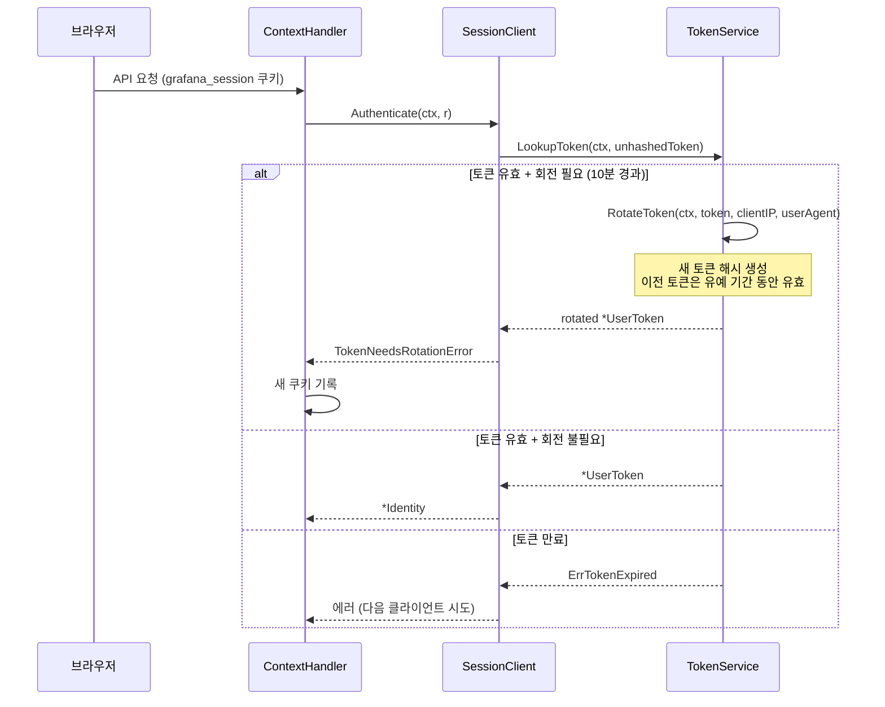
```mermaid
sequenceDiagram
    participant Browser as 브라우저
    participant CH as ContextHandler
    participant Session as SessionClient
    participant Token as TokenService

    Browser->>CH: API 요청 (grafana_session 쿠키)

    CH->>Session: Authenticate(ctx, r)
    Session->>Token: LookupToken(ctx, unhashedToken)

    alt 토큰 유효 + 회전 필요 (10분 경과)
        Token->>Token: RotateToken(ctx, token, clientIP, userAgent)
        Note over Token: 새 토큰 해시 생성<br/>이전 토큰은 유예 기간 동안 유효
        Token-->>Session: rotated *UserToken
        Session-->>CH: TokenNeedsRotationError
        CH->>CH: 새 쿠키 기록
    else 토큰 유효 + 회전 불필요
        Token-->>Session: *UserToken
        Session-->>CH: *Identity
    else 토큰 만료
        Token-->>Session: ErrTokenExpired
        Session-->>CH: 에러 (다음 클라이언트 시도)
    end
```

### 6.5 인증 클라이언트 우선순위

`authn.Service`의 `clientQueue`는 우선순위 큐로 구성되며, 다음 순서로 인증을 시도한다:

| 우선순위 | 클라이언트 | 인증 수단 |
|---------|-----------|----------|
| 1 | Render | 렌더링 서비스 키 |
| 2 | APIKey | X-API-Key / Authorization 헤더 |
| 3 | ServiceAccount | 서비스 계정 토큰 |
| 4 | JWT | JWT 토큰 (설정 시) |
| 5 | Session | grafana_session 쿠키 |
| 6 | BasicAuth | Authorization: Basic 헤더 |
| 7 | Anonymous | 익명 접근 (설정 시) |

Test() 메서드가 true를 반환하는 첫 번째 클라이언트가 인증을 시도한다.
실패하면 다음 클라이언트로 넘어간다 (단, TokenNeedsRotationError는 예외적으로 즉시 반환).

---

## 7. 플러그인 로딩 흐름

Grafana의 플러그인 로딩은 3단계 파이프라인(Discovery -> Bootstrap -> Initialization)으로 구성된다.
각 단계는 독립적인 인터페이스로 정의되어 있으며, 단계별 스텝 함수를 체인으로 실행한다.

### 7.1 전체 플러그인 로딩 파이프라인

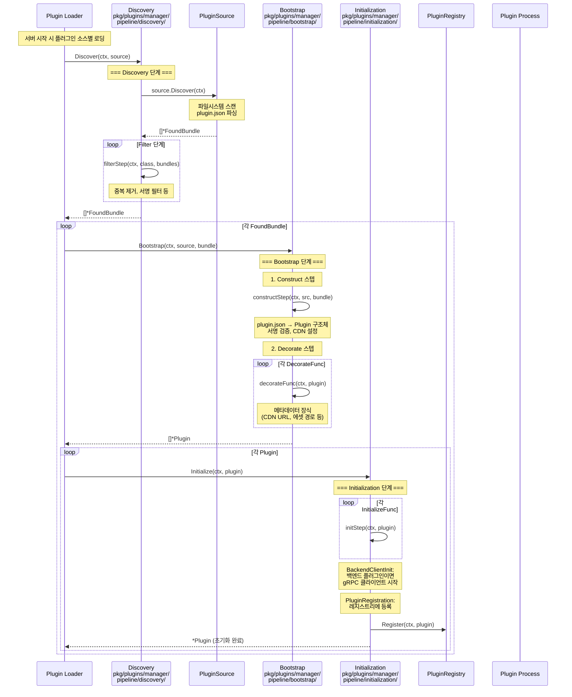
```mermaid
sequenceDiagram
    participant Loader as Plugin Loader
    participant Disc as Discovery<br/>pkg/plugins/manager/<br/>pipeline/discovery/
    participant Src as PluginSource
    participant Boot as Bootstrap<br/>pkg/plugins/manager/<br/>pipeline/bootstrap/
    participant Init as Initialization<br/>pkg/plugins/manager/<br/>pipeline/initialization/
    participant Reg as PluginRegistry
    participant Proc as Plugin Process

    Note over Loader: 서버 시작 시 플러그인 소스별 로딩

    Loader->>Disc: Discover(ctx, source)

    Note over Disc: === Discovery 단계 ===
    Disc->>Src: source.Discover(ctx)
    Note over Src: 파일시스템 스캔<br/>plugin.json 파싱
    Src-->>Disc: []*FoundBundle

    loop Filter 단계
        Disc->>Disc: filterStep(ctx, class, bundles)
        Note over Disc: 중복 제거, 서명 필터 등
    end
    Disc-->>Loader: []*FoundBundle

    loop 각 FoundBundle
        Loader->>Boot: Bootstrap(ctx, source, bundle)

        Note over Boot: === Bootstrap 단계 ===

        Note over Boot: 1. Construct 스텝
        Boot->>Boot: constructStep(ctx, src, bundle)
        Note over Boot: plugin.json → Plugin 구조체<br/>서명 검증, CDN 설정

        Note over Boot: 2. Decorate 스텝
        loop 각 DecorateFunc
            Boot->>Boot: decorateFunc(ctx, plugin)
            Note over Boot: 메타데이터 장식<br/>(CDN URL, 에셋 경로 등)
        end
        Boot-->>Loader: []*Plugin

        loop 각 Plugin
            Loader->>Init: Initialize(ctx, plugin)

            Note over Init: === Initialization 단계 ===

            loop 각 InitializeFunc
                Init->>Init: initStep(ctx, plugin)
            end

            Note over Init: BackendClientInit:<br/>백엔드 플러그인이면<br/>gRPC 클라이언트 시작

            Note over Init: PluginRegistration:<br/>레지스트리에 등록
            Init->>Reg: Register(ctx, plugin)
            Init-->>Loader: *Plugin (초기화 완료)
        end
    end
```

### 7.2 Discovery 단계 상세

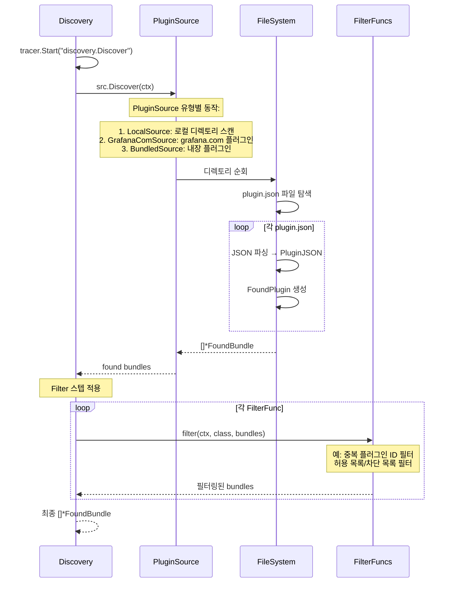
```mermaid
sequenceDiagram
    participant D as Discovery
    participant S as PluginSource
    participant FS as FileSystem
    participant F as FilterFuncs

    D->>D: tracer.Start("discovery.Discover")
    D->>S: src.Discover(ctx)

    Note over S: PluginSource 유형별 동작:
    Note over S: 1. LocalSource: 로컬 디렉토리 스캔<br/>2. GrafanaComSource: grafana.com 플러그인<br/>3. BundledSource: 내장 플러그인

    S->>FS: 디렉토리 순회
    FS->>FS: plugin.json 파일 탐색

    loop 각 plugin.json
        FS->>FS: JSON 파싱 → PluginJSON
        FS->>FS: FoundPlugin 생성
    end

    FS-->>S: []*FoundBundle
    S-->>D: found bundles

    Note over D: Filter 스텝 적용
    loop 각 FilterFunc
        D->>F: filter(ctx, class, bundles)
        Note over F: 예: 중복 플러그인 ID 필터<br/>허용 목록/차단 목록 필터
        F-->>D: 필터링된 bundles
    end

    D-->>D: 최종 []*FoundBundle
```

### 7.3 Bootstrap 단계 상세

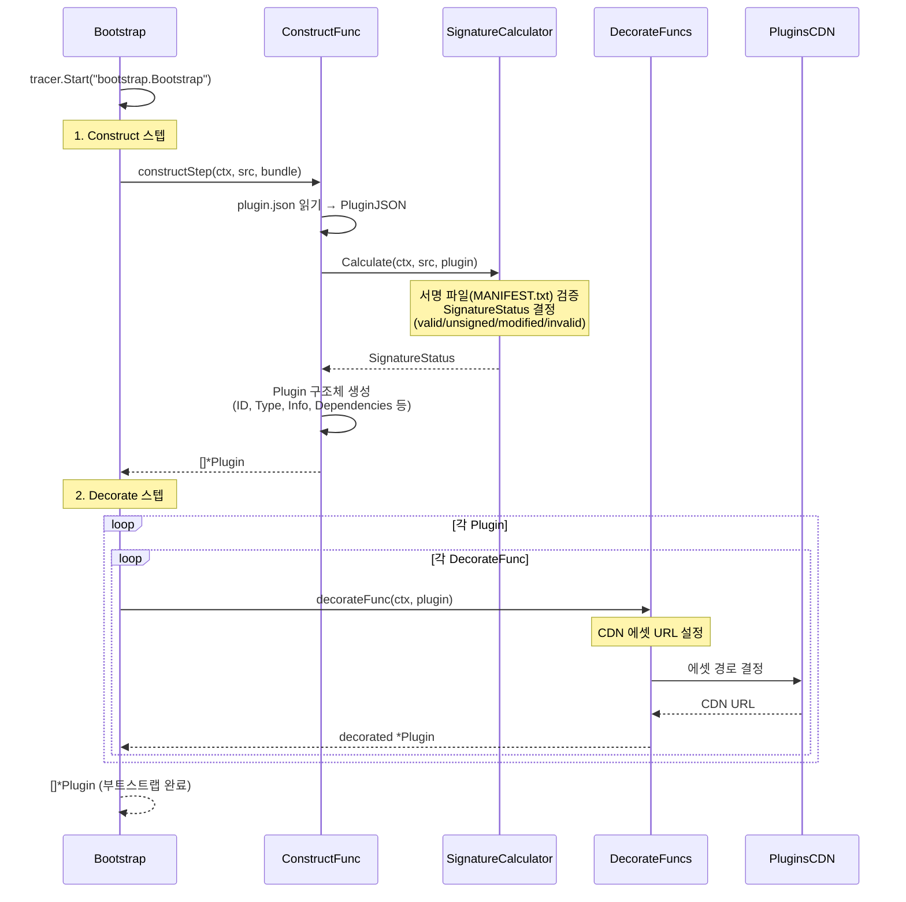
```mermaid
sequenceDiagram
    participant B as Bootstrap
    participant C as ConstructFunc
    participant Sig as SignatureCalculator
    participant Dec as DecorateFuncs
    participant CDN as PluginsCDN

    B->>B: tracer.Start("bootstrap.Bootstrap")

    Note over B: 1. Construct 스텝
    B->>C: constructStep(ctx, src, bundle)

    C->>C: plugin.json 읽기 → PluginJSON
    C->>Sig: Calculate(ctx, src, plugin)
    Note over Sig: 서명 파일(MANIFEST.txt) 검증<br/>SignatureStatus 결정<br/>(valid/unsigned/modified/invalid)
    Sig-->>C: SignatureStatus

    C->>C: Plugin 구조체 생성<br/>(ID, Type, Info, Dependencies 등)
    C-->>B: []*Plugin

    Note over B: 2. Decorate 스텝
    loop 각 Plugin
        loop 각 DecorateFunc
            B->>Dec: decorateFunc(ctx, plugin)

            Note over Dec: CDN 에셋 URL 설정
            Dec->>CDN: 에셋 경로 결정
            CDN-->>Dec: CDN URL
            Dec-->>B: decorated *Plugin
        end
    end

    B-->>B: []*Plugin (부트스트랩 완료)
```

### 7.4 Initialization 단계 상세

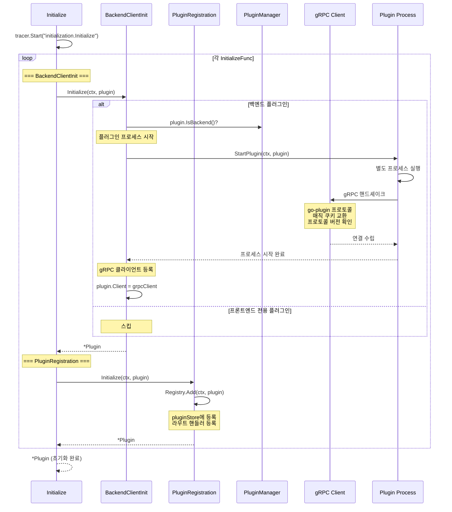
```mermaid
sequenceDiagram
    participant I as Initialize
    participant BCI as BackendClientInit
    participant PR as PluginRegistration
    participant PM as PluginManager
    participant GRPC as gRPC Client
    participant Proc as Plugin Process

    I->>I: tracer.Start("initialization.Initialize")

    loop 각 InitializeFunc

        Note over I: === BackendClientInit ===
        I->>BCI: Initialize(ctx, plugin)

        alt 백엔드 플러그인
            BCI->>PM: plugin.IsBackend()?

            Note over BCI: 플러그인 프로세스 시작
            BCI->>Proc: StartPlugin(ctx, plugin)
            Proc->>Proc: 별도 프로세스 실행
            Proc->>GRPC: gRPC 핸드셰이크
            Note over GRPC: go-plugin 프로토콜<br/>매직 쿠키 교환<br/>프로토콜 버전 확인
            GRPC-->>Proc: 연결 수립
            Proc-->>BCI: 프로세스 시작 완료

            Note over BCI: gRPC 클라이언트 등록
            BCI->>BCI: plugin.Client = grpcClient
        else 프론트엔드 전용 플러그인
            Note over BCI: 스킵
        end
        BCI-->>I: *Plugin

        Note over I: === PluginRegistration ===
        I->>PR: Initialize(ctx, plugin)
        PR->>PR: Registry.Add(ctx, plugin)
        Note over PR: pluginStore에 등록<br/>라우트 핸들러 등록
        PR-->>I: *Plugin

    end

    I-->>I: *Plugin (초기화 완료)
```

### 7.5 백엔드 플러그인 쿼리 흐름

플러그인이 로딩된 후 실제 쿼리가 실행되는 흐름:

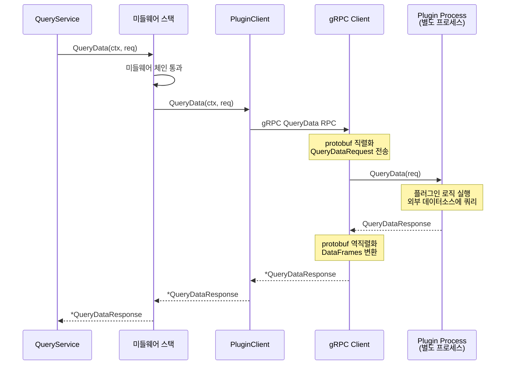
```mermaid
sequenceDiagram
    participant QS as QueryService
    participant MW as 미들웨어 스택
    participant Client as PluginClient
    participant GRPC as gRPC Client
    participant Proc as Plugin Process<br/>(별도 프로세스)

    QS->>MW: QueryData(ctx, req)
    MW->>MW: 미들웨어 체인 통과

    MW->>Client: QueryData(ctx, req)
    Client->>GRPC: gRPC QueryData RPC

    Note over GRPC: protobuf 직렬화<br/>QueryDataRequest 전송

    GRPC->>Proc: QueryData(req)

    Note over Proc: 플러그인 로직 실행<br/>외부 데이터소스에 쿼리

    Proc-->>GRPC: QueryDataResponse
    Note over GRPC: protobuf 역직렬화<br/>DataFrames 변환

    GRPC-->>Client: *QueryDataResponse
    Client-->>MW: *QueryDataResponse
    MW-->>QS: *QueryDataResponse
```

### 7.6 플러그인 소스 유형

| 소스 유형 | 클래스 | 설명 |
|----------|--------|------|
| Core | `core` | Grafana에 내장된 핵심 플러그인 (Prometheus, MySQL 등) |
| Bundled | `bundled` | Grafana 배포에 번들된 플러그인 |
| External | `external` | 사용자가 설치한 외부 플러그인 (`/var/lib/grafana/plugins/`) |

### 7.7 플러그인 파이프라인 아키텍처 요약

```
소스 탐색          구조체 생성           초기화 및 등록
┌──────────┐    ┌──────────────┐    ┌──────────────────┐
│ Discovery │───►│  Bootstrap   │───►│  Initialization  │
│          │    │              │    │                  │
│ • Discover│    │ • Construct  │    │ • BackendClient  │
│ • Filter  │    │ • Decorate   │    │ • Registration   │
└──────────┘    └──────────────┘    └──────────────────┘
     │                │                      │
     ▼                ▼                      ▼
 FoundBundle       *Plugin              등록된 Plugin
 (plugin.json)   (메타데이터)          (gRPC 연결 포함)
```

---

## 흐름 간 관계 요약

Grafana의 주요 흐름은 서로 밀접하게 연결되어 있다.

```mermaid
graph TD
    A[서버 시작] --> B[Wire DI 컨테이너]
    B --> C[플러그인 로딩]
    B --> D[HTTP 서버]
    B --> E[알림 스케줄러]

    D --> F[미들웨어 체인]
    F --> G[인증]
    F --> H[대시보드 로딩]
    F --> I[대시보드 저장]
    F --> J[쿼리 실행]

    J --> K[플러그인 미들웨어]
    K --> C

    E --> L[쿼리 실행<br/>알림 평가용]
    L --> K

    H --> M[DashboardService]
    I --> M
    M --> N[Database]

    G --> O[authn.Service]
    O --> P[세션 관리]
```

| 흐름 | 트리거 | 주요 컴포넌트 | 결과 |
|------|--------|-------------|------|
| 서버 시작 | OS | Wire DI, Server, HTTPServer | 서버 실행 |
| 대시보드 로딩 | 사용자 요청 | HTTPServer, DashboardService, AccessControl | JSON 응답 |
| 대시보드 저장 | 사용자 요청 | HTTPServer, DashboardService, 검증 파이프라인 | DB 저장 |
| 쿼리 실행 | 패널 렌더링 | QueryService, Plugin Client, 미들웨어 스택 | DataFrames |
| 알림 평가 | 스케줄러 tick | Scheduler, Evaluator, StateManager, Alertmanager | 알림 발송 |
| 인증 | 모든 요청 | ContextHandler, authn.Service, 클라이언트 체인 | Identity |
| 플러그인 로딩 | 서버 시작 | Discovery, Bootstrap, Initialization | 등록된 Plugin |
