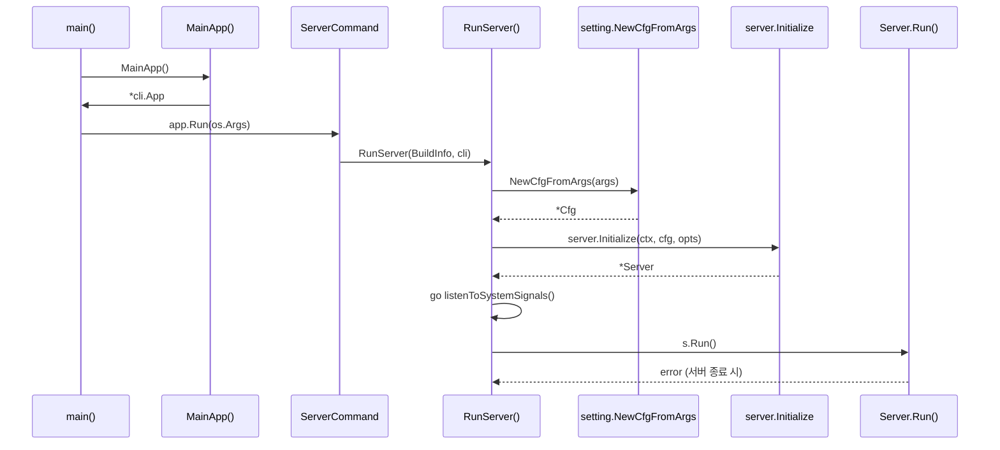
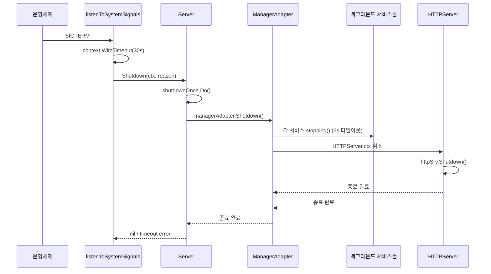

# 07. Grafana 백엔드 서버 심화

## 목차

1. [진입점 분석](#1-진입점-분석)
2. [설정 로딩 체인](#2-설정-로딩-체인)
3. [Wire DI 상세](#3-wire-di-상세)
4. [HTTPServer 라이프사이클](#4-httpserver-라이프사이클)
5. [미들웨어 체인 상세](#5-미들웨어-체인-상세)
6. [백그라운드 서비스](#6-백그라운드-서비스)
7. [시그널 핸들링과 Graceful Shutdown](#7-시그널-핸들링과-graceful-shutdown)
8. [Server.Shutdown 상세 흐름](#8-servershutdown-상세-흐름)

---

## 1. 진입점 분석

### 1.1 main() 함수

Grafana 백엔드 서버의 진입점은 `pkg/cmd/grafana/main.go`에 위치한다.

```
파일: pkg/cmd/grafana/main.go
```

```go
func main() {
    app := MainApp()
    if err := app.Run(os.Args); err != nil {
        fmt.Printf("%s: %s %s\n", color.RedString("Error"), color.RedString("✗"), err)
        os.Exit(1)
    }
    os.Exit(0)
}
```

`main()` 함수는 단 3줄로 구성되어 있다. `MainApp()`이 반환하는 `*cli.App` 객체에 커맨드라인 인자를 전달하고 실행하는 것이 전부다.

### 1.2 MainApp() - urfave/cli App 구성

`MainApp()`은 `urfave/cli/v2` 프레임워크를 사용하여 CLI 애플리케이션을 구성한다. 두 개의 주요 서브커맨드를 등록한다:

```go
func MainApp() *cli.App {
    app := &cli.App{
        Name:  "grafana",
        Usage: "Grafana server and command line interface",
        Commands: []*cli.Command{
            gcli.CLICommand(version),                                                    // grafana-cli
            commands.ServerCommand(version, commit, enterpriseCommit, buildBranch, buildstamp), // grafana server
        },
        EnableBashCompletion: true,
    }
    // BuildInfo 설정 및 APIServer Factory 초기화
    ...
    return app
}
```

| 서브커맨드 | 설명 | 진입 함수 |
|-----------|------|----------|
| `grafana cli` | 플러그인 관리 등 CLI 도구 | `gcli.CLICommand()` |
| `grafana server` | 서버 시작 | `commands.ServerCommand()` |

빌드 시점에 `-X` 링크 플래그로 `version`, `commit`, `buildBranch`, `buildstamp` 변수가 주입된다. 이 값들은 `standalone.BuildInfo` 구조체에 담겨 전체 시스템에 전달된다.

### 1.3 ServerCommand() -> RunServer()

```
파일: pkg/cmd/grafana-server/commands/cli.go
```

`ServerCommand()`는 `grafana server` 서브커맨드를 정의한다:

```go
func ServerCommand(version, commit, enterpriseCommit, buildBranch, buildstamp string) *cli.Command {
    return &cli.Command{
        Name:   "server",
        Usage:  "run the grafana server",
        Flags:  commonFlags,
        Action: func(context *cli.Context) error {
            return RunServer(standalone.BuildInfo{...}, context)
        },
    }
}
```

`RunServer()`는 서버 실행의 핵심 함수다. 다음 순서로 동작한다:

```
RunServer() 실행 흐름
=======================

1. 버전 출력 (--version 플래그 처리)
2. 로거 초기화 (log.New("cli"))
3. 프로파일링 설정 (pprof)
4. 트레이싱 설정
5. panic 리커버리 defer 등록
6. 권한 검사 (root 실행 경고)
7. 설정 로딩 (setting.NewCfgFromArgs)
8. 메트릭 빌드 정보 설정
9. OpenFeature 초기화
10. server.Initialize() 호출 — Wire DI
11. listenToSystemSignals() 고루틴 시작
12. s.Run() — 서버 메인 루프
```

```go
func RunServer(opts standalone.BuildInfo, cli *cli.Context) error {
    // ...프로파일링, 트레이싱 설정 생략...

    cfg, err := setting.NewCfgFromArgs(setting.CommandLineArgs{
        Config:   ConfigFile,
        HomePath: HomePath,
        Args:     append(configOptions, cli.Args().Slice()...),
    })

    s, err := server.Initialize(cli.Context, cfg, server.Options{...}, api.ServerOptions{})
    go listenToSystemSignals(cli.Context, s)
    return s.Run()
}
```

전체 부팅 시퀀스를 Mermaid로 표현하면:



---

## 2. 설정 로딩 체인

### 2.1 설정 로딩 흐름

```
파일: pkg/setting/setting.go
```

Grafana의 설정 시스템은 INI 파일 기반이며, 다단계 오버라이드를 지원한다:

```
설정 로딩 체인
=============

NewCfgFromArgs(args)
  │
  ├── NewCfg()              // Cfg 구조체 초기화
  │     └── cfg.Load(args)  // 핵심 로딩 로직
  │           │
  │           ├── loadConfiguration()
  │           │     ├── defaults.ini       (기본값)
  │           │     ├── custom.ini         (사용자 설정)
  │           │     ├── /etc/grafana/      (시스템 설정)
  │           │     └── 환경 변수 오버라이드
  │           │
  │           ├── parseINIFile()           (각 INI 파일 파싱)
  │           │
  │           ├── 섹션별 파싱
  │           │     ├── [server]
  │           │     ├── [database]
  │           │     ├── [security]
  │           │     ├── [auth]
  │           │     └── ... (50+ 섹션)
  │           │
  │           └── 환경 변수 오버라이드
  │                 └── GF_<SECTION>_<KEY> 형식
  │
  └── *Cfg (200+ 필드 구조체)
```

### 2.2 Cfg 구조체 주요 필드

`Cfg` 구조체는 200개 이상의 필드를 가지며, 서버 동작의 모든 측면을 제어한다.

```go
// 파일: pkg/setting/setting.go (line 85~)
type Cfg struct {
    Target []string
    Raw    *ini.File
    Logger log.Logger

    // HTTP Server Settings
    CertFile          string
    KeyFile           string
    CertPassword      string
    CertWatchInterval time.Duration
    HTTPAddr          string        // 기본값: "0.0.0.0"
    HTTPPort          string        // 기본값: "3000"
    Env               string        // "development" 또는 "production"
    AppURL            string
    AppSubURL         string
    Protocol          Scheme        // http, https, h2, socket, socket_h2
    ServeOnSocket     bool
    SocketPath        string
    Domain            string
    ReadTimeout       time.Duration
    EnableGzip        bool
    MinTLSVersion     string

    // Security
    SecretKey             string
    DisableInitAdminCreation bool
    CSPEnabled            bool
    CSPTemplate           string

    // Paths
    HomePath     string
    DataPath     string
    LogsPath     string
    PluginsPaths []string

    // Rendering
    ImagesDir         string
    RendererServerUrl  string

    // Database (별도 DatabaseConfig 구조체)
    // ...200+ 추가 필드
}
```

| 카테고리 | 대표 필드 | 기본값 | 설명 |
|---------|----------|-------|------|
| HTTP | HTTPAddr | "0.0.0.0" | 바인드 주소 |
| HTTP | HTTPPort | "3000" | 포트 |
| HTTP | Protocol | "http" | 프로토콜 (http/https/h2/socket) |
| Security | SecretKey | - | 쿠키/토큰 암호화 키 |
| Paths | DataPath | "data" | 데이터 저장 경로 |
| Paths | PluginsPaths | ["data/plugins"] | 플러그인 경로 목록 |
| Rendering | RendererServerUrl | "" | 외부 렌더러 URL |

### 2.3 Protocol 타입 정의

설정 파일의 `protocol` 값에 따라 서버 동작 방식이 결정된다:

```go
type Scheme string

const (
    HTTPScheme        Scheme = "http"       // 일반 HTTP
    HTTPSScheme       Scheme = "https"      // TLS 활성화 HTTP/1.1
    HTTP2Scheme       Scheme = "h2"         // HTTP/2 + TLS
    SocketScheme      Scheme = "socket"     // Unix 소켓
    SocketHTTP2Scheme Scheme = "socket_h2"  // Unix 소켓 + HTTP/2
)
```

### 2.4 환경 변수 오버라이드

모든 설정은 환경 변수로 오버라이드할 수 있다. 형식은 `GF_<SECTION>_<KEY>`이다:

```
GF_SERVER_HTTP_PORT=8080        → [server].http_port = 8080
GF_DATABASE_TYPE=postgres       → [database].type = postgres
GF_SECURITY_SECRET_KEY=mykey    → [security].secret_key = mykey
GF_AUTH_DISABLE_LOGIN_FORM=true → [auth].disable_login_form = true
```

이 오버라이드 메커니즘은 컨테이너 환경(Docker, Kubernetes)에서 설정 파일을 변경하지 않고 동작을 제어하는 데 핵심적인 역할을 한다.

---

## 3. Wire DI 상세

### 3.1 Wire 개요

Grafana는 Google의 Wire (컴파일 타임 의존성 주입) 라이브러리를 사용한다.

```
파일: pkg/server/wire.go
```

Wire는 컴파일 타임에 의존성 그래프를 분석하여 `wire_gen.go` 파일을 자동 생성한다. 런타임 리플렉션이 없으므로 성능 오버헤드가 없고, 컴파일 시점에 의존성 오류를 발견할 수 있다.

### 3.2 wireBasicSet (line 225~493)

`wireBasicSet`은 Grafana의 기본 서비스 100개 이상을 등록하는 핵심 Wire 세트다:

```go
var wireBasicSet = wire.NewSet(
    // 어노테이션
    annotationsimpl.ProvideService,
    wire.Bind(new(annotations.Repository), new(*annotationsimpl.RepositoryImpl)),

    // 서버 핵심
    New,                          // Server 생성
    api.ProvideHTTPServer,        // HTTPServer 생성
    query.ProvideService,         // 쿼리 서비스
    bus.ProvideBus,               // 이벤트 버스
    rendering.ProvideService,     // 렌더링 서비스
    routing.ProvideRegister,      // 라우트 레지스터
    hooks.ProvideService,         // 훅 서비스

    // 인프라
    kvstore.ProvideService,
    localcache.ProvideService,
    remotecache.ProvideService,
    tracing.ProvideService,

    // 데이터소스
    cloudwatch.ProvideService,
    azuremonitor.ProvideService,
    postgres.ProvideService,
    mysql.ProvideService,
    prometheus.ProvideService,
    elasticsearch.ProvideService,
    loki.ProvideService,
    // ... 15개 이상 데이터소스

    // 대시보드
    dashboardservice.ProvideDashboardServiceImpl,
    dashboardservice.ProvideDashboardService,
    dashboardstore.ProvideDashboardStore,

    // 인증/인가
    acimpl.ProvideAccessControl,
    authnimpl.ProvideService,
    jwt.ProvideService,

    // 비밀 관리
    secretsManager.ProvideSecretsService,
    encryptionservice.ProvideEncryptionService,

    // Kubernetes API 서버
    grafanaapiserver.WireSet,
    apiregistry.WireSet,
    appregistry.WireSet,
    // ... 총 100+ 등록
)
```

### 3.3 Wire Bind 패턴

`wire.Bind()`는 인터페이스와 구현체를 연결한다:

```go
// 인터페이스 → 구현체 바인딩 예시
wire.Bind(new(annotations.Repository), new(*annotationsimpl.RepositoryImpl))
wire.Bind(new(bus.Bus), new(*bus.InProcBus))
wire.Bind(new(rendering.Service), new(*rendering.RenderingService))
wire.Bind(new(routing.RouteRegister), new(*routing.RouteRegisterImpl))
wire.Bind(new(secrets.Service), new(*secretsManager.SecretsService))
wire.Bind(new(folder.Service), new(*folderimpl.Service))
wire.Bind(new(datasources.CacheService), new(*datasourceservice.CacheServiceImpl))
```

이 패턴을 통해 구현체를 교체할 때 인터페이스를 사용하는 코드는 변경하지 않아도 된다.

### 3.4 wireSet 조합 계층

Wire 세트는 계층적으로 조합된다:

```
wireBasicSet (100+ 서비스 등록, line 225~493)
    │
    ├── wireSet = wireBasicSet + metrics + sqlstore + ngalert (line 495~508)
    │     │
    │     └── wireExtsSet = wireSet + wireExtsBasicSet (OSS 확장)
    │           │
    │           └── Initialize() → wire.Build(wireExtsSet)
    │
    ├── wireCLISet (CLI 전용, line 510~523)
    │
    └── wireTestSet (테스트 전용, line 525~541)
```

```go
var wireSet = wire.NewSet(
    wireBasicSet,
    metrics.WireSet,
    sqlstore.ProvideService,
    ngmetrics.ProvideService,
    wire.Bind(new(notifications.Service), new(*notifications.NotificationService)),
    wire.Bind(new(db.DB), new(*sqlstore.SQLStore)),
    prefimpl.ProvideService,
    oauthtoken.ProvideService,
)
```

### 3.5 Initialize() 진입점

```go
func Initialize(ctx context.Context, cfg *setting.Cfg, opts Options, apiOpts api.ServerOptions) (*Server, error) {
    wire.Build(wireExtsSet)
    return &Server{}, nil
}
```

이 함수는 Wire에 의해 `wire_gen.go`로 코드 생성된다. 실제 생성 코드는 `wireExtsSet`에 포함된 모든 Provider를 순서대로 호출하여 의존성 그래프를 만족시킨다.

### 3.6 Provider 함수 패턴

모든 서비스는 `ProvideService()` 패턴을 따른다:

```go
// 일반적인 Provider 패턴
func ProvideService(dep1 Type1, dep2 Type2, ...) (*Service, error) {
    s := &Service{
        dep1: dep1,
        dep2: dep2,
    }
    // 초기화 로직
    return s, nil
}
```

Wire는 이 함수 시그니처에서 의존성(파라미터)과 제공값(반환값)을 분석하여 자동으로 호출 순서를 결정한다.

---

## 4. HTTPServer 라이프사이클

### 4.1 ProvideHTTPServer()

```
파일: pkg/api/http_server.go (line 243~411)
```

`ProvideHTTPServer()`는 Grafana에서 가장 많은 의존성 파라미터를 받는 함수 중 하나다. 40개 이상의 의존성을 주입받는다:

```go
func ProvideHTTPServer(
    opts ServerOptions,
    cfg *setting.Cfg,
    routeRegister routing.RouteRegister,
    bus bus.Bus,
    renderService rendering.Service,
    licensing licensing.Licensing,
    hooksService *hooks.HooksService,
    cacheService *localcache.CacheService,
    sqlStore db.DB,
    // ... 40+ 파라미터
    pluginPreinstall pluginchecker.Preinstall,
    publicDashboardsService publicdashboards.Service,
) (*HTTPServer, error) {
```

### 4.2 HTTPServer 구조체

```go
type HTTPServer struct {
    log              log.Logger
    web              *web.Mux        // Macaron 호환 라우터
    context          context.Context
    httpSrv          *http.Server    // Go 표준 HTTP 서버
    middlewares      []web.Handler
    namedMiddlewares []routing.RegisterNamedMiddleware
    bus              bus.Bus

    // 주요 의존성 (100+ 필드)
    Cfg                     *setting.Cfg
    Features                featuremgmt.FeatureToggles
    RouteRegister           routing.RouteRegister
    RenderService           rendering.Service
    ContextHandler          *contexthandler.ContextHandler
    AccessControl           accesscontrol.AccessControl
    DashboardService        dashboards.DashboardService
    AlertNG                 *ngalert.AlertNG
    Live                    *live.GrafanaLive
    // ... 100+ 필드
}
```

### 4.3 Run() 흐름

```
파일: pkg/api/http_server.go (line 441~537)
```

```go
func (hs *HTTPServer) Run(ctx context.Context) error {
    hs.context = ctx
    hs.applyRoutes()

    host := strings.TrimSuffix(strings.TrimPrefix(hs.Cfg.HTTPAddr, "["), "]")
    hs.httpSrv = &http.Server{
        Addr:        net.JoinHostPort(host, hs.Cfg.HTTPPort),
        Handler:     hs.web,
        ReadTimeout: hs.Cfg.ReadTimeout,
    }

    // 프로토콜에 따라 TLS 설정
    switch hs.Cfg.Protocol {
    case setting.HTTP2Scheme, setting.HTTPSScheme, setting.SocketHTTP2Scheme:
        hs.configureTLS()
        // 인증서 자동 갱신 지원
        if hs.Cfg.CertWatchInterval > 0 {
            hs.httpSrv.TLSConfig.GetCertificate = hs.GetCertificate
            go hs.WatchAndUpdateCerts(ctx)
        }
    }

    listeners, err := hs.getListeners()
    // ... 리스너별 Serve/ServeTLS ...
}
```

Run() 흐름을 ASCII 다이어그램으로 표현하면:

```
HTTPServer.Run(ctx)
  │
  ├── applyRoutes()
  │     ├── addMiddlewaresAndStaticRoutes()  // 미들웨어 + 정적 파일
  │     ├── RouteRegister.Register(web)       // API/View 라우트
  │     └── web.NotFound(handler)             // 404 핸들러
  │
  ├── http.Server 생성
  │     ├── Addr: HTTPAddr:HTTPPort
  │     ├── Handler: web.Mux
  │     └── ReadTimeout: cfg.ReadTimeout
  │
  ├── TLS 설정 (프로토콜에 따라)
  │     ├── configureTLS()
  │     │     ├── tlsCertificates() — 인증서 로드 또는 자체서명
  │     │     ├── MinVersion 설정
  │     │     └── CipherSuites 설정
  │     └── WatchAndUpdateCerts() — 주기적 인증서 갱신 (고루틴)
  │
  ├── getListeners()
  │     ├── TCP 리스너 (http/https/h2)
  │     └── Unix 소켓 리스너 (socket/socket_h2)
  │
  ├── errgroup으로 병렬 Serve
  │     ├── Serve(listener) — HTTP
  │     └── ServeTLS(listener, "", "") — HTTPS/H2
  │
  └── ctx.Done() → httpSrv.Shutdown() — Graceful Shutdown
```

### 4.4 getListeners() - 다중 리스너 지원

```go
func (hs *HTTPServer) getListeners() ([]net.Listener, error) {
    switch hs.Cfg.Protocol {
    case setting.HTTPScheme, setting.HTTPSScheme, setting.HTTP2Scheme:
        listener, _ := net.Listen("tcp", hs.httpSrv.Addr)
        listeners = append(listeners, listener)
        if hs.Cfg.ServeOnSocket {
            fallthrough  // TCP + Unix 소켓 동시 리슨
        }
    case setting.SocketScheme, setting.SocketHTTP2Scheme:
        listener, _ := net.ListenUnix("unix", &net.UnixAddr{Name: hs.Cfg.SocketPath})
        os.Chmod(hs.Cfg.SocketPath, os.FileMode(hs.Cfg.SocketMode))
        // 그룹 소유권 변경 (선택적)
        if hs.Cfg.SocketGid != -1 {
            os.Chown(hs.Cfg.SocketPath, -1, hs.Cfg.SocketGid)
        }
        listeners = append(listeners, listener)
    }
    return listeners, nil
}
```

`ServeOnSocket` 설정이 활성화되면 TCP와 Unix 소켓에서 동시에 요청을 수신할 수 있다. 이는 로컬 프록시(nginx 등)와의 통신 최적화에 유용하다.

### 4.5 TLS 설정

TLS 지원은 세 가지 모드로 동작한다:

| 모드 | CertFile/KeyFile | 동작 |
|------|-----------------|------|
| 자체서명 | 미지정 | RSA 4096비트 자체서명 인증서 자동 생성 |
| 파일 기반 | 지정 | 지정된 인증서/키 파일 로드 |
| 암호화 키 | 지정 + CertPassword | PKCS#8 또는 PKCS#1 암호화 키 복호화 |

인증서 자동 갱신(`CertWatchInterval > 0`)이 활성화되면 `WatchAndUpdateCerts()`가 별도 고루틴에서 주기적으로 파일 변경을 감지한다:

```go
func (hs *HTTPServer) WatchAndUpdateCerts(ctx context.Context) {
    ticker := time.NewTicker(hs.Cfg.CertWatchInterval)
    for {
        select {
        case <-ticker.C:
            hs.updateCerts()  // mtime 비교 후 변경 시 갱신
        case <-ctx.Done():
            ticker.Stop()
            return
        }
    }
}
```

---

## 5. 미들웨어 체인 상세

### 5.1 미들웨어 등록 순서

```
파일: pkg/api/http_server.go (line 668~733)
```

`addMiddlewaresAndStaticRoutes()`는 20개 이상의 미들웨어를 정확한 순서로 등록한다. 순서가 매우 중요한데, 앞쪽 미들웨어가 뒤쪽 미들웨어의 동작에 영향을 미치기 때문이다.

```go
func (hs *HTTPServer) addMiddlewaresAndStaticRoutes() {
    m := hs.web

    // 1. 요청 메타데이터 설정
    m.Use(requestmeta.SetupRequestMetadata())

    // 2. 분산 트레이싱
    m.Use(middleware.RequestTracing(hs.tracer, middleware.ShouldTraceWithExceptions))

    // 3. Prometheus 메트릭 수집
    m.Use(middleware.RequestMetrics(hs.Features, hs.Cfg, hs.promRegister))

    // 4. 요청 로깅
    m.UseMiddleware(hs.LoggerMiddleware.Middleware())

    // 5. Gzip 압축 (조건부)
    if hs.Cfg.EnableGzip {
        m.UseMiddleware(middleware.Gziper())
    }

    // 6. 패닉 복구
    m.UseMiddleware(middleware.Recovery(hs.Cfg, hs.License))

    // 7. CSRF 보호
    m.UseMiddleware(hs.Csrf.Middleware())

    // 8~11. 정적 파일 서빙
    hs.mapStatic(m, hs.Cfg.StaticRootPath, "build", "public/build")
    hs.mapStatic(m, hs.Cfg.StaticRootPath, "", "public", "/public/views/swagger.html")
    hs.mapStatic(m, hs.Cfg.StaticRootPath, "robots.txt", "robots.txt")
    hs.mapStatic(m, hs.Cfg.StaticRootPath, "mockServiceWorker.js", "mockServiceWorker.js")

    // 12. 커스텀 응답 헤더
    if len(hs.Cfg.CustomResponseHeaders) > 0 {
        m.Use(middleware.AddCustomResponseHeaders(hs.Cfg))
    }

    // 13. 기본 응답 헤더
    m.Use(middleware.AddDefaultResponseHeaders(hs.Cfg))

    // 14. SubPath 리다이렉트
    if hs.Cfg.ServeFromSubPath && hs.Cfg.AppSubURL != "" {
        m.UseMiddleware(middleware.SubPathRedirect(hs.Cfg))
    }

    // 15. HTML 템플릿 렌더러
    m.UseMiddleware(web.Renderer(...))

    // 16~20. 모니터링 엔드포인트 (인증 없이 접근 가능)
    m.Use(hs.healthzHandler)          // GET /healthz
    m.Use(hs.apiHealthHandler)        // GET /api/health
    m.Use(hs.metricsEndpoint)         // GET /metrics
    m.Use(hs.pluginMetricsEndpoint)   // 플러그인 메트릭
    m.Use(hs.frontendLogEndpoints())  // 프론트엔드 로그

    // 21. 컨텍스트 핸들러 (인증/세션 처리)
    m.UseMiddleware(hs.ContextHandler.Middleware)

    // 22. 조직 리다이렉트
    m.Use(middleware.OrgRedirect(hs.Cfg, hs.userService))

    // 23. 도메인 강제
    if hs.Cfg.EnforceDomain {
        m.Use(middleware.ValidateHostHeader(hs.Cfg))
    }

    // 24. Action URL 검증
    m.UseMiddleware(middleware.ValidateActionUrl(hs.Cfg, hs.log))

    // 25. 캐시 헤더 처리
    m.Use(middleware.HandleNoCacheHeaders)

    // 26. Content Security Policy
    if hs.Cfg.CSPEnabled || hs.Cfg.CSPReportOnlyEnabled {
        m.UseMiddleware(middleware.ContentSecurityPolicy(hs.Cfg, hs.log))
    }

    // 27. 추가 커스텀 미들웨어
    for _, mw := range hs.middlewares {
        m.Use(mw)
    }
}
```

### 5.2 미들웨어 실행 순서 다이어그램

요청이 처리되는 순서를 ASCII 다이어그램으로 표현하면:

```
HTTP 요청 수신
    │
    ▼
┌─────────────────────────────┐
│ 1. RequestMetadata          │  요청에 대한 메타데이터 키/값 설정
├─────────────────────────────┤
│ 2. RequestTracing           │  OpenTelemetry 스팬 시작
├─────────────────────────────┤
│ 3. RequestMetrics           │  Prometheus 메트릭 카운터 증가
├─────────────────────────────┤
│ 4. LoggerMiddleware         │  요청 로깅 (method, path, status, duration)
├─────────────────────────────┤
│ 5. Gziper (조건부)           │  Accept-Encoding: gzip 시 응답 압축
├─────────────────────────────┤
│ 6. Recovery                 │  패닉 발생 시 500 응답, 스택 트레이스 로깅
├─────────────────────────────┤
│ 7. CSRF                     │  POST/PUT/DELETE 시 CSRF 토큰 검증
├─────────────────────────────┤
│ 8. Static Files             │  /public/build, /public 등 정적 파일 서빙
├─────────────────────────────┤
│ 9. Response Headers         │  보안 헤더 (X-Frame-Options, HSTS 등)
├─────────────────────────────┤
│ 10. Health/Metrics          │  /healthz, /api/health, /metrics (인증 불필요)
├─────────────────────────────┤
│ 11. ContextHandler          │  인증: 토큰/쿠키/API키 → ReqContext 생성
├─────────────────────────────┤
│ 12. OrgRedirect             │  ?orgId= 파라미터 시 조직 전환
├─────────────────────────────┤
│ 13. ValidateHostHeader      │  EnforceDomain 시 호스트 헤더 검증
├─────────────────────────────┤
│ 14. NoCacheHeaders          │  Cache-Control 헤더 처리
├─────────────────────────────┤
│ 15. CSP                     │  Content-Security-Policy 헤더 추가
└─────────────────────────────┘
    │
    ▼
  라우트 핸들러 실행
```

### 5.3 모니터링 엔드포인트

미들웨어 체인에서 인증(`ContextHandler`) 이전에 위치하여, 인증 없이도 접근 가능하다:

| 엔드포인트 | 메서드 | 설명 |
|-----------|--------|------|
| `/healthz` | GET/HEAD | 항상 200 OK (서버 프로세스 생존 확인) |
| `/api/health` | GET/HEAD | DB 연결 상태 포함 (실패 시 503) |
| `/metrics` | GET | Prometheus 메트릭 (Basic Auth 가능) |

```go
// /api/health 응답 구조
type healthResponse struct {
    Database         string `json:"database"`          // "ok" 또는 "failing"
    Version          string `json:"version,omitempty"`
    Commit           string `json:"commit,omitempty"`
    EnterpriseCommit string `json:"enterpriseCommit,omitempty"`
}
```

### 5.4 applyRoutes()

미들웨어 등록 후 라우트를 적용한다:

```go
func (hs *HTTPServer) applyRoutes() {
    // 1. 미들웨어와 정적 라우트
    hs.addMiddlewaresAndStaticRoutes()
    // 2. API/View 라우트 (RouteRegister에 등록된 모든 라우트)
    hs.RouteRegister.Register(hs.web, hs.namedMiddlewares...)
    // 3. 404 핸들러 (인증 필요)
    hs.web.NotFound(middleware.ProvideRouteOperationName("notfound"),
        middleware.ReqSignedIn, hs.NotFoundHandler)
}
```

---

## 6. 백그라운드 서비스

### 6.1 BackgroundServiceRegistry

```
파일: pkg/registry/backgroundsvcs/background_services.go
```

`ProvideBackgroundServiceRegistry()`는 30개 이상의 백그라운드 서비스를 한데 모은다:

```go
func ProvideBackgroundServiceRegistry(
    httpServer *api.HTTPServer,
    ng *ngalert.AlertNG,
    cleanup *cleanup.CleanUpService,
    live *live.GrafanaLive,
    pushGateway *pushhttp.Gateway,
    notifications *notifications.NotificationService,
    pluginStore *pluginStore.Service,
    rendering *rendering.RenderingService,
    tokenService auth.UserTokenBackgroundService,
    tracing *tracing.TracingService,
    provisioning *provisioning.ProvisioningServiceImpl,
    usageStats *uss.UsageStats,
    // ... 30+ 서비스
) *BackgroundServiceRegistry {
    return NewBackgroundServiceRegistry(
        httpServer,
        ng,
        cleanup,
        live,
        // ... 모든 서비스를 순서대로 전달
    )
}
```

### 6.2 등록된 백그라운드 서비스 목록

| 서비스 | 역할 |
|--------|------|
| `HTTPServer` | HTTP 요청 처리 |
| `AlertNG` | 통합 알림 엔진 (Alertmanager 포함) |
| `CleanUpService` | 만료된 세션/스냅샷/임시 파일 정리 |
| `GrafanaLive` | WebSocket 기반 실시간 데이터 스트리밍 |
| `PushGateway` | Live Push HTTP 게이트웨이 |
| `NotificationService` | 이메일/웹훅 알림 발송 |
| `RenderingService` | 이미지/PDF 렌더링 |
| `UserTokenBackgroundService` | 만료 토큰 정리 |
| `ProvisioningServiceImpl` | 대시보드/데이터소스 프로비저닝 |
| `GrafanaService` (updatemanager) | Grafana 업데이트 확인 |
| `PluginsService` (updatemanager) | 플러그인 업데이트 확인 |
| `InternalMetricsService` | 내부 메트릭 수집 |
| `UsageStats` | 사용 통계 수집 및 전송 |
| `SecretsService` | 비밀 키 로테이션 |
| `RemoteCache` | 원격 캐시 관리 |
| `StorageService` | 파일 스토리지 서비스 |
| `GRPCServerProvider` | gRPC 서버 |
| `ServiceAccountsService` | 서비스 어카운트 관리 |
| `SecretMigrationProvider` | 비밀 마이그레이션 |
| `LoginAttemptService` | 로그인 시도 제한 |
| `SupportBundlesService` | 지원 번들 생성 |
| `PublicDashboardsMetric` | 공개 대시보드 메트릭 |
| `GrafanaAPIServer` | Kubernetes API 서버 |
| `AnonDeviceService` | 익명 장치 추적 |
| `SSOSettings` | SSO 설정 동기화 |
| `ZanzanaReconciler` | 접근 제어 동기화 |
| `DashboardServiceImpl` | 대시보드 정리 작업 |
| `FixedRolesLoader` | 고정 역할 로딩 |

### 6.3 ManagerAdapter - dskit 브릿지

```
파일: pkg/registry/backgroundsvcs/adapter/manager.go
```

`ManagerAdapter`는 Grafana의 `BackgroundServiceRegistry`를 dskit의 `services.NamedService` 패턴으로 변환한다:

```go
type ManagerAdapter struct {
    services.NamedService
    reg           registry.BackgroundServiceRegistry
    manager       grafanamodules.Manager
    dependencyMap map[string][]string
}
```

시작 시(`starting()`) 각 백그라운드 서비스를 dskit 모듈로 등록한다:

```go
func (m *ManagerAdapter) starting(ctx context.Context) error {
    manager := grafanamodules.New(logger, []string{BackgroundServices})
        .WithDependencies(m.dependencyMap)

    for _, bgSvc := range m.reg.GetServices() {
        namedService, ok := bgSvc.(services.NamedService)
        if !ok {
            namedService = asNamedService(bgSvc)
        }

        // 비활성화된 서비스 건너뛰기
        if s, ok := bgSvc.(registry.CanBeDisabled); ok && s.IsDisabled() {
            manager.RegisterInvisibleModule(namedService.ServiceName(), nil)
            continue
        }

        // 서비스를 모듈로 등록
        manager.RegisterInvisibleModule(namedService.ServiceName(), func() (services.Service, error) {
            return namedService, nil
        })
    }
    return manager.InitModuleServices(ctx, BackgroundServices)
}
```

dskit Manager를 사용하는 이유는:
- 서비스 간 의존성 순서 보장
- 상태 관찰(Starting, Running, Stopping, Terminated, Failed)
- 하나의 서비스 실패 시 전체 종료 조율
- 5초 타임아웃 기반 graceful stop

---

## 7. 시그널 핸들링과 Graceful Shutdown

### 7.1 listenToSystemSignals()

```
파일: pkg/cmd/grafana-server/commands/cli.go (line 148~170)
```

`RunServer()`에서 별도 고루틴으로 시작된다:

```go
func listenToSystemSignals(ctx context.Context, s gserver) {
    signalChan := make(chan os.Signal, 1)
    sighupChan := make(chan os.Signal, 1)

    signal.Notify(sighupChan, syscall.SIGHUP)
    signal.Notify(signalChan, os.Interrupt, syscall.SIGTERM)

    for {
        select {
        case <-sighupChan:
            // SIGHUP: 로거 재로드
            if err := log.Reload(); err != nil {
                fmt.Fprintf(os.Stderr, "Failed to reload loggers: %s\n", err)
            }
        case sig := <-signalChan:
            // SIGTERM/Interrupt: 30초 graceful shutdown
            ctx, cancel := context.WithTimeout(ctx, 30*time.Second)
            defer cancel()
            if err := s.Shutdown(ctx, fmt.Sprintf("System signal: %s", sig)); err != nil {
                fmt.Fprintf(os.Stderr, "Timed out waiting for server to shut down\n")
            }
            return
        }
    }
}
```

| 시그널 | 동작 |
|--------|------|
| `SIGHUP` | 로거 재로드 (로그 파일 로테이션 지원) |
| `SIGTERM` | 30초 타임아웃으로 graceful shutdown |
| `SIGINT` (Ctrl+C) | 30초 타임아웃으로 graceful shutdown |

### 7.2 시그널 처리 시퀀스



---

## 8. Server.Shutdown 상세 흐름

### 8.1 Server 구조체

```
파일: pkg/server/server.go
```

```go
type Server struct {
    context       context.Context
    log           log.Logger
    cfg           *setting.Cfg
    shutdownOnce  sync.Once         // 한 번만 실행 보장
    isInitialized bool
    mtx           sync.Mutex

    pidFile     string
    version     string
    commit      string
    buildBranch string

    backgroundServiceRegistry registry.BackgroundServiceRegistry
    tracerProvider            *tracing.TracingService
    features                  featuremgmt.FeatureToggles

    HTTPServer          *api.HTTPServer
    roleRegistry        accesscontrol.RoleRegistry
    provisioningService provisioning.ProvisioningService
    promReg             prometheus.Registerer
    managerAdapter      *adapter.ManagerAdapter
}
```

### 8.2 Server.Run()

```go
func (s *Server) Run() error {
    if err := s.Init(); err != nil {
        return err
    }

    ctx, span := s.tracerProvider.Start(s.context, "server.Run")
    defer span.End()

    s.notifySystemd("READY=1")  // systemd에 준비 완료 알림
    return s.managerAdapter.Run(ctx)
}
```

`notifySystemd("READY=1")`은 systemd의 `Type=notify` 유닛에서 서버가 준비되었음을 알리는 데 사용된다. `NOTIFY_SOCKET` 환경 변수가 설정되어 있을 때만 동작한다.

### 8.3 Server.Init()

```go
func (s *Server) Init() error {
    s.mtx.Lock()
    defer s.mtx.Unlock()

    if s.isInitialized {
        return nil
    }
    s.isInitialized = true

    // 1. PID 파일 작성
    if err := s.writePIDFile(); err != nil {
        return err
    }

    // 2. 환경 정보 메트릭 설정
    metrics.SetEnvironmentInformation(s.promReg, s.cfg.MetricsGrafanaEnvironmentInfo)

    // 3. 고정 역할 등록
    s.roleRegistry.RegisterFixedRoles(s.context)

    // 4. 초기 프로비저닝 실행
    return s.provisioningService.RunInitProvisioners(s.context)
}
```

### 8.4 Server.Shutdown()

```go
func (s *Server) Shutdown(ctx context.Context, reason string) error {
    var err error
    s.shutdownOnce.Do(func() {
        s.log.Info("Shutdown started", "reason", reason)

        // ManagerAdapter를 통해 모든 백그라운드 서비스 종료
        if shutdownErr := s.managerAdapter.Shutdown(ctx, "shutdown"); shutdownErr != nil {
            s.log.Error("Failed to shutdown background services", "error", shutdownErr)
        }

        // 컨텍스트 타임아웃 체크
        select {
        case <-ctx.Done():
            s.log.Warn("Timed out while waiting for server to shut down")
            err = fmt.Errorf("timeout waiting for shutdown")
        default:
            s.log.Debug("Finished waiting for server to shut down")
        }
    })
    return err
}
```

핵심 설계 포인트:
- `sync.Once`: 동시에 여러 시그널이 들어와도 shutdown은 한 번만 실행
- `managerAdapter.Shutdown()`: dskit Manager가 모든 서비스를 역순으로 종료
- 컨텍스트 타임아웃: 30초 내에 종료되지 않으면 타임아웃 에러 반환

### 8.5 HTTPServer의 Graceful Shutdown

```go
// HTTPServer.Run() 내부 고루틴
go func() {
    <-ctx.Done()
    if err := hs.httpSrv.Shutdown(context.Background()); err != nil {
        hs.log.Error("Failed to shutdown server", "error", err)
    }
}()
```

Go 표준 라이브러리의 `http.Server.Shutdown()`은:
1. 새로운 연결을 더 이상 수락하지 않음
2. 기존 활성 연결이 완료될 때까지 대기
3. 모든 연결이 종료되면 반환

`Serve()` / `ServeTLS()`는 `http.ErrServerClosed`를 반환하며, 이는 정상 종료로 처리된다:

```go
if errors.Is(err, http.ErrServerClosed) {
    hs.log.Debug("server was shutdown gracefully")
    return nil
}
```

### 8.6 전체 종료 타임라인

```
t=0s    SIGTERM 수신
        │
t=0s    listenToSystemSignals: 30초 타임아웃 컨텍스트 생성
        │
t=0s    Server.Shutdown() 호출 (shutdownOnce)
        │
t=0s    ManagerAdapter.Shutdown() → dskit Manager 종료 시작
        │
t=0~5s  각 백그라운드 서비스 stopping() 호출 (5초 타임아웃)
        │
t=0~5s  HTTPServer.ctx 취소 → http.Server.Shutdown()
        │   ├── 새 연결 거부
        │   └── 기존 연결 완료 대기
        │
t=5~30s 모든 서비스 종료 대기
        │
t=30s   타임아웃 → "Timed out waiting for server to shut down"
        │
        프로세스 종료
```

---

## 정리

Grafana 백엔드 서버는 다음과 같은 아키텍처적 특징을 가진다:

1. **urfave/cli**: 커맨드라인 파싱과 서브커맨드 관리
2. **INI 기반 설정**: defaults.ini → custom.ini → 환경 변수 순서의 오버라이드 체인
3. **Google Wire DI**: 100개 이상의 서비스를 컴파일 타임에 연결, 계층적 Wire Set 조합
4. **다중 프로토콜**: HTTP, HTTPS, HTTP/2, Unix Socket 지원
5. **20+ 미들웨어**: 정확한 순서로 적용되는 요청 처리 파이프라인
6. **dskit Manager**: 30개 이상의 백그라운드 서비스를 의존성 순서에 따라 관리
7. **Graceful Shutdown**: SIGTERM → 30초 타임아웃 → sync.Once → dskit 역순 종료

이 모든 요소가 유기적으로 결합되어, 수백 개의 API 엔드포인트와 수십 개의 백그라운드 작업을 안정적으로 운영하는 대규모 모니터링 플랫폼을 구성한다.
