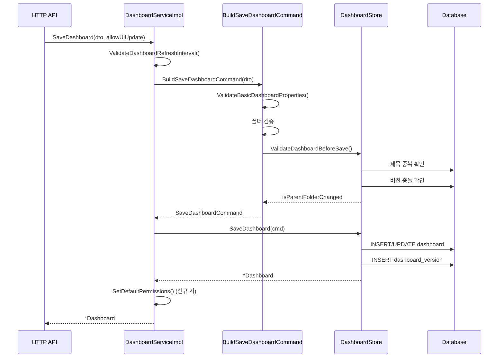

# 08. Grafana 대시보드 시스템 심화

## 목차

1. [대시보드 모델](#1-대시보드-모델)
2. [서비스 인터페이스 계층](#2-서비스-인터페이스-계층)
3. [SaveDashboard 흐름](#3-savedashboard-흐름)
4. [버전 관리](#4-버전-관리)
5. [프론트엔드 렌더링](#5-프론트엔드-렌더링)
6. [CUE 스키마](#6-cue-스키마)
7. [Kubernetes API 통합](#7-kubernetes-api-통합)
8. [프로비저닝](#8-프로비저닝)
9. [대시보드 ACL](#9-대시보드-acl)

---

## 1. 대시보드 모델

### 1.1 Dashboard 구조체

```
파일: pkg/services/dashboards/models.go (line 32~56)
```

Grafana의 대시보드는 `Dashboard` 구조체로 표현된다. 메타데이터와 실제 대시보드 콘텐츠(`Data`)를 분리한 설계가 특징이다:

```go
type Dashboard struct {
    ID         int64  `xorm:"pk autoincr 'id'"`
    UID        string `xorm:"uid"`
    Slug       string
    OrgID      int64  `xorm:"org_id"`
    GnetID     int64  `xorm:"gnet_id"`
    Version    int
    PluginID   string `xorm:"plugin_id"`
    APIVersion string `xorm:"api_version"`

    Created time.Time
    Updated time.Time
    Deleted time.Time

    UpdatedBy int64
    CreatedBy int64
    FolderID  int64  `xorm:"folder_id"`    // Deprecated: use FolderUID
    FolderUID string `xorm:"folder_uid"`
    IsFolder  bool
    HasACL    bool   `xorm:"has_acl"`

    Title string
    Data  *simplejson.Json
}
```

| 필드 | 타입 | 설명 |
|------|------|------|
| `ID` | int64 | 내부 자동증가 PK (인스턴스별 고유) |
| `UID` | string | 인스턴스 간 고유 식별자 (8~40자) |
| `Slug` | string | URL 친화적 제목 (slugify) |
| `OrgID` | int64 | 소속 조직 ID |
| `GnetID` | int64 | grafana.com 대시보드 포털 ID |
| `Version` | int | 저장 시마다 증가하는 버전 |
| `PluginID` | string | 플러그인이 제공한 대시보드인 경우 플러그인 ID |
| `APIVersion` | string | K8s API 버전 (예: "dashboard.grafana.app/v1beta1") |
| `FolderUID` | string | 부모 폴더 UID |
| `IsFolder` | bool | 폴더 여부 (폴더도 대시보드 테이블에 저장) |
| `HasACL` | bool | 커스텀 ACL 존재 여부 |
| `Data` | *simplejson.Json | 대시보드 전체 JSON 콘텐츠 |

### 1.2 Data 필드의 이중 구조

`Data` 필드(`*simplejson.Json`)에는 패널, 변수, 시간 설정 등 대시보드의 모든 콘텐츠가 JSON으로 저장된다. 메타데이터 필드(ID, UID, Version)가 구조체와 Data JSON 양쪽에 동시에 존재하며, setter 메서드가 양쪽을 동기화한다:

```go
func (d *Dashboard) SetID(id int64) {
    d.ID = id
    d.Data.Set("id", id)
}

func (d *Dashboard) SetUID(uid string) {
    d.UID = uid
    d.Data.Set("uid", uid)
}

func (d *Dashboard) SetVersion(version int) {
    d.Version = version
    d.Data.Set("version", version)
}
```

이 이중 구조의 이유는 호환성이다. 프론트엔드는 Data JSON에서 id/uid/version을 읽고, 백엔드 DB 쿼리는 구조체 필드를 사용한다.

### 1.3 대시보드 타입 상수

```go
const (
    DashTypeDB       = "db"        // 데이터베이스 저장 대시보드
    DashTypeSnapshot = "snapshot"   // 스냅샷 대시보드
)
```

### 1.4 NewDashboardFromJson

JSON에서 대시보드를 생성할 때, K8s 형식과 레거시 형식을 모두 지원한다:

```go
func NewDashboardFromJson(data *simplejson.Json) *Dashboard {
    // K8s 형식 감지: apiVersion 필드가 있으면 K8s 파싱
    if apiVersion, err := data.Get("apiVersion").String(); err == nil && apiVersion != "" {
        return parseK8sDashboard(data)
    }
    // 레거시 형식 파싱
    dash := &Dashboard{}
    dash.Data = data
    dash.Title = dash.Data.Get("title").MustString()
    // ...
    return dash
}
```

K8s 형식은 다음과 같은 구조를 가진다:

```json
{
  "apiVersion": "dashboard.grafana.app/v1",
  "kind": "Dashboard",
  "metadata": {
    "name": "dashboard-uid",
    "namespace": "org-1",
    "generation": 5
  },
  "spec": {
    "title": "My Dashboard",
    "panels": [...]
  }
}
```

### 1.5 SaveDashboardDTO

서비스 계층에서 대시보드 저장 요청을 전달하는 DTO 구조체:

```go
type SaveDashboardDTO struct {
    OrgID     int64
    UpdatedAt time.Time
    User      identity.Requester  // 요청자 정보
    Message   string               // 커밋 메시지
    Overwrite bool                 // 기존 대시보드 덮어쓰기
    Dashboard *Dashboard           // 대시보드 데이터
}
```

### 1.6 SaveDashboardCommand

DB 저장을 위한 커맨드 구조체:

```go
type SaveDashboardCommand struct {
    Dashboard    *simplejson.Json `json:"dashboard" binding:"Required"`
    UserID       int64            `json:"userId"`
    Overwrite    bool             `json:"overwrite"`
    Message      string           `json:"message"`
    OrgID        int64            `json:"-"`
    RestoredFrom int              `json:"-"`
    PluginID     string           `json:"-"`
    APIVersion   string           `json:"-"`
    FolderID     int64            `json:"folderId"`    // Deprecated
    FolderUID    string           `json:"folderUid"`
    IsFolder     bool             `json:"isFolder"`
    UpdatedAt    time.Time
}
```

---

## 2. 서비스 인터페이스 계층

### 2.1 DashboardService 인터페이스

```
파일: pkg/services/dashboards/dashboard.go (line 21~45)
```

```go
type DashboardService interface {
    BuildSaveDashboardCommand(ctx, dto, validateProvisionedDashboard) (*SaveDashboardCommand, error)
    DeleteDashboard(ctx, dashboardId, dashboardUID, orgId) error
    DeleteAllDashboards(ctx, orgID) error
    FindDashboards(ctx, query) ([]DashboardSearchProjection, error)
    GetDashboard(ctx, query) (*Dashboard, error)
    GetDashboards(ctx, query) ([]*Dashboard, error)
    GetDashboardTags(ctx, query) ([]*DashboardTagCloudItem, error)
    GetDashboardUIDByID(ctx, query) (*DashboardRef, error)
    ImportDashboard(ctx, dto) (*Dashboard, error)
    SaveDashboard(ctx, dto, allowUiUpdate) (*Dashboard, error)
    SearchDashboards(ctx, query) (model.HitList, error)
    CountInFolders(ctx, orgID, folderUIDs, user) (int64, error)
    GetAllDashboardsByOrgId(ctx, orgID) ([]*Dashboard, error)
    CleanUpDashboard(ctx, dashboardUID, dashboardId, orgId) error
    CountDashboardsInOrg(ctx, orgID) (int64, error)
    SetDefaultPermissions(ctx, dto, dash, provisioned)
    ValidateDashboardRefreshInterval(minRefreshInterval, targetRefreshInterval) error
    ValidateBasicDashboardProperties(title, uid, message) error
    GetDashboardsByLibraryPanelUID(ctx, libraryPanelUID, orgID) ([]*DashboardRef, error)
}
```

### 2.2 Store 인터페이스

```
파일: pkg/services/dashboards/dashboard.go (line 82~108)
```

DB 직접 조작을 담당하는 저수준 인터페이스:

```go
type Store interface {
    DeleteDashboard(ctx, cmd) error
    CleanupAfterDelete(ctx, cmd) error
    FindDashboards(ctx, query) ([]DashboardSearchProjection, error)
    GetDashboard(ctx, query) (*Dashboard, error)
    GetDashboardsByPluginID(ctx, query) ([]*Dashboard, error)
    GetDashboardTags(ctx, query) ([]*DashboardTagCloudItem, error)
    GetProvisionedDashboardData(ctx, name) ([]*DashboardProvisioning, error)
    SaveDashboard(ctx, cmd) (*Dashboard, error)
    SaveProvisionedDashboard(ctx, cmd, provisioning) (*Dashboard, error)
    ValidateDashboardBeforeSave(ctx, dashboard, overwrite) (bool, error)
    CountInOrg(ctx, orgID, isFolder) (int64, error)
    DeleteDashboardsInFolders(ctx, request) error
    GetAllDashboardsByOrgId(ctx, orgID) ([]*Dashboard, error)
}
```

### 2.3 DashboardAccessService

접근 제어를 위한 서비스:

```go
type DashboardAccessService interface {
    HasDashboardAccess(ctx, user, verb, namespace, name) (bool, error)
}
```

`verb`에 따라 다른 권한을 확인한다:
- `get` → `dashboards:read`
- `update` → `dashboards:write`

### 2.4 DashboardProvisioningService

프로비저닝된 대시보드 관리:

```go
type DashboardProvisioningService interface {
    DeleteOrphanedProvisionedDashboards(ctx, cmd) error
    DeleteProvisionedDashboard(ctx, dashboardID, orgID) error
    GetProvisionedDashboardData(ctx, name) ([]*DashboardProvisioning, error)
    SaveFolderForProvisionedDashboards(ctx, cmd, managerIdentity) (*folder.Folder, error)
    SaveProvisionedDashboard(ctx, dto, provisioning) (*Dashboard, error)
    UnprovisionDashboard(ctx, dashboardID) error
}
```

### 2.5 인터페이스 계층 구조

```
                    ┌────────────────────────┐
                    │    HTTP API Handler     │
                    └────────────┬───────────┘
                                 │
                    ┌────────────▼───────────┐
                    │   DashboardService     │  비즈니스 로직, 검증
                    │   (interface)           │
                    ├────────────────────────┤
                    │ DashboardAccessService │  접근 제어
                    │ PluginService          │  플러그인 대시보드
                    │ ProvisioningService    │  프로비저닝
                    └────────────┬───────────┘
                                 │
                    ┌────────────▼───────────┐
                    │       Store            │  DB 직접 조작
                    │   (interface)           │
                    └────────────┬───────────┘
                                 │
                    ┌────────────▼───────────┐
                    │    SQLStore / K8s      │  실제 저장소
                    └────────────────────────┘
```

### 2.6 DashboardServiceImpl

```
파일: pkg/services/dashboards/service/dashboard_service.go (line 84~103)
```

```go
type DashboardServiceImpl struct {
    cfg                    *setting.Cfg
    log                    log.Logger
    dashboardStore         dashboards.Store
    folderService          folder.Service
    orgService             org.Service
    features               featuremgmt.FeatureToggles
    folderPermissions      accesscontrol.FolderPermissionsService
    dashboardPermissions   accesscontrol.DashboardPermissionsService
    ac                     accesscontrol.AccessControl
    acService              accesscontrol.Service
    k8sclient              dashboardclient.K8sHandlerWithFallback
    metrics                *dashboardsMetrics
    publicDashboardService publicdashboards.ServiceWrapper
    serverLockService      *serverlock.ServerLockService
    kvstore                kvstore.KVStore
    dual                   dualwrite.Service

    dashboardPermissionsReady chan struct{}
}
```

`DashboardServiceImpl`은 네 가지 인터페이스를 동시에 구현한다:

```go
var (
    _ dashboards.DashboardService             = (*DashboardServiceImpl)(nil)
    _ dashboards.DashboardProvisioningService = (*DashboardServiceImpl)(nil)
    _ dashboards.PluginService                = (*DashboardServiceImpl)(nil)
    _ dashboards.DashboardAccessService       = (*DashboardServiceImpl)(nil)
)
```

또한 `registry.BackgroundService` 인터페이스도 구현하여, K8s 대시보드 정리 작업을 백그라운드에서 실행한다:

```go
func (dr *DashboardServiceImpl) Run(ctx context.Context) error {
    cleanupBackgroundJobStopped := dr.startK8sDeletedDashboardsCleanupJob(ctx)
    <-ctx.Done()
    <-cleanupBackgroundJobStopped
    return ctx.Err()
}
```

---

## 3. SaveDashboard 흐름

### 3.1 전체 저장 흐름

```
파일: pkg/services/dashboards/service/dashboard_service.go (line 1216~1244)
```

```go
func (dr *DashboardServiceImpl) SaveDashboard(ctx context.Context,
    dto *dashboards.SaveDashboardDTO, allowUiUpdate bool) (*dashboards.Dashboard, error) {

    // 1. 리프레시 간격 검증
    if err := dr.ValidateDashboardRefreshInterval(
        dr.cfg.MinRefreshInterval,
        dto.Dashboard.Data.Get("refresh").MustString("")); err != nil {
        // 최소 간격으로 자동 조정
        dto.Dashboard.Data.Set("refresh", dr.cfg.MinRefreshInterval)
    }

    // 2. 저장 커맨드 빌드 (검증 포함)
    cmd, err := dr.BuildSaveDashboardCommand(ctx, dto, !allowUiUpdate)
    if err != nil {
        return nil, err
    }

    // 3. DB에 저장
    dash, err := dr.saveDashboard(ctx, cmd)
    if err != nil {
        return nil, err
    }

    // 4. 새 대시보드인 경우 기본 권한 설정
    if dto.Dashboard.ID == 0 {
        dr.SetDefaultPermissions(ctx, dto, dash, false)
    }

    return dash, nil
}
```

### 3.2 BuildSaveDashboardCommand 상세

```
파일: pkg/services/dashboards/service/dashboard_service.go (line 681~)
```

이 함수는 저장 전 모든 검증을 수행한다:

```go
func (dr *DashboardServiceImpl) BuildSaveDashboardCommand(ctx context.Context,
    dto *dashboards.SaveDashboardDTO, validateProvisionedDashboard bool) (*dashboards.SaveDashboardCommand, error) {

    dash := dto.Dashboard
    dash.OrgID = dto.OrgID
    dash.Title = strings.TrimSpace(dash.Title)
    dash.Data.Set("title", dash.Title)
    dash.SetUID(strings.TrimSpace(dash.UID))

    // 기본 속성 검증 (제목 필수, UID 길이/문자 검증)
    dr.ValidateBasicDashboardProperties(dash.Title, dash.UID, dto.Message)

    // 폴더 검증: 폴더는 상위 폴더를 가질 수 없음
    if dash.IsFolder && dash.FolderID > 0 {
        return nil, dashboards.ErrDashboardFolderCannotHaveParent
    }

    // "General" 이름 예약어 검증
    if dash.IsFolder && strings.EqualFold(dash.Title, dashboards.RootFolderName) {
        return nil, dashboards.ErrDashboardFolderNameExists
    }

    // 리프레시 간격 검증
    dr.ValidateDashboardRefreshInterval(...)

    // 폴더 존재 확인 (FolderUID로 조회)
    if dash.FolderUID != "" {
        folder, err := dr.folderService.Get(ctx, &folder.GetFolderQuery{
            UID:   &dash.FolderUID,
            OrgID: dash.OrgID,
        })
        dash.FolderID = folder.ID
        dash.FolderUID = folder.UID
    }

    // DB 수준 검증 (제목 중복, 버전 충돌)
    isParentFolderChanged, err := dr.ValidateDashboardBeforeSave(ctx, dash, dto.Overwrite)

    // SaveDashboardCommand 생성
    cmd := dash.GetDashboardModel()
    // ...
    return cmd, nil
}
```

### 3.3 저장 흐름 시퀀스



### 3.4 검증 단계 요약

| 단계 | 검증 내용 | 실패 시 에러 |
|------|----------|-------------|
| 1 | 제목 비어있음 | ErrDashboardTitleEmpty |
| 2 | UID 길이 (8~40자) | ErrDashboardInvalidUid |
| 3 | 폴더가 상위 폴더를 가짐 | ErrDashboardFolderCannotHaveParent |
| 4 | "General" 폴더명 사용 | ErrDashboardFolderNameExists |
| 5 | 리프레시 간격 < 최소값 | ErrDashboardRefreshIntervalTooShort |
| 6 | 부모 폴더 존재 확인 | folder not found |
| 7 | 같은 폴더 내 제목 중복 | ErrDashboardWithSameNameInFolderExists |
| 8 | 버전 충돌 (Overwrite=false) | ErrDashboardVersionMismatch (HTTP 412) |

---

## 4. 버전 관리

### 4.1 DashboardVersion 모델

```
파일: pkg/services/dashboardversion/model.go (line 20~32)
```

```go
type DashboardVersion struct {
    ID            int64            `xorm:"pk autoincr 'id'"`
    DashboardID   int64            `xorm:"dashboard_id"`
    ParentVersion int              // 이전 버전 번호
    RestoredFrom  int              // 복원된 버전 (0이면 새 저장)
    Version       int              // 현재 버전 번호
    APIVersion    string           `xorm:"api_version"`
    Created       time.Time
    CreatedBy     int64
    Message       string           // 저장 메시지 (Git 커밋 메시지와 유사)
    Data          *simplejson.Json // 해당 버전의 전체 대시보드 JSON
}
```

### 4.2 버전 테이블 구조

```
dashboard 테이블 (현재 버전)           dashboard_version 테이블 (이력)
┌────┬─────┬─────────┬───────┐     ┌────┬──────────────┬─────────┬──────────┬──────┐
│ id │ uid │ title   │version│     │ id │ dashboard_id │ version │ parent   │ data │
├────┼─────┼─────────┼───────┤     ├────┼──────────────┼─────────┼──────────┼──────┤
│ 1  │abc  │My Dash  │   5   │     │ 1  │      1       │    1    │    0     │{...} │
│ 2  │def  │Other    │   3   │     │ 2  │      1       │    2    │    1     │{...} │
└────┴─────┴─────────┴───────┘     │ 3  │      1       │    3    │    2     │{...} │
                                    │ 4  │      1       │    4    │    3     │{...} │
                                    │ 5  │      1       │    5    │    4     │{...} │
                                    │ 6  │      2       │    1    │    0     │{...} │
                                    │ 7  │      2       │    2    │    1     │{...} │
                                    │ 8  │      2       │    3    │    2     │{...} │
                                    └────┴──────────────┴─────────┴──────────┴──────┘
```

### 4.3 버전 충돌 감지

대시보드 저장 시 낙관적 잠금(Optimistic Locking)을 사용한다:

1. 사용자 A가 버전 3의 대시보드를 편집 시작
2. 사용자 B가 버전 3의 대시보드를 편집하여 버전 4로 저장
3. 사용자 A가 저장 시도 → `Overwrite=false`이면 버전 불일치로 **HTTP 412 Precondition Failed** 반환
4. 사용자 A가 `Overwrite=true`로 재시도하면 강제 저장

```
사용자 A                        사용자 B
   │                                │
   ├── GET /api/dashboards/uid/abc  │
   │   (version: 3)                 │
   │                                ├── GET /api/dashboards/uid/abc
   │                                │   (version: 3)
   │                                │
   │                                ├── POST /api/dashboards/db
   │                                │   (version: 3 → 4 저장 성공)
   │                                │
   ├── POST /api/dashboards/db     │
   │   (version: 3 → 충돌!)        │
   │   HTTP 412 Precondition Failed │
   │                                │
   ├── POST /api/dashboards/db     │
   │   (overwrite: true → 5 저장)  │
   │                                │
```

### 4.4 버전 정리

오래된 버전은 주기적으로 정리된다:

```
파일: pkg/services/dashboardversion/dashverimpl/xorm_store.go
```

```go
func (ss *sqlStore) GetBatch(ctx context.Context, cmd *dashver.DeleteExpiredVersionsCommand,
    perBatch int, versionsToKeep int) ([]any, error) {
    // versionsToKeep 개수 이상 보관된 대시보드에서
    // 가장 오래된 버전부터 perBatch 개씩 삭제 대상 선택
    versionIdsToDeleteQuery := `SELECT id
        FROM dashboard_version, (
            SELECT dashboard_id, count(version) as count, min(version) as min
            FROM dashboard_version
            GROUP BY dashboard_id
        ) AS vtd
        WHERE dashboard_version.dashboard_id=vtd.dashboard_id
        AND version < vtd.min + vtd.count - ?
        LIMIT ?`
    // ...
}
```

---

## 5. 프론트엔드 렌더링

### 5.1 DashboardPage.tsx

```
파일: public/app/features/dashboard/containers/DashboardPage.tsx
```

`DashboardPage`는 Redux에 연결된 클래스 컴포넌트(`PureComponent`)다:

```typescript
export const mapStateToProps = (state: StoreState) => ({
    initPhase: state.dashboard.initPhase,   // 초기화 단계
    initError: state.dashboard.initError,   // 초기화 에러
    dashboard: state.dashboard.getModel(),  // DashboardModel 인스턴스
    navIndex: state.navIndex,               // 네비게이션 인덱스
});

const mapDispatchToProps = {
    initDashboard,                  // 대시보드 초기화 액션
    cleanUpDashboardAndVariables,   // 정리 액션
    notifyApp,                      // 알림
    cancelVariables,                // 변수 취소
    templateVarsChangedInUrl,       // URL 변수 변경
};
```

`DashboardPage`의 라이프사이클:

```
DashboardPage 마운트
  │
  ├── initDashboard(uid) — Redux 액션 디스패치
  │     ├── API 호출: GET /api/dashboards/uid/{uid}
  │     ├── DashboardModel 생성
  │     ├── 변수 초기화
  │     └── initPhase 상태 업데이트
  │
  ├── initPhase에 따른 렌더링
  │     ├── NotStarted → 로딩 표시
  │     ├── Fetching → 로딩 표시
  │     ├── Error → DashboardPageError
  │     └── Completed → 대시보드 렌더링
  │
  └── 대시보드 렌더링
        ├── DashNav (상단 네비게이션)
        ├── SubMenu (변수 드롭다운)
        ├── DashboardGrid (패널 그리드)
        ├── PanelEditor (패널 편집 모드)
        └── PanelInspector (패널 검사)
```

### 5.2 DashboardModel.ts

```
파일: public/app/features/dashboard/state/DashboardModel.ts
```

프론트엔드의 핵심 모델 클래스:

```typescript
export class DashboardModel implements TimeModel {
    id?: any;
    uid: any;
    title: string;
    description: any;
    tags: any;
    timezone: any;
    weekStart: any;
    editable: any;
    graphTooltip: DashboardCursorSync;
    time: any;                         // { from: 'now-6h', to: 'now' }
    liveNow?: boolean;
    preload?: boolean;
    timepicker: any;
    templating: { list: any[] };       // 템플릿 변수 목록
    annotations: { list: AnnotationQuery[] };
    refresh?: string;                  // 자동 새로고침 간격
    snapshot: any;
    schemaVersion: number;
    version: number;
    links: DashboardLink[];
    gnetId: any;
    panels: PanelModel[];              // 패널 배열
    panelInEdit?: PanelModel;
    panelInView?: PanelModel;
    events: EventBusExtended;          // 이벤트 버스
    meta: DashboardMeta;               // 메타데이터 (권한 등)
}
```

생성자에서 JSON 데이터를 모델로 변환:

```typescript
constructor(data: Dashboard, meta?: DashboardMeta) {
    this.id = data.id;
    this.uid = data.uid || meta?.uid || null;
    this.title = data.title ?? 'No Title';
    this.time = data.time ?? { from: 'now-6h', to: 'now' };
    this.schemaVersion = data.schemaVersion ?? 0;
    this.version = data.version ?? 0;
    this.panels = map(data.panels ?? [], (panelData) => new PanelModel(panelData));
    this.templating = this.ensureListExist(data.templating);
    this.annotations = this.ensureListExist(data.annotations);
    // ...
}
```

### 5.3 PanelModel.ts

```
파일: public/app/features/dashboard/state/PanelModel.ts
```

각 패널을 표현하는 모델:

```typescript
export interface GridPos {
    x: number;   // 그리드 X 좌표 (0~23)
    y: number;   // 그리드 Y 좌표
    w: number;   // 너비 (그리드 칼럼 수)
    h: number;   // 높이 (그리드 행 수)
    static?: boolean;
}

export class PanelModel implements DataConfigSource, IPanelModel {
    id!: number;              // 패널 고유 ID
    gridPos!: GridPos;        // 그리드 위치/크기
    type!: string;            // 패널 타입 (timeseries, stat, table 등)
    title!: string;           // 패널 제목
    targets: DataQuery[];     // 데이터 쿼리 배열
    datasource: DataSourceRef | null;  // 데이터소스 참조
    transformations?: DataTransformerConfig[];
    fieldConfig: FieldConfigSource;
    options: { [key: string]: any };
    maxDataPoints?: number | null;
    interval?: string;
    repeat?: string;          // 반복 변수명
    repeatDirection?: string; // 반복 방향
    collapsed?: boolean;      // 행 접힘 상태
    panels?: PanelModel[];    // 행 내부 패널 (collapsed row)
    links: DataLink[];
    transparent: boolean;     // 투명 배경
    // ...
}
```

패널 기본값:

```typescript
const defaults: any = {
    gridPos: { x: 0, y: 0, h: 3, w: 6 },
    targets: [{ refId: 'A' }],
    transparent: false,
    options: {},
    links: [],
    transformations: [],
    fieldConfig: { defaults: {}, overrides: [] },
    title: '',
};
```

### 5.4 DashboardGrid.tsx

```
파일: public/app/features/dashboard/dashgrid/DashboardGrid.tsx
```

`react-grid-layout` 라이브러리를 사용한 그리드 레이아웃:

```typescript
import ReactGridLayout from 'react-grid-layout';
import { GRID_CELL_HEIGHT, GRID_CELL_VMARGIN, GRID_COLUMN_COUNT } from 'app/core/constants';

export class DashboardGrid extends PureComponent<Props, State> {
    private panelMap: { [key: string]: PanelModel } = {};
    // ...
}
```

그리드 상수:

| 상수 | 값 | 설명 |
|------|-----|------|
| `GRID_COLUMN_COUNT` | 24 | 그리드 칼럼 수 |
| `GRID_CELL_HEIGHT` | 30 (px) | 셀 높이 |
| `GRID_CELL_VMARGIN` | 8 (px) | 셀 간 수직 여백 |

패널의 `gridPos`는 이 24칼럼 그리드 시스템 위에 배치된다:

```
┌─────────────────────────────────────────────────┐
│                 24 columns                       │
├────────────────────┬────────────────────────────┤
│ Panel A            │ Panel B                     │
│ gridPos:           │ gridPos:                    │
│   x: 0, y: 0      │   x: 12, y: 0              │
│   w: 12, h: 8     │   w: 12, h: 8              │
├────────────────────┴────────────────────────────┤
│ Panel C                                          │
│ gridPos:                                         │
│   x: 0, y: 8                                    │
│   w: 24, h: 6                                   │
└─────────────────────────────────────────────────┘
```

`react-grid-layout`은 드래그 앤 드롭으로 패널 위치를 변경하고, 리사이즈 핸들로 크기를 조절할 수 있게 한다. 변경사항은 각 `PanelModel`의 `gridPos`에 반영된다.

---

## 6. CUE 스키마

### 6.1 dashboard_kind.cue

```
파일: kinds/dashboard/dashboard_kind.cue
```

Grafana는 CUE 언어를 사용하여 대시보드 스키마를 정의한다:

```cue
name:        "Dashboard"
maturity:    "experimental"
description: "A Grafana dashboard."

lineage: schemas: [{
    version: [0, 0]
    schema: {
        spec: {
            id?: int64 | null
            uid?: string
            title?: string
            description?: string
            revision?: int64
            gnetId?: int64
            tags?: [...string]
            timezone?: string | *"browser"
            editable?: bool | *true
            graphTooltip?: #DashboardCursorSync
            time?: {
                from: string | *"now-6h"
                to:   string | *"now"
            }
            timepicker?: #TimePickerConfig
            // ...
        }
    }
}]
```

CUE 스키마의 역할:
1. **타입 안전성**: 대시보드 JSON의 구조를 엄격하게 정의
2. **기본값**: `*"browser"`, `*true` 등으로 기본값 명시
3. **코드 생성**: CUE에서 Go 타입, TypeScript 타입, OpenAPI 스펙 자동 생성
4. **버전 관리**: `lineage: schemas` 배열로 스키마 버전 이력 관리

### 6.2 스키마 버전 마이그레이션

대시보드 JSON에는 `schemaVersion` 필드가 있다. 구버전 스키마의 대시보드를 로드할 때 자동 마이그레이션이 수행된다:

```
schemaVersion 17 → 38 (현재)
│
├── v17→v18: Angular 패널 settings 이전
├── v18→v19: 변수 format 필드 추가
├── v20→v21: 패널 fieldConfig 구조 변경
├── ...
└── v37→v38: 최신 마이그레이션
```

프론트엔드의 `DashboardMigrator` 클래스가 이 마이그레이션을 담당한다.

---

## 7. Kubernetes API 통합

### 7.1 Dashboard CRD

Grafana는 대시보드를 Kubernetes Custom Resource로 관리하는 방향으로 전환 중이다.

```
파일: apps/dashboard/pkg/apis/dashboard/v1beta1/
```

주요 파일:
- `types.go`: DashboardWithAccessInfo, DashboardAccess 타입 정의
- `dashboard_spec.go`: DashboardSpec = common.Unstructured (비정형 JSON)
- `register.go`: API 그룹 등록
- `validation.go`: K8s 수준 검증

### 7.2 DashboardSpec

```go
// 파일: apps/dashboard/pkg/apis/dashboard/v1beta1/dashboard_spec.go
type DashboardSpec = common.Unstructured
```

대시보드 스펙은 `Unstructured` 타입으로 정의된다. 이는 대시보드 JSON의 유연한 구조를 K8s 타입 시스템에서 수용하기 위한 선택이다.

### 7.3 DashboardWithAccessInfo

```go
// 파일: apps/dashboard/pkg/apis/dashboard/v1beta1/types.go
type DashboardWithAccessInfo struct {
    Dashboard `json:",inline"`
    Access DashboardAccess `json:"access"`
}

type DashboardAccess struct {
    Slug     string `json:"slug,omitempty"`
    Url      string `json:"url,omitempty"`
    IsPublic bool   `json:"isPublic"`

    CanSave    bool `json:"canSave"`
    CanEdit    bool `json:"canEdit"`
    CanAdmin   bool `json:"canAdmin"`
    CanStar    bool `json:"canStar"`
    CanDelete  bool `json:"canDelete"`
    AnnotationsPermissions *AnnotationPermission `json:"annotationsPermissions"`
}
```

이 구조는 레거시 DTO 패턴을 유지하면서, 접근 권한 정보를 대시보드와 함께 반환하는 것이다. 프론트엔드가 한 번의 API 호출로 대시보드 데이터와 권한 정보를 모두 받을 수 있다.

### 7.4 네임스페이스 매핑

K8s API에서 Grafana 조직은 네임스페이스로 매핑된다:

```
Grafana Org ID 1 → namespace: "org-1"
Grafana Org ID 5 → namespace: "org-5"
```

### 7.5 Dual Write 전략

레거시 SQL과 K8s 통합 스토리지 간 전환을 위해 "Dual Write" 패턴을 사용한다:

```
                 ┌──────────────┐
                 │ DashboardSvc │
                 └──────┬───────┘
                        │
              ┌─────────┼─────────┐
              ▼                   ▼
    ┌──────────────┐    ┌──────────────┐
    │  Legacy SQL  │    │  K8s API     │
    │  (SQLStore)  │    │  (Unified)   │
    └──────────────┘    └──────────────┘
```

`dualwrite.Service`가 어떤 저장소에서 읽을지 결정한다:

```go
readingFromLegacy := dualwrite.IsReadingLegacyDashboardsAndFolders(ctx, dr.dual)
```

---

## 8. 프로비저닝

### 8.1 프로비저닝 개요

```
파일: pkg/services/provisioning/dashboards/
```

프로비저닝은 파일 시스템의 YAML/JSON 파일에서 대시보드를 자동으로 로드하고 동기화하는 메커니즘이다.

### 8.2 설정 파일 구조

프로비저닝 설정은 `conf/provisioning/dashboards/` 디렉토리에 YAML 파일로 정의한다:

```yaml
# apiVersion: 1
providers:
  - name: 'default'
    orgId: 1
    folder: 'Provisioned'
    folderUid: 'provisioned-folder'
    type: file
    disableDeletion: false
    updateIntervalSeconds: 30
    allowUiUpdates: false
    options:
      path: /var/lib/grafana/dashboards
      foldersFromFilesStructure: false
```

### 8.3 config 구조체

```
파일: pkg/services/provisioning/dashboards/types.go
```

```go
type config struct {
    Name                  string
    Type                  string          // "file"
    OrgID                 int64
    Folder                string          // 대시보드를 저장할 폴더명
    FolderUID             string
    Editable              bool            // UI에서 수정 가능 여부
    Options               map[string]any  // path, foldersFromFilesStructure 등
    DisableDeletion       bool            // 파일 삭제 시 대시보드 삭제 방지
    UpdateIntervalSeconds int64           // 폴링 간격
    AllowUIUpdates        bool            // UI 수정 허용
}
```

### 8.4 설정 파일 버전

두 가지 설정 파일 형식을 지원한다:

| 형식 | 구조 | 설명 |
|------|------|------|
| v0 | 단순 객체 배열 | 레거시 형식 |
| v1 | `apiVersion: 1` + `providers:` | 현재 권장 형식 |

```
파일: pkg/services/provisioning/dashboards/config_reader.go
```

```go
func (cr *configReader) parseConfigs(file fs.DirEntry) ([]*config, error) {
    yamlFile, _ := os.ReadFile(filename)

    apiVersion := &configVersion{APIVersion: 0}
    yaml.Unmarshal(yamlFile, &apiVersion)

    if apiVersion.APIVersion > 0 {
        // v1 형식 파싱
        v1 := &configV1{}
        yaml.Unmarshal(yamlFile, &v1)
        return v1.mapToDashboardsAsConfig()
    }

    // v0 형식 파싱
    var v0 []*configV0
    yaml.Unmarshal(yamlFile, &v0)
    return mapV0ToDashboardsAsConfig(v0)
}
```

### 8.5 FileReader

```
파일: pkg/services/provisioning/dashboards/file_reader.go
```

`FileReader`는 디스크에서 대시보드 JSON 파일을 읽어 DB에 저장하는 핵심 컴포넌트다:

```go
type FileReader struct {
    Cfg                          *config
    Path                         string
    log                          log.Logger
    dashboardProvisioningService dashboards.DashboardProvisioningService
    dashboardStore               utils.DashboardStore
    FoldersFromFilesStructure    bool
    folderService                folder.Service
    foldersInUnified             bool

    mux          sync.RWMutex
    usageTracker *usageTracker
}
```

### 8.6 pollChanges - 자동 동기화

```go
func (fr *FileReader) pollChanges(ctx context.Context) {
    interval := fr.Cfg.UpdateIntervalSeconds
    if interval <= 10 {
        // 10초 이하면 파일시스템 감시 모드 시도
        err := fr.watchChanges(ctx)
        if err == nil {
            return
        }
        // 감시 실패 시 30초 폴링으로 폴백
        interval = 30
    }

    ticker := time.NewTicker(time.Duration(int64(time.Second) * interval))
    for {
        select {
        case <-ticker.C:
            fr.walkDisk(ctx)  // 디스크 전체 스캔
        case <-ctx.Done():
            return
        }
    }
}
```

동기화 전략:
- `UpdateIntervalSeconds <= 10`: `fsnotify`를 사용한 파일시스템 감시 시도 → 실패 시 30초 폴링
- `UpdateIntervalSeconds > 10`: 설정된 간격으로 디스크 폴링

### 8.7 createDashboardJSON

파일에서 읽은 JSON을 저장 가능한 DTO로 변환:

```go
func createDashboardJSON(data *simplejson.Json, lastModified time.Time,
    cfg *config, folderID int64, folderUID string) (*dashboards.SaveDashboardDTO, error) {

    dash := &dashboards.SaveDashboardDTO{}
    dash.Dashboard = dashboards.NewDashboardFromJson(data)
    dash.UpdatedAt = lastModified
    dash.Overwrite = true              // 프로비저닝은 항상 덮어쓰기
    dash.OrgID = cfg.OrgID
    dash.Dashboard.FolderUID = folderUID

    if dash.Dashboard.Title == "" {
        return nil, dashboards.ErrDashboardTitleEmpty
    }
    return dash, nil
}
```

### 8.8 프로비저닝 흐름 다이어그램

```
시스템 시작
  │
  ├── ProvisioningService.RunInitProvisioners()
  │     ├── ReadDashboardConfig(dir)
  │     │     └── *.yaml 파일 파싱 → []*config
  │     │
  │     └── 각 config마다:
  │           ├── NewDashboardFileReader(config)
  │           └── fr.walkDisk(ctx)
  │                 ├── 디렉토리 순회
  │                 ├── *.json 파일 읽기
  │                 ├── createDashboardJSON()
  │                 └── SaveProvisionedDashboard()
  │
  └── pollChanges() 고루틴 시작
        │
        ├── [간격 <= 10초] watchChanges() → fsnotify
        │     └── 파일 변경 이벤트 → walkDisk()
        │
        └── [간격 > 10초] ticker → walkDisk()
              ├── 새 파일 → SaveProvisionedDashboard()
              ├── 변경 파일 → SaveProvisionedDashboard(overwrite)
              └── 삭제 파일 → DeleteProvisionedDashboard()
                  (DisableDeletion=true면 건너뛰기)
```

---

## 9. 대시보드 ACL

### 9.1 DashboardACL 모델

```
파일: pkg/services/dashboards/models.go (line 498~510)
```

```go
type DashboardACL struct {
    ID          int64 `xorm:"pk autoincr 'id'"`
    OrgID       int64 `xorm:"org_id"`
    DashboardID int64 `xorm:"dashboard_id"`

    UserID     int64         `xorm:"user_id"`
    TeamID     int64         `xorm:"team_id"`
    Role       *org.RoleType // nullable (Admin, Editor, Viewer)
    Permission dashboardaccess.PermissionType

    Created time.Time
    Updated time.Time
}
```

### 9.2 권한 타입

ACL은 세 가지 대상에 대해 설정 가능하다:

| 대상 | 필드 | 설명 |
|------|------|------|
| 사용자 | UserID | 특정 사용자에게 권한 부여 |
| 팀 | TeamID | 특정 팀에게 권한 부여 |
| 역할 | Role | 조직 역할(Admin/Editor/Viewer)에 권한 부여 |

권한 수준:

| PermissionType | 값 | 권한 |
|---------------|-----|------|
| View | 1 | 보기 |
| Edit | 2 | 편집 |
| Admin | 4 | 관리 (ACL 변경 포함) |

### 9.3 DashboardACLInfoDTO

API 응답에 사용되는 확장된 ACL DTO:

```go
type DashboardACLInfoDTO struct {
    OrgID       int64  `json:"-"`
    DashboardID int64  `json:"dashboardId,omitempty"`
    FolderUID   string `json:"folderUid,omitempty"`

    Created time.Time `json:"created"`
    Updated time.Time `json:"updated"`

    UserID         int64                          `json:"userId"`
    UserUID        string                         `json:"userUid"`
    UserLogin      string                         `json:"userLogin"`
    UserEmail      string                         `json:"userEmail"`
    UserAvatarURL  string                         `json:"userAvatarUrl"`
    TeamID         int64                          `json:"teamId"`
    TeamUID        string                         `json:"teamUid"`
    TeamEmail      string                         `json:"teamEmail"`
    Team           string                         `json:"team"`
    Role           *org.RoleType                  `json:"role,omitempty"`
    Permission     dashboardaccess.PermissionType `json:"permission"`
    PermissionName string                         `json:"permissionName"`
    UID            string                         `json:"uid"`
    Title          string                         `json:"title"`
    Slug           string                         `json:"slug"`
    IsFolder       bool                           `json:"isFolder"`
    URL            string                         `json:"url"`
    Inherited      bool                           `json:"inherited"`
}
```

`Inherited` 필드는 해당 권한이 부모 폴더에서 상속되었는지 여부를 나타낸다.

### 9.4 ACL 상속 체계

```
조직 역할 기반 기본 권한
  │
  ▼
폴더 ACL (dashboard_acl WHERE dashboard_id = folder_id)
  │
  ├── 상속 (Inherited = true)
  ▼
대시보드 ACL (dashboard_acl WHERE dashboard_id = dashboard_id)
  │
  └── HasACL = true인 경우만 커스텀 ACL 적용
```

대시보드의 `HasACL` 필드가 `false`이면 부모 폴더의 ACL을 상속받는다. `true`이면 대시보드 자체의 ACL만 적용된다.

### 9.5 RBAC 통합

Grafana는 레거시 ACL에서 RBAC(Role-Based Access Control)로 전환 중이다. `DashboardAccessService`가 이를 추상화한다:

```go
func (dr *DashboardServiceImpl) HasDashboardAccess(ctx context.Context,
    user identity.Requester, verb string, namespace string, name string) (bool, error) {

    dash, err := dr.GetDashboard(ctx, &dashboards.GetDashboardQuery{
        UID:   name,
        OrgID: ns.OrgID,
    })

    var action string
    switch verb {
    case utils.VerbGet:
        action = dashboards.ActionDashboardsRead
    case utils.VerbUpdate:
        action = dashboards.ActionDashboardsWrite
    }

    evaluator := accesscontrol.EvalPermission(action,
        dashboards.ScopeDashboardsProvider.GetResourceScopeUID(name))
    canView, err := dr.ac.Evaluate(ctx, user, evaluator)
    return canView, nil
}
```

RBAC 액션:

| 액션 | 설명 |
|------|------|
| `dashboards:read` | 대시보드 조회 |
| `dashboards:write` | 대시보드 편집 |
| `dashboards:create` | 대시보드 생성 |
| `dashboards:delete` | 대시보드 삭제 |
| `dashboards.permissions:read` | 권한 조회 |
| `dashboards.permissions:write` | 권한 변경 |

---

## 정리

Grafana의 대시보드 시스템은 다음과 같은 아키텍처적 특징을 가진다:

1. **이중 데이터 구조**: 메타데이터(구조체 필드)와 콘텐츠(`Data` JSON)의 분리. setter로 동기화
2. **계층적 서비스 인터페이스**: DashboardService → Store → DB 3계층 구조
3. **낙관적 잠금**: 버전 필드를 이용한 동시 편집 충돌 감지 (HTTP 412)
4. **전체 버전 이력**: dashboard_version 테이블에 모든 버전의 전체 JSON 저장
5. **24칼럼 그리드 시스템**: react-grid-layout 기반, 드래그 앤 드롭 지원
6. **CUE 스키마**: 타입 안전한 스키마 정의, 코드 생성 지원
7. **K8s API 전환**: Dual Write 전략으로 레거시 SQL과 K8s 통합 스토리지 병행
8. **파일 기반 프로비저닝**: YAML 설정으로 대시보드 자동 동기화, fsnotify/폴링 지원
9. **ACL + RBAC**: 레거시 ACL 상속 체계에서 RBAC로 전환 중, 폴더→대시보드 권한 상속
