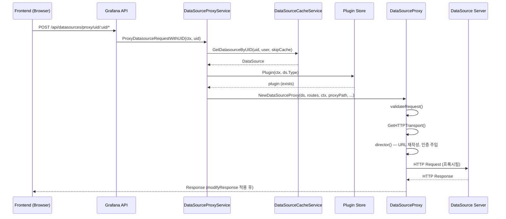

# 09. 데이터소스와 TSDB 심화

## 목차
1. [개요](#1-개요)
2. [DataSource 모델](#2-datasource-모델)
3. [DataSourceService 인터페이스](#3-datasourceservice-인터페이스)
4. [CacheService](#4-cacheservice)
5. [데이터소스 프록시](#5-데이터소스-프록시)
6. [쿼리 파이프라인](#6-쿼리-파이프라인)
7. [플러그인 미들웨어 스택](#7-플러그인-미들웨어-스택)
8. [TSDB 구현체 — Prometheus](#8-tsdb-구현체--prometheus)
9. [TSDB 구현체 — Loki](#9-tsdb-구현체--loki)
10. [TSDB 구현체 — Parca](#10-tsdb-구현체--parca)
11. [인스턴스 매니저와 커넥션 관리](#11-인스턴스-매니저와-커넥션-관리)
12. [보안 및 인증](#12-보안-및-인증)
13. [핵심 설계 원리](#13-핵심-설계-원리)

---

## 1. 개요

Grafana의 데이터소스(DataSource)는 시각화 대시보드와 외부 데이터 저장소(Prometheus, Loki, Elasticsearch 등)를 연결하는 핵심 추상화 계층이다. 사용자가 패널에서 쿼리를 실행하면, Grafana 백엔드는 데이터소스 설정을 기반으로 프록시 요청을 생성하고, 인증 정보를 주입하며, 미들웨어 체인을 거쳐 실제 데이터 저장소에 쿼리를 전달한다.

이 문서에서 다루는 핵심 질문:
- **왜** 데이터소스를 모델/서비스/프록시로 분리했는가?
- **왜** direct 접근 대신 proxy 접근 방식을 권장하는가?
- **왜** 플러그인 미들웨어를 15개 레이어로 구성했는가?
- 각 TSDB 구현체(Prometheus, Loki, Parca)는 **어떤 차이점**을 갖는가?

---

## 2. DataSource 모델

### 2.1 핵심 구조체

**파일 위치**: `pkg/services/datasources/models.go`

```go
// DataSource는 Grafana에서 외부 데이터 저장소에 대한 연결 정보를 담는 핵심 모델이다.
type DataSource struct {
    ID      int64    `json:"id,omitempty" xorm:"pk autoincr 'id'"`
    OrgID   int64    `json:"orgId,omitempty" xorm:"org_id"`
    Version int      `json:"version,omitempty"`

    Name   string   `json:"name"`
    Type   string   `json:"type"`
    Access DsAccess `json:"access"`
    URL    string   `json:"url" xorm:"url"`

    Password          string            `json:"-"`
    User              string            `json:"user"`
    Database          string            `json:"database"`
    BasicAuth         bool              `json:"basicAuth"`
    BasicAuthUser     string            `json:"basicAuthUser"`
    BasicAuthPassword string            `json:"-"`
    WithCredentials   bool              `json:"withCredentials"`
    IsDefault         bool              `json:"isDefault"`
    JsonData          *simplejson.Json  `json:"jsonData"`
    SecureJsonData    map[string][]byte `json:"secureJsonData"`
    ReadOnly          bool              `json:"readOnly"`
    UID               string            `json:"uid" xorm:"uid"`
    APIVersion        string            `json:"apiVersion" xorm:"api_version"`
    IsPrunable        bool              `xorm:"is_prunable"`

    Created time.Time `json:"created,omitempty"`
    Updated time.Time `json:"updated,omitempty"`
}
```

### 2.2 필드별 상세 설명

| 필드 | 타입 | 설명 |
|------|------|------|
| `ID` | int64 | 자동 증가 PK. 레거시 식별자 (deprecated, UID 사용 권장) |
| `UID` | string | 전역 고유 식별자. 모든 API에서 우선 사용 |
| `OrgID` | int64 | 조직별 격리. 멀티테넌시 구현의 핵심 |
| `Name` | string | 사용자가 지정한 데이터소스 이름 |
| `Type` | string | 플러그인 타입 식별자 (예: `"prometheus"`, `"loki"`) |
| `Access` | DsAccess | 접근 모드 — `"direct"` 또는 `"proxy"` |
| `URL` | string | 대상 데이터소스의 엔드포인트 URL |
| `JsonData` | *simplejson.Json | 플러그인별 비밀이 아닌 설정 (JSON) |
| `SecureJsonData` | map[string][]byte | 암호화된 민감 설정 (API 키, 토큰 등) |
| `Version` | int | 낙관적 잠금(optimistic locking)용 버전 번호 |
| `IsPrunable` | bool | 프로비저닝 재동기화 시 자동 삭제 가능 여부 |

### 2.3 DsAccess: direct vs proxy

```go
type DsAccess string

const (
    DS_ACCESS_DIRECT = "direct"
    DS_ACCESS_PROXY  = "proxy"
)
```

**왜 proxy를 권장하는가?**

```
┌─────────────────────────────────────────────────────────────────┐
│                     Direct Mode (비권장)                         │
│                                                                 │
│  Browser ──────────────────────────────> DataSource Server      │
│           (CORS 필요, 인증 정보 노출 위험)                        │
│                                                                 │
├─────────────────────────────────────────────────────────────────┤
│                     Proxy Mode (권장)                            │
│                                                                 │
│  Browser ──> Grafana Backend ──> DataSource Server              │
│              │                                                  │
│              ├── URL 재작성                                      │
│              ├── 인증 정보 주입 (Basic Auth, OAuth, SigV4)       │
│              ├── 사용자 헤더 추가 (X-Grafana-User)               │
│              ├── 쿠키 필터링                                     │
│              └── 요청 검증 (whitelist, method 제한)              │
└─────────────────────────────────────────────────────────────────┘
```

proxy 모드의 핵심 장점:
1. **보안**: 인증 정보(API 키, 비밀번호)가 브라우저에 노출되지 않음
2. **접근 제어**: Grafana의 RBAC가 프록시 계층에서 적용됨
3. **네트워크 격리**: 데이터소스가 프라이빗 네트워크에 있어도 접근 가능
4. **감사**: 모든 요청이 Grafana를 경유하므로 로깅/모니터링 가능

### 2.4 데이터소스 타입 상수

```go
const (
    DS_PROMETHEUS        = "prometheus"
    DS_LOKI              = "loki"
    DS_ES                = "elasticsearch"
    DS_INFLUXDB          = "influxdb"
    DS_TESTDATA          = "grafana-testdata-datasource"
    DS_GRAPHITE          = "graphite"
    DS_MYSQL             = "mysql"
    DS_POSTGRES          = "grafana-postgresql-datasource"
    DS_MSSQL             = "mssql"
    DS_TEMPO             = "tempo"
    DS_JAEGER            = "jaeger"
    DS_ZIPKIN            = "zipkin"
    DS_ALERTMANAGER      = "alertmanager"
    DS_AZURE_MONITOR     = "grafana-azure-monitor-datasource"
    DS_AMAZON_PROMETHEUS = "grafana-amazonprometheus-datasource"
    DS_AZURE_PROMETHEUS  = "grafana-azureprometheus-datasource"
    DS_INFLUXDB_08       = "influxdb_08"
    // ... 기타
)
```

**왜 문자열 상수인가?** 플러그인 시스템의 확장성 때문이다. 제3자(Third-party) 플러그인도 자체 타입 문자열을 등록하므로, enum이 아닌 문자열로 관리해야 한다.

### 2.5 CRUD 커맨드 구조체

```go
// 추가 커맨드 (API DTO 겸용)
type AddDataSourceCommand struct {
    Name            string            `json:"name"`
    Type            string            `json:"type" binding:"Required"`
    Access          DsAccess          `json:"access" binding:"Required"`
    URL             string            `json:"url"`
    JsonData        *simplejson.Json  `json:"jsonData"`
    SecureJsonData  map[string]string `json:"secureJsonData"`  // 평문 → 저장 시 암호화
    UID             string            `json:"uid"`
    OrgID           int64             `json:"-"`               // 내부 전용
    UpdateSecretFn  UpdateSecretFn    `json:"-"`               // 비밀 갱신 콜백
}

// 삭제 커맨드 — UID, ID, Name 중 최소 하나 필수
type DeleteDataSourceCommand struct {
    ID   int64
    UID  string
    Name string
    OrgID int64
    SkipPublish bool  // 프로비저닝 재생성 시 이벤트 발행 스킵
}
```

`SkipPublish` 필드가 존재하는 이유: 프로비저닝 과정에서 데이터소스를 삭제했다가 동일 UID로 재생성하는 경우, 삭제 이벤트가 발행되면 correlation 등 연관 리소스가 불필요하게 정리된다. 이를 방지하기 위한 최적화이다.

---

## 3. DataSourceService 인터페이스

**파일 위치**: `pkg/services/datasources/datasources.go`

```go
type DataSourceService interface {
    // CRUD
    GetDataSource(ctx context.Context, query *GetDataSourceQuery) (*DataSource, error)
    GetDataSources(ctx context.Context, query *GetDataSourcesQuery) ([]*DataSource, error)
    GetAllDataSources(ctx context.Context, query *GetAllDataSourcesQuery) (res []*DataSource, err error)
    GetDataSourcesByType(ctx context.Context, query *GetDataSourcesByTypeQuery) ([]*DataSource, error)
    AddDataSource(ctx context.Context, cmd *AddDataSourceCommand) (*DataSource, error)
    DeleteDataSource(ctx context.Context, cmd *DeleteDataSourceCommand) error
    UpdateDataSource(ctx context.Context, cmd *UpdateDataSourceCommand) (*DataSource, error)

    // HTTP 전송
    GetHTTPTransport(ctx context.Context, ds *DataSource, provider httpclient.Provider,
        customMiddlewares ...sdkhttpclient.Middleware) (http.RoundTripper, error)

    // 비밀 복호화
    DecryptedValues(ctx context.Context, ds *DataSource) (map[string]string, error)
    DecryptedValue(ctx context.Context, ds *DataSource, key string) (string, bool, error)
    DecryptedBasicAuthPassword(ctx context.Context, ds *DataSource) (string, error)
    DecryptedPassword(ctx context.Context, ds *DataSource) (string, error)

    // 커스텀 헤더
    CustomHeaders(ctx context.Context, ds *DataSource) (http.Header, error)
}
```

### 3.1 왜 GetHTTPTransport가 서비스에 있는가?

데이터소스별로 TLS 설정, 프록시, 타임아웃이 다르다. 이 설정은 `DataSource.JsonData`와 `SecureJsonData`에 저장되어 있으므로, 이를 복호화하고 적용하는 책임이 서비스에 있어야 한다.

```
GetHTTPTransport() 호출 흐름:

DataSource.JsonData
    ├── tlsAuth: true
    ├── tlsAuthWithCACert: true
    ├── serverName: "metrics.internal"
    └── timeout: 30
         │
         ▼
DataSource.SecureJsonData (암호화된 상태)
    ├── tlsCACert → 복호화 → CA 인증서
    ├── tlsClientCert → 복호화 → 클라이언트 인증서
    └── tlsClientKey → 복호화 → 클라이언트 키
         │
         ▼
http.RoundTripper (TLS 설정 적용된 전송 계층)
```

### 3.2 비밀 관리 계층

```
┌──────────────────────────────────────────────┐
│           SecureJsonData 흐름                 │
│                                              │
│  API 요청 (평문 JSON)                         │
│       │                                      │
│       ▼                                      │
│  SecretsService.Encrypt()                    │
│       │                                      │
│       ▼                                      │
│  DB 저장 (AES-GCM 암호화 바이트)              │
│       │                                      │
│       ▼                                      │
│  DecryptedValues() 호출 시에만 복호화          │
│       │                                      │
│       ▼                                      │
│  메모리에서만 평문 존재 (API 응답에 포함 안 됨) │
└──────────────────────────────────────────────┘
```

**왜 이렇게 설계했는가?** `SecureJsonData`가 `map[string][]byte` (암호화된 바이트)인 반면, `AddDataSourceCommand.SecureJsonData`는 `map[string]string` (평문)이다. 이 비대칭 설계는 "저장 시 암호화, 조회 시 마스킹" 원칙을 타입 시스템으로 강제한다.

---

## 4. CacheService

```go
type CacheService interface {
    GetDatasource(ctx context.Context, datasourceID int64,
        user identity.Requester, skipCache bool) (*DataSource, error)
    GetDatasourceByUID(ctx context.Context, datasourceUID string,
        user identity.Requester, skipCache bool) (*DataSource, error)
}
```

### 4.1 캐싱 전략

| 매개변수 | 설명 |
|----------|------|
| `datasourceID` | 레거시 정수 ID 기반 조회 |
| `datasourceUID` | UID 기반 조회 (권장) |
| `user` | 접근 권한 확인용 사용자 컨텍스트 |
| `skipCache` | `true`이면 캐시를 무시하고 DB에서 직접 조회 |

`skipCache`가 사용되는 상황:
- 데이터소스 설정 변경 직후 (HTTP 요청 헤더 `X-Grafana-Cache: skip`)
- 알림 시스템에서 최신 인증 정보가 필요할 때
- 프로비저닝 과정에서 즉시 반영이 필요할 때

### 4.2 캐시와 접근 제어의 결합

`CacheService`가 `identity.Requester`를 매개변수로 받는 것은 의도적이다. 캐시에서 데이터소스를 반환하기 전에 사용자의 접근 권한을 확인하므로, 캐시 히트가 발생해도 무단 접근은 차단된다.

```
GetDatasourceByUID("prom-1", user, false)
    │
    ├── 캐시 히트 → DataSource 반환 전 권한 확인
    │                  └── 권한 없음 → ErrDataSourceAccessDenied
    │
    └── 캐시 미스 → DB 조회 → 캐시 저장 → 권한 확인
```

---

## 5. 데이터소스 프록시

### 5.1 DataSourceProxy 구조체

**파일 위치**: `pkg/api/pluginproxy/ds_proxy.go`

```go
type DataSourceProxy struct {
    ds                 *datasources.DataSource   // 대상 데이터소스
    ctx                *contextmodel.ReqContext   // 요청 컨텍스트 (사용자 정보 포함)
    targetUrl          *url.URL                   // 대상 URL (검증 완료)
    proxyPath          string                     // 프록시 경로 (/api/v1/query 등)
    matchedRoute       *plugins.Route             // 매칭된 플러그인 라우트
    pluginRoutes       []*plugins.Route           // 플러그인이 정의한 라우트 목록
    cfg                *setting.Cfg               // Grafana 설정
    clientProvider     httpclient.Provider        // HTTP 클라이언트 팩토리
    oAuthTokenService  oauthtoken.OAuthTokenService
    dataSourcesService datasources.DataSourceService
    tracer             tracing.Tracer
    features           featuremgmt.FeatureToggles
}
```

### 5.2 HandleRequest() — 프록시 요청 처리 메인 루프

```go
func (proxy *DataSourceProxy) HandleRequest() {
    // 1. 요청 검증 (whitelist, HTTP 메서드 제한)
    if err := proxy.validateRequest(); err != nil {
        proxy.ctx.JsonApiErr(403, err.Error(), nil)
        return
    }

    // 2. TLS 포함 HTTP 전송 계층 획득
    transport, err := proxy.dataSourcesService.GetHTTPTransport(
        proxy.ctx.Req.Context(), proxy.ds, proxy.clientProvider)

    // 3. 401 응답을 400으로 변환하는 수정 함수
    modifyResponse := func(resp *http.Response) error {
        if resp.StatusCode == 401 {
            // 데이터소스 인증 실패 → 400 Bad Request로 변환
            // 이유: 사용자에게 Grafana 자체 인증 문제가 아님을 알림
            *resp = http.Response{StatusCode: 400, ...}
        }
        return nil
    }

    // 4. 리버스 프록시 생성 및 실행
    reverseProxy := proxyutil.NewReverseProxy(
        logger, proxy.director, // director: URL 재작성 + 인증 주입
        proxyutil.WithTransport(transport),
        proxyutil.WithModifyResponse(modifyResponse),
    )
    reverseProxy.ServeHTTP(proxy.ctx.Resp, proxy.ctx.Req)
}
```

### 5.3 director() — URL 재작성과 인증 주입

`director()` 함수는 `httputil.ReverseProxy`의 `Director` 콜백으로, 요청이 대상 서버로 전달되기 전에 URL과 헤더를 수정한다.

```go
func (proxy *DataSourceProxy) director(req *http.Request) {
    // URL 스킴과 호스트 재작성
    req.URL.Scheme = proxy.targetUrl.Scheme
    req.URL.Host = proxy.targetUrl.Host
    req.Host = proxy.targetUrl.Host

    // 데이터소스 타입별 특수 처리
    switch proxy.ds.Type {
    case datasources.DS_INFLUXDB_08:
        // InfluxDB 0.8: URL에 DB 이름 포함 + 쿼리 파라미터로 인증
        req.URL.RawPath = ".../db/" + proxy.ds.Database + "/" + proxy.proxyPath
        reqQueryVals.Add("u", proxy.ds.User)
        reqQueryVals.Add("p", password)  // 복호화된 비밀번호

    case datasources.DS_INFLUXDB:
        // InfluxDB 1.x: BasicAuth 미설정 시 Authorization 헤더 주입
        if !proxy.ds.BasicAuth {
            req.Header.Set("Authorization",
                util.GetBasicAuthHeader(proxy.ds.User, password))
        }

    default:
        // 기본: 경로만 결합
        req.URL.RawPath = util.JoinURLFragments(proxy.targetUrl.Path, proxy.proxyPath)
    }

    // Basic Auth 처리
    if proxy.ds.BasicAuth {
        password, _ := proxy.dataSourcesService.DecryptedBasicAuthPassword(...)
        req.Header.Set("Authorization",
            util.GetBasicAuthHeader(proxy.ds.BasicAuthUser, password))
    }

    // X-DS-Authorization 헤더 → Authorization 헤더로 변환
    dsAuth := req.Header.Get("X-DS-Authorization")
    if len(dsAuth) > 0 {
        req.Header.Del("X-DS-Authorization")
        req.Header.Set("Authorization", dsAuth)
    }

    // 사용자 헤더 주입 (cfg.SendUserHeader가 true일 때)
    proxyutil.ApplyUserHeader(proxy.cfg.SendUserHeader, req, proxy.ctx.SignedInUser)

    // 쿠키 필터링 — 허용된 쿠키만 전달
    proxyutil.ClearCookieHeader(req, proxy.ds.AllowedCookies(),
        []string{proxy.cfg.LoginCookieName})

    // OAuth 패스스루 — 사용자의 OAuth 토큰을 데이터소스에 전달
    if proxy.oAuthTokenService.IsOAuthPassThruEnabled(proxy.ds) {
        if token := proxy.oAuthTokenService.GetCurrentOAuthToken(...); token != nil {
            req.Header.Set("Authorization",
                fmt.Sprintf("%s %s", token.Type(), token.AccessToken))
        }
    }

    // Forward ID 헤더 (서비스 간 인증)
    proxyutil.ApplyForwardIDHeader(req, proxy.ctx.SignedInUser)
}
```

### 5.4 validateRequest() — 요청 검증

```go
func (proxy *DataSourceProxy) validateRequest() error {
    // 1. Whitelist 검증
    if !proxy.checkWhiteList() {
        return errors.New("target URL is not a valid target")
    }

    // 2. Elasticsearch 특수 제한
    if proxy.ds.Type == datasources.DS_ES {
        if proxy.ctx.Req.Method == "DELETE" { return error }
        if proxy.ctx.Req.Method == "PUT"    { return error }
        if proxy.ctx.Req.Method == "POST" && proxy.proxyPath != "_msearch" {
            return error
        }
        // → ES에서는 _msearch만 POST 허용
    }

    // 3. 플러그인 라우트 매칭
    for _, route := range proxy.pluginRoutes {
        if route.Method != "" && route.Method != "*" &&
           route.Method != proxy.ctx.Req.Method {
            continue
        }
        // 경로 접두어 매칭
        if !strings.HasPrefix(cleanedProxyPath, cleanedRoutePath) {
            continue
        }
        // RBAC 접근 제어
        if !proxy.hasAccessToRoute(route) {
            return errPluginProxyRouteAccessDenied
        }
        proxy.matchedRoute = route
        return nil
    }

    // 4. Prometheus 계열 추가 제한
    if proxy.ds.Type == datasources.DS_PROMETHEUS ||
       proxy.ds.Type == datasources.DS_AMAZON_PROMETHEUS ||
       proxy.ds.Type == datasources.DS_AZURE_PROMETHEUS {
        // 매칭되지 않은 DELETE, PUT, POST 모두 거부
    }
    return nil
}
```

**왜 Elasticsearch에서 DELETE/PUT을 차단하는가?**

Elasticsearch 데이터소스를 프록시하면서 인덱스 삭제(DELETE)나 매핑 변경(PUT)이 가능하면 심각한 데이터 손실을 초래할 수 있다. `_msearch`만 허용하는 것은 Grafana의 읽기 전용 쿼리 프록시 철학에 부합한다.

---

## 6. 쿼리 파이프라인

### 6.1 전체 흐름 시퀀스 다이어그램



### 6.2 DataSourceProxyService

**파일 위치**: `pkg/services/datasourceproxy/datasourceproxy.go`

```go
type DataSourceProxyService struct {
    DataSourceCache            datasources.CacheService
    DataSourceRequestValidator validations.DataSourceRequestValidator
    pluginStore                pluginstore.Store
    Cfg                        *setting.Cfg
    HTTPClientProvider         httpclient.Provider
    OAuthTokenService          *oauthtoken.Service
    DataSourcesService         datasources.DataSourceService
    tracer                     tracing.Tracer
    secretsService             secrets.Service
    features                   featuremgmt.FeatureToggles
}
```

```go
func (p *DataSourceProxyService) ProxyDatasourceRequestWithUID(
    c *contextmodel.ReqContext, dsUID string) {

    c.TimeRequest(metrics.MDataSourceProxyReqTimer)  // 메트릭 수집 시작

    // 1. UID 유효성 검증
    if !util.IsValidShortUID(dsUID) {
        c.JsonApiErr(http.StatusBadRequest, "UID is invalid", nil)
        return
    }

    // 2. 캐시에서 데이터소스 조회 (권한 확인 포함)
    ds, err := p.DataSourceCache.GetDatasourceByUID(
        c.Req.Context(), dsUID, c.SignedInUser, c.SkipDSCache)

    // 3. 프록시 실행
    p.proxyDatasourceRequest(c, ds)
}
```

```go
func (p *DataSourceProxyService) proxyDatasourceRequest(
    c *contextmodel.ReqContext, ds *datasources.DataSource) {

    // URL 검증
    err := p.DataSourceRequestValidator.Validate(ds.URL, ds.JsonData, c.Req)

    // 플러그인 존재 확인
    plugin, exists := p.pluginStore.Plugin(c.Req.Context(), ds.Type)

    // DataSourceProxy 생성 및 요청 처리
    proxy, err := pluginproxy.NewDataSourceProxy(ds, plugin.Routes, c, proxyPath,
        p.Cfg, p.HTTPClientProvider, p.OAuthTokenService, p.DataSourcesService,
        p.tracer, p.features)

    proxy.HandleRequest()
}
```

### 6.3 두 가지 쿼리 경로

```
경로 1: 프록시 패스스루 (레거시)
  POST /api/datasources/proxy/uid/:uid/*
  → DataSourceProxyService → DataSourceProxy → ReverseProxy → DataSource

경로 2: 백엔드 쿼리 (신규, 권장)
  POST /api/ds/query
  → QueryService → PluginClient → Plugin Backend → DataSource
  → 결과: backend.QueryDataResponse
```

경로 2의 장점:
- 결과가 Grafana의 DataFrame 형식으로 정규화됨
- 캐싱, 트레이싱, 메트릭이 표준화됨
- 알림 시스템에서도 동일 경로 사용 가능

---

## 7. 플러그인 미들웨어 스택

**파일 위치**: `pkg/services/pluginsintegration/pluginsintegration.go`

```go
func CreateMiddlewares(cfg *setting.Cfg, ...) []backend.HandlerMiddleware {
    middlewares := []backend.HandlerMiddleware{
        clientmiddleware.NewTracingMiddleware(tracer),           // 1. 분산 추적
        clientmiddleware.NewMetricsMiddleware(promRegisterer, registry),  // 2. 메트릭
        clientmiddleware.NewContextualLoggerMiddleware(),        // 3. 컨텍스트 로거
    }

    // 4. 조건부 — 전체 요청/응답 로깅 (디버그용)
    if cfg.PluginLogBackendRequests {
        middlewares = append(middlewares,
            clientmiddleware.NewLoggerMiddleware(log.New("plugin.instrumentation"), registry))
    }

    middlewares = append(middlewares,
        clientmiddleware.NewTracingHeaderMiddleware(),           // 5. 트레이싱 헤더
        clientmiddleware.NewClearAuthHeadersMiddleware(...),     // 6. 인증 헤더 정리
        clientmiddleware.NewOAuthTokenMiddleware(oAuthTokenService), // 7. OAuth 토큰
        clientmiddleware.NewCookiesMiddleware(skipCookiesNames),     // 8. 쿠키 전달
        clientmiddleware.NewCachingMiddleware(cachingServiceClient), // 9. 응답 캐싱
        clientmiddleware.NewForwardIDMiddleware(),               // 10. 전달 ID
        clientmiddleware.NewUseAlertHeadersMiddleware(),         // 11. 알림용 헤더
    )

    // 12. 조건부 — 사용자 헤더 (cfg.SendUserHeader)
    if cfg.SendUserHeader {
        middlewares = append(middlewares,
            clientmiddleware.NewUserHeaderMiddleware())
    }

    // 13. 조건부 — Hosted Grafana 접근 제어 헤더
    if cfg.StackID != "" {
        middlewares = append(middlewares,
            clientmiddleware.NewHostedGrafanaACHeaderMiddleware(cfg))
    }

    middlewares = append(middlewares,
        clientmiddleware.NewHTTPClientMiddleware(),              // 14. HTTP 클라이언트
    )

    // 15. 에러 소스 판별 (최하단에 위치해야 함)
    middlewares = append(middlewares, backend.NewErrorSourceMiddleware())

    return middlewares
}
```

### 7.1 미들웨어 실행 순서 다이어그램

```
요청 방향 →

  ┌─ Tracing ─┐
  │ ┌─ Metrics ─┐
  │ │ ┌─ ContextualLogger ─┐
  │ │ │ ┌─ Logger (선택) ─┐
  │ │ │ │ ┌─ TracingHeaders ─┐
  │ │ │ │ │ ┌─ ClearAuthHeaders ─┐
  │ │ │ │ │ │ ┌─ OAuthToken ─┐
  │ │ │ │ │ │ │ ┌─ Cookies ─┐
  │ │ │ │ │ │ │ │ ┌─ Caching ─┐
  │ │ │ │ │ │ │ │ │ ┌─ ForwardID ─┐
  │ │ │ │ │ │ │ │ │ │ ┌─ UseAlertHeaders ─┐
  │ │ │ │ │ │ │ │ │ │ │ ┌─ UserHeader (선택) ─┐
  │ │ │ │ │ │ │ │ │ │ │ │ ┌─ HostedGrafanaAC (선택) ─┐
  │ │ │ │ │ │ │ │ │ │ │ │ │ ┌─ HTTPClient ─┐
  │ │ │ │ │ │ │ │ │ │ │ │ │ │ ┌─ ErrorSource ─┐
  │ │ │ │ │ │ │ │ │ │ │ │ │ │ │   Plugin      │
  │ │ │ │ │ │ │ │ │ │ │ │ │ │ └───────────────┘
  │ │ │ │ │ │ │ │ │ │ │ │ │ └─────────────────┘
  ... (역순으로 응답 반환)

← 응답 방향
```

### 7.2 왜 ErrorSource가 최하단인가?

`ErrorSourceMiddleware`는 에러가 플러그인(downstream)에서 발생했는지, Grafana(plugin) 내부에서 발생했는지를 판별한다. 이 판별이 정확하려면 다른 모든 미들웨어가 에러를 처리한 후에 실행되어야 한다. 따라서 스택의 최하단에 위치한다.

---

## 8. TSDB 구현체 — Prometheus

**파일 위치**: `pkg/tsdb/prometheus/prometheus.go`

```go
type Service struct {
    lib *promlib.Service  // promlib — Grafana의 Prometheus 클라이언트 라이브러리
}

func ProvideService(httpClientProvider *sdkhttpclient.Provider) *Service {
    return &Service{
        lib: promlib.NewService(httpClientProvider, plog, extendClientOpts),
    }
}

// 모든 쿼리 요청을 promlib에 위임
func (s *Service) QueryData(ctx context.Context,
    req *backend.QueryDataRequest) (*backend.QueryDataResponse, error) {
    return s.lib.QueryData(ctx, req)
}
```

### 8.1 extendClientOpts — 클라우드 인증 확장

```go
func extendClientOpts(ctx context.Context, settings backend.DataSourceInstanceSettings,
    clientOpts *sdkhttpclient.Options, plog log.Logger) error {

    // AWS SigV4 서명 (Amazon Managed Prometheus)
    if clientOpts.SigV4 != nil {
        clientOpts.SigV4.Service = "aps"
    }

    // Azure 인증 (Azure Monitor Prometheus)
    azureSettings, _ := azsettings.ReadSettings(ctx)
    if azureSettings.AzureAuthEnabled {
        azureauth.ConfigureAzureAuthentication(
            settings, azureSettings, clientOpts, audienceOverride, plog)
    }
    return nil
}
```

**왜 인증 확장을 콜백으로 주입하는가?**

`promlib`는 Grafana와 독립적인 라이브러리이다. 클라우드 제공자별 인증 로직은 Grafana 측에만 존재하므로, 콜백 패턴을 통해 의존성을 역전(DIP)시킨다.

### 8.2 promlib의 역할

- PromQL 파싱 및 실행
- 인스턴트 쿼리, 범위 쿼리, 시리즈 메타데이터 조회
- 결과를 Grafana DataFrame으로 변환
- 헬스 체크, 빌드 정보 조회

---

## 9. TSDB 구현체 — Loki

**파일 위치**: `pkg/tsdb/loki/loki.go`

```go
type Service struct {
    im     instancemgmt.InstanceManager  // 인스턴스 매니저 (데이터소스별 상태 관리)
    tracer trace.Tracer
    logger log.Logger
}

func ProvideService(httpClientProvider *httpclient.Provider,
    tracer trace.Tracer) *Service {
    return &Service{
        im: datasource.NewInstanceManager(
            newInstanceSettings(httpClientProvider)),
        tracer: tracer,
        logger: backend.NewLoggerWith("logger", "tsdb.loki"),
    }
}
```

### 9.1 datasourceInfo — 인스턴스별 상태

```go
type datasourceInfo struct {
    HTTPClient *http.Client
    URL        string

    // 스트리밍 연결 관리
    streams   map[string]data.FrameJSONCache
    streamsMu sync.RWMutex
}
```

### 9.2 병렬 쿼리 실행

Loki 서비스는 `lokiRunQueriesInParallel` 피처 플래그가 활성화되면 여러 쿼리를 병렬로 실행한다. `dskit/concurrency` 패키지를 사용하며, 기본 동시 실행 수는 10이다.

```go
const (
    flagLokiRunQueriesInParallel  = "lokiRunQueriesInParallel"
    flagLokiLogsDataplane         = "lokiLogsDataplane"
    flagLogQLScope                = "logQLScope"
    flagLokiExperimentalStreaming = "lokiExperimentalStreaming"
)
```

### 9.3 쿼리 모델

```go
type QueryJSONModel struct {
    dataquery.LokiDataQuery
    Direction           *string             `json:"direction,omitempty"`
    SupportingQueryType *string             `json:"supportingQueryType"`
    Scopes              []scope.ScopeFilter `json:"scopes"`
}
```

### 9.4 Prometheus와의 구조적 차이

| 항목 | Prometheus | Loki |
|------|-----------|------|
| 인스턴스 관리 | promlib 내부 관리 | instancemgmt.InstanceManager |
| 병렬 쿼리 | promlib 위임 | dskit/concurrency (10 동시) |
| 스트리밍 | 미지원 | WebSocket/SSE 기반 실시간 로그 |
| 쿼리 언어 | PromQL | LogQL |
| 피처 플래그 | Azure 오디언스 오버라이드 | 데이터플레인, 병렬 실행, 스코프 |

---

## 10. TSDB 구현체 — Parca

**파일 위치**: `pkg/tsdb/parca/service.go`

```go
type Service struct {
    im     instancemgmt.InstanceManager
    logger log.Logger
}

func ProvideService(httpClientProvider *httpclient.Provider) *Service {
    return &Service{
        im:     datasource.NewInstanceManager(newInstanceSettings(httpClientProvider)),
        logger: logger,
    }
}
```

### 10.1 Connect RPC 기반 통신

Parca는 gRPC 기반 프로파일링 도구이며, Grafana의 Parca 데이터소스는 Connect RPC 클라이언트를 사용하여 통신한다.

```go
func NewParcaDatasource(ctx context.Context,
    httpClientProvider *httpclient.Provider,
    settings backend.DataSourceInstanceSettings) (*ParcaDatasource, error) {
    // Connect RPC 클라이언트 생성
    // HTTP/2 기반 gRPC-Web 호환 프로토콜
}
```

### 10.2 왜 Connect RPC인가?

전통적인 gRPC는 HTTP/2를 필수로 요구하지만, 많은 프록시/로드밸런서가 HTTP/2를 완전히 지원하지 않는다. Connect RPC는 HTTP/1.1에서도 동작하며, gRPC와 프로토콜 호환성을 유지한다. Grafana의 프록시 아키텍처에서 이는 중요한 실용적 선택이다.

---

## 11. 인스턴스 매니저와 커넥션 관리

### 11.1 instancemgmt.InstanceManager

Loki와 Parca는 `instancemgmt.InstanceManager`를 사용하여 데이터소스 인스턴스별 상태를 관리한다.

```
┌──────────────────────────────────────┐
│        InstanceManager               │
│                                      │
│  key: DataSourceInstanceSettings     │
│  value: Instance (datasourceInfo)    │
│                                      │
│  ┌───────────┐  ┌───────────┐       │
│  │ ds-uid-1  │  │ ds-uid-2  │       │
│  │ HTTPClient│  │ HTTPClient│       │
│  │ URL       │  │ URL       │       │
│  │ streams   │  │ streams   │       │
│  └───────────┘  └───────────┘       │
│                                      │
│  설정 변경 감지 → 기존 인스턴스 폐기   │
│  → 새 인스턴스 생성 (lazy)            │
└──────────────────────────────────────┘
```

### 11.2 커넥션 풀링

각 데이터소스 인스턴스는 자체 `http.Client`를 보유한다. 이 클라이언트는 `http.Transport`의 커넥션 풀을 공유한다.

| 설정 항목 | 기본값 | 설명 |
|-----------|--------|------|
| MaxIdleConns | 100 | 전체 유휴 연결 수 |
| MaxIdleConnsPerHost | 2 (Go 기본값) | 호스트별 유휴 연결 수 |
| IdleConnTimeout | 90s | 유휴 연결 타임아웃 |
| TLSHandshakeTimeout | 10s | TLS 핸드셰이크 타임아웃 |

**왜 데이터소스별로 독립적인 HTTP 클라이언트를 사용하는가?**

1. TLS 설정이 데이터소스마다 다를 수 있음 (mTLS, 자체 서명 인증서)
2. 인증 정보가 데이터소스마다 다름
3. 프록시 설정이 데이터소스마다 다를 수 있음
4. 한 데이터소스의 연결 문제가 다른 데이터소스에 영향을 주지 않도록 격리

---

## 12. 보안 및 인증

### 12.1 인증 방식 계층

```
┌─────────────────────────────────────────────┐
│          인증 방식 우선순위                    │
│                                             │
│  1. OAuth 패스스루                            │
│     └── 사용자의 OAuth 토큰 전달              │
│                                             │
│  2. X-DS-Authorization 헤더                  │
│     └── 프론트엔드가 제공한 인증 정보          │
│                                             │
│  3. Basic Auth (ds.BasicAuth = true)         │
│     └── 데이터소스 설정의 사용자/비밀번호       │
│                                             │
│  4. 플러그인 라우트 인증                       │
│     └── DecryptedSecureJSONData 기반          │
│                                             │
│  5. 데이터소스별 특수 인증                     │
│     └── SigV4 (AWS), Azure AD, GCP 등        │
└─────────────────────────────────────────────┘
```

### 12.2 쿠키 보안

```go
// 허용된 쿠키만 데이터소스에 전달
proxyutil.ClearCookieHeader(req,
    proxy.ds.AllowedCookies(),      // jsonData.keepCookies 에서 파싱
    []string{proxy.cfg.LoginCookieName})  // 로그인 쿠키는 항상 제거
```

`AllowedCookies()`는 `jsonData.keepCookies` 배열에서 허용된 쿠키 이름 목록을 반환한다. 명시적 허용 목록(allowlist) 방식으로, 기본적으로 모든 쿠키가 차단된다.

### 12.3 Team HTTP Headers (LBAC)

```go
type TeamHTTPHeaders struct {
    Headers TeamHeaders `json:"headers"`
}

type TeamHeaders map[string][]AccessRule

type AccessRule struct {
    Header   string `json:"header"`
    LBACRule string `json:"value"`  // "tenant:{ label=value }"
}
```

팀별로 다른 데이터 접근 범위를 설정할 수 있다. 예를 들어, Prometheus의 `X-Prom-Label-Policy` 헤더를 팀별로 다르게 주입하여 멀티테넌트 데이터 격리를 구현한다.

---

## 13. 핵심 설계 원리

### 13.1 관심사 분리 (Separation of Concerns)

```
모델 (models.go)     → 데이터 구조 정의
서비스 (datasources.go) → 비즈니스 로직 (CRUD, 비밀 관리)
캐시 (CacheService)    → 성능 최적화 + 접근 제어
프록시 (ds_proxy.go)   → 네트워크 통신 + 인증 주입
미들웨어 (pluginsintegration.go) → 횡단 관심사 (로깅, 트레이싱, 메트릭)
```

### 13.2 보안 기본값 (Secure by Default)

| 원칙 | 구현 |
|------|------|
| 최소 권한 | 프록시 모드 기본, direct 모드 비권장 |
| 비밀 격리 | SecureJsonData 암호화 저장, API 응답에서 제외 |
| 요청 검증 | whitelist, HTTP 메서드 제한, RBAC |
| 쿠키 필터 | 명시적 allowlist (기본 전체 차단) |
| 에러 마스킹 | 401 → 400 변환 (내부 인증 정보 노출 방지) |

### 13.3 확장 가능한 플러그인 아키텍처

```
                    backend.Handler
                         │
                    ┌────┴────┐
                    │Middleware│ ← 15개 레이어 체인
                    │  Stack   │
                    └────┬────┘
                         │
            ┌────────────┼────────────┐
            │            │            │
      ┌─────┴──────┐ ┌──┴───┐ ┌─────┴──────┐
      │ Prometheus │ │ Loki │ │   Parca    │
      │  promlib   │ │  IM  │ │ ConnectRPC │
      └────────────┘ └──────┘ └────────────┘
```

**왜 이 아키텍처가 효과적인가?**

1. **미들웨어 재사용**: 모든 데이터소스가 동일한 트레이싱/메트릭/인증 체인을 공유
2. **구현 독립성**: 각 TSDB가 자신에게 최적화된 방식으로 쿼리 실행 (promlib vs InstanceManager vs ConnectRPC)
3. **점진적 확장**: 새 미들웨어나 데이터소스 추가 시 기존 코드 변경 불필요

### 13.4 Secure Socks DS Proxy

```go
func (ds *DataSource) IsSecureSocksDSProxyEnabled() bool {
    if ds.isSecureSocksDSProxyEnabled == nil {
        enabled := IsSecureSocksDSProxyEnabled(ds.JsonData)
        ds.isSecureSocksDSProxyEnabled = &enabled
    }
    return *ds.isSecureSocksDSProxyEnabled
}
```

`enableSecureSocksProxy`가 `true`이면 데이터소스 연결이 SOCKS5 프록시를 통해 터널링된다. 이는 프라이빗 네트워크의 데이터소스에 안전하게 접근하기 위한 기능으로, Grafana Cloud에서 특히 유용하다.

---

## 참고 파일 목록

| 파일 경로 | 설명 |
|-----------|------|
| `pkg/services/datasources/models.go` | DataSource 모델, 타입 상수, CRUD 커맨드 |
| `pkg/services/datasources/datasources.go` | DataSourceService, CacheService 인터페이스 |
| `pkg/api/pluginproxy/ds_proxy.go` | DataSourceProxy — 프록시 핵심 로직 |
| `pkg/services/datasourceproxy/datasourceproxy.go` | DataSourceProxyService — 프록시 진입점 |
| `pkg/services/pluginsintegration/pluginsintegration.go` | 플러그인 미들웨어 스택 정의 |
| `pkg/tsdb/prometheus/prometheus.go` | Prometheus TSDB 서비스 |
| `pkg/tsdb/loki/loki.go` | Loki TSDB 서비스 |
| `pkg/tsdb/parca/service.go` | Parca TSDB 서비스 |
