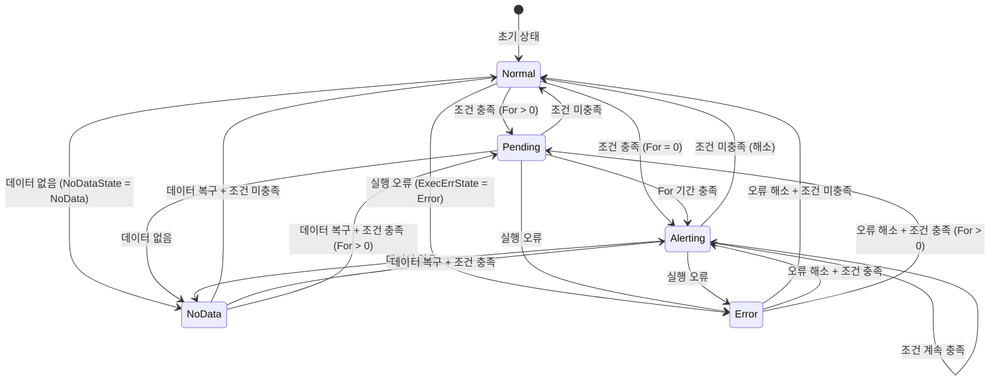
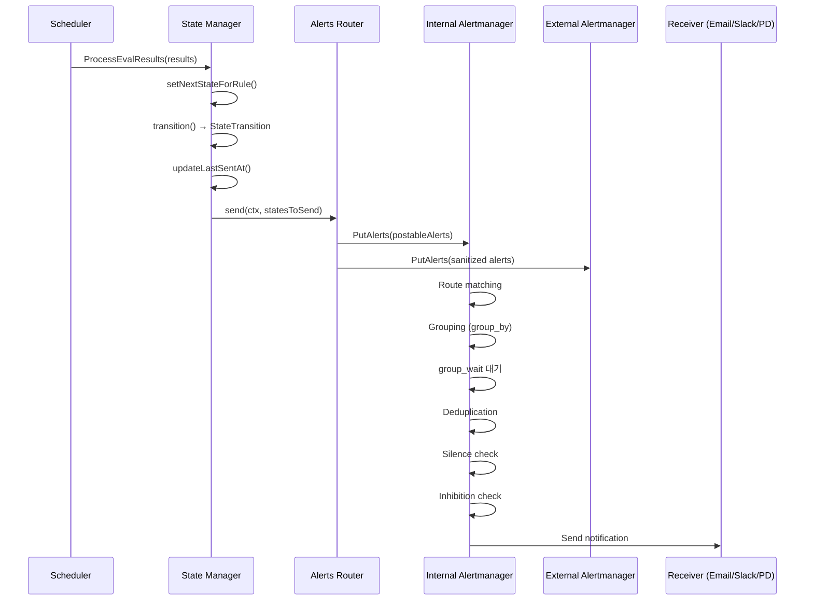

# 10. 알림 시스템 (NG Alerting) 심화

## 목차
1. [개요](#1-개요)
2. [NG Alert 아키텍처](#2-ng-alert-아키텍처)
3. [AlertRule 모델](#3-alertrule-모델)
4. [평가 엔진 (Evaluation Engine)](#4-평가-엔진-evaluation-engine)
5. [스케줄러 (Scheduler)](#5-스케줄러-scheduler)
6. [상태 관리 (State Manager)](#6-상태-관리-state-manager)
7. [상태 전이 머신 (State Machine)](#7-상태-전이-머신-state-machine)
8. [Alertmanager 통합](#8-alertmanager-통합)
9. [외부 Alertmanager 전송](#9-외부-alertmanager-전송)
10. [API 계층](#10-api-계층)
11. [라우팅과 알림 전달](#11-라우팅과-알림-전달)
12. [히스토리언 (Historian)](#12-히스토리언-historian)
13. [고가용성 (HA) 지원](#13-고가용성-ha-지원)
14. [핵심 설계 원리](#14-핵심-설계-원리)

---

## 1. 개요

Grafana의 NG Alert(Next Generation Alerting)는 통합 알림 시스템으로, 데이터소스 쿼리 결과를 주기적으로 평가하여 알림 상태를 관리하고, Alertmanager를 통해 알림을 라우팅하고 전송한다.

이 문서에서 다루는 핵심 질문:
- **왜** NG Alert는 자체 Alertmanager를 내장하는가?
- 스케줄러는 **어떻게** 수천 개의 규칙을 효율적으로 평가하는가?
- 상태 전이 머신은 **왜** Normal → Pending → Alerting 패턴을 사용하는가?
- **어떻게** 고가용성(HA) 환경에서 중복 알림을 방지하는가?

---

## 2. NG Alert 아키텍처

### 2.1 전체 아키텍처

**파일 위치**: `pkg/services/ngalert/ngalert.go`

```
┌──────────────────────────────────────────────────────────────────┐
│                        AlertNG Service                           │
│                                                                  │
│  ┌──────────┐    ┌───────────┐    ┌─────────────┐               │
│  │ Scheduler│───>│ Evaluator │───>│ State       │               │
│  │          │    │ Factory   │    │ Manager     │               │
│  │ tick 10s │    │           │    │             │               │
│  │          │    │ pipeline  │    │ cache       │               │
│  │ rules    │    │ execution │    │ transitions │               │
│  └────┬─────┘    └───────────┘    └──────┬──────┘               │
│       │                                  │                      │
│       │              ┌───────────────────┤                      │
│       │              │                   │                      │
│       ▼              ▼                   ▼                      │
│  ┌──────────┐  ┌──────────┐    ┌──────────────┐               │
│  │ Rule     │  │ Historian│    │ Alerts       │               │
│  │ Store    │  │          │    │ Router       │               │
│  │ (DB)     │  │ Loki/Ann │    │              │               │
│  └──────────┘  └──────────┘    └───────┬──────┘               │
│                                        │                      │
│                               ┌────────┴────────┐             │
│                               │                 │             │
│                               ▼                 ▼             │
│                    ┌──────────────┐   ┌──────────────┐        │
│                    │ Internal     │   │ External     │        │
│                    │ Alertmanager │   │ Alertmanager │        │
│                    │ (per-org)    │   │ (sender)     │        │
│                    └──────────────┘   └──────────────┘        │
└──────────────────────────────────────────────────────────────────┘
```

### 2.2 AlertNG 구조체

```go
type AlertNG struct {
    Cfg                   *setting.Cfg
    FeatureToggles        featuremgmt.FeatureToggles
    DataSourceCache       datasources.CacheService
    DataSourceService     datasources.DataSourceService
    SQLStore              db.DB
    KVStore               kvstore.KVStore
    ExpressionService     *expr.Service
    QuotaService          quota.Service
    SecretsService        secrets.Service
    Metrics               *metrics.NGAlert
    Log                   log.Logger

    // 핵심 서브시스템
    schedule              schedule.ScheduleService      // 스케줄러
    stateManager          *state.Manager                // 상태 관리자
    MultiOrgAlertmanager  *notifier.MultiOrgAlertmanager // 멀티-org AM
    AlertsRouter          *sender.AlertsRouter          // 알림 라우터
    ImageService          image.ImageService            // 스크린샷 캡처
    RecordingWriter       schedule.RecordingWriter      // 레코딩 룰 쓰기
    Api                   *api.API                      // REST API
    InstanceStore         state.InstanceStore            // 상태 저장소

    evaluationCoordinator EvaluationCoordinator         // HA 평가 조율
}
```

### 2.3 ProvideService() — 의존성 주입

`ProvideService()`는 Grafana의 Wire 기반 DI 프레임워크에 의해 호출되며, 26개의 의존성을 주입받는다. 내부적으로 `init()`을 호출하여 모든 서브시스템을 초기화한다.

```go
func ProvideService(cfg, featureToggles, dataSourceCache, dataSourceService,
    routeRegister, sqlStore, kvStore, expressionService, dataProxy,
    quotaService, secretsService, notificationService, metrics,
    folderService, ac, dashboardService, renderService, bus,
    accesscontrolService, annotationsRepo, pluginsStore, tracer,
    ruleStore, httpClientProvider, pluginContextProvider,
    resourcePermissions, userService) (*AlertNG, error) {

    ng := &AlertNG{...}
    if ng.IsDisabled() { return ng, nil }
    if err := ng.init(); err != nil { return nil, err }
    return ng, nil
}
```

### 2.4 Run() — 서비스 실행

```go
func (ng *AlertNG) Run(ctx context.Context) error {
    children, subCtx := errgroup.WithContext(ctx)

    // 1. 폴더 전체경로 백필 (일회성)
    children.Go(func() error {
        ng.BackfillFolderFullpaths(subCtx)
        return nil
    })

    // 2. MultiOrgAlertmanager 실행
    children.Go(func() error {
        return ng.MultiOrgAlertmanager.Run(subCtx)
    })

    // 3. AlertsRouter 실행
    children.Go(func() error {
        return ng.AlertsRouter.Run(subCtx)
    })

    // 4. 평가 실행 (ExecuteAlerts가 true일 때만)
    if ng.Cfg.UnifiedAlerting.ExecuteAlerts {
        children.Go(func() error {
            runner := &evaluationRunner{ng: ng}
            return runner.run(subCtx)
        })
    }

    return children.Wait()
}
```

**왜 `errgroup`을 사용하는가?** 4개의 고루틴 중 하나라도 에러를 반환하면 전체 컨텍스트가 취소되어 나머지 고루틴도 정상적으로 종료된다. 이는 부분 장애 시 전체 시스템이 일관된 상태로 종료되도록 보장한다.

---

## 3. AlertRule 모델

### 3.1 핵심 구조체

**파일 위치**: `pkg/services/ngalert/models/alert_rule.go`

```go
type AlertRule struct {
    ID              int64
    GUID            string           // 전역 고유 식별자 (조직/시간 불변)
    OrgID           int64            // 조직 ID
    Title           string           // 규칙 제목
    Condition       string           // 조건 표현식의 RefID
    Data            []AlertQuery     // 쿼리 배열 (데이터소스 쿼리 + 표현식)
    Updated         time.Time
    UpdatedBy       *UserUID
    IntervalSeconds int64            // 평가 간격 (초)
    Version         int64            // 낙관적 잠금
    UID             string           // 고유 식별자
    NamespaceUID    string           // 폴더 UID
    FolderFullpath  string           // 폴더 전체 경로
    RuleGroup       string           // 규칙 그룹 이름
    RuleGroupIndex  int              // 그룹 내 순서
    Record          *Record          // 레코딩 룰 설정 (선택)
    NoDataState     NoDataState      // 데이터 없음 시 동작
    ExecErrState    ExecutionErrorState  // 실행 오류 시 동작
    For             time.Duration    // Pending → Alerting 대기 시간
    KeepFiringFor   time.Duration    // 조건 해소 후에도 발화 유지 시간
    Annotations     map[string]string
    Labels          map[string]string
    IsPaused        bool             // 일시 중지 여부
    NotificationSettings *NotificationSettings  // 알림 설정 오버라이드
    Metadata        AlertRuleMetadata

    // 시리즈 소실 시 해소까지 필요한 연속 평가 횟수
    MissingSeriesEvalsToResolve *int64
}
```

### 3.2 NoDataState — 데이터 없음 시 동작

```go
type NoDataState string

const (
    Alerting NoDataState = "Alerting"   // NoData → Alerting 상태로 전환
    NoData   NoDataState = "NoData"     // NoData 상태 유지 (별도 상태)
    OK       NoDataState = "OK"         // NoData → Normal로 전환
    KeepLast NoDataState = "KeepLast"   // 마지막 상태 유지
)
```

### 3.3 ExecutionErrorState — 실행 오류 시 동작

```go
type ExecutionErrorState string

const (
    AlertingErrState ExecutionErrorState = "Alerting"  // Error → Alerting
    ErrorErrState    ExecutionErrorState = "Error"      // Error 상태 유지
    OkErrState       ExecutionErrorState = "OK"         // Error → Normal
    KeepLastErrState ExecutionErrorState = "KeepLast"   // 마지막 상태 유지
)
```

### 3.4 상태 이유 상수

```go
const (
    StateReasonMissingSeries = "MissingSeries"  // 시리즈 소실
    StateReasonNoData        = "NoData"         // 데이터 없음
    StateReasonError         = "Error"          // 실행 오류
    StateReasonPaused        = "Paused"         // 일시 중지
    StateReasonUpdated       = "Updated"        // 규칙 업데이트
    StateReasonRuleDeleted   = "RuleDeleted"    // 규칙 삭제
    StateReasonKeepLast      = "KeepLast"       // 마지막 상태 유지
)
```

### 3.5 RuleType — 알림 규칙 vs 레코딩 규칙

```go
type RuleType string

const (
    RuleTypeAlerting  RuleType = "alerting"   // 알림 규칙
    RuleTypeRecording RuleType = "recording"  // 레코딩 규칙 (메트릭 생성)
)
```

레코딩 규칙은 쿼리 결과를 Prometheus 호환 메트릭으로 기록한다. 알림 규칙과 동일한 스케줄러에서 실행되지만, 상태 전이 대신 원격 쓰기(Remote Write)를 수행한다.

---

## 4. 평가 엔진 (Evaluation Engine)

### 4.1 아키텍처

**파일 위치**: `pkg/services/ngalert/eval/eval.go`

```go
type EvaluatorFactory interface {
    Create(ctx EvaluationContext, condition models.Condition) (ConditionEvaluator, error)
}

type ConditionEvaluator interface {
    EvaluateRaw(ctx context.Context, now time.Time) (*backend.QueryDataResponse, error)
    Evaluate(ctx context.Context, now time.Time) (Results, error)
}
```

### 4.2 conditionEvaluator 구현

```go
type conditionEvaluator struct {
    pipeline          expr.DataPipeline      // 표현식 파이프라인
    expressionService expressionExecutor     // SSE (Server-Side Expressions)
    condition         models.Condition       // 조건 정의
    evalTimeout       time.Duration          // 평가 타임아웃
    evalResultLimit   int                    // 결과 프레임 수 제한
}
```

### 4.3 EvaluateRaw() — 원시 평가 실행

```go
func (r *conditionEvaluator) EvaluateRaw(ctx context.Context, now time.Time) (
    resp *backend.QueryDataResponse, err error) {

    // 패닉 복구 — 알림 규칙 평가 중 패닉이 전체 시스템을 멈추지 않도록
    defer func() {
        if e := recover(); e != nil {
            logger.Error("Alert rule panic", "error", e,
                "stack", string(debug.Stack()))
            err = fmt.Errorf("alert rule panic; please check the logs")
        }
    }()

    // 타임아웃 적용
    execCtx := ctx
    if r.evalTimeout >= 0 {
        timeoutCtx, cancel := context.WithTimeout(ctx, r.evalTimeout)
        defer cancel()
        execCtx = timeoutCtx
    }

    // 파이프라인 실행 (SSE)
    result, err := r.expressionService.ExecutePipeline(execCtx, now, r.pipeline)

    // 결과 크기 검증
    if err == nil && result != nil && r.evalResultLimit > 0 {
        conditionResultLength := len(result.Responses[r.condition.Condition].Frames)
        if conditionResultLength > r.evalResultLimit {
            return nil, fmt.Errorf("query evaluation returned too many results: %d (limit: %d)",
                conditionResultLength, r.evalResultLimit)
        }
    }

    return result, err
}
```

**왜 `recover()`를 사용하는가?** 사용자가 작성한 쿼리나 표현식이 예기치 않은 패닉을 발생시킬 수 있다. 하나의 알림 규칙 패닉이 전체 스케줄러를 중단시키면 안 되므로, 패닉을 에러로 변환한다.

### 4.4 EvaluateAlert() — 결과 해석

```go
func EvaluateAlert(queryResponse *backend.QueryDataResponse,
    condition models.Condition, scheduledAt time.Time, evalStart time.Time) Results {

    // 1. QueryDataResponse → ExecutionResults 변환
    execResults := queryDataResponseToExecutionResults(condition, queryResponse)

    // 2. ExecutionResults → Results (상태 판정)
    return evaluateExecutionResult(execResults, scheduledAt, evalStart)
}
```

### 4.5 평가 결과 상태

```go
type State int

const (
    Normal   State = iota  // 조건 미충족
    Alerting               // 조건 충족 (발화)
    Pending                // 조건 충족이나 For 미달
    NoData                 // 데이터 없음
    Error                  // 실행 오류
)
```

### 4.6 Result 구조체

```go
type Result struct {
    Instance           data.Labels           // 인스턴스 레이블
    State              State                 // 평가 상태
    Error              error                 // Error 상태일 때의 에러
    Results            map[string]data.Frames // 모든 쿼리/표현식 결과
    Values             map[string]NumberValueCapture  // 수치 값
    EvaluatedAt        time.Time
    EvaluationDuration time.Duration
    EvaluationString   string
}
```

### 4.7 재시도 불가 에러

```go
func IsNonRetryableError(err error) bool {
    var nonRetryableError *invalidEvalResultFormatError
    if errors.As(err, &nonRetryableError) { return true }
    if errors.Is(err, expr.ErrSeriesMustBeWide) { return true }
    return false
}
```

잘못된 쿼리 정의(형식 오류, 타입 불일치)는 재시도해도 성공하지 못하므로, 불필요한 재시도를 방지한다.

---

## 5. 스케줄러 (Scheduler)

### 5.1 핵심 구조체

**파일 위치**: `pkg/services/ngalert/schedule/schedule.go`

```go
type schedule struct {
    baseInterval      time.Duration          // 기본 틱 간격 (10초)
    registry          ruleRegistry           // 활성 규칙 레지스트리
    retryConfig       RetryConfig            // 재시도 설정
    clock             clock.Clock
    evaluatorFactory  eval.EvaluatorFactory
    ruleStore         RulesStore
    stateManager      *state.Manager
    metrics           *metrics.Scheduler
    alertsSender      AlertsSender
    minRuleInterval   time.Duration          // 최소 평가 간격
    schedulableAlertRules alertRulesRegistry // 스케줄 대상 규칙
    jitterEvaluations JitterStrategy         // 지터 전략
    recordingWriter   RecordingWriter
    tracer            tracing.Tracer
}
```

### 5.2 RetryConfig — 지수 백오프 설정

```go
type RetryConfig struct {
    MaxAttempts         int64          // 최대 재시도 횟수
    InitialRetryDelay   time.Duration  // 초기 재시도 대기 시간
    MaxRetryDelay       time.Duration  // 최대 재시도 대기 시간
    RandomizationFactor float64        // 무작위화 비율
}
```

### 5.3 Run() — 스케줄러 메인 루프

```go
func (sch *schedule) Run(ctx context.Context) error {
    sch.log.Info("Starting scheduler",
        "tickInterval", sch.baseInterval,
        "maxAttempts", sch.retryConfig.MaxAttempts)

    // 틱커 생성 — baseInterval마다 틱 발생
    t := ticker.New(sch.clock, sch.baseInterval, sch.metrics.Ticker, sch.log)
    defer t.Stop()

    // 주기적 스케줄링 루프 진입
    if err := sch.schedulePeriodic(ctx, t); err != nil {
        sch.log.Error("Failure while running the rule evaluation loop", "error", err)
    }
    return nil
}
```

### 5.4 schedulePeriodic() — 틱 기반 평가 루프

```go
func (sch *schedule) schedulePeriodic(ctx context.Context, t *ticker.T) error {
    dispatcherGroup, ctx := errgroup.WithContext(ctx)

    for {
        select {
        case tick := <-t.C:
            start := time.Now().Round(0)
            sch.metrics.BehindSeconds.Set(start.Sub(tick).Seconds())

            // 핵심: 틱마다 processTick 호출
            sch.processTick(ctx, dispatcherGroup, tick)

            sch.metrics.SchedulePeriodicDuration.Observe(
                time.Since(start).Seconds())

        case <-ctx.Done():
            return dispatcherGroup.Wait()
        }
    }
}
```

### 5.5 processTick() — 틱 처리 상세 흐름

```go
func (sch *schedule) processTick(ctx context.Context,
    dispatcherGroup *errgroup.Group, tick time.Time) (...) {

    tickNum := tick.Unix() / int64(sch.baseInterval.Seconds())

    // 1. DB에서 최신 규칙 목록 동기화
    rulesDiff, err := sch.updateSchedulableAlertRules(ctx)

    // 2. 현재 스케줄 가능한 모든 규칙 조회
    alertRules, folderTitles := sch.schedulableAlertRules.all()

    // 3. 삭제된 규칙 탐지를 위한 맵 초기화
    registeredDefinitions := sch.registry.keyMap()

    // 4. 각 규칙에 대해 평가 필요 여부 판단
    for _, item := range alertRules {
        key := item.GetKey()

        // 최소 평가 간격 강제
        if item.IntervalSeconds < int64(sch.minRuleInterval.Seconds()) {
            item.IntervalSeconds = int64(sch.minRuleInterval.Seconds())
        }

        // 규칙 라우틴 생성 또는 조회
        ruleRoutine, newRoutine := sch.registry.getOrCreate(ctx, rf, ruleFactory)

        // 평가 빈도 계산
        // itemFrequency = rule.IntervalSeconds / baseInterval
        // 예: 30초 규칙 / 10초 기본 = 3 (3틱마다 평가)
        itemFrequency := item.IntervalSeconds / int64(sch.baseInterval.Seconds())

        // 이번 틱에 평가해야 하는지 결정
        if tickNum%itemFrequency == 0 {
            readyToRun = append(readyToRun, readyToRunItem{
                ruleRoutine: ruleRoutine,
                Evaluation: Evaluation{
                    scheduledAt: tick,
                    rule: item,
                    folderTitle: folderTitle,
                },
            })
        }
    }

    // 5. 삭제된 규칙 정리
    toDelete := make([]ngmodels.AlertRuleKey, 0)
    for key := range registeredDefinitions {
        toDelete = append(toDelete, key)
    }
    sch.deleteAlertRule(ctx, toDelete...)

    // 6. 평가 준비된 규칙 실행
    for _, item := range readyToRun {
        item.ruleRoutine.Eval(&item.Evaluation)
    }
}
```

### 5.6 평가 빈도 계산 다이어그램

```
baseInterval = 10초

규칙 A: IntervalSeconds = 10  → itemFrequency = 1  → 매 틱마다 평가
규칙 B: IntervalSeconds = 30  → itemFrequency = 3  → 3틱마다 평가
규칙 C: IntervalSeconds = 60  → itemFrequency = 6  → 6틱마다 평가

틱:  1    2    3    4    5    6    7    8    9    10
A:   ■    ■    ■    ■    ■    ■    ■    ■    ■    ■
B:             ■              ■              ■
C:                            ■                   ■

■ = 평가 실행
```

### 5.7 지터 (Jitter)

```go
JitterEvaluations: schedule.JitterStrategyFrom(
    ng.Cfg.UnifiedAlerting, ng.FeatureToggles),
```

지터는 동일 간격의 규칙들이 정확히 같은 시점에 평가되는 것을 방지한다. 수천 개의 규칙이 10초마다 동시에 평가되면 데이터소스에 "thundering herd" 문제가 발생한다. 지터를 적용하면 평가 시점이 분산되어 부하가 균등해진다.

---

## 6. 상태 관리 (State Manager)

### 6.1 Manager 구조체

**파일 위치**: `pkg/services/ngalert/state/manager.go`

```go
type Manager struct {
    log               log.Logger
    metrics           *metrics.State
    tracer            tracing.Tracer
    clock             clock.Clock
    cache             *cache           // 인메모리 상태 캐시
    ResendDelay       time.Duration    // 30초 (재전송 간격)
    ResolvedRetention time.Duration    // 해소 상태 유지 시간
    instanceStore     InstanceStore    // 상태 영속화
    images            ImageCapturer    // 스크린샷 캡처
    historian         Historian        // 상태 이력 기록
    externalURL       *url.URL
    rulesPerRuleGroupLimit int64
    persister         StatePersister   // 상태 저장 전략
    ignorePendingForNoDataAndError bool
}
```

### 6.2 State 구조체

**파일 위치**: `pkg/services/ngalert/state/state.go`

```go
type State struct {
    OrgID        int64
    AlertRuleUID string

    // CacheID — 상태를 캐시에서 찾기 위한 고유 키 (레이블 핑거프린트)
    CacheID data.Fingerprint

    State       eval.State    // Normal, Alerting, Pending, NoData, Error
    StateReason string        // 상태 전이 이유

    ResultFingerprint data.Fingerprint  // 원본 결과 핑거프린트
    LatestResult      *Evaluation       // 최근 평가 결과
    Error             error             // 현재 에러
    Image             *models.Image     // 스크린샷

    Annotations map[string]string
    Labels      data.Labels
    Values      map[string]float64

    FiredAt              *time.Time    // Alerting 최초 전환 시각
    StartsAt             time.Time     // 현재 상태 시작 시각
    EndsAt               time.Time     // 현재 상태 종료 예정 시각
    ResolvedAt           *time.Time    // 해소 시각
    LastSentAt           *time.Time    // 마지막 전송 시각
    LastEvaluationTime   time.Time     // 마지막 평가 시각
    EvaluationDuration   time.Duration // 평가 소요 시간
}
```

### 6.3 ProcessEvalResults() — 평가 결과 처리

```go
func (st *Manager) ProcessEvalResults(
    ctx context.Context,
    evaluatedAt time.Time,
    alertRule *ngModels.AlertRule,
    results eval.Results,
    extraLabels data.Labels,
    send Sender,   // Alertmanager 전송 콜백 (선택적)
) StateTransitions {

    // 1. 각 결과에 대해 상태 전이 계산
    states := st.setNextStateForRule(ctx, alertRule, results,
        extraLabels, logger, takeImageFn, evaluatedAt)

    // 2. 소실된 시리즈 처리 (자동 해소)
    missingSeriesStates, staleCount := st.processMissingSeriesStates(
        logger, evaluatedAt, alertRule, takeImageFn)

    allChanges := StateTransitions(append(states, missingSeriesStates...))

    // 3. 전송 필요 여부 결정 및 LastSentAt 업데이트
    var statesToSend StateTransitions
    if send != nil {
        statesToSend = st.updateLastSentAt(allChanges, evaluatedAt)
    }

    // 4. 상태 영속화 (동기/비동기)
    st.persister.Sync(ctx, span, alertRule.GetKeyWithGroup(), allChanges)

    // 5. 히스토리언에 기록
    if st.historian != nil {
        st.historian.Record(ctx, ruleMeta, allChanges)
    }

    // 6. Alertmanager에 전송
    if send != nil {
        send(ctx, statesToSend)
    }

    return allChanges
}
```

### 6.4 setNextStateForRule() — 상태 전이 로직

```go
func (st *Manager) setNextStateForRule(ctx context.Context,
    alertRule *ngModels.AlertRule, results eval.Results,
    extraLabels data.Labels, logger log.Logger,
    takeImageFn takeImageFn, now time.Time) []StateTransition {

    // 특수 처리 1: 전체 NoData일 때 매핑
    if results.IsNoData() && (alertRule.NoDataState == Alerting ||
        alertRule.NoDataState == OK || alertRule.NoDataState == KeepLast) {
        transitions := st.setNextStateForAll(alertRule, result, ...)
        if len(transitions) > 0 { return transitions }
    }

    // 특수 처리 2: 전체 Error일 때 매핑
    if results.IsError() && (alertRule.ExecErrState == AlertingErrState ||
        alertRule.ExecErrState == OkErrState || alertRule.ExecErrState == KeepLastErrState) {
        transitions := st.setNextStateForAll(alertRule, results[0], ...)
        if len(transitions) > 0 { return transitions }
    }

    // 일반 처리: 각 결과별 상태 전이
    transitions := make([]StateTransition, 0, len(results))
    for _, result := range results {
        // 새 상태 생성 (레이블 기반)
        newState := newState(ctx, logger, alertRule, result, extraLabels, st.externalURL)

        // 캐시에서 기존 상태 조회
        if curState := st.cache.get(alertRule.OrgID, alertRule.UID, newState.CacheID);
           curState != nil {
            patch(newState, curState, result)
        }

        // 상태 전이 실행
        s := newState.transition(alertRule, result, nil, logger,
            takeImageFn, st.ignorePendingForNoDataAndError)

        // 캐시 업데이트
        st.cache.set(newState)
        transitions = append(transitions, s)
    }
    return transitions
}
```

### 6.5 소실된 시리즈 자동 해소

이전 평가에서 존재했지만 현재 평가 결과에 없는 시리즈(레이블 조합)는 "소실"로 간주된다. `MissingSeriesEvalsToResolve` (기본값 2)만큼의 연속 평가에서 소실이 확인되면 해당 상태는 `Normal`로 자동 해소된다.

```
평가 1: {host=A} → Alerting, {host=B} → Alerting
평가 2: {host=A} → Alerting                        ← {host=B} 소실 (1회)
평가 3: {host=A} → Normal                          ← {host=B} 소실 (2회) → 자동 해소
```

---

## 7. 상태 전이 머신 (State Machine)

### 7.1 transition() 함수

**파일 위치**: `pkg/services/ngalert/state/state.go`

```go
func (a *State) transition(alertRule *models.AlertRule, result eval.Result,
    extraAnnotations data.Labels, logger log.Logger,
    takeImageFn takeImageFn, ignorePendingForNoDataAndError bool) StateTransition {

    a.LastEvaluationTime = result.EvaluatedAt
    a.EvaluationDuration = result.EvaluationDuration
    a.SetNextValues(result)
    a.LatestResult = &Evaluation{...}
    a.LastEvaluationString = result.EvaluationString

    oldState := a.State
    oldReason := a.StateReason

    switch result.State {
    case eval.Normal:
        resultNormal(a, alertRule, result, logger, "")
    case eval.Alerting:
        resultAlerting(a, alertRule, result, logger, "")
    case eval.Error:
        resultError(a, alertRule, result, logger, ignorePendingForNoDataAndError)
    case eval.NoData:
        resultNoData(a, alertRule, result, logger, ignorePendingForNoDataAndError)
    }

    return StateTransition{
        State:               a,
        PreviousState:       oldState,
        PreviousStateReason: oldReason,
    }
}
```

### 7.2 상태 전이 다이어그램



### 7.3 Normal → Pending → Alerting 전이 상세

```
시간축 →

For = 30초, IntervalSeconds = 10초

t=0s   : 조건 충족 → Normal → Pending (StartsAt = t=0s)
t=10s  : 조건 충족 → Pending 유지
t=20s  : 조건 충족 → Pending 유지
t=30s  : 조건 충족, Since(StartsAt) >= For → Pending → Alerting (FiredAt = t=30s)

중간에 조건 미충족 시:
t=0s   : 조건 충족 → Normal → Pending
t=10s  : 조건 미충족 → Pending → Normal (리셋)
t=20s  : 조건 충족 → Normal → Pending (StartsAt 재설정)
```

**왜 Pending 상태가 필요한가?**

일시적인 스파이크(flapping)로 인한 거짓 양성(false positive) 알림을 방지한다. `For` 기간 동안 조건이 지속되어야만 실제 알림이 발생하므로, 일시적인 이상치가 불필요한 알림을 생성하지 않는다.

### 7.4 KeepFiringFor 동작

```
KeepFiringFor = 60초

t=0s   : 조건 충족 → Alerting
t=10s  : 조건 충족 → Alerting 유지
t=20s  : 조건 미충족 → Alerting 유지 (KeepFiringFor 시작)
t=30s  : 조건 미충족 → Alerting 유지 (KeepFiringFor 진행)
...
t=80s  : 조건 미충족, Since(마지막 충족) >= KeepFiringFor → Normal (해소)
```

**왜 KeepFiringFor가 필요한가?**

간헐적 데이터 소실이 있는 환경에서, 잠깐의 데이터 갭으로 알림이 해소되었다가 다시 발화되는 플래핑을 방지한다.

---

## 8. Alertmanager 통합

### 8.1 MultiOrgAlertmanager

**파일 위치**: `pkg/services/ngalert/notifier/multiorg_alertmanager.go`

```go
type Alertmanager interface {
    // 설정
    ApplyConfig(context.Context, *models.AlertConfiguration) error
    SaveAndApplyConfig(ctx context.Context, config *PostableUserConfig) error
    SaveAndApplyDefaultConfig(ctx context.Context) error
    GetStatus(context.Context) (GettableStatus, error)

    // 사일런스
    CreateSilence(context.Context, *PostableSilence) (string, error)
    DeleteSilence(context.Context, string) error
    GetSilence(context.Context, string) (GettableSilence, error)
    ListSilences(context.Context, []string) (GettableSilences, error)
    SilenceState(context.Context) (SilenceState, error)

    // 알림
    GetAlerts(ctx, active, silenced, inhibited, filter, receiver) (GettableAlerts, error)
    GetAlertGroups(ctx, active, silenced, inhibited, filter, receiver) (AlertGroups, error)
    PutAlerts(context.Context, PostableAlerts) error

    // 수신자
    GetReceivers(ctx) ([]ReceiverStatus, error)
    TestReceivers(ctx, config) (*TestReceiversResult, int, error)
    TestIntegration(ctx, receiverName, config, alert) (IntegrationStatus, error)
    TestTemplate(ctx, config) (*TestTemplatesResults, error)

    // 라이프사이클
    StopAndWait()
}
```

### 8.2 왜 내장 Alertmanager인가?

Grafana는 Prometheus의 Alertmanager를 라이브러리로 내장한다. 이유:

1. **독립 배포**: 별도의 Alertmanager 인스턴스를 관리할 필요 없음
2. **조직별 격리**: 멀티테넌트 환경에서 조직별 독립적인 Alertmanager 설정
3. **통합 UI**: 사일런스, 라우팅, 수신자를 Grafana UI에서 직접 관리
4. **호환성**: 외부 Alertmanager와 동시에 사용 가능 (dual-write)

### 8.3 사일런스와 알림 로그

내장 Alertmanager는 다음을 관리한다:

| 기능 | 보존 기간 | 유지보수 간격 |
|------|----------|-------------|
| 사일런스 | 5일 | 15분 |
| 알림 로그 | 5일 | 15분 |
| 상태 스냅샷 | KV Store | 15분 |

### 8.4 Remote Alertmanager

```go
// remote/primary 모드
remotePrimary := ng.FeatureToggles.IsEnabled(ctx, featuremgmt.FlagAlertmanagerRemotePrimary)

// remote/secondary 모드
remoteSecondary := ng.FeatureToggles.IsEnabled(ctx, featuremgmt.FlagAlertmanagerRemoteSecondary)
```

| 모드 | 설명 |
|------|------|
| 내장 (기본) | Grafana 내부에서 실행, 조직별 독립 |
| Remote Primary | 외부 Alertmanager가 주 역할, 내장 AM 비활성화 |
| Remote Secondary | 내장 AM이 주 역할, 외부 AM에 동기화 |

---

## 9. 외부 Alertmanager 전송

### 9.1 ExternalAlertmanager

**파일 위치**: `pkg/services/ngalert/sender/sender.go`

```go
type ExternalAlertmanager struct {
    logger    log.Logger
    wg        sync.WaitGroup
    manager   *Manager           // Prometheus의 알림 매니저
    sdCancel  context.CancelFunc
    sdManager *discovery.Manager  // 서비스 디스커버리
    options   *ExternalAMOptions
}

const (
    defaultMaxQueueCapacity = 10000
    defaultTimeout          = 10 * time.Second
    defaultDrainOnShutdown  = true
)
```

### 9.2 레이블 정규화 (Sanitization)

```go
// Prometheus 호환성을 위한 레이블 정규화
// UTF-8 레이블 이름을 Prometheus 호환 형식으로 변환

// WithUTF8Labels() — UTF-8 레이블을 그대로 유지 (Alertmanager가 UTF-8을 지원할 때)
func WithUTF8Labels() Option {
    return func(opts *ExternalAMOptions) {
        opts.sanitizeLabelSetFn = func(lbls models.LabelSet) labels.Labels {
            ls := make(labels.Labels, 0, len(lbls))
            for k, v := range lbls {
                ls = append(ls, labels.Label{Name: k, Value: v})
            }
            return ls
        }
    }
}
```

**왜 레이블 정규화가 필요한가?**

Prometheus의 데이터 모델은 레이블 이름에 `[a-zA-Z_:][a-zA-Z0-9_:]*` 패턴만 허용한다. Grafana의 알림 레이블은 이 제약을 따르지 않을 수 있으므로, 외부 Alertmanager에 전송하기 전에 정규화가 필요하다.

---

## 10. API 계층

### 10.1 API 엔드포인트 분류

```
┌─────────────────────────────────────────────────┐
│                  NG Alert API                    │
│                                                  │
│  Ruler API (CRUD)                                │
│  ├── GET    /api/v1/provisioning/alert-rules     │
│  ├── POST   /api/v1/provisioning/alert-rules     │
│  ├── PUT    /api/v1/provisioning/alert-rules/:uid│
│  ├── DELETE /api/v1/provisioning/alert-rules/:uid│
│  └── GET    /api/v1/provisioning/folder/:uid/... │
│                                                  │
│  Alertmanager API                                │
│  ├── GET    /api/alertmanager/grafana/api/v2/... │
│  ├── POST   /api/alertmanager/grafana/api/v2/... │
│  ├── alertmanager config                         │
│  ├── silences                                    │
│  └── receivers                                   │
│                                                  │
│  Testing API                                     │
│  ├── POST   /api/v1/eval                         │
│  └── POST   /api/v1/provisioning/alert-rules/... │
│             /test                                │
│                                                  │
│  Prometheus-compatible API                       │
│  ├── GET    /api/prometheus/grafana/api/v1/rules │
│  └── GET    /api/prometheus/grafana/api/v1/alerts│
└─────────────────────────────────────────────────┘
```

### 10.2 API 구조체

```go
ng.Api = &api.API{
    Cfg:                  ng.Cfg,
    DatasourceCache:      ng.DataSourceCache,
    DatasourceService:    ng.DataSourceService,
    RouteRegister:        ng.RouteRegister,
    DataProxy:            ng.DataProxy,
    QuotaService:         ng.QuotaService,
    TransactionManager:   ng.store,
    RuleStore:            ng.store,
    AlertingStore:        ng.store,
    MultiOrgAlertmanager: ng.MultiOrgAlertmanager,
    StateManager:         apiStateManager,
    RuleStatusReader:     apiStatusReader,
    AccessControl:        ng.accesscontrol,
    // ... 서비스 계층 (provisioning, notifier)
    Historian:            history,
    Tracer:               ng.tracer,
}
ng.Api.RegisterAPIEndpoints(ng.Metrics.GetAPIMetrics())
```

---

## 11. 라우팅과 알림 전달

### 11.1 라우트 설정 구조

```
Route (트리 구조)
├── receiver: "default-email"
├── group_by: [alertname, grafana_folder]
├── group_wait: 30s        ← 그룹 형성 대기 시간
├── group_interval: 5m     ← 그룹 내 알림 재전송 간격
├── repeat_interval: 4h    ← 동일 알림 반복 전송 간격
├── matchers:
│   └── severity = critical
├── routes: (하위 라우트)
│   ├── Route
│   │   ├── receiver: "pagerduty-critical"
│   │   └── matchers: team = platform
│   └── Route
│       ├── receiver: "slack-warning"
│       └── matchers: severity = warning
└── continue: false        ← 매칭 시 하위 라우트 탐색 중단
```

### 11.2 알림 전달 시퀀스



### 11.3 재전송 로직

```go
var ResendDelay = 30 * time.Second

func (st *Manager) updateLastSentAt(states StateTransitions,
    evaluatedAt time.Time) StateTransitions {
    var result StateTransitions
    for _, t := range states {
        if t.NeedsSending(evaluatedAt, st.ResendDelay, st.ResolvedRetention) {
            t.LastSentAt = &evaluatedAt
            result = append(result, t)
        }
    }
    return result
}
```

`NeedsSending()`이 true를 반환하는 조건:
- 새로운 상태 전이 (이전 상태와 다름)
- `LastSentAt`이 nil (한 번도 전송 안 됨)
- `time.Since(LastSentAt) >= ResendDelay` (재전송 간격 초과)
- 해소 상태에서 `ResolvedRetention` 기간 내

---

## 12. 히스토리언 (Historian)

### 12.1 백엔드 유형

```go
func configureHistorianBackend(ctx, cfg, ...) (Historian, error) {
    backend, _ := historian.ParseBackendType(cfg.Backend)

    switch backend {
    case historian.BackendTypeAnnotations:
        // Grafana 어노테이션으로 저장
        return historian.NewAnnotationBackend(...)

    case historian.BackendTypeLoki:
        // Loki에 구조화된 로그로 저장
        return historian.NewRemoteLokiBackend(...)

    case historian.BackendTypePrometheus:
        // Prometheus Remote Write로 메트릭 저장
        return historian.NewRemotePrometheusBackend(...)

    case historian.BackendTypeMultiple:
        // 여러 백엔드 동시 사용 (primary + secondaries)
        return historian.NewMultipleBackend(primary, secondaries...)
    }
}
```

### 12.2 왜 여러 히스토리언 백엔드를 지원하는가?

| 백엔드 | 장점 | 단점 |
|--------|------|------|
| Annotations | 설정 불필요, 대시보드 통합 | 대량 상태 시 성능 저하 |
| Loki | 구조화된 쿼리, 장기 보존 | 별도 Loki 인스턴스 필요 |
| Prometheus | 메트릭 기반 분석, Grafana 대시보드 활용 | Remote Write 설정 필요 |
| Multiple | 점진적 마이그레이션 | 복잡도 증가 |

---

## 13. 고가용성 (HA) 지원

### 13.1 HA 모드 아키텍처

```
┌─────────────────────────────────────────────────┐
│               Grafana HA Cluster                 │
│                                                  │
│  ┌──────────┐     ┌──────────┐     ┌──────────┐ │
│  │ Node 1   │     │ Node 2   │     │ Node 3   │ │
│  │ (Primary)│     │(Standby) │     │(Standby) │ │
│  │          │     │          │     │          │ │
│  │ Eval ■   │     │ Eval □   │     │ Eval □   │ │
│  │ State ■  │     │ State □  │     │ State □  │ │
│  │ AM ■     │     │ AM ■     │     │ AM ■     │ │
│  └────┬─────┘     └────┬─────┘     └────┬─────┘ │
│       │                │                │        │
│       └────────────────┼────────────────┘        │
│                        │                         │
│                   ┌────┴────┐                    │
│                   │  Gossip │                    │
│                   │  Ring   │                    │
│                   └─────────┘                    │
│                                                  │
│  ■ = 활성    □ = 비활성                           │
└─────────────────────────────────────────────────┘
```

### 13.2 EvaluationCoordinator

```go
if ng.Cfg.UnifiedAlerting.HASingleNodeEvaluation {
    peer := ng.MultiOrgAlertmanager.Peer()
    ng.evaluationCoordinator, err = cluster.NewEvaluationCoordinator(peer, ng.Log)

    // 비프라이머리 노드: DB에서 상태 읽기
    storeStateReader := state.NewStoreStateReader(ng.InstanceStore, ng.Log)
    apiStateManager = storeStateReader
    apiStatusReader = storeStateReader
} else {
    // 비HA 모드: 인메모리 상태 사용
    ng.evaluationCoordinator = cluster.NewNoopEvaluationCoordinator()
    apiStateManager = ng.stateManager
    ng.schedule = schedule.NewScheduler(ng.schedCfg, ng.stateManager)
    apiStatusReader = ng.schedule
}
```

**왜 HASingleNodeEvaluation인가?**

HA 환경에서 모든 노드가 동일한 규칙을 평가하면 중복 알림이 발생한다. `HASingleNodeEvaluation`이 활성화되면 하나의 노드만 규칙을 평가하고, 나머지 노드는 DB에서 상태를 읽어 API 요청에 응답한다. Gossip 프로토콜을 통해 프라이머리 노드가 결정된다.

### 13.3 상태 영속화 전략

```go
func initStatePersister(uaCfg, cfg, featureToggles) StatePersister {
    compressed := featureToggles.IsEnabledGlobally(FlagAlertingSaveStateCompressed)
    periodic   := featureToggles.IsEnabledGlobally(FlagAlertingSaveStatePeriodic)

    switch {
    case compressed && periodic:
        // 비동기 규칙 단위 저장 (압축 + 주기적)
        return state.NewAsyncRuleStatePersister(...)
    case compressed:
        // 동기 규칙 단위 저장 (압축)
        return state.NewSyncRuleStatePersister(...)
    case periodic:
        // 비동기 상태 저장 (주기적)
        return state.NewAsyncStatePersister(...)
    default:
        // 동기 상태 저장 (기본)
        return state.NewSyncStatePersisiter(...)
    }
}
```

| 전략 | 압축 | 주기적 | 특징 |
|------|------|--------|------|
| SyncStatePersister | X | X | 평가마다 즉시 DB 저장 (안전하지만 느림) |
| AsyncStatePersister | X | O | 주기적 배치 저장 (성능 향상) |
| SyncRuleStatePersister | O | X | 규칙 단위 Protobuf 압축 저장 |
| AsyncRuleStatePersister | O | O | 최적: 압축 + 주기적 배치 (대규모 배포 권장) |

---

## 14. 핵심 설계 원리

### 14.1 내결함성 (Fault Tolerance)

| 장애 유형 | 대응 | 코드 위치 |
|-----------|------|----------|
| 쿼리 패닉 | `recover()` → 에러 변환 | `eval/eval.go:EvaluateRaw()` |
| 재시도 불가 에러 | 즉시 포기 (형식 오류 등) | `eval/eval.go:IsNonRetryableError()` |
| 데이터 없음 | NoDataState 매핑 | `state/manager.go:setNextStateForRule()` |
| 실행 오류 | ExecErrState 매핑 | `state/state.go:resultError()` |
| 시리즈 소실 | 자동 해소 (N회 연속) | `state/manager.go:processMissingSeriesStates()` |
| 노드 장애 (HA) | Gossip 기반 프라이머리 전환 | `cluster/evaluation_coordinator.go` |

### 14.2 확장성

```
규칙 수           해결책
──────────────   ──────────────────────────────────────
< 100            기본 설정으로 충분
100 ~ 1,000      지터 활성화, 비동기 상태 저장
1,000 ~ 10,000   압축 + 주기적 저장, 외부 Alertmanager
> 10,000         HA 클러스터, 규칙 분산 평가
```

### 14.3 관심사 분리

```
모델 (models/)       → 데이터 정의 (AlertRule, State)
평가 (eval/)         → 조건 평가 로직 (순수 함수)
스케줄 (schedule/)   → 시간 기반 실행 제어
상태 (state/)        → 상태 전이 + 영속화
알림 (notifier/)     → Alertmanager 통합
전송 (sender/)       → 외부 AM 전송
API (api/)           → REST 인터페이스
```

### 14.4 플래핑 방지 메커니즘 요약

```
┌─────────────────────────────────────────────────┐
│              플래핑 방지 계층                      │
│                                                  │
│  Layer 1: For 기간                                │
│  └── 조건이 For 동안 지속되어야 Alerting 전이      │
│                                                  │
│  Layer 2: KeepFiringFor                          │
│  └── 조건 해소 후에도 지정 시간 동안 Alerting 유지  │
│                                                  │
│  Layer 3: MissingSeriesEvalsToResolve            │
│  └── 시리즈 소실 N회 연속 확인 후 해소              │
│                                                  │
│  Layer 4: Alertmanager group_wait/group_interval │
│  └── 알림 그룹화 및 배치 전송                      │
│                                                  │
│  Layer 5: ResendDelay (30초)                     │
│  └── 동일 상태 재전송 최소 간격                     │
└─────────────────────────────────────────────────┘
```

**왜 5단계나 필요한가?**

각 계층은 서로 다른 유형의 플래핑을 방지한다:
- Layer 1: 일시적 스파이크 → 거짓 양성 방지
- Layer 2: 간헐적 데이터 갭 → 불필요한 해소/재발화 방지
- Layer 3: 시리즈 소멸 판단 신중성
- Layer 4: 알림 수신자 피로도 감소
- Layer 5: Alertmanager 과부하 방지

---

## 참고 파일 목록

| 파일 경로 | 설명 |
|-----------|------|
| `pkg/services/ngalert/ngalert.go` | AlertNG 서비스 — 초기화, 실행, 의존성 조립 |
| `pkg/services/ngalert/models/alert_rule.go` | AlertRule 모델, 상태 열거형, 레이블 상수 |
| `pkg/services/ngalert/eval/eval.go` | 평가 엔진 — EvaluateAlert, conditionEvaluator |
| `pkg/services/ngalert/schedule/schedule.go` | 스케줄러 — Run, processTick, 빈도 계산 |
| `pkg/services/ngalert/state/manager.go` | 상태 관리자 — ProcessEvalResults, 캐시, 영속화 |
| `pkg/services/ngalert/state/state.go` | State 구조체, transition() 상태 전이 함수 |
| `pkg/services/ngalert/notifier/multiorg_alertmanager.go` | MultiOrgAlertmanager, Alertmanager 인터페이스 |
| `pkg/services/ngalert/sender/sender.go` | ExternalAlertmanager, 레이블 정규화 |
