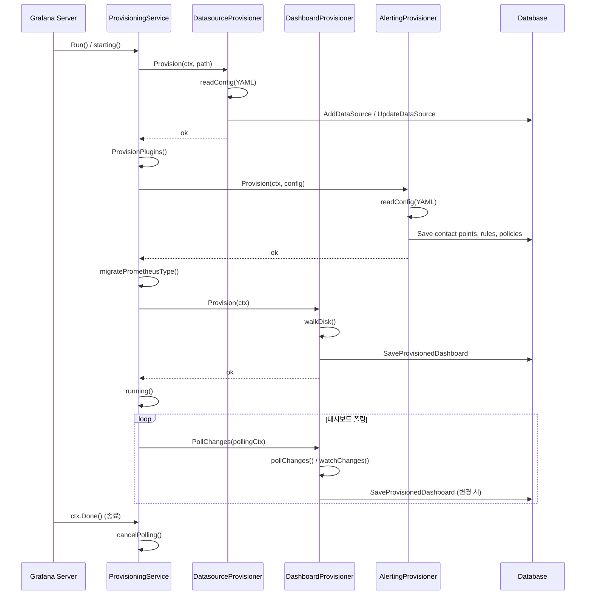

# Grafana 프로비저닝 심화

## 목차

1. [개요](#1-개요)
2. [프로비저닝 서비스 아키텍처](#2-프로비저닝-서비스-아키텍처)
3. [ProvisioningServiceImpl 구조체](#3-provisioningserviceimpl-구조체)
4. [시작 순서와 초기화 흐름](#4-시작-순서와-초기화-흐름)
5. [Running Phase: 변경 감시 루프](#5-running-phase-변경-감시-루프)
6. [데이터소스 프로비저닝](#6-데이터소스-프로비저닝)
7. [대시보드 프로비저닝](#7-대시보드-프로비저닝)
8. [알림 프로비저닝](#8-알림-프로비저닝)
9. [YAML 설정 포맷과 예제](#9-yaml-설정-포맷과-예제)
10. [설정 경로와 디렉토리 구조](#10-설정-경로와-디렉토리-구조)
11. [프로비저닝 생명주기 다이어그램](#11-프로비저닝-생명주기-다이어그램)
12. [Correlation 프로비저닝](#12-correlation-프로비저닝)
13. [프로비저닝 보안과 암호화](#13-프로비저닝-보안과-암호화)
14. [고급 설정과 운영 팁](#14-고급-설정과-운영-팁)

---

## 1. 개요

Grafana 프로비저닝은 **코드로서의 인프라(Infrastructure as Code)** 패턴을 모니터링 설정에 적용한 시스템이다.
YAML 파일로 데이터소스, 대시보드, 알림 규칙, 알림 채널, 알림 정책 등을 선언적으로 정의하면,
Grafana 서버가 시작할 때 이 파일들을 읽어서 데이터베이스에 자동 반영한다.

이 시스템의 핵심 가치는 다음과 같다:

| 가치 | 설명 |
|------|------|
| 재현성 | 동일한 YAML 파일로 어디서든 동일한 Grafana 환경을 구축 |
| 버전 관리 | YAML 파일을 Git에 커밋하여 변경 이력 추적 |
| 자동화 | CI/CD 파이프라인에서 Grafana 설정을 자동 배포 |
| 멀티 인스턴스 | 여러 Grafana 인스턴스에 동일한 설정을 일관되게 적용 |

프로비저닝 코드는 `pkg/services/provisioning/` 디렉토리에 위치하며,
하위에 `datasources/`, `dashboards/`, `alerting/`, `plugins/` 서브패키지가 각 리소스 유형별 로직을 담당한다.

---

## 2. 프로비저닝 서비스 아키텍처

프로비저닝 서비스의 전체 아키텍처를 ASCII 다이어그램으로 표현하면 다음과 같다:

```
┌─────────────────────────────────────────────────────────────────┐
│                  ProvisioningServiceImpl                        │
│                                                                 │
│  ┌──────────┐  ┌──────────┐  ┌──────────┐  ┌──────────────┐   │
│  │Datasource│  │ Plugins  │  │ Alerting │  │  Dashboard   │   │
│  │Provisioner│ │Provisioner│ │Provisioner│ │ Provisioner  │   │
│  └─────┬────┘  └─────┬────┘  └─────┬────┘  └──────┬───────┘   │
│        │             │             │               │           │
│        v             v             v               v           │
│  ┌──────────┐  ┌──────────┐  ┌──────────┐  ┌──────────────┐   │
│  │configReader│ │configReader│ │configReader│ │ FileReader   │   │
│  │(YAML Parse)│ │(YAML Parse)│ │(YAML Parse)│ │(Watch/Poll)  │   │
│  └─────┬────┘  └─────┬────┘  └─────┬────┘  └──────┬───────┘   │
│        │             │             │               │           │
│        v             v             v               v           │
│  ┌─────────────────────────────────────────────────────────┐   │
│  │              conf/provisioning/                          │   │
│  │  ├── datasources/*.yaml                                  │   │
│  │  ├── dashboards/*.yaml                                   │   │
│  │  ├── plugins/*.yaml                                      │   │
│  │  └── alerting/*.yaml                                     │   │
│  └─────────────────────────────────────────────────────────┘   │
└─────────────────────────────────────────────────────────────────┘
        │
        v
┌───────────────────┐
│    Grafana DB      │
│  (SQLite/PG/MySQL) │
└───────────────────┘
```

### 왜 이런 구조인가?

각 리소스 유형(datasource, dashboard, alerting, plugin)을 독립적인 프로비저너로 분리한 이유는:

1. **관심사의 분리**: 각 리소스의 YAML 스키마, 검증 로직, DB 저장 방식이 크게 다르다
2. **시작 순서 제어**: 데이터소스가 먼저 프로비저닝되어야 대시보드에서 참조할 수 있다
3. **독립적 에러 처리**: 한 유형의 프로비저닝 실패가 다른 유형에 영향을 주지 않도록 격리
4. **확장성**: 새로운 리소스 유형을 추가할 때 기존 코드를 변경하지 않아도 된다

---

## 3. ProvisioningServiceImpl 구조체

`pkg/services/provisioning/provisioning.go`에 정의된 핵심 구조체의 구조를 분석한다.

```go
// 경로: pkg/services/provisioning/provisioning.go

type ProvisioningServiceImpl struct {
    services.NamedService
    Cfg                          *setting.Cfg
    SQLStore                     db.DB
    orgService                   org.Service
    ac                           accesscontrol.AccessControl
    pluginStore                  pluginstore.Store
    alertingStore                *alertstore.DBstore
    EncryptionService            encryption.Internal
    NotificationService          *notifications.NotificationService
    log                          log.Logger
    pollingCtxCancel             context.CancelFunc
    newDashboardProvisioner      dashboards.DashboardProvisionerFactory
    dashboardProvisioner         dashboards.DashboardProvisioner
    provisionDatasources         func(context.Context, string, ...) error
    provisionPlugins             func(context.Context, string, ...) error
    provisionAlerting            func(context.Context, prov_alerting.ProvisionerConfig) error
    mutex                        sync.Mutex
    dashboardProvisioningService dashboardservice.DashboardProvisioningService
    dashboardService             dashboardservice.DashboardService
    datasourceService            datasourceservice.DataSourceService
    correlationsService          correlations.Service
    pluginsSettings              pluginsettings.Service
    quotaService                 quota.Service
    secretService                secrets.Service
    folderService                folder.Service
    resourcePermissions          accesscontrol.ReceiverPermissionsService
    tracer                       tracing.Tracer
    dual                         dualwrite.Service
    serverLock                   *serverlock.ServerLockService
    migratePrometheusType        func(context.Context) error
}
```

### 필드별 역할 분석

| 필드 | 타입 | 역할 |
|------|------|------|
| `Cfg` | `*setting.Cfg` | Grafana 전체 설정, `ProvisioningPath` 경로 포함 |
| `SQLStore` | `db.DB` | 데이터베이스 접근 인터페이스 |
| `orgService` | `org.Service` | 조직(Organization) 관리 서비스 |
| `ac` | `accesscontrol.AccessControl` | 접근 제어 서비스 |
| `pluginStore` | `pluginstore.Store` | 설치된 플러그인 저장소 |
| `alertingStore` | `*alertstore.DBstore` | 알림 규칙 DB 저장소 |
| `secretService` | `secrets.Service` | SecureJsonData 암호화/복호화 |
| `pollingCtxCancel` | `context.CancelFunc` | 대시보드 폴링 루프 취소 함수 |
| `dashboardProvisioner` | `DashboardProvisioner` | 현재 활성화된 대시보드 프로비저너 |
| `mutex` | `sync.Mutex` | 동시 접근 보호, 프로비저너 교체 시 사용 |
| `dual` | `dualwrite.Service` | Legacy SQL 과 K8s 통합 스토리지 간 듀얼 라이트 서비스 |
| `serverLock` | `*serverlock.ServerLockService` | 멀티 레플리카 환경에서 분산 잠금 |
| `migratePrometheusType` | `func(context.Context) error` | Prometheus 타입 마이그레이션 실행 함수 |

### ProvideService 의존성 주입

`ProvideService` 함수는 Wire 기반 의존성 주입 패턴으로, Grafana 서버 시작 시 필요한 모든 서비스를
주입받아 `ProvisioningServiceImpl`을 생성한다:

```go
func ProvideService(
    ac accesscontrol.AccessControl,
    cfg *setting.Cfg,
    sqlStore db.DB,
    pluginStore pluginstore.Store,
    alertingStore *alertstore.DBstore,
    encryptionService encryption.Internal,
    // ... 20개 이상의 의존성
) (*ProvisioningServiceImpl, error) {
    s := &ProvisioningServiceImpl{
        Cfg:                     cfg,
        newDashboardProvisioner: dashboards.New,
        provisionDatasources:    datasources.Provision,
        provisionPlugins:        plugins.Provision,
        provisionAlerting:       prov_alerting.Provision,
        // ...
    }
    s.NamedService = services.NewBasicService(s.starting, s.running, nil).
        WithName(ServiceName)
    // ...
}
```

여기서 `provisionDatasources`, `provisionPlugins`, `provisionAlerting` 필드에 함수 참조를
저장하는 설계는 **테스트 용이성**을 위한 것이다. 단위 테스트에서 이 함수들을 mock으로 교체할 수 있다.

---

## 4. 시작 순서와 초기화 흐름

`starting()` 메서드는 `services.BasicService`의 시작 콜백으로 등록되어,
Grafana 서버 시작 시 호출된다. 순서가 매우 중요하다:

```
┌────────────────────────────────────────────────────────────┐
│                    starting() 메서드                        │
│                                                            │
│  1. ProvisionDatasources(ctx)                              │
│     └── datasourcePath = ProvisioningPath + "/datasources" │
│     └── datasources.Provision() 호출                       │
│                                                            │
│  2. ProvisionPlugins(ctx)                                  │
│     └── appPath = ProvisioningPath + "/plugins"            │
│     └── plugins.Provision() 호출                            │
│                                                            │
│  3. ProvisionAlerting(ctx)                                 │
│     └── alertingPath = ProvisioningPath + "/alerting"      │
│     └── prov_alerting.Provision() 호출                      │
│                                                            │
│  4. migratePrometheusType(ctx)                             │
│     └── 데이터소스 프로비저닝 완료 후 Prom 타입 마이그레이션  │
│                                                            │
│  5. ProvisionDashboards(ctx)                               │
│     └── dashboardPath = ProvisioningPath + "/dashboards"   │
│     └── dashboards.New() → Provision() 호출                 │
│                                                            │
└────────────────────────────────────────────────────────────┘
```

### 왜 이 순서인가?

1. **데이터소스 우선**: 대시보드와 알림 규칙이 데이터소스를 참조하므로 먼저 생성되어야 한다
2. **플러그인 다음**: 플러그인 설정이 데이터소스 프로비저닝 이후에 적용된다
3. **알림 프로비저닝**: 알림 규칙은 데이터소스와 폴더를 참조할 수 있다
4. **Prometheus 타입 마이그레이션**: 데이터소스가 프로비저닝된 후에야 실행 가능
5. **대시보드 마지막**: 위 모든 리소스가 준비된 후에 대시보드를 로드

### 에러 처리 전략

```go
func (ps *ProvisioningServiceImpl) starting(ctx context.Context) error {
    if err := ps.ProvisionDatasources(ctx); err != nil {
        ps.log.Error("Failed to provision data sources", "error", err)
        return err  // 데이터소스 실패 → 서버 시작 중단
    }
    // ...
    if err := ps.ProvisionDashboards(ctx); err != nil {
        ps.log.Error("Failed to provision dashboard", "error", err)
        // 대시보드 폴더 생성 실패는 허용
        if !errors.Is(err, dashboards.ErrGetOrCreateFolder) {
            return err
        }
    }
    return nil
}
```

대시보드 프로비저닝에서 `ErrGetOrCreateFolder` 에러는 허용 목록에 포함되어 있다.
이는 대시보드 폴더를 생성하지 못해도 서버가 정상 시작되도록 하기 위함이다.
반면 데이터소스, 플러그인, 알림 프로비저닝 실패는 서버 시작을 중단시킨다.

---

## 5. Running Phase: 변경 감시 루프

`running()` 메서드는 서버가 정상 가동 중일 때 대시보드 파일 변경을 지속적으로 감시한다:

```go
func (ps *ProvisioningServiceImpl) running(ctx context.Context) error {
    for {
        ps.mutex.Lock()
        pollingContext, cancelFun := context.WithCancel(context.Background())
        ps.pollingCtxCancel = cancelFun
        ps.dashboardProvisioner.PollChanges(pollingContext)
        ps.mutex.Unlock()

        select {
        case <-pollingContext.Done():
            continue  // 폴링 취소 → 다시 시작
        case <-ctx.Done():
            ps.cancelPolling()
            return nil  // 서버 종료 → 루프 탈출
        }
    }
}
```

### 폴링 매커니즘 상세

```
┌────────────────────────────────────────────────────────────┐
│                 Dashboard 폴링 루프                         │
│                                                            │
│  1. mutex.Lock()                                           │
│  2. 새 pollingContext 생성 (background 기반)                 │
│  3. dashboardProvisioner.PollChanges(pollingContext) 시작    │
│     └── 각 FileReader가 goroutine으로 pollChanges() 실행     │
│  4. mutex.Unlock()                                         │
│  5. select로 폴링 완료 또는 서버 종료 대기                    │
│     ├── pollingContext.Done() → 새 폴링 시작 (continue)      │
│     └── ctx.Done() → cancelPolling() 후 종료 (return)        │
│                                                            │
└────────────────────────────────────────────────────────────┘
```

### FileReader의 pollChanges

`pkg/services/provisioning/dashboards/file_reader.go`에 구현된 `pollChanges()`는
두 가지 모드를 지원한다:

```go
func (fr *FileReader) pollChanges(ctx context.Context) {
    interval := fr.Cfg.UpdateIntervalSeconds
    if interval <= 10 {
        // 10초 이하이면 파일 워처(inotify) 사용
        err := fr.watchChanges(ctx)
        if err == nil {
            return
        }
        fr.log.Warn("error watching folder: %w", err)
        interval = 30  // 워처 실패 시 30초 폴링으로 폴백
    }

    // 주기적 폴링 모드
    ticker := time.NewTicker(time.Duration(int64(time.Second) * interval))
    for {
        select {
        case <-ticker.C:
            if err := fr.walkDisk(ctx); err != nil {
                fr.log.Error("failed to walk provisioned dashboards", "error", err)
            }
        case <-ctx.Done():
            return
        }
    }
}
```

| 모드 | 조건 | 장점 | 단점 |
|------|------|------|------|
| 파일 워처 | `UpdateIntervalSeconds <= 10` | 실시간 반영, CPU 효율적 | OS inotify 한계 |
| 주기적 폴링 | `UpdateIntervalSeconds > 10` | 안정적, 어디서든 동작 | 지연 발생 |

### watchChanges의 동작

```go
func (fr *FileReader) watchChanges(ctx context.Context) error {
    watcher, err := local.NewFileWatcher(fr.resolvedPath(), func(name string) bool {
        return strings.HasSuffix(name, ".json")
    })
    // ...
    changed := false
    events := make(chan string, 10)
    go func() {
        for {
            select {
            case <-ctx.Done():
                return
            case _, ok := <-events:
                if !ok { return }
                changed = true
            case <-time.After(time.Second * 5):
                // 5초 디바운스: 여러 파일이 동시에 변경되어도
                // walkDisk()는 한 번만 실행
                if changed {
                    fr.walkDisk(ctx)
                    changed = false
                }
            }
        }
    }()
    watcher.Watch(ctx, events)
    return nil
}
```

---

## 6. 데이터소스 프로비저닝

### 진입점과 흐름

`pkg/services/provisioning/datasources/datasources.go`의 `Provision()` 함수가 진입점이다:

```go
func Provision(ctx context.Context, configDirectory string,
    dsService BaseDataSourceService,
    correlationsStore CorrelationsStore,
    orgService org.Service) error {
    dc := newDatasourceProvisioner(
        log.New("provisioning.datasources"),
        dsService, correlationsStore, orgService,
    )
    return dc.applyChanges(ctx, configDirectory)
}
```

### applyChanges 전체 흐름

```
┌──────────────────────────────────────────────────────────────┐
│                    applyChanges()                             │
│                                                              │
│  1. cfgProvider.readConfig(ctx, configPath)                  │
│     └── YAML 파일 읽기 + 파싱 + 버전 분기 (V0/V1)            │
│                                                              │
│  2. willExistAfterProvisioning 맵 구성                       │
│     └── 삭제 대상 = false, 생성/업데이트 대상 = true           │
│                                                              │
│  3. GetPrunableProvisionedDataSources()                      │
│     └── prunable 데이터소스 중 설정에 없는 것 → stale 목록     │
│                                                              │
│  4. deleteDatasources(staleProvisionedDataSources)           │
│     └── 설정에서 제거된 prunable 데이터소스 삭제               │
│                                                              │
│  5. for each config:                                         │
│     └── provisionDataSources(cfg, willExistAfterProvisioning)│
│         ├── deleteDatasources(cfg.DeleteDatasources)         │
│         └── for each ds in cfg.Datasources:                  │
│             ├── GetDataSource(name, orgID) 조회               │
│             ├── Not Found → AddDataSource (INSERT)           │
│             └── Found → UpdateDataSource (UPDATE)            │
│                                                              │
│  6. for each config:                                         │
│     └── provisionCorrelations(cfg)                           │
│         └── 기존 Correlation 삭제 후 재생성                   │
│                                                              │
└──────────────────────────────────────────────────────────────┘
```

### YAML 스키마 (V1)

`pkg/services/provisioning/datasources/types.go`에 정의된 V1 구조체:

```go
type upsertDataSourceFromConfigV1 struct {
    OrgID           values.Int64Value     `yaml:"orgId"`
    Version         values.IntValue       `yaml:"version"`
    Name            values.StringValue    `yaml:"name"`
    Type            values.StringValue    `yaml:"type"`
    Access          values.StringValue    `yaml:"access"`
    URL             values.StringValue    `yaml:"url"`
    User            values.StringValue    `yaml:"user"`
    Database        values.StringValue    `yaml:"database"`
    BasicAuth       values.BoolValue      `yaml:"basicAuth"`
    BasicAuthUser   values.StringValue    `yaml:"basicAuthUser"`
    WithCredentials values.BoolValue      `yaml:"withCredentials"`
    IsDefault       values.BoolValue      `yaml:"isDefault"`
    Correlations    values.JSONSliceValue `yaml:"correlations"`
    JSONData        values.JSONValue      `yaml:"jsonData"`
    SecureJSONData  values.StringMapValue `yaml:"secureJsonData"`
    Editable        values.BoolValue      `yaml:"editable"`
    UID             values.StringValue    `yaml:"uid"`
    IsPrunable      values.BoolValue
}
```

### values 패키지의 역할

`values.StringValue` 등은 환경변수 치환을 지원하는 래퍼 타입이다.
YAML에서 `$__env{DB_PASSWORD}` 같은 표현을 사용하면, 값을 읽을 때 환경변수로 대체된다.

### UID 자동 생성

UID가 비어 있으면 데이터소스 이름의 SHA-256 해시를 기반으로 자동 생성한다:

```go
func safeUIDFromName(name string) string {
    h := sha256.New()
    _, _ = h.Write([]byte(name))
    bs := h.Sum(nil)
    return strings.ToUpper(fmt.Sprintf("P%x", bs[:8]))
}
```

### 기본 데이터소스 검증

`ErrInvalidConfigToManyDefault` 에러는 하나의 조직에서 두 개 이상의 데이터소스가
`isDefault: true`로 설정된 경우 발생한다.

---

## 7. 대시보드 프로비저닝

### 아키텍처 개요

대시보드 프로비저닝은 가장 복잡한 프로비저너로, 여러 컴포넌트가 협력한다:

```
┌────────────────────────────────────────────────────────────┐
│                   Dashboard Provisioner                     │
│                                                            │
│  ┌─────────────────────────────────────────────────────┐   │
│  │ Provisioner (dashboard.go)                           │   │
│  │  - fileReaders []*FileReader                         │   │
│  │  - configs []*config                                 │   │
│  │  - duplicateValidator                                │   │
│  │  - provisioner (DashboardProvisioningService)        │   │
│  │  - dual (dualwrite.Service)                          │   │
│  │  - serverLock (*serverlock.ServerLockService)        │   │
│  └────────┬────────────────────────────────────────────┘   │
│           │                                                │
│           ├──────────────────────────────┐                  │
│           v                              v                  │
│  ┌──────────────┐             ┌──────────────────────┐     │
│  │  FileReader   │             │  configReader        │     │
│  │  (file_reader │             │  (config_reader.go)  │     │
│  │   .go)        │             │  YAML → config 변환   │     │
│  │               │             └──────────────────────┘     │
│  │  - walkDisk() │                                          │
│  │  - pollChanges│                                          │
│  │  - saveDash.. │                                          │
│  └──────────────┘                                           │
└────────────────────────────────────────────────────────────┘
```

### config 구조체

`pkg/services/provisioning/dashboards/types.go`에 정의된 대시보드 프로비저닝 설정:

```go
type config struct {
    Name                  string
    Type                  string         // "file" (현재 유일한 타입)
    OrgID                 int64
    Folder                string         // 대시보드를 저장할 폴더 이름
    FolderUID             string         // 폴더 UID
    Editable              bool           // UI에서 편집 가능 여부 (deprecated)
    Options               map[string]any // path, foldersFromFilesStructure 등
    DisableDeletion       bool           // 파일 삭제 시 DB 대시보드 유지
    UpdateIntervalSeconds int64          // 폴링 간격 (기본 10초)
    AllowUIUpdates        bool           // UI 변경 허용 여부
}
```

### walkDisk 흐름

`walkDisk()`은 디스크를 스캔하여 데이터베이스와 동기화한다:

```go
func (fr *FileReader) walkDisk(ctx context.Context) error {
    resolvedPath := fr.resolvedPath()

    // 1. 이미 프로비저닝된 대시보드 목록 조회
    provisionedDashboardRefs, err := fr.getProvisionedDashboardsByPath(...)

    // 2. 디스크의 JSON 파일 목록 수집
    filesFoundOnDisk := map[string]os.FileInfo{}
    filepath.Walk(resolvedPath, createWalkFn(filesFoundOnDisk))

    // 3. 디스크에서 사라진 대시보드 처리
    fr.handleMissingDashboardFiles(ctx, provisionedDashboardRefs, filesFoundOnDisk)

    // 4. 파일 구조 기반 폴더 또는 고정 폴더에 저장
    if fr.FoldersFromFilesStructure {
        err = fr.storeDashboardsInFoldersFromFileStructure(...)
    } else {
        err = fr.storeDashboardsInFolder(...)
    }

    return nil
}
```

### 체크섬 기반 변경 감지

대시보드 JSON 파일의 MD5 체크섬을 계산하여, 이전에 프로비저닝된 체크섬과 비교한다.
체크섬이 동일하면 DB 업데이트를 건너뛰어 불필요한 쓰기를 방지한다:

```go
checkSum, err := util.Md5SumString(string(all))
// ...
upToDate := alreadyProvisioned
if provisionedData != nil {
    upToDate = jsonFile.checkSum == provisionedData.CheckSum
}
if upToDate {
    fr.log.Debug("provisioned dashboard is up to date")
    return provisioningMetadata, nil
}
```

### 폴더 자동 생성

대시보드를 저장할 폴더가 없으면 자동으로 생성한다:

```go
func (fr *FileReader) getOrCreateFolder(ctx context.Context, cfg *config, ...) (int64, string, error) {
    // 폴더 조회 시도
    result, err := fr.folderService.Get(ctx, cmd)
    // 없으면 생성
    if errors.Is(err, dashboards.ErrFolderNotFound) {
        f, err := service.SaveFolderForProvisionedDashboards(ctx, createCmd, fr.Cfg.Name)
        return f.ID, f.UID, nil
    }
    return result.ID, result.UID, nil
}
```

### foldersFromFilesStructure

이 옵션이 활성화되면 디스크의 디렉토리 구조가 Grafana 폴더 구조로 매핑된다:

```
conf/provisioning/dashboards/
  ├── my-provider.yaml
  └── path/to/dashboards/
      ├── infrastructure/     → Grafana "infrastructure" 폴더
      │   ├── cpu.json
      │   └── memory.json
      └── application/        → Grafana "application" 폴더
          └── errors.json
```

### 서버 잠금 (Server Lock)

멀티 레플리카 환경에서 여러 Grafana 인스턴스가 동시에 대시보드를 프로비저닝하면 충돌이 발생할 수 있다.
이를 방지하기 위해 `serverlock.ServerLockService`를 사용한 분산 잠금을 적용한다:

```go
lockErr := provider.serverLock.LockExecuteAndReleaseWithRetries(
    ctx,
    "provisioning_dashboards",
    lockTimeConfig,
    func(ctx context.Context) {
        for _, reader := range provider.fileReaders {
            reader.walkDisk(ctx)
        }
    },
    retryOpt,
)
```

잠금 설정:
- `MaxInterval`: 15초 (기본값) - 크래시한 레플리카의 잠금이 해제되는 시간
- `MinWait`: 100ms ~ `MaxWait`: 1000ms - 잠금 재시도 대기 시간
- 최대 20회 재시도

---

## 8. 알림 프로비저닝

### 알림 프로비저닝 순서

`pkg/services/provisioning/alerting/provisioner.go`에서 알림 프로비저닝은 엄격한 순서로 진행된다:

```
┌──────────────────────────────────────────────────────────────┐
│               Alerting Provision() 실행 순서                  │
│                                                              │
│  1. Contact Points 프로비저닝                                 │
│     └── cpProvisioner.Provision(ctx, files)                  │
│                                                              │
│  2. Mute Times 프로비저닝                                     │
│     └── mtProvisioner.Provision(ctx, files)                  │
│                                                              │
│  3. Text Templates 프로비저닝                                 │
│     └── ttProvisioner.Provision(ctx, files)                  │
│                                                              │
│  4. Notification Policies 프로비저닝                          │
│     └── npProvisioner.Provision(ctx, files)                  │
│                                                              │
│  5. Notification Policies 언프로비저닝 (삭제)                  │
│     └── npProvisioner.Unprovision(ctx, files)                │
│                                                              │
│  6. Mute Times 언프로비저닝                                   │
│     └── mtProvisioner.Unprovision(ctx, files)                │
│                                                              │
│  7. Text Templates 언프로비저닝                               │
│     └── ttProvisioner.Unprovision(ctx, files)                │
│                                                              │
│  8. Alert Rules 프로비저닝                                    │
│     └── ruleProvisioner.Provision(ctx, files)                │
│                                                              │
│  9. Contact Points 언프로비저닝                               │
│     └── cpProvisioner.Unprovision(ctx, files)                │
│     └── 규칙에서 참조가 모두 업데이트된 후에 삭제               │
│                                                              │
└──────────────────────────────────────────────────────────────┘
```

### 왜 이 순서인가?

Contact Points의 언프로비저닝이 **마지막**에 수행되는 이유가 핵심이다:
- Alert Rules가 Contact Points를 참조할 수 있다
- 규칙이 먼저 업데이트되어야 참조가 정리된 후 안전하게 Contact Point를 삭제할 수 있다
- 소스 코드 주석: `Unprovision contact points after rules to make sure all references in rules are updated`

### AlertingFile 데이터 모델

```go
type AlertingFile struct {
    configVersion
    Filename            string
    Groups              []models.AlertRuleGroupWithFolderFullpath
    DeleteRules         []RuleDelete
    ContactPoints       []ContactPoint
    DeleteContactPoints []DeleteContactPoint
    Policies            []NotificiationPolicy
    ResetPolicies       []OrgID
    MuteTimes           []MuteTime
    DeleteMuteTimes     []DeleteMuteTime
    Templates           []Template
    DeleteTemplates     []DeleteTemplate
}
```

### ProvisionerConfig 구조

```go
type ProvisionerConfig struct {
    Path                       string
    FolderService              folder.Service
    DashboardProvService       dashboards.DashboardProvisioningService
    RuleService                provisioning.AlertRuleService
    ContactPointService        provisioning.ContactPointService
    NotificiationPolicyService provisioning.NotificationPolicyService
    MuteTimingService          provisioning.MuteTimingService
    TemplateService            provisioning.TemplateService
}
```

---

## 9. YAML 설정 포맷과 예제

### 데이터소스 프로비저닝 YAML

```yaml
# conf/provisioning/datasources/prometheus.yaml
apiVersion: 1

prune: true  # 설정에 없는 prunable 데이터소스 자동 삭제

deleteDatasources:
  - name: Old-Prometheus
    orgId: 1

datasources:
  - name: Prometheus
    type: prometheus
    access: proxy
    orgId: 1
    uid: prometheus-main
    url: http://prometheus:9090
    isDefault: true
    editable: false
    jsonData:
      httpMethod: POST
      timeInterval: 15s
      exemplarTraceIdDestinations:
        - name: traceID
          datasourceUid: tempo-main
    secureJsonData:
      basicAuthPassword: $__env{PROM_PASSWORD}
    correlations:
      - targetUID: loki-main
        label: "Logs for this metric"
        description: "View related logs in Loki"
        config:
          type: query
          target:
            expr: '{job="$__value.job"}'
          field: job
```

### 대시보드 프로비저닝 YAML

```yaml
# conf/provisioning/dashboards/default.yaml
apiVersion: 1

providers:
  - name: 'infrastructure'
    type: file
    orgId: 1
    folder: 'Infrastructure'
    folderUid: 'infra-dashboards'
    editable: false
    allowUiUpdates: false
    disableDeletion: false
    updateIntervalSeconds: 30
    options:
      path: /var/lib/grafana/dashboards/infrastructure
      foldersFromFilesStructure: false

  - name: 'application-monitoring'
    type: file
    orgId: 1
    folder: ''
    options:
      path: /var/lib/grafana/dashboards/application
      foldersFromFilesStructure: true
```

### 알림 프로비저닝 YAML

```yaml
# conf/provisioning/alerting/alerting.yaml
apiVersion: 1

contactPoints:
  - orgId: 1
    name: slack-ops
    receivers:
      - uid: slack-receiver-1
        type: slack
        settings:
          recipient: '#ops-alerts'
          url: $__env{SLACK_WEBHOOK_URL}

muteTimes:
  - orgId: 1
    name: maintenance-window
    time_intervals:
      - times:
          - start_time: '02:00'
            end_time: '04:00'
        weekdays: ['saturday', 'sunday']

policies:
  - orgId: 1
    receiver: slack-ops
    group_by: ['alertname', 'namespace']
    group_wait: 30s
    group_interval: 5m
    repeat_interval: 4h
    routes:
      - receiver: slack-ops
        matchers:
          - severity = critical

groups:
  - orgId: 1
    name: cpu-alerts
    folder: Infrastructure
    interval: 1m
    rules:
      - uid: cpu-high-alert
        title: High CPU Usage
        condition: C
        data:
          - refId: A
            datasourceUid: prometheus-main
            model:
              expr: 'avg(rate(cpu_usage_total[5m])) > 0.8'
          - refId: C
            datasourceUid: __expr__
            model:
              type: threshold
              expression: A
              conditions:
                - evaluator:
                    type: gt
                    params: [0.8]
        for: 5m
        labels:
          severity: warning
        annotations:
          summary: 'CPU usage is above 80%'
```

---

## 10. 설정 경로와 디렉토리 구조

### 기본 경로

`defaults.ini`에서 프로비저닝 경로를 설정한다:

```ini
[paths]
provisioning = conf/provisioning
```

이 경로는 `setting.Cfg.ProvisioningPath`로 로드되며, 각 프로비저너가 하위 디렉토리를 조합한다:

| 프로비저너 | 경로 조합 |
|-----------|----------|
| Datasources | `ProvisioningPath + "/datasources"` |
| Plugins | `ProvisioningPath + "/plugins"` |
| Alerting | `ProvisioningPath + "/alerting"` |
| Dashboards | `ProvisioningPath + "/dashboards"` |

### 프로비저닝 디렉토리 구조

```
conf/provisioning/
├── datasources/
│   ├── prometheus.yaml
│   ├── loki.yaml
│   └── postgres.yaml
├── dashboards/
│   ├── infrastructure.yaml    # Provider 설정
│   └── application.yaml       # Provider 설정
├── alerting/
│   ├── rules.yaml
│   ├── contact-points.yaml
│   └── notification-policies.yaml
└── plugins/
    └── app-plugins.yaml
```

### 파일 감지 규칙

- 데이터소스/플러그인/알림: `.yaml` 또는 `.yml` 확장자 파일만 파싱
- 대시보드: `.json` 확장자 파일만 대시보드로 인식
- 숨김 디렉토리(`.`으로 시작)는 건너뜀

---

## 11. 프로비저닝 생명주기 다이어그램



---

## 12. Correlation 프로비저닝

데이터소스 프로비저닝과 함께 Correlation(상관관계)도 프로비저닝할 수 있다.
Correlation은 데이터소스 간의 연결 관계를 정의한다.

### 프로비저닝 흐름

```go
func (dc *DatasourceProvisioner) provisionCorrelations(ctx context.Context, cfg *configs) error {
    for _, ds := range cfg.Datasources {
        dataSource, err := dc.dsService.GetDataSource(ctx, cmd)
        // 기존 프로비저닝된 Correlation 삭제
        dc.correlationsStore.DeleteCorrelationsBySourceUID(ctx, ...)
        // 새 Correlation 생성
        for _, correlation := range ds.Correlations {
            createCorrelationCmd, _ := makeCreateCorrelationCommand(correlation, ...)
            dc.correlationsStore.CreateOrUpdateCorrelation(ctx, createCorrelationCmd)
        }
    }
}
```

### Correlation 타입

| 타입 | 설명 |
|------|------|
| `query` | 소스 데이터소스의 데이터를 기반으로 대상 데이터소스에 쿼리 실행 |
| `external` | 외부 URL로 연결 |

---

## 13. 프로비저닝 보안과 암호화

### SecureJsonData 처리

데이터소스의 `secureJsonData`에 포함된 비밀번호, API 키 등은 DB에 저장 시 암호화된다.
프로비저닝 YAML에서는 평문으로 작성하지만, Grafana 서버가 읽을 때 `encryption.Internal`을
통해 암호화하여 저장한다.

### 환경변수 치환

`$__env{VARIABLE_NAME}` 구문을 사용하여 민감한 정보를 환경변수에서 가져올 수 있다:

```yaml
secureJsonData:
  password: $__env{DB_PASSWORD}
  apiKey: $__env{API_KEY}
```

### 읽기 전용 모드

`editable: false` 또는 `readOnly: true`로 설정된 프로비저닝된 리소스는
Grafana UI에서 수정할 수 없다. 이는 프로비저닝된 설정이 YAML 파일을 단일 진실의 원천(Single Source of Truth)으로
유지하도록 보장한다.

---

## 14. 고급 설정과 운영 팁

### 대시보드 프로비저닝 잠금 설정

```ini
[unified_alerting]
# 멀티 레플리카 환경에서 대시보드 프로비저닝 서버 잠금 설정
classic_provisioning_dashboards_server_lock_max_interval_seconds = 15
classic_provisioning_dashboards_server_lock_min_wait_ms = 100
classic_provisioning_dashboards_server_lock_max_wait_ms = 1000
```

### 대시보드 삭제 방지

`disableDeletion: true`로 설정하면, 디스크에서 JSON 파일이 삭제되어도
데이터베이스의 대시보드는 유지된다. 대신 프로비저닝 메타데이터만 제거되어
해당 대시보드는 "비프로비저닝" 상태가 된다.

### UI 업데이트 허용

`allowUiUpdates: true`로 설정하면 프로비저닝된 대시보드를 UI에서도 수정할 수 있다.
다만 다음 프로비저닝 사이클에서 디스크의 JSON 파일 내용으로 덮어쓸 수 있으므로 주의가 필요하다.

### 프로비저닝 디버깅

```ini
[log]
filters = provisioning:debug
# 또는 특정 프로비저너만
filters = provisioning.datasources:debug provisioning.dashboard:debug
```

### 멀티 조직 프로비저닝

`orgId` 필드를 사용하여 여러 조직에 리소스를 프로비저닝할 수 있다.
기본값은 `1`이다. 대시보드 config reader는 `orgExists` 함수로 조직 존재 여부를 검증한다:

```go
if err := cr.orgExists(ctx, dashboard.OrgID); err != nil {
    return nil, fmt.Errorf("failed to provision dashboards with %q reader: %w",
        dashboard.Name, err)
}
```

### Dual-Write와 K8s 통합 스토리지

최신 Grafana는 통합 스토리지(Unified Storage) 전환을 진행 중이다.
대시보드 프로비저너는 `dualwrite.Service`를 통해 레거시 SQL과 K8s 스타일 스토리지에
동시에 쓰기를 수행할 수 있다. 마이그레이션 중에는 프로비저닝을 건너뛴다:

```go
if provider.dual != nil {
    status, _ := provider.dual.Status(context.Background(), ...)
    if status.Migrating > 0 {
        provider.log.Info("dashboard migrations are running, skipping provisioning")
        return nil
    }
}
```

---

## 소스 코드 참조

| 파일 | 역할 |
|------|------|
| `pkg/services/provisioning/provisioning.go` | ProvisioningServiceImpl 정의, 시작/실행 로직 |
| `pkg/services/provisioning/datasources/datasources.go` | 데이터소스 프로비저닝 로직 |
| `pkg/services/provisioning/datasources/types.go` | 데이터소스 YAML 스키마 정의 |
| `pkg/services/provisioning/datasources/config_reader.go` | 데이터소스 YAML 파싱 |
| `pkg/services/provisioning/dashboards/dashboard.go` | 대시보드 Provisioner 구현 |
| `pkg/services/provisioning/dashboards/file_reader.go` | 파일 워처, 폴링, 디스크 스캔 |
| `pkg/services/provisioning/dashboards/config_reader.go` | 대시보드 YAML 파싱 |
| `pkg/services/provisioning/dashboards/types.go` | 대시보드 config 구조체 |
| `pkg/services/provisioning/dashboards/validator.go` | 중복 대시보드 검증 |
| `pkg/services/provisioning/alerting/provisioner.go` | 알림 프로비저닝 오케스트레이션 |
| `pkg/services/provisioning/alerting/types.go` | 알림 YAML 스키마 (AlertingFile 등) |
| `pkg/services/provisioning/alerting/rules_provisioner.go` | 알림 규칙 프로비저닝 |
| `pkg/services/provisioning/alerting/contact_point_provisioner.go` | Contact Point 프로비저닝 |
| `pkg/services/provisioning/alerting/notification_policy_provisioner.go` | 알림 정책 프로비저닝 |
| `pkg/services/provisioning/alerting/mute_times_provisioner.go` | Mute Times 프로비저닝 |
| `pkg/services/provisioning/alerting/text_templates.go` | 알림 템플릿 프로비저닝 |
