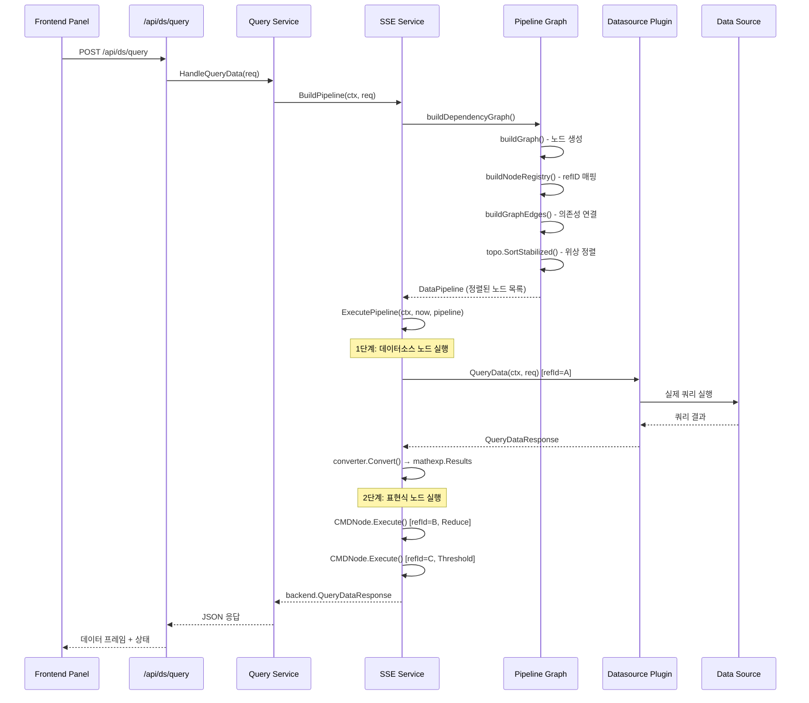

# Grafana 쿼리 실행 엔진 심화

## 목차

1. [개요](#1-개요)
2. [쿼리 API 엔드포인트](#2-쿼리-api-엔드포인트)
3. [쿼리 라우팅 아키텍처](#3-쿼리-라우팅-아키텍처)
4. [서버사이드 표현식 (SSE) 서비스](#4-서버사이드-표현식-sse-서비스)
5. [DAG 기반 파이프라인 실행](#5-dag-기반-파이프라인-실행)
6. [노드 타입과 실행 모델](#6-노드-타입과-실행-모델)
7. [표현식 커맨드 타입](#7-표현식-커맨드-타입)
8. [데이터소스 노드 실행](#8-데이터소스-노드-실행)
9. [FlagSseGroupByDatasource](#9-flagssegroupbydatasource)
10. [쿼리 캐싱](#10-쿼리-캐싱)
11. [데이터 프레임 모델](#11-데이터-프레임-모델)
12. [에러 처리와 의존성 전파](#12-에러-처리와-의존성-전파)
13. [트레이싱 통합](#13-트레이싱-통합)
14. [메트릭 수집](#14-메트릭-수집)
15. [쿼리 실행 시퀀스 다이어그램](#15-쿼리-실행-시퀀스-다이어그램)

---

## 1. 개요

Grafana의 쿼리 실행 엔진은 프론트엔드 대시보드 패널의 쿼리 요청을 받아,
적절한 데이터소스 플러그인으로 라우팅하고, 서버사이드 표현식(SSE)을 통해
수학 연산, 리듀스, 리샘플, SQL, 임계값 평가 등을 수행하는 복합 시스템이다.

핵심 컴포넌트:

| 컴포넌트 | 경로 | 역할 |
|----------|------|------|
| Query Service | `pkg/services/query/` | 쿼리 요청 라우팅 |
| SSE Service | `pkg/expr/service.go` | 서버사이드 표현식 실행 |
| DataPipeline | `pkg/expr/graph.go` | DAG 기반 실행 순서 결정 |
| Node Types | `pkg/expr/nodes.go` | CMDNode, DSNode, MLNode 정의 |
| Commands | `pkg/expr/commands.go` | Math, Reduce, Resample 등 커맨드 |
| Threshold | `pkg/expr/threshold.go` | 임계값 평가 커맨드 |
| SQL Command | `pkg/expr/sql_command.go` | SQL 표현식 커맨드 |
| ML Node | `pkg/expr/ml.go` | 머신러닝 쿼리 노드 |

---

## 2. 쿼리 API 엔드포인트

Grafana는 두 가지 주요 쿼리 API 엔드포인트를 제공한다:

### /api/ds/query

통합 쿼리 엔드포인트. 여러 데이터소스에 대한 쿼리와 SSE 표현식을 하나의 요청으로 처리한다.

```
POST /api/ds/query
Content-Type: application/json

{
  "queries": [
    {
      "refId": "A",
      "datasource": { "uid": "prometheus-main", "type": "prometheus" },
      "expr": "up{job=\"grafana\"}",
      "interval": "15s",
      "maxDataPoints": 1000
    },
    {
      "refId": "B",
      "datasource": { "uid": "__expr__", "type": "__expr__" },
      "type": "reduce",
      "expression": "A",
      "reducer": "mean"
    },
    {
      "refId": "C",
      "datasource": { "uid": "__expr__", "type": "__expr__" },
      "type": "threshold",
      "expression": "B",
      "conditions": [{ "evaluator": { "type": "gt", "params": [0.8] } }]
    }
  ],
  "from": "now-1h",
  "to": "now"
}
```

### /api/datasources/proxy/uid/:uid/*

데이터소스 프록시 엔드포인트. 특정 데이터소스에 직접 프록시 요청을 전달한다.
SSE 표현식은 사용할 수 없으며, 단일 데이터소스에 대한 원시 쿼리에 사용된다.

### 특수 데이터소스 식별자

SSE 표현식은 특수한 데이터소스 UID를 사용하여 식별된다:

```go
// pkg/expr/service.go

const DatasourceType = "__expr__"
const DatasourceUID = DatasourceType
const DatasourceID = -100
const OldDatasourceUID = "-100"  // 하위 호환성

func IsDataSource(uid string) bool {
    return uid == DatasourceUID || uid == OldDatasourceUID
}
```

---

## 3. 쿼리 라우팅 아키텍처

```
┌──────────────────────────────────────────────────────────────────┐
│                      쿼리 요청 흐름                               │
│                                                                  │
│  Frontend Panel                                                  │
│       │                                                          │
│       v                                                          │
│  POST /api/ds/query                                              │
│       │                                                          │
│       v                                                          │
│  ┌─────────────────────────────────────────────────────────┐     │
│  │              Query Service                               │     │
│  │                                                         │     │
│  │  1. 요청 파싱                                            │     │
│  │  2. 쿼리를 datasource UID 기준으로 분류                   │     │
│  │     ├── __expr__ → SSE Service                          │     │
│  │     ├── __ml__   → ML Service                           │     │
│  │     └── 기타     → Plugin Client                         │     │
│  │                                                         │     │
│  └─────┬───────────────────┬──────────────────┬────────────┘     │
│        │                   │                  │                   │
│        v                   v                  v                   │
│  ┌──────────┐     ┌──────────────┐   ┌──────────────────┐       │
│  │SSE Service│     │Plugin Client │   │   ML Service     │       │
│  │(pkg/expr/)│     │(gRPC/HTTP)   │   │(pkg/expr/ml.go)  │       │
│  │           │     │              │   │                  │       │
│  │BuildPipe  │     │QueryData()   │   │   Outlier/       │       │
│  │line →     │     │              │   │   Forecast       │       │
│  │Execute    │     │  Prometheus  │   │                  │       │
│  │Pipeline   │     │  Loki        │   └──────────────────┘       │
│  │           │     │  InfluxDB    │                               │
│  └──────────┘     │  PostgreSQL  │                               │
│                    │  ...         │                               │
│                    └──────────────┘                               │
└──────────────────────────────────────────────────────────────────┘
```

### NodeType에 따른 라우팅

```go
// pkg/expr/service.go

func NodeTypeFromDatasourceUID(uid string) NodeType {
    if IsDataSource(uid) {
        return TypeCMDNode        // SSE 표현식 커맨드
    }
    if uid == MLDatasourceUID {
        return TypeMLNode         // 머신러닝 노드
    }
    return TypeDatasourceNode     // 일반 데이터소스 노드
}
```

---

## 4. 서버사이드 표현식 (SSE) 서비스

### Service 구조체

`pkg/expr/service.go`에 정의된 SSE 서비스의 핵심 구조:

```go
type Service struct {
    cfg          *setting.Cfg
    dataService  backend.QueryDataHandler
    pCtxProvider pluginContextProvider
    features     featuremgmt.FeatureToggles
    converter    *ResultConverter

    pluginsClient backend.CallResourceHandler

    tracer                    tracing.Tracer
    metrics                   *metrics.ExprMetrics
    qsDatasourceClientBuilder dsquerierclient.QSDatasourceClientBuilder
}
```

### 필드 역할

| 필드 | 역할 |
|------|------|
| `dataService` | 플러그인 클라이언트, 데이터소스 쿼리 실행 |
| `pCtxProvider` | 플러그인 컨텍스트 제공 (인증 정보, 설정 등) |
| `features` | 피처 플래그 관리 (GroupByDatasource, SqlExpressions 등) |
| `converter` | 데이터소스 응답을 mathexp 형식으로 변환 |
| `tracer` | OpenTelemetry 트레이싱 |
| `metrics` | Prometheus 메트릭 수집 |
| `qsDatasourceClientBuilder` | Query Service 데이터소스 클라이언트 빌더 (K8s 스타일) |

### 비활성화 확인

```go
func (s *Service) isDisabled() bool {
    if s.cfg == nil {
        return true
    }
    return !s.cfg.ExpressionsEnabled
}
```

---

## 5. DAG 기반 파이프라인 실행

### BuildPipeline

SSE의 핵심은 쿼리들 간의 의존성을 **DAG(Directed Acyclic Graph)**로 모델링하고,
위상 정렬(topological sort)하여 실행 순서를 결정하는 것이다.

```go
func (s *Service) buildPipeline(ctx context.Context, req *Request) (DataPipeline, error) {
    _, span := s.tracer.Start(ctx, "SSE.BuildPipeline")
    defer span.End()

    // 1. 의존성 그래프 생성
    graph, err := s.buildDependencyGraph(ctx, req)
    if err != nil {
        return nil, err
    }

    // 2. 위상 정렬로 실행 순서 결정
    nodes, err := buildExecutionOrder(graph)
    if err != nil {
        return nil, err
    }

    return nodes, nil
}
```

### 그래프 생성 과정

```
┌──────────────────────────────────────────────────────────────┐
│                    buildDependencyGraph()                     │
│                                                              │
│  1. buildGraph()                                             │
│     └── 각 쿼리를 Node로 변환                                 │
│         ├── __expr__ UID → buildCMDNode()                    │
│         ├── __ml__ UID   → buildMLNode()                     │
│         └── 기타 UID     → buildDSNode()                     │
│                                                              │
│  2. buildNodeRegistry()                                      │
│     └── refID → Node 매핑 테이블 구축                         │
│                                                              │
│  3. buildGraphEdges()                                        │
│     └── CMDNode의 NeedsVars()로 의존 관계 파악                │
│     └── 간선(Edge) 추가: 의존 노드 → 현재 노드                │
│                                                              │
│  결과: 방향 그래프 (simple.DirectedGraph)                     │
│                                                              │
│  예시:                                                       │
│    A (Prometheus) ──→ B (Reduce) ──→ C (Threshold)           │
│    D (Loki)       ──→ E (Math: $D + $B)                      │
│                        ↑                                     │
│                   B ───┘                                     │
│                                                              │
└──────────────────────────────────────────────────────────────┘
```

### 위상 정렬과 실행 순서

```go
func buildExecutionOrder(graph *simple.DirectedGraph) ([]Node, error) {
    // gonum 라이브러리의 안정 위상 정렬 사용
    sortedNodes, err := topo.SortStabilized(graph, nil)
    if err != nil {
        return nil, err  // 순환 의존성 감지
    }

    var dsNodes []Node
    var otherNodes []Node

    for _, v := range sortedNodes {
        n := v.(Node)
        switch n.NodeType() {
        case TypeDatasourceNode, TypeMLNode:
            dsNodes = append(dsNodes, n)    // 데이터소스 노드를 앞으로
        default:
            otherNodes = append(otherNodes, n)
        }
    }

    // 데이터소스 노드가 항상 먼저 실행됨
    return append(dsNodes, otherNodes...), nil
}
```

### 왜 DAG인가?

1. **의존성 해결**: 표현식 B가 쿼리 A의 결과를 필요로 하면, A가 반드시 먼저 실행되어야 한다
2. **순환 감지**: `topo.SortStabilized`가 순환 의존성을 자동 감지하여 에러를 반환한다
3. **최적화**: 독립적인 데이터소스 쿼리를 묶어서 배치 실행할 수 있다
4. **에러 전파**: 의존 노드의 에러가 하위 노드로 전파되어 불필요한 실행을 방지한다

---

## 6. 노드 타입과 실행 모델

### Node 인터페이스

```go
// pkg/expr/graph.go

type Node interface {
    ID() int64
    NodeType() NodeType
    RefID() string
    String() string
    NeedsVars() []string         // 이 노드가 필요로 하는 다른 노드의 refID 목록
    SetInputTo(refID string)     // 이 노드의 결과를 사용하는 노드 기록
    IsInputTo() map[string]struct{}
}

type ExecutableNode interface {
    Node
    Execute(ctx context.Context, now time.Time, vars mathexp.Vars, s *Service) (mathexp.Results, error)
}
```

### NodeType 정의

```go
type NodeType int

const (
    TypeCMDNode        NodeType = iota  // SSE 표현식 커맨드
    TypeDatasourceNode                   // 데이터소스 쿼리
    TypeMLNode                           // 머신러닝 쿼리
)
```

### baseNode 공통 구조

```go
type baseNode struct {
    id        int64
    refID     string
    isInputTo map[string]struct{}  // 이 노드의 출력을 사용하는 노드 목록
}
```

### CMDNode (표현식 노드)

```go
type CMDNode struct {
    baseNode
    CMDType CommandType
    Command Command    // Math, Reduce, Resample, Threshold, SQL 중 하나
}

func (gn *CMDNode) Execute(ctx context.Context, now time.Time,
    vars mathexp.Vars, s *Service) (mathexp.Results, error) {
    return gn.Command.Execute(ctx, now, vars, s.tracer, s.metrics)
}

func (gn *CMDNode) NeedsVars() []string {
    return gn.Command.NeedsVars()  // 참조하는 다른 노드의 refID
}
```

### DSNode (데이터소스 노드)

```go
type DSNode struct {
    baseNode
    query      json.RawMessage
    datasource *datasources.DataSource

    orgID      int64
    queryType  string
    timeRange  TimeRange
    intervalMS int64
    maxDP      int64
    request    Request

    isInputToSQLExpr bool  // SQL 표현식의 입력인 경우 특별 처리
}
```

---

## 7. 표현식 커맨드 타입

### Command 인터페이스

```go
// pkg/expr/commands.go

type Command interface {
    NeedsVars() []string
    Execute(ctx context.Context, now time.Time, vars mathexp.Vars,
        tracer tracing.Tracer, metrics *metrics.ExprMetrics) (mathexp.Results, error)
    Type() string
}
```

### 지원되는 커맨드 타입

| 타입 | CommandType 상수 | 설명 | 예시 표현식 |
|------|-----------------|------|------------|
| Math | `TypeMath` | 수학 표현식 | `$A + $B * 2` |
| Reduce | `TypeReduce` | 시리즈를 단일 값으로 축소 | `mean($A)` |
| Resample | `TypeResample` | 시계열 리샘플링 | 1m → 5m 변환 |
| Classic Conditions | `TypeClassicConditions` | 레거시 알림 조건 | `avg() > 100` |
| Threshold | `TypeThreshold` | 임계값 평가 (0 또는 1) | `gt(0.8)` |
| SQL | `TypeSQL` | SQL 쿼리로 데이터 변환 | `SELECT * FROM A WHERE value > 100` |

### buildCMDNode에서의 커맨드 생성

```go
func buildCMDNode(ctx context.Context, rn *rawNode,
    toggles featuremgmt.FeatureToggles, cfg *setting.Cfg) (*CMDNode, error) {
    commandType, err := GetExpressionCommandType(rn.Query)

    // SQL 표현식은 피처 플래그로 제어
    if commandType == TypeSQL {
        if !toggles.IsEnabledGlobally(featuremgmt.FlagSqlExpressions) {
            return nil, fmt.Errorf("sql expressions are disabled")
        }
    }

    node := &CMDNode{
        baseNode: baseNode{id: rn.idx, refID: rn.RefID},
        CMDType:  commandType,
    }

    switch commandType {
    case TypeMath:
        node.Command, err = UnmarshalMathCommand(rn)
    case TypeReduce:
        node.Command, err = UnmarshalReduceCommand(rn)
    case TypeResample:
        node.Command, err = UnmarshalResampleCommand(rn)
    case TypeClassicConditions:
        node.Command, err = classic.UnmarshalConditionsCmd(rn.Query, rn.RefID)
    case TypeThreshold:
        node.Command, err = UnmarshalThresholdCommand(rn)
    case TypeSQL:
        node.Command, err = UnmarshalSQLCommand(ctx, rn, cfg)
    }
    return node, nil
}
```

### MathCommand 상세

```go
type MathCommand struct {
    RawExpression string
    Expression    *mathexp.Expr
    refID         string
}

func NewMathCommand(refID, expr string) (*MathCommand, error) {
    parsedExpr, err := mathexp.New(expr)
    if err != nil {
        return nil, err
    }
    return &MathCommand{
        RawExpression: expr,
        Expression:    parsedExpr,
        refID:         refID,
    }, nil
}
```

Math 표현식은 `$A + $B * 2`와 같은 형태로, `$` 접두사로 다른 쿼리의 결과를 참조한다.
`mathexp.New()` 파서가 이를 AST로 변환하고, 실행 시 변수를 바인딩하여 계산한다.

### 그래프 엣지 검증 규칙

`buildGraphEdges()` 메서드에서 적용되는 제약 조건들:

```go
// 1. 자기 참조 금지
if neededNode.ID() == cmdNode.ID() {
    return fmt.Errorf("expression '%v' cannot reference itself")
}

// 2. Classic Conditions는 데이터소스 노드만 입력 가능
if cmdNode.CMDType == TypeClassicConditions {
    if neededNode.NodeType() != TypeDatasourceNode {
        return fmt.Errorf("only data source queries may be inputs to a classic condition")
    }
}

// 3. Classic Conditions는 다른 표현식의 입력 불가
if neededNode.(*CMDNode).CMDType == TypeClassicConditions {
    return fmt.Errorf("classic conditions may not be the input for other expressions")
}

// 4. SQL 표현식은 다른 표현식의 입력 불가
if neededNode.(*CMDNode).CMDType == TypeSQL {
    return fmt.Errorf("sql expressions can not be the input for other expressions")
}

// 5. SQL 표현식은 데이터소스 노드만 입력 가능
if _, ok := cmdNode.Command.(*SQLCommand); ok {
    if _, ok := neededNode.(*DSNode); !ok {
        return fmt.Errorf("only data source queries may be inputs to a sql expression")
    }
}
```

---

## 8. 데이터소스 노드 실행

### DSNode.Execute()

```go
func (dn *DSNode) Execute(ctx context.Context, now time.Time,
    _ mathexp.Vars, s *Service) (r mathexp.Results, e error) {

    ctx, span := s.tracer.Start(ctx, "SSE.ExecuteDatasourceQuery")
    defer span.End()
    span.SetAttributes(
        attribute.String("datasource.type", dn.datasource.Type),
        attribute.String("datasource.uid", dn.datasource.UID),
    )

    req := &backend.QueryDataRequest{
        Queries: []backend.DataQuery{{
            RefID:         dn.refID,
            MaxDataPoints: dn.maxDP,
            Interval:      time.Duration(int64(time.Millisecond) * dn.intervalMS),
            JSON:          dn.query,
            TimeRange:     dn.timeRange.AbsoluteTime(now),
            QueryType:     dn.queryType,
        }},
        Headers: dn.request.Headers,
    }

    // Query Service 클라이언트 확인 (K8s 스타일)
    qsDSClient, ok, err := s.qsDatasourceClientBuilder.BuildClient(
        dn.datasource.Type, dn.datasource.UID)

    if !ok {
        // 레거시 플러그인 클라이언트 사용
        pCtx, _ := s.pCtxProvider.GetWithDataSource(ctx, ...)
        req.PluginContext = pCtx
        resp, err = s.dataService.QueryData(ctx, req)
    } else {
        // K8s Query Service 클라이언트 사용
        k8sReq, _ := ConvertBackendRequestToDataRequest(req)
        resp, err = qsDSClient.QueryData(ctx, *k8sReq)
    }

    // 응답 프레임 변환
    dataFrames, _ := getResponseFrame(logger, resp, dn.refID)

    if dn.isInputToSQLExpr {
        // SQL 표현식 입력인 경우 특별 변환
        result, _ = handleSqlInput(ctx, s.tracer, dn.RefID(), ...)
    } else {
        responseType, result, err = s.converter.Convert(ctx, dn.datasource.Type, dataFrames)
    }

    return result, err
}
```

### 레거시 vs K8s 클라이언트

```
┌──────────────────────────────────────────────────────────────┐
│              데이터소스 쿼리 실행 경로                          │
│                                                              │
│                DSNode.Execute()                               │
│                      │                                       │
│                      v                                       │
│         qsDatasourceClientBuilder                            │
│         .BuildClient(type, uid)                              │
│                      │                                       │
│            ┌─────────┴──────────┐                            │
│            │                    │                            │
│        ok = false           ok = true                        │
│            │                    │                            │
│            v                    v                            │
│     ┌──────────────┐   ┌──────────────────┐                 │
│     │ Legacy Flow   │   │ K8s QS Flow     │                 │
│     │               │   │                  │                 │
│     │ pCtxProvider  │   │ Convert to       │                 │
│     │ .GetWithDS()  │   │ DataRequest      │                 │
│     │               │   │                  │                 │
│     │ dataService   │   │ qsDSClient       │                 │
│     │ .QueryData()  │   │ .QueryData()     │                 │
│     │               │   │                  │                 │
│     │ (gRPC plugin) │   │ (K8s API)        │                 │
│     └──────────────┘   └──────────────────┘                 │
│                                                              │
└──────────────────────────────────────────────────────────────┘
```

---

## 9. FlagSseGroupByDatasource

### 동일 데이터소스 쿼리 그룹 실행

피처 플래그 `FlagSseGroupByDatasource`가 활성화되면, 동일한 데이터소스에 대한
여러 쿼리를 하나의 요청으로 묶어 실행한다. 이는 네트워크 왕복을 줄여 성능을 향상시킨다.

```go
func (dp *DataPipeline) execute(c context.Context, now time.Time, s *Service) (mathexp.Vars, error) {
    vars := make(mathexp.Vars)
    groupByDSFlag := s.features.IsEnabled(c, featuremgmt.FlagSseGroupByDatasource)

    // 1단계: 데이터소스 노드를 그룹으로 묶어 실행
    if groupByDSFlag {
        dsNodes := []*DSNode{}
        for _, node := range *dp {
            if node.NodeType() != TypeDatasourceNode {
                continue
            }
            dsNodes = append(dsNodes, node.(*DSNode))
        }
        executeDSNodesGrouped(c, now, vars, s, dsNodes)
    }

    // 2단계: 나머지 노드 순차 실행
    for _, node := range *dp {
        if groupByDSFlag && node.NodeType() == TypeDatasourceNode {
            continue  // 이미 실행됨
        }
        // ... 의존성 에러 체크 후 실행
    }
    return vars, nil
}
```

### executeDSNodesGrouped 상세

```go
func executeDSNodesGrouped(ctx context.Context, now time.Time,
    vars mathexp.Vars, s *Service, nodes []*DSNode) {

    // 데이터소스 인스턴스별 그룹화
    type dsKey struct {
        uid   string
        id    int64
        orgID int64
    }
    byDS := make(map[dsKey][]*DSNode)
    for _, node := range nodes {
        k := dsKey{
            id:    node.datasource.ID,
            uid:   node.datasource.UID,
            orgID: node.orgID,
        }
        byDS[k] = append(byDS[k], node)
    }

    // 각 그룹별로 하나의 QueryDataRequest 생성
    for _, nodeGroup := range byDS {
        req := &backend.QueryDataRequest{
            Headers: firstNode.request.Headers,
        }
        for _, dn := range nodeGroup {
            req.Queries = append(req.Queries, backend.DataQuery{
                RefID:         dn.refID,
                MaxDataPoints: dn.maxDP,
                Interval:      time.Duration(int64(time.Millisecond) * dn.intervalMS),
                JSON:          dn.query,
                TimeRange:     dn.timeRange.AbsoluteTime(now),
                QueryType:     dn.queryType,
            })
        }

        // 단일 요청으로 모든 쿼리 실행
        resp, queryErr = s.dataService.QueryData(ctx, req)

        // 응답을 각 노드별로 분배
        for _, dn := range nodeGroup {
            dataFrames, _ := getResponseFrame(logger, resp, dn.refID)
            responseType, result, err := s.converter.Convert(ctx, dn.datasource.Type, dataFrames)
            vars[dn.refID] = result
        }
    }
}
```

### 그룹 실행 vs 개별 실행 비교

```
개별 실행 (GroupByDatasource 비활성):
┌──────┐ ┌──────┐ ┌──────┐
│Query A│ │Query B│ │Query C│  (동일 Prometheus 데이터소스)
└───┬───┘ └───┬───┘ └───┬───┘
    │         │         │
    v         v         v
 [Request] [Request] [Request]   ← 3번의 네트워크 왕복
    │         │         │
    v         v         v
 [Plugin]  [Plugin]  [Plugin]


그룹 실행 (GroupByDatasource 활성):
┌──────┐ ┌──────┐ ┌──────┐
│Query A│ │Query B│ │Query C│  (동일 Prometheus 데이터소스)
└───┬───┘ └───┬───┘ └───┬───┘
    │         │         │
    └────┬────┘─────────┘
         │
         v
   [Single Request]              ← 1번의 네트워크 왕복
         │
         v
      [Plugin]
```

---

## 10. 쿼리 캐싱

Grafana Enterprise와 Cloud에서는 쿼리 결과 캐싱을 지원한다.
캐싱 미들웨어가 쿼리 실행 파이프라인에 삽입되어 동작한다.

### 캐싱 흐름

```
요청 → CachingMiddleware → 캐시 확인
                              │
                    ┌─────────┴──────────┐
                    │                    │
                캐시 히트            캐시 미스
                    │                    │
                    v                    v
               캐시 응답 반환       실제 쿼리 실행
                                        │
                                        v
                                  결과 캐시 저장
                                        │
                                        v
                                   응답 반환
```

### 캐시 건너뛰기

HTTP 헤더를 통해 캐시를 건너뛸 수 있다:

```go
// pkg/middleware/middleware.go
func HandleNoCacheHeaders(ctx *contextmodel.ReqContext) {
    // 데이터소스 인스턴스 메타데이터 캐시 건너뛰기
    ctx.SkipDSCache = ctx.Req.Header.Get("X-Grafana-NoCache") == "true"
    // 쿼리/리소스 캐시 건너뛰기
    ctx.SkipQueryCache = ctx.Req.Header.Get("X-Cache-Skip") == "true"
}
```

---

## 11. 데이터 프레임 모델

### DataFrame 구조

Grafana의 모든 쿼리 결과는 `@grafana/data`의 `DataFrame` 형식으로 통일된다.

```
┌─────────────────────────────────────────────────────────────┐
│                       DataFrame                              │
│                                                             │
│  Name: "cpu_usage"                                          │
│  Meta: { type: "timeseries-wide", custom: {...} }           │
│                                                             │
│  Fields:                                                    │
│  ┌──────────────┬──────────────┬──────────────┐             │
│  │ time (Time)  │ value (Float)│ host (String)│             │
│  ├──────────────┼──────────────┼──────────────┤             │
│  │ 2024-01-01T00│ 45.2         │ server-1     │             │
│  │ 2024-01-01T01│ 52.1         │ server-1     │             │
│  │ 2024-01-01T02│ 38.7         │ server-1     │             │
│  └──────────────┴──────────────┴──────────────┘             │
│                                                             │
└─────────────────────────────────────────────────────────────┘
```

### SSE 내부 표현: mathexp.Results

SSE 내부에서는 `mathexp.Results`를 사용하여 중간 결과를 관리한다:

```go
type Results struct {
    Values Values      // Number, Series, NoData 등
    Error  error
}

type Vars map[string]Results  // refID → Results 매핑
```

### ResultConverter

데이터소스 플러그인이 반환한 `data.Frame`을 SSE의 `mathexp.Results`로 변환한다:

```go
type ResultConverter struct {
    Features featuremgmt.FeatureToggles
    Tracer   tracing.Tracer
}
```

변환 시 dataplane 호환 여부를 확인하고, 시계열 데이터를 `mathexp.Series`,
단일 값을 `mathexp.Number`로 변환한다.

---

## 12. 에러 처리와 의존성 전파

### 의존 노드 에러 전파

파이프라인 실행 시, 의존하는 노드가 에러를 반환하면 해당 노드는 실행하지 않고
`DependencyError`를 설정한다:

```go
// pkg/expr/graph.go - execute() 내부

for _, neededVar := range node.NeedsVars() {
    if res, ok := vars[neededVar]; ok {
        if res.Error != nil {
            var depErr error
            if node.NodeType() == TypeCMDNode && node.(*CMDNode).CMDType == TypeSQL {
                // SQL 의존성 에러: 특별한 카테고리로 메트릭 수집
                e := sql.MakeSQLDependencyError(node.RefID(), neededVar)
                eType := e.Category()
                s.metrics.SqlCommandCount.WithLabelValues("error", eType).Inc()
                depErr = e
            } else {
                depErr = MakeDependencyError(node.RefID(), neededVar)
            }
            errResult := mathexp.Results{Error: depErr}
            vars[node.RefID()] = errResult
            hasDepError = true
            break
        }
    }
}
if hasDepError {
    continue  // 이 노드 실행 건너뛰기
}
```

### 에러 전파 다이어그램

```
A (Prometheus) ─── 에러 발생!
     │
     v
B (Reduce: mean(A)) ─── DependencyError("B depends on A")
     │
     v
C (Threshold: B > 0.8) ─── DependencyError("C depends on B")

결과: A만 실제 에러, B와 C는 의존성 에러
```

### SQL 표현식 에러 카테고리

SQL 표현식에서는 에러를 카테고리별로 분류하여 메트릭을 수집한다:

| 카테고리 | 설명 |
|----------|------|
| `table_not_found` | 참조하는 테이블(refID)이 없음 |
| `dependency` | 의존 노드가 에러 |
| `limit_exceeded` | 결과 크기 제한 초과 |
| `input_conversion` | 입력 데이터 변환 실패 |

---

## 13. 트레이싱 통합

### SSE 트레이싱 구조

```
SSE.BuildPipeline (span)
    │
    v
SSE.ExecutePipeline (span)
    │
    ├── SSE.ExecuteNode [refId=A] (span)
    │   └── SSE.ExecuteDatasourceQuery [ds.type=prometheus] (span)
    │
    ├── SSE.ExecuteNode [refId=B] (span)
    │   └── (Reduce 실행)
    │
    └── SSE.ExecuteNode [refId=C] (span)
        └── (Threshold 실행)
```

### ExecutePipeline 트레이싱

```go
func (s *Service) ExecutePipeline(ctx context.Context, now time.Time,
    pipeline DataPipeline) (*backend.QueryDataResponse, error) {
    ctx, span := s.tracer.Start(ctx, "SSE.ExecutePipeline")
    defer span.End()
    // ...
}
```

### 노드별 트레이싱

```go
// execute() 내부
c, span := s.tracer.Start(c, "SSE.ExecuteNode")
span.SetAttributes(attribute.String("node.refId", node.RefID()))
if len(node.NeedsVars()) > 0 {
    span.SetAttributes(attribute.StringSlice("node.inputRefIDs", node.NeedsVars()))
}
defer span.End()
```

### 데이터소스 쿼리 트레이싱

```go
// DSNode.Execute()
ctx, span := s.tracer.Start(ctx, "SSE.ExecuteDatasourceQuery")
span.SetAttributes(
    attribute.String("datasource.type", dn.datasource.Type),
    attribute.String("datasource.uid", dn.datasource.UID),
)
```

---

## 14. 메트릭 수집

### SSE 메트릭

| 메트릭 이름 | 타입 | 설명 |
|-------------|------|------|
| `grafana_sse_ds_requests_total` | Counter | 데이터소스 요청 수 (status, dataplane, type) |
| `grafana_sse_sql_command_count_total` | Counter | SQL 커맨드 실행 수 (status, category) |
| `grafana_sse_sql_command_input_count_total` | Counter | SQL 입력 변환 수 |

### 메트릭 수집 위치

```go
// DSNode.Execute() 내부
defer func() {
    if e != nil {
        responseType = "error"
        respStatus = "failure"
        span.SetStatus(codes.Error, "failed to query data source")
        span.RecordError(e)
    }
    logger.Debug("Data source queried", "responseType", responseType)
    useDataplane := strings.HasPrefix(responseType, "dataplane-")
    s.metrics.DSRequests.WithLabelValues(
        respStatus,
        fmt.Sprintf("%t", useDataplane),
        dn.datasource.Type,
    ).Inc()
}()
```

---

## 15. 쿼리 실행 시퀀스 다이어그램



### 전체 파이프라인 실행 요약

```
┌──────────────────────────────────────────────────────────────┐
│            ExecutePipeline 전체 실행 흐름                      │
│                                                              │
│  입력: DataPipeline (위상 정렬된 노드 리스트)                  │
│  출력: map[refID]DataResponse                                │
│                                                              │
│  Phase 1: 데이터소스 노드 배치 실행 (GroupByDS 활성 시)         │
│    - 동일 DS의 쿼리를 하나의 QueryDataRequest로 묶음           │
│    - 응답을 각 refID별로 분배                                  │
│    - vars[refID] = mathexp.Results                           │
│                                                              │
│  Phase 2: 표현식 노드 순차 실행                               │
│    for each node in pipeline:                                │
│      1. 의존 노드 에러 체크 → 있으면 DependencyError          │
│      2. span 생성 (SSE.ExecuteNode)                          │
│      3. node.Execute(ctx, now, vars, s)                      │
│      4. vars[node.RefID()] = result                          │
│                                                              │
│  최종: vars를 backend.QueryDataResponse로 변환                │
│    res.Responses[refID] = DataResponse{                      │
│        Frames: val.Values.AsDataFrames(refID),               │
│        Error:  val.Error,                                    │
│    }                                                         │
│                                                              │
└──────────────────────────────────────────────────────────────┘
```

---

## 소스 코드 참조

| 파일 | 역할 |
|------|------|
| `pkg/expr/service.go` | SSE Service 정의, ExecutePipeline, BuildPipeline |
| `pkg/expr/graph.go` | DataPipeline, Node 인터페이스, DAG 빌드, 위상 정렬, 실행 루프 |
| `pkg/expr/nodes.go` | CMDNode, DSNode, baseNode, buildCMDNode, buildDSNode, executeDSNodesGrouped |
| `pkg/expr/commands.go` | Command 인터페이스, MathCommand, Reduce, Resample |
| `pkg/expr/threshold.go` | ThresholdCommand (임계값 평가) |
| `pkg/expr/sql_command.go` | SQLCommand (SQL 표현식) |
| `pkg/expr/ml.go` | MLNode (머신러닝 노드) |
| `pkg/expr/converter.go` | ResultConverter (data.Frame → mathexp.Results) |
| `pkg/expr/dataplane.go` | Dataplane 호환 변환 |
| `pkg/expr/metrics/` | SSE 전용 Prometheus 메트릭 정의 |
| `pkg/expr/mathexp/` | 수학 표현식 파서 및 연산 |
| `pkg/expr/classic/` | 레거시 Classic Conditions |
| `pkg/expr/hysteresis.go` | 히스테리시스 로직 (알림용) |
| `pkg/services/query/` | Query Service (쿼리 라우팅) |
