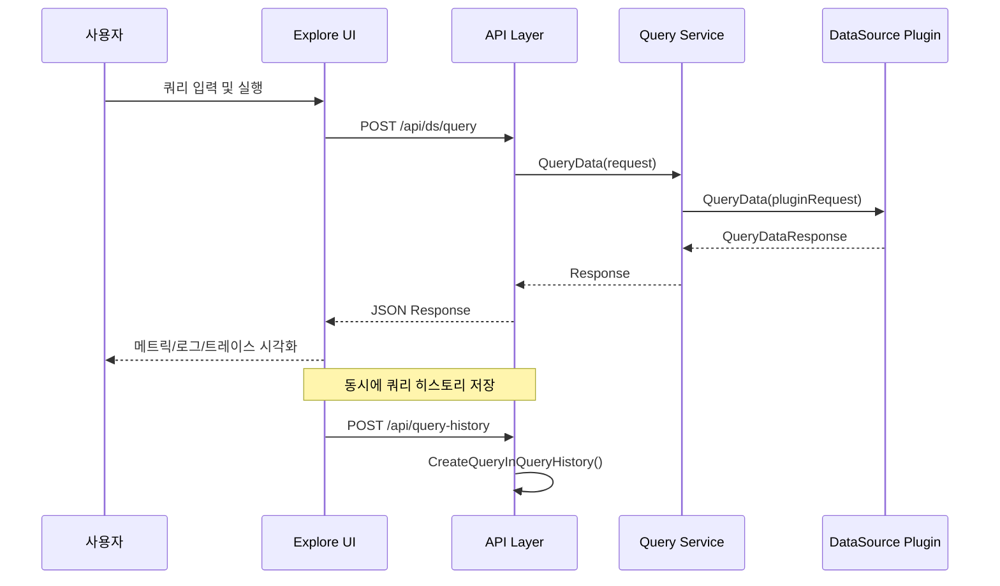

# 19. Grafana Explore 모드 Deep-Dive

## 1. 개요

### Explore란?

Grafana Explore는 대시보드 편집 없이 **즉석(ad-hoc) 쿼리**를 실행하고 메트릭, 로그, 트레이스 데이터를 탐색하기 위한 전용 인터페이스이다. 대시보드가 "정형화된 모니터링"이라면, Explore는 **비정형 디버깅 및 탐색**을 위한 도구다.

### 왜(Why) Explore가 필요한가?

1. **장애 대응 시 빠른 쿼리 실행**: 대시보드를 편집하지 않고 즉시 쿼리를 던져 원인을 파악해야 한다
2. **로그/메트릭/트레이스 통합 탐색**: Prometheus 메트릭에서 이상을 발견하면 Loki 로그로, 다시 Tempo 트레이스로 전환하며 원인을 추적해야 한다
3. **쿼리 히스토리 관리**: 반복적으로 사용하는 쿼리를 저장하고 재사용해야 한다
4. **Split View**: 두 개의 데이터소스를 나란히 비교하며 상관관계를 파악해야 한다

## 2. 아키텍처

### 전체 구조

```
┌─────────────────────────────────────────────────────────┐
│                    Explore UI (React)                     │
│  ┌──────────┐  ┌──────────┐  ┌──────────┐  ┌──────────┐ │
│  │  Query   │  │   Log    │  │  Metric  │  │  Trace   │ │
│  │  Editor  │  │  Viewer  │  │  Graph   │  │  Viewer  │ │
│  └────┬─────┘  └────┬─────┘  └────┬─────┘  └────┬─────┘ │
│       │              │              │              │       │
│  ┌────┴──────────────┴──────────────┴──────────────┴────┐ │
│  │              Explore State Management                 │ │
│  │   (Split View, Query History, Time Range)             │ │
│  └───────────────────────┬───────────────────────────────┘ │
└──────────────────────────┼─────────────────────────────────┘
                           │ HTTP API
┌──────────────────────────┼─────────────────────────────────┐
│                   Grafana Backend                           │
│  ┌───────────────────────┴───────────────────────────────┐ │
│  │                  API Layer (/api)                       │ │
│  │   /api/ds/query  /api/query-history  /api/short-url    │ │
│  └───────┬──────────────┬────────────────┬───────────────┘ │
│          │              │                │                  │
│  ┌───────┴──────┐ ┌─────┴──────┐  ┌─────┴───────┐        │
│  │ Query Service│ │QueryHistory│  │  Short URL   │        │
│  │              │ │  Service   │  │   Service    │        │
│  └───────┬──────┘ └─────┬──────┘  └─────────────┘        │
│          │              │                                  │
│  ┌───────┴──────┐ ┌─────┴──────┐                          │
│  │  DataSource  │ │   SQLite/  │                          │
│  │  Plugins     │ │  Postgres  │                          │
│  └──────────────┘ └────────────┘                          │
└────────────────────────────────────────────────────────────┘
```

### 핵심 컴포넌트

Explore 모드의 백엔드는 크게 세 가지 서비스로 구성된다:

1. **Query Service** (`pkg/services/query/query.go`) - 데이터소스에 쿼리 전달
2. **QueryHistory Service** (`pkg/services/queryhistory/queryhistory.go`) - 쿼리 히스토리 CRUD
3. **API Layer** (`pkg/api/api.go`) - HTTP 엔드포인트 라우팅

## 3. 백엔드 소스코드 분석

### 3.1 Query Service

Explore에서 실행한 쿼리는 대시보드 패널 쿼리와 동일한 경로를 통해 처리된다.

**파일 위치**: `pkg/services/query/query.go`

Query Service는 데이터소스 플러그인에 쿼리를 전달하는 중간 계층이다. 핵심 동작:

1. 요청에서 데이터소스 정보를 추출
2. 적절한 데이터소스 플러그인을 찾아 연결
3. `backend.QueryDataRequest`를 구성하여 플러그인에 전달
4. 응답을 수집하여 반환

### 3.2 QueryHistory Service

**파일 위치**: `pkg/services/queryhistory/queryhistory.go`

```go
// pkg/services/queryhistory/queryhistory.go
type QueryHistoryService struct {
    store         db.DB
    Cfg           *setting.Cfg
    RouteRegister routing.RouteRegister
    log           log.Logger
    now           func() time.Time
    accessControl ac.AccessControl
}
```

QueryHistory Service는 사용자가 Explore에서 실행한 쿼리를 데이터베이스에 저장하고 관리한다.

**Service 인터페이스**:

```go
// pkg/services/queryhistory/queryhistory.go
type Service interface {
    CreateQueryInQueryHistory(ctx context.Context, user *user.SignedInUser, cmd CreateQueryInQueryHistoryCommand) (QueryHistoryDTO, error)
    SearchInQueryHistory(ctx context.Context, user *user.SignedInUser, query SearchInQueryHistoryQuery) (QueryHistorySearchResult, error)
    DeleteQueryFromQueryHistory(ctx context.Context, user *user.SignedInUser, UID string) (int64, error)
    PatchQueryCommentInQueryHistory(ctx context.Context, user *user.SignedInUser, UID string, cmd PatchQueryCommentInQueryHistoryCommand) (QueryHistoryDTO, error)
    StarQueryInQueryHistory(ctx context.Context, user *user.SignedInUser, UID string) (QueryHistoryDTO, error)
    UnstarQueryInQueryHistory(ctx context.Context, user *user.SignedInUser, UID string) (QueryHistoryDTO, error)
    DeleteStaleQueriesInQueryHistory(ctx context.Context, olderThan int64) (int, error)
    EnforceRowLimitInQueryHistory(ctx context.Context, limit int, starredQueries bool) (int, error)
}
```

### 3.3 QueryHistory 데이터 모델

**파일 위치**: `pkg/services/queryhistory/models.go`

```go
// pkg/services/queryhistory/models.go
type QueryHistory struct {
    ID            int64            `xorm:"pk autoincr 'id'"`
    UID           string           `xorm:"uid"`
    DatasourceUID string           `xorm:"datasource_uid"`
    OrgID         int64            `xorm:"org_id"`
    CreatedBy     int64
    CreatedAt     int64
    Comment       string
    Queries       *simplejson.Json
}

type QueryHistoryStar struct {
    ID       int64  `xorm:"pk autoincr 'id'"`
    QueryUID string `xorm:"query_uid"`
    UserID   int64  `xorm:"user_id"`
}
```

**주요 특징**:
- `OrgID` 필드로 조직별 격리 지원
- `CreatedBy` 필드로 사용자별 히스토리 관리
- `Queries` 필드는 JSON 형태로 임의의 쿼리 구조를 저장
- 즐겨찾기(Star) 기능은 별도 테이블(`QueryHistoryStar`)로 관리

### 3.4 검색 쿼리

```go
// pkg/services/queryhistory/models.go
type SearchInQueryHistoryQuery struct {
    DatasourceUIDs []string `json:"datasourceUids"`
    SearchString   string   `json:"searchString"`
    OnlyStarred    bool     `json:"onlyStarred"`
    Sort           string   `json:"sort"`
    Page           int      `json:"page"`
    Limit          int      `json:"limit"`
    From           int64    `json:"from"`
    To             int64    `json:"to"`
}
```

검색은 다음 기준으로 필터링 가능:
- 데이터소스 UID 목록
- 검색 문자열
- 즐겨찾기 여부
- 시간 범위 (From ~ To)
- 정렬 기준
- 페이지네이션

### 3.5 API 라우팅

**파일 위치**: `pkg/api/api.go`

Explore 관련 API 엔드포인트는 `/api/query-history` 하위에 등록된다:

| 엔드포인트 | 메서드 | 설명 |
|-----------|--------|------|
| `/api/query-history` | POST | 쿼리 히스토리 생성 |
| `/api/query-history` | GET | 쿼리 히스토리 검색 |
| `/api/query-history/:uid` | DELETE | 쿼리 히스토리 삭제 |
| `/api/query-history/:uid` | PATCH | 쿼리 코멘트 수정 |
| `/api/query-history/star/:uid` | POST | 쿼리 즐겨찾기 추가 |
| `/api/query-history/star/:uid` | DELETE | 쿼리 즐겨찾기 해제 |

### 3.6 접근 제어

Explore 모드 접근은 RBAC를 통해 제어된다.

**파일 위치**: `pkg/services/accesscontrol/models.go`, `pkg/api/accesscontrol.go`

```
explore 관련 권한:
- explore:read     → Explore 페이지 접근
- datasources:query → 데이터소스 쿼리 실행
```

네비게이션 트리에서의 Explore 메뉴 가시성도 접근 제어에 의해 결정된다.

**파일 위치**: `pkg/services/navtree/navtreeimpl/navtree.go`

## 4. 핵심 동작 흐름

### 4.1 쿼리 실행 흐름



### 4.2 쿼리 히스토리 저장 흐름

```
1. 사용자가 Explore에서 쿼리 실행
2. 프론트엔드가 /api/query-history에 POST 요청
3. QueryHistoryService.createQuery() 호출
4. DB에 QueryHistory 레코드 삽입
   - UID 자동 생성
   - OrgID, CreatedBy 설정
   - Queries JSON 저장
5. 성공 응답 반환
```

### 4.3 Split View 동작

```
┌─────────────────────────────────────────────────┐
│                 Explore Split View               │
│  ┌──────────────────┐  ┌──────────────────────┐  │
│  │   Left Pane       │  │   Right Pane          │  │
│  │                    │  │                        │  │
│  │  DataSource: Prom  │  │  DataSource: Loki      │  │
│  │  Query: rate(...)  │  │  Query: {app="web"}    │  │
│  │                    │  │                        │  │
│  │  ┌──────────────┐ │  │  ┌──────────────────┐  │  │
│  │  │ Metric Graph │ │  │  │  Log Lines        │  │  │
│  │  └──────────────┘ │  │  └──────────────────┘  │  │
│  └──────────────────┘  └──────────────────────┘  │
│                                                   │
│  [Shared Time Range: Last 1 hour]                 │
└───────────────────────────────────────────────────┘
```

Split View의 핵심 설계:
- 각 패인(pane)은 독립적인 데이터소스와 쿼리를 가짐
- 시간 범위는 양쪽 패인이 공유 (동기화)
- URL 파라미터로 양쪽 상태를 직렬화하여 공유 가능

## 5. Short URL 시스템

Explore 쿼리를 공유하기 위한 Short URL 시스템이 내장되어 있다.

**동작 원리**:
1. 현재 Explore 상태 (쿼리, 시간 범위, 데이터소스 등)를 JSON으로 직렬화
2. `/api/short-urls` API를 통해 짧은 URL 생성
3. 생성된 URL로 다른 사용자가 동일한 Explore 상태를 복원

## 6. Feature Toggle 통합

Explore의 일부 기능은 Feature Toggle로 제어된다.

**파일 위치**: `pkg/services/featuremgmt/registry.go`

```go
// Explore 관련 Feature Toggle 예시
// - queryHistoryEnabled: 쿼리 히스토리 기능 활성화
// - explore: Explore 페이지 자체의 활성화
```

설정 파일 (`grafana.ini`)에서:
```ini
[explore]
enabled = true

[query_history]
enabled = true
```

## 7. Correlations (상관관계)

Grafana는 데이터소스 간 상관관계 링크를 지원한다. Explore에서 특히 유용하다:

- 메트릭에서 이상을 발견 -> 관련 로그로 바로 이동
- 로그에서 trace ID 발견 -> Tempo 트레이스로 이동
- 이러한 링크는 `Correlations` 설정으로 미리 정의 가능

## 8. 쿼리 히스토리 관리 정책

### 8.1 오래된 쿼리 삭제

```go
// pkg/services/queryhistory/queryhistory.go
func (s QueryHistoryService) DeleteStaleQueriesInQueryHistory(
    ctx context.Context, olderThan int64,
) (int, error) {
    return s.deleteStaleQueries(ctx, olderThan)
}
```

- `olderThan` 타임스탬프보다 오래된 쿼리를 일괄 삭제
- 크론 작업 또는 관리자 API로 실행 가능

### 8.2 행 수 제한

```go
// pkg/services/queryhistory/queryhistory.go
func (s QueryHistoryService) EnforceRowLimitInQueryHistory(
    ctx context.Context, limit int, starredQueries bool,
) (int, error) {
    return s.enforceQueryHistoryRowLimit(ctx, limit, starredQueries)
}
```

- 총 히스토리 행 수가 `limit`을 초과하면 가장 오래된 것부터 삭제
- `starredQueries`가 true이면 즐겨찾기된 쿼리도 포함하여 제한

## 9. 설정 옵션

| 설정 | 기본값 | 설명 |
|------|--------|------|
| `explore.enabled` | `true` | Explore 모드 활성화 |
| `query_history.enabled` | `true` | 쿼리 히스토리 기능 활성화 |
| `short_url.enabled` | `true` | Short URL 생성 기능 |
| `explore.split` | `true` | Split View 지원 |

## 10. 보안 고려사항

### 10.1 권한 모델

```
Grafana Admin
    └── Org Admin
         └── Org Editor
              └── Org Viewer
                   └── explore:read (Explore 접근 가능 여부)

데이터소스 쿼리 권한:
- datasources:query:uid:* → 모든 데이터소스 쿼리 가능
- datasources:query:uid:ds1 → 특정 데이터소스만 쿼리 가능
```

### 10.2 조직 격리

```
Organization A ──┐
                  ├── query_history.org_id = 1
Organization B ──┤
                  └── query_history.org_id = 2

→ 각 조직의 쿼리 히스토리는 완전히 분리됨
```

## 11. 성능 최적화

### 11.1 쿼리 캐싱

Explore 쿼리도 일반 대시보드 쿼리와 동일한 캐싱 파이프라인을 활용한다:

```
Explore Query → CachingService.HandleQueryRequest() → Cache HIT?
                                                        ├── Yes → 캐시 응답 반환
                                                        └── No  → DataSource 쿼리 실행
                                                                 → 결과 캐싱
                                                                 → 응답 반환
```

### 11.2 Live Tailing

Loki 데이터소스와 함께 사용 시, Explore는 실시간 로그 스트리밍(Live Tailing)을 지원한다:

```
Explore UI ←→ WebSocket ←→ Grafana Backend ←→ Loki
                                              (tail API)
```

## 12. 데이터소스별 Explore 동작

### 12.1 Prometheus (메트릭)

```
┌─────────────────────────────────────────────────┐
│  Explore + Prometheus                            │
│                                                   │
│  쿼리: rate(http_requests_total{status="500"}[5m])│
│                                                   │
│  결과 유형: 시계열 그래프                           │
│  ┌───────────────────────────────────────────┐   │
│  │  ▲                                        │   │
│  │  │    ╭──╮                                │   │
│  │  │   ╱    ╲   ╭──╮                        │   │
│  │  │  ╱      ╲ ╱    ╲                       │   │
│  │  │─╱────────╲──────╲──────────────── Time │   │
│  └───────────────────────────────────────────┘   │
│                                                   │
│  추가 기능:                                       │
│  - Metrics Browser: 메트릭 이름 자동완성           │
│  - Label Browser: 라벨 키/값 탐색                 │
│  - Instant Query: 특정 시점의 값 조회              │
│  - Range Query: 시간 범위 내 시계열 조회            │
│  - Exemplars: 트레이스 연결 데이터 포인트           │
└─────────────────────────────────────────────────┘
```

### 12.2 Loki (로그)

```
┌─────────────────────────────────────────────────┐
│  Explore + Loki                                  │
│                                                   │
│  쿼리: {app="web"} |= "error" | json            │
│                                                   │
│  결과 유형: 로그 라인 + 로그 볼륨 그래프            │
│  ┌───────────────────────────────────────────┐   │
│  │ 볼륨 그래프 (히스토그램)                      │   │
│  │ ██ █ ██ ████ █ ██ █ ███ ██ █             │   │
│  └───────────────────────────────────────────┘   │
│                                                   │
│  2024-01-15 10:23:01 [ERROR] DB connection failed│
│  2024-01-15 10:23:05 [ERROR] Retry attempt 1     │
│  2024-01-15 10:23:09 [ERROR] Retry attempt 2     │
│  2024-01-15 10:23:15 [INFO] Connection restored  │
│                                                   │
│  추가 기능:                                       │
│  - Log Context: 특정 로그 전후 컨텍스트 조회       │
│  - Live Tailing: 실시간 로그 스트리밍              │
│  - Derived Fields: 로그에서 트레이스 ID 추출       │
│  - Log Volume: 시간별 로그 볼륨 시각화             │
└─────────────────────────────────────────────────┘
```

### 12.3 Tempo (트레이스)

```
┌─────────────────────────────────────────────────┐
│  Explore + Tempo                                 │
│                                                   │
│  쿼리: { resource.service.name = "web" }         │
│                                                   │
│  결과 유형: 트레이스 뷰 (Flame Graph / Gantt)     │
│  ┌───────────────────────────────────────────┐   │
│  │ web-service        ███████████████         │   │
│  │  ├── api-handler     ████████              │   │
│  │  │   ├── db-query      ████               │   │
│  │  │   └── cache-lookup   ██                │   │
│  │  └── auth-check        ███                │   │
│  └───────────────────────────────────────────┘   │
│                                                   │
│  추가 기능:                                       │
│  - TraceQL: 트레이스 쿼리 언어                    │
│  - Service Graph: 서비스 의존성 그래프            │
│  - Span Details: 개별 스팬 상세 정보              │
└─────────────────────────────────────────────────┘
```

## 13. Explore와 다른 기능의 연동

### 13.1 알림에서 Explore로

알림이 발생하면 관련 쿼리를 Explore에서 바로 실행할 수 있다:

```
Alert Rule: rate(http_errors[5m]) > 100
    └── Alert 발생
         └── "View in Explore" 버튼
              └── Explore 열림 (동일 쿼리 + 시간 범위)
```

### 13.2 대시보드에서 Explore로

대시보드 패널의 "Explore" 버튼을 클릭하면:

```
Dashboard Panel
    └── 패널 쿼리: sum(rate(http_requests[5m])) by (service)
         └── "Explore" 클릭
              └── Explore 열림
                   - 동일 데이터소스 선택
                   - 동일 쿼리 복사
                   - 동일 시간 범위 적용
```

### 13.3 Mixed Data Source

Explore에서 "Mixed" 데이터소스를 선택하면 여러 데이터소스에 동시에 쿼리할 수 있다:

```
Mixed DataSource Query:
├── Query A (Prometheus): rate(http_requests_total[5m])
├── Query B (Loki): {app="web"} |= "error"
└── Query C (Tempo): { resource.service.name = "web" }

→ 모든 결과가 하나의 Explore 패인에 표시됨
```

## 14. 데이터베이스 스키마

### 14.1 쿼리 히스토리 테이블

```sql
CREATE TABLE query_history (
    id          INTEGER PRIMARY KEY AUTOINCREMENT,
    uid         VARCHAR(40) NOT NULL UNIQUE,
    org_id      BIGINT NOT NULL,
    datasource_uid VARCHAR(40) NOT NULL,
    created_by  BIGINT NOT NULL,
    created_at  BIGINT NOT NULL,
    comment     TEXT,
    queries     TEXT NOT NULL
);

CREATE INDEX idx_query_history_org_id ON query_history(org_id);
CREATE INDEX idx_query_history_created_by ON query_history(created_by);
```

### 14.2 쿼리 히스토리 즐겨찾기 테이블

```sql
CREATE TABLE query_history_star (
    id        INTEGER PRIMARY KEY AUTOINCREMENT,
    query_uid VARCHAR(40) NOT NULL,
    user_id   BIGINT NOT NULL,

    UNIQUE(query_uid, user_id)
);

CREATE INDEX idx_query_history_star_user_id ON query_history_star(user_id);
```

## 15. 운영 가이드

### 15.1 쿼리 히스토리 성능 관리

쿼리 히스토리가 지나치게 커지면 데이터베이스 성능에 영향을 미칠 수 있다. 다음 전략으로 관리:

```
1. 오래된 쿼리 정리 (DeleteStaleQueries)
   - olderThan = 현재 시간 - 90일
   - 크론 작업으로 주기적 실행

2. 행 수 제한 (EnforceRowLimitInQueryHistory)
   - limit = 10000
   - starredQueries = false (즐겨찾기 보호)

3. 모니터링
   - query_history 테이블 행 수 추적
   - 검색 쿼리 응답 시간 모니터링
```

### 15.2 Explore 접근 제어 설정

```ini
# grafana.ini

# Explore 전체 비활성화
[explore]
enabled = false

# RBAC로 세분화된 제어 (grafana.ini가 아닌 API/UI에서 설정)
# - explore:read 권한을 특정 역할에만 부여
# - datasources:query 권한으로 쿼리 가능한 데이터소스 제한
```

### 15.3 문제 해결

| 증상 | 원인 | 해결 방법 |
|------|------|----------|
| Explore 메뉴가 보이지 않음 | explore:read 권한 없음 | 사용자 역할에 Explore 권한 부여 |
| 쿼리 실행 시 403 에러 | datasources:query 권한 없음 | 데이터소스 쿼리 권한 부여 |
| 쿼리 히스토리 저장 안 됨 | query_history.enabled = false | 설정 활성화 |
| 검색 결과 없음 | 다른 Org에서 검색 | 올바른 Org으로 전환 |
| Split View 안 열림 | 기능 비활성화 | explore.split 설정 확인 |

## 16. 정리

| 항목 | 내용 |
|------|------|
| 핵심 목적 | 대시보드 편집 없는 즉석 쿼리 탐색 |
| 주요 서비스 | QueryHistoryService, Query Service |
| 데이터 모델 | QueryHistory, QueryHistoryStar |
| 접근 제어 | RBAC (explore:read, datasources:query) |
| 주요 기능 | Split View, 쿼리 히스토리, 즐겨찾기, Short URL |
| 데이터 격리 | OrgID 기반 조직별 격리 |
| 소스 위치 | `pkg/services/queryhistory/`, `pkg/services/query/` |

Explore 모드는 Grafana의 관측가능성(Observability) 전략에서 핵심적인 위치를 차지한다. 대시보드가 "무엇이 잘못되었는지"를 보여준다면, Explore는 "왜 잘못되었는지"를 찾아가는 도구이다.
