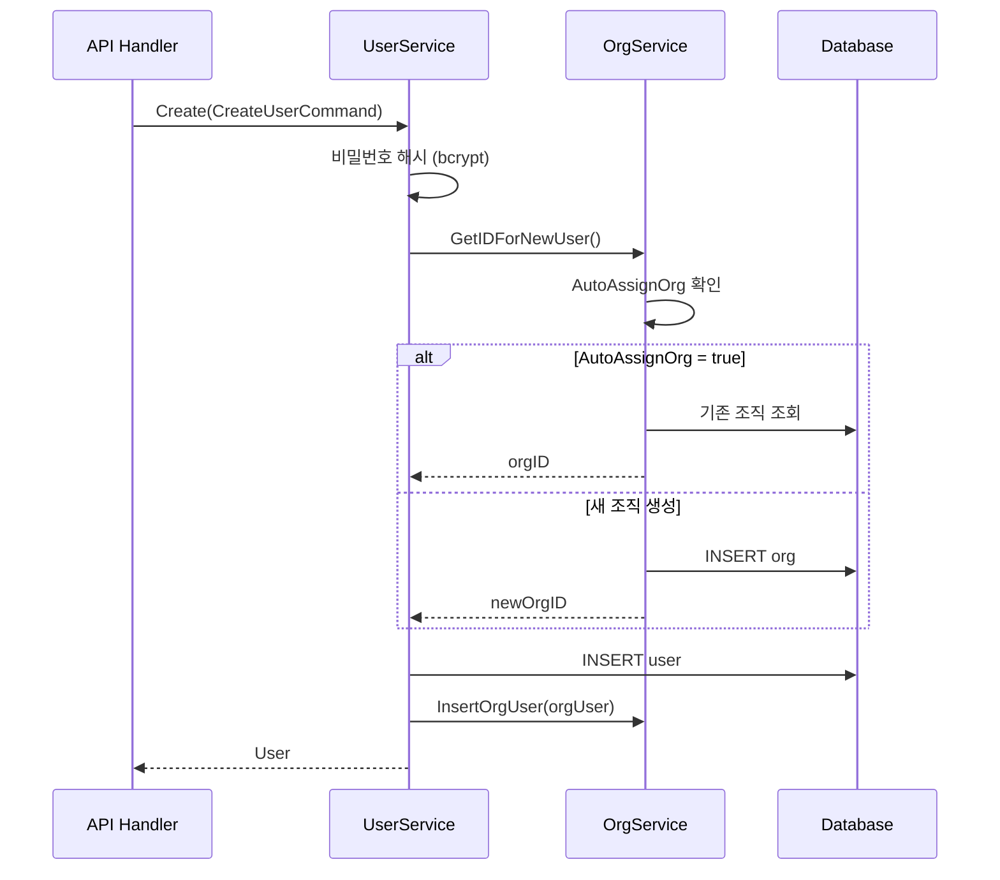
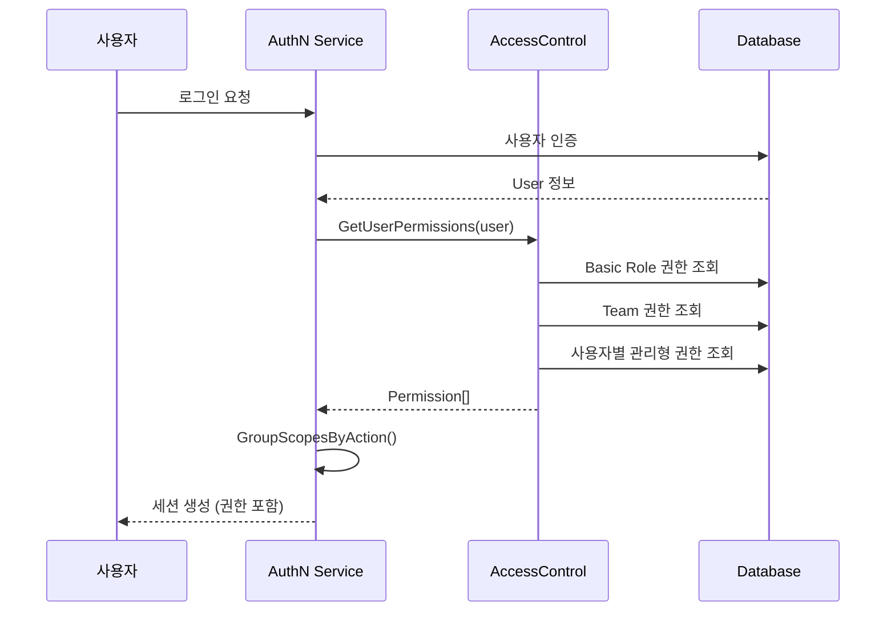

# 20. 사용자/팀/조직 관리 Deep-Dive

## 1. 개요

### 멀티 테넌시란?

Grafana는 **조직(Organization)** 단위의 멀티 테넌시를 지원한다. 하나의 Grafana 인스턴스에서 여러 팀이 서로 격리된 환경을 사용할 수 있으며, 이를 뒷받침하는 3대 구성 요소가 **사용자(User)**, **팀(Team)**, **조직(Organization)**이다.

### 왜(Why) 이 서브시스템이 필요한가?

1. **데이터 격리**: 부서A의 대시보드/데이터소스를 부서B가 접근하면 안 된다
2. **세분화된 권한 관리**: 모든 사용자에게 동일한 권한을 주면 운영 사고 위험이 증가한다
3. **팀 기반 협업**: 개별 사용자가 아닌 팀 단위로 리소스 접근 권한을 관리해야 효율적이다
4. **확장성**: SaaS 환경에서 고객별 격리가 필수적이다

## 2. 3계층 구조

```
┌─────────────────────────────────────────────────────────────┐
│                    Grafana Instance                          │
│                                                              │
│  ┌───────────────────────┐  ┌───────────────────────────┐   │
│  │    Organization 1      │  │    Organization 2          │   │
│  │                         │  │                            │   │
│  │  ┌──────┐  ┌──────┐   │  │  ┌──────┐  ┌──────┐      │   │
│  │  │Team A│  │Team B│   │  │  │Team C│  │Team D│      │   │
│  │  │      │  │      │   │  │  │      │  │      │      │   │
│  │  │User1 │  │User2 │   │  │  │User3 │  │User4 │      │   │
│  │  │User2 │  │User3 │   │  │  │User5 │  │      │      │   │
│  │  └──────┘  └──────┘   │  │  └──────┘  └──────┘      │   │
│  │                         │  │                            │   │
│  │  Dashboards, DS, Alerts│  │  Dashboards, DS, Alerts    │   │
│  └───────────────────────┘  └───────────────────────────┘   │
│                                                              │
│  [Grafana Admin: 전체 인스턴스 관리]                           │
└─────────────────────────────────────────────────────────────┘
```

핵심 관계:
- **사용자**는 여러 **조직**에 속할 수 있다
- **팀**은 하나의 **조직** 내에 존재한다
- **사용자**는 여러 **팀**에 속할 수 있다
- 각 **조직**은 독립적인 대시보드, 데이터소스, 알림 규칙을 가진다

## 3. 사용자(User) 시스템

### 3.1 핵심 데이터 모델

**파일 위치**: `pkg/services/user/model.go`

```go
// pkg/services/user/model.go
type User struct {
    ID            int64  `xorm:"pk autoincr 'id'"`
    UID           string `json:"uid" xorm:"uid"`
    Version       int
    Email         string
    Name          string
    Login         string
    Password      Password
    Salt          string
    Rands         string
    Company       string
    EmailVerified bool
    Theme         string
    HelpFlags1    HelpFlags1 `xorm:"help_flags1"`
    IsDisabled    bool

    IsAdmin          bool
    IsServiceAccount bool
    OrgID            int64 `xorm:"org_id"`

    Created    time.Time
    Updated    time.Time
    LastSeenAt time.Time

    IsProvisioned bool `xorm:"is_provisioned"`
}
```

**주요 필드 분석**:

| 필드 | 설명 |
|------|------|
| `ID` | 내부 자동 증가 ID |
| `UID` | 외부 노출용 고유 식별자 |
| `Login` | 로그인 아이디 (고유) |
| `Password` | bcrypt 해시된 비밀번호 |
| `Salt` | 비밀번호 솔트 |
| `IsAdmin` | Grafana 전체 관리자 여부 |
| `IsServiceAccount` | 서비스 어카운트 여부 |
| `OrgID` | 현재 활성 조직 ID |
| `IsDisabled` | 계정 비활성화 여부 |
| `IsProvisioned` | 프로비저닝으로 생성된 사용자 여부 |

### 3.2 User Service 구현

**파일 위치**: `pkg/services/user/userimpl/user.go`

```go
// pkg/services/user/userimpl/user.go
type Service struct {
    store        store
    orgService   org.Service
    teamService  team.Service
    cacheService *localcache.CacheService
    cfg          *setting.Cfg
    tracer       tracing.Tracer
    db           db.DB
}
```

User Service는 다음 의존성을 가진다:
- `orgService`: 사용자 생성 시 조직 할당
- `teamService`: 사용자 삭제 시 팀 멤버십 정리
- `cacheService`: 사용자 정보 캐싱
- `tracer`: 분산 트레이싱

### 3.3 사용자 생성 흐름

```go
// pkg/services/user/model.go
type CreateUserCommand struct {
    UID              string
    Email            string
    Login            string
    Name             string
    Company          string
    OrgID            int64
    OrgName          string
    Password         Password
    EmailVerified    bool
    IsAdmin          bool
    IsDisabled       bool
    SkipOrgSetup     bool
    DefaultOrgRole   string
    IsServiceAccount bool
    IsProvisioned    bool
}
```



### 3.4 사용자 검색

```go
// pkg/services/user/model.go
type SearchUsersQuery struct {
    SignedInUser identity.Requester
    OrgID        int64 `xorm:"org_id"`
    Query        string
    Page         int
    Limit        int
    AuthModule   string
    SortOpts     []model.SortOption
    Filters      []Filter

    IsDisabled    *bool
    IsProvisioned *bool
}
```

검색 시스템은 **필터 패턴**을 사용한다:

```go
// pkg/services/user/model.go
type Filter interface {
    WhereCondition() *WhereCondition
    InCondition() *InCondition
    JoinCondition() *JoinCondition
}
```

이 패턴 덕분에 다양한 필터 조건을 조합하여 유연한 검색이 가능하다.

## 4. 조직(Organization) 시스템

### 4.1 핵심 데이터 모델

**파일 위치**: `pkg/services/org/model.go`

```go
// pkg/services/org/model.go
type Org struct {
    ID      int64 `xorm:"pk autoincr 'id'"`
    Version int
    Name    string

    Address1 string
    Address2 string
    City     string
    ZipCode  string
    State    string
    Country  string

    Created time.Time
    Updated time.Time
}
```

### 4.2 조직-사용자 관계 (OrgUser)

```go
// pkg/services/org/model.go
type OrgUser struct {
    ID      int64 `xorm:"pk autoincr 'id'"`
    OrgID   int64 `xorm:"org_id"`
    UserID  int64 `xorm:"user_id"`
    Role    RoleType
    Created time.Time
    Updated time.Time
}
```

**역할(Role) 계층**:

```go
// pkg/services/org/model.go
const (
    RoleNone   RoleType = identity.RoleNone
    RoleViewer RoleType = identity.RoleViewer
    RoleEditor RoleType = identity.RoleEditor
    RoleAdmin  RoleType = identity.RoleAdmin
)
```

```
RoleAdmin (관리자)
    └── RoleEditor (편집자)
         └── RoleViewer (조회자)
              └── RoleNone (권한 없음)
```

| 역할 | 대시보드 조회 | 대시보드 편집 | 데이터소스 관리 | 팀/사용자 관리 |
|------|:---:|:---:|:---:|:---:|
| Viewer | O | X | X | X |
| Editor | O | O | X | X |
| Admin | O | O | O | O |

### 4.3 Organization Service

**파일 위치**: `pkg/services/org/org.go`

```go
// pkg/services/org/org.go
type Service interface {
    GetIDForNewUser(context.Context, GetOrgIDForNewUserCommand) (int64, error)
    InsertOrgUser(context.Context, *OrgUser) (int64, error)
    DeleteUserFromAll(context.Context, int64) error
    GetUserOrgList(context.Context, *GetUserOrgListQuery) ([]*UserOrgDTO, error)
    UpdateOrg(context.Context, *UpdateOrgCommand) error
    Search(context.Context, *SearchOrgsQuery) ([]*OrgDTO, error)
    GetByID(context.Context, *GetOrgByIDQuery) (*Org, error)
    GetByName(context.Context, *GetOrgByNameQuery) (*Org, error)
    CreateWithMember(context.Context, *CreateOrgCommand) (*Org, error)
    UpdateAddress(context.Context, *UpdateOrgAddressCommand) error
    GetOrCreate(context.Context, string) (int64, error)
    AddOrgUser(context.Context, *AddOrgUserCommand) error
    UpdateOrgUser(context.Context, *UpdateOrgUserCommand) error
    RemoveOrgUser(context.Context, *RemoveOrgUserCommand) error
    GetOrgUsers(context.Context, *GetOrgUsersQuery) ([]*OrgUserDTO, error)
    SearchOrgUsers(context.Context, *SearchOrgUsersQuery) (*SearchOrgUsersQueryResult, error)
    RegisterDelete(query string)
}
```

### 4.4 자동 조직 할당

**파일 위치**: `pkg/services/org/orgimpl/org.go`

```go
// pkg/services/org/orgimpl/org.go
func (s *Service) GetIDForNewUser(ctx context.Context, cmd org.GetOrgIDForNewUserCommand) (int64, error) {
    // ...
    if s.cfg.AutoAssignOrg && cmd.OrgID != 0 {
        _, err := s.store.Get(ctx, cmd.OrgID)
        if err != nil {
            return -1, err
        }
        return cmd.OrgID, nil
    }
    // ...
    if s.cfg.AutoAssignOrg {
        orga, err := s.store.Get(ctx, int64(s.cfg.AutoAssignOrgId))
        // ...
    }
}
```

설정 파일에서 제어:
```ini
[users]
auto_assign_org = true
auto_assign_org_id = 1
auto_assign_org_role = Viewer
```

## 5. 팀(Team) 시스템

### 5.1 핵심 데이터 모델

**파일 위치**: `pkg/services/team/model.go`

```go
// pkg/services/team/model.go
type Team struct {
    ID            int64  `json:"id" xorm:"pk autoincr 'id'"`
    UID           string `json:"uid" xorm:"uid"`
    OrgID         int64  `json:"orgId" xorm:"org_id"`
    Name          string `json:"name"`
    Email         string `json:"email"`
    ExternalUID   string `json:"externalUID" xorm:"external_uid"`
    IsProvisioned bool   `json:"isProvisioned" xorm:"is_provisioned"`

    Created time.Time `json:"created"`
    Updated time.Time `json:"updated"`
}
```

### 5.2 팀 멤버십

```go
// pkg/services/team/model.go
type TeamMember struct {
    ID         int64  `xorm:"pk autoincr 'id'"`
    UID        string `xorm:"uid"`
    OrgID      int64  `xorm:"org_id"`
    TeamID     int64  `xorm:"team_id"`
    UserID     int64  `xorm:"user_id"`
    External   bool   // LDAP 등 외부 시스템에서 동기화된 멤버십
    Permission PermissionType

    Created time.Time
    Updated time.Time
}

type PermissionType int

const (
    PermissionTypeMember PermissionType = 0
    PermissionTypeAdmin  PermissionType = 4
)
```

### 5.3 Team Service

**파일 위치**: `pkg/services/team/team.go`

```go
// pkg/services/team/team.go
type Service interface {
    CreateTeam(ctx context.Context, cmd *CreateTeamCommand) (Team, error)
    UpdateTeam(ctx context.Context, cmd *UpdateTeamCommand) error
    DeleteTeam(ctx context.Context, cmd *DeleteTeamCommand) error
    SearchTeams(ctx context.Context, query *SearchTeamsQuery) (SearchTeamQueryResult, error)
    GetTeamByID(ctx context.Context, query *GetTeamByIDQuery) (*TeamDTO, error)
    GetTeamsByUser(ctx context.Context, query *GetTeamsByUserQuery) ([]*TeamDTO, error)
    GetTeamIDsByUser(ctx context.Context, query *GetTeamIDsByUserQuery) ([]int64, error)
    IsTeamMember(ctx context.Context, orgId int64, teamId int64, userId int64) (bool, error)
    RemoveUsersMemberships(tx context.Context, userID int64) error
    GetUserTeamMemberships(ctx context.Context, orgID, userID int64, external bool, bypassCache bool) ([]*TeamMemberDTO, error)
    GetTeamMembers(ctx context.Context, query *GetTeamMembersQuery) ([]*TeamMemberDTO, error)
    RegisterDelete(query string)
}
```

### 5.4 UID 리졸버 미들웨어

**파일 위치**: `pkg/services/team/team.go`

```go
// pkg/services/team/team.go
func MiddlewareTeamUIDResolver(teamService Service, paramName string) web.Handler {
    handler := UIDToIDHandler(teamService)

    return func(c *contextmodel.ReqContext) {
        teamIDorUID := web.Params(c.Req)[paramName]
        id, err := handler(c.Req.Context(), c.OrgID, teamIDorUID)
        if err == nil {
            gotParams := web.Params(c.Req)
            gotParams[paramName] = id
            web.SetURLParams(c.Req, gotParams)
        }
    }
}
```

이 미들웨어의 역할:
- API 요청에서 팀 UID(문자열)를 받으면 내부 ID(정수)로 변환
- 하위 핸들러는 항상 ID로 작업 가능
- UID/ID 모두 지원하여 하위 호환성 유지

## 6. RBAC (Role-Based Access Control)

### 6.1 권한 모델

**파일 위치**: `pkg/services/accesscontrol/models.go`

```go
// pkg/services/accesscontrol/models.go
type Role struct {
    ID          int64  `json:"-" xorm:"pk autoincr 'id'"`
    OrgID       int64  `json:"-" xorm:"org_id"`
    Version     int64  `json:"version"`
    UID         string `xorm:"uid" json:"uid"`
    Name        string `json:"name"`
    DisplayName string `json:"displayName,omitempty"`
    Group       string `xorm:"group_name" json:"group"`
    Description string `json:"description"`
    Hidden      bool   `json:"hidden"`
    Updated     time.Time `json:"updated"`
    Created     time.Time `json:"created"`
}
```

### 6.2 권한 평가

**파일 위치**: `pkg/services/accesscontrol/accesscontrol.go`

```go
// pkg/services/accesscontrol/accesscontrol.go
type AccessControl interface {
    Evaluate(ctx context.Context, user identity.Requester, evaluator Evaluator) (bool, error)
    RegisterScopeAttributeResolver(prefix string, resolver ScopeAttributeResolver)
    WithoutResolvers() AccessControl
    InvalidateResolverCache(orgID int64, scope string)
}
```

### 6.3 역할 유형

```go
// pkg/services/accesscontrol/models.go
// 역할 이름 접두사로 유형 구분
func (r *RoleDTO) IsFixed() bool {
    return strings.HasPrefix(r.Name, FixedRolePrefix)    // "fixed:"
}
func (r *RoleDTO) IsBasic() bool {
    return strings.HasPrefix(r.Name, BasicRolePrefix)    // "basic:"
}
func (r *RoleDTO) IsManaged() bool {
    return strings.HasPrefix(r.Name, ManagedRolePrefix)  // "managed:"
}
func (r *RoleDTO) IsPlugin() bool {
    return strings.HasPrefix(r.Name, PluginRolePrefix)   // "plugins:"
}
```

| 역할 유형 | 접두사 | 설명 |
|----------|--------|------|
| Fixed | `fixed:` | Grafana 코어에서 정의, 수정 불가 |
| Basic | `basic:` | Viewer/Editor/Admin 기본 역할 |
| Managed | `managed:` | 사용자/팀별 관리형 역할 |
| Plugin | `plugins:` | 플러그인에서 정의한 역할 |

### 6.4 Permission 구조

```
Permission = Action + Scope

예시:
- Action: "dashboards:read"
  Scope: "dashboards:uid:abc123"
  → 특정 대시보드 읽기 권한

- Action: "datasources:query"
  Scope: "datasources:uid:*"
  → 모든 데이터소스 쿼리 권한

- Action: "teams:write"
  Scope: "teams:id:5"
  → 특정 팀 수정 권한
```

### 6.5 역할 관리 함수

```go
// pkg/services/accesscontrol/accesscontrol.go
func ManagedUserRoleName(userID int64) string {
    return fmt.Sprintf("managed:users:%d:permissions", userID)
}

func ManagedTeamRoleName(teamID int64) string {
    return fmt.Sprintf("managed:teams:%d:permissions", teamID)
}

func ManagedBuiltInRoleName(builtInRole string) string {
    return fmt.Sprintf("managed:builtins:%s:permissions", strings.ToLower(builtInRole))
}
```

## 7. 전체 데이터 흐름

### 7.1 사용자 인증 후 권한 로딩



### 7.2 리소스 접근 시 권한 확인

```
HTTP 요청 → 미들웨어 체인:

1. AuthN 미들웨어: 사용자 인증
2. OrgID 설정: 현재 조직 컨텍스트 결정
3. RBAC 미들웨어: 권한 확인
   → Evaluator.Evaluate(user, requiredPermission)
   → true: 다음 핸들러로 진행
   → false: 403 Forbidden 반환
4. 비즈니스 로직 핸들러
```

## 8. 조직 격리 패턴

### 8.1 데이터 격리

```
┌─────────────────────────────────────────────┐
│              Database Tables                 │
│                                              │
│  dashboard:    [..., org_id, ...]            │
│  data_source:  [..., org_id, ...]            │
│  alert_rule:   [..., org_id, ...]            │
│  team:         [..., org_id, ...]            │
│  query_history:[..., org_id, ...]            │
│                                              │
│  → 모든 쿼리에 WHERE org_id = ? 조건 추가    │
└─────────────────────────────────────────────┘
```

### 8.2 조직 전환

한 사용자가 여러 조직에 속할 때:

```go
// pkg/services/org/model.go
type GetUserOrgListQuery struct {
    UserID int64 `xorm:"user_id"`
}

type UserOrgDTO struct {
    OrgID int64    `json:"orgId" xorm:"org_id"`
    Name  string   `json:"name"`
    Role  RoleType `json:"role"`
}
```

사용자가 조직을 전환하면:
1. `User.OrgID`가 업데이트됨
2. 해당 조직에서의 역할(`OrgUser.Role`)이 세션에 반영됨
3. 이후 모든 API 호출은 새 `OrgID` 기준으로 데이터를 필터링

## 9. 서비스 어카운트

```go
// pkg/services/user/model.go
type User struct {
    // ...
    IsServiceAccount bool
    // ...
}
```

서비스 어카운트는:
- `IsServiceAccount = true`인 특수한 User
- API 토큰으로만 인증 (비밀번호 로그인 불가)
- CI/CD, 자동화 도구에서 Grafana API 호출 시 사용
- 일반 사용자와 동일한 RBAC 권한 모델 적용

## 10. 쿼타(Quota) 관리

**파일 위치**: `pkg/services/org/orgimpl/org.go`

```go
// pkg/services/org/orgimpl/org.go
func ProvideService(db db.DB, cfg *setting.Cfg, quotaService quota.Service) (org.Service, error) {
    // ...
    if err := quotaService.RegisterQuotaReporter(&quota.NewUsageReporter{
        TargetSrv:     quota.TargetSrv(org.QuotaTargetSrv),
        DefaultLimits: defaultLimits,
        Reporter:      s.Usage,
    }); err != nil {
        return s, nil
    }
    return s, nil
}
```

```go
// pkg/services/org/model.go
const (
    QuotaTargetSrv     string = "org"
    OrgQuotaTarget     string = "org"
    OrgUserQuotaTarget string = "org_user"
)
```

쿼타 시스템은:
- 전체 조직 수 제한 (`org` 쿼타)
- 조직당 사용자 수 제한 (`org_user` 쿼타)
- 사용자 총 수 제한 (`user` 쿼타)

## 11. 설정 옵션

```ini
[users]
# 새 사용자의 자동 조직 할당 활성화
auto_assign_org = true
# 자동 할당 대상 조직 ID
auto_assign_org_id = 1
# 자동 할당 시 부여할 기본 역할
auto_assign_org_role = Viewer
# 사용자 가입 허용
allow_sign_up = false
# 조직 생성 허용
allow_org_create = false

[auth]
# 비활성화 사용자 로그인 차단
disable_login_form = false

[quota]
enabled = true
org_user = 100    # 조직당 최대 사용자 수
org = 10          # 최대 조직 수
```

## 12. 보안 고려사항

### 12.1 비밀번호 보안

```go
// pkg/services/user/model.go
// Password 타입은 bcrypt 해시를 사용한다
type ChangeUserPasswordCommand struct {
    OldPassword Password `json:"oldPassword"`
    NewPassword Password `json:"newPassword"`
}
```

### 12.2 Last Admin 보호

```go
// pkg/services/org/model.go
var ErrLastOrgAdmin = errors.New("cannot remove last organization admin")

// pkg/services/team/model.go
var ErrLastTeamAdmin = errors.New("not allowed to remove last admin")
```

마지막 관리자를 삭제/권한 변경할 수 없도록 보호한다. 이는 조직이나 팀이 관리 불가능한 상태에 빠지는 것을 방지한다.

### 12.3 외부 동기화 보호

```go
// pkg/services/org/model.go
var ErrCannotChangeRoleForExternallySyncedUser = errutil.Forbidden(
    "org.externallySynced",
    errutil.WithPublicMessage("cannot change role for externally synced user"),
)
```

LDAP/SAML 등 외부 시스템에서 동기화된 사용자의 역할은 Grafana 내에서 변경할 수 없다.

## 13. 정리

| 항목 | 내용 |
|------|------|
| User 모델 | `pkg/services/user/model.go` |
| User Service | `pkg/services/user/userimpl/user.go` |
| Org 모델 | `pkg/services/org/model.go` |
| Org Service | `pkg/services/org/orgimpl/org.go` |
| Team 모델 | `pkg/services/team/model.go` |
| Team Service | `pkg/services/team/team.go` |
| RBAC | `pkg/services/accesscontrol/accesscontrol.go` |
| 역할 유형 | None, Viewer, Editor, Admin |
| 격리 단위 | Organization (org_id) |
| 쿼타 | org, org_user, user |
| 외부 동기화 | LDAP, SAML, OAuth 지원 |

Grafana의 멀티 테넌시 설계는 "조직" 중심으로 구축되어 있으며, 이는 모든 리소스 테이블에 `org_id` 컬럼을 추가하는 심플하지만 효과적인 패턴을 사용한다. RBAC는 이 위에 세분화된 권한 제어를 더하여 엔터프라이즈 수준의 접근 제어를 제공한다.
